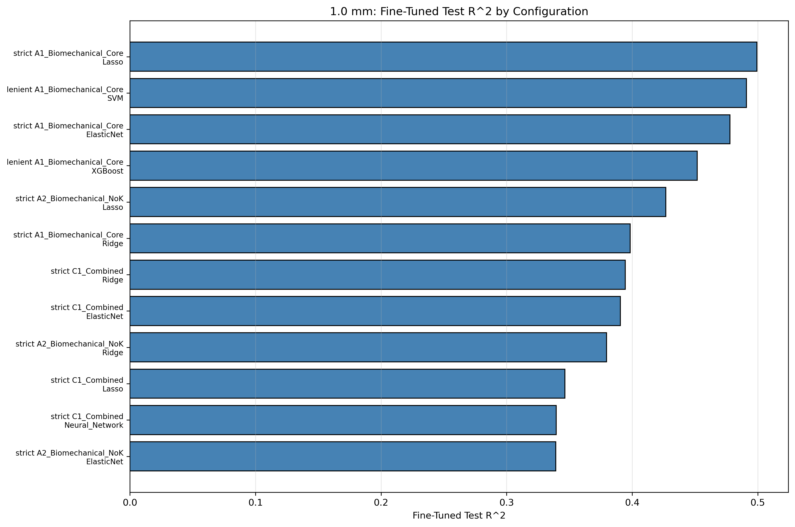
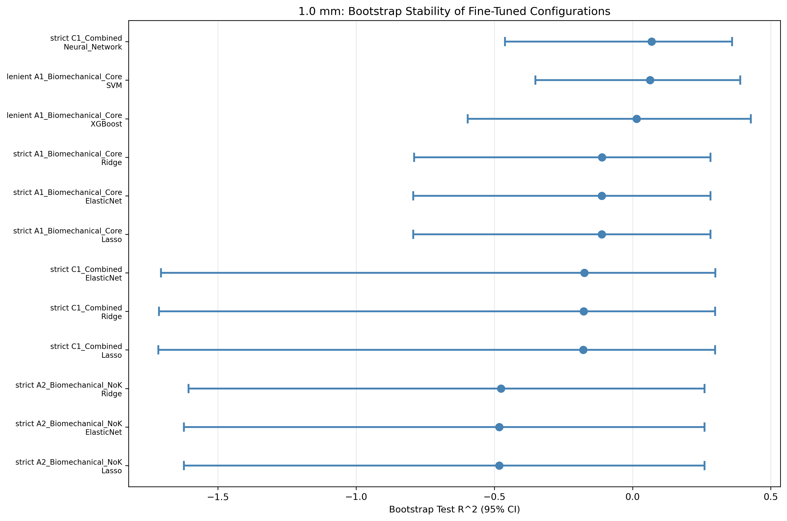
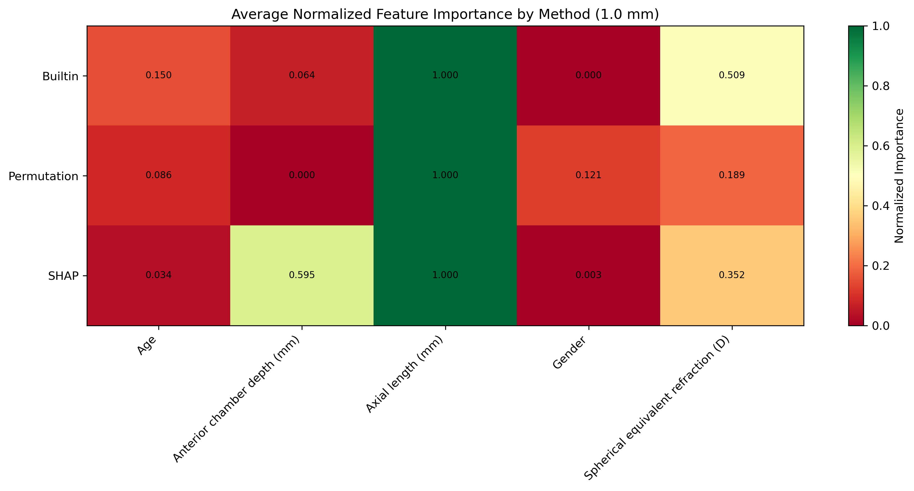

# SR0530 1.0 mm 最终精细调优与特征重要性报告

> **目标**：在 ≥1 象限平均策略下，对 1.0 mm 偏心率的全部模型/方案组合进行精细参数寻优、稳定性评估与特征重要性分析。

> **方法**：GroupKFold by Subject（5 折），精细搜索 50 组参数，Bootstrap 重复 50 次评估稳定性。

---

## 一、总体最佳配置

- **数据组**：strict
- **方案**：C1_Combined
- **模型**：Neural_Network
- **Fine Test R^2**：0.340 [95% CI: 0.259, 0.420]
- **Bootstrap R^2**：0.069 ± 0.239 [95% CI: -0.461, 0.360]
- **Train R^2 / Gap**：0.601 / 0.261
- **MAPE / RMSE**：10.31% / 472.9 [95% CI: 358.0, 587.8]
- **样本量**：69 眼 / 44 subjects
- **最佳参数**：`{'hidden_layer_sizes': (120, 60), 'alpha': 2.0, 'learning_rate_init': 0.00075}`

## 二、全部配置精细调优结果

| 数据组 | 方案 | 模型 | Coarse R^2 | Fine R^2 (95% CI) | Train R^2 | Gap | MAPE | RMSE (95% CI) | Bootstrap R^2 Mean±Std | Bootstrap 95% CI |
|--------|------|------|-----------|-------------------|----------|-----|------|----------------|------------------------|------------------|
| strict | A1_Biomechanical_Core | Lasso | 0.499 | 0.499 [0.292, 0.707] | 0.552 | 0.053 | 8.51 | 391.2 [271.5, 510.8] | -0.111 ± 0.316 | [-0.794, 0.281] |
| strict | A1_Biomechanical_Core | Ridge | 0.499 | 0.398 [0.160, 0.637] | 0.517 | 0.118 | 9.79 | 437.3 [337.6, 537.1] | -0.110 ± 0.315 | [-0.790, 0.282] |
| strict | A2_Biomechanical_NoK | Ridge | 0.492 | 0.380 [0.046, 0.713] | 0.619 | 0.239 | 10.48 | 501.8 [254.6, 748.9] | -0.476 ± 0.589 | [-1.606, 0.260] |
| strict | A2_Biomechanical_NoK | Lasso | 0.491 | 0.427 [0.268, 0.586] | 0.557 | 0.130 | 9.47 | 437.5 [326.0, 549.0] | -0.483 ± 0.596 | [-1.623, 0.261] |
| strict | A1_Biomechanical_Core | ElasticNet | 0.476 | 0.478 [0.224, 0.732] | 0.563 | 0.085 | 10.15 | 434.4 [252.0, 616.8] | -0.111 ± 0.316 | [-0.794, 0.281] |
| strict | C1_Combined | ElasticNet | 0.467 | 0.391 [0.054, 0.728] | 0.560 | 0.169 | 10.58 | 483.5 [334.3, 632.8] | -0.174 ± 0.504 | [-1.706, 0.299] |
| strict | C1_Combined | Ridge | 0.467 | 0.394 [0.164, 0.625] | 0.646 | 0.251 | 10.27 | 489.5 [387.1, 591.9] | -0.177 ± 0.507 | [-1.713, 0.299] |
| strict | C1_Combined | Lasso | 0.467 | 0.346 [-0.073, 0.766] | 0.596 | 0.250 | 8.72 | 388.4 [315.4, 461.3] | -0.178 ± 0.508 | [-1.716, 0.299] |
| lenient | A1_Biomechanical_Core | SVM | 0.458 | 0.491 [0.307, 0.675] | 0.657 | 0.165 | 10.18 | 530.0 [235.0, 825.1] | 0.063 ± 0.205 | [-0.351, 0.390] |
| strict | C1_Combined | Neural_Network | 0.457 | 0.340 [0.259, 0.420] | 0.601 | 0.261 | 10.31 | 472.9 [358.0, 587.8] | 0.069 ± 0.239 | [-0.461, 0.360] |
| strict | A2_Biomechanical_NoK | ElasticNet | 0.453 | 0.339 [0.056, 0.622] | 0.495 | 0.156 | 12.13 | 551.9 [288.6, 815.2] | -0.483 ± 0.596 | [-1.623, 0.261] |
| lenient | A1_Biomechanical_Core | XGBoost | 0.451 | 0.452 [0.179, 0.725] | 0.877 | 0.425 | 11.92 | 562.7 [466.9, 658.6] | 0.014 ± 0.242 | [-0.596, 0.428] |

## 三、特征重要性汇总

| 数据组 | 方案 | 模型 | 方法 | 排名 | 特征 | 重要性 |
|--------|------|------|------|------|------|--------|
| lenient | A1_Biomechanical_Core | SVM | Permutation | 1 | Axial length (mm) | 0.9053 |
| lenient | A1_Biomechanical_Core | SVM | Permutation | 2 | Age | -0.0304 |
| lenient | A1_Biomechanical_Core | SVM | Permutation | 3 | Gender | -0.0569 |
| lenient | A1_Biomechanical_Core | SVM | SHAP | 1 | Axial length (mm) | 417.4223 |
| lenient | A1_Biomechanical_Core | SVM | SHAP | 2 | Age | 106.6150 |
| lenient | A1_Biomechanical_Core | SVM | SHAP | 3 | Gender | 76.7928 |
| lenient | A1_Biomechanical_Core | XGBoost | Builtin | 1 | Axial length (mm) | 0.7097 |
| lenient | A1_Biomechanical_Core | XGBoost | Builtin | 2 | Age | 0.2903 |
| lenient | A1_Biomechanical_Core | XGBoost | Builtin | 3 | Gender | 0.0000 |
| lenient | A1_Biomechanical_Core | XGBoost | Permutation | 1 | Axial length (mm) | 1.0758 |
| lenient | A1_Biomechanical_Core | XGBoost | Permutation | 2 | Age | 0.0688 |
| lenient | A1_Biomechanical_Core | XGBoost | Permutation | 3 | Gender | -0.0123 |
| lenient | A1_Biomechanical_Core | XGBoost | SHAP | 1 | Axial length (mm) | 478.6986 |
| lenient | A1_Biomechanical_Core | XGBoost | SHAP | 2 | Age | 135.3012 |
| lenient | A1_Biomechanical_Core | XGBoost | SHAP | 3 | Gender | 12.7485 |
| strict | A1_Biomechanical_Core | ElasticNet | Builtin | 1 | Axial length (mm) | 429.8772 |
| strict | A1_Biomechanical_Core | ElasticNet | Builtin | 2 | Age | 52.0788 |
| strict | A1_Biomechanical_Core | ElasticNet | Builtin | 3 | Gender | 9.9653 |
| strict | A1_Biomechanical_Core | ElasticNet | Permutation | 1 | Axial length (mm) | 0.8419 |
| strict | A1_Biomechanical_Core | ElasticNet | Permutation | 2 | Gender | -0.0043 |
| strict | A1_Biomechanical_Core | ElasticNet | Permutation | 3 | Age | -0.0354 |
| strict | A1_Biomechanical_Core | ElasticNet | SHAP | 1 | Axial length (mm) | 284.9775 |
| strict | A1_Biomechanical_Core | ElasticNet | SHAP | 2 | Gender | 22.2928 |
| strict | A1_Biomechanical_Core | ElasticNet | SHAP | 3 | Age | 20.8386 |
| strict | A1_Biomechanical_Core | Lasso | Builtin | 1 | Axial length (mm) | 429.8995 |
| strict | A1_Biomechanical_Core | Lasso | Builtin | 2 | Age | 52.0860 |
| strict | A1_Biomechanical_Core | Lasso | Builtin | 3 | Gender | 9.9648 |
| strict | A1_Biomechanical_Core | Lasso | Permutation | 1 | Axial length (mm) | 0.8420 |
| strict | A1_Biomechanical_Core | Lasso | Permutation | 2 | Gender | -0.0043 |
| strict | A1_Biomechanical_Core | Lasso | Permutation | 3 | Age | -0.0354 |
| strict | A1_Biomechanical_Core | Lasso | SHAP | 1 | Axial length (mm) | 284.9933 |
| strict | A1_Biomechanical_Core | Lasso | SHAP | 2 | Gender | 22.2940 |
| strict | A1_Biomechanical_Core | Lasso | SHAP | 3 | Age | 20.8378 |
| strict | A1_Biomechanical_Core | Ridge | Builtin | 1 | Axial length (mm) | 429.3890 |
| strict | A1_Biomechanical_Core | Ridge | Builtin | 2 | Age | 51.9049 |
| strict | A1_Biomechanical_Core | Ridge | Builtin | 3 | Gender | 9.9583 |
| strict | A1_Biomechanical_Core | Ridge | Permutation | 1 | Axial length (mm) | 0.8405 |
| strict | A1_Biomechanical_Core | Ridge | Permutation | 2 | Gender | -0.0042 |
| strict | A1_Biomechanical_Core | Ridge | Permutation | 3 | Age | -0.0355 |
| strict | A1_Biomechanical_Core | Ridge | SHAP | 1 | Axial length (mm) | 284.5429 |
| strict | A1_Biomechanical_Core | Ridge | SHAP | 2 | Gender | 22.2353 |
| strict | A1_Biomechanical_Core | Ridge | SHAP | 3 | Age | 20.8391 |
| strict | A2_Biomechanical_NoK | ElasticNet | Builtin | 1 | Axial length (mm) | 431.3657 |
| strict | A2_Biomechanical_NoK | ElasticNet | Builtin | 2 | Age | 63.4343 |
| strict | A2_Biomechanical_NoK | ElasticNet | Builtin | 3 | Anterior chamber depth (mm) | 42.2760 |
| strict | A2_Biomechanical_NoK | ElasticNet | Builtin | 4 | Gender | 15.7245 |
| strict | A2_Biomechanical_NoK | ElasticNet | Permutation | 1 | Axial length (mm) | 1.0517 |
| strict | A2_Biomechanical_NoK | ElasticNet | Permutation | 2 | Age | -0.0194 |
| strict | A2_Biomechanical_NoK | ElasticNet | Permutation | 3 | Gender | -0.0550 |
| strict | A2_Biomechanical_NoK | ElasticNet | Permutation | 4 | Anterior chamber depth (mm) | -0.4490 |
| strict | A2_Biomechanical_NoK | ElasticNet | SHAP | 1 | Axial length (mm) | 278.4598 |
| strict | A2_Biomechanical_NoK | ElasticNet | SHAP | 2 | Anterior chamber depth (mm) | 180.6723 |
| strict | A2_Biomechanical_NoK | ElasticNet | SHAP | 3 | Age | 37.6404 |
| strict | A2_Biomechanical_NoK | ElasticNet | SHAP | 4 | Gender | 37.0826 |
| strict | A2_Biomechanical_NoK | Lasso | Builtin | 1 | Axial length (mm) | 431.3732 |
| strict | A2_Biomechanical_NoK | Lasso | Builtin | 2 | Age | 63.4320 |
| strict | A2_Biomechanical_NoK | Lasso | Builtin | 3 | Anterior chamber depth (mm) | 42.2707 |
| strict | A2_Biomechanical_NoK | Lasso | Builtin | 4 | Gender | 15.7194 |
| strict | A2_Biomechanical_NoK | Lasso | Permutation | 1 | Axial length (mm) | 1.0517 |
| strict | A2_Biomechanical_NoK | Lasso | Permutation | 2 | Age | -0.0194 |
| strict | A2_Biomechanical_NoK | Lasso | Permutation | 3 | Gender | -0.0550 |
| strict | A2_Biomechanical_NoK | Lasso | Permutation | 4 | Anterior chamber depth (mm) | -0.4490 |
| strict | A2_Biomechanical_NoK | Lasso | SHAP | 1 | Axial length (mm) | 278.4651 |
| strict | A2_Biomechanical_NoK | Lasso | SHAP | 2 | Anterior chamber depth (mm) | 180.6710 |
| strict | A2_Biomechanical_NoK | Lasso | SHAP | 3 | Age | 37.6380 |
| strict | A2_Biomechanical_NoK | Lasso | SHAP | 4 | Gender | 37.0793 |
| strict | A2_Biomechanical_NoK | Ridge | Builtin | 1 | Axial length (mm) | 429.9966 |
| strict | A2_Biomechanical_NoK | Ridge | Builtin | 2 | Age | 62.8557 |
| strict | A2_Biomechanical_NoK | Ridge | Builtin | 3 | Anterior chamber depth (mm) | 42.0360 |
| strict | A2_Biomechanical_NoK | Ridge | Builtin | 4 | Gender | 15.6575 |
| strict | A2_Biomechanical_NoK | Ridge | Permutation | 1 | Axial length (mm) | 1.0458 |
| strict | A2_Biomechanical_NoK | Ridge | Permutation | 2 | Age | -0.0199 |
| strict | A2_Biomechanical_NoK | Ridge | Permutation | 3 | Gender | -0.0539 |
| strict | A2_Biomechanical_NoK | Ridge | Permutation | 4 | Anterior chamber depth (mm) | -0.4461 |
| strict | A2_Biomechanical_NoK | Ridge | SHAP | 1 | Axial length (mm) | 277.3107 |
| strict | A2_Biomechanical_NoK | Ridge | SHAP | 2 | Anterior chamber depth (mm) | 179.5462 |
| strict | A2_Biomechanical_NoK | Ridge | SHAP | 3 | Age | 37.1329 |
| strict | A2_Biomechanical_NoK | Ridge | SHAP | 4 | Gender | 36.6425 |
| strict | C1_Combined | ElasticNet | Builtin | 1 | Axial length (mm) | 378.4319 |
| strict | C1_Combined | ElasticNet | Builtin | 2 | Spherical equivalent refraction (D) | 195.1238 |
| strict | C1_Combined | ElasticNet | Builtin | 3 | Age | 60.4927 |
| strict | C1_Combined | ElasticNet | Builtin | 4 | Gender | 5.0273 |
| strict | C1_Combined | ElasticNet | Permutation | 1 | Axial length (mm) | 0.6503 |
| strict | C1_Combined | ElasticNet | Permutation | 2 | Gender | -0.0150 |
| strict | C1_Combined | ElasticNet | Permutation | 3 | Age | -0.0339 |
| strict | C1_Combined | ElasticNet | Permutation | 4 | Spherical equivalent refraction (D) | -0.0493 |
| strict | C1_Combined | ElasticNet | SHAP | 1 | Axial length (mm) | 287.7965 |
| strict | C1_Combined | ElasticNet | SHAP | 2 | Spherical equivalent refraction (D) | 103.7631 |
| strict | C1_Combined | ElasticNet | SHAP | 3 | Gender | 27.4952 |
| strict | C1_Combined | ElasticNet | SHAP | 4 | Age | 25.9140 |
| strict | C1_Combined | Lasso | Builtin | 1 | Axial length (mm) | 378.7828 |
| strict | C1_Combined | Lasso | Builtin | 2 | Spherical equivalent refraction (D) | 195.2202 |
| strict | C1_Combined | Lasso | Builtin | 3 | Age | 60.6440 |
| strict | C1_Combined | Lasso | Builtin | 4 | Gender | 5.0418 |
| strict | C1_Combined | Lasso | Permutation | 1 | Axial length (mm) | 0.6497 |
| strict | C1_Combined | Lasso | Permutation | 2 | Gender | -0.0152 |
| strict | C1_Combined | Lasso | Permutation | 3 | Age | -0.0337 |
| strict | C1_Combined | Lasso | Permutation | 4 | Spherical equivalent refraction (D) | -0.0510 |
| strict | C1_Combined | Lasso | SHAP | 1 | Axial length (mm) | 288.3315 |
| strict | C1_Combined | Lasso | SHAP | 2 | Spherical equivalent refraction (D) | 104.0326 |
| strict | C1_Combined | Lasso | SHAP | 3 | Gender | 27.5988 |
| strict | C1_Combined | Lasso | SHAP | 4 | Age | 25.9722 |
| strict | C1_Combined | Neural_Network | Permutation | 1 | Axial length (mm) | 0.0006 |
| strict | C1_Combined | Neural_Network | Permutation | 2 | Spherical equivalent refraction (D) | 0.0003 |
| strict | C1_Combined | Neural_Network | Permutation | 3 | Gender | -0.0000 |
| strict | C1_Combined | Neural_Network | Permutation | 4 | Age | -0.0004 |
| strict | C1_Combined | Neural_Network | SHAP | 1 | Axial length (mm) | 0.2777 |
| strict | C1_Combined | Neural_Network | SHAP | 2 | Spherical equivalent refraction (D) | 0.1619 |
| strict | C1_Combined | Neural_Network | SHAP | 3 | Age | 0.0517 |
| strict | C1_Combined | Neural_Network | SHAP | 4 | Gender | 0.0393 |
| strict | C1_Combined | Ridge | Builtin | 1 | Axial length (mm) | 378.6986 |
| strict | C1_Combined | Ridge | Builtin | 2 | Spherical equivalent refraction (D) | 195.1975 |
| strict | C1_Combined | Ridge | Builtin | 3 | Age | 60.6082 |
| strict | C1_Combined | Ridge | Builtin | 4 | Gender | 5.0390 |
| strict | C1_Combined | Ridge | Permutation | 1 | Axial length (mm) | 0.6499 |
| strict | C1_Combined | Ridge | Permutation | 2 | Gender | -0.0151 |
| strict | C1_Combined | Ridge | Permutation | 3 | Age | -0.0338 |
| strict | C1_Combined | Ridge | Permutation | 4 | Spherical equivalent refraction (D) | -0.0505 |
| strict | C1_Combined | Ridge | SHAP | 1 | Axial length (mm) | 288.1677 |
| strict | C1_Combined | Ridge | SHAP | 2 | Spherical equivalent refraction (D) | 103.9499 |
| strict | C1_Combined | Ridge | SHAP | 3 | Gender | 27.5676 |
| strict | C1_Combined | Ridge | SHAP | 4 | Age | 25.9550 |

## 四、主要发现

1. **最稳定配置**：strict + C1_Combined + Neural_Network (Bootstrap R^2 = 0.069)
2. **Fine 最高配置**：strict + A1_Biomechanical_Core + Lasso (Fine R^2 = 0.499)
3. **平均特征重要性排序（已归一化）**：Axial length (mm) (1.000, rank 1), Spherical equivalent refraction (D) (0.335, rank 2), Anterior chamber depth (mm) (0.219, rank 3), Age (0.086, rank 4), Gender (0.044, rank 5)
    - 三种方法（Builtin / Permutation / SHAP）在各自模型内归一化后取平均。
    - 第一名 `Axial length (mm)` 的归一化重要性（1.000）显著高于第二名 `Spherical equivalent refraction (D)`（0.335）。

## 五、可视化

### Fine R^2 汇总

### Bootstrap 稳定性

### 特征重要性热图

## 六、讨论

1. **精细寻优效果**：对比 Coarse 与 Fine R^2，可判断原搜索空间是否充分。
2. **稳定性优先**：Bootstrap 95% CI 下限更高的配置比单纯 Fine R^2 最高的配置更值得信赖。
3. **特征重要性一致性**：若 Permutation、Builtin、SHAP 三种方法均将某特征排在前列，则该特征对 1.0 mm 密度预测最为关键。
4. **最终模型选择**：建议采用 Bootstrap Mean 最高且 Gap 最小的配置作为最终报告用模型。

---

*Report generated by SR_ML_1mm_final_tuning.py*
