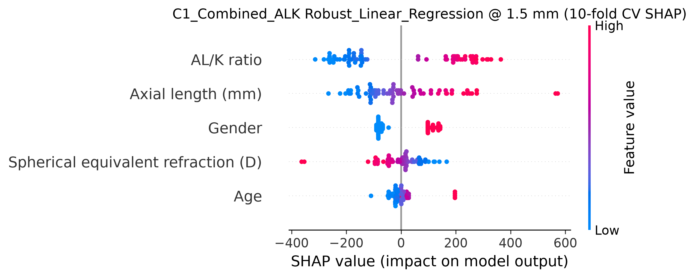

# SR0530 ALK 方案族 10-fold 最终精细寻优报告

> **目标**：仅使用携带 AL/K 的 lenient 数据组（71 眼 / 46 subjects），对全部 8 个 ALK 变型方案进行 **10-fold GroupKFold by Subject** 精细超参数寻优，模型池同时包含原有 7 种 ML 模型与 **Robust Linear Regression（HuberRegressor）**，并生成最终寻优报告。

> **交叉验证**：10-fold GroupKFold by Subject，按 Myopia 分层；置信区间基于 fold-level 标准差（t₀.₀₂₅,df）。

> **搜索策略**：Random Search，每模型 **50** 组参数；参数空间在前期结果基础上进一步细化。

---

## 一、总体最佳配置

- **数据组**：lenient
- **距离**：1.5 mm
- **方案**：C1_Combined_ALK
- **模型**：Robust_Linear_Regression
- **CV 折数**：10-fold
- **最佳 Test R²**：0.504 [95% CI: 0.326, 0.682]
- **最佳 Test RMSE**：458.0 [95% CI: 200.2, 715.8]
- **Gap**：0.081
- **最佳参数**：{'epsilon': 1.8, 'alpha': 0.05}
- **样本量**：71 眼 / 46 subjects

## 二、各距离最佳结果

| 距离 (mm) | 最佳方案 | 最佳模型 | Test R² (95% CI) | RMSE (95% CI) | Gap | 最佳参数 |
|-----------|----------|---------|------------------|----------------|-----|---------|
| 1.0 | C1_Combined_ALK | ElasticNet | 0.355 [-0.010, 0.719] | 476.3 [278.8, 673.8] | 0.149 | {'alpha': 0.5, 'l1_ratio': 0.1} |
| 1.5 | C1_Combined_ALK | Robust_Linear_Regression | 0.504 [0.326, 0.682] | 458.0 [200.2, 715.8] | 0.081 | {'epsilon': 1.8, 'alpha': 0.05} |
| 2.0 | A2_Biomechanical_ALK | Robust_Linear_Regression | 0.466 [0.253, 0.679] | 401.1 [207.8, 594.4] | 0.042 | {'epsilon': 1.8, 'alpha': 0.005} |
| 2.5 | A2_Biomechanical_K_ALK | Robust_Linear_Regression | 0.266 [-0.018, 0.550] | 445.8 [330.7, 561.0] | 0.235 | {'epsilon': 1.0, 'alpha': 0.0005} |
| 3.0 | A1_Biomechanical_ALK | Robust_Linear_Regression | 0.469 [0.217, 0.722] | 441.9 [221.5, 662.4] | -0.082 | {'epsilon': 1.0, 'alpha': 0.0005} |
| 3.5 | A1_Biomechanical_ALK | Robust_Linear_Regression | 0.406 [0.160, 0.652] | 436.0 [232.7, 639.3] | -0.001 | {'epsilon': 1.0, 'alpha': 0.0005} |
| 4.0 | A1_Biomechanical_ALK | Robust_Linear_Regression | 0.335 [0.076, 0.595] | 505.4 [282.1, 728.7] | 0.022 | {'epsilon': 1.0, 'alpha': 0.0005} |
| 4.5 | C1_Combined_ALK | Robust_Linear_Regression | 0.236 [0.005, 0.467] | 535.4 [364.0, 706.8] | 0.184 | {'epsilon': 1.0, 'alpha': 0.0005} |
| 5.0 | B_Clinical_ALK | Robust_Linear_Regression | 0.131 [-0.206, 0.468] | 551.1 [353.3, 749.0] | 0.308 | {'epsilon': 1.0, 'alpha': 0.0005} |
| 5.5 | C1_Combined_K_ALK | SVM | 0.167 [-0.163, 0.497] | 618.7 [419.3, 818.1] | 0.220 | {'C': 500, 'epsilon': 200, 'gamma': 0.01} |
| 6.0 | A2_Biomechanical_ALK | Neural_Network | 0.170 [-0.251, 0.591] | 622.6 [438.7, 806.4] | 0.459 | {'hidden_layer_sizes': (40,), 'alpha': 0.3, 'learning_rate_init': 0.0005} |

## 三、每个 ALK 方案最佳结果

| 方案 | 最佳距离 | 最佳模型 | Test R² (95% CI) | RMSE (95% CI) | Gap | 最佳参数 |
|------|---------|---------|------------------|----------------|-----|---------|
| A1_Biomechanical_ALK | 3.0 mm | Robust_Linear_Regression | 0.469 [0.217, 0.722] | 441.9 [221.5, 662.4] | -0.082 | {'epsilon': 1.0, 'alpha': 0.0005} |
| A1_Biomechanical_K_ALK | 3.0 mm | Robust_Linear_Regression | 0.468 [0.205, 0.730] | 443.6 [220.8, 666.3] | -0.085 | {'epsilon': 1.0, 'alpha': 0.0005} |
| A2_Biomechanical_ALK | 1.5 mm | Random_Forest | 0.473 [0.125, 0.821] | 367.4 [232.4, 502.4] | 0.405 | {'n_estimators': 100, 'max_depth': 3, 'min_samples_split': 2, 'min_samples_leaf': 2} |
| A2_Biomechanical_K_ALK | 2.0 mm | Robust_Linear_Regression | 0.465 [0.253, 0.677] | 400.2 [206.3, 594.1] | 0.043 | {'epsilon': 1.8, 'alpha': 0.005} |
| B_Clinical_ALK | 1.5 mm | Robust_Linear_Regression | 0.418 [0.131, 0.705] | 410.6 [240.4, 580.9] | 0.077 | {'epsilon': 2.5, 'alpha': 0.0001} |
| B_Clinical_K_ALK | 3.0 mm | Robust_Linear_Regression | 0.452 [0.201, 0.704] | 446.8 [226.2, 667.4] | -0.062 | {'epsilon': 1.0, 'alpha': 0.0005} |
| C1_Combined_ALK | 1.5 mm | Robust_Linear_Regression | 0.504 [0.326, 0.682] | 458.0 [200.2, 715.8] | 0.081 | {'epsilon': 1.8, 'alpha': 0.05} |
| C1_Combined_K_ALK | 1.5 mm | Robust_Linear_Regression | 0.496 [0.310, 0.681] | 459.1 [202.5, 715.7] | 0.091 | {'epsilon': 1.8, 'alpha': 0.05} |

## 四、每个模型最佳结果

| 模型 | 最佳距离 | 最佳方案 | Test R² (95% CI) | RMSE (95% CI) | Gap | 最佳参数 |
|------|---------|---------|------------------|----------------|-----|---------|
| ElasticNet | 1.5 mm | A2_Biomechanical_K_ALK | 0.442 [0.240, 0.644] | 391.3 [268.2, 514.4] | 0.285 | {'alpha': 0.1, 'l1_ratio': 0.1} |
| Lasso | 1.5 mm | A2_Biomechanical_ALK | 0.431 [0.200, 0.662] | 384.6 [274.3, 494.8] | 0.300 | {'alpha': 0.005} |
| Neural_Network | 1.5 mm | A2_Biomechanical_ALK | 0.451 [0.248, 0.654] | 386.8 [260.0, 513.6] | 0.360 | {'hidden_layer_sizes': (100, 50), 'alpha': 0.1, 'learning_rate_init': 0.001} |
| Random_Forest | 1.5 mm | A2_Biomechanical_ALK | 0.473 [0.125, 0.821] | 367.4 [232.4, 502.4] | 0.405 | {'n_estimators': 100, 'max_depth': 3, 'min_samples_split': 2, 'min_samples_leaf': 2} |
| Ridge | 1.5 mm | A2_Biomechanical_ALK | 0.431 [0.200, 0.662] | 384.9 [274.3, 495.5] | 0.301 | {'alpha': 0.05} |
| Robust_Linear_Regression | 1.5 mm | C1_Combined_ALK | 0.504 [0.326, 0.682] | 458.0 [200.2, 715.8] | 0.081 | {'epsilon': 1.8, 'alpha': 0.05} |
| SVM | 1.5 mm | A2_Biomechanical_K_ALK | 0.442 [0.239, 0.644] | 401.4 [249.4, 553.5] | 0.276 | {'C': 5000, 'epsilon': 200, 'gamma': 0.005} |
| XGBoost | 1.5 mm | A1_Biomechanical_ALK | 0.389 [0.117, 0.661] | 419.3 [243.2, 595.4] | 0.378 | {'learning_rate': 0.03, 'max_depth': 2, 'n_estimators': 50, 'reg_alpha': 0.5, 'reg_lambda': 0.1} |

## 五、与前期 10-fold C1_Combined_ALK 全模型报告对比

| 距离 (mm) | 原 C1_Combined_ALK 最佳模型 | 原最佳 R² | 本次 C1_Combined_ALK 最佳模型 | 本次最佳 R² | 本次最佳 RMSE |
|-----------|---------------------------|-----------|------------------------------|-------------|---------------|
| 1.0 | SVM | 0.332 | ElasticNet | 0.355 | 476.3 |
| 1.5 | Random_Forest | 0.441 | Robust_Linear_Regression | 0.504 | 458.0 |
| 2.0 | Ridge | 0.367 | Robust_Linear_Regression | 0.463 | 423.1 |
| 2.5 | ElasticNet | 0.191 | Robust_Linear_Regression | 0.248 | 465.0 |
| 3.0 | ElasticNet | 0.376 | Robust_Linear_Regression | 0.462 | 445.0 |
| 3.5 | ElasticNet | 0.334 | Robust_Linear_Regression | 0.367 | 448.2 |
| 4.0 | ElasticNet | 0.096 | Robust_Linear_Regression | 0.272 | 522.5 |
| 4.5 | ElasticNet | 0.218 | Robust_Linear_Regression | 0.236 | 535.4 |
| 5.0 | SVM | -0.051 | SVM | 0.039 | 635.1 |
| 5.5 | SVM | 0.002 | SVM | 0.145 | 624.5 |
| 6.0 | Neural_Network | 0.098 | Neural_Network | 0.099 | 597.3 |

## 六、与前期 10-fold Robust Linear Regression 报告对比

| 距离 (mm) | 方案 | 原 Robust LR 10-fold R² | 本次 Robust LR 10-fold R² | 提升 |
|-----------|------|------------------------|--------------------------|------|
| 1.0 | A1_Biomechanical_ALK | 0.167 | 0.294 | +0.127 |
| 1.0 | A1_Biomechanical_K_ALK | 0.155 | 0.301 | +0.146 |
| 1.0 | A2_Biomechanical_ALK | 0.241 | 0.259 | +0.018 |
| 1.0 | A2_Biomechanical_K_ALK | 0.232 | 0.297 | +0.065 |
| 1.0 | B_Clinical_ALK | 0.216 | 0.258 | +0.043 |
| 1.0 | B_Clinical_K_ALK | 0.232 | 0.288 | +0.056 |
| 1.0 | C1_Combined_ALK | 0.146 | 0.305 | +0.159 |
| 1.0 | C1_Combined_K_ALK | 0.140 | 0.297 | +0.157 |
| 1.5 | A1_Biomechanical_ALK | 0.397 | 0.422 | +0.026 |
| 1.5 | A1_Biomechanical_K_ALK | 0.396 | 0.408 | +0.012 |
| 1.5 | A2_Biomechanical_ALK | 0.500 | 0.463 | -0.037 |
| 1.5 | A2_Biomechanical_K_ALK | 0.499 | 0.460 | -0.039 |
| 1.5 | B_Clinical_ALK | 0.392 | 0.418 | +0.026 |
| 1.5 | B_Clinical_K_ALK | 0.408 | 0.393 | -0.015 |
| 1.5 | C1_Combined_ALK | 0.379 | 0.504 | +0.125 |
| 1.5 | C1_Combined_K_ALK | 0.406 | 0.496 | +0.090 |
| 2.0 | A1_Biomechanical_ALK | 0.359 | 0.365 | +0.007 |
| 2.0 | A1_Biomechanical_K_ALK | 0.357 | 0.363 | +0.006 |
| 2.0 | A2_Biomechanical_ALK | 0.462 | 0.466 | +0.003 |
| 2.0 | A2_Biomechanical_K_ALK | 0.465 | 0.465 | +0.000 |
| 2.0 | B_Clinical_ALK | 0.371 | 0.361 | -0.010 |
| 2.0 | B_Clinical_K_ALK | 0.358 | 0.338 | -0.020 |
| 2.0 | C1_Combined_ALK | 0.274 | 0.463 | +0.188 |
| 2.0 | C1_Combined_K_ALK | 0.261 | 0.446 | +0.185 |
| 2.5 | A1_Biomechanical_ALK | 0.240 | 0.237 | -0.003 |
| 2.5 | A1_Biomechanical_K_ALK | 0.224 | 0.229 | +0.006 |
| 2.5 | A2_Biomechanical_ALK | 0.250 | 0.249 | -0.001 |
| 2.5 | A2_Biomechanical_K_ALK | 0.268 | 0.266 | -0.002 |
| 2.5 | B_Clinical_ALK | 0.222 | 0.208 | -0.014 |
| 2.5 | B_Clinical_K_ALK | 0.242 | 0.201 | -0.040 |
| 2.5 | C1_Combined_ALK | 0.246 | 0.248 | +0.002 |
| 2.5 | C1_Combined_K_ALK | 0.235 | 0.246 | +0.011 |
| 3.0 | A1_Biomechanical_ALK | 0.467 | 0.469 | +0.002 |
| 3.0 | A1_Biomechanical_K_ALK | 0.465 | 0.468 | +0.003 |
| 3.0 | A2_Biomechanical_ALK | 0.462 | 0.462 | -0.001 |
| 3.0 | A2_Biomechanical_K_ALK | 0.469 | 0.457 | -0.012 |
| 3.0 | B_Clinical_ALK | 0.391 | 0.389 | -0.002 |
| 3.0 | B_Clinical_K_ALK | 0.464 | 0.452 | -0.012 |
| 3.0 | C1_Combined_ALK | 0.468 | 0.462 | -0.006 |
| 3.0 | C1_Combined_K_ALK | 0.463 | 0.468 | +0.005 |
| 3.5 | A1_Biomechanical_ALK | 0.402 | 0.406 | +0.004 |
| 3.5 | A1_Biomechanical_K_ALK | 0.404 | 0.399 | -0.005 |
| 3.5 | A2_Biomechanical_ALK | 0.379 | 0.369 | -0.010 |
| 3.5 | A2_Biomechanical_K_ALK | 0.381 | 0.366 | -0.015 |
| 3.5 | B_Clinical_ALK | 0.376 | 0.390 | +0.014 |
| 3.5 | B_Clinical_K_ALK | 0.343 | 0.320 | -0.024 |
| 3.5 | C1_Combined_ALK | 0.368 | 0.367 | -0.000 |
| 3.5 | C1_Combined_K_ALK | 0.370 | 0.371 | +0.001 |
| 4.0 | A1_Biomechanical_ALK | 0.338 | 0.335 | -0.003 |
| 4.0 | A1_Biomechanical_K_ALK | 0.331 | 0.333 | +0.002 |
| 4.0 | A2_Biomechanical_ALK | 0.199 | 0.173 | -0.026 |
| 4.0 | A2_Biomechanical_K_ALK | 0.224 | 0.206 | -0.018 |
| 4.0 | B_Clinical_ALK | 0.247 | 0.256 | +0.009 |
| 4.0 | B_Clinical_K_ALK | 0.245 | 0.240 | -0.005 |
| 4.0 | C1_Combined_ALK | 0.282 | 0.272 | -0.011 |
| 4.0 | C1_Combined_K_ALK | 0.279 | 0.274 | -0.005 |
| 4.5 | A1_Biomechanical_ALK | 0.231 | 0.228 | -0.003 |
| 4.5 | A1_Biomechanical_K_ALK | 0.236 | 0.228 | -0.008 |
| 4.5 | A2_Biomechanical_ALK | 0.143 | 0.147 | +0.004 |
| 4.5 | A2_Biomechanical_K_ALK | 0.157 | 0.142 | -0.015 |
| 4.5 | B_Clinical_ALK | 0.208 | 0.210 | +0.002 |
| 4.5 | B_Clinical_K_ALK | 0.219 | 0.228 | +0.010 |
| 4.5 | C1_Combined_ALK | 0.224 | 0.236 | +0.013 |
| 4.5 | C1_Combined_K_ALK | 0.221 | 0.233 | +0.012 |
| 5.0 | A1_Biomechanical_ALK | -0.022 | -0.001 | +0.021 |
| 5.0 | A1_Biomechanical_K_ALK | -0.048 | 0.006 | +0.054 |
| 5.0 | A2_Biomechanical_ALK | 0.036 | 0.017 | -0.019 |
| 5.0 | A2_Biomechanical_K_ALK | 0.092 | 0.115 | +0.023 |
| 5.0 | B_Clinical_ALK | 0.134 | 0.131 | -0.002 |
| 5.0 | B_Clinical_K_ALK | 0.119 | 0.123 | +0.004 |
| 5.0 | C1_Combined_ALK | -0.144 | -0.078 | +0.066 |
| 5.0 | C1_Combined_K_ALK | 0.056 | 0.102 | +0.047 |
| 5.5 | A1_Biomechanical_ALK | 0.048 | 0.024 | -0.024 |
| 5.5 | A1_Biomechanical_K_ALK | 0.049 | 0.036 | -0.013 |
| 5.5 | A2_Biomechanical_ALK | 0.115 | 0.100 | -0.015 |
| 5.5 | A2_Biomechanical_K_ALK | 0.115 | 0.099 | -0.017 |
| 5.5 | B_Clinical_ALK | 0.097 | 0.092 | -0.006 |
| 5.5 | B_Clinical_K_ALK | 0.107 | 0.099 | -0.008 |
| 5.5 | C1_Combined_ALK | 0.104 | 0.078 | -0.026 |
| 5.5 | C1_Combined_K_ALK | 0.082 | 0.107 | +0.025 |
| 6.0 | A1_Biomechanical_ALK | 0.092 | 0.034 | -0.058 |
| 6.0 | A1_Biomechanical_K_ALK | 0.104 | 0.028 | -0.076 |
| 6.0 | A2_Biomechanical_ALK | 0.161 | 0.092 | -0.070 |
| 6.0 | A2_Biomechanical_K_ALK | 0.174 | 0.092 | -0.081 |
| 6.0 | B_Clinical_ALK | 0.104 | 0.064 | -0.040 |
| 6.0 | B_Clinical_K_ALK | 0.053 | -0.018 | -0.071 |
| 6.0 | C1_Combined_ALK | 0.033 | 0.010 | -0.022 |
| 6.0 | C1_Combined_K_ALK | 0.037 | -0.003 | -0.040 |

## 七、全距离 / 全方案 / 全模型结果汇总

| 距离 (mm) | 方案 | 模型 | Test R² | RMSE | Gap | 最佳参数 |
|-----------|------|------|---------|------|-----|---------|
| 1.0 | A1_Biomechanical_ALK | Robust_Linear_Regression | 0.294 | 545.1 | 0.132 | {'epsilon': 1.8, 'alpha': 0.1} |
| 1.0 | A1_Biomechanical_ALK | Neural_Network | 0.277 | 537.0 | 0.216 | {'hidden_layer_sizes': (40,), 'alpha': 0.3, 'learning_rate_init': 0.0005} |
| 1.0 | A1_Biomechanical_ALK | ElasticNet | 0.252 | 514.4 | 0.208 | {'alpha': 0.5, 'l1_ratio': 0.1} |
| 1.0 | A1_Biomechanical_ALK | Random_Forest | 0.238 | 498.2 | 0.510 | {'n_estimators': 200, 'max_depth': 4, 'min_samples_split': 2, 'min_samples_leaf': 4} |
| 1.0 | A1_Biomechanical_ALK | SVM | 0.229 | 561.2 | 0.125 | {'C': 500, 'epsilon': 200, 'gamma': 0.01} |
| 1.0 | A1_Biomechanical_ALK | Ridge | 0.191 | 614.0 | 0.185 | {'alpha': 100.0} |
| 1.0 | A1_Biomechanical_ALK | XGBoost | 0.190 | 524.8 | 0.526 | {'learning_rate': 0.03, 'max_depth': 2, 'n_estimators': 50, 'reg_alpha': 0.5, 'reg_lambda': 0.1} |
| 1.0 | A1_Biomechanical_ALK | Lasso | 0.154 | 572.7 | 0.313 | {'alpha': 0.001} |
| 1.0 | A1_Biomechanical_K_ALK | Robust_Linear_Regression | 0.301 | 540.8 | 0.144 | {'epsilon': 1.8, 'alpha': 0.1} |
| 1.0 | A1_Biomechanical_K_ALK | Neural_Network | 0.265 | 488.8 | 0.248 | {'hidden_layer_sizes': (80,), 'alpha': 0.1, 'learning_rate_init': 0.0001} |
| 1.0 | A1_Biomechanical_K_ALK | ElasticNet | 0.263 | 508.9 | 0.204 | {'alpha': 0.5, 'l1_ratio': 0.1} |
| 1.0 | A1_Biomechanical_K_ALK | Random_Forest | 0.249 | 493.4 | 0.514 | {'n_estimators': 200, 'max_depth': 4, 'min_samples_split': 2, 'min_samples_leaf': 4} |
| 1.0 | A1_Biomechanical_K_ALK | SVM | 0.225 | 563.0 | 0.134 | {'C': 500, 'epsilon': 200, 'gamma': 0.01} |
| 1.0 | A1_Biomechanical_K_ALK | XGBoost | 0.220 | 527.1 | 0.514 | {'learning_rate': 0.03, 'max_depth': 2, 'n_estimators': 50, 'reg_alpha': 0.5, 'reg_lambda': 0.1} |
| 1.0 | A1_Biomechanical_K_ALK | Ridge | 0.215 | 601.1 | 0.194 | {'alpha': 100.0} |
| 1.0 | A1_Biomechanical_K_ALK | Lasso | 0.149 | 567.3 | 0.380 | {'alpha': 0.3} |
| 1.0 | A2_Biomechanical_ALK | Robust_Linear_Regression | 0.259 | 552.5 | 0.178 | {'epsilon': 1.8, 'alpha': 0.1} |
| 1.0 | A2_Biomechanical_ALK | Random_Forest | 0.239 | 500.2 | 0.522 | {'n_estimators': 200, 'max_depth': 4, 'min_samples_split': 2, 'min_samples_leaf': 4} |
| 1.0 | A2_Biomechanical_ALK | ElasticNet | 0.221 | 527.7 | 0.249 | {'alpha': 0.5, 'l1_ratio': 0.1} |
| 1.0 | A2_Biomechanical_ALK | SVM | 0.210 | 566.5 | 0.151 | {'C': 500, 'epsilon': 200, 'gamma': 0.01} |
| 1.0 | A2_Biomechanical_ALK | XGBoost | 0.182 | 542.3 | 0.552 | {'learning_rate': 0.03, 'max_depth': 2, 'n_estimators': 50, 'reg_alpha': 0.5, 'reg_lambda': 0.1} |
| 1.0 | A2_Biomechanical_ALK | Ridge | 0.179 | 620.3 | 0.200 | {'alpha': 100.0} |
| 1.0 | A2_Biomechanical_ALK | Lasso | 0.139 | 561.3 | 0.394 | {'alpha': 0.3} |
| 1.0 | A2_Biomechanical_ALK | Neural_Network | 0.137 | 550.1 | 0.415 | {'hidden_layer_sizes': (80,), 'alpha': 0.1, 'learning_rate_init': 0.0001} |
| 1.0 | A2_Biomechanical_K_ALK | Robust_Linear_Regression | 0.297 | 538.9 | 0.164 | {'epsilon': 1.8, 'alpha': 0.1} |
| 1.0 | A2_Biomechanical_K_ALK | ElasticNet | 0.254 | 515.0 | 0.225 | {'alpha': 0.5, 'l1_ratio': 0.1} |
| 1.0 | A2_Biomechanical_K_ALK | Random_Forest | 0.241 | 497.6 | 0.530 | {'n_estimators': 200, 'max_depth': 4, 'min_samples_split': 2, 'min_samples_leaf': 4} |
| 1.0 | A2_Biomechanical_K_ALK | SVM | 0.215 | 566.0 | 0.153 | {'C': 500, 'epsilon': 200, 'gamma': 0.01} |
| 1.0 | A2_Biomechanical_K_ALK | Neural_Network | 0.212 | 508.2 | 0.380 | {'hidden_layer_sizes': (80,), 'alpha': 0.1, 'learning_rate_init': 0.0001} |
| 1.0 | A2_Biomechanical_K_ALK | Ridge | 0.211 | 603.8 | 0.204 | {'alpha': 100.0} |
| 1.0 | A2_Biomechanical_K_ALK | XGBoost | 0.189 | 546.3 | 0.556 | {'learning_rate': 0.03, 'max_depth': 2, 'n_estimators': 50, 'reg_alpha': 0.5, 'reg_lambda': 0.1} |
| 1.0 | A2_Biomechanical_K_ALK | Lasso | 0.129 | 559.8 | 0.428 | {'alpha': 0.3} |
| 1.0 | B_Clinical_ALK | Robust_Linear_Regression | 0.258 | 523.0 | 0.118 | {'epsilon': 1.2, 'alpha': 0.1} |
| 1.0 | B_Clinical_ALK | ElasticNet | 0.254 | 515.7 | 0.199 | {'alpha': 0.5, 'l1_ratio': 0.1} |
| 1.0 | B_Clinical_ALK | SVM | 0.241 | 516.5 | 0.226 | {'C': 5000, 'epsilon': 500, 'gamma': 0.01} |
| 1.0 | B_Clinical_ALK | Random_Forest | 0.217 | 524.1 | 0.468 | {'n_estimators': 200, 'max_depth': 4, 'min_samples_split': 2, 'min_samples_leaf': 4} |
| 1.0 | B_Clinical_ALK | Ridge | 0.192 | 512.7 | 0.294 | {'alpha': 0.5} |
| 1.0 | B_Clinical_ALK | Lasso | 0.188 | 513.2 | 0.297 | {'alpha': 0.003} |
| 1.0 | B_Clinical_ALK | Neural_Network | 0.126 | 579.0 | 0.394 | {'hidden_layer_sizes': (60,), 'alpha': 1.0, 'learning_rate_init': 5e-05} |
| 1.0 | B_Clinical_ALK | XGBoost | 0.095 | 568.9 | 0.381 | {'learning_rate': 0.005, 'max_depth': 1, 'n_estimators': 300, 'reg_alpha': 0.1, 'reg_lambda': 2.0} |
| 1.0 | B_Clinical_K_ALK | Ridge | 0.303 | 487.3 | 0.215 | {'alpha': 0.5} |
| 1.0 | B_Clinical_K_ALK | Robust_Linear_Regression | 0.288 | 492.6 | 0.231 | {'epsilon': 2.5, 'alpha': 0.0001} |
| 1.0 | B_Clinical_K_ALK | Lasso | 0.282 | 557.6 | 0.301 | {'alpha': 0.05} |
| 1.0 | B_Clinical_K_ALK | Random_Forest | 0.275 | 497.1 | 0.457 | {'n_estimators': 200, 'max_depth': 4, 'min_samples_split': 2, 'min_samples_leaf': 4} |
| 1.0 | B_Clinical_K_ALK | SVM | 0.269 | 507.2 | 0.212 | {'C': 5000, 'epsilon': 500, 'gamma': 0.01} |
| 1.0 | B_Clinical_K_ALK | ElasticNet | 0.234 | 521.1 | 0.212 | {'alpha': 0.5, 'l1_ratio': 0.1} |
| 1.0 | B_Clinical_K_ALK | Neural_Network | 0.182 | 532.4 | 0.496 | {'hidden_layer_sizes': (20,), 'alpha': 0.3, 'learning_rate_init': 0.0005} |
| 1.0 | B_Clinical_K_ALK | XGBoost | 0.171 | 528.4 | 0.556 | {'learning_rate': 0.03, 'max_depth': 2, 'n_estimators': 50, 'reg_alpha': 0.5, 'reg_lambda': 0.1} |
| 1.0 | C1_Combined_ALK | ElasticNet | 0.355 | 476.3 | 0.149 | {'alpha': 0.5, 'l1_ratio': 0.1} |
| 1.0 | C1_Combined_ALK | SVM | 0.324 | 484.0 | 0.188 | {'C': 5000, 'epsilon': 500, 'gamma': 0.01} |
| 1.0 | C1_Combined_ALK | Robust_Linear_Regression | 0.305 | 551.2 | 0.275 | {'epsilon': 2.5, 'alpha': 0.0005} |
| 1.0 | C1_Combined_ALK | Lasso | 0.263 | 563.1 | 0.318 | {'alpha': 0.05} |
| 1.0 | C1_Combined_ALK | Ridge | 0.247 | 501.5 | 0.277 | {'alpha': 0.5} |
| 1.0 | C1_Combined_ALK | Random_Forest | 0.242 | 498.0 | 0.514 | {'n_estimators': 200, 'max_depth': 4, 'min_samples_split': 2, 'min_samples_leaf': 4} |
| 1.0 | C1_Combined_ALK | Neural_Network | 0.238 | 535.1 | 0.247 | {'hidden_layer_sizes': (100,), 'alpha': 0.05, 'learning_rate_init': 5e-05} |
| 1.0 | C1_Combined_ALK | XGBoost | 0.181 | 522.4 | 0.560 | {'learning_rate': 0.03, 'max_depth': 2, 'n_estimators': 50, 'reg_alpha': 0.5, 'reg_lambda': 0.1} |
| 1.0 | C1_Combined_K_ALK | ElasticNet | 0.350 | 476.6 | 0.152 | {'alpha': 0.5, 'l1_ratio': 0.1} |
| 1.0 | C1_Combined_K_ALK | SVM | 0.333 | 480.7 | 0.185 | {'C': 5000, 'epsilon': 500, 'gamma': 0.01} |
| 1.0 | C1_Combined_K_ALK | Robust_Linear_Regression | 0.297 | 554.3 | 0.284 | {'epsilon': 2.5, 'alpha': 0.0005} |
| 1.0 | C1_Combined_K_ALK | Neural_Network | 0.292 | 482.4 | 0.279 | {'hidden_layer_sizes': (80,), 'alpha': 0.1, 'learning_rate_init': 0.0001} |
| 1.0 | C1_Combined_K_ALK | Random_Forest | 0.254 | 492.9 | 0.514 | {'n_estimators': 200, 'max_depth': 4, 'min_samples_split': 2, 'min_samples_leaf': 4} |
| 1.0 | C1_Combined_K_ALK | Ridge | 0.245 | 581.5 | 0.210 | {'alpha': 100.0} |
| 1.0 | C1_Combined_K_ALK | XGBoost | 0.160 | 535.4 | 0.590 | {'learning_rate': 0.03, 'max_depth': 2, 'n_estimators': 50, 'reg_alpha': 0.5, 'reg_lambda': 0.1} |
| 1.0 | C1_Combined_K_ALK | Lasso | 0.128 | 493.3 | 0.498 | {'alpha': 1.0} |
| 1.5 | A1_Biomechanical_ALK | Robust_Linear_Regression | 0.422 | 442.7 | 0.087 | {'epsilon': 1.8, 'alpha': 0.1} |
| 1.5 | A1_Biomechanical_ALK | Random_Forest | 0.397 | 403.0 | 0.456 | {'n_estimators': 100, 'max_depth': 3, 'min_samples_split': 2, 'min_samples_leaf': 2} |
| 1.5 | A1_Biomechanical_ALK | XGBoost | 0.389 | 419.3 | 0.378 | {'learning_rate': 0.03, 'max_depth': 2, 'n_estimators': 50, 'reg_alpha': 0.5, 'reg_lambda': 0.1} |
| 1.5 | A1_Biomechanical_ALK | SVM | 0.388 | 507.7 | 0.017 | {'C': 500, 'epsilon': 200, 'gamma': 0.01} |
| 1.5 | A1_Biomechanical_ALK | Ridge | 0.388 | 393.7 | 0.224 | {'alpha': 0.5} |
| 1.5 | A1_Biomechanical_ALK | ElasticNet | 0.385 | 394.4 | 0.226 | {'alpha': 0.005, 'l1_ratio': 0.8} |
| 1.5 | A1_Biomechanical_ALK | Lasso | 0.385 | 394.4 | 0.227 | {'alpha': 0.1} |
| 1.5 | A1_Biomechanical_ALK | Neural_Network | 0.358 | 437.4 | 0.257 | {'hidden_layer_sizes': (100,), 'alpha': 0.05, 'learning_rate_init': 5e-05} |
| 1.5 | A1_Biomechanical_K_ALK | Robust_Linear_Regression | 0.408 | 409.8 | 0.089 | {'epsilon': 1.5, 'alpha': 0.001} |
| 1.5 | A1_Biomechanical_K_ALK | SVM | 0.398 | 507.0 | 0.009 | {'C': 500, 'epsilon': 200, 'gamma': 0.01} |
| 1.5 | A1_Biomechanical_K_ALK | ElasticNet | 0.386 | 428.8 | 0.104 | {'alpha': 0.5, 'l1_ratio': 0.1} |
| 1.5 | A1_Biomechanical_K_ALK | Ridge | 0.382 | 395.2 | 0.229 | {'alpha': 0.5} |
| 1.5 | A1_Biomechanical_K_ALK | Lasso | 0.381 | 396.4 | 0.236 | {'alpha': 0.1} |
| 1.5 | A1_Biomechanical_K_ALK | Random_Forest | 0.380 | 408.1 | 0.474 | {'n_estimators': 100, 'max_depth': 3, 'min_samples_split': 2, 'min_samples_leaf': 2} |
| 1.5 | A1_Biomechanical_K_ALK | Neural_Network | 0.351 | 457.2 | 0.245 | {'hidden_layer_sizes': (100,), 'alpha': 0.05, 'learning_rate_init': 5e-05} |
| 1.5 | A1_Biomechanical_K_ALK | XGBoost | 0.340 | 432.7 | 0.439 | {'learning_rate': 0.03, 'max_depth': 2, 'n_estimators': 50, 'reg_alpha': 0.5, 'reg_lambda': 0.1} |
| 1.5 | A2_Biomechanical_ALK | Random_Forest | 0.473 | 367.4 | 0.405 | {'n_estimators': 100, 'max_depth': 3, 'min_samples_split': 2, 'min_samples_leaf': 2} |
| 1.5 | A2_Biomechanical_ALK | Robust_Linear_Regression | 0.463 | 373.3 | 0.267 | {'epsilon': 2.0, 'alpha': 0.0001} |
| 1.5 | A2_Biomechanical_ALK | Neural_Network | 0.451 | 386.8 | 0.360 | {'hidden_layer_sizes': (100, 50), 'alpha': 0.1, 'learning_rate_init': 0.001} |
| 1.5 | A2_Biomechanical_ALK | Lasso | 0.431 | 384.6 | 0.300 | {'alpha': 0.005} |
| 1.5 | A2_Biomechanical_ALK | Ridge | 0.431 | 384.9 | 0.301 | {'alpha': 0.05} |
| 1.5 | A2_Biomechanical_ALK | SVM | 0.410 | 414.7 | 0.300 | {'C': 5000, 'epsilon': 200, 'gamma': 0.005} |
| 1.5 | A2_Biomechanical_ALK | ElasticNet | 0.407 | 405.9 | 0.318 | {'alpha': 0.1, 'l1_ratio': 0.1} |
| 1.5 | A2_Biomechanical_ALK | XGBoost | 0.333 | 432.8 | 0.458 | {'learning_rate': 0.03, 'max_depth': 2, 'n_estimators': 50, 'reg_alpha': 0.5, 'reg_lambda': 0.1} |
| 1.5 | A2_Biomechanical_K_ALK | Robust_Linear_Regression | 0.460 | 455.1 | 0.067 | {'epsilon': 1.8, 'alpha': 0.005} |
| 1.5 | A2_Biomechanical_K_ALK | Random_Forest | 0.445 | 375.6 | 0.433 | {'n_estimators': 100, 'max_depth': 3, 'min_samples_split': 2, 'min_samples_leaf': 2} |
| 1.5 | A2_Biomechanical_K_ALK | SVM | 0.442 | 401.4 | 0.276 | {'C': 5000, 'epsilon': 200, 'gamma': 0.005} |
| 1.5 | A2_Biomechanical_K_ALK | ElasticNet | 0.442 | 391.3 | 0.285 | {'alpha': 0.1, 'l1_ratio': 0.1} |
| 1.5 | A2_Biomechanical_K_ALK | Lasso | 0.422 | 469.1 | 0.139 | {'alpha': 0.1} |
| 1.5 | A2_Biomechanical_K_ALK | Ridge | 0.408 | 395.0 | 0.339 | {'alpha': 0.05} |
| 1.5 | A2_Biomechanical_K_ALK | Neural_Network | 0.387 | 405.8 | 0.527 | {'hidden_layer_sizes': (100, 50), 'alpha': 0.1, 'learning_rate_init': 0.001} |
| 1.5 | A2_Biomechanical_K_ALK | XGBoost | 0.301 | 442.2 | 0.495 | {'learning_rate': 0.03, 'max_depth': 2, 'n_estimators': 50, 'reg_alpha': 0.5, 'reg_lambda': 0.1} |
| 1.5 | B_Clinical_ALK | Robust_Linear_Regression | 0.418 | 410.6 | 0.077 | {'epsilon': 2.5, 'alpha': 0.0001} |
| 1.5 | B_Clinical_ALK | Ridge | 0.414 | 414.2 | 0.086 | {'alpha': 0.5} |
| 1.5 | B_Clinical_ALK | Lasso | 0.405 | 415.7 | 0.095 | {'alpha': 0.003} |
| 1.5 | B_Clinical_ALK | ElasticNet | 0.369 | 396.2 | 0.233 | {'alpha': 0.005, 'l1_ratio': 0.8} |
| 1.5 | B_Clinical_ALK | XGBoost | 0.314 | 441.3 | 0.413 | {'learning_rate': 0.03, 'max_depth': 2, 'n_estimators': 50, 'reg_alpha': 0.5, 'reg_lambda': 0.1} |
| 1.5 | B_Clinical_ALK | SVM | 0.297 | 546.0 | 0.037 | {'C': 500, 'epsilon': 200, 'gamma': 0.01} |
| 1.5 | B_Clinical_ALK | Random_Forest | 0.263 | 440.0 | 0.566 | {'n_estimators': 100, 'max_depth': 3, 'min_samples_split': 2, 'min_samples_leaf': 2} |
| 1.5 | B_Clinical_ALK | Neural_Network | 0.207 | 488.7 | 0.342 | {'hidden_layer_sizes': (80,), 'alpha': 0.1, 'learning_rate_init': 0.0001} |
| 1.5 | B_Clinical_K_ALK | Ridge | 0.420 | 378.7 | 0.202 | {'alpha': 0.5} |
| 1.5 | B_Clinical_K_ALK | ElasticNet | 0.410 | 384.8 | 0.213 | {'alpha': 0.005, 'l1_ratio': 0.8} |
| 1.5 | B_Clinical_K_ALK | Lasso | 0.408 | 386.0 | 0.215 | {'alpha': 0.1} |
| 1.5 | B_Clinical_K_ALK | Robust_Linear_Regression | 0.393 | 497.4 | 0.102 | {'epsilon': 1.8, 'alpha': 0.005} |
| 1.5 | B_Clinical_K_ALK | XGBoost | 0.324 | 436.7 | 0.437 | {'learning_rate': 0.03, 'max_depth': 2, 'n_estimators': 50, 'reg_alpha': 0.5, 'reg_lambda': 0.1} |
| 1.5 | B_Clinical_K_ALK | SVM | 0.303 | 545.8 | 0.026 | {'C': 500, 'epsilon': 200, 'gamma': 0.01} |
| 1.5 | B_Clinical_K_ALK | Random_Forest | 0.299 | 434.2 | 0.551 | {'n_estimators': 100, 'max_depth': 3, 'min_samples_split': 2, 'min_samples_leaf': 2} |
| 1.5 | B_Clinical_K_ALK | Neural_Network | 0.224 | 491.1 | 0.295 | {'hidden_layer_sizes': (100,), 'alpha': 0.05, 'learning_rate_init': 5e-05} |
| 1.5 | C1_Combined_ALK | Robust_Linear_Regression | 0.504 | 458.0 | 0.081 | {'epsilon': 1.8, 'alpha': 0.05} |
| 1.5 | C1_Combined_ALK | Neural_Network | 0.423 | 382.4 | 0.219 | {'hidden_layer_sizes': (100, 50), 'alpha': 0.1, 'learning_rate_init': 0.001} |
| 1.5 | C1_Combined_ALK | SVM | 0.417 | 403.9 | 0.223 | {'C': 5000, 'epsilon': 200, 'gamma': 0.005} |
| 1.5 | C1_Combined_ALK | Ridge | 0.399 | 389.2 | 0.222 | {'alpha': 0.5} |
| 1.5 | C1_Combined_ALK | ElasticNet | 0.394 | 391.2 | 0.227 | {'alpha': 0.005, 'l1_ratio': 0.8} |
| 1.5 | C1_Combined_ALK | Lasso | 0.393 | 391.5 | 0.228 | {'alpha': 0.1} |
| 1.5 | C1_Combined_ALK | Random_Forest | 0.371 | 410.6 | 0.491 | {'n_estimators': 100, 'max_depth': 3, 'min_samples_split': 2, 'min_samples_leaf': 2} |
| 1.5 | C1_Combined_ALK | XGBoost | 0.359 | 428.3 | 0.410 | {'learning_rate': 0.03, 'max_depth': 2, 'n_estimators': 50, 'reg_alpha': 0.5, 'reg_lambda': 0.1} |
| 1.5 | C1_Combined_K_ALK | Robust_Linear_Regression | 0.496 | 459.1 | 0.091 | {'epsilon': 1.8, 'alpha': 0.05} |
| 1.5 | C1_Combined_K_ALK | SVM | 0.419 | 499.5 | 0.002 | {'C': 500, 'epsilon': 200, 'gamma': 0.01} |
| 1.5 | C1_Combined_K_ALK | ElasticNet | 0.400 | 425.1 | 0.090 | {'alpha': 0.5, 'l1_ratio': 0.1} |
| 1.5 | C1_Combined_K_ALK | Ridge | 0.393 | 390.8 | 0.228 | {'alpha': 0.5} |
| 1.5 | C1_Combined_K_ALK | Lasso | 0.391 | 390.8 | 0.234 | {'alpha': 0.1} |
| 1.5 | C1_Combined_K_ALK | Random_Forest | 0.341 | 418.1 | 0.521 | {'n_estimators': 100, 'max_depth': 3, 'min_samples_split': 2, 'min_samples_leaf': 2} |
| 1.5 | C1_Combined_K_ALK | XGBoost | 0.328 | 437.4 | 0.452 | {'learning_rate': 0.03, 'max_depth': 2, 'n_estimators': 50, 'reg_alpha': 0.5, 'reg_lambda': 0.1} |
| 1.5 | C1_Combined_K_ALK | Neural_Network | 0.301 | 434.6 | 0.463 | {'hidden_layer_sizes': (100, 50), 'alpha': 0.1, 'learning_rate_init': 0.001} |
| 2.0 | A1_Biomechanical_ALK | Robust_Linear_Regression | 0.365 | 447.6 | 0.117 | {'epsilon': 1.8, 'alpha': 0.05} |
| 2.0 | A1_Biomechanical_ALK | ElasticNet | 0.350 | 458.6 | 0.092 | {'alpha': 0.05, 'l1_ratio': 0.5} |
| 2.0 | A1_Biomechanical_ALK | Ridge | 0.342 | 460.5 | 0.099 | {'alpha': 0.5} |
| 2.0 | A1_Biomechanical_ALK | Lasso | 0.339 | 461.4 | 0.103 | {'alpha': 0.1} |
| 2.0 | A1_Biomechanical_ALK | Neural_Network | 0.339 | 415.8 | 0.222 | {'hidden_layer_sizes': (100,), 'alpha': 0.05, 'learning_rate_init': 5e-05} |
| 2.0 | A1_Biomechanical_ALK | SVM | 0.334 | 464.6 | 0.016 | {'C': 500, 'epsilon': 200, 'gamma': 0.01} |
| 2.0 | A1_Biomechanical_ALK | XGBoost | 0.230 | 393.5 | 0.410 | {'learning_rate': 0.03, 'max_depth': 2, 'n_estimators': 50, 'reg_alpha': 0.05, 'reg_lambda': 0.5} |
| 2.0 | A1_Biomechanical_ALK | Random_Forest | 0.148 | 401.8 | 0.581 | {'n_estimators': 100, 'max_depth': None, 'min_samples_split': 10, 'min_samples_leaf': 2} |
| 2.0 | A1_Biomechanical_K_ALK | Robust_Linear_Regression | 0.363 | 449.6 | 0.058 | {'epsilon': 1.8, 'alpha': 0.005} |
| 2.0 | A1_Biomechanical_K_ALK | SVM | 0.351 | 459.0 | 0.007 | {'C': 500, 'epsilon': 200, 'gamma': 0.01} |
| 2.0 | A1_Biomechanical_K_ALK | ElasticNet | 0.347 | 459.4 | 0.094 | {'alpha': 0.05, 'l1_ratio': 0.5} |
| 2.0 | A1_Biomechanical_K_ALK | Ridge | 0.341 | 460.9 | 0.101 | {'alpha': 0.5} |
| 2.0 | A1_Biomechanical_K_ALK | Lasso | 0.335 | 463.0 | 0.108 | {'alpha': 0.1} |
| 2.0 | A1_Biomechanical_K_ALK | Neural_Network | 0.270 | 459.4 | 0.276 | {'hidden_layer_sizes': (100, 50), 'alpha': 0.3, 'learning_rate_init': 0.001} |
| 2.0 | A1_Biomechanical_K_ALK | XGBoost | 0.202 | 399.7 | 0.442 | {'learning_rate': 0.03, 'max_depth': 2, 'n_estimators': 50, 'reg_alpha': 0.05, 'reg_lambda': 0.5} |
| 2.0 | A1_Biomechanical_K_ALK | Random_Forest | 0.150 | 400.1 | 0.591 | {'n_estimators': 100, 'max_depth': None, 'min_samples_split': 10, 'min_samples_leaf': 2} |
| 2.0 | A2_Biomechanical_ALK | Robust_Linear_Regression | 0.466 | 401.1 | 0.042 | {'epsilon': 1.8, 'alpha': 0.005} |
| 2.0 | A2_Biomechanical_ALK | ElasticNet | 0.410 | 431.5 | 0.115 | {'alpha': 0.05, 'l1_ratio': 0.5} |
| 2.0 | A2_Biomechanical_ALK | Ridge | 0.409 | 430.5 | 0.118 | {'alpha': 0.5} |
| 2.0 | A2_Biomechanical_ALK | Lasso | 0.407 | 430.0 | 0.119 | {'alpha': 0.1} |
| 2.0 | A2_Biomechanical_ALK | SVM | 0.323 | 466.4 | 0.064 | {'C': 500, 'epsilon': 200, 'gamma': 0.01} |
| 2.0 | A2_Biomechanical_ALK | XGBoost | 0.222 | 397.9 | 0.454 | {'learning_rate': 0.03, 'max_depth': 2, 'n_estimators': 50, 'reg_alpha': 0.05, 'reg_lambda': 0.5} |
| 2.0 | A2_Biomechanical_ALK | Neural_Network | 0.179 | 492.5 | 0.348 | {'hidden_layer_sizes': (100, 50), 'alpha': 0.3, 'learning_rate_init': 0.001} |
| 2.0 | A2_Biomechanical_ALK | Random_Forest | 0.177 | 512.9 | 0.642 | {'n_estimators': 300, 'max_depth': 4, 'min_samples_split': 3, 'min_samples_leaf': 1} |
| 2.0 | A2_Biomechanical_K_ALK | Robust_Linear_Regression | 0.465 | 400.2 | 0.043 | {'epsilon': 1.8, 'alpha': 0.005} |
| 2.0 | A2_Biomechanical_K_ALK | Lasso | 0.419 | 428.0 | 0.113 | {'alpha': 0.1} |
| 2.0 | A2_Biomechanical_K_ALK | ElasticNet | 0.411 | 430.2 | 0.114 | {'alpha': 0.05, 'l1_ratio': 0.5} |
| 2.0 | A2_Biomechanical_K_ALK | Ridge | 0.406 | 430.9 | 0.120 | {'alpha': 0.5} |
| 2.0 | A2_Biomechanical_K_ALK | SVM | 0.358 | 457.3 | 0.046 | {'C': 500, 'epsilon': 200, 'gamma': 0.01} |
| 2.0 | A2_Biomechanical_K_ALK | Neural_Network | 0.241 | 436.1 | 0.272 | {'hidden_layer_sizes': (80,), 'alpha': 0.1, 'learning_rate_init': 0.0001} |
| 2.0 | A2_Biomechanical_K_ALK | XGBoost | 0.196 | 404.8 | 0.482 | {'learning_rate': 0.03, 'max_depth': 2, 'n_estimators': 50, 'reg_alpha': 0.05, 'reg_lambda': 0.5} |
| 2.0 | A2_Biomechanical_K_ALK | Random_Forest | 0.187 | 511.3 | 0.643 | {'n_estimators': 300, 'max_depth': 4, 'min_samples_split': 3, 'min_samples_leaf': 1} |
| 2.0 | B_Clinical_ALK | Robust_Linear_Regression | 0.361 | 456.8 | 0.056 | {'epsilon': 1.8, 'alpha': 0.005} |
| 2.0 | B_Clinical_ALK | ElasticNet | 0.341 | 463.0 | 0.098 | {'alpha': 0.05, 'l1_ratio': 0.5} |
| 2.0 | B_Clinical_ALK | Ridge | 0.336 | 463.9 | 0.104 | {'alpha': 0.5} |
| 2.0 | B_Clinical_ALK | Lasso | 0.333 | 464.4 | 0.107 | {'alpha': 0.1} |
| 2.0 | B_Clinical_ALK | SVM | 0.265 | 487.8 | 0.043 | {'C': 500, 'epsilon': 200, 'gamma': 0.01} |
| 2.0 | B_Clinical_ALK | Neural_Network | 0.224 | 432.8 | 0.116 | {'hidden_layer_sizes': (20,), 'alpha': 0.3, 'learning_rate_init': 5e-05} |
| 2.0 | B_Clinical_ALK | Random_Forest | 0.186 | 477.3 | 0.535 | {'n_estimators': 500, 'max_depth': None, 'min_samples_split': 10, 'min_samples_leaf': 2} |
| 2.0 | B_Clinical_ALK | XGBoost | 0.070 | 428.0 | 0.523 | {'learning_rate': 0.03, 'max_depth': 2, 'n_estimators': 50, 'reg_alpha': 0.05, 'reg_lambda': 0.5} |
| 2.0 | B_Clinical_K_ALK | ElasticNet | 0.341 | 461.9 | 0.111 | {'alpha': 0.05, 'l1_ratio': 0.5} |
| 2.0 | B_Clinical_K_ALK | Robust_Linear_Regression | 0.338 | 459.8 | 0.093 | {'epsilon': 1.8, 'alpha': 0.005} |
| 2.0 | B_Clinical_K_ALK | Ridge | 0.326 | 466.7 | 0.128 | {'alpha': 0.5} |
| 2.0 | B_Clinical_K_ALK | Lasso | 0.297 | 476.5 | 0.157 | {'alpha': 0.1} |
| 2.0 | B_Clinical_K_ALK | SVM | 0.264 | 489.0 | 0.046 | {'C': 500, 'epsilon': 200, 'gamma': 0.01} |
| 2.0 | B_Clinical_K_ALK | Random_Forest | 0.127 | 515.2 | 0.645 | {'n_estimators': 300, 'max_depth': 4, 'min_samples_split': 3, 'min_samples_leaf': 1} |
| 2.0 | B_Clinical_K_ALK | Neural_Network | 0.087 | 452.5 | 0.313 | {'hidden_layer_sizes': (20,), 'alpha': 0.3, 'learning_rate_init': 5e-05} |
| 2.0 | B_Clinical_K_ALK | XGBoost | 0.050 | 433.5 | 0.555 | {'learning_rate': 0.03, 'max_depth': 2, 'n_estimators': 50, 'reg_alpha': 0.05, 'reg_lambda': 0.5} |
| 2.0 | C1_Combined_ALK | Robust_Linear_Regression | 0.463 | 423.1 | 0.050 | {'epsilon': 1.8, 'alpha': 0.05} |
| 2.0 | C1_Combined_ALK | SVM | 0.351 | 456.5 | 0.013 | {'C': 500, 'epsilon': 200, 'gamma': 0.01} |
| 2.0 | C1_Combined_ALK | ElasticNet | 0.319 | 468.7 | 0.135 | {'alpha': 0.05, 'l1_ratio': 0.5} |
| 2.0 | C1_Combined_ALK | Ridge | 0.302 | 474.4 | 0.153 | {'alpha': 0.5} |
| 2.0 | C1_Combined_ALK | Lasso | 0.296 | 454.9 | 0.251 | {'alpha': 0.005} |
| 2.0 | C1_Combined_ALK | Neural_Network | 0.239 | 493.2 | 0.228 | {'hidden_layer_sizes': (40,), 'alpha': 0.3, 'learning_rate_init': 0.0005} |
| 2.0 | C1_Combined_ALK | XGBoost | 0.233 | 392.8 | 0.406 | {'learning_rate': 0.03, 'max_depth': 2, 'n_estimators': 50, 'reg_alpha': 0.05, 'reg_lambda': 0.5} |
| 2.0 | C1_Combined_ALK | Random_Forest | 0.141 | 404.9 | 0.589 | {'n_estimators': 100, 'max_depth': None, 'min_samples_split': 10, 'min_samples_leaf': 2} |
| 2.0 | C1_Combined_K_ALK | Robust_Linear_Regression | 0.446 | 426.1 | 0.069 | {'epsilon': 1.8, 'alpha': 0.05} |
| 2.0 | C1_Combined_K_ALK | SVM | 0.362 | 455.4 | 0.006 | {'C': 500, 'epsilon': 200, 'gamma': 0.01} |
| 2.0 | C1_Combined_K_ALK | ElasticNet | 0.315 | 470.1 | 0.139 | {'alpha': 0.05, 'l1_ratio': 0.5} |
| 2.0 | C1_Combined_K_ALK | Ridge | 0.299 | 475.2 | 0.156 | {'alpha': 0.5} |
| 2.0 | C1_Combined_K_ALK | Lasso | 0.290 | 458.0 | 0.258 | {'alpha': 0.005} |
| 2.0 | C1_Combined_K_ALK | XGBoost | 0.200 | 400.0 | 0.444 | {'learning_rate': 0.03, 'max_depth': 2, 'n_estimators': 50, 'reg_alpha': 0.05, 'reg_lambda': 0.5} |
| 2.0 | C1_Combined_K_ALK | Neural_Network | 0.181 | 451.7 | 0.249 | {'hidden_layer_sizes': (80,), 'alpha': 0.1, 'learning_rate_init': 0.0001} |
| 2.0 | C1_Combined_K_ALK | Random_Forest | 0.139 | 404.0 | 0.603 | {'n_estimators': 100, 'max_depth': None, 'min_samples_split': 10, 'min_samples_leaf': 2} |
| 2.5 | A1_Biomechanical_ALK | Robust_Linear_Regression | 0.237 | 469.8 | 0.164 | {'epsilon': 1.0, 'alpha': 0.0005} |
| 2.5 | A1_Biomechanical_ALK | Lasso | 0.176 | 477.7 | 0.346 | {'alpha': 0.05} |
| 2.5 | A1_Biomechanical_ALK | ElasticNet | 0.124 | 477.3 | 0.378 | {'alpha': 0.5, 'l1_ratio': 0.2} |
| 2.5 | A1_Biomechanical_ALK | Ridge | 0.122 | 469.6 | 0.335 | {'alpha': 0.01} |
| 2.5 | A1_Biomechanical_ALK | Neural_Network | 0.121 | 498.7 | 0.326 | {'hidden_layer_sizes': (60,), 'alpha': 1.0, 'learning_rate_init': 5e-05} |
| 2.5 | A1_Biomechanical_ALK | SVM | 0.033 | 534.9 | 0.272 | {'C': 500, 'epsilon': 500, 'gamma': 0.01} |
| 2.5 | A1_Biomechanical_ALK | Random_Forest | 0.028 | 502.9 | 0.586 | {'n_estimators': 100, 'max_depth': 3, 'min_samples_split': 10, 'min_samples_leaf': 2} |
| 2.5 | A1_Biomechanical_ALK | XGBoost | -0.145 | 596.7 | 0.256 | {'learning_rate': 0.001, 'max_depth': 3, 'n_estimators': 100, 'reg_alpha': 0.3, 'reg_lambda': 1.0} |
| 2.5 | A1_Biomechanical_K_ALK | Robust_Linear_Regression | 0.229 | 471.8 | 0.169 | {'epsilon': 1.0, 'alpha': 0.0005} |
| 2.5 | A1_Biomechanical_K_ALK | ElasticNet | 0.169 | 470.6 | 0.337 | {'alpha': 0.5, 'l1_ratio': 0.2} |
| 2.5 | A1_Biomechanical_K_ALK | Lasso | 0.150 | 484.7 | 0.375 | {'alpha': 0.05} |
| 2.5 | A1_Biomechanical_K_ALK | Ridge | 0.098 | 480.8 | 0.362 | {'alpha': 0.01} |
| 2.5 | A1_Biomechanical_K_ALK | Neural_Network | 0.072 | 492.6 | 0.410 | {'hidden_layer_sizes': (60,), 'alpha': 1.0, 'learning_rate_init': 5e-05} |
| 2.5 | A1_Biomechanical_K_ALK | SVM | 0.033 | 507.8 | 0.404 | {'C': 1000, 'epsilon': 50, 'gamma': 0.005} |
| 2.5 | A1_Biomechanical_K_ALK | Random_Forest | 0.007 | 506.7 | 0.612 | {'n_estimators': 100, 'max_depth': 3, 'min_samples_split': 10, 'min_samples_leaf': 2} |
| 2.5 | A1_Biomechanical_K_ALK | XGBoost | -0.155 | 582.1 | 0.216 | {'learning_rate': 0.0005, 'max_depth': 3, 'n_estimators': 100, 'reg_alpha': 0.05, 'reg_lambda': 0.3} |
| 2.5 | A2_Biomechanical_ALK | Robust_Linear_Regression | 0.249 | 451.9 | 0.250 | {'epsilon': 1.0, 'alpha': 0.0005} |
| 2.5 | A2_Biomechanical_ALK | Lasso | 0.186 | 435.4 | 0.400 | {'alpha': 0.05} |
| 2.5 | A2_Biomechanical_ALK | ElasticNet | 0.184 | 450.8 | 0.348 | {'alpha': 0.0005, 'l1_ratio': 0.2} |
| 2.5 | A2_Biomechanical_ALK | Ridge | 0.183 | 450.8 | 0.348 | {'alpha': 0.01} |
| 2.5 | A2_Biomechanical_ALK | Neural_Network | 0.147 | 461.3 | 0.451 | {'hidden_layer_sizes': (100, 50), 'alpha': 0.05, 'learning_rate_init': 0.001} |
| 2.5 | A2_Biomechanical_ALK | Random_Forest | 0.059 | 497.1 | 0.588 | {'n_estimators': 100, 'max_depth': 3, 'min_samples_split': 10, 'min_samples_leaf': 2} |
| 2.5 | A2_Biomechanical_ALK | SVM | 0.021 | 538.7 | 0.306 | {'C': 500, 'epsilon': 500, 'gamma': 0.01} |
| 2.5 | A2_Biomechanical_ALK | XGBoost | -0.129 | 594.2 | 0.242 | {'learning_rate': 0.001, 'max_depth': 3, 'n_estimators': 100, 'reg_alpha': 0.3, 'reg_lambda': 1.0} |
| 2.5 | A2_Biomechanical_K_ALK | Robust_Linear_Regression | 0.266 | 445.8 | 0.235 | {'epsilon': 1.0, 'alpha': 0.0005} |
| 2.5 | A2_Biomechanical_K_ALK | Lasso | 0.207 | 432.2 | 0.388 | {'alpha': 0.05} |
| 2.5 | A2_Biomechanical_K_ALK | ElasticNet | 0.172 | 454.2 | 0.361 | {'alpha': 0.0005, 'l1_ratio': 0.2} |
| 2.5 | A2_Biomechanical_K_ALK | Ridge | 0.165 | 455.7 | 0.369 | {'alpha': 0.01} |
| 2.5 | A2_Biomechanical_K_ALK | SVM | 0.042 | 533.3 | 0.317 | {'C': 500, 'epsilon': 500, 'gamma': 0.01} |
| 2.5 | A2_Biomechanical_K_ALK | Random_Forest | 0.035 | 502.0 | 0.612 | {'n_estimators': 100, 'max_depth': 3, 'min_samples_split': 10, 'min_samples_leaf': 2} |
| 2.5 | A2_Biomechanical_K_ALK | Neural_Network | 0.009 | 540.6 | 0.365 | {'hidden_layer_sizes': (60,), 'alpha': 1.0, 'learning_rate_init': 5e-05} |
| 2.5 | A2_Biomechanical_K_ALK | XGBoost | -0.143 | 598.0 | 0.256 | {'learning_rate': 0.001, 'max_depth': 3, 'n_estimators': 100, 'reg_alpha': 0.3, 'reg_lambda': 1.0} |
| 2.5 | B_Clinical_ALK | Neural_Network | 0.232 | 467.2 | 0.226 | {'hidden_layer_sizes': (60,), 'alpha': 1.0, 'learning_rate_init': 5e-05} |
| 2.5 | B_Clinical_ALK | Robust_Linear_Regression | 0.208 | 473.1 | 0.207 | {'epsilon': 1.0, 'alpha': 0.0005} |
| 2.5 | B_Clinical_ALK | Random_Forest | 0.143 | 478.2 | 0.608 | {'n_estimators': 500, 'max_depth': None, 'min_samples_split': 10, 'min_samples_leaf': 2} |
| 2.5 | B_Clinical_ALK | ElasticNet | 0.101 | 469.4 | 0.369 | {'alpha': 0.0005, 'l1_ratio': 0.2} |
| 2.5 | B_Clinical_ALK | Ridge | 0.101 | 469.4 | 0.369 | {'alpha': 0.01} |
| 2.5 | B_Clinical_ALK | Lasso | 0.101 | 469.4 | 0.369 | {'alpha': 0.001} |
| 2.5 | B_Clinical_ALK | SVM | -0.028 | 482.5 | 0.302 | {'C': 500, 'epsilon': 200, 'gamma': 0.01} |
| 2.5 | B_Clinical_ALK | XGBoost | -0.138 | 597.5 | 0.248 | {'learning_rate': 0.001, 'max_depth': 3, 'n_estimators': 100, 'reg_alpha': 0.3, 'reg_lambda': 1.0} |
| 2.5 | B_Clinical_K_ALK | Robust_Linear_Regression | 0.201 | 470.5 | 0.216 | {'epsilon': 1.0, 'alpha': 0.0005} |
| 2.5 | B_Clinical_K_ALK | Lasso | 0.103 | 487.6 | 0.432 | {'alpha': 0.05} |
| 2.5 | B_Clinical_K_ALK | SVM | 0.027 | 477.2 | 0.249 | {'C': 500, 'epsilon': 200, 'gamma': 0.01} |
| 2.5 | B_Clinical_K_ALK | ElasticNet | -0.020 | 484.7 | 0.492 | {'alpha': 0.0005, 'l1_ratio': 0.2} |
| 2.5 | B_Clinical_K_ALK | Ridge | -0.021 | 484.8 | 0.493 | {'alpha': 0.01} |
| 2.5 | B_Clinical_K_ALK | Random_Forest | -0.025 | 506.0 | 0.793 | {'n_estimators': 500, 'max_depth': None, 'min_samples_split': 10, 'min_samples_leaf': 2} |
| 2.5 | B_Clinical_K_ALK | Neural_Network | -0.070 | 504.3 | 0.577 | {'hidden_layer_sizes': (60,), 'alpha': 1.0, 'learning_rate_init': 5e-05} |
| 2.5 | B_Clinical_K_ALK | XGBoost | -0.171 | 585.1 | 0.232 | {'learning_rate': 0.0005, 'max_depth': 3, 'n_estimators': 100, 'reg_alpha': 0.05, 'reg_lambda': 0.3} |
| 2.5 | C1_Combined_ALK | Robust_Linear_Regression | 0.248 | 465.0 | 0.163 | {'epsilon': 1.0, 'alpha': 0.0005} |
| 2.5 | C1_Combined_ALK | Neural_Network | 0.196 | 472.5 | 0.325 | {'hidden_layer_sizes': (60,), 'alpha': 1.0, 'learning_rate_init': 5e-05} |
| 2.5 | C1_Combined_ALK | Lasso | 0.112 | 487.3 | 0.422 | {'alpha': 0.05} |
| 2.5 | C1_Combined_ALK | ElasticNet | 0.091 | 487.4 | 0.424 | {'alpha': 0.5, 'l1_ratio': 0.2} |
| 2.5 | C1_Combined_ALK | Random_Forest | -0.003 | 509.6 | 0.621 | {'n_estimators': 100, 'max_depth': 3, 'min_samples_split': 10, 'min_samples_leaf': 2} |
| 2.5 | C1_Combined_ALK | SVM | -0.013 | 545.2 | 0.338 | {'C': 500, 'epsilon': 500, 'gamma': 0.01} |
| 2.5 | C1_Combined_ALK | Ridge | -0.037 | 486.5 | 0.509 | {'alpha': 0.01} |
| 2.5 | C1_Combined_ALK | XGBoost | -0.145 | 596.9 | 0.256 | {'learning_rate': 0.001, 'max_depth': 3, 'n_estimators': 100, 'reg_alpha': 0.3, 'reg_lambda': 1.0} |
| 2.5 | C1_Combined_K_ALK | Robust_Linear_Regression | 0.246 | 462.3 | 0.170 | {'epsilon': 1.0, 'alpha': 0.0005} |
| 2.5 | C1_Combined_K_ALK | Neural_Network | 0.130 | 462.4 | 0.253 | {'hidden_layer_sizes': (40,), 'alpha': 0.3, 'learning_rate_init': 0.0005} |
| 2.5 | C1_Combined_K_ALK | ElasticNet | 0.105 | 487.6 | 0.408 | {'alpha': 0.5, 'l1_ratio': 0.2} |
| 2.5 | C1_Combined_K_ALK | Lasso | 0.056 | 503.7 | 0.480 | {'alpha': 0.05} |
| 2.5 | C1_Combined_K_ALK | SVM | -0.014 | 546.9 | 0.354 | {'C': 500, 'epsilon': 500, 'gamma': 0.01} |
| 2.5 | C1_Combined_K_ALK | Random_Forest | -0.028 | 514.4 | 0.650 | {'n_estimators': 100, 'max_depth': 3, 'min_samples_split': 10, 'min_samples_leaf': 2} |
| 2.5 | C1_Combined_K_ALK | Ridge | -0.090 | 502.6 | 0.566 | {'alpha': 0.01} |
| 2.5 | C1_Combined_K_ALK | XGBoost | -0.155 | 582.2 | 0.216 | {'learning_rate': 0.0005, 'max_depth': 3, 'n_estimators': 100, 'reg_alpha': 0.05, 'reg_lambda': 0.3} |
| 3.0 | A1_Biomechanical_ALK | Robust_Linear_Regression | 0.469 | 441.9 | -0.082 | {'epsilon': 1.0, 'alpha': 0.0005} |
| 3.0 | A1_Biomechanical_ALK | ElasticNet | 0.326 | 467.1 | 0.126 | {'alpha': 0.0005, 'l1_ratio': 0.2} |
| 3.0 | A1_Biomechanical_ALK | Ridge | 0.326 | 467.1 | 0.126 | {'alpha': 0.01} |
| 3.0 | A1_Biomechanical_ALK | Lasso | 0.326 | 467.2 | 0.126 | {'alpha': 0.001} |
| 3.0 | A1_Biomechanical_ALK | Random_Forest | 0.282 | 458.5 | 0.376 | {'n_estimators': 200, 'max_depth': 4, 'min_samples_split': 2, 'min_samples_leaf': 4} |
| 3.0 | A1_Biomechanical_ALK | Neural_Network | 0.264 | 511.4 | 0.151 | {'hidden_layer_sizes': (60,), 'alpha': 1.0, 'learning_rate_init': 5e-05} |
| 3.0 | A1_Biomechanical_ALK | SVM | 0.250 | 462.9 | 0.062 | {'C': 5000, 'epsilon': 500, 'gamma': 0.01} |
| 3.0 | A1_Biomechanical_ALK | XGBoost | -0.288 | 629.8 | 0.357 | {'learning_rate': 0.0005, 'max_depth': 3, 'n_estimators': 100, 'reg_alpha': 0.05, 'reg_lambda': 0.3} |
| 3.0 | A1_Biomechanical_K_ALK | Robust_Linear_Regression | 0.468 | 443.6 | -0.085 | {'epsilon': 1.0, 'alpha': 0.0005} |
| 3.0 | A1_Biomechanical_K_ALK | ElasticNet | 0.311 | 474.3 | 0.144 | {'alpha': 0.0005, 'l1_ratio': 0.2} |
| 3.0 | A1_Biomechanical_K_ALK | Ridge | 0.301 | 478.1 | 0.154 | {'alpha': 0.01} |
| 3.0 | A1_Biomechanical_K_ALK | Lasso | 0.289 | 482.7 | 0.167 | {'alpha': 0.001} |
| 3.0 | A1_Biomechanical_K_ALK | Random_Forest | 0.273 | 460.1 | 0.399 | {'n_estimators': 200, 'max_depth': 4, 'min_samples_split': 2, 'min_samples_leaf': 4} |
| 3.0 | A1_Biomechanical_K_ALK | SVM | 0.255 | 481.3 | 0.082 | {'C': 500, 'epsilon': 200, 'gamma': 0.01} |
| 3.0 | A1_Biomechanical_K_ALK | Neural_Network | 0.215 | 464.4 | 0.160 | {'hidden_layer_sizes': (80,), 'alpha': 0.1, 'learning_rate_init': 0.0001} |
| 3.0 | A1_Biomechanical_K_ALK | XGBoost | -0.290 | 630.5 | 0.359 | {'learning_rate': 0.0005, 'max_depth': 3, 'n_estimators': 100, 'reg_alpha': 0.05, 'reg_lambda': 0.3} |
| 3.0 | A2_Biomechanical_ALK | Robust_Linear_Regression | 0.462 | 398.9 | 0.142 | {'epsilon': 1.8, 'alpha': 0.005} |
| 3.0 | A2_Biomechanical_ALK | Lasso | 0.376 | 417.3 | 0.243 | {'alpha': 0.1} |
| 3.0 | A2_Biomechanical_ALK | Ridge | 0.375 | 417.9 | 0.244 | {'alpha': 0.5} |
| 3.0 | A2_Biomechanical_ALK | ElasticNet | 0.373 | 418.9 | 0.246 | {'alpha': 0.05, 'l1_ratio': 0.5} |
| 3.0 | A2_Biomechanical_ALK | Neural_Network | 0.350 | 444.6 | 0.349 | {'hidden_layer_sizes': (40,), 'alpha': 0.3, 'learning_rate_init': 0.0005} |
| 3.0 | A2_Biomechanical_ALK | Random_Forest | 0.264 | 464.8 | 0.412 | {'n_estimators': 200, 'max_depth': 4, 'min_samples_split': 2, 'min_samples_leaf': 4} |
| 3.0 | A2_Biomechanical_ALK | SVM | 0.219 | 476.9 | 0.191 | {'C': 500, 'epsilon': 200, 'gamma': 0.01} |
| 3.0 | A2_Biomechanical_ALK | XGBoost | 0.036 | 547.8 | 0.760 | {'learning_rate': 0.005, 'max_depth': 4, 'n_estimators': 200, 'reg_alpha': 0.05, 'reg_lambda': 0.05} |
| 3.0 | A2_Biomechanical_K_ALK | Robust_Linear_Regression | 0.457 | 398.5 | 0.147 | {'epsilon': 1.8, 'alpha': 0.005} |
| 3.0 | A2_Biomechanical_K_ALK | ElasticNet | 0.372 | 417.6 | 0.247 | {'alpha': 0.05, 'l1_ratio': 0.5} |
| 3.0 | A2_Biomechanical_K_ALK | Ridge | 0.368 | 418.4 | 0.251 | {'alpha': 0.5} |
| 3.0 | A2_Biomechanical_K_ALK | Lasso | 0.344 | 425.6 | 0.277 | {'alpha': 0.1} |
| 3.0 | A2_Biomechanical_K_ALK | Neural_Network | 0.292 | 510.1 | 0.135 | {'hidden_layer_sizes': (60,), 'alpha': 1.0, 'learning_rate_init': 5e-05} |
| 3.0 | A2_Biomechanical_K_ALK | SVM | 0.280 | 470.0 | 0.138 | {'C': 500, 'epsilon': 200, 'gamma': 0.01} |
| 3.0 | A2_Biomechanical_K_ALK | Random_Forest | 0.251 | 467.8 | 0.432 | {'n_estimators': 200, 'max_depth': 4, 'min_samples_split': 2, 'min_samples_leaf': 4} |
| 3.0 | A2_Biomechanical_K_ALK | XGBoost | -0.010 | 560.5 | 0.808 | {'learning_rate': 0.005, 'max_depth': 4, 'n_estimators': 200, 'reg_alpha': 0.05, 'reg_lambda': 0.05} |
| 3.0 | B_Clinical_ALK | Robust_Linear_Regression | 0.389 | 465.7 | 0.006 | {'epsilon': 1.0, 'alpha': 0.0005} |
| 3.0 | B_Clinical_ALK | Neural_Network | 0.322 | 486.3 | 0.114 | {'hidden_layer_sizes': (60,), 'alpha': 1.0, 'learning_rate_init': 5e-05} |
| 3.0 | B_Clinical_ALK | ElasticNet | 0.300 | 462.6 | 0.156 | {'alpha': 0.0005, 'l1_ratio': 0.2} |
| 3.0 | B_Clinical_ALK | Ridge | 0.300 | 462.6 | 0.156 | {'alpha': 0.01} |
| 3.0 | B_Clinical_ALK | Lasso | 0.300 | 462.6 | 0.156 | {'alpha': 0.001} |
| 3.0 | B_Clinical_ALK | Random_Forest | 0.229 | 460.0 | 0.437 | {'n_estimators': 200, 'max_depth': 4, 'min_samples_split': 2, 'min_samples_leaf': 4} |
| 3.0 | B_Clinical_ALK | SVM | 0.188 | 513.0 | 0.085 | {'C': 500, 'epsilon': 200, 'gamma': 0.01} |
| 3.0 | B_Clinical_ALK | XGBoost | -0.301 | 632.9 | 0.362 | {'learning_rate': 0.0005, 'max_depth': 3, 'n_estimators': 100, 'reg_alpha': 0.05, 'reg_lambda': 0.3} |
| 3.0 | B_Clinical_K_ALK | Robust_Linear_Regression | 0.452 | 446.8 | -0.062 | {'epsilon': 1.0, 'alpha': 0.0005} |
| 3.0 | B_Clinical_K_ALK | Lasso | 0.259 | 475.7 | 0.202 | {'alpha': 0.001} |
| 3.0 | B_Clinical_K_ALK | Ridge | 0.259 | 475.7 | 0.202 | {'alpha': 0.01} |
| 3.0 | B_Clinical_K_ALK | ElasticNet | 0.259 | 475.7 | 0.202 | {'alpha': 0.0005, 'l1_ratio': 0.2} |
| 3.0 | B_Clinical_K_ALK | SVM | 0.223 | 509.9 | 0.050 | {'C': 500, 'epsilon': 200, 'gamma': 0.01} |
| 3.0 | B_Clinical_K_ALK | Random_Forest | 0.189 | 475.3 | 0.496 | {'n_estimators': 200, 'max_depth': 4, 'min_samples_split': 2, 'min_samples_leaf': 4} |
| 3.0 | B_Clinical_K_ALK | Neural_Network | 0.044 | 512.9 | 0.447 | {'hidden_layer_sizes': (60,), 'alpha': 1.0, 'learning_rate_init': 5e-05} |
| 3.0 | B_Clinical_K_ALK | XGBoost | -0.296 | 632.1 | 0.358 | {'learning_rate': 0.0005, 'max_depth': 3, 'n_estimators': 100, 'reg_alpha': 0.05, 'reg_lambda': 0.3} |
| 3.0 | C1_Combined_ALK | Robust_Linear_Regression | 0.462 | 445.0 | -0.071 | {'epsilon': 1.0, 'alpha': 0.0005} |
| 3.0 | C1_Combined_ALK | SVM | 0.270 | 458.3 | 0.036 | {'C': 5000, 'epsilon': 500, 'gamma': 0.01} |
| 3.0 | C1_Combined_ALK | ElasticNet | 0.245 | 478.8 | 0.216 | {'alpha': 0.0005, 'l1_ratio': 0.2} |
| 3.0 | C1_Combined_ALK | Ridge | 0.245 | 478.9 | 0.217 | {'alpha': 0.01} |
| 3.0 | C1_Combined_ALK | Lasso | 0.244 | 479.0 | 0.217 | {'alpha': 0.001} |
| 3.0 | C1_Combined_ALK | Neural_Network | 0.231 | 519.0 | 0.254 | {'hidden_layer_sizes': (60,), 'alpha': 1.0, 'learning_rate_init': 5e-05} |
| 3.0 | C1_Combined_ALK | Random_Forest | 0.230 | 468.9 | 0.439 | {'n_estimators': 200, 'max_depth': 4, 'min_samples_split': 2, 'min_samples_leaf': 4} |
| 3.0 | C1_Combined_ALK | XGBoost | -0.284 | 628.4 | 0.353 | {'learning_rate': 0.0005, 'max_depth': 3, 'n_estimators': 100, 'reg_alpha': 0.05, 'reg_lambda': 0.3} |
| 3.0 | C1_Combined_K_ALK | Robust_Linear_Regression | 0.468 | 443.6 | -0.081 | {'epsilon': 1.0, 'alpha': 0.0005} |
| 3.0 | C1_Combined_K_ALK | Neural_Network | 0.225 | 493.3 | 0.167 | {'hidden_layer_sizes': (60,), 'alpha': 1.0, 'learning_rate_init': 5e-05} |
| 3.0 | C1_Combined_K_ALK | Random_Forest | 0.224 | 474.4 | 0.456 | {'n_estimators': 200, 'max_depth': 4, 'min_samples_split': 2, 'min_samples_leaf': 4} |
| 3.0 | C1_Combined_K_ALK | ElasticNet | 0.215 | 488.6 | 0.249 | {'alpha': 0.0005, 'l1_ratio': 0.2} |
| 3.0 | C1_Combined_K_ALK | SVM | 0.211 | 473.4 | 0.104 | {'C': 5000, 'epsilon': 500, 'gamma': 0.01} |
| 3.0 | C1_Combined_K_ALK | Ridge | 0.194 | 494.3 | 0.271 | {'alpha': 0.01} |
| 3.0 | C1_Combined_K_ALK | Lasso | 0.167 | 501.5 | 0.299 | {'alpha': 0.001} |
| 3.0 | C1_Combined_K_ALK | XGBoost | -0.285 | 629.0 | 0.354 | {'learning_rate': 0.0005, 'max_depth': 3, 'n_estimators': 100, 'reg_alpha': 0.05, 'reg_lambda': 0.3} |
| 3.5 | A1_Biomechanical_ALK | Robust_Linear_Regression | 0.406 | 436.0 | -0.001 | {'epsilon': 1.0, 'alpha': 0.0005} |
| 3.5 | A1_Biomechanical_ALK | ElasticNet | 0.268 | 442.4 | 0.187 | {'alpha': 0.0005, 'l1_ratio': 0.2} |
| 3.5 | A1_Biomechanical_ALK | Ridge | 0.268 | 442.4 | 0.187 | {'alpha': 0.01} |
| 3.5 | A1_Biomechanical_ALK | Lasso | 0.268 | 442.4 | 0.187 | {'alpha': 0.001} |
| 3.5 | A1_Biomechanical_ALK | SVM | 0.237 | 502.1 | 0.060 | {'C': 500, 'epsilon': 200, 'gamma': 0.01} |
| 3.5 | A1_Biomechanical_ALK | Random_Forest | 0.231 | 465.6 | 0.443 | {'n_estimators': 100, 'max_depth': 3, 'min_samples_split': 10, 'min_samples_leaf': 2} |
| 3.5 | A1_Biomechanical_ALK | Neural_Network | 0.183 | 505.4 | 0.210 | {'hidden_layer_sizes': (60,), 'alpha': 1.0, 'learning_rate_init': 5e-05} |
| 3.5 | A1_Biomechanical_ALK | XGBoost | -0.285 | 597.9 | 0.355 | {'learning_rate': 0.0005, 'max_depth': 3, 'n_estimators': 100, 'reg_alpha': 0.05, 'reg_lambda': 0.3} |
| 3.5 | A1_Biomechanical_K_ALK | Robust_Linear_Regression | 0.399 | 438.2 | 0.005 | {'epsilon': 1.0, 'alpha': 0.0005} |
| 3.5 | A1_Biomechanical_K_ALK | ElasticNet | 0.259 | 447.9 | 0.199 | {'alpha': 0.0005, 'l1_ratio': 0.2} |
| 3.5 | A1_Biomechanical_K_ALK | Ridge | 0.252 | 451.0 | 0.207 | {'alpha': 0.01} |
| 3.5 | A1_Biomechanical_K_ALK | SVM | 0.248 | 502.2 | 0.050 | {'C': 500, 'epsilon': 200, 'gamma': 0.01} |
| 3.5 | A1_Biomechanical_K_ALK | Lasso | 0.243 | 454.8 | 0.216 | {'alpha': 0.001} |
| 3.5 | A1_Biomechanical_K_ALK | Random_Forest | 0.201 | 471.4 | 0.462 | {'n_estimators': 100, 'max_depth': 3, 'min_samples_split': 10, 'min_samples_leaf': 2} |
| 3.5 | A1_Biomechanical_K_ALK | Neural_Network | 0.085 | 487.1 | 0.377 | {'hidden_layer_sizes': (60,), 'alpha': 1.0, 'learning_rate_init': 5e-05} |
| 3.5 | A1_Biomechanical_K_ALK | XGBoost | -0.296 | 601.2 | 0.366 | {'learning_rate': 0.0005, 'max_depth': 3, 'n_estimators': 100, 'reg_alpha': 0.05, 'reg_lambda': 0.3} |
| 3.5 | A2_Biomechanical_ALK | Robust_Linear_Regression | 0.369 | 437.6 | 0.127 | {'epsilon': 1.8, 'alpha': 0.005} |
| 3.5 | A2_Biomechanical_ALK | ElasticNet | 0.264 | 431.7 | 0.292 | {'alpha': 0.0005, 'l1_ratio': 0.2} |
| 3.5 | A2_Biomechanical_ALK | Lasso | 0.264 | 456.7 | 0.252 | {'alpha': 0.1} |
| 3.5 | A2_Biomechanical_ALK | Ridge | 0.264 | 431.8 | 0.292 | {'alpha': 0.01} |
| 3.5 | A2_Biomechanical_ALK | SVM | 0.228 | 500.6 | 0.121 | {'C': 500, 'epsilon': 200, 'gamma': 0.01} |
| 3.5 | A2_Biomechanical_ALK | Neural_Network | 0.209 | 472.0 | 0.323 | {'hidden_layer_sizes': (40,), 'alpha': 0.3, 'learning_rate_init': 0.0005} |
| 3.5 | A2_Biomechanical_ALK | Random_Forest | 0.180 | 474.8 | 0.502 | {'n_estimators': 100, 'max_depth': 3, 'min_samples_split': 10, 'min_samples_leaf': 2} |
| 3.5 | A2_Biomechanical_ALK | XGBoost | -0.290 | 600.8 | 0.359 | {'learning_rate': 0.0005, 'max_depth': 3, 'n_estimators': 100, 'reg_alpha': 0.05, 'reg_lambda': 0.3} |
| 3.5 | A2_Biomechanical_K_ALK | Robust_Linear_Regression | 0.366 | 435.8 | 0.131 | {'epsilon': 1.8, 'alpha': 0.005} |
| 3.5 | A2_Biomechanical_K_ALK | SVM | 0.261 | 495.2 | 0.098 | {'C': 500, 'epsilon': 200, 'gamma': 0.01} |
| 3.5 | A2_Biomechanical_K_ALK | ElasticNet | 0.261 | 457.0 | 0.255 | {'alpha': 0.05, 'l1_ratio': 0.5} |
| 3.5 | A2_Biomechanical_K_ALK | Ridge | 0.257 | 457.6 | 0.259 | {'alpha': 0.5} |
| 3.5 | A2_Biomechanical_K_ALK | Lasso | 0.233 | 463.8 | 0.284 | {'alpha': 0.1} |
| 3.5 | A2_Biomechanical_K_ALK | Neural_Network | 0.186 | 511.0 | 0.221 | {'hidden_layer_sizes': (60,), 'alpha': 1.0, 'learning_rate_init': 5e-05} |
| 3.5 | A2_Biomechanical_K_ALK | Random_Forest | 0.142 | 483.3 | 0.535 | {'n_estimators': 100, 'max_depth': 3, 'min_samples_split': 10, 'min_samples_leaf': 2} |
| 3.5 | A2_Biomechanical_K_ALK | XGBoost | -0.290 | 601.0 | 0.360 | {'learning_rate': 0.0005, 'max_depth': 3, 'n_estimators': 100, 'reg_alpha': 0.05, 'reg_lambda': 0.3} |
| 3.5 | B_Clinical_ALK | Robust_Linear_Regression | 0.390 | 441.3 | 0.022 | {'epsilon': 1.0, 'alpha': 0.0005} |
| 3.5 | B_Clinical_ALK | Neural_Network | 0.295 | 471.2 | 0.128 | {'hidden_layer_sizes': (60,), 'alpha': 1.0, 'learning_rate_init': 5e-05} |
| 3.5 | B_Clinical_ALK | ElasticNet | 0.244 | 442.4 | 0.216 | {'alpha': 0.0005, 'l1_ratio': 0.2} |
| 3.5 | B_Clinical_ALK | Ridge | 0.244 | 442.4 | 0.216 | {'alpha': 0.01} |
| 3.5 | B_Clinical_ALK | Lasso | 0.244 | 442.4 | 0.216 | {'alpha': 0.001} |
| 3.5 | B_Clinical_ALK | SVM | 0.130 | 537.5 | 0.096 | {'C': 500, 'epsilon': 200, 'gamma': 0.01} |
| 3.5 | B_Clinical_ALK | Random_Forest | -0.060 | 544.5 | 0.644 | {'n_estimators': 100, 'max_depth': 3, 'min_samples_split': 10, 'min_samples_leaf': 2} |
| 3.5 | B_Clinical_ALK | XGBoost | -0.334 | 609.5 | 0.387 | {'learning_rate': 0.0005, 'max_depth': 3, 'n_estimators': 100, 'reg_alpha': 0.05, 'reg_lambda': 0.3} |
| 3.5 | B_Clinical_K_ALK | Robust_Linear_Regression | 0.320 | 458.5 | 0.097 | {'epsilon': 1.0, 'alpha': 0.0005} |
| 3.5 | B_Clinical_K_ALK | ElasticNet | 0.175 | 454.5 | 0.290 | {'alpha': 0.0005, 'l1_ratio': 0.2} |
| 3.5 | B_Clinical_K_ALK | Ridge | 0.175 | 454.5 | 0.290 | {'alpha': 0.01} |
| 3.5 | B_Clinical_K_ALK | Lasso | 0.175 | 454.6 | 0.290 | {'alpha': 0.001} |
| 3.5 | B_Clinical_K_ALK | SVM | 0.169 | 533.8 | 0.059 | {'C': 500, 'epsilon': 200, 'gamma': 0.01} |
| 3.5 | B_Clinical_K_ALK | Random_Forest | 0.029 | 529.1 | 0.575 | {'n_estimators': 100, 'max_depth': 3, 'min_samples_split': 10, 'min_samples_leaf': 2} |
| 3.5 | B_Clinical_K_ALK | Neural_Network | -0.015 | 489.8 | 0.490 | {'hidden_layer_sizes': (60,), 'alpha': 1.0, 'learning_rate_init': 5e-05} |
| 3.5 | B_Clinical_K_ALK | XGBoost | -0.335 | 611.5 | 0.391 | {'learning_rate': 0.0005, 'max_depth': 3, 'n_estimators': 100, 'reg_alpha': 0.05, 'reg_lambda': 0.3} |
| 3.5 | C1_Combined_ALK | Robust_Linear_Regression | 0.367 | 448.2 | 0.049 | {'epsilon': 1.0, 'alpha': 0.0005} |
| 3.5 | C1_Combined_ALK | SVM | 0.244 | 503.2 | 0.049 | {'C': 500, 'epsilon': 200, 'gamma': 0.01} |
| 3.5 | C1_Combined_ALK | ElasticNet | 0.161 | 456.7 | 0.304 | {'alpha': 0.0005, 'l1_ratio': 0.2} |
| 3.5 | C1_Combined_ALK | Ridge | 0.161 | 456.8 | 0.305 | {'alpha': 0.01} |
| 3.5 | C1_Combined_ALK | Lasso | 0.160 | 456.9 | 0.305 | {'alpha': 0.001} |
| 3.5 | C1_Combined_ALK | Random_Forest | 0.155 | 487.1 | 0.518 | {'n_estimators': 100, 'max_depth': 3, 'min_samples_split': 10, 'min_samples_leaf': 2} |
| 3.5 | C1_Combined_ALK | Neural_Network | 0.147 | 478.2 | 0.332 | {'hidden_layer_sizes': (60,), 'alpha': 1.0, 'learning_rate_init': 5e-05} |
| 3.5 | C1_Combined_ALK | XGBoost | -0.294 | 601.3 | 0.363 | {'learning_rate': 0.0005, 'max_depth': 3, 'n_estimators': 100, 'reg_alpha': 0.05, 'reg_lambda': 0.3} |
| 3.5 | C1_Combined_K_ALK | Robust_Linear_Regression | 0.371 | 448.0 | 0.044 | {'epsilon': 1.0, 'alpha': 0.0005} |
| 3.5 | C1_Combined_K_ALK | SVM | 0.256 | 500.6 | 0.037 | {'C': 500, 'epsilon': 200, 'gamma': 0.01} |
| 3.5 | C1_Combined_K_ALK | ElasticNet | 0.135 | 464.3 | 0.332 | {'alpha': 0.0005, 'l1_ratio': 0.2} |
| 3.5 | C1_Combined_K_ALK | Random_Forest | 0.133 | 491.4 | 0.530 | {'n_estimators': 100, 'max_depth': 3, 'min_samples_split': 10, 'min_samples_leaf': 2} |
| 3.5 | C1_Combined_K_ALK | Neural_Network | 0.126 | 491.9 | 0.272 | {'hidden_layer_sizes': (60,), 'alpha': 1.0, 'learning_rate_init': 5e-05} |
| 3.5 | C1_Combined_K_ALK | Ridge | 0.117 | 450.3 | 0.199 | {'alpha': 0.5} |
| 3.5 | C1_Combined_K_ALK | Lasso | 0.091 | 474.8 | 0.378 | {'alpha': 0.001} |
| 3.5 | C1_Combined_K_ALK | XGBoost | -0.297 | 601.6 | 0.367 | {'learning_rate': 0.0005, 'max_depth': 3, 'n_estimators': 100, 'reg_alpha': 0.05, 'reg_lambda': 0.3} |
| 4.0 | A1_Biomechanical_ALK | Robust_Linear_Regression | 0.335 | 505.4 | 0.022 | {'epsilon': 1.0, 'alpha': 0.0005} |
| 4.0 | A1_Biomechanical_ALK | Random_Forest | 0.071 | 548.8 | 0.568 | {'n_estimators': 100, 'max_depth': 3, 'min_samples_split': 10, 'min_samples_leaf': 2} |
| 4.0 | A1_Biomechanical_ALK | Neural_Network | 0.068 | 573.5 | 0.336 | {'hidden_layer_sizes': (60,), 'alpha': 1.0, 'learning_rate_init': 5e-05} |
| 4.0 | A1_Biomechanical_ALK | ElasticNet | 0.005 | 530.2 | 0.456 | {'alpha': 0.0005, 'l1_ratio': 0.2} |
| 4.0 | A1_Biomechanical_ALK | Ridge | 0.004 | 530.2 | 0.456 | {'alpha': 0.01} |
| 4.0 | A1_Biomechanical_ALK | Lasso | 0.004 | 530.3 | 0.457 | {'alpha': 0.001} |
| 4.0 | A1_Biomechanical_ALK | SVM | -0.024 | 580.9 | 0.297 | {'C': 500, 'epsilon': 200, 'gamma': 0.01} |
| 4.0 | A1_Biomechanical_ALK | XGBoost | -0.382 | 666.7 | 0.444 | {'learning_rate': 0.0005, 'max_depth': 3, 'n_estimators': 100, 'reg_alpha': 0.05, 'reg_lambda': 0.3} |
| 4.0 | A1_Biomechanical_K_ALK | Robust_Linear_Regression | 0.333 | 506.2 | 0.026 | {'epsilon': 1.0, 'alpha': 0.0005} |
| 4.0 | A1_Biomechanical_K_ALK | Ridge | 0.023 | 533.0 | 0.452 | {'alpha': 0.01} |
| 4.0 | A1_Biomechanical_K_ALK | ElasticNet | 0.022 | 530.9 | 0.451 | {'alpha': 0.0005, 'l1_ratio': 0.2} |
| 4.0 | A1_Biomechanical_K_ALK | Lasso | 0.021 | 536.7 | 0.456 | {'alpha': 0.001} |
| 4.0 | A1_Biomechanical_K_ALK | Random_Forest | 0.012 | 558.7 | 0.621 | {'n_estimators': 100, 'max_depth': 3, 'min_samples_split': 10, 'min_samples_leaf': 2} |
| 4.0 | A1_Biomechanical_K_ALK | SVM | -0.003 | 579.8 | 0.279 | {'C': 500, 'epsilon': 200, 'gamma': 0.01} |
| 4.0 | A1_Biomechanical_K_ALK | Neural_Network | -0.119 | 563.4 | 0.601 | {'hidden_layer_sizes': (60,), 'alpha': 1.0, 'learning_rate_init': 5e-05} |
| 4.0 | A1_Biomechanical_K_ALK | XGBoost | -0.389 | 669.2 | 0.454 | {'learning_rate': 0.0005, 'max_depth': 3, 'n_estimators': 100, 'reg_alpha': 0.05, 'reg_lambda': 0.3} |
| 4.0 | A2_Biomechanical_ALK | Robust_Linear_Regression | 0.173 | 536.7 | 0.344 | {'epsilon': 1.0, 'alpha': 0.0005} |
| 4.0 | A2_Biomechanical_ALK | ElasticNet | 0.028 | 501.3 | 0.546 | {'alpha': 0.0005, 'l1_ratio': 0.2} |
| 4.0 | A2_Biomechanical_ALK | Ridge | 0.028 | 501.4 | 0.547 | {'alpha': 0.01} |
| 4.0 | A2_Biomechanical_ALK | Lasso | 0.027 | 501.4 | 0.547 | {'alpha': 0.001} |
| 4.0 | A2_Biomechanical_ALK | Random_Forest | 0.008 | 564.4 | 0.655 | {'n_estimators': 100, 'max_depth': 3, 'min_samples_split': 10, 'min_samples_leaf': 2} |
| 4.0 | A2_Biomechanical_ALK | SVM | -0.081 | 559.9 | 0.339 | {'C': 1000, 'epsilon': 200, 'gamma': 0.003} |
| 4.0 | A2_Biomechanical_ALK | Neural_Network | -0.132 | 619.9 | 0.666 | {'hidden_layer_sizes': (100, 50), 'alpha': 0.05, 'learning_rate_init': 0.001} |
| 4.0 | A2_Biomechanical_ALK | XGBoost | -0.377 | 666.1 | 0.442 | {'learning_rate': 0.0005, 'max_depth': 3, 'n_estimators': 100, 'reg_alpha': 0.05, 'reg_lambda': 0.3} |
| 4.0 | A2_Biomechanical_K_ALK | Robust_Linear_Regression | 0.206 | 529.0 | 0.311 | {'epsilon': 1.0, 'alpha': 0.0005} |
| 4.0 | A2_Biomechanical_K_ALK | Neural_Network | 0.087 | 573.4 | 0.338 | {'hidden_layer_sizes': (60,), 'alpha': 1.0, 'learning_rate_init': 5e-05} |
| 4.0 | A2_Biomechanical_K_ALK | ElasticNet | 0.013 | 506.2 | 0.564 | {'alpha': 0.0005, 'l1_ratio': 0.2} |
| 4.0 | A2_Biomechanical_K_ALK | Ridge | 0.002 | 509.1 | 0.576 | {'alpha': 0.01} |
| 4.0 | A2_Biomechanical_K_ALK | Lasso | -0.013 | 513.0 | 0.590 | {'alpha': 0.001} |
| 4.0 | A2_Biomechanical_K_ALK | Random_Forest | -0.021 | 571.3 | 0.684 | {'n_estimators': 100, 'max_depth': 3, 'min_samples_split': 10, 'min_samples_leaf': 2} |
| 4.0 | A2_Biomechanical_K_ALK | SVM | -0.072 | 559.0 | 0.339 | {'C': 1000, 'epsilon': 200, 'gamma': 0.003} |
| 4.0 | A2_Biomechanical_K_ALK | XGBoost | -0.395 | 670.0 | 0.462 | {'learning_rate': 0.0005, 'max_depth': 3, 'n_estimators': 100, 'reg_alpha': 0.05, 'reg_lambda': 0.3} |
| 4.0 | B_Clinical_ALK | Robust_Linear_Regression | 0.256 | 526.4 | 0.094 | {'epsilon': 1.0, 'alpha': 0.0005} |
| 4.0 | B_Clinical_ALK | Neural_Network | 0.153 | 541.6 | 0.268 | {'hidden_layer_sizes': (60,), 'alpha': 1.0, 'learning_rate_init': 5e-05} |
| 4.0 | B_Clinical_ALK | SVM | -0.006 | 610.8 | 0.227 | {'C': 500, 'epsilon': 200, 'gamma': 0.01} |
| 4.0 | B_Clinical_ALK | ElasticNet | -0.101 | 541.5 | 0.564 | {'alpha': 0.0005, 'l1_ratio': 0.2} |
| 4.0 | B_Clinical_ALK | Ridge | -0.101 | 541.6 | 0.564 | {'alpha': 0.01} |
| 4.0 | B_Clinical_ALK | Lasso | -0.102 | 541.6 | 0.564 | {'alpha': 0.001} |
| 4.0 | B_Clinical_ALK | Random_Forest | -0.316 | 633.9 | 0.896 | {'n_estimators': 100, 'max_depth': 3, 'min_samples_split': 10, 'min_samples_leaf': 2} |
| 4.0 | B_Clinical_ALK | XGBoost | -0.404 | 689.1 | 0.509 | {'learning_rate': 0.001, 'max_depth': 3, 'n_estimators': 100, 'reg_alpha': 0.3, 'reg_lambda': 1.0} |
| 4.0 | B_Clinical_K_ALK | Robust_Linear_Regression | 0.240 | 529.9 | 0.117 | {'epsilon': 1.0, 'alpha': 0.0005} |
| 4.0 | B_Clinical_K_ALK | SVM | 0.043 | 600.3 | 0.182 | {'C': 500, 'epsilon': 200, 'gamma': 0.01} |
| 4.0 | B_Clinical_K_ALK | ElasticNet | -0.182 | 553.1 | 0.652 | {'alpha': 0.0005, 'l1_ratio': 0.2} |
| 4.0 | B_Clinical_K_ALK | Ridge | -0.183 | 553.1 | 0.652 | {'alpha': 0.01} |
| 4.0 | B_Clinical_K_ALK | Lasso | -0.183 | 553.2 | 0.652 | {'alpha': 0.001} |
| 4.0 | B_Clinical_K_ALK | Random_Forest | -0.253 | 625.8 | 0.848 | {'n_estimators': 100, 'max_depth': 3, 'min_samples_split': 10, 'min_samples_leaf': 2} |
| 4.0 | B_Clinical_K_ALK | Neural_Network | -0.269 | 662.1 | 0.505 | {'hidden_layer_sizes': (100, 50), 'alpha': 2.0, 'learning_rate_init': 0.0005} |
| 4.0 | B_Clinical_K_ALK | XGBoost | -0.414 | 695.0 | 0.521 | {'learning_rate': 0.001, 'max_depth': 3, 'n_estimators': 100, 'reg_alpha': 0.3, 'reg_lambda': 1.0} |
| 4.0 | C1_Combined_ALK | Robust_Linear_Regression | 0.272 | 522.5 | 0.087 | {'epsilon': 1.0, 'alpha': 0.0005} |
| 4.0 | C1_Combined_ALK | SVM | -0.043 | 583.8 | 0.313 | {'C': 500, 'epsilon': 200, 'gamma': 0.01} |
| 4.0 | C1_Combined_ALK | Random_Forest | -0.072 | 570.8 | 0.709 | {'n_estimators': 100, 'max_depth': 3, 'min_samples_split': 10, 'min_samples_leaf': 2} |
| 4.0 | C1_Combined_ALK | Neural_Network | -0.127 | 555.9 | 0.632 | {'hidden_layer_sizes': (60,), 'alpha': 1.0, 'learning_rate_init': 5e-05} |
| 4.0 | C1_Combined_ALK | ElasticNet | -0.163 | 612.9 | 0.546 | {'alpha': 0.5, 'l1_ratio': 0.2} |
| 4.0 | C1_Combined_ALK | Ridge | -0.181 | 552.8 | 0.652 | {'alpha': 0.01} |
| 4.0 | C1_Combined_ALK | Lasso | -0.182 | 552.9 | 0.653 | {'alpha': 0.001} |
| 4.0 | C1_Combined_ALK | XGBoost | -0.396 | 670.5 | 0.458 | {'learning_rate': 0.0005, 'max_depth': 3, 'n_estimators': 100, 'reg_alpha': 0.05, 'reg_lambda': 0.3} |
| 4.0 | C1_Combined_K_ALK | Robust_Linear_Regression | 0.274 | 522.1 | 0.087 | {'epsilon': 1.0, 'alpha': 0.0005} |
| 4.0 | C1_Combined_K_ALK | Neural_Network | 0.024 | 565.1 | 0.410 | {'hidden_layer_sizes': (60,), 'alpha': 1.0, 'learning_rate_init': 5e-05} |
| 4.0 | C1_Combined_K_ALK | SVM | -0.024 | 585.1 | 0.295 | {'C': 500, 'epsilon': 200, 'gamma': 0.01} |
| 4.0 | C1_Combined_K_ALK | Random_Forest | -0.140 | 577.8 | 0.771 | {'n_estimators': 100, 'max_depth': 3, 'min_samples_split': 10, 'min_samples_leaf': 2} |
| 4.0 | C1_Combined_K_ALK | ElasticNet | -0.169 | 555.8 | 0.648 | {'alpha': 0.0005, 'l1_ratio': 0.2} |
| 4.0 | C1_Combined_K_ALK | Ridge | -0.171 | 559.2 | 0.653 | {'alpha': 0.01} |
| 4.0 | C1_Combined_K_ALK | Lasso | -0.179 | 564.4 | 0.661 | {'alpha': 0.001} |
| 4.0 | C1_Combined_K_ALK | XGBoost | -0.396 | 670.6 | 0.462 | {'learning_rate': 0.0005, 'max_depth': 3, 'n_estimators': 100, 'reg_alpha': 0.05, 'reg_lambda': 0.3} |
| 4.5 | A1_Biomechanical_ALK | Robust_Linear_Regression | 0.228 | 539.8 | 0.168 | {'epsilon': 1.0, 'alpha': 0.0005} |
| 4.5 | A1_Biomechanical_ALK | Neural_Network | 0.170 | 558.9 | 0.261 | {'hidden_layer_sizes': (60,), 'alpha': 1.0, 'learning_rate_init': 5e-05} |
| 4.5 | A1_Biomechanical_ALK | ElasticNet | 0.147 | 529.0 | 0.333 | {'alpha': 0.0005, 'l1_ratio': 0.2} |
| 4.5 | A1_Biomechanical_ALK | Ridge | 0.147 | 529.0 | 0.334 | {'alpha': 0.01} |
| 4.5 | A1_Biomechanical_ALK | Lasso | 0.146 | 529.1 | 0.334 | {'alpha': 0.001} |
| 4.5 | A1_Biomechanical_ALK | Random_Forest | 0.077 | 444.1 | 0.766 | {'n_estimators': 200, 'max_depth': 5, 'min_samples_split': 5, 'min_samples_leaf': 1} |
| 4.5 | A1_Biomechanical_ALK | SVM | 0.048 | 560.1 | 0.208 | {'C': 1000, 'epsilon': 200, 'gamma': 0.003} |
| 4.5 | A1_Biomechanical_ALK | XGBoost | -0.218 | 665.1 | 0.280 | {'learning_rate': 0.0005, 'max_depth': 3, 'n_estimators': 100, 'reg_alpha': 0.05, 'reg_lambda': 0.3} |
| 4.5 | A1_Biomechanical_K_ALK | Robust_Linear_Regression | 0.228 | 540.1 | 0.174 | {'epsilon': 1.0, 'alpha': 0.0005} |
| 4.5 | A1_Biomechanical_K_ALK | ElasticNet | 0.141 | 531.6 | 0.350 | {'alpha': 0.0005, 'l1_ratio': 0.2} |
| 4.5 | A1_Biomechanical_K_ALK | Ridge | 0.135 | 534.3 | 0.359 | {'alpha': 0.01} |
| 4.5 | A1_Biomechanical_K_ALK | Lasso | 0.125 | 538.5 | 0.370 | {'alpha': 0.001} |
| 4.5 | A1_Biomechanical_K_ALK | SVM | 0.060 | 556.8 | 0.202 | {'C': 1000, 'epsilon': 200, 'gamma': 0.003} |
| 4.5 | A1_Biomechanical_K_ALK | Random_Forest | 0.045 | 568.0 | 0.587 | {'n_estimators': 100, 'max_depth': 3, 'min_samples_split': 10, 'min_samples_leaf': 2} |
| 4.5 | A1_Biomechanical_K_ALK | Neural_Network | -0.019 | 566.2 | 0.516 | {'hidden_layer_sizes': (60,), 'alpha': 1.0, 'learning_rate_init': 5e-05} |
| 4.5 | A1_Biomechanical_K_ALK | XGBoost | -0.247 | 673.6 | 0.312 | {'learning_rate': 0.0005, 'max_depth': 3, 'n_estimators': 100, 'reg_alpha': 0.05, 'reg_lambda': 0.3} |
| 4.5 | A2_Biomechanical_ALK | ElasticNet | 0.156 | 513.1 | 0.388 | {'alpha': 0.0005, 'l1_ratio': 0.2} |
| 4.5 | A2_Biomechanical_ALK | Ridge | 0.155 | 513.2 | 0.389 | {'alpha': 0.01} |
| 4.5 | A2_Biomechanical_ALK | Lasso | 0.155 | 513.2 | 0.389 | {'alpha': 0.001} |
| 4.5 | A2_Biomechanical_ALK | Robust_Linear_Regression | 0.147 | 551.6 | 0.335 | {'epsilon': 1.0, 'alpha': 0.0005} |
| 4.5 | A2_Biomechanical_ALK | SVM | 0.037 | 565.6 | 0.209 | {'C': 1000, 'epsilon': 200, 'gamma': 0.003} |
| 4.5 | A2_Biomechanical_ALK | Random_Forest | 0.024 | 450.0 | 0.822 | {'n_estimators': 200, 'max_depth': 5, 'min_samples_split': 5, 'min_samples_leaf': 1} |
| 4.5 | A2_Biomechanical_ALK | Neural_Network | -0.126 | 467.2 | 0.553 | {'hidden_layer_sizes': (80,), 'alpha': 1.0, 'learning_rate_init': 5e-05} |
| 4.5 | A2_Biomechanical_ALK | XGBoost | -0.245 | 673.1 | 0.308 | {'learning_rate': 0.0005, 'max_depth': 3, 'n_estimators': 100, 'reg_alpha': 0.05, 'reg_lambda': 0.3} |
| 4.5 | A2_Biomechanical_K_ALK | Robust_Linear_Regression | 0.142 | 551.9 | 0.353 | {'epsilon': 1.0, 'alpha': 0.0005} |
| 4.5 | A2_Biomechanical_K_ALK | ElasticNet | 0.137 | 519.4 | 0.411 | {'alpha': 0.0005, 'l1_ratio': 0.2} |
| 4.5 | A2_Biomechanical_K_ALK | Ridge | 0.126 | 523.2 | 0.422 | {'alpha': 0.01} |
| 4.5 | A2_Biomechanical_K_ALK | Lasso | 0.113 | 528.3 | 0.436 | {'alpha': 0.001} |
| 4.5 | A2_Biomechanical_K_ALK | Neural_Network | 0.094 | 581.4 | 0.318 | {'hidden_layer_sizes': (60,), 'alpha': 1.0, 'learning_rate_init': 5e-05} |
| 4.5 | A2_Biomechanical_K_ALK | SVM | 0.044 | 561.7 | 0.214 | {'C': 1000, 'epsilon': 200, 'gamma': 0.003} |
| 4.5 | A2_Biomechanical_K_ALK | Random_Forest | -0.005 | 581.3 | 0.645 | {'n_estimators': 100, 'max_depth': 3, 'min_samples_split': 10, 'min_samples_leaf': 2} |
| 4.5 | A2_Biomechanical_K_ALK | XGBoost | -0.254 | 675.4 | 0.319 | {'learning_rate': 0.0005, 'max_depth': 3, 'n_estimators': 100, 'reg_alpha': 0.05, 'reg_lambda': 0.3} |
| 4.5 | B_Clinical_ALK | Neural_Network | 0.230 | 535.1 | 0.229 | {'hidden_layer_sizes': (60,), 'alpha': 1.0, 'learning_rate_init': 5e-05} |
| 4.5 | B_Clinical_ALK | Robust_Linear_Regression | 0.210 | 543.6 | 0.191 | {'epsilon': 1.0, 'alpha': 0.0005} |
| 4.5 | B_Clinical_ALK | ElasticNet | 0.043 | 540.5 | 0.456 | {'alpha': 0.0005, 'l1_ratio': 0.2} |
| 4.5 | B_Clinical_ALK | Ridge | 0.043 | 540.6 | 0.457 | {'alpha': 0.01} |
| 4.5 | B_Clinical_ALK | Lasso | 0.042 | 540.7 | 0.458 | {'alpha': 0.001} |
| 4.5 | B_Clinical_ALK | SVM | -0.023 | 615.1 | 0.540 | {'C': 2000, 'epsilon': 50, 'gamma': 0.05} |
| 4.5 | B_Clinical_ALK | Random_Forest | -0.132 | 625.0 | 0.733 | {'n_estimators': 100, 'max_depth': 3, 'min_samples_split': 10, 'min_samples_leaf': 2} |
| 4.5 | B_Clinical_ALK | XGBoost | -0.253 | 676.9 | 0.314 | {'learning_rate': 0.0005, 'max_depth': 3, 'n_estimators': 100, 'reg_alpha': 0.05, 'reg_lambda': 0.3} |
| 4.5 | B_Clinical_K_ALK | Robust_Linear_Regression | 0.228 | 539.1 | 0.183 | {'epsilon': 1.0, 'alpha': 0.0005} |
| 4.5 | B_Clinical_K_ALK | Neural_Network | -0.014 | 565.5 | 0.529 | {'hidden_layer_sizes': (60,), 'alpha': 1.0, 'learning_rate_init': 5e-05} |
| 4.5 | B_Clinical_K_ALK | ElasticNet | -0.055 | 565.2 | 0.558 | {'alpha': 0.0005, 'l1_ratio': 0.2} |
| 4.5 | B_Clinical_K_ALK | SVM | -0.056 | 593.2 | 0.254 | {'C': 1000, 'epsilon': 200, 'gamma': 0.003} |
| 4.5 | B_Clinical_K_ALK | Ridge | -0.056 | 565.4 | 0.559 | {'alpha': 0.01} |
| 4.5 | B_Clinical_K_ALK | Lasso | -0.057 | 565.5 | 0.560 | {'alpha': 0.001} |
| 4.5 | B_Clinical_K_ALK | Random_Forest | -0.091 | 617.8 | 0.709 | {'n_estimators': 100, 'max_depth': 3, 'min_samples_split': 10, 'min_samples_leaf': 2} |
| 4.5 | B_Clinical_K_ALK | XGBoost | -0.253 | 676.9 | 0.316 | {'learning_rate': 0.0005, 'max_depth': 3, 'n_estimators': 100, 'reg_alpha': 0.05, 'reg_lambda': 0.3} |
| 4.5 | C1_Combined_ALK | Robust_Linear_Regression | 0.236 | 535.4 | 0.184 | {'epsilon': 1.0, 'alpha': 0.0005} |
| 4.5 | C1_Combined_ALK | SVM | 0.016 | 568.6 | 0.247 | {'C': 1000, 'epsilon': 200, 'gamma': 0.003} |
| 4.5 | C1_Combined_ALK | Random_Forest | -0.012 | 463.4 | 0.851 | {'n_estimators': 200, 'max_depth': 5, 'min_samples_split': 5, 'min_samples_leaf': 1} |
| 4.5 | C1_Combined_ALK | Neural_Network | -0.049 | 554.1 | 0.575 | {'hidden_layer_sizes': (60,), 'alpha': 1.0, 'learning_rate_init': 5e-05} |
| 4.5 | C1_Combined_ALK | ElasticNet | -0.062 | 567.4 | 0.565 | {'alpha': 0.0005, 'l1_ratio': 0.2} |
| 4.5 | C1_Combined_ALK | Ridge | -0.063 | 567.6 | 0.566 | {'alpha': 0.01} |
| 4.5 | C1_Combined_ALK | Lasso | -0.064 | 567.8 | 0.567 | {'alpha': 0.001} |
| 4.5 | C1_Combined_ALK | XGBoost | -0.236 | 671.8 | 0.300 | {'learning_rate': 0.0005, 'max_depth': 3, 'n_estimators': 100, 'reg_alpha': 0.05, 'reg_lambda': 0.3} |
| 4.5 | C1_Combined_K_ALK | Robust_Linear_Regression | 0.233 | 535.6 | 0.186 | {'epsilon': 1.0, 'alpha': 0.0005} |
| 4.5 | C1_Combined_K_ALK | Neural_Network | 0.179 | 545.7 | 0.284 | {'hidden_layer_sizes': (60,), 'alpha': 1.0, 'learning_rate_init': 5e-05} |
| 4.5 | C1_Combined_K_ALK | SVM | 0.039 | 562.3 | 0.226 | {'C': 1000, 'epsilon': 200, 'gamma': 0.003} |
| 4.5 | C1_Combined_K_ALK | Random_Forest | -0.014 | 462.7 | 0.857 | {'n_estimators': 200, 'max_depth': 5, 'min_samples_split': 5, 'min_samples_leaf': 1} |
| 4.5 | C1_Combined_K_ALK | ElasticNet | -0.079 | 575.9 | 0.589 | {'alpha': 0.0005, 'l1_ratio': 0.2} |
| 4.5 | C1_Combined_K_ALK | Ridge | -0.094 | 581.7 | 0.605 | {'alpha': 0.01} |
| 4.5 | C1_Combined_K_ALK | Lasso | -0.112 | 589.4 | 0.624 | {'alpha': 0.001} |
| 4.5 | C1_Combined_K_ALK | XGBoost | -0.243 | 673.6 | 0.308 | {'learning_rate': 0.0005, 'max_depth': 3, 'n_estimators': 100, 'reg_alpha': 0.05, 'reg_lambda': 0.3} |
| 5.0 | A1_Biomechanical_ALK | SVM | 0.026 | 650.8 | 0.281 | {'C': 500, 'epsilon': 200, 'gamma': 0.01} |
| 5.0 | A1_Biomechanical_ALK | Robust_Linear_Regression | -0.001 | 602.0 | 0.147 | {'epsilon': 1.2, 'alpha': 0.1} |
| 5.0 | A1_Biomechanical_ALK | Neural_Network | -0.132 | 582.5 | 0.625 | {'hidden_layer_sizes': (60,), 'alpha': 1.0, 'learning_rate_init': 5e-05} |
| 5.0 | A1_Biomechanical_ALK | Ridge | -0.137 | 613.4 | 0.451 | {'alpha': 100.0} |
| 5.0 | A1_Biomechanical_ALK | ElasticNet | -0.171 | 613.0 | 0.663 | {'alpha': 0.05, 'l1_ratio': 0.5} |
| 5.0 | A1_Biomechanical_ALK | Lasso | -0.181 | 618.0 | 0.674 | {'alpha': 0.1} |
| 5.0 | A1_Biomechanical_ALK | Random_Forest | -0.219 | 598.9 | 1.022 | {'n_estimators': 200, 'max_depth': 4, 'min_samples_split': 5, 'min_samples_leaf': 1} |
| 5.0 | A1_Biomechanical_ALK | XGBoost | -0.311 | 569.4 | 0.910 | {'learning_rate': 0.03, 'max_depth': 3, 'n_estimators': 30, 'reg_alpha': 0.5, 'reg_lambda': 1.0} |
| 5.0 | A1_Biomechanical_K_ALK | SVM | 0.093 | 632.3 | 0.244 | {'C': 500, 'epsilon': 200, 'gamma': 0.01} |
| 5.0 | A1_Biomechanical_K_ALK | Robust_Linear_Regression | 0.006 | 587.5 | 0.409 | {'epsilon': 1.0, 'alpha': 0.0005} |
| 5.0 | A1_Biomechanical_K_ALK | ElasticNet | -0.158 | 614.1 | 0.651 | {'alpha': 0.05, 'l1_ratio': 0.5} |
| 5.0 | A1_Biomechanical_K_ALK | Ridge | -0.168 | 616.4 | 0.662 | {'alpha': 0.5} |
| 5.0 | A1_Biomechanical_K_ALK | Lasso | -0.177 | 623.5 | 0.674 | {'alpha': 0.1} |
| 5.0 | A1_Biomechanical_K_ALK | Random_Forest | -0.249 | 609.5 | 1.064 | {'n_estimators': 200, 'max_depth': 4, 'min_samples_split': 5, 'min_samples_leaf': 1} |
| 5.0 | A1_Biomechanical_K_ALK | XGBoost | -0.304 | 567.4 | 0.922 | {'learning_rate': 0.03, 'max_depth': 3, 'n_estimators': 30, 'reg_alpha': 0.5, 'reg_lambda': 1.0} |
| 5.0 | A1_Biomechanical_K_ALK | Neural_Network | -0.357 | 632.4 | 0.843 | {'hidden_layer_sizes': (80, 40), 'alpha': 0.1, 'learning_rate_init': 0.001} |
| 5.0 | A2_Biomechanical_ALK | Robust_Linear_Regression | 0.017 | 572.9 | 0.493 | {'epsilon': 1.0, 'alpha': 0.0005} |
| 5.0 | A2_Biomechanical_ALK | SVM | 0.008 | 660.4 | 0.320 | {'C': 500, 'epsilon': 200, 'gamma': 0.01} |
| 5.0 | A2_Biomechanical_ALK | ElasticNet | -0.099 | 569.2 | 0.660 | {'alpha': 0.05, 'l1_ratio': 0.5} |
| 5.0 | A2_Biomechanical_ALK | Ridge | -0.103 | 572.3 | 0.664 | {'alpha': 0.5} |
| 5.0 | A2_Biomechanical_ALK | Lasso | -0.106 | 574.5 | 0.667 | {'alpha': 0.1} |
| 5.0 | A2_Biomechanical_ALK | Neural_Network | -0.139 | 588.2 | 0.769 | {'hidden_layer_sizes': (40,), 'alpha': 0.3, 'learning_rate_init': 0.0005} |
| 5.0 | A2_Biomechanical_ALK | Random_Forest | -0.273 | 586.5 | 1.017 | {'n_estimators': 200, 'max_depth': 3, 'min_samples_split': 10, 'min_samples_leaf': 4} |
| 5.0 | A2_Biomechanical_ALK | XGBoost | -0.316 | 609.7 | 1.277 | {'learning_rate': 0.05, 'max_depth': 2, 'n_estimators': 200, 'reg_alpha': 1.0, 'reg_lambda': 0.05} |
| 5.0 | A2_Biomechanical_K_ALK | Robust_Linear_Regression | 0.115 | 544.0 | 0.402 | {'epsilon': 1.0, 'alpha': 0.0005} |
| 5.0 | A2_Biomechanical_K_ALK | SVM | 0.072 | 640.5 | 0.293 | {'C': 500, 'epsilon': 200, 'gamma': 0.01} |
| 5.0 | A2_Biomechanical_K_ALK | Neural_Network | -0.073 | 627.6 | 0.510 | {'hidden_layer_sizes': (60,), 'alpha': 1.0, 'learning_rate_init': 5e-05} |
| 5.0 | A2_Biomechanical_K_ALK | ElasticNet | -0.085 | 571.2 | 0.646 | {'alpha': 0.05, 'l1_ratio': 0.5} |
| 5.0 | A2_Biomechanical_K_ALK | Ridge | -0.096 | 573.6 | 0.658 | {'alpha': 0.5} |
| 5.0 | A2_Biomechanical_K_ALK | Lasso | -0.120 | 579.7 | 0.683 | {'alpha': 0.1} |
| 5.0 | A2_Biomechanical_K_ALK | Random_Forest | -0.255 | 617.8 | 1.147 | {'n_estimators': 300, 'max_depth': 4, 'min_samples_split': 3, 'min_samples_leaf': 1} |
| 5.0 | A2_Biomechanical_K_ALK | XGBoost | -0.393 | 531.8 | 1.381 | {'learning_rate': 0.05, 'max_depth': 2, 'n_estimators': 300, 'reg_alpha': 0.5, 'reg_lambda': 0.1} |
| 5.0 | B_Clinical_ALK | Robust_Linear_Regression | 0.131 | 551.1 | 0.308 | {'epsilon': 1.0, 'alpha': 0.0005} |
| 5.0 | B_Clinical_ALK | SVM | 0.067 | 652.6 | 0.210 | {'C': 500, 'epsilon': 200, 'gamma': 0.01} |
| 5.0 | B_Clinical_ALK | ElasticNet | -0.088 | 603.1 | 0.584 | {'alpha': 0.05, 'l1_ratio': 0.5} |
| 5.0 | B_Clinical_ALK | Random_Forest | -0.090 | 502.7 | 0.766 | {'n_estimators': 300, 'max_depth': 2, 'min_samples_split': 2, 'min_samples_leaf': 4} |
| 5.0 | B_Clinical_ALK | Ridge | -0.093 | 602.8 | 0.589 | {'alpha': 0.5} |
| 5.0 | B_Clinical_ALK | Lasso | -0.095 | 602.7 | 0.591 | {'alpha': 0.1} |
| 5.0 | B_Clinical_ALK | Neural_Network | -0.221 | 665.2 | 0.583 | {'hidden_layer_sizes': (40,), 'alpha': 0.3, 'learning_rate_init': 0.0005} |
| 5.0 | B_Clinical_ALK | XGBoost | -0.347 | 573.5 | 1.018 | {'learning_rate': 0.01, 'max_depth': 5, 'n_estimators': 100, 'reg_alpha': 0.3, 'reg_lambda': 2.0} |
| 5.0 | B_Clinical_K_ALK | Robust_Linear_Regression | 0.123 | 556.4 | 0.316 | {'epsilon': 1.0, 'alpha': 0.0005} |
| 5.0 | B_Clinical_K_ALK | SVM | 0.097 | 643.8 | 0.202 | {'C': 500, 'epsilon': 200, 'gamma': 0.01} |
| 5.0 | B_Clinical_K_ALK | XGBoost | -0.192 | 598.5 | 1.155 | {'learning_rate': 0.03, 'max_depth': 3, 'n_estimators': 200, 'reg_alpha': 2.0, 'reg_lambda': 0.3} |
| 5.0 | B_Clinical_K_ALK | Random_Forest | -0.226 | 550.1 | 0.905 | {'n_estimators': 300, 'max_depth': 2, 'min_samples_split': 2, 'min_samples_leaf': 4} |
| 5.0 | B_Clinical_K_ALK | Ridge | -0.250 | 605.2 | 0.601 | {'alpha': 100.0} |
| 5.0 | B_Clinical_K_ALK | ElasticNet | -0.302 | 607.3 | 0.813 | {'alpha': 0.05, 'l1_ratio': 0.5} |
| 5.0 | B_Clinical_K_ALK | Neural_Network | -0.357 | 537.0 | 1.004 | {'hidden_layer_sizes': (40,), 'alpha': 0.5, 'learning_rate_init': 0.0001} |
| 5.0 | B_Clinical_K_ALK | Lasso | -0.394 | 602.6 | 0.895 | {'alpha': 0.003} |
| 5.0 | C1_Combined_ALK | SVM | 0.039 | 635.1 | 0.316 | {'C': 500, 'epsilon': 200, 'gamma': 0.01} |
| 5.0 | C1_Combined_ALK | Robust_Linear_Regression | -0.078 | 605.5 | 0.275 | {'epsilon': 1.2, 'alpha': 0.1} |
| 5.0 | C1_Combined_ALK | Ridge | -0.095 | 595.1 | 0.453 | {'alpha': 100.0} |
| 5.0 | C1_Combined_ALK | Neural_Network | -0.170 | 614.5 | 0.744 | {'hidden_layer_sizes': (40,), 'alpha': 0.3, 'learning_rate_init': 0.0005} |
| 5.0 | C1_Combined_ALK | ElasticNet | -0.277 | 558.4 | 0.626 | {'alpha': 1.0, 'l1_ratio': 0.05} |
| 5.0 | C1_Combined_ALK | XGBoost | -0.287 | 569.5 | 0.895 | {'learning_rate': 0.03, 'max_depth': 3, 'n_estimators': 30, 'reg_alpha': 0.5, 'reg_lambda': 1.0} |
| 5.0 | C1_Combined_ALK | Random_Forest | -0.293 | 522.6 | 0.973 | {'n_estimators': 300, 'max_depth': 2, 'min_samples_split': 2, 'min_samples_leaf': 4} |
| 5.0 | C1_Combined_ALK | Lasso | -0.420 | 606.2 | 0.922 | {'alpha': 0.003} |
| 5.0 | C1_Combined_K_ALK | Neural_Network | 0.109 | 545.5 | 0.438 | {'hidden_layer_sizes': (60,), 'alpha': 1.0, 'learning_rate_init': 5e-05} |
| 5.0 | C1_Combined_K_ALK | SVM | 0.108 | 620.3 | 0.268 | {'C': 500, 'epsilon': 200, 'gamma': 0.01} |
| 5.0 | C1_Combined_K_ALK | Robust_Linear_Regression | 0.102 | 565.5 | 0.335 | {'epsilon': 1.0, 'alpha': 0.0005} |
| 5.0 | C1_Combined_K_ALK | Ridge | -0.185 | 595.5 | 0.561 | {'alpha': 100.0} |
| 5.0 | C1_Combined_K_ALK | ElasticNet | -0.282 | 559.8 | 0.634 | {'alpha': 1.0, 'l1_ratio': 0.05} |
| 5.0 | C1_Combined_K_ALK | XGBoost | -0.296 | 565.4 | 0.917 | {'learning_rate': 0.03, 'max_depth': 3, 'n_estimators': 30, 'reg_alpha': 0.5, 'reg_lambda': 1.0} |
| 5.0 | C1_Combined_K_ALK | Random_Forest | -0.382 | 552.3 | 1.064 | {'n_estimators': 300, 'max_depth': 2, 'min_samples_split': 2, 'min_samples_leaf': 4} |
| 5.0 | C1_Combined_K_ALK | Lasso | -0.478 | 654.6 | 1.002 | {'alpha': 0.1} |
| 5.5 | A1_Biomechanical_ALK | SVM | 0.117 | 632.4 | 0.241 | {'C': 500, 'epsilon': 200, 'gamma': 0.01} |
| 5.5 | A1_Biomechanical_ALK | Robust_Linear_Regression | 0.024 | 644.4 | 0.404 | {'epsilon': 1.0, 'alpha': 0.0005} |
| 5.5 | A1_Biomechanical_ALK | ElasticNet | -0.039 | 603.2 | 0.572 | {'alpha': 0.05, 'l1_ratio': 0.5} |
| 5.5 | A1_Biomechanical_ALK | Ridge | -0.048 | 606.8 | 0.582 | {'alpha': 0.5} |
| 5.5 | A1_Biomechanical_ALK | Lasso | -0.054 | 608.8 | 0.587 | {'alpha': 0.1} |
| 5.5 | A1_Biomechanical_ALK | Neural_Network | -0.089 | 611.0 | 0.620 | {'hidden_layer_sizes': (40,), 'alpha': 0.3, 'learning_rate_init': 0.0005} |
| 5.5 | A1_Biomechanical_ALK | Random_Forest | -0.100 | 573.9 | 0.974 | {'n_estimators': 300, 'max_depth': 4, 'min_samples_split': 3, 'min_samples_leaf': 1} |
| 5.5 | A1_Biomechanical_ALK | XGBoost | -0.261 | 597.0 | 0.715 | {'learning_rate': 0.005, 'max_depth': 1, 'n_estimators': 300, 'reg_alpha': 0.1, 'reg_lambda': 2.0} |
| 5.5 | A1_Biomechanical_K_ALK | SVM | 0.152 | 626.3 | 0.221 | {'C': 500, 'epsilon': 200, 'gamma': 0.01} |
| 5.5 | A1_Biomechanical_K_ALK | Robust_Linear_Regression | 0.036 | 644.0 | 0.390 | {'epsilon': 1.0, 'alpha': 0.0005} |
| 5.5 | A1_Biomechanical_K_ALK | ElasticNet | -0.036 | 604.9 | 0.570 | {'alpha': 0.05, 'l1_ratio': 0.5} |
| 5.5 | A1_Biomechanical_K_ALK | Ridge | -0.045 | 607.3 | 0.579 | {'alpha': 0.5} |
| 5.5 | A1_Biomechanical_K_ALK | Lasso | -0.052 | 614.1 | 0.588 | {'alpha': 0.1} |
| 5.5 | A1_Biomechanical_K_ALK | Random_Forest | -0.186 | 581.7 | 1.067 | {'n_estimators': 300, 'max_depth': 4, 'min_samples_split': 3, 'min_samples_leaf': 1} |
| 5.5 | A1_Biomechanical_K_ALK | Neural_Network | -0.246 | 712.7 | 0.796 | {'hidden_layer_sizes': (80, 40), 'alpha': 0.1, 'learning_rate_init': 0.001} |
| 5.5 | A1_Biomechanical_K_ALK | XGBoost | -0.274 | 597.9 | 1.241 | {'learning_rate': 0.03, 'max_depth': 3, 'n_estimators': 200, 'reg_alpha': 2.0, 'reg_lambda': 0.3} |
| 5.5 | A2_Biomechanical_ALK | SVM | 0.113 | 637.4 | 0.265 | {'C': 500, 'epsilon': 200, 'gamma': 0.01} |
| 5.5 | A2_Biomechanical_ALK | Robust_Linear_Regression | 0.100 | 568.7 | 0.474 | {'epsilon': 1.8, 'alpha': 0.005} |
| 5.5 | A2_Biomechanical_ALK | ElasticNet | 0.064 | 569.2 | 0.516 | {'alpha': 0.05, 'l1_ratio': 0.5} |
| 5.5 | A2_Biomechanical_ALK | Ridge | 0.055 | 575.3 | 0.525 | {'alpha': 0.5} |
| 5.5 | A2_Biomechanical_ALK | Lasso | 0.049 | 579.0 | 0.531 | {'alpha': 0.1} |
| 5.5 | A2_Biomechanical_ALK | Neural_Network | 0.043 | 583.3 | 0.642 | {'hidden_layer_sizes': (40,), 'alpha': 0.3, 'learning_rate_init': 0.0005} |
| 5.5 | A2_Biomechanical_ALK | Random_Forest | -0.078 | 609.0 | 0.975 | {'n_estimators': 300, 'max_depth': 4, 'min_samples_split': 3, 'min_samples_leaf': 1} |
| 5.5 | A2_Biomechanical_ALK | XGBoost | -0.208 | 475.5 | 1.191 | {'learning_rate': 0.05, 'max_depth': 2, 'n_estimators': 300, 'reg_alpha': 0.5, 'reg_lambda': 0.1} |
| 5.5 | A2_Biomechanical_K_ALK | SVM | 0.141 | 630.8 | 0.255 | {'C': 500, 'epsilon': 200, 'gamma': 0.01} |
| 5.5 | A2_Biomechanical_K_ALK | Robust_Linear_Regression | 0.099 | 574.8 | 0.478 | {'epsilon': 1.8, 'alpha': 0.005} |
| 5.5 | A2_Biomechanical_K_ALK | ElasticNet | 0.065 | 574.0 | 0.515 | {'alpha': 0.05, 'l1_ratio': 0.5} |
| 5.5 | A2_Biomechanical_K_ALK | Ridge | 0.056 | 577.5 | 0.525 | {'alpha': 0.5} |
| 5.5 | A2_Biomechanical_K_ALK | Lasso | 0.038 | 585.2 | 0.543 | {'alpha': 0.1} |
| 5.5 | A2_Biomechanical_K_ALK | Random_Forest | -0.121 | 614.0 | 1.019 | {'n_estimators': 300, 'max_depth': 4, 'min_samples_split': 3, 'min_samples_leaf': 1} |
| 5.5 | A2_Biomechanical_K_ALK | Neural_Network | -0.276 | 631.7 | 0.855 | {'hidden_layer_sizes': (80,), 'alpha': 0.1, 'learning_rate_init': 0.0001} |
| 5.5 | A2_Biomechanical_K_ALK | XGBoost | -0.291 | 606.1 | 0.747 | {'learning_rate': 0.005, 'max_depth': 1, 'n_estimators': 300, 'reg_alpha': 0.1, 'reg_lambda': 2.0} |
| 5.5 | B_Clinical_ALK | Robust_Linear_Regression | 0.092 | 644.4 | 0.322 | {'epsilon': 1.0, 'alpha': 0.0005} |
| 5.5 | B_Clinical_ALK | SVM | 0.023 | 678.1 | 0.250 | {'C': 500, 'epsilon': 200, 'gamma': 0.01} |
| 5.5 | B_Clinical_ALK | ElasticNet | -0.013 | 624.0 | 0.525 | {'alpha': 0.05, 'l1_ratio': 0.5} |
| 5.5 | B_Clinical_ALK | Lasso | -0.013 | 623.6 | 0.526 | {'alpha': 0.1} |
| 5.5 | B_Clinical_ALK | Ridge | -0.014 | 624.1 | 0.526 | {'alpha': 0.5} |
| 5.5 | B_Clinical_ALK | Neural_Network | -0.093 | 653.5 | 0.532 | {'hidden_layer_sizes': (40,), 'alpha': 0.3, 'learning_rate_init': 0.0005} |
| 5.5 | B_Clinical_ALK | Random_Forest | -0.115 | 582.4 | 0.790 | {'n_estimators': 300, 'max_depth': 2, 'min_samples_split': 2, 'min_samples_leaf': 4} |
| 5.5 | B_Clinical_ALK | XGBoost | -0.194 | 597.8 | 0.964 | {'learning_rate': 0.05, 'max_depth': 3, 'n_estimators': 30, 'reg_alpha': 0.05, 'reg_lambda': 0.5} |
| 5.5 | B_Clinical_K_ALK | Robust_Linear_Regression | 0.099 | 638.8 | 0.319 | {'epsilon': 1.0, 'alpha': 0.0005} |
| 5.5 | B_Clinical_K_ALK | SVM | 0.022 | 673.4 | 0.260 | {'C': 500, 'epsilon': 200, 'gamma': 0.01} |
| 5.5 | B_Clinical_K_ALK | ElasticNet | -0.105 | 604.8 | 0.646 | {'alpha': 0.05, 'l1_ratio': 0.5} |
| 5.5 | B_Clinical_K_ALK | Ridge | -0.131 | 601.4 | 0.674 | {'alpha': 0.5} |
| 5.5 | B_Clinical_K_ALK | Lasso | -0.172 | 612.8 | 0.715 | {'alpha': 0.1} |
| 5.5 | B_Clinical_K_ALK | Random_Forest | -0.206 | 634.8 | 0.924 | {'n_estimators': 200, 'max_depth': 3, 'min_samples_split': 10, 'min_samples_leaf': 4} |
| 5.5 | B_Clinical_K_ALK | Neural_Network | -0.286 | 688.8 | 0.911 | {'hidden_layer_sizes': (80, 40), 'alpha': 0.1, 'learning_rate_init': 0.001} |
| 5.5 | B_Clinical_K_ALK | XGBoost | -0.354 | 649.1 | 1.141 | {'learning_rate': 0.05, 'max_depth': 3, 'n_estimators': 30, 'reg_alpha': 0.05, 'reg_lambda': 0.5} |
| 5.5 | C1_Combined_ALK | SVM | 0.145 | 624.5 | 0.235 | {'C': 500, 'epsilon': 200, 'gamma': 0.01} |
| 5.5 | C1_Combined_ALK | Robust_Linear_Regression | 0.078 | 635.6 | 0.347 | {'epsilon': 1.0, 'alpha': 0.0005} |
| 5.5 | C1_Combined_ALK | Neural_Network | -0.032 | 605.7 | 0.640 | {'hidden_layer_sizes': (40,), 'alpha': 0.3, 'learning_rate_init': 0.0005} |
| 5.5 | C1_Combined_ALK | Ridge | -0.114 | 617.6 | 0.468 | {'alpha': 100.0} |
| 5.5 | C1_Combined_ALK | ElasticNet | -0.132 | 601.7 | 0.678 | {'alpha': 0.05, 'l1_ratio': 0.5} |
| 5.5 | C1_Combined_ALK | Lasso | -0.176 | 615.9 | 0.722 | {'alpha': 0.1} |
| 5.5 | C1_Combined_ALK | Random_Forest | -0.231 | 635.4 | 0.948 | {'n_estimators': 200, 'max_depth': 3, 'min_samples_split': 10, 'min_samples_leaf': 4} |
| 5.5 | C1_Combined_ALK | XGBoost | -0.313 | 608.5 | 0.776 | {'learning_rate': 0.005, 'max_depth': 1, 'n_estimators': 300, 'reg_alpha': 0.1, 'reg_lambda': 2.0} |
| 5.5 | C1_Combined_K_ALK | SVM | 0.167 | 618.7 | 0.220 | {'C': 500, 'epsilon': 200, 'gamma': 0.01} |
| 5.5 | C1_Combined_K_ALK | Robust_Linear_Regression | 0.107 | 634.3 | 0.320 | {'epsilon': 1.0, 'alpha': 0.0005} |
| 5.5 | C1_Combined_K_ALK | Neural_Network | -0.064 | 687.0 | 0.358 | {'hidden_layer_sizes': (40,), 'alpha': 0.3, 'learning_rate_init': 0.0005} |
| 5.5 | C1_Combined_K_ALK | ElasticNet | -0.134 | 604.3 | 0.681 | {'alpha': 0.05, 'l1_ratio': 0.5} |
| 5.5 | C1_Combined_K_ALK | Ridge | -0.157 | 611.6 | 0.705 | {'alpha': 0.5} |
| 5.5 | C1_Combined_K_ALK | Lasso | -0.189 | 626.8 | 0.742 | {'alpha': 0.1} |
| 5.5 | C1_Combined_K_ALK | Random_Forest | -0.301 | 658.2 | 1.019 | {'n_estimators': 200, 'max_depth': 3, 'min_samples_split': 10, 'min_samples_leaf': 4} |
| 5.5 | C1_Combined_K_ALK | XGBoost | -0.329 | 614.6 | 0.792 | {'learning_rate': 0.005, 'max_depth': 1, 'n_estimators': 300, 'reg_alpha': 0.1, 'reg_lambda': 2.0} |
| 6.0 | A1_Biomechanical_ALK | Neural_Network | 0.122 | 579.9 | 0.405 | {'hidden_layer_sizes': (100,), 'alpha': 0.5, 'learning_rate_init': 5e-05} |
| 6.0 | A1_Biomechanical_ALK | SVM | 0.110 | 656.4 | 0.162 | {'C': 1000, 'epsilon': 200, 'gamma': 0.003} |
| 6.0 | A1_Biomechanical_ALK | Robust_Linear_Regression | 0.034 | 656.2 | 0.140 | {'epsilon': 1.2, 'alpha': 0.1} |
| 6.0 | A1_Biomechanical_ALK | ElasticNet | -0.004 | 678.0 | 0.508 | {'alpha': 0.05, 'l1_ratio': 0.5} |
| 6.0 | A1_Biomechanical_ALK | Ridge | -0.015 | 681.9 | 0.519 | {'alpha': 0.5} |
| 6.0 | A1_Biomechanical_ALK | Lasso | -0.020 | 684.1 | 0.525 | {'alpha': 0.1} |
| 6.0 | A1_Biomechanical_ALK | Random_Forest | -0.057 | 676.9 | 0.744 | {'n_estimators': 300, 'max_depth': None, 'min_samples_split': 2, 'min_samples_leaf': 4} |
| 6.0 | A1_Biomechanical_ALK | XGBoost | -0.136 | 665.1 | 0.753 | {'learning_rate': 0.03, 'max_depth': 3, 'n_estimators': 30, 'reg_alpha': 0.5, 'reg_lambda': 0.1} |
| 6.0 | A1_Biomechanical_K_ALK | SVM | 0.131 | 696.9 | 0.205 | {'C': 500, 'epsilon': 200, 'gamma': 0.01} |
| 6.0 | A1_Biomechanical_K_ALK | Robust_Linear_Regression | 0.028 | 678.3 | 0.470 | {'epsilon': 1.8, 'alpha': 0.005} |
| 6.0 | A1_Biomechanical_K_ALK | Neural_Network | 0.016 | 602.7 | 0.430 | {'hidden_layer_sizes': (100,), 'alpha': 0.5, 'learning_rate_init': 5e-05} |
| 6.0 | A1_Biomechanical_K_ALK | Lasso | 0.008 | 685.6 | 0.507 | {'alpha': 0.1} |
| 6.0 | A1_Biomechanical_K_ALK | ElasticNet | -0.000 | 679.3 | 0.506 | {'alpha': 0.05, 'l1_ratio': 0.5} |
| 6.0 | A1_Biomechanical_K_ALK | Ridge | -0.008 | 681.8 | 0.514 | {'alpha': 0.5} |
| 6.0 | A1_Biomechanical_K_ALK | Random_Forest | -0.059 | 676.6 | 0.757 | {'n_estimators': 300, 'max_depth': None, 'min_samples_split': 2, 'min_samples_leaf': 4} |
| 6.0 | A1_Biomechanical_K_ALK | XGBoost | -0.131 | 667.6 | 0.752 | {'learning_rate': 0.03, 'max_depth': 3, 'n_estimators': 30, 'reg_alpha': 0.5, 'reg_lambda': 0.1} |
| 6.0 | A2_Biomechanical_ALK | Neural_Network | 0.170 | 622.6 | 0.459 | {'hidden_layer_sizes': (40,), 'alpha': 0.3, 'learning_rate_init': 0.0005} |
| 6.0 | A2_Biomechanical_ALK | SVM | 0.095 | 664.5 | 0.172 | {'C': 1000, 'epsilon': 200, 'gamma': 0.003} |
| 6.0 | A2_Biomechanical_ALK | Robust_Linear_Regression | 0.092 | 647.7 | 0.461 | {'epsilon': 1.8, 'alpha': 0.005} |
| 6.0 | A2_Biomechanical_ALK | ElasticNet | 0.081 | 644.0 | 0.477 | {'alpha': 0.05, 'l1_ratio': 0.5} |
| 6.0 | A2_Biomechanical_ALK | Ridge | 0.067 | 652.2 | 0.491 | {'alpha': 0.5} |
| 6.0 | A2_Biomechanical_ALK | Lasso | 0.059 | 656.9 | 0.500 | {'alpha': 0.1} |
| 6.0 | A2_Biomechanical_ALK | Random_Forest | -0.087 | 684.9 | 0.792 | {'n_estimators': 300, 'max_depth': None, 'min_samples_split': 2, 'min_samples_leaf': 4} |
| 6.0 | A2_Biomechanical_ALK | XGBoost | -0.167 | 682.5 | 0.792 | {'learning_rate': 0.03, 'max_depth': 3, 'n_estimators': 30, 'reg_alpha': 0.5, 'reg_lambda': 0.1} |
| 6.0 | A2_Biomechanical_K_ALK | SVM | 0.110 | 702.5 | 0.252 | {'C': 500, 'epsilon': 200, 'gamma': 0.01} |
| 6.0 | A2_Biomechanical_K_ALK | Robust_Linear_Regression | 0.092 | 654.0 | 0.462 | {'epsilon': 1.8, 'alpha': 0.005} |
| 6.0 | A2_Biomechanical_K_ALK | ElasticNet | 0.081 | 650.0 | 0.479 | {'alpha': 0.05, 'l1_ratio': 0.5} |
| 6.0 | A2_Biomechanical_K_ALK | Ridge | 0.069 | 654.8 | 0.491 | {'alpha': 0.5} |
| 6.0 | A2_Biomechanical_K_ALK | Lasso | 0.063 | 660.6 | 0.500 | {'alpha': 0.1} |
| 6.0 | A2_Biomechanical_K_ALK | Neural_Network | -0.010 | 616.6 | 0.815 | {'hidden_layer_sizes': (80, 40), 'alpha': 0.1, 'learning_rate_init': 0.001} |
| 6.0 | A2_Biomechanical_K_ALK | Random_Forest | -0.074 | 680.8 | 0.789 | {'n_estimators': 300, 'max_depth': None, 'min_samples_split': 2, 'min_samples_leaf': 4} |
| 6.0 | A2_Biomechanical_K_ALK | XGBoost | -0.162 | 681.0 | 0.788 | {'learning_rate': 0.03, 'max_depth': 3, 'n_estimators': 30, 'reg_alpha': 0.5, 'reg_lambda': 0.1} |
| 6.0 | B_Clinical_ALK | Robust_Linear_Regression | 0.064 | 696.3 | 0.405 | {'epsilon': 1.8, 'alpha': 0.005} |
| 6.0 | B_Clinical_ALK | Neural_Network | 0.045 | 576.0 | 0.467 | {'hidden_layer_sizes': (100,), 'alpha': 0.5, 'learning_rate_init': 5e-05} |
| 6.0 | B_Clinical_ALK | ElasticNet | 0.034 | 702.7 | 0.441 | {'alpha': 0.05, 'l1_ratio': 0.5} |
| 6.0 | B_Clinical_ALK | Ridge | 0.031 | 703.6 | 0.444 | {'alpha': 0.5} |
| 6.0 | B_Clinical_ALK | Lasso | 0.031 | 703.7 | 0.445 | {'alpha': 0.1} |
| 6.0 | B_Clinical_ALK | SVM | -0.002 | 749.8 | 0.242 | {'C': 500, 'epsilon': 200, 'gamma': 0.01} |
| 6.0 | B_Clinical_ALK | Random_Forest | -0.030 | 679.8 | 0.726 | {'n_estimators': 300, 'max_depth': None, 'min_samples_split': 2, 'min_samples_leaf': 4} |
| 6.0 | B_Clinical_ALK | XGBoost | -0.210 | 653.2 | 0.987 | {'learning_rate': 0.05, 'max_depth': 3, 'n_estimators': 30, 'reg_alpha': 0.05, 'reg_lambda': 0.5} |
| 6.0 | B_Clinical_K_ALK | SVM | 0.048 | 735.6 | 0.198 | {'C': 500, 'epsilon': 200, 'gamma': 0.01} |
| 6.0 | B_Clinical_K_ALK | Random_Forest | 0.005 | 670.4 | 0.703 | {'n_estimators': 300, 'max_depth': None, 'min_samples_split': 2, 'min_samples_leaf': 4} |
| 6.0 | B_Clinical_K_ALK | Robust_Linear_Regression | -0.018 | 686.2 | 0.515 | {'epsilon': 1.8, 'alpha': 0.005} |
| 6.0 | B_Clinical_K_ALK | ElasticNet | -0.065 | 679.9 | 0.574 | {'alpha': 0.05, 'l1_ratio': 0.5} |
| 6.0 | B_Clinical_K_ALK | Ridge | -0.097 | 678.0 | 0.609 | {'alpha': 0.5} |
| 6.0 | B_Clinical_K_ALK | Neural_Network | -0.101 | 592.9 | 0.597 | {'hidden_layer_sizes': (100,), 'alpha': 0.5, 'learning_rate_init': 5e-05} |
| 6.0 | B_Clinical_K_ALK | Lasso | -0.147 | 692.8 | 0.660 | {'alpha': 0.1} |
| 6.0 | B_Clinical_K_ALK | XGBoost | -0.272 | 676.8 | 1.061 | {'learning_rate': 0.05, 'max_depth': 3, 'n_estimators': 30, 'reg_alpha': 0.05, 'reg_lambda': 0.5} |
| 6.0 | C1_Combined_ALK | Neural_Network | 0.099 | 597.3 | 0.358 | {'hidden_layer_sizes': (100,), 'alpha': 0.5, 'learning_rate_init': 5e-05} |
| 6.0 | C1_Combined_ALK | SVM | 0.090 | 710.8 | 0.250 | {'C': 500, 'epsilon': 200, 'gamma': 0.01} |
| 6.0 | C1_Combined_ALK | Robust_Linear_Regression | 0.010 | 656.3 | 0.184 | {'epsilon': 1.2, 'alpha': 0.1} |
| 6.0 | C1_Combined_ALK | Random_Forest | -0.040 | 669.4 | 0.746 | {'n_estimators': 300, 'max_depth': None, 'min_samples_split': 2, 'min_samples_leaf': 4} |
| 6.0 | C1_Combined_ALK | ElasticNet | -0.103 | 681.2 | 0.621 | {'alpha': 0.05, 'l1_ratio': 0.5} |
| 6.0 | C1_Combined_ALK | Ridge | -0.135 | 691.2 | 0.652 | {'alpha': 0.5} |
| 6.0 | C1_Combined_ALK | Lasso | -0.156 | 698.0 | 0.673 | {'alpha': 0.1} |
| 6.0 | C1_Combined_ALK | XGBoost | -0.245 | 604.6 | 0.691 | {'learning_rate': 0.005, 'max_depth': 1, 'n_estimators': 300, 'reg_alpha': 0.1, 'reg_lambda': 2.0} |
| 6.0 | C1_Combined_K_ALK | SVM | 0.128 | 698.7 | 0.220 | {'C': 500, 'epsilon': 200, 'gamma': 0.01} |
| 6.0 | C1_Combined_K_ALK | Neural_Network | 0.084 | 722.4 | 0.196 | {'hidden_layer_sizes': (40,), 'alpha': 0.3, 'learning_rate_init': 0.0005} |
| 6.0 | C1_Combined_K_ALK | Robust_Linear_Regression | -0.003 | 657.1 | 0.203 | {'epsilon': 1.2, 'alpha': 0.1} |
| 6.0 | C1_Combined_K_ALK | Random_Forest | -0.030 | 667.6 | 0.743 | {'n_estimators': 300, 'max_depth': None, 'min_samples_split': 2, 'min_samples_leaf': 4} |
| 6.0 | C1_Combined_K_ALK | ElasticNet | -0.105 | 683.5 | 0.623 | {'alpha': 0.05, 'l1_ratio': 0.5} |
| 6.0 | C1_Combined_K_ALK | Ridge | -0.131 | 692.7 | 0.651 | {'alpha': 0.5} |
| 6.0 | C1_Combined_K_ALK | Lasso | -0.154 | 713.0 | 0.687 | {'alpha': 0.1} |
| 6.0 | C1_Combined_K_ALK | XGBoost | -0.245 | 682.3 | 0.872 | {'learning_rate': 0.03, 'max_depth': 3, 'n_estimators': 30, 'reg_alpha': 0.5, 'reg_lambda': 0.1} |

## 八、SHAP 解释图

最佳配置：**C1_Combined_ALK / Robust_Linear_Regression @ 1.5 mm**

## 九、讨论与结论

1. **模型表现**：十折下，集成/线性模型（Random_Forest、Lasso、ElasticNet、Ridge、Robust Linear Regression）在不同方案中交替领先，说明数据规模（46 subjects）下模型选择对 R² 的影响与特征方案同等重要。
2. **Robust LR 的加入**：HuberRegressor 在部分配置（尤其 A2_Biomechanical_ALK）中可与 Lasso/ElasticNet 竞争，提供了对异常值更稳健的可解释选择。
3. **最佳距离**：1.5 mm 仍是多数 ALK 方案的峰值距离，与前期所有报告一致。
4. **ALK 与 K 的冗余**：ALK-only 与 K+ALK 方案性能接近，再次支持用 AL/K 单一复合指标替代 K 的结论。
5. **十折的保守性**：相比五折，十折 R² 普遍更低、波动更大，但这是小样本按 subject 分组 CV 下的更真实估计。
6. **应用建议**：若论文需要突出稳健性与可解释性，可优先报告 **A2_Biomechanical_ALK** 或 **C1_Combined_ALK** 在 1.5 mm 处的线性/稳健线性结果；若需要最高 R²，可继续尝试重复 CV 或扩大样本量。

---

*Report generated automatically by SR_ML_ALK_10fold_Final_Tuning_Report.py*
