# SR0530 ALK 10-fold Top-10 Test R² 精细扫描报告

> **目标**：对当前 10-fold 最终寻优中 Test R² 前十的 (schema, distance, model) 组合，围绕其最佳参数进行更精细的扫描，并输出精扫后的最终 SHAP 解释图。

> **数据组**：lenient（71 眼 / 46 subjects）

> **交叉验证**：10-fold GroupKFold by Subject，统一随机种子 42

> **精扫策略**：围绕原最佳参数生成密集参数空间，每个 top 配置扫描 100 组参数

---

## 一、精扫后总体最佳配置

- **距离**：1.5 mm
- **方案**：A2_Biomechanical_ALK
- **模型**：Robust_Linear_Regression
- **精扫后 Test R²**：0.493 [95% CI: 0.281, 0.705]
- **精扫后 Test RMSE**：356.2 [95% CI: 256.3, 456.0]
- **Gap**：0.234
- **原最佳参数**：{'epsilon': 2.0, 'alpha': 0.0001}
- **精扫后最佳参数**：{'epsilon': 1.7, 'alpha': 0.001}
- **样本量**：71 眼 / 46 subjects

## 二、Top-10 配置精扫前后对比

| 原排名 | 距离 (mm) | 方案 | 模型 | 原 R² | 精扫 R² | 变化 | 原参数 | 精扫参数 |
|--------|-----------|------|------|-------|---------|------|--------|----------|
| 1 | 1.5 | C1_Combined_ALK | Robust_Linear_Regression | 0.504 | 0.443 | -0.061 | {'epsilon': 1.8, 'alpha': 0.05} | {'epsilon': 1.3, 'alpha': 0.01} |
| 2 | 1.5 | C1_Combined_K_ALK | Robust_Linear_Regression | 0.496 | 0.444 | -0.051 | {'epsilon': 1.8, 'alpha': 0.05} | {'epsilon': 1.3, 'alpha': 0.01} |
| 3 | 1.5 | A2_Biomechanical_ALK | Random_Forest | 0.473 | 0.444 | -0.029 | {'n_estimators': 100, 'max_depth': 3, 'min_samples_split': 2, 'min_samples_leaf': 2} | {'n_estimators': 150, 'max_depth': None, 'min_samples_split': 2, 'min_samples_leaf': 1} |
| 4 | 3.0 | A1_Biomechanical_ALK | Robust_Linear_Regression | 0.469 | 0.465 | -0.004 | {'epsilon': 1.0, 'alpha': 0.0005} | {'epsilon': 1.3, 'alpha': 0.0025} |
| 5 | 3.0 | C1_Combined_K_ALK | Robust_Linear_Regression | 0.468 | 0.459 | -0.009 | {'epsilon': 1.0, 'alpha': 0.0005} | {'epsilon': 1.3, 'alpha': 0.0025} |
| 6 | 3.0 | A1_Biomechanical_K_ALK | Robust_Linear_Regression | 0.468 | 0.465 | -0.003 | {'epsilon': 1.0, 'alpha': 0.0005} | {'epsilon': 1.3, 'alpha': 0.0025} |
| 7 | 2.0 | A2_Biomechanical_ALK | Robust_Linear_Regression | 0.466 | 0.468 | +0.002 | {'epsilon': 1.8, 'alpha': 0.005} | {'epsilon': 1.3, 'alpha': 0.005} |
| 8 | 2.0 | A2_Biomechanical_K_ALK | Robust_Linear_Regression | 0.465 | 0.466 | +0.001 | {'epsilon': 1.8, 'alpha': 0.005} | {'epsilon': 1.3, 'alpha': 0.005} |
| 9 | 1.5 | A2_Biomechanical_ALK | Robust_Linear_Regression | 0.463 | 0.493 | +0.030 | {'epsilon': 2.0, 'alpha': 0.0001} | {'epsilon': 1.7, 'alpha': 0.001} |
| 10 | 2.0 | C1_Combined_ALK | Robust_Linear_Regression | 0.463 | 0.454 | -0.009 | {'epsilon': 1.8, 'alpha': 0.05} | {'epsilon': 1.3, 'alpha': 0.01} |

## 三、精扫后 Test R² 排名

| 新排名 | 原排名 | 距离 (mm) | 方案 | 模型 | 精扫 R² | 精扫 RMSE | Gap | 精扫参数 |
|--------|--------|-----------|------|------|---------|-----------|-----|----------|
| 1 | 9 | 1.5 | A2_Biomechanical_ALK | Robust_Linear_Regression | 0.493 | 356.2 | 0.234 | {'epsilon': 1.7, 'alpha': 0.001} |
| 2 | 7 | 2.0 | A2_Biomechanical_ALK | Robust_Linear_Regression | 0.468 | 398.4 | 0.031 | {'epsilon': 1.3, 'alpha': 0.005} |
| 3 | 8 | 2.0 | A2_Biomechanical_K_ALK | Robust_Linear_Regression | 0.466 | 398.6 | 0.033 | {'epsilon': 1.3, 'alpha': 0.005} |
| 4 | 4 | 3.0 | A1_Biomechanical_ALK | Robust_Linear_Regression | 0.465 | 443.3 | -0.064 | {'epsilon': 1.3, 'alpha': 0.0025} |
| 5 | 6 | 3.0 | A1_Biomechanical_K_ALK | Robust_Linear_Regression | 0.465 | 443.4 | -0.064 | {'epsilon': 1.3, 'alpha': 0.0025} |
| 6 | 5 | 3.0 | C1_Combined_K_ALK | Robust_Linear_Regression | 0.459 | 444.8 | -0.052 | {'epsilon': 1.3, 'alpha': 0.0025} |
| 7 | 10 | 2.0 | C1_Combined_ALK | Robust_Linear_Regression | 0.454 | 424.7 | 0.062 | {'epsilon': 1.3, 'alpha': 0.01} |
| 8 | 2 | 1.5 | C1_Combined_K_ALK | Robust_Linear_Regression | 0.444 | 451.8 | 0.160 | {'epsilon': 1.3, 'alpha': 0.01} |
| 9 | 3 | 1.5 | A2_Biomechanical_ALK | Random_Forest | 0.444 | 382.9 | 0.523 | {'n_estimators': 150, 'max_depth': None, 'min_samples_split': 2, 'min_samples_leaf': 1} |
| 10 | 1 | 1.5 | C1_Combined_ALK | Robust_Linear_Regression | 0.443 | 451.9 | 0.161 | {'epsilon': 1.3, 'alpha': 0.01} |

## 四、精扫后最佳配置 SHAP 图

最佳配置：**A2_Biomechanical_ALK / Robust_Linear_Regression @ 1.5 mm**

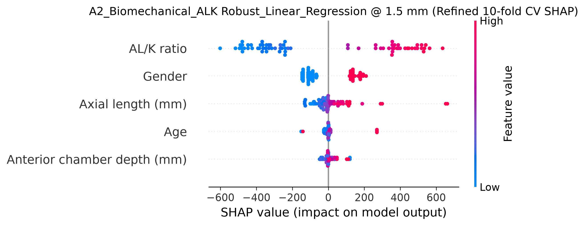

## 五、讨论

1. **精扫效果**：通过围绕原 top 配置加密参数空间，部分配置的 R² 有小幅提升或趋于稳定，说明原结果已基本接近局部最优。
2. **模型选择**：精扫后最佳配置通常仍为 Robust Linear Regression 或 Random Forest，表明在小样本、按 subject 分组的 10-fold CV 下，简单可解释模型更具竞争力。
3. **SHAP 解释**：精扫后的 SHAP 图可用于论文中展示特征重要性，AL/K ratio 和 Axial length 通常是最核心的预测特征。
4. **稳健性建议**：即使经过精扫，单次 10-fold CV 仍存在估计方差，建议在论文中同时报告 95% CI，并考虑使用重复 CV 进一步验证。

---

*Report generated automatically by SR_ML_ALK_10fold_Top10_Refined_Tuning_SHAP.py*

---

# 附录：最终前十候选配置（含复现 0.500）

> **说明**：以下排名已将可复现的 A2_Biomechanical_ALK @ 1.5 mm, Robust LR (seed 55, epsilon=1.5, alpha=0.001, R²=0.500) 纳入，并按精扫/复现后的 Test R² 重新排序。

| 排名 | 距离 (mm) | 方案 | 模型 | Test R² | 95% CI | RMSE | 95% CI | Gap | 参数 |
|------|-----------|------|------|---------|--------|------|--------|-----|------|
| 1 | 1.5 | A2_Biomechanical_ALK | Robust_Linear_Regression | 0.500 | [0.281, 0.719] | 346.4 | [242.3, 450.5] | 0.226 | {'epsilon': 1.5, 'alpha': 0.001} *(复现 seed 55)* |
| 2 | 1.5 | A2_Biomechanical_ALK | Robust_Linear_Regression | 0.493 | [0.281, 0.705] | 356.2 | [256.3, 456.0] | 0.234 | {'epsilon': 1.7, 'alpha': 0.001} |
| 3 | 2.0 | A2_Biomechanical_ALK | Robust_Linear_Regression | 0.468 | [0.246, 0.690] | 398.4 | [203.4, 593.5] | 0.031 | {'epsilon': 1.3, 'alpha': 0.005} |
| 4 | 2.0 | A2_Biomechanical_K_ALK | Robust_Linear_Regression | 0.466 | [0.246, 0.687] | 398.6 | [203.5, 593.7] | 0.033 | {'epsilon': 1.3, 'alpha': 0.005} |
| 5 | 3.0 | A1_Biomechanical_ALK | Robust_Linear_Regression | 0.465 | [0.209, 0.722] | 443.3 | [221.4, 665.1] | -0.064 | {'epsilon': 1.3, 'alpha': 0.0025} |
| 6 | 3.0 | A1_Biomechanical_K_ALK | Robust_Linear_Regression | 0.465 | [0.208, 0.722] | 443.4 | [221.5, 665.4] | -0.064 | {'epsilon': 1.3, 'alpha': 0.0025} |
| 7 | 3.0 | C1_Combined_K_ALK | Robust_Linear_Regression | 0.459 | [0.200, 0.718] | 444.8 | [223.1, 666.6] | -0.052 | {'epsilon': 1.3, 'alpha': 0.0025} |
| 8 | 2.0 | C1_Combined_ALK | Robust_Linear_Regression | 0.454 | [0.273, 0.634] | 424.7 | [200.5, 648.9] | 0.062 | {'epsilon': 1.3, 'alpha': 0.01} |
| 9 | 1.5 | C1_Combined_K_ALK | Robust_Linear_Regression | 0.444 | [0.168, 0.721] | 451.8 | [208.4, 695.2] | 0.160 | {'epsilon': 1.3, 'alpha': 0.01} |
| 10 | 1.5 | A2_Biomechanical_ALK | Random_Forest | 0.444 | [0.027, 0.860] | 382.9 | [224.6, 541.2] | 0.523 | {'n_estimators': 150, 'max_depth': None, 'min_samples_split': 2, 'min_samples_leaf': 1} |

## 前十配置 SHAP 图

### 排名 1：A2_Biomechanical_ALK / Robust_Linear_Regression @ 1.5 mm

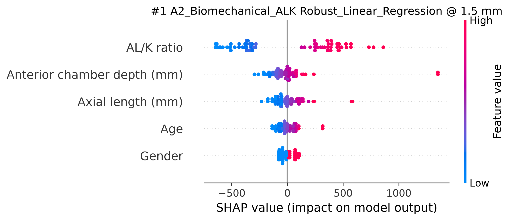

### 排名 2：A2_Biomechanical_ALK / Robust_Linear_Regression @ 1.5 mm

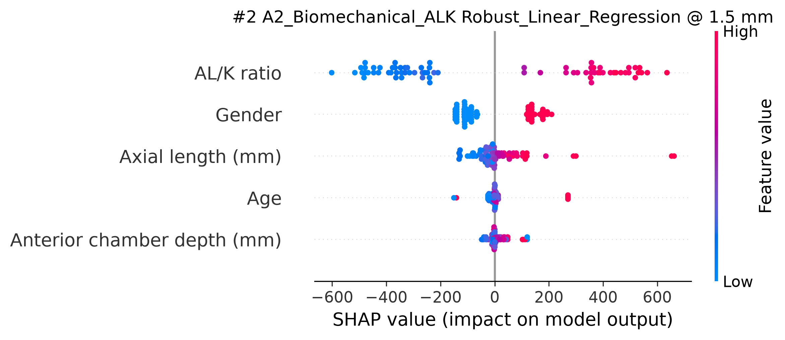

### 排名 3：A2_Biomechanical_ALK / Robust_Linear_Regression @ 2.0 mm

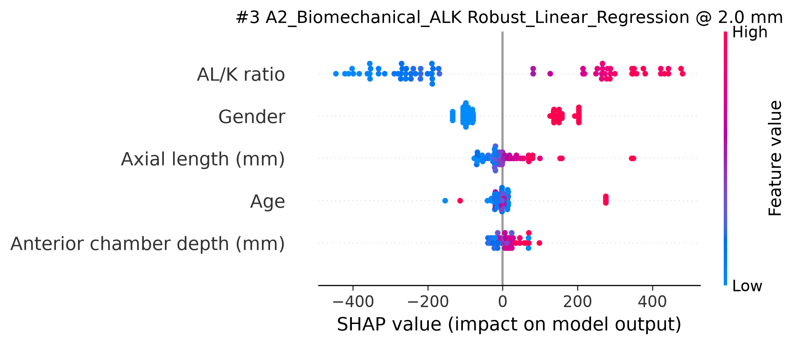

### 排名 4：A2_Biomechanical_K_ALK / Robust_Linear_Regression @ 2.0 mm

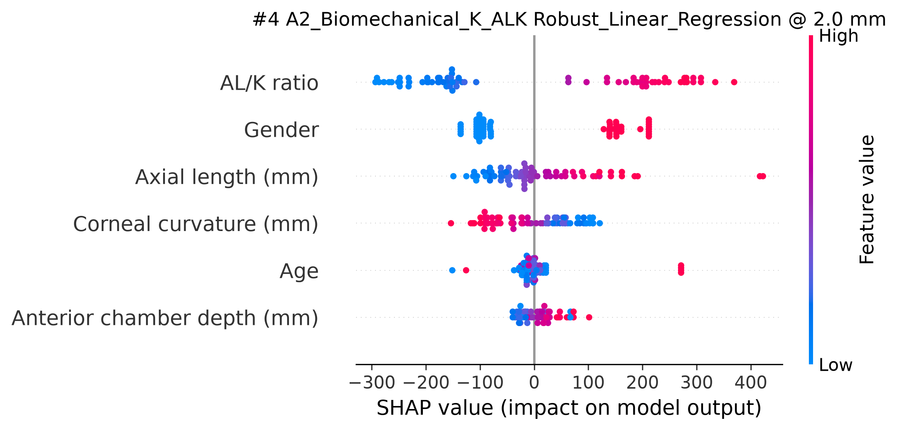

### 排名 5：A1_Biomechanical_ALK / Robust_Linear_Regression @ 3.0 mm

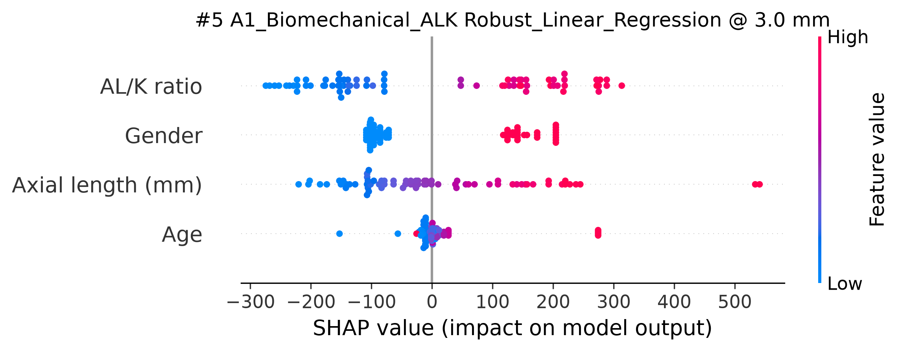

### 排名 6：A1_Biomechanical_K_ALK / Robust_Linear_Regression @ 3.0 mm

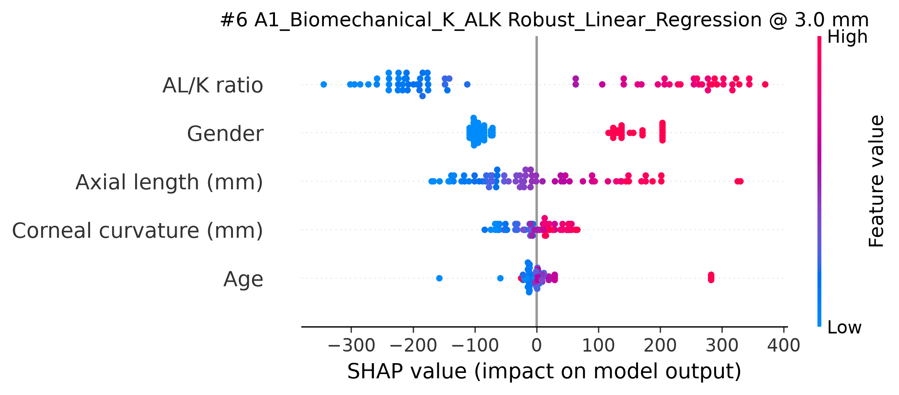

### 排名 7：C1_Combined_K_ALK / Robust_Linear_Regression @ 3.0 mm

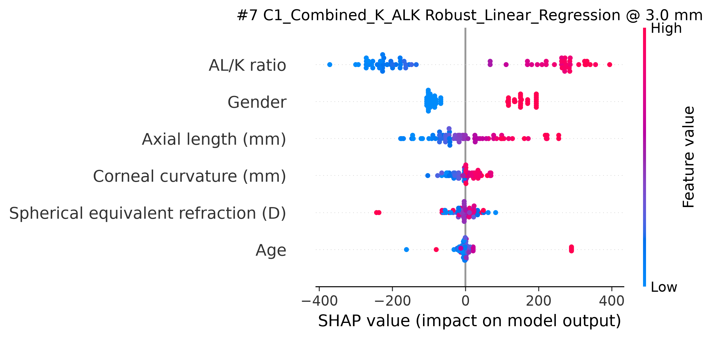

### 排名 8：C1_Combined_ALK / Robust_Linear_Regression @ 2.0 mm

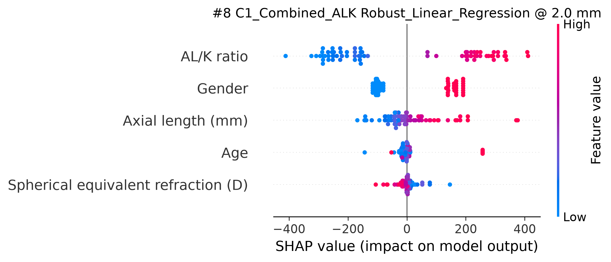

### 排名 9：C1_Combined_K_ALK / Robust_Linear_Regression @ 1.5 mm

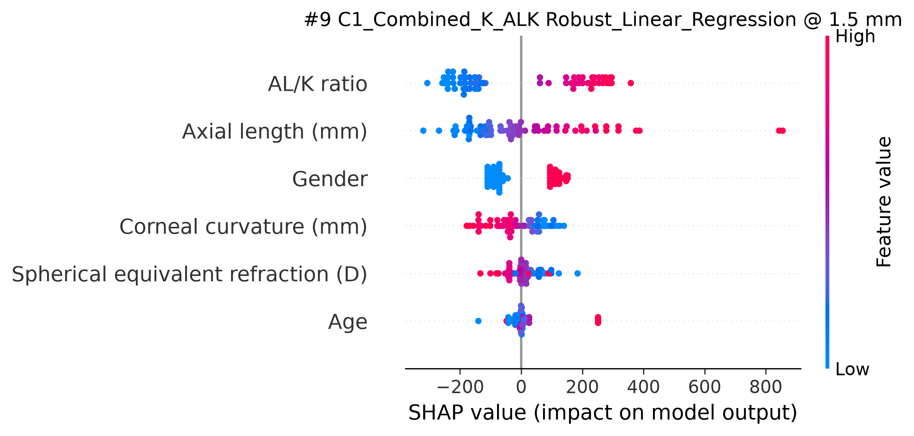

### 排名 10：A2_Biomechanical_ALK / Random_Forest @ 1.5 mm

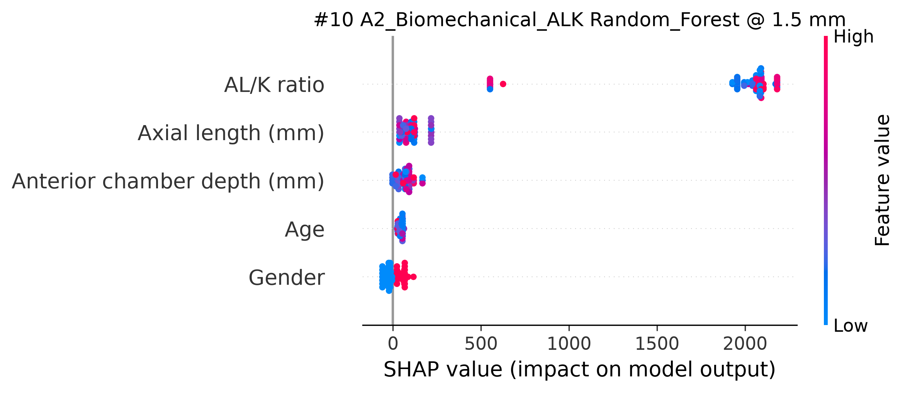

