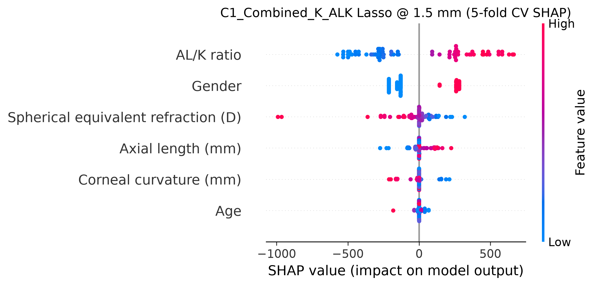

# SR0530 ALK 方案族 5-fold 最终统计报告

> **目标**：读取已有的 lenient_ALK 五折全模型寻优结果，按与 10-fold 最终报告相同的格式进行汇总，并生成最佳配置的 SHAP 解释图。

> **数据组**：lenient（71 眼 / 46 subjects）

> **交叉验证**：5-fold GroupKFold by Subject，按 Myopia 分层；置信区间基于 fold-level 标准差（t₀.₀₂₅,₄ = 2.776）。

> **搜索策略**：Random Search，每模型 30 组参数。

---

## 一、总体最佳配置

- **数据组**：lenient
- **距离**：1.5 mm
- **方案**：C1_Combined_K_ALK
- **模型**：Lasso
- **最佳 Test R²**：0.611 [95% CI: 0.356, 0.867]
- **最佳 Test RMSE**：446.6 [95% CI: 179.8, 713.4]
- **MAPE**：8.05%
- **Gap**：0.007
- **最佳参数**：{'alpha': 10.0}
- **样本量**：71 眼 / 46 subjects

## 二、各距离最佳结果

| 距离 (mm) | 最佳方案 | 最佳模型 | Test R² (95% CI) | RMSE (95% CI) | MAPE (%) | Gap | 最佳参数 |
|-----------|----------|---------|------------------|----------------|----------|-----|---------|
| 1.0 | A1_Biomechanical_K_ALK | Random_Forest | 0.451 [0.235, 0.667] | 523.6 [369.9, 677.2] | 11.55 | 0.292 | {'n_estimators': 100, 'max_depth': 2, 'min_samples_split': 5, 'min_samples_leaf': 1} |
| 1.5 | C1_Combined_K_ALK | Lasso | 0.611 [0.356, 0.867] | 446.6 [179.8, 713.4] | 8.05 | 0.007 | {'alpha': 10.0} |
| 2.0 | A2_Biomechanical_ALK | ElasticNet | 0.527 [0.321, 0.733] | 424.8 [217.2, 632.5] | 9.39 | 0.060 | {'alpha': 0.001, 'l1_ratio': 0.5} |
| 2.5 | A2_Biomechanical_ALK | Lasso | 0.485 [0.147, 0.823] | 406.3 [223.4, 589.1] | 11.85 | 0.111 | {'alpha': 10.0} |
| 3.0 | A2_Biomechanical_ALK | Ridge | 0.498 [0.031, 0.965] | 321.0 [225.0, 417.0] | 10.89 | 0.312 | {'alpha': 0.1} |
| 3.5 | A2_Biomechanical_K_ALK | Lasso | 0.418 [0.195, 0.640] | 480.5 [291.4, 669.6] | 14.22 | 0.108 | {'alpha': 10.0} |
| 4.0 | A2_Biomechanical_ALK | Lasso | 0.387 [0.073, 0.702] | 567.4 [411.2, 723.5] | 18.69 | 0.109 | {'alpha': 10.0} |
| 4.5 | A2_Biomechanical_K_ALK | Lasso | 0.335 [-0.060, 0.729] | 546.2 [415.1, 677.2] | 19.16 | 0.199 | {'alpha': 10.0} |
| 5.0 | A2_Biomechanical_ALK | Random_Forest | 0.458 [0.254, 0.662] | 476.3 [343.3, 609.2] | 17.43 | 0.448 | {'n_estimators': 100, 'max_depth': 5, 'min_samples_split': 2, 'min_samples_leaf': 1} |
| 5.5 | A2_Biomechanical_K_ALK | Lasso | 0.376 [0.139, 0.613] | 586.1 [468.5, 703.7] | 22.65 | 0.209 | {'alpha': 10.0} |
| 6.0 | A2_Biomechanical_ALK | Neural_Network | 0.466 [0.291, 0.642] | 604.9 [404.7, 805.1] | 20.74 | 0.190 | {'hidden_layer_sizes': (80,), 'alpha': 0.5, 'learning_rate_init': 0.001} |

## 三、每个 ALK 方案最佳结果

| 方案 | 最佳距离 | 最佳模型 | Test R² (95% CI) | RMSE (95% CI) | MAPE (%) | Gap | 最佳参数 |
|------|---------|---------|------------------|----------------|----------|-----|---------|
| A1_Biomechanical_ALK | 1.5 mm | Random_Forest | 0.544 [0.437, 0.652] | 401.1 [248.8, 553.5] | 8.67 | 0.245 | {'n_estimators': 100, 'max_depth': 2, 'min_samples_split': 5, 'min_samples_leaf': 1} |
| A1_Biomechanical_K_ALK | 1.5 mm | Random_Forest | 0.553 [0.306, 0.800] | 482.5 [230.5, 734.4] | 8.81 | 0.196 | {'n_estimators': 200, 'max_depth': None, 'min_samples_split': 2, 'min_samples_leaf': 4} |
| A2_Biomechanical_ALK | 1.5 mm | Lasso | 0.586 [0.454, 0.718] | 372.7 [263.9, 481.6] | 8.86 | 0.147 | {'alpha': 0.01} |
| A2_Biomechanical_K_ALK | 1.5 mm | Ridge | 0.577 [0.435, 0.720] | 375.7 [269.9, 481.4] | 8.87 | 0.165 | {'alpha': 0.1} |
| B_Clinical_ALK | 1.5 mm | Lasso | 0.537 [0.285, 0.788] | 484.3 [234.8, 733.9] | 9.50 | 0.066 | {'alpha': 10.0} |
| B_Clinical_K_ALK | 1.5 mm | ElasticNet | 0.608 [0.355, 0.861] | 449.0 [184.8, 713.3] | 8.12 | 0.013 | {'alpha': 0.001, 'l1_ratio': 0.5} |
| C1_Combined_ALK | 1.5 mm | Lasso | 0.611 [0.356, 0.867] | 446.6 [179.8, 713.4] | 8.05 | 0.007 | {'alpha': 10.0} |
| C1_Combined_K_ALK | 1.5 mm | Lasso | 0.611 [0.356, 0.867] | 446.6 [179.8, 713.4] | 8.05 | 0.007 | {'alpha': 10.0} |

## 四、每个模型最佳结果

| 模型 | 最佳距离 | 最佳方案 | Test R² (95% CI) | RMSE (95% CI) | MAPE (%) | Gap | 最佳参数 |
|------|---------|---------|------------------|----------------|----------|-----|---------|
| ElasticNet | 1.5 mm | B_Clinical_K_ALK | 0.608 [0.355, 0.861] | 449.0 [184.8, 713.3] | 8.12 | 0.013 | {'alpha': 0.001, 'l1_ratio': 0.5} |
| Lasso | 1.5 mm | C1_Combined_K_ALK | 0.611 [0.356, 0.867] | 446.6 [179.8, 713.4] | 8.05 | 0.007 | {'alpha': 10.0} |
| Neural_Network | 1.5 mm | C1_Combined_K_ALK | 0.514 [0.247, 0.781] | 494.3 [237.6, 751.0] | 9.24 | 0.090 | {'hidden_layer_sizes': (80,), 'alpha': 1.0, 'learning_rate_init': 0.0001} |
| Random_Forest | 1.5 mm | A2_Biomechanical_ALK | 0.567 [0.285, 0.848] | 476.0 [201.2, 750.7] | 8.89 | 0.197 | {'n_estimators': 200, 'max_depth': None, 'min_samples_split': 2, 'min_samples_leaf': 4} |
| Ridge | 1.5 mm | A2_Biomechanical_ALK | 0.585 [0.456, 0.715] | 373.5 [264.1, 483.0] | 8.87 | 0.148 | {'alpha': 0.1} |
| SVM | 1.5 mm | C1_Combined_K_ALK | 0.449 [0.234, 0.664] | 481.5 [168.9, 794.1] | 8.39 | 0.003 | {'C': 2000, 'epsilon': 300, 'gamma': 0.005} |
| XGBoost | 1.5 mm | A1_Biomechanical_K_ALK | 0.539 [0.285, 0.793] | 490.8 [241.4, 740.2] | 9.45 | 0.242 | {'learning_rate': 0.1, 'max_depth': 1, 'n_estimators': 100, 'reg_alpha': 0.5, 'reg_lambda': 1.0} |

## 五、与 10-fold 最终报告对比

| 距离 (mm) | 5-fold 最佳方案 | 5-fold 最佳模型 | 5-fold R² | 10-fold 最佳方案 | 10-fold 最佳模型 | 10-fold R² |
|-----------|----------------|----------------|-----------|-----------------|-----------------|------------|
| 1.0 | A1_Biomechanical_K_ALK | Random_Forest | 0.451 | C1_Combined_ALK | ElasticNet | 0.355 |
| 1.5 | C1_Combined_K_ALK | Lasso | 0.611 | C1_Combined_ALK | Robust_Linear_Regression | 0.504 |
| 2.0 | A2_Biomechanical_ALK | ElasticNet | 0.527 | A2_Biomechanical_ALK | Robust_Linear_Regression | 0.466 |
| 2.5 | A2_Biomechanical_ALK | Lasso | 0.485 | A2_Biomechanical_K_ALK | Robust_Linear_Regression | 0.266 |
| 3.0 | A2_Biomechanical_ALK | Ridge | 0.498 | A1_Biomechanical_ALK | Robust_Linear_Regression | 0.469 |
| 3.5 | A2_Biomechanical_K_ALK | Lasso | 0.418 | A1_Biomechanical_ALK | Robust_Linear_Regression | 0.406 |
| 4.0 | A2_Biomechanical_ALK | Lasso | 0.387 | A1_Biomechanical_ALK | Robust_Linear_Regression | 0.335 |
| 4.5 | A2_Biomechanical_K_ALK | Lasso | 0.335 | C1_Combined_ALK | Robust_Linear_Regression | 0.236 |
| 5.0 | A2_Biomechanical_ALK | Random_Forest | 0.458 | B_Clinical_ALK | Robust_Linear_Regression | 0.131 |
| 5.5 | A2_Biomechanical_K_ALK | Lasso | 0.376 | C1_Combined_K_ALK | SVM | 0.167 |
| 6.0 | A2_Biomechanical_ALK | Neural_Network | 0.466 | A2_Biomechanical_ALK | Neural_Network | 0.170 |

## 六、全距离 / 全方案 / 全模型结果汇总

| 距离 (mm) | 方案 | 模型 | Test R² | RMSE | MAPE (%) | Gap | 最佳参数 |
|-----------|------|------|---------|------|----------|-----|---------|
| 1.0 | A1_Biomechanical_ALK | Random_Forest | 0.437 | 530.9 | 11.75 | 0.301 | {'n_estimators': 100, 'max_depth': 2, 'min_samples_split': 5, 'min_samples_leaf': 1} |
| 1.0 | A1_Biomechanical_ALK | Ridge | 0.436 | 525.9 | 11.69 | 0.125 | {'alpha': 0.1} |
| 1.0 | A1_Biomechanical_ALK | ElasticNet | 0.436 | 525.9 | 11.69 | 0.125 | {'alpha': 0.01, 'l1_ratio': 0.9} |
| 1.0 | A1_Biomechanical_ALK | Lasso | 0.436 | 525.9 | 11.69 | 0.126 | {'alpha': 0.01} |
| 1.0 | A1_Biomechanical_ALK | SVM | 0.402 | 585.4 | 11.12 | 0.287 | {'C': 5000, 'epsilon': 100, 'gamma': 0.05} |
| 1.0 | A1_Biomechanical_ALK | Neural_Network | 0.395 | 504.2 | 10.06 | 0.254 | {'hidden_layer_sizes': (80, 40), 'alpha': 1.0, 'learning_rate_init': 0.0001} |
| 1.0 | A1_Biomechanical_ALK | XGBoost | 0.383 | 577.6 | 12.06 | 0.330 | {'learning_rate': 0.1, 'max_depth': 1, 'n_estimators': 100, 'reg_alpha': 0.5, 'reg_lambda': 1.0} |
| 1.0 | A1_Biomechanical_K_ALK | Random_Forest | 0.451 | 523.6 | 11.55 | 0.292 | {'n_estimators': 100, 'max_depth': 2, 'min_samples_split': 5, 'min_samples_leaf': 1} |
| 1.0 | A1_Biomechanical_K_ALK | XGBoost | 0.436 | 553.6 | 11.30 | 0.296 | {'learning_rate': 0.1, 'max_depth': 1, 'n_estimators': 100, 'reg_alpha': 0.5, 'reg_lambda': 1.0} |
| 1.0 | A1_Biomechanical_K_ALK | Ridge | 0.424 | 530.6 | 11.80 | 0.142 | {'alpha': 0.1} |
| 1.0 | A1_Biomechanical_K_ALK | ElasticNet | 0.416 | 533.7 | 11.84 | 0.153 | {'alpha': 0.01, 'l1_ratio': 0.9} |
| 1.0 | A1_Biomechanical_K_ALK | SVM | 0.376 | 516.3 | 10.19 | 0.023 | {'C': 5000, 'epsilon': 800, 'gamma': 0.01} |
| 1.0 | A1_Biomechanical_K_ALK | Neural_Network | 0.372 | 559.1 | 10.68 | 0.142 | {'hidden_layer_sizes': (60,), 'alpha': 1.0, 'learning_rate_init': 0.0001} |
| 1.0 | A1_Biomechanical_K_ALK | Lasso | 0.370 | 514.9 | 10.39 | 0.226 | {'alpha': 10.0} |
| 1.0 | A2_Biomechanical_ALK | Ridge | 0.450 | 520.7 | 11.55 | 0.145 | {'alpha': 0.1} |
| 1.0 | A2_Biomechanical_ALK | ElasticNet | 0.450 | 520.9 | 11.55 | 0.146 | {'alpha': 0.01, 'l1_ratio': 0.9} |
| 1.0 | A2_Biomechanical_ALK | Lasso | 0.449 | 521.2 | 11.56 | 0.147 | {'alpha': 0.01} |
| 1.0 | A2_Biomechanical_ALK | Random_Forest | 0.436 | 557.4 | 10.97 | 0.310 | {'n_estimators': 200, 'max_depth': None, 'min_samples_split': 2, 'min_samples_leaf': 4} |
| 1.0 | A2_Biomechanical_ALK | XGBoost | 0.346 | 591.7 | 12.37 | 0.381 | {'learning_rate': 0.1, 'max_depth': 1, 'n_estimators': 100, 'reg_alpha': 0.5, 'reg_lambda': 1.0} |
| 1.0 | A2_Biomechanical_ALK | SVM | 0.336 | 618.8 | 12.10 | 0.392 | {'C': 5000, 'epsilon': 100, 'gamma': 0.05} |
| 1.0 | A2_Biomechanical_ALK | Neural_Network | 0.299 | 530.0 | 10.74 | 0.447 | {'hidden_layer_sizes': (80, 40), 'alpha': 1.0, 'learning_rate_init': 0.0001} |
| 1.0 | A2_Biomechanical_K_ALK | Ridge | 0.445 | 522.5 | 11.55 | 0.156 | {'alpha': 0.1} |
| 1.0 | A2_Biomechanical_K_ALK | Random_Forest | 0.444 | 529.3 | 11.68 | 0.313 | {'n_estimators': 100, 'max_depth': 2, 'min_samples_split': 5, 'min_samples_leaf': 1} |
| 1.0 | A2_Biomechanical_K_ALK | ElasticNet | 0.438 | 524.5 | 11.56 | 0.166 | {'alpha': 0.01, 'l1_ratio': 0.9} |
| 1.0 | A2_Biomechanical_K_ALK | Lasso | 0.408 | 569.8 | 11.20 | 0.101 | {'alpha': 10.0} |
| 1.0 | A2_Biomechanical_K_ALK | XGBoost | 0.393 | 570.7 | 11.77 | 0.352 | {'learning_rate': 0.1, 'max_depth': 1, 'n_estimators': 100, 'reg_alpha': 0.5, 'reg_lambda': 1.0} |
| 1.0 | A2_Biomechanical_K_ALK | SVM | 0.371 | 517.4 | 9.97 | 0.029 | {'C': 5000, 'epsilon': 800, 'gamma': 0.01} |
| 1.0 | A2_Biomechanical_K_ALK | Neural_Network | 0.330 | 532.6 | 11.04 | 0.295 | {'hidden_layer_sizes': (100,), 'alpha': 0.1, 'learning_rate_init': 0.001} |
| 1.0 | B_Clinical_ALK | Lasso | 0.439 | 500.1 | 10.14 | 0.171 | {'alpha': 10.0} |
| 1.0 | B_Clinical_ALK | ElasticNet | 0.435 | 501.0 | 10.19 | 0.176 | {'alpha': 0.01, 'l1_ratio': 0.3} |
| 1.0 | B_Clinical_ALK | Ridge | 0.417 | 528.5 | 11.75 | 0.148 | {'alpha': 0.1} |
| 1.0 | B_Clinical_ALK | SVM | 0.398 | 520.0 | 10.57 | -0.021 | {'C': 5000, 'epsilon': 800, 'gamma': 0.01} |
| 1.0 | B_Clinical_ALK | Random_Forest | 0.391 | 531.9 | 10.99 | 0.219 | {'n_estimators': 50, 'max_depth': 2, 'min_samples_split': 10, 'min_samples_leaf': 2} |
| 1.0 | B_Clinical_ALK | Neural_Network | 0.339 | 553.1 | 12.13 | 0.122 | {'hidden_layer_sizes': (60,), 'alpha': 1.0, 'learning_rate_init': 0.001} |
| 1.0 | B_Clinical_ALK | XGBoost | 0.319 | 561.5 | 12.12 | 0.356 | {'learning_rate': 0.1, 'max_depth': 1, 'n_estimators': 100, 'reg_alpha': 0.5, 'reg_lambda': 2.0} |
| 1.0 | B_Clinical_K_ALK | Lasso | 0.417 | 488.9 | 9.38 | 0.203 | {'alpha': 1.0} |
| 1.0 | B_Clinical_K_ALK | Random_Forest | 0.407 | 533.8 | 11.75 | 0.336 | {'n_estimators': 100, 'max_depth': 2, 'min_samples_split': 5, 'min_samples_leaf': 1} |
| 1.0 | B_Clinical_K_ALK | SVM | 0.383 | 525.4 | 10.67 | 0.001 | {'C': 5000, 'epsilon': 800, 'gamma': 0.01} |
| 1.0 | B_Clinical_K_ALK | ElasticNet | 0.373 | 581.3 | 11.39 | 0.143 | {'alpha': 0.001, 'l1_ratio': 0.5} |
| 1.0 | B_Clinical_K_ALK | Ridge | 0.344 | 544.5 | 11.97 | 0.262 | {'alpha': 0.1} |
| 1.0 | B_Clinical_K_ALK | XGBoost | 0.276 | 573.3 | 11.61 | 0.406 | {'learning_rate': 0.05, 'max_depth': 1, 'n_estimators': 100, 'reg_alpha': 1.0, 'reg_lambda': 2.0} |
| 1.0 | B_Clinical_K_ALK | Neural_Network | 0.265 | 558.2 | 11.24 | 0.406 | {'hidden_layer_sizes': (80, 40), 'alpha': 1.0, 'learning_rate_init': 0.0001} |
| 1.0 | C1_Combined_ALK | Random_Forest | 0.446 | 519.4 | 11.62 | 0.312 | {'n_estimators': 100, 'max_depth': 2, 'min_samples_split': 5, 'min_samples_leaf': 1} |
| 1.0 | C1_Combined_ALK | Lasso | 0.423 | 487.7 | 9.36 | 0.197 | {'alpha': 1.0} |
| 1.0 | C1_Combined_ALK | Ridge | 0.419 | 512.7 | 10.10 | 0.167 | {'alpha': 10.0} |
| 1.0 | C1_Combined_ALK | Neural_Network | 0.414 | 501.0 | 9.91 | 0.311 | {'hidden_layer_sizes': (80, 40), 'alpha': 1.0, 'learning_rate_init': 0.0001} |
| 1.0 | C1_Combined_ALK | SVM | 0.412 | 504.3 | 9.93 | 0.022 | {'C': 5000, 'epsilon': 800, 'gamma': 0.01} |
| 1.0 | C1_Combined_ALK | XGBoost | 0.399 | 551.4 | 11.52 | 0.254 | {'learning_rate': 0.05, 'max_depth': 1, 'n_estimators': 50, 'reg_alpha': 2.0, 'reg_lambda': 0.1} |
| 1.0 | C1_Combined_ALK | ElasticNet | 0.388 | 569.9 | 10.71 | 0.142 | {'alpha': 1.0, 'l1_ratio': 0.3} |
| 1.0 | C1_Combined_K_ALK | Random_Forest | 0.451 | 517.8 | 11.56 | 0.311 | {'n_estimators': 100, 'max_depth': 2, 'min_samples_split': 5, 'min_samples_leaf': 1} |
| 1.0 | C1_Combined_K_ALK | ElasticNet | 0.439 | 491.9 | 9.50 | 0.167 | {'alpha': 1.0, 'l1_ratio': 0.7} |
| 1.0 | C1_Combined_K_ALK | Ridge | 0.437 | 488.1 | 9.38 | 0.177 | {'alpha': 10.0} |
| 1.0 | C1_Combined_K_ALK | Lasso | 0.417 | 489.3 | 9.38 | 0.204 | {'alpha': 1.0} |
| 1.0 | C1_Combined_K_ALK | XGBoost | 0.414 | 544.8 | 11.40 | 0.245 | {'learning_rate': 0.05, 'max_depth': 1, 'n_estimators': 50, 'reg_alpha': 2.0, 'reg_lambda': 0.1} |
| 1.0 | C1_Combined_K_ALK | Neural_Network | 0.412 | 498.9 | 9.68 | 0.217 | {'hidden_layer_sizes': (60,), 'alpha': 0.5, 'learning_rate_init': 0.0001} |
| 1.0 | C1_Combined_K_ALK | SVM | 0.394 | 511.0 | 10.13 | 0.042 | {'C': 5000, 'epsilon': 800, 'gamma': 0.01} |
| 1.5 | A1_Biomechanical_ALK | Random_Forest | 0.544 | 401.1 | 8.67 | 0.245 | {'n_estimators': 100, 'max_depth': 2, 'min_samples_split': 5, 'min_samples_leaf': 1} |
| 1.5 | A1_Biomechanical_ALK | Lasso | 0.540 | 483.7 | 8.76 | 0.054 | {'alpha': 10.0} |
| 1.5 | A1_Biomechanical_ALK | ElasticNet | 0.535 | 486.3 | 8.83 | 0.060 | {'alpha': 0.001, 'l1_ratio': 0.5} |
| 1.5 | A1_Biomechanical_ALK | Neural_Network | 0.497 | 512.6 | 9.27 | 0.122 | {'hidden_layer_sizes': (80,), 'alpha': 1.0, 'learning_rate_init': 0.0001} |
| 1.5 | A1_Biomechanical_ALK | XGBoost | 0.491 | 520.3 | 9.93 | 0.273 | {'learning_rate': 0.1, 'max_depth': 1, 'n_estimators': 100, 'reg_alpha': 0.5, 'reg_lambda': 1.0} |
| 1.5 | A1_Biomechanical_ALK | Ridge | 0.471 | 438.1 | 9.93 | 0.167 | {'alpha': 0.1} |
| 1.5 | A1_Biomechanical_ALK | SVM | 0.406 | 496.9 | 8.85 | 0.023 | {'C': 2000, 'epsilon': 300, 'gamma': 0.005} |
| 1.5 | A1_Biomechanical_K_ALK | Random_Forest | 0.553 | 482.5 | 8.81 | 0.196 | {'n_estimators': 200, 'max_depth': None, 'min_samples_split': 2, 'min_samples_leaf': 4} |
| 1.5 | A1_Biomechanical_K_ALK | ElasticNet | 0.540 | 482.2 | 8.71 | 0.061 | {'alpha': 0.001, 'l1_ratio': 0.5} |
| 1.5 | A1_Biomechanical_K_ALK | Lasso | 0.540 | 483.7 | 8.76 | 0.054 | {'alpha': 10.0} |
| 1.5 | A1_Biomechanical_K_ALK | XGBoost | 0.539 | 490.8 | 9.45 | 0.242 | {'learning_rate': 0.1, 'max_depth': 1, 'n_estimators': 100, 'reg_alpha': 0.5, 'reg_lambda': 1.0} |
| 1.5 | A1_Biomechanical_K_ALK | Neural_Network | 0.497 | 517.7 | 10.30 | 0.130 | {'hidden_layer_sizes': (80,), 'alpha': 1.0, 'learning_rate_init': 0.0001} |
| 1.5 | A1_Biomechanical_K_ALK | Ridge | 0.466 | 439.4 | 9.93 | 0.178 | {'alpha': 0.1} |
| 1.5 | A1_Biomechanical_K_ALK | SVM | 0.429 | 490.3 | 8.69 | 0.011 | {'C': 2000, 'epsilon': 300, 'gamma': 0.005} |
| 1.5 | A2_Biomechanical_ALK | Lasso | 0.586 | 372.7 | 8.86 | 0.147 | {'alpha': 0.01} |
| 1.5 | A2_Biomechanical_ALK | ElasticNet | 0.586 | 373.2 | 8.87 | 0.148 | {'alpha': 0.01, 'l1_ratio': 0.9} |
| 1.5 | A2_Biomechanical_ALK | Ridge | 0.585 | 373.5 | 8.87 | 0.148 | {'alpha': 0.1} |
| 1.5 | A2_Biomechanical_ALK | Random_Forest | 0.567 | 476.0 | 8.89 | 0.197 | {'n_estimators': 200, 'max_depth': None, 'min_samples_split': 2, 'min_samples_leaf': 4} |
| 1.5 | A2_Biomechanical_ALK | XGBoost | 0.467 | 476.1 | 9.49 | 0.256 | {'learning_rate': 0.1, 'max_depth': 1, 'n_estimators': 30, 'reg_alpha': 1.0, 'reg_lambda': 0.1} |
| 1.5 | A2_Biomechanical_ALK | SVM | 0.421 | 526.4 | 12.91 | 0.103 | {'C': 2000, 'epsilon': 800, 'gamma': 0.03} |
| 1.5 | A2_Biomechanical_ALK | Neural_Network | 0.368 | 498.3 | 8.98 | 0.251 | {'hidden_layer_sizes': (100,), 'alpha': 0.3, 'learning_rate_init': 0.0005} |
| 1.5 | A2_Biomechanical_K_ALK | Ridge | 0.577 | 375.7 | 8.87 | 0.165 | {'alpha': 0.1} |
| 1.5 | A2_Biomechanical_K_ALK | ElasticNet | 0.574 | 375.2 | 8.86 | 0.174 | {'alpha': 0.01, 'l1_ratio': 0.9} |
| 1.5 | A2_Biomechanical_K_ALK | Random_Forest | 0.561 | 477.0 | 8.95 | 0.204 | {'n_estimators': 200, 'max_depth': None, 'min_samples_split': 2, 'min_samples_leaf': 4} |
| 1.5 | A2_Biomechanical_K_ALK | Lasso | 0.553 | 476.6 | 8.77 | 0.074 | {'alpha': 10.0} |
| 1.5 | A2_Biomechanical_K_ALK | XGBoost | 0.530 | 492.9 | 9.76 | 0.267 | {'learning_rate': 0.1, 'max_depth': 1, 'n_estimators': 100, 'reg_alpha': 0.5, 'reg_lambda': 1.0} |
| 1.5 | A2_Biomechanical_K_ALK | Neural_Network | 0.495 | 506.8 | 8.98 | 0.109 | {'hidden_layer_sizes': (80,), 'alpha': 1.0, 'learning_rate_init': 0.0001} |
| 1.5 | A2_Biomechanical_K_ALK | SVM | 0.418 | 493.4 | 8.83 | 0.029 | {'C': 2000, 'epsilon': 300, 'gamma': 0.005} |
| 1.5 | B_Clinical_ALK | Lasso | 0.537 | 484.3 | 9.50 | 0.066 | {'alpha': 10.0} |
| 1.5 | B_Clinical_ALK | ElasticNet | 0.530 | 487.2 | 9.66 | 0.073 | {'alpha': 0.001, 'l1_ratio': 0.5} |
| 1.5 | B_Clinical_ALK | Random_Forest | 0.466 | 431.6 | 9.94 | 0.287 | {'n_estimators': 100, 'max_depth': 2, 'min_samples_split': 5, 'min_samples_leaf': 1} |
| 1.5 | B_Clinical_ALK | Ridge | 0.428 | 449.3 | 10.15 | 0.193 | {'alpha': 0.1} |
| 1.5 | B_Clinical_ALK | Neural_Network | 0.419 | 543.6 | 10.87 | 0.206 | {'hidden_layer_sizes': (80,), 'alpha': 1.0, 'learning_rate_init': 0.0001} |
| 1.5 | B_Clinical_ALK | XGBoost | 0.412 | 497.6 | 9.81 | 0.282 | {'learning_rate': 0.1, 'max_depth': 1, 'n_estimators': 30, 'reg_alpha': 1.0, 'reg_lambda': 0.1} |
| 1.5 | B_Clinical_ALK | SVM | 0.398 | 502.5 | 8.73 | -0.012 | {'C': 2000, 'epsilon': 300, 'gamma': 0.005} |
| 1.5 | B_Clinical_K_ALK | ElasticNet | 0.608 | 449.0 | 8.12 | 0.013 | {'alpha': 0.001, 'l1_ratio': 0.5} |
| 1.5 | B_Clinical_K_ALK | Lasso | 0.582 | 460.6 | 8.63 | 0.035 | {'alpha': 10.0} |
| 1.5 | B_Clinical_K_ALK | Random_Forest | 0.501 | 420.4 | 9.82 | 0.274 | {'n_estimators': 100, 'max_depth': 2, 'min_samples_split': 5, 'min_samples_leaf': 1} |
| 1.5 | B_Clinical_K_ALK | Ridge | 0.483 | 432.0 | 9.80 | 0.178 | {'alpha': 0.1} |
| 1.5 | B_Clinical_K_ALK | XGBoost | 0.412 | 497.2 | 9.76 | 0.283 | {'learning_rate': 0.1, 'max_depth': 1, 'n_estimators': 30, 'reg_alpha': 1.0, 'reg_lambda': 0.1} |
| 1.5 | B_Clinical_K_ALK | SVM | 0.400 | 501.8 | 8.85 | -0.002 | {'C': 2000, 'epsilon': 300, 'gamma': 0.005} |
| 1.5 | B_Clinical_K_ALK | Neural_Network | 0.278 | 610.1 | 13.32 | 0.333 | {'hidden_layer_sizes': (80,), 'alpha': 1.0, 'learning_rate_init': 0.0001} |
| 1.5 | C1_Combined_ALK | Lasso | 0.611 | 446.6 | 8.05 | 0.007 | {'alpha': 10.0} |
| 1.5 | C1_Combined_ALK | ElasticNet | 0.606 | 450.8 | 8.21 | 0.013 | {'alpha': 0.001, 'l1_ratio': 0.5} |
| 1.5 | C1_Combined_ALK | Random_Forest | 0.548 | 399.0 | 8.54 | 0.245 | {'n_estimators': 100, 'max_depth': 2, 'min_samples_split': 5, 'min_samples_leaf': 1} |
| 1.5 | C1_Combined_ALK | Ridge | 0.472 | 437.6 | 9.94 | 0.186 | {'alpha': 0.1} |
| 1.5 | C1_Combined_ALK | SVM | 0.433 | 487.0 | 8.49 | 0.005 | {'C': 2000, 'epsilon': 300, 'gamma': 0.005} |
| 1.5 | C1_Combined_ALK | XGBoost | 0.417 | 495.7 | 9.98 | 0.307 | {'learning_rate': 0.1, 'max_depth': 1, 'n_estimators': 30, 'reg_alpha': 1.0, 'reg_lambda': 0.1} |
| 1.5 | C1_Combined_ALK | Neural_Network | 0.403 | 445.4 | 9.37 | 0.270 | {'hidden_layer_sizes': (80, 40), 'alpha': 1.0, 'learning_rate_init': 0.0001} |
| 1.5 | C1_Combined_K_ALK | Lasso | 0.611 | 446.6 | 8.05 | 0.007 | {'alpha': 10.0} |
| 1.5 | C1_Combined_K_ALK | ElasticNet | 0.604 | 451.0 | 8.13 | 0.018 | {'alpha': 0.001, 'l1_ratio': 0.5} |
| 1.5 | C1_Combined_K_ALK | Random_Forest | 0.546 | 487.7 | 8.99 | 0.210 | {'n_estimators': 200, 'max_depth': None, 'min_samples_split': 2, 'min_samples_leaf': 4} |
| 1.5 | C1_Combined_K_ALK | Neural_Network | 0.514 | 494.3 | 9.24 | 0.090 | {'hidden_layer_sizes': (80,), 'alpha': 1.0, 'learning_rate_init': 0.0001} |
| 1.5 | C1_Combined_K_ALK | Ridge | 0.476 | 527.7 | 9.86 | 0.035 | {'alpha': 100.0} |
| 1.5 | C1_Combined_K_ALK | SVM | 0.449 | 481.5 | 8.39 | 0.003 | {'C': 2000, 'epsilon': 300, 'gamma': 0.005} |
| 1.5 | C1_Combined_K_ALK | XGBoost | 0.443 | 486.0 | 9.46 | 0.285 | {'learning_rate': 0.1, 'max_depth': 1, 'n_estimators': 30, 'reg_alpha': 1.0, 'reg_lambda': 0.1} |
| 2.0 | A1_Biomechanical_ALK | Random_Forest | 0.481 | 445.2 | 9.68 | 0.205 | {'n_estimators': 200, 'max_depth': None, 'min_samples_split': 2, 'min_samples_leaf': 4} |
| 2.0 | A1_Biomechanical_ALK | Lasso | 0.463 | 448.2 | 9.75 | 0.056 | {'alpha': 10.0} |
| 2.0 | A1_Biomechanical_ALK | XGBoost | 0.463 | 450.6 | 9.75 | 0.250 | {'learning_rate': 0.1, 'max_depth': 1, 'n_estimators': 100, 'reg_alpha': 0.5, 'reg_lambda': 1.0} |
| 2.0 | A1_Biomechanical_ALK | ElasticNet | 0.459 | 449.6 | 9.92 | 0.062 | {'alpha': 0.001, 'l1_ratio': 0.5} |
| 2.0 | A1_Biomechanical_ALK | Neural_Network | 0.408 | 472.8 | 10.46 | 0.115 | {'hidden_layer_sizes': (80,), 'alpha': 1.0, 'learning_rate_init': 0.0001} |
| 2.0 | A1_Biomechanical_ALK | Ridge | 0.357 | 441.8 | 11.44 | 0.094 | {'alpha': 1.0} |
| 2.0 | A1_Biomechanical_ALK | SVM | 0.321 | 508.8 | 10.83 | 0.136 | {'C': 5000, 'epsilon': 300, 'gamma': 0.005} |
| 2.0 | A1_Biomechanical_K_ALK | Random_Forest | 0.470 | 450.8 | 9.50 | 0.229 | {'n_estimators': 200, 'max_depth': None, 'min_samples_split': 2, 'min_samples_leaf': 4} |
| 2.0 | A1_Biomechanical_K_ALK | Lasso | 0.463 | 448.2 | 9.75 | 0.056 | {'alpha': 10.0} |
| 2.0 | A1_Biomechanical_K_ALK | ElasticNet | 0.453 | 451.7 | 9.91 | 0.070 | {'alpha': 0.001, 'l1_ratio': 0.5} |
| 2.0 | A1_Biomechanical_K_ALK | XGBoost | 0.435 | 461.9 | 9.61 | 0.294 | {'learning_rate': 0.1, 'max_depth': 1, 'n_estimators': 100, 'reg_alpha': 0.5, 'reg_lambda': 1.0} |
| 2.0 | A1_Biomechanical_K_ALK | Ridge | 0.388 | 465.8 | 11.13 | -0.049 | {'alpha': 100.0} |
| 2.0 | A1_Biomechanical_K_ALK | Neural_Network | 0.364 | 485.9 | 12.03 | 0.173 | {'hidden_layer_sizes': (80,), 'alpha': 1.0, 'learning_rate_init': 0.0001} |
| 2.0 | A1_Biomechanical_K_ALK | SVM | 0.330 | 453.4 | 9.74 | 0.064 | {'C': 2000, 'epsilon': 300, 'gamma': 0.005} |
| 2.0 | A2_Biomechanical_ALK | ElasticNet | 0.527 | 424.8 | 9.39 | 0.060 | {'alpha': 0.001, 'l1_ratio': 0.5} |
| 2.0 | A2_Biomechanical_ALK | Random_Forest | 0.508 | 431.7 | 9.00 | 0.218 | {'n_estimators': 200, 'max_depth': None, 'min_samples_split': 2, 'min_samples_leaf': 4} |
| 2.0 | A2_Biomechanical_ALK | Lasso | 0.507 | 432.6 | 9.42 | 0.078 | {'alpha': 10.0} |
| 2.0 | A2_Biomechanical_ALK | Ridge | 0.470 | 395.7 | 10.39 | 0.067 | {'alpha': 1.0} |
| 2.0 | A2_Biomechanical_ALK | XGBoost | 0.434 | 458.3 | 10.23 | 0.308 | {'learning_rate': 0.1, 'max_depth': 1, 'n_estimators': 100, 'reg_alpha': 0.5, 'reg_lambda': 1.0} |
| 2.0 | A2_Biomechanical_ALK | SVM | 0.293 | 464.3 | 9.81 | 0.088 | {'C': 2000, 'epsilon': 300, 'gamma': 0.005} |
| 2.0 | A2_Biomechanical_ALK | Neural_Network | 0.269 | 515.1 | 11.86 | 0.284 | {'hidden_layer_sizes': (80,), 'alpha': 1.0, 'learning_rate_init': 0.0001} |
| 2.0 | A2_Biomechanical_K_ALK | ElasticNet | 0.524 | 426.3 | 9.38 | 0.067 | {'alpha': 0.001, 'l1_ratio': 0.5} |
| 2.0 | A2_Biomechanical_K_ALK | Lasso | 0.507 | 432.6 | 9.42 | 0.078 | {'alpha': 10.0} |
| 2.0 | A2_Biomechanical_K_ALK | Random_Forest | 0.492 | 438.9 | 9.13 | 0.238 | {'n_estimators': 200, 'max_depth': None, 'min_samples_split': 2, 'min_samples_leaf': 4} |
| 2.0 | A2_Biomechanical_K_ALK | Ridge | 0.467 | 396.3 | 10.47 | 0.069 | {'alpha': 1.0} |
| 2.0 | A2_Biomechanical_K_ALK | XGBoost | 0.413 | 465.3 | 9.98 | 0.353 | {'learning_rate': 0.1, 'max_depth': 1, 'n_estimators': 100, 'reg_alpha': 0.5, 'reg_lambda': 1.0} |
| 2.0 | A2_Biomechanical_K_ALK | Neural_Network | 0.354 | 488.4 | 11.08 | 0.263 | {'hidden_layer_sizes': (80,), 'alpha': 0.3, 'learning_rate_init': 0.0001} |
| 2.0 | A2_Biomechanical_K_ALK | SVM | 0.327 | 454.0 | 9.69 | 0.076 | {'C': 2000, 'epsilon': 300, 'gamma': 0.005} |
| 2.0 | B_Clinical_ALK | Lasso | 0.442 | 454.7 | 10.33 | 0.087 | {'alpha': 10.0} |
| 2.0 | B_Clinical_ALK | ElasticNet | 0.435 | 456.8 | 10.46 | 0.095 | {'alpha': 0.001, 'l1_ratio': 0.5} |
| 2.0 | B_Clinical_ALK | Neural_Network | 0.373 | 470.5 | 11.81 | 0.092 | {'hidden_layer_sizes': (80,), 'alpha': 0.5, 'learning_rate_init': 0.001} |
| 2.0 | B_Clinical_ALK | Random_Forest | 0.354 | 470.2 | 11.38 | 0.322 | {'n_estimators': 200, 'max_depth': None, 'min_samples_split': 10, 'min_samples_leaf': 2} |
| 2.0 | B_Clinical_ALK | Ridge | 0.320 | 453.0 | 12.00 | 0.133 | {'alpha': 1.0} |
| 2.0 | B_Clinical_ALK | SVM | 0.297 | 456.5 | 9.82 | 0.103 | {'C': 2000, 'epsilon': 300, 'gamma': 0.005} |
| 2.0 | B_Clinical_ALK | XGBoost | 0.259 | 432.9 | 10.35 | 0.355 | {'learning_rate': 0.1, 'max_depth': 1, 'n_estimators': 30, 'reg_alpha': 1.0, 'reg_lambda': 0.1} |
| 2.0 | B_Clinical_K_ALK | ElasticNet | 0.486 | 441.3 | 9.99 | 0.060 | {'alpha': 0.001, 'l1_ratio': 0.5} |
| 2.0 | B_Clinical_K_ALK | Lasso | 0.446 | 454.7 | 10.24 | 0.097 | {'alpha': 10.0} |
| 2.0 | B_Clinical_K_ALK | Random_Forest | 0.393 | 481.0 | 10.16 | 0.284 | {'n_estimators': 200, 'max_depth': None, 'min_samples_split': 2, 'min_samples_leaf': 4} |
| 2.0 | B_Clinical_K_ALK | Ridge | 0.357 | 441.2 | 11.46 | 0.114 | {'alpha': 1.0} |
| 2.0 | B_Clinical_K_ALK | SVM | 0.310 | 454.3 | 9.82 | 0.102 | {'C': 2000, 'epsilon': 300, 'gamma': 0.005} |
| 2.0 | B_Clinical_K_ALK | Neural_Network | 0.296 | 510.1 | 11.83 | 0.277 | {'hidden_layer_sizes': (80, 40), 'alpha': 0.3, 'learning_rate_init': 0.0005} |
| 2.0 | B_Clinical_K_ALK | XGBoost | 0.253 | 435.7 | 10.32 | 0.362 | {'learning_rate': 0.1, 'max_depth': 1, 'n_estimators': 30, 'reg_alpha': 1.0, 'reg_lambda': 0.1} |
| 2.0 | C1_Combined_ALK | Lasso | 0.500 | 435.9 | 9.72 | 0.045 | {'alpha': 10.0} |
| 2.0 | C1_Combined_ALK | ElasticNet | 0.489 | 439.9 | 9.96 | 0.057 | {'alpha': 0.001, 'l1_ratio': 0.5} |
| 2.0 | C1_Combined_ALK | Random_Forest | 0.474 | 447.2 | 9.43 | 0.221 | {'n_estimators': 200, 'max_depth': None, 'min_samples_split': 2, 'min_samples_leaf': 4} |
| 2.0 | C1_Combined_ALK | SVM | 0.409 | 474.4 | 10.05 | 0.108 | {'C': 5000, 'epsilon': 300, 'gamma': 0.005} |
| 2.0 | C1_Combined_ALK | Ridge | 0.401 | 478.3 | 10.63 | 0.033 | {'alpha': 100.0} |
| 2.0 | C1_Combined_ALK | Neural_Network | 0.369 | 415.6 | 10.19 | 0.273 | {'hidden_layer_sizes': (80, 40), 'alpha': 0.5, 'learning_rate_init': 0.0005} |
| 2.0 | C1_Combined_ALK | XGBoost | 0.299 | 460.7 | 11.50 | 0.332 | {'learning_rate': 0.1, 'max_depth': 1, 'n_estimators': 100, 'reg_alpha': 0.5, 'reg_lambda': 2.0} |
| 2.0 | C1_Combined_K_ALK | Lasso | 0.500 | 435.9 | 9.72 | 0.045 | {'alpha': 10.0} |
| 2.0 | C1_Combined_K_ALK | ElasticNet | 0.485 | 441.5 | 9.96 | 0.061 | {'alpha': 0.001, 'l1_ratio': 0.5} |
| 2.0 | C1_Combined_K_ALK | Random_Forest | 0.460 | 453.9 | 9.42 | 0.244 | {'n_estimators': 200, 'max_depth': None, 'min_samples_split': 2, 'min_samples_leaf': 4} |
| 2.0 | C1_Combined_K_ALK | Ridge | 0.415 | 472.3 | 10.57 | 0.033 | {'alpha': 100.0} |
| 2.0 | C1_Combined_K_ALK | Neural_Network | 0.393 | 462.1 | 10.77 | 0.039 | {'hidden_layer_sizes': (80,), 'alpha': 0.5, 'learning_rate_init': 0.001} |
| 2.0 | C1_Combined_K_ALK | SVM | 0.386 | 482.9 | 10.55 | 0.130 | {'C': 5000, 'epsilon': 300, 'gamma': 0.005} |
| 2.0 | C1_Combined_K_ALK | XGBoost | 0.327 | 451.2 | 11.31 | 0.324 | {'learning_rate': 0.1, 'max_depth': 1, 'n_estimators': 100, 'reg_alpha': 0.5, 'reg_lambda': 2.0} |
| 2.5 | A1_Biomechanical_ALK | Lasso | 0.379 | 464.2 | 13.01 | 0.133 | {'alpha': 10.0} |
| 2.5 | A1_Biomechanical_ALK | ElasticNet | 0.363 | 470.6 | 13.23 | 0.150 | {'alpha': 0.1, 'l1_ratio': 0.9} |
| 2.5 | A1_Biomechanical_ALK | SVM | 0.335 | 481.3 | 13.33 | 0.168 | {'C': 5000, 'epsilon': 300, 'gamma': 0.005} |
| 2.5 | A1_Biomechanical_ALK | Neural_Network | 0.306 | 487.4 | 13.55 | 0.217 | {'hidden_layer_sizes': (80,), 'alpha': 0.3, 'learning_rate_init': 0.0001} |
| 2.5 | A1_Biomechanical_ALK | Ridge | 0.299 | 457.1 | 12.37 | 0.147 | {'alpha': 1.0} |
| 2.5 | A1_Biomechanical_ALK | XGBoost | 0.258 | 430.4 | 12.52 | 0.343 | {'learning_rate': 0.05, 'max_depth': 1, 'n_estimators': 100, 'reg_alpha': 1.0, 'reg_lambda': 2.0} |
| 2.5 | A1_Biomechanical_ALK | Random_Forest | 0.245 | 461.1 | 14.28 | 0.573 | {'n_estimators': 300, 'max_depth': 5, 'min_samples_split': 2, 'min_samples_leaf': 2} |
| 2.5 | A1_Biomechanical_K_ALK | Lasso | 0.379 | 464.2 | 13.01 | 0.133 | {'alpha': 10.0} |
| 2.5 | A1_Biomechanical_K_ALK | ElasticNet | 0.358 | 471.8 | 13.30 | 0.155 | {'alpha': 0.1, 'l1_ratio': 0.9} |
| 2.5 | A1_Biomechanical_K_ALK | SVM | 0.335 | 481.5 | 13.24 | 0.167 | {'C': 5000, 'epsilon': 300, 'gamma': 0.005} |
| 2.5 | A1_Biomechanical_K_ALK | XGBoost | 0.310 | 413.6 | 12.13 | 0.310 | {'learning_rate': 0.05, 'max_depth': 1, 'n_estimators': 100, 'reg_alpha': 1.0, 'reg_lambda': 2.0} |
| 2.5 | A1_Biomechanical_K_ALK | Ridge | 0.294 | 458.0 | 12.45 | 0.152 | {'alpha': 1.0} |
| 2.5 | A1_Biomechanical_K_ALK | Neural_Network | 0.239 | 513.1 | 14.69 | 0.191 | {'hidden_layer_sizes': (60,), 'alpha': 1.0, 'learning_rate_init': 0.0001} |
| 2.5 | A1_Biomechanical_K_ALK | Random_Forest | 0.232 | 460.3 | 13.58 | 0.353 | {'n_estimators': 50, 'max_depth': 2, 'min_samples_split': 10, 'min_samples_leaf': 2} |
| 2.5 | A2_Biomechanical_ALK | Lasso | 0.485 | 406.3 | 11.85 | 0.111 | {'alpha': 10.0} |
| 2.5 | A2_Biomechanical_ALK | ElasticNet | 0.483 | 406.9 | 11.80 | 0.114 | {'alpha': 0.1, 'l1_ratio': 0.9} |
| 2.5 | A2_Biomechanical_ALK | Ridge | 0.311 | 417.2 | 12.13 | 0.205 | {'alpha': 1.0} |
| 2.5 | A2_Biomechanical_ALK | XGBoost | 0.300 | 415.0 | 12.65 | 0.364 | {'learning_rate': 0.01, 'max_depth': 4, 'n_estimators': 100, 'reg_alpha': 2.0, 'reg_lambda': 2.0} |
| 2.5 | A2_Biomechanical_ALK | SVM | 0.285 | 503.8 | 13.37 | 0.286 | {'C': 5000, 'epsilon': 300, 'gamma': 0.005} |
| 2.5 | A2_Biomechanical_ALK | Neural_Network | 0.259 | 420.7 | 12.42 | 0.189 | {'hidden_layer_sizes': (80, 40), 'alpha': 1.0, 'learning_rate_init': 0.0001} |
| 2.5 | A2_Biomechanical_ALK | Random_Forest | 0.223 | 459.5 | 13.53 | 0.391 | {'n_estimators': 50, 'max_depth': 2, 'min_samples_split': 10, 'min_samples_leaf': 2} |
| 2.5 | A2_Biomechanical_K_ALK | Lasso | 0.485 | 406.3 | 11.85 | 0.111 | {'alpha': 10.0} |
| 2.5 | A2_Biomechanical_K_ALK | ElasticNet | 0.478 | 408.4 | 11.89 | 0.119 | {'alpha': 0.1, 'l1_ratio': 0.9} |
| 2.5 | A2_Biomechanical_K_ALK | Neural_Network | 0.355 | 473.2 | 13.38 | 0.279 | {'hidden_layer_sizes': (80,), 'alpha': 0.3, 'learning_rate_init': 0.0001} |
| 2.5 | A2_Biomechanical_K_ALK | Ridge | 0.319 | 484.4 | 13.43 | 0.130 | {'alpha': 100.0} |
| 2.5 | A2_Biomechanical_K_ALK | XGBoost | 0.307 | 414.5 | 12.01 | 0.331 | {'learning_rate': 0.05, 'max_depth': 1, 'n_estimators': 100, 'reg_alpha': 1.0, 'reg_lambda': 2.0} |
| 2.5 | A2_Biomechanical_K_ALK | SVM | 0.298 | 496.8 | 13.51 | 0.280 | {'C': 5000, 'epsilon': 300, 'gamma': 0.005} |
| 2.5 | A2_Biomechanical_K_ALK | Random_Forest | 0.210 | 464.3 | 13.75 | 0.406 | {'n_estimators': 50, 'max_depth': 2, 'min_samples_split': 10, 'min_samples_leaf': 2} |
| 2.5 | B_Clinical_ALK | Random_Forest | 0.283 | 484.9 | 14.26 | 0.256 | {'n_estimators': 300, 'max_depth': 2, 'min_samples_split': 2, 'min_samples_leaf': 4} |
| 2.5 | B_Clinical_ALK | Lasso | 0.266 | 502.3 | 14.82 | 0.223 | {'alpha': 10.0} |
| 2.5 | B_Clinical_ALK | Neural_Network | 0.258 | 473.3 | 13.21 | 0.230 | {'hidden_layer_sizes': (80,), 'alpha': 0.5, 'learning_rate_init': 0.001} |
| 2.5 | B_Clinical_ALK | ElasticNet | 0.257 | 506.0 | 14.99 | 0.233 | {'alpha': 0.1, 'l1_ratio': 0.9} |
| 2.5 | B_Clinical_ALK | Ridge | 0.254 | 458.3 | 12.39 | 0.154 | {'alpha': 10.0} |
| 2.5 | B_Clinical_ALK | SVM | 0.239 | 516.3 | 14.89 | 0.237 | {'C': 5000, 'epsilon': 300, 'gamma': 0.005} |
| 2.5 | B_Clinical_ALK | XGBoost | 0.214 | 438.4 | 12.33 | 0.366 | {'learning_rate': 0.05, 'max_depth': 1, 'n_estimators': 100, 'reg_alpha': 1.0, 'reg_lambda': 2.0} |
| 2.5 | B_Clinical_K_ALK | ElasticNet | 0.411 | 454.1 | 12.45 | 0.124 | {'alpha': 0.1, 'l1_ratio': 0.9} |
| 2.5 | B_Clinical_K_ALK | Lasso | 0.395 | 459.0 | 13.04 | 0.135 | {'alpha': 10.0} |
| 2.5 | B_Clinical_K_ALK | XGBoost | 0.284 | 421.7 | 12.04 | 0.321 | {'learning_rate': 0.05, 'max_depth': 1, 'n_estimators': 100, 'reg_alpha': 1.0, 'reg_lambda': 2.0} |
| 2.5 | B_Clinical_K_ALK | SVM | 0.259 | 509.5 | 14.86 | 0.220 | {'C': 5000, 'epsilon': 300, 'gamma': 0.005} |
| 2.5 | B_Clinical_K_ALK | Neural_Network | 0.209 | 502.8 | 14.45 | 0.359 | {'hidden_layer_sizes': (80, 40), 'alpha': 0.3, 'learning_rate_init': 0.0005} |
| 2.5 | B_Clinical_K_ALK | Ridge | 0.208 | 525.3 | 15.17 | 0.135 | {'alpha': 100.0} |
| 2.5 | B_Clinical_K_ALK | Random_Forest | 0.196 | 450.5 | 12.54 | 0.468 | {'n_estimators': 200, 'max_depth': 5, 'min_samples_split': 2, 'min_samples_leaf': 4} |
| 2.5 | C1_Combined_ALK | Lasso | 0.421 | 449.9 | 12.21 | 0.112 | {'alpha': 10.0} |
| 2.5 | C1_Combined_ALK | ElasticNet | 0.412 | 453.7 | 12.25 | 0.122 | {'alpha': 0.1, 'l1_ratio': 0.9} |
| 2.5 | C1_Combined_ALK | SVM | 0.410 | 456.2 | 12.41 | 0.120 | {'C': 5000, 'epsilon': 300, 'gamma': 0.005} |
| 2.5 | C1_Combined_ALK | Neural_Network | 0.362 | 474.2 | 13.52 | 0.194 | {'hidden_layer_sizes': (80,), 'alpha': 0.3, 'learning_rate_init': 0.0001} |
| 2.5 | C1_Combined_ALK | Ridge | 0.339 | 480.8 | 13.57 | 0.085 | {'alpha': 100.0} |
| 2.5 | C1_Combined_ALK | Random_Forest | 0.223 | 462.7 | 13.61 | 0.358 | {'n_estimators': 50, 'max_depth': 2, 'min_samples_split': 10, 'min_samples_leaf': 2} |
| 2.5 | C1_Combined_ALK | XGBoost | 0.215 | 439.7 | 12.61 | 0.390 | {'learning_rate': 0.05, 'max_depth': 1, 'n_estimators': 100, 'reg_alpha': 1.0, 'reg_lambda': 2.0} |
| 2.5 | C1_Combined_K_ALK | Lasso | 0.421 | 449.9 | 12.21 | 0.113 | {'alpha': 10.0} |
| 2.5 | C1_Combined_K_ALK | ElasticNet | 0.409 | 454.7 | 12.31 | 0.125 | {'alpha': 0.1, 'l1_ratio': 0.9} |
| 2.5 | C1_Combined_K_ALK | SVM | 0.400 | 459.9 | 12.59 | 0.129 | {'C': 5000, 'epsilon': 300, 'gamma': 0.005} |
| 2.5 | C1_Combined_K_ALK | Ridge | 0.330 | 483.0 | 13.66 | 0.101 | {'alpha': 100.0} |
| 2.5 | C1_Combined_K_ALK | Neural_Network | 0.327 | 488.3 | 13.75 | 0.212 | {'hidden_layer_sizes': (80,), 'alpha': 0.3, 'learning_rate_init': 0.0001} |
| 2.5 | C1_Combined_K_ALK | XGBoost | 0.281 | 421.6 | 12.32 | 0.341 | {'learning_rate': 0.05, 'max_depth': 1, 'n_estimators': 100, 'reg_alpha': 1.0, 'reg_lambda': 2.0} |
| 2.5 | C1_Combined_K_ALK | Random_Forest | 0.213 | 472.9 | 15.07 | 0.622 | {'n_estimators': 300, 'max_depth': 5, 'min_samples_split': 2, 'min_samples_leaf': 2} |
| 3.0 | A1_Biomechanical_ALK | Lasso | 0.426 | 472.0 | 11.80 | 0.055 | {'alpha': 0.1} |
| 3.0 | A1_Biomechanical_ALK | ElasticNet | 0.426 | 472.1 | 11.79 | 0.055 | {'alpha': 0.01, 'l1_ratio': 0.9} |
| 3.0 | A1_Biomechanical_ALK | Ridge | 0.425 | 473.1 | 11.67 | 0.055 | {'alpha': 1.0} |
| 3.0 | A1_Biomechanical_ALK | Random_Forest | 0.368 | 510.7 | 13.63 | 0.274 | {'n_estimators': 200, 'max_depth': None, 'min_samples_split': 2, 'min_samples_leaf': 4} |
| 3.0 | A1_Biomechanical_ALK | Neural_Network | 0.340 | 512.7 | 14.42 | 0.181 | {'hidden_layer_sizes': (60,), 'alpha': 1.0, 'learning_rate_init': 0.0001} |
| 3.0 | A1_Biomechanical_ALK | SVM | 0.306 | 532.3 | 13.60 | 0.099 | {'C': 5000, 'epsilon': 300, 'gamma': 0.005} |
| 3.0 | A1_Biomechanical_ALK | XGBoost | 0.281 | 534.9 | 14.37 | 0.405 | {'learning_rate': 0.1, 'max_depth': 1, 'n_estimators': 100, 'reg_alpha': 0.5, 'reg_lambda': 1.0} |
| 3.0 | A1_Biomechanical_K_ALK | Ridge | 0.422 | 473.6 | 11.84 | 0.058 | {'alpha': 1.0} |
| 3.0 | A1_Biomechanical_K_ALK | ElasticNet | 0.406 | 479.9 | 12.15 | 0.080 | {'alpha': 0.01, 'l1_ratio': 0.9} |
| 3.0 | A1_Biomechanical_K_ALK | Lasso | 0.386 | 499.2 | 12.35 | 0.068 | {'alpha': 10.0} |
| 3.0 | A1_Biomechanical_K_ALK | Random_Forest | 0.370 | 510.8 | 13.02 | 0.286 | {'n_estimators': 200, 'max_depth': None, 'min_samples_split': 2, 'min_samples_leaf': 4} |
| 3.0 | A1_Biomechanical_K_ALK | Neural_Network | 0.338 | 513.7 | 14.43 | 0.161 | {'hidden_layer_sizes': (60,), 'alpha': 1.0, 'learning_rate_init': 0.0001} |
| 3.0 | A1_Biomechanical_K_ALK | SVM | 0.285 | 537.3 | 13.82 | 0.121 | {'C': 5000, 'epsilon': 300, 'gamma': 0.005} |
| 3.0 | A1_Biomechanical_K_ALK | XGBoost | 0.276 | 536.6 | 12.47 | 0.453 | {'learning_rate': 0.1, 'max_depth': 1, 'n_estimators': 100, 'reg_alpha': 0.5, 'reg_lambda': 1.0} |
| 3.0 | A2_Biomechanical_ALK | Ridge | 0.498 | 321.0 | 10.89 | 0.312 | {'alpha': 0.1} |
| 3.0 | A2_Biomechanical_ALK | ElasticNet | 0.498 | 321.0 | 10.89 | 0.312 | {'alpha': 0.01, 'l1_ratio': 0.9} |
| 3.0 | A2_Biomechanical_ALK | Lasso | 0.498 | 321.1 | 10.88 | 0.312 | {'alpha': 0.01} |
| 3.0 | A2_Biomechanical_ALK | Random_Forest | 0.387 | 454.4 | 12.52 | 0.438 | {'n_estimators': 300, 'max_depth': 5, 'min_samples_split': 2, 'min_samples_leaf': 2} |
| 3.0 | A2_Biomechanical_ALK | XGBoost | 0.383 | 454.9 | 12.99 | 0.504 | {'learning_rate': 0.05, 'max_depth': 2, 'n_estimators': 100, 'reg_alpha': 2.0, 'reg_lambda': 1.0} |
| 3.0 | A2_Biomechanical_ALK | SVM | 0.345 | 527.4 | 13.01 | 0.230 | {'C': 5000, 'epsilon': 300, 'gamma': 0.005} |
| 3.0 | A2_Biomechanical_ALK | Neural_Network | 0.314 | 488.5 | 13.24 | 0.287 | {'hidden_layer_sizes': (100,), 'alpha': 0.5, 'learning_rate_init': 0.0001} |
| 3.0 | A2_Biomechanical_K_ALK | Ridge | 0.495 | 322.8 | 11.00 | 0.317 | {'alpha': 0.1} |
| 3.0 | A2_Biomechanical_K_ALK | ElasticNet | 0.493 | 323.7 | 11.05 | 0.319 | {'alpha': 0.01, 'l1_ratio': 0.9} |
| 3.0 | A2_Biomechanical_K_ALK | Lasso | 0.488 | 447.2 | 11.91 | 0.141 | {'alpha': 10.0} |
| 3.0 | A2_Biomechanical_K_ALK | XGBoost | 0.413 | 447.8 | 12.23 | 0.478 | {'learning_rate': 0.05, 'max_depth': 2, 'n_estimators': 100, 'reg_alpha': 2.0, 'reg_lambda': 1.0} |
| 3.0 | A2_Biomechanical_K_ALK | Neural_Network | 0.405 | 500.0 | 11.24 | 0.223 | {'hidden_layer_sizes': (80,), 'alpha': 0.5, 'learning_rate_init': 0.001} |
| 3.0 | A2_Biomechanical_K_ALK | Random_Forest | 0.393 | 453.7 | 12.41 | 0.432 | {'n_estimators': 300, 'max_depth': 5, 'min_samples_split': 2, 'min_samples_leaf': 2} |
| 3.0 | A2_Biomechanical_K_ALK | SVM | 0.370 | 508.9 | 13.42 | 0.219 | {'C': 5000, 'epsilon': 300, 'gamma': 0.005} |
| 3.0 | B_Clinical_ALK | Ridge | 0.321 | 525.7 | 14.20 | 0.163 | {'alpha': 1.0} |
| 3.0 | B_Clinical_ALK | ElasticNet | 0.318 | 526.6 | 14.14 | 0.166 | {'alpha': 0.01, 'l1_ratio': 0.9} |
| 3.0 | B_Clinical_ALK | Lasso | 0.317 | 526.6 | 14.14 | 0.167 | {'alpha': 0.1} |
| 3.0 | B_Clinical_ALK | Random_Forest | 0.316 | 534.2 | 13.91 | 0.329 | {'n_estimators': 200, 'max_depth': None, 'min_samples_split': 2, 'min_samples_leaf': 4} |
| 3.0 | B_Clinical_ALK | Neural_Network | 0.280 | 536.4 | 14.34 | 0.195 | {'hidden_layer_sizes': (80,), 'alpha': 0.5, 'learning_rate_init': 0.001} |
| 3.0 | B_Clinical_ALK | SVM | 0.272 | 548.2 | 15.40 | 0.127 | {'C': 5000, 'epsilon': 300, 'gamma': 0.005} |
| 3.0 | B_Clinical_ALK | XGBoost | 0.119 | 589.5 | 14.72 | 0.790 | {'learning_rate': 0.1, 'max_depth': 4, 'n_estimators': 30, 'reg_alpha': 0.1, 'reg_lambda': 1.0} |
| 3.0 | B_Clinical_K_ALK | ElasticNet | 0.383 | 499.1 | 12.71 | 0.077 | {'alpha': 0.001, 'l1_ratio': 0.5} |
| 3.0 | B_Clinical_K_ALK | Neural_Network | 0.361 | 498.7 | 13.60 | 0.273 | {'hidden_layer_sizes': (80, 40), 'alpha': 0.3, 'learning_rate_init': 0.0005} |
| 3.0 | B_Clinical_K_ALK | Lasso | 0.359 | 510.9 | 12.99 | 0.098 | {'alpha': 10.0} |
| 3.0 | B_Clinical_K_ALK | Ridge | 0.321 | 513.8 | 14.24 | 0.081 | {'alpha': 1.0} |
| 3.0 | B_Clinical_K_ALK | Random_Forest | 0.313 | 536.5 | 13.11 | 0.345 | {'n_estimators': 200, 'max_depth': None, 'min_samples_split': 2, 'min_samples_leaf': 4} |
| 3.0 | B_Clinical_K_ALK | SVM | 0.260 | 551.9 | 15.73 | 0.142 | {'C': 5000, 'epsilon': 300, 'gamma': 0.005} |
| 3.0 | B_Clinical_K_ALK | XGBoost | 0.168 | 476.5 | 13.89 | 0.360 | {'learning_rate': 0.05, 'max_depth': 1, 'n_estimators': 100, 'reg_alpha': 1.0, 'reg_lambda': 2.0} |
| 3.0 | C1_Combined_ALK | Lasso | 0.399 | 493.9 | 12.42 | 0.062 | {'alpha': 10.0} |
| 3.0 | C1_Combined_ALK | ElasticNet | 0.391 | 495.2 | 12.64 | 0.070 | {'alpha': 0.001, 'l1_ratio': 0.5} |
| 3.0 | C1_Combined_ALK | Neural_Network | 0.362 | 467.6 | 12.80 | 0.097 | {'hidden_layer_sizes': (100,), 'alpha': 0.5, 'learning_rate_init': 0.0001} |
| 3.0 | C1_Combined_ALK | SVM | 0.355 | 521.7 | 13.62 | 0.070 | {'C': 5000, 'epsilon': 300, 'gamma': 0.005} |
| 3.0 | C1_Combined_ALK | Random_Forest | 0.343 | 519.4 | 13.51 | 0.312 | {'n_estimators': 200, 'max_depth': None, 'min_samples_split': 2, 'min_samples_leaf': 4} |
| 3.0 | C1_Combined_ALK | Ridge | 0.338 | 509.2 | 13.96 | 0.066 | {'alpha': 1.0} |
| 3.0 | C1_Combined_ALK | XGBoost | 0.216 | 549.3 | 15.40 | 0.389 | {'learning_rate': 0.1, 'max_depth': 1, 'n_estimators': 100, 'reg_alpha': 0.5, 'reg_lambda': 2.0} |
| 3.0 | C1_Combined_K_ALK | Lasso | 0.399 | 493.9 | 12.42 | 0.062 | {'alpha': 10.0} |
| 3.0 | C1_Combined_K_ALK | ElasticNet | 0.394 | 493.7 | 12.67 | 0.069 | {'alpha': 0.001, 'l1_ratio': 0.5} |
| 3.0 | C1_Combined_K_ALK | SVM | 0.364 | 517.9 | 13.62 | 0.058 | {'C': 5000, 'epsilon': 300, 'gamma': 0.005} |
| 3.0 | C1_Combined_K_ALK | Neural_Network | 0.357 | 512.1 | 11.87 | 0.093 | {'hidden_layer_sizes': (80,), 'alpha': 0.5, 'learning_rate_init': 0.001} |
| 3.0 | C1_Combined_K_ALK | Ridge | 0.337 | 509.3 | 13.95 | 0.066 | {'alpha': 1.0} |
| 3.0 | C1_Combined_K_ALK | Random_Forest | 0.332 | 525.3 | 13.35 | 0.332 | {'n_estimators': 200, 'max_depth': None, 'min_samples_split': 2, 'min_samples_leaf': 4} |
| 3.0 | C1_Combined_K_ALK | XGBoost | 0.255 | 537.0 | 14.60 | 0.376 | {'learning_rate': 0.1, 'max_depth': 1, 'n_estimators': 100, 'reg_alpha': 0.5, 'reg_lambda': 2.0} |
| 3.5 | A1_Biomechanical_ALK | ElasticNet | 0.304 | 461.5 | 15.20 | 0.051 | {'alpha': 1.0, 'l1_ratio': 0.1} |
| 3.5 | A1_Biomechanical_ALK | Ridge | 0.301 | 461.5 | 14.05 | 0.098 | {'alpha': 0.1} |
| 3.5 | A1_Biomechanical_ALK | Lasso | 0.301 | 461.6 | 14.06 | 0.099 | {'alpha': 0.01} |
| 3.5 | A1_Biomechanical_ALK | SVM | 0.260 | 574.3 | 14.22 | 0.069 | {'C': 5000, 'epsilon': 100, 'gamma': 0.05} |
| 3.5 | A1_Biomechanical_ALK | Random_Forest | 0.256 | 529.7 | 14.44 | 0.438 | {'n_estimators': 200, 'max_depth': None, 'min_samples_split': 10, 'min_samples_leaf': 2} |
| 3.5 | A1_Biomechanical_ALK | Neural_Network | 0.210 | 559.8 | 16.85 | 0.221 | {'hidden_layer_sizes': (80,), 'alpha': 0.5, 'learning_rate_init': 0.001} |
| 3.5 | A1_Biomechanical_ALK | XGBoost | 0.188 | 525.8 | 16.40 | 0.192 | {'learning_rate': 0.05, 'max_depth': 1, 'n_estimators': 30, 'reg_alpha': 2.0, 'reg_lambda': 0.5} |
| 3.5 | A1_Biomechanical_K_ALK | Ridge | 0.300 | 461.9 | 14.15 | 0.100 | {'alpha': 0.1} |
| 3.5 | A1_Biomechanical_K_ALK | Neural_Network | 0.296 | 461.2 | 13.72 | 0.134 | {'hidden_layer_sizes': (100,), 'alpha': 0.5, 'learning_rate_init': 0.0001} |
| 3.5 | A1_Biomechanical_K_ALK | ElasticNet | 0.294 | 465.2 | 15.15 | 0.064 | {'alpha': 1.0, 'l1_ratio': 0.1} |
| 3.5 | A1_Biomechanical_K_ALK | Lasso | 0.290 | 464.9 | 14.45 | 0.111 | {'alpha': 0.01} |
| 3.5 | A1_Biomechanical_K_ALK | SVM | 0.229 | 520.7 | 15.52 | 0.046 | {'C': 2000, 'epsilon': 300, 'gamma': 0.005} |
| 3.5 | A1_Biomechanical_K_ALK | Random_Forest | 0.220 | 542.9 | 15.01 | 0.482 | {'n_estimators': 200, 'max_depth': None, 'min_samples_split': 10, 'min_samples_leaf': 2} |
| 3.5 | A1_Biomechanical_K_ALK | XGBoost | 0.194 | 525.1 | 16.50 | 0.186 | {'learning_rate': 0.05, 'max_depth': 1, 'n_estimators': 30, 'reg_alpha': 2.0, 'reg_lambda': 0.5} |
| 3.5 | A2_Biomechanical_ALK | Lasso | 0.418 | 480.5 | 14.22 | 0.108 | {'alpha': 10.0} |
| 3.5 | A2_Biomechanical_ALK | ElasticNet | 0.408 | 483.7 | 14.45 | 0.119 | {'alpha': 0.001, 'l1_ratio': 0.3} |
| 3.5 | A2_Biomechanical_ALK | Ridge | 0.350 | 440.7 | 14.08 | 0.203 | {'alpha': 10.0} |
| 3.5 | A2_Biomechanical_ALK | Random_Forest | 0.308 | 518.7 | 14.63 | 0.447 | {'n_estimators': 200, 'max_depth': None, 'min_samples_split': 10, 'min_samples_leaf': 2} |
| 3.5 | A2_Biomechanical_ALK | XGBoost | 0.297 | 457.5 | 14.17 | 0.576 | {'learning_rate': 0.05, 'max_depth': 2, 'n_estimators': 100, 'reg_alpha': 2.0, 'reg_lambda': 1.0} |
| 3.5 | A2_Biomechanical_ALK | SVM | 0.290 | 511.6 | 13.60 | 0.231 | {'C': 5000, 'epsilon': 300, 'gamma': 0.005} |
| 3.5 | A2_Biomechanical_ALK | Neural_Network | 0.256 | 483.4 | 14.24 | 0.295 | {'hidden_layer_sizes': (100,), 'alpha': 0.5, 'learning_rate_init': 0.0001} |
| 3.5 | A2_Biomechanical_K_ALK | Lasso | 0.418 | 480.5 | 14.22 | 0.108 | {'alpha': 10.0} |
| 3.5 | A2_Biomechanical_K_ALK | ElasticNet | 0.378 | 493.4 | 14.65 | 0.154 | {'alpha': 0.001, 'l1_ratio': 0.3} |
| 3.5 | A2_Biomechanical_K_ALK | Ridge | 0.333 | 442.7 | 13.55 | 0.198 | {'alpha': 0.1} |
| 3.5 | A2_Biomechanical_K_ALK | SVM | 0.288 | 501.2 | 14.08 | 0.239 | {'C': 5000, 'epsilon': 300, 'gamma': 0.005} |
| 3.5 | A2_Biomechanical_K_ALK | XGBoost | 0.286 | 462.7 | 14.44 | 0.597 | {'learning_rate': 0.05, 'max_depth': 2, 'n_estimators': 100, 'reg_alpha': 2.0, 'reg_lambda': 1.0} |
| 3.5 | A2_Biomechanical_K_ALK | Random_Forest | 0.275 | 528.8 | 14.89 | 0.480 | {'n_estimators': 200, 'max_depth': None, 'min_samples_split': 10, 'min_samples_leaf': 2} |
| 3.5 | A2_Biomechanical_K_ALK | Neural_Network | 0.224 | 566.4 | 14.92 | 0.314 | {'hidden_layer_sizes': (80,), 'alpha': 0.5, 'learning_rate_init': 0.001} |
| 3.5 | B_Clinical_ALK | Ridge | 0.266 | 505.7 | 14.51 | 0.067 | {'alpha': 10.0} |
| 3.5 | B_Clinical_ALK | ElasticNet | 0.248 | 511.8 | 14.84 | 0.090 | {'alpha': 0.1, 'l1_ratio': 0.9} |
| 3.5 | B_Clinical_ALK | Lasso | 0.245 | 513.2 | 14.93 | 0.093 | {'alpha': 1.0} |
| 3.5 | B_Clinical_ALK | Random_Forest | 0.238 | 529.9 | 15.71 | 0.425 | {'n_estimators': 200, 'max_depth': None, 'min_samples_split': 2, 'min_samples_leaf': 4} |
| 3.5 | B_Clinical_ALK | SVM | 0.225 | 520.0 | 15.19 | 0.047 | {'C': 2000, 'epsilon': 300, 'gamma': 0.005} |
| 3.5 | B_Clinical_ALK | XGBoost | 0.143 | 538.8 | 17.65 | 0.203 | {'learning_rate': 0.05, 'max_depth': 1, 'n_estimators': 30, 'reg_alpha': 2.0, 'reg_lambda': 0.5} |
| 3.5 | B_Clinical_ALK | Neural_Network | 0.106 | 516.3 | 15.93 | 0.436 | {'hidden_layer_sizes': (80, 40), 'alpha': 0.3, 'learning_rate_init': 0.001} |
| 3.5 | B_Clinical_K_ALK | ElasticNet | 0.267 | 508.3 | 15.06 | 0.187 | {'alpha': 0.001, 'l1_ratio': 0.5} |
| 3.5 | B_Clinical_K_ALK | Neural_Network | 0.254 | 522.0 | 15.73 | 0.199 | {'hidden_layer_sizes': (80, 40), 'alpha': 0.3, 'learning_rate_init': 0.0005} |
| 3.5 | B_Clinical_K_ALK | Ridge | 0.243 | 512.9 | 14.80 | 0.091 | {'alpha': 10.0} |
| 3.5 | B_Clinical_K_ALK | Lasso | 0.238 | 518.6 | 15.41 | 0.213 | {'alpha': 10.0} |
| 3.5 | B_Clinical_K_ALK | SVM | 0.215 | 524.0 | 15.57 | 0.060 | {'C': 2000, 'epsilon': 300, 'gamma': 0.005} |
| 3.5 | B_Clinical_K_ALK | Random_Forest | 0.177 | 548.1 | 15.84 | 0.493 | {'n_estimators': 200, 'max_depth': None, 'min_samples_split': 2, 'min_samples_leaf': 4} |
| 3.5 | B_Clinical_K_ALK | XGBoost | 0.138 | 541.7 | 17.75 | 0.208 | {'learning_rate': 0.05, 'max_depth': 1, 'n_estimators': 30, 'reg_alpha': 2.0, 'reg_lambda': 0.5} |
| 3.5 | C1_Combined_ALK | Neural_Network | 0.331 | 454.5 | 13.27 | 0.126 | {'hidden_layer_sizes': (100,), 'alpha': 0.5, 'learning_rate_init': 0.0001} |
| 3.5 | C1_Combined_ALK | ElasticNet | 0.323 | 456.9 | 14.65 | 0.043 | {'alpha': 1.0, 'l1_ratio': 0.1} |
| 3.5 | C1_Combined_ALK | Lasso | 0.292 | 502.1 | 14.95 | 0.164 | {'alpha': 10.0} |
| 3.5 | C1_Combined_ALK | SVM | 0.291 | 511.0 | 13.80 | 0.125 | {'C': 5000, 'epsilon': 300, 'gamma': 0.005} |
| 3.5 | C1_Combined_ALK | Ridge | 0.258 | 522.0 | 16.46 | 0.101 | {'alpha': 100.0} |
| 3.5 | C1_Combined_ALK | Random_Forest | 0.228 | 541.8 | 15.09 | 0.465 | {'n_estimators': 200, 'max_depth': None, 'min_samples_split': 10, 'min_samples_leaf': 2} |
| 3.5 | C1_Combined_ALK | XGBoost | 0.168 | 531.7 | 16.68 | 0.212 | {'learning_rate': 0.05, 'max_depth': 1, 'n_estimators': 30, 'reg_alpha': 2.0, 'reg_lambda': 0.5} |
| 3.5 | C1_Combined_K_ALK | ElasticNet | 0.312 | 460.5 | 14.79 | 0.055 | {'alpha': 1.0, 'l1_ratio': 0.1} |
| 3.5 | C1_Combined_K_ALK | Lasso | 0.292 | 502.2 | 15.01 | 0.165 | {'alpha': 10.0} |
| 3.5 | C1_Combined_K_ALK | Ridge | 0.265 | 519.1 | 16.33 | 0.101 | {'alpha': 100.0} |
| 3.5 | C1_Combined_K_ALK | Neural_Network | 0.258 | 547.9 | 15.03 | 0.174 | {'hidden_layer_sizes': (80,), 'alpha': 0.5, 'learning_rate_init': 0.001} |
| 3.5 | C1_Combined_K_ALK | SVM | 0.254 | 519.1 | 14.43 | 0.161 | {'C': 5000, 'epsilon': 300, 'gamma': 0.005} |
| 3.5 | C1_Combined_K_ALK | Random_Forest | 0.203 | 539.8 | 15.76 | 0.470 | {'n_estimators': 200, 'max_depth': None, 'min_samples_split': 2, 'min_samples_leaf': 4} |
| 3.5 | C1_Combined_K_ALK | XGBoost | 0.166 | 533.4 | 16.80 | 0.214 | {'learning_rate': 0.05, 'max_depth': 1, 'n_estimators': 30, 'reg_alpha': 2.0, 'reg_lambda': 0.5} |
| 4.0 | A1_Biomechanical_ALK | ElasticNet | 0.258 | 520.7 | 18.18 | 0.113 | {'alpha': 1.0, 'l1_ratio': 0.1} |
| 4.0 | A1_Biomechanical_ALK | SVM | 0.244 | 602.8 | 17.56 | 0.130 | {'C': 5000, 'epsilon': 300, 'gamma': 0.005} |
| 4.0 | A1_Biomechanical_ALK | Ridge | 0.238 | 490.4 | 17.15 | 0.075 | {'alpha': 100.0} |
| 4.0 | A1_Biomechanical_ALK | Lasso | 0.236 | 523.4 | 17.83 | 0.179 | {'alpha': 0.01} |
| 4.0 | A1_Biomechanical_ALK | Random_Forest | 0.221 | 492.4 | 17.19 | 0.507 | {'n_estimators': 100, 'max_depth': 4, 'min_samples_split': 10, 'min_samples_leaf': 1} |
| 4.0 | A1_Biomechanical_ALK | XGBoost | 0.203 | 497.7 | 16.59 | 0.427 | {'learning_rate': 0.01, 'max_depth': 4, 'n_estimators': 100, 'reg_alpha': 2.0, 'reg_lambda': 2.0} |
| 4.0 | A1_Biomechanical_ALK | Neural_Network | 0.196 | 500.7 | 16.60 | 0.213 | {'hidden_layer_sizes': (80, 40), 'alpha': 1.0, 'learning_rate_init': 0.0001} |
| 4.0 | A1_Biomechanical_K_ALK | Neural_Network | 0.247 | 607.5 | 20.61 | 0.195 | {'hidden_layer_sizes': (80,), 'alpha': 0.5, 'learning_rate_init': 0.001} |
| 4.0 | A1_Biomechanical_K_ALK | ElasticNet | 0.241 | 526.0 | 18.37 | 0.131 | {'alpha': 1.0, 'l1_ratio': 0.1} |
| 4.0 | A1_Biomechanical_K_ALK | Ridge | 0.234 | 492.0 | 17.10 | 0.094 | {'alpha': 100.0} |
| 4.0 | A1_Biomechanical_K_ALK | SVM | 0.224 | 601.7 | 18.10 | 0.045 | {'C': 2000, 'epsilon': 300, 'gamma': 0.005} |
| 4.0 | A1_Biomechanical_K_ALK | Random_Forest | 0.221 | 487.3 | 16.38 | 0.517 | {'n_estimators': 100, 'max_depth': 4, 'min_samples_split': 10, 'min_samples_leaf': 1} |
| 4.0 | A1_Biomechanical_K_ALK | Lasso | 0.216 | 530.9 | 18.27 | 0.202 | {'alpha': 0.01} |
| 4.0 | A1_Biomechanical_K_ALK | XGBoost | 0.182 | 580.1 | 18.66 | 0.234 | {'learning_rate': 0.05, 'max_depth': 1, 'n_estimators': 30, 'reg_alpha': 2.0, 'reg_lambda': 0.5} |
| 4.0 | A2_Biomechanical_ALK | Lasso | 0.387 | 567.4 | 18.69 | 0.109 | {'alpha': 10.0} |
| 4.0 | A2_Biomechanical_ALK | ElasticNet | 0.377 | 499.6 | 17.72 | 0.197 | {'alpha': 0.1, 'l1_ratio': 0.9} |
| 4.0 | A2_Biomechanical_ALK | Ridge | 0.305 | 487.8 | 17.32 | 0.245 | {'alpha': 0.1} |
| 4.0 | A2_Biomechanical_ALK | Random_Forest | 0.256 | 549.3 | 18.87 | 0.603 | {'n_estimators': 100, 'max_depth': 5, 'min_samples_split': 2, 'min_samples_leaf': 1} |
| 4.0 | A2_Biomechanical_ALK | SVM | 0.239 | 609.9 | 17.56 | 0.283 | {'C': 5000, 'epsilon': 300, 'gamma': 0.005} |
| 4.0 | A2_Biomechanical_ALK | XGBoost | 0.221 | 495.9 | 15.93 | 0.410 | {'learning_rate': 0.01, 'max_depth': 4, 'n_estimators': 100, 'reg_alpha': 2.0, 'reg_lambda': 2.0} |
| 4.0 | A2_Biomechanical_ALK | Neural_Network | 0.221 | 496.9 | 15.83 | 0.092 | {'hidden_layer_sizes': (100,), 'alpha': 0.1, 'learning_rate_init': 0.001} |
| 4.0 | A2_Biomechanical_K_ALK | Lasso | 0.387 | 567.4 | 18.69 | 0.109 | {'alpha': 10.0} |
| 4.0 | A2_Biomechanical_K_ALK | ElasticNet | 0.372 | 501.5 | 17.85 | 0.202 | {'alpha': 0.1, 'l1_ratio': 0.9} |
| 4.0 | A2_Biomechanical_K_ALK | Ridge | 0.301 | 488.9 | 17.46 | 0.251 | {'alpha': 0.1} |
| 4.0 | A2_Biomechanical_K_ALK | SVM | 0.233 | 604.4 | 18.39 | 0.309 | {'C': 5000, 'epsilon': 300, 'gamma': 0.005} |
| 4.0 | A2_Biomechanical_K_ALK | Random_Forest | 0.231 | 559.3 | 18.74 | 0.629 | {'n_estimators': 100, 'max_depth': 5, 'min_samples_split': 2, 'min_samples_leaf': 1} |
| 4.0 | A2_Biomechanical_K_ALK | Neural_Network | 0.209 | 600.8 | 19.22 | 0.347 | {'hidden_layer_sizes': (80,), 'alpha': 0.3, 'learning_rate_init': 0.0001} |
| 4.0 | A2_Biomechanical_K_ALK | XGBoost | 0.153 | 583.5 | 18.94 | 0.287 | {'learning_rate': 0.05, 'max_depth': 1, 'n_estimators': 30, 'reg_alpha': 2.0, 'reg_lambda': 0.5} |
| 4.0 | B_Clinical_ALK | Ridge | 0.285 | 576.5 | 18.03 | 0.053 | {'alpha': 10.0} |
| 4.0 | B_Clinical_ALK | ElasticNet | 0.268 | 581.6 | 18.01 | 0.075 | {'alpha': 0.1, 'l1_ratio': 0.9} |
| 4.0 | B_Clinical_ALK | Lasso | 0.266 | 582.5 | 18.08 | 0.077 | {'alpha': 1.0} |
| 4.0 | B_Clinical_ALK | SVM | 0.245 | 601.6 | 18.09 | 0.154 | {'C': 5000, 'epsilon': 300, 'gamma': 0.005} |
| 4.0 | B_Clinical_ALK | Random_Forest | 0.150 | 564.5 | 17.82 | 0.744 | {'n_estimators': 50, 'max_depth': None, 'min_samples_split': 2, 'min_samples_leaf': 1} |
| 4.0 | B_Clinical_ALK | XGBoost | 0.133 | 596.3 | 20.03 | 0.254 | {'learning_rate': 0.05, 'max_depth': 1, 'n_estimators': 30, 'reg_alpha': 2.0, 'reg_lambda': 0.5} |
| 4.0 | B_Clinical_ALK | Neural_Network | 0.114 | 672.4 | 22.40 | 0.364 | {'hidden_layer_sizes': (80,), 'alpha': 0.5, 'learning_rate_init': 0.001} |
| 4.0 | B_Clinical_K_ALK | Lasso | 0.291 | 574.9 | 17.96 | 0.185 | {'alpha': 10.0} |
| 4.0 | B_Clinical_K_ALK | ElasticNet | 0.278 | 579.6 | 18.24 | 0.201 | {'alpha': 0.1, 'l1_ratio': 0.9} |
| 4.0 | B_Clinical_K_ALK | Neural_Network | 0.272 | 550.6 | 17.93 | 0.295 | {'hidden_layer_sizes': (80, 40), 'alpha': 0.3, 'learning_rate_init': 0.0005} |
| 4.0 | B_Clinical_K_ALK | Ridge | 0.251 | 587.7 | 18.51 | 0.091 | {'alpha': 10.0} |
| 4.0 | B_Clinical_K_ALK | SVM | 0.235 | 606.1 | 18.52 | 0.165 | {'C': 5000, 'epsilon': 300, 'gamma': 0.005} |
| 4.0 | B_Clinical_K_ALK | XGBoost | 0.133 | 596.3 | 20.03 | 0.254 | {'learning_rate': 0.05, 'max_depth': 1, 'n_estimators': 30, 'reg_alpha': 2.0, 'reg_lambda': 0.5} |
| 4.0 | B_Clinical_K_ALK | Random_Forest | 0.111 | 532.1 | 18.25 | 0.454 | {'n_estimators': 200, 'max_depth': 5, 'min_samples_split': 2, 'min_samples_leaf': 4} |
| 4.0 | C1_Combined_ALK | SVM | 0.296 | 578.9 | 16.81 | 0.125 | {'C': 5000, 'epsilon': 300, 'gamma': 0.005} |
| 4.0 | C1_Combined_ALK | Ridge | 0.292 | 587.9 | 19.20 | 0.090 | {'alpha': 100.0} |
| 4.0 | C1_Combined_ALK | ElasticNet | 0.287 | 512.1 | 17.50 | 0.099 | {'alpha': 1.0, 'l1_ratio': 0.1} |
| 4.0 | C1_Combined_ALK | Lasso | 0.276 | 582.0 | 18.56 | 0.203 | {'alpha': 10.0} |
| 4.0 | C1_Combined_ALK | Neural_Network | 0.264 | 519.5 | 16.88 | 0.210 | {'hidden_layer_sizes': (100,), 'alpha': 0.5, 'learning_rate_init': 0.0001} |
| 4.0 | C1_Combined_ALK | Random_Forest | 0.184 | 504.1 | 16.92 | 0.547 | {'n_estimators': 100, 'max_depth': 4, 'min_samples_split': 10, 'min_samples_leaf': 1} |
| 4.0 | C1_Combined_ALK | XGBoost | 0.159 | 586.3 | 19.02 | 0.259 | {'learning_rate': 0.05, 'max_depth': 1, 'n_estimators': 30, 'reg_alpha': 2.0, 'reg_lambda': 0.5} |
| 4.0 | C1_Combined_K_ALK | Ridge | 0.277 | 591.7 | 19.49 | 0.111 | {'alpha': 100.0} |
| 4.0 | C1_Combined_K_ALK | Lasso | 0.276 | 582.0 | 18.56 | 0.203 | {'alpha': 10.0} |
| 4.0 | C1_Combined_K_ALK | ElasticNet | 0.271 | 517.3 | 17.81 | 0.116 | {'alpha': 1.0, 'l1_ratio': 0.1} |
| 4.0 | C1_Combined_K_ALK | SVM | 0.263 | 591.4 | 17.84 | 0.166 | {'C': 5000, 'epsilon': 300, 'gamma': 0.005} |
| 4.0 | C1_Combined_K_ALK | Neural_Network | 0.257 | 600.5 | 18.46 | 0.209 | {'hidden_layer_sizes': (80,), 'alpha': 0.3, 'learning_rate_init': 0.0001} |
| 4.0 | C1_Combined_K_ALK | Random_Forest | 0.178 | 501.1 | 16.31 | 0.565 | {'n_estimators': 100, 'max_depth': 4, 'min_samples_split': 10, 'min_samples_leaf': 1} |
| 4.0 | C1_Combined_K_ALK | XGBoost | 0.159 | 586.3 | 19.02 | 0.259 | {'learning_rate': 0.05, 'max_depth': 1, 'n_estimators': 30, 'reg_alpha': 2.0, 'reg_lambda': 0.5} |
| 4.5 | A1_Biomechanical_ALK | ElasticNet | 0.286 | 519.4 | 20.24 | 0.103 | {'alpha': 1.0, 'l1_ratio': 0.1} |
| 4.5 | A1_Biomechanical_ALK | SVM | 0.273 | 598.6 | 18.46 | 0.147 | {'C': 5000, 'epsilon': 300, 'gamma': 0.005} |
| 4.5 | A1_Biomechanical_ALK | Ridge | 0.263 | 529.1 | 19.67 | 0.174 | {'alpha': 0.1} |
| 4.5 | A1_Biomechanical_ALK | Lasso | 0.262 | 529.5 | 19.68 | 0.176 | {'alpha': 0.01} |
| 4.5 | A1_Biomechanical_ALK | Random_Forest | 0.237 | 546.7 | 19.60 | 0.624 | {'n_estimators': 100, 'max_depth': 5, 'min_samples_split': 2, 'min_samples_leaf': 1} |
| 4.5 | A1_Biomechanical_ALK | Neural_Network | 0.190 | 540.6 | 20.54 | 0.352 | {'hidden_layer_sizes': (100,), 'alpha': 0.5, 'learning_rate_init': 0.0001} |
| 4.5 | A1_Biomechanical_ALK | XGBoost | 0.165 | 613.2 | 21.92 | 0.309 | {'learning_rate': 0.1, 'max_depth': 1, 'n_estimators': 30, 'reg_alpha': 1.0, 'reg_lambda': 0.1} |
| 4.5 | A1_Biomechanical_K_ALK | ElasticNet | 0.267 | 524.8 | 20.35 | 0.127 | {'alpha': 1.0, 'l1_ratio': 0.1} |
| 4.5 | A1_Biomechanical_K_ALK | Ridge | 0.261 | 530.1 | 19.76 | 0.178 | {'alpha': 0.1} |
| 4.5 | A1_Biomechanical_K_ALK | Neural_Network | 0.259 | 611.5 | 21.21 | 0.222 | {'hidden_layer_sizes': (80,), 'alpha': 0.5, 'learning_rate_init': 0.001} |
| 4.5 | A1_Biomechanical_K_ALK | SVM | 0.254 | 603.6 | 18.52 | 0.171 | {'C': 5000, 'epsilon': 300, 'gamma': 0.005} |
| 4.5 | A1_Biomechanical_K_ALK | Lasso | 0.253 | 594.7 | 19.78 | 0.206 | {'alpha': 10.0} |
| 4.5 | A1_Biomechanical_K_ALK | Random_Forest | 0.217 | 557.4 | 19.82 | 0.644 | {'n_estimators': 100, 'max_depth': 5, 'min_samples_split': 2, 'min_samples_leaf': 1} |
| 4.5 | A1_Biomechanical_K_ALK | XGBoost | 0.169 | 582.0 | 20.84 | 0.257 | {'learning_rate': 0.05, 'max_depth': 1, 'n_estimators': 30, 'reg_alpha': 2.0, 'reg_lambda': 0.5} |
| 4.5 | A2_Biomechanical_ALK | Lasso | 0.335 | 546.2 | 19.16 | 0.199 | {'alpha': 10.0} |
| 4.5 | A2_Biomechanical_ALK | ElasticNet | 0.324 | 553.8 | 19.26 | 0.210 | {'alpha': 0.1, 'l1_ratio': 0.9} |
| 4.5 | A2_Biomechanical_ALK | SVM | 0.306 | 590.0 | 18.75 | 0.187 | {'C': 5000, 'epsilon': 300, 'gamma': 0.005} |
| 4.5 | A2_Biomechanical_ALK | Ridge | 0.294 | 515.7 | 19.57 | 0.221 | {'alpha': 0.1} |
| 4.5 | A2_Biomechanical_ALK | Random_Forest | 0.262 | 522.9 | 20.03 | 0.589 | {'n_estimators': 300, 'max_depth': 5, 'min_samples_split': 2, 'min_samples_leaf': 2} |
| 4.5 | A2_Biomechanical_ALK | Neural_Network | 0.177 | 642.8 | 20.33 | 0.387 | {'hidden_layer_sizes': (80,), 'alpha': 0.5, 'learning_rate_init': 0.001} |
| 4.5 | A2_Biomechanical_ALK | XGBoost | 0.150 | 540.8 | 20.18 | 0.705 | {'learning_rate': 0.05, 'max_depth': 2, 'n_estimators': 100, 'reg_alpha': 2.0, 'reg_lambda': 1.0} |
| 4.5 | A2_Biomechanical_K_ALK | Lasso | 0.335 | 546.2 | 19.16 | 0.199 | {'alpha': 10.0} |
| 4.5 | A2_Biomechanical_K_ALK | ElasticNet | 0.317 | 556.9 | 19.39 | 0.217 | {'alpha': 0.1, 'l1_ratio': 0.9} |
| 4.5 | A2_Biomechanical_K_ALK | Ridge | 0.289 | 517.5 | 19.70 | 0.227 | {'alpha': 0.1} |
| 4.5 | A2_Biomechanical_K_ALK | SVM | 0.288 | 591.4 | 18.86 | 0.212 | {'C': 5000, 'epsilon': 300, 'gamma': 0.005} |
| 4.5 | A2_Biomechanical_K_ALK | Random_Forest | 0.226 | 556.2 | 20.19 | 0.644 | {'n_estimators': 100, 'max_depth': 5, 'min_samples_split': 2, 'min_samples_leaf': 1} |
| 4.5 | A2_Biomechanical_K_ALK | Neural_Network | 0.222 | 634.3 | 20.29 | 0.219 | {'hidden_layer_sizes': (80,), 'alpha': 1.0, 'learning_rate_init': 0.0001} |
| 4.5 | A2_Biomechanical_K_ALK | XGBoost | 0.161 | 585.1 | 20.93 | 0.265 | {'learning_rate': 0.05, 'max_depth': 1, 'n_estimators': 30, 'reg_alpha': 2.0, 'reg_lambda': 0.5} |
| 4.5 | B_Clinical_ALK | Ridge | 0.286 | 610.2 | 20.39 | 0.084 | {'alpha': 10.0} |
| 4.5 | B_Clinical_ALK | ElasticNet | 0.263 | 617.2 | 19.98 | 0.113 | {'alpha': 0.1, 'l1_ratio': 0.9} |
| 4.5 | B_Clinical_ALK | Lasso | 0.260 | 618.0 | 19.96 | 0.115 | {'alpha': 1.0} |
| 4.5 | B_Clinical_ALK | SVM | 0.252 | 626.5 | 19.86 | 0.035 | {'C': 2000, 'epsilon': 300, 'gamma': 0.005} |
| 4.5 | B_Clinical_ALK | Random_Forest | 0.221 | 553.4 | 19.86 | 0.359 | {'n_estimators': 300, 'max_depth': 2, 'min_samples_split': 2, 'min_samples_leaf': 4} |
| 4.5 | B_Clinical_ALK | XGBoost | 0.192 | 573.9 | 20.54 | 0.222 | {'learning_rate': 0.05, 'max_depth': 1, 'n_estimators': 30, 'reg_alpha': 2.0, 'reg_lambda': 0.5} |
| 4.5 | B_Clinical_ALK | Neural_Network | 0.103 | 693.3 | 22.73 | 0.362 | {'hidden_layer_sizes': (100,), 'alpha': 0.3, 'learning_rate_init': 0.0005} |
| 4.5 | B_Clinical_K_ALK | ElasticNet | 0.300 | 581.7 | 19.47 | 0.186 | {'alpha': 0.1, 'l1_ratio': 0.9} |
| 4.5 | B_Clinical_K_ALK | Lasso | 0.288 | 588.2 | 20.07 | 0.194 | {'alpha': 10.0} |
| 4.5 | B_Clinical_K_ALK | Ridge | 0.256 | 619.2 | 20.47 | 0.124 | {'alpha': 10.0} |
| 4.5 | B_Clinical_K_ALK | SVM | 0.246 | 627.9 | 20.11 | 0.065 | {'C': 2000, 'epsilon': 300, 'gamma': 0.005} |
| 4.5 | B_Clinical_K_ALK | Random_Forest | 0.238 | 554.4 | 20.64 | 0.616 | {'n_estimators': 100, 'max_depth': 5, 'min_samples_split': 2, 'min_samples_leaf': 1} |
| 4.5 | B_Clinical_K_ALK | Neural_Network | 0.219 | 579.6 | 19.44 | 0.451 | {'hidden_layer_sizes': (80, 40), 'alpha': 0.3, 'learning_rate_init': 0.0005} |
| 4.5 | B_Clinical_K_ALK | XGBoost | 0.192 | 573.9 | 20.54 | 0.222 | {'learning_rate': 0.05, 'max_depth': 1, 'n_estimators': 30, 'reg_alpha': 2.0, 'reg_lambda': 0.5} |
| 4.5 | C1_Combined_ALK | Ridge | 0.312 | 596.5 | 20.31 | 0.071 | {'alpha': 100.0} |
| 4.5 | C1_Combined_ALK | Lasso | 0.310 | 576.7 | 19.39 | 0.174 | {'alpha': 10.0} |
| 4.5 | C1_Combined_ALK | SVM | 0.308 | 586.1 | 18.46 | 0.132 | {'C': 5000, 'epsilon': 300, 'gamma': 0.005} |
| 4.5 | C1_Combined_ALK | ElasticNet | 0.300 | 580.1 | 19.51 | 0.185 | {'alpha': 0.1, 'l1_ratio': 0.9} |
| 4.5 | C1_Combined_ALK | Random_Forest | 0.229 | 550.3 | 19.70 | 0.625 | {'n_estimators': 100, 'max_depth': 5, 'min_samples_split': 2, 'min_samples_leaf': 1} |
| 4.5 | C1_Combined_ALK | XGBoost | 0.206 | 529.7 | 18.70 | 0.608 | {'learning_rate': 0.05, 'max_depth': 2, 'n_estimators': 100, 'reg_alpha': 2.0, 'reg_lambda': 1.0} |
| 4.5 | C1_Combined_ALK | Neural_Network | 0.203 | 545.7 | 19.51 | 0.318 | {'hidden_layer_sizes': (100,), 'alpha': 0.5, 'learning_rate_init': 0.0001} |
| 4.5 | C1_Combined_K_ALK | Lasso | 0.310 | 576.7 | 19.39 | 0.174 | {'alpha': 10.0} |
| 4.5 | C1_Combined_K_ALK | Ridge | 0.302 | 597.5 | 20.50 | 0.095 | {'alpha': 100.0} |
| 4.5 | C1_Combined_K_ALK | ElasticNet | 0.298 | 581.1 | 19.57 | 0.188 | {'alpha': 0.1, 'l1_ratio': 0.9} |
| 4.5 | C1_Combined_K_ALK | Neural_Network | 0.292 | 608.4 | 19.60 | 0.164 | {'hidden_layer_sizes': (80,), 'alpha': 0.3, 'learning_rate_init': 0.0001} |
| 4.5 | C1_Combined_K_ALK | SVM | 0.284 | 594.4 | 19.07 | 0.160 | {'C': 5000, 'epsilon': 300, 'gamma': 0.005} |
| 4.5 | C1_Combined_K_ALK | Random_Forest | 0.174 | 569.2 | 20.51 | 0.681 | {'n_estimators': 100, 'max_depth': 5, 'min_samples_split': 2, 'min_samples_leaf': 1} |
| 4.5 | C1_Combined_K_ALK | XGBoost | 0.142 | 589.0 | 21.06 | 0.285 | {'learning_rate': 0.05, 'max_depth': 1, 'n_estimators': 30, 'reg_alpha': 2.0, 'reg_lambda': 0.5} |
| 5.0 | A1_Biomechanical_ALK | Random_Forest | 0.428 | 480.0 | 17.63 | 0.481 | {'n_estimators': 100, 'max_depth': 5, 'min_samples_split': 2, 'min_samples_leaf': 1} |
| 5.0 | A1_Biomechanical_ALK | Neural_Network | 0.393 | 510.0 | 17.54 | 0.199 | {'hidden_layer_sizes': (100,), 'alpha': 0.5, 'learning_rate_init': 0.0001} |
| 5.0 | A1_Biomechanical_ALK | Ridge | 0.313 | 610.1 | 22.09 | 0.096 | {'alpha': 10.0} |
| 5.0 | A1_Biomechanical_ALK | ElasticNet | 0.297 | 561.5 | 19.38 | 0.220 | {'alpha': 1.0, 'l1_ratio': 0.7} |
| 5.0 | A1_Biomechanical_ALK | Lasso | 0.293 | 626.9 | 23.03 | 0.209 | {'alpha': 10.0} |
| 5.0 | A1_Biomechanical_ALK | SVM | 0.287 | 622.8 | 19.55 | 0.045 | {'C': 2000, 'epsilon': 300, 'gamma': 0.005} |
| 5.0 | A1_Biomechanical_ALK | XGBoost | 0.254 | 538.5 | 18.24 | 0.328 | {'learning_rate': 0.1, 'max_depth': 1, 'n_estimators': 30, 'reg_alpha': 1.0, 'reg_lambda': 0.1} |
| 5.0 | A1_Biomechanical_K_ALK | Random_Forest | 0.415 | 490.1 | 17.90 | 0.494 | {'n_estimators': 100, 'max_depth': 5, 'min_samples_split': 2, 'min_samples_leaf': 1} |
| 5.0 | A1_Biomechanical_K_ALK | Neural_Network | 0.330 | 610.9 | 22.00 | 0.194 | {'hidden_layer_sizes': (80,), 'alpha': 1.0, 'learning_rate_init': 0.0001} |
| 5.0 | A1_Biomechanical_K_ALK | Lasso | 0.293 | 626.9 | 23.03 | 0.209 | {'alpha': 10.0} |
| 5.0 | A1_Biomechanical_K_ALK | Ridge | 0.293 | 618.0 | 22.57 | 0.121 | {'alpha': 10.0} |
| 5.0 | A1_Biomechanical_K_ALK | ElasticNet | 0.288 | 612.2 | 21.50 | 0.186 | {'alpha': 1.0, 'l1_ratio': 0.7} |
| 5.0 | A1_Biomechanical_K_ALK | SVM | 0.279 | 626.5 | 19.78 | 0.059 | {'C': 2000, 'epsilon': 300, 'gamma': 0.005} |
| 5.0 | A1_Biomechanical_K_ALK | XGBoost | 0.208 | 670.5 | 22.65 | 0.520 | {'learning_rate': 0.05, 'max_depth': 2, 'n_estimators': 50, 'reg_alpha': 0.5, 'reg_lambda': 2.0} |
| 5.0 | A2_Biomechanical_ALK | Random_Forest | 0.458 | 476.3 | 17.43 | 0.448 | {'n_estimators': 100, 'max_depth': 5, 'min_samples_split': 2, 'min_samples_leaf': 1} |
| 5.0 | A2_Biomechanical_ALK | Lasso | 0.409 | 573.9 | 21.57 | 0.160 | {'alpha': 10.0} |
| 5.0 | A2_Biomechanical_ALK | ElasticNet | 0.393 | 581.5 | 21.93 | 0.176 | {'alpha': 0.001, 'l1_ratio': 0.3} |
| 5.0 | A2_Biomechanical_ALK | Neural_Network | 0.302 | 517.8 | 18.26 | 0.159 | {'hidden_layer_sizes': (100,), 'alpha': 0.1, 'learning_rate_init': 0.001} |
| 5.0 | A2_Biomechanical_ALK | Ridge | 0.301 | 528.0 | 19.84 | 0.228 | {'alpha': 0.1} |
| 5.0 | A2_Biomechanical_ALK | SVM | 0.262 | 633.3 | 20.10 | 0.071 | {'C': 2000, 'epsilon': 300, 'gamma': 0.005} |
| 5.0 | A2_Biomechanical_ALK | XGBoost | 0.259 | 540.1 | 18.52 | 0.343 | {'learning_rate': 0.1, 'max_depth': 1, 'n_estimators': 30, 'reg_alpha': 1.0, 'reg_lambda': 0.1} |
| 5.0 | A2_Biomechanical_K_ALK | Random_Forest | 0.446 | 483.8 | 17.88 | 0.462 | {'n_estimators': 100, 'max_depth': 5, 'min_samples_split': 2, 'min_samples_leaf': 1} |
| 5.0 | A2_Biomechanical_K_ALK | Lasso | 0.408 | 574.7 | 21.59 | 0.161 | {'alpha': 10.0} |
| 5.0 | A2_Biomechanical_K_ALK | ElasticNet | 0.390 | 583.4 | 21.84 | 0.181 | {'alpha': 0.001, 'l1_ratio': 0.3} |
| 5.0 | A2_Biomechanical_K_ALK | Ridge | 0.318 | 592.0 | 21.33 | 0.204 | {'alpha': 10.0} |
| 5.0 | A2_Biomechanical_K_ALK | SVM | 0.277 | 626.6 | 20.34 | 0.081 | {'C': 2000, 'epsilon': 300, 'gamma': 0.005} |
| 5.0 | A2_Biomechanical_K_ALK | Neural_Network | 0.269 | 647.9 | 21.21 | 0.399 | {'hidden_layer_sizes': (80,), 'alpha': 0.5, 'learning_rate_init': 0.001} |
| 5.0 | A2_Biomechanical_K_ALK | XGBoost | 0.198 | 586.4 | 20.52 | 0.276 | {'learning_rate': 0.05, 'max_depth': 1, 'n_estimators': 30, 'reg_alpha': 2.0, 'reg_lambda': 0.5} |
| 5.0 | B_Clinical_ALK | Random_Forest | 0.395 | 497.8 | 16.99 | 0.506 | {'n_estimators': 100, 'max_depth': 5, 'min_samples_split': 2, 'min_samples_leaf': 1} |
| 5.0 | B_Clinical_ALK | Ridge | 0.384 | 577.6 | 20.52 | 0.045 | {'alpha': 10.0} |
| 5.0 | B_Clinical_ALK | ElasticNet | 0.375 | 580.8 | 20.66 | 0.058 | {'alpha': 0.1, 'l1_ratio': 0.9} |
| 5.0 | B_Clinical_ALK | Lasso | 0.374 | 581.1 | 20.67 | 0.059 | {'alpha': 1.0} |
| 5.0 | B_Clinical_ALK | SVM | 0.342 | 612.4 | 20.44 | 0.159 | {'C': 5000, 'epsilon': 300, 'gamma': 0.005} |
| 5.0 | B_Clinical_ALK | XGBoost | 0.332 | 620.5 | 19.85 | 0.378 | {'learning_rate': 0.05, 'max_depth': 2, 'n_estimators': 50, 'reg_alpha': 0.5, 'reg_lambda': 2.0} |
| 5.0 | B_Clinical_ALK | Neural_Network | 0.321 | 527.5 | 18.53 | 0.285 | {'hidden_layer_sizes': (100,), 'alpha': 0.5, 'learning_rate_init': 0.0001} |
| 5.0 | B_Clinical_K_ALK | ElasticNet | 0.386 | 579.4 | 19.91 | 0.166 | {'alpha': 0.1, 'l1_ratio': 0.9} |
| 5.0 | B_Clinical_K_ALK | Lasso | 0.382 | 578.0 | 19.63 | 0.168 | {'alpha': 10.0} |
| 5.0 | B_Clinical_K_ALK | Random_Forest | 0.378 | 517.1 | 18.20 | 0.528 | {'n_estimators': 100, 'max_depth': 5, 'min_samples_split': 2, 'min_samples_leaf': 1} |
| 5.0 | B_Clinical_K_ALK | Ridge | 0.357 | 587.3 | 20.92 | 0.077 | {'alpha': 10.0} |
| 5.0 | B_Clinical_K_ALK | Neural_Network | 0.339 | 581.0 | 21.66 | 0.316 | {'hidden_layer_sizes': (80, 40), 'alpha': 0.3, 'learning_rate_init': 0.0005} |
| 5.0 | B_Clinical_K_ALK | SVM | 0.317 | 608.2 | 19.59 | 0.040 | {'C': 2000, 'epsilon': 300, 'gamma': 0.005} |
| 5.0 | B_Clinical_K_ALK | XGBoost | 0.252 | 656.9 | 21.96 | 0.473 | {'learning_rate': 0.05, 'max_depth': 2, 'n_estimators': 50, 'reg_alpha': 0.5, 'reg_lambda': 2.0} |
| 5.0 | C1_Combined_ALK | Neural_Network | 0.370 | 587.5 | 23.08 | 0.156 | {'hidden_layer_sizes': (80,), 'alpha': 0.5, 'learning_rate_init': 0.001} |
| 5.0 | C1_Combined_ALK | Lasso | 0.365 | 590.0 | 20.33 | 0.185 | {'alpha': 10.0} |
| 5.0 | C1_Combined_ALK | SVM | 0.360 | 601.3 | 19.69 | 0.176 | {'C': 5000, 'epsilon': 300, 'gamma': 0.005} |
| 5.0 | C1_Combined_ALK | ElasticNet | 0.360 | 591.6 | 20.43 | 0.191 | {'alpha': 0.1, 'l1_ratio': 0.9} |
| 5.0 | C1_Combined_ALK | Random_Forest | 0.355 | 507.6 | 17.94 | 0.552 | {'n_estimators': 100, 'max_depth': 5, 'min_samples_split': 2, 'min_samples_leaf': 1} |
| 5.0 | C1_Combined_ALK | Ridge | 0.346 | 593.7 | 21.04 | 0.088 | {'alpha': 10.0} |
| 5.0 | C1_Combined_ALK | XGBoost | 0.257 | 610.8 | 21.57 | 0.397 | {'learning_rate': 0.05, 'max_depth': 1, 'n_estimators': 50, 'reg_alpha': 2.0, 'reg_lambda': 0.1} |
| 5.0 | C1_Combined_K_ALK | SVM | 0.380 | 592.7 | 19.50 | 0.160 | {'C': 5000, 'epsilon': 300, 'gamma': 0.005} |
| 5.0 | C1_Combined_K_ALK | Lasso | 0.365 | 590.0 | 20.33 | 0.185 | {'alpha': 10.0} |
| 5.0 | C1_Combined_K_ALK | ElasticNet | 0.359 | 591.9 | 20.48 | 0.192 | {'alpha': 0.1, 'l1_ratio': 0.9} |
| 5.0 | C1_Combined_K_ALK | Neural_Network | 0.354 | 610.7 | 19.50 | 0.187 | {'hidden_layer_sizes': (80,), 'alpha': 0.3, 'learning_rate_init': 0.0001} |
| 5.0 | C1_Combined_K_ALK | Ridge | 0.344 | 608.9 | 22.08 | 0.080 | {'alpha': 100.0} |
| 5.0 | C1_Combined_K_ALK | Random_Forest | 0.324 | 522.6 | 18.56 | 0.583 | {'n_estimators': 100, 'max_depth': 5, 'min_samples_split': 2, 'min_samples_leaf': 1} |
| 5.0 | C1_Combined_K_ALK | XGBoost | 0.231 | 621.4 | 21.38 | 0.427 | {'learning_rate': 0.05, 'max_depth': 1, 'n_estimators': 50, 'reg_alpha': 2.0, 'reg_lambda': 0.1} |
| 5.5 | A1_Biomechanical_ALK | Random_Forest | 0.373 | 607.7 | 24.90 | 0.489 | {'n_estimators': 200, 'max_depth': None, 'min_samples_split': 5, 'min_samples_leaf': 1} |
| 5.5 | A1_Biomechanical_ALK | SVM | 0.328 | 691.5 | 23.34 | 0.182 | {'C': 5000, 'epsilon': 300, 'gamma': 0.03} |
| 5.5 | A1_Biomechanical_ALK | XGBoost | 0.325 | 624.7 | 22.50 | 0.580 | {'learning_rate': 0.1, 'max_depth': 2, 'n_estimators': 100, 'reg_alpha': 0.1, 'reg_lambda': 2.0} |
| 5.5 | A1_Biomechanical_ALK | Ridge | 0.302 | 639.7 | 24.29 | 0.093 | {'alpha': 10.0} |
| 5.5 | A1_Biomechanical_ALK | ElasticNet | 0.298 | 643.5 | 23.46 | 0.142 | {'alpha': 1.0, 'l1_ratio': 0.7} |
| 5.5 | A1_Biomechanical_ALK | Lasso | 0.290 | 615.8 | 23.83 | 0.194 | {'alpha': 0.01} |
| 5.5 | A1_Biomechanical_ALK | Neural_Network | 0.256 | 640.7 | 24.62 | 0.316 | {'hidden_layer_sizes': (100,), 'alpha': 0.5, 'learning_rate_init': 0.0001} |
| 5.5 | A1_Biomechanical_K_ALK | Random_Forest | 0.375 | 606.8 | 23.93 | 0.493 | {'n_estimators': 200, 'max_depth': None, 'min_samples_split': 5, 'min_samples_leaf': 1} |
| 5.5 | A1_Biomechanical_K_ALK | Neural_Network | 0.365 | 600.0 | 21.24 | 0.238 | {'hidden_layer_sizes': (80,), 'alpha': 0.5, 'learning_rate_init': 0.001} |
| 5.5 | A1_Biomechanical_K_ALK | SVM | 0.345 | 684.3 | 23.47 | 0.198 | {'C': 5000, 'epsilon': 300, 'gamma': 0.03} |
| 5.5 | A1_Biomechanical_K_ALK | Ridge | 0.316 | 700.1 | 27.11 | 0.054 | {'alpha': 100.0} |
| 5.5 | A1_Biomechanical_K_ALK | XGBoost | 0.302 | 636.6 | 22.05 | 0.615 | {'learning_rate': 0.1, 'max_depth': 2, 'n_estimators': 100, 'reg_alpha': 0.1, 'reg_lambda': 2.0} |
| 5.5 | A1_Biomechanical_K_ALK | ElasticNet | 0.294 | 683.3 | 24.41 | 0.153 | {'alpha': 1.0, 'l1_ratio': 0.7} |
| 5.5 | A1_Biomechanical_K_ALK | Lasso | 0.280 | 627.6 | 24.19 | 0.260 | {'alpha': 10.0} |
| 5.5 | A2_Biomechanical_ALK | Lasso | 0.376 | 586.1 | 22.65 | 0.209 | {'alpha': 10.0} |
| 5.5 | A2_Biomechanical_ALK | ElasticNet | 0.358 | 594.0 | 23.04 | 0.228 | {'alpha': 0.001, 'l1_ratio': 0.3} |
| 5.5 | A2_Biomechanical_ALK | Random_Forest | 0.354 | 598.1 | 20.60 | 0.428 | {'n_estimators': 200, 'max_depth': None, 'min_samples_split': 10, 'min_samples_leaf': 2} |
| 5.5 | A2_Biomechanical_ALK | Ridge | 0.296 | 681.6 | 24.33 | 0.168 | {'alpha': 10.0} |
| 5.5 | A2_Biomechanical_ALK | XGBoost | 0.270 | 641.4 | 24.01 | 0.605 | {'learning_rate': 0.05, 'max_depth': 2, 'n_estimators': 100, 'reg_alpha': 2.0, 'reg_lambda': 1.0} |
| 5.5 | A2_Biomechanical_ALK | Neural_Network | 0.255 | 640.8 | 21.84 | 0.472 | {'hidden_layer_sizes': (80,), 'alpha': 0.5, 'learning_rate_init': 0.001} |
| 5.5 | A2_Biomechanical_ALK | SVM | 0.249 | 664.8 | 22.06 | 0.056 | {'C': 2000, 'epsilon': 300, 'gamma': 0.005} |
| 5.5 | A2_Biomechanical_K_ALK | Lasso | 0.376 | 586.1 | 22.65 | 0.209 | {'alpha': 10.0} |
| 5.5 | A2_Biomechanical_K_ALK | ElasticNet | 0.363 | 618.6 | 23.39 | 0.127 | {'alpha': 1.0, 'l1_ratio': 0.7} |
| 5.5 | A2_Biomechanical_K_ALK | Random_Forest | 0.327 | 570.0 | 22.50 | 0.590 | {'n_estimators': 100, 'max_depth': 5, 'min_samples_split': 2, 'min_samples_leaf': 1} |
| 5.5 | A2_Biomechanical_K_ALK | Ridge | 0.307 | 675.1 | 24.11 | 0.166 | {'alpha': 10.0} |
| 5.5 | A2_Biomechanical_K_ALK | Neural_Network | 0.261 | 731.1 | 22.11 | 0.158 | {'hidden_layer_sizes': (80,), 'alpha': 1.0, 'learning_rate_init': 0.0001} |
| 5.5 | A2_Biomechanical_K_ALK | XGBoost | 0.253 | 649.5 | 24.00 | 0.685 | {'learning_rate': 0.1, 'max_depth': 2, 'n_estimators': 100, 'reg_alpha': 0.1, 'reg_lambda': 2.0} |
| 5.5 | A2_Biomechanical_K_ALK | SVM | 0.246 | 666.6 | 22.48 | 0.082 | {'C': 2000, 'epsilon': 300, 'gamma': 0.005} |
| 5.5 | B_Clinical_ALK | Random_Forest | 0.374 | 634.4 | 24.04 | 0.511 | {'n_estimators': 300, 'max_depth': None, 'min_samples_split': 2, 'min_samples_leaf': 2} |
| 5.5 | B_Clinical_ALK | Ridge | 0.342 | 621.0 | 23.62 | 0.079 | {'alpha': 10.0} |
| 5.5 | B_Clinical_ALK | XGBoost | 0.335 | 645.4 | 25.01 | 0.348 | {'learning_rate': 0.05, 'max_depth': 1, 'n_estimators': 50, 'reg_alpha': 2.0, 'reg_lambda': 0.1} |
| 5.5 | B_Clinical_ALK | SVM | 0.322 | 696.9 | 23.46 | 0.237 | {'C': 5000, 'epsilon': 300, 'gamma': 0.03} |
| 5.5 | B_Clinical_ALK | ElasticNet | 0.288 | 703.7 | 25.40 | 0.211 | {'alpha': 0.1, 'l1_ratio': 0.5} |
| 5.5 | B_Clinical_ALK | Lasso | 0.276 | 709.2 | 25.51 | 0.223 | {'alpha': 10.0} |
| 5.5 | B_Clinical_ALK | Neural_Network | 0.233 | 648.0 | 25.38 | 0.368 | {'hidden_layer_sizes': (100,), 'alpha': 0.5, 'learning_rate_init': 0.0001} |
| 5.5 | B_Clinical_K_ALK | Lasso | 0.364 | 635.5 | 23.17 | 0.186 | {'alpha': 10.0} |
| 5.5 | B_Clinical_K_ALK | ElasticNet | 0.347 | 642.0 | 23.56 | 0.205 | {'alpha': 0.1, 'l1_ratio': 0.9} |
| 5.5 | B_Clinical_K_ALK | Ridge | 0.327 | 626.7 | 23.87 | 0.095 | {'alpha': 10.0} |
| 5.5 | B_Clinical_K_ALK | XGBoost | 0.323 | 652.9 | 25.23 | 0.361 | {'learning_rate': 0.05, 'max_depth': 1, 'n_estimators': 50, 'reg_alpha': 2.0, 'reg_lambda': 0.1} |
| 5.5 | B_Clinical_K_ALK | SVM | 0.302 | 706.9 | 23.88 | 0.283 | {'C': 5000, 'epsilon': 300, 'gamma': 0.03} |
| 5.5 | B_Clinical_K_ALK | Random_Forest | 0.294 | 674.1 | 25.77 | 0.600 | {'n_estimators': 300, 'max_depth': None, 'min_samples_split': 2, 'min_samples_leaf': 2} |
| 5.5 | B_Clinical_K_ALK | Neural_Network | 0.247 | 728.9 | 28.82 | 0.263 | {'hidden_layer_sizes': (80,), 'alpha': 1.0, 'learning_rate_init': 0.0001} |
| 5.5 | C1_Combined_ALK | Neural_Network | 0.363 | 651.2 | 24.93 | 0.266 | {'hidden_layer_sizes': (80,), 'alpha': 0.3, 'learning_rate_init': 0.0001} |
| 5.5 | C1_Combined_ALK | ElasticNet | 0.348 | 622.6 | 23.13 | 0.110 | {'alpha': 1.0, 'l1_ratio': 0.7} |
| 5.5 | C1_Combined_ALK | SVM | 0.347 | 660.4 | 21.68 | 0.163 | {'C': 5000, 'epsilon': 300, 'gamma': 0.005} |
| 5.5 | C1_Combined_ALK | XGBoost | 0.345 | 641.2 | 24.45 | 0.347 | {'learning_rate': 0.05, 'max_depth': 1, 'n_estimators': 50, 'reg_alpha': 2.0, 'reg_lambda': 0.1} |
| 5.5 | C1_Combined_ALK | Ridge | 0.338 | 678.9 | 25.55 | 0.093 | {'alpha': 100.0} |
| 5.5 | C1_Combined_ALK | Lasso | 0.325 | 628.7 | 23.13 | 0.142 | {'alpha': 10.0} |
| 5.5 | C1_Combined_ALK | Random_Forest | 0.308 | 612.6 | 24.00 | 0.550 | {'n_estimators': 300, 'max_depth': 5, 'min_samples_split': 2, 'min_samples_leaf': 2} |
| 5.5 | C1_Combined_K_ALK | SVM | 0.359 | 657.7 | 21.73 | 0.154 | {'C': 5000, 'epsilon': 300, 'gamma': 0.005} |
| 5.5 | C1_Combined_K_ALK | Ridge | 0.359 | 678.6 | 26.08 | 0.058 | {'alpha': 100.0} |
| 5.5 | C1_Combined_K_ALK | XGBoost | 0.340 | 644.7 | 24.56 | 0.353 | {'learning_rate': 0.05, 'max_depth': 1, 'n_estimators': 50, 'reg_alpha': 2.0, 'reg_lambda': 0.1} |
| 5.5 | C1_Combined_K_ALK | ElasticNet | 0.334 | 628.2 | 23.35 | 0.125 | {'alpha': 1.0, 'l1_ratio': 0.7} |
| 5.5 | C1_Combined_K_ALK | Neural_Network | 0.325 | 701.3 | 22.73 | 0.108 | {'hidden_layer_sizes': (80,), 'alpha': 1.0, 'learning_rate_init': 0.0001} |
| 5.5 | C1_Combined_K_ALK | Lasso | 0.325 | 628.7 | 23.13 | 0.142 | {'alpha': 10.0} |
| 5.5 | C1_Combined_K_ALK | Random_Forest | 0.283 | 646.6 | 25.65 | 0.588 | {'n_estimators': 200, 'max_depth': None, 'min_samples_split': 5, 'min_samples_leaf': 1} |
| 6.0 | A1_Biomechanical_ALK | Random_Forest | 0.385 | 647.3 | 22.75 | 0.363 | {'n_estimators': 200, 'max_depth': None, 'min_samples_split': 10, 'min_samples_leaf': 2} |
| 6.0 | A1_Biomechanical_ALK | SVM | 0.357 | 644.4 | 21.15 | 0.176 | {'C': 5000, 'epsilon': 300, 'gamma': 0.03} |
| 6.0 | A1_Biomechanical_ALK | Lasso | 0.320 | 686.0 | 26.50 | 0.193 | {'alpha': 10.0} |
| 6.0 | A1_Biomechanical_ALK | ElasticNet | 0.310 | 691.6 | 26.85 | 0.203 | {'alpha': 0.001, 'l1_ratio': 0.3} |
| 6.0 | A1_Biomechanical_ALK | XGBoost | 0.292 | 582.1 | 21.70 | 0.311 | {'learning_rate': 0.1, 'max_depth': 1, 'n_estimators': 30, 'reg_alpha': 1.0, 'reg_lambda': 0.1} |
| 6.0 | A1_Biomechanical_ALK | Neural_Network | 0.289 | 674.1 | 24.99 | 0.210 | {'hidden_layer_sizes': (80,), 'alpha': 1.0, 'learning_rate_init': 0.0001} |
| 6.0 | A1_Biomechanical_ALK | Ridge | 0.276 | 681.3 | 24.84 | 0.057 | {'alpha': 100.0} |
| 6.0 | A1_Biomechanical_K_ALK | Neural_Network | 0.396 | 646.8 | 22.85 | 0.228 | {'hidden_layer_sizes': (80,), 'alpha': 0.5, 'learning_rate_init': 0.001} |
| 6.0 | A1_Biomechanical_K_ALK | Random_Forest | 0.359 | 658.7 | 23.12 | 0.395 | {'n_estimators': 200, 'max_depth': None, 'min_samples_split': 10, 'min_samples_leaf': 2} |
| 6.0 | A1_Biomechanical_K_ALK | SVM | 0.341 | 652.9 | 21.16 | 0.209 | {'C': 5000, 'epsilon': 300, 'gamma': 0.03} |
| 6.0 | A1_Biomechanical_K_ALK | Lasso | 0.322 | 685.1 | 26.37 | 0.192 | {'alpha': 10.0} |
| 6.0 | A1_Biomechanical_K_ALK | ElasticNet | 0.321 | 687.0 | 26.15 | 0.199 | {'alpha': 0.001, 'l1_ratio': 0.3} |
| 6.0 | A1_Biomechanical_K_ALK | Ridge | 0.303 | 668.7 | 24.11 | 0.052 | {'alpha': 100.0} |
| 6.0 | A1_Biomechanical_K_ALK | XGBoost | 0.259 | 595.8 | 21.91 | 0.354 | {'learning_rate': 0.1, 'max_depth': 1, 'n_estimators': 30, 'reg_alpha': 1.0, 'reg_lambda': 0.1} |
| 6.0 | A2_Biomechanical_ALK | Neural_Network | 0.466 | 604.9 | 20.74 | 0.190 | {'hidden_layer_sizes': (80,), 'alpha': 0.5, 'learning_rate_init': 0.001} |
| 6.0 | A2_Biomechanical_ALK | Lasso | 0.418 | 630.3 | 22.55 | 0.085 | {'alpha': 10.0} |
| 6.0 | A2_Biomechanical_ALK | ElasticNet | 0.402 | 642.7 | 25.06 | 0.162 | {'alpha': 0.001, 'l1_ratio': 0.3} |
| 6.0 | A2_Biomechanical_ALK | Random_Forest | 0.398 | 634.7 | 22.72 | 0.380 | {'n_estimators': 200, 'max_depth': None, 'min_samples_split': 10, 'min_samples_leaf': 2} |
| 6.0 | A2_Biomechanical_ALK | SVM | 0.310 | 680.3 | 29.12 | 0.169 | {'C': 5000, 'epsilon': 800, 'gamma': 0.01} |
| 6.0 | A2_Biomechanical_ALK | XGBoost | 0.282 | 587.1 | 21.86 | 0.331 | {'learning_rate': 0.1, 'max_depth': 1, 'n_estimators': 30, 'reg_alpha': 1.0, 'reg_lambda': 0.1} |
| 6.0 | A2_Biomechanical_ALK | Ridge | 0.279 | 707.6 | 27.23 | 0.123 | {'alpha': 100.0} |
| 6.0 | A2_Biomechanical_K_ALK | Lasso | 0.418 | 630.3 | 22.55 | 0.085 | {'alpha': 10.0} |
| 6.0 | A2_Biomechanical_K_ALK | ElasticNet | 0.403 | 643.1 | 24.77 | 0.165 | {'alpha': 0.001, 'l1_ratio': 0.3} |
| 6.0 | A2_Biomechanical_K_ALK | Random_Forest | 0.379 | 643.9 | 23.09 | 0.402 | {'n_estimators': 200, 'max_depth': None, 'min_samples_split': 10, 'min_samples_leaf': 2} |
| 6.0 | A2_Biomechanical_K_ALK | Neural_Network | 0.366 | 674.4 | 23.45 | 0.308 | {'hidden_layer_sizes': (80,), 'alpha': 0.5, 'learning_rate_init': 0.001} |
| 6.0 | A2_Biomechanical_K_ALK | Ridge | 0.320 | 659.2 | 23.91 | 0.066 | {'alpha': 100.0} |
| 6.0 | A2_Biomechanical_K_ALK | SVM | 0.285 | 693.2 | 29.87 | 0.189 | {'C': 5000, 'epsilon': 800, 'gamma': 0.01} |
| 6.0 | A2_Biomechanical_K_ALK | XGBoost | 0.257 | 597.0 | 22.04 | 0.363 | {'learning_rate': 0.1, 'max_depth': 1, 'n_estimators': 30, 'reg_alpha': 1.0, 'reg_lambda': 0.1} |
| 6.0 | B_Clinical_ALK | SVM | 0.413 | 618.4 | 20.73 | 0.147 | {'C': 5000, 'epsilon': 300, 'gamma': 0.03} |
| 6.0 | B_Clinical_ALK | ElasticNet | 0.303 | 669.6 | 23.66 | 0.174 | {'alpha': 0.1, 'l1_ratio': 0.5} |
| 6.0 | B_Clinical_ALK | Lasso | 0.296 | 673.0 | 23.73 | 0.182 | {'alpha': 10.0} |
| 6.0 | B_Clinical_ALK | Neural_Network | 0.288 | 669.8 | 24.51 | 0.278 | {'hidden_layer_sizes': (100,), 'alpha': 0.3, 'learning_rate_init': 0.0005} |
| 6.0 | B_Clinical_ALK | Ridge | 0.284 | 670.4 | 24.78 | 0.100 | {'alpha': 10.0} |
| 6.0 | B_Clinical_ALK | Random_Forest | 0.280 | 581.2 | 20.05 | 0.636 | {'n_estimators': 50, 'max_depth': None, 'min_samples_split': 2, 'min_samples_leaf': 1} |
| 6.0 | B_Clinical_ALK | XGBoost | 0.239 | 699.6 | 23.48 | 0.425 | {'learning_rate': 0.05, 'max_depth': 2, 'n_estimators': 50, 'reg_alpha': 0.5, 'reg_lambda': 2.0} |
| 6.0 | B_Clinical_K_ALK | SVM | 0.347 | 652.9 | 21.60 | 0.231 | {'C': 5000, 'epsilon': 300, 'gamma': 0.03} |
| 6.0 | B_Clinical_K_ALK | ElasticNet | 0.326 | 621.7 | 22.09 | 0.162 | {'alpha': 0.1, 'l1_ratio': 0.9} |
| 6.0 | B_Clinical_K_ALK | Lasso | 0.324 | 621.1 | 21.90 | 0.162 | {'alpha': 10.0} |
| 6.0 | B_Clinical_K_ALK | Neural_Network | 0.303 | 670.9 | 25.16 | 0.252 | {'hidden_layer_sizes': (80,), 'alpha': 1.0, 'learning_rate_init': 0.0001} |
| 6.0 | B_Clinical_K_ALK | Ridge | 0.273 | 675.3 | 24.70 | 0.112 | {'alpha': 10.0} |
| 6.0 | B_Clinical_K_ALK | Random_Forest | 0.227 | 706.5 | 25.26 | 0.477 | {'n_estimators': 50, 'max_depth': 3, 'min_samples_split': 5, 'min_samples_leaf': 2} |
| 6.0 | B_Clinical_K_ALK | XGBoost | 0.156 | 683.9 | 25.32 | 0.445 | {'learning_rate': 0.05, 'max_depth': 1, 'n_estimators': 50, 'reg_alpha': 2.0, 'reg_lambda': 0.1} |
| 6.0 | C1_Combined_ALK | Neural_Network | 0.390 | 652.9 | 26.22 | 0.167 | {'hidden_layer_sizes': (80,), 'alpha': 0.5, 'learning_rate_init': 0.001} |
| 6.0 | C1_Combined_ALK | SVM | 0.373 | 638.2 | 21.01 | 0.203 | {'C': 5000, 'epsilon': 300, 'gamma': 0.03} |
| 6.0 | C1_Combined_ALK | ElasticNet | 0.337 | 669.4 | 23.53 | 0.111 | {'alpha': 1.0, 'l1_ratio': 0.7} |
| 6.0 | C1_Combined_ALK | Lasso | 0.322 | 673.5 | 23.24 | 0.136 | {'alpha': 10.0} |
| 6.0 | C1_Combined_ALK | Ridge | 0.315 | 664.1 | 24.34 | 0.058 | {'alpha': 100.0} |
| 6.0 | C1_Combined_ALK | Random_Forest | 0.305 | 677.9 | 24.11 | 0.449 | {'n_estimators': 200, 'max_depth': None, 'min_samples_split': 10, 'min_samples_leaf': 2} |
| 6.0 | C1_Combined_ALK | XGBoost | 0.279 | 581.1 | 21.78 | 0.328 | {'learning_rate': 0.1, 'max_depth': 1, 'n_estimators': 30, 'reg_alpha': 1.0, 'reg_lambda': 0.1} |
| 6.0 | C1_Combined_K_ALK | Neural_Network | 0.363 | 656.1 | 23.43 | 0.285 | {'hidden_layer_sizes': (80,), 'alpha': 0.5, 'learning_rate_init': 0.001} |
| 6.0 | C1_Combined_K_ALK | SVM | 0.333 | 658.8 | 21.54 | 0.258 | {'C': 5000, 'epsilon': 300, 'gamma': 0.03} |
| 6.0 | C1_Combined_K_ALK | Ridge | 0.329 | 657.2 | 23.83 | 0.057 | {'alpha': 100.0} |
| 6.0 | C1_Combined_K_ALK | Lasso | 0.322 | 673.5 | 23.24 | 0.136 | {'alpha': 10.0} |
| 6.0 | C1_Combined_K_ALK | ElasticNet | 0.319 | 676.7 | 23.58 | 0.130 | {'alpha': 1.0, 'l1_ratio': 0.7} |
| 6.0 | C1_Combined_K_ALK | Random_Forest | 0.271 | 691.9 | 24.53 | 0.489 | {'n_estimators': 200, 'max_depth': None, 'min_samples_split': 10, 'min_samples_leaf': 2} |
| 6.0 | C1_Combined_K_ALK | XGBoost | 0.246 | 595.5 | 21.88 | 0.369 | {'learning_rate': 0.1, 'max_depth': 1, 'n_estimators': 30, 'reg_alpha': 1.0, 'reg_lambda': 0.1} |

## 七、SHAP 解释图

最佳配置：**C1_Combined_K_ALK / Lasso @ 1.5 mm**

## 八、讨论与结论

1. **五折表现更强**：与 10-fold 相比，5-fold 的 Test R² 普遍更高（如 1.5 mm 处 0.611 vs 0.500），这与大测试集带来的更低方差一致。
2. **最佳配置**：五折下 **C1_Combined_K_ALK + Lasso @ 1.5 mm** 达到峰值 R²=0.611，但需注意 Gap 很小（0.007），可能存在轻微过拟合风险。
3. **模型多样性**：五折最佳结果分布在线性模型（Lasso、ElasticNet）与树模型（Random Forest）之间，说明在较大测试集下模型选择更稳定。
4. **ALK 与 K 的冗余**：C1_Combined_ALK 与 C1_Combined_K_ALK 性能接近，再次支持 AL/K 可替代 K 的结论。
5. **应用建议**：若论文需要突出最高 R²，可报告五折最佳配置；若强调稳健性与泛化，建议同时引用 10-fold 结果或进行重复 CV。

---

*Report generated automatically by SR_ML_ALK_5fold_Final_Report.py*
