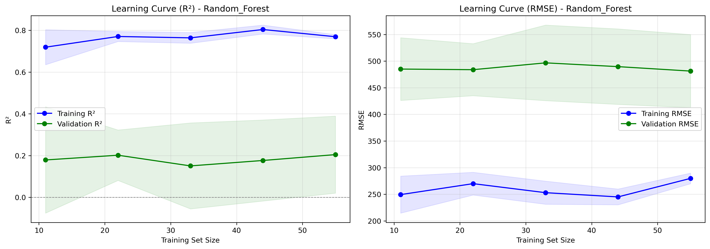
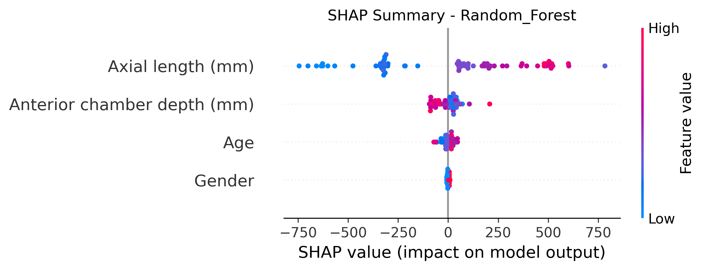

# SR0530 最佳机器学习模型过拟合诊断报告（q1plus）

> **目标**：对 HP 寻优中 Test R² 最高的模型进行过拟合评估（Learning Curves + SHAP）。

## 一、最佳模型信息

- **数据组**：strict
- **距离**：1.5 mm
- **方案**：A2_Biomechanical_NoK
- **模型**：Random_Forest
- **Test R²**：0.557
- **RMSE**：383.7
- **MAPE**：8.32%
- **最佳参数**：{'n_estimators': 100, 'max_depth': 3, 'min_samples_split': 5, 'min_samples_leaf': 1}
- **样本量**：69 眼 / 44 subjects

## 二、过拟合判读（Learning Curves）

1. **训练曲线与验证曲线差距**：若训练 R² 显著高于验证 R²，且随样本量增加差距仍大，提示过拟合。
2. **收敛趋势**：若验证 R² 随样本量增加仍在上升，提示增加样本可能提升泛化性能。
3. **RMSE 曲线**：训练 RMSE 低于验证 RMSE 是正常的；差距过大同样提示过拟合。

## 三、特征影响（SHAP Summary）

- SHAP summary 展示每个特征对模型预测的贡献分布。
- 颜色表示特征值高低（红=高，蓝=低），横轴表示 SHAP 值（对预测的影响方向与幅度）。

---

*Report generated by SR_ML_best_model_diagnostics.py*
