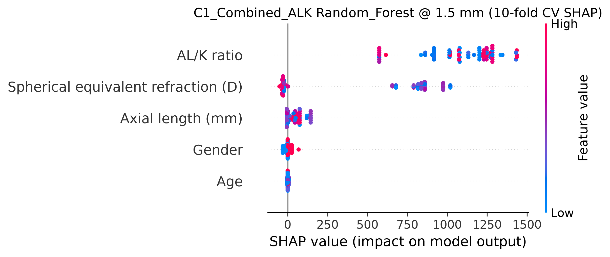

# SR0530 C1_Combined_ALK 十折超参数寻优报告

> **目标**：在 lenient 数据组（71 眼 / 46 subjects）上，仅针对 **C1_Combined_ALK** 方案（SE + AL + Age + Gender + AL/K）进行 10-fold GroupKFold by Subject 超参数寻优，并输出 SHAP 解释、R² 与 RMSE。

> **交叉验证**：10-fold GroupKFold by Subject，按 Myopia 分层；置信区间基于 10 个 fold 的标准差（t₀.₀₂₅,₉ = 2.262）。

> **搜索策略**：Random Search，每模型 30 组参数。

---

## 一、总体最佳配置

- **数据组**：lenient
- **距离**：1.5 mm
- **方案**：C1_Combined_ALK
- **模型**：Random_Forest
- **最佳 Test R²**：0.441 [95% CI: 0.225, 0.657]
- **最佳 Test RMSE**：384.3 [95% CI: 268.6, 500.0]
- **MAPE**：8.48%
- **Gap**：0.343
- **最佳参数**：{'n_estimators': 100, 'max_depth': 2, 'min_samples_split': 5, 'min_samples_leaf': 1}
- **样本量**：71 眼 / 46 subjects

## 二、各距离最佳结果（C1_Combined_ALK）

| 距离 (mm) | 最佳模型 | Test R² (95% CI) | RMSE (95% CI) | MAPE (%) | Gap | 最佳参数 |
|-----------|---------|------------------|----------------|----------|-----|---------|
| 1.0 | SVM | 0.332 [0.103, 0.561] | 525.7 [299.7, 751.7] | 10.43 | 0.109 | {'C': 5000, 'epsilon': 800, 'gamma': 0.01} |
| 1.5 | Random_Forest | 0.441 [0.225, 0.657] | 384.3 [268.6, 500.0] | 8.48 | 0.343 | {'n_estimators': 100, 'max_depth': 2, 'min_samples_split': 5, 'min_samples_leaf': 1} |
| 2.0 | Ridge | 0.367 [0.163, 0.572] | 457.0 [210.9, 703.1] | 10.81 | 0.082 | {'alpha': 100.0} |
| 2.5 | ElasticNet | 0.191 [-0.084, 0.466] | 461.9 [368.2, 555.6] | 12.95 | 0.267 | {'alpha': 1.0, 'l1_ratio': 0.7} |
| 3.0 | ElasticNet | 0.376 [0.096, 0.655] | 454.7 [248.7, 660.7] | 13.07 | 0.074 | {'alpha': 1.0, 'l1_ratio': 0.7} |
| 3.5 | ElasticNet | 0.334 [0.067, 0.601] | 434.5 [246.5, 622.6] | 13.13 | 0.119 | {'alpha': 1.0, 'l1_ratio': 0.7} |
| 4.0 | ElasticNet | 0.096 [-0.208, 0.401] | 521.4 [357.6, 685.1] | 16.69 | 0.364 | {'alpha': 1.0, 'l1_ratio': 0.7} |
| 4.5 | ElasticNet | 0.218 [-0.069, 0.506] | 514.5 [357.2, 671.8] | 18.88 | 0.266 | {'alpha': 1.0, 'l1_ratio': 0.7} |
| 5.0 | SVM | -0.051 [-0.416, 0.314] | 595.2 [478.8, 711.6] | 19.86 | 0.413 | {'C': 2000, 'epsilon': 300, 'gamma': 0.005} |
| 5.5 | SVM | 0.002 [-0.242, 0.246] | 589.5 [374.2, 804.7] | 18.65 | 0.249 | {'C': 5000, 'epsilon': 100, 'gamma': 0.001} |
| 6.0 | Neural_Network | 0.098 [-0.370, 0.566] | 579.7 [453.5, 705.9] | 22.15 | 0.374 | {'hidden_layer_sizes': (60,), 'alpha': 1.0, 'learning_rate_init': 0.001} |

## 三、每个模型最佳结果

| 模型 | 最佳距离 | Test R² (95% CI) | RMSE (95% CI) | MAPE (%) | Gap | 最佳参数 |
|------|---------|------------------|----------------|----------|-----|---------|
| ElasticNet | 3.0 mm | 0.376 [0.096, 0.655] | 454.7 [248.7, 660.7] | 13.07 | 0.074 | {'alpha': 1.0, 'l1_ratio': 0.7} |
| Lasso | 1.5 mm | 0.393 [0.158, 0.628] | 391.5 [252.2, 530.8] | 9.08 | 0.228 | {'alpha': 0.01} |
| Neural_Network | 1.5 mm | 0.270 [-0.114, 0.654] | 508.7 [304.5, 713.0] | 11.28 | 0.299 | {'hidden_layer_sizes': (100,), 'alpha': 1.0, 'learning_rate_init': 0.001} |
| Random_Forest | 1.5 mm | 0.441 [0.225, 0.657] | 384.3 [268.6, 500.0] | 8.48 | 0.343 | {'n_estimators': 100, 'max_depth': 2, 'min_samples_split': 5, 'min_samples_leaf': 1} |
| Ridge | 1.5 mm | 0.394 [0.159, 0.630] | 391.0 [251.7, 530.3] | 9.07 | 0.227 | {'alpha': 0.1} |
| SVM | 1.0 mm | 0.332 [0.103, 0.561] | 525.7 [299.7, 751.7] | 10.43 | 0.109 | {'C': 5000, 'epsilon': 800, 'gamma': 0.01} |
| XGBoost | 1.5 mm | 0.240 [-0.138, 0.618] | 532.3 [280.4, 784.1] | 11.28 | 0.303 | {'learning_rate': 0.05, 'max_depth': 1, 'n_estimators': 30, 'reg_alpha': 2.0, 'reg_lambda': 0.5} |

## 四、全距离 / 全模型结果汇总

| 距离 (mm) | 模型 | Test R² | Test RMSE | MAPE (%) | Gap | 最佳参数 |
|-----------|------|---------|-----------|----------|-----|---------|
| 1.0 | SVM | 0.332 | 525.7 | 10.43 | 0.109 | {'C': 5000, 'epsilon': 800, 'gamma': 0.01} |
| 1.0 | Ridge | 0.285 | 544.5 | 10.53 | 0.091 | {'alpha': 100.0} |
| 1.0 | ElasticNet | 0.239 | 560.4 | 10.77 | 0.288 | {'alpha': 1.0, 'l1_ratio': 0.3} |
| 1.0 | Random_Forest | 0.201 | 546.6 | 10.98 | 0.499 | {'n_estimators': 200, 'max_depth': None, 'min_samples_split': 10, 'min_samples_leaf': 2} |
| 1.0 | Lasso | 0.118 | 494.6 | 10.39 | 0.508 | {'alpha': 1.0} |
| 1.0 | Neural_Network | 0.102 | 583.1 | 12.49 | 0.416 | {'hidden_layer_sizes': (80, 40), 'alpha': 0.3, 'learning_rate_init': 0.001} |
| 1.0 | XGBoost | 0.075 | 626.9 | 13.52 | 0.457 | {'learning_rate': 0.05, 'max_depth': 1, 'n_estimators': 30, 'reg_alpha': 2.0, 'reg_lambda': 0.5} |
| 1.5 | Random_Forest | 0.441 | 384.3 | 8.48 | 0.343 | {'n_estimators': 100, 'max_depth': 2, 'min_samples_split': 5, 'min_samples_leaf': 1} |
| 1.5 | Ridge | 0.394 | 391.0 | 9.07 | 0.227 | {'alpha': 0.1} |
| 1.5 | Lasso | 0.393 | 391.5 | 9.08 | 0.228 | {'alpha': 0.01} |
| 1.5 | ElasticNet | 0.365 | 400.4 | 9.54 | 0.196 | {'alpha': 1.0, 'l1_ratio': 0.1} |
| 1.5 | Neural_Network | 0.270 | 508.7 | 11.28 | 0.299 | {'hidden_layer_sizes': (100,), 'alpha': 1.0, 'learning_rate_init': 0.001} |
| 1.5 | XGBoost | 0.240 | 532.3 | 11.28 | 0.303 | {'learning_rate': 0.05, 'max_depth': 1, 'n_estimators': 30, 'reg_alpha': 2.0, 'reg_lambda': 0.5} |
| 1.5 | SVM | 0.134 | 501.0 | 9.95 | 0.410 | {'C': 5000, 'epsilon': 300, 'gamma': 0.005} |
| 2.0 | Ridge | 0.367 | 457.0 | 10.81 | 0.082 | {'alpha': 100.0} |
| 2.0 | Lasso | 0.342 | 462.8 | 10.82 | 0.112 | {'alpha': 10.0} |
| 2.0 | ElasticNet | 0.297 | 454.8 | 10.75 | 0.250 | {'alpha': 0.001, 'l1_ratio': 0.5} |
| 2.0 | Neural_Network | 0.269 | 379.6 | 9.86 | 0.265 | {'hidden_layer_sizes': (100,), 'alpha': 0.5, 'learning_rate_init': 0.0001} |
| 2.0 | Random_Forest | 0.224 | 492.3 | 11.46 | 0.463 | {'n_estimators': 200, 'max_depth': None, 'min_samples_split': 10, 'min_samples_leaf': 2} |
| 2.0 | XGBoost | 0.096 | 496.2 | 12.87 | 0.362 | {'learning_rate': 0.05, 'max_depth': 1, 'n_estimators': 30, 'reg_alpha': 2.0, 'reg_lambda': 0.5} |
| 2.0 | SVM | 0.061 | 505.0 | 11.22 | 0.262 | {'C': 5000, 'epsilon': 300, 'gamma': 0.001} |
| 2.5 | ElasticNet | 0.191 | 461.9 | 12.95 | 0.267 | {'alpha': 1.0, 'l1_ratio': 0.7} |
| 2.5 | Ridge | 0.158 | 465.5 | 13.24 | 0.308 | {'alpha': 10.0} |
| 2.5 | Neural_Network | 0.133 | 478.5 | 13.27 | 0.316 | {'hidden_layer_sizes': (80, 40), 'alpha': 0.3, 'learning_rate_init': 0.001} |
| 2.5 | Lasso | -0.021 | 485.1 | 14.37 | 0.493 | {'alpha': 1.0} |
| 2.5 | Random_Forest | -0.045 | 512.7 | 14.87 | 0.680 | {'n_estimators': 100, 'max_depth': 5, 'min_samples_split': 5, 'min_samples_leaf': 4} |
| 2.5 | XGBoost | -0.049 | 557.2 | 16.04 | 0.333 | {'learning_rate': 0.005, 'max_depth': 4, 'n_estimators': 50, 'reg_alpha': 0.5, 'reg_lambda': 0.5} |
| 2.5 | SVM | -0.061 | 495.4 | 13.18 | 0.415 | {'C': 5000, 'epsilon': 300, 'gamma': 0.001} |
| 3.0 | ElasticNet | 0.376 | 454.7 | 13.07 | 0.074 | {'alpha': 1.0, 'l1_ratio': 0.7} |
| 3.0 | Ridge | 0.360 | 458.5 | 13.26 | 0.097 | {'alpha': 10.0} |
| 3.0 | Lasso | 0.257 | 477.2 | 14.55 | 0.205 | {'alpha': 1.0} |
| 3.0 | Random_Forest | 0.164 | 506.1 | 15.01 | 0.458 | {'n_estimators': 100, 'max_depth': 5, 'min_samples_split': 5, 'min_samples_leaf': 4} |
| 3.0 | SVM | 0.128 | 523.4 | 13.96 | 0.197 | {'C': 5000, 'epsilon': 300, 'gamma': 0.001} |
| 3.0 | Neural_Network | -0.008 | 531.6 | 14.89 | 0.525 | {'hidden_layer_sizes': (60,), 'alpha': 1.0, 'learning_rate_init': 0.0005} |
| 3.0 | XGBoost | -0.084 | 587.7 | 18.97 | 0.384 | {'learning_rate': 0.005, 'max_depth': 4, 'n_estimators': 50, 'reg_alpha': 0.5, 'reg_lambda': 0.5} |
| 3.5 | ElasticNet | 0.334 | 434.5 | 13.13 | 0.119 | {'alpha': 1.0, 'l1_ratio': 0.7} |
| 3.5 | Ridge | 0.314 | 435.7 | 13.44 | 0.146 | {'alpha': 10.0} |
| 3.5 | Neural_Network | 0.205 | 470.7 | 14.27 | 0.234 | {'hidden_layer_sizes': (80, 40), 'alpha': 0.3, 'learning_rate_init': 0.001} |
| 3.5 | Lasso | 0.174 | 455.4 | 14.68 | 0.291 | {'alpha': 1.0} |
| 3.5 | Random_Forest | 0.136 | 493.8 | 15.70 | 0.501 | {'n_estimators': 100, 'max_depth': 5, 'min_samples_split': 5, 'min_samples_leaf': 4} |
| 3.5 | SVM | 0.018 | 525.9 | 15.22 | 0.293 | {'C': 5000, 'epsilon': 300, 'gamma': 0.001} |
| 3.5 | XGBoost | -0.097 | 557.3 | 18.34 | 0.406 | {'learning_rate': 0.005, 'max_depth': 4, 'n_estimators': 50, 'reg_alpha': 0.5, 'reg_lambda': 0.5} |
| 4.0 | ElasticNet | 0.096 | 521.4 | 16.69 | 0.364 | {'alpha': 1.0, 'l1_ratio': 0.7} |
| 4.0 | Ridge | 0.051 | 524.8 | 16.96 | 0.415 | {'alpha': 10.0} |
| 4.0 | Random_Forest | -0.044 | 565.7 | 19.04 | 0.690 | {'n_estimators': 100, 'max_depth': 5, 'min_samples_split': 5, 'min_samples_leaf': 4} |
| 4.0 | SVM | -0.142 | 549.4 | 16.42 | 0.312 | {'C': 5000, 'epsilon': 100, 'gamma': 0.001} |
| 4.0 | Lasso | -0.158 | 550.2 | 18.57 | 0.630 | {'alpha': 1.0} |
| 4.0 | Neural_Network | -0.186 | 602.5 | 19.33 | 0.675 | {'hidden_layer_sizes': (80, 40), 'alpha': 0.3, 'learning_rate_init': 0.001} |
| 4.0 | XGBoost | -0.224 | 641.8 | 22.01 | 0.517 | {'learning_rate': 0.005, 'max_depth': 4, 'n_estimators': 50, 'reg_alpha': 0.5, 'reg_lambda': 0.5} |
| 4.5 | ElasticNet | 0.218 | 514.5 | 18.88 | 0.266 | {'alpha': 1.0, 'l1_ratio': 0.7} |
| 4.5 | Ridge | 0.180 | 520.3 | 19.09 | 0.314 | {'alpha': 10.0} |
| 4.5 | Neural_Network | 0.053 | 579.5 | 20.96 | 0.438 | {'hidden_layer_sizes': (80, 40), 'alpha': 0.3, 'learning_rate_init': 0.001} |
| 4.5 | Random_Forest | 0.014 | 579.7 | 22.40 | 0.641 | {'n_estimators': 100, 'max_depth': 5, 'min_samples_split': 5, 'min_samples_leaf': 4} |
| 4.5 | Lasso | -0.042 | 563.7 | 21.38 | 0.545 | {'alpha': 1.0} |
| 4.5 | SVM | -0.125 | 552.3 | 17.08 | 0.337 | {'C': 5000, 'epsilon': 100, 'gamma': 0.001} |
| 4.5 | XGBoost | -0.165 | 661.5 | 24.54 | 0.455 | {'learning_rate': 0.005, 'max_depth': 4, 'n_estimators': 50, 'reg_alpha': 0.5, 'reg_lambda': 0.5} |
| 5.0 | SVM | -0.051 | 595.2 | 19.86 | 0.413 | {'C': 2000, 'epsilon': 300, 'gamma': 0.005} |
| 5.0 | Ridge | -0.116 | 612.7 | 22.77 | 0.528 | {'alpha': 100.0} |
| 5.0 | XGBoost | -0.260 | 660.8 | 24.38 | 0.580 | {'learning_rate': 0.005, 'max_depth': 4, 'n_estimators': 50, 'reg_alpha': 0.5, 'reg_lambda': 0.5} |
| 5.0 | Neural_Network | -0.273 | 636.1 | 25.21 | 0.719 | {'hidden_layer_sizes': (80,), 'alpha': 0.5, 'learning_rate_init': 0.001} |
| 5.0 | Random_Forest | -0.293 | 522.6 | 18.24 | 0.973 | {'n_estimators': 300, 'max_depth': 2, 'min_samples_split': 2, 'min_samples_leaf': 4} |
| 5.0 | ElasticNet | -0.307 | 615.8 | 21.35 | 0.734 | {'alpha': 1.0, 'l1_ratio': 0.3} |
| 5.0 | Lasso | -0.412 | 621.4 | 22.92 | 0.927 | {'alpha': 10.0} |
| 5.5 | SVM | 0.002 | 589.5 | 18.65 | 0.249 | {'C': 5000, 'epsilon': 100, 'gamma': 0.001} |
| 5.5 | Ridge | -0.043 | 611.5 | 24.67 | 0.480 | {'alpha': 100.0} |
| 5.5 | Neural_Network | -0.110 | 612.5 | 26.45 | 0.608 | {'hidden_layer_sizes': (80,), 'alpha': 0.5, 'learning_rate_init': 0.001} |
| 5.5 | ElasticNet | -0.133 | 607.7 | 24.44 | 0.640 | {'alpha': 0.1, 'l1_ratio': 0.3} |
| 5.5 | Lasso | -0.152 | 607.2 | 24.13 | 0.697 | {'alpha': 10.0} |
| 5.5 | Random_Forest | -0.221 | 590.3 | 21.98 | 0.988 | {'n_estimators': 200, 'max_depth': None, 'min_samples_split': 10, 'min_samples_leaf': 2} |
| 5.5 | XGBoost | -0.310 | 740.7 | 28.14 | 0.624 | {'learning_rate': 0.005, 'max_depth': 4, 'n_estimators': 50, 'reg_alpha': 0.5, 'reg_lambda': 0.5} |
| 6.0 | Neural_Network | 0.098 | 579.7 | 22.15 | 0.374 | {'hidden_layer_sizes': (60,), 'alpha': 1.0, 'learning_rate_init': 0.001} |
| 6.0 | Ridge | 0.019 | 679.3 | 28.10 | 0.393 | {'alpha': 100.0} |
| 6.0 | SVM | -0.028 | 654.0 | 26.23 | 0.257 | {'C': 100, 'epsilon': 500, 'gamma': 0.05} |
| 6.0 | Lasso | -0.126 | 685.6 | 27.77 | 0.643 | {'alpha': 10.0} |
| 6.0 | ElasticNet | -0.154 | 697.7 | 28.24 | 0.672 | {'alpha': 0.001, 'l1_ratio': 0.3} |
| 6.0 | Random_Forest | -0.194 | 648.7 | 24.65 | 0.740 | {'n_estimators': 50, 'max_depth': 2, 'min_samples_split': 10, 'min_samples_leaf': 2} |
| 6.0 | XGBoost | -0.260 | 718.2 | 25.48 | 0.985 | {'learning_rate': 0.01, 'max_depth': 3, 'n_estimators': 200, 'reg_alpha': 0.1, 'reg_lambda': 2.0} |

## 五、SHAP 解释图

最佳配置：**Random_Forest @ 1.5 mm**

## 六、讨论

1. **十折 vs 五折**：10-fold 保留了按 subject 分组的分层结构，fold-level 估计更细，但样本量较小（46 subjects）时部分 fold 可能仅含 4–5 个 subject，R² 波动仍较大。
2. **AL/K 的角色**：在 C1_Combined 已包含 AL 的前提下，AL/K 与 K 可互换， peak 性能通常出现在 1.5 mm 附近。
3. **SHAP 解读**：SHAP summary 展示各特征对预测密度的边际贡献，可据此判断 AL/K 是否带来独立于 AL 的解释力。
4. **过拟合信号**：若 Gap（Train R² − Test R²）较大，提示模型在该配置下过拟合，应优先选择 Gap 小且 Test R² 高的线性模型。

---

*Report generated automatically by SR_ML_C1_Combined_ALK_10fold_tuning_shap.py*
