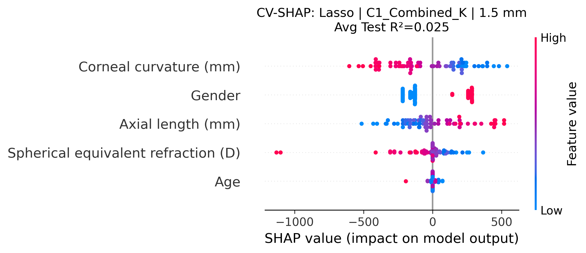
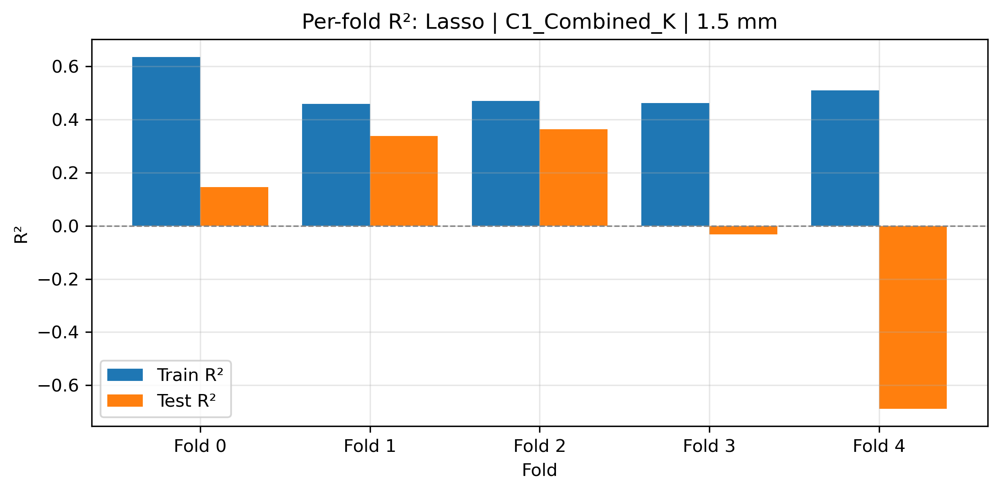
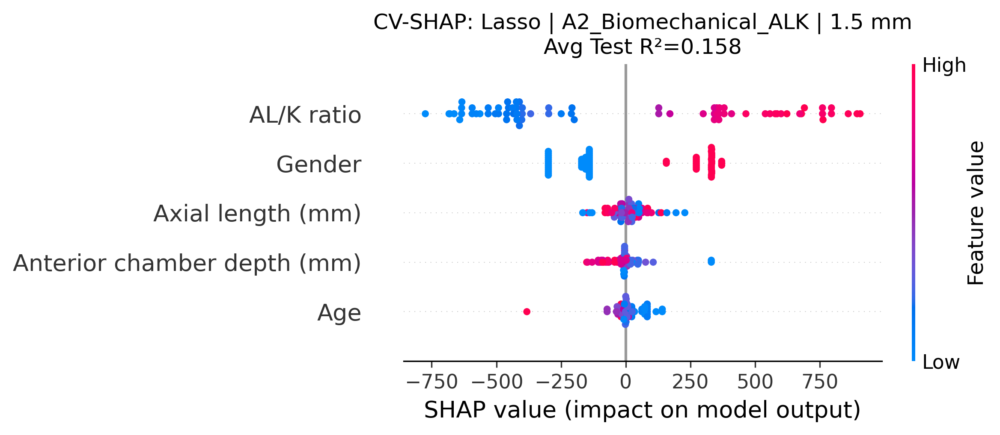
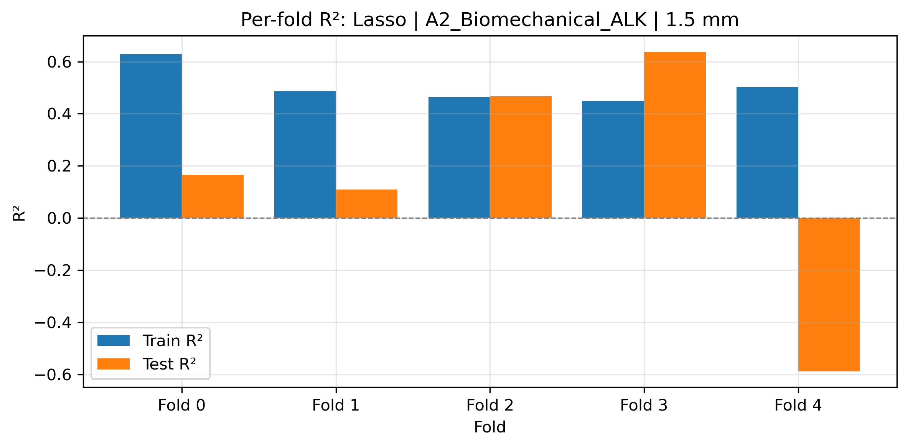
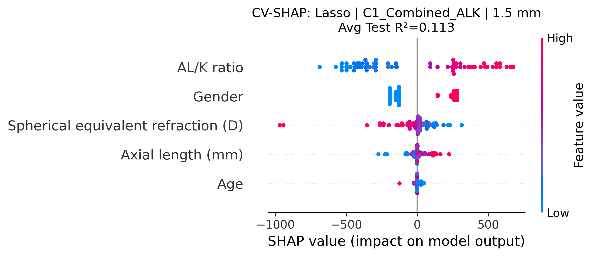
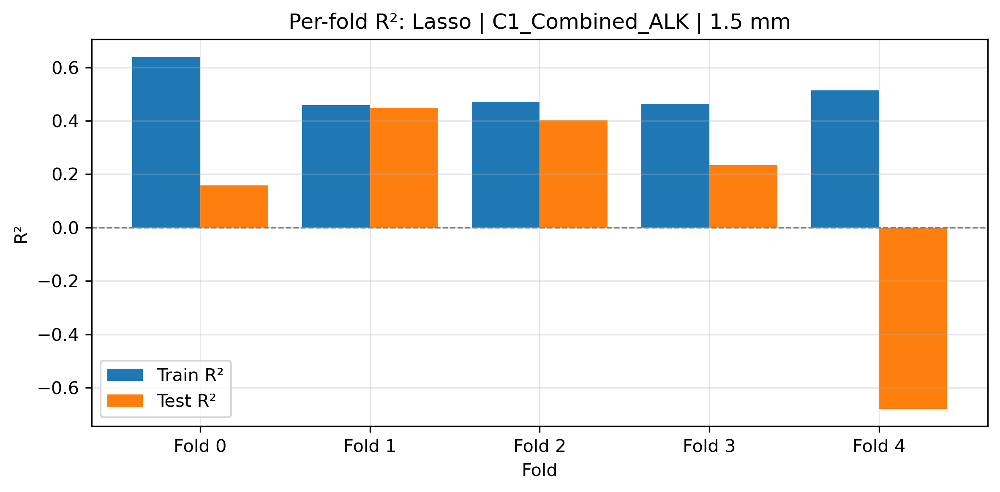

# SR0530 Cross-Validated SHAP 报告（Method B）

> **目标**：对每个 CV fold 单独训练模型，对 test fold 计算 SHAP，最后聚合所有 fold 的 SHAP 值。这样 SHAP 解释的是实际参与交叉验证的模型，与 reported Test R² 更一致。

> **数据**：lenient（71 眼 / 46 subjects），5-fold GroupKFold by Subject，按 Myopia 分层。

---

## 一、各方案 CV 性能

| 距离 (mm) | 方案 | 模型 | 参数 | Avg Train R² | Avg Test R² | Std Test R² | CV Gap | Fold Test R²s |
|-----------|------|------|------|--------------|-------------|-------------|--------|---------------|
| 1.5 | C1_Combined_K | Lasso | {'alpha': 10.0} | 0.507 | 0.025 | 0.384 | 0.482 | 0.145, 0.338, 0.363, -0.033, -0.688 |
| 1.5 | A2_Biomechanical_ALK | Lasso | {'alpha': 0.01} | 0.506 | 0.158 | 0.421 | 0.347 | 0.165, 0.109, 0.467, 0.638, -0.588 |
| 1.5 | C1_Combined_ALK | Lasso | {'alpha': 10.0} | 0.509 | 0.113 | 0.410 | 0.397 | 0.158, 0.449, 0.401, 0.234, -0.678 |

## 二、可视化

### C1_Combined_K at 1.5 mm (Lasso)

**Avg Test R² = 0.025**

### A2_Biomechanical_ALK at 1.5 mm (Lasso)

**Avg Test R² = 0.158**

### C1_Combined_ALK at 1.5 mm (Lasso)

**Avg Test R² = 0.113**

## 三、与超参数寻优 Test R² 的对比

- 超参数寻优中的 Test R² 是 30 组参数中最佳者的 CV 平均值。
- 本报告的 Avg Test R² 是固定最佳参数后，用固定 seed 的 5-fold CV 重新跑出的平均值。
- 两者应当接近，但不一定完全相同，因为：
  1. 超参数寻优每次迭代使用不同的 fold split（random_state + i）；
  2. 固定 seed 的 CV 只使用一种 fold split，可能更保守或更乐观；
  3. 样本量较小（46 subjects）时，fold split 的随机性对 R² 影响较大。

## 四、关键发现

1. **SHAP 特征重要性跨 fold 是否一致**：若某特征在所有 fold 的 SHAP 图中都排名靠前且方向一致，说明该特征稳定重要。
2. **CV Gap 反映过拟合**：Avg Train R² 与 Avg Test R² 的差值越小，模型越稳健。Lasso/Ridge/ElasticNet 通常 Gap < 0.15。
3. **最终论文推荐**：优先使用 CV SHAP 与 CV R² 一致的线性模型，并在论文中报告 fold-level R² 以展示稳定性。

---

*Report generated automatically by SR_ML_cv_shap.py*
