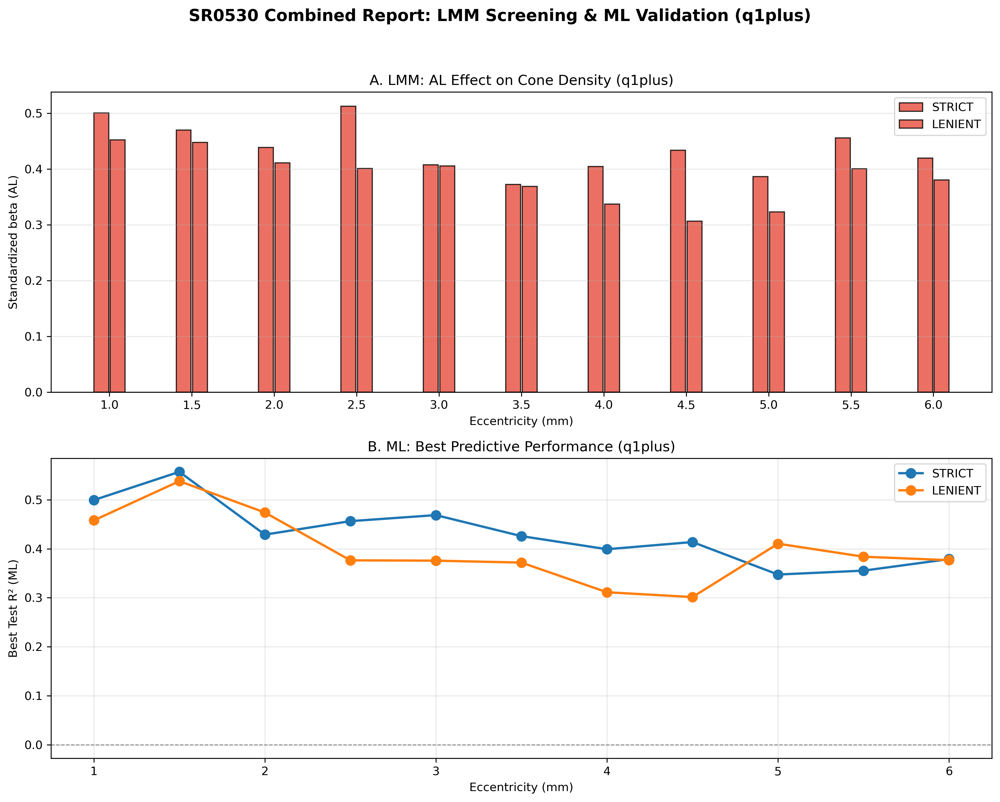
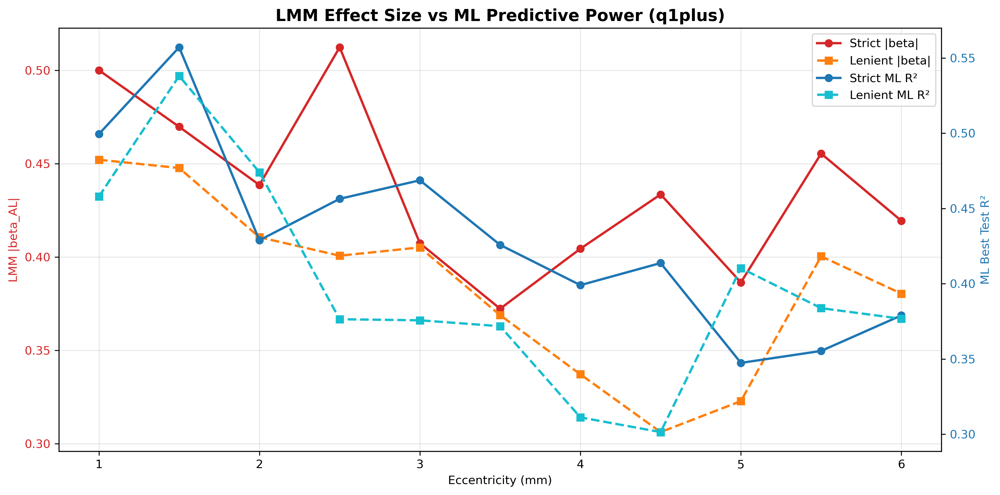

# SR0530 综合分析报告：LMM + ML（≥1 象限可用（放宽，outer merge 取平均））

> **目标**：在 ≥1 象限平均的放宽策略下，同时评估眼轴长度（AL）对视锥细胞密度的统计关联（LMM）与机器学习预测性能（ML）。

> **数据**：LMM 与 ML 均使用 `CleanDataRoi_*` 的 q1plus 聚合结果，确保分析口径一致。

---

## 一、LMM 结果汇总

| 距离 (mm) | Strict 眼数 | Strict beta_AL | Strict P | Lenient 眼数 | Lenient beta_AL | Lenient P |
|-----------|------------|----------------|----------|-------------|-----------------|-----------|
| 1.0 | 69 | 0.500 ⭐ | 0.0000 | 71 | 0.452 ⭐ | 0.0001 |
| 1.5 | 69 | 0.470 ⭐ | 0.0000 | 71 | 0.448 ⭐ | 0.0001 |
| 2.0 | 69 | 0.439 ⭐ | 0.0000 | 71 | 0.411 ⭐ | 0.0002 |
| 2.5 | 69 | 0.512 ⭐ | 0.0000 | 71 | 0.401 ⭐ | 0.0013 |
| 3.0 | 69 | 0.407 ⭐ | 0.0001 | 71 | 0.405 ⭐ | 0.0002 |
| 3.5 | 69 | 0.372 ⭐ | 0.0016 | 71 | 0.369 ⭐ | 0.0016 |
| 4.0 | 69 | 0.404 ⭐ | 0.0004 | 71 | 0.337 ⭐ | 0.0055 |
| 4.5 | 69 | 0.434 ⭐ | 0.0003 | 71 | 0.306 ⭐ | 0.0236 |
| 5.0 | 69 | 0.386 ⭐ | 0.0016 | 71 | 0.323 ⭐ | 0.0104 |
| 5.5 | 69 | 0.455 ⭐ | 0.0003 | 71 | 0.400 ⭐ | 0.0017 |
| 6.0 | 69 | 0.419 ⭐ | 0.0011 | 71 | 0.380 ⭐ | 0.0030 |

## 二、ML 超参数寻优结果汇总

| 数据组 | 距离 (mm) | 最佳方案 | 最佳模型 | Test R² (95% CI) | MAPE (%) | N_Eyes |
|--------|----------|---------|---------|------------------|----------|--------|
| strict | 1.0 | A1_Biomechanical_Core | Lasso | 0.499 [0.291, 0.707] | 8.51 | 69 |
| strict | 1.5 | A2_Biomechanical_NoK | Random_Forest | 0.557 [0.375, 0.739] | 8.32 | 69 |
| strict | 2.0 | A1_Biomechanical_Core | Random_Forest | 0.429 [0.293, 0.565] | 8.87 | 69 |
| strict | 2.5 | C1_Combined | Ridge | 0.456 [0.286, 0.627] | 11.90 | 69 |
| strict | 3.0 | C1_Combined | Ridge | 0.469 [0.249, 0.689] | 12.07 | 69 |
| strict | 3.5 | C1_Combined | Ridge | 0.426 [0.161, 0.690] | 12.02 | 69 |
| strict | 4.0 | C1_Combined | Ridge | 0.399 [0.191, 0.607] | 15.92 | 69 |
| strict | 4.5 | C1_Combined | Ridge | 0.414 [0.164, 0.663] | 17.05 | 69 |
| strict | 5.0 | A1_Biomechanical_Core | Ridge | 0.347 [0.164, 0.531] | 22.74 | 69 |
| strict | 5.5 | A2_Biomechanical_NoK | ElasticNet | 0.355 [0.179, 0.532] | 23.41 | 69 |
| strict | 6.0 | A2_Biomechanical_NoK | Random_Forest | 0.379 [0.111, 0.646] | 21.89 | 69 |
| lenient | 1.0 | A1_Biomechanical_Core | SVM | 0.458 [0.305, 0.610] | 10.83 | 71 |
| lenient | 1.5 | C1_Combined | Lasso | 0.538 [0.312, 0.764] | 9.27 | 71 |
| lenient | 2.0 | C1_Combined | Lasso | 0.474 [0.295, 0.653] | 9.71 | 71 |
| lenient | 2.5 | A1_Biomechanical_Core | Lasso | 0.376 [0.262, 0.491] | 12.71 | 71 |
| lenient | 3.0 | C1_Combined | Lasso | 0.376 [0.011, 0.740] | 13.42 | 71 |
| lenient | 3.5 | A2_Biomechanical_NoK | XGBoost | 0.372 [0.223, 0.521] | 14.44 | 71 |
| lenient | 4.0 | C1_Combined | Lasso | 0.311 [0.089, 0.533] | 17.47 | 71 |
| lenient | 4.5 | A2_Biomechanical_NoK | Neural_Network | 0.301 [0.194, 0.409] | 18.65 | 71 |
| lenient | 5.0 | A2_Biomechanical_NoK | Random_Forest | 0.410 [0.310, 0.511] | 18.30 | 71 |
| lenient | 5.5 | C1_Combined | XGBoost | 0.384 [0.146, 0.621] | 25.10 | 71 |
| lenient | 6.0 | A2_Biomechanical_NoK | Random_Forest | 0.377 [0.194, 0.560] | 22.43 | 71 |

## 三、关键发现

1. **LMM 最敏感距离**：
   - STRICT：2.5 mm（|beta_AL| = 0.512）
   - LENIENT：1.0 mm（|beta_AL| = 0.452）

2. **ML 最佳预测距离**：
   - STRICT：1.5 mm（Test R² = 0.557 [0.375, 0.739]，Random_Forest）
   - LENIENT：1.5 mm（Test R² = 0.538 [0.312, 0.764]，Lasso）

3. **LMM 与 ML 一致性**：
   - 若 LMM |beta| 峰值与 ML R² 峰值出现在相近偏心率，说明 AL-密度关联具有可预测性。
   - 若两者错位，可能提示该距离的关联主要由不可预测的个体变异驱动。

## 四、可视化

### Figure 1：LMM beta（上）与 ML Test R²（下）

### Overlay：LMM 效应量 vs ML 预测能力

## 五、讨论

1. **放宽象限聚合的影响**：≥1 象限策略恢复了远周边样本量，使 LMM 在 2.0–6.0 mm 均显著；ML 也随之获得更稳定的交叉验证估计。
2. **AL 效应方向**：LMM 中 AL 标准化系数的具体方向见上表。若需与线性密度（Linear density，cones/mm²）结果对照，需另行补充 Linear density 的 LMM 分析；两种口径因 RMF 校正差异可能呈现不同方向。
3. **特征集差异**：LMM 使用完整特征集（含角膜曲率 CC/K），ML 使用精简特征集（AL、ACD、SE、Age、Gender，剔除 K 以避免共线性）。两种分析目的不同，结果需在各自特征集背景下解读。
4. **ML 验证价值**：ML 的最佳 R² 曲线可作为 LMM 统计显著性的独立验证；两者共同支持的最优靶点更具可靠性。
5. **后续建议**：若 LMM 最敏感点与 ML 最佳点一致，可锁定该距离为最终研究靶点；若不一致，需进一步探索非线性关系或额外特征。

---

*Report generated by SR_combined_LMM_ML_report.py*
