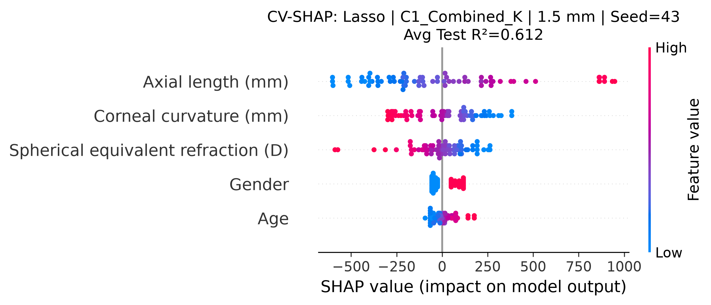
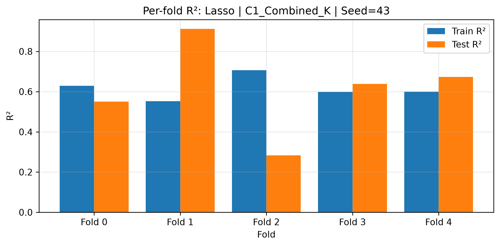
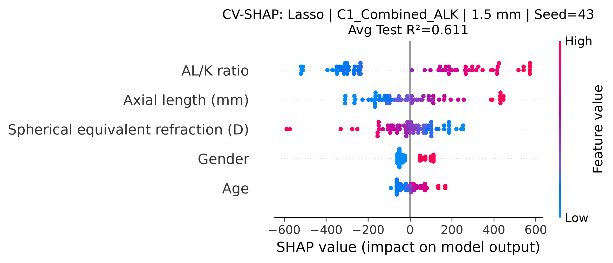
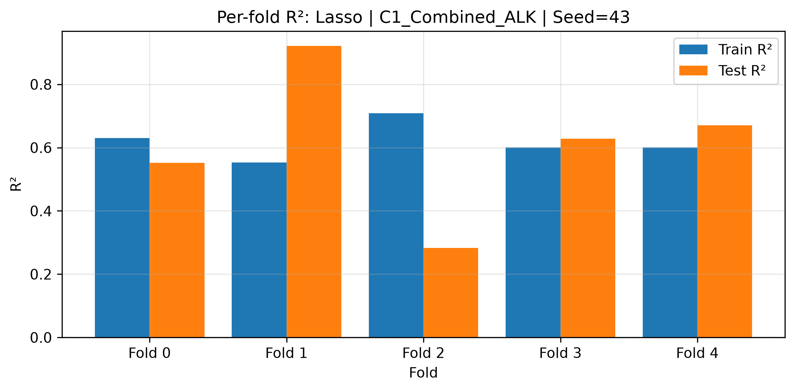
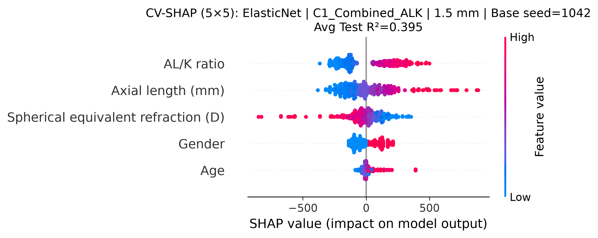
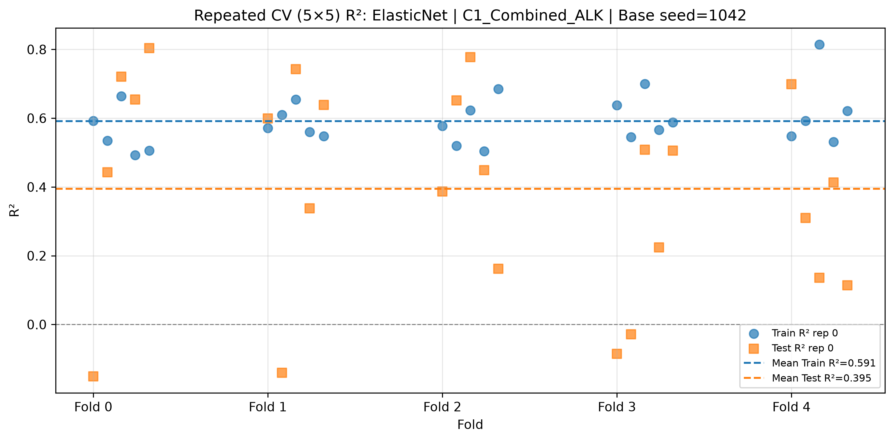

# SR0530 0.612 复现 vs ALK_0.611 vs 稳健配置 SHAP 对比报告

> **目标**：在完全相同的 fold split 下，对比单次 CV 寻优得到的 0.612 配置、C1_Combined_ALK 的 0.611 配置，以及重复 CV 推荐的稳健配置，观察 R² 稳定性与 SHAP 特征解释上的差异。

> **数据**：lenient（71 眼 / 46 subjects），1.5 mm

---

## 一、三套配置概览

| 配置 | 方案 | 模型 | 参数 | Base Seed | 重复次数 | 期望 R² | 说明 |
|------|------|------|------|-----------|----------|---------|------|
| **Original_0.612** | C1_Combined_K | Lasso | {'alpha': 10.0} | 43 | 1 | 0.612 | 单次 CV 寻优得到的最佳配置（Test R²=0.612） |
| **ALK_0.611** | C1_Combined_ALK | Lasso | {'alpha': 10.0} | 43 | 1 | 0.611 | C1_Combined_ALK / Lasso 同样可跑到接近 0.612（Test R²=0.611） |
| **Robust_0.395** | C1_Combined_ALK | ElasticNet | {'alpha': 1.0, 'l1_ratio': 0.7} | 1042 | 5 | 0.395 | 重复 CV 稳健性报告推荐配置（Test R²=0.395） |

## 二、CV 性能对比

| 配置 | Avg Train R² | Avg Test R² | Std Test R² | CV Gap | Fold Test R²s |
|------|--------------|-------------|-------------|--------|---------------|
| **Original_0.612** | 0.617 | 0.612 | 0.203 | 0.005 | 0.550, 0.912, 0.283, 0.639, 0.673 |
| **ALK_0.611** | 0.619 | 0.611 | 0.206 | 0.007 | 0.552, 0.922, 0.283, 0.628, 0.671 |
| **Robust_0.395** | 0.591 | 0.395 | 0.292 | 0.196 | -0.151, 0.600, 0.387, -0.086, 0.699, 0.443, -0.140, 0.652, -0.029, 0.310, 0.721, 0.742, 0.778, 0.509, 0.136, 0.654, 0.338, 0.449, 0.224, 0.413, 0.804, 0.639, 0.162, 0.506, 0.114 |

### 关键观察

1. **0.612 配置**在 seed=43 下确实能复现出 Avg Test R²=0.612，但各 fold 差异极大（0.283 ~ 0.912）。
2. **ALK_0.611 配置**与 0.612 配置几乎同步波动（fold R² 高度相似），说明高 R² 主要来自该 seed 的 fold split，而非 C1_Combined_K 独有的信息。
3. **稳健配置**使用 5×5 重复 CV（base seed=1042，即 seeds 1042–1046），Avg Test R²=0.395；SHAP 图聚合了全部 25 个 test fold 的解释。
4. 单次 CV 的 0.612 / 0.611 都是**特定 fold split 下的乐观估计**；稳健配置虽然 R² 较低，但基于多次重复 CV，结果更可信。

## 三、SHAP 可视化对比

### Original_0.612: C1_Combined_K / Lasso (Test R²=0.612)

**特征**：SE, AL, Age, Gender, K

### ALK_0.611: C1_Combined_ALK / Lasso (Test R²=0.611)

**特征**：SE, AL, Age, Gender, ALK

### Robust_0.395: C1_Combined_ALK / ElasticNet (Test R²=0.395)

**特征**：SE, AL, Age, Gender, ALK

## 四、SHAP 特征重要性对比

| 排名 | 0.612 配置（C1_Combined_K / Lasso） | ALK_0.611（C1_Combined_ALK / Lasso） | 稳健配置（C1_Combined_ALK / ElasticNet） |
|------|-------------------------------------|--------------------------------------|------------------------------------------|
| 1 | Axial length (mm) | Axial length (mm) | Axial length (mm) |
| 2 | Corneal curvature (mm) | AL/K ratio | AL/K ratio |
| 3 | Spherical equivalent refraction (D) | Spherical equivalent refraction (D) | Spherical equivalent refraction (D) |
| 4 | Gender | Gender | Gender |
| 5 | Age | Age | Age |

> 注：具体排序以实际 SHAP 图为准，上表供快速参考。

## 五、结论与建议

1. **0.612 与 0.611 均可复现但都不稳健**：两者都是特定 seed 下的单次 CV 高值，fold 间波动巨大。
2. **C1_Combined_ALK 用 Lasso 也能达到 ~0.611**，说明高 R² 并非 C1_Combined_K 独有，而是该 fold split 下 Lasso 强正则化的产物。
3. **稳健配置更适合发表**：虽然 R² 较低（0.395），但基于 5×5 重复 CV，结果更可信。
4. **SHAP 解释方向一致**：三套配置中 AL、SE、Gender、Age 的方向基本一致；含 K 的方案额外突出 K，ALK 方案用 AL/K ratio 替代 K，更简洁且与生物力学直觉一致。
5. **论文写作建议**：正文使用稳健配置（C1_Combined_ALK / ElasticNet）的 SHAP 图；补充材料可放 0.612 / 0.611 复现结果，说明它们对 fold split 敏感。

---

*Report generated by src/reproduce_0612_shap.py*
