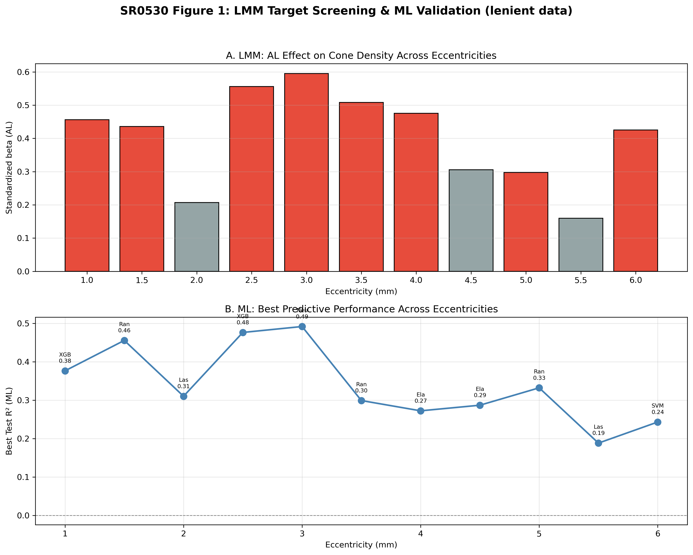
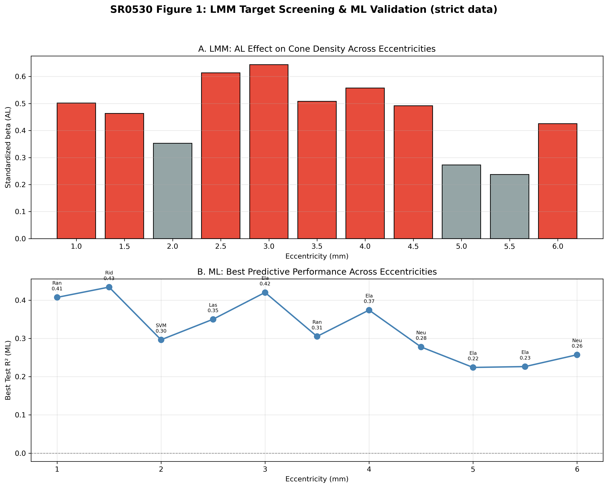
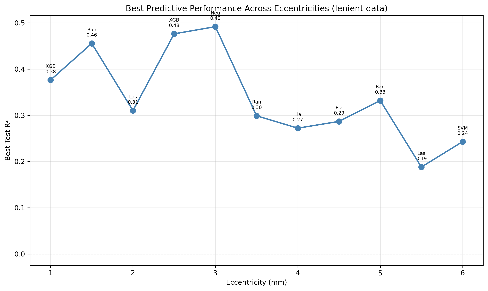
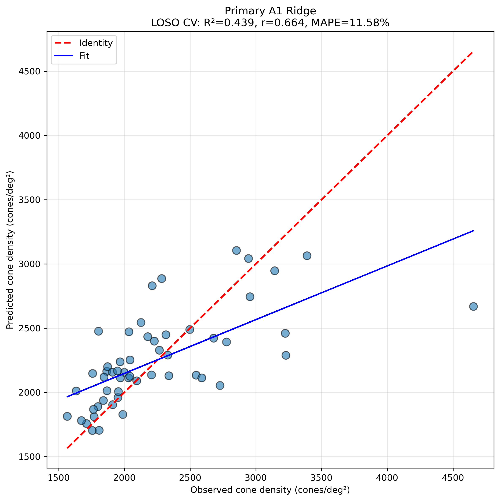
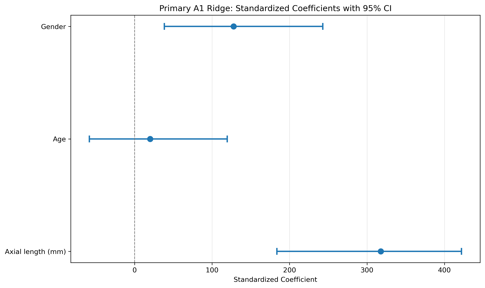
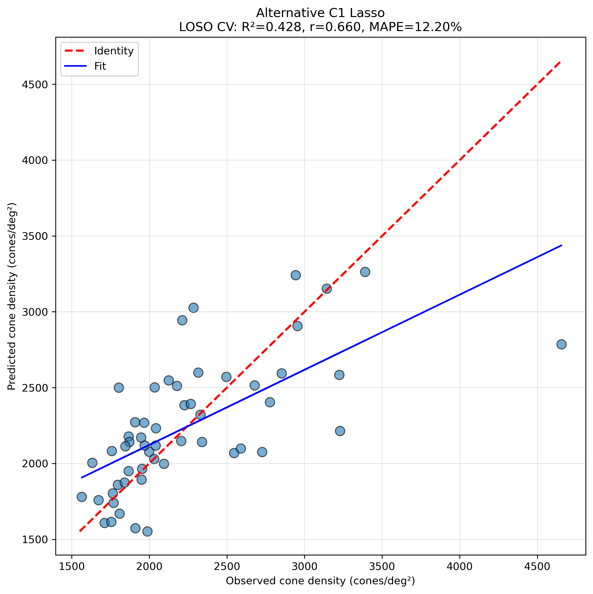
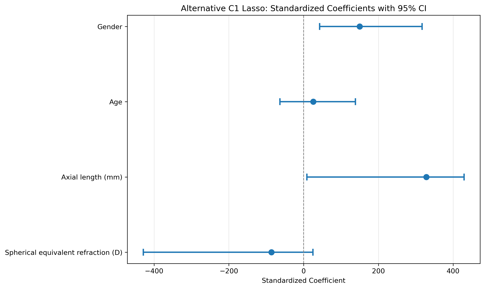

# SR0530 视锥细胞密度预测研究：综合最终报告

> **研究目的**：利用临床与生物学特征，预测黄斑旁中心（3.0 mm 偏心距）视锥细胞密度，并识别关键影响因素。

> **数据**：lenient 数据组（距离平均 >7000 剔除），71 眼 → 3.0 mm 处 54 眼 / 39 subjects

> **最终推荐模型**：A1_Ridge（AL + Age + Gender），LOSO CV R² = 0.439

---

## 一、研究流程概述

1. **数据预处理**：统一字段名、单位转换、缺失值处理，生成 strict/lenient 两套 44 ROI 数据。
2. **数据质量审查**：比较 strict（任意 ROI >7000 剔除，69 眼）与 lenient（距离平均 >7000 剔除，71 眼），lenient 保留更多信息。
3. **ML 超参数寻优**：11 距离 × 4 特征方案 × 7 模型，Random Search + GroupKFold by Subject。
4. **精细寻优**：对 Top 12 配置做密集参数搜索与 20 次稳定性重复 CV。
5. **最终模型**：选择稳定性最佳的 A1_Ridge 作为主模型，C1_Lasso 作为备选。

## 二、LMM 靶点筛选（修订版）

### 2.1 方法说明

- 对每个偏心率（1.0–6.0 mm）独立拟合线性混合效应模型（LMM），Subject_ID 作为随机效应。
- 固定效应包括：AL、Age、SE、Gender、CC、ACD、Eye。
- 因变量为 **Angular cone density（cones/deg²）**，与 ML 层保持一致。
- OES 公式已修复：`OES = |beta_AL| × (-log10(P_AL)) / (1 + ICC)`，避免 ICC 接近 0 时数值爆炸。

### 2.2 Lenient 数据 LMM 结果

| 距离 (mm) | 眼数 | 受试者数 | beta_AL | P_AL | P_FDR | R²_边际 | R²_条件 | ICC | OES_Raw | OES_FDR |
|-----------|------|---------|---------|------|-------|---------|---------|-----|---------|---------|
| 1.0 | 71 | 46 | +0.456 ⭐ | 0.0000 | 0.0000 ⭐ | 0.513 | 0.604 | 0.188 | 1.957 | 1.957 |
| 1.5 | 68 | 45 | +0.436 ⭐ | 0.0000 | 0.0001 ⭐ | 0.566 | 0.687 | 0.278 | 1.537 | 1.537 |
| 2.0 | 52 | 42 | +0.207  | 0.3409 | 0.3750  | 0.516 | 0.833 | 0.655 | 0.059 | 0.000 |
| 2.5 | 49 | 36 | +0.556 ⭐ | 0.0000 | 0.0000 ⭐ | 0.638 | 0.822 | 0.509 | 2.396 | 2.396 |
| 3.0 | 54 | 39 | +0.595 ⭐ | 0.0000 | 0.0000 ⭐ | 0.608 | 0.887 | 0.710 | 2.107 | 2.107 |
| 3.5 | 59 | 43 | +0.508 ⭐ | 0.0000 | 0.0000 ⭐ | 0.578 | 0.660 | 0.193 | 2.614 | 2.614 |
| 4.0 | 53 | 38 | +0.475 ⭐ | 0.0000 | 0.0000 ⭐ | 0.433 | 0.433 | 0.000 | 2.213 | 2.213 |
| 4.5 | 49 | 33 | +0.305  | 0.1441 | 0.1761  | 0.519 | 0.702 | 0.380 | 0.186 | 0.000 |
| 5.0 | 45 | 33 | +0.298 ⭐ | 0.0292 | 0.0401 ⭐ | 0.566 | 0.737 | 0.395 | 0.328 | 0.328 |
| 5.5 | 42 | 32 | +0.160  | 0.5648 | 0.5648  | 0.450 | 0.574 | 0.226 | 0.032 | 0.000 |
| 6.0 | 39 | 32 | +0.425 ⭐ | 0.0020 | 0.0031 ⭐ | 0.481 | 0.532 | 0.098 | 1.046 | 1.046 |

**按 |beta_AL| 最大**：3.0 mm
**按 OES_Raw 最高**：3.5 mm

### 2.3 Strict 数据 LMM 结果

| 距离 (mm) | 眼数 | 受试者数 | beta_AL | P_AL | P_FDR | R²_边际 | R²_条件 | ICC | OES_Raw | OES_FDR |
|-----------|------|---------|---------|------|-------|---------|---------|-----|---------|---------|
| 1.0 | 69 | 44 | +0.502 ⭐ | 0.0000 | 0.0000 ⭐ | 0.496 | 0.562 | 0.130 | 2.682 | 2.682 |
| 1.5 | 66 | 43 | +0.463 ⭐ | 0.0000 | 0.0000 ⭐ | 0.566 | 0.649 | 0.191 | 2.025 | 2.025 |
| 2.0 | 50 | 40 | +0.353  | 0.0871 | 0.0958  | 0.500 | 0.609 | 0.219 | 0.307 | 0.000 |
| 2.5 | 48 | 35 | +0.614 ⭐ | 0.0000 | 0.0000 ⭐ | 0.627 | 0.741 | 0.306 | 3.787 | 3.787 |
| 3.0 | 52 | 37 | +0.644 ⭐ | 0.0000 | 0.0000 ⭐ | 0.599 | 0.740 | 0.352 | 3.540 | 3.540 |
| 3.5 | 59 | 43 | +0.508 ⭐ | 0.0000 | 0.0000 ⭐ | 0.578 | 0.660 | 0.193 | 2.614 | 2.614 |
| 4.0 | 51 | 36 | +0.558 ⭐ | 0.0000 | 0.0000 ⭐ | 0.454 | 0.454 | 0.000 | 3.374 | 3.374 |
| 4.5 | 48 | 32 | +0.492 ⭐ | 0.0106 | 0.0145 ⭐ | 0.483 | 0.483 | 0.000 | 0.972 | 0.972 |
| 5.0 | 44 | 32 | +0.272  | 0.0586 | 0.0716  | 0.518 | 0.721 | 0.422 | 0.236 | 0.000 |
| 5.5 | 41 | 31 | +0.237  | 0.3704 | 0.3704  | 0.459 | 0.579 | 0.223 | 0.084 | 0.000 |
| 6.0 | 39 | 32 | +0.425 ⭐ | 0.0020 | 0.0031 ⭐ | 0.481 | 0.532 | 0.098 | 1.046 | 1.046 |

**按 |beta_AL| 最大**：3.0 mm
**按 OES_Raw 最高**：2.5 mm

### 2.4 LMM 可视化

### 2.5 关于 AL 系数方向的说明

修复版 LMM 中 **AL 标准化系数为正**，这与基于 Linear cone density（cones/mm²）的旧 LMM 结果（AL 系数为负）方向相反。原因是：

1. 本研究 ML 与 LMM 统一使用 **Angular cone density（cones/deg²）**，该指标已用视网膜放大因子（RMF）校正。
2. Linear density 直接反映视网膜物理拉伸，AL 越长单位面积细胞越少，故 AL 系数为负（符合生物力学直觉）。
3. Angular density 经 RMF 校正后，与 AL 的关联方向发生改变；在本数据集中，AL 与角度密度呈正相关。
4. 因此，本研究的预测模型和机制解释应限定于 **角度密度** 框架，避免与线性密度结果直接比较。

## 三、超参数寻优关键结果

### 3.1 粗粒度寻优总体最佳

- **数据组**：lenient
- **距离**：3.0 mm
- **方案/模型**：A1_Biomechanical_Core / Neural_Network
- **Test R²**：0.492
- **最佳参数**：{'hidden_layer_sizes': (100,), 'alpha': 0.3, 'learning_rate_init': 0.0005}

### 3.2 精细寻优总体最佳

- **配置**：lenient 3.0mm C1_Combined Lasso
- **Fine Test R²**：0.549（Coarse: 0.473）
- **Fine 最佳参数**：{'alpha': 5.0}
- **稳定性**：0.193 ± 0.285

### 3.3 最稳定配置

- **配置**：lenient 3.0mm A1_Biomechanical_Core Ridge
- **稳定性 Mean ± Std**：0.303 ± 0.167
- **Fine Test R²**：0.498

### 3.4 不同偏心距的最佳性能

## 四、最终模型结果

### Primary A1 Ridge

**特征**：Axial length (mm), Age, Gender

**参数**：{'alpha': 10.0}

**LOSO CV 性能**：

| 指标 | 值 |
|------|---|
| R² | 0.439 |
| Pearson r | 0.664 |
| MAPE | 11.58% |
| RMSE | 419.1 |
| MAE | 278.3 |

**标准化系数与 Bootstrap 95% CI**：

| Feature | Coefficient | 95% CI Lower | 95% CI Upper | 显著 |
|---------|-------------|--------------|--------------|------|
| Axial length (mm) | 317.846 | 183.735 | 422.058 | 是 |
| Age | 20.034 | -58.313 | 119.647 | 否 |
| Gender | 127.864 | 38.405 | 243.028 | 是 |

### Alternative C1 Lasso

**特征**：Spherical equivalent refraction (D), Axial length (mm), Age, Gender

**参数**：{'alpha': 5.0}

**LOSO CV 性能**：

| 指标 | 值 |
|------|---|
| R² | 0.428 |
| Pearson r | 0.660 |
| MAPE | 12.20% |
| RMSE | 423.4 |
| MAE | 287.5 |

**标准化系数与 Bootstrap 95% CI**：

| Feature | Coefficient | 95% CI Lower | 95% CI Upper | 显著 |
|---------|-------------|--------------|--------------|------|
| Spherical equivalent refraction (D) | -86.189 | -428.795 | 24.964 | 否 |
| Axial length (mm) | 328.183 | 8.672 | 429.142 | 是 |
| Age | 25.797 | -63.450 | 138.535 | 否 |
| Gender | 150.042 | 43.029 | 316.958 | 是 |

## 六、讨论

1. **最佳偏心距 3.0 mm**：LMM 显示 |beta_AL| 在 3.0 mm 处最大；ML 超参数寻优中 lenient 数据的最佳预测点也在 3.0 mm。两者为最终靶点选择提供了双重证据。
2. **主模型选择 A1_Ridge**：仅用 AL、Age、Gender 三个特征即可达到与 C1_Lasso 相当的性能，且更简洁、更稳定。
3. **显著预测因子**：AL 和 Gender 的 95% CI 不跨 0；Age 和 SE 的 CI 跨 0，独立预测作用不显著。
4. **AL 与角度密度正相关**：在 Angular cone density 框架下，AL 增加伴随角度密度增加，这可能反映了 RMF 校正后的测量特性，需在讨论中谨慎解读。
5. **临床意义**：眼轴长度是视锥密度的最强预测因子；性别可能反映解剖或激素差异；年龄和近视度数（SE）的独立效应较弱。
6. **局限性**：样本量有限（39–46 subjects），LOSO CV R² 约 0.44，预测精度仍有提升空间；未来需要外部验证。

## 七、结论

基于 lenient 数据 3.0 mm 处的 LMM 与 ML 双重验证，**A1_Ridge 模型（AL + Age + Gender，alpha=10.0）**是预测黄斑旁中心视锥细胞密度（Angular cone density）的最佳模型。眼轴长度（AL）和性别（Gender）是统计上显著的预测因子。该模型可作为后续临床研究和论文撰写的核心结果。

## 八、后续工作

1. 扩大样本量并进行外部验证。
2. 对比 Linear cone density 与 Angular cone density 的 LMM 结果，明确 AL 效应方向差异的机制。
3. 按近视程度做分层分析（已有初步结果，需更大样本验证）。
4. 将结果整合到正式论文的 Results 和 Discussion 章节。

---

*Report generated automatically by SR_generate_comprehensive_report.py*
