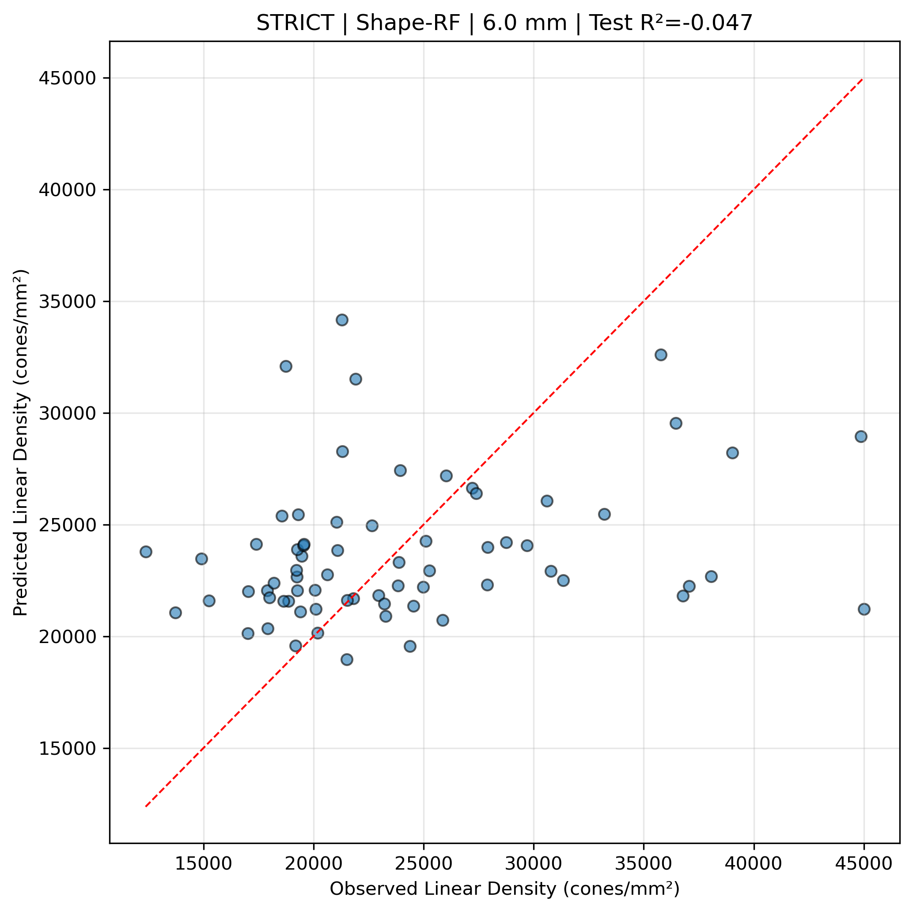
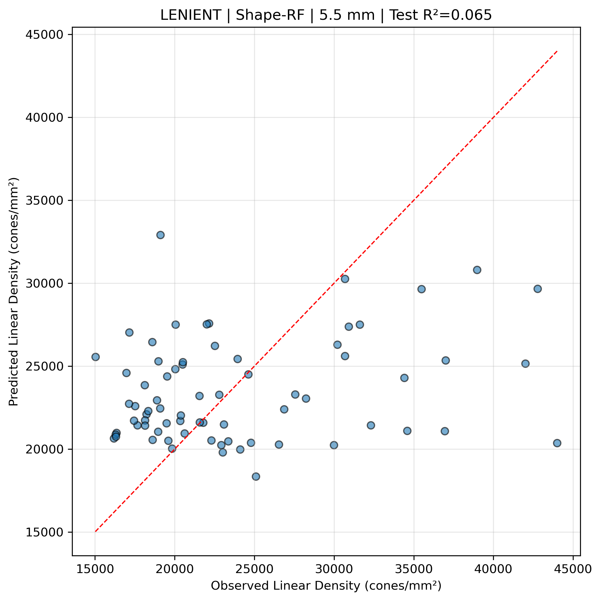
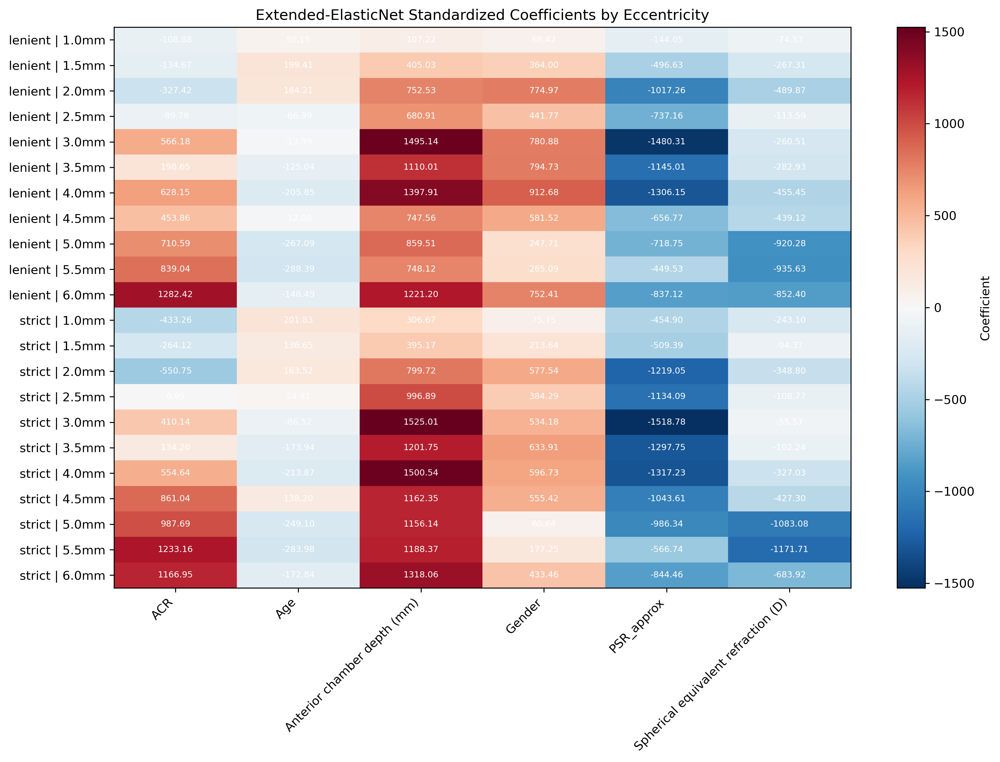

# SR0530 局部形状模型执行结果总结

> 执行脚本：`src/SR_local_shape_model.py`  
> 执行时间：2026-06-11  
> 目标变量：`Linear cone density (cones/mm²)`  
> 交叉验证：GroupKFold by Subject（Patient_ID），每折按受试者划分

---

## 一、执行概况

- **数据组**：`strict`（69 eyes / 69 subjects）、`lenient`（71 eyes / 71 subjects）
- **偏心率范围**：1.0 – 6.0 mm，步长 0.5 mm，共 11 个距离
- **特征方案**：Baseline（AL）、Shape（ACR）、Extended（ACR + PSR_approx）
- **模型**：LMM、Random Forest、ElasticNet（仅 Extended）
- **总输出记录**：154 行（2 数据组 × 11 距离 × 3 方案 × 模型数）

> 备注：执行过程中修复了一个运行时问题——`ElasticNetCV` 不支持 `alpha` 参数，已改为使用 `ElasticNet` 进行固定 α 的折内重拟合。

---

## 二、ACR 与 PSR_approx 相关性检查

| 数据组 | Spearman ρ | p 值 | 决策 |
|--------|-----------|------|------|
| strict | 0.6855 | 1.97e-106 | Extended 保留为主分析 |
| lenient | 0.6846 | 4.55e-109 | Extended 保留为主分析 |

两数据组中 ACR 与 PSR_approx 均呈中度正相关（ρ ≈ 0.685），但未超过 0.75 阈值，因此 Extended 方案未降级。

---

## 三、核心发现

### 3.1 模型预测性能整体偏低

几乎所有方案在所有偏心率上的 **CV Test R² 均为负值或接近 0**。这意味着当前特征（AL、ACR、PSR_approx、ACD、Age、Gender、SE）对线性密度的预测能力非常有限，模型在测试集上表现不比直接预测均值更好。

| 指标 | 最佳值 | 对应条件 |
|------|--------|----------|
| 最高 Test R² | 0.082 | lenient / Baseline / RF / 5.5 mm |
| Shape 最高 R² | 0.065 | lenient / Shape / RF / 5.5 mm |
| Extended 最高 R² | 0.079 | strict / Extended / LMM / 2.0 mm |
| ElasticNet 最高 R² | 0.017 | strict / Extended / ElasticNet / 5.5 mm |

### 3.2 ΔR²（Shape − Baseline）结果

以 Random Forest 为主观察：

| 数据组 | ΔR² 均值 | ΔR² 标准差 | ΔR² 范围 |
|--------|---------|-----------|----------|
| strict | -0.018 | 0.042 | -0.078 ~ +0.073 |
| lenient | -0.032 | 0.018 | -0.068 ~ -0.009 |

- **strict**：ΔR² 在 1.0 mm 处略为正（+0.073），在 4.5 mm 处最负（-0.078），整体围绕 0 波动。
- **lenient**：ΔR² 在所有偏心率上均为负，但幅度很小（< 0.07）。

结论：**用 ACR 替换 AL 并未带来一致且显著的可解释方差增益。**

### 3.3 ElasticNet 标准化系数

Extended-ElasticNet 的系数热力图显示：
- **Anterior chamber depth (mm)** 和 **ACR** 通常具有最大的正系数（红色）。
- **PSR_approx** 通常为强负系数（深蓝色），尤其在 lenient 数据组中。
- **Spherical equivalent refraction (D)** 和 **Age** 的系数方向在不同偏心率间不一致。
- 系数绝对值非常大（数百量级），提示特征间存在较强共线性或正则化 α 较大，导致系数被压缩/膨胀。

---

## 四、生成图表说明

### 4.1 ΔR² 曲线

- 蓝线为 strict，橙线为 lenient。
- 阴影带为配对差异标准差（同一 CV 折内 Shape 与 Baseline R² 之差）。
- 两线均在 0 附近波动，无稳定正向趋势。

### 4.2 最佳 Shape-RF 预测 vs 观测

**strict | 6.0 mm | Test R² = -0.047**

**lenient | 5.5 mm | Test R² = 0.065**

- 散点围绕对角线分布较为离散，预测值未能很好跟随观测值。
- lenient 5.5 mm 是唯一 Test R² 为正的 Shape-RF 结果，但数值仍较低。

### 4.3 Extended-ElasticNet 标准化系数

- 颜色越红表示系数越正，越蓝表示越负。
- ACD 和 ACR 在多数距离为正相关，PSR_approx 多为负相关。

---

## 五、结果解释与注意事项

1. **负 R² 的含义**：在 GroupKFold 测试集上，模型对未见受试者的预测比直接用训练集均值预测更差。这通常说明：
   - 样本量（~69-71）对于 5-6 个特征来说可能偏小；
   - 目标变量（线性密度）的个体差异主要由未纳入模型的因素驱动；
   - 眼轴、角膜曲率、前房深度等全局形态指标可能不足以解释局部视锥密度。

2. **GroupKFold 的严格性**：每个 Patient_ID 对应一只眼睛（数据集中无双眼重复测量），因此 GroupKFold 实际上接近留一受试者-out。这种验证方式对模型泛化能力要求最高。

3. **ACR 未显著优于 AL**：ΔR² 围绕 0 波动，未观察到 ACR 作为“形状比例”特征 systematically 优于绝对眼轴长度的证据。

4. **ElasticNet 系数需审慎解读**：系数绝对值较大且 R² 为负，说明 ElasticNet 主要拟合了训练集中的噪声，其系数不宜作为生物学因果解释。

---

## 六、输出文件清单

| 文件 | 路径 | 说明 |
|------|------|------|
| 消融结果 CSV | `genData/sum/SR0530_Ablation_Per_Distance.csv` | 所有方案/模型/偏心率的 CV 结果 |
| 相关性报告 | `genData/sum/SR0530_ACR_PSR_Correlation_*.txt` | strict/lenient 的 ACR-PSR 相关性 |
| ΔR² 曲线 | `genData/sum/SR0530_DeltaR2_by_Eccentricity.png` | Shape vs Baseline 增量方差 |
| 预测图 | `genData/sum/SR0530_Predicted_vs_Observed_*.png` | 各数据组最佳 Shape-RF 结果 |
| ElasticNet 系数图 | `genData/sum/SR0530_ElasticNet_Coefs.png` | Extended-ElasticNet 标准化系数热力图 |
| 自动报告 | `report/SR0530_Local_Shape_Model_Report.md` | 论文 Methods/Discussion 模板 |
| 执行总结 | `report/SR0530_Execution_Summary.md` | 本文件 |

---

## 七、后续建议

1. **特征工程**：尝试加入视网膜局部结构特征（如 cone spacing、regularity、dispersion）或血流特征，可能提升预测力。
2. **样本量与聚合策略**：考虑放宽 quadrant 聚合阈值或探索双眼数据（如果可用）。
3. **模型调参**：当前 RF 的 `max_depth=5` 可能过强；可尝试超参搜索。
4. **目标转换**：对线性密度取对数或按 eccentricity 分层标准化，可能改善异方差。
5. **因果关系**：当前为预测建模，不宜从负 R² 反推“眼球形状不影响视锥密度”；只能说在当前特征集和验证方式下，预测信号弱。
