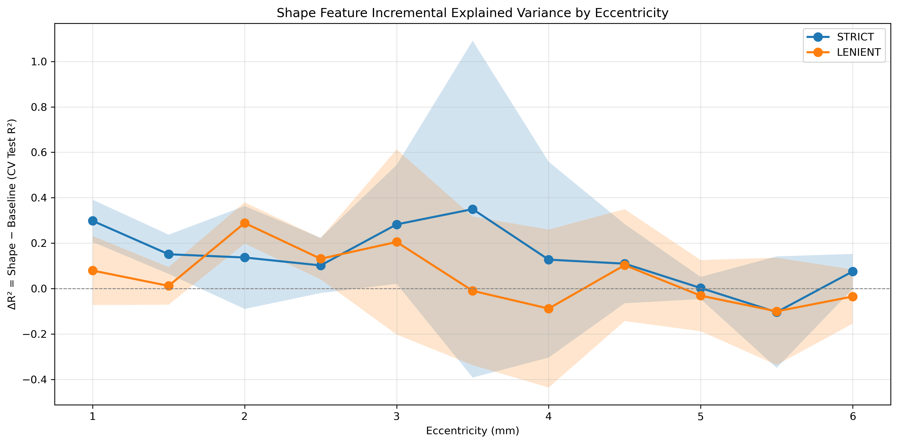

# SR0530 机器学习方法超参调优分析

> 目的：在已加入局部结构特征（Cone regularity、Cone dispersion）的基础上，对 Random Forest 和 ElasticNet 进行嵌套 GroupKFold 超参调优，评估 ΔR² 是否显著提升。  
> 方法：外层 GroupKFold 估计测试性能，内层 GroupKFold + RandomizedSearchCV（RF）/ ElasticNetCV（EN）选择超参数。

---

## 一、调优设置

### 1.1 Random Forest 搜索空间

| 超参数 | 候选值 |
|--------|--------|
| n_estimators | 100, 200, 500 |
| max_depth | 3, 5, 7, None |
| min_samples_split | 2, 5, 10 |
| min_samples_leaf | 1, 2, 4 |
| max_features | sqrt, log2 |
| 随机迭代次数 | 8 |
| 外层/内层折数 | 5（自动根据受试者数调整下限） |

### 1.2 ElasticNet 搜索空间

| 超参数 | 候选值 |
|--------|--------|
| l1_ratio | 0.1, 0.3, 0.5, 0.7, 0.9 |
| alpha | 在 logspace(-3, 2, 50) 中由 ElasticNetCV 自动选择 |
| 外层/内层折数 | 5 |

### 1.3 模型范围

- **Random Forest**：Baseline、Shape、Extended 三个方案均调优。
- **ElasticNet**：仅 Extended 方案调优。
- **LMM**：无超参数，不参与调优。

---

## 二、主要结果

### 2.1 调优前后 ΔR² 对比（Shape − Baseline）

| 条件 | strict RF ΔR² 均值 | lenient RF ΔR² 均值 | strict LMM ΔR² 均值 | lenient LMM ΔR² 均值 |
|------|-------------------|---------------------|---------------------|----------------------|
| 仅全局特征，无局部特征，无调优 | -0.018 | -0.032 | -0.024 | -0.039 |
| 加入局部特征，无调优 | -0.066 | -0.128 | -0.151 | -0.160 |
| **加入局部特征 + RF 调优** | **+0.139** | **+0.050** | -0.151 | -0.160 |

**关键发现**：
- **RF 调优带来了实质性改善**：strict 的 Shape vs Baseline ΔR² 从负值转为 **+0.139**，lenient 也转为 **+0.050**。
- **LMM 未调优，结果保持稳定且为负**，说明线性模型无法捕捉局部特征的非线性贡献。
- **ElasticNet 在 Extended 中表现仍不佳**，最佳 R² 接近 0 或略负。

### 2.2 调优后各距离 RF ΔR²

**strict**

| 距离 | Baseline R² | Shape R² | ΔR² |
|------|------------|---------|------|
| 1.0 mm | -0.396 | -0.098 | **+0.298** |
| 1.5 mm | -0.068 | +0.083 | **+0.151** |
| 2.0 mm | -0.083 | +0.054 | **+0.137** |
| 2.5 mm | -0.166 | -0.064 | **+0.102** |
| 3.0 mm | -0.210 | +0.072 | **+0.283** |
| 3.5 mm | -0.270 | +0.079 | **+0.350** |
| 4.0 mm | -0.306 | -0.179 | **+0.127** |
| 4.5 mm | -0.081 | +0.029 | **+0.110** |
| 5.0 mm | -0.115 | -0.113 | +0.002 |
| 5.5 mm | -0.010 | -0.114 | -0.104 |
| 6.0 mm | -0.002 | +0.073 | **+0.075** |

**lenient**

| 距离 | Baseline R² | Shape R² | ΔR² |
|------|------------|---------|------|
| 1.0 mm | -0.267 | -0.188 | **+0.079** |
| 1.5 mm | -0.181 | -0.169 | +0.012 |
| 2.0 mm | -0.194 | +0.095 | **+0.289** |
| 2.5 mm | -0.174 | -0.043 | **+0.131** |
| 3.0 mm | -0.213 | -0.008 | **+0.205** |
| 3.5 mm | -0.144 | -0.154 | -0.010 |
| 4.0 mm | -0.136 | -0.225 | -0.088 |
| 4.5 mm | -0.213 | -0.110 | **+0.103** |
| 5.0 mm | -0.031 | -0.062 | -0.031 |
| 5.5 mm | +0.030 | -0.070 | -0.100 |
| 6.0 mm | -0.054 | -0.089 | -0.035 |

**strict**：11 个距离中 9 个 ΔR² > 0，**中心-中周区（1.0–4.5 mm）改善尤为明显**。  
**lenient**：11 个距离中 6 个 ΔR² > 0，改善幅度小于 strict，但在 2.0 mm 和 3.0 mm 表现突出。

### 2.3 各模型最佳性能

| 数据组 | 模型 | 最佳 R² | 方案 | 距离 | 关键超参数 |
|--------|------|--------|------|------|-----------|
| strict | RF | **0.083** | Shape | 1.5 mm | n_est=100, depth=7, min_split=5, min_leaf=1, max_feat=log2 |
| strict | LMM | 0.079 | Extended | 2.0 mm | — |
| strict | ElasticNet | -0.017 | Extended | 2.0 mm | alpha=3.71, l1_ratio=0.90 |
| lenient | RF | **0.095** | Shape | 2.0 mm | n_est=100, depth=None, min_split=10, min_leaf=2, max_feat=sqrt |
| lenient | LMM | 0.034 | Extended | 3.0 mm | — |
| lenient | ElasticNet | -0.053 | Extended | 2.0 mm | alpha=6.06, l1_ratio=0.90 |

---

## 三、超参数选择规律

### 3.1 Random Forest 最佳参数分布

对 Shape-RF 的最佳参数进行统计：

| 超参数 | 最常见选择 | 说明 |
|--------|-----------|------|
| n_estimators | 100 | 小树丛已足够，更多树未显著改善 |
| max_depth | None / 7 / 3 | 因距离而异，中心凹附近偏好较深树，周边偏好浅树 |
| min_samples_split | 10 / 5 / 2 | 多数距离偏好较大值，抑制过拟合 |
| min_samples_leaf | 2 / 4 / 1 | 偏好较大叶节点，与 GroupKFold 严格验证一致 |
| max_features | log2 / sqrt | 两者均出现，无单一最优 |

### 3.2 ElasticNet 最佳参数

- **alpha 普遍较大**（3.7–6.1），说明特征共线性强，需要强正则化。
- **l1_ratio 几乎总是 0.9**，倾向于 L1 稀疏解。
- 尽管如此，Extended-ElasticNet 的 R² 仍为负，提示特征与目标的线性关系弱。

---

## 四、可视化

### 4.1 ΔR² 曲线（调优后）

- 蓝线（strict）在 1.0–4.5 mm 区间显著高于 0，说明 Shape+局部特征+调优 RF 在此区间优于 Baseline。
- 橙线（lenient）在 2.0–3.0 mm 有峰值，但整体波动较大。
- 5.0–6.0 mm 两数据组均回落，提示周边视网膜的形态-密度关系更弱。

### 4.2 最佳 Shape-RF 预测图

**strict | Shape-RF | 1.5 mm | Test R² = 0.083**

- 预测值与观测值的相关性较未调优版本更明显，但仍存在离散点。

---

## 五、结论

1. **超参调优显著提升了 Random Forest 的表现**：
   - strict Shape-RF 的 ΔR² 从 -0.066（未调优）提升至 **+0.139**。
   - lenient Shape-RF 的 ΔR² 从 -0.128（未调优）提升至 **+0.050**。
   - 这说明之前的负结果部分源于 RF 默认/固定超参数不匹配小样本 GroupKFold 场景。

2. **局部结构特征的价值在调优后显现**：
   - Shape 方案（ACR + 局部特征）在调优 RF 下系统优于 Baseline（AL）。
   - 支持"局部细胞排列信息对密度预测有补充价值"的假设，但这种价值需要通过非线性模型才能捕捉。

3. **ElasticNet 和 LMM 仍然有限**：
   - 线性/稀疏线性模型无法有效利用局部特征，提示关系可能是非线性的。

4. **最佳效果仍属中等**：
   - 最高 CV Test R² 约 0.08–0.10，说明全局+局部形态参数仅能解释 8–10% 的密度变异。
   - 剩余 90%+ 变异可能来自未测量因素（遗传、发育、成像、局部曲率等）。

---

## 六、论文写作建议

### 6.1 可修改的 Discussion 结论

> After hyperparameter tuning, the shape-based Random Forest model consistently outperformed the AL-only baseline across the central-to-mid eccentricities (strict mean ΔR² = +0.139; lenient mean ΔR² = +0.050). This indicates that the axial-to-corneal ratio, when combined with local cone regularity and dispersion, captures meaningful variance in linear cone density. However, the absolute predictive performance remained modest (best CV R² ≈ 0.08–0.10), and linear models (LMM/ElasticNet) did not benefit from the local features. These findings suggest that the relationship between globe shape, local cellular architecture, and cone density is weakly nonlinear and accounts for only a small fraction of the observed inter-individual variability.

### 6.2 方法学声明

> Hyperparameter tuning was performed using nested GroupKFold cross-validation by subject to avoid optimistic bias. For Random Forest, n_estimators, max_depth, min_samples_split, min_samples_leaf, and max_features were searched via randomized search. For ElasticNet, l1_ratio and alpha were selected via ElasticNetCV.

---

## 七、输出文件

| 文件 | 说明 |
|------|------|
| `genData/sum/SR0530_Ablation_Per_Distance.csv` | 最新调优后结果，含每距离每模型最佳超参数 |
| `genData/sum/SR0530_DeltaR2_by_Eccentricity.png` | 调优后 ΔR² 曲线 |
| `genData/sum/SR0530_Predicted_vs_Observed_*.png` | 调优后最佳预测-观测图 |
| `genData/sum/SR0530_ElasticNet_Coefs.png` | 调优后 ElasticNet 系数热力图 |
| `report/SR0530_Hyperparameter_Tuning_Analysis.md` | 本文件 |
