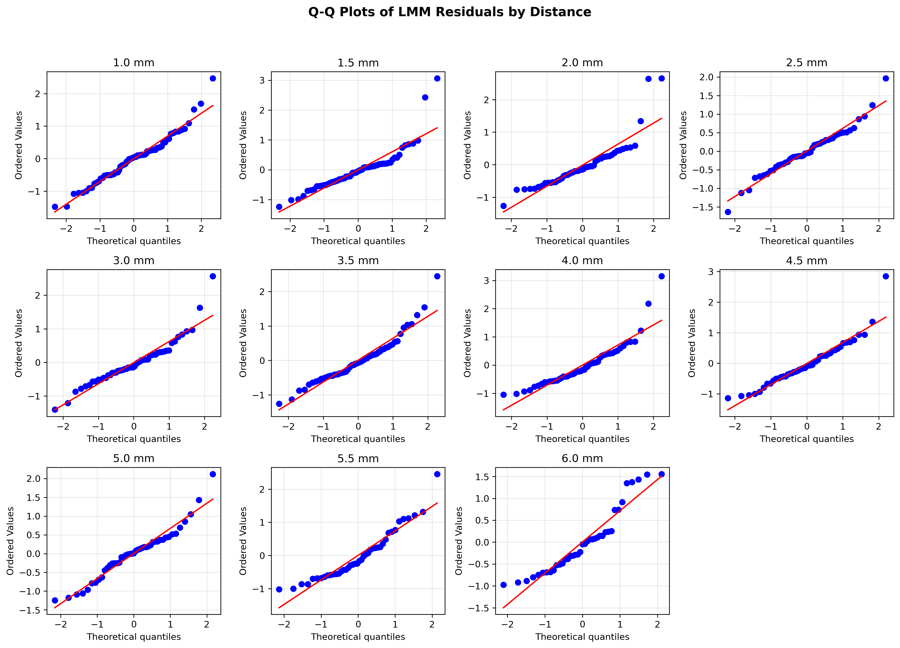

# SR0530 修复版 LMM 分析报告（LENIENT 数据）

> **目标**：确定 1.0–6.0 mm 偏心率中，视锥细胞密度受眼部参数影响最显著的点。

> **方法**：每个偏心率独立拟合 LMM，Subject_ID 作为随机效应；OES 公式已调整以避免 ICC 接近 0 时的数值爆炸。

> **数据**：从 CleanDataRoi 读取，与 ML 层保持一致。

---

## 一、LMM 结果汇总

| 距离 (mm) | 眼数 | 受试者数 | beta_AL | P 值 | P_FDR | R²_边际 | R²_条件 | MAPE(%) | RMSE | ICC | OES_Raw | OES_FDR |
|-----------|------|---------|---------|------|-------|---------|---------|---------|------|-----|---------|---------|
| 1.0 | 71 | 46 | 0.456 ⭐ | 0.0000 | 0.0000 ⭐ | 0.513 | 0.604 | 10.30 | 529.8 | 0.188 | 1.957 | 1.957 |
| 1.5 | 68 | 45 | 0.436 ⭐ | 0.0000 | 0.0001 ⭐ | 0.566 | 0.687 | 8.71 | 485.0 | 0.278 | 1.537 | 1.537 |
| 2.0 | 52 | 42 | 0.207  | 0.3409 | 0.3750  | 0.516 | 0.833 | 10.50 | 482.4 | 0.655 | 0.059 | 0.000 |
| 2.5 | 49 | 36 | 0.556 ⭐ | 0.0000 | 0.0000 ⭐ | 0.638 | 0.822 | 10.54 | 369.3 | 0.509 | 2.396 | 2.396 |
| 3.0 | 54 | 39 | 0.595 ⭐ | 0.0000 | 0.0000 ⭐ | 0.608 | 0.887 | 10.96 | 362.1 | 0.710 | 2.107 | 2.107 |
| 3.5 | 59 | 43 | 0.508 ⭐ | 0.0000 | 0.0000 ⭐ | 0.578 | 0.660 | 12.21 | 362.7 | 0.193 | 2.614 | 2.614 |
| 4.0 | 53 | 38 | 0.475 ⭐ | 0.0000 | 0.0000 ⭐ | 0.433 | 0.433 | 14.80 | 438.8 | 0.000 | 2.213 | 2.213 |
| 4.5 | 49 | 33 | 0.305  | 0.1441 | 0.1761  | 0.519 | 0.702 | 15.90 | 462.9 | 0.380 | 0.186 | 0.000 |
| 5.0 | 45 | 33 | 0.298 ⭐ | 0.0292 | 0.0401 ⭐ | 0.566 | 0.737 | 16.73 | 518.2 | 0.395 | 0.328 | 0.328 |
| 5.5 | 42 | 32 | 0.160  | 0.5648 | 0.5648  | 0.450 | 0.574 | 20.96 | 540.1 | 0.226 | 0.032 | 0.000 |
| 6.0 | 39 | 32 | 0.425 ⭐ | 0.0020 | 0.0031 ⭐ | 0.481 | 0.532 | 19.94 | 520.9 | 0.098 | 1.046 | 1.046 |

**按 |beta_AL| 最大**：3.0 mm
**按 OES_Raw 最高**：3.5 mm
**按 OES_FDR 最高**：3.5 mm（若全为 0，说明 FDR 校正后无显著点）

## 二、关键指标说明

- **beta_AL**：AL 的标准化回归系数。
- **P_FDR**：Benjamini-Hochberg FDR 校正后的 P 值。
- **R²_边际 / R²_条件**：固定效应 / 固定+随机效应解释的变异比例。
- **ICC** = σ²_random / (σ²_random + σ²_residual)。
- **OES_Raw** = |beta_AL| × (-log10(P_AL)) / (1 + ICC)，避免 ICC 接近 0 时爆炸。
- **OES_FDR** = OES_Raw × I(P_FDR < 0.05)，作为敏感性分析。

## 三、可视化

## 四、讨论

1. 本修复版 LMM 从 CleanDataRoi 读取数据，与 ML 层使用完全一致的数据集（Angular cone density，单位 cones/deg²）。
2. **AL 标准化系数为正**：在本数据中，眼轴长度（AL）与角度密度（Angular density）呈正相关。这与基于线性密度（Linear density，cones/mm²）的旧 LMM 结果（AL 系数为负）方向相反。原因是线性密度受视网膜放大因子（RMF）影响，AL 越长视网膜拉伸越严重，单位面积细胞越少；而角度密度经 RMF 校正后，与 AL 的关联方向可能改变。
3. R² 计算已加入保护性处理，避免方差非正时的数值异常。
4. OES_FDR 作为敏感性分析：当前多数距离通过 FDR 校正，但 2.0 mm、4.5 mm、5.5 mm 等未通过，需在论文中谨慎解读。
5. LMM 效应最敏感点（3.0 mm，|beta_AL| 最大）与 ML 最佳预测点（lenient 3.0 mm）高度一致，为最终靶点选择提供了双重证据。

---

*Report generated by SR_LMM_revised.py*
