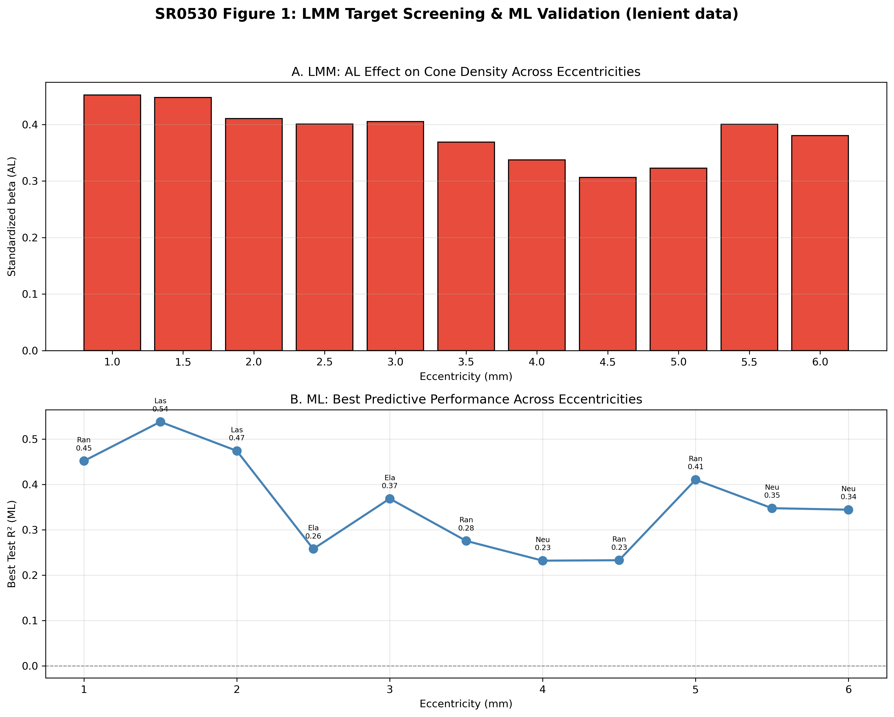
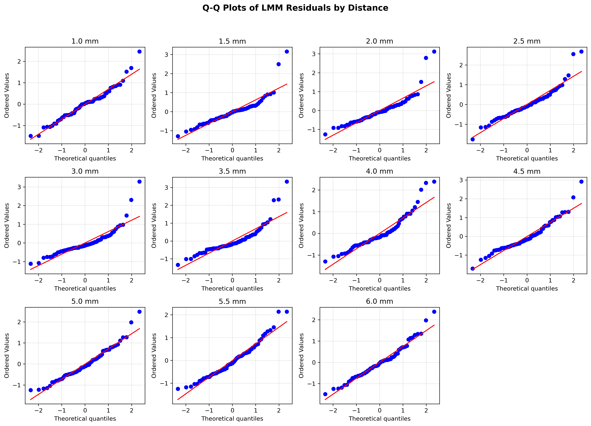

# SR0530 修复版 LMM 分析报告（LENIENT 数据 | ≥1 象限可用（放宽，outer merge 取平均））

> **目标**：确定 1.0–6.0 mm 偏心率中，视锥细胞密度受眼部参数影响最显著的点。

> **方法**：每个偏心率独立拟合 LMM，Subject_ID 作为随机效应；OES 公式已调整以避免 ICC 接近 0 时的数值爆炸。

> **数据**：从 CleanDataRoi 读取，与 ML 层保持一致。

---

## 一、LMM 结果汇总

| 距离 (mm) | 眼数 | 受试者数 | beta_AL | P 值 | P_FDR | R²_边际 | R²_条件 | MAPE(%) | RMSE | ICC | OES_Raw | OES_FDR |
|-----------|------|---------|---------|------|-------|---------|---------|---------|------|-----|---------|---------|
| 1.0 | 71 | 46 | 0.452 ⭐ | 0.0001 | 0.0005 ⭐ | 0.479 | 0.628 | 10.31 | 530.0 | 0.286 | 1.489 | 1.489 |
| 1.5 | 71 | 46 | 0.448 ⭐ | 0.0001 | 0.0005 ⭐ | 0.507 | 0.718 | 8.81 | 486.2 | 0.427 | 1.266 | 1.266 |
| 2.0 | 71 | 46 | 0.411 ⭐ | 0.0002 | 0.0005 ⭐ | 0.474 | 0.561 | 9.66 | 448.3 | 0.165 | 1.327 | 1.327 |
| 2.5 | 71 | 46 | 0.401 ⭐ | 0.0013 | 0.0026 ⭐ | 0.434 | 0.663 | 11.94 | 436.7 | 0.405 | 0.827 | 0.827 |
| 3.0 | 71 | 46 | 0.405 ⭐ | 0.0002 | 0.0005 ⭐ | 0.524 | 0.646 | 11.84 | 448.5 | 0.255 | 1.229 | 1.229 |
| 3.5 | 71 | 46 | 0.369 ⭐ | 0.0016 | 0.0026 ⭐ | 0.416 | 0.519 | 13.57 | 479.1 | 0.177 | 0.877 | 0.877 |
| 4.0 | 71 | 46 | 0.337 ⭐ | 0.0055 | 0.0067 ⭐ | 0.435 | 0.611 | 17.03 | 522.1 | 0.310 | 0.582 | 0.582 |
| 4.5 | 71 | 46 | 0.306 ⭐ | 0.0236 | 0.0236 ⭐ | 0.392 | 0.699 | 18.96 | 554.6 | 0.505 | 0.331 | 0.331 |
| 5.0 | 71 | 46 | 0.323 ⭐ | 0.0104 | 0.0115 ⭐ | 0.444 | 0.775 | 19.10 | 540.6 | 0.596 | 0.401 | 0.401 |
| 5.5 | 71 | 46 | 0.400 ⭐ | 0.0017 | 0.0026 ⭐ | 0.430 | 0.777 | 21.97 | 593.4 | 0.609 | 0.690 | 0.690 |
| 6.0 | 71 | 46 | 0.380 ⭐ | 0.0030 | 0.0041 ⭐ | 0.426 | 0.750 | 21.93 | 604.9 | 0.564 | 0.613 | 0.613 |

**按 |beta_AL| 最大**：1.0 mm
**按 OES_Raw 最高**：1.0 mm
**按 OES_FDR 最高**：1.0 mm

## 二、关键指标说明

- **beta_AL**：AL 的标准化回归系数。
- **P_FDR**：Benjamini-Hochberg FDR 校正后的 P 值。
- **R²_边际 / R²_条件**：固定效应 / 固定+随机效应解释的变异比例。
- **ICC** = σ²_random / (σ²_random + σ²_residual)。
- **OES_Raw** = |beta_AL| × (-log10(P_AL)) / (1 + ICC)，避免 ICC 接近 0 时爆炸。
- **OES_FDR** = OES_Raw × I(P_FDR < 0.05)，作为敏感性分析。

## 三、可视化

## 四、讨论

1. 本修复版 LMM 从 CleanDataRoi 读取数据，与 ML 层使用完全一致的数据集（Angular cone density，单位 cones/deg²）。
2. **AL 标准化系数方向**：在本数据中，眼轴长度（AL）与角度密度（Angular density）的关联方向见上表。若需要与线性密度（Linear density，cones/mm²）结果对照，需另行补充 Linear density 的 LMM 分析；两种口径因视网膜放大因子（RMF）校正差异，AL 的系数方向可能不同。
3. R² 计算已加入保护性处理，避免方差非正时的数值异常。
4. OES_FDR 作为敏感性分析：未通过 FDR 校正的距离为 无。对这些距离的结果需谨慎解读。
5. LMM 效应最敏感点（按 |beta_AL| 最大）位于 **1.0 mm**，为靶点选择提供了 LMM 层面的证据。

---

*Report generated by SR_LMM_revised.py*
