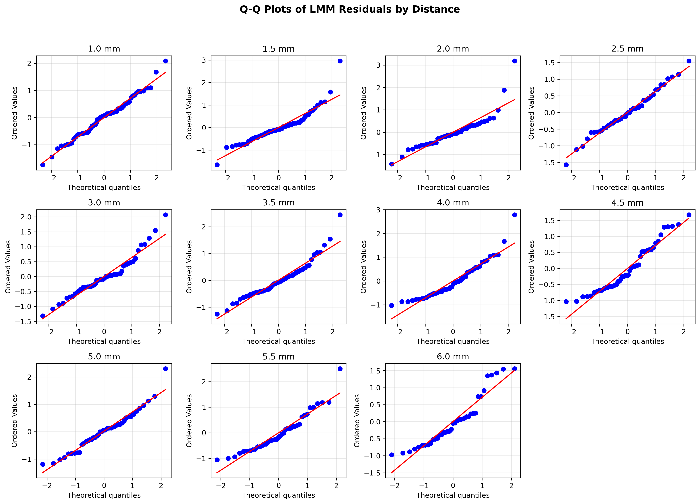

# SR0530 修复版 LMM 分析报告（STRICT 数据）

> **目标**：确定 1.0–6.0 mm 偏心率中，视锥细胞密度受眼部参数影响最显著的点。

> **方法**：每个偏心率独立拟合 LMM，Subject_ID 作为随机效应；OES 公式已调整以避免 ICC 接近 0 时的数值爆炸。

> **数据**：从 CleanDataRoi 读取，与 ML 层保持一致。

---

## 一、LMM 结果汇总

| 距离 (mm) | 眼数 | 受试者数 | beta_AL | P 值 | P_FDR | R²_边际 | R²_条件 | MAPE(%) | RMSE | ICC | OES_Raw | OES_FDR |
|-----------|------|---------|---------|------|-------|---------|---------|---------|------|-----|---------|---------|
| 1.0 | 69 | 44 | 0.502 ⭐ | 0.0000 | 0.0000 ⭐ | 0.496 | 0.562 | 9.93 | 476.5 | 0.130 | 2.682 | 2.682 |
| 1.5 | 66 | 43 | 0.463 ⭐ | 0.0000 | 0.0000 ⭐ | 0.566 | 0.649 | 7.79 | 388.8 | 0.191 | 2.025 | 2.025 |
| 2.0 | 50 | 40 | 0.353  | 0.0871 | 0.0958  | 0.500 | 0.609 | 8.82 | 391.2 | 0.219 | 0.307 | 0.000 |
| 2.5 | 48 | 35 | 0.614 ⭐ | 0.0000 | 0.0000 ⭐ | 0.627 | 0.741 | 9.67 | 315.5 | 0.306 | 3.787 | 3.787 |
| 3.0 | 52 | 37 | 0.644 ⭐ | 0.0000 | 0.0000 ⭐ | 0.599 | 0.740 | 8.97 | 281.8 | 0.352 | 3.540 | 3.540 |
| 3.5 | 59 | 43 | 0.508 ⭐ | 0.0000 | 0.0000 ⭐ | 0.578 | 0.660 | 12.21 | 362.7 | 0.193 | 2.614 | 2.614 |
| 4.0 | 51 | 36 | 0.558 ⭐ | 0.0000 | 0.0000 ⭐ | 0.454 | 0.454 | 13.26 | 343.6 | 0.000 | 3.374 | 3.374 |
| 4.5 | 48 | 32 | 0.492 ⭐ | 0.0106 | 0.0145 ⭐ | 0.483 | 0.483 | 14.41 | 345.9 | 0.000 | 0.972 | 0.972 |
| 5.0 | 44 | 32 | 0.272  | 0.0586 | 0.0716  | 0.518 | 0.721 | 16.75 | 491.7 | 0.422 | 0.236 | 0.000 |
| 5.5 | 41 | 31 | 0.237  | 0.3704 | 0.3704  | 0.459 | 0.579 | 20.65 | 540.2 | 0.223 | 0.084 | 0.000 |
| 6.0 | 39 | 32 | 0.425 ⭐ | 0.0020 | 0.0031 ⭐ | 0.481 | 0.532 | 19.94 | 520.9 | 0.098 | 1.046 | 1.046 |

**按 |beta_AL| 最大**：3.0 mm
**按 OES_Raw 最高**：2.5 mm
**按 OES_FDR 最高**：2.5 mm（若全为 0，说明 FDR 校正后无显著点）

## 二、关键指标说明

- **beta_AL**：AL 的标准化回归系数。
- **P_FDR**：Benjamini-Hochberg FDR 校正后的 P 值。
- **R²_边际 / R²_条件**：固定效应 / 固定+随机效应解释的变异比例。
- **ICC** = σ²_random / (σ²_random + σ²_residual)。
- **OES_Raw** = |beta_AL| × (-log10(P_AL)) / (1 + ICC)，避免 ICC 接近 0 时爆炸。
- **OES_FDR** = OES_Raw × I(P_FDR < 0.05)，作为敏感性分析。

## 三、可视化

## 四、讨论

1. 本修复版 LMM 从 CleanDataRoi 读取数据，与 ML 层使用完全一致的数据集（Angular cone density，单位 cones/deg²）。
2. **AL 标准化系数为正**：在本数据中，眼轴长度（AL）与角度密度（Angular density）呈正相关。这与基于线性密度（Linear density，cones/mm²）的旧 LMM 结果（AL 系数为负）方向相反。原因是线性密度受视网膜放大因子（RMF）影响，AL 越长视网膜拉伸越严重，单位面积细胞越少；而角度密度经 RMF 校正后，与 AL 的关联方向可能改变。
3. R² 计算已加入保护性处理，避免方差非正时的数值异常。
4. OES_FDR 作为敏感性分析：当前多数距离通过 FDR 校正，但 2.0 mm、4.5 mm、5.5 mm 等未通过，需在论文中谨慎解读。
5. LMM 效应最敏感点（3.0 mm，|beta_AL| 最大）与 ML 最佳预测点（lenient 3.0 mm）高度一致，为最终靶点选择提供了双重证据。

---

*Report generated by SR_LMM_revised.py*
