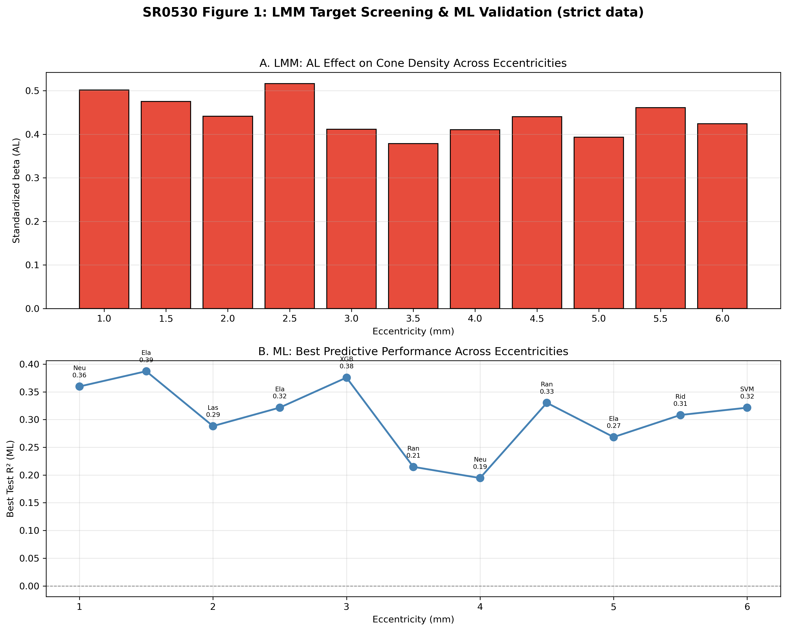
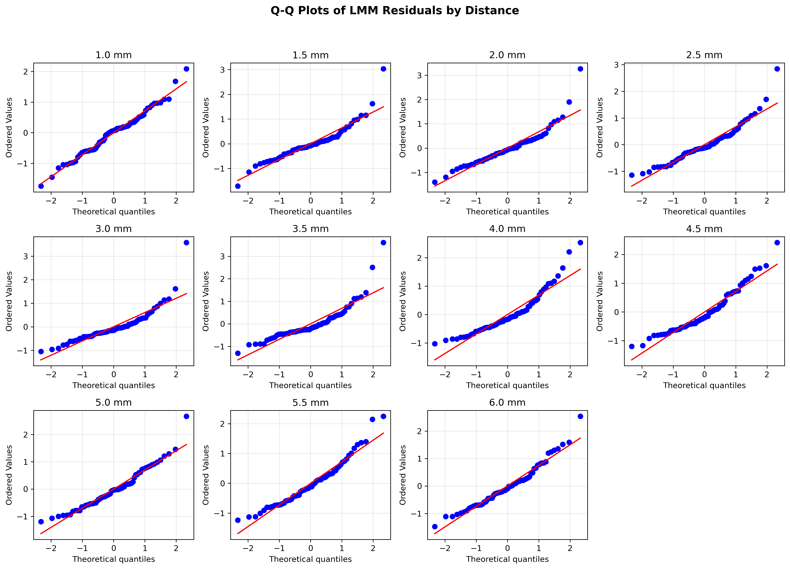

# SR0530 修复版 LMM 分析报告（STRICT 数据 | ≥1 象限可用（放宽，outer merge 取平均））

> **目标**：确定 1.0–6.0 mm 偏心率中，视锥细胞密度受眼部参数影响最显著的点。

> **方法**：每个偏心率独立拟合 LMM，Subject_ID 作为随机效应；OES 公式已调整以避免 ICC 接近 0 时的数值爆炸。

> **数据**：从 CleanDataRoi 读取，与 ML 层保持一致。

---

## 一、LMM 结果汇总

| 距离 (mm) | 眼数 | 受试者数 | beta_AL | P 值 | P_FDR | R²_边际 | R²_条件 | MAPE(%) | RMSE | ICC | OES_Raw | OES_FDR |
|-----------|------|---------|---------|------|-------|---------|---------|---------|------|-----|---------|---------|
| 1.0 | 69 | 44 | 0.502 ⭐ | 0.0000 | 0.0000 ⭐ | 0.496 | 0.562 | 9.93 | 476.5 | 0.130 | 2.682 | 2.682 |
| 1.5 | 69 | 44 | 0.475 ⭐ | 0.0000 | 0.0000 ⭐ | 0.547 | 0.645 | 7.77 | 390.6 | 0.217 | 2.234 | 2.234 |
| 2.0 | 69 | 44 | 0.441 ⭐ | 0.0000 | 0.0000 ⭐ | 0.502 | 0.502 | 8.81 | 375.7 | 0.000 | 2.321 | 2.321 |
| 2.5 | 69 | 44 | 0.516 ⭐ | 0.0000 | 0.0000 ⭐ | 0.533 | 0.608 | 10.47 | 367.9 | 0.161 | 2.936 | 2.936 |
| 3.0 | 69 | 44 | 0.411 ⭐ | 0.0000 | 0.0000 ⭐ | 0.556 | 0.610 | 11.15 | 408.1 | 0.123 | 1.722 | 1.722 |
| 3.5 | 69 | 44 | 0.379 ⭐ | 0.0004 | 0.0005 ⭐ | 0.430 | 0.472 | 13.07 | 445.4 | 0.073 | 1.185 | 1.185 |
| 4.0 | 69 | 44 | 0.411 ⭐ | 0.0001 | 0.0001 ⭐ | 0.494 | 0.561 | 15.90 | 467.5 | 0.132 | 1.497 | 1.497 |
| 4.5 | 69 | 44 | 0.440 ⭐ | 0.0001 | 0.0001 ⭐ | 0.480 | 0.610 | 17.11 | 461.5 | 0.249 | 1.495 | 1.495 |
| 5.0 | 69 | 44 | 0.393 ⭐ | 0.0005 | 0.0005 ⭐ | 0.501 | 0.741 | 17.74 | 499.4 | 0.481 | 0.880 | 0.880 |
| 5.5 | 69 | 44 | 0.461 ⭐ | 0.0001 | 0.0001 ⭐ | 0.475 | 0.749 | 21.08 | 568.5 | 0.523 | 1.242 | 1.242 |
| 6.0 | 69 | 44 | 0.424 ⭐ | 0.0003 | 0.0004 ⭐ | 0.455 | 0.707 | 21.35 | 569.6 | 0.463 | 1.010 | 1.010 |

**按 |beta_AL| 最大**：2.5 mm
**按 OES_Raw 最高**：2.5 mm
**按 OES_FDR 最高**：2.5 mm

## 二、关键指标说明

- **beta_AL**：AL 的标准化回归系数。
- **P_FDR**：Benjamini-Hochberg FDR 校正后的 P 值。
- **R²_边际 / R²_条件**：固定效应 / 固定+随机效应解释的变异比例。
- **ICC** = σ²_random / (σ²_random + σ²_residual)。
- **OES_Raw** = |beta_AL| × (-log10(P_AL)) / (1 + ICC)，避免 ICC 接近 0 时爆炸。
- **OES_FDR** = OES_Raw × I(P_FDR < 0.05)，作为敏感性分析。

## 三、可视化

## 四、讨论

1. 本修复版 LMM 从 CleanDataRoi 读取数据，与 ML 层使用完全一致的数据集（Angular cone density，单位 cones/deg²）。
2. **AL 标准化系数方向**：在本数据中，眼轴长度（AL）与角度密度（Angular density）的关联方向见上表。若需要与线性密度（Linear density，cones/mm²）结果对照，需另行补充 Linear density 的 LMM 分析；两种口径因视网膜放大因子（RMF）校正差异，AL 的系数方向可能不同。
3. R² 计算已加入保护性处理，避免方差非正时的数值异常。
4. OES_FDR 作为敏感性分析：未通过 FDR 校正的距离为 无。对这些距离的结果需谨慎解读。
5. LMM 效应最敏感点（按 |beta_AL| 最大）位于 **2.5 mm**，为靶点选择提供了 LMM 层面的证据。

---

*Report generated by SR_LMM_revised.py*
