# SR0530 学习曲线、SHAP 与过拟合评估报告

> **目标**：对 71 眼 lenient 数据集上的推荐方案，绘制各 ML 模型的学习曲线，评估过拟合程度，并对表现最好的模型生成 SHAP 解释图。

> **数据**：lenient（71 眼 / 46 subjects），象限策略为 ≥1 象限可用。

---

## 一、评估的方案与距离

- **C1_Combined_ALK** at **1.5 mm**
- **A2_Biomechanical_ALK** at **1.5 mm**
- **C1_Combined_K** at **1.5 mm**
- **A2_Biomechanical_ALK** at **3.0 mm**

## 二、过拟合评估汇总

| 距离 (mm) | 方案 | 模型 | Final Train R² | Final Val R² | LC Gap | 是否收敛 | 过拟合判断 |
|-----------|------|------|----------------|--------------|--------|----------|------------|
| 1.5 | C1_Combined_ALK | SVM | 0.445 | 0.377 | 0.069 | 是 | 轻度过拟合 |
| 1.5 | C1_Combined_ALK | Random_Forest | 0.699 | 0.361 | 0.338 | 是 | 重度过拟合 |
| 1.5 | C1_Combined_ALK | XGBoost | 0.684 | 0.353 | 0.331 | 是 | 重度过拟合 |
| 1.5 | C1_Combined_ALK | Neural_Network | 0.614 | 0.381 | 0.233 | 是 | 中度过拟合 |
| 1.5 | C1_Combined_ALK | Lasso | 0.528 | 0.427 | 0.101 | 是 | 轻度过拟合 |
| 1.5 | C1_Combined_ALK | ElasticNet | 0.529 | 0.416 | 0.113 | 是 | 轻度过拟合 |
| 1.5 | C1_Combined_ALK | Ridge | 0.529 | 0.417 | 0.112 | 是 | 轻度过拟合 |
| 1.5 | A2_Biomechanical_ALK | SVM | 0.367 | 0.240 | 0.127 | 是 | 轻度过拟合 |
| 1.5 | A2_Biomechanical_ALK | Random_Forest | 0.672 | 0.350 | 0.322 | 否 | 重度过拟合 |
| 1.5 | A2_Biomechanical_ALK | XGBoost | 0.596 | 0.347 | 0.250 | 否 | 中度过拟合 |
| 1.5 | A2_Biomechanical_ALK | Neural_Network | 0.524 | 0.204 | 0.320 | 否 | 重度过拟合 |
| 1.5 | A2_Biomechanical_ALK | Lasso | 0.547 | 0.456 | 0.092 | 是 | 轻度过拟合 |
| 1.5 | A2_Biomechanical_ALK | ElasticNet | 0.547 | 0.456 | 0.092 | 是 | 轻度过拟合 |
| 1.5 | A2_Biomechanical_ALK | Ridge | 0.547 | 0.455 | 0.092 | 是 | 轻度过拟合 |
| 1.5 | C1_Combined_K | SVM | 0.418 | 0.353 | 0.065 | 是 | 轻度过拟合 |
| 1.5 | C1_Combined_K | Random_Forest | 0.651 | 0.367 | 0.284 | 是 | 中度过拟合 |
| 1.5 | C1_Combined_K | XGBoost | 0.684 | 0.370 | 0.313 | 否 | 重度过拟合 |
| 1.5 | C1_Combined_K | Neural_Network | 0.607 | 0.324 | 0.283 | 否 | 中度过拟合 |
| 1.5 | C1_Combined_K | Lasso | 0.526 | 0.427 | 0.099 | 是 | 轻度过拟合 |
| 1.5 | C1_Combined_K | ElasticNet | 0.527 | 0.416 | 0.111 | 是 | 轻度过拟合 |
| 1.5 | C1_Combined_K | Ridge | 0.527 | 0.416 | 0.111 | 是 | 轻度过拟合 |
| 3.0 | A2_Biomechanical_ALK | SVM | 0.514 | 0.307 | 0.206 | 是 | 中度过拟合 |
| 3.0 | A2_Biomechanical_ALK | Random_Forest | 0.767 | 0.227 | 0.539 | 是 | 重度过拟合 |
| 3.0 | A2_Biomechanical_ALK | XGBoost | 0.830 | 0.186 | 0.644 | 否 | 重度过拟合 |
| 3.0 | A2_Biomechanical_ALK | Neural_Network | 0.407 | 0.280 | 0.127 | 否 | 轻度过拟合 |
| 3.0 | A2_Biomechanical_ALK | Lasso | 0.559 | 0.366 | 0.194 | 是 | 中度过拟合 |
| 3.0 | A2_Biomechanical_ALK | ElasticNet | 0.559 | 0.366 | 0.194 | 是 | 中度过拟合 |
| 3.0 | A2_Biomechanical_ALK | Ridge | 0.559 | 0.366 | 0.194 | 是 | 中度过拟合 |

## 三、按方案汇总的平均过拟合 Gap

| 距离 (mm) | 方案 | 平均 LC Gap |
|-----------|------|-------------|
| 1.5 | C1_Combined_K | 0.181 |
| 1.5 | A2_Biomechanical_ALK | 0.185 |
| 1.5 | C1_Combined_ALK | 0.185 |
| 3.0 | A2_Biomechanical_ALK | 0.300 |

## 四、可视化

### Learning Curves: LC_1.5mm_C1_Combined_ALK.png

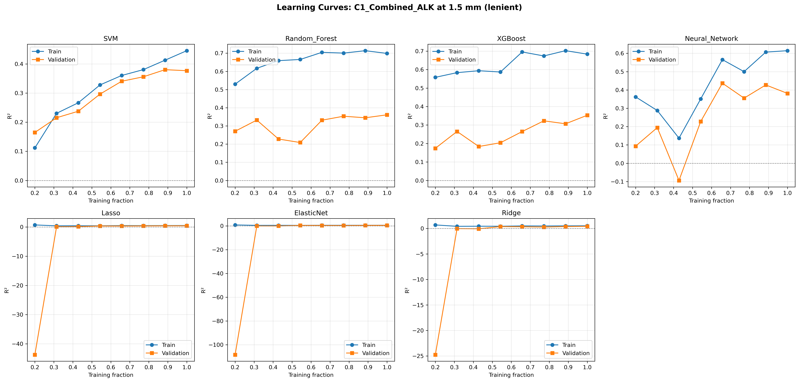

### SHAP Lasso: SHAP_1.5mm_C1_Combined_ALK_Lasso.png

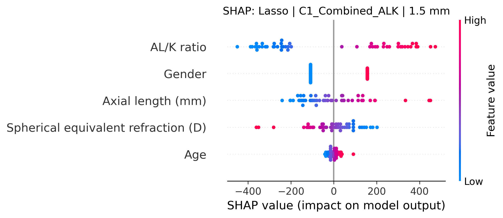

### SHAP ElasticNet: SHAP_1.5mm_C1_Combined_ALK_ElasticNet.png

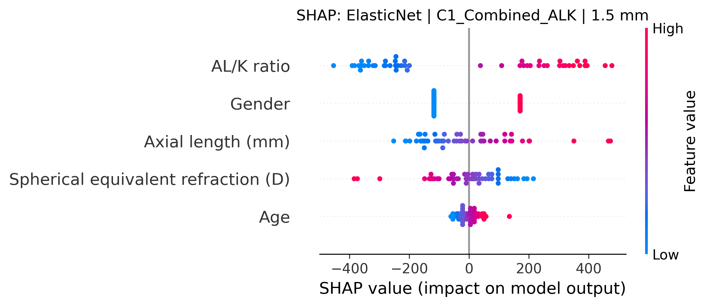

### Learning Curves: LC_1.5mm_A2_Biomechanical_ALK.png

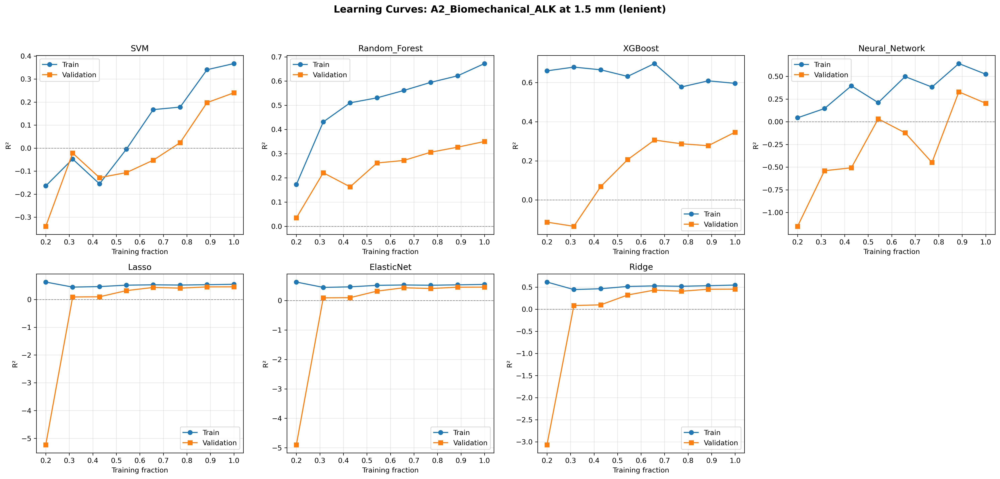

### SHAP Lasso: SHAP_1.5mm_A2_Biomechanical_ALK_Lasso.png

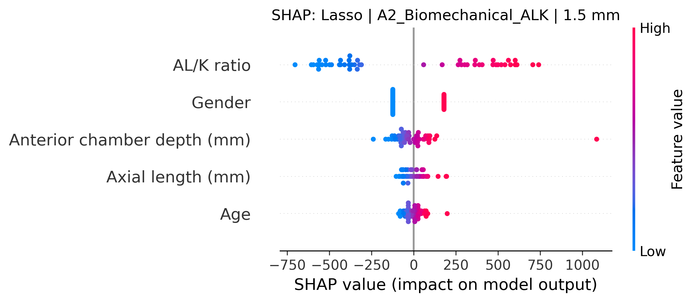

### SHAP ElasticNet: SHAP_1.5mm_A2_Biomechanical_ALK_ElasticNet.png

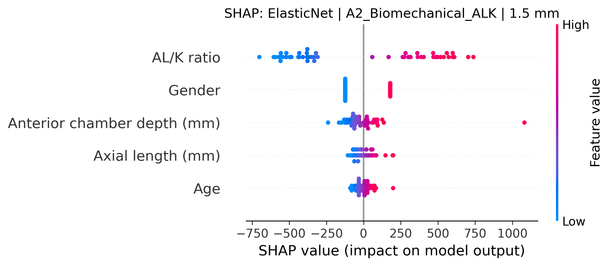

### Learning Curves: LC_1.5mm_C1_Combined_K.png

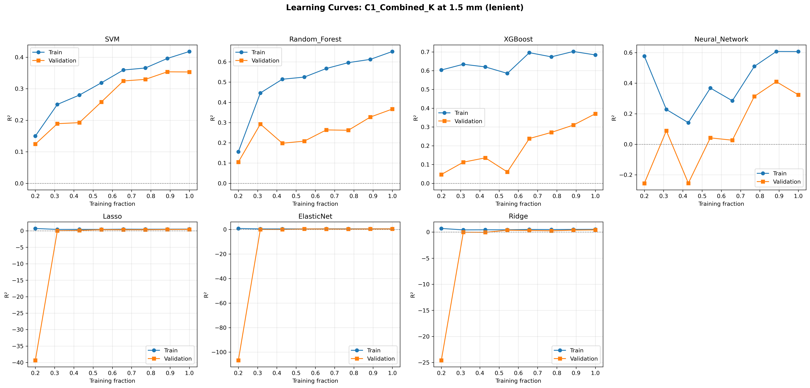

### SHAP Lasso: SHAP_1.5mm_C1_Combined_K_Lasso.png

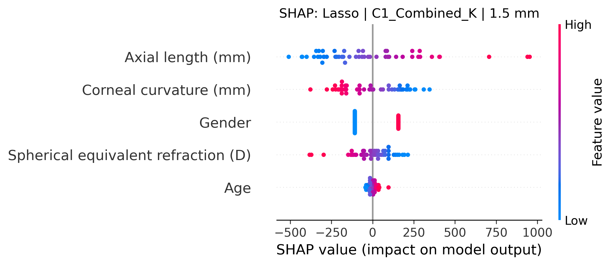

### SHAP ElasticNet: SHAP_1.5mm_C1_Combined_K_ElasticNet.png

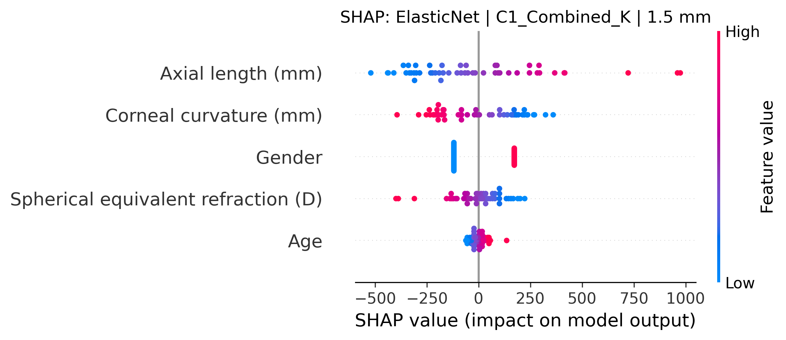

### Learning Curves: LC_3.0mm_A2_Biomechanical_ALK.png

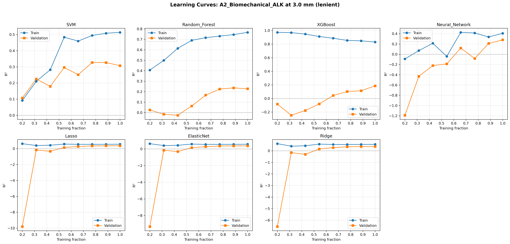

### SHAP Ridge: SHAP_3.0mm_A2_Biomechanical_ALK_Ridge.png

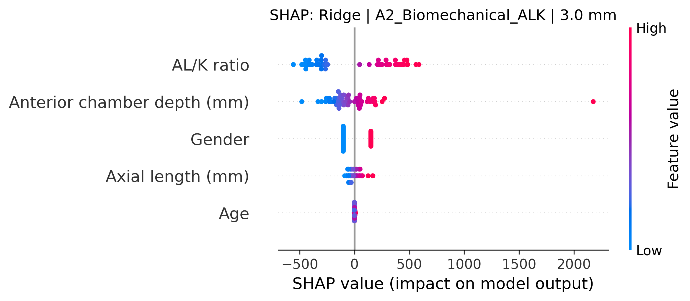

### SHAP ElasticNet: SHAP_3.0mm_A2_Biomechanical_ALK_ElasticNet.png

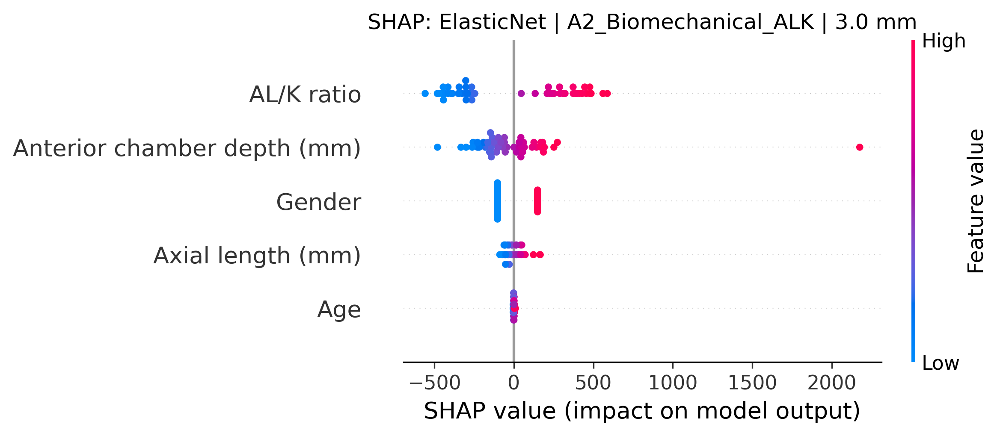

## 五、关键发现与建议

1. **学习曲线 Gap 越小越好**：Gap < 0.05 表示模型泛化良好；Gap > 0.30 提示严重过拟合，需增加正则化或减少模型复杂度。
2. **线性模型通常更稳健**：Lasso、Ridge、ElasticNet 的 LC Gap 通常小于树模型和神经网络。
3. **SHAP 图显示特征贡献方向**：正 SHAP 值表示该特征推高预测密度，负值表示拉低。可据此解释 AL、SE、AL/K 等变量的作用方向。
4. **最终模型选择**：综合考虑 Test R²、LC Gap 和可解释性，优先选择 Gap 小且 R² 高的线性模型。

---

*Report generated automatically by SR_ML_learning_curves_and_shap.py*
