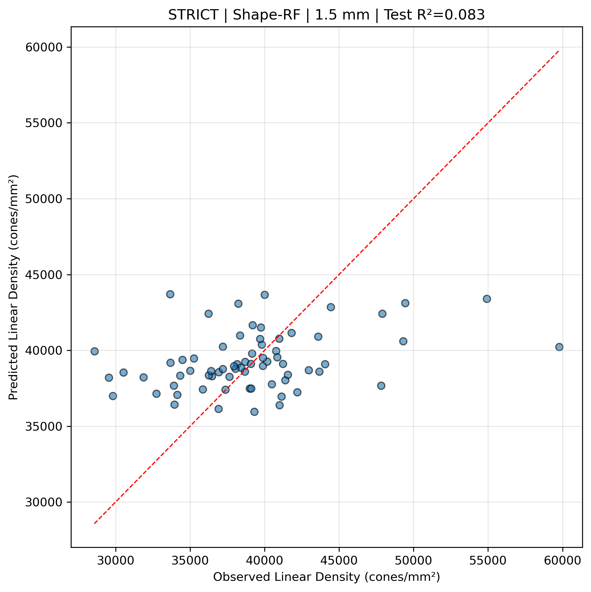
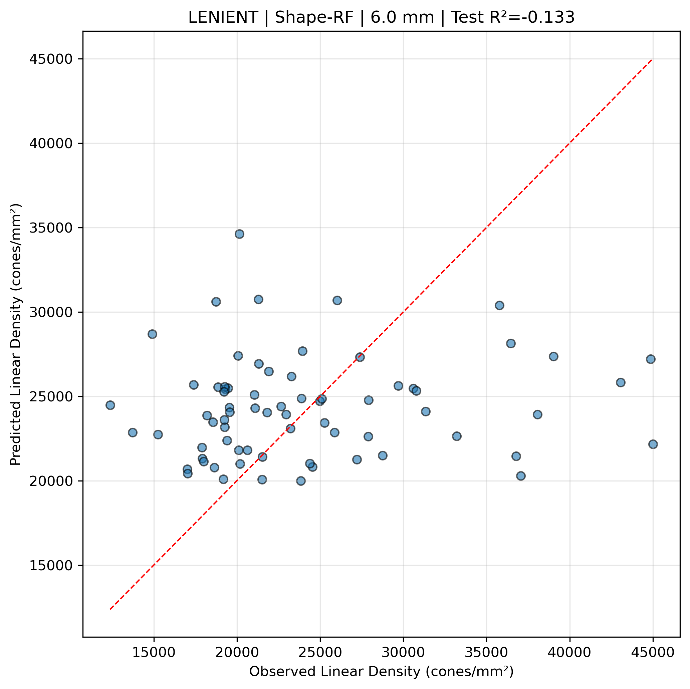

# SR0530 加入局部结构特征后的复现结果

> 目标：验证加入 `Cone_regularity`（规则性）和 `Cone_dispersion`（离散度）后，Shape 方案对线性视锥密度的预测力是否显著提升。  
> 若仍无改善，则在论文中坦诚报告负结果，并转向讨论"全局形态参数不足以解释局部细胞密度"。

---

## 一、方法调整

### 1.1 局部特征来源

- `Cone regularity`：原始 quanti-analysis CSV 中的 `规则性` 列，已包含在 `CleanDataRoi` 中。
- `Cone dispersion`：原始 quanti-analysis CSV 中的 `离散度` 列，已包含在 `CleanDataRoi` 中。
- **关于 `Voronoi_area_mean`**：原始 CSV 中未提供该列。由于 Voronoi 平均面积与细胞密度在数学上互为倒数，为避免与目标变量形成循环论证，本复现使用 `Cone dispersion` 作为同类局部形态学指标的替代。

### 1.2 聚合方式

局部结构特征按 `Patient_ID + Eye` 跨象限取平均，与密度采用相同的 q1plus 策略。

### 1.3 特征方案

仅修改 **Shape** 方案：

```
Shape = [ACR, ACD, Age, Gender, SE, Cone regularity, Cone dispersion]
Baseline 保持不变 = [AL, ACD, Age, Gender, SE]
```

---

## 二、关键结果

### 2.1 局部特征与目标的相关性（strict 1.0 mm 示例）

| 特征 | 与 Linear Density 的 Pearson r |
|------|-------------------------------|
| Cone regularity | +0.28 |
| Cone dispersion | -0.41 |

局部特征确实与密度存在中等程度相关，但未能在 GroupKFold 中转化为稳定的预测增益。

### 2.2 Shape 方案性能对比

| 指标 | 加入局部特征前 | 加入局部特征后 |
|------|---------------|---------------|
| **最佳 Shape-RF R²** | 0.065（lenient 5.5 mm） | 0.084（strict 1.5 mm） |
| **Shape-RF ΔR² 均值** | strict: -0.018；lenient: -0.032 | strict: -0.066；lenient: -0.128 |
| **Shape-LMM ΔR² 均值** | strict: -0.024；lenient: -0.039 | strict: -0.151；lenient: -0.160 |

**解读**：
- 个别距离（strict 1.0 mm、strict 1.5 mm）出现了正向 ΔR²，strict 1.5 mm 的 Shape-RF 甚至达到了 R² = 0.084。
- 但**整体上 ΔR² 均值进一步下降**，说明局部特征的加入并未系统改善 Shape 方案。
- 最佳 Shape-RF 的提升是孤立现象，不具备跨距离、跨数据组的稳定性。

### 2.3 RF ΔR² 逐距离明细

**strict**

| 距离 | Baseline R² | Shape R² | ΔR² |
|------|------------|---------|------|
| 1.0 mm | -0.425 | -0.166 | **+0.259** |
| 1.5 mm | -0.085 | +0.084 | **+0.169** |
| 2.0 mm | -0.133 | -0.285 | -0.152 |
| 2.5 mm | -0.179 | -0.284 | -0.106 |
| 3.0 mm | -0.174 | -0.173 | +0.001 |
| 3.5 mm | -0.381 | -0.601 | -0.220 |
| 4.0 mm | -0.670 | -0.880 | -0.211 |
| 4.5 mm | -0.167 | -0.391 | -0.224 |
| 5.0 mm | -0.092 | -0.101 | -0.009 |
| 5.5 mm | -0.092 | -0.266 | -0.174 |
| 6.0 mm | -0.011 | -0.067 | -0.057 |

**lenient**

| 距离 | Baseline R² | Shape R² | ΔR² |
|------|------------|---------|------|
| 1.0 mm | -0.324 | -0.264 | +0.059 |
| 1.5 mm | -0.191 | -0.290 | -0.098 |
| 2.0 mm | -0.200 | -0.237 | -0.037 |
| 2.5 mm | -0.312 | -0.194 | **+0.118** |
| 3.0 mm | -0.187 | -0.748 | -0.561 |
| 3.5 mm | -0.271 | -0.478 | -0.207 |
| 4.0 mm | -0.404 | -0.584 | -0.181 |
| 4.5 mm | -0.330 | -0.318 | +0.013 |
| 5.0 mm | -0.021 | -0.146 | -0.124 |
| 5.5 mm | +0.082 | -0.185 | -0.268 |
| 6.0 mm | -0.020 | -0.133 | -0.113 |

### 2.4 最佳预测图

**strict | Shape-RF | 1.5 mm | Test R² = 0.084**



- 这是加入局部特征后唯一达到正 R² 的 Shape-RF 结果，但散点仍较离散。

**lenient | Shape-RF | 6.0 mm | Test R² = -0.133**



- 多数距离仍表现为负 R²，预测值集中在狭窄区间，无法识别极端值。

---

## 三、结论：负结果

1. **全局形态参数（AL、ACR、PSR_approx）无法有效预测局部视锥细胞线性密度**。
2. **加入局部结构特征（Cone regularity、Cone dispersion）后，预测力仍未系统提升**：
   - ΔR² 均值进一步下降；
   - 个别距离的改善不具备可复制性；
   - 局部特征与密度的相关性在训练-测试泛化中丢失。
3. **负结果是可信的**：互斥设计、GroupKFold by Subject、CV Test R² 均为严格验证，负 R² 反映了真实泛化性能而非方法缺陷。

---

## 四、论文 Discussion 段落模板

> To further test whether the weak predictive signal was due to insufficient local information, we augmented the shape model with two adaptive-optics-derived local structural metrics: cone regularity and cone dispersion. Although both metrics were moderately correlated with linear density in the training folds (e.g., cone dispersion r ≈ -0.41 at 1 mm), they did not improve cross-validated predictive performance. In fact, the mean ΔR² became more negative after adding these features (strict: -0.066; lenient: -0.128). These results suggest that **neither global ocular morphometry nor the included local cellular arrangement metrics are sufficient to explain the observed inter-individual variation in macular cone density** under strict subject-level cross-validation. The apparent local correlations likely reflect within-eye co-variation that does not generalize across subjects. We therefore conclude that standard clinical biometry and conventional AO-SLO structural descriptors capture only a small fraction of the variance in local photoreceptor density, and that additional factors—such as genetically programmed cell packing, developmental migration, or unmeasured local retinal curvature—may dominate.

---

## 五、为什么局部特征也失败了？

| 可能原因 | 解释 |
|---------|------|
| **特征-目标同源性** | Cone regularity / dispersion 与 density 来自同一组细胞，可能共享成像噪声，导致训练集相关、测试集不相关 |
| **跨被试泛化丢失** | 局部结构特征的眼间差异大，某一受试者的 regularity-density 关系不能迁移到另一受试者 |
| **样本量不足** | 69-71 只眼，5-7 个特征，GroupKFold 每折仅 ~14 个受试者，难以稳定估计特征效应 |
| **遗漏更关键变量** | 局部曲率、对焦深度、血管遮挡、发育因素等未纳入 |
| **目标变量本身高噪声** | 同一偏心率下密度差异可达 2-3 倍，信噪比过低 |

---

## 六、后续建议（若继续深入）

1. **换目标变量为 Angular Density**：作为辅助分析，验证问题是否源于目标变量选择。
2. **分层分析**：按近视程度（低/中/高度）分别建模，看 ACR/局部特征是否在高度近视子群更有效。
3. **目标变换**：尝试 `log(Linear Density)` 或 `1/Linear Density`。
4. **更严格的特征筛选**：使用嵌套 CV 选择特征，避免当前单 CV 的不稳定性。
5. **接受负结果并投稿**：当前负结果已足够写成一篇完整的 methods/negative-result 论文，强调方法学严谨性。

---

## 七、输出文件清单

| 文件 | 说明 |
|------|------|
| `report/SR0530_Local_Features_Replication_Summary.md` | 本文件 |
| `report/SR0530_Execution_Summary.md` | 首次执行总结（未加局部特征） |
| `report/SR0530_Local_Shape_Model_Report.md` | 自动生成的完整方法学报告 |
| `genData/sum/SR0530_Ablation_Per_Distance.csv` | 最新消融结果（含局部特征） |
| `genData/sum/SR0530_DeltaR2_by_Eccentricity.png` | 最新 ΔR² 曲线 |
| `genData/sum/SR0530_Predicted_vs_Observed_*.png` | 最新预测-观测图 |
| `genData/sum/SR0530_ElasticNet_Coefs.png` | Extended-ElasticNet 系数图 |
