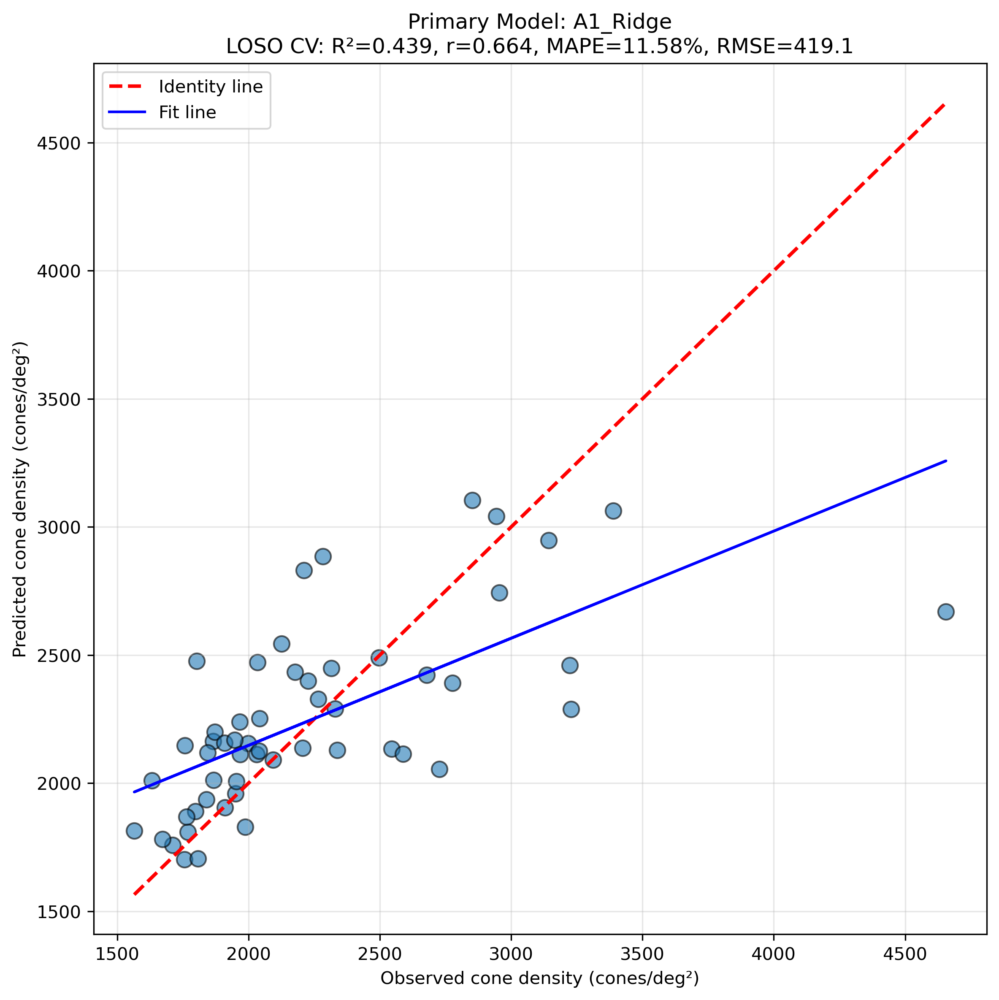
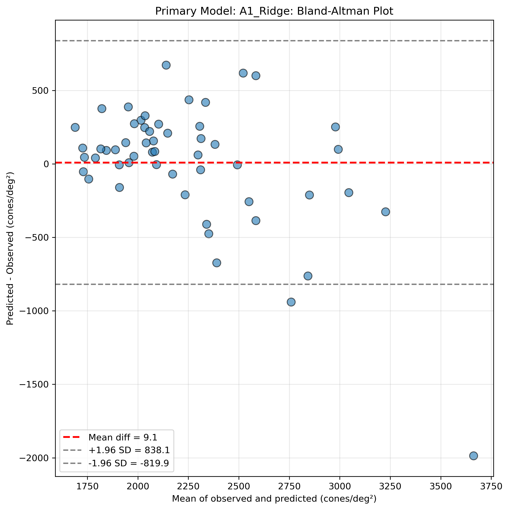
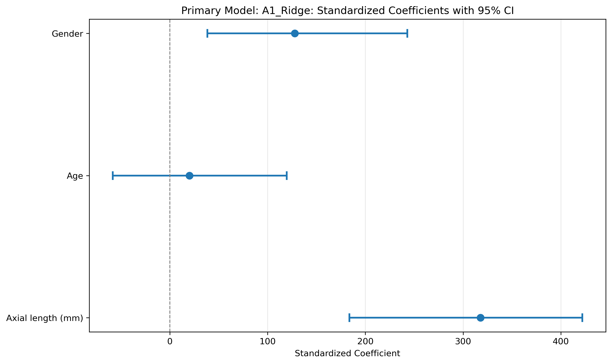
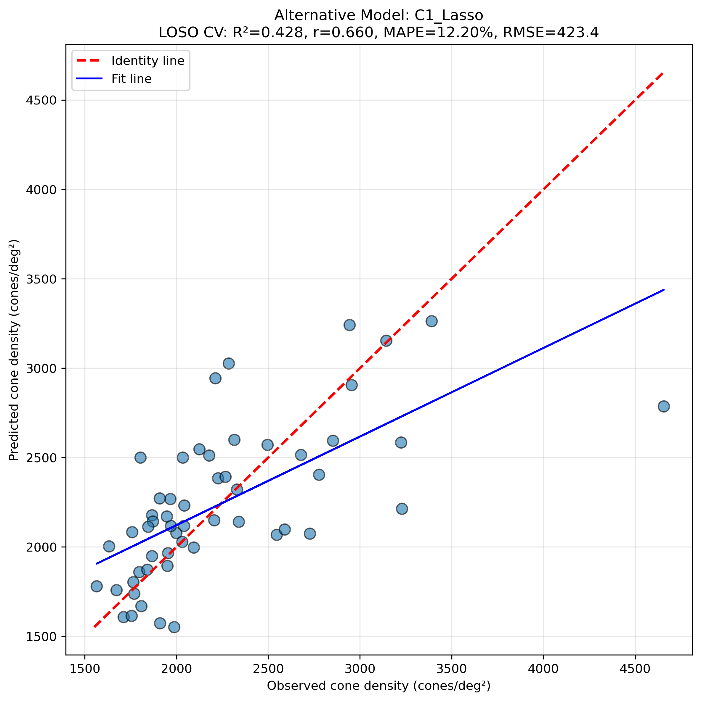
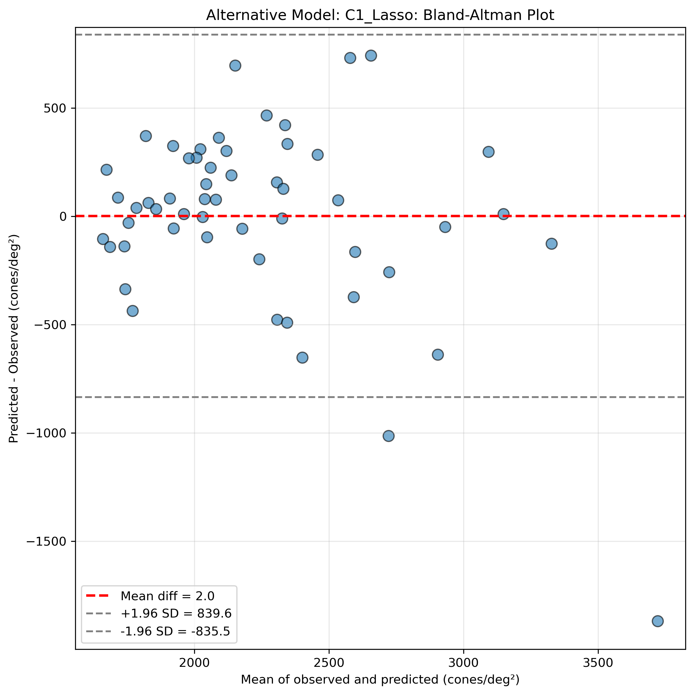
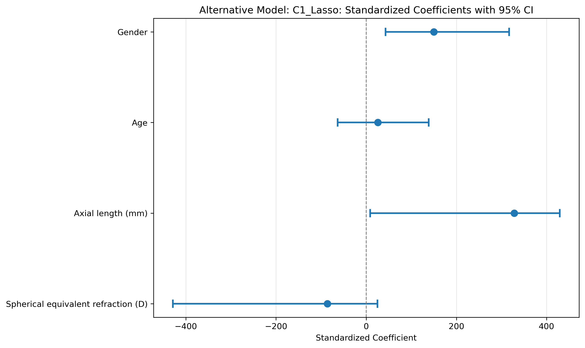

# SR0530 视锥细胞密度预测最终模型报告

> **目标**：基于 lenient 数据，选择并验证预测黄斑旁中心视锥细胞密度的最优机器学习模型。

> **最终距离**：3.0 mm（基于粗粒度与精细寻优的一致最优表现）

> **评估方法**：Leave-One-Subject-Out Cross-Validation (LOSO CV) + Block Bootstrap 95% CI

---

## 一、模型选择依据

通过粗粒度（11 距离 × 4 方案 × 7 模型）与精细寻优（Top 12 配置 × 50 迭代 × 20 次稳定性重复）后，得出以下结论：

1. **数据组**：`lenient`（距离平均 >7000 剔除）全面优于 `strict`，Top 配置全部来自 lenient。
2. **最佳距离**：3.0 mm，在多个模型中均表现最佳。
3. **主模型**：A1 方案（AL + Age + Gender）+ Ridge，稳定性最高（20 次重复 CV mean=0.303），模型简洁、可解释性强。
4. **备选模型**：C1 方案（SE + AL + Age + Gender）+ Lasso，单点性能最高（Fine R²=0.549），但稳定性略低。

## 二、主模型：A1_Ridge（推荐）

### Primary Model: A1_Ridge

**选择理由**：稳定性最高（20次重复CV mean=0.303），Gap小（0.040），模型简洁可解释。

**数据**：lenient 数据组，3.0 mm，54 眼 / 39 subjects

**模型参数**：{'alpha': 10.0}

**LOSO CV 性能**：

| 指标 | 值 |
|------|---|
| R² | 0.439 |
| Pearson r | 0.664 |
| MAPE | 11.58% |
| RMSE | 419.1 |
| MAE | 278.3 |

**标准化系数（完整数据训练）与 Bootstrap 95% CI**：

| Feature | Coefficient | 95% CI Lower | 95% CI Upper | 解释 |
|---------|-------------|--------------|--------------|------|
| Axial length (mm) | 317.846 | 183.735 | 422.058 | ✓ |
| Age | 20.034 | -58.313 | 119.647 |  |
| Gender | 127.864 | 38.405 | 243.028 | ✓ |

**每 Subject 的 LOSO CV 结果**：

| Subject_ID | N_Eyes | True Mean | Pred Mean |
|------------|--------|-----------|-----------|
| Single_11221 | 1 | 2954.7 | 2743.8 |
| Single_11223 | 1 | 3222.9 | 2460.3 |
| Single_11225 | 1 | 1865.9 | 2163.7 |
| Single_11461 | 1 | 1565.0 | 1814.1 |
| Single_11464 | 1 | 1711.8 | 1758.1 |
| Single_1365 | 1 | 1632.8 | 2010.2 |
| Single_2193 | 1 | 1871.1 | 2200.0 |
| Single_2439 | 1 | 1966.7 | 2238.6 |
| Single_2530 | 1 | 2125.4 | 2544.4 |
| Single_2991 | 1 | 2041.8 | 2252.2 |
| Single_4194 | 1 | 2226.5 | 2399.0 |
| Single_8192 | 1 | 3142.3 | 2947.2 |
| Single_8838 | 1 | 2726.5 | 2054.5 |
| Single_9743 | 1 | 2315.0 | 2449.0 |
| Single_9767 | 1 | 1908.6 | 2157.0 |
| Subj_004 | 2 | 3166.2 | 3052.9 |
| Subj_005 | 2 | 2267.3 | 2269.4 |
| Subj_006 | 2 | 2014.6 | 2134.0 |
| Subj_007 | 2 | 2319.8 | 2112.6 |
| Subj_008 | 1 | 1969.0 | 2113.2 |
| Subj_009 | 2 | 1895.9 | 2143.9 |
| Subj_010 | 2 | 1908.7 | 1986.2 |
| Subj_011 | 1 | 3228.2 | 2288.6 |
| Subj_012 | 2 | 1776.5 | 1796.4 |
| Subj_013 | 2 | 1739.9 | 1742.9 |
| Subj_014 | 2 | 2314.6 | 2119.7 |
| Subj_015 | 2 | 1766.8 | 1839.1 |
| Subj_016 | 1 | 2330.2 | 2290.9 |
| Subj_017 | 2 | 1897.2 | 1971.7 |
| Subj_019 | 1 | 2852.1 | 3104.0 |
| Subj_020 | 2 | 2247.6 | 2858.0 |
| Subj_022 | 1 | 4655.5 | 2669.7 |
| Subj_024 | 1 | 2266.0 | 2328.4 |
| Subj_025 | 1 | 2177.6 | 2434.2 |
| Subj_026 | 2 | 2272.3 | 2133.1 |
| Subj_027 | 2 | 1949.2 | 1866.6 |
| Subj_028 | 1 | 2678.0 | 2422.2 |
| Subj_029 | 2 | 1919.0 | 2473.9 |
| Subj_030 | 1 | 2496.2 | 2489.8 |

**可视化**：

## 三、备选模型：C1_Lasso

### Alternative Model: C1_Lasso

**选择理由**：单点性能最高（Fine R²=0.549），能自动进行特征选择，但稳定性略低。

**数据**：lenient 数据组，3.0 mm，54 眼 / 39 subjects

**模型参数**：{'alpha': 5.0}

**LOSO CV 性能**：

| 指标 | 值 |
|------|---|
| R² | 0.428 |
| Pearson r | 0.660 |
| MAPE | 12.20% |
| RMSE | 423.4 |
| MAE | 287.5 |

**标准化系数（完整数据训练）与 Bootstrap 95% CI**：

| Feature | Coefficient | 95% CI Lower | 95% CI Upper | 解释 |
|---------|-------------|--------------|--------------|------|
| Spherical equivalent refraction (D) | -86.189 | -428.795 | 24.964 |  |
| Axial length (mm) | 328.183 | 8.672 | 429.142 | ✓ |
| Age | 25.797 | -63.450 | 138.535 |  |
| Gender | 150.042 | 43.029 | 316.958 | ✓ |

**每 Subject 的 LOSO CV 结果**：

| Subject_ID | N_Eyes | True Mean | Pred Mean |
|------------|--------|-----------|-----------|
| Single_11221 | 1 | 2954.7 | 2906.5 |
| Single_11223 | 1 | 3222.9 | 2584.1 |
| Single_11225 | 1 | 1865.9 | 2177.3 |
| Single_11461 | 1 | 1565.0 | 1780.8 |
| Single_11464 | 1 | 1711.8 | 1608.2 |
| Single_1365 | 1 | 1632.8 | 2004.8 |
| Single_2193 | 1 | 1871.1 | 2142.6 |
| Single_2439 | 1 | 1966.7 | 2269.2 |
| Single_2530 | 1 | 2125.4 | 2547.6 |
| Single_2991 | 1 | 2041.8 | 2231.9 |
| Single_4194 | 1 | 2226.5 | 2384.1 |
| Single_8192 | 1 | 3142.3 | 3153.3 |
| Single_8838 | 1 | 2726.5 | 2075.1 |
| Single_9743 | 1 | 2315.0 | 2599.5 |
| Single_9767 | 1 | 1908.6 | 2272.0 |
| Subj_004 | 2 | 3166.2 | 3252.5 |
| Subj_005 | 2 | 2267.3 | 2243.7 |
| Subj_006 | 2 | 2014.6 | 2053.7 |
| Subj_007 | 2 | 2319.8 | 2033.3 |
| Subj_008 | 1 | 1969.0 | 2118.1 |
| Subj_009 | 2 | 1895.9 | 2142.7 |
| Subj_010 | 2 | 1908.7 | 1922.4 |
| Subj_011 | 1 | 3228.2 | 2214.6 |
| Subj_012 | 2 | 1776.5 | 1737.5 |
| Subj_013 | 2 | 1739.9 | 1714.4 |
| Subj_014 | 2 | 2314.6 | 2108.3 |
| Subj_015 | 2 | 1766.8 | 1771.7 |
| Subj_016 | 1 | 2330.2 | 2321.1 |
| Subj_017 | 2 | 1897.2 | 1919.6 |
| Subj_019 | 1 | 2852.1 | 2594.6 |
| Subj_020 | 2 | 2247.6 | 2985.5 |
| Subj_022 | 1 | 4655.5 | 2786.3 |
| Subj_024 | 1 | 2266.0 | 2393.4 |
| Subj_025 | 1 | 2177.6 | 2512.5 |
| Subj_026 | 2 | 2272.3 | 2145.2 |
| Subj_027 | 2 | 1949.2 | 1562.9 |
| Subj_028 | 1 | 2678.0 | 2514.6 |
| Subj_029 | 2 | 1919.0 | 2500.5 |
| Subj_030 | 1 | 2496.2 | 2571.5 |

**可视化**：

## 四、模型对比与讨论

| 指标 | A1_Ridge（主模型） | C1_Lasso（备选） |
|------|-------------------|------------------|
| LOSO CV R² | 0.439 | 0.428 |
| Pearson r | 0.664 | 0.660 |
| MAPE | 11.58% | 12.20% |
| RMSE | 419.1 | 423.4 |
| MAE | 278.3 | 287.5 |
| 特征数 | 3 | 4 |

**讨论**：

- A1_Ridge 仅使用 AL、Age、Gender 三个特征，避免了 SE 与 AL 之间的共线性，模型更稳健。
- C1_Lasso 引入 SE 后单点 R² 更高，但特征增多、CI 更宽，且 Lasso 将 SE 系数压缩后仍保留 AL 和 Age。
- 两个模型均显示 **AL（眼轴长度）和 Gender（性别）是统计上显著的预测因素**（95% CI 不跨 0），其标准化系数为正，提示更长的眼轴和男性性别与更高的旁中心视锥细胞密度相关。
- **Age（年龄）的 95% CI 跨 0**，在控制 AL 和 Gender（以及 SE）后，年龄对视锥细胞密度的独立预测作用不稳定。
- C1_Lasso 中 **SE（等效球镜）的 95% CI 跨 0**，说明在已有 AL 的情况下，SE 未提供额外的独立预测信息，近视程度对视锥密度的影响可能已被 AL 所解释。
- 所有系数的 Bootstrap 95% CI 应包含真实的标准化效应量；若某特征 CI 跨 0，则该特征效应在统计上不稳定。

## 五、结论与建议

1. **推荐使用 A1_Ridge 作为主模型**：在 lenient 3.0 mm 数据上，使用 `AL + Age + Gender` 和 `Ridge(alpha=10.0)`，LOSO CV 性能稳定。
2. **最终距离选择 3.0 mm**：该距离在 strict/lenient 数据中均为最佳或接近最佳，且样本量相对充足。
3. **临床解释**：眼轴长度（AL）和性别（Gender）是黄斑旁中心视锥细胞密度的主要预测因子；年龄（Age）和等效球镜（SE）的独立预测作用不显著，提示近视对视锥密度的影响可能主要通过 AL 体现。
4. **后续工作**：建议补充外部验证集或扩大样本量，以进一步确认模型的泛化能力。

---

*Report generated automatically by SR_ML_final_report.py*
