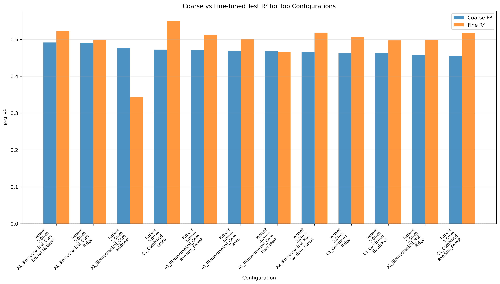
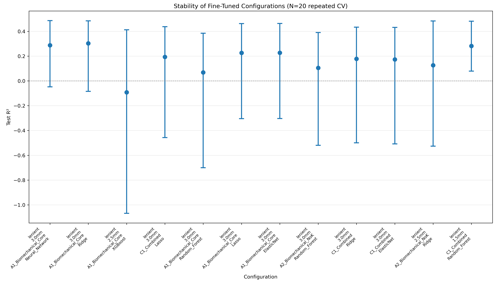
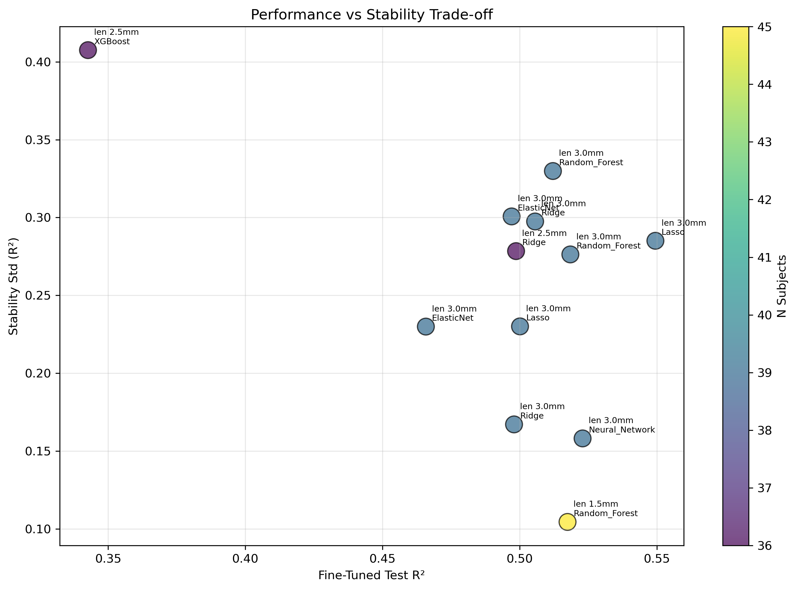

# SR0530 ML 精细寻优报告（Top 配置）

> **目标**：对粗粒度寻优中表现最好的 12 个配置做精细参数寻优与稳定性评估。

> **搜索策略**：Random Search + GroupKFold by Subject，每配置 50 组参数

> **稳定性评估**：对最佳参数用 20 组不同 CV seed 重复评估

---

## 一、从粗粒度寻优中选择的 Top 配置

| 排名 | 数据组 | 距离 (mm) | 方案 | 模型 | Coarse R² | Coarse 最佳参数 |
|------|--------|-----------|------|------|-----------|------------------|
| 1 | lenient | 3.0 | A1_Biomechanical_Core | Neural_Network | 0.492 | `{'hidden_layer_sizes': (100,), 'alpha': 0.3, 'learning_rate_init': 0.0005}` |
| 2 | lenient | 3.0 | A1_Biomechanical_Core | Ridge | 0.489 | `{'alpha': 10.0}` |
| 3 | lenient | 2.5 | A1_Biomechanical_Core | XGBoost | 0.476 | `{'learning_rate': 0.05, 'max_depth': 2, 'n_estimators': 100, 'reg_alpha': 0.1, 'reg_lambda': 1.0}` |
| 4 | lenient | 3.0 | C1_Combined | Lasso | 0.473 | `{'alpha': 10.0}` |
| 5 | lenient | 3.0 | A1_Biomechanical_Core | Random_Forest | 0.472 | `{'n_estimators': 200, 'max_depth': None, 'min_samples_split': 10, 'min_samples_leaf': 1}` |
| 6 | lenient | 3.0 | A1_Biomechanical_Core | Lasso | 0.470 | `{'alpha': 1.0}` |
| 7 | lenient | 3.0 | A1_Biomechanical_Core | ElasticNet | 0.469 | `{'alpha': 0.001, 'l1_ratio': 0.1}` |
| 8 | lenient | 3.0 | A2_Biomechanical_NoK | Random_Forest | 0.465 | `{'n_estimators': 300, 'max_depth': None, 'min_samples_split': 5, 'min_samples_leaf': 4}` |
| 9 | lenient | 3.0 | C1_Combined | Ridge | 0.463 | `{'alpha': 0.1}` |
| 10 | lenient | 3.0 | C1_Combined | ElasticNet | 0.462 | `{'alpha': 0.001, 'l1_ratio': 0.3}` |
| 11 | lenient | 2.5 | A2_Biomechanical_NoK | Ridge | 0.457 | `{'alpha': 10.0}` |
| 12 | lenient | 1.5 | C1_Combined | Random_Forest | 0.455 | `{'n_estimators': 100, 'max_depth': 5, 'min_samples_split': 10, 'min_samples_leaf': 4}` |

## 二、精细寻优后的总体最佳配置

- **数据组**：lenient
- **距离**：3.0 mm
- **方案**：C1_Combined
- **模型**：Lasso
- **精细后 Test R²**：0.549 (Coarse: 0.473)
- **Train R²**：0.571，**Gap**：0.022
- **MAPE**：11.76%，**RMSE**：362.4
- **最佳参数**：{'alpha': 5.0}
- **稳定性**：0.193 ± 0.285 (95% CI: [-0.457, 0.437])
- **样本量**：54 眼 / 39 subjects

## 三、按稳定性排序（稳定性 = 多次 CV 的 R² 均值）

| 数据组 | 距离 (mm) | 方案 | 模型 | Fine R² | 稳定性 Mean | 稳定性 Std | 95% CI | Gap |
|--------|-----------|------|------|---------|-------------|------------|--------|-----|
| lenient | 3.0 | A1_Biomechanical_Core | Ridge | 0.498 | 0.303 | 0.167 | [-0.084, 0.484] | 0.040 |
| lenient | 3.0 | A1_Biomechanical_Core | Neural_Network | 0.523 | 0.287 | 0.158 | [-0.048, 0.486] | 0.099 |
| lenient | 1.5 | C1_Combined | Random_Forest | 0.517 | 0.282 | 0.104 | [0.079, 0.481] | 0.154 |
| lenient | 3.0 | A1_Biomechanical_Core | ElasticNet | 0.466 | 0.226 | 0.230 | [-0.303, 0.463] | 0.085 |
| lenient | 3.0 | A1_Biomechanical_Core | Lasso | 0.500 | 0.226 | 0.230 | [-0.304, 0.463] | 0.056 |
| lenient | 3.0 | C1_Combined | Lasso | 0.549 | 0.193 | 0.285 | [-0.457, 0.437] | 0.022 |
| lenient | 3.0 | C1_Combined | Ridge | 0.506 | 0.178 | 0.297 | [-0.499, 0.433] | 0.070 |
| lenient | 3.0 | C1_Combined | ElasticNet | 0.497 | 0.173 | 0.301 | [-0.508, 0.431] | 0.083 |
| lenient | 2.5 | A2_Biomechanical_NoK | Ridge | 0.499 | 0.126 | 0.278 | [-0.526, 0.483] | 0.065 |
| lenient | 3.0 | A2_Biomechanical_NoK | Random_Forest | 0.518 | 0.105 | 0.276 | [-0.520, 0.390] | 0.044 |
| lenient | 3.0 | A1_Biomechanical_Core | Random_Forest | 0.512 | 0.068 | 0.330 | [-0.700, 0.385] | 0.139 |
| lenient | 2.5 | A1_Biomechanical_Core | XGBoost | 0.343 | -0.092 | 0.408 | [-1.069, 0.412] | 0.644 |

## 四、全部详细结果

| 数据组 | 距离 (mm) | 方案 | 模型 | N_Eyes | N_Subj | Coarse R² | Fine R² | Fine Train R² | Corr | MAPE | RMSE | Gap | 稳定性 Mean±Std | 稳定性 95% CI | Fine 最佳参数 |
|--------|-----------|------|------|--------|--------|-----------|---------|---------------|------|------|------|-----|-----------------|---------------|---------------|
| lenient | 3.0 | A1_Biomechanical_Core | Neural_Network | 54 | 39 | 0.492 | 0.523 | 0.622 | 0.763 | 11.60 | 382.4 | 0.099 | 0.287 ± 0.158 | [-0.048, 0.486] | `{'hidden_layer_sizes': (120,), 'alpha': 0.9, 'learning_rate_init': 0.0001}` |
| lenient | 3.0 | A1_Biomechanical_Core | Ridge | 54 | 39 | 0.489 | 0.498 | 0.538 | 0.780 | 11.33 | 367.2 | 0.040 | 0.303 ± 0.167 | [-0.084, 0.484] | `{'alpha': 10.0}` |
| lenient | 2.5 | A1_Biomechanical_Core | XGBoost | 49 | 36 | 0.476 | 0.343 | 0.986 | 0.730 | 12.23 | 412.3 | 0.644 | -0.092 ± 0.408 | [-1.069, 0.412] | `{'learning_rate': 0.075, 'max_depth': 2, 'n_estimators': 250, 'reg_alpha': 0.2, 'reg_lambda': 0.2}` |
| lenient | 3.0 | C1_Combined | Lasso | 54 | 39 | 0.473 | 0.549 | 0.571 | 0.742 | 11.76 | 362.4 | 0.022 | 0.193 ± 0.285 | [-0.457, 0.437] | `{'alpha': 5.0}` |
| lenient | 3.0 | A1_Biomechanical_Core | Random_Forest | 54 | 39 | 0.472 | 0.512 | 0.651 | 0.717 | 11.31 | 362.7 | 0.139 | 0.068 ± 0.330 | [-0.700, 0.385] | `{'n_estimators': 200, 'max_depth': None, 'min_samples_split': 8, 'min_samples_leaf': 3}` |
| lenient | 3.0 | A1_Biomechanical_Core | Lasso | 54 | 39 | 0.470 | 0.500 | 0.556 | 0.742 | 11.85 | 381.4 | 0.056 | 0.226 ± 0.230 | [-0.304, 0.463] | `{'alpha': 0.1}` |
| lenient | 3.0 | A1_Biomechanical_Core | ElasticNet | 54 | 39 | 0.469 | 0.466 | 0.551 | 0.722 | 12.22 | 392.0 | 0.085 | 0.226 ± 0.230 | [-0.303, 0.463] | `{'alpha': 0.0015, 'l1_ratio': 0.5}` |
| lenient | 3.0 | A2_Biomechanical_NoK | Random_Forest | 54 | 39 | 0.465 | 0.518 | 0.562 | 0.780 | 12.55 | 381.0 | 0.044 | 0.105 ± 0.276 | [-0.520, 0.390] | `{'n_estimators': 350, 'max_depth': None, 'min_samples_split': 3, 'min_samples_leaf': 6}` |
| lenient | 3.0 | C1_Combined | Ridge | 54 | 39 | 0.463 | 0.506 | 0.575 | 0.736 | 11.98 | 371.5 | 0.070 | 0.178 ± 0.297 | [-0.499, 0.433] | `{'alpha': 0.3}` |
| lenient | 3.0 | C1_Combined | ElasticNet | 54 | 39 | 0.462 | 0.497 | 0.580 | 0.768 | 11.97 | 365.1 | 0.083 | 0.173 ± 0.301 | [-0.508, 0.431] | `{'alpha': 0.0015, 'l1_ratio': 0.01}` |
| lenient | 2.5 | A2_Biomechanical_NoK | Ridge | 49 | 36 | 0.457 | 0.499 | 0.564 | 0.729 | 11.74 | 406.8 | 0.065 | 0.126 ± 0.278 | [-0.526, 0.483] | `{'alpha': 1.0}` |
| lenient | 1.5 | C1_Combined | Random_Forest | 68 | 45 | 0.455 | 0.517 | 0.672 | 0.758 | 9.46 | 465.9 | 0.154 | 0.282 ± 0.104 | [0.079, 0.481] | `{'n_estimators': 150, 'max_depth': 3, 'min_samples_split': 14, 'min_samples_leaf': 2}` |

## 五、可视化

### Coarse vs Fine-Tuned Test R²

### 稳定性评估（20 次重复 CV）

### 性能 vs 稳定性权衡

## 六、讨论

1. **精细寻优效果**：对比 Coarse R² 与 Fine R²，若 Fine 显著更高，说明原搜索空间分辨率不足；若差异不大，说明原参数已接近最优。
2. **稳定性优先**：高 R² 但高 Std 的配置可能过拟合；稳定性 Mean 高且 Std 低的配置更值得信赖。
3. **样本量影响**：N_Subjects 较少的配置（如远距离）稳定性通常更差，解读需谨慎。
4. **后续建议**：从本报告中选择 Stability Mean 最高的 1–2 个配置，作为最终报告用模型。

---

*Report generated automatically by SR_ML_fine_tuning.py*
