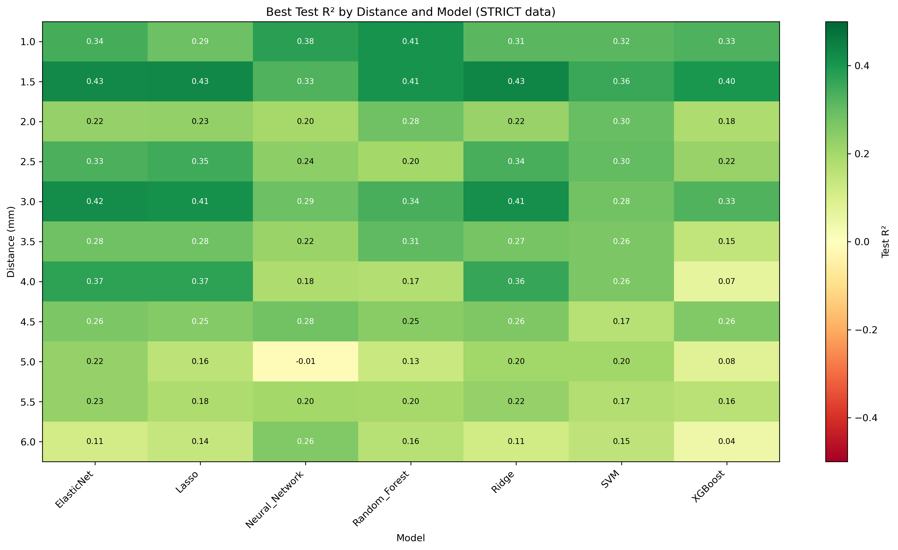
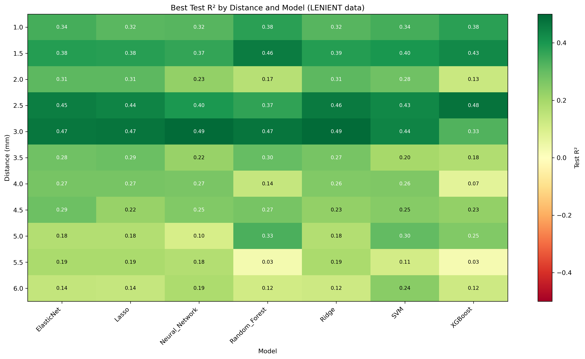
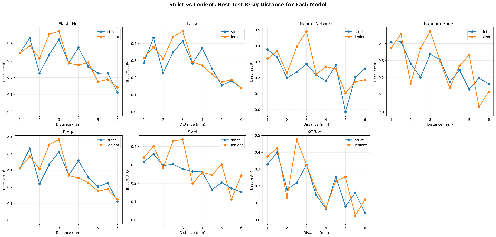
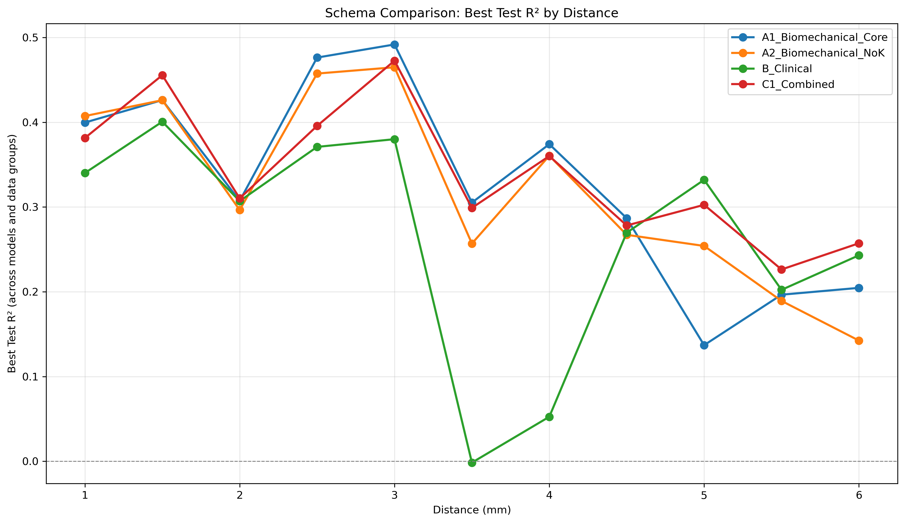

# SR0530 ML 超参数寻优报告

> **目标**：针对每种 ML 方法，在 strict（69 眼）和 lenient（71 眼）两套数据上做超参数寻优，比较最佳参数与结果。

> **搜索策略**：Random Search + GroupKFold by Subject，每模型 10 组参数

> **数据组**：`CleanDataRoi_strict/`（任意 ROI >7000 剔除）和 `CleanDataRoi_lenient/`（距离平均 >7000 剔除）

---

## 一、参数搜索空间

| 模型 | 参数 | 搜索范围 |
|------|------|---------|
| SVM | C | 100, 500, 1000, 2000, 5000 |
| SVM | epsilon | 100, 300, 500, 800, 1000 |
| SVM | gamma | 0.001, 0.005, 0.01, 0.03, 0.05, 0.1 |
| Random_Forest | n_estimators | 50, 100, 200, 300 |
| Random_Forest | max_depth | 2, 3, 4, 5, None |
| Random_Forest | min_samples_split | 2, 5, 10 |
| Random_Forest | min_samples_leaf | 1, 2, 4 |
| XGBoost | learning_rate | 0.001, 0.005, 0.01, 0.05, 0.1 |
| XGBoost | max_depth | 1, 2, 3, 4 |
| XGBoost | n_estimators | 30, 50, 100, 200 |
| XGBoost | reg_alpha | 0.1, 0.5, 1.0, 2.0 |
| XGBoost | reg_lambda | 0.1, 0.5, 1.0, 2.0 |
| Neural_Network | hidden_layer_sizes | (40,), (60,), (80,), (100,), (80, 40) |
| Neural_Network | alpha | 0.1, 0.3, 0.5, 1.0 |
| Neural_Network | learning_rate_init | 0.0001, 0.0005, 0.001 |
| Lasso | alpha | 0.001, 0.01, 0.1, 1.0, 10.0 |
| ElasticNet | alpha | 0.001, 0.01, 0.1, 1.0 |
| ElasticNet | l1_ratio | 0.1, 0.3, 0.5, 0.7, 0.9 |
| Ridge | alpha | 0.01, 0.1, 1.0, 10.0, 100.0 |

## 二、总体最佳配置

- **数据组**：lenient
- **距离**：3.0 mm
- **方案**：A1_Biomechanical_Core
- **模型**：Neural_Network
- **最佳 Test R²**：0.492
- **最佳参数**：{'hidden_layer_sizes': (100,), 'alpha': 0.3, 'learning_rate_init': 0.0005}
- **样本量**：54 眼 / 39 subjects

## 三、每个数据组的最佳结果（按距离）

### STRICT 数据组

| 距离 (mm) | 最佳方案 | 最佳模型 | Test R² | MAPE (%) | RMSE | Gap | 最佳参数 |
|-----------|---------|---------|---------|----------|------|-----|---------|
| 1.0 | A2_Biomechanical_NoK | Random_Forest | 0.407 | 11.02 | 498.9 | 0.270 | `{'n_estimators': 50, 'max_depth': 4, 'min_samples_split': 5, 'min_samples_leaf': 4}` |
| 1.5 | C1_Combined | Ridge | 0.434 | 9.91 | 432.1 | 0.040 | `{'alpha': 10.0}` |
| 2.0 | A2_Biomechanical_NoK | SVM | 0.296 | 10.12 | 421.8 | 0.196 | `{'C': 2000, 'epsilon': 100, 'gamma': 0.03}` |
| 2.5 | A1_Biomechanical_Core | Lasso | 0.350 | 11.51 | 371.4 | 0.228 | `{'alpha': 10.0}` |
| 3.0 | A1_Biomechanical_Core | ElasticNet | 0.420 | 10.62 | 315.3 | 0.135 | `{'alpha': 0.1, 'l1_ratio': 0.3}` |
| 3.5 | A1_Biomechanical_Core | Random_Forest | 0.305 | 14.79 | 453.5 | 0.396 | `{'n_estimators': 100, 'max_depth': 4, 'min_samples_split': 5, 'min_samples_leaf': 2}` |
| 4.0 | A1_Biomechanical_Core | ElasticNet | 0.374 | 13.13 | 350.5 | 0.051 | `{'alpha': 0.01, 'l1_ratio': 0.5}` |
| 4.5 | A1_Biomechanical_Core | Neural_Network | 0.278 | 17.10 | 406.3 | 0.106 | `{'hidden_layer_sizes': (60,), 'alpha': 0.1, 'learning_rate_init': 0.0001}` |
| 5.0 | C1_Combined | ElasticNet | 0.224 | 21.55 | 590.4 | 0.219 | `{'alpha': 1.0, 'l1_ratio': 0.5}` |
| 5.5 | C1_Combined | ElasticNet | 0.226 | 24.23 | 613.1 | 0.139 | `{'alpha': 1.0, 'l1_ratio': 0.3}` |
| 6.0 | C1_Combined | Neural_Network | 0.257 | 25.47 | 568.7 | 0.303 | `{'hidden_layer_sizes': (100,), 'alpha': 0.3, 'learning_rate_init': 0.0005}` |

### LENIENT 数据组

| 距离 (mm) | 最佳方案 | 最佳模型 | Test R² | MAPE (%) | RMSE | Gap | 最佳参数 |
|-----------|---------|---------|---------|----------|------|-----|---------|
| 1.0 | A1_Biomechanical_Core | XGBoost | 0.376 | 11.55 | 578.6 | 0.185 | `{'learning_rate': 0.1, 'max_depth': 1, 'n_estimators': 30, 'reg_alpha': 0.5, 'reg_lambda': 0.5}` |
| 1.5 | C1_Combined | Random_Forest | 0.455 | 10.66 | 526.2 | 0.190 | `{'n_estimators': 100, 'max_depth': 5, 'min_samples_split': 10, 'min_samples_leaf': 4}` |
| 2.0 | C1_Combined | Lasso | 0.310 | 11.85 | 527.5 | 0.110 | `{'alpha': 0.1}` |
| 2.5 | A1_Biomechanical_Core | XGBoost | 0.476 | 12.28 | 409.7 | 0.386 | `{'learning_rate': 0.05, 'max_depth': 2, 'n_estimators': 100, 'reg_alpha': 0.1, 'reg_lambda': 1.0}` |
| 3.0 | A1_Biomechanical_Core | Neural_Network | 0.492 | 12.04 | 387.2 | 0.116 | `{'hidden_layer_sizes': (100,), 'alpha': 0.3, 'learning_rate_init': 0.0005}` |
| 3.5 | C1_Combined | Random_Forest | 0.299 | 14.91 | 456.8 | 0.307 | `{'n_estimators': 200, 'max_depth': None, 'min_samples_split': 10, 'min_samples_leaf': 2}` |
| 4.0 | A1_Biomechanical_Core | ElasticNet | 0.272 | 16.39 | 479.4 | 0.134 | `{'alpha': 0.001, 'l1_ratio': 0.5}` |
| 4.5 | A1_Biomechanical_Core | ElasticNet | 0.287 | 16.46 | 488.1 | 0.128 | `{'alpha': 1.0, 'l1_ratio': 0.7}` |
| 5.0 | B_Clinical | Random_Forest | 0.332 | 21.37 | 581.4 | 0.335 | `{'n_estimators': 100, 'max_depth': 2, 'min_samples_split': 5, 'min_samples_leaf': 1}` |
| 5.5 | B_Clinical | Lasso | 0.188 | 23.65 | 560.3 | 0.177 | `{'alpha': 1.0}` |
| 6.0 | B_Clinical | SVM | 0.243 | 23.61 | 581.6 | 0.304 | `{'C': 5000, 'epsilon': 300, 'gamma': 0.1}` |

## 四、每个模型在每个数据组的最佳结果

| 数据组 | 模型 | 最佳距离 | 最佳方案 | Test R² | MAPE (%) | 最佳参数 |
|--------|------|---------|---------|---------|----------|---------|
| strict | ElasticNet | 1.5 mm | C1_Combined | 0.429 | 9.72 | `{'alpha': 0.1, 'l1_ratio': 0.9}` |
| strict | Lasso | 1.5 mm | C1_Combined | 0.433 | 9.74 | `{'alpha': 10.0}` |
| strict | Neural_Network | 1.0 mm | C1_Combined | 0.378 | 10.62 | `{'hidden_layer_sizes': (60,), 'alpha': 1.0, 'learning_rate_init': 0.001}` |
| strict | Random_Forest | 1.5 mm | A1_Biomechanical_Core | 0.410 | 9.72 | `{'n_estimators': 200, 'max_depth': 3, 'min_samples_split': 5, 'min_samples_leaf': 4}` |
| strict | Ridge | 1.5 mm | C1_Combined | 0.434 | 9.91 | `{'alpha': 10.0}` |
| strict | SVM | 1.5 mm | C1_Combined | 0.359 | 10.09 | `{'C': 2000, 'epsilon': 500, 'gamma': 0.05}` |
| strict | XGBoost | 1.5 mm | B_Clinical | 0.399 | 10.22 | `{'learning_rate': 0.01, 'max_depth': 1, 'n_estimators': 100, 'reg_alpha': 2.0, 'reg_lambda': 0.1}` |
| lenient | ElasticNet | 3.0 mm | A1_Biomechanical_Core | 0.469 | 11.73 | `{'alpha': 0.001, 'l1_ratio': 0.1}` |
| lenient | Lasso | 3.0 mm | C1_Combined | 0.473 | 11.95 | `{'alpha': 10.0}` |
| lenient | Neural_Network | 3.0 mm | A1_Biomechanical_Core | 0.492 | 12.04 | `{'hidden_layer_sizes': (100,), 'alpha': 0.3, 'learning_rate_init': 0.0005}` |
| lenient | Random_Forest | 3.0 mm | A1_Biomechanical_Core | 0.472 | 11.96 | `{'n_estimators': 200, 'max_depth': None, 'min_samples_split': 10, 'min_samples_leaf': 1}` |
| lenient | Ridge | 3.0 mm | A1_Biomechanical_Core | 0.489 | 11.71 | `{'alpha': 10.0}` |
| lenient | SVM | 3.0 mm | A1_Biomechanical_Core | 0.439 | 12.05 | `{'C': 5000, 'epsilon': 300, 'gamma': 0.01}` |
| lenient | XGBoost | 2.5 mm | A1_Biomechanical_Core | 0.476 | 12.28 | `{'learning_rate': 0.05, 'max_depth': 2, 'n_estimators': 100, 'reg_alpha': 0.1, 'reg_lambda': 1.0}` |

## 五、每个特征方案的最佳结果

| 方案 | 数据组 | 最佳距离 | 最佳模型 | Test R² |
|------|--------|---------|---------|----------|
| A1_Biomechanical_Core | lenient | 3.0 mm | Neural_Network | 0.492 |
| A2_Biomechanical_NoK | lenient | 3.0 mm | Random_Forest | 0.465 |
| B_Clinical | lenient | 1.5 mm | XGBoost | 0.401 |
| C1_Combined | lenient | 3.0 mm | Lasso | 0.473 |

## 六、全部详细结果

| 数据组 | 距离 | 方案 | 模型 | N_Eyes | N_Subj | Train R² | Test R² | Corr | MAPE | RMSE | Gap | 最佳参数 |
|--------|------|------|------|--------|--------|----------|---------|------|------|------|-----|---------|
| strict | 1.0 | A1_Biomechanical_Core | SVM | 69 | 44 | 0.425 | 0.259 | 0.602 | 11.90 | 556.1 | 0.165 | `{'C': 500, 'epsilon': 300, 'gamma': 0.05}` |
| strict | 1.0 | A1_Biomechanical_Core | Random_Forest | 69 | 44 | 0.740 | 0.400 | 0.695 | 11.10 | 502.4 | 0.341 | `{'n_estimators': 300, 'max_depth': 4, 'min_samples_split': 2, 'min_samples_leaf': 2}` |
| strict | 1.0 | A1_Biomechanical_Core | XGBoost | 69 | 44 | 0.600 | 0.234 | 0.588 | 11.68 | 532.1 | 0.366 | `{'learning_rate': 0.1, 'max_depth': 1, 'n_estimators': 50, 'reg_alpha': 2.0, 'reg_lambda': 2.0}` |
| strict | 1.0 | A1_Biomechanical_Core | Neural_Network | 69 | 44 | 0.503 | 0.115 | 0.521 | 12.37 | 587.9 | 0.389 | `{'hidden_layer_sizes': (80,), 'alpha': 0.1, 'learning_rate_init': 0.001}` |
| strict | 1.0 | A1_Biomechanical_Core | Lasso | 69 | 44 | 0.403 | 0.237 | 0.612 | 11.95 | 568.5 | 0.165 | `{'alpha': 0.01}` |
| strict | 1.0 | A1_Biomechanical_Core | ElasticNet | 69 | 44 | 0.402 | 0.245 | 0.612 | 11.94 | 565.5 | 0.156 | `{'alpha': 0.1, 'l1_ratio': 0.5}` |
| strict | 1.0 | A1_Biomechanical_Core | Ridge | 69 | 44 | 0.416 | 0.193 | 0.594 | 12.43 | 566.0 | 0.224 | `{'alpha': 0.1}` |
| strict | 1.0 | A2_Biomechanical_NoK | SVM | 69 | 44 | 0.519 | 0.278 | 0.613 | 11.90 | 545.1 | 0.241 | `{'C': 500, 'epsilon': 100, 'gamma': 0.1}` |
| strict | 1.0 | A2_Biomechanical_NoK | Random_Forest | 69 | 44 | 0.677 | 0.407 | 0.698 | 11.02 | 498.9 | 0.270 | `{'n_estimators': 50, 'max_depth': 4, 'min_samples_split': 5, 'min_samples_leaf': 4}` |
| strict | 1.0 | A2_Biomechanical_NoK | XGBoost | 69 | 44 | 0.863 | 0.280 | 0.644 | 12.08 | 548.5 | 0.583 | `{'learning_rate': 0.05, 'max_depth': 3, 'n_estimators': 50, 'reg_alpha': 0.5, 'reg_lambda': 0.1}` |
| strict | 1.0 | A2_Biomechanical_NoK | Neural_Network | 69 | 44 | 0.463 | 0.065 | 0.414 | 12.48 | 621.4 | 0.398 | `{'hidden_layer_sizes': (80, 40), 'alpha': 0.3, 'learning_rate_init': 0.0005}` |
| strict | 1.0 | A2_Biomechanical_NoK | Lasso | 69 | 44 | 0.410 | 0.153 | 0.528 | 12.31 | 599.7 | 0.257 | `{'alpha': 0.001}` |
| strict | 1.0 | A2_Biomechanical_NoK | ElasticNet | 69 | 44 | 0.336 | 0.161 | 0.510 | 12.47 | 594.1 | 0.175 | `{'alpha': 1.0, 'l1_ratio': 0.3}` |
| strict | 1.0 | A2_Biomechanical_NoK | Ridge | 69 | 44 | 0.410 | 0.153 | 0.527 | 12.31 | 599.6 | 0.257 | `{'alpha': 0.1}` |
| strict | 1.0 | B_Clinical | SVM | 69 | 44 | 0.479 | 0.316 | 0.618 | 11.32 | 538.0 | 0.163 | `{'C': 1000, 'epsilon': 300, 'gamma': 0.1}` |
| strict | 1.0 | B_Clinical | Random_Forest | 69 | 44 | 0.566 | 0.227 | 0.534 | 12.10 | 567.5 | 0.339 | `{'n_estimators': 100, 'max_depth': 3, 'min_samples_split': 10, 'min_samples_leaf': 2}` |
| strict | 1.0 | B_Clinical | XGBoost | 69 | 44 | 0.347 | 0.226 | 0.549 | 12.11 | 572.0 | 0.121 | `{'learning_rate': 0.01, 'max_depth': 1, 'n_estimators': 100, 'reg_alpha': 0.5, 'reg_lambda': 0.1}` |
| strict | 1.0 | B_Clinical | Neural_Network | 69 | 44 | 0.333 | 0.132 | 0.499 | 13.03 | 601.2 | 0.201 | `{'hidden_layer_sizes': (60,), 'alpha': 0.3, 'learning_rate_init': 0.0001}` |
| strict | 1.0 | B_Clinical | Lasso | 69 | 44 | 0.208 | -0.003 | 0.501 | 14.24 | 648.2 | 0.211 | `{'alpha': 0.001}` |
| strict | 1.0 | B_Clinical | ElasticNet | 69 | 44 | 0.206 | 0.012 | 0.499 | 14.15 | 644.6 | 0.194 | `{'alpha': 1.0, 'l1_ratio': 0.9}` |
| strict | 1.0 | B_Clinical | Ridge | 69 | 44 | 0.123 | -0.009 | 0.478 | 13.89 | 651.2 | 0.132 | `{'alpha': 100.0}` |
| strict | 1.0 | C1_Combined | SVM | 69 | 44 | 0.580 | 0.298 | 0.637 | 11.07 | 522.8 | 0.282 | `{'C': 1000, 'epsilon': 300, 'gamma': 0.1}` |
| strict | 1.0 | C1_Combined | Random_Forest | 69 | 44 | 0.674 | 0.381 | 0.705 | 11.05 | 507.8 | 0.293 | `{'n_estimators': 200, 'max_depth': None, 'min_samples_split': 5, 'min_samples_leaf': 4}` |
| strict | 1.0 | C1_Combined | XGBoost | 69 | 44 | 0.538 | 0.330 | 0.716 | 11.65 | 531.5 | 0.209 | `{'learning_rate': 0.01, 'max_depth': 2, 'n_estimators': 100, 'reg_alpha': 0.5, 'reg_lambda': 0.1}` |
| strict | 1.0 | C1_Combined | Neural_Network | 69 | 44 | 0.527 | 0.378 | 0.680 | 10.62 | 507.4 | 0.149 | `{'hidden_layer_sizes': (60,), 'alpha': 1.0, 'learning_rate_init': 0.001}` |
| strict | 1.0 | C1_Combined | Lasso | 69 | 44 | 0.487 | 0.288 | 0.642 | 11.76 | 534.4 | 0.199 | `{'alpha': 0.001}` |
| strict | 1.0 | C1_Combined | ElasticNet | 69 | 44 | 0.432 | 0.341 | 0.672 | 11.34 | 526.4 | 0.091 | `{'alpha': 1.0, 'l1_ratio': 0.5}` |
| strict | 1.0 | C1_Combined | Ridge | 69 | 44 | 0.477 | 0.314 | 0.662 | 11.64 | 526.4 | 0.163 | `{'alpha': 10.0}` |
| strict | 1.5 | A1_Biomechanical_Core | SVM | 66 | 43 | 0.302 | 0.287 | 0.628 | 11.36 | 470.4 | 0.014 | `{'C': 5000, 'epsilon': 300, 'gamma': 0.001}` |
| strict | 1.5 | A1_Biomechanical_Core | Random_Forest | 66 | 43 | 0.636 | 0.410 | 0.690 | 9.72 | 436.5 | 0.226 | `{'n_estimators': 200, 'max_depth': 3, 'min_samples_split': 5, 'min_samples_leaf': 4}` |
| strict | 1.5 | A1_Biomechanical_Core | XGBoost | 66 | 43 | 0.534 | 0.382 | 0.676 | 9.77 | 437.3 | 0.152 | `{'learning_rate': 0.01, 'max_depth': 1, 'n_estimators': 200, 'reg_alpha': 0.1, 'reg_lambda': 2.0}` |
| strict | 1.5 | A1_Biomechanical_Core | Neural_Network | 66 | 43 | 0.523 | 0.324 | 0.658 | 10.83 | 471.5 | 0.199 | `{'hidden_layer_sizes': (80, 40), 'alpha': 0.3, 'learning_rate_init': 0.001}` |
| strict | 1.5 | A1_Biomechanical_Core | Lasso | 66 | 43 | 0.454 | 0.362 | 0.707 | 9.73 | 458.2 | 0.092 | `{'alpha': 0.01}` |
| strict | 1.5 | A1_Biomechanical_Core | ElasticNet | 66 | 43 | 0.454 | 0.364 | 0.707 | 9.73 | 457.8 | 0.090 | `{'alpha': 0.01, 'l1_ratio': 0.3}` |
| strict | 1.5 | A1_Biomechanical_Core | Ridge | 66 | 43 | 0.454 | 0.363 | 0.707 | 9.73 | 458.1 | 0.091 | `{'alpha': 0.1}` |
| strict | 1.5 | A2_Biomechanical_NoK | SVM | 66 | 43 | 0.442 | 0.327 | 0.646 | 10.79 | 472.6 | 0.115 | `{'C': 500, 'epsilon': 300, 'gamma': 0.03}` |
| strict | 1.5 | A2_Biomechanical_NoK | Random_Forest | 66 | 43 | 0.690 | 0.353 | 0.678 | 9.65 | 444.1 | 0.337 | `{'n_estimators': 200, 'max_depth': 2, 'min_samples_split': 2, 'min_samples_leaf': 1}` |
| strict | 1.5 | A2_Biomechanical_NoK | XGBoost | 66 | 43 | 0.410 | 0.134 | 0.560 | 11.39 | 497.6 | 0.275 | `{'learning_rate': 0.005, 'max_depth': 1, 'n_estimators': 200, 'reg_alpha': 2.0, 'reg_lambda': 2.0}` |
| strict | 1.5 | A2_Biomechanical_NoK | Neural_Network | 66 | 43 | 0.655 | 0.230 | 0.434 | 11.19 | 480.5 | 0.425 | `{'hidden_layer_sizes': (80, 40), 'alpha': 0.1, 'learning_rate_init': 0.001}` |
| strict | 1.5 | A2_Biomechanical_NoK | Lasso | 66 | 43 | 0.481 | 0.183 | 0.519 | 10.43 | 508.0 | 0.299 | `{'alpha': 1.0}` |
| strict | 1.5 | A2_Biomechanical_NoK | ElasticNet | 66 | 43 | 0.426 | 0.272 | 0.512 | 10.86 | 481.3 | 0.154 | `{'alpha': 1.0, 'l1_ratio': 0.5}` |
| strict | 1.5 | A2_Biomechanical_NoK | Ridge | 66 | 43 | 0.279 | 0.203 | 0.488 | 11.88 | 502.1 | 0.076 | `{'alpha': 100.0}` |
| strict | 1.5 | B_Clinical | SVM | 66 | 43 | 0.268 | 0.213 | 0.582 | 11.52 | 493.7 | 0.056 | `{'C': 100, 'epsilon': 100, 'gamma': 0.1}` |
| strict | 1.5 | B_Clinical | Random_Forest | 66 | 43 | 0.586 | 0.300 | 0.665 | 10.38 | 460.5 | 0.286 | `{'n_estimators': 200, 'max_depth': 2, 'min_samples_split': 5, 'min_samples_leaf': 1}` |
| strict | 1.5 | B_Clinical | XGBoost | 66 | 43 | 0.420 | 0.399 | 0.706 | 10.22 | 436.7 | 0.021 | `{'learning_rate': 0.01, 'max_depth': 1, 'n_estimators': 100, 'reg_alpha': 2.0, 'reg_lambda': 0.1}` |
| strict | 1.5 | B_Clinical | Neural_Network | 66 | 43 | 0.385 | 0.236 | 0.604 | 11.20 | 486.7 | 0.149 | `{'hidden_layer_sizes': (80,), 'alpha': 1.0, 'learning_rate_init': 0.0001}` |
| strict | 1.5 | B_Clinical | Lasso | 66 | 43 | 0.241 | 0.115 | 0.550 | 11.98 | 520.7 | 0.126 | `{'alpha': 0.1}` |
| strict | 1.5 | B_Clinical | ElasticNet | 66 | 43 | 0.241 | 0.116 | 0.550 | 11.98 | 520.5 | 0.125 | `{'alpha': 0.01, 'l1_ratio': 0.5}` |
| strict | 1.5 | B_Clinical | Ridge | 66 | 43 | 0.241 | 0.115 | 0.550 | 11.98 | 520.8 | 0.126 | `{'alpha': 0.01}` |
| strict | 1.5 | C1_Combined | SVM | 66 | 43 | 0.494 | 0.359 | 0.625 | 10.09 | 455.0 | 0.135 | `{'C': 2000, 'epsilon': 500, 'gamma': 0.05}` |
| strict | 1.5 | C1_Combined | Random_Forest | 66 | 43 | 0.674 | 0.372 | 0.617 | 9.74 | 448.7 | 0.302 | `{'n_estimators': 50, 'max_depth': 3, 'min_samples_split': 2, 'min_samples_leaf': 4}` |
| strict | 1.5 | C1_Combined | XGBoost | 66 | 43 | 0.761 | 0.274 | 0.570 | 9.74 | 436.9 | 0.487 | `{'learning_rate': 0.1, 'max_depth': 1, 'n_estimators': 200, 'reg_alpha': 2.0, 'reg_lambda': 2.0}` |
| strict | 1.5 | C1_Combined | Neural_Network | 66 | 43 | 0.540 | 0.327 | 0.656 | 10.29 | 466.3 | 0.213 | `{'hidden_layer_sizes': (80, 40), 'alpha': 1.0, 'learning_rate_init': 0.001}` |
| strict | 1.5 | C1_Combined | Lasso | 66 | 43 | 0.483 | 0.433 | 0.718 | 9.74 | 431.0 | 0.050 | `{'alpha': 10.0}` |
| strict | 1.5 | C1_Combined | ElasticNet | 66 | 43 | 0.484 | 0.429 | 0.715 | 9.72 | 431.4 | 0.055 | `{'alpha': 0.1, 'l1_ratio': 0.9}` |
| strict | 1.5 | C1_Combined | Ridge | 66 | 43 | 0.475 | 0.434 | 0.716 | 9.91 | 432.1 | 0.040 | `{'alpha': 10.0}` |
| strict | 2.0 | A1_Biomechanical_Core | SVM | 50 | 40 | 0.173 | 0.125 | 0.566 | 11.92 | 469.3 | 0.048 | `{'C': 100, 'epsilon': 100, 'gamma': 0.03}` |
| strict | 2.0 | A1_Biomechanical_Core | Random_Forest | 50 | 40 | 0.643 | 0.245 | 0.583 | 11.03 | 443.8 | 0.398 | `{'n_estimators': 300, 'max_depth': 3, 'min_samples_split': 10, 'min_samples_leaf': 1}` |
| strict | 2.0 | A1_Biomechanical_Core | XGBoost | 50 | 40 | 0.485 | 0.170 | 0.505 | 11.48 | 450.0 | 0.315 | `{'learning_rate': 0.01, 'max_depth': 2, 'n_estimators': 100, 'reg_alpha': 0.5, 'reg_lambda': 0.5}` |
| strict | 2.0 | A1_Biomechanical_Core | Neural_Network | 50 | 40 | 0.368 | 0.123 | 0.707 | 11.11 | 465.6 | 0.245 | `{'hidden_layer_sizes': (80, 40), 'alpha': 0.1, 'learning_rate_init': 0.0005}` |
| strict | 2.0 | A1_Biomechanical_Core | Lasso | 50 | 40 | 0.380 | 0.228 | 0.591 | 10.43 | 439.6 | 0.152 | `{'alpha': 0.01}` |
| strict | 2.0 | A1_Biomechanical_Core | ElasticNet | 50 | 40 | 0.377 | 0.224 | 0.588 | 10.41 | 442.4 | 0.153 | `{'alpha': 0.1, 'l1_ratio': 0.1}` |
| strict | 2.0 | A1_Biomechanical_Core | Ridge | 50 | 40 | 0.388 | 0.211 | 0.610 | 11.29 | 458.3 | 0.177 | `{'alpha': 0.01}` |
| strict | 2.0 | A2_Biomechanical_NoK | SVM | 50 | 40 | 0.493 | 0.296 | 0.563 | 10.12 | 421.8 | 0.196 | `{'C': 2000, 'epsilon': 100, 'gamma': 0.03}` |
| strict | 2.0 | A2_Biomechanical_NoK | Random_Forest | 50 | 40 | 0.537 | 0.282 | 0.585 | 10.82 | 437.4 | 0.255 | `{'n_estimators': 200, 'max_depth': 2, 'min_samples_split': 5, 'min_samples_leaf': 4}` |
| strict | 2.0 | A2_Biomechanical_NoK | XGBoost | 50 | 40 | 0.570 | 0.094 | 0.624 | 11.80 | 455.9 | 0.475 | `{'learning_rate': 0.01, 'max_depth': 2, 'n_estimators': 100, 'reg_alpha': 0.1, 'reg_lambda': 0.1}` |
| strict | 2.0 | A2_Biomechanical_NoK | Neural_Network | 50 | 40 | 0.325 | 0.100 | 0.431 | 11.82 | 505.3 | 0.225 | `{'hidden_layer_sizes': (100,), 'alpha': 0.3, 'learning_rate_init': 0.001}` |
| strict | 2.0 | A2_Biomechanical_NoK | Lasso | 50 | 40 | 0.450 | 0.129 | 0.480 | 10.96 | 457.5 | 0.321 | `{'alpha': 0.01}` |
| strict | 2.0 | A2_Biomechanical_NoK | ElasticNet | 50 | 40 | 0.448 | 0.124 | 0.471 | 11.12 | 460.0 | 0.324 | `{'alpha': 0.1, 'l1_ratio': 0.3}` |
| strict | 2.0 | A2_Biomechanical_NoK | Ridge | 50 | 40 | 0.450 | 0.129 | 0.479 | 10.97 | 457.6 | 0.322 | `{'alpha': 0.1}` |
| strict | 2.0 | B_Clinical | SVM | 50 | 40 | 0.263 | 0.178 | 0.553 | 11.65 | 469.8 | 0.085 | `{'C': 5000, 'epsilon': 500, 'gamma': 0.005}` |
| strict | 2.0 | B_Clinical | Random_Forest | 50 | 40 | 0.450 | 0.141 | 0.541 | 11.55 | 472.4 | 0.309 | `{'n_estimators': 100, 'max_depth': 3, 'min_samples_split': 10, 'min_samples_leaf': 4}` |
| strict | 2.0 | B_Clinical | XGBoost | 50 | 40 | 0.365 | 0.070 | 0.466 | 12.05 | 492.4 | 0.295 | `{'learning_rate': 0.05, 'max_depth': 1, 'n_estimators': 30, 'reg_alpha': 0.1, 'reg_lambda': 0.5}` |
| strict | 2.0 | B_Clinical | Neural_Network | 50 | 40 | 0.380 | 0.140 | 0.599 | 12.39 | 481.6 | 0.239 | `{'hidden_layer_sizes': (60,), 'alpha': 0.3, 'learning_rate_init': 0.001}` |
| strict | 2.0 | B_Clinical | Lasso | 50 | 40 | 0.320 | 0.174 | 0.524 | 11.45 | 471.3 | 0.146 | `{'alpha': 10.0}` |
| strict | 2.0 | B_Clinical | ElasticNet | 50 | 40 | 0.318 | 0.175 | 0.525 | 11.49 | 471.2 | 0.144 | `{'alpha': 0.1, 'l1_ratio': 0.1}` |
| strict | 2.0 | B_Clinical | Ridge | 50 | 40 | 0.300 | 0.152 | 0.538 | 12.00 | 478.0 | 0.149 | `{'alpha': 10.0}` |
| strict | 2.0 | C1_Combined | SVM | 50 | 40 | 0.423 | 0.286 | 0.588 | 10.79 | 440.3 | 0.138 | `{'C': 1000, 'epsilon': 300, 'gamma': 0.1}` |
| strict | 2.0 | C1_Combined | Random_Forest | 50 | 40 | 0.554 | 0.149 | 0.547 | 11.38 | 449.9 | 0.404 | `{'n_estimators': 200, 'max_depth': 5, 'min_samples_split': 2, 'min_samples_leaf': 4}` |
| strict | 2.0 | C1_Combined | XGBoost | 50 | 40 | 0.755 | 0.181 | 0.555 | 11.13 | 446.4 | 0.574 | `{'learning_rate': 0.01, 'max_depth': 3, 'n_estimators': 200, 'reg_alpha': 0.5, 'reg_lambda': 1.0}` |
| strict | 2.0 | C1_Combined | Neural_Network | 50 | 40 | 0.386 | 0.198 | 0.578 | 11.09 | 452.3 | 0.188 | `{'hidden_layer_sizes': (80, 40), 'alpha': 0.5, 'learning_rate_init': 0.001}` |
| strict | 2.0 | C1_Combined | Lasso | 50 | 40 | 0.384 | 0.220 | 0.588 | 10.57 | 442.6 | 0.164 | `{'alpha': 0.1}` |
| strict | 2.0 | C1_Combined | ElasticNet | 50 | 40 | 0.384 | 0.220 | 0.588 | 10.57 | 442.5 | 0.164 | `{'alpha': 0.01, 'l1_ratio': 0.7}` |
| strict | 2.0 | C1_Combined | Ridge | 50 | 40 | 0.384 | 0.220 | 0.588 | 10.57 | 442.6 | 0.164 | `{'alpha': 0.01}` |
| strict | 2.5 | A1_Biomechanical_Core | SVM | 48 | 35 | 0.578 | 0.223 | 0.594 | 12.35 | 410.6 | 0.355 | `{'C': 2000, 'epsilon': 300, 'gamma': 0.03}` |
| strict | 2.5 | A1_Biomechanical_Core | Random_Forest | 48 | 35 | 0.612 | 0.202 | 0.618 | 12.34 | 400.5 | 0.411 | `{'n_estimators': 100, 'max_depth': 4, 'min_samples_split': 10, 'min_samples_leaf': 4}` |
| strict | 2.5 | A1_Biomechanical_Core | XGBoost | 48 | 35 | 0.803 | 0.221 | 0.612 | 12.42 | 403.6 | 0.581 | `{'learning_rate': 0.1, 'max_depth': 1, 'n_estimators': 200, 'reg_alpha': 0.5, 'reg_lambda': 1.0}` |
| strict | 2.5 | A1_Biomechanical_Core | Neural_Network | 48 | 35 | 0.583 | 0.236 | 0.687 | 13.54 | 409.1 | 0.347 | `{'hidden_layer_sizes': (100,), 'alpha': 0.5, 'learning_rate_init': 0.0005}` |
| strict | 2.5 | A1_Biomechanical_Core | Lasso | 48 | 35 | 0.578 | 0.350 | 0.674 | 11.51 | 371.4 | 0.228 | `{'alpha': 10.0}` |
| strict | 2.5 | A1_Biomechanical_Core | ElasticNet | 48 | 35 | 0.574 | 0.333 | 0.738 | 11.43 | 359.2 | 0.241 | `{'alpha': 1.0, 'l1_ratio': 0.9}` |
| strict | 2.5 | A1_Biomechanical_Core | Ridge | 48 | 35 | 0.555 | 0.337 | 0.676 | 11.67 | 376.0 | 0.218 | `{'alpha': 10.0}` |
| strict | 2.5 | A2_Biomechanical_NoK | SVM | 48 | 35 | 0.533 | 0.304 | 0.673 | 10.74 | 374.0 | 0.230 | `{'C': 1000, 'epsilon': 100, 'gamma': 0.03}` |
| strict | 2.5 | A2_Biomechanical_NoK | Random_Forest | 48 | 35 | 0.768 | 0.105 | 0.614 | 13.14 | 415.0 | 0.663 | `{'n_estimators': 50, 'max_depth': 3, 'min_samples_split': 5, 'min_samples_leaf': 2}` |
| strict | 2.5 | A2_Biomechanical_NoK | XGBoost | 48 | 35 | 0.699 | 0.038 | 0.619 | 13.51 | 441.4 | 0.661 | `{'learning_rate': 0.05, 'max_depth': 2, 'n_estimators': 30, 'reg_alpha': 0.5, 'reg_lambda': 0.5}` |
| strict | 2.5 | A2_Biomechanical_NoK | Neural_Network | 48 | 35 | 0.629 | 0.189 | 0.712 | 13.80 | 417.5 | 0.440 | `{'hidden_layer_sizes': (80,), 'alpha': 0.1, 'learning_rate_init': 0.0001}` |
| strict | 2.5 | A2_Biomechanical_NoK | Lasso | 48 | 35 | 0.583 | 0.321 | 0.659 | 11.79 | 381.2 | 0.262 | `{'alpha': 10.0}` |
| strict | 2.5 | A2_Biomechanical_NoK | ElasticNet | 48 | 35 | 0.575 | 0.303 | 0.730 | 12.25 | 380.9 | 0.272 | `{'alpha': 1.0, 'l1_ratio': 0.9}` |
| strict | 2.5 | A2_Biomechanical_NoK | Ridge | 48 | 35 | 0.556 | 0.300 | 0.692 | 11.63 | 365.1 | 0.256 | `{'alpha': 10.0}` |
| strict | 2.5 | B_Clinical | SVM | 48 | 35 | 0.111 | -0.053 | 0.566 | 18.12 | 487.4 | 0.163 | `{'C': 100, 'epsilon': 500, 'gamma': 0.1}` |
| strict | 2.5 | B_Clinical | Random_Forest | 48 | 35 | 0.570 | 0.183 | 0.628 | 12.95 | 413.3 | 0.387 | `{'n_estimators': 100, 'max_depth': 2, 'min_samples_split': 10, 'min_samples_leaf': 1}` |
| strict | 2.5 | B_Clinical | XGBoost | 48 | 35 | 0.931 | 0.178 | 0.605 | 12.79 | 405.9 | 0.753 | `{'learning_rate': 0.1, 'max_depth': 2, 'n_estimators': 100, 'reg_alpha': 0.1, 'reg_lambda': 0.1}` |
| strict | 2.5 | B_Clinical | Neural_Network | 48 | 35 | 0.504 | 0.042 | 0.477 | 13.53 | 446.4 | 0.462 | `{'hidden_layer_sizes': (40,), 'alpha': 0.1, 'learning_rate_init': 0.001}` |
| strict | 2.5 | B_Clinical | Lasso | 48 | 35 | 0.220 | -0.179 | 0.549 | 15.48 | 504.4 | 0.399 | `{'alpha': 0.01}` |
| strict | 2.5 | B_Clinical | ElasticNet | 48 | 35 | 0.175 | -0.120 | 0.414 | 15.44 | 500.4 | 0.295 | `{'alpha': 1.0, 'l1_ratio': 0.3}` |
| strict | 2.5 | B_Clinical | Ridge | 48 | 35 | 0.217 | -0.175 | 0.418 | 15.26 | 510.8 | 0.393 | `{'alpha': 1.0}` |
| strict | 2.5 | C1_Combined | SVM | 48 | 35 | 0.611 | 0.304 | 0.693 | 12.87 | 394.7 | 0.307 | `{'C': 1000, 'epsilon': 300, 'gamma': 0.05}` |
| strict | 2.5 | C1_Combined | Random_Forest | 48 | 35 | 0.648 | 0.142 | 0.603 | 13.21 | 419.3 | 0.506 | `{'n_estimators': 50, 'max_depth': None, 'min_samples_split': 5, 'min_samples_leaf': 4}` |
| strict | 2.5 | C1_Combined | XGBoost | 48 | 35 | 0.629 | 0.086 | 0.516 | 13.39 | 443.9 | 0.543 | `{'learning_rate': 0.05, 'max_depth': 1, 'n_estimators': 50, 'reg_alpha': 0.1, 'reg_lambda': 1.0}` |
| strict | 2.5 | C1_Combined | Neural_Network | 48 | 35 | 0.662 | 0.152 | 0.603 | 11.89 | 399.5 | 0.510 | `{'hidden_layer_sizes': (100,), 'alpha': 0.5, 'learning_rate_init': 0.001}` |
| strict | 2.5 | C1_Combined | Lasso | 48 | 35 | 0.600 | 0.309 | 0.656 | 12.13 | 382.8 | 0.291 | `{'alpha': 0.1}` |
| strict | 2.5 | C1_Combined | ElasticNet | 48 | 35 | 0.600 | 0.309 | 0.656 | 12.12 | 382.8 | 0.291 | `{'alpha': 0.01, 'l1_ratio': 0.7}` |
| strict | 2.5 | C1_Combined | Ridge | 48 | 35 | 0.600 | 0.309 | 0.656 | 12.12 | 382.8 | 0.291 | `{'alpha': 0.1}` |
| strict | 3.0 | A1_Biomechanical_Core | SVM | 52 | 37 | 0.357 | 0.229 | 0.720 | 15.62 | 369.0 | 0.128 | `{'C': 5000, 'epsilon': 500, 'gamma': 0.05}` |
| strict | 3.0 | A1_Biomechanical_Core | Random_Forest | 52 | 37 | 0.862 | 0.337 | 0.644 | 10.13 | 315.8 | 0.525 | `{'n_estimators': 50, 'max_depth': 4, 'min_samples_split': 2, 'min_samples_leaf': 1}` |
| strict | 3.0 | A1_Biomechanical_Core | XGBoost | 52 | 37 | 0.895 | 0.327 | 0.590 | 11.35 | 320.4 | 0.568 | `{'learning_rate': 0.1, 'max_depth': 2, 'n_estimators': 100, 'reg_alpha': 0.5, 'reg_lambda': 1.0}` |
| strict | 3.0 | A1_Biomechanical_Core | Neural_Network | 52 | 37 | 0.619 | 0.270 | 0.703 | 11.85 | 351.2 | 0.349 | `{'hidden_layer_sizes': (100,), 'alpha': 0.1, 'learning_rate_init': 0.001}` |
| strict | 3.0 | A1_Biomechanical_Core | Lasso | 52 | 37 | 0.558 | 0.414 | 0.715 | 10.55 | 315.2 | 0.144 | `{'alpha': 0.001}` |
| strict | 3.0 | A1_Biomechanical_Core | ElasticNet | 52 | 37 | 0.556 | 0.420 | 0.715 | 10.62 | 315.3 | 0.135 | `{'alpha': 0.1, 'l1_ratio': 0.3}` |
| strict | 3.0 | A1_Biomechanical_Core | Ridge | 52 | 37 | 0.558 | 0.414 | 0.715 | 10.55 | 315.2 | 0.144 | `{'alpha': 0.1}` |
| strict | 3.0 | A2_Biomechanical_NoK | SVM | 52 | 37 | 0.544 | 0.278 | 0.645 | 10.36 | 356.9 | 0.266 | `{'C': 500, 'epsilon': 100, 'gamma': 0.1}` |
| strict | 3.0 | A2_Biomechanical_NoK | Random_Forest | 52 | 37 | 0.632 | 0.275 | 0.641 | 11.51 | 349.8 | 0.357 | `{'n_estimators': 200, 'max_depth': 4, 'min_samples_split': 5, 'min_samples_leaf': 4}` |
| strict | 3.0 | A2_Biomechanical_NoK | XGBoost | 52 | 37 | 0.999 | 0.156 | 0.560 | 12.41 | 371.8 | 0.843 | `{'learning_rate': 0.1, 'max_depth': 3, 'n_estimators': 200, 'reg_alpha': 0.1, 'reg_lambda': 1.0}` |
| strict | 3.0 | A2_Biomechanical_NoK | Neural_Network | 52 | 37 | 0.596 | 0.284 | 0.722 | 11.39 | 354.3 | 0.313 | `{'hidden_layer_sizes': (80, 40), 'alpha': 0.5, 'learning_rate_init': 0.0001}` |
| strict | 3.0 | A2_Biomechanical_NoK | Lasso | 52 | 37 | 0.561 | 0.373 | 0.688 | 11.11 | 324.7 | 0.189 | `{'alpha': 0.001}` |
| strict | 3.0 | A2_Biomechanical_NoK | ElasticNet | 52 | 37 | 0.561 | 0.375 | 0.688 | 11.11 | 324.4 | 0.187 | `{'alpha': 0.01, 'l1_ratio': 0.1}` |
| strict | 3.0 | A2_Biomechanical_NoK | Ridge | 52 | 37 | 0.561 | 0.373 | 0.688 | 11.11 | 324.7 | 0.189 | `{'alpha': 0.01}` |
| strict | 3.0 | B_Clinical | SVM | 52 | 37 | 0.559 | 0.126 | 0.567 | 12.38 | 376.8 | 0.433 | `{'C': 2000, 'epsilon': 100, 'gamma': 0.1}` |
| strict | 3.0 | B_Clinical | Random_Forest | 52 | 37 | 0.516 | 0.173 | 0.524 | 13.22 | 390.8 | 0.343 | `{'n_estimators': 50, 'max_depth': 5, 'min_samples_split': 5, 'min_samples_leaf': 4}` |
| strict | 3.0 | B_Clinical | XGBoost | 52 | 37 | 0.546 | -0.015 | 0.425 | 13.52 | 386.0 | 0.561 | `{'learning_rate': 0.05, 'max_depth': 2, 'n_estimators': 30, 'reg_alpha': 0.1, 'reg_lambda': 0.5}` |
| strict | 3.0 | B_Clinical | Neural_Network | 52 | 37 | 0.559 | 0.174 | 0.619 | 12.64 | 362.9 | 0.384 | `{'hidden_layer_sizes': (40,), 'alpha': 1.0, 'learning_rate_init': 0.0001}` |
| strict | 3.0 | B_Clinical | Lasso | 52 | 37 | 0.242 | 0.049 | 0.331 | 14.91 | 421.0 | 0.193 | `{'alpha': 10.0}` |
| strict | 3.0 | B_Clinical | ElasticNet | 52 | 37 | 0.244 | 0.059 | 0.338 | 14.87 | 418.5 | 0.185 | `{'alpha': 0.01, 'l1_ratio': 0.9}` |
| strict | 3.0 | B_Clinical | Ridge | 52 | 37 | 0.244 | 0.059 | 0.338 | 14.87 | 418.5 | 0.185 | `{'alpha': 0.01}` |
| strict | 3.0 | C1_Combined | SVM | 52 | 37 | 0.432 | 0.273 | 0.676 | 13.68 | 352.4 | 0.159 | `{'C': 1000, 'epsilon': 300, 'gamma': 0.01}` |
| strict | 3.0 | C1_Combined | Random_Forest | 52 | 37 | 0.738 | 0.219 | 0.551 | 12.30 | 344.6 | 0.518 | `{'n_estimators': 50, 'max_depth': 3, 'min_samples_split': 5, 'min_samples_leaf': 2}` |
| strict | 3.0 | C1_Combined | XGBoost | 52 | 37 | 0.698 | 0.096 | 0.363 | 13.69 | 407.3 | 0.603 | `{'learning_rate': 0.005, 'max_depth': 3, 'n_estimators': 200, 'reg_alpha': 2.0, 'reg_lambda': 0.1}` |
| strict | 3.0 | C1_Combined | Neural_Network | 52 | 37 | 0.542 | 0.286 | 0.663 | 12.25 | 347.2 | 0.255 | `{'hidden_layer_sizes': (80,), 'alpha': 0.1, 'learning_rate_init': 0.0005}` |
| strict | 3.0 | C1_Combined | Lasso | 52 | 37 | 0.564 | 0.365 | 0.703 | 11.11 | 323.5 | 0.199 | `{'alpha': 1.0}` |
| strict | 3.0 | C1_Combined | ElasticNet | 52 | 37 | 0.564 | 0.361 | 0.703 | 11.16 | 324.7 | 0.203 | `{'alpha': 0.001, 'l1_ratio': 0.1}` |
| strict | 3.0 | C1_Combined | Ridge | 52 | 37 | 0.564 | 0.362 | 0.703 | 11.15 | 324.4 | 0.203 | `{'alpha': 0.1}` |
| strict | 3.5 | A1_Biomechanical_Core | SVM | 59 | 43 | 0.361 | 0.265 | 0.638 | 14.65 | 447.3 | 0.096 | `{'C': 500, 'epsilon': 300, 'gamma': 0.05}` |
| strict | 3.5 | A1_Biomechanical_Core | Random_Forest | 59 | 43 | 0.701 | 0.305 | 0.595 | 14.79 | 453.5 | 0.396 | `{'n_estimators': 100, 'max_depth': 4, 'min_samples_split': 5, 'min_samples_leaf': 2}` |
| strict | 3.5 | A1_Biomechanical_Core | XGBoost | 59 | 43 | 0.412 | 0.091 | 0.506 | 17.43 | 508.7 | 0.321 | `{'learning_rate': 0.01, 'max_depth': 3, 'n_estimators': 50, 'reg_alpha': 0.5, 'reg_lambda': 0.5}` |
| strict | 3.5 | A1_Biomechanical_Core | Neural_Network | 59 | 43 | 0.384 | 0.115 | 0.440 | 16.68 | 506.7 | 0.269 | `{'hidden_layer_sizes': (60,), 'alpha': 0.5, 'learning_rate_init': 0.0005}` |
| strict | 3.5 | A1_Biomechanical_Core | Lasso | 59 | 43 | 0.396 | 0.283 | 0.599 | 13.44 | 442.7 | 0.113 | `{'alpha': 1.0}` |
| strict | 3.5 | A1_Biomechanical_Core | ElasticNet | 59 | 43 | 0.396 | 0.282 | 0.599 | 13.44 | 442.9 | 0.114 | `{'alpha': 0.01, 'l1_ratio': 0.5}` |
| strict | 3.5 | A1_Biomechanical_Core | Ridge | 59 | 43 | 0.388 | 0.244 | 0.560 | 13.73 | 436.0 | 0.144 | `{'alpha': 0.01}` |
| strict | 3.5 | A2_Biomechanical_NoK | SVM | 59 | 43 | 0.154 | -0.010 | 0.585 | 16.69 | 515.6 | 0.164 | `{'C': 100, 'epsilon': 300, 'gamma': 0.03}` |
| strict | 3.5 | A2_Biomechanical_NoK | Random_Forest | 59 | 43 | 0.583 | 0.253 | 0.543 | 14.18 | 440.4 | 0.330 | `{'n_estimators': 300, 'max_depth': 3, 'min_samples_split': 5, 'min_samples_leaf': 4}` |
| strict | 3.5 | A2_Biomechanical_NoK | XGBoost | 59 | 43 | 0.694 | 0.147 | 0.496 | 14.93 | 464.5 | 0.547 | `{'learning_rate': 0.05, 'max_depth': 1, 'n_estimators': 200, 'reg_alpha': 1.0, 'reg_lambda': 2.0}` |
| strict | 3.5 | A2_Biomechanical_NoK | Neural_Network | 59 | 43 | 0.331 | 0.089 | 0.413 | 17.04 | 495.5 | 0.243 | `{'hidden_layer_sizes': (40,), 'alpha': 0.1, 'learning_rate_init': 0.001}` |
| strict | 3.5 | A2_Biomechanical_NoK | Lasso | 59 | 43 | 0.539 | 0.250 | 0.545 | 13.78 | 414.8 | 0.290 | `{'alpha': 0.001}` |
| strict | 3.5 | A2_Biomechanical_NoK | ElasticNet | 59 | 43 | 0.552 | 0.254 | 0.568 | 14.06 | 437.4 | 0.298 | `{'alpha': 0.1, 'l1_ratio': 0.7}` |
| strict | 3.5 | A2_Biomechanical_NoK | Ridge | 59 | 43 | 0.552 | 0.253 | 0.568 | 14.08 | 437.4 | 0.300 | `{'alpha': 1.0}` |
| strict | 3.5 | B_Clinical | SVM | 59 | 43 | -0.014 | -0.099 | 0.424 | 16.89 | 562.3 | 0.085 | `{'C': 500, 'epsilon': 100, 'gamma': 0.005}` |
| strict | 3.5 | B_Clinical | Random_Forest | 59 | 43 | 0.581 | -0.002 | 0.355 | 18.06 | 533.8 | 0.583 | `{'n_estimators': 300, 'max_depth': 3, 'min_samples_split': 2, 'min_samples_leaf': 2}` |
| strict | 3.5 | B_Clinical | XGBoost | 59 | 43 | 0.102 | -0.079 | 0.342 | 19.34 | 558.2 | 0.181 | `{'learning_rate': 0.001, 'max_depth': 4, 'n_estimators': 100, 'reg_alpha': 1.0, 'reg_lambda': 1.0}` |
| strict | 3.5 | B_Clinical | Neural_Network | 59 | 43 | 0.245 | -0.065 | 0.251 | 19.31 | 558.7 | 0.311 | `{'hidden_layer_sizes': (100,), 'alpha': 0.3, 'learning_rate_init': 0.001}` |
| strict | 3.5 | B_Clinical | Lasso | 59 | 43 | 0.146 | -0.206 | 0.105 | 20.13 | 598.4 | 0.353 | `{'alpha': 1.0}` |
| strict | 3.5 | B_Clinical | ElasticNet | 59 | 43 | 0.145 | -0.185 | 0.108 | 19.94 | 592.6 | 0.330 | `{'alpha': 0.1, 'l1_ratio': 0.3}` |
| strict | 3.5 | B_Clinical | Ridge | 59 | 43 | 0.146 | -0.206 | 0.107 | 20.13 | 598.2 | 0.352 | `{'alpha': 0.1}` |
| strict | 3.5 | C1_Combined | SVM | 59 | 43 | 0.360 | 0.257 | 0.628 | 13.69 | 454.9 | 0.103 | `{'C': 2000, 'epsilon': 300, 'gamma': 0.01}` |
| strict | 3.5 | C1_Combined | Random_Forest | 59 | 43 | 0.512 | 0.152 | 0.454 | 15.03 | 470.7 | 0.359 | `{'n_estimators': 300, 'max_depth': 2, 'min_samples_split': 2, 'min_samples_leaf': 4}` |
| strict | 3.5 | C1_Combined | XGBoost | 59 | 43 | 0.321 | 0.065 | 0.380 | 17.10 | 495.2 | 0.256 | `{'learning_rate': 0.01, 'max_depth': 1, 'n_estimators': 100, 'reg_alpha': 2.0, 'reg_lambda': 1.0}` |
| strict | 3.5 | C1_Combined | Neural_Network | 59 | 43 | 0.365 | 0.217 | 0.518 | 14.55 | 448.8 | 0.149 | `{'hidden_layer_sizes': (100,), 'alpha': 0.5, 'learning_rate_init': 0.001}` |
| strict | 3.5 | C1_Combined | Lasso | 59 | 43 | 0.410 | 0.275 | 0.613 | 13.92 | 447.1 | 0.135 | `{'alpha': 1.0}` |
| strict | 3.5 | C1_Combined | ElasticNet | 59 | 43 | 0.410 | 0.271 | 0.612 | 13.97 | 448.3 | 0.139 | `{'alpha': 0.001, 'l1_ratio': 0.3}` |
| strict | 3.5 | C1_Combined | Ridge | 59 | 43 | 0.410 | 0.272 | 0.612 | 13.96 | 448.0 | 0.138 | `{'alpha': 0.1}` |
| strict | 4.0 | A1_Biomechanical_Core | SVM | 51 | 36 | 0.171 | 0.162 | 0.640 | 15.11 | 407.8 | 0.009 | `{'C': 2000, 'epsilon': 100, 'gamma': 0.001}` |
| strict | 4.0 | A1_Biomechanical_Core | Random_Forest | 51 | 36 | 0.585 | 0.108 | 0.499 | 14.70 | 377.8 | 0.477 | `{'n_estimators': 50, 'max_depth': None, 'min_samples_split': 10, 'min_samples_leaf': 1}` |
| strict | 4.0 | A1_Biomechanical_Core | XGBoost | 51 | 36 | 0.507 | 0.030 | 0.465 | 16.09 | 425.6 | 0.477 | `{'learning_rate': 0.05, 'max_depth': 1, 'n_estimators': 100, 'reg_alpha': 2.0, 'reg_lambda': 1.0}` |
| strict | 4.0 | A1_Biomechanical_Core | Neural_Network | 51 | 36 | 0.217 | 0.176 | 0.620 | 16.49 | 403.0 | 0.041 | `{'hidden_layer_sizes': (80, 40), 'alpha': 0.3, 'learning_rate_init': 0.0005}` |
| strict | 4.0 | A1_Biomechanical_Core | Lasso | 51 | 36 | 0.425 | 0.374 | 0.653 | 13.14 | 350.5 | 0.051 | `{'alpha': 0.1}` |
| strict | 4.0 | A1_Biomechanical_Core | ElasticNet | 51 | 36 | 0.425 | 0.374 | 0.653 | 13.13 | 350.5 | 0.051 | `{'alpha': 0.01, 'l1_ratio': 0.5}` |
| strict | 4.0 | A1_Biomechanical_Core | Ridge | 51 | 36 | 0.440 | 0.206 | 0.611 | 14.21 | 369.1 | 0.234 | `{'alpha': 0.01}` |
| strict | 4.0 | A2_Biomechanical_NoK | SVM | 51 | 36 | 0.364 | 0.051 | 0.388 | 12.70 | 386.4 | 0.313 | `{'C': 1000, 'epsilon': 100, 'gamma': 0.03}` |
| strict | 4.0 | A2_Biomechanical_NoK | Random_Forest | 51 | 36 | 0.604 | 0.174 | 0.471 | 15.18 | 397.1 | 0.430 | `{'n_estimators': 300, 'max_depth': None, 'min_samples_split': 10, 'min_samples_leaf': 2}` |
| strict | 4.0 | A2_Biomechanical_NoK | XGBoost | 51 | 36 | 0.477 | -0.036 | 0.354 | 16.17 | 433.8 | 0.512 | `{'learning_rate': 0.05, 'max_depth': 1, 'n_estimators': 50, 'reg_alpha': 0.5, 'reg_lambda': 0.1}` |
| strict | 4.0 | A2_Biomechanical_NoK | Neural_Network | 51 | 36 | 0.410 | 0.180 | 0.588 | 14.77 | 395.6 | 0.230 | `{'hidden_layer_sizes': (80, 40), 'alpha': 0.5, 'learning_rate_init': 0.0005}` |
| strict | 4.0 | A2_Biomechanical_NoK | Lasso | 51 | 36 | 0.426 | 0.345 | 0.648 | 13.52 | 356.4 | 0.081 | `{'alpha': 0.01}` |
| strict | 4.0 | A2_Biomechanical_NoK | ElasticNet | 51 | 36 | 0.426 | 0.353 | 0.648 | 13.46 | 355.2 | 0.073 | `{'alpha': 0.1, 'l1_ratio': 0.7}` |
| strict | 4.0 | A2_Biomechanical_NoK | Ridge | 51 | 36 | 0.409 | 0.360 | 0.646 | 13.47 | 355.4 | 0.048 | `{'alpha': 10.0}` |
| strict | 4.0 | B_Clinical | SVM | 51 | 36 | 0.046 | -0.133 | 0.081 | 19.76 | 467.7 | 0.179 | `{'C': 1000, 'epsilon': 500, 'gamma': 0.005}` |
| strict | 4.0 | B_Clinical | Random_Forest | 51 | 36 | 0.360 | -0.011 | 0.313 | 16.85 | 441.3 | 0.371 | `{'n_estimators': 100, 'max_depth': 5, 'min_samples_split': 2, 'min_samples_leaf': 4}` |
| strict | 4.0 | B_Clinical | XGBoost | 51 | 36 | 0.345 | 0.053 | 0.334 | 16.69 | 433.0 | 0.292 | `{'learning_rate': 0.005, 'max_depth': 2, 'n_estimators': 200, 'reg_alpha': 0.5, 'reg_lambda': 0.5}` |
| strict | 4.0 | B_Clinical | Neural_Network | 51 | 36 | 0.178 | 0.018 | 0.428 | 17.64 | 405.3 | 0.160 | `{'hidden_layer_sizes': (100,), 'alpha': 0.3, 'learning_rate_init': 0.0005}` |
| strict | 4.0 | B_Clinical | Lasso | 51 | 36 | 0.139 | -0.229 | 0.242 | 19.03 | 469.6 | 0.368 | `{'alpha': 0.01}` |
| strict | 4.0 | B_Clinical | ElasticNet | 51 | 36 | 0.117 | -0.113 | 0.274 | 17.86 | 459.6 | 0.229 | `{'alpha': 1.0, 'l1_ratio': 0.3}` |
| strict | 4.0 | B_Clinical | Ridge | 51 | 36 | 0.067 | -0.065 | 0.257 | 18.35 | 447.9 | 0.132 | `{'alpha': 100.0}` |
| strict | 4.0 | C1_Combined | SVM | 51 | 36 | 0.343 | 0.262 | 0.595 | 14.73 | 376.8 | 0.081 | `{'C': 1000, 'epsilon': 300, 'gamma': 0.01}` |
| strict | 4.0 | C1_Combined | Random_Forest | 51 | 36 | 0.639 | 0.101 | 0.498 | 15.26 | 382.6 | 0.537 | `{'n_estimators': 100, 'max_depth': 4, 'min_samples_split': 10, 'min_samples_leaf': 1}` |
| strict | 4.0 | C1_Combined | XGBoost | 51 | 36 | 0.272 | 0.066 | 0.208 | 17.62 | 429.9 | 0.206 | `{'learning_rate': 0.005, 'max_depth': 3, 'n_estimators': 50, 'reg_alpha': 2.0, 'reg_lambda': 0.1}` |
| strict | 4.0 | C1_Combined | Neural_Network | 51 | 36 | 0.503 | 0.134 | 0.495 | 14.36 | 393.5 | 0.369 | `{'hidden_layer_sizes': (80, 40), 'alpha': 0.5, 'learning_rate_init': 0.0001}` |
| strict | 4.0 | C1_Combined | Lasso | 51 | 36 | 0.426 | 0.345 | 0.650 | 13.27 | 357.9 | 0.081 | `{'alpha': 0.1}` |
| strict | 4.0 | C1_Combined | ElasticNet | 51 | 36 | 0.426 | 0.360 | 0.650 | 13.22 | 354.6 | 0.065 | `{'alpha': 0.1, 'l1_ratio': 0.7}` |
| strict | 4.0 | C1_Combined | Ridge | 51 | 36 | 0.426 | 0.347 | 0.650 | 13.26 | 357.7 | 0.079 | `{'alpha': 0.1}` |
| strict | 4.5 | A1_Biomechanical_Core | SVM | 48 | 32 | 0.379 | 0.165 | 0.558 | 18.43 | 431.3 | 0.214 | `{'C': 2000, 'epsilon': 500, 'gamma': 0.03}` |
| strict | 4.5 | A1_Biomechanical_Core | Random_Forest | 48 | 32 | 0.681 | 0.183 | 0.517 | 16.54 | 417.4 | 0.499 | `{'n_estimators': 50, 'max_depth': 3, 'min_samples_split': 5, 'min_samples_leaf': 1}` |
| strict | 4.5 | A1_Biomechanical_Core | XGBoost | 48 | 32 | 0.269 | 0.088 | 0.487 | 18.76 | 451.8 | 0.181 | `{'learning_rate': 0.01, 'max_depth': 2, 'n_estimators': 50, 'reg_alpha': 1.0, 'reg_lambda': 2.0}` |
| strict | 4.5 | A1_Biomechanical_Core | Neural_Network | 48 | 32 | 0.384 | 0.278 | 0.618 | 17.10 | 406.3 | 0.106 | `{'hidden_layer_sizes': (60,), 'alpha': 0.1, 'learning_rate_init': 0.0001}` |
| strict | 4.5 | A1_Biomechanical_Core | Lasso | 48 | 32 | 0.439 | 0.253 | 0.554 | 16.17 | 396.0 | 0.186 | `{'alpha': 0.001}` |
| strict | 4.5 | A1_Biomechanical_Core | ElasticNet | 48 | 32 | 0.435 | 0.263 | 0.559 | 16.27 | 394.8 | 0.172 | `{'alpha': 0.1, 'l1_ratio': 0.1}` |
| strict | 4.5 | A1_Biomechanical_Core | Ridge | 48 | 32 | 0.439 | 0.253 | 0.554 | 16.17 | 395.9 | 0.186 | `{'alpha': 0.1}` |
| strict | 4.5 | A2_Biomechanical_NoK | SVM | 48 | 32 | 0.372 | 0.111 | 0.536 | 15.44 | 411.7 | 0.261 | `{'C': 5000, 'epsilon': 100, 'gamma': 0.005}` |
| strict | 4.5 | A2_Biomechanical_NoK | Random_Forest | 48 | 32 | 0.877 | 0.139 | 0.469 | 17.83 | 428.4 | 0.739 | `{'n_estimators': 100, 'max_depth': None, 'min_samples_split': 2, 'min_samples_leaf': 1}` |
| strict | 4.5 | A2_Biomechanical_NoK | XGBoost | 48 | 32 | 0.481 | 0.059 | 0.444 | 17.39 | 434.3 | 0.422 | `{'learning_rate': 0.05, 'max_depth': 1, 'n_estimators': 50, 'reg_alpha': 0.1, 'reg_lambda': 0.5}` |
| strict | 4.5 | A2_Biomechanical_NoK | Neural_Network | 48 | 32 | 0.328 | 0.129 | 0.587 | 20.26 | 436.0 | 0.200 | `{'hidden_layer_sizes': (80,), 'alpha': 0.5, 'learning_rate_init': 0.0001}` |
| strict | 4.5 | A2_Biomechanical_NoK | Lasso | 48 | 32 | 0.445 | 0.235 | 0.538 | 16.29 | 401.2 | 0.210 | `{'alpha': 0.01}` |
| strict | 4.5 | A2_Biomechanical_NoK | ElasticNet | 48 | 32 | 0.443 | 0.250 | 0.538 | 16.40 | 398.6 | 0.193 | `{'alpha': 0.1, 'l1_ratio': 0.3}` |
| strict | 4.5 | A2_Biomechanical_NoK | Ridge | 48 | 32 | 0.427 | 0.259 | 0.575 | 15.66 | 382.9 | 0.168 | `{'alpha': 10.0}` |
| strict | 4.5 | B_Clinical | SVM | 48 | 32 | 0.400 | 0.165 | 0.609 | 17.67 | 422.4 | 0.235 | `{'C': 2000, 'epsilon': 300, 'gamma': 0.03}` |
| strict | 4.5 | B_Clinical | Random_Forest | 48 | 32 | 0.497 | 0.245 | 0.533 | 16.27 | 401.5 | 0.251 | `{'n_estimators': 200, 'max_depth': None, 'min_samples_split': 2, 'min_samples_leaf': 4}` |
| strict | 4.5 | B_Clinical | XGBoost | 48 | 32 | 0.444 | 0.256 | 0.541 | 16.51 | 398.4 | 0.188 | `{'learning_rate': 0.01, 'max_depth': 2, 'n_estimators': 100, 'reg_alpha': 1.0, 'reg_lambda': 0.1}` |
| strict | 4.5 | B_Clinical | Neural_Network | 48 | 32 | 0.412 | 0.097 | 0.413 | 18.26 | 440.0 | 0.315 | `{'hidden_layer_sizes': (60,), 'alpha': 0.1, 'learning_rate_init': 0.001}` |
| strict | 4.5 | B_Clinical | Lasso | 48 | 32 | 0.333 | 0.036 | 0.393 | 18.28 | 453.2 | 0.297 | `{'alpha': 0.1}` |
| strict | 4.5 | B_Clinical | ElasticNet | 48 | 32 | 0.248 | 0.057 | 0.504 | 18.31 | 440.9 | 0.191 | `{'alpha': 1.0, 'l1_ratio': 0.1}` |
| strict | 4.5 | B_Clinical | Ridge | 48 | 32 | 0.152 | 0.061 | 0.535 | 19.15 | 463.6 | 0.091 | `{'alpha': 100.0}` |
| strict | 4.5 | C1_Combined | SVM | 48 | 32 | 0.407 | 0.151 | 0.528 | 18.32 | 422.9 | 0.256 | `{'C': 2000, 'epsilon': 500, 'gamma': 0.03}` |
| strict | 4.5 | C1_Combined | Random_Forest | 48 | 32 | 0.571 | 0.193 | 0.546 | 16.42 | 412.9 | 0.379 | `{'n_estimators': 50, 'max_depth': 2, 'min_samples_split': 5, 'min_samples_leaf': 1}` |
| strict | 4.5 | C1_Combined | XGBoost | 48 | 32 | 0.967 | 0.179 | 0.539 | 16.66 | 420.1 | 0.788 | `{'learning_rate': 0.05, 'max_depth': 4, 'n_estimators': 100, 'reg_alpha': 0.1, 'reg_lambda': 2.0}` |
| strict | 4.5 | C1_Combined | Neural_Network | 48 | 32 | 0.370 | 0.148 | 0.570 | 16.42 | 426.5 | 0.222 | `{'hidden_layer_sizes': (60,), 'alpha': 1.0, 'learning_rate_init': 0.0001}` |
| strict | 4.5 | C1_Combined | Lasso | 48 | 32 | 0.442 | 0.214 | 0.642 | 16.14 | 400.1 | 0.228 | `{'alpha': 10.0}` |
| strict | 4.5 | C1_Combined | ElasticNet | 48 | 32 | 0.404 | 0.216 | 0.617 | 16.60 | 406.8 | 0.188 | `{'alpha': 1.0, 'l1_ratio': 0.5}` |
| strict | 4.5 | C1_Combined | Ridge | 48 | 32 | 0.442 | 0.206 | 0.549 | 16.29 | 408.5 | 0.237 | `{'alpha': 0.1}` |
| strict | 5.0 | A1_Biomechanical_Core | SVM | 44 | 32 | 0.226 | -0.103 | 0.424 | 23.72 | 599.4 | 0.329 | `{'C': 500, 'epsilon': 500, 'gamma': 0.03}` |
| strict | 5.0 | A1_Biomechanical_Core | Random_Forest | 44 | 32 | 0.634 | 0.130 | 0.495 | 22.26 | 624.0 | 0.504 | `{'n_estimators': 100, 'max_depth': 3, 'min_samples_split': 10, 'min_samples_leaf': 1}` |
| strict | 5.0 | A1_Biomechanical_Core | XGBoost | 44 | 32 | 0.474 | 0.081 | 0.504 | 20.71 | 576.3 | 0.393 | `{'learning_rate': 0.005, 'max_depth': 2, 'n_estimators': 200, 'reg_alpha': 2.0, 'reg_lambda': 1.0}` |
| strict | 5.0 | A1_Biomechanical_Core | Neural_Network | 44 | 32 | 0.267 | -0.026 | 0.400 | 21.41 | 640.2 | 0.292 | `{'hidden_layer_sizes': (60,), 'alpha': 1.0, 'learning_rate_init': 0.0005}` |
| strict | 5.0 | A1_Biomechanical_Core | Lasso | 44 | 32 | 0.361 | 0.109 | 0.507 | 22.74 | 626.8 | 0.252 | `{'alpha': 0.01}` |
| strict | 5.0 | A1_Biomechanical_Core | ElasticNet | 44 | 32 | 0.285 | 0.122 | 0.510 | 23.55 | 633.6 | 0.163 | `{'alpha': 1.0, 'l1_ratio': 0.1}` |
| strict | 5.0 | A1_Biomechanical_Core | Ridge | 44 | 32 | 0.344 | 0.135 | 0.508 | 23.06 | 623.4 | 0.209 | `{'alpha': 10.0}` |
| strict | 5.0 | A2_Biomechanical_NoK | SVM | 44 | 32 | 0.225 | 0.022 | 0.480 | 20.28 | 593.5 | 0.203 | `{'C': 1000, 'epsilon': 300, 'gamma': 0.01}` |
| strict | 5.0 | A2_Biomechanical_NoK | Random_Forest | 44 | 32 | 0.607 | 0.068 | 0.492 | 19.97 | 599.5 | 0.539 | `{'n_estimators': 50, 'max_depth': 4, 'min_samples_split': 10, 'min_samples_leaf': 2}` |
| strict | 5.0 | A2_Biomechanical_NoK | XGBoost | 44 | 32 | 0.353 | 0.005 | 0.307 | 24.03 | 681.1 | 0.348 | `{'learning_rate': 0.01, 'max_depth': 1, 'n_estimators': 100, 'reg_alpha': 0.1, 'reg_lambda': 0.5}` |
| strict | 5.0 | A2_Biomechanical_NoK | Neural_Network | 44 | 32 | 0.234 | -0.014 | 0.331 | 25.51 | 686.4 | 0.248 | `{'hidden_layer_sizes': (40,), 'alpha': 1.0, 'learning_rate_init': 0.0005}` |
| strict | 5.0 | A2_Biomechanical_NoK | Lasso | 44 | 32 | 0.386 | 0.122 | 0.487 | 22.02 | 627.1 | 0.263 | `{'alpha': 0.01}` |
| strict | 5.0 | A2_Biomechanical_NoK | ElasticNet | 44 | 32 | 0.348 | 0.141 | 0.494 | 22.77 | 627.2 | 0.207 | `{'alpha': 1.0, 'l1_ratio': 0.5}` |
| strict | 5.0 | A2_Biomechanical_NoK | Ridge | 44 | 32 | 0.385 | 0.127 | 0.488 | 22.05 | 626.1 | 0.259 | `{'alpha': 1.0}` |
| strict | 5.0 | B_Clinical | SVM | 44 | 32 | 0.518 | 0.205 | 0.492 | 17.95 | 534.8 | 0.314 | `{'C': 5000, 'epsilon': 100, 'gamma': 0.03}` |
| strict | 5.0 | B_Clinical | Random_Forest | 44 | 32 | 0.517 | 0.132 | 0.511 | 21.89 | 611.6 | 0.386 | `{'n_estimators': 100, 'max_depth': 5, 'min_samples_split': 5, 'min_samples_leaf': 4}` |
| strict | 5.0 | B_Clinical | XGBoost | 44 | 32 | 0.599 | -0.188 | 0.442 | 23.71 | 657.8 | 0.787 | `{'learning_rate': 0.05, 'max_depth': 2, 'n_estimators': 30, 'reg_alpha': 0.5, 'reg_lambda': 0.5}` |
| strict | 5.0 | B_Clinical | Neural_Network | 44 | 32 | 0.391 | -0.021 | 0.473 | 25.16 | 677.3 | 0.412 | `{'hidden_layer_sizes': (80,), 'alpha': 0.3, 'learning_rate_init': 0.001}` |
| strict | 5.0 | B_Clinical | Lasso | 44 | 32 | 0.299 | 0.113 | 0.519 | 23.56 | 636.0 | 0.186 | `{'alpha': 0.1}` |
| strict | 5.0 | B_Clinical | ElasticNet | 44 | 32 | 0.299 | 0.113 | 0.519 | 23.57 | 636.0 | 0.186 | `{'alpha': 0.01, 'l1_ratio': 0.9}` |
| strict | 5.0 | B_Clinical | Ridge | 44 | 32 | 0.299 | 0.113 | 0.519 | 23.56 | 636.0 | 0.187 | `{'alpha': 0.01}` |
| strict | 5.0 | C1_Combined | SVM | 44 | 32 | 0.339 | 0.069 | 0.602 | 21.36 | 598.2 | 0.269 | `{'C': 1000, 'epsilon': 300, 'gamma': 0.01}` |
| strict | 5.0 | C1_Combined | Random_Forest | 44 | 32 | 0.816 | -0.082 | 0.374 | 25.36 | 703.0 | 0.898 | `{'n_estimators': 100, 'max_depth': 5, 'min_samples_split': 5, 'min_samples_leaf': 1}` |
| strict | 5.0 | C1_Combined | XGBoost | 44 | 32 | 0.192 | 0.017 | 0.202 | 25.26 | 681.6 | 0.174 | `{'learning_rate': 0.005, 'max_depth': 4, 'n_estimators': 30, 'reg_alpha': 1.0, 'reg_lambda': 0.5}` |
| strict | 5.0 | C1_Combined | Neural_Network | 44 | 32 | 0.389 | -0.161 | 0.210 | 26.27 | 728.2 | 0.549 | `{'hidden_layer_sizes': (80, 40), 'alpha': 0.5, 'learning_rate_init': 0.0005}` |
| strict | 5.0 | C1_Combined | Lasso | 44 | 32 | 0.465 | 0.155 | 0.484 | 17.77 | 511.8 | 0.310 | `{'alpha': 0.001}` |
| strict | 5.0 | C1_Combined | ElasticNet | 44 | 32 | 0.443 | 0.224 | 0.602 | 21.55 | 590.4 | 0.219 | `{'alpha': 1.0, 'l1_ratio': 0.5}` |
| strict | 5.0 | C1_Combined | Ridge | 44 | 32 | 0.466 | 0.204 | 0.583 | 21.47 | 596.6 | 0.263 | `{'alpha': 10.0}` |
| strict | 5.5 | A1_Biomechanical_Core | SVM | 41 | 31 | 0.279 | 0.118 | 0.509 | 22.01 | 653.4 | 0.161 | `{'C': 1000, 'epsilon': 300, 'gamma': 0.03}` |
| strict | 5.5 | A1_Biomechanical_Core | Random_Forest | 41 | 31 | 0.758 | 0.197 | 0.603 | 23.71 | 618.9 | 0.561 | `{'n_estimators': 200, 'max_depth': None, 'min_samples_split': 5, 'min_samples_leaf': 1}` |
| strict | 5.5 | A1_Biomechanical_Core | XGBoost | 41 | 31 | 0.877 | 0.068 | 0.443 | 22.88 | 625.8 | 0.809 | `{'learning_rate': 0.05, 'max_depth': 4, 'n_estimators': 30, 'reg_alpha': 2.0, 'reg_lambda': 0.1}` |
| strict | 5.5 | A1_Biomechanical_Core | Neural_Network | 41 | 31 | 0.354 | 0.105 | 0.479 | 27.27 | 662.5 | 0.249 | `{'hidden_layer_sizes': (80,), 'alpha': 0.1, 'learning_rate_init': 0.0005}` |
| strict | 5.5 | A1_Biomechanical_Core | Lasso | 41 | 31 | 0.384 | 0.182 | 0.545 | 23.94 | 612.9 | 0.202 | `{'alpha': 0.001}` |
| strict | 5.5 | A1_Biomechanical_Core | ElasticNet | 41 | 31 | 0.384 | 0.182 | 0.545 | 23.94 | 612.9 | 0.202 | `{'alpha': 0.001, 'l1_ratio': 0.9}` |
| strict | 5.5 | A1_Biomechanical_Core | Ridge | 41 | 31 | 0.384 | 0.186 | 0.546 | 23.97 | 612.6 | 0.197 | `{'alpha': 1.0}` |
| strict | 5.5 | A2_Biomechanical_NoK | SVM | 41 | 31 | 0.405 | 0.137 | 0.396 | 27.10 | 652.1 | 0.268 | `{'C': 2000, 'epsilon': 500, 'gamma': 0.03}` |
| strict | 5.5 | A2_Biomechanical_NoK | Random_Forest | 41 | 31 | 0.601 | 0.189 | 0.568 | 22.08 | 593.2 | 0.412 | `{'n_estimators': 50, 'max_depth': 3, 'min_samples_split': 10, 'min_samples_leaf': 1}` |
| strict | 5.5 | A2_Biomechanical_NoK | XGBoost | 41 | 31 | 0.271 | 0.097 | 0.472 | 27.45 | 681.3 | 0.173 | `{'learning_rate': 0.01, 'max_depth': 3, 'n_estimators': 30, 'reg_alpha': 0.1, 'reg_lambda': 0.5}` |
| strict | 5.5 | A2_Biomechanical_NoK | Neural_Network | 41 | 31 | 0.299 | 0.019 | 0.384 | 23.44 | 681.2 | 0.279 | `{'hidden_layer_sizes': (100,), 'alpha': 0.5, 'learning_rate_init': 0.0001}` |
| strict | 5.5 | A2_Biomechanical_NoK | Lasso | 41 | 31 | 0.434 | 0.146 | 0.495 | 23.60 | 619.6 | 0.288 | `{'alpha': 10.0}` |
| strict | 5.5 | A2_Biomechanical_NoK | ElasticNet | 41 | 31 | 0.410 | 0.152 | 0.589 | 21.91 | 606.6 | 0.258 | `{'alpha': 1.0, 'l1_ratio': 0.7}` |
| strict | 5.5 | A2_Biomechanical_NoK | Ridge | 41 | 31 | 0.435 | 0.087 | 0.446 | 23.96 | 640.7 | 0.348 | `{'alpha': 0.01}` |
| strict | 5.5 | B_Clinical | SVM | 41 | 31 | 0.231 | 0.172 | 0.585 | 18.79 | 593.4 | 0.059 | `{'C': 2000, 'epsilon': 100, 'gamma': 0.03}` |
| strict | 5.5 | B_Clinical | Random_Forest | 41 | 31 | 0.505 | 0.047 | 0.475 | 24.32 | 647.3 | 0.458 | `{'n_estimators': 50, 'max_depth': 5, 'min_samples_split': 10, 'min_samples_leaf': 1}` |
| strict | 5.5 | B_Clinical | XGBoost | 41 | 31 | 0.464 | 0.162 | 0.390 | 25.69 | 639.6 | 0.303 | `{'learning_rate': 0.005, 'max_depth': 2, 'n_estimators': 200, 'reg_alpha': 2.0, 'reg_lambda': 0.5}` |
| strict | 5.5 | B_Clinical | Neural_Network | 41 | 31 | 0.349 | 0.202 | 0.627 | 26.09 | 633.7 | 0.146 | `{'hidden_layer_sizes': (40,), 'alpha': 0.3, 'learning_rate_init': 0.001}` |
| strict | 5.5 | B_Clinical | Lasso | 41 | 31 | 0.377 | 0.176 | 0.577 | 26.37 | 632.6 | 0.201 | `{'alpha': 0.01}` |
| strict | 5.5 | B_Clinical | ElasticNet | 41 | 31 | 0.374 | 0.189 | 0.577 | 26.11 | 629.8 | 0.186 | `{'alpha': 0.1, 'l1_ratio': 0.3}` |
| strict | 5.5 | B_Clinical | Ridge | 41 | 31 | 0.348 | 0.197 | 0.576 | 25.72 | 631.0 | 0.151 | `{'alpha': 10.0}` |
| strict | 5.5 | C1_Combined | SVM | 41 | 31 | 0.296 | 0.149 | 0.479 | 26.69 | 661.8 | 0.147 | `{'C': 500, 'epsilon': 500, 'gamma': 0.05}` |
| strict | 5.5 | C1_Combined | Random_Forest | 41 | 31 | 0.548 | 0.130 | 0.497 | 26.38 | 643.9 | 0.418 | `{'n_estimators': 300, 'max_depth': None, 'min_samples_split': 10, 'min_samples_leaf': 2}` |
| strict | 5.5 | C1_Combined | XGBoost | 41 | 31 | 0.096 | 0.038 | 0.380 | 27.70 | 708.8 | 0.058 | `{'learning_rate': 0.001, 'max_depth': 1, 'n_estimators': 200, 'reg_alpha': 0.1, 'reg_lambda': 0.5}` |
| strict | 5.5 | C1_Combined | Neural_Network | 41 | 31 | 0.424 | 0.141 | 0.463 | 25.55 | 653.3 | 0.283 | `{'hidden_layer_sizes': (40,), 'alpha': 0.3, 'learning_rate_init': 0.0005}` |
| strict | 5.5 | C1_Combined | Lasso | 41 | 31 | 0.401 | 0.177 | 0.550 | 24.68 | 622.6 | 0.225 | `{'alpha': 10.0}` |
| strict | 5.5 | C1_Combined | ElasticNet | 41 | 31 | 0.365 | 0.226 | 0.587 | 24.23 | 613.1 | 0.139 | `{'alpha': 1.0, 'l1_ratio': 0.3}` |
| strict | 5.5 | C1_Combined | Ridge | 41 | 31 | 0.391 | 0.225 | 0.580 | 24.28 | 609.2 | 0.166 | `{'alpha': 10.0}` |
| strict | 6.0 | A1_Biomechanical_Core | SVM | 39 | 32 | 0.337 | 0.152 | 0.484 | 22.80 | 622.7 | 0.185 | `{'C': 500, 'epsilon': 300, 'gamma': 0.1}` |
| strict | 6.0 | A1_Biomechanical_Core | Random_Forest | 39 | 32 | 0.715 | 0.164 | 0.540 | 23.20 | 603.9 | 0.551 | `{'n_estimators': 300, 'max_depth': 3, 'min_samples_split': 5, 'min_samples_leaf': 1}` |
| strict | 6.0 | A1_Biomechanical_Core | XGBoost | 39 | 32 | 0.068 | -0.011 | 0.249 | 29.19 | 706.7 | 0.078 | `{'learning_rate': 0.001, 'max_depth': 3, 'n_estimators': 50, 'reg_alpha': 1.0, 'reg_lambda': 0.1}` |
| strict | 6.0 | A1_Biomechanical_Core | Neural_Network | 39 | 32 | 0.474 | 0.205 | 0.634 | 23.78 | 540.3 | 0.270 | `{'hidden_layer_sizes': (100,), 'alpha': 0.5, 'learning_rate_init': 0.0001}` |
| strict | 6.0 | A1_Biomechanical_Core | Lasso | 39 | 32 | 0.306 | 0.112 | 0.572 | 24.50 | 620.5 | 0.193 | `{'alpha': 10.0}` |
| strict | 6.0 | A1_Biomechanical_Core | ElasticNet | 39 | 32 | 0.305 | 0.101 | 0.344 | 26.31 | 633.6 | 0.204 | `{'alpha': 0.01, 'l1_ratio': 0.1}` |
| strict | 6.0 | A1_Biomechanical_Core | Ridge | 39 | 32 | 0.306 | 0.058 | 0.496 | 26.51 | 657.9 | 0.247 | `{'alpha': 1.0}` |
| strict | 6.0 | A2_Biomechanical_NoK | SVM | 39 | 32 | 0.309 | 0.092 | 0.478 | 30.47 | 664.6 | 0.217 | `{'C': 2000, 'epsilon': 800, 'gamma': 0.03}` |
| strict | 6.0 | A2_Biomechanical_NoK | Random_Forest | 39 | 32 | 0.654 | 0.086 | 0.409 | 25.59 | 629.1 | 0.567 | `{'n_estimators': 200, 'max_depth': None, 'min_samples_split': 10, 'min_samples_leaf': 1}` |
| strict | 6.0 | A2_Biomechanical_NoK | XGBoost | 39 | 32 | 0.964 | -0.077 | 0.318 | 27.60 | 690.8 | 1.041 | `{'learning_rate': 0.1, 'max_depth': 4, 'n_estimators': 30, 'reg_alpha': 2.0, 'reg_lambda': 0.5}` |
| strict | 6.0 | A2_Biomechanical_NoK | Neural_Network | 39 | 32 | 0.338 | -0.115 | 0.475 | 31.34 | 646.4 | 0.454 | `{'hidden_layer_sizes': (80,), 'alpha': 0.5, 'learning_rate_init': 0.001}` |
| strict | 6.0 | A2_Biomechanical_NoK | Lasso | 39 | 32 | 0.405 | 0.140 | 0.515 | 23.21 | 618.9 | 0.266 | `{'alpha': 0.001}` |
| strict | 6.0 | A2_Biomechanical_NoK | ElasticNet | 39 | 32 | 0.336 | 0.093 | 0.512 | 24.87 | 635.9 | 0.243 | `{'alpha': 1.0, 'l1_ratio': 0.3}` |
| strict | 6.0 | A2_Biomechanical_NoK | Ridge | 39 | 32 | 0.397 | 0.059 | 0.509 | 25.25 | 628.5 | 0.338 | `{'alpha': 1.0}` |
| strict | 6.0 | B_Clinical | SVM | 39 | 32 | 0.224 | 0.015 | 0.486 | 30.58 | 641.9 | 0.209 | `{'C': 500, 'epsilon': 800, 'gamma': 0.1}` |
| strict | 6.0 | B_Clinical | Random_Forest | 39 | 32 | 0.479 | 0.124 | 0.479 | 21.42 | 590.4 | 0.355 | `{'n_estimators': 100, 'max_depth': 5, 'min_samples_split': 2, 'min_samples_leaf': 4}` |
| strict | 6.0 | B_Clinical | XGBoost | 39 | 32 | 0.320 | 0.043 | 0.367 | 27.75 | 674.0 | 0.276 | `{'learning_rate': 0.01, 'max_depth': 3, 'n_estimators': 30, 'reg_alpha': 1.0, 'reg_lambda': 0.1}` |
| strict | 6.0 | B_Clinical | Neural_Network | 39 | 32 | 0.199 | 0.039 | 0.360 | 29.84 | 679.2 | 0.160 | `{'hidden_layer_sizes': (80,), 'alpha': 0.1, 'learning_rate_init': 0.0005}` |
| strict | 6.0 | B_Clinical | Lasso | 39 | 32 | 0.174 | -0.111 | 0.377 | 30.46 | 727.3 | 0.286 | `{'alpha': 1.0}` |
| strict | 6.0 | B_Clinical | ElasticNet | 39 | 32 | 0.169 | -0.059 | 0.367 | 29.74 | 687.6 | 0.228 | `{'alpha': 1.0, 'l1_ratio': 0.7}` |
| strict | 6.0 | B_Clinical | Ridge | 39 | 32 | 0.080 | -0.095 | 0.223 | 29.98 | 718.4 | 0.175 | `{'alpha': 100.0}` |
| strict | 6.0 | C1_Combined | SVM | 39 | 32 | 0.168 | 0.140 | 0.543 | 21.06 | 634.3 | 0.029 | `{'C': 1000, 'epsilon': 100, 'gamma': 0.01}` |
| strict | 6.0 | C1_Combined | Random_Forest | 39 | 32 | 0.657 | 0.065 | 0.519 | 25.22 | 627.9 | 0.592 | `{'n_estimators': 200, 'max_depth': 3, 'min_samples_split': 10, 'min_samples_leaf': 1}` |
| strict | 6.0 | C1_Combined | XGBoost | 39 | 32 | 0.447 | -0.001 | 0.269 | 26.80 | 667.4 | 0.448 | `{'learning_rate': 0.01, 'max_depth': 4, 'n_estimators': 50, 'reg_alpha': 0.1, 'reg_lambda': 1.0}` |
| strict | 6.0 | C1_Combined | Neural_Network | 39 | 32 | 0.560 | 0.257 | 0.613 | 25.47 | 568.7 | 0.303 | `{'hidden_layer_sizes': (100,), 'alpha': 0.3, 'learning_rate_init': 0.0005}` |
| strict | 6.0 | C1_Combined | Lasso | 39 | 32 | 0.372 | 0.056 | 0.325 | 26.41 | 651.2 | 0.316 | `{'alpha': 10.0}` |
| strict | 6.0 | C1_Combined | ElasticNet | 39 | 32 | 0.369 | 0.112 | 0.335 | 25.81 | 631.5 | 0.258 | `{'alpha': 1.0, 'l1_ratio': 0.9}` |
| strict | 6.0 | C1_Combined | Ridge | 39 | 32 | 0.350 | 0.114 | 0.592 | 24.65 | 603.4 | 0.236 | `{'alpha': 10.0}` |
| lenient | 1.0 | A1_Biomechanical_Core | SVM | 71 | 46 | 0.402 | 0.296 | 0.685 | 11.76 | 590.6 | 0.106 | `{'C': 1000, 'epsilon': 500, 'gamma': 0.03}` |
| lenient | 1.0 | A1_Biomechanical_Core | Random_Forest | 71 | 46 | 0.718 | 0.339 | 0.658 | 12.10 | 582.8 | 0.379 | `{'n_estimators': 300, 'max_depth': 3, 'min_samples_split': 5, 'min_samples_leaf': 1}` |
| lenient | 1.0 | A1_Biomechanical_Core | XGBoost | 71 | 46 | 0.562 | 0.376 | 0.652 | 11.55 | 578.6 | 0.185 | `{'learning_rate': 0.1, 'max_depth': 1, 'n_estimators': 30, 'reg_alpha': 0.5, 'reg_lambda': 0.5}` |
| lenient | 1.0 | A1_Biomechanical_Core | Neural_Network | 71 | 46 | 0.516 | 0.226 | 0.631 | 12.36 | 633.6 | 0.290 | `{'hidden_layer_sizes': (40,), 'alpha': 1.0, 'learning_rate_init': 0.001}` |
| lenient | 1.0 | A1_Biomechanical_Core | Lasso | 71 | 46 | 0.398 | 0.272 | 0.579 | 12.38 | 632.5 | 0.126 | `{'alpha': 0.01}` |
| lenient | 1.0 | A1_Biomechanical_Core | ElasticNet | 71 | 46 | 0.398 | 0.275 | 0.579 | 12.37 | 631.8 | 0.123 | `{'alpha': 0.1, 'l1_ratio': 0.7}` |
| lenient | 1.0 | A1_Biomechanical_Core | Ridge | 71 | 46 | 0.388 | 0.277 | 0.576 | 12.43 | 633.2 | 0.111 | `{'alpha': 10.0}` |
| lenient | 1.0 | A2_Biomechanical_NoK | SVM | 71 | 46 | 0.510 | 0.327 | 0.621 | 11.96 | 600.8 | 0.183 | `{'C': 1000, 'epsilon': 100, 'gamma': 0.05}` |
| lenient | 1.0 | A2_Biomechanical_NoK | Random_Forest | 71 | 46 | 0.602 | 0.375 | 0.662 | 11.90 | 573.3 | 0.227 | `{'n_estimators': 100, 'max_depth': 2, 'min_samples_split': 10, 'min_samples_leaf': 2}` |
| lenient | 1.0 | A2_Biomechanical_NoK | XGBoost | 71 | 46 | 0.561 | 0.328 | 0.692 | 11.82 | 566.5 | 0.233 | `{'learning_rate': 0.1, 'max_depth': 1, 'n_estimators': 30, 'reg_alpha': 2.0, 'reg_lambda': 2.0}` |
| lenient | 1.0 | A2_Biomechanical_NoK | Neural_Network | 71 | 46 | 0.558 | 0.283 | 0.659 | 12.45 | 597.2 | 0.276 | `{'hidden_layer_sizes': (100,), 'alpha': 0.1, 'learning_rate_init': 0.0005}` |
| lenient | 1.0 | A2_Biomechanical_NoK | Lasso | 71 | 46 | 0.406 | 0.182 | 0.525 | 13.13 | 675.9 | 0.224 | `{'alpha': 1.0}` |
| lenient | 1.0 | A2_Biomechanical_NoK | ElasticNet | 71 | 46 | 0.406 | 0.179 | 0.523 | 13.14 | 677.1 | 0.227 | `{'alpha': 0.01, 'l1_ratio': 0.9}` |
| lenient | 1.0 | A2_Biomechanical_NoK | Ridge | 71 | 46 | 0.239 | 0.114 | 0.505 | 13.64 | 704.4 | 0.125 | `{'alpha': 100.0}` |
| lenient | 1.0 | B_Clinical | SVM | 71 | 46 | 0.475 | 0.340 | 0.646 | 12.08 | 598.4 | 0.134 | `{'C': 5000, 'epsilon': 500, 'gamma': 0.03}` |
| lenient | 1.0 | B_Clinical | Random_Forest | 71 | 46 | 0.681 | 0.183 | 0.557 | 13.14 | 645.6 | 0.498 | `{'n_estimators': 50, 'max_depth': 4, 'min_samples_split': 5, 'min_samples_leaf': 2}` |
| lenient | 1.0 | B_Clinical | XGBoost | 71 | 46 | 0.651 | 0.269 | 0.586 | 12.59 | 619.9 | 0.382 | `{'learning_rate': 0.01, 'max_depth': 3, 'n_estimators': 200, 'reg_alpha': 1.0, 'reg_lambda': 2.0}` |
| lenient | 1.0 | B_Clinical | Neural_Network | 71 | 46 | 0.593 | 0.320 | 0.735 | 11.70 | 544.5 | 0.273 | `{'hidden_layer_sizes': (40,), 'alpha': 0.5, 'learning_rate_init': 0.0001}` |
| lenient | 1.0 | B_Clinical | Lasso | 71 | 46 | 0.258 | 0.079 | 0.474 | 14.49 | 715.7 | 0.179 | `{'alpha': 10.0}` |
| lenient | 1.0 | B_Clinical | ElasticNet | 71 | 46 | 0.229 | 0.079 | 0.452 | 14.53 | 713.6 | 0.150 | `{'alpha': 1.0, 'l1_ratio': 0.5}` |
| lenient | 1.0 | B_Clinical | Ridge | 71 | 46 | 0.252 | 0.075 | 0.456 | 14.56 | 715.8 | 0.177 | `{'alpha': 10.0}` |
| lenient | 1.0 | C1_Combined | SVM | 71 | 46 | 0.301 | 0.276 | 0.680 | 13.07 | 616.8 | 0.025 | `{'C': 100, 'epsilon': 100, 'gamma': 0.05}` |
| lenient | 1.0 | C1_Combined | Random_Forest | 71 | 46 | 0.700 | 0.331 | 0.673 | 11.85 | 588.3 | 0.369 | `{'n_estimators': 100, 'max_depth': None, 'min_samples_split': 10, 'min_samples_leaf': 2}` |
| lenient | 1.0 | C1_Combined | XGBoost | 71 | 46 | 0.504 | 0.262 | 0.711 | 12.56 | 609.4 | 0.242 | `{'learning_rate': 0.005, 'max_depth': 2, 'n_estimators': 200, 'reg_alpha': 0.5, 'reg_lambda': 2.0}` |
| lenient | 1.0 | C1_Combined | Neural_Network | 71 | 46 | 0.646 | 0.273 | 0.595 | 12.24 | 613.1 | 0.373 | `{'hidden_layer_sizes': (80, 40), 'alpha': 0.5, 'learning_rate_init': 0.0001}` |
| lenient | 1.0 | C1_Combined | Lasso | 71 | 46 | 0.490 | 0.315 | 0.690 | 12.22 | 601.1 | 0.175 | `{'alpha': 0.01}` |
| lenient | 1.0 | C1_Combined | ElasticNet | 71 | 46 | 0.485 | 0.342 | 0.673 | 11.23 | 562.9 | 0.143 | `{'alpha': 0.1, 'l1_ratio': 0.5}` |
| lenient | 1.0 | C1_Combined | Ridge | 71 | 46 | 0.490 | 0.317 | 0.690 | 12.21 | 600.5 | 0.173 | `{'alpha': 0.1}` |
| lenient | 1.5 | A1_Biomechanical_Core | SVM | 68 | 45 | 0.448 | 0.402 | 0.744 | 10.28 | 524.2 | 0.046 | `{'C': 5000, 'epsilon': 300, 'gamma': 0.01}` |
| lenient | 1.5 | A1_Biomechanical_Core | Random_Forest | 68 | 45 | 0.624 | 0.426 | 0.728 | 10.80 | 542.3 | 0.198 | `{'n_estimators': 200, 'max_depth': 4, 'min_samples_split': 5, 'min_samples_leaf': 4}` |
| lenient | 1.5 | A1_Biomechanical_Core | XGBoost | 68 | 45 | 0.500 | 0.386 | 0.692 | 10.90 | 542.7 | 0.115 | `{'learning_rate': 0.01, 'max_depth': 2, 'n_estimators': 100, 'reg_alpha': 0.1, 'reg_lambda': 2.0}` |
| lenient | 1.5 | A1_Biomechanical_Core | Neural_Network | 68 | 45 | 0.502 | 0.341 | 0.665 | 11.21 | 577.0 | 0.160 | `{'hidden_layer_sizes': (60,), 'alpha': 0.3, 'learning_rate_init': 0.0001}` |
| lenient | 1.5 | A1_Biomechanical_Core | Lasso | 68 | 45 | 0.464 | 0.367 | 0.722 | 10.68 | 568.5 | 0.098 | `{'alpha': 0.001}` |
| lenient | 1.5 | A1_Biomechanical_Core | ElasticNet | 68 | 45 | 0.461 | 0.384 | 0.722 | 10.65 | 565.2 | 0.077 | `{'alpha': 0.1, 'l1_ratio': 0.1}` |
| lenient | 1.5 | A1_Biomechanical_Core | Ridge | 68 | 45 | 0.464 | 0.367 | 0.722 | 10.68 | 568.4 | 0.097 | `{'alpha': 0.1}` |
| lenient | 1.5 | A2_Biomechanical_NoK | SVM | 68 | 45 | 0.541 | 0.291 | 0.639 | 10.83 | 547.8 | 0.250 | `{'C': 5000, 'epsilon': 500, 'gamma': 0.03}` |
| lenient | 1.5 | A2_Biomechanical_NoK | Random_Forest | 68 | 45 | 0.815 | 0.408 | 0.721 | 9.90 | 506.2 | 0.407 | `{'n_estimators': 300, 'max_depth': None, 'min_samples_split': 2, 'min_samples_leaf': 2}` |
| lenient | 1.5 | A2_Biomechanical_NoK | XGBoost | 68 | 45 | 0.684 | 0.426 | 0.713 | 10.43 | 548.2 | 0.258 | `{'learning_rate': 0.05, 'max_depth': 2, 'n_estimators': 30, 'reg_alpha': 0.1, 'reg_lambda': 0.5}` |
| lenient | 1.5 | A2_Biomechanical_NoK | Neural_Network | 68 | 45 | 0.497 | 0.105 | 0.577 | 11.94 | 627.5 | 0.392 | `{'hidden_layer_sizes': (100,), 'alpha': 1.0, 'learning_rate_init': 0.0001}` |
| lenient | 1.5 | A2_Biomechanical_NoK | Lasso | 68 | 45 | 0.475 | 0.093 | 0.499 | 11.89 | 641.6 | 0.382 | `{'alpha': 1.0}` |
| lenient | 1.5 | A2_Biomechanical_NoK | ElasticNet | 68 | 45 | 0.364 | 0.141 | 0.581 | 11.97 | 629.5 | 0.223 | `{'alpha': 1.0, 'l1_ratio': 0.1}` |
| lenient | 1.5 | A2_Biomechanical_NoK | Ridge | 68 | 45 | 0.470 | 0.213 | 0.611 | 11.12 | 597.3 | 0.257 | `{'alpha': 10.0}` |
| lenient | 1.5 | B_Clinical | SVM | 68 | 45 | 0.356 | 0.177 | 0.592 | 12.12 | 617.1 | 0.179 | `{'C': 500, 'epsilon': 300, 'gamma': 0.05}` |
| lenient | 1.5 | B_Clinical | Random_Forest | 68 | 45 | 0.675 | 0.341 | 0.630 | 11.97 | 568.5 | 0.334 | `{'n_estimators': 50, 'max_depth': 3, 'min_samples_split': 5, 'min_samples_leaf': 2}` |
| lenient | 1.5 | B_Clinical | XGBoost | 68 | 45 | 0.583 | 0.401 | 0.667 | 10.76 | 556.2 | 0.183 | `{'learning_rate': 0.05, 'max_depth': 1, 'n_estimators': 50, 'reg_alpha': 0.1, 'reg_lambda': 1.0}` |
| lenient | 1.5 | B_Clinical | Neural_Network | 68 | 45 | 0.563 | 0.263 | 0.623 | 12.60 | 594.7 | 0.301 | `{'hidden_layer_sizes': (100,), 'alpha': 0.5, 'learning_rate_init': 0.0001}` |
| lenient | 1.5 | B_Clinical | Lasso | 68 | 45 | 0.313 | 0.197 | 0.542 | 13.09 | 619.2 | 0.116 | `{'alpha': 0.001}` |
| lenient | 1.5 | B_Clinical | ElasticNet | 68 | 45 | 0.313 | 0.197 | 0.542 | 13.09 | 619.2 | 0.116 | `{'alpha': 0.001, 'l1_ratio': 0.7}` |
| lenient | 1.5 | B_Clinical | Ridge | 68 | 45 | 0.305 | 0.188 | 0.535 | 13.15 | 622.9 | 0.117 | `{'alpha': 10.0}` |
| lenient | 1.5 | C1_Combined | SVM | 68 | 45 | 0.511 | 0.292 | 0.688 | 10.82 | 573.7 | 0.220 | `{'C': 2000, 'epsilon': 300, 'gamma': 0.03}` |
| lenient | 1.5 | C1_Combined | Random_Forest | 68 | 45 | 0.645 | 0.455 | 0.751 | 10.66 | 526.2 | 0.190 | `{'n_estimators': 100, 'max_depth': 5, 'min_samples_split': 10, 'min_samples_leaf': 4}` |
| lenient | 1.5 | C1_Combined | XGBoost | 68 | 45 | 0.981 | 0.374 | 0.762 | 10.29 | 512.4 | 0.607 | `{'learning_rate': 0.1, 'max_depth': 2, 'n_estimators': 200, 'reg_alpha': 1.0, 'reg_lambda': 0.5}` |
| lenient | 1.5 | C1_Combined | Neural_Network | 68 | 45 | 0.585 | 0.367 | 0.671 | 10.64 | 540.1 | 0.218 | `{'hidden_layer_sizes': (100,), 'alpha': 0.5, 'learning_rate_init': 0.0001}` |
| lenient | 1.5 | C1_Combined | Lasso | 68 | 45 | 0.507 | 0.381 | 0.664 | 10.15 | 532.9 | 0.126 | `{'alpha': 0.1}` |
| lenient | 1.5 | C1_Combined | ElasticNet | 68 | 45 | 0.507 | 0.381 | 0.664 | 10.15 | 532.8 | 0.126 | `{'alpha': 0.001, 'l1_ratio': 0.1}` |
| lenient | 1.5 | C1_Combined | Ridge | 68 | 45 | 0.507 | 0.386 | 0.667 | 10.13 | 530.8 | 0.121 | `{'alpha': 1.0}` |
| lenient | 2.0 | A1_Biomechanical_Core | SVM | 52 | 42 | 0.351 | 0.284 | 0.586 | 10.98 | 521.6 | 0.067 | `{'C': 500, 'epsilon': 100, 'gamma': 0.05}` |
| lenient | 2.0 | A1_Biomechanical_Core | Random_Forest | 52 | 42 | 0.513 | 0.166 | 0.527 | 12.71 | 574.2 | 0.347 | `{'n_estimators': 200, 'max_depth': 2, 'min_samples_split': 10, 'min_samples_leaf': 2}` |
| lenient | 2.0 | A1_Biomechanical_Core | XGBoost | 52 | 42 | 0.218 | 0.071 | 0.520 | 14.80 | 615.8 | 0.148 | `{'learning_rate': 0.005, 'max_depth': 3, 'n_estimators': 50, 'reg_alpha': 0.1, 'reg_lambda': 1.0}` |
| lenient | 2.0 | A1_Biomechanical_Core | Neural_Network | 52 | 42 | 0.351 | 0.228 | 0.577 | 11.58 | 541.0 | 0.123 | `{'hidden_layer_sizes': (80, 40), 'alpha': 0.1, 'learning_rate_init': 0.0005}` |
| lenient | 2.0 | A1_Biomechanical_Core | Lasso | 52 | 42 | 0.384 | 0.304 | 0.600 | 11.15 | 512.1 | 0.080 | `{'alpha': 0.001}` |
| lenient | 2.0 | A1_Biomechanical_Core | ElasticNet | 52 | 42 | 0.384 | 0.304 | 0.600 | 11.15 | 512.0 | 0.080 | `{'alpha': 0.001, 'l1_ratio': 0.1}` |
| lenient | 2.0 | A1_Biomechanical_Core | Ridge | 52 | 42 | 0.384 | 0.307 | 0.599 | 11.11 | 511.5 | 0.077 | `{'alpha': 1.0}` |
| lenient | 2.0 | A2_Biomechanical_NoK | SVM | 52 | 42 | 0.477 | 0.250 | 0.535 | 11.46 | 548.9 | 0.226 | `{'C': 1000, 'epsilon': 100, 'gamma': 0.1}` |
| lenient | 2.0 | A2_Biomechanical_NoK | Random_Forest | 52 | 42 | 0.584 | 0.130 | 0.515 | 13.07 | 585.9 | 0.453 | `{'n_estimators': 300, 'max_depth': 4, 'min_samples_split': 10, 'min_samples_leaf': 2}` |
| lenient | 2.0 | A2_Biomechanical_NoK | XGBoost | 52 | 42 | 0.323 | 0.132 | 0.483 | 14.26 | 596.6 | 0.190 | `{'learning_rate': 0.005, 'max_depth': 2, 'n_estimators': 100, 'reg_alpha': 2.0, 'reg_lambda': 1.0}` |
| lenient | 2.0 | A2_Biomechanical_NoK | Neural_Network | 52 | 42 | 0.436 | 0.014 | 0.568 | 12.79 | 578.6 | 0.422 | `{'hidden_layer_sizes': (100,), 'alpha': 0.3, 'learning_rate_init': 0.001}` |
| lenient | 2.0 | A2_Biomechanical_NoK | Lasso | 52 | 42 | 0.427 | 0.106 | 0.430 | 12.37 | 613.1 | 0.320 | `{'alpha': 0.001}` |
| lenient | 2.0 | A2_Biomechanical_NoK | ElasticNet | 52 | 42 | 0.427 | 0.107 | 0.430 | 12.37 | 612.9 | 0.320 | `{'alpha': 0.001, 'l1_ratio': 0.1}` |
| lenient | 2.0 | A2_Biomechanical_NoK | Ridge | 52 | 42 | 0.225 | 0.110 | 0.466 | 14.01 | 598.9 | 0.114 | `{'alpha': 100.0}` |
| lenient | 2.0 | B_Clinical | SVM | 52 | 42 | 0.399 | 0.210 | 0.628 | 12.43 | 535.6 | 0.189 | `{'C': 2000, 'epsilon': 500, 'gamma': 0.05}` |
| lenient | 2.0 | B_Clinical | Random_Forest | 52 | 42 | 0.556 | 0.128 | 0.454 | 13.96 | 590.4 | 0.428 | `{'n_estimators': 300, 'max_depth': 5, 'min_samples_split': 10, 'min_samples_leaf': 2}` |
| lenient | 2.0 | B_Clinical | XGBoost | 52 | 42 | 0.259 | 0.089 | 0.532 | 14.76 | 600.0 | 0.170 | `{'learning_rate': 0.01, 'max_depth': 3, 'n_estimators': 30, 'reg_alpha': 2.0, 'reg_lambda': 0.5}` |
| lenient | 2.0 | B_Clinical | Neural_Network | 52 | 42 | 0.336 | 0.179 | 0.617 | 12.18 | 555.5 | 0.158 | `{'hidden_layer_sizes': (80, 40), 'alpha': 0.3, 'learning_rate_init': 0.001}` |
| lenient | 2.0 | B_Clinical | Lasso | 52 | 42 | 0.391 | 0.307 | 0.600 | 12.49 | 527.1 | 0.084 | `{'alpha': 0.001}` |
| lenient | 2.0 | B_Clinical | ElasticNet | 52 | 42 | 0.387 | 0.306 | 0.599 | 12.33 | 529.6 | 0.081 | `{'alpha': 1.0, 'l1_ratio': 0.9}` |
| lenient | 2.0 | B_Clinical | Ridge | 52 | 42 | 0.401 | 0.087 | 0.588 | 13.77 | 583.3 | 0.314 | `{'alpha': 0.01}` |
| lenient | 2.0 | C1_Combined | SVM | 52 | 42 | 0.380 | 0.272 | 0.582 | 10.85 | 514.8 | 0.108 | `{'C': 1000, 'epsilon': 300, 'gamma': 0.03}` |
| lenient | 2.0 | C1_Combined | Random_Forest | 52 | 42 | 0.691 | 0.121 | 0.526 | 13.14 | 579.7 | 0.570 | `{'n_estimators': 300, 'max_depth': 4, 'min_samples_split': 10, 'min_samples_leaf': 1}` |
| lenient | 2.0 | C1_Combined | XGBoost | 52 | 42 | 0.682 | 0.093 | 0.565 | 12.67 | 578.0 | 0.588 | `{'learning_rate': 0.1, 'max_depth': 2, 'n_estimators': 30, 'reg_alpha': 0.1, 'reg_lambda': 2.0}` |
| lenient | 2.0 | C1_Combined | Neural_Network | 52 | 42 | 0.423 | 0.217 | 0.606 | 12.41 | 548.2 | 0.206 | `{'hidden_layer_sizes': (60,), 'alpha': 0.1, 'learning_rate_init': 0.0005}` |
| lenient | 2.0 | C1_Combined | Lasso | 52 | 42 | 0.420 | 0.310 | 0.638 | 11.85 | 527.5 | 0.110 | `{'alpha': 0.1}` |
| lenient | 2.0 | C1_Combined | ElasticNet | 52 | 42 | 0.420 | 0.310 | 0.638 | 11.85 | 527.5 | 0.110 | `{'alpha': 0.001, 'l1_ratio': 0.5}` |
| lenient | 2.0 | C1_Combined | Ridge | 52 | 42 | 0.420 | 0.310 | 0.638 | 11.85 | 527.5 | 0.110 | `{'alpha': 0.01}` |
| lenient | 2.5 | A1_Biomechanical_Core | SVM | 49 | 36 | 0.413 | 0.181 | 0.596 | 14.52 | 494.5 | 0.232 | `{'C': 2000, 'epsilon': 300, 'gamma': 0.005}` |
| lenient | 2.5 | A1_Biomechanical_Core | Random_Forest | 49 | 36 | 0.678 | 0.344 | 0.692 | 12.78 | 427.0 | 0.333 | `{'n_estimators': 200, 'max_depth': 2, 'min_samples_split': 5, 'min_samples_leaf': 2}` |
| lenient | 2.5 | A1_Biomechanical_Core | XGBoost | 49 | 36 | 0.863 | 0.476 | 0.761 | 12.28 | 409.7 | 0.386 | `{'learning_rate': 0.05, 'max_depth': 2, 'n_estimators': 100, 'reg_alpha': 0.1, 'reg_lambda': 1.0}` |
| lenient | 2.5 | A1_Biomechanical_Core | Neural_Network | 49 | 36 | 0.566 | 0.214 | 0.703 | 14.25 | 466.5 | 0.352 | `{'hidden_layer_sizes': (60,), 'alpha': 1.0, 'learning_rate_init': 0.0005}` |
| lenient | 2.5 | A1_Biomechanical_Core | Lasso | 49 | 36 | 0.567 | 0.403 | 0.730 | 12.87 | 445.2 | 0.164 | `{'alpha': 0.01}` |
| lenient | 2.5 | A1_Biomechanical_Core | ElasticNet | 49 | 36 | 0.567 | 0.414 | 0.730 | 12.81 | 441.8 | 0.153 | `{'alpha': 0.1, 'l1_ratio': 0.7}` |
| lenient | 2.5 | A1_Biomechanical_Core | Ridge | 49 | 36 | 0.567 | 0.404 | 0.730 | 12.86 | 444.9 | 0.163 | `{'alpha': 0.1}` |
| lenient | 2.5 | A2_Biomechanical_NoK | SVM | 49 | 36 | 0.485 | 0.430 | 0.772 | 11.25 | 416.2 | 0.055 | `{'C': 5000, 'epsilon': 100, 'gamma': 0.005}` |
| lenient | 2.5 | A2_Biomechanical_NoK | Random_Forest | 49 | 36 | 0.643 | 0.363 | 0.676 | 13.36 | 461.4 | 0.280 | `{'n_estimators': 50, 'max_depth': 2, 'min_samples_split': 10, 'min_samples_leaf': 1}` |
| lenient | 2.5 | A2_Biomechanical_NoK | XGBoost | 49 | 36 | 0.556 | 0.177 | 0.637 | 14.91 | 481.8 | 0.379 | `{'learning_rate': 0.01, 'max_depth': 2, 'n_estimators': 100, 'reg_alpha': 0.5, 'reg_lambda': 1.0}` |
| lenient | 2.5 | A2_Biomechanical_NoK | Neural_Network | 49 | 36 | 0.580 | 0.324 | 0.654 | 13.09 | 431.5 | 0.255 | `{'hidden_layer_sizes': (80,), 'alpha': 1.0, 'learning_rate_init': 0.001}` |
| lenient | 2.5 | A2_Biomechanical_NoK | Lasso | 49 | 36 | 0.570 | 0.440 | 0.741 | 12.51 | 435.3 | 0.130 | `{'alpha': 10.0}` |
| lenient | 2.5 | A2_Biomechanical_NoK | ElasticNet | 49 | 36 | 0.567 | 0.451 | 0.737 | 12.44 | 429.7 | 0.115 | `{'alpha': 1.0, 'l1_ratio': 0.9}` |
| lenient | 2.5 | A2_Biomechanical_NoK | Ridge | 49 | 36 | 0.549 | 0.457 | 0.734 | 12.55 | 428.2 | 0.092 | `{'alpha': 10.0}` |
| lenient | 2.5 | B_Clinical | SVM | 49 | 36 | 0.305 | 0.005 | 0.492 | 15.83 | 552.4 | 0.301 | `{'C': 500, 'epsilon': 300, 'gamma': 0.03}` |
| lenient | 2.5 | B_Clinical | Random_Forest | 49 | 36 | 0.637 | 0.371 | 0.650 | 12.92 | 469.4 | 0.266 | `{'n_estimators': 100, 'max_depth': 3, 'min_samples_split': 10, 'min_samples_leaf': 2}` |
| lenient | 2.5 | B_Clinical | XGBoost | 49 | 36 | 0.620 | 0.339 | 0.684 | 14.00 | 477.1 | 0.280 | `{'learning_rate': 0.1, 'max_depth': 1, 'n_estimators': 30, 'reg_alpha': 0.5, 'reg_lambda': 1.0}` |
| lenient | 2.5 | B_Clinical | Neural_Network | 49 | 36 | 0.574 | 0.226 | 0.589 | 13.88 | 443.3 | 0.348 | `{'hidden_layer_sizes': (80,), 'alpha': 0.5, 'learning_rate_init': 0.0001}` |
| lenient | 2.5 | B_Clinical | Lasso | 49 | 36 | 0.300 | -0.080 | 0.520 | 16.56 | 589.9 | 0.380 | `{'alpha': 10.0}` |
| lenient | 2.5 | B_Clinical | ElasticNet | 49 | 36 | 0.264 | 0.027 | 0.505 | 16.48 | 574.5 | 0.237 | `{'alpha': 1.0, 'l1_ratio': 0.5}` |
| lenient | 2.5 | B_Clinical | Ridge | 49 | 36 | 0.141 | 0.019 | 0.493 | 17.32 | 584.2 | 0.122 | `{'alpha': 100.0}` |
| lenient | 2.5 | C1_Combined | SVM | 49 | 36 | 0.617 | 0.261 | 0.695 | 12.91 | 424.0 | 0.356 | `{'C': 5000, 'epsilon': 300, 'gamma': 0.01}` |
| lenient | 2.5 | C1_Combined | Random_Forest | 49 | 36 | 0.708 | 0.356 | 0.730 | 12.10 | 420.6 | 0.352 | `{'n_estimators': 200, 'max_depth': 3, 'min_samples_split': 10, 'min_samples_leaf': 2}` |
| lenient | 2.5 | C1_Combined | XGBoost | 49 | 36 | 0.632 | 0.317 | 0.710 | 13.76 | 494.3 | 0.315 | `{'learning_rate': 0.005, 'max_depth': 4, 'n_estimators': 200, 'reg_alpha': 0.5, 'reg_lambda': 2.0}` |
| lenient | 2.5 | C1_Combined | Neural_Network | 49 | 36 | 0.656 | 0.396 | 0.699 | 11.30 | 392.2 | 0.260 | `{'hidden_layer_sizes': (100,), 'alpha': 1.0, 'learning_rate_init': 0.0001}` |
| lenient | 2.5 | C1_Combined | Lasso | 49 | 36 | 0.613 | 0.382 | 0.721 | 13.42 | 455.2 | 0.231 | `{'alpha': 0.001}` |
| lenient | 2.5 | C1_Combined | ElasticNet | 49 | 36 | 0.613 | 0.382 | 0.721 | 13.42 | 455.0 | 0.231 | `{'alpha': 0.001, 'l1_ratio': 0.1}` |
| lenient | 2.5 | C1_Combined | Ridge | 49 | 36 | 0.613 | 0.394 | 0.724 | 13.36 | 451.5 | 0.218 | `{'alpha': 1.0}` |
| lenient | 3.0 | A1_Biomechanical_Core | SVM | 54 | 39 | 0.511 | 0.439 | 0.788 | 12.05 | 384.7 | 0.072 | `{'C': 5000, 'epsilon': 300, 'gamma': 0.01}` |
| lenient | 3.0 | A1_Biomechanical_Core | Random_Forest | 54 | 39 | 0.654 | 0.472 | 0.729 | 11.96 | 374.6 | 0.183 | `{'n_estimators': 200, 'max_depth': None, 'min_samples_split': 10, 'min_samples_leaf': 1}` |
| lenient | 3.0 | A1_Biomechanical_Core | XGBoost | 54 | 39 | 0.643 | 0.326 | 0.732 | 12.84 | 400.3 | 0.317 | `{'learning_rate': 0.05, 'max_depth': 1, 'n_estimators': 100, 'reg_alpha': 0.5, 'reg_lambda': 1.0}` |
| lenient | 3.0 | A1_Biomechanical_Core | Neural_Network | 54 | 39 | 0.608 | 0.492 | 0.742 | 12.04 | 387.2 | 0.116 | `{'hidden_layer_sizes': (100,), 'alpha': 0.3, 'learning_rate_init': 0.0005}` |
| lenient | 3.0 | A1_Biomechanical_Core | Lasso | 54 | 39 | 0.554 | 0.470 | 0.753 | 11.72 | 388.8 | 0.085 | `{'alpha': 1.0}` |
| lenient | 3.0 | A1_Biomechanical_Core | ElasticNet | 54 | 39 | 0.554 | 0.469 | 0.753 | 11.73 | 388.9 | 0.086 | `{'alpha': 0.001, 'l1_ratio': 0.1}` |
| lenient | 3.0 | A1_Biomechanical_Core | Ridge | 54 | 39 | 0.535 | 0.489 | 0.755 | 11.71 | 389.4 | 0.046 | `{'alpha': 10.0}` |
| lenient | 3.0 | A2_Biomechanical_NoK | SVM | 54 | 39 | 0.415 | 0.383 | 0.780 | 10.91 | 416.4 | 0.032 | `{'C': 2000, 'epsilon': 100, 'gamma': 0.005}` |
| lenient | 3.0 | A2_Biomechanical_NoK | Random_Forest | 54 | 39 | 0.636 | 0.465 | 0.728 | 11.76 | 376.1 | 0.171 | `{'n_estimators': 300, 'max_depth': None, 'min_samples_split': 5, 'min_samples_leaf': 4}` |
| lenient | 3.0 | A2_Biomechanical_NoK | XGBoost | 54 | 39 | 0.506 | 0.210 | 0.696 | 14.48 | 437.7 | 0.296 | `{'learning_rate': 0.005, 'max_depth': 2, 'n_estimators': 200, 'reg_alpha': 0.5, 'reg_lambda': 2.0}` |
| lenient | 3.0 | A2_Biomechanical_NoK | Neural_Network | 54 | 39 | 0.528 | 0.442 | 0.722 | 12.21 | 383.6 | 0.085 | `{'hidden_layer_sizes': (100,), 'alpha': 0.5, 'learning_rate_init': 0.001}` |
| lenient | 3.0 | A2_Biomechanical_NoK | Lasso | 54 | 39 | 0.557 | 0.442 | 0.745 | 12.04 | 396.1 | 0.115 | `{'alpha': 0.1}` |
| lenient | 3.0 | A2_Biomechanical_NoK | ElasticNet | 54 | 39 | 0.496 | 0.454 | 0.748 | 12.30 | 406.9 | 0.042 | `{'alpha': 1.0, 'l1_ratio': 0.5}` |
| lenient | 3.0 | A2_Biomechanical_NoK | Ridge | 54 | 39 | 0.557 | 0.449 | 0.745 | 11.94 | 394.6 | 0.108 | `{'alpha': 1.0}` |
| lenient | 3.0 | B_Clinical | SVM | 54 | 39 | 0.566 | 0.355 | 0.655 | 14.55 | 437.6 | 0.212 | `{'C': 1000, 'epsilon': 300, 'gamma': 0.1}` |
| lenient | 3.0 | B_Clinical | Random_Forest | 54 | 39 | 0.714 | 0.223 | 0.553 | 15.40 | 481.3 | 0.490 | `{'n_estimators': 50, 'max_depth': 5, 'min_samples_split': 5, 'min_samples_leaf': 2}` |
| lenient | 3.0 | B_Clinical | XGBoost | 54 | 39 | 0.296 | 0.263 | 0.593 | 16.28 | 475.1 | 0.033 | `{'learning_rate': 0.01, 'max_depth': 1, 'n_estimators': 50, 'reg_alpha': 0.1, 'reg_lambda': 0.1}` |
| lenient | 3.0 | B_Clinical | Neural_Network | 54 | 39 | 0.608 | 0.380 | 0.694 | 14.31 | 428.7 | 0.228 | `{'hidden_layer_sizes': (60,), 'alpha': 0.3, 'learning_rate_init': 0.0001}` |
| lenient | 3.0 | B_Clinical | Lasso | 54 | 39 | 0.319 | 0.192 | 0.555 | 16.49 | 465.7 | 0.127 | `{'alpha': 0.001}` |
| lenient | 3.0 | B_Clinical | ElasticNet | 54 | 39 | 0.319 | 0.192 | 0.556 | 16.48 | 465.8 | 0.127 | `{'alpha': 0.1, 'l1_ratio': 0.7}` |
| lenient | 3.0 | B_Clinical | Ridge | 54 | 39 | 0.319 | 0.192 | 0.556 | 16.49 | 465.7 | 0.127 | `{'alpha': 0.1}` |
| lenient | 3.0 | C1_Combined | SVM | 54 | 39 | 0.531 | 0.406 | 0.739 | 13.97 | 425.0 | 0.126 | `{'C': 500, 'epsilon': 300, 'gamma': 0.1}` |
| lenient | 3.0 | C1_Combined | Random_Forest | 54 | 39 | 0.681 | 0.426 | 0.730 | 12.86 | 391.5 | 0.255 | `{'n_estimators': 50, 'max_depth': 2, 'min_samples_split': 5, 'min_samples_leaf': 2}` |
| lenient | 3.0 | C1_Combined | XGBoost | 54 | 39 | 0.427 | 0.304 | 0.686 | 14.97 | 460.5 | 0.123 | `{'learning_rate': 0.005, 'max_depth': 3, 'n_estimators': 100, 'reg_alpha': 2.0, 'reg_lambda': 1.0}` |
| lenient | 3.0 | C1_Combined | Neural_Network | 54 | 39 | 0.583 | 0.427 | 0.709 | 12.72 | 412.9 | 0.156 | `{'hidden_layer_sizes': (80, 40), 'alpha': 1.0, 'learning_rate_init': 0.0005}` |
| lenient | 3.0 | C1_Combined | Lasso | 54 | 39 | 0.573 | 0.473 | 0.744 | 11.95 | 391.1 | 0.101 | `{'alpha': 10.0}` |
| lenient | 3.0 | C1_Combined | ElasticNet | 54 | 39 | 0.575 | 0.462 | 0.738 | 12.12 | 392.2 | 0.112 | `{'alpha': 0.001, 'l1_ratio': 0.3}` |
| lenient | 3.0 | C1_Combined | Ridge | 54 | 39 | 0.575 | 0.463 | 0.738 | 12.12 | 392.1 | 0.112 | `{'alpha': 0.1}` |
| lenient | 3.5 | A1_Biomechanical_Core | SVM | 59 | 43 | 0.028 | 0.034 | 0.625 | 16.06 | 514.3 | -0.007 | `{'C': 100, 'epsilon': 100, 'gamma': 0.01}` |
| lenient | 3.5 | A1_Biomechanical_Core | Random_Forest | 59 | 43 | 0.554 | 0.274 | 0.551 | 13.57 | 439.8 | 0.281 | `{'n_estimators': 50, 'max_depth': 5, 'min_samples_split': 5, 'min_samples_leaf': 4}` |
| lenient | 3.5 | A1_Biomechanical_Core | XGBoost | 59 | 43 | 0.409 | 0.150 | 0.430 | 16.03 | 473.9 | 0.259 | `{'learning_rate': 0.01, 'max_depth': 1, 'n_estimators': 200, 'reg_alpha': 0.1, 'reg_lambda': 2.0}` |
| lenient | 3.5 | A1_Biomechanical_Core | Neural_Network | 59 | 43 | 0.464 | 0.222 | 0.556 | 14.77 | 465.5 | 0.242 | `{'hidden_layer_sizes': (80,), 'alpha': 0.5, 'learning_rate_init': 0.0005}` |
| lenient | 3.5 | A1_Biomechanical_Core | Lasso | 59 | 43 | 0.395 | 0.292 | 0.604 | 13.43 | 440.8 | 0.103 | `{'alpha': 10.0}` |
| lenient | 3.5 | A1_Biomechanical_Core | ElasticNet | 59 | 43 | 0.396 | 0.282 | 0.599 | 13.45 | 443.0 | 0.114 | `{'alpha': 0.001, 'l1_ratio': 0.9}` |
| lenient | 3.5 | A1_Biomechanical_Core | Ridge | 59 | 43 | 0.388 | 0.244 | 0.560 | 13.76 | 436.1 | 0.144 | `{'alpha': 1.0}` |
| lenient | 3.5 | A2_Biomechanical_NoK | SVM | 59 | 43 | 0.529 | 0.198 | 0.508 | 15.00 | 450.3 | 0.330 | `{'C': 1000, 'epsilon': 300, 'gamma': 0.05}` |
| lenient | 3.5 | A2_Biomechanical_NoK | Random_Forest | 59 | 43 | 0.574 | 0.228 | 0.532 | 15.33 | 472.6 | 0.346 | `{'n_estimators': 300, 'max_depth': 3, 'min_samples_split': 10, 'min_samples_leaf': 4}` |
| lenient | 3.5 | A2_Biomechanical_NoK | XGBoost | 59 | 43 | 0.906 | -0.088 | 0.474 | 16.55 | 529.3 | 0.994 | `{'learning_rate': 0.1, 'max_depth': 2, 'n_estimators': 100, 'reg_alpha': 0.5, 'reg_lambda': 2.0}` |
| lenient | 3.5 | A2_Biomechanical_NoK | Neural_Network | 59 | 43 | 0.562 | 0.126 | 0.576 | 15.98 | 479.4 | 0.436 | `{'hidden_layer_sizes': (80,), 'alpha': 1.0, 'learning_rate_init': 0.001}` |
| lenient | 3.5 | A2_Biomechanical_NoK | Lasso | 59 | 43 | 0.553 | 0.248 | 0.565 | 14.13 | 438.6 | 0.305 | `{'alpha': 1.0}` |
| lenient | 3.5 | A2_Biomechanical_NoK | ElasticNet | 59 | 43 | 0.547 | 0.257 | 0.568 | 14.12 | 438.4 | 0.290 | `{'alpha': 1.0, 'l1_ratio': 0.9}` |
| lenient | 3.5 | A2_Biomechanical_NoK | Ridge | 59 | 43 | 0.553 | 0.249 | 0.567 | 14.12 | 437.8 | 0.304 | `{'alpha': 0.01}` |
| lenient | 3.5 | B_Clinical | SVM | 59 | 43 | 0.130 | -0.002 | 0.363 | 17.46 | 539.6 | 0.131 | `{'C': 100, 'epsilon': 300, 'gamma': 0.1}` |
| lenient | 3.5 | B_Clinical | Random_Forest | 59 | 43 | 0.661 | -0.007 | 0.319 | 18.77 | 536.0 | 0.667 | `{'n_estimators': 50, 'max_depth': None, 'min_samples_split': 2, 'min_samples_leaf': 2}` |
| lenient | 3.5 | B_Clinical | XGBoost | 59 | 43 | 0.085 | -0.053 | 0.360 | 19.13 | 550.2 | 0.139 | `{'learning_rate': 0.005, 'max_depth': 1, 'n_estimators': 50, 'reg_alpha': 0.5, 'reg_lambda': 2.0}` |
| lenient | 3.5 | B_Clinical | Neural_Network | 59 | 43 | 0.122 | -0.019 | 0.320 | 18.61 | 532.6 | 0.141 | `{'hidden_layer_sizes': (80,), 'alpha': 0.3, 'learning_rate_init': 0.0001}` |
| lenient | 3.5 | B_Clinical | Lasso | 59 | 43 | 0.146 | -0.206 | 0.105 | 20.13 | 598.4 | 0.353 | `{'alpha': 1.0}` |
| lenient | 3.5 | B_Clinical | ElasticNet | 59 | 43 | 0.146 | -0.205 | 0.107 | 20.12 | 598.0 | 0.351 | `{'alpha': 0.01, 'l1_ratio': 0.5}` |
| lenient | 3.5 | B_Clinical | Ridge | 59 | 43 | 0.075 | -0.133 | 0.335 | 19.35 | 557.0 | 0.208 | `{'alpha': 100.0}` |
| lenient | 3.5 | C1_Combined | SVM | 59 | 43 | 0.297 | -0.039 | 0.344 | 19.87 | 534.2 | 0.336 | `{'C': 500, 'epsilon': 500, 'gamma': 0.1}` |
| lenient | 3.5 | C1_Combined | Random_Forest | 59 | 43 | 0.606 | 0.299 | 0.576 | 14.91 | 456.8 | 0.307 | `{'n_estimators': 200, 'max_depth': None, 'min_samples_split': 10, 'min_samples_leaf': 2}` |
| lenient | 3.5 | C1_Combined | XGBoost | 59 | 43 | 0.584 | 0.177 | 0.491 | 16.56 | 492.1 | 0.407 | `{'learning_rate': 0.01, 'max_depth': 4, 'n_estimators': 100, 'reg_alpha': 1.0, 'reg_lambda': 2.0}` |
| lenient | 3.5 | C1_Combined | Neural_Network | 59 | 43 | 0.430 | 0.102 | 0.392 | 15.73 | 480.6 | 0.328 | `{'hidden_layer_sizes': (80, 40), 'alpha': 0.3, 'learning_rate_init': 0.001}` |
| lenient | 3.5 | C1_Combined | Lasso | 59 | 43 | 0.410 | 0.271 | 0.612 | 13.98 | 448.4 | 0.139 | `{'alpha': 0.001}` |
| lenient | 3.5 | C1_Combined | ElasticNet | 59 | 43 | 0.345 | 0.241 | 0.611 | 14.50 | 457.7 | 0.104 | `{'alpha': 1.0, 'l1_ratio': 0.3}` |
| lenient | 3.5 | C1_Combined | Ridge | 59 | 43 | 0.410 | 0.271 | 0.612 | 13.98 | 448.4 | 0.139 | `{'alpha': 0.01}` |
| lenient | 4.0 | A1_Biomechanical_Core | SVM | 53 | 38 | 0.394 | 0.143 | 0.474 | 15.28 | 509.2 | 0.250 | `{'C': 2000, 'epsilon': 100, 'gamma': 0.1}` |
| lenient | 4.0 | A1_Biomechanical_Core | Random_Forest | 53 | 38 | 0.497 | 0.139 | 0.574 | 15.31 | 456.6 | 0.358 | `{'n_estimators': 100, 'max_depth': 4, 'min_samples_split': 10, 'min_samples_leaf': 2}` |
| lenient | 4.0 | A1_Biomechanical_Core | XGBoost | 53 | 38 | 0.594 | 0.071 | 0.419 | 17.16 | 525.6 | 0.522 | `{'learning_rate': 0.05, 'max_depth': 1, 'n_estimators': 200, 'reg_alpha': 0.5, 'reg_lambda': 0.5}` |
| lenient | 4.0 | A1_Biomechanical_Core | Neural_Network | 53 | 38 | 0.384 | 0.223 | 0.554 | 15.54 | 440.3 | 0.161 | `{'hidden_layer_sizes': (80,), 'alpha': 0.1, 'learning_rate_init': 0.0001}` |
| lenient | 4.0 | A1_Biomechanical_Core | Lasso | 53 | 38 | 0.406 | 0.272 | 0.668 | 16.39 | 479.5 | 0.134 | `{'alpha': 0.01}` |
| lenient | 4.0 | A1_Biomechanical_Core | ElasticNet | 53 | 38 | 0.406 | 0.272 | 0.668 | 16.39 | 479.4 | 0.134 | `{'alpha': 0.001, 'l1_ratio': 0.5}` |
| lenient | 4.0 | A1_Biomechanical_Core | Ridge | 53 | 38 | 0.406 | 0.255 | 0.553 | 16.06 | 473.1 | 0.151 | `{'alpha': 1.0}` |
| lenient | 4.0 | A2_Biomechanical_NoK | SVM | 53 | 38 | 0.347 | 0.259 | 0.622 | 16.83 | 485.9 | 0.088 | `{'C': 5000, 'epsilon': 300, 'gamma': 0.005}` |
| lenient | 4.0 | A2_Biomechanical_NoK | Random_Forest | 53 | 38 | 0.493 | 0.104 | 0.558 | 15.68 | 464.1 | 0.389 | `{'n_estimators': 50, 'max_depth': 2, 'min_samples_split': 2, 'min_samples_leaf': 2}` |
| lenient | 4.0 | A2_Biomechanical_NoK | XGBoost | 53 | 38 | 0.320 | -0.005 | 0.369 | 19.58 | 552.2 | 0.325 | `{'learning_rate': 0.005, 'max_depth': 2, 'n_estimators': 100, 'reg_alpha': 0.1, 'reg_lambda': 0.5}` |
| lenient | 4.0 | A2_Biomechanical_NoK | Neural_Network | 53 | 38 | 0.451 | 0.269 | 0.631 | 15.43 | 489.4 | 0.182 | `{'hidden_layer_sizes': (80, 40), 'alpha': 0.3, 'learning_rate_init': 0.0005}` |
| lenient | 4.0 | A2_Biomechanical_NoK | Lasso | 53 | 38 | 0.411 | 0.257 | 0.676 | 16.47 | 483.8 | 0.154 | `{'alpha': 0.1}` |
| lenient | 4.0 | A2_Biomechanical_NoK | ElasticNet | 53 | 38 | 0.315 | 0.272 | 0.689 | 16.54 | 487.6 | 0.043 | `{'alpha': 1.0, 'l1_ratio': 0.1}` |
| lenient | 4.0 | A2_Biomechanical_NoK | Ridge | 53 | 38 | 0.410 | 0.213 | 0.544 | 16.71 | 486.4 | 0.197 | `{'alpha': 0.01}` |
| lenient | 4.0 | B_Clinical | SVM | 53 | 38 | 0.425 | 0.018 | 0.473 | 15.03 | 478.5 | 0.407 | `{'C': 2000, 'epsilon': 100, 'gamma': 0.1}` |
| lenient | 4.0 | B_Clinical | Random_Forest | 53 | 38 | 0.364 | -0.003 | 0.302 | 18.34 | 514.2 | 0.367 | `{'n_estimators': 300, 'max_depth': 5, 'min_samples_split': 5, 'min_samples_leaf': 4}` |
| lenient | 4.0 | B_Clinical | XGBoost | 53 | 38 | 0.285 | 0.008 | 0.320 | 19.75 | 532.3 | 0.277 | `{'learning_rate': 0.01, 'max_depth': 4, 'n_estimators': 30, 'reg_alpha': 1.0, 'reg_lambda': 0.5}` |
| lenient | 4.0 | B_Clinical | Neural_Network | 53 | 38 | 0.290 | 0.040 | 0.350 | 18.62 | 521.0 | 0.250 | `{'hidden_layer_sizes': (80,), 'alpha': 0.5, 'learning_rate_init': 0.0001}` |
| lenient | 4.0 | B_Clinical | Lasso | 53 | 38 | 0.185 | -0.109 | 0.424 | 20.14 | 536.9 | 0.294 | `{'alpha': 1.0}` |
| lenient | 4.0 | B_Clinical | ElasticNet | 53 | 38 | 0.151 | 0.022 | 0.422 | 18.57 | 513.6 | 0.129 | `{'alpha': 1.0, 'l1_ratio': 0.3}` |
| lenient | 4.0 | B_Clinical | Ridge | 53 | 38 | 0.176 | -0.016 | 0.414 | 18.34 | 507.0 | 0.191 | `{'alpha': 10.0}` |
| lenient | 4.0 | C1_Combined | SVM | 53 | 38 | 0.327 | 0.141 | 0.491 | 18.35 | 481.7 | 0.187 | `{'C': 5000, 'epsilon': 500, 'gamma': 0.01}` |
| lenient | 4.0 | C1_Combined | Random_Forest | 53 | 38 | 0.494 | 0.044 | 0.420 | 17.67 | 534.2 | 0.450 | `{'n_estimators': 100, 'max_depth': 3, 'min_samples_split': 2, 'min_samples_leaf': 4}` |
| lenient | 4.0 | C1_Combined | XGBoost | 53 | 38 | 0.067 | -0.060 | nan | 19.98 | 575.5 | 0.128 | `{'learning_rate': 0.001, 'max_depth': 3, 'n_estimators': 50, 'reg_alpha': 2.0, 'reg_lambda': 0.1}` |
| lenient | 4.0 | C1_Combined | Neural_Network | 53 | 38 | 0.381 | 0.213 | 0.484 | 15.42 | 459.2 | 0.168 | `{'hidden_layer_sizes': (100,), 'alpha': 0.3, 'learning_rate_init': 0.001}` |
| lenient | 4.0 | C1_Combined | Lasso | 53 | 38 | 0.409 | 0.159 | 0.573 | 15.47 | 438.9 | 0.250 | `{'alpha': 0.001}` |
| lenient | 4.0 | C1_Combined | ElasticNet | 53 | 38 | 0.407 | 0.175 | 0.567 | 15.38 | 437.3 | 0.233 | `{'alpha': 0.1, 'l1_ratio': 0.3}` |
| lenient | 4.0 | C1_Combined | Ridge | 53 | 38 | 0.394 | 0.192 | 0.558 | 15.50 | 437.0 | 0.203 | `{'alpha': 10.0}` |
| lenient | 4.5 | A1_Biomechanical_Core | SVM | 49 | 33 | 0.407 | 0.110 | 0.598 | 18.93 | 533.7 | 0.297 | `{'C': 2000, 'epsilon': 500, 'gamma': 0.1}` |
| lenient | 4.5 | A1_Biomechanical_Core | Random_Forest | 49 | 33 | 0.560 | 0.180 | 0.630 | 17.86 | 538.4 | 0.381 | `{'n_estimators': 100, 'max_depth': 2, 'min_samples_split': 5, 'min_samples_leaf': 1}` |
| lenient | 4.5 | A1_Biomechanical_Core | XGBoost | 49 | 33 | 0.712 | 0.228 | 0.608 | 16.79 | 529.6 | 0.485 | `{'learning_rate': 0.1, 'max_depth': 2, 'n_estimators': 30, 'reg_alpha': 2.0, 'reg_lambda': 2.0}` |
| lenient | 4.5 | A1_Biomechanical_Core | Neural_Network | 49 | 33 | 0.497 | 0.255 | 0.617 | 16.97 | 505.3 | 0.242 | `{'hidden_layer_sizes': (80, 40), 'alpha': 1.0, 'learning_rate_init': 0.0005}` |
| lenient | 4.5 | A1_Biomechanical_Core | Lasso | 49 | 33 | 0.439 | 0.220 | 0.675 | 16.65 | 498.1 | 0.220 | `{'alpha': 0.001}` |
| lenient | 4.5 | A1_Biomechanical_Core | ElasticNet | 49 | 33 | 0.415 | 0.287 | 0.690 | 16.46 | 488.1 | 0.128 | `{'alpha': 1.0, 'l1_ratio': 0.7}` |
| lenient | 4.5 | A1_Biomechanical_Core | Ridge | 49 | 33 | 0.444 | 0.194 | 0.605 | 18.06 | 515.7 | 0.250 | `{'alpha': 0.01}` |
| lenient | 4.5 | A2_Biomechanical_NoK | SVM | 49 | 33 | 0.363 | 0.246 | 0.647 | 16.00 | 494.0 | 0.118 | `{'C': 5000, 'epsilon': 100, 'gamma': 0.01}` |
| lenient | 4.5 | A2_Biomechanical_NoK | Random_Forest | 49 | 33 | 0.661 | 0.240 | 0.627 | 17.95 | 524.0 | 0.422 | `{'n_estimators': 100, 'max_depth': 5, 'min_samples_split': 5, 'min_samples_leaf': 2}` |
| lenient | 4.5 | A2_Biomechanical_NoK | XGBoost | 49 | 33 | 0.298 | 0.142 | 0.562 | 19.91 | 558.8 | 0.156 | `{'learning_rate': 0.01, 'max_depth': 2, 'n_estimators': 30, 'reg_alpha': 2.0, 'reg_lambda': 0.1}` |
| lenient | 4.5 | A2_Biomechanical_NoK | Neural_Network | 49 | 33 | 0.414 | 0.183 | 0.588 | 19.66 | 545.6 | 0.231 | `{'hidden_layer_sizes': (80,), 'alpha': 0.5, 'learning_rate_init': 0.001}` |
| lenient | 4.5 | A2_Biomechanical_NoK | Lasso | 49 | 33 | 0.443 | 0.219 | 0.686 | 16.55 | 499.8 | 0.224 | `{'alpha': 1.0}` |
| lenient | 4.5 | A2_Biomechanical_NoK | ElasticNet | 49 | 33 | 0.427 | 0.267 | 0.694 | 16.97 | 484.4 | 0.160 | `{'alpha': 1.0, 'l1_ratio': 0.7}` |
| lenient | 4.5 | A2_Biomechanical_NoK | Ridge | 49 | 33 | 0.443 | 0.219 | 0.686 | 16.57 | 499.9 | 0.224 | `{'alpha': 0.01}` |
| lenient | 4.5 | B_Clinical | SVM | 49 | 33 | 0.336 | 0.200 | 0.702 | 17.32 | 510.5 | 0.136 | `{'C': 1000, 'epsilon': 100, 'gamma': 0.03}` |
| lenient | 4.5 | B_Clinical | Random_Forest | 49 | 33 | 0.435 | 0.270 | 0.578 | 18.74 | 522.1 | 0.166 | `{'n_estimators': 50, 'max_depth': 2, 'min_samples_split': 10, 'min_samples_leaf': 4}` |
| lenient | 4.5 | B_Clinical | XGBoost | 49 | 33 | 0.736 | 0.230 | 0.555 | 17.69 | 487.4 | 0.505 | `{'learning_rate': 0.05, 'max_depth': 1, 'n_estimators': 200, 'reg_alpha': 1.0, 'reg_lambda': 2.0}` |
| lenient | 4.5 | B_Clinical | Neural_Network | 49 | 33 | 0.466 | 0.180 | 0.584 | 18.03 | 520.0 | 0.287 | `{'hidden_layer_sizes': (60,), 'alpha': 0.1, 'learning_rate_init': 0.0005}` |
| lenient | 4.5 | B_Clinical | Lasso | 49 | 33 | 0.403 | 0.070 | 0.585 | 20.21 | 561.7 | 0.333 | `{'alpha': 0.01}` |
| lenient | 4.5 | B_Clinical | ElasticNet | 49 | 33 | 0.402 | 0.096 | 0.583 | 20.11 | 557.1 | 0.306 | `{'alpha': 0.1, 'l1_ratio': 0.5}` |
| lenient | 4.5 | B_Clinical | Ridge | 49 | 33 | 0.403 | 0.072 | 0.585 | 20.21 | 561.4 | 0.332 | `{'alpha': 0.1}` |
| lenient | 4.5 | C1_Combined | SVM | 49 | 33 | 0.309 | 0.247 | 0.624 | 16.26 | 520.2 | 0.063 | `{'C': 1000, 'epsilon': 100, 'gamma': 0.01}` |
| lenient | 4.5 | C1_Combined | Random_Forest | 49 | 33 | 0.494 | 0.145 | 0.585 | 18.03 | 523.0 | 0.349 | `{'n_estimators': 200, 'max_depth': None, 'min_samples_split': 10, 'min_samples_leaf': 4}` |
| lenient | 4.5 | C1_Combined | XGBoost | 49 | 33 | 0.565 | 0.119 | 0.496 | 19.31 | 566.8 | 0.446 | `{'learning_rate': 0.01, 'max_depth': 2, 'n_estimators': 100, 'reg_alpha': 2.0, 'reg_lambda': 0.5}` |
| lenient | 4.5 | C1_Combined | Neural_Network | 49 | 33 | 0.481 | 0.241 | 0.609 | 19.03 | 517.6 | 0.240 | `{'hidden_layer_sizes': (60,), 'alpha': 0.1, 'learning_rate_init': 0.0005}` |
| lenient | 4.5 | C1_Combined | Lasso | 49 | 33 | 0.466 | 0.172 | 0.603 | 18.90 | 527.6 | 0.294 | `{'alpha': 0.001}` |
| lenient | 4.5 | C1_Combined | ElasticNet | 49 | 33 | 0.396 | 0.278 | 0.624 | 18.31 | 514.1 | 0.118 | `{'alpha': 1.0, 'l1_ratio': 0.1}` |
| lenient | 4.5 | C1_Combined | Ridge | 49 | 33 | 0.456 | 0.227 | 0.599 | 18.93 | 510.8 | 0.229 | `{'alpha': 10.0}` |
| lenient | 5.0 | A1_Biomechanical_Core | SVM | 45 | 33 | 0.227 | 0.092 | 0.492 | 21.85 | 693.3 | 0.135 | `{'C': 2000, 'epsilon': 300, 'gamma': 0.005}` |
| lenient | 5.0 | A1_Biomechanical_Core | Random_Forest | 45 | 33 | 0.703 | 0.039 | 0.487 | 22.99 | 675.3 | 0.664 | `{'n_estimators': 200, 'max_depth': 3, 'min_samples_split': 5, 'min_samples_leaf': 1}` |
| lenient | 5.0 | A1_Biomechanical_Core | XGBoost | 45 | 33 | 0.475 | 0.137 | 0.455 | 23.04 | 681.2 | 0.338 | `{'learning_rate': 0.01, 'max_depth': 4, 'n_estimators': 50, 'reg_alpha': 2.0, 'reg_lambda': 0.5}` |
| lenient | 5.0 | A1_Biomechanical_Core | Neural_Network | 45 | 33 | 0.333 | 0.095 | 0.522 | 24.59 | 670.7 | 0.238 | `{'hidden_layer_sizes': (40,), 'alpha': 1.0, 'learning_rate_init': 0.0001}` |
| lenient | 5.0 | A1_Biomechanical_Core | Lasso | 45 | 33 | 0.375 | 0.135 | 0.539 | 22.80 | 634.1 | 0.240 | `{'alpha': 1.0}` |
| lenient | 5.0 | A1_Biomechanical_Core | ElasticNet | 45 | 33 | 0.375 | 0.133 | 0.538 | 22.87 | 634.8 | 0.242 | `{'alpha': 0.01, 'l1_ratio': 0.1}` |
| lenient | 5.0 | A1_Biomechanical_Core | Ridge | 45 | 33 | 0.374 | 0.078 | 0.574 | 22.32 | 689.0 | 0.296 | `{'alpha': 1.0}` |
| lenient | 5.0 | A2_Biomechanical_NoK | SVM | 45 | 33 | 0.427 | 0.124 | 0.536 | 23.59 | 693.0 | 0.303 | `{'C': 1000, 'epsilon': 500, 'gamma': 0.1}` |
| lenient | 5.0 | A2_Biomechanical_NoK | Random_Forest | 45 | 33 | 0.648 | 0.082 | 0.612 | 22.71 | 679.5 | 0.566 | `{'n_estimators': 100, 'max_depth': 2, 'min_samples_split': 5, 'min_samples_leaf': 1}` |
| lenient | 5.0 | A2_Biomechanical_NoK | XGBoost | 45 | 33 | 0.589 | 0.254 | 0.596 | 22.77 | 620.9 | 0.335 | `{'learning_rate': 0.01, 'max_depth': 3, 'n_estimators': 100, 'reg_alpha': 0.1, 'reg_lambda': 2.0}` |
| lenient | 5.0 | A2_Biomechanical_NoK | Neural_Network | 45 | 33 | 0.145 | 0.062 | 0.409 | 25.97 | 685.0 | 0.082 | `{'hidden_layer_sizes': (40,), 'alpha': 0.3, 'learning_rate_init': 0.0001}` |
| lenient | 5.0 | A2_Biomechanical_NoK | Lasso | 45 | 33 | 0.400 | 0.104 | 0.468 | 22.87 | 666.7 | 0.296 | `{'alpha': 0.1}` |
| lenient | 5.0 | A2_Biomechanical_NoK | ElasticNet | 45 | 33 | 0.383 | 0.175 | 0.565 | 22.64 | 676.6 | 0.208 | `{'alpha': 1.0, 'l1_ratio': 0.7}` |
| lenient | 5.0 | A2_Biomechanical_NoK | Ridge | 45 | 33 | 0.400 | 0.105 | 0.468 | 22.88 | 666.8 | 0.295 | `{'alpha': 0.1}` |
| lenient | 5.0 | B_Clinical | SVM | 45 | 33 | 0.516 | 0.259 | 0.567 | 22.62 | 582.2 | 0.256 | `{'C': 5000, 'epsilon': 500, 'gamma': 0.03}` |
| lenient | 5.0 | B_Clinical | Random_Forest | 45 | 33 | 0.667 | 0.332 | 0.679 | 21.37 | 581.4 | 0.335 | `{'n_estimators': 100, 'max_depth': 2, 'min_samples_split': 5, 'min_samples_leaf': 1}` |
| lenient | 5.0 | B_Clinical | XGBoost | 45 | 33 | 0.605 | 0.225 | 0.505 | 23.37 | 627.4 | 0.380 | `{'learning_rate': 0.005, 'max_depth': 3, 'n_estimators': 200, 'reg_alpha': 2.0, 'reg_lambda': 1.0}` |
| lenient | 5.0 | B_Clinical | Neural_Network | 45 | 33 | 0.498 | 0.039 | 0.529 | 24.67 | 695.3 | 0.459 | `{'hidden_layer_sizes': (40,), 'alpha': 0.1, 'learning_rate_init': 0.0001}` |
| lenient | 5.0 | B_Clinical | Lasso | 45 | 33 | 0.360 | 0.139 | 0.527 | 25.54 | 669.3 | 0.221 | `{'alpha': 1.0}` |
| lenient | 5.0 | B_Clinical | ElasticNet | 45 | 33 | 0.360 | 0.138 | 0.526 | 25.58 | 669.5 | 0.222 | `{'alpha': 0.01, 'l1_ratio': 0.3}` |
| lenient | 5.0 | B_Clinical | Ridge | 45 | 33 | 0.360 | 0.138 | 0.526 | 25.56 | 669.5 | 0.222 | `{'alpha': 0.1}` |
| lenient | 5.0 | C1_Combined | SVM | 45 | 33 | 0.445 | 0.303 | 0.731 | 21.96 | 609.6 | 0.143 | `{'C': 5000, 'epsilon': 500, 'gamma': 0.005}` |
| lenient | 5.0 | C1_Combined | Random_Forest | 45 | 33 | 0.676 | 0.276 | 0.674 | 21.99 | 595.2 | 0.401 | `{'n_estimators': 200, 'max_depth': 5, 'min_samples_split': 10, 'min_samples_leaf': 2}` |
| lenient | 5.0 | C1_Combined | XGBoost | 45 | 33 | 0.388 | 0.231 | 0.654 | 23.90 | 669.1 | 0.157 | `{'learning_rate': 0.005, 'max_depth': 2, 'n_estimators': 100, 'reg_alpha': 1.0, 'reg_lambda': 0.5}` |
| lenient | 5.0 | C1_Combined | Neural_Network | 45 | 33 | 0.582 | 0.103 | 0.494 | 23.60 | 677.5 | 0.479 | `{'hidden_layer_sizes': (100,), 'alpha': 0.1, 'learning_rate_init': 0.0001}` |
| lenient | 5.0 | C1_Combined | Lasso | 45 | 33 | 0.525 | 0.175 | 0.669 | 20.08 | 576.6 | 0.350 | `{'alpha': 10.0}` |
| lenient | 5.0 | C1_Combined | ElasticNet | 45 | 33 | 0.525 | 0.157 | 0.666 | 20.44 | 583.2 | 0.368 | `{'alpha': 0.001, 'l1_ratio': 0.5}` |
| lenient | 5.0 | C1_Combined | Ridge | 45 | 33 | 0.525 | 0.175 | 0.667 | 20.18 | 577.3 | 0.350 | `{'alpha': 1.0}` |
| lenient | 5.5 | A1_Biomechanical_Core | SVM | 42 | 32 | 0.277 | 0.074 | 0.423 | 21.07 | 640.9 | 0.202 | `{'C': 500, 'epsilon': 300, 'gamma': 0.1}` |
| lenient | 5.5 | A1_Biomechanical_Core | Random_Forest | 42 | 32 | 0.649 | 0.030 | 0.536 | 24.84 | 603.6 | 0.619 | `{'n_estimators': 300, 'max_depth': 4, 'min_samples_split': 10, 'min_samples_leaf': 1}` |
| lenient | 5.5 | A1_Biomechanical_Core | XGBoost | 42 | 32 | 0.580 | 0.026 | 0.544 | 23.82 | 604.7 | 0.554 | `{'learning_rate': 0.005, 'max_depth': 4, 'n_estimators': 200, 'reg_alpha': 0.5, 'reg_lambda': 2.0}` |
| lenient | 5.5 | A1_Biomechanical_Core | Neural_Network | 42 | 32 | 0.393 | 0.043 | 0.361 | 25.01 | 648.4 | 0.350 | `{'hidden_layer_sizes': (80,), 'alpha': 0.5, 'learning_rate_init': 0.0001}` |
| lenient | 5.5 | A1_Biomechanical_Core | Lasso | 42 | 32 | 0.357 | 0.017 | 0.475 | 22.00 | 565.4 | 0.340 | `{'alpha': 10.0}` |
| lenient | 5.5 | A1_Biomechanical_Core | ElasticNet | 42 | 32 | 0.357 | 0.022 | 0.474 | 22.27 | 563.9 | 0.335 | `{'alpha': 0.001, 'l1_ratio': 0.7}` |
| lenient | 5.5 | A1_Biomechanical_Core | Ridge | 42 | 32 | 0.369 | 0.012 | 0.519 | 23.79 | 622.7 | 0.357 | `{'alpha': 0.01}` |
| lenient | 5.5 | A2_Biomechanical_NoK | SVM | 42 | 32 | 0.129 | 0.032 | 0.483 | 21.41 | 632.4 | 0.097 | `{'C': 500, 'epsilon': 300, 'gamma': 0.01}` |
| lenient | 5.5 | A2_Biomechanical_NoK | Random_Forest | 42 | 32 | 0.492 | 0.029 | 0.545 | 23.98 | 607.1 | 0.463 | `{'n_estimators': 50, 'max_depth': 4, 'min_samples_split': 2, 'min_samples_leaf': 4}` |
| lenient | 5.5 | A2_Biomechanical_NoK | XGBoost | 42 | 32 | 0.829 | -0.116 | 0.401 | 23.70 | 664.1 | 0.945 | `{'learning_rate': 0.05, 'max_depth': 2, 'n_estimators': 100, 'reg_alpha': 0.5, 'reg_lambda': 1.0}` |
| lenient | 5.5 | A2_Biomechanical_NoK | Neural_Network | 42 | 32 | 0.388 | -0.041 | 0.195 | 23.67 | 674.7 | 0.429 | `{'hidden_layer_sizes': (40,), 'alpha': 1.0, 'learning_rate_init': 0.0001}` |
| lenient | 5.5 | A2_Biomechanical_NoK | Lasso | 42 | 32 | 0.404 | 0.053 | 0.408 | 21.13 | 596.5 | 0.352 | `{'alpha': 0.001}` |
| lenient | 5.5 | A2_Biomechanical_NoK | ElasticNet | 42 | 32 | 0.404 | 0.056 | 0.407 | 21.04 | 594.8 | 0.348 | `{'alpha': 0.1, 'l1_ratio': 0.7}` |
| lenient | 5.5 | A2_Biomechanical_NoK | Ridge | 42 | 32 | 0.404 | 0.053 | 0.408 | 21.13 | 596.4 | 0.351 | `{'alpha': 0.1}` |
| lenient | 5.5 | B_Clinical | SVM | 42 | 32 | 0.059 | 0.027 | 0.563 | 19.09 | 657.6 | 0.032 | `{'C': 1000, 'epsilon': 100, 'gamma': 0.005}` |
| lenient | 5.5 | B_Clinical | Random_Forest | 42 | 32 | 0.406 | -0.125 | 0.336 | 25.52 | 668.1 | 0.530 | `{'n_estimators': 300, 'max_depth': 3, 'min_samples_split': 2, 'min_samples_leaf': 4}` |
| lenient | 5.5 | B_Clinical | XGBoost | 42 | 32 | 0.335 | 0.011 | 0.338 | 25.70 | 649.6 | 0.324 | `{'learning_rate': 0.01, 'max_depth': 3, 'n_estimators': 50, 'reg_alpha': 1.0, 'reg_lambda': 1.0}` |
| lenient | 5.5 | B_Clinical | Neural_Network | 42 | 32 | 0.440 | 0.132 | 0.532 | 22.92 | 569.2 | 0.308 | `{'hidden_layer_sizes': (80,), 'alpha': 0.3, 'learning_rate_init': 0.001}` |
| lenient | 5.5 | B_Clinical | Lasso | 42 | 32 | 0.365 | 0.188 | 0.532 | 23.65 | 560.3 | 0.177 | `{'alpha': 1.0}` |
| lenient | 5.5 | B_Clinical | ElasticNet | 42 | 32 | 0.365 | 0.188 | 0.532 | 23.67 | 560.3 | 0.177 | `{'alpha': 0.001, 'l1_ratio': 0.3}` |
| lenient | 5.5 | B_Clinical | Ridge | 42 | 32 | 0.365 | 0.188 | 0.532 | 23.67 | 560.3 | 0.177 | `{'alpha': 0.01}` |
| lenient | 5.5 | C1_Combined | SVM | 42 | 32 | 0.139 | 0.113 | 0.601 | 18.95 | 606.5 | 0.026 | `{'C': 500, 'epsilon': 100, 'gamma': 0.01}` |
| lenient | 5.5 | C1_Combined | Random_Forest | 42 | 32 | 0.467 | -0.148 | 0.317 | 24.59 | 637.4 | 0.615 | `{'n_estimators': 300, 'max_depth': None, 'min_samples_split': 2, 'min_samples_leaf': 4}` |
| lenient | 5.5 | C1_Combined | XGBoost | 42 | 32 | 0.633 | -0.037 | 0.383 | 25.10 | 611.4 | 0.670 | `{'learning_rate': 0.01, 'max_depth': 2, 'n_estimators': 200, 'reg_alpha': 2.0, 'reg_lambda': 1.0}` |
| lenient | 5.5 | C1_Combined | Neural_Network | 42 | 32 | 0.327 | 0.175 | 0.473 | 19.54 | 575.0 | 0.152 | `{'hidden_layer_sizes': (60,), 'alpha': 0.5, 'learning_rate_init': 0.0005}` |
| lenient | 5.5 | C1_Combined | Lasso | 42 | 32 | 0.381 | 0.132 | 0.495 | 23.55 | 563.5 | 0.249 | `{'alpha': 0.1}` |
| lenient | 5.5 | C1_Combined | ElasticNet | 42 | 32 | 0.381 | 0.135 | 0.498 | 23.42 | 561.9 | 0.245 | `{'alpha': 0.1, 'l1_ratio': 0.9}` |
| lenient | 5.5 | C1_Combined | Ridge | 42 | 32 | 0.389 | 0.014 | 0.542 | 24.24 | 621.7 | 0.375 | `{'alpha': 0.1}` |
| lenient | 6.0 | A1_Biomechanical_Core | SVM | 39 | 32 | 0.399 | 0.189 | 0.549 | 22.81 | 600.6 | 0.210 | `{'C': 2000, 'epsilon': 300, 'gamma': 0.05}` |
| lenient | 6.0 | A1_Biomechanical_Core | Random_Forest | 39 | 32 | 0.513 | -0.002 | 0.395 | 26.16 | 663.2 | 0.514 | `{'n_estimators': 300, 'max_depth': 5, 'min_samples_split': 10, 'min_samples_leaf': 4}` |
| lenient | 6.0 | A1_Biomechanical_Core | XGBoost | 39 | 32 | 0.601 | 0.121 | 0.365 | 25.51 | 624.6 | 0.480 | `{'learning_rate': 0.05, 'max_depth': 1, 'n_estimators': 100, 'reg_alpha': 0.5, 'reg_lambda': 2.0}` |
| lenient | 6.0 | A1_Biomechanical_Core | Neural_Network | 39 | 32 | 0.435 | 0.187 | 0.591 | 23.60 | 587.8 | 0.247 | `{'hidden_layer_sizes': (80, 40), 'alpha': 0.1, 'learning_rate_init': 0.0005}` |
| lenient | 6.0 | A1_Biomechanical_Core | Lasso | 39 | 32 | 0.306 | 0.112 | 0.572 | 24.50 | 620.5 | 0.193 | `{'alpha': 10.0}` |
| lenient | 6.0 | A1_Biomechanical_Core | ElasticNet | 39 | 32 | 0.302 | 0.106 | 0.336 | 26.47 | 633.5 | 0.197 | `{'alpha': 1.0, 'l1_ratio': 0.9}` |
| lenient | 6.0 | A1_Biomechanical_Core | Ridge | 39 | 32 | 0.287 | 0.124 | 0.497 | 26.14 | 644.0 | 0.163 | `{'alpha': 10.0}` |
| lenient | 6.0 | A2_Biomechanical_NoK | SVM | 39 | 32 | 0.231 | 0.126 | 0.454 | 19.62 | 643.0 | 0.105 | `{'C': 2000, 'epsilon': 100, 'gamma': 0.01}` |
| lenient | 6.0 | A2_Biomechanical_NoK | Random_Forest | 39 | 32 | 0.508 | 0.022 | 0.471 | 25.20 | 650.9 | 0.486 | `{'n_estimators': 100, 'max_depth': None, 'min_samples_split': 10, 'min_samples_leaf': 4}` |
| lenient | 6.0 | A2_Biomechanical_NoK | XGBoost | 39 | 32 | 0.261 | -0.031 | 0.140 | 29.82 | 701.6 | 0.292 | `{'learning_rate': 0.001, 'max_depth': 4, 'n_estimators': 200, 'reg_alpha': 1.0, 'reg_lambda': 0.1}` |
| lenient | 6.0 | A2_Biomechanical_NoK | Neural_Network | 39 | 32 | 0.342 | -0.191 | 0.352 | 30.71 | 766.0 | 0.532 | `{'hidden_layer_sizes': (80,), 'alpha': 1.0, 'learning_rate_init': 0.0005}` |
| lenient | 6.0 | A2_Biomechanical_NoK | Lasso | 39 | 32 | 0.405 | 0.140 | 0.515 | 23.21 | 618.9 | 0.266 | `{'alpha': 0.001}` |
| lenient | 6.0 | A2_Biomechanical_NoK | ElasticNet | 39 | 32 | 0.403 | 0.142 | 0.522 | 23.22 | 618.5 | 0.261 | `{'alpha': 0.1, 'l1_ratio': 0.3}` |
| lenient | 6.0 | A2_Biomechanical_NoK | Ridge | 39 | 32 | 0.397 | 0.067 | 0.514 | 25.04 | 622.7 | 0.330 | `{'alpha': 0.1}` |
| lenient | 6.0 | B_Clinical | SVM | 39 | 32 | 0.547 | 0.243 | 0.588 | 23.61 | 581.6 | 0.304 | `{'C': 5000, 'epsilon': 300, 'gamma': 0.1}` |
| lenient | 6.0 | B_Clinical | Random_Forest | 39 | 32 | 0.564 | 0.116 | 0.503 | 24.69 | 618.2 | 0.448 | `{'n_estimators': 200, 'max_depth': 4, 'min_samples_split': 10, 'min_samples_leaf': 2}` |
| lenient | 6.0 | B_Clinical | XGBoost | 39 | 32 | 0.249 | 0.063 | 0.479 | 27.52 | 647.0 | 0.186 | `{'learning_rate': 0.005, 'max_depth': 1, 'n_estimators': 100, 'reg_alpha': 1.0, 'reg_lambda': 0.1}` |
| lenient | 6.0 | B_Clinical | Neural_Network | 39 | 32 | 0.193 | 0.035 | 0.359 | 29.82 | 681.1 | 0.158 | `{'hidden_layer_sizes': (80,), 'alpha': 0.3, 'learning_rate_init': 0.0005}` |
| lenient | 6.0 | B_Clinical | Lasso | 39 | 32 | 0.174 | -0.115 | 0.378 | 30.50 | 728.1 | 0.289 | `{'alpha': 0.001}` |
| lenient | 6.0 | B_Clinical | ElasticNet | 39 | 32 | 0.174 | -0.114 | 0.378 | 30.49 | 727.9 | 0.288 | `{'alpha': 0.01, 'l1_ratio': 0.9}` |
| lenient | 6.0 | B_Clinical | Ridge | 39 | 32 | 0.076 | -0.056 | 0.364 | 29.12 | 685.4 | 0.132 | `{'alpha': 100.0}` |
| lenient | 6.0 | C1_Combined | SVM | 39 | 32 | 0.086 | 0.091 | 0.582 | 20.90 | 652.9 | -0.005 | `{'C': 1000, 'epsilon': 100, 'gamma': 0.005}` |
| lenient | 6.0 | C1_Combined | Random_Forest | 39 | 32 | 0.544 | 0.036 | 0.423 | 26.86 | 651.7 | 0.508 | `{'n_estimators': 50, 'max_depth': 3, 'min_samples_split': 5, 'min_samples_leaf': 4}` |
| lenient | 6.0 | C1_Combined | XGBoost | 39 | 32 | 1.000 | 0.001 | 0.360 | 25.21 | 674.3 | 0.999 | `{'learning_rate': 0.1, 'max_depth': 4, 'n_estimators': 200, 'reg_alpha': 2.0, 'reg_lambda': 0.5}` |
| lenient | 6.0 | C1_Combined | Neural_Network | 39 | 32 | 0.532 | 0.165 | 0.536 | 21.88 | 542.0 | 0.367 | `{'hidden_layer_sizes': (100,), 'alpha': 0.1, 'learning_rate_init': 0.0005}` |
| lenient | 6.0 | C1_Combined | Lasso | 39 | 32 | 0.370 | 0.033 | 0.542 | 26.22 | 644.4 | 0.337 | `{'alpha': 0.01}` |
| lenient | 6.0 | C1_Combined | ElasticNet | 39 | 32 | 0.352 | 0.113 | 0.593 | 24.62 | 603.1 | 0.239 | `{'alpha': 1.0, 'l1_ratio': 0.7}` |
| lenient | 6.0 | C1_Combined | Ridge | 39 | 32 | 0.350 | 0.114 | 0.592 | 24.65 | 603.4 | 0.236 | `{'alpha': 10.0}` |

## 七、可视化

### Strict 数据组：Distance × Model 热图

### Lenient 数据组：Distance × Model 热图

### Strict vs Lenient 各模型对比

### 方案对比

## 八、讨论

1. **数据组差异**：strict 模式移除了局部 ROI 异常值，数据更干净；lenient 模式保留了更多样本但可能混入异常。
2. **最佳参数稳定性**：如果某模型在 strict 和 lenient 下的最佳参数差异很大，提示该模型对异常值敏感。
3. **方案选择**：A1（AL+Age+Gender）通常最稳健，C1（SE+AL+Age+Gender）可能在小样本中过拟合。
4. **参数寻优局限**：Random Search 的 n_iter=10 是计算与精度的折中，关键模型可进一步增加迭代次数。

---

*Report generated automatically by SR_ML_hyperparameter_tuning.py*
