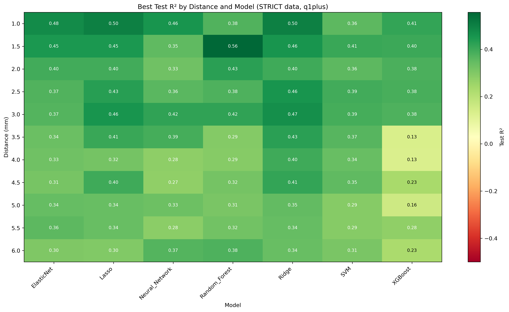
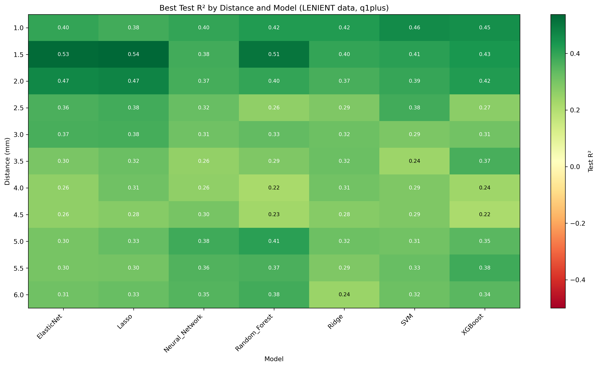
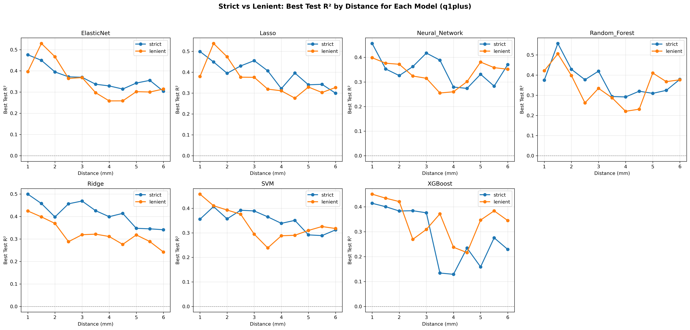
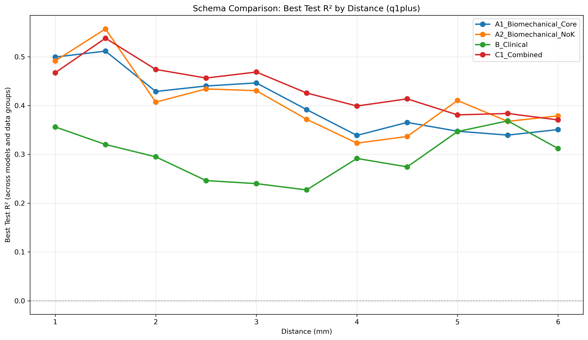

# SR0530 ML 超参数寻优报告（≥1 象限可用（放宽，outer merge 取平均））

> **目标**：针对每种 ML 方法，在 strict（69 眼）和 lenient（71 眼）两套数据上做超参数寻优，比较最佳参数与结果。

> **搜索策略**：Random Search + GroupKFold by Subject，每模型 30 组参数

> **象限策略**：≥1 象限可用（放宽，outer merge 取平均）

> **数据组**：`CleanDataRoi_strict/`（任意 ROI >7000 剔除）和 `CleanDataRoi_lenient/`（距离平均 >7000 剔除）

> **置信区间说明**：Test R² 与 RMSE 后的 95% CI 基于 5-fold CV 的 fold-level 标准差，使用 t 分布近似（t₀.₀₂₅,₄ = 2.776）。

---

## 一、参数搜索空间

| 模型 | 参数 | 搜索范围 |
|------|------|---------|
| SVM | C | 100, 500, 1000, 2000, 5000 |
| SVM | epsilon | 100, 300, 500, 800, 1000 |
| SVM | gamma | 0.001, 0.005, 0.01, 0.03, 0.05, 0.1 |
| Random_Forest | n_estimators | 50, 100, 200, 300 |
| Random_Forest | max_depth | 2, 3, 4, 5, None |
| Random_Forest | min_samples_split | 2, 5, 10 |
| Random_Forest | min_samples_leaf | 1, 2, 4 |
| XGBoost | learning_rate | 0.001, 0.005, 0.01, 0.05, 0.1 |
| XGBoost | max_depth | 1, 2, 3, 4 |
| XGBoost | n_estimators | 30, 50, 100, 200 |
| XGBoost | reg_alpha | 0.1, 0.5, 1.0, 2.0 |
| XGBoost | reg_lambda | 0.1, 0.5, 1.0, 2.0 |
| Neural_Network | hidden_layer_sizes | (40,), (60,), (80,), (100,), (80, 40) |
| Neural_Network | alpha | 0.1, 0.3, 0.5, 1.0 |
| Neural_Network | learning_rate_init | 0.0001, 0.0005, 0.001 |
| Lasso | alpha | 0.001, 0.01, 0.1, 1.0, 10.0 |
| ElasticNet | alpha | 0.001, 0.01, 0.1, 1.0 |
| ElasticNet | l1_ratio | 0.1, 0.3, 0.5, 0.7, 0.9 |
| Ridge | alpha | 0.01, 0.1, 1.0, 10.0, 100.0 |

## 二、总体最佳配置

- **数据组**：strict
- **距离**：1.5 mm
- **方案**：A2_Biomechanical_NoK
- **模型**：Random_Forest
- **最佳 Test R²**：0.557 [95% CI: 0.375, 0.739]
- **最佳 RMSE**：383.7 [95% CI: 210.7, 556.8]
- **最佳参数**：{'n_estimators': 100, 'max_depth': 3, 'min_samples_split': 5, 'min_samples_leaf': 1}
- **样本量**：69 眼 / 44 subjects

## 三、每个数据组的最佳结果（按距离）

### STRICT 数据组

| 距离 (mm) | 最佳方案 | 最佳模型 | Test R² (95% CI) | MAPE (%) | RMSE (95% CI) | Gap | 最佳参数 |
|-----------|---------|---------|------------------|----------|----------------|-----|---------|
| 1.0 | A1_Biomechanical_Core | Lasso | 0.499 [0.291, 0.707] | 8.51 | 391.2 [271.5, 510.8] | 0.053 | `{'alpha': 0.01}` |
| 1.5 | A2_Biomechanical_NoK | Random_Forest | 0.557 [0.375, 0.739] | 8.32 | 383.7 [210.7, 556.8] | 0.280 | `{'n_estimators': 100, 'max_depth': 3, 'min_samples_split': 5, 'min_samples_leaf': 1}` |
| 2.0 | A1_Biomechanical_Core | Random_Forest | 0.429 [0.293, 0.565] | 8.87 | 346.3 [233.9, 458.8] | 0.254 | `{'n_estimators': 50, 'max_depth': 2, 'min_samples_split': 10, 'min_samples_leaf': 2}` |
| 2.5 | C1_Combined | Ridge | 0.456 [0.286, 0.627] | 11.90 | 402.9 [362.8, 443.0] | 0.108 | `{'alpha': 10.0}` |
| 3.0 | C1_Combined | Ridge | 0.469 [0.249, 0.689] | 12.07 | 406.2 [266.0, 546.5] | 0.073 | `{'alpha': 10.0}` |
| 3.5 | C1_Combined | Ridge | 0.426 [0.161, 0.690] | 12.02 | 404.2 [258.6, 549.9] | 0.062 | `{'alpha': 10.0}` |
| 4.0 | C1_Combined | Ridge | 0.399 [0.191, 0.607] | 15.92 | 470.3 [361.0, 579.6] | 0.105 | `{'alpha': 10.0}` |
| 4.5 | C1_Combined | Ridge | 0.414 [0.164, 0.663] | 17.05 | 467.5 [359.0, 576.0] | 0.099 | `{'alpha': 10.0}` |
| 5.0 | A1_Biomechanical_Core | Ridge | 0.347 [0.164, 0.531] | 22.74 | 614.2 [467.3, 761.0] | 0.138 | `{'alpha': 10.0}` |
| 5.5 | A2_Biomechanical_NoK | ElasticNet | 0.355 [0.179, 0.532] | 23.41 | 637.2 [493.7, 780.7] | 0.158 | `{'alpha': 0.1, 'l1_ratio': 0.3}` |
| 6.0 | A2_Biomechanical_NoK | Random_Forest | 0.379 [0.111, 0.646] | 21.89 | 568.7 [345.2, 792.1] | 0.542 | `{'n_estimators': 100, 'max_depth': 5, 'min_samples_split': 2, 'min_samples_leaf': 1}` |

### LENIENT 数据组

| 距离 (mm) | 最佳方案 | 最佳模型 | Test R² (95% CI) | MAPE (%) | RMSE (95% CI) | Gap | 最佳参数 |
|-----------|---------|---------|------------------|----------|----------------|-----|---------|
| 1.0 | A1_Biomechanical_Core | SVM | 0.458 [0.305, 0.610] | 10.83 | 564.8 [351.1, 778.6] | 0.183 | `{'C': 5000, 'epsilon': 100, 'gamma': 0.05}` |
| 1.5 | C1_Combined | Lasso | 0.538 [0.312, 0.764] | 9.27 | 491.4 [259.9, 722.9] | 0.040 | `{'alpha': 10.0}` |
| 2.0 | C1_Combined | Lasso | 0.474 [0.295, 0.653] | 9.71 | 447.6 [247.8, 647.4] | 0.039 | `{'alpha': 10.0}` |
| 2.5 | A1_Biomechanical_Core | Lasso | 0.376 [0.262, 0.491] | 12.71 | 466.9 [324.7, 609.2] | 0.096 | `{'alpha': 10.0}` |
| 3.0 | C1_Combined | Lasso | 0.376 [0.011, 0.740] | 13.42 | 505.4 [275.5, 735.3] | 0.062 | `{'alpha': 10.0}` |
| 3.5 | A2_Biomechanical_NoK | XGBoost | 0.372 [0.223, 0.521] | 14.44 | 442.1 [232.9, 651.3] | 0.497 | `{'learning_rate': 0.05, 'max_depth': 2, 'n_estimators': 100, 'reg_alpha': 2.0, 'reg_lambda': 1.0}` |
| 4.0 | C1_Combined | Lasso | 0.311 [0.089, 0.533] | 17.47 | 502.1 [274.1, 730.0] | 0.107 | `{'alpha': 0.01}` |
| 4.5 | A2_Biomechanical_NoK | Neural_Network | 0.301 [0.194, 0.409] | 18.65 | 511.3 [396.7, 625.9] | 0.036 | `{'hidden_layer_sizes': (100,), 'alpha': 0.5, 'learning_rate_init': 0.0001}` |
| 5.0 | A2_Biomechanical_NoK | Random_Forest | 0.410 [0.310, 0.511] | 18.30 | 578.4 [431.0, 725.9] | 0.331 | `{'n_estimators': 200, 'max_depth': None, 'min_samples_split': 10, 'min_samples_leaf': 2}` |
| 5.5 | C1_Combined | XGBoost | 0.384 [0.146, 0.621] | 25.10 | 646.1 [450.3, 842.0] | 0.285 | `{'learning_rate': 0.05, 'max_depth': 1, 'n_estimators': 50, 'reg_alpha': 2.0, 'reg_lambda': 0.1}` |
| 6.0 | A2_Biomechanical_NoK | Random_Forest | 0.377 [0.194, 0.560] | 22.43 | 646.0 [478.6, 813.4] | 0.383 | `{'n_estimators': 200, 'max_depth': None, 'min_samples_split': 10, 'min_samples_leaf': 2}` |

## 四、每个模型在每个数据组的最佳结果

| 数据组 | 模型 | 最佳距离 | 最佳方案 | Test R² (95% CI) | MAPE (%) | 最佳参数 |
|--------|------|---------|---------|------------------|----------|---------|
| strict | ElasticNet | 1.0 mm | A1_Biomechanical_Core | 0.476 [0.263, 0.689] | 10.38 | `{'alpha': 0.001, 'l1_ratio': 0.3}` |
| strict | Lasso | 1.0 mm | A1_Biomechanical_Core | 0.499 [0.291, 0.707] | 8.51 | `{'alpha': 0.01}` |
| strict | Neural_Network | 1.0 mm | C1_Combined | 0.457 [0.289, 0.624] | 10.25 | `{'hidden_layer_sizes': (60,), 'alpha': 1.0, 'learning_rate_init': 0.0005}` |
| strict | Random_Forest | 1.5 mm | A2_Biomechanical_NoK | 0.557 [0.375, 0.739] | 8.32 | `{'n_estimators': 100, 'max_depth': 3, 'min_samples_split': 5, 'min_samples_leaf': 1}` |
| strict | Ridge | 1.0 mm | A1_Biomechanical_Core | 0.499 [0.291, 0.707] | 8.51 | `{'alpha': 0.1}` |
| strict | SVM | 1.5 mm | A1_Biomechanical_Core | 0.407 [0.135, 0.679] | 9.16 | `{'C': 5000, 'epsilon': 300, 'gamma': 0.03}` |
| strict | XGBoost | 1.0 mm | C1_Combined | 0.414 [0.036, 0.792] | 8.95 | `{'learning_rate': 0.05, 'max_depth': 2, 'n_estimators': 100, 'reg_alpha': 2.0, 'reg_lambda': 1.0}` |
| lenient | ElasticNet | 1.5 mm | C1_Combined | 0.529 [0.314, 0.745] | 9.40 | `{'alpha': 0.001, 'l1_ratio': 0.5}` |
| lenient | Lasso | 1.5 mm | C1_Combined | 0.538 [0.312, 0.764] | 9.27 | `{'alpha': 10.0}` |
| lenient | Neural_Network | 1.0 mm | C1_Combined | 0.399 [0.255, 0.542] | 9.85 | `{'hidden_layer_sizes': (100,), 'alpha': 0.1, 'learning_rate_init': 0.001}` |
| lenient | Random_Forest | 1.5 mm | A2_Biomechanical_NoK | 0.506 [0.301, 0.711] | 9.63 | `{'n_estimators': 100, 'max_depth': 2, 'min_samples_split': 5, 'min_samples_leaf': 1}` |
| lenient | Ridge | 1.0 mm | C1_Combined | 0.424 [0.134, 0.715] | 10.62 | `{'alpha': 10.0}` |
| lenient | SVM | 1.0 mm | A1_Biomechanical_Core | 0.458 [0.305, 0.610] | 10.83 | `{'C': 5000, 'epsilon': 100, 'gamma': 0.05}` |
| lenient | XGBoost | 1.0 mm | A1_Biomechanical_Core | 0.451 [0.303, 0.599] | 10.87 | `{'learning_rate': 0.1, 'max_depth': 1, 'n_estimators': 100, 'reg_alpha': 0.5, 'reg_lambda': 2.0}` |

## 五、每个特征方案的最佳结果

| 方案 | 数据组 | 最佳距离 | 最佳模型 | Test R² (95% CI) |
|------|--------|---------|---------|------------------|
| A1_Biomechanical_Core | strict | 1.5 mm | Random_Forest | 0.512 [0.344, 0.679] |
| A2_Biomechanical_NoK | strict | 1.5 mm | Random_Forest | 0.557 [0.375, 0.739] |
| B_Clinical | lenient | 5.5 mm | XGBoost | 0.369 [0.165, 0.572] |
| C1_Combined | lenient | 1.5 mm | Lasso | 0.538 [0.312, 0.764] |

## 六、全部详细结果

| 数据组 | 距离 | 方案 | 模型 | N_Eyes | N_Subj | Train R² | Test R² (95% CI) | Corr | MAPE | RMSE (95% CI) | Gap | 最佳参数 |
|--------|------|------|------|--------|--------|----------|------------------|------|------|----------------|-----|---------|
| strict | 1.0 | A1_Biomechanical_Core | SVM | 69 | 44 | 0.359 | 0.262 [-0.067, 0.591] | 0.701 | 10.77 | 475.8 [312.4, 639.1] | 0.097 | `{'C': 500, 'epsilon': 800, 'gamma': 0.1}` |
| strict | 1.0 | A1_Biomechanical_Core | Random_Forest | 69 | 44 | 0.731 | 0.356 [-0.051, 0.763] | 0.667 | 10.92 | 509.8 [428.0, 591.5] | 0.375 | `{'n_estimators': 100, 'max_depth': 2, 'min_samples_split': 5, 'min_samples_leaf': 1}` |
| strict | 1.0 | A1_Biomechanical_Core | XGBoost | 69 | 44 | 0.764 | 0.408 [0.121, 0.695] | 0.684 | 9.24 | 422.2 [289.0, 555.4] | 0.355 | `{'learning_rate': 0.05, 'max_depth': 2, 'n_estimators': 100, 'reg_alpha': 2.0, 'reg_lambda': 1.0}` |
| strict | 1.0 | A1_Biomechanical_Core | Neural_Network | 69 | 44 | 0.576 | 0.436 [0.159, 0.713] | 0.683 | 9.17 | 413.6 [271.1, 556.2] | 0.140 | `{'hidden_layer_sizes': (100,), 'alpha': 0.5, 'learning_rate_init': 0.0001}` |
| strict | 1.0 | A1_Biomechanical_Core | Lasso | 69 | 44 | 0.552 | 0.499 [0.291, 0.707] | 0.721 | 8.51 | 391.2 [271.5, 510.8] | 0.053 | `{'alpha': 0.01}` |
| strict | 1.0 | A1_Biomechanical_Core | ElasticNet | 69 | 44 | 0.571 | 0.476 [0.263, 0.689] | 0.709 | 10.38 | 475.6 [301.3, 649.9] | 0.095 | `{'alpha': 0.001, 'l1_ratio': 0.3}` |
| strict | 1.0 | A1_Biomechanical_Core | Ridge | 69 | 44 | 0.552 | 0.499 [0.291, 0.707] | 0.721 | 8.51 | 391.2 [271.4, 511.0] | 0.053 | `{'alpha': 0.1}` |
| strict | 1.0 | A2_Biomechanical_NoK | SVM | 69 | 44 | 0.378 | 0.288 [0.041, 0.534] | 0.654 | 10.41 | 471.7 [311.0, 632.4] | 0.091 | `{'C': 500, 'epsilon': 800, 'gamma': 0.1}` |
| strict | 1.0 | A2_Biomechanical_NoK | Random_Forest | 69 | 44 | 0.810 | 0.336 [-0.026, 0.697] | 0.648 | 9.67 | 445.4 [340.0, 550.9] | 0.474 | `{'n_estimators': 100, 'max_depth': 3, 'min_samples_split': 5, 'min_samples_leaf': 1}` |
| strict | 1.0 | A2_Biomechanical_NoK | XGBoost | 69 | 44 | 0.820 | 0.357 [-0.015, 0.729] | 0.614 | 9.75 | 435.4 [289.6, 581.1] | 0.463 | `{'learning_rate': 0.05, 'max_depth': 2, 'n_estimators': 100, 'reg_alpha': 2.0, 'reg_lambda': 1.0}` |
| strict | 1.0 | A2_Biomechanical_NoK | Neural_Network | 69 | 44 | 0.480 | 0.355 [0.083, 0.628] | 0.629 | 9.31 | 441.7 [307.2, 576.2] | 0.125 | `{'hidden_layer_sizes': (100,), 'alpha': 0.5, 'learning_rate_init': 0.0001}` |
| strict | 1.0 | A2_Biomechanical_NoK | Lasso | 69 | 44 | 0.565 | 0.491 [0.258, 0.725] | 0.719 | 8.62 | 392.3 [275.7, 508.8] | 0.073 | `{'alpha': 0.01}` |
| strict | 1.0 | A2_Biomechanical_NoK | ElasticNet | 69 | 44 | 0.579 | 0.453 [0.197, 0.709] | 0.689 | 10.53 | 485.3 [293.3, 677.3] | 0.126 | `{'alpha': 0.001, 'l1_ratio': 0.3}` |
| strict | 1.0 | A2_Biomechanical_NoK | Ridge | 69 | 44 | 0.565 | 0.492 [0.258, 0.725] | 0.719 | 8.62 | 392.2 [275.5, 508.9] | 0.073 | `{'alpha': 0.1}` |
| strict | 1.0 | B_Clinical | SVM | 69 | 44 | 0.350 | 0.256 [0.040, 0.471] | 0.671 | 10.59 | 480.4 [343.3, 617.5] | 0.094 | `{'C': 500, 'epsilon': 800, 'gamma': 0.1}` |
| strict | 1.0 | B_Clinical | Random_Forest | 69 | 44 | 0.781 | 0.272 [0.022, 0.522] | 0.624 | 11.72 | 524.2 [385.9, 662.4] | 0.509 | `{'n_estimators': 300, 'max_depth': None, 'min_samples_split': 2, 'min_samples_leaf': 2}` |
| strict | 1.0 | B_Clinical | XGBoost | 69 | 44 | 0.528 | 0.356 [0.209, 0.504] | 0.667 | 11.39 | 494.1 [386.1, 602.2] | 0.172 | `{'learning_rate': 0.05, 'max_depth': 1, 'n_estimators': 50, 'reg_alpha': 2.0, 'reg_lambda': 0.1}` |
| strict | 1.0 | B_Clinical | Neural_Network | 69 | 44 | 0.509 | 0.263 [0.012, 0.515] | 0.618 | 12.44 | 567.6 [383.9, 751.4] | 0.246 | `{'hidden_layer_sizes': (60,), 'alpha': 1.0, 'learning_rate_init': 0.0005}` |
| strict | 1.0 | B_Clinical | Lasso | 69 | 44 | 0.489 | 0.300 [0.066, 0.533] | 0.665 | 11.67 | 550.5 [385.8, 715.2] | 0.189 | `{'alpha': 0.001}` |
| strict | 1.0 | B_Clinical | ElasticNet | 69 | 44 | 0.489 | 0.300 [0.067, 0.533] | 0.665 | 11.67 | 550.5 [385.6, 715.4] | 0.189 | `{'alpha': 0.001, 'l1_ratio': 0.3}` |
| strict | 1.0 | B_Clinical | Ridge | 69 | 44 | 0.552 | 0.308 [-0.176, 0.792] | 0.669 | 10.41 | 447.5 [298.3, 596.8] | 0.244 | `{'alpha': 10.0}` |
| strict | 1.0 | C1_Combined | SVM | 69 | 44 | 0.512 | 0.356 [0.079, 0.633] | 0.681 | 11.33 | 491.3 [332.7, 649.9] | 0.157 | `{'C': 5000, 'epsilon': 300, 'gamma': 0.005}` |
| strict | 1.0 | C1_Combined | Random_Forest | 69 | 44 | 0.753 | 0.375 [0.057, 0.693] | 0.690 | 11.16 | 512.7 [422.9, 602.5] | 0.378 | `{'n_estimators': 100, 'max_depth': 2, 'min_samples_split': 5, 'min_samples_leaf': 1}` |
| strict | 1.0 | C1_Combined | XGBoost | 69 | 44 | 0.825 | 0.414 [0.036, 0.792] | 0.680 | 8.95 | 414.9 [246.4, 583.4] | 0.411 | `{'learning_rate': 0.05, 'max_depth': 2, 'n_estimators': 100, 'reg_alpha': 2.0, 'reg_lambda': 1.0}` |
| strict | 1.0 | C1_Combined | Neural_Network | 69 | 44 | 0.576 | 0.457 [0.289, 0.624] | 0.706 | 10.25 | 489.8 [320.3, 659.2] | 0.119 | `{'hidden_layer_sizes': (60,), 'alpha': 1.0, 'learning_rate_init': 0.0005}` |
| strict | 1.0 | C1_Combined | Lasso | 69 | 44 | 0.582 | 0.467 [0.229, 0.705] | 0.709 | 10.22 | 475.7 [299.2, 652.1] | 0.115 | `{'alpha': 0.001}` |
| strict | 1.0 | C1_Combined | ElasticNet | 69 | 44 | 0.582 | 0.467 [0.229, 0.705] | 0.709 | 10.22 | 475.6 [299.1, 652.1] | 0.115 | `{'alpha': 0.001, 'l1_ratio': 0.3}` |
| strict | 1.0 | C1_Combined | Ridge | 69 | 44 | 0.582 | 0.467 [0.229, 0.705] | 0.709 | 10.22 | 475.6 [299.2, 652.1] | 0.115 | `{'alpha': 0.01}` |
| strict | 1.5 | A1_Biomechanical_Core | SVM | 69 | 44 | 0.509 | 0.407 [0.135, 0.679] | 0.721 | 9.16 | 393.7 [193.1, 594.3] | 0.102 | `{'C': 5000, 'epsilon': 300, 'gamma': 0.03}` |
| strict | 1.5 | A1_Biomechanical_Core | Random_Forest | 69 | 44 | 0.814 | 0.512 [0.344, 0.679] | 0.771 | 7.99 | 397.1 [242.5, 551.7] | 0.302 | `{'n_estimators': 100, 'max_depth': 3, 'min_samples_split': 5, 'min_samples_leaf': 1}` |
| strict | 1.5 | A1_Biomechanical_Core | XGBoost | 69 | 44 | 0.598 | 0.378 [0.024, 0.733] | 0.644 | 9.73 | 429.6 [243.8, 615.5] | 0.220 | `{'learning_rate': 0.05, 'max_depth': 1, 'n_estimators': 50, 'reg_alpha': 2.0, 'reg_lambda': 0.1}` |
| strict | 1.5 | A1_Biomechanical_Core | Neural_Network | 69 | 44 | 0.562 | 0.353 [0.153, 0.552] | 0.698 | 9.08 | 390.2 [284.5, 495.9] | 0.209 | `{'hidden_layer_sizes': (60,), 'alpha': 1.0, 'learning_rate_init': 0.001}` |
| strict | 1.5 | A1_Biomechanical_Core | Lasso | 69 | 44 | 0.573 | 0.408 [0.169, 0.648] | 0.685 | 8.57 | 368.2 [275.7, 460.7] | 0.165 | `{'alpha': 0.1}` |
| strict | 1.5 | A1_Biomechanical_Core | ElasticNet | 69 | 44 | 0.573 | 0.408 [0.168, 0.648] | 0.685 | 8.57 | 368.3 [275.8, 460.7] | 0.165 | `{'alpha': 0.001, 'l1_ratio': 0.1}` |
| strict | 1.5 | A1_Biomechanical_Core | Ridge | 69 | 44 | 0.573 | 0.406 [0.156, 0.656] | 0.683 | 8.60 | 368.4 [276.7, 460.0] | 0.167 | `{'alpha': 1.0}` |
| strict | 1.5 | A2_Biomechanical_NoK | SVM | 69 | 44 | 0.586 | 0.288 [-0.134, 0.709] | 0.532 | 9.87 | 429.7 [184.8, 674.6] | 0.299 | `{'C': 5000, 'epsilon': 300, 'gamma': 0.03}` |
| strict | 1.5 | A2_Biomechanical_NoK | Random_Forest | 69 | 44 | 0.837 | 0.557 [0.375, 0.739] | 0.805 | 8.32 | 383.7 [210.7, 556.8] | 0.280 | `{'n_estimators': 100, 'max_depth': 3, 'min_samples_split': 5, 'min_samples_leaf': 1}` |
| strict | 1.5 | A2_Biomechanical_NoK | XGBoost | 69 | 44 | 0.816 | 0.385 [0.134, 0.637] | 0.713 | 8.37 | 370.7 [298.9, 442.6] | 0.431 | `{'learning_rate': 0.1, 'max_depth': 1, 'n_estimators': 100, 'reg_alpha': 0.5, 'reg_lambda': 2.0}` |
| strict | 1.5 | A2_Biomechanical_NoK | Neural_Network | 69 | 44 | 0.647 | 0.286 [-0.137, 0.710] | 0.642 | 10.60 | 485.3 [284.8, 685.8] | 0.360 | `{'hidden_layer_sizes': (60,), 'alpha': 0.3, 'learning_rate_init': 0.0005}` |
| strict | 1.5 | A2_Biomechanical_NoK | Lasso | 69 | 44 | 0.442 | 0.231 [-0.006, 0.469] | 0.549 | 11.75 | 545.4 [241.4, 849.4] | 0.211 | `{'alpha': 1.0}` |
| strict | 1.5 | A2_Biomechanical_NoK | ElasticNet | 69 | 44 | 0.486 | 0.237 [-0.154, 0.628] | 0.705 | 10.34 | 489.8 [366.4, 613.1] | 0.249 | `{'alpha': 0.01, 'l1_ratio': 0.1}` |
| strict | 1.5 | A2_Biomechanical_NoK | Ridge | 69 | 44 | 0.486 | 0.243 [-0.139, 0.625] | 0.705 | 10.32 | 488.6 [365.0, 612.2] | 0.243 | `{'alpha': 1.0}` |
| strict | 1.5 | B_Clinical | SVM | 69 | 44 | 0.260 | 0.091 [-0.119, 0.301] | 0.467 | 12.40 | 527.3 [422.5, 632.2] | 0.169 | `{'C': 2000, 'epsilon': 800, 'gamma': 0.05}` |
| strict | 1.5 | B_Clinical | Random_Forest | 69 | 44 | 0.679 | 0.173 [-0.232, 0.579] | 0.664 | 11.03 | 531.1 [325.6, 736.6] | 0.506 | `{'n_estimators': 100, 'max_depth': 3, 'min_samples_split': 2, 'min_samples_leaf': 4}` |
| strict | 1.5 | B_Clinical | XGBoost | 69 | 44 | 0.487 | 0.305 [-0.017, 0.626] | 0.589 | 11.23 | 458.2 [279.3, 637.1] | 0.183 | `{'learning_rate': 0.05, 'max_depth': 1, 'n_estimators': 50, 'reg_alpha': 2.0, 'reg_lambda': 0.1}` |
| strict | 1.5 | B_Clinical | Neural_Network | 69 | 44 | 0.576 | 0.232 [-0.135, 0.599] | 0.534 | 9.23 | 393.4 [314.5, 472.2] | 0.344 | `{'hidden_layer_sizes': (60,), 'alpha': 0.5, 'learning_rate_init': 0.0001}` |
| strict | 1.5 | B_Clinical | Lasso | 69 | 44 | 0.470 | 0.292 [-0.091, 0.675] | 0.552 | 8.99 | 379.3 [270.2, 488.4] | 0.177 | `{'alpha': 1.0}` |
| strict | 1.5 | B_Clinical | ElasticNet | 69 | 44 | 0.421 | 0.233 [-0.095, 0.560] | 0.535 | 9.57 | 399.3 [305.6, 492.9] | 0.188 | `{'alpha': 1.0, 'l1_ratio': 0.7}` |
| strict | 1.5 | B_Clinical | Ridge | 69 | 44 | 0.446 | 0.263 [-0.079, 0.605] | 0.541 | 9.31 | 389.7 [293.7, 485.8] | 0.183 | `{'alpha': 10.0}` |
| strict | 1.5 | C1_Combined | SVM | 69 | 44 | 0.527 | 0.366 [0.070, 0.662] | 0.689 | 9.74 | 406.1 [207.6, 604.7] | 0.161 | `{'C': 5000, 'epsilon': 300, 'gamma': 0.03}` |
| strict | 1.5 | C1_Combined | Random_Forest | 69 | 44 | 0.740 | 0.468 [0.194, 0.742] | 0.750 | 8.09 | 341.7 [280.6, 402.8] | 0.272 | `{'n_estimators': 50, 'max_depth': 2, 'min_samples_split': 10, 'min_samples_leaf': 2}` |
| strict | 1.5 | C1_Combined | XGBoost | 69 | 44 | 0.611 | 0.400 [0.067, 0.733] | 0.662 | 9.81 | 422.2 [250.2, 594.2] | 0.211 | `{'learning_rate': 0.05, 'max_depth': 1, 'n_estimators': 50, 'reg_alpha': 2.0, 'reg_lambda': 0.1}` |
| strict | 1.5 | C1_Combined | Neural_Network | 69 | 44 | 0.612 | 0.294 [-0.083, 0.672] | 0.646 | 9.09 | 376.5 [277.5, 475.5] | 0.318 | `{'hidden_layer_sizes': (60,), 'alpha': 0.5, 'learning_rate_init': 0.0001}` |
| strict | 1.5 | C1_Combined | Lasso | 69 | 44 | 0.621 | 0.449 [0.315, 0.584] | 0.705 | 8.41 | 358.5 [280.1, 436.8] | 0.172 | `{'alpha': 0.1}` |
| strict | 1.5 | C1_Combined | ElasticNet | 69 | 44 | 0.621 | 0.450 [0.315, 0.584] | 0.705 | 8.41 | 358.3 [280.4, 436.3] | 0.171 | `{'alpha': 0.001, 'l1_ratio': 0.1}` |
| strict | 1.5 | C1_Combined | Ridge | 69 | 44 | 0.621 | 0.458 [0.312, 0.603] | 0.708 | 8.34 | 354.5 [283.0, 426.0] | 0.163 | `{'alpha': 1.0}` |
| strict | 2.0 | A1_Biomechanical_Core | SVM | 69 | 44 | 0.295 | 0.297 [0.019, 0.574] | 0.607 | 10.51 | 440.9 [234.5, 647.3] | -0.002 | `{'C': 2000, 'epsilon': 300, 'gamma': 0.005}` |
| strict | 2.0 | A1_Biomechanical_Core | Random_Forest | 69 | 44 | 0.683 | 0.429 [0.293, 0.565] | 0.734 | 8.87 | 346.3 [233.9, 458.8] | 0.254 | `{'n_estimators': 50, 'max_depth': 2, 'min_samples_split': 10, 'min_samples_leaf': 2}` |
| strict | 2.0 | A1_Biomechanical_Core | XGBoost | 69 | 44 | 0.734 | 0.383 [0.208, 0.558] | 0.719 | 9.54 | 359.0 [249.2, 468.7] | 0.351 | `{'learning_rate': 0.1, 'max_depth': 1, 'n_estimators': 100, 'reg_alpha': 0.5, 'reg_lambda': 2.0}` |
| strict | 2.0 | A1_Biomechanical_Core | Neural_Network | 69 | 44 | 0.461 | 0.245 [-0.081, 0.571] | 0.541 | 11.81 | 440.1 [241.8, 638.3] | 0.216 | `{'hidden_layer_sizes': (80,), 'alpha': 0.3, 'learning_rate_init': 0.0001}` |
| strict | 2.0 | A1_Biomechanical_Core | Lasso | 69 | 44 | 0.492 | 0.339 [0.006, 0.672] | 0.615 | 9.43 | 365.9 [219.2, 512.5] | 0.153 | `{'alpha': 0.1}` |
| strict | 2.0 | A1_Biomechanical_Core | ElasticNet | 69 | 44 | 0.492 | 0.339 [0.006, 0.672] | 0.615 | 9.43 | 365.9 [219.3, 512.5] | 0.153 | `{'alpha': 0.001, 'l1_ratio': 0.1}` |
| strict | 2.0 | A1_Biomechanical_Core | Ridge | 69 | 44 | 0.450 | 0.339 [0.153, 0.526] | 0.696 | 10.44 | 375.8 [258.3, 493.2] | 0.111 | `{'alpha': 10.0}` |
| strict | 2.0 | A2_Biomechanical_NoK | SVM | 69 | 44 | 0.413 | 0.282 [0.007, 0.557] | 0.662 | 10.63 | 439.1 [350.1, 528.1] | 0.131 | `{'C': 2000, 'epsilon': 300, 'gamma': 0.005}` |
| strict | 2.0 | A2_Biomechanical_NoK | Random_Forest | 69 | 44 | 0.783 | 0.407 [0.174, 0.640] | 0.664 | 10.55 | 406.8 [200.9, 612.6] | 0.376 | `{'n_estimators': 100, 'max_depth': 3, 'min_samples_split': 5, 'min_samples_leaf': 1}` |
| strict | 2.0 | A2_Biomechanical_NoK | XGBoost | 69 | 44 | 0.780 | 0.352 [0.116, 0.588] | 0.700 | 9.35 | 361.3 [265.8, 456.9] | 0.429 | `{'learning_rate': 0.1, 'max_depth': 1, 'n_estimators': 100, 'reg_alpha': 0.5, 'reg_lambda': 2.0}` |
| strict | 2.0 | A2_Biomechanical_NoK | Neural_Network | 69 | 44 | 0.559 | 0.188 [-0.094, 0.471] | 0.555 | 11.48 | 451.0 [276.2, 625.7] | 0.370 | `{'hidden_layer_sizes': (60,), 'alpha': 0.3, 'learning_rate_init': 0.0005}` |
| strict | 2.0 | A2_Biomechanical_NoK | Lasso | 69 | 44 | 0.432 | 0.296 [-0.051, 0.643] | 0.584 | 10.20 | 437.2 [223.4, 651.1] | 0.136 | `{'alpha': 1.0}` |
| strict | 2.0 | A2_Biomechanical_NoK | ElasticNet | 69 | 44 | 0.432 | 0.294 [-0.053, 0.641] | 0.580 | 10.22 | 438.0 [223.4, 652.7] | 0.138 | `{'alpha': 0.1, 'l1_ratio': 0.9}` |
| strict | 2.0 | A2_Biomechanical_NoK | Ridge | 69 | 44 | 0.421 | 0.295 [-0.011, 0.601] | 0.572 | 10.51 | 439.2 [231.5, 646.8] | 0.126 | `{'alpha': 10.0}` |
| strict | 2.0 | B_Clinical | SVM | 69 | 44 | 0.159 | 0.095 [-0.090, 0.280] | 0.611 | 11.69 | 447.4 [295.7, 599.1] | 0.065 | `{'C': 100, 'epsilon': 100, 'gamma': 0.03}` |
| strict | 2.0 | B_Clinical | Random_Forest | 69 | 44 | 0.707 | 0.116 [-0.293, 0.524] | 0.445 | 13.06 | 475.2 [254.3, 696.2] | 0.591 | `{'n_estimators': 300, 'max_depth': None, 'min_samples_split': 2, 'min_samples_leaf': 2}` |
| strict | 2.0 | B_Clinical | XGBoost | 69 | 44 | 0.320 | 0.160 [0.011, 0.308] | 0.455 | 12.05 | 431.6 [290.6, 572.6] | 0.161 | `{'learning_rate': 0.005, 'max_depth': 1, 'n_estimators': 200, 'reg_alpha': 1.0, 'reg_lambda': 0.1}` |
| strict | 2.0 | B_Clinical | Neural_Network | 69 | 44 | 0.376 | 0.163 [-0.010, 0.336] | 0.578 | 11.78 | 421.4 [319.8, 522.9] | 0.213 | `{'hidden_layer_sizes': (60,), 'alpha': 0.5, 'learning_rate_init': 0.0001}` |
| strict | 2.0 | B_Clinical | Lasso | 69 | 44 | 0.393 | 0.295 [0.086, 0.503] | 0.592 | 10.57 | 388.4 [264.9, 512.0] | 0.098 | `{'alpha': 1.0}` |
| strict | 2.0 | B_Clinical | ElasticNet | 69 | 44 | 0.350 | 0.264 [0.101, 0.428] | 0.570 | 10.72 | 399.4 [276.7, 522.2] | 0.086 | `{'alpha': 1.0, 'l1_ratio': 0.7}` |
| strict | 2.0 | B_Clinical | Ridge | 69 | 44 | 0.372 | 0.284 [0.106, 0.462] | 0.577 | 10.63 | 393.0 [271.3, 514.8] | 0.088 | `{'alpha': 10.0}` |
| strict | 2.0 | C1_Combined | SVM | 69 | 44 | 0.344 | 0.357 [0.047, 0.667] | 0.652 | 10.13 | 421.6 [204.7, 638.4] | -0.013 | `{'C': 2000, 'epsilon': 300, 'gamma': 0.005}` |
| strict | 2.0 | C1_Combined | Random_Forest | 69 | 44 | 0.686 | 0.412 [0.261, 0.563] | 0.728 | 9.03 | 352.3 [228.1, 476.5] | 0.274 | `{'n_estimators': 50, 'max_depth': 2, 'min_samples_split': 10, 'min_samples_leaf': 2}` |
| strict | 2.0 | C1_Combined | XGBoost | 69 | 44 | 0.746 | 0.336 [0.214, 0.458] | 0.698 | 9.85 | 375.5 [260.1, 490.9] | 0.410 | `{'learning_rate': 0.1, 'max_depth': 1, 'n_estimators': 100, 'reg_alpha': 0.5, 'reg_lambda': 2.0}` |
| strict | 2.0 | C1_Combined | Neural_Network | 69 | 44 | 0.576 | 0.326 [0.003, 0.649] | 0.651 | 9.27 | 357.9 [263.0, 452.8] | 0.251 | `{'hidden_layer_sizes': (80, 40), 'alpha': 0.5, 'learning_rate_init': 0.0005}` |
| strict | 2.0 | C1_Combined | Lasso | 69 | 44 | 0.538 | 0.395 [0.177, 0.613] | 0.662 | 9.12 | 352.8 [226.4, 479.3] | 0.143 | `{'alpha': 0.1}` |
| strict | 2.0 | C1_Combined | ElasticNet | 69 | 44 | 0.538 | 0.395 [0.177, 0.613] | 0.662 | 9.12 | 352.8 [226.5, 479.2] | 0.143 | `{'alpha': 0.001, 'l1_ratio': 0.1}` |
| strict | 2.0 | C1_Combined | Ridge | 69 | 44 | 0.538 | 0.398 [0.178, 0.618] | 0.664 | 9.04 | 351.7 [226.8, 476.6] | 0.140 | `{'alpha': 1.0}` |
| strict | 2.5 | A1_Biomechanical_Core | SVM | 69 | 44 | 0.488 | 0.392 [0.186, 0.598] | 0.736 | 12.22 | 424.8 [390.0, 459.6] | 0.095 | `{'C': 2000, 'epsilon': 300, 'gamma': 0.005}` |
| strict | 2.5 | A1_Biomechanical_Core | Random_Forest | 69 | 44 | 0.831 | 0.377 [0.083, 0.671] | 0.649 | 12.98 | 421.7 [221.6, 621.8] | 0.454 | `{'n_estimators': 200, 'max_depth': None, 'min_samples_split': 5, 'min_samples_leaf': 1}` |
| strict | 2.5 | A1_Biomechanical_Core | XGBoost | 69 | 44 | 0.871 | 0.384 [0.060, 0.708] | 0.652 | 12.81 | 416.5 [208.7, 624.3] | 0.487 | `{'learning_rate': 0.1, 'max_depth': 2, 'n_estimators': 100, 'reg_alpha': 0.1, 'reg_lambda': 2.0}` |
| strict | 2.5 | A1_Biomechanical_Core | Neural_Network | 69 | 44 | 0.646 | 0.362 [0.001, 0.724] | 0.724 | 11.67 | 383.5 [267.0, 499.9] | 0.283 | `{'hidden_layer_sizes': (80, 40), 'alpha': 0.5, 'learning_rate_init': 0.0005}` |
| strict | 2.5 | A1_Biomechanical_Core | Lasso | 69 | 44 | 0.561 | 0.430 [0.212, 0.649] | 0.750 | 11.88 | 410.8 [339.0, 482.5] | 0.130 | `{'alpha': 1.0}` |
| strict | 2.5 | A1_Biomechanical_Core | ElasticNet | 69 | 44 | 0.445 | 0.372 [0.203, 0.541] | 0.731 | 13.37 | 434.7 [390.7, 478.8] | 0.073 | `{'alpha': 1.0, 'l1_ratio': 0.1}` |
| strict | 2.5 | A1_Biomechanical_Core | Ridge | 69 | 44 | 0.548 | 0.440 [0.250, 0.630] | 0.745 | 11.77 | 408.0 [365.2, 450.8] | 0.108 | `{'alpha': 10.0}` |
| strict | 2.5 | A2_Biomechanical_NoK | SVM | 69 | 44 | 0.493 | 0.386 [0.188, 0.585] | 0.729 | 12.25 | 427.5 [394.3, 460.7] | 0.106 | `{'C': 2000, 'epsilon': 300, 'gamma': 0.005}` |
| strict | 2.5 | A2_Biomechanical_NoK | Random_Forest | 69 | 44 | 0.879 | 0.370 [0.067, 0.674] | 0.669 | 12.49 | 423.8 [220.9, 626.6] | 0.508 | `{'n_estimators': 200, 'max_depth': None, 'min_samples_split': 5, 'min_samples_leaf': 1}` |
| strict | 2.5 | A2_Biomechanical_NoK | XGBoost | 69 | 44 | 0.779 | 0.347 [0.138, 0.555] | 0.660 | 12.53 | 392.4 [327.7, 457.1] | 0.432 | `{'learning_rate': 0.1, 'max_depth': 1, 'n_estimators': 100, 'reg_alpha': 0.5, 'reg_lambda': 2.0}` |
| strict | 2.5 | A2_Biomechanical_NoK | Neural_Network | 69 | 44 | 0.415 | 0.268 [0.033, 0.503] | 0.688 | 14.70 | 467.3 [427.2, 507.5] | 0.147 | `{'hidden_layer_sizes': (80,), 'alpha': 0.1, 'learning_rate_init': 0.001}` |
| strict | 2.5 | A2_Biomechanical_NoK | Lasso | 69 | 44 | 0.562 | 0.423 [0.196, 0.649] | 0.743 | 11.90 | 413.3 [338.0, 488.6] | 0.139 | `{'alpha': 1.0}` |
| strict | 2.5 | A2_Biomechanical_NoK | ElasticNet | 69 | 44 | 0.446 | 0.364 [0.201, 0.526] | 0.724 | 13.44 | 438.0 [395.4, 480.7] | 0.083 | `{'alpha': 1.0, 'l1_ratio': 0.1}` |
| strict | 2.5 | A2_Biomechanical_NoK | Ridge | 69 | 44 | 0.549 | 0.434 [0.240, 0.628] | 0.738 | 11.82 | 410.2 [365.0, 455.3] | 0.115 | `{'alpha': 10.0}` |
| strict | 2.5 | B_Clinical | SVM | 69 | 44 | 0.430 | 0.026 [-0.247, 0.298] | 0.528 | 12.76 | 468.2 [253.0, 683.4] | 0.404 | `{'C': 5000, 'epsilon': 100, 'gamma': 0.05}` |
| strict | 2.5 | B_Clinical | Random_Forest | 69 | 44 | 0.777 | 0.119 [-0.048, 0.286] | 0.512 | 13.81 | 444.0 [285.2, 602.8] | 0.658 | `{'n_estimators': 50, 'max_depth': 5, 'min_samples_split': 5, 'min_samples_leaf': 1}` |
| strict | 2.5 | B_Clinical | XGBoost | 69 | 44 | 0.340 | 0.082 [0.033, 0.132] | 0.334 | 14.24 | 464.8 [272.5, 657.2] | 0.258 | `{'learning_rate': 0.005, 'max_depth': 1, 'n_estimators': 200, 'reg_alpha': 1.0, 'reg_lambda': 0.1}` |
| strict | 2.5 | B_Clinical | Neural_Network | 69 | 44 | 0.253 | 0.092 [-0.081, 0.265] | 0.368 | 14.73 | 490.8 [403.6, 578.0] | 0.161 | `{'hidden_layer_sizes': (80,), 'alpha': 1.0, 'learning_rate_init': 0.0001}` |
| strict | 2.5 | B_Clinical | Lasso | 69 | 44 | 0.365 | 0.075 [-0.565, 0.715] | 0.524 | 12.82 | 426.8 [277.7, 575.9] | 0.290 | `{'alpha': 1.0}` |
| strict | 2.5 | B_Clinical | ElasticNet | 69 | 44 | 0.329 | 0.108 [-0.328, 0.545] | 0.504 | 12.59 | 434.4 [270.8, 598.0] | 0.221 | `{'alpha': 1.0, 'l1_ratio': 0.7}` |
| strict | 2.5 | B_Clinical | Ridge | 69 | 44 | 0.348 | 0.108 [-0.395, 0.610] | 0.510 | 12.58 | 429.4 [270.6, 588.1] | 0.240 | `{'alpha': 10.0}` |
| strict | 2.5 | C1_Combined | SVM | 69 | 44 | 0.512 | 0.369 [0.161, 0.577] | 0.731 | 12.73 | 434.5 [363.9, 505.1] | 0.142 | `{'C': 2000, 'epsilon': 300, 'gamma': 0.005}` |
| strict | 2.5 | C1_Combined | Random_Forest | 69 | 44 | 0.844 | 0.357 [0.011, 0.703] | 0.632 | 13.51 | 428.0 [211.8, 644.3] | 0.488 | `{'n_estimators': 200, 'max_depth': None, 'min_samples_split': 5, 'min_samples_leaf': 1}` |
| strict | 2.5 | C1_Combined | XGBoost | 69 | 44 | 0.881 | 0.374 [0.013, 0.736] | 0.637 | 12.96 | 418.8 [200.2, 637.3] | 0.507 | `{'learning_rate': 0.1, 'max_depth': 2, 'n_estimators': 100, 'reg_alpha': 0.1, 'reg_lambda': 2.0}` |
| strict | 2.5 | C1_Combined | Neural_Network | 69 | 44 | 0.564 | 0.357 [0.083, 0.632] | 0.636 | 11.98 | 392.7 [274.6, 510.7] | 0.207 | `{'hidden_layer_sizes': (80, 40), 'alpha': 0.5, 'learning_rate_init': 0.0005}` |
| strict | 2.5 | C1_Combined | Lasso | 69 | 44 | 0.578 | 0.427 [0.230, 0.624] | 0.748 | 12.09 | 413.3 [338.0, 488.5] | 0.151 | `{'alpha': 1.0}` |
| strict | 2.5 | C1_Combined | ElasticNet | 69 | 44 | 0.507 | 0.356 [0.104, 0.608] | 0.676 | 12.60 | 404.1 [301.7, 506.5] | 0.151 | `{'alpha': 0.01, 'l1_ratio': 0.1}` |
| strict | 2.5 | C1_Combined | Ridge | 69 | 44 | 0.564 | 0.456 [0.286, 0.627] | 0.748 | 11.90 | 402.9 [362.8, 443.0] | 0.108 | `{'alpha': 10.0}` |
| strict | 3.0 | A1_Biomechanical_Core | SVM | 69 | 44 | 0.438 | 0.374 [0.173, 0.574] | 0.693 | 13.94 | 441.2 [323.9, 558.5] | 0.064 | `{'C': 2000, 'epsilon': 300, 'gamma': 0.005}` |
| strict | 3.0 | A1_Biomechanical_Core | Random_Forest | 69 | 44 | 0.819 | 0.333 [0.090, 0.575] | 0.651 | 15.24 | 493.7 [168.9, 818.6] | 0.487 | `{'n_estimators': 200, 'max_depth': None, 'min_samples_split': 5, 'min_samples_leaf': 1}` |
| strict | 3.0 | A1_Biomechanical_Core | XGBoost | 69 | 44 | 0.908 | 0.376 [0.125, 0.627] | 0.678 | 14.00 | 477.5 [142.0, 813.1] | 0.532 | `{'learning_rate': 0.1, 'max_depth': 2, 'n_estimators': 100, 'reg_alpha': 0.1, 'reg_lambda': 2.0}` |
| strict | 3.0 | A1_Biomechanical_Core | Neural_Network | 69 | 44 | 0.609 | 0.357 [0.201, 0.513] | 0.672 | 13.09 | 452.1 [322.1, 582.1] | 0.253 | `{'hidden_layer_sizes': (80,), 'alpha': 0.1, 'learning_rate_init': 0.001}` |
| strict | 3.0 | A1_Biomechanical_Core | Lasso | 69 | 44 | 0.529 | 0.446 [0.154, 0.738] | 0.738 | 12.00 | 412.0 [238.9, 585.1] | 0.083 | `{'alpha': 1.0}` |
| strict | 3.0 | A1_Biomechanical_Core | ElasticNet | 69 | 44 | 0.421 | 0.360 [0.194, 0.527] | 0.724 | 14.46 | 447.9 [332.8, 563.0] | 0.060 | `{'alpha': 1.0, 'l1_ratio': 0.1}` |
| strict | 3.0 | A1_Biomechanical_Core | Ridge | 69 | 44 | 0.518 | 0.442 [0.199, 0.686] | 0.735 | 12.24 | 414.6 [268.1, 561.1] | 0.075 | `{'alpha': 10.0}` |
| strict | 3.0 | A2_Biomechanical_NoK | SVM | 69 | 44 | 0.439 | 0.370 [0.170, 0.570] | 0.688 | 14.00 | 442.8 [321.8, 563.9] | 0.068 | `{'C': 2000, 'epsilon': 300, 'gamma': 0.005}` |
| strict | 3.0 | A2_Biomechanical_NoK | Random_Forest | 69 | 44 | 0.810 | 0.420 [0.180, 0.659] | 0.693 | 13.60 | 494.0 [192.3, 795.7] | 0.390 | `{'n_estimators': 100, 'max_depth': 3, 'min_samples_split': 5, 'min_samples_leaf': 1}` |
| strict | 3.0 | A2_Biomechanical_NoK | XGBoost | 69 | 44 | 0.922 | 0.238 [0.041, 0.435] | 0.549 | 15.65 | 521.0 [206.6, 835.5] | 0.684 | `{'learning_rate': 0.1, 'max_depth': 2, 'n_estimators': 100, 'reg_alpha': 0.1, 'reg_lambda': 2.0}` |
| strict | 3.0 | A2_Biomechanical_NoK | Neural_Network | 69 | 44 | 0.475 | 0.215 [-0.104, 0.533] | 0.500 | 15.21 | 464.2 [300.1, 628.4] | 0.260 | `{'hidden_layer_sizes': (60,), 'alpha': 0.3, 'learning_rate_init': 0.0005}` |
| strict | 3.0 | A2_Biomechanical_NoK | Lasso | 69 | 44 | 0.535 | 0.431 [0.123, 0.738] | 0.702 | 12.16 | 416.3 [243.6, 589.1] | 0.104 | `{'alpha': 1.0}` |
| strict | 3.0 | A2_Biomechanical_NoK | ElasticNet | 69 | 44 | 0.425 | 0.351 [0.186, 0.516] | 0.711 | 14.48 | 451.1 [337.9, 564.4] | 0.074 | `{'alpha': 1.0, 'l1_ratio': 0.1}` |
| strict | 3.0 | A2_Biomechanical_NoK | Ridge | 69 | 44 | 0.523 | 0.430 [0.174, 0.687] | 0.706 | 12.30 | 418.0 [272.3, 563.8] | 0.093 | `{'alpha': 10.0}` |
| strict | 3.0 | B_Clinical | SVM | 69 | 44 | 0.131 | 0.131 [-0.253, 0.515] | 0.476 | 15.77 | 529.0 [156.4, 901.6] | 0.000 | `{'C': 5000, 'epsilon': 300, 'gamma': 0.005}` |
| strict | 3.0 | B_Clinical | Random_Forest | 69 | 44 | 0.761 | 0.102 [-0.153, 0.357] | 0.414 | 14.02 | 491.2 [201.1, 781.4] | 0.659 | `{'n_estimators': 50, 'max_depth': 5, 'min_samples_split': 5, 'min_samples_leaf': 1}` |
| strict | 3.0 | B_Clinical | XGBoost | 69 | 44 | 0.196 | 0.028 [-0.064, 0.120] | 0.231 | 19.09 | 622.7 [356.5, 888.9] | 0.168 | `{'learning_rate': 0.005, 'max_depth': 2, 'n_estimators': 50, 'reg_alpha': 0.5, 'reg_lambda': 0.5}` |
| strict | 3.0 | B_Clinical | Neural_Network | 69 | 44 | 0.351 | 0.076 [-0.169, 0.322] | 0.439 | 16.60 | 542.5 [298.4, 786.6] | 0.275 | `{'hidden_layer_sizes': (40,), 'alpha': 0.5, 'learning_rate_init': 0.001}` |
| strict | 3.0 | B_Clinical | Lasso | 69 | 44 | 0.157 | -0.148 [-0.539, 0.242] | 0.239 | 18.60 | 593.5 [231.7, 955.4] | 0.305 | `{'alpha': 10.0}` |
| strict | 3.0 | B_Clinical | ElasticNet | 69 | 44 | 0.152 | -0.044 [-0.380, 0.292] | 0.277 | 20.50 | 585.4 [355.5, 815.4] | 0.196 | `{'alpha': 1.0, 'l1_ratio': 0.1}` |
| strict | 3.0 | B_Clinical | Ridge | 69 | 44 | 0.075 | -0.044 [-0.260, 0.173] | 0.210 | 17.47 | 572.1 [423.9, 720.3] | 0.119 | `{'alpha': 100.0}` |
| strict | 3.0 | C1_Combined | SVM | 69 | 44 | 0.470 | 0.389 [0.154, 0.625] | 0.730 | 13.75 | 437.6 [283.8, 591.4] | 0.081 | `{'C': 2000, 'epsilon': 300, 'gamma': 0.005}` |
| strict | 3.0 | C1_Combined | Random_Forest | 69 | 44 | 0.680 | 0.276 [-0.254, 0.805] | 0.536 | 13.80 | 451.5 [293.7, 609.3] | 0.405 | `{'n_estimators': 100, 'max_depth': 5, 'min_samples_split': 10, 'min_samples_leaf': 4}` |
| strict | 3.0 | C1_Combined | XGBoost | 69 | 44 | 0.597 | 0.275 [-0.064, 0.615] | 0.583 | 13.66 | 462.0 [188.7, 735.4] | 0.322 | `{'learning_rate': 0.1, 'max_depth': 1, 'n_estimators': 100, 'reg_alpha': 0.5, 'reg_lambda': 1.0}` |
| strict | 3.0 | C1_Combined | Neural_Network | 69 | 44 | 0.597 | 0.418 [0.058, 0.777] | 0.685 | 12.36 | 398.8 [231.0, 566.7] | 0.180 | `{'hidden_layer_sizes': (80, 40), 'alpha': 0.5, 'learning_rate_init': 0.0005}` |
| strict | 3.0 | C1_Combined | Lasso | 69 | 44 | 0.555 | 0.456 [0.220, 0.692] | 0.744 | 12.01 | 411.4 [257.5, 565.2] | 0.099 | `{'alpha': 1.0}` |
| strict | 3.0 | C1_Combined | ElasticNet | 69 | 44 | 0.443 | 0.370 [0.166, 0.573] | 0.746 | 14.70 | 445.9 [301.1, 590.7] | 0.073 | `{'alpha': 1.0, 'l1_ratio': 0.1}` |
| strict | 3.0 | C1_Combined | Ridge | 69 | 44 | 0.542 | 0.469 [0.249, 0.689] | 0.751 | 12.07 | 406.2 [266.0, 546.5] | 0.073 | `{'alpha': 10.0}` |
| strict | 3.5 | A1_Biomechanical_Core | SVM | 69 | 44 | 0.414 | 0.365 [0.148, 0.582] | 0.658 | 13.56 | 431.1 [301.7, 560.6] | 0.049 | `{'C': 2000, 'epsilon': 300, 'gamma': 0.005}` |
| strict | 3.5 | A1_Biomechanical_Core | Random_Forest | 69 | 44 | 0.779 | 0.271 [0.087, 0.455] | 0.586 | 16.05 | 548.1 [385.4, 710.8] | 0.508 | `{'n_estimators': 200, 'max_depth': None, 'min_samples_split': 10, 'min_samples_leaf': 2}` |
| strict | 3.5 | A1_Biomechanical_Core | XGBoost | 69 | 44 | 0.525 | 0.134 [-0.210, 0.478] | 0.431 | 17.67 | 523.2 [296.7, 749.6] | 0.391 | `{'learning_rate': 0.1, 'max_depth': 1, 'n_estimators': 100, 'reg_alpha': 0.5, 'reg_lambda': 1.0}` |
| strict | 3.5 | A1_Biomechanical_Core | Neural_Network | 69 | 44 | 0.515 | 0.286 [0.072, 0.501] | 0.549 | 14.57 | 457.7 [332.2, 583.2] | 0.229 | `{'hidden_layer_sizes': (80,), 'alpha': 0.1, 'learning_rate_init': 0.001}` |
| strict | 3.5 | A1_Biomechanical_Core | Lasso | 69 | 44 | 0.478 | 0.391 [0.085, 0.696] | 0.663 | 12.57 | 416.8 [245.1, 588.6] | 0.088 | `{'alpha': 1.0}` |
| strict | 3.5 | A1_Biomechanical_Core | ElasticNet | 69 | 44 | 0.384 | 0.325 [0.162, 0.488] | 0.649 | 15.04 | 447.0 [328.5, 565.6] | 0.059 | `{'alpha': 1.0, 'l1_ratio': 0.1}` |
| strict | 3.5 | A1_Biomechanical_Core | Ridge | 69 | 44 | 0.469 | 0.392 [0.136, 0.648] | 0.659 | 12.64 | 419.3 [271.9, 566.8] | 0.077 | `{'alpha': 10.0}` |
| strict | 3.5 | A2_Biomechanical_NoK | SVM | 69 | 44 | 0.416 | 0.342 [0.121, 0.563] | 0.620 | 13.77 | 439.6 [310.3, 568.9] | 0.074 | `{'C': 2000, 'epsilon': 300, 'gamma': 0.005}` |
| strict | 3.5 | A2_Biomechanical_NoK | Random_Forest | 69 | 44 | 0.775 | 0.294 [0.069, 0.519] | 0.553 | 15.87 | 519.9 [282.4, 757.3] | 0.482 | `{'n_estimators': 100, 'max_depth': 3, 'min_samples_split': 5, 'min_samples_leaf': 1}` |
| strict | 3.5 | A2_Biomechanical_NoK | XGBoost | 69 | 44 | 0.229 | 0.087 [0.003, 0.171] | 0.555 | 18.65 | 519.2 [352.3, 686.0] | 0.142 | `{'learning_rate': 0.001, 'max_depth': 4, 'n_estimators': 200, 'reg_alpha': 2.0, 'reg_lambda': 1.0}` |
| strict | 3.5 | A2_Biomechanical_NoK | Neural_Network | 69 | 44 | 0.497 | 0.211 [-0.125, 0.546] | 0.451 | 17.17 | 553.3 [286.2, 820.5] | 0.286 | `{'hidden_layer_sizes': (100,), 'alpha': 0.3, 'learning_rate_init': 0.0005}` |
| strict | 3.5 | A2_Biomechanical_NoK | Lasso | 69 | 44 | 0.483 | 0.369 [0.064, 0.674] | 0.639 | 12.76 | 426.2 [254.8, 597.6] | 0.114 | `{'alpha': 1.0}` |
| strict | 3.5 | A2_Biomechanical_NoK | ElasticNet | 69 | 44 | 0.388 | 0.309 [0.156, 0.461] | 0.632 | 15.15 | 453.8 [331.1, 576.5] | 0.079 | `{'alpha': 1.0, 'l1_ratio': 0.1}` |
| strict | 3.5 | A2_Biomechanical_NoK | Ridge | 69 | 44 | 0.473 | 0.372 [0.121, 0.623] | 0.638 | 12.80 | 428.1 [280.1, 576.2] | 0.101 | `{'alpha': 10.0}` |
| strict | 3.5 | B_Clinical | SVM | 69 | 44 | 0.126 | 0.056 [-0.330, 0.443] | 0.445 | 18.18 | 549.5 [245.5, 853.5] | 0.069 | `{'C': 5000, 'epsilon': 300, 'gamma': 0.005}` |
| strict | 3.5 | B_Clinical | Random_Forest | 69 | 44 | 0.642 | 0.105 [-0.595, 0.804] | 0.472 | 17.39 | 477.0 [198.7, 755.3] | 0.537 | `{'n_estimators': 100, 'max_depth': 2, 'min_samples_split': 5, 'min_samples_leaf': 1}` |
| strict | 3.5 | B_Clinical | XGBoost | 69 | 44 | 0.203 | 0.011 [-0.111, 0.134] | 0.174 | 19.21 | 535.2 [383.0, 687.5] | 0.191 | `{'learning_rate': 0.001, 'max_depth': 4, 'n_estimators': 200, 'reg_alpha': 2.0, 'reg_lambda': 1.0}` |
| strict | 3.5 | B_Clinical | Neural_Network | 69 | 44 | 0.473 | 0.061 [-0.475, 0.597] | 0.415 | 16.43 | 534.7 [263.5, 805.9] | 0.412 | `{'hidden_layer_sizes': (80,), 'alpha': 0.1, 'learning_rate_init': 0.001}` |
| strict | 3.5 | B_Clinical | Lasso | 69 | 44 | 0.333 | -0.059 [-0.813, 0.695] | 0.433 | 16.53 | 522.3 [278.1, 766.5] | 0.393 | `{'alpha': 0.01}` |
| strict | 3.5 | B_Clinical | ElasticNet | 69 | 44 | 0.157 | -0.012 [-0.288, 0.263] | 0.294 | 20.23 | 557.4 [350.9, 764.0] | 0.170 | `{'alpha': 1.0, 'l1_ratio': 0.1}` |
| strict | 3.5 | B_Clinical | Ridge | 69 | 44 | 0.070 | -0.055 [-0.185, 0.076] | 0.220 | 18.06 | 544.2 [414.9, 673.5] | 0.125 | `{'alpha': 100.0}` |
| strict | 3.5 | C1_Combined | SVM | 69 | 44 | 0.431 | 0.355 [0.120, 0.590] | 0.667 | 13.37 | 434.7 [294.2, 575.2] | 0.077 | `{'C': 2000, 'epsilon': 300, 'gamma': 0.005}` |
| strict | 3.5 | C1_Combined | Random_Forest | 69 | 44 | 0.612 | 0.193 [-0.047, 0.433] | 0.464 | 15.27 | 490.2 [300.9, 679.5] | 0.419 | `{'n_estimators': 200, 'max_depth': 4, 'min_samples_split': 2, 'min_samples_leaf': 4}` |
| strict | 3.5 | C1_Combined | XGBoost | 69 | 44 | 0.223 | 0.107 [0.021, 0.193] | 0.620 | 18.48 | 511.8 [354.3, 669.4] | 0.117 | `{'learning_rate': 0.001, 'max_depth': 4, 'n_estimators': 200, 'reg_alpha': 2.0, 'reg_lambda': 1.0}` |
| strict | 3.5 | C1_Combined | Neural_Network | 69 | 44 | 0.645 | 0.389 [0.059, 0.719] | 0.666 | 13.82 | 386.0 [211.3, 560.8] | 0.256 | `{'hidden_layer_sizes': (80, 40), 'alpha': 0.5, 'learning_rate_init': 0.0005}` |
| strict | 3.5 | C1_Combined | Lasso | 69 | 44 | 0.499 | 0.407 [0.095, 0.719] | 0.666 | 12.62 | 408.4 [237.4, 579.4] | 0.092 | `{'alpha': 1.0}` |
| strict | 3.5 | C1_Combined | ElasticNet | 69 | 44 | 0.403 | 0.337 [0.142, 0.532] | 0.668 | 14.86 | 443.4 [307.6, 579.2] | 0.066 | `{'alpha': 1.0, 'l1_ratio': 0.1}` |
| strict | 3.5 | C1_Combined | Ridge | 69 | 44 | 0.488 | 0.426 [0.161, 0.690] | 0.671 | 12.02 | 404.2 [258.6, 549.9] | 0.062 | `{'alpha': 10.0}` |
| strict | 4.0 | A1_Biomechanical_Core | SVM | 69 | 44 | 0.395 | 0.339 [0.078, 0.600] | 0.669 | 16.11 | 503.5 [337.8, 669.2] | 0.056 | `{'C': 2000, 'epsilon': 300, 'gamma': 0.005}` |
| strict | 4.0 | A1_Biomechanical_Core | Random_Forest | 69 | 44 | 0.568 | 0.267 [0.086, 0.449] | 0.566 | 16.55 | 497.6 [270.2, 724.9] | 0.300 | `{'n_estimators': 200, 'max_depth': 4, 'min_samples_split': 2, 'min_samples_leaf': 4}` |
| strict | 4.0 | A1_Biomechanical_Core | XGBoost | 69 | 44 | 0.889 | 0.129 [-0.001, 0.259] | 0.515 | 21.05 | 602.8 [360.7, 844.9] | 0.760 | `{'learning_rate': 0.1, 'max_depth': 2, 'n_estimators': 100, 'reg_alpha': 0.1, 'reg_lambda': 2.0}` |
| strict | 4.0 | A1_Biomechanical_Core | Neural_Network | 69 | 44 | 0.526 | 0.278 [0.104, 0.451] | 0.589 | 17.80 | 527.4 [383.2, 671.7] | 0.248 | `{'hidden_layer_sizes': (80,), 'alpha': 0.1, 'learning_rate_init': 0.001}` |
| strict | 4.0 | A1_Biomechanical_Core | Lasso | 69 | 44 | 0.480 | 0.314 [0.068, 0.560] | 0.673 | 15.98 | 503.4 [367.8, 639.1] | 0.166 | `{'alpha': 1.0}` |
| strict | 4.0 | A1_Biomechanical_Core | ElasticNet | 69 | 44 | 0.386 | 0.297 [0.160, 0.435] | 0.652 | 18.30 | 521.1 [379.7, 662.6] | 0.089 | `{'alpha': 1.0, 'l1_ratio': 0.1}` |
| strict | 4.0 | A1_Biomechanical_Core | Ridge | 69 | 44 | 0.470 | 0.336 [0.139, 0.534] | 0.666 | 16.12 | 500.0 [371.3, 628.8] | 0.134 | `{'alpha': 10.0}` |
| strict | 4.0 | A2_Biomechanical_NoK | SVM | 69 | 44 | 0.393 | 0.323 [0.067, 0.579] | 0.631 | 16.58 | 511.8 [337.2, 686.5] | 0.070 | `{'C': 2000, 'epsilon': 300, 'gamma': 0.005}` |
| strict | 4.0 | A2_Biomechanical_NoK | Random_Forest | 69 | 44 | 0.612 | 0.265 [0.124, 0.407] | 0.580 | 16.25 | 491.3 [283.9, 698.6] | 0.347 | `{'n_estimators': 200, 'max_depth': 4, 'min_samples_split': 2, 'min_samples_leaf': 4}` |
| strict | 4.0 | A2_Biomechanical_NoK | XGBoost | 69 | 44 | 0.219 | 0.089 [0.034, 0.145] | 0.442 | 20.44 | 547.0 [325.7, 768.2] | 0.130 | `{'learning_rate': 0.001, 'max_depth': 4, 'n_estimators': 200, 'reg_alpha': 2.0, 'reg_lambda': 1.0}` |
| strict | 4.0 | A2_Biomechanical_NoK | Neural_Network | 69 | 44 | 0.540 | 0.226 [-0.118, 0.571] | 0.506 | 18.49 | 563.7 [288.8, 838.7] | 0.314 | `{'hidden_layer_sizes': (100,), 'alpha': 0.3, 'learning_rate_init': 0.0005}` |
| strict | 4.0 | A2_Biomechanical_NoK | Lasso | 69 | 44 | 0.485 | 0.296 [0.036, 0.556] | 0.671 | 16.32 | 511.9 [365.3, 658.6] | 0.189 | `{'alpha': 1.0}` |
| strict | 4.0 | A2_Biomechanical_NoK | ElasticNet | 69 | 44 | 0.441 | 0.275 [0.095, 0.455] | 0.670 | 18.36 | 510.5 [321.7, 699.2] | 0.166 | `{'alpha': 1.0, 'l1_ratio': 0.1}` |
| strict | 4.0 | A2_Biomechanical_NoK | Ridge | 69 | 44 | 0.475 | 0.316 [0.129, 0.504] | 0.660 | 16.58 | 509.8 [374.1, 645.5] | 0.159 | `{'alpha': 10.0}` |
| strict | 4.0 | B_Clinical | SVM | 69 | 44 | 0.232 | 0.026 [-0.119, 0.170] | 0.302 | 18.50 | 603.6 [442.6, 764.7] | 0.206 | `{'C': 5000, 'epsilon': 300, 'gamma': 0.03}` |
| strict | 4.0 | B_Clinical | Random_Forest | 69 | 44 | 0.625 | 0.292 [-0.160, 0.744] | 0.626 | 19.27 | 508.0 [219.9, 796.2] | 0.333 | `{'n_estimators': 100, 'max_depth': 2, 'min_samples_split': 5, 'min_samples_leaf': 1}` |
| strict | 4.0 | B_Clinical | XGBoost | 69 | 44 | 0.180 | 0.025 [-0.120, 0.169] | 0.173 | 20.56 | 564.7 [343.7, 785.7] | 0.156 | `{'learning_rate': 0.001, 'max_depth': 4, 'n_estimators': 200, 'reg_alpha': 2.0, 'reg_lambda': 1.0}` |
| strict | 4.0 | B_Clinical | Neural_Network | 69 | 44 | 0.156 | 0.045 [-0.061, 0.151] | 0.319 | 21.19 | 592.4 [479.9, 704.9] | 0.111 | `{'hidden_layer_sizes': (80,), 'alpha': 1.0, 'learning_rate_init': 0.0001}` |
| strict | 4.0 | B_Clinical | Lasso | 69 | 44 | 0.326 | -0.001 [-0.390, 0.389] | 0.474 | 21.51 | 607.5 [340.0, 875.1] | 0.327 | `{'alpha': 0.01}` |
| strict | 4.0 | B_Clinical | ElasticNet | 69 | 44 | 0.326 | 0.000 [-0.389, 0.389] | 0.474 | 21.50 | 607.4 [339.7, 875.0] | 0.326 | `{'alpha': 0.01, 'l1_ratio': 0.9}` |
| strict | 4.0 | B_Clinical | Ridge | 69 | 44 | 0.326 | 0.001 [-0.388, 0.389] | 0.474 | 21.50 | 607.2 [339.5, 875.0] | 0.325 | `{'alpha': 0.1}` |
| strict | 4.0 | C1_Combined | SVM | 69 | 44 | 0.412 | 0.334 [0.092, 0.575] | 0.700 | 16.33 | 507.8 [338.0, 677.6] | 0.078 | `{'C': 2000, 'epsilon': 300, 'gamma': 0.005}` |
| strict | 4.0 | C1_Combined | Random_Forest | 69 | 44 | 0.593 | 0.273 [0.089, 0.456] | 0.537 | 16.94 | 494.6 [269.1, 720.0] | 0.320 | `{'n_estimators': 200, 'max_depth': 4, 'min_samples_split': 2, 'min_samples_leaf': 4}` |
| strict | 4.0 | C1_Combined | XGBoost | 69 | 44 | 0.214 | 0.100 [-0.001, 0.200] | 0.461 | 20.28 | 546.7 [316.9, 776.4] | 0.114 | `{'learning_rate': 0.001, 'max_depth': 4, 'n_estimators': 200, 'reg_alpha': 2.0, 'reg_lambda': 1.0}` |
| strict | 4.0 | C1_Combined | Neural_Network | 69 | 44 | 0.481 | 0.279 [0.080, 0.478] | 0.620 | 16.76 | 515.3 [420.4, 610.2] | 0.202 | `{'hidden_layer_sizes': (80,), 'alpha': 0.1, 'learning_rate_init': 0.001}` |
| strict | 4.0 | C1_Combined | Lasso | 69 | 44 | 0.516 | 0.321 [0.053, 0.590] | 0.689 | 17.27 | 494.9 [361.9, 627.8] | 0.194 | `{'alpha': 1.0}` |
| strict | 4.0 | C1_Combined | ElasticNet | 69 | 44 | 0.416 | 0.329 [0.187, 0.471] | 0.693 | 17.66 | 508.4 [372.4, 644.4] | 0.087 | `{'alpha': 1.0, 'l1_ratio': 0.1}` |
| strict | 4.0 | C1_Combined | Ridge | 69 | 44 | 0.504 | 0.399 [0.191, 0.607] | 0.697 | 15.92 | 470.3 [361.0, 579.6] | 0.105 | `{'alpha': 10.0}` |
| strict | 4.5 | A1_Biomechanical_Core | SVM | 69 | 44 | 0.419 | 0.341 [0.111, 0.571] | 0.655 | 17.63 | 503.5 [390.0, 616.9] | 0.078 | `{'C': 2000, 'epsilon': 300, 'gamma': 0.005}` |
| strict | 4.5 | A1_Biomechanical_Core | Random_Forest | 69 | 44 | 0.762 | 0.320 [-0.073, 0.713] | 0.582 | 19.51 | 552.4 [352.7, 752.0] | 0.442 | `{'n_estimators': 200, 'max_depth': None, 'min_samples_split': 10, 'min_samples_leaf': 2}` |
| strict | 4.5 | A1_Biomechanical_Core | XGBoost | 69 | 44 | 0.569 | 0.234 [0.054, 0.414] | 0.523 | 19.99 | 530.5 [438.7, 622.2] | 0.335 | `{'learning_rate': 0.05, 'max_depth': 2, 'n_estimators': 50, 'reg_alpha': 0.5, 'reg_lambda': 2.0}` |
| strict | 4.5 | A1_Biomechanical_Core | Neural_Network | 69 | 44 | 0.641 | 0.239 [-0.057, 0.536] | 0.639 | 18.91 | 505.8 [387.2, 624.3] | 0.402 | `{'hidden_layer_sizes': (80, 40), 'alpha': 0.5, 'learning_rate_init': 0.0005}` |
| strict | 4.5 | A1_Biomechanical_Core | Lasso | 69 | 44 | 0.488 | 0.363 [0.095, 0.632] | 0.670 | 16.19 | 489.7 [354.6, 624.8] | 0.125 | `{'alpha': 1.0}` |
| strict | 4.5 | A1_Biomechanical_Core | ElasticNet | 69 | 44 | 0.385 | 0.290 [0.108, 0.472] | 0.645 | 19.11 | 525.0 [423.9, 626.0] | 0.095 | `{'alpha': 1.0, 'l1_ratio': 0.1}` |
| strict | 4.5 | A1_Biomechanical_Core | Ridge | 69 | 44 | 0.477 | 0.365 [0.121, 0.609] | 0.663 | 16.81 | 491.3 [374.5, 608.0] | 0.111 | `{'alpha': 10.0}` |
| strict | 4.5 | A2_Biomechanical_NoK | SVM | 69 | 44 | 0.421 | 0.305 [0.112, 0.499] | 0.620 | 17.74 | 521.5 [402.0, 641.1] | 0.116 | `{'C': 2000, 'epsilon': 300, 'gamma': 0.005}` |
| strict | 4.5 | A2_Biomechanical_NoK | Random_Forest | 69 | 44 | 0.801 | 0.308 [-0.053, 0.669] | 0.605 | 20.43 | 560.4 [378.7, 742.0] | 0.493 | `{'n_estimators': 200, 'max_depth': None, 'min_samples_split': 10, 'min_samples_leaf': 2}` |
| strict | 4.5 | A2_Biomechanical_NoK | XGBoost | 69 | 44 | 0.998 | 0.178 [-0.252, 0.608] | 0.656 | 21.55 | 556.3 [404.0, 708.5] | 0.819 | `{'learning_rate': 0.1, 'max_depth': 4, 'n_estimators': 100, 'reg_alpha': 1.0, 'reg_lambda': 0.5}` |
| strict | 4.5 | A2_Biomechanical_NoK | Neural_Network | 69 | 44 | 0.499 | 0.274 [-0.066, 0.613] | 0.543 | 18.37 | 523.1 [296.3, 749.9] | 0.225 | `{'hidden_layer_sizes': (100,), 'alpha': 0.3, 'learning_rate_init': 0.0005}` |
| strict | 4.5 | A2_Biomechanical_NoK | Lasso | 69 | 44 | 0.491 | 0.335 [0.105, 0.565] | 0.652 | 16.53 | 506.3 [377.4, 635.2] | 0.156 | `{'alpha': 1.0}` |
| strict | 4.5 | A2_Biomechanical_NoK | ElasticNet | 69 | 44 | 0.412 | 0.292 [-0.002, 0.586] | 0.605 | 20.85 | 575.6 [464.4, 686.8] | 0.120 | `{'alpha': 0.001, 'l1_ratio': 0.3}` |
| strict | 4.5 | A2_Biomechanical_NoK | Ridge | 69 | 44 | 0.480 | 0.337 [0.133, 0.540] | 0.640 | 17.12 | 507.4 [393.2, 621.6] | 0.144 | `{'alpha': 10.0}` |
| strict | 4.5 | B_Clinical | SVM | 69 | 44 | 0.307 | 0.107 [-0.109, 0.323] | 0.435 | 19.94 | 569.7 [497.3, 642.2] | 0.200 | `{'C': 5000, 'epsilon': 300, 'gamma': 0.03}` |
| strict | 4.5 | B_Clinical | Random_Forest | 69 | 44 | 0.640 | 0.209 [-0.426, 0.845] | 0.560 | 20.10 | 511.6 [268.2, 755.0] | 0.431 | `{'n_estimators': 100, 'max_depth': 2, 'min_samples_split': 5, 'min_samples_leaf': 1}` |
| strict | 4.5 | B_Clinical | XGBoost | 69 | 44 | 0.195 | 0.080 [-0.040, 0.200] | 0.383 | 26.22 | 665.3 [601.1, 729.6] | 0.115 | `{'learning_rate': 0.01, 'max_depth': 2, 'n_estimators': 30, 'reg_alpha': 0.5, 'reg_lambda': 2.0}` |
| strict | 4.5 | B_Clinical | Neural_Network | 69 | 44 | 0.172 | 0.052 [-0.265, 0.370] | 0.336 | 22.02 | 582.0 [516.4, 647.5] | 0.119 | `{'hidden_layer_sizes': (80,), 'alpha': 1.0, 'learning_rate_init': 0.0001}` |
| strict | 4.5 | B_Clinical | Lasso | 69 | 44 | 0.353 | 0.068 [-0.363, 0.500] | 0.559 | 22.65 | 639.5 [438.7, 840.3] | 0.284 | `{'alpha': 1.0}` |
| strict | 4.5 | B_Clinical | ElasticNet | 69 | 44 | 0.351 | 0.077 [-0.310, 0.464] | 0.560 | 23.05 | 639.6 [451.7, 827.4] | 0.274 | `{'alpha': 0.1, 'l1_ratio': 0.3}` |
| strict | 4.5 | B_Clinical | Ridge | 69 | 44 | 0.342 | 0.079 [-0.239, 0.397] | 0.559 | 23.70 | 642.4 [472.3, 812.5] | 0.263 | `{'alpha': 10.0}` |
| strict | 4.5 | C1_Combined | SVM | 69 | 44 | 0.455 | 0.351 [0.136, 0.565] | 0.693 | 18.01 | 502.2 [368.4, 636.1] | 0.105 | `{'C': 2000, 'epsilon': 300, 'gamma': 0.005}` |
| strict | 4.5 | C1_Combined | Random_Forest | 69 | 44 | 0.758 | 0.250 [-0.113, 0.614] | 0.546 | 20.68 | 587.2 [419.6, 754.7] | 0.507 | `{'n_estimators': 200, 'max_depth': None, 'min_samples_split': 10, 'min_samples_leaf': 2}` |
| strict | 4.5 | C1_Combined | XGBoost | 69 | 44 | 0.570 | 0.200 [0.013, 0.388] | 0.485 | 20.31 | 542.3 [445.6, 639.1] | 0.370 | `{'learning_rate': 0.05, 'max_depth': 2, 'n_estimators': 50, 'reg_alpha': 0.5, 'reg_lambda': 2.0}` |
| strict | 4.5 | C1_Combined | Neural_Network | 69 | 44 | 0.444 | 0.269 [0.063, 0.476] | 0.572 | 18.26 | 527.5 [443.8, 611.2] | 0.175 | `{'hidden_layer_sizes': (80,), 'alpha': 0.1, 'learning_rate_init': 0.001}` |
| strict | 4.5 | C1_Combined | Lasso | 69 | 44 | 0.525 | 0.396 [0.133, 0.660] | 0.686 | 16.90 | 471.7 [361.9, 581.5] | 0.129 | `{'alpha': 1.0}` |
| strict | 4.5 | C1_Combined | ElasticNet | 69 | 44 | 0.416 | 0.314 [0.139, 0.490] | 0.691 | 18.90 | 516.9 [405.7, 628.1] | 0.102 | `{'alpha': 1.0, 'l1_ratio': 0.1}` |
| strict | 4.5 | C1_Combined | Ridge | 69 | 44 | 0.512 | 0.414 [0.164, 0.663] | 0.697 | 17.05 | 467.5 [359.0, 576.0] | 0.099 | `{'alpha': 10.0}` |
| strict | 5.0 | A1_Biomechanical_Core | SVM | 69 | 44 | 0.340 | 0.223 [0.090, 0.356] | 0.694 | 20.02 | 620.6 [433.7, 807.5] | 0.117 | `{'C': 2000, 'epsilon': 300, 'gamma': 0.005}` |
| strict | 5.0 | A1_Biomechanical_Core | Random_Forest | 69 | 44 | 0.881 | 0.309 [0.119, 0.500] | 0.626 | 19.28 | 563.8 [392.0, 735.5] | 0.572 | `{'n_estimators': 200, 'max_depth': None, 'min_samples_split': 5, 'min_samples_leaf': 1}` |
| strict | 5.0 | A1_Biomechanical_Core | XGBoost | 69 | 44 | 0.902 | 0.157 [-0.053, 0.367] | 0.567 | 21.03 | 615.4 [458.2, 772.5] | 0.745 | `{'learning_rate': 0.1, 'max_depth': 2, 'n_estimators': 100, 'reg_alpha': 0.1, 'reg_lambda': 2.0}` |
| strict | 5.0 | A1_Biomechanical_Core | Neural_Network | 69 | 44 | 0.504 | 0.279 [0.035, 0.524] | 0.705 | 24.95 | 646.3 [486.1, 806.4] | 0.224 | `{'hidden_layer_sizes': (60,), 'alpha': 1.0, 'learning_rate_init': 0.0001}` |
| strict | 5.0 | A1_Biomechanical_Core | Lasso | 69 | 44 | 0.499 | 0.317 [0.073, 0.561] | 0.695 | 22.38 | 617.1 [487.2, 747.1] | 0.182 | `{'alpha': 1.0}` |
| strict | 5.0 | A1_Biomechanical_Core | ElasticNet | 69 | 44 | 0.497 | 0.337 [0.127, 0.547] | 0.691 | 22.38 | 613.2 [477.4, 749.1] | 0.160 | `{'alpha': 0.1, 'l1_ratio': 0.3}` |
| strict | 5.0 | A1_Biomechanical_Core | Ridge | 69 | 44 | 0.486 | 0.347 [0.164, 0.531] | 0.683 | 22.74 | 614.2 [467.3, 761.0] | 0.138 | `{'alpha': 10.0}` |
| strict | 5.0 | A2_Biomechanical_NoK | SVM | 69 | 44 | 0.310 | 0.220 [-0.077, 0.517] | 0.620 | 28.20 | 658.6 [491.1, 826.1] | 0.090 | `{'C': 5000, 'epsilon': 800, 'gamma': 0.01}` |
| strict | 5.0 | A2_Biomechanical_NoK | Random_Forest | 69 | 44 | 0.701 | 0.227 [-0.075, 0.530] | 0.635 | 23.75 | 674.8 [458.1, 891.4] | 0.473 | `{'n_estimators': 100, 'max_depth': 2, 'min_samples_split': 5, 'min_samples_leaf': 2}` |
| strict | 5.0 | A2_Biomechanical_NoK | XGBoost | 69 | 44 | 0.517 | 0.109 [-0.098, 0.315] | 0.662 | 22.61 | 628.1 [344.8, 911.4] | 0.409 | `{'learning_rate': 0.05, 'max_depth': 1, 'n_estimators': 30, 'reg_alpha': 2.0, 'reg_lambda': 0.5}` |
| strict | 5.0 | A2_Biomechanical_NoK | Neural_Network | 69 | 44 | 0.397 | 0.148 [-0.212, 0.509] | 0.549 | 22.43 | 562.5 [494.5, 630.5] | 0.249 | `{'hidden_layer_sizes': (40,), 'alpha': 1.0, 'learning_rate_init': 0.0005}` |
| strict | 5.0 | A2_Biomechanical_NoK | Lasso | 69 | 44 | 0.546 | 0.340 [0.158, 0.522] | 0.693 | 22.06 | 610.3 [527.1, 693.5] | 0.206 | `{'alpha': 1.0}` |
| strict | 5.0 | A2_Biomechanical_NoK | ElasticNet | 69 | 44 | 0.543 | 0.343 [0.207, 0.479] | 0.692 | 22.21 | 616.4 [498.6, 734.1] | 0.201 | `{'alpha': 0.1, 'l1_ratio': 0.3}` |
| strict | 5.0 | A2_Biomechanical_NoK | Ridge | 69 | 44 | 0.531 | 0.329 [0.207, 0.450] | 0.677 | 22.69 | 630.4 [467.2, 793.6] | 0.202 | `{'alpha': 10.0}` |
| strict | 5.0 | B_Clinical | SVM | 69 | 44 | 0.415 | 0.121 [-0.196, 0.438] | 0.469 | 21.73 | 599.5 [427.1, 772.0] | 0.294 | `{'C': 5000, 'epsilon': 300, 'gamma': 0.03}` |
| strict | 5.0 | B_Clinical | Random_Forest | 69 | 44 | 0.682 | 0.200 [-0.172, 0.571] | 0.637 | 24.05 | 678.4 [481.9, 874.9] | 0.482 | `{'n_estimators': 100, 'max_depth': 2, 'min_samples_split': 5, 'min_samples_leaf': 2}` |
| strict | 5.0 | B_Clinical | XGBoost | 69 | 44 | 0.596 | 0.145 [-0.457, 0.746] | 0.482 | 20.38 | 552.9 [359.7, 746.0] | 0.452 | `{'learning_rate': 0.1, 'max_depth': 1, 'n_estimators': 100, 'reg_alpha': 0.5, 'reg_lambda': 1.0}` |
| strict | 5.0 | B_Clinical | Neural_Network | 69 | 44 | 0.484 | 0.132 [-0.068, 0.332] | 0.686 | 27.33 | 703.9 [600.0, 807.7] | 0.352 | `{'hidden_layer_sizes': (60,), 'alpha': 1.0, 'learning_rate_init': 0.0001}` |
| strict | 5.0 | B_Clinical | Lasso | 69 | 44 | 0.449 | 0.199 [-0.074, 0.472] | 0.648 | 23.05 | 668.8 [541.6, 796.1] | 0.250 | `{'alpha': 1.0}` |
| strict | 5.0 | B_Clinical | ElasticNet | 69 | 44 | 0.447 | 0.212 [-0.010, 0.434] | 0.647 | 23.26 | 668.6 [545.4, 791.9] | 0.235 | `{'alpha': 0.1, 'l1_ratio': 0.3}` |
| strict | 5.0 | B_Clinical | Ridge | 69 | 44 | 0.437 | 0.222 [0.059, 0.384] | 0.644 | 24.09 | 670.7 [542.6, 798.8] | 0.216 | `{'alpha': 10.0}` |
| strict | 5.0 | C1_Combined | SVM | 69 | 44 | 0.399 | 0.292 [0.177, 0.407] | 0.732 | 18.95 | 588.4 [426.7, 750.1] | 0.107 | `{'C': 2000, 'epsilon': 300, 'gamma': 0.005}` |
| strict | 5.0 | C1_Combined | Random_Forest | 69 | 44 | 0.902 | 0.299 [0.067, 0.531] | 0.594 | 21.61 | 579.6 [311.9, 847.3] | 0.603 | `{'n_estimators': 200, 'max_depth': None, 'min_samples_split': 5, 'min_samples_leaf': 1}` |
| strict | 5.0 | C1_Combined | XGBoost | 69 | 44 | 0.659 | 0.159 [-0.395, 0.712] | 0.602 | 19.44 | 549.1 [362.4, 735.8] | 0.501 | `{'learning_rate': 0.1, 'max_depth': 1, 'n_estimators': 100, 'reg_alpha': 0.5, 'reg_lambda': 1.0}` |
| strict | 5.0 | C1_Combined | Neural_Network | 69 | 44 | 0.690 | 0.331 [-0.056, 0.718] | 0.728 | 19.70 | 513.4 [401.8, 624.9] | 0.359 | `{'hidden_layer_sizes': (100,), 'alpha': 1.0, 'learning_rate_init': 0.0001}` |
| strict | 5.0 | C1_Combined | Lasso | 69 | 44 | 0.504 | 0.307 [0.053, 0.562] | 0.702 | 21.87 | 620.7 [488.6, 752.8] | 0.196 | `{'alpha': 1.0}` |
| strict | 5.0 | C1_Combined | ElasticNet | 69 | 44 | 0.501 | 0.315 [0.075, 0.554] | 0.696 | 21.79 | 619.1 [484.2, 754.0] | 0.187 | `{'alpha': 0.1, 'l1_ratio': 0.3}` |
| strict | 5.0 | C1_Combined | Ridge | 69 | 44 | 0.496 | 0.322 [0.111, 0.533] | 0.692 | 22.16 | 619.6 [483.6, 755.5] | 0.174 | `{'alpha': 10.0}` |
| strict | 5.5 | A1_Biomechanical_Core | SVM | 69 | 44 | 0.339 | 0.252 [0.084, 0.420] | 0.614 | 22.32 | 685.3 [498.2, 872.5] | 0.087 | `{'C': 5000, 'epsilon': 300, 'gamma': 0.005}` |
| strict | 5.5 | A1_Biomechanical_Core | Random_Forest | 69 | 44 | 0.911 | 0.267 [0.013, 0.520] | 0.718 | 22.25 | 642.8 [485.8, 799.7] | 0.644 | `{'n_estimators': 100, 'max_depth': 5, 'min_samples_split': 2, 'min_samples_leaf': 1}` |
| strict | 5.5 | A1_Biomechanical_Core | XGBoost | 69 | 44 | 0.507 | 0.275 [0.237, 0.314] | 0.689 | 26.21 | 659.1 [464.8, 853.4] | 0.231 | `{'learning_rate': 0.05, 'max_depth': 1, 'n_estimators': 30, 'reg_alpha': 2.0, 'reg_lambda': 0.5}` |
| strict | 5.5 | A1_Biomechanical_Core | Neural_Network | 69 | 44 | 0.498 | 0.269 [-0.040, 0.578] | 0.701 | 26.25 | 677.0 [475.6, 878.3] | 0.229 | `{'hidden_layer_sizes': (60,), 'alpha': 1.0, 'learning_rate_init': 0.0001}` |
| strict | 5.5 | A1_Biomechanical_Core | Lasso | 69 | 44 | 0.490 | 0.313 [0.122, 0.504] | 0.709 | 23.76 | 653.4 [535.9, 770.8] | 0.177 | `{'alpha': 1.0}` |
| strict | 5.5 | A1_Biomechanical_Core | ElasticNet | 69 | 44 | 0.488 | 0.331 [0.140, 0.523] | 0.705 | 23.76 | 647.6 [511.0, 784.2] | 0.156 | `{'alpha': 0.1, 'l1_ratio': 0.3}` |
| strict | 5.5 | A1_Biomechanical_Core | Ridge | 69 | 44 | 0.477 | 0.339 [0.135, 0.544] | 0.694 | 24.23 | 646.7 [484.8, 808.6] | 0.137 | `{'alpha': 10.0}` |
| strict | 5.5 | A2_Biomechanical_NoK | SVM | 69 | 44 | 0.368 | 0.250 [0.077, 0.423] | 0.616 | 22.22 | 683.6 [503.1, 864.1] | 0.118 | `{'C': 5000, 'epsilon': 300, 'gamma': 0.005}` |
| strict | 5.5 | A2_Biomechanical_NoK | Random_Forest | 69 | 44 | 0.921 | 0.324 [0.181, 0.467] | 0.723 | 22.36 | 629.4 [457.7, 801.0] | 0.597 | `{'n_estimators': 100, 'max_depth': 5, 'min_samples_split': 2, 'min_samples_leaf': 1}` |
| strict | 5.5 | A2_Biomechanical_NoK | XGBoost | 69 | 44 | 0.509 | 0.273 [0.238, 0.309] | 0.687 | 26.20 | 659.9 [466.1, 853.7] | 0.236 | `{'learning_rate': 0.05, 'max_depth': 1, 'n_estimators': 30, 'reg_alpha': 2.0, 'reg_lambda': 0.5}` |
| strict | 5.5 | A2_Biomechanical_NoK | Neural_Network | 69 | 44 | 0.510 | 0.182 [-0.193, 0.558] | 0.507 | 25.69 | 647.5 [510.1, 784.8] | 0.328 | `{'hidden_layer_sizes': (100,), 'alpha': 0.3, 'learning_rate_init': 0.0005}` |
| strict | 5.5 | A2_Biomechanical_NoK | Lasso | 69 | 44 | 0.516 | 0.342 [0.162, 0.523] | 0.710 | 23.31 | 640.1 [516.6, 763.6] | 0.173 | `{'alpha': 1.0}` |
| strict | 5.5 | A2_Biomechanical_NoK | ElasticNet | 69 | 44 | 0.513 | 0.355 [0.179, 0.532] | 0.711 | 23.41 | 637.2 [493.7, 780.7] | 0.158 | `{'alpha': 0.1, 'l1_ratio': 0.3}` |
| strict | 5.5 | A2_Biomechanical_NoK | Ridge | 69 | 44 | 0.501 | 0.345 [0.168, 0.522] | 0.702 | 24.07 | 647.6 [474.5, 820.7] | 0.156 | `{'alpha': 10.0}` |
| strict | 5.5 | B_Clinical | SVM | 69 | 44 | 0.446 | 0.117 [-0.112, 0.347] | 0.554 | 24.34 | 659.3 [459.7, 858.9] | 0.328 | `{'C': 5000, 'epsilon': 300, 'gamma': 0.03}` |
| strict | 5.5 | B_Clinical | Random_Forest | 69 | 44 | 0.614 | 0.140 [-0.244, 0.524] | 0.488 | 25.94 | 669.8 [400.8, 938.8] | 0.474 | `{'n_estimators': 50, 'max_depth': 2, 'min_samples_split': 10, 'min_samples_leaf': 2}` |
| strict | 5.5 | B_Clinical | XGBoost | 69 | 44 | 0.600 | 0.151 [-0.359, 0.660] | 0.458 | 23.56 | 612.0 [521.2, 702.8] | 0.450 | `{'learning_rate': 0.1, 'max_depth': 1, 'n_estimators': 100, 'reg_alpha': 0.5, 'reg_lambda': 1.0}` |
| strict | 5.5 | B_Clinical | Neural_Network | 69 | 44 | 0.462 | 0.096 [-0.178, 0.370] | 0.686 | 29.34 | 746.5 [619.7, 873.2] | 0.366 | `{'hidden_layer_sizes': (60,), 'alpha': 1.0, 'learning_rate_init': 0.0001}` |
| strict | 5.5 | B_Clinical | Lasso | 69 | 44 | 0.458 | 0.197 [-0.090, 0.485] | 0.642 | 25.49 | 699.1 [590.6, 807.6] | 0.261 | `{'alpha': 1.0}` |
| strict | 5.5 | B_Clinical | ElasticNet | 69 | 44 | 0.456 | 0.212 [-0.068, 0.491] | 0.643 | 25.20 | 696.7 [569.9, 823.4] | 0.244 | `{'alpha': 0.1, 'l1_ratio': 0.3}` |
| strict | 5.5 | B_Clinical | Ridge | 69 | 44 | 0.445 | 0.221 [-0.053, 0.495] | 0.643 | 25.42 | 697.3 [540.4, 854.3] | 0.224 | `{'alpha': 10.0}` |
| strict | 5.5 | C1_Combined | SVM | 69 | 44 | 0.402 | 0.289 [0.057, 0.520] | 0.623 | 28.22 | 656.9 [487.9, 825.9] | 0.113 | `{'C': 5000, 'epsilon': 800, 'gamma': 0.01}` |
| strict | 5.5 | C1_Combined | Random_Forest | 69 | 44 | 0.915 | 0.259 [0.029, 0.489] | 0.628 | 23.22 | 649.4 [500.1, 798.8] | 0.656 | `{'n_estimators': 100, 'max_depth': 5, 'min_samples_split': 2, 'min_samples_leaf': 1}` |
| strict | 5.5 | C1_Combined | XGBoost | 69 | 44 | 0.656 | 0.237 [-0.062, 0.536] | 0.596 | 22.36 | 570.9 [420.7, 721.2] | 0.419 | `{'learning_rate': 0.1, 'max_depth': 1, 'n_estimators': 30, 'reg_alpha': 1.0, 'reg_lambda': 0.1}` |
| strict | 5.5 | C1_Combined | Neural_Network | 69 | 44 | 0.545 | 0.283 [0.080, 0.486] | 0.547 | 24.90 | 673.6 [446.2, 901.1] | 0.262 | `{'hidden_layer_sizes': (80,), 'alpha': 0.5, 'learning_rate_init': 0.001}` |
| strict | 5.5 | C1_Combined | Lasso | 69 | 44 | 0.525 | 0.308 [0.051, 0.564] | 0.678 | 23.59 | 621.8 [489.0, 754.5] | 0.217 | `{'alpha': 0.01}` |
| strict | 5.5 | C1_Combined | ElasticNet | 69 | 44 | 0.525 | 0.310 [0.056, 0.564] | 0.670 | 23.51 | 621.3 [488.2, 754.4] | 0.215 | `{'alpha': 0.1, 'l1_ratio': 0.9}` |
| strict | 5.5 | C1_Combined | Ridge | 69 | 44 | 0.495 | 0.315 [0.116, 0.515] | 0.690 | 23.91 | 653.5 [525.3, 781.8] | 0.180 | `{'alpha': 10.0}` |
| strict | 6.0 | A1_Biomechanical_Core | SVM | 69 | 44 | 0.360 | 0.287 [0.062, 0.511] | 0.614 | 29.67 | 723.7 [615.0, 832.4] | 0.073 | `{'C': 5000, 'epsilon': 800, 'gamma': 0.01}` |
| strict | 6.0 | A1_Biomechanical_Core | Random_Forest | 69 | 44 | 0.915 | 0.294 [-0.069, 0.657] | 0.683 | 23.32 | 600.6 [343.7, 857.5] | 0.620 | `{'n_estimators': 100, 'max_depth': 5, 'min_samples_split': 2, 'min_samples_leaf': 1}` |
| strict | 6.0 | A1_Biomechanical_Core | XGBoost | 69 | 44 | 0.997 | 0.229 [-0.280, 0.738] | 0.603 | 25.68 | 652.5 [467.1, 838.0] | 0.768 | `{'learning_rate': 0.1, 'max_depth': 4, 'n_estimators': 100, 'reg_alpha': 1.0, 'reg_lambda': 0.5}` |
| strict | 6.0 | A1_Biomechanical_Core | Neural_Network | 69 | 44 | 0.674 | 0.351 [0.113, 0.589] | 0.675 | 21.89 | 563.5 [337.8, 789.1] | 0.323 | `{'hidden_layer_sizes': (80, 40), 'alpha': 0.5, 'learning_rate_init': 0.0005}` |
| strict | 6.0 | A1_Biomechanical_Core | Lasso | 69 | 44 | 0.408 | 0.296 [0.115, 0.478] | 0.629 | 26.16 | 685.5 [591.0, 780.1] | 0.112 | `{'alpha': 1.0}` |
| strict | 6.0 | A1_Biomechanical_Core | ElasticNet | 69 | 44 | 0.407 | 0.304 [0.130, 0.477] | 0.622 | 26.05 | 683.3 [579.6, 787.0] | 0.103 | `{'alpha': 0.1, 'l1_ratio': 0.3}` |
| strict | 6.0 | A1_Biomechanical_Core | Ridge | 69 | 44 | 0.399 | 0.306 [0.140, 0.471] | 0.613 | 26.23 | 684.4 [567.6, 801.2] | 0.093 | `{'alpha': 10.0}` |
| strict | 6.0 | A2_Biomechanical_NoK | SVM | 69 | 44 | 0.389 | 0.312 [0.062, 0.562] | 0.628 | 28.86 | 708.6 [587.9, 829.4] | 0.077 | `{'C': 5000, 'epsilon': 800, 'gamma': 0.01}` |
| strict | 6.0 | A2_Biomechanical_NoK | Random_Forest | 69 | 44 | 0.921 | 0.379 [0.111, 0.646] | 0.758 | 21.89 | 568.7 [345.2, 792.1] | 0.542 | `{'n_estimators': 100, 'max_depth': 5, 'min_samples_split': 2, 'min_samples_leaf': 1}` |
| strict | 6.0 | A2_Biomechanical_NoK | XGBoost | 69 | 44 | 0.999 | 0.142 [-0.664, 0.947] | 0.634 | 25.34 | 655.3 [445.8, 864.8] | 0.857 | `{'learning_rate': 0.1, 'max_depth': 4, 'n_estimators': 100, 'reg_alpha': 1.0, 'reg_lambda': 0.5}` |
| strict | 6.0 | A2_Biomechanical_NoK | Neural_Network | 69 | 44 | 0.443 | 0.262 [0.048, 0.475] | 0.557 | 29.52 | 746.4 [562.0, 930.8] | 0.181 | `{'hidden_layer_sizes': (80,), 'alpha': 0.5, 'learning_rate_init': 0.001}` |
| strict | 6.0 | A2_Biomechanical_NoK | Lasso | 69 | 44 | 0.414 | 0.300 [-0.094, 0.693] | 0.639 | 27.12 | 705.6 [531.9, 879.3] | 0.115 | `{'alpha': 10.0}` |
| strict | 6.0 | A2_Biomechanical_NoK | ElasticNet | 69 | 44 | 0.415 | 0.293 [-0.116, 0.702] | 0.637 | 27.32 | 708.1 [529.7, 886.5] | 0.122 | `{'alpha': 0.001, 'l1_ratio': 0.3}` |
| strict | 6.0 | A2_Biomechanical_NoK | Ridge | 69 | 44 | 0.454 | 0.341 [0.207, 0.475] | 0.634 | 25.41 | 666.9 [569.3, 764.5] | 0.113 | `{'alpha': 10.0}` |
| strict | 6.0 | B_Clinical | SVM | 69 | 44 | 0.239 | 0.161 [-0.029, 0.351] | 0.610 | 32.01 | 754.6 [616.5, 892.8] | 0.078 | `{'C': 500, 'epsilon': 800, 'gamma': 0.03}` |
| strict | 6.0 | B_Clinical | Random_Forest | 69 | 44 | 0.632 | 0.216 [-0.133, 0.565] | 0.555 | 27.04 | 733.4 [459.9, 1006.9] | 0.416 | `{'n_estimators': 100, 'max_depth': 2, 'min_samples_split': 5, 'min_samples_leaf': 2}` |
| strict | 6.0 | B_Clinical | XGBoost | 69 | 44 | 0.206 | 0.033 [-0.139, 0.205] | 0.237 | 34.25 | 857.6 [672.7, 1042.5] | 0.174 | `{'learning_rate': 0.01, 'max_depth': 2, 'n_estimators': 30, 'reg_alpha': 0.5, 'reg_lambda': 2.0}` |
| strict | 6.0 | B_Clinical | Neural_Network | 69 | 44 | 0.426 | 0.185 [-0.044, 0.415] | 0.622 | 28.90 | 740.2 [611.1, 869.3] | 0.241 | `{'hidden_layer_sizes': (60,), 'alpha': 1.0, 'learning_rate_init': 0.0001}` |
| strict | 6.0 | B_Clinical | Lasso | 69 | 44 | 0.355 | 0.199 [-0.035, 0.432] | 0.556 | 26.80 | 730.0 [619.6, 840.3] | 0.156 | `{'alpha': 1.0}` |
| strict | 6.0 | B_Clinical | ElasticNet | 69 | 44 | 0.353 | 0.206 [-0.011, 0.423] | 0.555 | 26.98 | 728.6 [614.3, 842.9] | 0.147 | `{'alpha': 0.1, 'l1_ratio': 0.3}` |
| strict | 6.0 | B_Clinical | Ridge | 69 | 44 | 0.344 | 0.210 [0.020, 0.399] | 0.552 | 27.59 | 730.4 [607.3, 853.4] | 0.135 | `{'alpha': 10.0}` |
| strict | 6.0 | C1_Combined | SVM | 69 | 44 | 0.393 | 0.301 [0.145, 0.456] | 0.604 | 29.47 | 722.3 [608.0, 836.6] | 0.093 | `{'C': 5000, 'epsilon': 800, 'gamma': 0.01}` |
| strict | 6.0 | C1_Combined | Random_Forest | 69 | 44 | 0.711 | 0.260 [-0.366, 0.885] | 0.691 | 24.62 | 632.3 [473.6, 791.1] | 0.452 | `{'n_estimators': 300, 'max_depth': None, 'min_samples_split': 10, 'min_samples_leaf': 4}` |
| strict | 6.0 | C1_Combined | XGBoost | 69 | 44 | 0.999 | 0.153 [-0.482, 0.788] | 0.556 | 26.22 | 678.5 [474.3, 882.7] | 0.845 | `{'learning_rate': 0.1, 'max_depth': 4, 'n_estimators': 100, 'reg_alpha': 1.0, 'reg_lambda': 0.5}` |
| strict | 6.0 | C1_Combined | Neural_Network | 69 | 44 | 0.675 | 0.371 [0.162, 0.579] | 0.664 | 21.62 | 553.9 [348.8, 759.0] | 0.304 | `{'hidden_layer_sizes': (80, 40), 'alpha': 0.5, 'learning_rate_init': 0.0005}` |
| strict | 6.0 | C1_Combined | Lasso | 69 | 44 | 0.409 | 0.292 [0.111, 0.473] | 0.621 | 25.98 | 687.7 [593.2, 782.2] | 0.118 | `{'alpha': 1.0}` |
| strict | 6.0 | C1_Combined | ElasticNet | 69 | 44 | 0.407 | 0.292 [0.114, 0.470] | 0.613 | 25.85 | 688.4 [587.9, 788.9] | 0.115 | `{'alpha': 0.1, 'l1_ratio': 0.3}` |
| strict | 6.0 | C1_Combined | Ridge | 69 | 44 | 0.401 | 0.293 [0.124, 0.462] | 0.609 | 25.97 | 689.1 [581.3, 796.9] | 0.108 | `{'alpha': 10.0}` |
| lenient | 1.0 | A1_Biomechanical_Core | SVM | 71 | 46 | 0.640 | 0.458 [0.305, 0.610] | 0.742 | 10.83 | 564.8 [351.1, 778.6] | 0.183 | `{'C': 5000, 'epsilon': 100, 'gamma': 0.05}` |
| lenient | 1.0 | A1_Biomechanical_Core | Random_Forest | 71 | 46 | 0.715 | 0.401 [0.090, 0.713] | 0.732 | 12.01 | 540.4 [374.6, 706.2] | 0.314 | `{'n_estimators': 100, 'max_depth': 2, 'min_samples_split': 5, 'min_samples_leaf': 1}` |
| lenient | 1.0 | A1_Biomechanical_Core | XGBoost | 71 | 46 | 0.705 | 0.451 [0.303, 0.599] | 0.708 | 10.87 | 503.1 [360.5, 645.7] | 0.255 | `{'learning_rate': 0.1, 'max_depth': 1, 'n_estimators': 100, 'reg_alpha': 0.5, 'reg_lambda': 2.0}` |
| lenient | 1.0 | A1_Biomechanical_Core | Neural_Network | 71 | 46 | 0.434 | 0.286 [0.118, 0.453] | 0.648 | 11.92 | 602.8 [346.3, 859.3] | 0.149 | `{'hidden_layer_sizes': (80,), 'alpha': 0.3, 'learning_rate_init': 0.0001}` |
| lenient | 1.0 | A1_Biomechanical_Core | Lasso | 71 | 46 | 0.437 | 0.380 [0.170, 0.590] | 0.638 | 11.15 | 541.8 [330.2, 753.4] | 0.057 | `{'alpha': 1.0}` |
| lenient | 1.0 | A1_Biomechanical_Core | ElasticNet | 71 | 46 | 0.409 | 0.334 [0.010, 0.658] | 0.658 | 11.65 | 568.5 [255.1, 881.9] | 0.075 | `{'alpha': 0.1, 'l1_ratio': 0.3}` |
| lenient | 1.0 | A1_Biomechanical_Core | Ridge | 71 | 46 | 0.425 | 0.348 [0.119, 0.578] | 0.631 | 11.27 | 550.8 [347.1, 754.6] | 0.077 | `{'alpha': 10.0}` |
| lenient | 1.0 | A2_Biomechanical_NoK | SVM | 71 | 46 | 0.677 | 0.385 [0.162, 0.609] | 0.734 | 11.57 | 596.8 [365.2, 828.4] | 0.292 | `{'C': 5000, 'epsilon': 100, 'gamma': 0.05}` |
| lenient | 1.0 | A2_Biomechanical_NoK | Random_Forest | 71 | 46 | 0.723 | 0.410 [0.299, 0.520] | 0.684 | 11.61 | 564.5 [390.2, 738.9] | 0.313 | `{'n_estimators': 200, 'max_depth': None, 'min_samples_split': 2, 'min_samples_leaf': 4}` |
| lenient | 1.0 | A2_Biomechanical_NoK | XGBoost | 71 | 46 | 0.714 | 0.374 [0.175, 0.573] | 0.651 | 11.39 | 536.3 [375.2, 697.3] | 0.341 | `{'learning_rate': 0.1, 'max_depth': 1, 'n_estimators': 100, 'reg_alpha': 0.5, 'reg_lambda': 2.0}` |
| lenient | 1.0 | A2_Biomechanical_NoK | Neural_Network | 71 | 46 | 0.616 | 0.372 [0.190, 0.554] | 0.752 | 11.01 | 528.4 [390.3, 666.5] | 0.244 | `{'hidden_layer_sizes': (80, 40), 'alpha': 1.0, 'learning_rate_init': 0.0001}` |
| lenient | 1.0 | A2_Biomechanical_NoK | Lasso | 71 | 46 | 0.442 | 0.312 [0.041, 0.583] | 0.598 | 11.38 | 571.5 [333.2, 809.8] | 0.130 | `{'alpha': 1.0}` |
| lenient | 1.0 | A2_Biomechanical_NoK | ElasticNet | 71 | 46 | 0.480 | 0.281 [0.018, 0.544] | 0.585 | 11.18 | 510.3 [327.0, 693.7] | 0.199 | `{'alpha': 0.001, 'l1_ratio': 0.3}` |
| lenient | 1.0 | A2_Biomechanical_NoK | Ridge | 71 | 46 | 0.480 | 0.281 [0.018, 0.544] | 0.585 | 11.18 | 510.3 [326.9, 693.7] | 0.199 | `{'alpha': 0.01}` |
| lenient | 1.0 | B_Clinical | SVM | 71 | 46 | 0.670 | 0.232 [-0.155, 0.618] | 0.659 | 12.21 | 624.7 [534.4, 715.0] | 0.438 | `{'C': 5000, 'epsilon': 100, 'gamma': 0.05}` |
| lenient | 1.0 | B_Clinical | Random_Forest | 71 | 46 | 0.585 | 0.312 [0.178, 0.447] | 0.623 | 11.94 | 566.1 [411.7, 720.5] | 0.273 | `{'n_estimators': 50, 'max_depth': 2, 'min_samples_split': 10, 'min_samples_leaf': 2}` |
| lenient | 1.0 | B_Clinical | XGBoost | 71 | 46 | 0.630 | 0.305 [0.039, 0.571] | 0.591 | 12.31 | 567.3 [370.4, 764.3] | 0.325 | `{'learning_rate': 0.1, 'max_depth': 1, 'n_estimators': 100, 'reg_alpha': 0.5, 'reg_lambda': 2.0}` |
| lenient | 1.0 | B_Clinical | Neural_Network | 71 | 46 | 0.586 | 0.264 [-0.085, 0.614] | 0.680 | 11.51 | 559.1 [437.3, 681.0] | 0.322 | `{'hidden_layer_sizes': (100,), 'alpha': 0.1, 'learning_rate_init': 0.001}` |
| lenient | 1.0 | B_Clinical | Lasso | 71 | 46 | 0.412 | 0.169 [-0.293, 0.632] | 0.654 | 13.55 | 631.4 [337.6, 925.1] | 0.242 | `{'alpha': 0.001}` |
| lenient | 1.0 | B_Clinical | ElasticNet | 71 | 46 | 0.359 | 0.157 [-0.259, 0.573] | 0.656 | 13.41 | 635.4 [370.6, 900.2] | 0.203 | `{'alpha': 1.0, 'l1_ratio': 0.5}` |
| lenient | 1.0 | B_Clinical | Ridge | 71 | 46 | 0.412 | 0.169 [-0.293, 0.632] | 0.654 | 13.55 | 631.4 [337.6, 925.1] | 0.242 | `{'alpha': 0.01}` |
| lenient | 1.0 | C1_Combined | SVM | 71 | 46 | 0.502 | 0.388 [0.187, 0.590] | 0.643 | 11.48 | 557.5 [313.6, 801.4] | 0.114 | `{'C': 5000, 'epsilon': 300, 'gamma': 0.005}` |
| lenient | 1.0 | C1_Combined | Random_Forest | 71 | 46 | 0.733 | 0.422 [0.266, 0.577] | 0.700 | 11.21 | 552.7 [391.9, 713.4] | 0.311 | `{'n_estimators': 200, 'max_depth': None, 'min_samples_split': 2, 'min_samples_leaf': 4}` |
| lenient | 1.0 | C1_Combined | XGBoost | 71 | 46 | 0.728 | 0.433 [0.341, 0.525] | 0.712 | 11.00 | 513.2 [381.6, 644.9] | 0.295 | `{'learning_rate': 0.1, 'max_depth': 1, 'n_estimators': 100, 'reg_alpha': 0.5, 'reg_lambda': 2.0}` |
| lenient | 1.0 | C1_Combined | Neural_Network | 71 | 46 | 0.665 | 0.399 [0.255, 0.542] | 0.737 | 9.85 | 521.9 [379.8, 664.1] | 0.267 | `{'hidden_layer_sizes': (100,), 'alpha': 0.1, 'learning_rate_init': 0.001}` |
| lenient | 1.0 | C1_Combined | Lasso | 71 | 46 | 0.550 | 0.364 [-0.026, 0.753] | 0.699 | 10.86 | 523.7 [288.0, 759.4] | 0.187 | `{'alpha': 1.0}` |
| lenient | 1.0 | C1_Combined | ElasticNet | 71 | 46 | 0.548 | 0.397 [0.051, 0.742] | 0.708 | 10.70 | 514.9 [277.9, 751.8] | 0.151 | `{'alpha': 0.1, 'l1_ratio': 0.3}` |
| lenient | 1.0 | C1_Combined | Ridge | 71 | 46 | 0.537 | 0.424 [0.134, 0.715] | 0.716 | 10.62 | 510.1 [266.2, 754.0] | 0.113 | `{'alpha': 10.0}` |
| lenient | 1.5 | A1_Biomechanical_Core | SVM | 71 | 46 | 0.440 | 0.336 [0.194, 0.478] | 0.688 | 10.96 | 561.3 [336.5, 786.0] | 0.103 | `{'C': 5000, 'epsilon': 300, 'gamma': 0.005}` |
| lenient | 1.5 | A1_Biomechanical_Core | Random_Forest | 71 | 46 | 0.709 | 0.443 [0.167, 0.719] | 0.738 | 9.57 | 524.5 [319.2, 729.9] | 0.266 | `{'n_estimators': 200, 'max_depth': None, 'min_samples_split': 2, 'min_samples_leaf': 4}` |
| lenient | 1.5 | A1_Biomechanical_Core | XGBoost | 71 | 46 | 0.736 | 0.434 [0.182, 0.687] | 0.697 | 10.30 | 541.2 [320.4, 762.1] | 0.301 | `{'learning_rate': 0.1, 'max_depth': 1, 'n_estimators': 100, 'reg_alpha': 0.5, 'reg_lambda': 1.0}` |
| lenient | 1.5 | A1_Biomechanical_Core | Neural_Network | 71 | 46 | 0.596 | 0.376 [0.211, 0.541] | 0.738 | 9.45 | 517.8 [274.4, 761.2] | 0.219 | `{'hidden_layer_sizes': (80,), 'alpha': 0.5, 'learning_rate_init': 0.001}` |
| lenient | 1.5 | A1_Biomechanical_Core | Lasso | 71 | 46 | 0.508 | 0.403 [0.170, 0.636] | 0.695 | 10.42 | 561.7 [337.0, 786.4] | 0.105 | `{'alpha': 10.0}` |
| lenient | 1.5 | A1_Biomechanical_Core | ElasticNet | 71 | 46 | 0.509 | 0.388 [0.155, 0.620] | 0.688 | 10.52 | 568.9 [348.4, 789.4] | 0.121 | `{'alpha': 0.001, 'l1_ratio': 0.5}` |
| lenient | 1.5 | A1_Biomechanical_Core | Ridge | 71 | 46 | 0.578 | 0.372 [0.218, 0.526] | 0.688 | 10.82 | 469.8 [312.4, 627.2] | 0.206 | `{'alpha': 0.1}` |
| lenient | 1.5 | A2_Biomechanical_NoK | SVM | 71 | 46 | 0.360 | 0.324 [0.127, 0.522] | 0.707 | 9.27 | 527.4 [213.3, 841.4] | 0.036 | `{'C': 2000, 'epsilon': 300, 'gamma': 0.005}` |
| lenient | 1.5 | A2_Biomechanical_NoK | Random_Forest | 71 | 46 | 0.782 | 0.506 [0.301, 0.711] | 0.786 | 9.63 | 422.2 [240.0, 604.4] | 0.276 | `{'n_estimators': 100, 'max_depth': 2, 'min_samples_split': 5, 'min_samples_leaf': 1}` |
| lenient | 1.5 | A2_Biomechanical_NoK | XGBoost | 71 | 46 | 0.675 | 0.425 [0.277, 0.573] | 0.743 | 9.72 | 451.4 [291.5, 611.3] | 0.250 | `{'learning_rate': 0.01, 'max_depth': 4, 'n_estimators': 100, 'reg_alpha': 2.0, 'reg_lambda': 2.0}` |
| lenient | 1.5 | A2_Biomechanical_NoK | Neural_Network | 71 | 46 | 0.600 | 0.298 [0.036, 0.560] | 0.702 | 9.67 | 500.0 [309.0, 691.1] | 0.302 | `{'hidden_layer_sizes': (100,), 'alpha': 0.3, 'learning_rate_init': 0.0005}` |
| lenient | 1.5 | A2_Biomechanical_NoK | Lasso | 71 | 46 | 0.457 | 0.229 [-0.176, 0.633] | 0.572 | 10.22 | 561.0 [285.4, 836.5] | 0.228 | `{'alpha': 10.0}` |
| lenient | 1.5 | A2_Biomechanical_NoK | ElasticNet | 71 | 46 | 0.480 | 0.186 [-0.309, 0.681] | 0.720 | 9.89 | 532.7 [298.9, 766.4] | 0.294 | `{'alpha': 0.1, 'l1_ratio': 0.9}` |
| lenient | 1.5 | A2_Biomechanical_NoK | Ridge | 71 | 46 | 0.468 | 0.275 [-0.008, 0.559] | 0.715 | 9.59 | 521.5 [263.9, 779.2] | 0.192 | `{'alpha': 10.0}` |
| lenient | 1.5 | B_Clinical | SVM | 71 | 46 | 0.322 | 0.234 [0.065, 0.403] | 0.719 | 10.44 | 553.6 [260.5, 846.6] | 0.088 | `{'C': 2000, 'epsilon': 300, 'gamma': 0.005}` |
| lenient | 1.5 | B_Clinical | Random_Forest | 71 | 46 | 0.657 | 0.319 [0.228, 0.409] | 0.622 | 10.45 | 546.6 [294.8, 798.3] | 0.339 | `{'n_estimators': 200, 'max_depth': None, 'min_samples_split': 10, 'min_samples_leaf': 2}` |
| lenient | 1.5 | B_Clinical | XGBoost | 71 | 46 | 0.639 | 0.219 [-0.141, 0.578] | 0.671 | 11.87 | 604.5 [333.4, 875.7] | 0.420 | `{'learning_rate': 0.05, 'max_depth': 1, 'n_estimators': 50, 'reg_alpha': 2.0, 'reg_lambda': 0.1}` |
| lenient | 1.5 | B_Clinical | Neural_Network | 71 | 46 | 0.731 | 0.320 [0.085, 0.555] | 0.684 | 12.20 | 540.0 [336.7, 743.3] | 0.410 | `{'hidden_layer_sizes': (60,), 'alpha': 0.3, 'learning_rate_init': 0.0005}` |
| lenient | 1.5 | B_Clinical | Lasso | 71 | 46 | 0.460 | 0.219 [-0.066, 0.504] | 0.734 | 11.48 | 538.3 [289.7, 787.0] | 0.241 | `{'alpha': 1.0}` |
| lenient | 1.5 | B_Clinical | ElasticNet | 71 | 46 | 0.460 | 0.221 [-0.057, 0.500] | 0.734 | 11.46 | 537.7 [289.3, 786.1] | 0.238 | `{'alpha': 0.1, 'l1_ratio': 0.9}` |
| lenient | 1.5 | B_Clinical | Ridge | 71 | 46 | 0.446 | 0.253 [0.061, 0.445] | 0.733 | 11.08 | 532.4 [280.2, 784.7] | 0.193 | `{'alpha': 10.0}` |
| lenient | 1.5 | C1_Combined | SVM | 71 | 46 | 0.507 | 0.411 [0.272, 0.550] | 0.721 | 10.16 | 525.4 [331.2, 719.7] | 0.097 | `{'C': 5000, 'epsilon': 300, 'gamma': 0.005}` |
| lenient | 1.5 | C1_Combined | Random_Forest | 71 | 46 | 0.724 | 0.473 [0.228, 0.718] | 0.729 | 9.39 | 515.2 [322.6, 707.9] | 0.251 | `{'n_estimators': 200, 'max_depth': None, 'min_samples_split': 2, 'min_samples_leaf': 4}` |
| lenient | 1.5 | C1_Combined | XGBoost | 71 | 46 | 0.708 | 0.388 [0.132, 0.644] | 0.774 | 10.27 | 504.4 [218.0, 790.9] | 0.320 | `{'learning_rate': 0.1, 'max_depth': 1, 'n_estimators': 30, 'reg_alpha': 1.0, 'reg_lambda': 0.1}` |
| lenient | 1.5 | C1_Combined | Neural_Network | 71 | 46 | 0.575 | 0.310 [0.061, 0.558] | 0.649 | 9.82 | 446.2 [327.3, 565.0] | 0.265 | `{'hidden_layer_sizes': (100,), 'alpha': 0.5, 'learning_rate_init': 0.0001}` |
| lenient | 1.5 | C1_Combined | Lasso | 71 | 46 | 0.578 | 0.538 [0.312, 0.764] | 0.744 | 9.27 | 491.4 [259.9, 722.9] | 0.040 | `{'alpha': 10.0}` |
| lenient | 1.5 | C1_Combined | ElasticNet | 71 | 46 | 0.578 | 0.529 [0.314, 0.745] | 0.740 | 9.40 | 496.8 [272.3, 721.3] | 0.049 | `{'alpha': 0.001, 'l1_ratio': 0.5}` |
| lenient | 1.5 | C1_Combined | Ridge | 71 | 46 | 0.635 | 0.398 [0.234, 0.563] | 0.732 | 11.03 | 467.6 [285.7, 649.5] | 0.236 | `{'alpha': 0.1}` |
| lenient | 2.0 | A1_Biomechanical_Core | SVM | 71 | 46 | 0.394 | 0.301 [0.158, 0.444] | 0.592 | 10.64 | 520.9 [323.7, 718.1] | 0.094 | `{'C': 5000, 'epsilon': 300, 'gamma': 0.005}` |
| lenient | 2.0 | A1_Biomechanical_Core | Random_Forest | 71 | 46 | 0.654 | 0.394 [0.157, 0.630] | 0.699 | 10.52 | 475.9 [273.7, 678.2] | 0.261 | `{'n_estimators': 200, 'max_depth': None, 'min_samples_split': 2, 'min_samples_leaf': 4}` |
| lenient | 2.0 | A1_Biomechanical_Core | XGBoost | 71 | 46 | 0.684 | 0.421 [0.151, 0.691] | 0.683 | 10.22 | 464.1 [258.1, 670.1] | 0.263 | `{'learning_rate': 0.1, 'max_depth': 1, 'n_estimators': 100, 'reg_alpha': 0.5, 'reg_lambda': 1.0}` |
| lenient | 2.0 | A1_Biomechanical_Core | Neural_Network | 71 | 46 | 0.518 | 0.372 [0.231, 0.512] | 0.662 | 10.03 | 460.9 [246.1, 675.7] | 0.146 | `{'hidden_layer_sizes': (80,), 'alpha': 0.5, 'learning_rate_init': 0.001}` |
| lenient | 2.0 | A1_Biomechanical_Core | Lasso | 71 | 46 | 0.449 | 0.349 [0.151, 0.548] | 0.669 | 10.16 | 496.0 [290.8, 701.2] | 0.100 | `{'alpha': 10.0}` |
| lenient | 2.0 | A1_Biomechanical_Core | ElasticNet | 71 | 46 | 0.450 | 0.329 [0.147, 0.511] | 0.663 | 10.34 | 502.5 [306.8, 698.1] | 0.121 | `{'alpha': 0.001, 'l1_ratio': 0.5}` |
| lenient | 2.0 | A1_Biomechanical_Core | Ridge | 71 | 46 | 0.415 | 0.290 [0.178, 0.402] | 0.622 | 10.86 | 486.6 [343.4, 629.8] | 0.125 | `{'alpha': 10.0}` |
| lenient | 2.0 | A2_Biomechanical_NoK | SVM | 71 | 46 | 0.451 | 0.197 [-0.053, 0.448] | 0.497 | 11.08 | 556.7 [341.7, 771.7] | 0.254 | `{'C': 5000, 'epsilon': 300, 'gamma': 0.005}` |
| lenient | 2.0 | A2_Biomechanical_NoK | Random_Forest | 71 | 46 | 0.698 | 0.398 [0.077, 0.718] | 0.686 | 10.37 | 472.4 [225.9, 719.0] | 0.300 | `{'n_estimators': 200, 'max_depth': None, 'min_samples_split': 2, 'min_samples_leaf': 4}` |
| lenient | 2.0 | A2_Biomechanical_NoK | XGBoost | 71 | 46 | 0.707 | 0.349 [0.007, 0.691] | 0.635 | 11.54 | 490.1 [265.1, 715.1] | 0.357 | `{'learning_rate': 0.1, 'max_depth': 1, 'n_estimators': 100, 'reg_alpha': 0.5, 'reg_lambda': 1.0}` |
| lenient | 2.0 | A2_Biomechanical_NoK | Neural_Network | 71 | 46 | 0.433 | 0.248 [0.058, 0.438] | 0.717 | 11.55 | 431.1 [269.8, 592.5] | 0.185 | `{'hidden_layer_sizes': (80, 40), 'alpha': 1.0, 'learning_rate_init': 0.0001}` |
| lenient | 2.0 | A2_Biomechanical_NoK | Lasso | 71 | 46 | 0.483 | 0.292 [0.085, 0.499] | 0.572 | 11.02 | 525.0 [315.9, 734.0] | 0.191 | `{'alpha': 10.0}` |
| lenient | 2.0 | A2_Biomechanical_NoK | ElasticNet | 71 | 46 | 0.485 | 0.258 [-0.002, 0.518] | 0.554 | 11.17 | 536.9 [316.7, 757.0] | 0.227 | `{'alpha': 0.1, 'l1_ratio': 0.9}` |
| lenient | 2.0 | A2_Biomechanical_NoK | Ridge | 71 | 46 | 0.460 | 0.246 [0.148, 0.345] | 0.555 | 12.04 | 476.3 [364.6, 588.0] | 0.213 | `{'alpha': 1.0}` |
| lenient | 2.0 | B_Clinical | SVM | 71 | 46 | 0.311 | 0.234 [0.055, 0.414] | 0.672 | 10.29 | 475.6 [235.2, 716.1] | 0.077 | `{'C': 2000, 'epsilon': 300, 'gamma': 0.005}` |
| lenient | 2.0 | B_Clinical | Random_Forest | 71 | 46 | 0.604 | 0.230 [0.163, 0.298] | 0.552 | 11.92 | 508.0 [298.0, 718.0] | 0.374 | `{'n_estimators': 200, 'max_depth': None, 'min_samples_split': 10, 'min_samples_leaf': 2}` |
| lenient | 2.0 | B_Clinical | XGBoost | 71 | 46 | 0.575 | 0.232 [0.044, 0.421] | 0.622 | 12.77 | 541.5 [345.4, 737.6] | 0.343 | `{'learning_rate': 0.05, 'max_depth': 1, 'n_estimators': 50, 'reg_alpha': 2.0, 'reg_lambda': 0.1}` |
| lenient | 2.0 | B_Clinical | Neural_Network | 71 | 46 | 0.391 | 0.182 [-0.036, 0.400] | 0.486 | 12.60 | 530.0 [302.5, 757.6] | 0.209 | `{'hidden_layer_sizes': (60,), 'alpha': 1.0, 'learning_rate_init': 0.0005}` |
| lenient | 2.0 | B_Clinical | Lasso | 71 | 46 | 0.429 | 0.165 [-0.102, 0.433] | 0.679 | 11.72 | 475.7 [290.0, 661.4] | 0.264 | `{'alpha': 1.0}` |
| lenient | 2.0 | B_Clinical | ElasticNet | 71 | 46 | 0.429 | 0.168 [-0.093, 0.429] | 0.678 | 11.68 | 475.2 [289.2, 661.3] | 0.261 | `{'alpha': 0.1, 'l1_ratio': 0.9}` |
| lenient | 2.0 | B_Clinical | Ridge | 71 | 46 | 0.416 | 0.203 [0.028, 0.378] | 0.678 | 11.19 | 471.3 [272.7, 669.9] | 0.213 | `{'alpha': 10.0}` |
| lenient | 2.0 | C1_Combined | SVM | 71 | 46 | 0.480 | 0.393 [0.300, 0.486] | 0.678 | 9.86 | 482.9 [320.7, 645.2] | 0.087 | `{'C': 5000, 'epsilon': 300, 'gamma': 0.005}` |
| lenient | 2.0 | C1_Combined | Random_Forest | 71 | 46 | 0.668 | 0.396 [0.152, 0.639] | 0.672 | 10.20 | 475.1 [272.8, 677.4] | 0.272 | `{'n_estimators': 200, 'max_depth': None, 'min_samples_split': 2, 'min_samples_leaf': 4}` |
| lenient | 2.0 | C1_Combined | XGBoost | 71 | 46 | 0.614 | 0.344 [0.080, 0.609] | 0.628 | 10.82 | 445.4 [278.3, 612.6] | 0.269 | `{'learning_rate': 0.1, 'max_depth': 1, 'n_estimators': 100, 'reg_alpha': 0.5, 'reg_lambda': 2.0}` |
| lenient | 2.0 | C1_Combined | Neural_Network | 71 | 46 | 0.553 | 0.324 [0.241, 0.407] | 0.657 | 10.80 | 507.2 [349.0, 665.5] | 0.229 | `{'hidden_layer_sizes': (80,), 'alpha': 0.3, 'learning_rate_init': 0.0001}` |
| lenient | 2.0 | C1_Combined | Lasso | 71 | 46 | 0.513 | 0.474 [0.295, 0.653] | 0.702 | 9.71 | 447.6 [247.8, 647.4] | 0.039 | `{'alpha': 10.0}` |
| lenient | 2.0 | C1_Combined | ElasticNet | 71 | 46 | 0.514 | 0.467 [0.304, 0.629] | 0.701 | 9.82 | 449.8 [258.4, 641.2] | 0.047 | `{'alpha': 0.001, 'l1_ratio': 0.5}` |
| lenient | 2.0 | C1_Combined | Ridge | 71 | 46 | 0.448 | 0.369 [0.180, 0.558] | 0.684 | 11.42 | 438.0 [293.7, 582.2] | 0.079 | `{'alpha': 1.0}` |
| lenient | 2.5 | A1_Biomechanical_Core | SVM | 71 | 46 | 0.446 | 0.312 [0.186, 0.437] | 0.620 | 13.15 | 489.9 [339.9, 639.9] | 0.134 | `{'C': 5000, 'epsilon': 300, 'gamma': 0.005}` |
| lenient | 2.5 | A1_Biomechanical_Core | Random_Forest | 71 | 46 | 0.557 | 0.262 [-0.018, 0.542] | 0.558 | 13.40 | 448.4 [314.4, 582.5] | 0.295 | `{'n_estimators': 50, 'max_depth': 2, 'min_samples_split': 10, 'min_samples_leaf': 2}` |
| lenient | 2.5 | A1_Biomechanical_Core | XGBoost | 71 | 46 | 0.573 | 0.235 [0.018, 0.451] | 0.600 | 13.53 | 504.8 [390.2, 619.5] | 0.338 | `{'learning_rate': 0.05, 'max_depth': 1, 'n_estimators': 50, 'reg_alpha': 2.0, 'reg_lambda': 0.1}` |
| lenient | 2.5 | A1_Biomechanical_Core | Neural_Network | 71 | 46 | 0.447 | 0.296 [0.169, 0.423] | 0.608 | 13.35 | 495.5 [346.4, 644.6] | 0.151 | `{'hidden_layer_sizes': (80,), 'alpha': 0.3, 'learning_rate_init': 0.0001}` |
| lenient | 2.5 | A1_Biomechanical_Core | Lasso | 71 | 46 | 0.472 | 0.376 [0.262, 0.491] | 0.652 | 12.71 | 466.9 [324.7, 609.2] | 0.096 | `{'alpha': 10.0}` |
| lenient | 2.5 | A1_Biomechanical_Core | ElasticNet | 71 | 46 | 0.473 | 0.362 [0.242, 0.482] | 0.640 | 12.80 | 472.9 [325.4, 620.4] | 0.111 | `{'alpha': 0.1, 'l1_ratio': 0.9}` |
| lenient | 2.5 | A1_Biomechanical_Core | Ridge | 71 | 46 | 0.411 | 0.288 [0.100, 0.476] | 0.620 | 14.78 | 481.2 [189.8, 772.5] | 0.123 | `{'alpha': 10.0}` |
| lenient | 2.5 | A2_Biomechanical_NoK | SVM | 71 | 46 | 0.502 | 0.205 [-0.037, 0.447] | 0.519 | 13.45 | 530.0 [337.7, 722.4] | 0.297 | `{'C': 5000, 'epsilon': 300, 'gamma': 0.005}` |
| lenient | 2.5 | A2_Biomechanical_NoK | Random_Forest | 71 | 46 | 0.598 | 0.227 [-0.003, 0.457] | 0.533 | 13.46 | 457.6 [346.4, 568.8] | 0.371 | `{'n_estimators': 50, 'max_depth': 2, 'min_samples_split': 10, 'min_samples_leaf': 2}` |
| lenient | 2.5 | A2_Biomechanical_NoK | XGBoost | 71 | 46 | 0.640 | 0.269 [0.179, 0.359] | 0.668 | 12.14 | 423.7 [280.7, 566.6] | 0.371 | `{'learning_rate': 0.01, 'max_depth': 4, 'n_estimators': 100, 'reg_alpha': 2.0, 'reg_lambda': 2.0}` |
| lenient | 2.5 | A2_Biomechanical_NoK | Neural_Network | 71 | 46 | 0.454 | 0.204 [0.011, 0.397] | 0.634 | 13.79 | 442.3 [278.4, 606.1] | 0.250 | `{'hidden_layer_sizes': (80, 40), 'alpha': 1.0, 'learning_rate_init': 0.0001}` |
| lenient | 2.5 | A2_Biomechanical_NoK | Lasso | 71 | 46 | 0.521 | 0.300 [0.188, 0.411] | 0.603 | 13.40 | 496.8 [342.8, 650.8] | 0.221 | `{'alpha': 10.0}` |
| lenient | 2.5 | A2_Biomechanical_NoK | ElasticNet | 71 | 46 | 0.522 | 0.267 [0.107, 0.427] | 0.586 | 13.69 | 509.6 [339.1, 680.0] | 0.255 | `{'alpha': 0.1, 'l1_ratio': 0.9}` |
| lenient | 2.5 | A2_Biomechanical_NoK | Ridge | 71 | 46 | 0.470 | 0.239 [0.076, 0.402] | 0.586 | 14.73 | 499.9 [186.9, 813.0] | 0.231 | `{'alpha': 10.0}` |
| lenient | 2.5 | B_Clinical | SVM | 71 | 46 | 0.243 | 0.142 [-0.032, 0.317] | 0.477 | 15.32 | 547.8 [369.4, 726.1] | 0.100 | `{'C': 5000, 'epsilon': 300, 'gamma': 0.005}` |
| lenient | 2.5 | B_Clinical | Random_Forest | 71 | 46 | 0.464 | 0.054 [-0.291, 0.400] | 0.388 | 15.81 | 500.8 [408.8, 592.7] | 0.410 | `{'n_estimators': 50, 'max_depth': 2, 'min_samples_split': 10, 'min_samples_leaf': 2}` |
| lenient | 2.5 | B_Clinical | XGBoost | 71 | 46 | 0.538 | 0.246 [0.111, 0.381] | 0.647 | 14.74 | 513.1 [355.3, 670.8] | 0.292 | `{'learning_rate': 0.05, 'max_depth': 1, 'n_estimators': 50, 'reg_alpha': 2.0, 'reg_lambda': 0.1}` |
| lenient | 2.5 | B_Clinical | Neural_Network | 71 | 46 | 0.460 | 0.135 [-0.142, 0.412] | 0.534 | 14.64 | 493.2 [390.5, 595.8] | 0.325 | `{'hidden_layer_sizes': (80, 40), 'alpha': 0.3, 'learning_rate_init': 0.001}` |
| lenient | 2.5 | B_Clinical | Lasso | 71 | 46 | 0.348 | 0.160 [0.038, 0.283] | 0.564 | 14.65 | 483.9 [351.0, 616.8] | 0.187 | `{'alpha': 1.0}` |
| lenient | 2.5 | B_Clinical | ElasticNet | 71 | 46 | 0.348 | 0.161 [0.037, 0.285] | 0.564 | 14.62 | 483.7 [351.0, 616.4] | 0.187 | `{'alpha': 0.1, 'l1_ratio': 0.9}` |
| lenient | 2.5 | B_Clinical | Ridge | 71 | 46 | 0.338 | 0.165 [0.020, 0.309] | 0.562 | 14.08 | 481.9 [349.8, 614.0] | 0.173 | `{'alpha': 10.0}` |
| lenient | 2.5 | C1_Combined | SVM | 71 | 46 | 0.503 | 0.376 [0.285, 0.467] | 0.682 | 12.91 | 466.7 [331.0, 602.4] | 0.127 | `{'C': 5000, 'epsilon': 300, 'gamma': 0.005}` |
| lenient | 2.5 | C1_Combined | Random_Forest | 71 | 46 | 0.559 | 0.235 [-0.050, 0.521] | 0.535 | 13.59 | 456.0 [324.4, 587.5] | 0.324 | `{'n_estimators': 50, 'max_depth': 2, 'min_samples_split': 10, 'min_samples_leaf': 2}` |
| lenient | 2.5 | C1_Combined | XGBoost | 71 | 46 | 0.630 | 0.246 [0.068, 0.425] | 0.646 | 13.73 | 501.5 [399.5, 603.5] | 0.383 | `{'learning_rate': 0.05, 'max_depth': 1, 'n_estimators': 50, 'reg_alpha': 2.0, 'reg_lambda': 0.1}` |
| lenient | 2.5 | C1_Combined | Neural_Network | 71 | 46 | 0.561 | 0.324 [0.197, 0.451] | 0.669 | 12.98 | 482.7 [349.3, 616.2] | 0.237 | `{'hidden_layer_sizes': (80,), 'alpha': 0.3, 'learning_rate_init': 0.0001}` |
| lenient | 2.5 | C1_Combined | Lasso | 71 | 46 | 0.513 | 0.374 [0.299, 0.448] | 0.672 | 13.21 | 465.2 [344.3, 586.1] | 0.140 | `{'alpha': 10.0}` |
| lenient | 2.5 | C1_Combined | ElasticNet | 71 | 46 | 0.515 | 0.364 [0.281, 0.448] | 0.672 | 13.32 | 469.2 [343.9, 594.6] | 0.150 | `{'alpha': 0.1, 'l1_ratio': 0.9}` |
| lenient | 2.5 | C1_Combined | Ridge | 71 | 46 | 0.346 | 0.249 [0.172, 0.326] | 0.670 | 14.73 | 510.1 [373.4, 646.7] | 0.097 | `{'alpha': 100.0}` |
| lenient | 3.0 | A1_Biomechanical_Core | SVM | 71 | 46 | 0.343 | 0.266 [0.103, 0.429] | 0.576 | 13.89 | 551.5 [320.2, 782.9] | 0.077 | `{'C': 5000, 'epsilon': 300, 'gamma': 0.005}` |
| lenient | 3.0 | A1_Biomechanical_Core | Random_Forest | 71 | 46 | 0.554 | 0.334 [0.047, 0.622] | 0.616 | 14.13 | 508.3 [295.4, 721.1] | 0.220 | `{'n_estimators': 50, 'max_depth': 2, 'min_samples_split': 10, 'min_samples_leaf': 2}` |
| lenient | 3.0 | A1_Biomechanical_Core | XGBoost | 71 | 46 | 0.579 | 0.292 [0.015, 0.568] | 0.578 | 14.69 | 524.1 [315.3, 732.8] | 0.287 | `{'learning_rate': 0.1, 'max_depth': 1, 'n_estimators': 100, 'reg_alpha': 0.5, 'reg_lambda': 2.0}` |
| lenient | 3.0 | A1_Biomechanical_Core | Neural_Network | 71 | 46 | 0.490 | 0.315 [0.027, 0.603] | 0.627 | 13.64 | 511.7 [290.4, 733.0] | 0.175 | `{'hidden_layer_sizes': (80,), 'alpha': 0.5, 'learning_rate_init': 0.001}` |
| lenient | 3.0 | A1_Biomechanical_Core | Lasso | 71 | 46 | 0.400 | 0.334 [0.193, 0.476] | 0.638 | 12.92 | 516.5 [281.0, 752.1] | 0.066 | `{'alpha': 10.0}` |
| lenient | 3.0 | A1_Biomechanical_Core | ElasticNet | 71 | 46 | 0.401 | 0.324 [0.202, 0.446] | 0.635 | 13.07 | 520.9 [286.9, 755.0] | 0.077 | `{'alpha': 0.001, 'l1_ratio': 0.3}` |
| lenient | 3.0 | A1_Biomechanical_Core | Ridge | 71 | 46 | 0.398 | 0.318 [0.058, 0.577] | 0.575 | 13.99 | 476.5 [258.5, 694.4] | 0.081 | `{'alpha': 0.1}` |
| lenient | 3.0 | A2_Biomechanical_NoK | SVM | 71 | 46 | 0.481 | 0.210 [-0.008, 0.429] | 0.511 | 14.33 | 576.3 [311.3, 841.4] | 0.271 | `{'C': 5000, 'epsilon': 300, 'gamma': 0.005}` |
| lenient | 3.0 | A2_Biomechanical_NoK | Random_Forest | 71 | 46 | 0.593 | 0.324 [0.023, 0.624] | 0.611 | 14.40 | 508.6 [301.3, 715.9] | 0.269 | `{'n_estimators': 50, 'max_depth': 2, 'min_samples_split': 10, 'min_samples_leaf': 2}` |
| lenient | 3.0 | A2_Biomechanical_NoK | XGBoost | 71 | 46 | 0.677 | 0.309 [0.037, 0.582] | 0.623 | 15.82 | 516.4 [317.6, 715.3] | 0.368 | `{'learning_rate': 0.1, 'max_depth': 1, 'n_estimators': 100, 'reg_alpha': 0.5, 'reg_lambda': 2.0}` |
| lenient | 3.0 | A2_Biomechanical_NoK | Neural_Network | 71 | 46 | 0.572 | 0.271 [-0.096, 0.637] | 0.597 | 14.79 | 552.8 [316.6, 789.0] | 0.301 | `{'hidden_layer_sizes': (100,), 'alpha': 0.3, 'learning_rate_init': 0.0005}` |
| lenient | 3.0 | A2_Biomechanical_NoK | Lasso | 71 | 46 | 0.542 | 0.325 [0.062, 0.588] | 0.602 | 13.04 | 524.1 [240.4, 807.8] | 0.217 | `{'alpha': 10.0}` |
| lenient | 3.0 | A2_Biomechanical_NoK | ElasticNet | 71 | 46 | 0.751 | 0.313 [-0.099, 0.724] | 0.674 | 13.88 | 435.6 [307.1, 564.1] | 0.438 | `{'alpha': 0.01, 'l1_ratio': 0.9}` |
| lenient | 3.0 | A2_Biomechanical_NoK | Ridge | 71 | 46 | 0.751 | 0.312 [-0.099, 0.724] | 0.674 | 13.88 | 435.8 [306.9, 564.7] | 0.438 | `{'alpha': 0.1}` |
| lenient | 3.0 | B_Clinical | SVM | 71 | 46 | 0.286 | 0.212 [0.039, 0.385] | 0.621 | 15.41 | 510.6 [310.7, 710.5] | 0.074 | `{'C': 2000, 'epsilon': 300, 'gamma': 0.005}` |
| lenient | 3.0 | B_Clinical | Random_Forest | 71 | 46 | 0.651 | 0.203 [-0.238, 0.644] | 0.565 | 14.64 | 557.8 [379.4, 736.3] | 0.447 | `{'n_estimators': 300, 'max_depth': 3, 'min_samples_split': 5, 'min_samples_leaf': 1}` |
| lenient | 3.0 | B_Clinical | XGBoost | 71 | 46 | 0.503 | 0.138 [-0.170, 0.446] | 0.605 | 17.09 | 598.2 [335.4, 861.0] | 0.365 | `{'learning_rate': 0.05, 'max_depth': 1, 'n_estimators': 50, 'reg_alpha': 2.0, 'reg_lambda': 0.1}` |
| lenient | 3.0 | B_Clinical | Neural_Network | 71 | 46 | 0.523 | 0.107 [-0.270, 0.483] | 0.501 | 18.29 | 535.2 [311.4, 759.0] | 0.416 | `{'hidden_layer_sizes': (100,), 'alpha': 0.3, 'learning_rate_init': 0.0005}` |
| lenient | 3.0 | B_Clinical | Lasso | 71 | 46 | 0.365 | 0.235 [0.110, 0.360] | 0.645 | 16.14 | 503.2 [318.1, 688.3] | 0.131 | `{'alpha': 1.0}` |
| lenient | 3.0 | B_Clinical | ElasticNet | 71 | 46 | 0.365 | 0.235 [0.112, 0.358] | 0.644 | 16.12 | 503.0 [318.2, 687.8] | 0.130 | `{'alpha': 0.1, 'l1_ratio': 0.9}` |
| lenient | 3.0 | B_Clinical | Ridge | 71 | 46 | 0.355 | 0.240 [0.138, 0.343] | 0.645 | 15.96 | 501.0 [318.5, 683.4] | 0.115 | `{'alpha': 10.0}` |
| lenient | 3.0 | C1_Combined | SVM | 71 | 46 | 0.401 | 0.295 [0.120, 0.469] | 0.652 | 13.89 | 543.3 [307.3, 779.3] | 0.106 | `{'C': 5000, 'epsilon': 300, 'gamma': 0.005}` |
| lenient | 3.0 | C1_Combined | Random_Forest | 71 | 46 | 0.553 | 0.282 [-0.029, 0.593] | 0.568 | 14.72 | 524.2 [318.9, 729.5] | 0.271 | `{'n_estimators': 50, 'max_depth': 2, 'min_samples_split': 10, 'min_samples_leaf': 2}` |
| lenient | 3.0 | C1_Combined | XGBoost | 71 | 46 | 0.584 | 0.246 [-0.071, 0.562] | 0.530 | 15.26 | 537.2 [331.0, 743.3] | 0.339 | `{'learning_rate': 0.1, 'max_depth': 1, 'n_estimators': 100, 'reg_alpha': 0.5, 'reg_lambda': 2.0}` |
| lenient | 3.0 | C1_Combined | Neural_Network | 71 | 46 | 0.495 | 0.263 [0.182, 0.345] | 0.598 | 14.30 | 545.7 [352.8, 738.7] | 0.232 | `{'hidden_layer_sizes': (80,), 'alpha': 0.3, 'learning_rate_init': 0.0001}` |
| lenient | 3.0 | C1_Combined | Lasso | 71 | 46 | 0.438 | 0.376 [0.011, 0.740] | 0.645 | 13.42 | 505.4 [275.5, 735.3] | 0.062 | `{'alpha': 10.0}` |
| lenient | 3.0 | C1_Combined | ElasticNet | 71 | 46 | 0.439 | 0.368 [-0.007, 0.744] | 0.642 | 13.61 | 506.8 [279.0, 734.7] | 0.070 | `{'alpha': 0.001, 'l1_ratio': 0.5}` |
| lenient | 3.0 | C1_Combined | Ridge | 71 | 46 | 0.388 | 0.319 [0.113, 0.525] | 0.661 | 15.15 | 516.5 [327.1, 705.9] | 0.069 | `{'alpha': 1.0}` |
| lenient | 3.5 | A1_Biomechanical_Core | SVM | 71 | 46 | 0.328 | 0.189 [0.060, 0.319] | 0.510 | 15.06 | 550.6 [400.1, 701.0] | 0.138 | `{'C': 5000, 'epsilon': 300, 'gamma': 0.005}` |
| lenient | 3.5 | A1_Biomechanical_Core | Random_Forest | 71 | 46 | 0.602 | 0.255 [0.072, 0.439] | 0.625 | 13.41 | 492.9 [302.6, 683.1] | 0.346 | `{'n_estimators': 100, 'max_depth': 5, 'min_samples_split': 5, 'min_samples_leaf': 4}` |
| lenient | 3.5 | A1_Biomechanical_Core | XGBoost | 71 | 46 | 0.365 | 0.184 [-0.175, 0.544] | 0.558 | 16.51 | 529.5 [261.9, 797.0] | 0.181 | `{'learning_rate': 0.05, 'max_depth': 1, 'n_estimators': 30, 'reg_alpha': 2.0, 'reg_lambda': 0.5}` |
| lenient | 3.5 | A1_Biomechanical_Core | Neural_Network | 71 | 46 | 0.373 | 0.226 [0.023, 0.430] | 0.538 | 16.29 | 506.8 [288.6, 724.9] | 0.147 | `{'hidden_layer_sizes': (80, 40), 'alpha': 0.3, 'learning_rate_init': 0.001}` |
| lenient | 3.5 | A1_Biomechanical_Core | Lasso | 71 | 46 | 0.423 | 0.312 [0.047, 0.576] | 0.623 | 13.49 | 479.9 [262.9, 697.0] | 0.112 | `{'alpha': 1.0}` |
| lenient | 3.5 | A1_Biomechanical_Core | ElasticNet | 71 | 46 | 0.405 | 0.297 [0.052, 0.542] | 0.615 | 13.69 | 485.6 [265.5, 705.6] | 0.108 | `{'alpha': 1.0, 'l1_ratio': 0.7}` |
| lenient | 3.5 | A1_Biomechanical_Core | Ridge | 71 | 46 | 0.416 | 0.308 [0.058, 0.559] | 0.617 | 13.39 | 481.6 [263.2, 700.0] | 0.108 | `{'alpha': 10.0}` |
| lenient | 3.5 | A2_Biomechanical_NoK | SVM | 71 | 46 | 0.229 | 0.170 [-0.010, 0.349] | 0.498 | 15.98 | 538.7 [357.7, 719.7] | 0.059 | `{'C': 2000, 'epsilon': 300, 'gamma': 0.005}` |
| lenient | 3.5 | A2_Biomechanical_NoK | Random_Forest | 71 | 46 | 0.724 | 0.287 [0.011, 0.563] | 0.626 | 15.08 | 527.6 [332.3, 722.9] | 0.436 | `{'n_estimators': 200, 'max_depth': None, 'min_samples_split': 10, 'min_samples_leaf': 2}` |
| lenient | 3.5 | A2_Biomechanical_NoK | XGBoost | 71 | 46 | 0.869 | 0.372 [0.223, 0.521] | 0.639 | 14.44 | 442.1 [232.9, 651.3] | 0.497 | `{'learning_rate': 0.05, 'max_depth': 2, 'n_estimators': 100, 'reg_alpha': 2.0, 'reg_lambda': 1.0}` |
| lenient | 3.5 | A2_Biomechanical_NoK | Neural_Network | 71 | 46 | 0.230 | 0.255 [0.029, 0.481] | 0.525 | 15.68 | 476.7 [255.2, 698.2] | -0.025 | `{'hidden_layer_sizes': (100,), 'alpha': 0.5, 'learning_rate_init': 0.0001}` |
| lenient | 3.5 | A2_Biomechanical_NoK | Lasso | 71 | 46 | 0.446 | 0.240 [0.081, 0.399] | 0.517 | 15.88 | 554.0 [373.8, 734.2] | 0.206 | `{'alpha': 10.0}` |
| lenient | 3.5 | A2_Biomechanical_NoK | ElasticNet | 71 | 46 | 0.494 | 0.255 [0.032, 0.478] | 0.559 | 15.10 | 488.8 [279.8, 697.8] | 0.239 | `{'alpha': 1.0, 'l1_ratio': 0.7}` |
| lenient | 3.5 | A2_Biomechanical_NoK | Ridge | 71 | 46 | 0.512 | 0.239 [0.027, 0.450] | 0.559 | 15.25 | 490.3 [293.3, 687.4] | 0.274 | `{'alpha': 10.0}` |
| lenient | 3.5 | B_Clinical | SVM | 71 | 46 | 0.234 | 0.187 [0.015, 0.360] | 0.550 | 16.45 | 530.3 [365.6, 695.0] | 0.046 | `{'C': 2000, 'epsilon': 300, 'gamma': 0.005}` |
| lenient | 3.5 | B_Clinical | Random_Forest | 71 | 46 | 0.553 | 0.081 [-0.123, 0.285] | 0.427 | 18.51 | 609.5 [404.6, 814.4] | 0.472 | `{'n_estimators': 200, 'max_depth': None, 'min_samples_split': 10, 'min_samples_leaf': 2}` |
| lenient | 3.5 | B_Clinical | XGBoost | 71 | 46 | 0.495 | 0.097 [-0.201, 0.395] | 0.515 | 18.71 | 582.2 [392.2, 772.2] | 0.398 | `{'learning_rate': 0.05, 'max_depth': 1, 'n_estimators': 50, 'reg_alpha': 2.0, 'reg_lambda': 0.1}` |
| lenient | 3.5 | B_Clinical | Neural_Network | 71 | 46 | 0.368 | 0.181 [0.069, 0.293] | 0.599 | 16.75 | 517.0 [322.8, 711.2] | 0.187 | `{'hidden_layer_sizes': (80, 40), 'alpha': 0.3, 'learning_rate_init': 0.001}` |
| lenient | 3.5 | B_Clinical | Lasso | 71 | 46 | 0.295 | 0.227 [0.047, 0.408] | 0.557 | 16.61 | 517.9 [350.4, 685.5] | 0.068 | `{'alpha': 1.0}` |
| lenient | 3.5 | B_Clinical | ElasticNet | 71 | 46 | 0.295 | 0.227 [0.047, 0.407] | 0.557 | 16.59 | 517.9 [350.8, 685.1] | 0.068 | `{'alpha': 0.1, 'l1_ratio': 0.9}` |
| lenient | 3.5 | B_Clinical | Ridge | 71 | 46 | 0.287 | 0.221 [0.062, 0.381] | 0.555 | 16.59 | 518.9 [359.2, 678.7] | 0.065 | `{'alpha': 10.0}` |
| lenient | 3.5 | C1_Combined | SVM | 71 | 46 | 0.392 | 0.239 [0.078, 0.399] | 0.597 | 14.64 | 532.0 [388.0, 676.1] | 0.154 | `{'C': 5000, 'epsilon': 300, 'gamma': 0.005}` |
| lenient | 3.5 | C1_Combined | Random_Forest | 71 | 46 | 0.672 | 0.193 [-0.162, 0.548] | 0.545 | 15.99 | 557.5 [342.6, 772.5] | 0.479 | `{'n_estimators': 200, 'max_depth': None, 'min_samples_split': 10, 'min_samples_leaf': 2}` |
| lenient | 3.5 | C1_Combined | XGBoost | 71 | 46 | 0.372 | 0.165 [-0.200, 0.530] | 0.542 | 16.76 | 534.5 [268.5, 800.5] | 0.207 | `{'learning_rate': 0.05, 'max_depth': 1, 'n_estimators': 30, 'reg_alpha': 2.0, 'reg_lambda': 0.5}` |
| lenient | 3.5 | C1_Combined | Neural_Network | 71 | 46 | 0.419 | 0.217 [0.055, 0.379] | 0.519 | 15.49 | 535.9 [416.2, 655.5] | 0.202 | `{'hidden_layer_sizes': (80,), 'alpha': 0.3, 'learning_rate_init': 0.0001}` |
| lenient | 3.5 | C1_Combined | Lasso | 71 | 46 | 0.395 | 0.319 [0.056, 0.582] | 0.570 | 14.46 | 456.2 [230.1, 682.3] | 0.076 | `{'alpha': 0.01}` |
| lenient | 3.5 | C1_Combined | ElasticNet | 71 | 46 | 0.426 | 0.270 [0.082, 0.457] | 0.656 | 13.81 | 490.5 [292.5, 688.6] | 0.157 | `{'alpha': 1.0, 'l1_ratio': 0.7}` |
| lenient | 3.5 | C1_Combined | Ridge | 71 | 46 | 0.395 | 0.321 [0.055, 0.588] | 0.571 | 14.44 | 455.4 [228.6, 682.3] | 0.073 | `{'alpha': 0.1}` |
| lenient | 4.0 | A1_Biomechanical_Core | SVM | 71 | 46 | 0.327 | 0.223 [0.140, 0.305] | 0.548 | 17.87 | 617.1 [422.9, 811.3] | 0.104 | `{'C': 5000, 'epsilon': 300, 'gamma': 0.005}` |
| lenient | 4.0 | A1_Biomechanical_Core | Random_Forest | 71 | 46 | 0.702 | 0.153 [-0.182, 0.487] | 0.481 | 17.48 | 515.4 [323.4, 707.3] | 0.550 | `{'n_estimators': 100, 'max_depth': 4, 'min_samples_split': 10, 'min_samples_leaf': 1}` |
| lenient | 4.0 | A1_Biomechanical_Core | XGBoost | 71 | 46 | 0.598 | 0.238 [-0.055, 0.530] | 0.514 | 17.04 | 490.3 [298.4, 682.1] | 0.360 | `{'learning_rate': 0.01, 'max_depth': 4, 'n_estimators': 100, 'reg_alpha': 2.0, 'reg_lambda': 2.0}` |
| lenient | 4.0 | A1_Biomechanical_Core | Neural_Network | 71 | 46 | 0.400 | 0.202 [0.078, 0.326] | 0.504 | 19.47 | 619.0 [460.8, 777.3] | 0.198 | `{'hidden_layer_sizes': (80,), 'alpha': 0.3, 'learning_rate_init': 0.0001}` |
| lenient | 4.0 | A1_Biomechanical_Core | Lasso | 71 | 46 | 0.399 | 0.245 [0.123, 0.367] | 0.564 | 18.67 | 602.4 [443.6, 761.3] | 0.154 | `{'alpha': 10.0}` |
| lenient | 4.0 | A1_Biomechanical_Core | ElasticNet | 71 | 46 | 0.400 | 0.228 [0.093, 0.363] | 0.551 | 18.83 | 609.2 [447.0, 771.4] | 0.172 | `{'alpha': 0.1, 'l1_ratio': 0.9}` |
| lenient | 4.0 | A1_Biomechanical_Core | Ridge | 71 | 46 | 0.393 | 0.226 [-0.066, 0.518] | 0.541 | 17.39 | 523.2 [312.3, 734.1] | 0.167 | `{'alpha': 0.1}` |
| lenient | 4.0 | A2_Biomechanical_NoK | SVM | 71 | 46 | 0.427 | 0.167 [0.006, 0.327] | 0.476 | 18.16 | 643.7 [402.8, 884.6] | 0.261 | `{'C': 5000, 'epsilon': 300, 'gamma': 0.005}` |
| lenient | 4.0 | A2_Biomechanical_NoK | Random_Forest | 71 | 46 | 0.701 | 0.220 [-0.147, 0.588] | 0.627 | 19.05 | 600.7 [469.1, 732.4] | 0.481 | `{'n_estimators': 200, 'max_depth': None, 'min_samples_split': 10, 'min_samples_leaf': 2}` |
| lenient | 4.0 | A2_Biomechanical_NoK | XGBoost | 71 | 46 | 0.427 | 0.139 [-0.192, 0.470] | 0.483 | 18.98 | 588.3 [386.6, 789.9] | 0.288 | `{'learning_rate': 0.05, 'max_depth': 1, 'n_estimators': 30, 'reg_alpha': 2.0, 'reg_lambda': 0.5}` |
| lenient | 4.0 | A2_Biomechanical_NoK | Neural_Network | 71 | 46 | 0.302 | 0.251 [0.054, 0.449] | 0.568 | 17.24 | 527.9 [282.8, 772.9] | 0.050 | `{'hidden_layer_sizes': (100,), 'alpha': 0.5, 'learning_rate_init': 0.0001}` |
| lenient | 4.0 | A2_Biomechanical_NoK | Lasso | 71 | 46 | 0.590 | 0.259 [-0.161, 0.678] | 0.630 | 18.00 | 486.5 [444.3, 528.8] | 0.332 | `{'alpha': 0.01}` |
| lenient | 4.0 | A2_Biomechanical_NoK | ElasticNet | 71 | 46 | 0.590 | 0.258 [-0.162, 0.678] | 0.630 | 18.01 | 486.5 [444.4, 528.7] | 0.332 | `{'alpha': 0.01, 'l1_ratio': 0.9}` |
| lenient | 4.0 | A2_Biomechanical_NoK | Ridge | 71 | 46 | 0.590 | 0.258 [-0.162, 0.679] | 0.630 | 18.01 | 486.5 [444.4, 528.6] | 0.332 | `{'alpha': 0.1}` |
| lenient | 4.0 | B_Clinical | SVM | 71 | 46 | 0.182 | 0.159 [0.026, 0.292] | 0.559 | 18.45 | 623.5 [420.4, 826.5] | 0.023 | `{'C': 2000, 'epsilon': 300, 'gamma': 0.005}` |
| lenient | 4.0 | B_Clinical | Random_Forest | 71 | 46 | 0.737 | 0.046 [-0.468, 0.560] | 0.508 | 20.42 | 655.3 [485.6, 825.0] | 0.691 | `{'n_estimators': 300, 'max_depth': None, 'min_samples_split': 2, 'min_samples_leaf': 2}` |
| lenient | 4.0 | B_Clinical | XGBoost | 71 | 46 | 0.535 | 0.067 [-0.446, 0.579] | 0.574 | 22.24 | 654.8 [450.4, 859.1] | 0.469 | `{'learning_rate': 0.05, 'max_depth': 1, 'n_estimators': 50, 'reg_alpha': 2.0, 'reg_lambda': 0.1}` |
| lenient | 4.0 | B_Clinical | Neural_Network | 71 | 46 | 0.339 | 0.160 [0.075, 0.245] | 0.635 | 18.85 | 563.8 [294.3, 833.3] | 0.179 | `{'hidden_layer_sizes': (80, 40), 'alpha': 0.3, 'learning_rate_init': 0.001}` |
| lenient | 4.0 | B_Clinical | Lasso | 71 | 46 | 0.298 | 0.244 [0.127, 0.360] | 0.579 | 20.59 | 594.4 [390.6, 798.3] | 0.055 | `{'alpha': 1.0}` |
| lenient | 4.0 | B_Clinical | ElasticNet | 71 | 46 | 0.298 | 0.244 [0.128, 0.360] | 0.578 | 20.58 | 594.2 [390.9, 797.6] | 0.054 | `{'alpha': 0.1, 'l1_ratio': 0.9}` |
| lenient | 4.0 | B_Clinical | Ridge | 71 | 46 | 0.290 | 0.239 [0.137, 0.341] | 0.576 | 20.48 | 594.7 [398.9, 790.5] | 0.051 | `{'alpha': 10.0}` |
| lenient | 4.0 | C1_Combined | SVM | 71 | 46 | 0.400 | 0.288 [0.163, 0.413] | 0.637 | 17.19 | 585.6 [419.3, 751.8] | 0.112 | `{'C': 5000, 'epsilon': 300, 'gamma': 0.005}` |
| lenient | 4.0 | C1_Combined | Random_Forest | 71 | 46 | 0.716 | 0.102 [-0.107, 0.310] | 0.429 | 16.92 | 528.1 [370.0, 686.1] | 0.614 | `{'n_estimators': 100, 'max_depth': 4, 'min_samples_split': 10, 'min_samples_leaf': 1}` |
| lenient | 4.0 | C1_Combined | XGBoost | 71 | 46 | 0.402 | 0.131 [-0.251, 0.514] | 0.503 | 19.13 | 594.2 [368.4, 820.1] | 0.271 | `{'learning_rate': 0.05, 'max_depth': 1, 'n_estimators': 30, 'reg_alpha': 2.0, 'reg_lambda': 0.5}` |
| lenient | 4.0 | C1_Combined | Neural_Network | 71 | 46 | 0.469 | 0.260 [0.081, 0.439] | 0.539 | 18.43 | 585.4 [487.6, 683.2] | 0.209 | `{'hidden_layer_sizes': (80,), 'alpha': 0.3, 'learning_rate_init': 0.0001}` |
| lenient | 4.0 | C1_Combined | Lasso | 71 | 46 | 0.418 | 0.311 [0.089, 0.533] | 0.596 | 17.47 | 502.1 [274.1, 730.0] | 0.107 | `{'alpha': 0.01}` |
| lenient | 4.0 | C1_Combined | ElasticNet | 71 | 46 | 0.460 | 0.240 [0.049, 0.431] | 0.607 | 19.69 | 596.5 [471.2, 721.8] | 0.220 | `{'alpha': 0.1, 'l1_ratio': 0.9}` |
| lenient | 4.0 | C1_Combined | Ridge | 71 | 46 | 0.418 | 0.311 [0.089, 0.533] | 0.595 | 17.48 | 502.1 [274.4, 729.9] | 0.107 | `{'alpha': 0.1}` |
| lenient | 4.5 | A1_Biomechanical_Core | SVM | 71 | 46 | 0.351 | 0.209 [0.076, 0.341] | 0.510 | 19.63 | 633.9 [498.9, 768.9] | 0.143 | `{'C': 5000, 'epsilon': 300, 'gamma': 0.005}` |
| lenient | 4.5 | A1_Biomechanical_Core | Random_Forest | 71 | 46 | 0.838 | 0.224 [-0.301, 0.749] | 0.585 | 18.68 | 521.2 [336.4, 705.9] | 0.614 | `{'n_estimators': 300, 'max_depth': 5, 'min_samples_split': 2, 'min_samples_leaf': 2}` |
| lenient | 4.5 | A1_Biomechanical_Core | XGBoost | 71 | 46 | 0.442 | 0.216 [0.057, 0.375] | 0.533 | 20.89 | 596.8 [376.8, 816.8] | 0.226 | `{'learning_rate': 0.1, 'max_depth': 1, 'n_estimators': 30, 'reg_alpha': 1.0, 'reg_lambda': 0.1}` |
| lenient | 4.5 | A1_Biomechanical_Core | Neural_Network | 71 | 46 | 0.315 | 0.237 [0.102, 0.372] | 0.582 | 20.57 | 558.7 [331.6, 785.8] | 0.078 | `{'hidden_layer_sizes': (80, 40), 'alpha': 0.3, 'learning_rate_init': 0.001}` |
| lenient | 4.5 | A1_Biomechanical_Core | Lasso | 71 | 46 | 0.404 | 0.276 [0.136, 0.416] | 0.581 | 19.57 | 525.1 [374.4, 675.8] | 0.128 | `{'alpha': 0.01}` |
| lenient | 4.5 | A1_Biomechanical_Core | ElasticNet | 71 | 46 | 0.410 | 0.259 [-0.006, 0.523] | 0.573 | 18.95 | 549.9 [300.1, 799.7] | 0.151 | `{'alpha': 1.0, 'l1_ratio': 0.7}` |
| lenient | 4.5 | A1_Biomechanical_Core | Ridge | 71 | 46 | 0.404 | 0.276 [0.136, 0.416] | 0.581 | 19.57 | 525.1 [374.4, 675.7] | 0.128 | `{'alpha': 0.1}` |
| lenient | 4.5 | A2_Biomechanical_NoK | SVM | 71 | 46 | 0.403 | 0.125 [-0.017, 0.268] | 0.431 | 20.28 | 673.7 [485.7, 861.7] | 0.278 | `{'C': 5000, 'epsilon': 300, 'gamma': 0.005}` |
| lenient | 4.5 | A2_Biomechanical_NoK | Random_Forest | 71 | 46 | 0.854 | 0.231 [-0.056, 0.518] | 0.548 | 20.14 | 531.9 [371.0, 692.8] | 0.623 | `{'n_estimators': 300, 'max_depth': 5, 'min_samples_split': 2, 'min_samples_leaf': 2}` |
| lenient | 4.5 | A2_Biomechanical_NoK | XGBoost | 71 | 46 | 0.461 | 0.181 [-0.024, 0.385] | 0.489 | 20.96 | 607.5 [389.7, 825.3] | 0.281 | `{'learning_rate': 0.1, 'max_depth': 1, 'n_estimators': 30, 'reg_alpha': 1.0, 'reg_lambda': 0.1}` |
| lenient | 4.5 | A2_Biomechanical_NoK | Neural_Network | 71 | 46 | 0.338 | 0.301 [0.194, 0.409] | 0.620 | 18.65 | 511.3 [396.7, 625.9] | 0.036 | `{'hidden_layer_sizes': (100,), 'alpha': 0.5, 'learning_rate_init': 0.0001}` |
| lenient | 4.5 | A2_Biomechanical_NoK | Lasso | 71 | 46 | 0.459 | 0.218 [0.063, 0.374] | 0.525 | 20.40 | 546.5 [382.7, 710.3] | 0.240 | `{'alpha': 0.01}` |
| lenient | 4.5 | A2_Biomechanical_NoK | ElasticNet | 71 | 46 | 0.432 | 0.168 [-0.037, 0.374] | 0.532 | 20.94 | 646.4 [510.6, 782.2] | 0.264 | `{'alpha': 0.1, 'l1_ratio': 0.9}` |
| lenient | 4.5 | A2_Biomechanical_NoK | Ridge | 71 | 46 | 0.459 | 0.218 [0.063, 0.373] | 0.525 | 20.40 | 546.6 [382.8, 710.3] | 0.241 | `{'alpha': 0.1}` |
| lenient | 4.5 | B_Clinical | SVM | 71 | 46 | 0.196 | 0.159 [0.064, 0.253] | 0.541 | 21.02 | 665.5 [468.8, 862.3] | 0.038 | `{'C': 2000, 'epsilon': 300, 'gamma': 0.005}` |
| lenient | 4.5 | B_Clinical | Random_Forest | 71 | 46 | 0.740 | 0.053 [-0.298, 0.404] | 0.475 | 23.66 | 674.8 [568.2, 781.3] | 0.687 | `{'n_estimators': 300, 'max_depth': None, 'min_samples_split': 2, 'min_samples_leaf': 2}` |
| lenient | 4.5 | B_Clinical | XGBoost | 71 | 46 | 0.552 | 0.154 [-0.156, 0.463] | 0.588 | 22.76 | 650.5 [491.7, 809.2] | 0.398 | `{'learning_rate': 0.05, 'max_depth': 1, 'n_estimators': 50, 'reg_alpha': 2.0, 'reg_lambda': 0.1}` |
| lenient | 4.5 | B_Clinical | Neural_Network | 71 | 46 | 0.358 | 0.274 [0.110, 0.439] | 0.675 | 20.32 | 547.3 [310.0, 784.6] | 0.083 | `{'hidden_layer_sizes': (80, 40), 'alpha': 0.3, 'learning_rate_init': 0.001}` |
| lenient | 4.5 | B_Clinical | Lasso | 71 | 46 | 0.317 | 0.234 [0.129, 0.340] | 0.562 | 23.27 | 635.7 [438.7, 832.6] | 0.083 | `{'alpha': 1.0}` |
| lenient | 4.5 | B_Clinical | ElasticNet | 71 | 46 | 0.317 | 0.234 [0.130, 0.339] | 0.562 | 23.27 | 635.7 [439.3, 832.0] | 0.083 | `{'alpha': 0.1, 'l1_ratio': 0.9}` |
| lenient | 4.5 | B_Clinical | Ridge | 71 | 46 | 0.309 | 0.231 [0.152, 0.311] | 0.560 | 23.24 | 636.1 [448.3, 823.9] | 0.077 | `{'alpha': 10.0}` |
| lenient | 4.5 | C1_Combined | SVM | 71 | 46 | 0.419 | 0.290 [0.102, 0.479] | 0.649 | 20.23 | 594.1 [483.3, 705.0] | 0.129 | `{'C': 5000, 'epsilon': 300, 'gamma': 0.005}` |
| lenient | 4.5 | C1_Combined | Random_Forest | 71 | 46 | 0.828 | 0.180 [-0.357, 0.717] | 0.558 | 19.40 | 535.7 [366.8, 704.6] | 0.648 | `{'n_estimators': 300, 'max_depth': 5, 'min_samples_split': 2, 'min_samples_leaf': 2}` |
| lenient | 4.5 | C1_Combined | XGBoost | 71 | 46 | 0.457 | 0.197 [0.002, 0.392] | 0.519 | 21.09 | 600.7 [385.0, 816.3] | 0.259 | `{'learning_rate': 0.1, 'max_depth': 1, 'n_estimators': 30, 'reg_alpha': 1.0, 'reg_lambda': 0.1}` |
| lenient | 4.5 | C1_Combined | Neural_Network | 71 | 46 | 0.445 | 0.269 [0.061, 0.476] | 0.545 | 20.07 | 605.1 [468.9, 741.3] | 0.176 | `{'hidden_layer_sizes': (80,), 'alpha': 0.3, 'learning_rate_init': 0.0001}` |
| lenient | 4.5 | C1_Combined | Lasso | 71 | 46 | 0.449 | 0.223 [-0.197, 0.643] | 0.616 | 21.32 | 601.2 [503.3, 699.2] | 0.225 | `{'alpha': 10.0}` |
| lenient | 4.5 | C1_Combined | ElasticNet | 71 | 46 | 0.448 | 0.238 [-0.045, 0.521] | 0.637 | 19.51 | 554.5 [323.9, 785.2] | 0.210 | `{'alpha': 1.0, 'l1_ratio': 0.7}` |
| lenient | 4.5 | C1_Combined | Ridge | 71 | 46 | 0.301 | 0.234 [0.150, 0.317] | 0.615 | 22.40 | 632.0 [461.7, 802.3] | 0.067 | `{'alpha': 100.0}` |
| lenient | 5.0 | A1_Biomechanical_Core | SVM | 71 | 46 | 0.339 | 0.170 [0.068, 0.272] | 0.590 | 22.40 | 699.4 [500.0, 898.7] | 0.169 | `{'C': 5000, 'epsilon': 300, 'gamma': 0.005}` |
| lenient | 5.0 | A1_Biomechanical_Core | Random_Forest | 71 | 46 | 0.702 | 0.286 [0.082, 0.489] | 0.630 | 20.64 | 630.9 [462.7, 799.1] | 0.416 | `{'n_estimators': 200, 'max_depth': None, 'min_samples_split': 10, 'min_samples_leaf': 2}` |
| lenient | 5.0 | A1_Biomechanical_Core | XGBoost | 71 | 46 | 0.536 | 0.255 [0.047, 0.464] | 0.660 | 18.53 | 539.5 [317.5, 761.6] | 0.281 | `{'learning_rate': 0.1, 'max_depth': 1, 'n_estimators': 30, 'reg_alpha': 1.0, 'reg_lambda': 0.1}` |
| lenient | 5.0 | A1_Biomechanical_Core | Neural_Network | 71 | 46 | 0.388 | 0.261 [0.079, 0.443] | 0.608 | 20.51 | 582.0 [351.5, 812.6] | 0.127 | `{'hidden_layer_sizes': (80, 40), 'alpha': 0.3, 'learning_rate_init': 0.001}` |
| lenient | 5.0 | A1_Biomechanical_Core | Lasso | 71 | 46 | 0.487 | 0.329 [-0.055, 0.713] | 0.623 | 19.23 | 551.8 [293.3, 810.4] | 0.158 | `{'alpha': 1.0}` |
| lenient | 5.0 | A1_Biomechanical_Core | ElasticNet | 71 | 46 | 0.463 | 0.298 [-0.017, 0.613] | 0.610 | 19.14 | 562.8 [308.5, 817.2] | 0.165 | `{'alpha': 1.0, 'l1_ratio': 0.7}` |
| lenient | 5.0 | A1_Biomechanical_Core | Ridge | 71 | 46 | 0.477 | 0.318 [-0.017, 0.653] | 0.615 | 19.16 | 555.9 [300.7, 811.2] | 0.159 | `{'alpha': 10.0}` |
| lenient | 5.0 | A2_Biomechanical_NoK | SVM | 71 | 46 | 0.259 | 0.175 [0.102, 0.249] | 0.562 | 21.80 | 669.9 [586.4, 753.3] | 0.084 | `{'C': 2000, 'epsilon': 300, 'gamma': 0.005}` |
| lenient | 5.0 | A2_Biomechanical_NoK | Random_Forest | 71 | 46 | 0.741 | 0.410 [0.310, 0.511] | 0.716 | 18.30 | 578.4 [431.0, 725.9] | 0.331 | `{'n_estimators': 200, 'max_depth': None, 'min_samples_split': 10, 'min_samples_leaf': 2}` |
| lenient | 5.0 | A2_Biomechanical_NoK | XGBoost | 71 | 46 | 0.715 | 0.324 [0.044, 0.604] | 0.621 | 20.99 | 620.1 [383.9, 856.3] | 0.391 | `{'learning_rate': 0.05, 'max_depth': 2, 'n_estimators': 50, 'reg_alpha': 0.5, 'reg_lambda': 2.0}` |
| lenient | 5.0 | A2_Biomechanical_NoK | Neural_Network | 71 | 46 | 0.352 | 0.278 [0.162, 0.394] | 0.574 | 19.14 | 563.1 [370.3, 756.0] | 0.074 | `{'hidden_layer_sizes': (100,), 'alpha': 0.5, 'learning_rate_init': 0.0001}` |
| lenient | 5.0 | A2_Biomechanical_NoK | Lasso | 71 | 46 | 0.514 | 0.176 [-0.360, 0.712] | 0.541 | 20.45 | 611.4 [282.1, 940.8] | 0.338 | `{'alpha': 1.0}` |
| lenient | 5.0 | A2_Biomechanical_NoK | ElasticNet | 71 | 46 | 0.490 | 0.184 [-0.214, 0.581] | 0.532 | 19.77 | 607.5 [312.6, 902.5] | 0.306 | `{'alpha': 1.0, 'l1_ratio': 0.7}` |
| lenient | 5.0 | A2_Biomechanical_NoK | Ridge | 71 | 46 | 0.361 | 0.214 [-0.008, 0.436] | 0.547 | 24.06 | 651.9 [523.2, 780.5] | 0.147 | `{'alpha': 10.0}` |
| lenient | 5.0 | B_Clinical | SVM | 71 | 46 | 0.521 | 0.272 [0.087, 0.457] | 0.628 | 21.64 | 640.9 [450.3, 831.6] | 0.248 | `{'C': 5000, 'epsilon': 300, 'gamma': 0.03}` |
| lenient | 5.0 | B_Clinical | Random_Forest | 71 | 46 | 0.719 | 0.305 [0.118, 0.491] | 0.603 | 20.31 | 627.4 [440.7, 814.0] | 0.414 | `{'n_estimators': 50, 'max_depth': 3, 'min_samples_split': 5, 'min_samples_leaf': 2}` |
| lenient | 5.0 | B_Clinical | XGBoost | 71 | 46 | 0.604 | 0.347 [0.126, 0.568] | 0.648 | 21.88 | 608.1 [435.2, 781.0] | 0.258 | `{'learning_rate': 0.05, 'max_depth': 1, 'n_estimators': 50, 'reg_alpha': 2.0, 'reg_lambda': 0.1}` |
| lenient | 5.0 | B_Clinical | Neural_Network | 71 | 46 | 0.539 | 0.279 [-0.008, 0.565] | 0.652 | 22.09 | 626.7 [447.7, 805.8] | 0.260 | `{'hidden_layer_sizes': (80,), 'alpha': 1.0, 'learning_rate_init': 0.0001}` |
| lenient | 5.0 | B_Clinical | Lasso | 71 | 46 | 0.377 | 0.299 [0.079, 0.520] | 0.641 | 23.92 | 617.1 [461.3, 772.9] | 0.077 | `{'alpha': 1.0}` |
| lenient | 5.0 | B_Clinical | ElasticNet | 71 | 46 | 0.377 | 0.300 [0.084, 0.517] | 0.641 | 23.91 | 616.8 [463.0, 770.6] | 0.076 | `{'alpha': 0.1, 'l1_ratio': 0.9}` |
| lenient | 5.0 | B_Clinical | Ridge | 71 | 46 | 0.368 | 0.303 [0.150, 0.455] | 0.636 | 23.92 | 616.2 [493.6, 738.7] | 0.065 | `{'alpha': 10.0}` |
| lenient | 5.0 | C1_Combined | SVM | 71 | 46 | 0.465 | 0.310 [0.137, 0.483] | 0.673 | 21.69 | 622.1 [495.5, 748.6] | 0.156 | `{'C': 5000, 'epsilon': 300, 'gamma': 0.005}` |
| lenient | 5.0 | C1_Combined | Random_Forest | 71 | 46 | 0.849 | 0.278 [-0.045, 0.602] | 0.604 | 20.51 | 630.1 [432.6, 827.7] | 0.571 | `{'n_estimators': 300, 'max_depth': None, 'min_samples_split': 2, 'min_samples_leaf': 2}` |
| lenient | 5.0 | C1_Combined | XGBoost | 71 | 46 | 0.624 | 0.339 [0.076, 0.602] | 0.655 | 21.29 | 606.0 [429.1, 782.9] | 0.285 | `{'learning_rate': 0.05, 'max_depth': 1, 'n_estimators': 50, 'reg_alpha': 2.0, 'reg_lambda': 0.1}` |
| lenient | 5.0 | C1_Combined | Neural_Network | 71 | 46 | 0.547 | 0.381 [0.298, 0.464] | 0.638 | 19.94 | 597.6 [454.0, 741.2] | 0.166 | `{'hidden_layer_sizes': (80,), 'alpha': 0.3, 'learning_rate_init': 0.0001}` |
| lenient | 5.0 | C1_Combined | Lasso | 71 | 46 | 0.482 | 0.303 [-0.076, 0.682] | 0.627 | 20.98 | 596.2 [467.7, 724.7] | 0.178 | `{'alpha': 10.0}` |
| lenient | 5.0 | C1_Combined | ElasticNet | 71 | 46 | 0.500 | 0.302 [-0.013, 0.617] | 0.665 | 19.55 | 562.8 [323.0, 802.6] | 0.198 | `{'alpha': 1.0, 'l1_ratio': 0.7}` |
| lenient | 5.0 | C1_Combined | Ridge | 71 | 46 | 0.392 | 0.308 [0.105, 0.511] | 0.617 | 23.24 | 612.2 [479.2, 745.2] | 0.084 | `{'alpha': 10.0}` |
| lenient | 5.5 | A1_Biomechanical_Core | SVM | 71 | 46 | 0.354 | 0.237 [0.111, 0.363] | 0.646 | 23.59 | 739.4 [526.1, 952.6] | 0.117 | `{'C': 5000, 'epsilon': 300, 'gamma': 0.005}` |
| lenient | 5.5 | A1_Biomechanical_Core | Random_Forest | 71 | 46 | 0.731 | 0.270 [-0.019, 0.560] | 0.648 | 21.75 | 632.9 [489.0, 776.7] | 0.461 | `{'n_estimators': 200, 'max_depth': None, 'min_samples_split': 10, 'min_samples_leaf': 2}` |
| lenient | 5.5 | A1_Biomechanical_Core | XGBoost | 71 | 46 | 0.824 | 0.234 [-0.044, 0.513] | 0.506 | 22.66 | 648.3 [429.1, 867.5] | 0.590 | `{'learning_rate': 0.05, 'max_depth': 2, 'n_estimators': 100, 'reg_alpha': 2.0, 'reg_lambda': 1.0}` |
| lenient | 5.5 | A1_Biomechanical_Core | Neural_Network | 71 | 46 | 0.460 | 0.212 [-0.022, 0.445] | 0.557 | 22.79 | 588.8 [389.3, 788.4] | 0.249 | `{'hidden_layer_sizes': (80, 40), 'alpha': 0.5, 'learning_rate_init': 0.0005}` |
| lenient | 5.5 | A1_Biomechanical_Core | Lasso | 71 | 46 | 0.494 | 0.283 [-0.224, 0.791] | 0.623 | 22.28 | 614.9 [393.6, 836.1] | 0.211 | `{'alpha': 1.0}` |
| lenient | 5.5 | A1_Biomechanical_Core | ElasticNet | 71 | 46 | 0.469 | 0.278 [-0.125, 0.681] | 0.612 | 22.81 | 627.3 [401.7, 852.9] | 0.191 | `{'alpha': 1.0, 'l1_ratio': 0.7}` |
| lenient | 5.5 | A1_Biomechanical_Core | Ridge | 71 | 46 | 0.484 | 0.288 [-0.150, 0.726] | 0.617 | 22.62 | 619.3 [395.5, 843.2] | 0.196 | `{'alpha': 10.0}` |
| lenient | 5.5 | A2_Biomechanical_NoK | SVM | 71 | 46 | 0.222 | 0.171 [0.082, 0.259] | 0.577 | 22.08 | 696.9 [589.8, 804.0] | 0.051 | `{'C': 2000, 'epsilon': 300, 'gamma': 0.005}` |
| lenient | 5.5 | A2_Biomechanical_NoK | Random_Forest | 71 | 46 | 0.764 | 0.368 [0.168, 0.567] | 0.724 | 19.68 | 593.5 [483.7, 703.3] | 0.397 | `{'n_estimators': 200, 'max_depth': None, 'min_samples_split': 10, 'min_samples_leaf': 2}` |
| lenient | 5.5 | A2_Biomechanical_NoK | XGBoost | 71 | 46 | 0.743 | 0.272 [0.038, 0.505] | 0.582 | 24.85 | 723.9 [431.4, 1016.3] | 0.471 | `{'learning_rate': 0.05, 'max_depth': 2, 'n_estimators': 50, 'reg_alpha': 0.5, 'reg_lambda': 2.0}` |
| lenient | 5.5 | A2_Biomechanical_NoK | Neural_Network | 71 | 46 | 0.397 | 0.257 [0.108, 0.406] | 0.576 | 22.14 | 641.8 [495.3, 788.2] | 0.141 | `{'hidden_layer_sizes': (100,), 'alpha': 0.5, 'learning_rate_init': 0.0001}` |
| lenient | 5.5 | A2_Biomechanical_NoK | Lasso | 71 | 46 | 0.374 | 0.186 [-0.023, 0.396] | 0.537 | 26.68 | 688.6 [544.0, 833.1] | 0.188 | `{'alpha': 1.0}` |
| lenient | 5.5 | A2_Biomechanical_NoK | ElasticNet | 71 | 46 | 0.482 | 0.205 [-0.273, 0.683] | 0.569 | 23.30 | 657.9 [393.0, 922.7] | 0.277 | `{'alpha': 1.0, 'l1_ratio': 0.7}` |
| lenient | 5.5 | A2_Biomechanical_NoK | Ridge | 71 | 46 | 0.365 | 0.217 [0.053, 0.381] | 0.536 | 26.26 | 676.7 [545.4, 808.0] | 0.148 | `{'alpha': 10.0}` |
| lenient | 5.5 | B_Clinical | SVM | 71 | 46 | 0.518 | 0.326 [0.129, 0.523] | 0.653 | 23.32 | 691.4 [453.1, 929.7] | 0.193 | `{'C': 5000, 'epsilon': 300, 'gamma': 0.03}` |
| lenient | 5.5 | B_Clinical | Random_Forest | 71 | 46 | 0.845 | 0.282 [0.046, 0.518] | 0.568 | 26.22 | 698.1 [540.4, 855.8] | 0.562 | `{'n_estimators': 300, 'max_depth': None, 'min_samples_split': 2, 'min_samples_leaf': 2}` |
| lenient | 5.5 | B_Clinical | XGBoost | 71 | 46 | 0.640 | 0.369 [0.165, 0.572] | 0.632 | 25.84 | 655.5 [478.3, 832.7] | 0.272 | `{'learning_rate': 0.05, 'max_depth': 1, 'n_estimators': 50, 'reg_alpha': 2.0, 'reg_lambda': 0.1}` |
| lenient | 5.5 | B_Clinical | Neural_Network | 71 | 46 | 0.553 | 0.316 [0.069, 0.564] | 0.658 | 25.35 | 693.5 [450.0, 937.0] | 0.237 | `{'hidden_layer_sizes': (80,), 'alpha': 1.0, 'learning_rate_init': 0.0001}` |
| lenient | 5.5 | B_Clinical | Lasso | 71 | 46 | 0.384 | 0.248 [-0.098, 0.594] | 0.644 | 26.04 | 660.0 [460.7, 859.3] | 0.136 | `{'alpha': 1.0}` |
| lenient | 5.5 | B_Clinical | ElasticNet | 71 | 46 | 0.384 | 0.249 [-0.089, 0.588] | 0.643 | 26.04 | 659.6 [462.7, 856.6] | 0.134 | `{'alpha': 0.1, 'l1_ratio': 0.9}` |
| lenient | 5.5 | B_Clinical | Ridge | 71 | 46 | 0.374 | 0.269 [0.031, 0.507] | 0.636 | 25.90 | 654.6 [488.7, 820.5] | 0.106 | `{'alpha': 10.0}` |
| lenient | 5.5 | C1_Combined | SVM | 71 | 46 | 0.475 | 0.300 [-0.037, 0.637] | 0.687 | 22.93 | 674.7 [545.3, 804.2] | 0.175 | `{'C': 5000, 'epsilon': 300, 'gamma': 0.005}` |
| lenient | 5.5 | C1_Combined | Random_Forest | 71 | 46 | 0.886 | 0.311 [0.011, 0.611] | 0.591 | 26.20 | 680.6 [489.6, 871.6] | 0.575 | `{'n_estimators': 300, 'max_depth': None, 'min_samples_split': 2, 'min_samples_leaf': 2}` |
| lenient | 5.5 | C1_Combined | XGBoost | 71 | 46 | 0.669 | 0.384 [0.146, 0.621] | 0.655 | 25.10 | 646.1 [450.3, 842.0] | 0.285 | `{'learning_rate': 0.05, 'max_depth': 1, 'n_estimators': 50, 'reg_alpha': 2.0, 'reg_lambda': 0.1}` |
| lenient | 5.5 | C1_Combined | Neural_Network | 71 | 46 | 0.578 | 0.358 [0.179, 0.537] | 0.633 | 23.87 | 662.5 [521.1, 803.9] | 0.220 | `{'hidden_layer_sizes': (80,), 'alpha': 0.3, 'learning_rate_init': 0.0001}` |
| lenient | 5.5 | C1_Combined | Lasso | 71 | 46 | 0.488 | 0.303 [0.095, 0.511] | 0.670 | 25.23 | 696.5 [468.1, 925.0] | 0.185 | `{'alpha': 10.0}` |
| lenient | 5.5 | C1_Combined | ElasticNet | 71 | 46 | 0.488 | 0.300 [0.100, 0.501] | 0.665 | 25.36 | 697.9 [470.4, 925.5] | 0.187 | `{'alpha': 0.1, 'l1_ratio': 0.5}` |
| lenient | 5.5 | C1_Combined | Ridge | 71 | 46 | 0.401 | 0.286 [0.075, 0.497] | 0.611 | 25.52 | 647.2 [486.5, 807.9] | 0.115 | `{'alpha': 10.0}` |
| lenient | 6.0 | A1_Biomechanical_Core | SVM | 71 | 46 | 0.424 | 0.269 [-0.092, 0.630] | 0.612 | 28.24 | 684.6 [534.0, 835.2] | 0.155 | `{'C': 5000, 'epsilon': 800, 'gamma': 0.01}` |
| lenient | 6.0 | A1_Biomechanical_Core | Random_Forest | 71 | 46 | 0.721 | 0.335 [0.146, 0.524] | 0.640 | 24.67 | 676.9 [467.3, 886.6] | 0.386 | `{'n_estimators': 200, 'max_depth': None, 'min_samples_split': 10, 'min_samples_leaf': 2}` |
| lenient | 6.0 | A1_Biomechanical_Core | XGBoost | 71 | 46 | 0.559 | 0.345 [0.096, 0.594] | 0.660 | 21.69 | 560.8 [312.2, 809.4] | 0.214 | `{'learning_rate': 0.1, 'max_depth': 1, 'n_estimators': 30, 'reg_alpha': 1.0, 'reg_lambda': 0.1}` |
| lenient | 6.0 | A1_Biomechanical_Core | Neural_Network | 71 | 46 | 0.438 | 0.256 [0.052, 0.460] | 0.563 | 24.49 | 691.7 [551.1, 832.3] | 0.182 | `{'hidden_layer_sizes': (80,), 'alpha': 1.0, 'learning_rate_init': 0.0001}` |
| lenient | 6.0 | A1_Biomechanical_Core | Lasso | 71 | 46 | 0.462 | 0.284 [0.069, 0.499] | 0.603 | 26.45 | 693.4 [512.2, 874.7] | 0.178 | `{'alpha': 10.0}` |
| lenient | 6.0 | A1_Biomechanical_Core | ElasticNet | 71 | 46 | 0.462 | 0.271 [0.050, 0.492] | 0.594 | 26.73 | 699.4 [516.5, 882.3] | 0.191 | `{'alpha': 0.001, 'l1_ratio': 0.3}` |
| lenient | 6.0 | A1_Biomechanical_Core | Ridge | 71 | 46 | 0.453 | 0.228 [-0.186, 0.642] | 0.560 | 23.69 | 652.3 [437.2, 867.4] | 0.226 | `{'alpha': 10.0}` |
| lenient | 6.0 | A2_Biomechanical_NoK | SVM | 71 | 46 | 0.434 | 0.261 [-0.097, 0.619] | 0.601 | 27.90 | 688.2 [534.2, 842.2] | 0.172 | `{'C': 5000, 'epsilon': 800, 'gamma': 0.01}` |
| lenient | 6.0 | A2_Biomechanical_NoK | Random_Forest | 71 | 46 | 0.760 | 0.377 [0.194, 0.560] | 0.682 | 22.43 | 646.0 [478.6, 813.4] | 0.383 | `{'n_estimators': 200, 'max_depth': None, 'min_samples_split': 10, 'min_samples_leaf': 2}` |
| lenient | 6.0 | A2_Biomechanical_NoK | XGBoost | 71 | 46 | 0.569 | 0.332 [0.078, 0.586] | 0.654 | 21.83 | 565.5 [317.0, 814.0] | 0.237 | `{'learning_rate': 0.1, 'max_depth': 1, 'n_estimators': 30, 'reg_alpha': 1.0, 'reg_lambda': 0.1}` |
| lenient | 6.0 | A2_Biomechanical_NoK | Neural_Network | 71 | 46 | 0.368 | 0.221 [0.019, 0.423] | 0.605 | 25.07 | 636.0 [444.0, 828.0] | 0.148 | `{'hidden_layer_sizes': (100,), 'alpha': 0.5, 'learning_rate_init': 0.0001}` |
| lenient | 6.0 | A2_Biomechanical_NoK | Lasso | 71 | 46 | 0.489 | 0.263 [0.055, 0.471] | 0.582 | 26.30 | 707.0 [499.6, 914.4] | 0.226 | `{'alpha': 10.0}` |
| lenient | 6.0 | A2_Biomechanical_NoK | ElasticNet | 71 | 46 | 0.490 | 0.233 [0.010, 0.456] | 0.557 | 26.68 | 722.3 [499.4, 945.3] | 0.257 | `{'alpha': 0.001, 'l1_ratio': 0.3}` |
| lenient | 6.0 | A2_Biomechanical_NoK | Ridge | 71 | 46 | 0.259 | 0.149 [-0.021, 0.318] | 0.528 | 27.55 | 737.5 [625.6, 849.5] | 0.110 | `{'alpha': 100.0}` |
| lenient | 6.0 | B_Clinical | SVM | 71 | 46 | 0.476 | 0.312 [0.128, 0.496] | 0.586 | 23.83 | 667.4 [519.2, 815.6] | 0.164 | `{'C': 5000, 'epsilon': 300, 'gamma': 0.03}` |
| lenient | 6.0 | B_Clinical | Random_Forest | 71 | 46 | 0.645 | 0.226 [-0.026, 0.479] | 0.498 | 25.02 | 708.9 [519.7, 898.1] | 0.418 | `{'n_estimators': 50, 'max_depth': 3, 'min_samples_split': 5, 'min_samples_leaf': 2}` |
| lenient | 6.0 | B_Clinical | XGBoost | 71 | 46 | 0.624 | 0.196 [-0.042, 0.433] | 0.464 | 24.80 | 722.3 [549.8, 894.7] | 0.428 | `{'learning_rate': 0.05, 'max_depth': 2, 'n_estimators': 50, 'reg_alpha': 0.5, 'reg_lambda': 2.0}` |
| lenient | 6.0 | B_Clinical | Neural_Network | 71 | 46 | 0.502 | 0.281 [-0.002, 0.564] | 0.585 | 25.06 | 678.5 [497.4, 859.6] | 0.221 | `{'hidden_layer_sizes': (80,), 'alpha': 1.0, 'learning_rate_init': 0.0001}` |
| lenient | 6.0 | B_Clinical | Lasso | 71 | 46 | 0.331 | 0.197 [-0.046, 0.440] | 0.584 | 28.76 | 713.8 [550.1, 877.5] | 0.135 | `{'alpha': 1.0}` |
| lenient | 6.0 | B_Clinical | ElasticNet | 71 | 46 | 0.331 | 0.198 [-0.040, 0.437] | 0.584 | 28.74 | 713.3 [551.6, 875.1] | 0.133 | `{'alpha': 0.1, 'l1_ratio': 0.9}` |
| lenient | 6.0 | B_Clinical | Ridge | 71 | 46 | 0.324 | 0.208 [0.039, 0.377] | 0.580 | 28.64 | 710.4 [578.9, 841.9] | 0.115 | `{'alpha': 10.0}` |
| lenient | 6.0 | C1_Combined | SVM | 71 | 46 | 0.539 | 0.318 [0.088, 0.547] | 0.608 | 23.18 | 662.7 [502.8, 822.6] | 0.221 | `{'C': 5000, 'epsilon': 300, 'gamma': 0.03}` |
| lenient | 6.0 | C1_Combined | Random_Forest | 71 | 46 | 0.738 | 0.258 [0.013, 0.503] | 0.606 | 25.82 | 704.1 [511.9, 896.4] | 0.481 | `{'n_estimators': 200, 'max_depth': None, 'min_samples_split': 10, 'min_samples_leaf': 2}` |
| lenient | 6.0 | C1_Combined | XGBoost | 71 | 46 | 0.568 | 0.244 [0.044, 0.444] | 0.586 | 22.56 | 597.1 [387.4, 806.7] | 0.324 | `{'learning_rate': 0.1, 'max_depth': 1, 'n_estimators': 30, 'reg_alpha': 1.0, 'reg_lambda': 0.1}` |
| lenient | 6.0 | C1_Combined | Neural_Network | 71 | 46 | 0.502 | 0.352 [0.111, 0.592] | 0.638 | 24.31 | 642.2 [493.0, 791.5] | 0.150 | `{'hidden_layer_sizes': (80,), 'alpha': 1.0, 'learning_rate_init': 0.0001}` |
| lenient | 6.0 | C1_Combined | Lasso | 71 | 46 | 0.499 | 0.327 [0.081, 0.572] | 0.637 | 25.60 | 662.5 [523.5, 801.5] | 0.172 | `{'alpha': 10.0}` |
| lenient | 6.0 | C1_Combined | ElasticNet | 71 | 46 | 0.500 | 0.314 [0.058, 0.570] | 0.630 | 25.92 | 667.8 [529.7, 806.0] | 0.185 | `{'alpha': 0.001, 'l1_ratio': 0.3}` |
| lenient | 6.0 | C1_Combined | Ridge | 71 | 46 | 0.305 | 0.242 [0.133, 0.351] | 0.614 | 26.24 | 698.1 [599.3, 796.9] | 0.063 | `{'alpha': 100.0}` |

## 七、可视化

### Strict 数据组：Distance × Model 热图 (q1plus)

### Lenient 数据组：Distance × Model 热图 (q1plus)

### Strict vs Lenient 各模型对比 (q1plus)

### 方案对比 (q1plus)

## 八、讨论

1. **数据组差异**：strict 模式移除了局部 ROI 异常值，数据更干净；lenient 模式保留了更多样本但可能混入异常。
2. **最佳参数稳定性**：如果某模型在 strict 和 lenient 下的最佳参数差异很大，提示该模型对异常值敏感。
3. **方案选择**：各方案表现因距离和数据组而异，最佳方案需结合 Test R²、Gap 和参数稳定性综合判断，具体见上述结果表。
4. **置信区间解释**：R² 与 RMSE 的 95% CI 反映 5-fold CV fold 间变异；R² CI 跨越 0 或 RMSE CI 范围过大，均提示该配置泛化能力不稳定。
5. **参数寻优局限**：Random Search 的 n_iter 是计算与精度的折中，关键模型可进一步增加迭代次数。

---

*Report generated automatically by SR_ML_hyperparameter_tuning.py*
