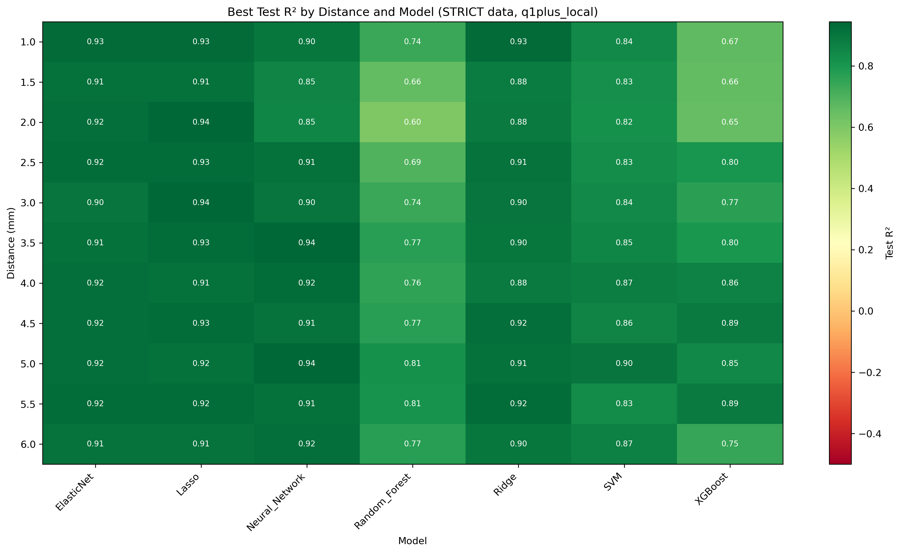
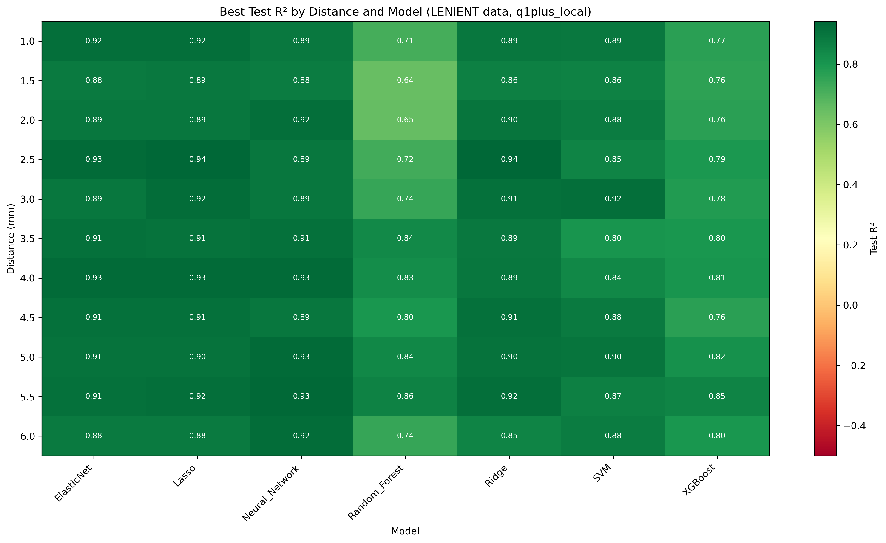
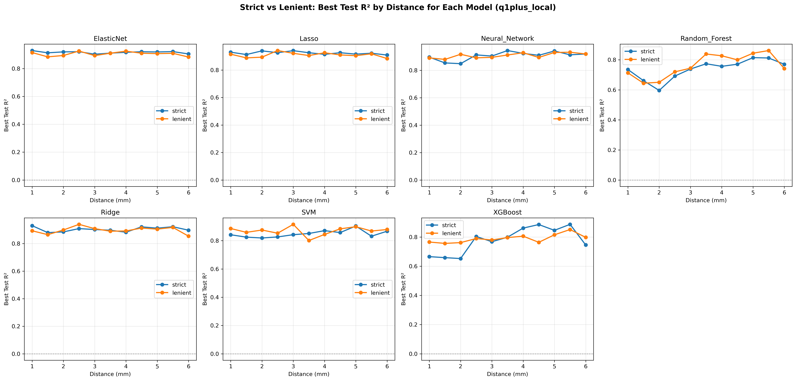
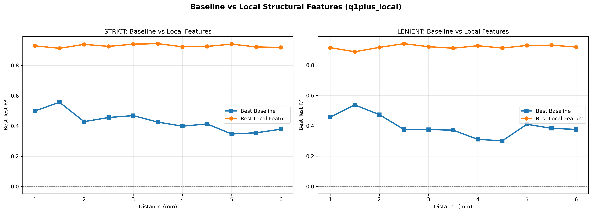

# SR0530 ML 超参数寻优报告：加入局部结构特征（≥1 象限可用（放宽，outer merge 取平均）+ 局部结构特征）

> **目标**：在 q1plus 报告的正常 R² 方案基础上，加入局部结构特征，评估其对各距离、各模型预测能力的提升。

> **搜索策略**：Random Search + GroupKFold by Subject，每模型 30 组参数

> **象限策略**：≥1 象限可用（放宽，outer merge 取平均）+ 局部结构特征

> **数据组**：`CleanDataRoi_strict/`（任意 ROI >7000 剔除）和 `CleanDataRoi_lenient/`（距离平均 >7000 剔除）

> **置信区间说明**：Test R² 与 RMSE 后的 95% CI 基于 5-fold CV 的 fold-level 标准差，使用 t 分布近似（t₀.₀₂₅,₄ = 2.776）。

---

## 一、特征方案说明

### 基线方案

| 方案 | 特征 | 说明 |
|------|------|------|
| A1_Biomechanical_Core | AL, Age, Gender | 生物力学核心 |
| A2_Biomechanical_NoK | AL, ACD, Age, Gender | 生物力学（不含 K） |
| B_Clinical | SE, Age, Gender | 临床方案 |
| C1_Combined | SE, AL, Age, Gender | 联合方案 |

### 局部结构特征

| 特征 | 含义 |
|------|------|
| Cone spacing | 锥细胞间距 |
| Cone dispersion | 锥细胞离散度 |
| Cone regularity | 锥细胞规则性 |
| Blood Vessel Ratio | 血管比例 |

### 新增方案

| 方案 | 特征 | 说明 |
|------|------|------|
| D1_Local_Core | Cone dispersion, Cone regularity | 仅局部核心特征 |
| D2_Local_Full | Cone spacing, Cone dispersion, Cone regularity, Blood Vessel Ratio | 全部局部特征 |
| E1_A1_Local_Core | A1 + Cone dispersion, Cone regularity | A1 加入局部核心特征 |
| E2_A2_Local_Core | A2 + Cone dispersion, Cone regularity | A2 加入局部核心特征 |
| E3_C1_Local_Core | C1 + Cone dispersion, Cone regularity | C1 加入局部核心特征 |
| F1_A1_Local_Full | A1 + 全部局部特征 | A1 加入全部局部特征 |
| F2_A2_Local_Full | A2 + 全部局部特征 | A2 加入全部局部特征 |
| F3_C1_Local_Full | C1 + 全部局部特征 | C1 加入全部局部特征 |

## 二、参数搜索空间

| 模型 | 参数 | 搜索范围 |
|------|------|---------|
| SVM | C | 100, 500, 1000, 2000, 5000 |
| SVM | epsilon | 100, 300, 500, 800, 1000 |
| SVM | gamma | 0.001, 0.005, 0.01, 0.03, 0.05, 0.1 |
| Random_Forest | n_estimators | 50, 100, 200, 300 |
| Random_Forest | max_depth | 2, 3, 4, 5, None |
| Random_Forest | min_samples_split | 2, 5, 10 |
| Random_Forest | min_samples_leaf | 1, 2, 4 |
| XGBoost | learning_rate | 0.001, 0.005, 0.01, 0.05, 0.1 |
| XGBoost | max_depth | 1, 2, 3, 4 |
| XGBoost | n_estimators | 30, 50, 100, 200 |
| XGBoost | reg_alpha | 0.1, 0.5, 1.0, 2.0 |
| XGBoost | reg_lambda | 0.1, 0.5, 1.0, 2.0 |
| Neural_Network | hidden_layer_sizes | (40,), (60,), (80,), (100,), (80, 40) |
| Neural_Network | alpha | 0.1, 0.3, 0.5, 1.0 |
| Neural_Network | learning_rate_init | 0.0001, 0.0005, 0.001 |
| Lasso | alpha | 0.001, 0.01, 0.1, 1.0, 10.0 |
| ElasticNet | alpha | 0.001, 0.01, 0.1, 1.0 |
| ElasticNet | l1_ratio | 0.1, 0.3, 0.5, 0.7, 0.9 |
| Ridge | alpha | 0.01, 0.1, 1.0, 10.0, 100.0 |

## 三、总体最佳配置

- **数据组**：strict
- **距离**：3.5 mm
- **方案**：F3_C1_Local_Full
- **模型**：Neural_Network
- **最佳 Test R²**：0.944 [95% CI: 0.932, 0.957]
- **最佳 RMSE**：152.3 [95% CI: 107.4, 197.3]
- **最佳参数**：{'hidden_layer_sizes': (80,), 'alpha': 0.5, 'learning_rate_init': 0.001}
- **样本量**：69 眼 / 44 subjects

## 四、基线 vs 局部特征：总体对比

| 数据组 | 模型 | 平均 ΔR² | 最大 ΔR² | 最小 ΔR² | 改善距离数 / 总数 |
|--------|------|---------|---------|---------|------------------|
| lenient | ElasticNet | 0.5549 | 0.6669 | 0.3551 | 11 / 11 |
| lenient | Lasso | 0.5453 | 0.6339 | 0.3503 | 11 / 11 |
| lenient | Neural_Network | 0.5722 | 0.6681 | 0.4920 | 11 / 11 |
| lenient | Random_Forest | 0.4156 | 0.6065 | 0.1385 | 11 / 11 |
| lenient | Ridge | 0.5742 | 0.6514 | 0.4663 | 11 / 11 |
| lenient | SVM | 0.5330 | 0.6211 | 0.4283 | 11 / 11 |
| lenient | XGBoost | 0.4456 | 0.5687 | 0.3152 | 11 / 11 |
| strict | ElasticNet | 0.5491 | 0.6067 | 0.4537 | 11 / 11 |
| strict | Lasso | 0.5296 | 0.6092 | 0.4304 | 11 / 11 |
| strict | Neural_Network | 0.5566 | 0.6441 | 0.4393 | 11 / 11 |
| strict | Random_Forest | 0.3679 | 0.5052 | 0.1041 | 11 / 11 |
| strict | Ridge | 0.4893 | 0.5771 | 0.4217 | 11 / 11 |
| strict | SVM | 0.4989 | 0.6119 | 0.4181 | 11 / 11 |
| strict | XGBoost | 0.4962 | 0.7326 | 0.2518 | 11 / 11 |

### 按距离汇总

| 数据组 | 距离 (mm) | 平均 ΔR² | 最大 ΔR² | 改善模型数 / 总数 |
|--------|----------|---------|---------|------------------|
| lenient | 1.0 | 0.4357 | 0.5355 | 7 / 7 |
| lenient | 1.5 | 0.3692 | 0.5033 | 7 / 7 |
| lenient | 2.0 | 0.4282 | 0.5450 | 7 / 7 |
| lenient | 2.5 | 0.5430 | 0.6514 | 7 / 7 |
| lenient | 3.0 | 0.5345 | 0.6211 | 7 / 7 |
| lenient | 3.5 | 0.5662 | 0.6566 | 7 / 7 |
| lenient | 4.0 | 0.6087 | 0.6681 | 7 / 7 |
| lenient | 4.5 | 0.6037 | 0.6519 | 7 / 7 |
| lenient | 5.0 | 0.5441 | 0.6056 | 7 / 7 |
| lenient | 5.5 | 0.5617 | 0.6289 | 7 / 7 |
| lenient | 6.0 | 0.5264 | 0.6116 | 7 / 7 |
| strict | 1.0 | 0.4075 | 0.4863 | 7 / 7 |
| strict | 1.5 | 0.3758 | 0.5011 | 7 / 7 |
| strict | 2.0 | 0.4254 | 0.5443 | 7 / 7 |
| strict | 2.5 | 0.4595 | 0.5499 | 7 / 7 |
| strict | 3.0 | 0.4432 | 0.5335 | 7 / 7 |
| strict | 3.5 | 0.5358 | 0.6651 | 7 / 7 |
| strict | 4.0 | 0.5768 | 0.7326 | 7 / 7 |
| strict | 4.5 | 0.5555 | 0.6515 | 7 / 7 |
| strict | 5.0 | 0.5902 | 0.6876 | 7 / 7 |
| strict | 5.5 | 0.5710 | 0.6300 | 7 / 7 |
| strict | 6.0 | 0.5398 | 0.6092 | 7 / 7 |

## 五、每个数据组的最佳结果（按距离）

### STRICT 数据组

| 距离 (mm) | 最佳方案 | 最佳模型 | Test R² (95% CI) | MAPE (%) | RMSE (95% CI) | Gap | 最佳参数 |
|-----------|---------|---------|------------------|----------|----------------|-----|---------|
| 1.0 | F3_C1_Local_Full | Lasso | 0.930 [0.914, 0.945] | 3.92 | 181.2 [100.1, 262.4] | 0.029 | `{'alpha': 0.001}` |
| 1.5 | F3_C1_Local_Full | ElasticNet | 0.913 [0.842, 0.985] | 3.82 | 162.6 [68.3, 256.8] | 0.047 | `{'alpha': 0.01, 'l1_ratio': 0.7}` |
| 2.0 | F3_C1_Local_Full | Lasso | 0.939 [0.926, 0.953] | 3.21 | 128.9 [78.7, 179.2] | 0.025 | `{'alpha': 1.0}` |
| 2.5 | F1_A1_Local_Full | Lasso | 0.926 [0.864, 0.988] | 4.01 | 130.9 [90.5, 171.3] | 0.043 | `{'alpha': 1.0}` |
| 3.0 | F3_C1_Local_Full | Lasso | 0.941 [0.908, 0.974] | 4.19 | 146.7 [90.6, 202.8] | 0.029 | `{'alpha': 10.0}` |
| 3.5 | F3_C1_Local_Full | Neural_Network | 0.944 [0.932, 0.957] | 5.90 | 152.3 [107.4, 197.3] | 0.047 | `{'hidden_layer_sizes': (80,), 'alpha': 0.5, 'learning_rate_init': 0.001}` |
| 4.0 | F3_C1_Local_Full | Neural_Network | 0.923 [0.853, 0.994] | 5.54 | 145.2 [86.2, 204.2] | 0.070 | `{'hidden_layer_sizes': (80, 40), 'alpha': 0.3, 'learning_rate_init': 0.001}` |
| 4.5 | F3_C1_Local_Full | Lasso | 0.926 [0.885, 0.966] | 7.24 | 181.0 [131.1, 230.9] | 0.029 | `{'alpha': 10.0}` |
| 5.0 | F3_C1_Local_Full | Neural_Network | 0.941 [0.884, 0.999] | 6.44 | 161.8 [77.1, 246.5] | 0.053 | `{'hidden_layer_sizes': (80,), 'alpha': 0.5, 'learning_rate_init': 0.001}` |
| 5.5 | F3_C1_Local_Full | Lasso | 0.922 [0.889, 0.956] | 9.13 | 201.8 [125.2, 278.4] | 0.032 | `{'alpha': 0.1}` |
| 6.0 | F3_C1_Local_Full | Neural_Network | 0.919 [0.873, 0.966] | 8.98 | 241.5 [145.7, 337.4] | 0.072 | `{'hidden_layer_sizes': (80,), 'alpha': 0.5, 'learning_rate_init': 0.001}` |

### LENIENT 数据组

| 距离 (mm) | 最佳方案 | 最佳模型 | Test R² (95% CI) | MAPE (%) | RMSE (95% CI) | Gap | 最佳参数 |
|-----------|---------|---------|------------------|----------|----------------|-----|---------|
| 1.0 | F2_A2_Local_Full | ElasticNet | 0.915 [0.856, 0.975] | 3.37 | 188.2 [131.9, 244.4] | 0.046 | `{'alpha': 0.1, 'l1_ratio': 0.9}` |
| 1.5 | F3_C1_Local_Full | Lasso | 0.888 [0.839, 0.938] | 4.76 | 223.6 [80.8, 366.5] | 0.039 | `{'alpha': 10.0}` |
| 2.0 | F3_C1_Local_Full | Neural_Network | 0.917 [0.862, 0.972] | 4.28 | 174.4 [72.7, 276.0] | 0.076 | `{'hidden_layer_sizes': (80, 40), 'alpha': 0.3, 'learning_rate_init': 0.0005}` |
| 2.5 | F1_A1_Local_Full | Lasso | 0.942 [0.916, 0.967] | 4.10 | 140.4 [77.3, 203.4] | 0.017 | `{'alpha': 0.1}` |
| 3.0 | F3_C1_Local_Full | Lasso | 0.922 [0.871, 0.972] | 5.57 | 176.9 [83.0, 270.8] | 0.022 | `{'alpha': 10.0}` |
| 3.5 | F3_C1_Local_Full | Neural_Network | 0.912 [0.884, 0.939] | 6.06 | 187.1 [130.3, 243.9] | 0.077 | `{'hidden_layer_sizes': (80,), 'alpha': 0.5, 'learning_rate_init': 0.001}` |
| 4.0 | F3_C1_Local_Full | Neural_Network | 0.928 [0.880, 0.976] | 6.55 | 187.7 [84.8, 290.6] | 0.029 | `{'hidden_layer_sizes': (80,), 'alpha': 1.0, 'learning_rate_init': 0.001}` |
| 4.5 | F3_C1_Local_Full | Ridge | 0.913 [0.884, 0.941] | 7.67 | 193.5 [121.3, 265.6] | 0.031 | `{'alpha': 1.0}` |
| 5.0 | F3_C1_Local_Full | Neural_Network | 0.930 [0.903, 0.957] | 7.73 | 201.3 [123.8, 278.9] | 0.059 | `{'hidden_layer_sizes': (80,), 'alpha': 0.5, 'learning_rate_init': 0.001}` |
| 5.5 | F3_C1_Local_Full | Neural_Network | 0.932 [0.860, 1.004] | 6.42 | 175.2 [72.7, 277.6] | 0.052 | `{'hidden_layer_sizes': (100,), 'alpha': 1.0, 'learning_rate_init': 0.001}` |
| 6.0 | F2_A2_Local_Full | Neural_Network | 0.919 [0.894, 0.944] | 7.72 | 232.2 [173.8, 290.5] | 0.070 | `{'hidden_layer_sizes': (80,), 'alpha': 0.5, 'learning_rate_init': 0.001}` |

## 六、每个模型在每个数据组的最佳结果

| 数据组 | 模型 | 最佳距离 | 最佳方案 | Test R² (95% CI) | MAPE (%) | 最佳参数 |
|--------|------|---------|---------|------------------|----------|---------|
| strict | ElasticNet | 1.0 mm | F3_C1_Local_Full | 0.930 [0.914, 0.945] | 3.92 | `{'alpha': 0.001, 'l1_ratio': 0.3}` |
| strict | Lasso | 3.0 mm | F3_C1_Local_Full | 0.941 [0.908, 0.974] | 4.19 | `{'alpha': 10.0}` |
| strict | Neural_Network | 3.5 mm | F3_C1_Local_Full | 0.944 [0.932, 0.957] | 5.90 | `{'hidden_layer_sizes': (80,), 'alpha': 0.5, 'learning_rate_init': 0.001}` |
| strict | Random_Forest | 5.0 mm | F3_C1_Local_Full | 0.815 [0.725, 0.904] | 10.02 | `{'n_estimators': 200, 'max_depth': None, 'min_samples_split': 5, 'min_samples_leaf': 1}` |
| strict | Ridge | 1.0 mm | F3_C1_Local_Full | 0.930 [0.914, 0.945] | 3.92 | `{'alpha': 0.01}` |
| strict | SVM | 5.0 mm | F3_C1_Local_Full | 0.904 [0.864, 0.943] | 6.88 | `{'C': 5000, 'epsilon': 100, 'gamma': 0.05}` |
| strict | XGBoost | 5.5 mm | F2_A2_Local_Full | 0.887 [0.836, 0.939] | 9.17 | `{'learning_rate': 0.1, 'max_depth': 1, 'n_estimators': 100, 'reg_alpha': 0.5, 'reg_lambda': 2.0}` |
| lenient | ElasticNet | 2.5 mm | F2_A2_Local_Full | 0.926 [0.903, 0.950] | 3.98 | `{'alpha': 0.1, 'l1_ratio': 0.9}` |
| lenient | Lasso | 2.5 mm | F1_A1_Local_Full | 0.942 [0.916, 0.967] | 4.10 | `{'alpha': 0.1}` |
| lenient | Neural_Network | 5.5 mm | F3_C1_Local_Full | 0.932 [0.860, 1.004] | 6.42 | `{'hidden_layer_sizes': (100,), 'alpha': 1.0, 'learning_rate_init': 0.001}` |
| lenient | Random_Forest | 5.5 mm | F3_C1_Local_Full | 0.862 [0.777, 0.947] | 9.26 | `{'n_estimators': 100, 'max_depth': 5, 'min_samples_split': 2, 'min_samples_leaf': 1}` |
| lenient | Ridge | 2.5 mm | F1_A1_Local_Full | 0.939 [0.909, 0.970] | 4.21 | `{'alpha': 1.0}` |
| lenient | SVM | 3.0 mm | F1_A1_Local_Full | 0.916 [0.881, 0.950] | 6.43 | `{'C': 5000, 'epsilon': 100, 'gamma': 0.05}` |
| lenient | XGBoost | 5.5 mm | F3_C1_Local_Full | 0.852 [0.761, 0.942] | 10.02 | `{'learning_rate': 0.1, 'max_depth': 4, 'n_estimators': 30, 'reg_alpha': 0.1, 'reg_lambda': 1.0}` |

## 七、每个特征方案的最佳结果

| 方案 | 数据组 | 最佳距离 | 最佳模型 | Test R² (95% CI) |
|------|--------|---------|---------|------------------|
| A1_Biomechanical_Core | strict | 1.5 mm | Random_Forest | 0.512 [0.344, 0.679] |
| A2_Biomechanical_NoK | strict | 1.5 mm | Random_Forest | 0.557 [0.375, 0.739] |
| B_Clinical | lenient | 5.5 mm | XGBoost | 0.369 [0.165, 0.572] |
| C1_Combined | lenient | 1.5 mm | Lasso | 0.538 [0.312, 0.764] |
| D1_Local_Core | lenient | 3.0 mm | ElasticNet | 0.229 [0.018, 0.440] |
| D2_Local_Full | lenient | 5.0 mm | Random_Forest | 0.782 [0.599, 0.965] |
| E1_A1_Local_Core | strict | 3.0 mm | Random_Forest | 0.558 [0.387, 0.730] |
| E2_A2_Local_Core | strict | 1.5 mm | Random_Forest | 0.556 [0.312, 0.801] |
| E3_C1_Local_Core | lenient | 2.0 mm | Random_Forest | 0.563 [0.340, 0.786] |
| F1_A1_Local_Full | lenient | 2.5 mm | Lasso | 0.942 [0.916, 0.967] |
| F2_A2_Local_Full | strict | 5.0 mm | Neural_Network | 0.937 [0.895, 0.980] |
| F3_C1_Local_Full | strict | 3.5 mm | Neural_Network | 0.944 [0.932, 0.957] |

## 八、全部详细结果

| 数据组 | 距离 | 方案 | 模型 | N_Eyes | N_Subj | Train R² | Test R² (95% CI) | Corr | MAPE | RMSE (95% CI) | Gap | 最佳参数 |
|--------|------|------|------|--------|--------|----------|------------------|------|------|----------------|-----|---------|
| strict | 1.0 | A1_Biomechanical_Core | SVM | 69 | 44 | 0.359 | 0.262 [-0.067, 0.591] | 0.701 | 10.77 | 475.8 [312.4, 639.1] | 0.097 | `{'C': 500, 'epsilon': 800, 'gamma': 0.1}` |
| strict | 1.0 | A1_Biomechanical_Core | Random_Forest | 69 | 44 | 0.731 | 0.356 [-0.051, 0.763] | 0.667 | 10.92 | 509.8 [428.0, 591.5] | 0.375 | `{'n_estimators': 100, 'max_depth': 2, 'min_samples_split': 5, 'min_samples_leaf': 1}` |
| strict | 1.0 | A1_Biomechanical_Core | XGBoost | 69 | 44 | 0.764 | 0.408 [0.121, 0.695] | 0.684 | 9.24 | 422.2 [289.0, 555.4] | 0.355 | `{'learning_rate': 0.05, 'max_depth': 2, 'n_estimators': 100, 'reg_alpha': 2.0, 'reg_lambda': 1.0}` |
| strict | 1.0 | A1_Biomechanical_Core | Neural_Network | 69 | 44 | 0.576 | 0.436 [0.159, 0.713] | 0.683 | 9.17 | 413.6 [271.1, 556.2] | 0.140 | `{'hidden_layer_sizes': (100,), 'alpha': 0.5, 'learning_rate_init': 0.0001}` |
| strict | 1.0 | A1_Biomechanical_Core | Lasso | 69 | 44 | 0.552 | 0.499 [0.291, 0.707] | 0.721 | 8.51 | 391.2 [271.5, 510.8] | 0.053 | `{'alpha': 0.01}` |
| strict | 1.0 | A1_Biomechanical_Core | ElasticNet | 69 | 44 | 0.571 | 0.476 [0.263, 0.689] | 0.709 | 10.38 | 475.6 [301.3, 649.9] | 0.095 | `{'alpha': 0.001, 'l1_ratio': 0.3}` |
| strict | 1.0 | A1_Biomechanical_Core | Ridge | 69 | 44 | 0.552 | 0.499 [0.291, 0.707] | 0.721 | 8.51 | 391.2 [271.4, 511.0] | 0.053 | `{'alpha': 0.1}` |
| strict | 1.0 | A2_Biomechanical_NoK | SVM | 69 | 44 | 0.378 | 0.288 [0.041, 0.534] | 0.654 | 10.41 | 471.7 [311.0, 632.4] | 0.091 | `{'C': 500, 'epsilon': 800, 'gamma': 0.1}` |
| strict | 1.0 | A2_Biomechanical_NoK | Random_Forest | 69 | 44 | 0.810 | 0.336 [-0.026, 0.697] | 0.648 | 9.67 | 445.4 [340.0, 550.9] | 0.474 | `{'n_estimators': 100, 'max_depth': 3, 'min_samples_split': 5, 'min_samples_leaf': 1}` |
| strict | 1.0 | A2_Biomechanical_NoK | XGBoost | 69 | 44 | 0.820 | 0.357 [-0.015, 0.729] | 0.614 | 9.75 | 435.4 [289.6, 581.1] | 0.463 | `{'learning_rate': 0.05, 'max_depth': 2, 'n_estimators': 100, 'reg_alpha': 2.0, 'reg_lambda': 1.0}` |
| strict | 1.0 | A2_Biomechanical_NoK | Neural_Network | 69 | 44 | 0.480 | 0.355 [0.083, 0.628] | 0.629 | 9.31 | 441.7 [307.2, 576.2] | 0.125 | `{'hidden_layer_sizes': (100,), 'alpha': 0.5, 'learning_rate_init': 0.0001}` |
| strict | 1.0 | A2_Biomechanical_NoK | Lasso | 69 | 44 | 0.565 | 0.491 [0.258, 0.725] | 0.719 | 8.62 | 392.3 [275.7, 508.8] | 0.073 | `{'alpha': 0.01}` |
| strict | 1.0 | A2_Biomechanical_NoK | ElasticNet | 69 | 44 | 0.579 | 0.453 [0.197, 0.709] | 0.689 | 10.53 | 485.3 [293.3, 677.3] | 0.126 | `{'alpha': 0.001, 'l1_ratio': 0.3}` |
| strict | 1.0 | A2_Biomechanical_NoK | Ridge | 69 | 44 | 0.565 | 0.492 [0.258, 0.725] | 0.719 | 8.62 | 392.2 [275.5, 508.9] | 0.073 | `{'alpha': 0.1}` |
| strict | 1.0 | B_Clinical | SVM | 69 | 44 | 0.350 | 0.256 [0.040, 0.471] | 0.671 | 10.59 | 480.4 [343.3, 617.5] | 0.094 | `{'C': 500, 'epsilon': 800, 'gamma': 0.1}` |
| strict | 1.0 | B_Clinical | Random_Forest | 69 | 44 | 0.781 | 0.272 [0.022, 0.522] | 0.624 | 11.72 | 524.2 [385.9, 662.4] | 0.509 | `{'n_estimators': 300, 'max_depth': None, 'min_samples_split': 2, 'min_samples_leaf': 2}` |
| strict | 1.0 | B_Clinical | XGBoost | 69 | 44 | 0.528 | 0.356 [0.209, 0.504] | 0.667 | 11.39 | 494.1 [386.1, 602.2] | 0.172 | `{'learning_rate': 0.05, 'max_depth': 1, 'n_estimators': 50, 'reg_alpha': 2.0, 'reg_lambda': 0.1}` |
| strict | 1.0 | B_Clinical | Neural_Network | 69 | 44 | 0.509 | 0.263 [0.012, 0.515] | 0.618 | 12.44 | 567.6 [383.9, 751.4] | 0.246 | `{'hidden_layer_sizes': (60,), 'alpha': 1.0, 'learning_rate_init': 0.0005}` |
| strict | 1.0 | B_Clinical | Lasso | 69 | 44 | 0.489 | 0.300 [0.066, 0.533] | 0.665 | 11.67 | 550.5 [385.8, 715.2] | 0.189 | `{'alpha': 0.001}` |
| strict | 1.0 | B_Clinical | ElasticNet | 69 | 44 | 0.489 | 0.300 [0.067, 0.533] | 0.665 | 11.67 | 550.5 [385.6, 715.4] | 0.189 | `{'alpha': 0.001, 'l1_ratio': 0.3}` |
| strict | 1.0 | B_Clinical | Ridge | 69 | 44 | 0.552 | 0.308 [-0.176, 0.792] | 0.669 | 10.41 | 447.5 [298.3, 596.8] | 0.244 | `{'alpha': 10.0}` |
| strict | 1.0 | C1_Combined | SVM | 69 | 44 | 0.512 | 0.356 [0.079, 0.633] | 0.681 | 11.33 | 491.3 [332.7, 649.9] | 0.157 | `{'C': 5000, 'epsilon': 300, 'gamma': 0.005}` |
| strict | 1.0 | C1_Combined | Random_Forest | 69 | 44 | 0.753 | 0.375 [0.057, 0.693] | 0.690 | 11.16 | 512.7 [422.9, 602.5] | 0.378 | `{'n_estimators': 100, 'max_depth': 2, 'min_samples_split': 5, 'min_samples_leaf': 1}` |
| strict | 1.0 | C1_Combined | XGBoost | 69 | 44 | 0.825 | 0.414 [0.036, 0.792] | 0.680 | 8.95 | 414.9 [246.4, 583.4] | 0.411 | `{'learning_rate': 0.05, 'max_depth': 2, 'n_estimators': 100, 'reg_alpha': 2.0, 'reg_lambda': 1.0}` |
| strict | 1.0 | C1_Combined | Neural_Network | 69 | 44 | 0.576 | 0.457 [0.289, 0.624] | 0.706 | 10.25 | 489.8 [320.3, 659.2] | 0.119 | `{'hidden_layer_sizes': (60,), 'alpha': 1.0, 'learning_rate_init': 0.0005}` |
| strict | 1.0 | C1_Combined | Lasso | 69 | 44 | 0.582 | 0.467 [0.229, 0.705] | 0.709 | 10.22 | 475.7 [299.2, 652.1] | 0.115 | `{'alpha': 0.001}` |
| strict | 1.0 | C1_Combined | ElasticNet | 69 | 44 | 0.582 | 0.467 [0.229, 0.705] | 0.709 | 10.22 | 475.6 [299.1, 652.1] | 0.115 | `{'alpha': 0.001, 'l1_ratio': 0.3}` |
| strict | 1.0 | C1_Combined | Ridge | 69 | 44 | 0.582 | 0.467 [0.229, 0.705] | 0.709 | 10.22 | 475.6 [299.2, 652.1] | 0.115 | `{'alpha': 0.01}` |
| strict | 1.0 | D1_Local_Core | SVM | 69 | 44 | 0.041 | -0.007 [-0.099, 0.085] | 0.301 | 13.15 | 584.5 [376.3, 792.6] | 0.049 | `{'C': 5000, 'epsilon': 800, 'gamma': 0.001}` |
| strict | 1.0 | D1_Local_Core | Random_Forest | 69 | 44 | 0.564 | -0.048 [-0.707, 0.610] | 0.297 | 12.08 | 604.9 [388.1, 821.7] | 0.612 | `{'n_estimators': 100, 'max_depth': 4, 'min_samples_split': 10, 'min_samples_leaf': 1}` |
| strict | 1.0 | D1_Local_Core | XGBoost | 69 | 44 | 0.018 | -0.074 [-0.154, 0.005] | nan | 14.93 | 691.1 [479.8, 902.4] | 0.093 | `{'learning_rate': 0.001, 'max_depth': 1, 'n_estimators': 100, 'reg_alpha': 0.1, 'reg_lambda': 2.0}` |
| strict | 1.0 | D1_Local_Core | Neural_Network | 69 | 44 | 0.017 | -0.092 [-0.299, 0.116] | 0.127 | 13.00 | 599.0 [398.7, 799.3] | 0.109 | `{'hidden_layer_sizes': (80,), 'alpha': 1.0, 'learning_rate_init': 0.0001}` |
| strict | 1.0 | D1_Local_Core | Lasso | 69 | 44 | 0.079 | -0.063 [-0.202, 0.076] | 0.285 | 13.66 | 593.9 [396.4, 791.3] | 0.142 | `{'alpha': 0.1}` |
| strict | 1.0 | D1_Local_Core | ElasticNet | 69 | 44 | 0.079 | -0.063 [-0.202, 0.076] | 0.285 | 13.66 | 593.8 [396.4, 791.3] | 0.142 | `{'alpha': 0.01, 'l1_ratio': 0.9}` |
| strict | 1.0 | D1_Local_Core | Ridge | 69 | 44 | 0.079 | -0.062 [-0.198, 0.075] | 0.286 | 13.65 | 593.6 [396.0, 791.2] | 0.141 | `{'alpha': 1.0}` |
| strict | 1.0 | D2_Local_Full | SVM | 69 | 44 | 0.205 | 0.051 [-0.194, 0.296] | 0.308 | 13.12 | 608.5 [486.3, 730.7] | 0.154 | `{'C': 2000, 'epsilon': 300, 'gamma': 0.005}` |
| strict | 1.0 | D2_Local_Full | Random_Forest | 69 | 44 | 0.692 | 0.235 [0.004, 0.465] | 0.597 | 11.56 | 577.8 [358.3, 797.3] | 0.457 | `{'n_estimators': 200, 'max_depth': 4, 'min_samples_split': 2, 'min_samples_leaf': 4}` |
| strict | 1.0 | D2_Local_Full | XGBoost | 69 | 44 | 0.699 | 0.316 [0.113, 0.519] | 0.665 | 10.74 | 485.2 [351.8, 618.6] | 0.383 | `{'learning_rate': 0.05, 'max_depth': 2, 'n_estimators': 50, 'reg_alpha': 0.5, 'reg_lambda': 2.0}` |
| strict | 1.0 | D2_Local_Full | Neural_Network | 69 | 44 | 0.345 | -0.012 [-0.455, 0.432] | 0.311 | 13.11 | 615.9 [466.8, 764.9] | 0.357 | `{'hidden_layer_sizes': (100,), 'alpha': 0.3, 'learning_rate_init': 0.0005}` |
| strict | 1.0 | D2_Local_Full | Lasso | 69 | 44 | 0.217 | -0.008 [-0.217, 0.200] | 0.442 | 12.13 | 566.0 [404.4, 727.6] | 0.225 | `{'alpha': 10.0}` |
| strict | 1.0 | D2_Local_Full | ElasticNet | 69 | 44 | 0.282 | 0.035 [-0.274, 0.344] | 0.384 | 13.66 | 637.7 [493.2, 782.2] | 0.247 | `{'alpha': 1.0, 'l1_ratio': 0.3}` |
| strict | 1.0 | D2_Local_Full | Ridge | 69 | 44 | 0.197 | 0.062 [-0.135, 0.260] | 0.443 | 12.61 | 565.0 [476.6, 653.4] | 0.134 | `{'alpha': 100.0}` |
| strict | 1.0 | E1_A1_Local_Core | SVM | 69 | 44 | 0.805 | 0.291 [-0.272, 0.854] | 0.670 | 8.86 | 451.3 [300.6, 602.0] | 0.514 | `{'C': 5000, 'epsilon': 100, 'gamma': 0.05}` |
| strict | 1.0 | E1_A1_Local_Core | Random_Forest | 69 | 44 | 0.887 | 0.459 [0.275, 0.642] | 0.715 | 9.34 | 451.7 [330.6, 572.8] | 0.429 | `{'n_estimators': 300, 'max_depth': None, 'min_samples_split': 2, 'min_samples_leaf': 2}` |
| strict | 1.0 | E1_A1_Local_Core | XGBoost | 69 | 44 | 0.801 | 0.446 [0.267, 0.625] | 0.770 | 9.41 | 419.8 [339.2, 500.4] | 0.355 | `{'learning_rate': 0.1, 'max_depth': 1, 'n_estimators': 100, 'reg_alpha': 0.5, 'reg_lambda': 2.0}` |
| strict | 1.0 | E1_A1_Local_Core | Neural_Network | 69 | 44 | 0.797 | 0.468 [0.403, 0.533] | 0.766 | 10.47 | 503.8 [341.8, 665.8] | 0.329 | `{'hidden_layer_sizes': (100,), 'alpha': 1.0, 'learning_rate_init': 0.0001}` |
| strict | 1.0 | E1_A1_Local_Core | Lasso | 69 | 44 | 0.602 | 0.482 [0.179, 0.785] | 0.694 | 10.01 | 466.3 [260.4, 672.1] | 0.120 | `{'alpha': 0.001}` |
| strict | 1.0 | E1_A1_Local_Core | ElasticNet | 69 | 44 | 0.602 | 0.482 [0.180, 0.785] | 0.694 | 10.01 | 466.2 [260.2, 672.2] | 0.120 | `{'alpha': 0.001, 'l1_ratio': 0.3}` |
| strict | 1.0 | E1_A1_Local_Core | Ridge | 69 | 44 | 0.602 | 0.482 [0.179, 0.785] | 0.694 | 10.01 | 466.2 [260.3, 672.2] | 0.120 | `{'alpha': 0.01}` |
| strict | 1.0 | E2_A2_Local_Core | SVM | 69 | 44 | 0.373 | 0.224 [-0.023, 0.470] | 0.648 | 10.97 | 492.5 [332.9, 652.2] | 0.149 | `{'C': 500, 'epsilon': 800, 'gamma': 0.1}` |
| strict | 1.0 | E2_A2_Local_Core | Random_Forest | 69 | 44 | 0.776 | 0.442 [0.319, 0.566] | 0.731 | 10.54 | 477.2 [276.5, 677.8] | 0.334 | `{'n_estimators': 300, 'max_depth': None, 'min_samples_split': 10, 'min_samples_leaf': 4}` |
| strict | 1.0 | E2_A2_Local_Core | XGBoost | 69 | 44 | 0.900 | 0.421 [0.084, 0.757] | 0.706 | 8.16 | 411.2 [288.2, 534.1] | 0.480 | `{'learning_rate': 0.05, 'max_depth': 2, 'n_estimators': 100, 'reg_alpha': 2.0, 'reg_lambda': 1.0}` |
| strict | 1.0 | E2_A2_Local_Core | Neural_Network | 69 | 44 | 0.742 | 0.280 [-0.149, 0.709] | 0.547 | 11.81 | 578.3 [190.4, 966.2] | 0.461 | `{'hidden_layer_sizes': (60,), 'alpha': 1.0, 'learning_rate_init': 0.0005}` |
| strict | 1.0 | E2_A2_Local_Core | Lasso | 69 | 44 | 0.619 | 0.461 [0.179, 0.744] | 0.734 | 8.18 | 398.3 [286.0, 510.6] | 0.158 | `{'alpha': 0.01}` |
| strict | 1.0 | E2_A2_Local_Core | ElasticNet | 69 | 44 | 0.618 | 0.428 [-0.003, 0.859] | 0.640 | 10.07 | 485.1 [239.4, 730.7] | 0.190 | `{'alpha': 0.001, 'l1_ratio': 0.3}` |
| strict | 1.0 | E2_A2_Local_Core | Ridge | 69 | 44 | 0.619 | 0.461 [0.179, 0.744] | 0.734 | 8.19 | 398.3 [286.0, 510.6] | 0.158 | `{'alpha': 0.1}` |
| strict | 1.0 | E3_C1_Local_Core | SVM | 69 | 44 | 0.554 | 0.315 [0.107, 0.524] | 0.625 | 11.38 | 504.9 [395.5, 614.3] | 0.238 | `{'C': 5000, 'epsilon': 300, 'gamma': 0.005}` |
| strict | 1.0 | E3_C1_Local_Core | Random_Forest | 69 | 44 | 0.895 | 0.491 [0.326, 0.656] | 0.730 | 9.37 | 437.9 [328.5, 547.3] | 0.404 | `{'n_estimators': 300, 'max_depth': None, 'min_samples_split': 2, 'min_samples_leaf': 2}` |
| strict | 1.0 | E3_C1_Local_Core | XGBoost | 69 | 44 | 0.909 | 0.432 [0.122, 0.742] | 0.743 | 8.34 | 407.1 [288.9, 525.2] | 0.476 | `{'learning_rate': 0.05, 'max_depth': 2, 'n_estimators': 100, 'reg_alpha': 2.0, 'reg_lambda': 1.0}` |
| strict | 1.0 | E3_C1_Local_Core | Neural_Network | 69 | 44 | 0.776 | 0.386 [0.273, 0.499] | 0.684 | 10.97 | 530.1 [318.5, 741.6] | 0.391 | `{'hidden_layer_sizes': (60,), 'alpha': 1.0, 'learning_rate_init': 0.0005}` |
| strict | 1.0 | E3_C1_Local_Core | Lasso | 69 | 44 | 0.609 | 0.459 [0.156, 0.763] | 0.692 | 9.84 | 473.9 [277.0, 670.7] | 0.150 | `{'alpha': 0.001}` |
| strict | 1.0 | E3_C1_Local_Core | ElasticNet | 69 | 44 | 0.609 | 0.459 [0.157, 0.762] | 0.692 | 9.84 | 473.8 [277.0, 670.7] | 0.150 | `{'alpha': 0.001, 'l1_ratio': 0.3}` |
| strict | 1.0 | E3_C1_Local_Core | Ridge | 69 | 44 | 0.609 | 0.459 [0.156, 0.763] | 0.692 | 9.84 | 473.9 [277.0, 670.7] | 0.150 | `{'alpha': 0.01}` |
| strict | 1.0 | F1_A1_Local_Full | SVM | 69 | 44 | 0.926 | 0.772 [0.674, 0.869] | 0.932 | 6.42 | 298.1 [255.2, 341.0] | 0.154 | `{'C': 1000, 'epsilon': 100, 'gamma': 0.03}` |
| strict | 1.0 | F1_A1_Local_Full | Random_Forest | 69 | 44 | 0.964 | 0.672 [0.500, 0.845] | 0.832 | 7.30 | 366.6 [255.6, 477.6] | 0.292 | `{'n_estimators': 300, 'max_depth': 5, 'min_samples_split': 2, 'min_samples_leaf': 1}` |
| strict | 1.0 | F1_A1_Local_Full | XGBoost | 69 | 44 | 0.931 | 0.666 [0.528, 0.804] | 0.871 | 7.35 | 320.5 [276.9, 364.2] | 0.265 | `{'learning_rate': 0.1, 'max_depth': 1, 'n_estimators': 100, 'reg_alpha': 0.5, 'reg_lambda': 2.0}` |
| strict | 1.0 | F1_A1_Local_Full | Neural_Network | 69 | 44 | 0.960 | 0.861 [0.814, 0.908] | 0.957 | 5.04 | 249.6 [154.9, 344.3] | 0.099 | `{'hidden_layer_sizes': (60,), 'alpha': 1.0, 'learning_rate_init': 0.0005}` |
| strict | 1.0 | F1_A1_Local_Full | Lasso | 69 | 44 | 0.947 | 0.903 [0.873, 0.933] | 0.965 | 4.48 | 210.3 [124.9, 295.8] | 0.044 | `{'alpha': 0.001}` |
| strict | 1.0 | F1_A1_Local_Full | ElasticNet | 69 | 44 | 0.947 | 0.903 [0.873, 0.933] | 0.965 | 4.48 | 210.5 [124.7, 296.3] | 0.044 | `{'alpha': 0.001, 'l1_ratio': 0.3}` |
| strict | 1.0 | F1_A1_Local_Full | Ridge | 69 | 44 | 0.947 | 0.903 [0.873, 0.933] | 0.965 | 4.48 | 210.4 [124.8, 295.9] | 0.044 | `{'alpha': 0.01}` |
| strict | 1.0 | F2_A2_Local_Full | SVM | 69 | 44 | 0.982 | 0.813 [0.720, 0.905] | 0.932 | 4.94 | 247.7 [152.8, 342.6] | 0.169 | `{'C': 5000, 'epsilon': 100, 'gamma': 0.05}` |
| strict | 1.0 | F2_A2_Local_Full | Random_Forest | 69 | 44 | 0.966 | 0.676 [0.510, 0.843] | 0.839 | 7.24 | 367.4 [248.5, 486.2] | 0.290 | `{'n_estimators': 300, 'max_depth': 5, 'min_samples_split': 2, 'min_samples_leaf': 1}` |
| strict | 1.0 | F2_A2_Local_Full | XGBoost | 69 | 44 | 0.991 | 0.665 [0.571, 0.759] | 0.849 | 7.34 | 360.8 [299.4, 422.2] | 0.326 | `{'learning_rate': 0.1, 'max_depth': 2, 'n_estimators': 100, 'reg_alpha': 0.1, 'reg_lambda': 2.0}` |
| strict | 1.0 | F2_A2_Local_Full | Neural_Network | 69 | 44 | 0.979 | 0.896 [0.853, 0.939] | 0.958 | 3.92 | 202.1 [135.0, 269.2] | 0.083 | `{'hidden_layer_sizes': (100,), 'alpha': 0.3, 'learning_rate_init': 0.0005}` |
| strict | 1.0 | F2_A2_Local_Full | Lasso | 69 | 44 | 0.956 | 0.918 [0.885, 0.952] | 0.970 | 4.20 | 196.7 [89.1, 304.4] | 0.038 | `{'alpha': 0.001}` |
| strict | 1.0 | F2_A2_Local_Full | ElasticNet | 69 | 44 | 0.956 | 0.918 [0.885, 0.952] | 0.970 | 4.20 | 196.6 [89.2, 304.1] | 0.038 | `{'alpha': 0.001, 'l1_ratio': 0.3}` |
| strict | 1.0 | F2_A2_Local_Full | Ridge | 69 | 44 | 0.956 | 0.918 [0.885, 0.952] | 0.970 | 4.20 | 196.7 [89.1, 304.3] | 0.038 | `{'alpha': 0.01}` |
| strict | 1.0 | F3_C1_Local_Full | SVM | 69 | 44 | 0.944 | 0.842 [0.778, 0.906] | 0.944 | 5.07 | 249.5 [205.6, 293.4] | 0.102 | `{'C': 1000, 'epsilon': 100, 'gamma': 0.03}` |
| strict | 1.0 | F3_C1_Local_Full | Random_Forest | 69 | 44 | 0.911 | 0.736 [0.635, 0.836] | 0.900 | 6.17 | 303.4 [160.8, 446.0] | 0.176 | `{'n_estimators': 100, 'max_depth': 3, 'min_samples_split': 5, 'min_samples_leaf': 1}` |
| strict | 1.0 | F3_C1_Local_Full | XGBoost | 69 | 44 | 0.939 | 0.666 [0.561, 0.771] | 0.864 | 7.20 | 323.9 [285.3, 362.4] | 0.273 | `{'learning_rate': 0.1, 'max_depth': 1, 'n_estimators': 100, 'reg_alpha': 0.5, 'reg_lambda': 2.0}` |
| strict | 1.0 | F3_C1_Local_Full | Neural_Network | 69 | 44 | 0.960 | 0.873 [0.766, 0.981] | 0.955 | 3.75 | 212.7 [107.5, 317.8] | 0.086 | `{'hidden_layer_sizes': (60,), 'alpha': 1.0, 'learning_rate_init': 0.0001}` |
| strict | 1.0 | F3_C1_Local_Full | Lasso | 69 | 44 | 0.959 | 0.930 [0.914, 0.945] | 0.971 | 3.92 | 181.2 [100.1, 262.4] | 0.029 | `{'alpha': 0.001}` |
| strict | 1.0 | F3_C1_Local_Full | ElasticNet | 69 | 44 | 0.959 | 0.930 [0.914, 0.945] | 0.971 | 3.92 | 181.4 [100.1, 262.6] | 0.029 | `{'alpha': 0.001, 'l1_ratio': 0.3}` |
| strict | 1.0 | F3_C1_Local_Full | Ridge | 69 | 44 | 0.959 | 0.930 [0.914, 0.945] | 0.971 | 3.92 | 181.3 [100.1, 262.4] | 0.029 | `{'alpha': 0.01}` |
| strict | 1.5 | A1_Biomechanical_Core | SVM | 69 | 44 | 0.509 | 0.407 [0.135, 0.679] | 0.721 | 9.16 | 393.7 [193.1, 594.3] | 0.102 | `{'C': 5000, 'epsilon': 300, 'gamma': 0.03}` |
| strict | 1.5 | A1_Biomechanical_Core | Random_Forest | 69 | 44 | 0.814 | 0.512 [0.344, 0.679] | 0.771 | 7.99 | 397.1 [242.5, 551.7] | 0.302 | `{'n_estimators': 100, 'max_depth': 3, 'min_samples_split': 5, 'min_samples_leaf': 1}` |
| strict | 1.5 | A1_Biomechanical_Core | XGBoost | 69 | 44 | 0.598 | 0.378 [0.024, 0.733] | 0.644 | 9.73 | 429.6 [243.8, 615.5] | 0.220 | `{'learning_rate': 0.05, 'max_depth': 1, 'n_estimators': 50, 'reg_alpha': 2.0, 'reg_lambda': 0.1}` |
| strict | 1.5 | A1_Biomechanical_Core | Neural_Network | 69 | 44 | 0.562 | 0.353 [0.153, 0.552] | 0.698 | 9.08 | 390.2 [284.5, 495.9] | 0.209 | `{'hidden_layer_sizes': (60,), 'alpha': 1.0, 'learning_rate_init': 0.001}` |
| strict | 1.5 | A1_Biomechanical_Core | Lasso | 69 | 44 | 0.573 | 0.408 [0.169, 0.648] | 0.685 | 8.57 | 368.2 [275.7, 460.7] | 0.165 | `{'alpha': 0.1}` |
| strict | 1.5 | A1_Biomechanical_Core | ElasticNet | 69 | 44 | 0.573 | 0.408 [0.168, 0.648] | 0.685 | 8.57 | 368.3 [275.8, 460.7] | 0.165 | `{'alpha': 0.001, 'l1_ratio': 0.1}` |
| strict | 1.5 | A1_Biomechanical_Core | Ridge | 69 | 44 | 0.573 | 0.406 [0.156, 0.656] | 0.683 | 8.60 | 368.4 [276.7, 460.0] | 0.167 | `{'alpha': 1.0}` |
| strict | 1.5 | A2_Biomechanical_NoK | SVM | 69 | 44 | 0.586 | 0.288 [-0.134, 0.709] | 0.532 | 9.87 | 429.7 [184.8, 674.6] | 0.299 | `{'C': 5000, 'epsilon': 300, 'gamma': 0.03}` |
| strict | 1.5 | A2_Biomechanical_NoK | Random_Forest | 69 | 44 | 0.837 | 0.557 [0.375, 0.739] | 0.805 | 8.32 | 383.7 [210.7, 556.8] | 0.280 | `{'n_estimators': 100, 'max_depth': 3, 'min_samples_split': 5, 'min_samples_leaf': 1}` |
| strict | 1.5 | A2_Biomechanical_NoK | XGBoost | 69 | 44 | 0.816 | 0.385 [0.134, 0.637] | 0.713 | 8.37 | 370.7 [298.9, 442.6] | 0.431 | `{'learning_rate': 0.1, 'max_depth': 1, 'n_estimators': 100, 'reg_alpha': 0.5, 'reg_lambda': 2.0}` |
| strict | 1.5 | A2_Biomechanical_NoK | Neural_Network | 69 | 44 | 0.647 | 0.286 [-0.137, 0.710] | 0.642 | 10.60 | 485.3 [284.8, 685.8] | 0.360 | `{'hidden_layer_sizes': (60,), 'alpha': 0.3, 'learning_rate_init': 0.0005}` |
| strict | 1.5 | A2_Biomechanical_NoK | Lasso | 69 | 44 | 0.442 | 0.231 [-0.006, 0.469] | 0.549 | 11.75 | 545.4 [241.4, 849.4] | 0.211 | `{'alpha': 1.0}` |
| strict | 1.5 | A2_Biomechanical_NoK | ElasticNet | 69 | 44 | 0.486 | 0.237 [-0.154, 0.628] | 0.705 | 10.34 | 489.8 [366.4, 613.1] | 0.249 | `{'alpha': 0.01, 'l1_ratio': 0.1}` |
| strict | 1.5 | A2_Biomechanical_NoK | Ridge | 69 | 44 | 0.486 | 0.243 [-0.139, 0.625] | 0.705 | 10.32 | 488.6 [365.0, 612.2] | 0.243 | `{'alpha': 1.0}` |
| strict | 1.5 | B_Clinical | SVM | 69 | 44 | 0.260 | 0.091 [-0.119, 0.301] | 0.467 | 12.40 | 527.3 [422.5, 632.2] | 0.169 | `{'C': 2000, 'epsilon': 800, 'gamma': 0.05}` |
| strict | 1.5 | B_Clinical | Random_Forest | 69 | 44 | 0.679 | 0.173 [-0.232, 0.579] | 0.664 | 11.03 | 531.1 [325.6, 736.6] | 0.506 | `{'n_estimators': 100, 'max_depth': 3, 'min_samples_split': 2, 'min_samples_leaf': 4}` |
| strict | 1.5 | B_Clinical | XGBoost | 69 | 44 | 0.487 | 0.305 [-0.017, 0.626] | 0.589 | 11.23 | 458.2 [279.3, 637.1] | 0.183 | `{'learning_rate': 0.05, 'max_depth': 1, 'n_estimators': 50, 'reg_alpha': 2.0, 'reg_lambda': 0.1}` |
| strict | 1.5 | B_Clinical | Neural_Network | 69 | 44 | 0.576 | 0.232 [-0.135, 0.599] | 0.534 | 9.23 | 393.4 [314.5, 472.2] | 0.344 | `{'hidden_layer_sizes': (60,), 'alpha': 0.5, 'learning_rate_init': 0.0001}` |
| strict | 1.5 | B_Clinical | Lasso | 69 | 44 | 0.470 | 0.292 [-0.091, 0.675] | 0.552 | 8.99 | 379.3 [270.2, 488.4] | 0.177 | `{'alpha': 1.0}` |
| strict | 1.5 | B_Clinical | ElasticNet | 69 | 44 | 0.421 | 0.233 [-0.095, 0.560] | 0.535 | 9.57 | 399.3 [305.6, 492.9] | 0.188 | `{'alpha': 1.0, 'l1_ratio': 0.7}` |
| strict | 1.5 | B_Clinical | Ridge | 69 | 44 | 0.446 | 0.263 [-0.079, 0.605] | 0.541 | 9.31 | 389.7 [293.7, 485.8] | 0.183 | `{'alpha': 10.0}` |
| strict | 1.5 | C1_Combined | SVM | 69 | 44 | 0.527 | 0.366 [0.070, 0.662] | 0.689 | 9.74 | 406.1 [207.6, 604.7] | 0.161 | `{'C': 5000, 'epsilon': 300, 'gamma': 0.03}` |
| strict | 1.5 | C1_Combined | Random_Forest | 69 | 44 | 0.740 | 0.468 [0.194, 0.742] | 0.750 | 8.09 | 341.7 [280.6, 402.8] | 0.272 | `{'n_estimators': 50, 'max_depth': 2, 'min_samples_split': 10, 'min_samples_leaf': 2}` |
| strict | 1.5 | C1_Combined | XGBoost | 69 | 44 | 0.611 | 0.400 [0.067, 0.733] | 0.662 | 9.81 | 422.2 [250.2, 594.2] | 0.211 | `{'learning_rate': 0.05, 'max_depth': 1, 'n_estimators': 50, 'reg_alpha': 2.0, 'reg_lambda': 0.1}` |
| strict | 1.5 | C1_Combined | Neural_Network | 69 | 44 | 0.612 | 0.294 [-0.083, 0.672] | 0.646 | 9.09 | 376.5 [277.5, 475.5] | 0.318 | `{'hidden_layer_sizes': (60,), 'alpha': 0.5, 'learning_rate_init': 0.0001}` |
| strict | 1.5 | C1_Combined | Lasso | 69 | 44 | 0.621 | 0.449 [0.315, 0.584] | 0.705 | 8.41 | 358.5 [280.1, 436.8] | 0.172 | `{'alpha': 0.1}` |
| strict | 1.5 | C1_Combined | ElasticNet | 69 | 44 | 0.621 | 0.450 [0.315, 0.584] | 0.705 | 8.41 | 358.3 [280.4, 436.3] | 0.171 | `{'alpha': 0.001, 'l1_ratio': 0.1}` |
| strict | 1.5 | C1_Combined | Ridge | 69 | 44 | 0.621 | 0.458 [0.312, 0.603] | 0.708 | 8.34 | 354.5 [283.0, 426.0] | 0.163 | `{'alpha': 1.0}` |
| strict | 1.5 | D1_Local_Core | SVM | 69 | 44 | -0.037 | -0.036 [-0.085, 0.014] | 0.037 | 11.39 | 460.7 [275.1, 646.4] | -0.001 | `{'C': 5000, 'epsilon': 800, 'gamma': 0.001}` |
| strict | 1.5 | D1_Local_Core | Random_Forest | 69 | 44 | 0.442 | -0.032 [-0.272, 0.207] | 0.214 | 13.06 | 586.7 [349.5, 823.9] | 0.474 | `{'n_estimators': 100, 'max_depth': 5, 'min_samples_split': 10, 'min_samples_leaf': 4}` |
| strict | 1.5 | D1_Local_Core | XGBoost | 69 | 44 | 0.454 | -0.062 [-0.379, 0.255] | 0.229 | 13.03 | 518.9 [353.6, 684.3] | 0.516 | `{'learning_rate': 0.05, 'max_depth': 2, 'n_estimators': 50, 'reg_alpha': 0.5, 'reg_lambda': 2.0}` |
| strict | 1.5 | D1_Local_Core | Neural_Network | 69 | 44 | 0.005 | -0.019 [-0.130, 0.093] | 0.248 | 13.52 | 518.8 [340.4, 697.2] | 0.024 | `{'hidden_layer_sizes': (80,), 'alpha': 1.0, 'learning_rate_init': 0.0001}` |
| strict | 1.5 | D1_Local_Core | Lasso | 69 | 44 | 0.056 | -0.066 [-0.227, 0.095] | 0.145 | 13.46 | 527.8 [354.5, 701.2] | 0.122 | `{'alpha': 10.0}` |
| strict | 1.5 | D1_Local_Core | ElasticNet | 69 | 44 | 0.057 | -0.066 [-0.232, 0.099] | 0.143 | 13.48 | 527.9 [354.1, 701.6] | 0.123 | `{'alpha': 0.1, 'l1_ratio': 0.5}` |
| strict | 1.5 | D1_Local_Core | Ridge | 69 | 44 | 0.036 | -0.043 [-0.151, 0.066] | 0.138 | 13.83 | 560.7 [446.6, 674.8] | 0.079 | `{'alpha': 100.0}` |
| strict | 1.5 | D2_Local_Full | SVM | 69 | 44 | 0.242 | 0.071 [-0.213, 0.355] | 0.501 | 13.60 | 547.3 [305.7, 788.8] | 0.171 | `{'C': 500, 'epsilon': 800, 'gamma': 0.03}` |
| strict | 1.5 | D2_Local_Full | Random_Forest | 69 | 44 | 0.713 | 0.053 [-0.269, 0.375] | 0.461 | 13.22 | 531.9 [436.1, 627.7] | 0.660 | `{'n_estimators': 100, 'max_depth': 3, 'min_samples_split': 5, 'min_samples_leaf': 1}` |
| strict | 1.5 | D2_Local_Full | XGBoost | 69 | 44 | 0.210 | 0.035 [-0.060, 0.131] | 0.464 | 13.77 | 554.1 [402.5, 705.7] | 0.174 | `{'learning_rate': 0.005, 'max_depth': 2, 'n_estimators': 50, 'reg_alpha': 0.5, 'reg_lambda': 0.5}` |
| strict | 1.5 | D2_Local_Full | Neural_Network | 69 | 44 | 0.282 | 0.101 [-0.307, 0.508] | 0.250 | 11.96 | 501.0 [354.1, 647.9] | 0.182 | `{'hidden_layer_sizes': (100,), 'alpha': 0.3, 'learning_rate_init': 0.0005}` |
| strict | 1.5 | D2_Local_Full | Lasso | 69 | 44 | 0.231 | 0.086 [-0.273, 0.445] | 0.437 | 13.33 | 515.9 [404.1, 627.7] | 0.145 | `{'alpha': 10.0}` |
| strict | 1.5 | D2_Local_Full | ElasticNet | 69 | 44 | 0.233 | 0.068 [-0.321, 0.458] | 0.419 | 13.46 | 519.4 [404.6, 634.2] | 0.165 | `{'alpha': 0.1, 'l1_ratio': 0.9}` |
| strict | 1.5 | D2_Local_Full | Ridge | 69 | 44 | 0.144 | 0.057 [-0.090, 0.203] | 0.404 | 13.35 | 532.0 [427.2, 636.7] | 0.088 | `{'alpha': 100.0}` |
| strict | 1.5 | E1_A1_Local_Core | SVM | 69 | 44 | 0.652 | 0.410 [0.103, 0.717] | 0.690 | 9.36 | 392.6 [189.2, 596.0] | 0.242 | `{'C': 5000, 'epsilon': 300, 'gamma': 0.03}` |
| strict | 1.5 | E1_A1_Local_Core | Random_Forest | 69 | 44 | 0.816 | 0.507 [0.272, 0.743] | 0.777 | 8.04 | 399.0 [229.3, 568.7] | 0.309 | `{'n_estimators': 100, 'max_depth': 3, 'min_samples_split': 5, 'min_samples_leaf': 1}` |
| strict | 1.5 | E1_A1_Local_Core | XGBoost | 69 | 44 | 0.828 | 0.444 [0.230, 0.658] | 0.767 | 8.15 | 352.2 [297.0, 407.5] | 0.384 | `{'learning_rate': 0.1, 'max_depth': 1, 'n_estimators': 100, 'reg_alpha': 0.5, 'reg_lambda': 2.0}` |
| strict | 1.5 | E1_A1_Local_Core | Neural_Network | 69 | 44 | 0.683 | 0.407 [0.240, 0.574] | 0.817 | 8.64 | 393.2 [252.3, 534.2] | 0.276 | `{'hidden_layer_sizes': (100,), 'alpha': 0.1, 'learning_rate_init': 0.001}` |
| strict | 1.5 | E1_A1_Local_Core | Lasso | 69 | 44 | 0.658 | 0.422 [0.053, 0.792] | 0.722 | 8.14 | 340.4 [228.9, 451.8] | 0.236 | `{'alpha': 1.0}` |
| strict | 1.5 | E1_A1_Local_Core | ElasticNet | 69 | 44 | 0.599 | 0.419 [0.194, 0.643] | 0.726 | 9.02 | 366.7 [262.1, 471.3] | 0.180 | `{'alpha': 0.001, 'l1_ratio': 0.1}` |
| strict | 1.5 | E1_A1_Local_Core | Ridge | 69 | 44 | 0.599 | 0.415 [0.181, 0.650] | 0.722 | 9.02 | 367.0 [264.8, 469.2] | 0.183 | `{'alpha': 1.0}` |
| strict | 1.5 | E2_A2_Local_Core | SVM | 69 | 44 | 0.696 | 0.307 [-0.108, 0.722] | 0.573 | 9.67 | 427.3 [197.5, 657.1] | 0.389 | `{'C': 5000, 'epsilon': 300, 'gamma': 0.03}` |
| strict | 1.5 | E2_A2_Local_Core | Random_Forest | 69 | 44 | 0.842 | 0.556 [0.312, 0.801] | 0.794 | 7.97 | 384.2 [193.0, 575.4] | 0.286 | `{'n_estimators': 100, 'max_depth': 3, 'min_samples_split': 5, 'min_samples_leaf': 1}` |
| strict | 1.5 | E2_A2_Local_Core | XGBoost | 69 | 44 | 0.849 | 0.447 [0.227, 0.668] | 0.757 | 8.00 | 351.6 [284.7, 418.6] | 0.402 | `{'learning_rate': 0.1, 'max_depth': 1, 'n_estimators': 100, 'reg_alpha': 0.5, 'reg_lambda': 2.0}` |
| strict | 1.5 | E2_A2_Local_Core | Neural_Network | 69 | 44 | 0.511 | 0.275 [0.051, 0.498] | 0.633 | 11.41 | 490.6 [374.4, 606.9] | 0.236 | `{'hidden_layer_sizes': (60,), 'alpha': 0.3, 'learning_rate_init': 0.0005}` |
| strict | 1.5 | E2_A2_Local_Core | Lasso | 69 | 44 | 0.719 | 0.268 [-0.497, 1.034] | 0.631 | 8.08 | 370.3 [179.7, 560.9] | 0.451 | `{'alpha': 1.0}` |
| strict | 1.5 | E2_A2_Local_Core | ElasticNet | 69 | 44 | 0.499 | 0.211 [-0.074, 0.495] | 0.550 | 11.86 | 556.2 [230.9, 881.5] | 0.288 | `{'alpha': 0.01, 'l1_ratio': 0.7}` |
| strict | 1.5 | E2_A2_Local_Core | Ridge | 69 | 44 | 0.490 | 0.214 [-0.044, 0.472] | 0.532 | 11.98 | 551.4 [241.7, 861.2] | 0.276 | `{'alpha': 10.0}` |
| strict | 1.5 | E3_C1_Local_Core | SVM | 69 | 44 | 0.424 | 0.338 [0.091, 0.585] | 0.639 | 10.19 | 457.1 [256.1, 658.0] | 0.086 | `{'C': 2000, 'epsilon': 300, 'gamma': 0.005}` |
| strict | 1.5 | E3_C1_Local_Core | Random_Forest | 69 | 44 | 0.788 | 0.491 [0.248, 0.734] | 0.761 | 8.38 | 338.8 [245.8, 431.8] | 0.297 | `{'n_estimators': 50, 'max_depth': 2, 'min_samples_split': 10, 'min_samples_leaf': 2}` |
| strict | 1.5 | E3_C1_Local_Core | XGBoost | 69 | 44 | 0.845 | 0.443 [0.230, 0.656] | 0.760 | 8.38 | 352.4 [291.8, 413.0] | 0.402 | `{'learning_rate': 0.1, 'max_depth': 1, 'n_estimators': 100, 'reg_alpha': 0.5, 'reg_lambda': 2.0}` |
| strict | 1.5 | E3_C1_Local_Core | Neural_Network | 69 | 44 | 0.751 | 0.426 [0.270, 0.582] | 0.786 | 8.44 | 362.6 [301.5, 423.7] | 0.325 | `{'hidden_layer_sizes': (60,), 'alpha': 1.0, 'learning_rate_init': 0.001}` |
| strict | 1.5 | E3_C1_Local_Core | Lasso | 69 | 44 | 0.619 | 0.446 [0.399, 0.493] | 0.750 | 9.22 | 420.1 [305.0, 535.2] | 0.173 | `{'alpha': 10.0}` |
| strict | 1.5 | E3_C1_Local_Core | ElasticNet | 69 | 44 | 0.589 | 0.457 [0.410, 0.504] | 0.761 | 9.13 | 421.2 [283.5, 559.0] | 0.132 | `{'alpha': 1.0, 'l1_ratio': 0.7}` |
| strict | 1.5 | E3_C1_Local_Core | Ridge | 69 | 44 | 0.646 | 0.452 [0.332, 0.571] | 0.727 | 8.89 | 360.8 [262.5, 459.2] | 0.194 | `{'alpha': 1.0}` |
| strict | 1.5 | F1_A1_Local_Full | SVM | 69 | 44 | 0.925 | 0.784 [0.652, 0.916] | 0.932 | 5.65 | 241.6 [165.5, 317.7] | 0.141 | `{'C': 1000, 'epsilon': 100, 'gamma': 0.03}` |
| strict | 1.5 | F1_A1_Local_Full | Random_Forest | 69 | 44 | 0.896 | 0.632 [0.521, 0.743] | 0.900 | 7.25 | 333.0 [268.0, 398.0] | 0.264 | `{'n_estimators': 100, 'max_depth': 3, 'min_samples_split': 5, 'min_samples_leaf': 1}` |
| strict | 1.5 | F1_A1_Local_Full | XGBoost | 69 | 44 | 0.998 | 0.620 [0.466, 0.773] | 0.827 | 6.76 | 345.1 [224.7, 465.5] | 0.378 | `{'learning_rate': 0.05, 'max_depth': 3, 'n_estimators': 200, 'reg_alpha': 1.0, 'reg_lambda': 2.0}` |
| strict | 1.5 | F1_A1_Local_Full | Neural_Network | 69 | 44 | 0.947 | 0.793 [0.658, 0.927] | 0.924 | 5.39 | 220.6 [154.6, 286.7] | 0.154 | `{'hidden_layer_sizes': (80,), 'alpha': 1.0, 'learning_rate_init': 0.0001}` |
| strict | 1.5 | F1_A1_Local_Full | Lasso | 69 | 44 | 0.949 | 0.899 [0.839, 0.959] | 0.956 | 3.66 | 167.1 [111.1, 223.2] | 0.050 | `{'alpha': 1.0}` |
| strict | 1.5 | F1_A1_Local_Full | ElasticNet | 69 | 44 | 0.952 | 0.899 [0.816, 0.982] | 0.950 | 3.88 | 170.0 [108.0, 232.0] | 0.053 | `{'alpha': 0.01, 'l1_ratio': 0.7}` |
| strict | 1.5 | F1_A1_Local_Full | Ridge | 69 | 44 | 0.922 | 0.843 [0.760, 0.926] | 0.949 | 5.08 | 213.3 [170.7, 255.9] | 0.079 | `{'alpha': 1.0}` |
| strict | 1.5 | F2_A2_Local_Full | SVM | 69 | 44 | 0.948 | 0.754 [0.675, 0.833] | 0.929 | 5.98 | 283.2 [172.5, 394.0] | 0.194 | `{'C': 1000, 'epsilon': 100, 'gamma': 0.03}` |
| strict | 1.5 | F2_A2_Local_Full | Random_Forest | 69 | 44 | 0.905 | 0.661 [0.588, 0.734] | 0.895 | 7.18 | 328.9 [224.9, 432.9] | 0.244 | `{'n_estimators': 100, 'max_depth': 3, 'min_samples_split': 5, 'min_samples_leaf': 1}` |
| strict | 1.5 | F2_A2_Local_Full | XGBoost | 69 | 44 | 0.940 | 0.635 [0.330, 0.939] | 0.837 | 6.27 | 288.0 [142.9, 433.2] | 0.306 | `{'learning_rate': 0.1, 'max_depth': 1, 'n_estimators': 100, 'reg_alpha': 0.5, 'reg_lambda': 1.0}` |
| strict | 1.5 | F2_A2_Local_Full | Neural_Network | 69 | 44 | 0.974 | 0.805 [0.662, 0.949] | 0.955 | 5.15 | 242.5 [174.3, 310.6] | 0.169 | `{'hidden_layer_sizes': (60,), 'alpha': 0.3, 'learning_rate_init': 0.0005}` |
| strict | 1.5 | F2_A2_Local_Full | Lasso | 69 | 44 | 0.965 | 0.898 [0.835, 0.960] | 0.954 | 3.72 | 182.3 [85.8, 278.8] | 0.067 | `{'alpha': 1.0}` |
| strict | 1.5 | F2_A2_Local_Full | ElasticNet | 69 | 44 | 0.965 | 0.897 [0.835, 0.959] | 0.954 | 3.73 | 183.6 [86.7, 280.6] | 0.068 | `{'alpha': 0.01, 'l1_ratio': 0.7}` |
| strict | 1.5 | F2_A2_Local_Full | Ridge | 69 | 44 | 0.950 | 0.879 [0.776, 0.983] | 0.967 | 4.01 | 185.3 [136.6, 234.0] | 0.071 | `{'alpha': 1.0}` |
| strict | 1.5 | F3_C1_Local_Full | SVM | 69 | 44 | 0.946 | 0.825 [0.737, 0.913] | 0.962 | 5.21 | 225.2 [149.8, 300.6] | 0.121 | `{'C': 1000, 'epsilon': 100, 'gamma': 0.03}` |
| strict | 1.5 | F3_C1_Local_Full | Random_Forest | 69 | 44 | 0.913 | 0.653 [0.451, 0.856] | 0.881 | 7.05 | 320.1 [225.8, 414.3] | 0.259 | `{'n_estimators': 100, 'max_depth': 3, 'min_samples_split': 5, 'min_samples_leaf': 1}` |
| strict | 1.5 | F3_C1_Local_Full | XGBoost | 69 | 44 | 0.998 | 0.659 [0.567, 0.751] | 0.847 | 6.44 | 330.3 [222.3, 438.3] | 0.339 | `{'learning_rate': 0.05, 'max_depth': 3, 'n_estimators': 200, 'reg_alpha': 1.0, 'reg_lambda': 2.0}` |
| strict | 1.5 | F3_C1_Local_Full | Neural_Network | 69 | 44 | 0.960 | 0.854 [0.763, 0.945] | 0.943 | 4.13 | 166.4 [129.9, 202.8] | 0.106 | `{'hidden_layer_sizes': (60,), 'alpha': 0.5, 'learning_rate_init': 0.0001}` |
| strict | 1.5 | F3_C1_Local_Full | Lasso | 69 | 44 | 0.961 | 0.913 [0.842, 0.984] | 0.959 | 3.84 | 163.8 [68.6, 259.0] | 0.048 | `{'alpha': 1.0}` |
| strict | 1.5 | F3_C1_Local_Full | ElasticNet | 69 | 44 | 0.961 | 0.913 [0.842, 0.985] | 0.960 | 3.82 | 162.6 [68.3, 256.8] | 0.047 | `{'alpha': 0.01, 'l1_ratio': 0.7}` |
| strict | 1.5 | F3_C1_Local_Full | Ridge | 69 | 44 | 0.946 | 0.862 [0.819, 0.904] | 0.944 | 4.16 | 185.6 [133.8, 237.3] | 0.084 | `{'alpha': 1.0}` |
| strict | 2.0 | A1_Biomechanical_Core | SVM | 69 | 44 | 0.295 | 0.297 [0.019, 0.574] | 0.607 | 10.51 | 440.9 [234.5, 647.3] | -0.002 | `{'C': 2000, 'epsilon': 300, 'gamma': 0.005}` |
| strict | 2.0 | A1_Biomechanical_Core | Random_Forest | 69 | 44 | 0.683 | 0.429 [0.293, 0.565] | 0.734 | 8.87 | 346.3 [233.9, 458.8] | 0.254 | `{'n_estimators': 50, 'max_depth': 2, 'min_samples_split': 10, 'min_samples_leaf': 2}` |
| strict | 2.0 | A1_Biomechanical_Core | XGBoost | 69 | 44 | 0.734 | 0.383 [0.208, 0.558] | 0.719 | 9.54 | 359.0 [249.2, 468.7] | 0.351 | `{'learning_rate': 0.1, 'max_depth': 1, 'n_estimators': 100, 'reg_alpha': 0.5, 'reg_lambda': 2.0}` |
| strict | 2.0 | A1_Biomechanical_Core | Neural_Network | 69 | 44 | 0.461 | 0.245 [-0.081, 0.571] | 0.541 | 11.81 | 440.1 [241.8, 638.3] | 0.216 | `{'hidden_layer_sizes': (80,), 'alpha': 0.3, 'learning_rate_init': 0.0001}` |
| strict | 2.0 | A1_Biomechanical_Core | Lasso | 69 | 44 | 0.492 | 0.339 [0.006, 0.672] | 0.615 | 9.43 | 365.9 [219.2, 512.5] | 0.153 | `{'alpha': 0.1}` |
| strict | 2.0 | A1_Biomechanical_Core | ElasticNet | 69 | 44 | 0.492 | 0.339 [0.006, 0.672] | 0.615 | 9.43 | 365.9 [219.3, 512.5] | 0.153 | `{'alpha': 0.001, 'l1_ratio': 0.1}` |
| strict | 2.0 | A1_Biomechanical_Core | Ridge | 69 | 44 | 0.450 | 0.339 [0.153, 0.526] | 0.696 | 10.44 | 375.8 [258.3, 493.2] | 0.111 | `{'alpha': 10.0}` |
| strict | 2.0 | A2_Biomechanical_NoK | SVM | 69 | 44 | 0.413 | 0.282 [0.007, 0.557] | 0.662 | 10.63 | 439.1 [350.1, 528.1] | 0.131 | `{'C': 2000, 'epsilon': 300, 'gamma': 0.005}` |
| strict | 2.0 | A2_Biomechanical_NoK | Random_Forest | 69 | 44 | 0.783 | 0.407 [0.174, 0.640] | 0.664 | 10.55 | 406.8 [200.9, 612.6] | 0.376 | `{'n_estimators': 100, 'max_depth': 3, 'min_samples_split': 5, 'min_samples_leaf': 1}` |
| strict | 2.0 | A2_Biomechanical_NoK | XGBoost | 69 | 44 | 0.780 | 0.352 [0.116, 0.588] | 0.700 | 9.35 | 361.3 [265.8, 456.9] | 0.429 | `{'learning_rate': 0.1, 'max_depth': 1, 'n_estimators': 100, 'reg_alpha': 0.5, 'reg_lambda': 2.0}` |
| strict | 2.0 | A2_Biomechanical_NoK | Neural_Network | 69 | 44 | 0.559 | 0.188 [-0.094, 0.471] | 0.555 | 11.48 | 451.0 [276.2, 625.7] | 0.370 | `{'hidden_layer_sizes': (60,), 'alpha': 0.3, 'learning_rate_init': 0.0005}` |
| strict | 2.0 | A2_Biomechanical_NoK | Lasso | 69 | 44 | 0.432 | 0.296 [-0.051, 0.643] | 0.584 | 10.20 | 437.2 [223.4, 651.1] | 0.136 | `{'alpha': 1.0}` |
| strict | 2.0 | A2_Biomechanical_NoK | ElasticNet | 69 | 44 | 0.432 | 0.294 [-0.053, 0.641] | 0.580 | 10.22 | 438.0 [223.4, 652.7] | 0.138 | `{'alpha': 0.1, 'l1_ratio': 0.9}` |
| strict | 2.0 | A2_Biomechanical_NoK | Ridge | 69 | 44 | 0.421 | 0.295 [-0.011, 0.601] | 0.572 | 10.51 | 439.2 [231.5, 646.8] | 0.126 | `{'alpha': 10.0}` |
| strict | 2.0 | B_Clinical | SVM | 69 | 44 | 0.159 | 0.095 [-0.090, 0.280] | 0.611 | 11.69 | 447.4 [295.7, 599.1] | 0.065 | `{'C': 100, 'epsilon': 100, 'gamma': 0.03}` |
| strict | 2.0 | B_Clinical | Random_Forest | 69 | 44 | 0.707 | 0.116 [-0.293, 0.524] | 0.445 | 13.06 | 475.2 [254.3, 696.2] | 0.591 | `{'n_estimators': 300, 'max_depth': None, 'min_samples_split': 2, 'min_samples_leaf': 2}` |
| strict | 2.0 | B_Clinical | XGBoost | 69 | 44 | 0.320 | 0.160 [0.011, 0.308] | 0.455 | 12.05 | 431.6 [290.6, 572.6] | 0.161 | `{'learning_rate': 0.005, 'max_depth': 1, 'n_estimators': 200, 'reg_alpha': 1.0, 'reg_lambda': 0.1}` |
| strict | 2.0 | B_Clinical | Neural_Network | 69 | 44 | 0.376 | 0.163 [-0.010, 0.336] | 0.578 | 11.78 | 421.4 [319.8, 522.9] | 0.213 | `{'hidden_layer_sizes': (60,), 'alpha': 0.5, 'learning_rate_init': 0.0001}` |
| strict | 2.0 | B_Clinical | Lasso | 69 | 44 | 0.393 | 0.295 [0.086, 0.503] | 0.592 | 10.57 | 388.4 [264.9, 512.0] | 0.098 | `{'alpha': 1.0}` |
| strict | 2.0 | B_Clinical | ElasticNet | 69 | 44 | 0.350 | 0.264 [0.101, 0.428] | 0.570 | 10.72 | 399.4 [276.7, 522.2] | 0.086 | `{'alpha': 1.0, 'l1_ratio': 0.7}` |
| strict | 2.0 | B_Clinical | Ridge | 69 | 44 | 0.372 | 0.284 [0.106, 0.462] | 0.577 | 10.63 | 393.0 [271.3, 514.8] | 0.088 | `{'alpha': 10.0}` |
| strict | 2.0 | C1_Combined | SVM | 69 | 44 | 0.344 | 0.357 [0.047, 0.667] | 0.652 | 10.13 | 421.6 [204.7, 638.4] | -0.013 | `{'C': 2000, 'epsilon': 300, 'gamma': 0.005}` |
| strict | 2.0 | C1_Combined | Random_Forest | 69 | 44 | 0.686 | 0.412 [0.261, 0.563] | 0.728 | 9.03 | 352.3 [228.1, 476.5] | 0.274 | `{'n_estimators': 50, 'max_depth': 2, 'min_samples_split': 10, 'min_samples_leaf': 2}` |
| strict | 2.0 | C1_Combined | XGBoost | 69 | 44 | 0.746 | 0.336 [0.214, 0.458] | 0.698 | 9.85 | 375.5 [260.1, 490.9] | 0.410 | `{'learning_rate': 0.1, 'max_depth': 1, 'n_estimators': 100, 'reg_alpha': 0.5, 'reg_lambda': 2.0}` |
| strict | 2.0 | C1_Combined | Neural_Network | 69 | 44 | 0.576 | 0.326 [0.003, 0.649] | 0.651 | 9.27 | 357.9 [263.0, 452.8] | 0.251 | `{'hidden_layer_sizes': (80, 40), 'alpha': 0.5, 'learning_rate_init': 0.0005}` |
| strict | 2.0 | C1_Combined | Lasso | 69 | 44 | 0.538 | 0.395 [0.177, 0.613] | 0.662 | 9.12 | 352.8 [226.4, 479.3] | 0.143 | `{'alpha': 0.1}` |
| strict | 2.0 | C1_Combined | ElasticNet | 69 | 44 | 0.538 | 0.395 [0.177, 0.613] | 0.662 | 9.12 | 352.8 [226.5, 479.2] | 0.143 | `{'alpha': 0.001, 'l1_ratio': 0.1}` |
| strict | 2.0 | C1_Combined | Ridge | 69 | 44 | 0.538 | 0.398 [0.178, 0.618] | 0.664 | 9.04 | 351.7 [226.8, 476.6] | 0.140 | `{'alpha': 1.0}` |
| strict | 2.0 | D1_Local_Core | SVM | 69 | 44 | 0.161 | 0.073 [-0.097, 0.243] | 0.324 | 13.50 | 489.3 [407.3, 571.2] | 0.087 | `{'C': 2000, 'epsilon': 300, 'gamma': 0.005}` |
| strict | 2.0 | D1_Local_Core | Random_Forest | 69 | 44 | 0.588 | 0.035 [-0.186, 0.256] | 0.369 | 12.78 | 491.4 [324.8, 657.9] | 0.553 | `{'n_estimators': 200, 'max_depth': 4, 'min_samples_split': 2, 'min_samples_leaf': 4}` |
| strict | 2.0 | D1_Local_Core | XGBoost | 69 | 44 | 0.329 | 0.063 [-0.174, 0.300] | 0.565 | 13.12 | 476.7 [356.6, 596.8] | 0.265 | `{'learning_rate': 0.05, 'max_depth': 1, 'n_estimators': 30, 'reg_alpha': 2.0, 'reg_lambda': 0.5}` |
| strict | 2.0 | D1_Local_Core | Neural_Network | 69 | 44 | 0.119 | 0.009 [-0.226, 0.244] | 0.386 | 15.80 | 530.4 [382.7, 678.2] | 0.110 | `{'hidden_layer_sizes': (80,), 'alpha': 0.1, 'learning_rate_init': 0.001}` |
| strict | 2.0 | D1_Local_Core | Lasso | 69 | 44 | 0.249 | 0.028 [-0.247, 0.303] | 0.457 | 14.48 | 522.9 [291.1, 754.8] | 0.221 | `{'alpha': 1.0}` |
| strict | 2.0 | D1_Local_Core | ElasticNet | 69 | 44 | 0.119 | 0.043 [-0.110, 0.197] | 0.379 | 14.95 | 520.6 [387.6, 653.6] | 0.076 | `{'alpha': 1.0, 'l1_ratio': 0.1}` |
| strict | 2.0 | D1_Local_Core | Ridge | 69 | 44 | 0.245 | 0.063 [-0.170, 0.296] | 0.464 | 14.38 | 515.5 [283.9, 747.2] | 0.183 | `{'alpha': 10.0}` |
| strict | 2.0 | D2_Local_Full | SVM | 69 | 44 | 0.542 | 0.233 [-0.389, 0.854] | 0.510 | 11.90 | 393.9 [278.5, 509.3] | 0.309 | `{'C': 5000, 'epsilon': 300, 'gamma': 0.03}` |
| strict | 2.0 | D2_Local_Full | Random_Forest | 69 | 44 | 0.718 | 0.102 [-0.316, 0.519] | 0.456 | 13.41 | 462.6 [320.5, 604.7] | 0.616 | `{'n_estimators': 100, 'max_depth': 3, 'min_samples_split': 5, 'min_samples_leaf': 1}` |
| strict | 2.0 | D2_Local_Full | XGBoost | 69 | 44 | 0.378 | 0.151 [-0.161, 0.462] | 0.561 | 13.11 | 453.7 [310.8, 596.5] | 0.227 | `{'learning_rate': 0.05, 'max_depth': 1, 'n_estimators': 30, 'reg_alpha': 2.0, 'reg_lambda': 0.5}` |
| strict | 2.0 | D2_Local_Full | Neural_Network | 69 | 44 | 0.298 | 0.199 [-0.042, 0.440] | 0.510 | 11.87 | 448.0 [388.6, 507.4] | 0.098 | `{'hidden_layer_sizes': (100,), 'alpha': 0.3, 'learning_rate_init': 0.0005}` |
| strict | 2.0 | D2_Local_Full | Lasso | 69 | 44 | 0.351 | 0.071 [-0.334, 0.476] | 0.485 | 13.28 | 471.7 [428.5, 514.9] | 0.280 | `{'alpha': 1.0}` |
| strict | 2.0 | D2_Local_Full | ElasticNet | 69 | 44 | 0.204 | 0.108 [-0.017, 0.232] | 0.403 | 14.96 | 505.6 [370.6, 640.6] | 0.096 | `{'alpha': 1.0, 'l1_ratio': 0.1}` |
| strict | 2.0 | D2_Local_Full | Ridge | 69 | 44 | 0.344 | 0.117 [-0.198, 0.432] | 0.490 | 12.91 | 465.5 [427.1, 503.9] | 0.227 | `{'alpha': 10.0}` |
| strict | 2.0 | E1_A1_Local_Core | SVM | 69 | 44 | 0.665 | 0.331 [0.112, 0.550] | 0.778 | 10.22 | 397.9 [305.6, 490.2] | 0.334 | `{'C': 5000, 'epsilon': 300, 'gamma': 0.03}` |
| strict | 2.0 | E1_A1_Local_Core | Random_Forest | 69 | 44 | 0.758 | 0.481 [0.257, 0.705] | 0.708 | 9.40 | 361.4 [205.4, 517.4] | 0.277 | `{'n_estimators': 200, 'max_depth': 4, 'min_samples_split': 2, 'min_samples_leaf': 4}` |
| strict | 2.0 | E1_A1_Local_Core | XGBoost | 69 | 44 | 0.672 | 0.361 [0.173, 0.550] | 0.653 | 10.38 | 402.4 [270.7, 534.1] | 0.311 | `{'learning_rate': 0.05, 'max_depth': 1, 'n_estimators': 50, 'reg_alpha': 2.0, 'reg_lambda': 0.1}` |
| strict | 2.0 | E1_A1_Local_Core | Neural_Network | 69 | 44 | 0.689 | 0.357 [0.252, 0.461] | 0.647 | 10.04 | 417.9 [275.8, 560.0] | 0.333 | `{'hidden_layer_sizes': (100,), 'alpha': 0.3, 'learning_rate_init': 0.0005}` |
| strict | 2.0 | E1_A1_Local_Core | Lasso | 69 | 44 | 0.637 | 0.377 [0.197, 0.556] | 0.641 | 11.12 | 425.4 [262.9, 587.8] | 0.260 | `{'alpha': 0.01}` |
| strict | 2.0 | E1_A1_Local_Core | ElasticNet | 69 | 44 | 0.637 | 0.377 [0.197, 0.556] | 0.641 | 11.12 | 425.3 [262.9, 587.8] | 0.260 | `{'alpha': 0.01, 'l1_ratio': 0.9}` |
| strict | 2.0 | E1_A1_Local_Core | Ridge | 69 | 44 | 0.637 | 0.377 [0.198, 0.556] | 0.641 | 11.12 | 425.3 [262.8, 587.7] | 0.259 | `{'alpha': 0.1}` |
| strict | 2.0 | E2_A2_Local_Core | SVM | 69 | 44 | 0.658 | 0.298 [0.135, 0.462] | 0.701 | 10.09 | 423.4 [258.0, 588.8] | 0.360 | `{'C': 5000, 'epsilon': 300, 'gamma': 0.03}` |
| strict | 2.0 | E2_A2_Local_Core | Random_Forest | 69 | 44 | 0.756 | 0.456 [0.079, 0.832] | 0.686 | 9.41 | 376.8 [213.5, 540.2] | 0.300 | `{'n_estimators': 100, 'max_depth': 5, 'min_samples_split': 10, 'min_samples_leaf': 4}` |
| strict | 2.0 | E2_A2_Local_Core | XGBoost | 69 | 44 | 0.845 | 0.405 [0.030, 0.781] | 0.729 | 8.70 | 336.8 [237.3, 436.2] | 0.440 | `{'learning_rate': 0.1, 'max_depth': 1, 'n_estimators': 100, 'reg_alpha': 0.5, 'reg_lambda': 2.0}` |
| strict | 2.0 | E2_A2_Local_Core | Neural_Network | 69 | 44 | 0.529 | 0.253 [-0.125, 0.632] | 0.623 | 9.52 | 403.3 [239.3, 567.3] | 0.276 | `{'hidden_layer_sizes': (80,), 'alpha': 1.0, 'learning_rate_init': 0.0001}` |
| strict | 2.0 | E2_A2_Local_Core | Lasso | 69 | 44 | 0.534 | 0.240 [-0.066, 0.546] | 0.546 | 10.90 | 456.6 [243.0, 670.1] | 0.294 | `{'alpha': 1.0}` |
| strict | 2.0 | E2_A2_Local_Core | ElasticNet | 69 | 44 | 0.439 | 0.271 [0.082, 0.460] | 0.633 | 11.54 | 449.0 [346.8, 551.3] | 0.168 | `{'alpha': 1.0, 'l1_ratio': 0.1}` |
| strict | 2.0 | E2_A2_Local_Core | Ridge | 69 | 44 | 0.521 | 0.290 [0.012, 0.567] | 0.556 | 10.73 | 442.1 [239.4, 644.8] | 0.231 | `{'alpha': 10.0}` |
| strict | 2.0 | E3_C1_Local_Core | SVM | 69 | 44 | 0.720 | 0.497 [0.414, 0.579] | 0.793 | 9.57 | 354.8 [241.8, 467.9] | 0.223 | `{'C': 5000, 'epsilon': 300, 'gamma': 0.03}` |
| strict | 2.0 | E3_C1_Local_Core | Random_Forest | 69 | 44 | 0.773 | 0.467 [0.165, 0.769] | 0.782 | 8.63 | 322.4 [214.8, 430.1] | 0.306 | `{'n_estimators': 50, 'max_depth': 2, 'min_samples_split': 10, 'min_samples_leaf': 2}` |
| strict | 2.0 | E3_C1_Local_Core | XGBoost | 69 | 44 | 0.675 | 0.337 [0.135, 0.540] | 0.649 | 10.71 | 409.8 [274.7, 544.8] | 0.338 | `{'learning_rate': 0.05, 'max_depth': 1, 'n_estimators': 50, 'reg_alpha': 2.0, 'reg_lambda': 0.1}` |
| strict | 2.0 | E3_C1_Local_Core | Neural_Network | 69 | 44 | 0.661 | 0.505 [0.311, 0.698] | 0.771 | 8.41 | 313.3 [230.6, 396.0] | 0.156 | `{'hidden_layer_sizes': (80, 40), 'alpha': 0.5, 'learning_rate_init': 0.0005}` |
| strict | 2.0 | E3_C1_Local_Core | Lasso | 69 | 44 | 0.638 | 0.361 [0.177, 0.545] | 0.633 | 11.45 | 430.6 [266.2, 595.1] | 0.277 | `{'alpha': 0.01}` |
| strict | 2.0 | E3_C1_Local_Core | ElasticNet | 69 | 44 | 0.638 | 0.361 [0.178, 0.544] | 0.633 | 11.45 | 430.6 [266.3, 595.0] | 0.277 | `{'alpha': 0.01, 'l1_ratio': 0.9}` |
| strict | 2.0 | E3_C1_Local_Core | Ridge | 69 | 44 | 0.638 | 0.361 [0.178, 0.544] | 0.633 | 11.45 | 430.6 [266.4, 594.9] | 0.277 | `{'alpha': 0.1}` |
| strict | 2.0 | F1_A1_Local_Full | SVM | 69 | 44 | 0.928 | 0.781 [0.621, 0.940] | 0.925 | 5.94 | 226.7 [192.1, 261.3] | 0.147 | `{'C': 1000, 'epsilon': 100, 'gamma': 0.03}` |
| strict | 2.0 | F1_A1_Local_Full | Random_Forest | 69 | 44 | 0.824 | 0.596 [0.267, 0.926] | 0.778 | 8.17 | 328.0 [159.8, 496.2] | 0.228 | `{'n_estimators': 100, 'max_depth': 5, 'min_samples_split': 10, 'min_samples_leaf': 4}` |
| strict | 2.0 | F1_A1_Local_Full | XGBoost | 69 | 44 | 0.937 | 0.651 [0.410, 0.892] | 0.859 | 7.19 | 269.6 [129.3, 409.9] | 0.286 | `{'learning_rate': 0.1, 'max_depth': 1, 'n_estimators': 100, 'reg_alpha': 0.5, 'reg_lambda': 1.0}` |
| strict | 2.0 | F1_A1_Local_Full | Neural_Network | 69 | 44 | 0.980 | 0.848 [0.747, 0.950] | 0.941 | 5.34 | 194.4 [117.5, 271.2] | 0.131 | `{'hidden_layer_sizes': (40,), 'alpha': 0.5, 'learning_rate_init': 0.001}` |
| strict | 2.0 | F1_A1_Local_Full | Lasso | 69 | 44 | 0.954 | 0.904 [0.857, 0.952] | 0.965 | 3.88 | 160.0 [92.9, 227.0] | 0.049 | `{'alpha': 1.0}` |
| strict | 2.0 | F1_A1_Local_Full | ElasticNet | 69 | 44 | 0.939 | 0.901 [0.857, 0.945] | 0.963 | 4.51 | 175.1 [63.9, 286.2] | 0.037 | `{'alpha': 0.1, 'l1_ratio': 0.3}` |
| strict | 2.0 | F1_A1_Local_Full | Ridge | 69 | 44 | 0.945 | 0.872 [0.795, 0.948] | 0.963 | 5.37 | 181.3 [124.4, 238.2] | 0.073 | `{'alpha': 0.1}` |
| strict | 2.0 | F2_A2_Local_Full | SVM | 69 | 44 | 0.974 | 0.646 [0.344, 0.948] | 0.869 | 6.40 | 284.0 [68.6, 499.3] | 0.328 | `{'C': 5000, 'epsilon': 100, 'gamma': 0.05}` |
| strict | 2.0 | F2_A2_Local_Full | Random_Forest | 69 | 44 | 0.929 | 0.587 [0.444, 0.731] | 0.875 | 8.00 | 301.3 [185.1, 417.5] | 0.342 | `{'n_estimators': 50, 'max_depth': 5, 'min_samples_split': 5, 'min_samples_leaf': 1}` |
| strict | 2.0 | F2_A2_Local_Full | XGBoost | 69 | 44 | 0.945 | 0.653 [0.444, 0.861] | 0.858 | 7.33 | 270.8 [148.0, 393.7] | 0.292 | `{'learning_rate': 0.1, 'max_depth': 1, 'n_estimators': 100, 'reg_alpha': 0.5, 'reg_lambda': 1.0}` |
| strict | 2.0 | F2_A2_Local_Full | Neural_Network | 69 | 44 | 0.981 | 0.766 [0.712, 0.820] | 0.909 | 7.03 | 255.5 [196.8, 314.3] | 0.215 | `{'hidden_layer_sizes': (80,), 'alpha': 0.1, 'learning_rate_init': 0.001}` |
| strict | 2.0 | F2_A2_Local_Full | Lasso | 69 | 44 | 0.961 | 0.899 [0.858, 0.940] | 0.970 | 4.11 | 167.6 [88.4, 246.8] | 0.062 | `{'alpha': 1.0}` |
| strict | 2.0 | F2_A2_Local_Full | ElasticNet | 69 | 44 | 0.943 | 0.882 [0.801, 0.964] | 0.963 | 4.74 | 195.4 [38.9, 352.0] | 0.061 | `{'alpha': 0.1, 'l1_ratio': 0.3}` |
| strict | 2.0 | F2_A2_Local_Full | Ridge | 69 | 44 | 0.940 | 0.868 [0.801, 0.935] | 0.954 | 4.27 | 145.3 [127.6, 163.0] | 0.071 | `{'alpha': 0.1}` |
| strict | 2.0 | F3_C1_Local_Full | SVM | 69 | 44 | 0.942 | 0.819 [0.688, 0.950] | 0.935 | 5.49 | 206.9 [188.0, 225.8] | 0.123 | `{'C': 1000, 'epsilon': 100, 'gamma': 0.03}` |
| strict | 2.0 | F3_C1_Local_Full | Random_Forest | 69 | 44 | 0.825 | 0.592 [0.266, 0.918] | 0.777 | 8.28 | 330.1 [162.6, 497.6] | 0.233 | `{'n_estimators': 100, 'max_depth': 5, 'min_samples_split': 10, 'min_samples_leaf': 4}` |
| strict | 2.0 | F3_C1_Local_Full | XGBoost | 69 | 44 | 0.943 | 0.645 [0.393, 0.897] | 0.842 | 7.41 | 273.5 [136.6, 410.4] | 0.299 | `{'learning_rate': 0.1, 'max_depth': 1, 'n_estimators': 100, 'reg_alpha': 0.5, 'reg_lambda': 1.0}` |
| strict | 2.0 | F3_C1_Local_Full | Neural_Network | 69 | 44 | 0.986 | 0.841 [0.677, 1.006] | 0.960 | 4.93 | 168.7 [122.4, 214.9] | 0.144 | `{'hidden_layer_sizes': (40,), 'alpha': 0.5, 'learning_rate_init': 0.001}` |
| strict | 2.0 | F3_C1_Local_Full | Lasso | 69 | 44 | 0.965 | 0.939 [0.926, 0.953] | 0.977 | 3.21 | 128.9 [78.7, 179.2] | 0.025 | `{'alpha': 1.0}` |
| strict | 2.0 | F3_C1_Local_Full | ElasticNet | 69 | 44 | 0.952 | 0.920 [0.899, 0.941] | 0.972 | 3.72 | 153.3 [73.8, 232.8] | 0.032 | `{'alpha': 0.1, 'l1_ratio': 0.3}` |
| strict | 2.0 | F3_C1_Local_Full | Ridge | 69 | 44 | 0.955 | 0.885 [0.822, 0.947] | 0.950 | 4.16 | 147.0 [116.5, 177.5] | 0.071 | `{'alpha': 0.01}` |
| strict | 2.5 | A1_Biomechanical_Core | SVM | 69 | 44 | 0.488 | 0.392 [0.186, 0.598] | 0.736 | 12.22 | 424.8 [390.0, 459.6] | 0.095 | `{'C': 2000, 'epsilon': 300, 'gamma': 0.005}` |
| strict | 2.5 | A1_Biomechanical_Core | Random_Forest | 69 | 44 | 0.831 | 0.377 [0.083, 0.671] | 0.649 | 12.98 | 421.7 [221.6, 621.8] | 0.454 | `{'n_estimators': 200, 'max_depth': None, 'min_samples_split': 5, 'min_samples_leaf': 1}` |
| strict | 2.5 | A1_Biomechanical_Core | XGBoost | 69 | 44 | 0.871 | 0.384 [0.060, 0.708] | 0.652 | 12.81 | 416.5 [208.7, 624.3] | 0.487 | `{'learning_rate': 0.1, 'max_depth': 2, 'n_estimators': 100, 'reg_alpha': 0.1, 'reg_lambda': 2.0}` |
| strict | 2.5 | A1_Biomechanical_Core | Neural_Network | 69 | 44 | 0.646 | 0.362 [0.001, 0.724] | 0.724 | 11.67 | 383.5 [267.0, 499.9] | 0.283 | `{'hidden_layer_sizes': (80, 40), 'alpha': 0.5, 'learning_rate_init': 0.0005}` |
| strict | 2.5 | A1_Biomechanical_Core | Lasso | 69 | 44 | 0.561 | 0.430 [0.212, 0.649] | 0.750 | 11.88 | 410.8 [339.0, 482.5] | 0.130 | `{'alpha': 1.0}` |
| strict | 2.5 | A1_Biomechanical_Core | ElasticNet | 69 | 44 | 0.445 | 0.372 [0.203, 0.541] | 0.731 | 13.37 | 434.7 [390.7, 478.8] | 0.073 | `{'alpha': 1.0, 'l1_ratio': 0.1}` |
| strict | 2.5 | A1_Biomechanical_Core | Ridge | 69 | 44 | 0.548 | 0.440 [0.250, 0.630] | 0.745 | 11.77 | 408.0 [365.2, 450.8] | 0.108 | `{'alpha': 10.0}` |
| strict | 2.5 | A2_Biomechanical_NoK | SVM | 69 | 44 | 0.493 | 0.386 [0.188, 0.585] | 0.729 | 12.25 | 427.5 [394.3, 460.7] | 0.106 | `{'C': 2000, 'epsilon': 300, 'gamma': 0.005}` |
| strict | 2.5 | A2_Biomechanical_NoK | Random_Forest | 69 | 44 | 0.879 | 0.370 [0.067, 0.674] | 0.669 | 12.49 | 423.8 [220.9, 626.6] | 0.508 | `{'n_estimators': 200, 'max_depth': None, 'min_samples_split': 5, 'min_samples_leaf': 1}` |
| strict | 2.5 | A2_Biomechanical_NoK | XGBoost | 69 | 44 | 0.779 | 0.347 [0.138, 0.555] | 0.660 | 12.53 | 392.4 [327.7, 457.1] | 0.432 | `{'learning_rate': 0.1, 'max_depth': 1, 'n_estimators': 100, 'reg_alpha': 0.5, 'reg_lambda': 2.0}` |
| strict | 2.5 | A2_Biomechanical_NoK | Neural_Network | 69 | 44 | 0.415 | 0.268 [0.033, 0.503] | 0.688 | 14.70 | 467.3 [427.2, 507.5] | 0.147 | `{'hidden_layer_sizes': (80,), 'alpha': 0.1, 'learning_rate_init': 0.001}` |
| strict | 2.5 | A2_Biomechanical_NoK | Lasso | 69 | 44 | 0.562 | 0.423 [0.196, 0.649] | 0.743 | 11.90 | 413.3 [338.0, 488.6] | 0.139 | `{'alpha': 1.0}` |
| strict | 2.5 | A2_Biomechanical_NoK | ElasticNet | 69 | 44 | 0.446 | 0.364 [0.201, 0.526] | 0.724 | 13.44 | 438.0 [395.4, 480.7] | 0.083 | `{'alpha': 1.0, 'l1_ratio': 0.1}` |
| strict | 2.5 | A2_Biomechanical_NoK | Ridge | 69 | 44 | 0.549 | 0.434 [0.240, 0.628] | 0.738 | 11.82 | 410.2 [365.0, 455.3] | 0.115 | `{'alpha': 10.0}` |
| strict | 2.5 | B_Clinical | SVM | 69 | 44 | 0.430 | 0.026 [-0.247, 0.298] | 0.528 | 12.76 | 468.2 [253.0, 683.4] | 0.404 | `{'C': 5000, 'epsilon': 100, 'gamma': 0.05}` |
| strict | 2.5 | B_Clinical | Random_Forest | 69 | 44 | 0.777 | 0.119 [-0.048, 0.286] | 0.512 | 13.81 | 444.0 [285.2, 602.8] | 0.658 | `{'n_estimators': 50, 'max_depth': 5, 'min_samples_split': 5, 'min_samples_leaf': 1}` |
| strict | 2.5 | B_Clinical | XGBoost | 69 | 44 | 0.340 | 0.082 [0.033, 0.132] | 0.334 | 14.24 | 464.8 [272.5, 657.2] | 0.258 | `{'learning_rate': 0.005, 'max_depth': 1, 'n_estimators': 200, 'reg_alpha': 1.0, 'reg_lambda': 0.1}` |
| strict | 2.5 | B_Clinical | Neural_Network | 69 | 44 | 0.253 | 0.092 [-0.081, 0.265] | 0.368 | 14.73 | 490.8 [403.6, 578.0] | 0.161 | `{'hidden_layer_sizes': (80,), 'alpha': 1.0, 'learning_rate_init': 0.0001}` |
| strict | 2.5 | B_Clinical | Lasso | 69 | 44 | 0.365 | 0.075 [-0.565, 0.715] | 0.524 | 12.82 | 426.8 [277.7, 575.9] | 0.290 | `{'alpha': 1.0}` |
| strict | 2.5 | B_Clinical | ElasticNet | 69 | 44 | 0.329 | 0.108 [-0.328, 0.545] | 0.504 | 12.59 | 434.4 [270.8, 598.0] | 0.221 | `{'alpha': 1.0, 'l1_ratio': 0.7}` |
| strict | 2.5 | B_Clinical | Ridge | 69 | 44 | 0.348 | 0.108 [-0.395, 0.610] | 0.510 | 12.58 | 429.4 [270.6, 588.1] | 0.240 | `{'alpha': 10.0}` |
| strict | 2.5 | C1_Combined | SVM | 69 | 44 | 0.512 | 0.369 [0.161, 0.577] | 0.731 | 12.73 | 434.5 [363.9, 505.1] | 0.142 | `{'C': 2000, 'epsilon': 300, 'gamma': 0.005}` |
| strict | 2.5 | C1_Combined | Random_Forest | 69 | 44 | 0.844 | 0.357 [0.011, 0.703] | 0.632 | 13.51 | 428.0 [211.8, 644.3] | 0.488 | `{'n_estimators': 200, 'max_depth': None, 'min_samples_split': 5, 'min_samples_leaf': 1}` |
| strict | 2.5 | C1_Combined | XGBoost | 69 | 44 | 0.881 | 0.374 [0.013, 0.736] | 0.637 | 12.96 | 418.8 [200.2, 637.3] | 0.507 | `{'learning_rate': 0.1, 'max_depth': 2, 'n_estimators': 100, 'reg_alpha': 0.1, 'reg_lambda': 2.0}` |
| strict | 2.5 | C1_Combined | Neural_Network | 69 | 44 | 0.564 | 0.357 [0.083, 0.632] | 0.636 | 11.98 | 392.7 [274.6, 510.7] | 0.207 | `{'hidden_layer_sizes': (80, 40), 'alpha': 0.5, 'learning_rate_init': 0.0005}` |
| strict | 2.5 | C1_Combined | Lasso | 69 | 44 | 0.578 | 0.427 [0.230, 0.624] | 0.748 | 12.09 | 413.3 [338.0, 488.5] | 0.151 | `{'alpha': 1.0}` |
| strict | 2.5 | C1_Combined | ElasticNet | 69 | 44 | 0.507 | 0.356 [0.104, 0.608] | 0.676 | 12.60 | 404.1 [301.7, 506.5] | 0.151 | `{'alpha': 0.01, 'l1_ratio': 0.1}` |
| strict | 2.5 | C1_Combined | Ridge | 69 | 44 | 0.564 | 0.456 [0.286, 0.627] | 0.748 | 11.90 | 402.9 [362.8, 443.0] | 0.108 | `{'alpha': 10.0}` |
| strict | 2.5 | D1_Local_Core | SVM | 69 | 44 | 0.275 | 0.174 [0.098, 0.251] | 0.590 | 13.96 | 474.6 [374.5, 574.6] | 0.101 | `{'C': 2000, 'epsilon': 300, 'gamma': 0.005}` |
| strict | 2.5 | D1_Local_Core | Random_Forest | 69 | 44 | 0.649 | 0.170 [0.019, 0.320] | 0.540 | 15.08 | 469.8 [382.5, 557.1] | 0.479 | `{'n_estimators': 50, 'max_depth': 3, 'min_samples_split': 5, 'min_samples_leaf': 2}` |
| strict | 2.5 | D1_Local_Core | XGBoost | 69 | 44 | 0.882 | 0.192 [-0.140, 0.524] | 0.638 | 12.53 | 455.8 [366.4, 545.1] | 0.690 | `{'learning_rate': 0.1, 'max_depth': 2, 'n_estimators': 100, 'reg_alpha': 0.1, 'reg_lambda': 2.0}` |
| strict | 2.5 | D1_Local_Core | Neural_Network | 69 | 44 | 0.197 | 0.155 [0.010, 0.299] | 0.545 | 13.66 | 484.6 [340.7, 628.5] | 0.042 | `{'hidden_layer_sizes': (100,), 'alpha': 0.3, 'learning_rate_init': 0.0005}` |
| strict | 2.5 | D1_Local_Core | Lasso | 69 | 44 | 0.369 | 0.164 [-0.077, 0.405] | 0.558 | 13.01 | 466.5 [406.6, 526.4] | 0.205 | `{'alpha': 1.0}` |
| strict | 2.5 | D1_Local_Core | ElasticNet | 69 | 44 | 0.369 | 0.165 [-0.073, 0.403] | 0.559 | 13.02 | 466.4 [406.3, 526.4] | 0.204 | `{'alpha': 0.1, 'l1_ratio': 0.9}` |
| strict | 2.5 | D1_Local_Core | Ridge | 69 | 44 | 0.356 | 0.191 [0.019, 0.362] | 0.575 | 13.28 | 463.2 [394.6, 531.7] | 0.165 | `{'alpha': 10.0}` |
| strict | 2.5 | D2_Local_Full | SVM | 69 | 44 | 0.454 | 0.319 [0.135, 0.504] | 0.639 | 12.41 | 421.7 [361.8, 481.6] | 0.134 | `{'C': 2000, 'epsilon': 300, 'gamma': 0.005}` |
| strict | 2.5 | D2_Local_Full | Random_Forest | 69 | 44 | 0.750 | 0.277 [-0.117, 0.670] | 0.588 | 13.71 | 419.5 [341.7, 497.3] | 0.474 | `{'n_estimators': 50, 'max_depth': 3, 'min_samples_split': 5, 'min_samples_leaf': 2}` |
| strict | 2.5 | D2_Local_Full | XGBoost | 69 | 44 | 0.723 | 0.312 [0.063, 0.561] | 0.612 | 13.95 | 419.7 [362.7, 476.7] | 0.411 | `{'learning_rate': 0.05, 'max_depth': 2, 'n_estimators': 50, 'reg_alpha': 0.5, 'reg_lambda': 2.0}` |
| strict | 2.5 | D2_Local_Full | Neural_Network | 69 | 44 | 0.570 | 0.263 [0.042, 0.484] | 0.584 | 14.58 | 436.8 [375.7, 497.9] | 0.307 | `{'hidden_layer_sizes': (80,), 'alpha': 1.0, 'learning_rate_init': 0.0001}` |
| strict | 2.5 | D2_Local_Full | Lasso | 69 | 44 | 0.523 | 0.342 [-0.025, 0.709] | 0.602 | 13.82 | 403.3 [320.2, 486.4] | 0.181 | `{'alpha': 10.0}` |
| strict | 2.5 | D2_Local_Full | ElasticNet | 69 | 44 | 0.523 | 0.340 [-0.019, 0.699] | 0.600 | 13.89 | 404.8 [322.3, 487.3] | 0.183 | `{'alpha': 0.1, 'l1_ratio': 0.5}` |
| strict | 2.5 | D2_Local_Full | Ridge | 69 | 44 | 0.530 | 0.307 [0.006, 0.607] | 0.633 | 12.50 | 412.4 [363.2, 461.5] | 0.223 | `{'alpha': 10.0}` |
| strict | 2.5 | E1_A1_Local_Core | SVM | 69 | 44 | 0.547 | 0.435 [0.320, 0.550] | 0.759 | 12.18 | 414.9 [362.9, 467.0] | 0.112 | `{'C': 2000, 'epsilon': 300, 'gamma': 0.005}` |
| strict | 2.5 | E1_A1_Local_Core | Random_Forest | 69 | 44 | 0.839 | 0.487 [0.173, 0.800] | 0.780 | 10.50 | 362.0 [204.3, 519.8] | 0.352 | `{'n_estimators': 200, 'max_depth': None, 'min_samples_split': 10, 'min_samples_leaf': 2}` |
| strict | 2.5 | E1_A1_Local_Core | XGBoost | 69 | 44 | 0.991 | 0.493 [0.214, 0.772] | 0.708 | 11.39 | 394.7 [244.5, 544.9] | 0.498 | `{'learning_rate': 0.05, 'max_depth': 3, 'n_estimators': 200, 'reg_alpha': 1.0, 'reg_lambda': 2.0}` |
| strict | 2.5 | E1_A1_Local_Core | Neural_Network | 69 | 44 | 0.761 | 0.369 [0.166, 0.571] | 0.696 | 11.56 | 410.7 [293.4, 528.1] | 0.393 | `{'hidden_layer_sizes': (100,), 'alpha': 0.3, 'learning_rate_init': 0.0005}` |
| strict | 2.5 | E1_A1_Local_Core | Lasso | 69 | 44 | 0.606 | 0.429 [0.331, 0.527] | 0.751 | 12.17 | 419.2 [351.8, 486.6] | 0.177 | `{'alpha': 1.0}` |
| strict | 2.5 | E1_A1_Local_Core | ElasticNet | 69 | 44 | 0.501 | 0.417 [0.299, 0.535] | 0.736 | 12.73 | 422.9 [351.8, 494.0] | 0.084 | `{'alpha': 1.0, 'l1_ratio': 0.1}` |
| strict | 2.5 | E1_A1_Local_Core | Ridge | 69 | 44 | 0.594 | 0.457 [0.363, 0.551] | 0.750 | 11.79 | 408.3 [347.6, 469.1] | 0.138 | `{'alpha': 10.0}` |
| strict | 2.5 | E2_A2_Local_Core | SVM | 69 | 44 | 0.549 | 0.435 [0.323, 0.548] | 0.751 | 12.28 | 415.1 [362.0, 468.1] | 0.114 | `{'C': 2000, 'epsilon': 300, 'gamma': 0.005}` |
| strict | 2.5 | E2_A2_Local_Core | Random_Forest | 69 | 44 | 0.853 | 0.452 [0.164, 0.741] | 0.768 | 10.69 | 375.5 [225.3, 525.7] | 0.400 | `{'n_estimators': 200, 'max_depth': None, 'min_samples_split': 10, 'min_samples_leaf': 2}` |
| strict | 2.5 | E2_A2_Local_Core | XGBoost | 69 | 44 | 0.995 | 0.509 [0.239, 0.779] | 0.734 | 10.75 | 390.5 [227.0, 554.0] | 0.487 | `{'learning_rate': 0.05, 'max_depth': 3, 'n_estimators': 200, 'reg_alpha': 1.0, 'reg_lambda': 2.0}` |
| strict | 2.5 | E2_A2_Local_Core | Neural_Network | 69 | 44 | 0.749 | 0.305 [0.162, 0.448] | 0.684 | 13.06 | 460.6 [398.9, 522.2] | 0.444 | `{'hidden_layer_sizes': (80,), 'alpha': 0.1, 'learning_rate_init': 0.001}` |
| strict | 2.5 | E2_A2_Local_Core | Lasso | 69 | 44 | 0.609 | 0.425 [0.316, 0.534] | 0.741 | 12.19 | 420.0 [354.1, 486.0] | 0.184 | `{'alpha': 1.0}` |
| strict | 2.5 | E2_A2_Local_Core | ElasticNet | 69 | 44 | 0.503 | 0.415 [0.298, 0.532] | 0.732 | 12.77 | 423.7 [353.1, 494.4] | 0.088 | `{'alpha': 1.0, 'l1_ratio': 0.1}` |
| strict | 2.5 | E2_A2_Local_Core | Ridge | 69 | 44 | 0.597 | 0.456 [0.351, 0.560] | 0.742 | 11.75 | 408.3 [347.3, 469.3] | 0.142 | `{'alpha': 10.0}` |
| strict | 2.5 | E3_C1_Local_Core | SVM | 69 | 44 | 0.542 | 0.465 [0.316, 0.615] | 0.760 | 11.48 | 388.2 [247.2, 529.2] | 0.077 | `{'C': 2000, 'epsilon': 300, 'gamma': 0.005}` |
| strict | 2.5 | E3_C1_Local_Core | Random_Forest | 69 | 44 | 0.838 | 0.450 [0.180, 0.720] | 0.760 | 10.84 | 377.2 [237.5, 516.9] | 0.388 | `{'n_estimators': 200, 'max_depth': None, 'min_samples_split': 10, 'min_samples_leaf': 2}` |
| strict | 2.5 | E3_C1_Local_Core | XGBoost | 69 | 44 | 0.992 | 0.436 [0.204, 0.669] | 0.681 | 11.46 | 413.3 [296.6, 530.0] | 0.556 | `{'learning_rate': 0.05, 'max_depth': 3, 'n_estimators': 200, 'reg_alpha': 1.0, 'reg_lambda': 2.0}` |
| strict | 2.5 | E3_C1_Local_Core | Neural_Network | 69 | 44 | 0.632 | 0.378 [0.294, 0.462] | 0.653 | 12.18 | 408.6 [324.3, 492.8] | 0.254 | `{'hidden_layer_sizes': (80,), 'alpha': 1.0, 'learning_rate_init': 0.0001}` |
| strict | 2.5 | E3_C1_Local_Core | Lasso | 69 | 44 | 0.620 | 0.412 [0.320, 0.503] | 0.750 | 12.87 | 427.4 [347.4, 507.4] | 0.208 | `{'alpha': 1.0}` |
| strict | 2.5 | E3_C1_Local_Core | ElasticNet | 69 | 44 | 0.498 | 0.411 [0.196, 0.625] | 0.711 | 11.99 | 381.4 [253.0, 509.7] | 0.088 | `{'alpha': 1.0, 'l1_ratio': 0.1}` |
| strict | 2.5 | E3_C1_Local_Core | Ridge | 69 | 44 | 0.607 | 0.464 [0.405, 0.523] | 0.753 | 12.17 | 407.3 [344.9, 469.6] | 0.143 | `{'alpha': 10.0}` |
| strict | 2.5 | F1_A1_Local_Full | SVM | 69 | 44 | 0.955 | 0.823 [0.637, 1.008] | 0.946 | 6.22 | 190.7 [140.0, 241.4] | 0.132 | `{'C': 1000, 'epsilon': 100, 'gamma': 0.03}` |
| strict | 2.5 | F1_A1_Local_Full | Random_Forest | 69 | 44 | 0.875 | 0.692 [0.569, 0.815] | 0.866 | 9.68 | 309.1 [210.0, 408.3] | 0.183 | `{'n_estimators': 100, 'max_depth': 5, 'min_samples_split': 10, 'min_samples_leaf': 4}` |
| strict | 2.5 | F1_A1_Local_Full | XGBoost | 69 | 44 | 0.999 | 0.804 [0.718, 0.891] | 0.921 | 7.74 | 245.1 [164.8, 325.4] | 0.194 | `{'learning_rate': 0.05, 'max_depth': 3, 'n_estimators': 200, 'reg_alpha': 1.0, 'reg_lambda': 2.0}` |
| strict | 2.5 | F1_A1_Local_Full | Neural_Network | 69 | 44 | 0.980 | 0.900 [0.840, 0.959] | 0.962 | 4.52 | 150.4 [98.0, 202.8] | 0.080 | `{'hidden_layer_sizes': (100,), 'alpha': 1.0, 'learning_rate_init': 0.001}` |
| strict | 2.5 | F1_A1_Local_Full | Lasso | 69 | 44 | 0.969 | 0.926 [0.864, 0.988] | 0.980 | 4.01 | 130.9 [90.5, 171.3] | 0.043 | `{'alpha': 1.0}` |
| strict | 2.5 | F1_A1_Local_Full | ElasticNet | 69 | 44 | 0.955 | 0.917 [0.871, 0.963] | 0.969 | 4.21 | 133.9 [91.8, 176.0] | 0.038 | `{'alpha': 0.001, 'l1_ratio': 0.5}` |
| strict | 2.5 | F1_A1_Local_Full | Ridge | 69 | 44 | 0.967 | 0.904 [0.882, 0.926] | 0.975 | 5.53 | 162.8 [124.6, 200.9] | 0.063 | `{'alpha': 0.1}` |
| strict | 2.5 | F2_A2_Local_Full | SVM | 69 | 44 | 0.976 | 0.734 [0.538, 0.930] | 0.917 | 6.40 | 256.0 [53.4, 458.6] | 0.242 | `{'C': 5000, 'epsilon': 100, 'gamma': 0.05}` |
| strict | 2.5 | F2_A2_Local_Full | Random_Forest | 69 | 44 | 0.877 | 0.677 [0.553, 0.802] | 0.859 | 10.02 | 316.5 [216.8, 416.2] | 0.200 | `{'n_estimators': 100, 'max_depth': 5, 'min_samples_split': 10, 'min_samples_leaf': 4}` |
| strict | 2.5 | F2_A2_Local_Full | XGBoost | 69 | 44 | 0.999 | 0.802 [0.701, 0.902] | 0.921 | 7.72 | 247.7 [152.1, 343.4] | 0.197 | `{'learning_rate': 0.05, 'max_depth': 3, 'n_estimators': 200, 'reg_alpha': 1.0, 'reg_lambda': 2.0}` |
| strict | 2.5 | F2_A2_Local_Full | Neural_Network | 69 | 44 | 0.989 | 0.835 [0.706, 0.963] | 0.938 | 5.67 | 206.5 [109.1, 304.0] | 0.154 | `{'hidden_layer_sizes': (80,), 'alpha': 0.1, 'learning_rate_init': 0.001}` |
| strict | 2.5 | F2_A2_Local_Full | Lasso | 69 | 44 | 0.970 | 0.917 [0.836, 0.999] | 0.983 | 4.22 | 136.5 [88.1, 184.9] | 0.053 | `{'alpha': 1.0}` |
| strict | 2.5 | F2_A2_Local_Full | ElasticNet | 69 | 44 | 0.961 | 0.907 [0.843, 0.971] | 0.970 | 4.40 | 148.0 [83.2, 212.8] | 0.054 | `{'alpha': 0.01, 'l1_ratio': 0.1}` |
| strict | 2.5 | F2_A2_Local_Full | Ridge | 69 | 44 | 0.960 | 0.907 [0.843, 0.971] | 0.971 | 4.41 | 147.8 [82.6, 213.0] | 0.053 | `{'alpha': 1.0}` |
| strict | 2.5 | F3_C1_Local_Full | SVM | 69 | 44 | 0.965 | 0.827 [0.675, 0.978] | 0.943 | 5.94 | 191.8 [127.1, 256.5] | 0.138 | `{'C': 1000, 'epsilon': 100, 'gamma': 0.03}` |
| strict | 2.5 | F3_C1_Local_Full | Random_Forest | 69 | 44 | 0.877 | 0.685 [0.560, 0.811] | 0.863 | 9.77 | 312.4 [212.5, 412.2] | 0.191 | `{'n_estimators': 100, 'max_depth': 5, 'min_samples_split': 10, 'min_samples_leaf': 4}` |
| strict | 2.5 | F3_C1_Local_Full | XGBoost | 69 | 44 | 0.999 | 0.801 [0.695, 0.906] | 0.920 | 7.45 | 244.1 [154.3, 333.9] | 0.198 | `{'learning_rate': 0.05, 'max_depth': 3, 'n_estimators': 200, 'reg_alpha': 1.0, 'reg_lambda': 2.0}` |
| strict | 2.5 | F3_C1_Local_Full | Neural_Network | 69 | 44 | 0.983 | 0.912 [0.887, 0.937] | 0.967 | 3.87 | 132.2 [87.1, 177.3] | 0.070 | `{'hidden_layer_sizes': (60,), 'alpha': 1.0, 'learning_rate_init': 0.0005}` |
| strict | 2.5 | F3_C1_Local_Full | Lasso | 69 | 44 | 0.956 | 0.913 [0.856, 0.970] | 0.966 | 4.33 | 142.2 [89.3, 195.0] | 0.043 | `{'alpha': 10.0}` |
| strict | 2.5 | F3_C1_Local_Full | ElasticNet | 69 | 44 | 0.962 | 0.922 [0.867, 0.976] | 0.968 | 4.13 | 135.1 [94.5, 175.7] | 0.040 | `{'alpha': 0.001, 'l1_ratio': 0.3}` |
| strict | 2.5 | F3_C1_Local_Full | Ridge | 69 | 44 | 0.948 | 0.908 [0.840, 0.977] | 0.962 | 4.62 | 141.9 [77.2, 206.6] | 0.040 | `{'alpha': 1.0}` |
| strict | 3.0 | A1_Biomechanical_Core | SVM | 69 | 44 | 0.438 | 0.374 [0.173, 0.574] | 0.693 | 13.94 | 441.2 [323.9, 558.5] | 0.064 | `{'C': 2000, 'epsilon': 300, 'gamma': 0.005}` |
| strict | 3.0 | A1_Biomechanical_Core | Random_Forest | 69 | 44 | 0.819 | 0.333 [0.090, 0.575] | 0.651 | 15.24 | 493.7 [168.9, 818.6] | 0.487 | `{'n_estimators': 200, 'max_depth': None, 'min_samples_split': 5, 'min_samples_leaf': 1}` |
| strict | 3.0 | A1_Biomechanical_Core | XGBoost | 69 | 44 | 0.908 | 0.376 [0.125, 0.627] | 0.678 | 14.00 | 477.5 [142.0, 813.1] | 0.532 | `{'learning_rate': 0.1, 'max_depth': 2, 'n_estimators': 100, 'reg_alpha': 0.1, 'reg_lambda': 2.0}` |
| strict | 3.0 | A1_Biomechanical_Core | Neural_Network | 69 | 44 | 0.609 | 0.357 [0.201, 0.513] | 0.672 | 13.09 | 452.1 [322.1, 582.1] | 0.253 | `{'hidden_layer_sizes': (80,), 'alpha': 0.1, 'learning_rate_init': 0.001}` |
| strict | 3.0 | A1_Biomechanical_Core | Lasso | 69 | 44 | 0.529 | 0.446 [0.154, 0.738] | 0.738 | 12.00 | 412.0 [238.9, 585.1] | 0.083 | `{'alpha': 1.0}` |
| strict | 3.0 | A1_Biomechanical_Core | ElasticNet | 69 | 44 | 0.421 | 0.360 [0.194, 0.527] | 0.724 | 14.46 | 447.9 [332.8, 563.0] | 0.060 | `{'alpha': 1.0, 'l1_ratio': 0.1}` |
| strict | 3.0 | A1_Biomechanical_Core | Ridge | 69 | 44 | 0.518 | 0.442 [0.199, 0.686] | 0.735 | 12.24 | 414.6 [268.1, 561.1] | 0.075 | `{'alpha': 10.0}` |
| strict | 3.0 | A2_Biomechanical_NoK | SVM | 69 | 44 | 0.439 | 0.370 [0.170, 0.570] | 0.688 | 14.00 | 442.8 [321.8, 563.9] | 0.068 | `{'C': 2000, 'epsilon': 300, 'gamma': 0.005}` |
| strict | 3.0 | A2_Biomechanical_NoK | Random_Forest | 69 | 44 | 0.810 | 0.420 [0.180, 0.659] | 0.693 | 13.60 | 494.0 [192.3, 795.7] | 0.390 | `{'n_estimators': 100, 'max_depth': 3, 'min_samples_split': 5, 'min_samples_leaf': 1}` |
| strict | 3.0 | A2_Biomechanical_NoK | XGBoost | 69 | 44 | 0.922 | 0.238 [0.041, 0.435] | 0.549 | 15.65 | 521.0 [206.6, 835.5] | 0.684 | `{'learning_rate': 0.1, 'max_depth': 2, 'n_estimators': 100, 'reg_alpha': 0.1, 'reg_lambda': 2.0}` |
| strict | 3.0 | A2_Biomechanical_NoK | Neural_Network | 69 | 44 | 0.475 | 0.215 [-0.104, 0.533] | 0.500 | 15.21 | 464.2 [300.1, 628.4] | 0.260 | `{'hidden_layer_sizes': (60,), 'alpha': 0.3, 'learning_rate_init': 0.0005}` |
| strict | 3.0 | A2_Biomechanical_NoK | Lasso | 69 | 44 | 0.535 | 0.431 [0.123, 0.738] | 0.702 | 12.16 | 416.3 [243.6, 589.1] | 0.104 | `{'alpha': 1.0}` |
| strict | 3.0 | A2_Biomechanical_NoK | ElasticNet | 69 | 44 | 0.425 | 0.351 [0.186, 0.516] | 0.711 | 14.48 | 451.1 [337.9, 564.4] | 0.074 | `{'alpha': 1.0, 'l1_ratio': 0.1}` |
| strict | 3.0 | A2_Biomechanical_NoK | Ridge | 69 | 44 | 0.523 | 0.430 [0.174, 0.687] | 0.706 | 12.30 | 418.0 [272.3, 563.8] | 0.093 | `{'alpha': 10.0}` |
| strict | 3.0 | B_Clinical | SVM | 69 | 44 | 0.131 | 0.131 [-0.253, 0.515] | 0.476 | 15.77 | 529.0 [156.4, 901.6] | 0.000 | `{'C': 5000, 'epsilon': 300, 'gamma': 0.005}` |
| strict | 3.0 | B_Clinical | Random_Forest | 69 | 44 | 0.761 | 0.102 [-0.153, 0.357] | 0.414 | 14.02 | 491.2 [201.1, 781.4] | 0.659 | `{'n_estimators': 50, 'max_depth': 5, 'min_samples_split': 5, 'min_samples_leaf': 1}` |
| strict | 3.0 | B_Clinical | XGBoost | 69 | 44 | 0.196 | 0.028 [-0.064, 0.120] | 0.231 | 19.09 | 622.7 [356.5, 888.9] | 0.168 | `{'learning_rate': 0.005, 'max_depth': 2, 'n_estimators': 50, 'reg_alpha': 0.5, 'reg_lambda': 0.5}` |
| strict | 3.0 | B_Clinical | Neural_Network | 69 | 44 | 0.351 | 0.076 [-0.169, 0.322] | 0.439 | 16.60 | 542.5 [298.4, 786.6] | 0.275 | `{'hidden_layer_sizes': (40,), 'alpha': 0.5, 'learning_rate_init': 0.001}` |
| strict | 3.0 | B_Clinical | Lasso | 69 | 44 | 0.157 | -0.148 [-0.539, 0.242] | 0.239 | 18.60 | 593.5 [231.7, 955.4] | 0.305 | `{'alpha': 10.0}` |
| strict | 3.0 | B_Clinical | ElasticNet | 69 | 44 | 0.152 | -0.044 [-0.380, 0.292] | 0.277 | 20.50 | 585.4 [355.5, 815.4] | 0.196 | `{'alpha': 1.0, 'l1_ratio': 0.1}` |
| strict | 3.0 | B_Clinical | Ridge | 69 | 44 | 0.075 | -0.044 [-0.260, 0.173] | 0.210 | 17.47 | 572.1 [423.9, 720.3] | 0.119 | `{'alpha': 100.0}` |
| strict | 3.0 | C1_Combined | SVM | 69 | 44 | 0.470 | 0.389 [0.154, 0.625] | 0.730 | 13.75 | 437.6 [283.8, 591.4] | 0.081 | `{'C': 2000, 'epsilon': 300, 'gamma': 0.005}` |
| strict | 3.0 | C1_Combined | Random_Forest | 69 | 44 | 0.680 | 0.276 [-0.254, 0.805] | 0.536 | 13.80 | 451.5 [293.7, 609.3] | 0.405 | `{'n_estimators': 100, 'max_depth': 5, 'min_samples_split': 10, 'min_samples_leaf': 4}` |
| strict | 3.0 | C1_Combined | XGBoost | 69 | 44 | 0.597 | 0.275 [-0.064, 0.615] | 0.583 | 13.66 | 462.0 [188.7, 735.4] | 0.322 | `{'learning_rate': 0.1, 'max_depth': 1, 'n_estimators': 100, 'reg_alpha': 0.5, 'reg_lambda': 1.0}` |
| strict | 3.0 | C1_Combined | Neural_Network | 69 | 44 | 0.597 | 0.418 [0.058, 0.777] | 0.685 | 12.36 | 398.8 [231.0, 566.7] | 0.180 | `{'hidden_layer_sizes': (80, 40), 'alpha': 0.5, 'learning_rate_init': 0.0005}` |
| strict | 3.0 | C1_Combined | Lasso | 69 | 44 | 0.555 | 0.456 [0.220, 0.692] | 0.744 | 12.01 | 411.4 [257.5, 565.2] | 0.099 | `{'alpha': 1.0}` |
| strict | 3.0 | C1_Combined | ElasticNet | 69 | 44 | 0.443 | 0.370 [0.166, 0.573] | 0.746 | 14.70 | 445.9 [301.1, 590.7] | 0.073 | `{'alpha': 1.0, 'l1_ratio': 0.1}` |
| strict | 3.0 | C1_Combined | Ridge | 69 | 44 | 0.542 | 0.469 [0.249, 0.689] | 0.751 | 12.07 | 406.2 [266.0, 546.5] | 0.073 | `{'alpha': 10.0}` |
| strict | 3.0 | D1_Local_Core | SVM | 69 | 44 | 0.215 | 0.171 [-0.146, 0.488] | 0.447 | 15.58 | 511.9 [325.7, 698.2] | 0.044 | `{'C': 5000, 'epsilon': 300, 'gamma': 0.03}` |
| strict | 3.0 | D1_Local_Core | Random_Forest | 69 | 44 | 0.819 | 0.222 [0.079, 0.366] | 0.596 | 15.81 | 522.1 [238.3, 805.9] | 0.597 | `{'n_estimators': 200, 'max_depth': None, 'min_samples_split': 5, 'min_samples_leaf': 1}` |
| strict | 3.0 | D1_Local_Core | XGBoost | 69 | 44 | 0.898 | 0.127 [-0.251, 0.505] | 0.611 | 15.98 | 525.3 [313.6, 737.0] | 0.771 | `{'learning_rate': 0.1, 'max_depth': 2, 'n_estimators': 100, 'reg_alpha': 0.1, 'reg_lambda': 2.0}` |
| strict | 3.0 | D1_Local_Core | Neural_Network | 69 | 44 | 0.272 | 0.223 [-0.064, 0.511] | 0.509 | 16.24 | 507.8 [265.1, 750.5] | 0.048 | `{'hidden_layer_sizes': (100,), 'alpha': 0.3, 'learning_rate_init': 0.0005}` |
| strict | 3.0 | D1_Local_Core | Lasso | 69 | 44 | 0.318 | 0.107 [-0.240, 0.455] | 0.500 | 17.98 | 538.6 [299.7, 777.5] | 0.211 | `{'alpha': 1.0}` |
| strict | 3.0 | D1_Local_Core | ElasticNet | 69 | 44 | 0.318 | 0.110 [-0.233, 0.453] | 0.500 | 17.95 | 538.1 [298.9, 777.2] | 0.208 | `{'alpha': 0.1, 'l1_ratio': 0.9}` |
| strict | 3.0 | D1_Local_Core | Ridge | 69 | 44 | 0.313 | 0.138 [-0.149, 0.425] | 0.497 | 17.65 | 534.0 [286.2, 781.7] | 0.175 | `{'alpha': 10.0}` |
| strict | 3.0 | D2_Local_Full | SVM | 69 | 44 | 0.747 | 0.559 [0.291, 0.828] | 0.778 | 12.73 | 348.0 [304.1, 392.0] | 0.188 | `{'C': 5000, 'epsilon': 300, 'gamma': 0.03}` |
| strict | 3.0 | D2_Local_Full | Random_Forest | 69 | 44 | 0.791 | 0.305 [-0.033, 0.643] | 0.698 | 15.50 | 505.1 [181.8, 828.4] | 0.486 | `{'n_estimators': 100, 'max_depth': 2, 'min_samples_split': 5, 'min_samples_leaf': 2}` |
| strict | 3.0 | D2_Local_Full | XGBoost | 69 | 44 | 0.847 | 0.363 [-0.281, 1.008] | 0.716 | 12.93 | 386.4 [240.1, 532.6] | 0.484 | `{'learning_rate': 0.05, 'max_depth': 1, 'n_estimators': 100, 'reg_alpha': 1.0, 'reg_lambda': 2.0}` |
| strict | 3.0 | D2_Local_Full | Neural_Network | 69 | 44 | 0.789 | 0.537 [0.233, 0.842] | 0.746 | 12.98 | 350.5 [311.2, 389.8] | 0.252 | `{'hidden_layer_sizes': (80,), 'alpha': 1.0, 'learning_rate_init': 0.0001}` |
| strict | 3.0 | D2_Local_Full | Lasso | 69 | 44 | 0.630 | 0.469 [0.061, 0.877] | 0.717 | 13.71 | 378.0 [296.3, 459.8] | 0.161 | `{'alpha': 10.0}` |
| strict | 3.0 | D2_Local_Full | ElasticNet | 69 | 44 | 0.629 | 0.454 [0.050, 0.859] | 0.703 | 13.92 | 384.9 [302.6, 467.2] | 0.175 | `{'alpha': 0.1, 'l1_ratio': 0.5}` |
| strict | 3.0 | D2_Local_Full | Ridge | 69 | 44 | 0.628 | 0.399 [0.096, 0.701] | 0.720 | 14.11 | 413.2 [324.2, 502.2] | 0.230 | `{'alpha': 10.0}` |
| strict | 3.0 | E1_A1_Local_Core | SVM | 69 | 44 | 0.547 | 0.431 [0.259, 0.602] | 0.709 | 11.82 | 430.1 [264.9, 595.2] | 0.116 | `{'C': 5000, 'epsilon': 300, 'gamma': 0.03}` |
| strict | 3.0 | E1_A1_Local_Core | Random_Forest | 69 | 44 | 0.775 | 0.558 [0.387, 0.730] | 0.770 | 11.67 | 377.4 [226.3, 528.6] | 0.217 | `{'n_estimators': 100, 'max_depth': 5, 'min_samples_split': 10, 'min_samples_leaf': 4}` |
| strict | 3.0 | E1_A1_Local_Core | XGBoost | 69 | 44 | 0.993 | 0.368 [-0.014, 0.750] | 0.611 | 13.12 | 429.1 [273.3, 584.9] | 0.625 | `{'learning_rate': 0.05, 'max_depth': 3, 'n_estimators': 200, 'reg_alpha': 1.0, 'reg_lambda': 2.0}` |
| strict | 3.0 | E1_A1_Local_Core | Neural_Network | 69 | 44 | 0.772 | 0.464 [0.219, 0.708] | 0.778 | 12.95 | 430.3 [158.8, 701.7] | 0.308 | `{'hidden_layer_sizes': (100,), 'alpha': 0.3, 'learning_rate_init': 0.0005}` |
| strict | 3.0 | E1_A1_Local_Core | Lasso | 69 | 44 | 0.601 | 0.403 [0.218, 0.588] | 0.734 | 13.48 | 438.9 [282.6, 595.1] | 0.199 | `{'alpha': 1.0}` |
| strict | 3.0 | E1_A1_Local_Core | ElasticNet | 69 | 44 | 0.483 | 0.437 [0.269, 0.604] | 0.737 | 14.36 | 438.2 [188.6, 687.8] | 0.046 | `{'alpha': 1.0, 'l1_ratio': 0.7}` |
| strict | 3.0 | E1_A1_Local_Core | Ridge | 69 | 44 | 0.591 | 0.430 [0.237, 0.622] | 0.738 | 12.80 | 426.4 [280.5, 572.3] | 0.162 | `{'alpha': 10.0}` |
| strict | 3.0 | E2_A2_Local_Core | SVM | 69 | 44 | 0.597 | 0.418 [0.241, 0.596] | 0.689 | 12.73 | 417.6 [190.7, 644.5] | 0.179 | `{'C': 5000, 'epsilon': 300, 'gamma': 0.005}` |
| strict | 3.0 | E2_A2_Local_Core | Random_Forest | 69 | 44 | 0.782 | 0.549 [0.378, 0.720] | 0.759 | 12.01 | 381.5 [229.4, 533.5] | 0.232 | `{'n_estimators': 100, 'max_depth': 5, 'min_samples_split': 10, 'min_samples_leaf': 4}` |
| strict | 3.0 | E2_A2_Local_Core | XGBoost | 69 | 44 | 0.996 | 0.405 [0.141, 0.669] | 0.657 | 13.47 | 427.4 [282.6, 572.3] | 0.591 | `{'learning_rate': 0.05, 'max_depth': 3, 'n_estimators': 200, 'reg_alpha': 1.0, 'reg_lambda': 2.0}` |
| strict | 3.0 | E2_A2_Local_Core | Neural_Network | 69 | 44 | 0.794 | 0.374 [0.023, 0.724] | 0.778 | 12.03 | 392.4 [137.5, 647.4] | 0.420 | `{'hidden_layer_sizes': (60,), 'alpha': 0.5, 'learning_rate_init': 0.0001}` |
| strict | 3.0 | E2_A2_Local_Core | Lasso | 69 | 44 | 0.604 | 0.407 [0.226, 0.588] | 0.700 | 14.14 | 451.0 [191.1, 710.8] | 0.197 | `{'alpha': 1.0}` |
| strict | 3.0 | E2_A2_Local_Core | ElasticNet | 69 | 44 | 0.580 | 0.424 [0.265, 0.583] | 0.727 | 14.21 | 442.7 [194.7, 690.8] | 0.156 | `{'alpha': 1.0, 'l1_ratio': 0.7}` |
| strict | 3.0 | E2_A2_Local_Core | Ridge | 69 | 44 | 0.593 | 0.425 [0.261, 0.589] | 0.720 | 14.05 | 443.1 [192.5, 693.8] | 0.168 | `{'alpha': 10.0}` |
| strict | 3.0 | E3_C1_Local_Core | SVM | 69 | 44 | 0.469 | 0.474 [0.258, 0.689] | 0.780 | 13.18 | 443.9 [123.1, 764.8] | -0.005 | `{'C': 2000, 'epsilon': 300, 'gamma': 0.005}` |
| strict | 3.0 | E3_C1_Local_Core | Random_Forest | 69 | 44 | 0.779 | 0.551 [0.390, 0.712] | 0.769 | 11.87 | 380.9 [233.1, 528.7] | 0.229 | `{'n_estimators': 100, 'max_depth': 5, 'min_samples_split': 10, 'min_samples_leaf': 4}` |
| strict | 3.0 | E3_C1_Local_Core | XGBoost | 69 | 44 | 0.994 | 0.344 [-0.032, 0.719] | 0.588 | 13.05 | 440.2 [289.1, 591.4] | 0.650 | `{'learning_rate': 0.05, 'max_depth': 3, 'n_estimators': 200, 'reg_alpha': 1.0, 'reg_lambda': 2.0}` |
| strict | 3.0 | E3_C1_Local_Core | Neural_Network | 69 | 44 | 0.566 | 0.399 [0.238, 0.560] | 0.724 | 12.86 | 441.1 [283.8, 598.3] | 0.167 | `{'hidden_layer_sizes': (80,), 'alpha': 1.0, 'learning_rate_init': 0.0001}` |
| strict | 3.0 | E3_C1_Local_Core | Lasso | 69 | 44 | 0.625 | 0.385 [0.225, 0.545] | 0.735 | 14.39 | 448.8 [288.8, 608.7] | 0.240 | `{'alpha': 1.0}` |
| strict | 3.0 | E3_C1_Local_Core | ElasticNet | 69 | 44 | 0.492 | 0.417 [0.270, 0.564] | 0.737 | 14.88 | 446.2 [201.2, 691.2] | 0.075 | `{'alpha': 1.0, 'l1_ratio': 0.7}` |
| strict | 3.0 | E3_C1_Local_Core | Ridge | 69 | 44 | 0.613 | 0.454 [0.304, 0.604] | 0.747 | 12.81 | 419.1 [283.6, 554.6] | 0.159 | `{'alpha': 10.0}` |
| strict | 3.0 | F1_A1_Local_Full | SVM | 69 | 44 | 0.943 | 0.823 [0.703, 0.943] | 0.957 | 6.68 | 240.5 [132.7, 348.4] | 0.120 | `{'C': 1000, 'epsilon': 100, 'gamma': 0.03}` |
| strict | 3.0 | F1_A1_Local_Full | Random_Forest | 69 | 44 | 0.855 | 0.739 [0.576, 0.902] | 0.889 | 8.73 | 290.9 [133.2, 448.6] | 0.116 | `{'n_estimators': 100, 'max_depth': 5, 'min_samples_split': 10, 'min_samples_leaf': 4}` |
| strict | 3.0 | F1_A1_Local_Full | XGBoost | 69 | 44 | 0.999 | 0.744 [0.568, 0.921] | 0.914 | 7.83 | 279.1 [134.4, 423.8] | 0.254 | `{'learning_rate': 0.05, 'max_depth': 3, 'n_estimators': 200, 'reg_alpha': 1.0, 'reg_lambda': 2.0}` |
| strict | 3.0 | F1_A1_Local_Full | Neural_Network | 69 | 44 | 0.989 | 0.887 [0.786, 0.987] | 0.973 | 6.39 | 193.5 [111.5, 275.6] | 0.102 | `{'hidden_layer_sizes': (80,), 'alpha': 0.5, 'learning_rate_init': 0.001}` |
| strict | 3.0 | F1_A1_Local_Full | Lasso | 69 | 44 | 0.961 | 0.917 [0.852, 0.981] | 0.982 | 5.37 | 167.7 [107.8, 227.7] | 0.045 | `{'alpha': 10.0}` |
| strict | 3.0 | F1_A1_Local_Full | ElasticNet | 69 | 44 | 0.945 | 0.900 [0.835, 0.964] | 0.979 | 5.72 | 170.4 [123.1, 217.7] | 0.046 | `{'alpha': 0.1, 'l1_ratio': 0.5}` |
| strict | 3.0 | F1_A1_Local_Full | Ridge | 69 | 44 | 0.958 | 0.897 [0.848, 0.947] | 0.973 | 5.30 | 158.9 [76.9, 240.9] | 0.061 | `{'alpha': 1.0}` |
| strict | 3.0 | F2_A2_Local_Full | SVM | 69 | 44 | 0.983 | 0.723 [0.445, 1.001] | 0.898 | 6.27 | 287.1 [-51.8, 625.9] | 0.259 | `{'C': 5000, 'epsilon': 100, 'gamma': 0.05}` |
| strict | 3.0 | F2_A2_Local_Full | Random_Forest | 69 | 44 | 0.856 | 0.734 [0.567, 0.901] | 0.888 | 8.97 | 293.4 [133.7, 453.1] | 0.122 | `{'n_estimators': 100, 'max_depth': 5, 'min_samples_split': 10, 'min_samples_leaf': 4}` |
| strict | 3.0 | F2_A2_Local_Full | XGBoost | 69 | 44 | 0.999 | 0.768 [0.594, 0.943] | 0.923 | 7.68 | 267.8 [111.4, 424.2] | 0.231 | `{'learning_rate': 0.05, 'max_depth': 3, 'n_estimators': 200, 'reg_alpha': 1.0, 'reg_lambda': 2.0}` |
| strict | 3.0 | F2_A2_Local_Full | Neural_Network | 69 | 44 | 0.984 | 0.904 [0.875, 0.933] | 0.972 | 4.72 | 168.1 [107.2, 229.1] | 0.080 | `{'hidden_layer_sizes': (80, 40), 'alpha': 0.5, 'learning_rate_init': 0.0005}` |
| strict | 3.0 | F2_A2_Local_Full | Lasso | 69 | 44 | 0.959 | 0.904 [0.865, 0.943] | 0.976 | 5.41 | 160.8 [118.2, 203.5] | 0.055 | `{'alpha': 0.1}` |
| strict | 3.0 | F2_A2_Local_Full | ElasticNet | 69 | 44 | 0.959 | 0.903 [0.863, 0.943] | 0.977 | 5.39 | 161.9 [113.9, 209.8] | 0.056 | `{'alpha': 0.01, 'l1_ratio': 0.1}` |
| strict | 3.0 | F2_A2_Local_Full | Ridge | 69 | 44 | 0.958 | 0.902 [0.858, 0.945] | 0.977 | 5.40 | 163.3 [109.7, 217.0] | 0.056 | `{'alpha': 1.0}` |
| strict | 3.0 | F3_C1_Local_Full | SVM | 69 | 44 | 0.953 | 0.843 [0.728, 0.957] | 0.960 | 6.14 | 226.7 [118.2, 335.2] | 0.110 | `{'C': 1000, 'epsilon': 100, 'gamma': 0.03}` |
| strict | 3.0 | F3_C1_Local_Full | Random_Forest | 69 | 44 | 0.854 | 0.733 [0.567, 0.899] | 0.889 | 8.86 | 293.9 [135.2, 452.6] | 0.122 | `{'n_estimators': 100, 'max_depth': 5, 'min_samples_split': 10, 'min_samples_leaf': 4}` |
| strict | 3.0 | F3_C1_Local_Full | XGBoost | 69 | 44 | 0.999 | 0.731 [0.566, 0.896] | 0.906 | 8.22 | 290.4 [149.4, 431.4] | 0.268 | `{'learning_rate': 0.05, 'max_depth': 3, 'n_estimators': 200, 'reg_alpha': 1.0, 'reg_lambda': 2.0}` |
| strict | 3.0 | F3_C1_Local_Full | Neural_Network | 69 | 44 | 0.976 | 0.898 [0.831, 0.965] | 0.966 | 4.63 | 161.9 [119.0, 204.9] | 0.078 | `{'hidden_layer_sizes': (80, 40), 'alpha': 0.5, 'learning_rate_init': 0.0005}` |
| strict | 3.0 | F3_C1_Local_Full | Lasso | 69 | 44 | 0.970 | 0.941 [0.908, 0.974] | 0.977 | 4.19 | 146.7 [90.6, 202.8] | 0.029 | `{'alpha': 10.0}` |
| strict | 3.0 | F3_C1_Local_Full | ElasticNet | 69 | 44 | 0.967 | 0.901 [0.827, 0.975] | 0.975 | 5.09 | 189.2 [42.0, 336.5] | 0.066 | `{'alpha': 0.1, 'l1_ratio': 0.3}` |
| strict | 3.0 | F3_C1_Local_Full | Ridge | 69 | 44 | 0.956 | 0.892 [0.809, 0.974] | 0.968 | 4.86 | 150.4 [47.5, 253.2] | 0.064 | `{'alpha': 1.0}` |
| strict | 3.5 | A1_Biomechanical_Core | SVM | 69 | 44 | 0.414 | 0.365 [0.148, 0.582] | 0.658 | 13.56 | 431.1 [301.7, 560.6] | 0.049 | `{'C': 2000, 'epsilon': 300, 'gamma': 0.005}` |
| strict | 3.5 | A1_Biomechanical_Core | Random_Forest | 69 | 44 | 0.779 | 0.271 [0.087, 0.455] | 0.586 | 16.05 | 548.1 [385.4, 710.8] | 0.508 | `{'n_estimators': 200, 'max_depth': None, 'min_samples_split': 10, 'min_samples_leaf': 2}` |
| strict | 3.5 | A1_Biomechanical_Core | XGBoost | 69 | 44 | 0.525 | 0.134 [-0.210, 0.478] | 0.431 | 17.67 | 523.2 [296.7, 749.6] | 0.391 | `{'learning_rate': 0.1, 'max_depth': 1, 'n_estimators': 100, 'reg_alpha': 0.5, 'reg_lambda': 1.0}` |
| strict | 3.5 | A1_Biomechanical_Core | Neural_Network | 69 | 44 | 0.515 | 0.286 [0.072, 0.501] | 0.549 | 14.57 | 457.7 [332.2, 583.2] | 0.229 | `{'hidden_layer_sizes': (80,), 'alpha': 0.1, 'learning_rate_init': 0.001}` |
| strict | 3.5 | A1_Biomechanical_Core | Lasso | 69 | 44 | 0.478 | 0.391 [0.085, 0.696] | 0.663 | 12.57 | 416.8 [245.1, 588.6] | 0.088 | `{'alpha': 1.0}` |
| strict | 3.5 | A1_Biomechanical_Core | ElasticNet | 69 | 44 | 0.384 | 0.325 [0.162, 0.488] | 0.649 | 15.04 | 447.0 [328.5, 565.6] | 0.059 | `{'alpha': 1.0, 'l1_ratio': 0.1}` |
| strict | 3.5 | A1_Biomechanical_Core | Ridge | 69 | 44 | 0.469 | 0.392 [0.136, 0.648] | 0.659 | 12.64 | 419.3 [271.9, 566.8] | 0.077 | `{'alpha': 10.0}` |
| strict | 3.5 | A2_Biomechanical_NoK | SVM | 69 | 44 | 0.416 | 0.342 [0.121, 0.563] | 0.620 | 13.77 | 439.6 [310.3, 568.9] | 0.074 | `{'C': 2000, 'epsilon': 300, 'gamma': 0.005}` |
| strict | 3.5 | A2_Biomechanical_NoK | Random_Forest | 69 | 44 | 0.775 | 0.294 [0.069, 0.519] | 0.553 | 15.87 | 519.9 [282.4, 757.3] | 0.482 | `{'n_estimators': 100, 'max_depth': 3, 'min_samples_split': 5, 'min_samples_leaf': 1}` |
| strict | 3.5 | A2_Biomechanical_NoK | XGBoost | 69 | 44 | 0.229 | 0.087 [0.003, 0.171] | 0.555 | 18.65 | 519.2 [352.3, 686.0] | 0.142 | `{'learning_rate': 0.001, 'max_depth': 4, 'n_estimators': 200, 'reg_alpha': 2.0, 'reg_lambda': 1.0}` |
| strict | 3.5 | A2_Biomechanical_NoK | Neural_Network | 69 | 44 | 0.497 | 0.211 [-0.125, 0.546] | 0.451 | 17.17 | 553.3 [286.2, 820.5] | 0.286 | `{'hidden_layer_sizes': (100,), 'alpha': 0.3, 'learning_rate_init': 0.0005}` |
| strict | 3.5 | A2_Biomechanical_NoK | Lasso | 69 | 44 | 0.483 | 0.369 [0.064, 0.674] | 0.639 | 12.76 | 426.2 [254.8, 597.6] | 0.114 | `{'alpha': 1.0}` |
| strict | 3.5 | A2_Biomechanical_NoK | ElasticNet | 69 | 44 | 0.388 | 0.309 [0.156, 0.461] | 0.632 | 15.15 | 453.8 [331.1, 576.5] | 0.079 | `{'alpha': 1.0, 'l1_ratio': 0.1}` |
| strict | 3.5 | A2_Biomechanical_NoK | Ridge | 69 | 44 | 0.473 | 0.372 [0.121, 0.623] | 0.638 | 12.80 | 428.1 [280.1, 576.2] | 0.101 | `{'alpha': 10.0}` |
| strict | 3.5 | B_Clinical | SVM | 69 | 44 | 0.126 | 0.056 [-0.330, 0.443] | 0.445 | 18.18 | 549.5 [245.5, 853.5] | 0.069 | `{'C': 5000, 'epsilon': 300, 'gamma': 0.005}` |
| strict | 3.5 | B_Clinical | Random_Forest | 69 | 44 | 0.642 | 0.105 [-0.595, 0.804] | 0.472 | 17.39 | 477.0 [198.7, 755.3] | 0.537 | `{'n_estimators': 100, 'max_depth': 2, 'min_samples_split': 5, 'min_samples_leaf': 1}` |
| strict | 3.5 | B_Clinical | XGBoost | 69 | 44 | 0.203 | 0.011 [-0.111, 0.134] | 0.174 | 19.21 | 535.2 [383.0, 687.5] | 0.191 | `{'learning_rate': 0.001, 'max_depth': 4, 'n_estimators': 200, 'reg_alpha': 2.0, 'reg_lambda': 1.0}` |
| strict | 3.5 | B_Clinical | Neural_Network | 69 | 44 | 0.473 | 0.061 [-0.475, 0.597] | 0.415 | 16.43 | 534.7 [263.5, 805.9] | 0.412 | `{'hidden_layer_sizes': (80,), 'alpha': 0.1, 'learning_rate_init': 0.001}` |
| strict | 3.5 | B_Clinical | Lasso | 69 | 44 | 0.333 | -0.059 [-0.813, 0.695] | 0.433 | 16.53 | 522.3 [278.1, 766.5] | 0.393 | `{'alpha': 0.01}` |
| strict | 3.5 | B_Clinical | ElasticNet | 69 | 44 | 0.157 | -0.012 [-0.288, 0.263] | 0.294 | 20.23 | 557.4 [350.9, 764.0] | 0.170 | `{'alpha': 1.0, 'l1_ratio': 0.1}` |
| strict | 3.5 | B_Clinical | Ridge | 69 | 44 | 0.070 | -0.055 [-0.185, 0.076] | 0.220 | 18.06 | 544.2 [414.9, 673.5] | 0.125 | `{'alpha': 100.0}` |
| strict | 3.5 | C1_Combined | SVM | 69 | 44 | 0.431 | 0.355 [0.120, 0.590] | 0.667 | 13.37 | 434.7 [294.2, 575.2] | 0.077 | `{'C': 2000, 'epsilon': 300, 'gamma': 0.005}` |
| strict | 3.5 | C1_Combined | Random_Forest | 69 | 44 | 0.612 | 0.193 [-0.047, 0.433] | 0.464 | 15.27 | 490.2 [300.9, 679.5] | 0.419 | `{'n_estimators': 200, 'max_depth': 4, 'min_samples_split': 2, 'min_samples_leaf': 4}` |
| strict | 3.5 | C1_Combined | XGBoost | 69 | 44 | 0.223 | 0.107 [0.021, 0.193] | 0.620 | 18.48 | 511.8 [354.3, 669.4] | 0.117 | `{'learning_rate': 0.001, 'max_depth': 4, 'n_estimators': 200, 'reg_alpha': 2.0, 'reg_lambda': 1.0}` |
| strict | 3.5 | C1_Combined | Neural_Network | 69 | 44 | 0.645 | 0.389 [0.059, 0.719] | 0.666 | 13.82 | 386.0 [211.3, 560.8] | 0.256 | `{'hidden_layer_sizes': (80, 40), 'alpha': 0.5, 'learning_rate_init': 0.0005}` |
| strict | 3.5 | C1_Combined | Lasso | 69 | 44 | 0.499 | 0.407 [0.095, 0.719] | 0.666 | 12.62 | 408.4 [237.4, 579.4] | 0.092 | `{'alpha': 1.0}` |
| strict | 3.5 | C1_Combined | ElasticNet | 69 | 44 | 0.403 | 0.337 [0.142, 0.532] | 0.668 | 14.86 | 443.4 [307.6, 579.2] | 0.066 | `{'alpha': 1.0, 'l1_ratio': 0.1}` |
| strict | 3.5 | C1_Combined | Ridge | 69 | 44 | 0.488 | 0.426 [0.161, 0.690] | 0.671 | 12.02 | 404.2 [258.6, 549.9] | 0.062 | `{'alpha': 10.0}` |
| strict | 3.5 | D1_Local_Core | SVM | 69 | 44 | 0.182 | -0.015 [-0.718, 0.687] | 0.462 | 22.54 | 606.2 [478.9, 733.6] | 0.197 | `{'C': 5000, 'epsilon': 800, 'gamma': 0.01}` |
| strict | 3.5 | D1_Local_Core | Random_Forest | 69 | 44 | 0.369 | -0.067 [-0.269, 0.134] | 0.305 | 19.19 | 516.9 [355.7, 678.0] | 0.437 | `{'n_estimators': 300, 'max_depth': 2, 'min_samples_split': 2, 'min_samples_leaf': 4}` |
| strict | 3.5 | D1_Local_Core | XGBoost | 69 | 44 | 0.586 | -0.021 [-0.322, 0.279] | 0.290 | 19.10 | 537.8 [369.3, 706.3] | 0.607 | `{'learning_rate': 0.01, 'max_depth': 4, 'n_estimators': 100, 'reg_alpha': 2.0, 'reg_lambda': 2.0}` |
| strict | 3.5 | D1_Local_Core | Neural_Network | 69 | 44 | 0.260 | 0.072 [-0.366, 0.511] | 0.440 | 21.16 | 592.7 [500.6, 684.7] | 0.187 | `{'hidden_layer_sizes': (80,), 'alpha': 0.5, 'learning_rate_init': 0.001}` |
| strict | 3.5 | D1_Local_Core | Lasso | 69 | 44 | 0.179 | 0.080 [-0.105, 0.265] | 0.356 | 17.88 | 479.8 [330.1, 629.6] | 0.099 | `{'alpha': 0.1}` |
| strict | 3.5 | D1_Local_Core | ElasticNet | 69 | 44 | 0.179 | 0.080 [-0.105, 0.265] | 0.356 | 17.88 | 479.8 [330.1, 629.5] | 0.099 | `{'alpha': 0.01, 'l1_ratio': 0.9}` |
| strict | 3.5 | D1_Local_Core | Ridge | 69 | 44 | 0.179 | 0.081 [-0.102, 0.264] | 0.357 | 17.85 | 479.5 [330.2, 628.8] | 0.098 | `{'alpha': 1.0}` |
| strict | 3.5 | D2_Local_Full | SVM | 69 | 44 | 0.729 | 0.468 [0.170, 0.767] | 0.711 | 13.35 | 363.8 [316.0, 411.7] | 0.261 | `{'C': 5000, 'epsilon': 300, 'gamma': 0.03}` |
| strict | 3.5 | D2_Local_Full | Random_Forest | 69 | 44 | 0.874 | 0.555 [0.109, 1.002] | 0.736 | 12.56 | 326.9 [266.9, 386.9] | 0.319 | `{'n_estimators': 100, 'max_depth': 3, 'min_samples_split': 5, 'min_samples_leaf': 1}` |
| strict | 3.5 | D2_Local_Full | XGBoost | 69 | 44 | 0.836 | 0.406 [-0.224, 1.036] | 0.713 | 14.10 | 372.6 [209.7, 535.5] | 0.430 | `{'learning_rate': 0.05, 'max_depth': 1, 'n_estimators': 100, 'reg_alpha': 1.0, 'reg_lambda': 2.0}` |
| strict | 3.5 | D2_Local_Full | Neural_Network | 69 | 44 | 0.736 | 0.464 [0.147, 0.781] | 0.701 | 14.28 | 368.4 [300.8, 435.9] | 0.272 | `{'hidden_layer_sizes': (80,), 'alpha': 1.0, 'learning_rate_init': 0.0001}` |
| strict | 3.5 | D2_Local_Full | Lasso | 69 | 44 | 0.588 | 0.447 [0.143, 0.752] | 0.770 | 15.55 | 387.9 [204.9, 570.8] | 0.141 | `{'alpha': 1.0}` |
| strict | 3.5 | D2_Local_Full | ElasticNet | 69 | 44 | 0.665 | 0.411 [-0.031, 0.853] | 0.795 | 17.30 | 446.8 [326.2, 567.5] | 0.254 | `{'alpha': 0.001, 'l1_ratio': 0.3}` |
| strict | 3.5 | D2_Local_Full | Ridge | 69 | 44 | 0.566 | 0.396 [0.131, 0.661] | 0.762 | 15.77 | 406.6 [255.9, 557.3] | 0.170 | `{'alpha': 10.0}` |
| strict | 3.5 | E1_A1_Local_Core | SVM | 69 | 44 | 0.478 | 0.426 [0.252, 0.600] | 0.727 | 13.49 | 408.8 [301.7, 516.0] | 0.052 | `{'C': 2000, 'epsilon': 300, 'gamma': 0.005}` |
| strict | 3.5 | E1_A1_Local_Core | Random_Forest | 69 | 44 | 0.735 | 0.443 [0.165, 0.721] | 0.684 | 13.03 | 401.5 [234.6, 568.4] | 0.292 | `{'n_estimators': 100, 'max_depth': 5, 'min_samples_split': 10, 'min_samples_leaf': 4}` |
| strict | 3.5 | E1_A1_Local_Core | XGBoost | 69 | 44 | 0.996 | 0.438 [0.085, 0.791] | 0.702 | 12.24 | 391.0 [213.2, 568.7] | 0.559 | `{'learning_rate': 0.05, 'max_depth': 3, 'n_estimators': 200, 'reg_alpha': 1.0, 'reg_lambda': 2.0}` |
| strict | 3.5 | E1_A1_Local_Core | Neural_Network | 69 | 44 | 0.587 | 0.327 [0.074, 0.579] | 0.612 | 15.64 | 435.2 [323.9, 546.6] | 0.260 | `{'hidden_layer_sizes': (80,), 'alpha': 0.1, 'learning_rate_init': 0.001}` |
| strict | 3.5 | E1_A1_Local_Core | Lasso | 69 | 44 | 0.586 | 0.447 [0.165, 0.729] | 0.703 | 13.53 | 397.2 [227.9, 566.4] | 0.139 | `{'alpha': 1.0}` |
| strict | 3.5 | E1_A1_Local_Core | ElasticNet | 69 | 44 | 0.472 | 0.382 [0.223, 0.541] | 0.689 | 14.78 | 425.3 [320.2, 530.4] | 0.090 | `{'alpha': 1.0, 'l1_ratio': 0.1}` |
| strict | 3.5 | E1_A1_Local_Core | Ridge | 69 | 44 | 0.574 | 0.454 [0.209, 0.698] | 0.700 | 13.27 | 394.2 [249.0, 539.5] | 0.120 | `{'alpha': 10.0}` |
| strict | 3.5 | E2_A2_Local_Core | SVM | 69 | 44 | 0.478 | 0.411 [0.235, 0.587] | 0.714 | 13.57 | 414.5 [307.8, 521.2] | 0.067 | `{'C': 2000, 'epsilon': 300, 'gamma': 0.005}` |
| strict | 3.5 | E2_A2_Local_Core | Random_Forest | 69 | 44 | 0.740 | 0.443 [0.165, 0.721] | 0.685 | 13.17 | 400.8 [237.5, 564.0] | 0.297 | `{'n_estimators': 100, 'max_depth': 5, 'min_samples_split': 10, 'min_samples_leaf': 4}` |
| strict | 3.5 | E2_A2_Local_Core | XGBoost | 69 | 44 | 0.998 | 0.395 [0.043, 0.747] | 0.663 | 12.70 | 412.0 [241.0, 582.9] | 0.603 | `{'learning_rate': 0.05, 'max_depth': 3, 'n_estimators': 200, 'reg_alpha': 1.0, 'reg_lambda': 2.0}` |
| strict | 3.5 | E2_A2_Local_Core | Neural_Network | 69 | 44 | 0.678 | 0.371 [0.013, 0.728] | 0.650 | 12.01 | 409.1 [245.4, 572.7] | 0.308 | `{'hidden_layer_sizes': (80,), 'alpha': 0.1, 'learning_rate_init': 0.001}` |
| strict | 3.5 | E2_A2_Local_Core | Lasso | 69 | 44 | 0.593 | 0.435 [0.125, 0.744] | 0.687 | 13.11 | 398.7 [225.5, 571.9] | 0.158 | `{'alpha': 1.0}` |
| strict | 3.5 | E2_A2_Local_Core | ElasticNet | 69 | 44 | 0.476 | 0.372 [0.224, 0.520] | 0.685 | 14.82 | 430.1 [322.9, 537.4] | 0.104 | `{'alpha': 1.0, 'l1_ratio': 0.1}` |
| strict | 3.5 | E2_A2_Local_Core | Ridge | 69 | 44 | 0.580 | 0.444 [0.188, 0.700] | 0.689 | 13.16 | 397.4 [251.2, 543.7] | 0.136 | `{'alpha': 10.0}` |
| strict | 3.5 | E3_C1_Local_Core | SVM | 69 | 44 | 0.512 | 0.453 [0.272, 0.635] | 0.746 | 13.27 | 398.6 [284.8, 512.4] | 0.059 | `{'C': 2000, 'epsilon': 300, 'gamma': 0.005}` |
| strict | 3.5 | E3_C1_Local_Core | Random_Forest | 69 | 44 | 0.738 | 0.429 [0.156, 0.702] | 0.676 | 13.15 | 406.3 [245.1, 567.4] | 0.309 | `{'n_estimators': 100, 'max_depth': 5, 'min_samples_split': 10, 'min_samples_leaf': 4}` |
| strict | 3.5 | E3_C1_Local_Core | XGBoost | 69 | 44 | 0.997 | 0.362 [-0.087, 0.811] | 0.666 | 12.52 | 408.8 [220.9, 596.7] | 0.635 | `{'learning_rate': 0.05, 'max_depth': 3, 'n_estimators': 200, 'reg_alpha': 1.0, 'reg_lambda': 2.0}` |
| strict | 3.5 | E3_C1_Local_Core | Neural_Network | 69 | 44 | 0.688 | 0.348 [0.012, 0.684] | 0.667 | 13.35 | 426.2 [244.4, 608.1] | 0.340 | `{'hidden_layer_sizes': (80,), 'alpha': 0.1, 'learning_rate_init': 0.001}` |
| strict | 3.5 | E3_C1_Local_Core | Lasso | 69 | 44 | 0.611 | 0.464 [0.219, 0.708] | 0.707 | 13.68 | 394.1 [236.5, 551.7] | 0.147 | `{'alpha': 1.0}` |
| strict | 3.5 | E3_C1_Local_Core | ElasticNet | 69 | 44 | 0.494 | 0.408 [0.229, 0.586] | 0.717 | 14.70 | 416.3 [297.0, 535.5] | 0.086 | `{'alpha': 1.0, 'l1_ratio': 0.1}` |
| strict | 3.5 | E3_C1_Local_Core | Ridge | 69 | 44 | 0.598 | 0.504 [0.280, 0.727] | 0.716 | 12.50 | 373.6 [240.3, 506.8] | 0.094 | `{'alpha': 10.0}` |
| strict | 3.5 | F1_A1_Local_Full | SVM | 69 | 44 | 0.943 | 0.849 [0.803, 0.895] | 0.960 | 7.16 | 237.1 [115.1, 359.1] | 0.094 | `{'C': 1000, 'epsilon': 100, 'gamma': 0.03}` |
| strict | 3.5 | F1_A1_Local_Full | Random_Forest | 69 | 44 | 0.946 | 0.774 [0.595, 0.953] | 0.906 | 9.61 | 252.5 [182.2, 322.7] | 0.172 | `{'n_estimators': 100, 'max_depth': 3, 'min_samples_split': 5, 'min_samples_leaf': 1}` |
| strict | 3.5 | F1_A1_Local_Full | XGBoost | 69 | 44 | 0.969 | 0.799 [0.722, 0.877] | 0.940 | 8.56 | 248.8 [156.7, 340.9] | 0.170 | `{'learning_rate': 0.1, 'max_depth': 1, 'n_estimators': 100, 'reg_alpha': 0.5, 'reg_lambda': 1.0}` |
| strict | 3.5 | F1_A1_Local_Full | Neural_Network | 69 | 44 | 0.987 | 0.931 [0.904, 0.957] | 0.978 | 5.70 | 170.2 [106.3, 234.1] | 0.056 | `{'hidden_layer_sizes': (80,), 'alpha': 0.5, 'learning_rate_init': 0.001}` |
| strict | 3.5 | F1_A1_Local_Full | Lasso | 69 | 44 | 0.950 | 0.911 [0.869, 0.953] | 0.974 | 6.18 | 170.5 [134.2, 206.8] | 0.040 | `{'alpha': 10.0}` |
| strict | 3.5 | F1_A1_Local_Full | ElasticNet | 69 | 44 | 0.951 | 0.911 [0.858, 0.964] | 0.975 | 6.70 | 180.6 [124.5, 236.7] | 0.040 | `{'alpha': 0.001, 'l1_ratio': 0.3}` |
| strict | 3.5 | F1_A1_Local_Full | Ridge | 69 | 44 | 0.959 | 0.896 [0.832, 0.961] | 0.960 | 5.89 | 160.9 [105.4, 216.3] | 0.062 | `{'alpha': 0.1}` |
| strict | 3.5 | F2_A2_Local_Full | SVM | 69 | 44 | 0.935 | 0.768 [0.599, 0.937] | 0.934 | 8.16 | 300.3 [76.8, 523.8] | 0.167 | `{'C': 1000, 'epsilon': 100, 'gamma': 0.03}` |
| strict | 3.5 | F2_A2_Local_Full | Random_Forest | 69 | 44 | 0.848 | 0.768 [0.592, 0.944] | 0.915 | 8.73 | 264.0 [103.3, 424.8] | 0.080 | `{'n_estimators': 100, 'max_depth': 5, 'min_samples_split': 10, 'min_samples_leaf': 4}` |
| strict | 3.5 | F2_A2_Local_Full | XGBoost | 69 | 44 | 0.971 | 0.798 [0.720, 0.875] | 0.936 | 8.49 | 248.2 [166.5, 329.9] | 0.173 | `{'learning_rate': 0.1, 'max_depth': 1, 'n_estimators': 100, 'reg_alpha': 0.5, 'reg_lambda': 1.0}` |
| strict | 3.5 | F2_A2_Local_Full | Neural_Network | 69 | 44 | 0.983 | 0.912 [0.851, 0.973] | 0.971 | 6.43 | 189.0 [92.0, 286.0] | 0.071 | `{'hidden_layer_sizes': (80,), 'alpha': 0.5, 'learning_rate_init': 0.001}` |
| strict | 3.5 | F2_A2_Local_Full | Lasso | 69 | 44 | 0.963 | 0.907 [0.823, 0.991] | 0.971 | 5.80 | 161.5 [112.9, 210.1] | 0.055 | `{'alpha': 1.0}` |
| strict | 3.5 | F2_A2_Local_Full | ElasticNet | 69 | 44 | 0.954 | 0.907 [0.843, 0.971] | 0.967 | 6.20 | 171.0 [98.1, 243.9] | 0.047 | `{'alpha': 0.1, 'l1_ratio': 0.3}` |
| strict | 3.5 | F2_A2_Local_Full | Ridge | 69 | 44 | 0.925 | 0.874 [0.802, 0.945] | 0.940 | 6.34 | 178.1 [89.2, 267.0] | 0.051 | `{'alpha': 1.0}` |
| strict | 3.5 | F3_C1_Local_Full | SVM | 69 | 44 | 0.943 | 0.851 [0.795, 0.907] | 0.962 | 6.80 | 236.7 [106.1, 367.2] | 0.092 | `{'C': 1000, 'epsilon': 100, 'gamma': 0.03}` |
| strict | 3.5 | F3_C1_Local_Full | Random_Forest | 69 | 44 | 0.848 | 0.769 [0.595, 0.943] | 0.915 | 8.75 | 263.9 [104.2, 423.5] | 0.079 | `{'n_estimators': 100, 'max_depth': 5, 'min_samples_split': 10, 'min_samples_leaf': 4}` |
| strict | 3.5 | F3_C1_Local_Full | XGBoost | 69 | 44 | 0.972 | 0.779 [0.680, 0.879] | 0.929 | 8.44 | 258.9 [164.3, 353.5] | 0.193 | `{'learning_rate': 0.1, 'max_depth': 1, 'n_estimators': 100, 'reg_alpha': 0.5, 'reg_lambda': 1.0}` |
| strict | 3.5 | F3_C1_Local_Full | Neural_Network | 69 | 44 | 0.991 | 0.944 [0.932, 0.957] | 0.981 | 5.90 | 152.3 [107.4, 197.3] | 0.047 | `{'hidden_layer_sizes': (80,), 'alpha': 0.5, 'learning_rate_init': 0.001}` |
| strict | 3.5 | F3_C1_Local_Full | Lasso | 69 | 44 | 0.957 | 0.926 [0.887, 0.965] | 0.979 | 5.65 | 157.6 [115.2, 200.0] | 0.031 | `{'alpha': 10.0}` |
| strict | 3.5 | F3_C1_Local_Full | ElasticNet | 69 | 44 | 0.954 | 0.902 [0.855, 0.949] | 0.971 | 7.09 | 194.5 [130.4, 258.7] | 0.052 | `{'alpha': 0.001, 'l1_ratio': 0.3}` |
| strict | 3.5 | F3_C1_Local_Full | Ridge | 69 | 44 | 0.960 | 0.891 [0.831, 0.951] | 0.958 | 6.11 | 165.0 [116.9, 213.1] | 0.069 | `{'alpha': 0.1}` |
| strict | 4.0 | A1_Biomechanical_Core | SVM | 69 | 44 | 0.395 | 0.339 [0.078, 0.600] | 0.669 | 16.11 | 503.5 [337.8, 669.2] | 0.056 | `{'C': 2000, 'epsilon': 300, 'gamma': 0.005}` |
| strict | 4.0 | A1_Biomechanical_Core | Random_Forest | 69 | 44 | 0.568 | 0.267 [0.086, 0.449] | 0.566 | 16.55 | 497.6 [270.2, 724.9] | 0.300 | `{'n_estimators': 200, 'max_depth': 4, 'min_samples_split': 2, 'min_samples_leaf': 4}` |
| strict | 4.0 | A1_Biomechanical_Core | XGBoost | 69 | 44 | 0.889 | 0.129 [-0.001, 0.259] | 0.515 | 21.05 | 602.8 [360.7, 844.9] | 0.760 | `{'learning_rate': 0.1, 'max_depth': 2, 'n_estimators': 100, 'reg_alpha': 0.1, 'reg_lambda': 2.0}` |
| strict | 4.0 | A1_Biomechanical_Core | Neural_Network | 69 | 44 | 0.526 | 0.278 [0.104, 0.451] | 0.589 | 17.80 | 527.4 [383.2, 671.7] | 0.248 | `{'hidden_layer_sizes': (80,), 'alpha': 0.1, 'learning_rate_init': 0.001}` |
| strict | 4.0 | A1_Biomechanical_Core | Lasso | 69 | 44 | 0.480 | 0.314 [0.068, 0.560] | 0.673 | 15.98 | 503.4 [367.8, 639.1] | 0.166 | `{'alpha': 1.0}` |
| strict | 4.0 | A1_Biomechanical_Core | ElasticNet | 69 | 44 | 0.386 | 0.297 [0.160, 0.435] | 0.652 | 18.30 | 521.1 [379.7, 662.6] | 0.089 | `{'alpha': 1.0, 'l1_ratio': 0.1}` |
| strict | 4.0 | A1_Biomechanical_Core | Ridge | 69 | 44 | 0.470 | 0.336 [0.139, 0.534] | 0.666 | 16.12 | 500.0 [371.3, 628.8] | 0.134 | `{'alpha': 10.0}` |
| strict | 4.0 | A2_Biomechanical_NoK | SVM | 69 | 44 | 0.393 | 0.323 [0.067, 0.579] | 0.631 | 16.58 | 511.8 [337.2, 686.5] | 0.070 | `{'C': 2000, 'epsilon': 300, 'gamma': 0.005}` |
| strict | 4.0 | A2_Biomechanical_NoK | Random_Forest | 69 | 44 | 0.612 | 0.265 [0.124, 0.407] | 0.580 | 16.25 | 491.3 [283.9, 698.6] | 0.347 | `{'n_estimators': 200, 'max_depth': 4, 'min_samples_split': 2, 'min_samples_leaf': 4}` |
| strict | 4.0 | A2_Biomechanical_NoK | XGBoost | 69 | 44 | 0.219 | 0.089 [0.034, 0.145] | 0.442 | 20.44 | 547.0 [325.7, 768.2] | 0.130 | `{'learning_rate': 0.001, 'max_depth': 4, 'n_estimators': 200, 'reg_alpha': 2.0, 'reg_lambda': 1.0}` |
| strict | 4.0 | A2_Biomechanical_NoK | Neural_Network | 69 | 44 | 0.540 | 0.226 [-0.118, 0.571] | 0.506 | 18.49 | 563.7 [288.8, 838.7] | 0.314 | `{'hidden_layer_sizes': (100,), 'alpha': 0.3, 'learning_rate_init': 0.0005}` |
| strict | 4.0 | A2_Biomechanical_NoK | Lasso | 69 | 44 | 0.485 | 0.296 [0.036, 0.556] | 0.671 | 16.32 | 511.9 [365.3, 658.6] | 0.189 | `{'alpha': 1.0}` |
| strict | 4.0 | A2_Biomechanical_NoK | ElasticNet | 69 | 44 | 0.441 | 0.275 [0.095, 0.455] | 0.670 | 18.36 | 510.5 [321.7, 699.2] | 0.166 | `{'alpha': 1.0, 'l1_ratio': 0.1}` |
| strict | 4.0 | A2_Biomechanical_NoK | Ridge | 69 | 44 | 0.475 | 0.316 [0.129, 0.504] | 0.660 | 16.58 | 509.8 [374.1, 645.5] | 0.159 | `{'alpha': 10.0}` |
| strict | 4.0 | B_Clinical | SVM | 69 | 44 | 0.232 | 0.026 [-0.119, 0.170] | 0.302 | 18.50 | 603.6 [442.6, 764.7] | 0.206 | `{'C': 5000, 'epsilon': 300, 'gamma': 0.03}` |
| strict | 4.0 | B_Clinical | Random_Forest | 69 | 44 | 0.625 | 0.292 [-0.160, 0.744] | 0.626 | 19.27 | 508.0 [219.9, 796.2] | 0.333 | `{'n_estimators': 100, 'max_depth': 2, 'min_samples_split': 5, 'min_samples_leaf': 1}` |
| strict | 4.0 | B_Clinical | XGBoost | 69 | 44 | 0.180 | 0.025 [-0.120, 0.169] | 0.173 | 20.56 | 564.7 [343.7, 785.7] | 0.156 | `{'learning_rate': 0.001, 'max_depth': 4, 'n_estimators': 200, 'reg_alpha': 2.0, 'reg_lambda': 1.0}` |
| strict | 4.0 | B_Clinical | Neural_Network | 69 | 44 | 0.156 | 0.045 [-0.061, 0.151] | 0.319 | 21.19 | 592.4 [479.9, 704.9] | 0.111 | `{'hidden_layer_sizes': (80,), 'alpha': 1.0, 'learning_rate_init': 0.0001}` |
| strict | 4.0 | B_Clinical | Lasso | 69 | 44 | 0.326 | -0.001 [-0.390, 0.389] | 0.474 | 21.51 | 607.5 [340.0, 875.1] | 0.327 | `{'alpha': 0.01}` |
| strict | 4.0 | B_Clinical | ElasticNet | 69 | 44 | 0.326 | 0.000 [-0.389, 0.389] | 0.474 | 21.50 | 607.4 [339.7, 875.0] | 0.326 | `{'alpha': 0.01, 'l1_ratio': 0.9}` |
| strict | 4.0 | B_Clinical | Ridge | 69 | 44 | 0.326 | 0.001 [-0.388, 0.389] | 0.474 | 21.50 | 607.2 [339.5, 875.0] | 0.325 | `{'alpha': 0.1}` |
| strict | 4.0 | C1_Combined | SVM | 69 | 44 | 0.412 | 0.334 [0.092, 0.575] | 0.700 | 16.33 | 507.8 [338.0, 677.6] | 0.078 | `{'C': 2000, 'epsilon': 300, 'gamma': 0.005}` |
| strict | 4.0 | C1_Combined | Random_Forest | 69 | 44 | 0.593 | 0.273 [0.089, 0.456] | 0.537 | 16.94 | 494.6 [269.1, 720.0] | 0.320 | `{'n_estimators': 200, 'max_depth': 4, 'min_samples_split': 2, 'min_samples_leaf': 4}` |
| strict | 4.0 | C1_Combined | XGBoost | 69 | 44 | 0.214 | 0.100 [-0.001, 0.200] | 0.461 | 20.28 | 546.7 [316.9, 776.4] | 0.114 | `{'learning_rate': 0.001, 'max_depth': 4, 'n_estimators': 200, 'reg_alpha': 2.0, 'reg_lambda': 1.0}` |
| strict | 4.0 | C1_Combined | Neural_Network | 69 | 44 | 0.481 | 0.279 [0.080, 0.478] | 0.620 | 16.76 | 515.3 [420.4, 610.2] | 0.202 | `{'hidden_layer_sizes': (80,), 'alpha': 0.1, 'learning_rate_init': 0.001}` |
| strict | 4.0 | C1_Combined | Lasso | 69 | 44 | 0.516 | 0.321 [0.053, 0.590] | 0.689 | 17.27 | 494.9 [361.9, 627.8] | 0.194 | `{'alpha': 1.0}` |
| strict | 4.0 | C1_Combined | ElasticNet | 69 | 44 | 0.416 | 0.329 [0.187, 0.471] | 0.693 | 17.66 | 508.4 [372.4, 644.4] | 0.087 | `{'alpha': 1.0, 'l1_ratio': 0.1}` |
| strict | 4.0 | C1_Combined | Ridge | 69 | 44 | 0.504 | 0.399 [0.191, 0.607] | 0.697 | 15.92 | 470.3 [361.0, 579.6] | 0.105 | `{'alpha': 10.0}` |
| strict | 4.0 | D1_Local_Core | SVM | 69 | 44 | 0.187 | 0.098 [-0.204, 0.399] | 0.407 | 19.04 | 576.4 [420.3, 732.5] | 0.089 | `{'C': 5000, 'epsilon': 300, 'gamma': 0.03}` |
| strict | 4.0 | D1_Local_Core | Random_Forest | 69 | 44 | 0.385 | -0.026 [-0.465, 0.414] | 0.360 | 20.46 | 552.0 [394.8, 709.2] | 0.411 | `{'n_estimators': 300, 'max_depth': 2, 'min_samples_split': 2, 'min_samples_leaf': 4}` |
| strict | 4.0 | D1_Local_Core | XGBoost | 69 | 44 | 0.244 | -0.019 [-0.125, 0.087] | 0.293 | 22.23 | 622.1 [431.3, 812.8] | 0.262 | `{'learning_rate': 0.05, 'max_depth': 1, 'n_estimators': 50, 'reg_alpha': 2.0, 'reg_lambda': 0.1}` |
| strict | 4.0 | D1_Local_Core | Neural_Network | 69 | 44 | 0.181 | 0.068 [-0.212, 0.348] | 0.377 | 21.44 | 586.2 [433.8, 738.5] | 0.113 | `{'hidden_layer_sizes': (80,), 'alpha': 1.0, 'learning_rate_init': 0.0001}` |
| strict | 4.0 | D1_Local_Core | Lasso | 69 | 44 | 0.244 | 0.099 [-0.318, 0.516] | 0.447 | 18.96 | 519.5 [350.5, 688.5] | 0.146 | `{'alpha': 0.1}` |
| strict | 4.0 | D1_Local_Core | ElasticNet | 69 | 44 | 0.183 | 0.099 [-0.274, 0.473] | 0.402 | 20.06 | 573.8 [405.8, 741.8] | 0.083 | `{'alpha': 0.1, 'l1_ratio': 0.5}` |
| strict | 4.0 | D1_Local_Core | Ridge | 69 | 44 | 0.244 | 0.100 [-0.315, 0.516] | 0.447 | 18.97 | 519.3 [350.2, 688.4] | 0.144 | `{'alpha': 1.0}` |
| strict | 4.0 | D2_Local_Full | SVM | 69 | 44 | 0.737 | 0.608 [0.361, 0.855] | 0.805 | 13.70 | 358.2 [312.5, 403.9] | 0.129 | `{'C': 5000, 'epsilon': 300, 'gamma': 0.03}` |
| strict | 4.0 | D2_Local_Full | Random_Forest | 69 | 44 | 0.852 | 0.502 [0.144, 0.859] | 0.793 | 17.53 | 449.3 [378.4, 520.2] | 0.350 | `{'n_estimators': 200, 'max_depth': None, 'min_samples_split': 10, 'min_samples_leaf': 2}` |
| strict | 4.0 | D2_Local_Full | XGBoost | 69 | 44 | 0.991 | 0.578 [0.383, 0.772] | 0.842 | 13.27 | 362.6 [275.9, 449.3] | 0.413 | `{'learning_rate': 0.05, 'max_depth': 4, 'n_estimators': 100, 'reg_alpha': 0.5, 'reg_lambda': 0.5}` |
| strict | 4.0 | D2_Local_Full | Neural_Network | 69 | 44 | 0.748 | 0.605 [0.411, 0.798] | 0.795 | 14.74 | 366.4 [335.4, 397.5] | 0.143 | `{'hidden_layer_sizes': (80,), 'alpha': 1.0, 'learning_rate_init': 0.0001}` |
| strict | 4.0 | D2_Local_Full | Lasso | 69 | 44 | 0.739 | 0.598 [0.332, 0.863] | 0.864 | 15.81 | 406.1 [293.8, 518.5] | 0.141 | `{'alpha': 10.0}` |
| strict | 4.0 | D2_Local_Full | ElasticNet | 69 | 44 | 0.740 | 0.591 [0.308, 0.873] | 0.861 | 15.77 | 407.0 [283.7, 530.3] | 0.150 | `{'alpha': 0.001, 'l1_ratio': 0.3}` |
| strict | 4.0 | D2_Local_Full | Ridge | 69 | 44 | 0.742 | 0.583 [0.437, 0.729] | 0.834 | 15.58 | 379.7 [285.9, 473.6] | 0.159 | `{'alpha': 0.1}` |
| strict | 4.0 | E1_A1_Local_Core | SVM | 69 | 44 | 0.471 | 0.385 [0.219, 0.552] | 0.694 | 15.95 | 482.7 [361.5, 603.9] | 0.086 | `{'C': 2000, 'epsilon': 300, 'gamma': 0.005}` |
| strict | 4.0 | E1_A1_Local_Core | Random_Forest | 69 | 44 | 0.693 | 0.336 [0.156, 0.515] | 0.737 | 15.61 | 459.0 [376.0, 541.9] | 0.357 | `{'n_estimators': 100, 'max_depth': 5, 'min_samples_split': 5, 'min_samples_leaf': 4}` |
| strict | 4.0 | E1_A1_Local_Core | XGBoost | 69 | 44 | 0.944 | 0.340 [0.066, 0.614] | 0.599 | 18.75 | 545.4 [222.4, 868.5] | 0.604 | `{'learning_rate': 0.1, 'max_depth': 2, 'n_estimators': 100, 'reg_alpha': 0.1, 'reg_lambda': 2.0}` |
| strict | 4.0 | E1_A1_Local_Core | Neural_Network | 69 | 44 | 0.571 | 0.390 [0.274, 0.505] | 0.714 | 14.42 | 451.4 [320.9, 582.0] | 0.182 | `{'hidden_layer_sizes': (80, 40), 'alpha': 0.3, 'learning_rate_init': 0.001}` |
| strict | 4.0 | E1_A1_Local_Core | Lasso | 69 | 44 | 0.568 | 0.346 [0.131, 0.561] | 0.701 | 16.38 | 455.4 [348.7, 562.0] | 0.222 | `{'alpha': 1.0}` |
| strict | 4.0 | E1_A1_Local_Core | ElasticNet | 69 | 44 | 0.548 | 0.395 [0.264, 0.525] | 0.719 | 14.51 | 444.4 [337.1, 551.8] | 0.154 | `{'alpha': 1.0, 'l1_ratio': 0.7}` |
| strict | 4.0 | E1_A1_Local_Core | Ridge | 69 | 44 | 0.560 | 0.388 [0.232, 0.544] | 0.714 | 15.03 | 444.8 [339.3, 550.4] | 0.172 | `{'alpha': 10.0}` |
| strict | 4.0 | E2_A2_Local_Core | SVM | 69 | 44 | 0.474 | 0.377 [0.219, 0.535] | 0.690 | 16.18 | 487.2 [362.0, 612.5] | 0.097 | `{'C': 2000, 'epsilon': 300, 'gamma': 0.005}` |
| strict | 4.0 | E2_A2_Local_Core | Random_Forest | 69 | 44 | 0.696 | 0.322 [0.164, 0.480] | 0.734 | 15.89 | 465.8 [375.2, 556.3] | 0.374 | `{'n_estimators': 100, 'max_depth': 5, 'min_samples_split': 5, 'min_samples_leaf': 4}` |
| strict | 4.0 | E2_A2_Local_Core | XGBoost | 69 | 44 | 0.806 | 0.117 [-0.317, 0.550] | 0.507 | 19.31 | 553.0 [402.7, 703.2] | 0.689 | `{'learning_rate': 0.1, 'max_depth': 1, 'n_estimators': 100, 'reg_alpha': 0.5, 'reg_lambda': 1.0}` |
| strict | 4.0 | E2_A2_Local_Core | Neural_Network | 69 | 44 | 0.463 | 0.290 [-0.002, 0.581] | 0.598 | 18.15 | 547.1 [318.3, 775.9] | 0.173 | `{'hidden_layer_sizes': (40,), 'alpha': 0.5, 'learning_rate_init': 0.001}` |
| strict | 4.0 | E2_A2_Local_Core | Lasso | 69 | 44 | 0.581 | 0.342 [0.029, 0.654] | 0.666 | 15.58 | 486.1 [330.0, 642.3] | 0.240 | `{'alpha': 1.0}` |
| strict | 4.0 | E2_A2_Local_Core | ElasticNet | 69 | 44 | 0.481 | 0.347 [0.220, 0.474] | 0.659 | 17.53 | 498.0 [383.7, 612.3] | 0.134 | `{'alpha': 1.0, 'l1_ratio': 0.1}` |
| strict | 4.0 | E2_A2_Local_Core | Ridge | 69 | 44 | 0.571 | 0.382 [0.169, 0.595] | 0.665 | 15.26 | 476.2 [359.9, 592.6] | 0.189 | `{'alpha': 10.0}` |
| strict | 4.0 | E3_C1_Local_Core | SVM | 69 | 44 | 0.483 | 0.371 [0.217, 0.525] | 0.710 | 15.82 | 491.0 [359.6, 622.4] | 0.112 | `{'C': 2000, 'epsilon': 300, 'gamma': 0.005}` |
| strict | 4.0 | E3_C1_Local_Core | Random_Forest | 69 | 44 | 0.693 | 0.286 [0.071, 0.501] | 0.704 | 16.42 | 476.2 [372.4, 580.0] | 0.407 | `{'n_estimators': 100, 'max_depth': 5, 'min_samples_split': 5, 'min_samples_leaf': 4}` |
| strict | 4.0 | E3_C1_Local_Core | XGBoost | 69 | 44 | 0.952 | 0.319 [0.026, 0.613] | 0.573 | 19.38 | 553.6 [224.6, 882.6] | 0.632 | `{'learning_rate': 0.1, 'max_depth': 2, 'n_estimators': 100, 'reg_alpha': 0.1, 'reg_lambda': 2.0}` |
| strict | 4.0 | E3_C1_Local_Core | Neural_Network | 69 | 44 | 0.490 | 0.266 [0.138, 0.394] | 0.604 | 16.07 | 520.9 [407.3, 634.4] | 0.224 | `{'hidden_layer_sizes': (80,), 'alpha': 1.0, 'learning_rate_init': 0.0001}` |
| strict | 4.0 | E3_C1_Local_Core | Lasso | 69 | 44 | 0.603 | 0.396 [0.123, 0.669] | 0.695 | 15.82 | 463.5 [322.7, 604.4] | 0.207 | `{'alpha': 1.0}` |
| strict | 4.0 | E3_C1_Local_Core | ElasticNet | 69 | 44 | 0.500 | 0.385 [0.244, 0.525] | 0.702 | 16.73 | 482.2 [372.4, 591.9] | 0.115 | `{'alpha': 1.0, 'l1_ratio': 0.1}` |
| strict | 4.0 | E3_C1_Local_Core | Ridge | 69 | 44 | 0.591 | 0.457 [0.248, 0.665] | 0.702 | 14.79 | 441.8 [343.0, 540.6] | 0.134 | `{'alpha': 10.0}` |
| strict | 4.0 | F1_A1_Local_Full | SVM | 69 | 44 | 0.956 | 0.871 [0.799, 0.944] | 0.966 | 7.39 | 210.3 [134.5, 286.1] | 0.085 | `{'C': 1000, 'epsilon': 100, 'gamma': 0.03}` |
| strict | 4.0 | F1_A1_Local_Full | Random_Forest | 69 | 44 | 0.888 | 0.757 [0.664, 0.850] | 0.937 | 10.93 | 310.1 [184.5, 435.6] | 0.131 | `{'n_estimators': 100, 'max_depth': 5, 'min_samples_split': 10, 'min_samples_leaf': 4}` |
| strict | 4.0 | F1_A1_Local_Full | XGBoost | 69 | 44 | 0.979 | 0.862 [0.755, 0.968] | 0.955 | 7.30 | 209.8 [141.0, 278.6] | 0.117 | `{'learning_rate': 0.1, 'max_depth': 1, 'n_estimators': 100, 'reg_alpha': 0.5, 'reg_lambda': 1.0}` |
| strict | 4.0 | F1_A1_Local_Full | Neural_Network | 69 | 44 | 0.988 | 0.914 [0.890, 0.938] | 0.975 | 7.51 | 202.8 [150.0, 255.6] | 0.074 | `{'hidden_layer_sizes': (80,), 'alpha': 0.5, 'learning_rate_init': 0.001}` |
| strict | 4.0 | F1_A1_Local_Full | Lasso | 69 | 44 | 0.951 | 0.914 [0.867, 0.961] | 0.976 | 6.93 | 190.5 [135.9, 245.2] | 0.037 | `{'alpha': 10.0}` |
| strict | 4.0 | F1_A1_Local_Full | ElasticNet | 69 | 44 | 0.953 | 0.917 [0.868, 0.966] | 0.976 | 6.73 | 185.3 [114.5, 256.1] | 0.037 | `{'alpha': 0.001, 'l1_ratio': 0.3}` |
| strict | 4.0 | F1_A1_Local_Full | Ridge | 69 | 44 | 0.940 | 0.876 [0.840, 0.912] | 0.967 | 7.11 | 193.5 [122.0, 265.0] | 0.064 | `{'alpha': 1.0}` |
| strict | 4.0 | F2_A2_Local_Full | SVM | 69 | 44 | 0.875 | 0.785 [0.737, 0.834] | 0.956 | 10.37 | 283.0 [194.9, 371.0] | 0.090 | `{'C': 5000, 'epsilon': 300, 'gamma': 0.005}` |
| strict | 4.0 | F2_A2_Local_Full | Random_Forest | 69 | 44 | 0.889 | 0.753 [0.660, 0.846] | 0.937 | 11.03 | 313.0 [185.3, 440.7] | 0.135 | `{'n_estimators': 100, 'max_depth': 5, 'min_samples_split': 10, 'min_samples_leaf': 4}` |
| strict | 4.0 | F2_A2_Local_Full | XGBoost | 69 | 44 | 0.979 | 0.860 [0.750, 0.970] | 0.955 | 7.30 | 210.2 [141.6, 278.7] | 0.119 | `{'learning_rate': 0.1, 'max_depth': 1, 'n_estimators': 100, 'reg_alpha': 0.5, 'reg_lambda': 1.0}` |
| strict | 4.0 | F2_A2_Local_Full | Neural_Network | 69 | 44 | 0.980 | 0.896 [0.841, 0.951] | 0.964 | 6.13 | 173.1 [139.1, 207.1] | 0.084 | `{'hidden_layer_sizes': (80,), 'alpha': 1.0, 'learning_rate_init': 0.001}` |
| strict | 4.0 | F2_A2_Local_Full | Lasso | 69 | 44 | 0.952 | 0.904 [0.870, 0.938] | 0.973 | 7.17 | 208.6 [174.7, 242.5] | 0.048 | `{'alpha': 10.0}` |
| strict | 4.0 | F2_A2_Local_Full | ElasticNet | 69 | 44 | 0.954 | 0.901 [0.877, 0.924] | 0.971 | 7.15 | 216.0 [176.1, 256.0] | 0.054 | `{'alpha': 0.001, 'l1_ratio': 0.3}` |
| strict | 4.0 | F2_A2_Local_Full | Ridge | 69 | 44 | 0.940 | 0.869 [0.785, 0.953] | 0.968 | 6.35 | 185.0 [147.3, 222.6] | 0.071 | `{'alpha': 1.0}` |
| strict | 4.0 | F3_C1_Local_Full | SVM | 69 | 44 | 0.982 | 0.865 [0.783, 0.946] | 0.959 | 7.13 | 215.1 [57.4, 372.7] | 0.117 | `{'C': 5000, 'epsilon': 100, 'gamma': 0.05}` |
| strict | 4.0 | F3_C1_Local_Full | Random_Forest | 69 | 44 | 0.888 | 0.747 [0.671, 0.823] | 0.935 | 11.13 | 317.5 [196.6, 438.3] | 0.142 | `{'n_estimators': 100, 'max_depth': 5, 'min_samples_split': 10, 'min_samples_leaf': 4}` |
| strict | 4.0 | F3_C1_Local_Full | XGBoost | 69 | 44 | 0.979 | 0.860 [0.754, 0.965] | 0.955 | 7.32 | 211.9 [142.8, 281.0] | 0.120 | `{'learning_rate': 0.1, 'max_depth': 1, 'n_estimators': 100, 'reg_alpha': 0.5, 'reg_lambda': 1.0}` |
| strict | 4.0 | F3_C1_Local_Full | Neural_Network | 69 | 44 | 0.994 | 0.923 [0.853, 0.994] | 0.966 | 5.54 | 145.2 [86.2, 204.2] | 0.070 | `{'hidden_layer_sizes': (80, 40), 'alpha': 0.3, 'learning_rate_init': 0.001}` |
| strict | 4.0 | F3_C1_Local_Full | Lasso | 69 | 44 | 0.953 | 0.913 [0.867, 0.960] | 0.977 | 6.95 | 191.6 [134.1, 249.0] | 0.040 | `{'alpha': 10.0}` |
| strict | 4.0 | F3_C1_Local_Full | ElasticNet | 69 | 44 | 0.955 | 0.913 [0.865, 0.962] | 0.977 | 6.85 | 189.5 [114.1, 264.9] | 0.042 | `{'alpha': 0.001, 'l1_ratio': 0.3}` |
| strict | 4.0 | F3_C1_Local_Full | Ridge | 69 | 44 | 0.917 | 0.882 [0.842, 0.922] | 0.957 | 7.79 | 212.4 [147.8, 277.0] | 0.035 | `{'alpha': 10.0}` |
| strict | 4.5 | A1_Biomechanical_Core | SVM | 69 | 44 | 0.419 | 0.341 [0.111, 0.571] | 0.655 | 17.63 | 503.5 [390.0, 616.9] | 0.078 | `{'C': 2000, 'epsilon': 300, 'gamma': 0.005}` |
| strict | 4.5 | A1_Biomechanical_Core | Random_Forest | 69 | 44 | 0.762 | 0.320 [-0.073, 0.713] | 0.582 | 19.51 | 552.4 [352.7, 752.0] | 0.442 | `{'n_estimators': 200, 'max_depth': None, 'min_samples_split': 10, 'min_samples_leaf': 2}` |
| strict | 4.5 | A1_Biomechanical_Core | XGBoost | 69 | 44 | 0.569 | 0.234 [0.054, 0.414] | 0.523 | 19.99 | 530.5 [438.7, 622.2] | 0.335 | `{'learning_rate': 0.05, 'max_depth': 2, 'n_estimators': 50, 'reg_alpha': 0.5, 'reg_lambda': 2.0}` |
| strict | 4.5 | A1_Biomechanical_Core | Neural_Network | 69 | 44 | 0.641 | 0.239 [-0.057, 0.536] | 0.639 | 18.91 | 505.8 [387.2, 624.3] | 0.402 | `{'hidden_layer_sizes': (80, 40), 'alpha': 0.5, 'learning_rate_init': 0.0005}` |
| strict | 4.5 | A1_Biomechanical_Core | Lasso | 69 | 44 | 0.488 | 0.363 [0.095, 0.632] | 0.670 | 16.19 | 489.7 [354.6, 624.8] | 0.125 | `{'alpha': 1.0}` |
| strict | 4.5 | A1_Biomechanical_Core | ElasticNet | 69 | 44 | 0.385 | 0.290 [0.108, 0.472] | 0.645 | 19.11 | 525.0 [423.9, 626.0] | 0.095 | `{'alpha': 1.0, 'l1_ratio': 0.1}` |
| strict | 4.5 | A1_Biomechanical_Core | Ridge | 69 | 44 | 0.477 | 0.365 [0.121, 0.609] | 0.663 | 16.81 | 491.3 [374.5, 608.0] | 0.111 | `{'alpha': 10.0}` |
| strict | 4.5 | A2_Biomechanical_NoK | SVM | 69 | 44 | 0.421 | 0.305 [0.112, 0.499] | 0.620 | 17.74 | 521.5 [402.0, 641.1] | 0.116 | `{'C': 2000, 'epsilon': 300, 'gamma': 0.005}` |
| strict | 4.5 | A2_Biomechanical_NoK | Random_Forest | 69 | 44 | 0.801 | 0.308 [-0.053, 0.669] | 0.605 | 20.43 | 560.4 [378.7, 742.0] | 0.493 | `{'n_estimators': 200, 'max_depth': None, 'min_samples_split': 10, 'min_samples_leaf': 2}` |
| strict | 4.5 | A2_Biomechanical_NoK | XGBoost | 69 | 44 | 0.998 | 0.178 [-0.252, 0.608] | 0.656 | 21.55 | 556.3 [404.0, 708.5] | 0.819 | `{'learning_rate': 0.1, 'max_depth': 4, 'n_estimators': 100, 'reg_alpha': 1.0, 'reg_lambda': 0.5}` |
| strict | 4.5 | A2_Biomechanical_NoK | Neural_Network | 69 | 44 | 0.499 | 0.274 [-0.066, 0.613] | 0.543 | 18.37 | 523.1 [296.3, 749.9] | 0.225 | `{'hidden_layer_sizes': (100,), 'alpha': 0.3, 'learning_rate_init': 0.0005}` |
| strict | 4.5 | A2_Biomechanical_NoK | Lasso | 69 | 44 | 0.491 | 0.335 [0.105, 0.565] | 0.652 | 16.53 | 506.3 [377.4, 635.2] | 0.156 | `{'alpha': 1.0}` |
| strict | 4.5 | A2_Biomechanical_NoK | ElasticNet | 69 | 44 | 0.412 | 0.292 [-0.002, 0.586] | 0.605 | 20.85 | 575.6 [464.4, 686.8] | 0.120 | `{'alpha': 0.001, 'l1_ratio': 0.3}` |
| strict | 4.5 | A2_Biomechanical_NoK | Ridge | 69 | 44 | 0.480 | 0.337 [0.133, 0.540] | 0.640 | 17.12 | 507.4 [393.2, 621.6] | 0.144 | `{'alpha': 10.0}` |
| strict | 4.5 | B_Clinical | SVM | 69 | 44 | 0.307 | 0.107 [-0.109, 0.323] | 0.435 | 19.94 | 569.7 [497.3, 642.2] | 0.200 | `{'C': 5000, 'epsilon': 300, 'gamma': 0.03}` |
| strict | 4.5 | B_Clinical | Random_Forest | 69 | 44 | 0.640 | 0.209 [-0.426, 0.845] | 0.560 | 20.10 | 511.6 [268.2, 755.0] | 0.431 | `{'n_estimators': 100, 'max_depth': 2, 'min_samples_split': 5, 'min_samples_leaf': 1}` |
| strict | 4.5 | B_Clinical | XGBoost | 69 | 44 | 0.195 | 0.080 [-0.040, 0.200] | 0.383 | 26.22 | 665.3 [601.1, 729.6] | 0.115 | `{'learning_rate': 0.01, 'max_depth': 2, 'n_estimators': 30, 'reg_alpha': 0.5, 'reg_lambda': 2.0}` |
| strict | 4.5 | B_Clinical | Neural_Network | 69 | 44 | 0.172 | 0.052 [-0.265, 0.370] | 0.336 | 22.02 | 582.0 [516.4, 647.5] | 0.119 | `{'hidden_layer_sizes': (80,), 'alpha': 1.0, 'learning_rate_init': 0.0001}` |
| strict | 4.5 | B_Clinical | Lasso | 69 | 44 | 0.353 | 0.068 [-0.363, 0.500] | 0.559 | 22.65 | 639.5 [438.7, 840.3] | 0.284 | `{'alpha': 1.0}` |
| strict | 4.5 | B_Clinical | ElasticNet | 69 | 44 | 0.351 | 0.077 [-0.310, 0.464] | 0.560 | 23.05 | 639.6 [451.7, 827.4] | 0.274 | `{'alpha': 0.1, 'l1_ratio': 0.3}` |
| strict | 4.5 | B_Clinical | Ridge | 69 | 44 | 0.342 | 0.079 [-0.239, 0.397] | 0.559 | 23.70 | 642.4 [472.3, 812.5] | 0.263 | `{'alpha': 10.0}` |
| strict | 4.5 | C1_Combined | SVM | 69 | 44 | 0.455 | 0.351 [0.136, 0.565] | 0.693 | 18.01 | 502.2 [368.4, 636.1] | 0.105 | `{'C': 2000, 'epsilon': 300, 'gamma': 0.005}` |
| strict | 4.5 | C1_Combined | Random_Forest | 69 | 44 | 0.758 | 0.250 [-0.113, 0.614] | 0.546 | 20.68 | 587.2 [419.6, 754.7] | 0.507 | `{'n_estimators': 200, 'max_depth': None, 'min_samples_split': 10, 'min_samples_leaf': 2}` |
| strict | 4.5 | C1_Combined | XGBoost | 69 | 44 | 0.570 | 0.200 [0.013, 0.388] | 0.485 | 20.31 | 542.3 [445.6, 639.1] | 0.370 | `{'learning_rate': 0.05, 'max_depth': 2, 'n_estimators': 50, 'reg_alpha': 0.5, 'reg_lambda': 2.0}` |
| strict | 4.5 | C1_Combined | Neural_Network | 69 | 44 | 0.444 | 0.269 [0.063, 0.476] | 0.572 | 18.26 | 527.5 [443.8, 611.2] | 0.175 | `{'hidden_layer_sizes': (80,), 'alpha': 0.1, 'learning_rate_init': 0.001}` |
| strict | 4.5 | C1_Combined | Lasso | 69 | 44 | 0.525 | 0.396 [0.133, 0.660] | 0.686 | 16.90 | 471.7 [361.9, 581.5] | 0.129 | `{'alpha': 1.0}` |
| strict | 4.5 | C1_Combined | ElasticNet | 69 | 44 | 0.416 | 0.314 [0.139, 0.490] | 0.691 | 18.90 | 516.9 [405.7, 628.1] | 0.102 | `{'alpha': 1.0, 'l1_ratio': 0.1}` |
| strict | 4.5 | C1_Combined | Ridge | 69 | 44 | 0.512 | 0.414 [0.164, 0.663] | 0.697 | 17.05 | 467.5 [359.0, 576.0] | 0.099 | `{'alpha': 10.0}` |
| strict | 4.5 | D1_Local_Core | SVM | 69 | 44 | 0.199 | 0.115 [-0.041, 0.270] | 0.486 | 27.52 | 649.5 [618.0, 680.9] | 0.084 | `{'C': 5000, 'epsilon': 800, 'gamma': 0.01}` |
| strict | 4.5 | D1_Local_Core | Random_Forest | 69 | 44 | 0.630 | 0.106 [-0.197, 0.409] | 0.427 | 23.30 | 646.9 [561.4, 732.5] | 0.524 | `{'n_estimators': 200, 'max_depth': None, 'min_samples_split': 10, 'min_samples_leaf': 2}` |
| strict | 4.5 | D1_Local_Core | XGBoost | 69 | 44 | 0.188 | 0.058 [-0.067, 0.183] | 0.401 | 26.80 | 672.3 [624.6, 720.0] | 0.130 | `{'learning_rate': 0.01, 'max_depth': 2, 'n_estimators': 30, 'reg_alpha': 0.5, 'reg_lambda': 2.0}` |
| strict | 4.5 | D1_Local_Core | Neural_Network | 69 | 44 | 0.258 | 0.193 [0.051, 0.335] | 0.505 | 25.41 | 619.9 [591.9, 647.9] | 0.065 | `{'hidden_layer_sizes': (80,), 'alpha': 0.5, 'learning_rate_init': 0.001}` |
| strict | 4.5 | D1_Local_Core | Lasso | 69 | 44 | 0.269 | 0.225 [0.093, 0.356] | 0.525 | 24.33 | 608.8 [563.3, 654.4] | 0.044 | `{'alpha': 10.0}` |
| strict | 4.5 | D1_Local_Core | ElasticNet | 69 | 44 | 0.269 | 0.225 [0.089, 0.360] | 0.526 | 24.32 | 608.7 [561.7, 655.6] | 0.044 | `{'alpha': 0.001, 'l1_ratio': 0.3}` |
| strict | 4.5 | D1_Local_Core | Ridge | 69 | 44 | 0.179 | 0.142 [0.061, 0.223] | 0.529 | 25.78 | 642.0 [606.1, 677.9] | 0.037 | `{'alpha': 100.0}` |
| strict | 4.5 | D2_Local_Full | SVM | 69 | 44 | 0.644 | 0.535 [0.377, 0.693] | 0.813 | 14.38 | 388.2 [300.4, 476.0] | 0.109 | `{'C': 5000, 'epsilon': 300, 'gamma': 0.005}` |
| strict | 4.5 | D2_Local_Full | Random_Forest | 69 | 44 | 0.856 | 0.563 [0.350, 0.775] | 0.842 | 16.60 | 448.8 [342.4, 555.3] | 0.293 | `{'n_estimators': 200, 'max_depth': None, 'min_samples_split': 10, 'min_samples_leaf': 2}` |
| strict | 4.5 | D2_Local_Full | XGBoost | 69 | 44 | 0.825 | 0.485 [0.131, 0.840] | 0.783 | 16.48 | 405.9 [276.2, 535.7] | 0.339 | `{'learning_rate': 0.05, 'max_depth': 1, 'n_estimators': 100, 'reg_alpha': 1.0, 'reg_lambda': 2.0}` |
| strict | 4.5 | D2_Local_Full | Neural_Network | 69 | 44 | 0.811 | 0.610 [0.479, 0.741] | 0.826 | 14.88 | 357.4 [224.7, 490.1] | 0.201 | `{'hidden_layer_sizes': (60,), 'alpha': 1.0, 'learning_rate_init': 0.0005}` |
| strict | 4.5 | D2_Local_Full | Lasso | 69 | 44 | 0.694 | 0.609 [0.414, 0.804] | 0.794 | 14.45 | 366.9 [294.8, 438.9] | 0.084 | `{'alpha': 10.0}` |
| strict | 4.5 | D2_Local_Full | ElasticNet | 69 | 44 | 0.693 | 0.606 [0.414, 0.797] | 0.792 | 14.48 | 369.2 [299.3, 439.1] | 0.087 | `{'alpha': 0.1, 'l1_ratio': 0.5}` |
| strict | 4.5 | D2_Local_Full | Ridge | 69 | 44 | 0.710 | 0.591 [0.329, 0.853] | 0.818 | 15.67 | 385.4 [261.6, 509.1] | 0.119 | `{'alpha': 10.0}` |
| strict | 4.5 | E1_A1_Local_Core | SVM | 69 | 44 | 0.500 | 0.387 [0.154, 0.620] | 0.687 | 16.44 | 483.3 [373.5, 593.0] | 0.113 | `{'C': 2000, 'epsilon': 300, 'gamma': 0.005}` |
| strict | 4.5 | E1_A1_Local_Core | Random_Forest | 69 | 44 | 0.794 | 0.356 [0.138, 0.575] | 0.615 | 20.37 | 549.4 [463.3, 635.6] | 0.437 | `{'n_estimators': 200, 'max_depth': None, 'min_samples_split': 10, 'min_samples_leaf': 2}` |
| strict | 4.5 | E1_A1_Local_Core | XGBoost | 69 | 44 | 0.938 | 0.351 [0.133, 0.570] | 0.645 | 18.91 | 500.8 [391.2, 610.5] | 0.587 | `{'learning_rate': 0.1, 'max_depth': 2, 'n_estimators': 100, 'reg_alpha': 0.1, 'reg_lambda': 2.0}` |
| strict | 4.5 | E1_A1_Local_Core | Neural_Network | 69 | 44 | 0.630 | 0.315 [0.225, 0.406] | 0.664 | 18.47 | 530.6 [387.0, 674.2] | 0.315 | `{'hidden_layer_sizes': (100,), 'alpha': 0.3, 'learning_rate_init': 0.0005}` |
| strict | 4.5 | E1_A1_Local_Core | Lasso | 69 | 44 | 0.585 | 0.389 [0.089, 0.688] | 0.650 | 16.02 | 474.3 [363.9, 584.7] | 0.196 | `{'alpha': 1.0}` |
| strict | 4.5 | E1_A1_Local_Core | ElasticNet | 69 | 44 | 0.534 | 0.369 [0.196, 0.542] | 0.693 | 18.98 | 545.3 [485.6, 605.0] | 0.165 | `{'alpha': 0.001, 'l1_ratio': 0.3}` |
| strict | 4.5 | E1_A1_Local_Core | Ridge | 69 | 44 | 0.572 | 0.425 [0.165, 0.685] | 0.672 | 15.89 | 461.5 [356.4, 566.6] | 0.147 | `{'alpha': 10.0}` |
| strict | 4.5 | E2_A2_Local_Core | SVM | 69 | 44 | 0.502 | 0.341 [0.163, 0.519] | 0.656 | 16.98 | 507.8 [394.2, 621.5] | 0.161 | `{'C': 2000, 'epsilon': 300, 'gamma': 0.005}` |
| strict | 4.5 | E2_A2_Local_Core | Random_Forest | 69 | 44 | 0.817 | 0.364 [0.084, 0.645] | 0.626 | 19.87 | 542.3 [420.2, 664.4] | 0.453 | `{'n_estimators': 200, 'max_depth': None, 'min_samples_split': 10, 'min_samples_leaf': 2}` |
| strict | 4.5 | E2_A2_Local_Core | XGBoost | 69 | 44 | 0.961 | 0.367 [0.105, 0.628] | 0.675 | 17.59 | 486.6 [376.4, 596.8] | 0.594 | `{'learning_rate': 0.1, 'max_depth': 2, 'n_estimators': 100, 'reg_alpha': 0.1, 'reg_lambda': 2.0}` |
| strict | 4.5 | E2_A2_Local_Core | Neural_Network | 69 | 44 | 0.691 | 0.411 [0.264, 0.558] | 0.701 | 19.92 | 531.1 [446.0, 616.1] | 0.279 | `{'hidden_layer_sizes': (80,), 'alpha': 0.5, 'learning_rate_init': 0.001}` |
| strict | 4.5 | E2_A2_Local_Core | Lasso | 69 | 44 | 0.587 | 0.373 [0.087, 0.659] | 0.640 | 16.23 | 481.7 [375.7, 587.7] | 0.214 | `{'alpha': 1.0}` |
| strict | 4.5 | E2_A2_Local_Core | ElasticNet | 69 | 44 | 0.475 | 0.352 [0.191, 0.512] | 0.673 | 18.14 | 501.5 [407.2, 595.7] | 0.124 | `{'alpha': 1.0, 'l1_ratio': 0.1}` |
| strict | 4.5 | E2_A2_Local_Core | Ridge | 69 | 44 | 0.575 | 0.412 [0.170, 0.653] | 0.662 | 15.83 | 469.3 [369.1, 569.5] | 0.163 | `{'alpha': 10.0}` |
| strict | 4.5 | E3_C1_Local_Core | SVM | 69 | 44 | 0.508 | 0.337 [0.100, 0.574] | 0.661 | 16.73 | 508.0 [358.7, 657.4] | 0.171 | `{'C': 2000, 'epsilon': 300, 'gamma': 0.005}` |
| strict | 4.5 | E3_C1_Local_Core | Random_Forest | 69 | 44 | 0.803 | 0.397 [0.148, 0.645] | 0.654 | 19.09 | 529.3 [421.6, 636.9] | 0.406 | `{'n_estimators': 200, 'max_depth': None, 'min_samples_split': 10, 'min_samples_leaf': 2}` |
| strict | 4.5 | E3_C1_Local_Core | XGBoost | 69 | 44 | 0.945 | 0.263 [0.009, 0.517] | 0.589 | 20.08 | 531.0 [433.8, 628.2] | 0.681 | `{'learning_rate': 0.1, 'max_depth': 2, 'n_estimators': 100, 'reg_alpha': 0.1, 'reg_lambda': 2.0}` |
| strict | 4.5 | E3_C1_Local_Core | Neural_Network | 69 | 44 | 0.618 | 0.457 [0.208, 0.706] | 0.742 | 18.33 | 501.7 [366.8, 636.7] | 0.161 | `{'hidden_layer_sizes': (80,), 'alpha': 0.5, 'learning_rate_init': 0.001}` |
| strict | 4.5 | E3_C1_Local_Core | Lasso | 69 | 44 | 0.602 | 0.389 [0.100, 0.678] | 0.666 | 16.39 | 475.9 [377.0, 574.8] | 0.213 | `{'alpha': 1.0}` |
| strict | 4.5 | E3_C1_Local_Core | ElasticNet | 69 | 44 | 0.488 | 0.373 [0.189, 0.557] | 0.701 | 17.79 | 492.3 [379.8, 604.8] | 0.115 | `{'alpha': 1.0, 'l1_ratio': 0.1}` |
| strict | 4.5 | E3_C1_Local_Core | Ridge | 69 | 44 | 0.588 | 0.442 [0.197, 0.687] | 0.694 | 15.78 | 455.7 [353.1, 558.2] | 0.146 | `{'alpha': 10.0}` |
| strict | 4.5 | F1_A1_Local_Full | SVM | 69 | 44 | 0.964 | 0.858 [0.742, 0.973] | 0.947 | 7.53 | 196.0 [152.2, 239.8] | 0.106 | `{'C': 1000, 'epsilon': 100, 'gamma': 0.03}` |
| strict | 4.5 | F1_A1_Local_Full | Random_Forest | 69 | 44 | 0.950 | 0.759 [0.681, 0.838] | 0.899 | 10.79 | 289.4 [234.5, 344.4] | 0.190 | `{'n_estimators': 100, 'max_depth': 3, 'min_samples_split': 5, 'min_samples_leaf': 1}` |
| strict | 4.5 | F1_A1_Local_Full | XGBoost | 69 | 44 | 0.978 | 0.886 [0.823, 0.949] | 0.954 | 7.78 | 193.3 [140.3, 246.3] | 0.092 | `{'learning_rate': 0.1, 'max_depth': 1, 'n_estimators': 100, 'reg_alpha': 0.5, 'reg_lambda': 2.0}` |
| strict | 4.5 | F1_A1_Local_Full | Neural_Network | 69 | 44 | 0.985 | 0.909 [0.850, 0.969] | 0.969 | 6.05 | 150.0 [111.9, 188.2] | 0.075 | `{'hidden_layer_sizes': (80,), 'alpha': 1.0, 'learning_rate_init': 0.001}` |
| strict | 4.5 | F1_A1_Local_Full | Lasso | 69 | 44 | 0.951 | 0.923 [0.886, 0.961] | 0.971 | 7.12 | 185.7 [141.6, 229.7] | 0.027 | `{'alpha': 10.0}` |
| strict | 4.5 | F1_A1_Local_Full | ElasticNet | 69 | 44 | 0.952 | 0.920 [0.877, 0.963] | 0.971 | 7.38 | 188.0 [136.3, 239.8] | 0.032 | `{'alpha': 0.001, 'l1_ratio': 0.3}` |
| strict | 4.5 | F1_A1_Local_Full | Ridge | 69 | 44 | 0.960 | 0.918 [0.870, 0.966] | 0.968 | 5.73 | 155.5 [130.1, 181.0] | 0.042 | `{'alpha': 0.1}` |
| strict | 4.5 | F2_A2_Local_Full | SVM | 69 | 44 | 0.868 | 0.773 [0.671, 0.875] | 0.943 | 9.83 | 267.5 [205.8, 329.2] | 0.095 | `{'C': 5000, 'epsilon': 300, 'gamma': 0.005}` |
| strict | 4.5 | F2_A2_Local_Full | Random_Forest | 69 | 44 | 0.949 | 0.748 [0.670, 0.827] | 0.893 | 10.91 | 295.9 [243.1, 348.7] | 0.201 | `{'n_estimators': 100, 'max_depth': 3, 'min_samples_split': 5, 'min_samples_leaf': 1}` |
| strict | 4.5 | F2_A2_Local_Full | XGBoost | 69 | 44 | 0.979 | 0.885 [0.826, 0.945] | 0.954 | 7.82 | 194.9 [143.6, 246.2] | 0.094 | `{'learning_rate': 0.1, 'max_depth': 1, 'n_estimators': 100, 'reg_alpha': 0.5, 'reg_lambda': 2.0}` |
| strict | 4.5 | F2_A2_Local_Full | Neural_Network | 69 | 44 | 0.991 | 0.885 [0.844, 0.926] | 0.961 | 7.26 | 232.0 [198.2, 265.7] | 0.106 | `{'hidden_layer_sizes': (80,), 'alpha': 0.5, 'learning_rate_init': 0.001}` |
| strict | 4.5 | F2_A2_Local_Full | Lasso | 69 | 44 | 0.951 | 0.919 [0.889, 0.950] | 0.970 | 7.24 | 193.5 [163.8, 223.3] | 0.031 | `{'alpha': 10.0}` |
| strict | 4.5 | F2_A2_Local_Full | ElasticNet | 69 | 44 | 0.953 | 0.914 [0.881, 0.947] | 0.968 | 7.56 | 199.8 [168.1, 231.6] | 0.039 | `{'alpha': 0.001, 'l1_ratio': 0.3}` |
| strict | 4.5 | F2_A2_Local_Full | Ridge | 69 | 44 | 0.949 | 0.901 [0.860, 0.941] | 0.969 | 6.62 | 172.1 [97.7, 246.6] | 0.048 | `{'alpha': 0.1}` |
| strict | 4.5 | F3_C1_Local_Full | SVM | 69 | 44 | 0.965 | 0.855 [0.755, 0.954] | 0.940 | 7.38 | 206.7 [152.8, 260.6] | 0.110 | `{'C': 1000, 'epsilon': 100, 'gamma': 0.03}` |
| strict | 4.5 | F3_C1_Local_Full | Random_Forest | 69 | 44 | 0.977 | 0.771 [0.631, 0.910] | 0.931 | 9.33 | 269.3 [130.0, 408.6] | 0.206 | `{'n_estimators': 300, 'max_depth': 5, 'min_samples_split': 2, 'min_samples_leaf': 1}` |
| strict | 4.5 | F3_C1_Local_Full | XGBoost | 69 | 44 | 0.978 | 0.881 [0.810, 0.952] | 0.954 | 7.77 | 196.8 [137.4, 256.1] | 0.098 | `{'learning_rate': 0.1, 'max_depth': 1, 'n_estimators': 100, 'reg_alpha': 0.5, 'reg_lambda': 2.0}` |
| strict | 4.5 | F3_C1_Local_Full | Neural_Network | 69 | 44 | 0.988 | 0.905 [0.884, 0.927] | 0.967 | 6.57 | 192.7 [146.4, 238.9] | 0.083 | `{'hidden_layer_sizes': (80,), 'alpha': 0.1, 'learning_rate_init': 0.001}` |
| strict | 4.5 | F3_C1_Local_Full | Lasso | 69 | 44 | 0.955 | 0.926 [0.885, 0.966] | 0.973 | 7.24 | 181.0 [131.1, 230.9] | 0.029 | `{'alpha': 10.0}` |
| strict | 4.5 | F3_C1_Local_Full | ElasticNet | 69 | 44 | 0.958 | 0.921 [0.891, 0.951] | 0.976 | 6.25 | 155.5 [136.3, 174.8] | 0.037 | `{'alpha': 0.001, 'l1_ratio': 0.3}` |
| strict | 4.5 | F3_C1_Local_Full | Ridge | 69 | 44 | 0.958 | 0.921 [0.891, 0.951] | 0.976 | 6.26 | 155.6 [136.4, 174.7] | 0.037 | `{'alpha': 0.01}` |
| strict | 5.0 | A1_Biomechanical_Core | SVM | 69 | 44 | 0.340 | 0.223 [0.090, 0.356] | 0.694 | 20.02 | 620.6 [433.7, 807.5] | 0.117 | `{'C': 2000, 'epsilon': 300, 'gamma': 0.005}` |
| strict | 5.0 | A1_Biomechanical_Core | Random_Forest | 69 | 44 | 0.881 | 0.309 [0.119, 0.500] | 0.626 | 19.28 | 563.8 [392.0, 735.5] | 0.572 | `{'n_estimators': 200, 'max_depth': None, 'min_samples_split': 5, 'min_samples_leaf': 1}` |
| strict | 5.0 | A1_Biomechanical_Core | XGBoost | 69 | 44 | 0.902 | 0.157 [-0.053, 0.367] | 0.567 | 21.03 | 615.4 [458.2, 772.5] | 0.745 | `{'learning_rate': 0.1, 'max_depth': 2, 'n_estimators': 100, 'reg_alpha': 0.1, 'reg_lambda': 2.0}` |
| strict | 5.0 | A1_Biomechanical_Core | Neural_Network | 69 | 44 | 0.504 | 0.279 [0.035, 0.524] | 0.705 | 24.95 | 646.3 [486.1, 806.4] | 0.224 | `{'hidden_layer_sizes': (60,), 'alpha': 1.0, 'learning_rate_init': 0.0001}` |
| strict | 5.0 | A1_Biomechanical_Core | Lasso | 69 | 44 | 0.499 | 0.317 [0.073, 0.561] | 0.695 | 22.38 | 617.1 [487.2, 747.1] | 0.182 | `{'alpha': 1.0}` |
| strict | 5.0 | A1_Biomechanical_Core | ElasticNet | 69 | 44 | 0.497 | 0.337 [0.127, 0.547] | 0.691 | 22.38 | 613.2 [477.4, 749.1] | 0.160 | `{'alpha': 0.1, 'l1_ratio': 0.3}` |
| strict | 5.0 | A1_Biomechanical_Core | Ridge | 69 | 44 | 0.486 | 0.347 [0.164, 0.531] | 0.683 | 22.74 | 614.2 [467.3, 761.0] | 0.138 | `{'alpha': 10.0}` |
| strict | 5.0 | A2_Biomechanical_NoK | SVM | 69 | 44 | 0.310 | 0.220 [-0.077, 0.517] | 0.620 | 28.20 | 658.6 [491.1, 826.1] | 0.090 | `{'C': 5000, 'epsilon': 800, 'gamma': 0.01}` |
| strict | 5.0 | A2_Biomechanical_NoK | Random_Forest | 69 | 44 | 0.701 | 0.227 [-0.075, 0.530] | 0.635 | 23.75 | 674.8 [458.1, 891.4] | 0.473 | `{'n_estimators': 100, 'max_depth': 2, 'min_samples_split': 5, 'min_samples_leaf': 2}` |
| strict | 5.0 | A2_Biomechanical_NoK | XGBoost | 69 | 44 | 0.517 | 0.109 [-0.098, 0.315] | 0.662 | 22.61 | 628.1 [344.8, 911.4] | 0.409 | `{'learning_rate': 0.05, 'max_depth': 1, 'n_estimators': 30, 'reg_alpha': 2.0, 'reg_lambda': 0.5}` |
| strict | 5.0 | A2_Biomechanical_NoK | Neural_Network | 69 | 44 | 0.397 | 0.148 [-0.212, 0.509] | 0.549 | 22.43 | 562.5 [494.5, 630.5] | 0.249 | `{'hidden_layer_sizes': (40,), 'alpha': 1.0, 'learning_rate_init': 0.0005}` |
| strict | 5.0 | A2_Biomechanical_NoK | Lasso | 69 | 44 | 0.546 | 0.340 [0.158, 0.522] | 0.693 | 22.06 | 610.3 [527.1, 693.5] | 0.206 | `{'alpha': 1.0}` |
| strict | 5.0 | A2_Biomechanical_NoK | ElasticNet | 69 | 44 | 0.543 | 0.343 [0.207, 0.479] | 0.692 | 22.21 | 616.4 [498.6, 734.1] | 0.201 | `{'alpha': 0.1, 'l1_ratio': 0.3}` |
| strict | 5.0 | A2_Biomechanical_NoK | Ridge | 69 | 44 | 0.531 | 0.329 [0.207, 0.450] | 0.677 | 22.69 | 630.4 [467.2, 793.6] | 0.202 | `{'alpha': 10.0}` |
| strict | 5.0 | B_Clinical | SVM | 69 | 44 | 0.415 | 0.121 [-0.196, 0.438] | 0.469 | 21.73 | 599.5 [427.1, 772.0] | 0.294 | `{'C': 5000, 'epsilon': 300, 'gamma': 0.03}` |
| strict | 5.0 | B_Clinical | Random_Forest | 69 | 44 | 0.682 | 0.200 [-0.172, 0.571] | 0.637 | 24.05 | 678.4 [481.9, 874.9] | 0.482 | `{'n_estimators': 100, 'max_depth': 2, 'min_samples_split': 5, 'min_samples_leaf': 2}` |
| strict | 5.0 | B_Clinical | XGBoost | 69 | 44 | 0.596 | 0.145 [-0.457, 0.746] | 0.482 | 20.38 | 552.9 [359.7, 746.0] | 0.452 | `{'learning_rate': 0.1, 'max_depth': 1, 'n_estimators': 100, 'reg_alpha': 0.5, 'reg_lambda': 1.0}` |
| strict | 5.0 | B_Clinical | Neural_Network | 69 | 44 | 0.484 | 0.132 [-0.068, 0.332] | 0.686 | 27.33 | 703.9 [600.0, 807.7] | 0.352 | `{'hidden_layer_sizes': (60,), 'alpha': 1.0, 'learning_rate_init': 0.0001}` |
| strict | 5.0 | B_Clinical | Lasso | 69 | 44 | 0.449 | 0.199 [-0.074, 0.472] | 0.648 | 23.05 | 668.8 [541.6, 796.1] | 0.250 | `{'alpha': 1.0}` |
| strict | 5.0 | B_Clinical | ElasticNet | 69 | 44 | 0.447 | 0.212 [-0.010, 0.434] | 0.647 | 23.26 | 668.6 [545.4, 791.9] | 0.235 | `{'alpha': 0.1, 'l1_ratio': 0.3}` |
| strict | 5.0 | B_Clinical | Ridge | 69 | 44 | 0.437 | 0.222 [0.059, 0.384] | 0.644 | 24.09 | 670.7 [542.6, 798.8] | 0.216 | `{'alpha': 10.0}` |
| strict | 5.0 | C1_Combined | SVM | 69 | 44 | 0.399 | 0.292 [0.177, 0.407] | 0.732 | 18.95 | 588.4 [426.7, 750.1] | 0.107 | `{'C': 2000, 'epsilon': 300, 'gamma': 0.005}` |
| strict | 5.0 | C1_Combined | Random_Forest | 69 | 44 | 0.902 | 0.299 [0.067, 0.531] | 0.594 | 21.61 | 579.6 [311.9, 847.3] | 0.603 | `{'n_estimators': 200, 'max_depth': None, 'min_samples_split': 5, 'min_samples_leaf': 1}` |
| strict | 5.0 | C1_Combined | XGBoost | 69 | 44 | 0.659 | 0.159 [-0.395, 0.712] | 0.602 | 19.44 | 549.1 [362.4, 735.8] | 0.501 | `{'learning_rate': 0.1, 'max_depth': 1, 'n_estimators': 100, 'reg_alpha': 0.5, 'reg_lambda': 1.0}` |
| strict | 5.0 | C1_Combined | Neural_Network | 69 | 44 | 0.690 | 0.331 [-0.056, 0.718] | 0.728 | 19.70 | 513.4 [401.8, 624.9] | 0.359 | `{'hidden_layer_sizes': (100,), 'alpha': 1.0, 'learning_rate_init': 0.0001}` |
| strict | 5.0 | C1_Combined | Lasso | 69 | 44 | 0.504 | 0.307 [0.053, 0.562] | 0.702 | 21.87 | 620.7 [488.6, 752.8] | 0.196 | `{'alpha': 1.0}` |
| strict | 5.0 | C1_Combined | ElasticNet | 69 | 44 | 0.501 | 0.315 [0.075, 0.554] | 0.696 | 21.79 | 619.1 [484.2, 754.0] | 0.187 | `{'alpha': 0.1, 'l1_ratio': 0.3}` |
| strict | 5.0 | C1_Combined | Ridge | 69 | 44 | 0.496 | 0.322 [0.111, 0.533] | 0.692 | 22.16 | 619.6 [483.6, 755.5] | 0.174 | `{'alpha': 10.0}` |
| strict | 5.0 | D1_Local_Core | SVM | 69 | 44 | 0.010 | -0.044 [-0.179, 0.090] | 0.359 | 23.13 | 725.4 [477.3, 973.6] | 0.055 | `{'C': 2000, 'epsilon': 300, 'gamma': 0.005}` |
| strict | 5.0 | D1_Local_Core | Random_Forest | 69 | 44 | 0.440 | -0.063 [-0.383, 0.257] | 0.269 | 22.72 | 610.7 [296.1, 925.3] | 0.503 | `{'n_estimators': 200, 'max_depth': 4, 'min_samples_split': 2, 'min_samples_leaf': 4}` |
| strict | 5.0 | D1_Local_Core | XGBoost | 69 | 44 | 0.398 | -0.052 [-0.423, 0.319] | 0.349 | 23.32 | 639.5 [417.3, 861.7] | 0.450 | `{'learning_rate': 0.1, 'max_depth': 1, 'n_estimators': 100, 'reg_alpha': 0.5, 'reg_lambda': 2.0}` |
| strict | 5.0 | D1_Local_Core | Neural_Network | 69 | 44 | 0.175 | -0.006 [-0.227, 0.215] | 0.396 | 31.69 | 764.8 [598.6, 931.0] | 0.181 | `{'hidden_layer_sizes': (60,), 'alpha': 1.0, 'learning_rate_init': 0.0001}` |
| strict | 5.0 | D1_Local_Core | Lasso | 69 | 44 | 0.104 | 0.005 [-0.127, 0.136] | 0.298 | 22.11 | 593.1 [299.7, 886.4] | 0.100 | `{'alpha': 0.1}` |
| strict | 5.0 | D1_Local_Core | ElasticNet | 69 | 44 | 0.104 | 0.005 [-0.126, 0.136] | 0.298 | 22.11 | 592.9 [299.6, 886.2] | 0.099 | `{'alpha': 0.01, 'l1_ratio': 0.1}` |
| strict | 5.0 | D1_Local_Core | Ridge | 69 | 44 | 0.104 | 0.006 [-0.125, 0.137] | 0.298 | 22.10 | 592.7 [299.4, 886.1] | 0.098 | `{'alpha': 1.0}` |
| strict | 5.0 | D2_Local_Full | SVM | 69 | 44 | 0.853 | 0.557 [0.439, 0.676] | 0.828 | 16.13 | 412.7 [285.4, 540.0] | 0.296 | `{'C': 5000, 'epsilon': 100, 'gamma': 0.05}` |
| strict | 5.0 | D2_Local_Full | Random_Forest | 69 | 44 | 0.906 | 0.719 [0.541, 0.898] | 0.896 | 14.17 | 386.9 [284.5, 489.3] | 0.187 | `{'n_estimators': 100, 'max_depth': 2, 'min_samples_split': 5, 'min_samples_leaf': 2}` |
| strict | 5.0 | D2_Local_Full | XGBoost | 69 | 44 | 0.997 | 0.711 [0.521, 0.900] | 0.859 | 13.80 | 348.4 [280.3, 416.5] | 0.286 | `{'learning_rate': 0.05, 'max_depth': 3, 'n_estimators': 200, 'reg_alpha': 1.0, 'reg_lambda': 2.0}` |
| strict | 5.0 | D2_Local_Full | Neural_Network | 69 | 44 | 0.876 | 0.696 [0.460, 0.932] | 0.917 | 15.73 | 391.3 [173.3, 609.3] | 0.180 | `{'hidden_layer_sizes': (80,), 'alpha': 0.5, 'learning_rate_init': 0.001}` |
| strict | 5.0 | D2_Local_Full | Lasso | 69 | 44 | 0.736 | 0.646 [0.422, 0.870] | 0.843 | 16.30 | 394.2 [242.7, 545.6] | 0.089 | `{'alpha': 1.0}` |
| strict | 5.0 | D2_Local_Full | ElasticNet | 69 | 44 | 0.736 | 0.646 [0.425, 0.867] | 0.843 | 16.31 | 394.4 [244.0, 544.7] | 0.090 | `{'alpha': 0.1, 'l1_ratio': 0.9}` |
| strict | 5.0 | D2_Local_Full | Ridge | 69 | 44 | 0.717 | 0.630 [0.462, 0.797] | 0.844 | 16.38 | 405.4 [270.5, 540.4] | 0.088 | `{'alpha': 10.0}` |
| strict | 5.0 | E1_A1_Local_Core | SVM | 69 | 44 | 0.370 | 0.236 [0.006, 0.466] | 0.637 | 19.64 | 617.7 [404.6, 830.7] | 0.134 | `{'C': 2000, 'epsilon': 300, 'gamma': 0.005}` |
| strict | 5.0 | E1_A1_Local_Core | Random_Forest | 69 | 44 | 0.887 | 0.286 [0.096, 0.476] | 0.626 | 19.64 | 568.9 [405.1, 732.7] | 0.601 | `{'n_estimators': 200, 'max_depth': None, 'min_samples_split': 5, 'min_samples_leaf': 1}` |
| strict | 5.0 | E1_A1_Local_Core | XGBoost | 69 | 44 | 0.924 | 0.181 [-0.054, 0.415] | 0.553 | 21.23 | 607.8 [435.4, 780.2] | 0.744 | `{'learning_rate': 0.1, 'max_depth': 2, 'n_estimators': 100, 'reg_alpha': 0.1, 'reg_lambda': 2.0}` |
| strict | 5.0 | E1_A1_Local_Core | Neural_Network | 69 | 44 | 0.566 | 0.231 [-0.050, 0.512] | 0.557 | 25.58 | 660.2 [526.3, 794.1] | 0.335 | `{'hidden_layer_sizes': (60,), 'alpha': 1.0, 'learning_rate_init': 0.0001}` |
| strict | 5.0 | E1_A1_Local_Core | Lasso | 69 | 44 | 0.532 | 0.360 [0.135, 0.585] | 0.710 | 22.65 | 602.7 [443.0, 762.4] | 0.172 | `{'alpha': 1.0}` |
| strict | 5.0 | E1_A1_Local_Core | ElasticNet | 69 | 44 | 0.530 | 0.378 [0.175, 0.581] | 0.711 | 22.64 | 598.6 [433.4, 763.8] | 0.152 | `{'alpha': 0.1, 'l1_ratio': 0.3}` |
| strict | 5.0 | E1_A1_Local_Core | Ridge | 69 | 44 | 0.520 | 0.387 [0.206, 0.568] | 0.708 | 22.69 | 599.0 [426.7, 771.3] | 0.133 | `{'alpha': 10.0}` |
| strict | 5.0 | E2_A2_Local_Core | SVM | 69 | 44 | 0.374 | 0.184 [-0.044, 0.412] | 0.573 | 19.89 | 644.5 [400.8, 888.2] | 0.190 | `{'C': 2000, 'epsilon': 300, 'gamma': 0.005}` |
| strict | 5.0 | E2_A2_Local_Core | Random_Forest | 69 | 44 | 0.723 | 0.249 [-0.018, 0.515] | 0.632 | 24.89 | 665.9 [463.7, 868.1] | 0.474 | `{'n_estimators': 100, 'max_depth': 2, 'min_samples_split': 5, 'min_samples_leaf': 2}` |
| strict | 5.0 | E2_A2_Local_Core | XGBoost | 69 | 44 | 0.520 | 0.081 [-0.132, 0.295] | 0.643 | 23.13 | 637.8 [349.0, 926.5] | 0.439 | `{'learning_rate': 0.05, 'max_depth': 1, 'n_estimators': 30, 'reg_alpha': 2.0, 'reg_lambda': 0.5}` |
| strict | 5.0 | E2_A2_Local_Core | Neural_Network | 69 | 44 | 0.631 | 0.183 [-0.175, 0.541] | 0.547 | 21.43 | 644.0 [374.4, 913.5] | 0.448 | `{'hidden_layer_sizes': (80, 40), 'alpha': 0.1, 'learning_rate_init': 0.001}` |
| strict | 5.0 | E2_A2_Local_Core | Lasso | 69 | 44 | 0.574 | 0.357 [0.223, 0.492] | 0.698 | 22.58 | 612.7 [466.5, 759.0] | 0.217 | `{'alpha': 1.0}` |
| strict | 5.0 | E2_A2_Local_Core | ElasticNet | 69 | 44 | 0.572 | 0.353 [0.207, 0.498] | 0.692 | 22.53 | 620.8 [432.8, 808.8] | 0.219 | `{'alpha': 0.1, 'l1_ratio': 0.3}` |
| strict | 5.0 | E2_A2_Local_Core | Ridge | 69 | 44 | 0.561 | 0.342 [0.161, 0.524] | 0.679 | 22.67 | 629.9 [407.6, 852.2] | 0.218 | `{'alpha': 10.0}` |
| strict | 5.0 | E3_C1_Local_Core | SVM | 69 | 44 | 0.440 | 0.315 [0.120, 0.511] | 0.647 | 19.06 | 584.0 [387.1, 781.0] | 0.125 | `{'C': 2000, 'epsilon': 300, 'gamma': 0.005}` |
| strict | 5.0 | E3_C1_Local_Core | Random_Forest | 69 | 44 | 0.741 | 0.250 [-0.238, 0.737] | 0.649 | 20.42 | 588.0 [403.8, 772.3] | 0.491 | `{'n_estimators': 300, 'max_depth': None, 'min_samples_split': 10, 'min_samples_leaf': 4}` |
| strict | 5.0 | E3_C1_Local_Core | XGBoost | 69 | 44 | 0.728 | 0.119 [-0.454, 0.692] | 0.586 | 20.11 | 562.8 [391.2, 734.5] | 0.609 | `{'learning_rate': 0.1, 'max_depth': 1, 'n_estimators': 100, 'reg_alpha': 0.5, 'reg_lambda': 1.0}` |
| strict | 5.0 | E3_C1_Local_Core | Neural_Network | 69 | 44 | 0.738 | 0.340 [-0.170, 0.851] | 0.678 | 19.56 | 501.2 [318.9, 683.5] | 0.397 | `{'hidden_layer_sizes': (100,), 'alpha': 1.0, 'learning_rate_init': 0.0001}` |
| strict | 5.0 | E3_C1_Local_Core | Lasso | 69 | 44 | 0.535 | 0.350 [0.123, 0.578] | 0.715 | 22.36 | 606.7 [445.7, 767.6] | 0.185 | `{'alpha': 1.0}` |
| strict | 5.0 | E3_C1_Local_Core | ElasticNet | 69 | 44 | 0.532 | 0.358 [0.142, 0.573] | 0.709 | 22.20 | 604.5 [442.1, 767.0] | 0.175 | `{'alpha': 0.1, 'l1_ratio': 0.3}` |
| strict | 5.0 | E3_C1_Local_Core | Ridge | 69 | 44 | 0.527 | 0.364 [0.170, 0.558] | 0.707 | 22.40 | 604.4 [442.4, 766.4] | 0.163 | `{'alpha': 10.0}` |
| strict | 5.0 | F1_A1_Local_Full | SVM | 69 | 44 | 0.986 | 0.899 [0.864, 0.935] | 0.970 | 7.29 | 200.3 [106.2, 294.4] | 0.087 | `{'C': 5000, 'epsilon': 100, 'gamma': 0.05}` |
| strict | 5.0 | F1_A1_Local_Full | Random_Forest | 69 | 44 | 0.976 | 0.812 [0.723, 0.901] | 0.926 | 10.19 | 287.7 [181.1, 394.3] | 0.164 | `{'n_estimators': 200, 'max_depth': None, 'min_samples_split': 5, 'min_samples_leaf': 1}` |
| strict | 5.0 | F1_A1_Local_Full | XGBoost | 69 | 44 | 0.996 | 0.837 [0.778, 0.896] | 0.931 | 9.80 | 275.9 [157.8, 394.0] | 0.159 | `{'learning_rate': 0.1, 'max_depth': 2, 'n_estimators': 100, 'reg_alpha': 0.1, 'reg_lambda': 2.0}` |
| strict | 5.0 | F1_A1_Local_Full | Neural_Network | 69 | 44 | 0.980 | 0.901 [0.871, 0.932] | 0.963 | 8.44 | 203.7 [116.3, 291.1] | 0.078 | `{'hidden_layer_sizes': (60,), 'alpha': 1.0, 'learning_rate_init': 0.0005}` |
| strict | 5.0 | F1_A1_Local_Full | Lasso | 69 | 44 | 0.966 | 0.916 [0.867, 0.964] | 0.970 | 7.97 | 210.5 [164.3, 256.8] | 0.051 | `{'alpha': 1.0}` |
| strict | 5.0 | F1_A1_Local_Full | ElasticNet | 69 | 44 | 0.963 | 0.920 [0.890, 0.949] | 0.972 | 7.92 | 212.2 [169.2, 255.2] | 0.044 | `{'alpha': 0.1, 'l1_ratio': 0.3}` |
| strict | 5.0 | F1_A1_Local_Full | Ridge | 69 | 44 | 0.947 | 0.908 [0.883, 0.933] | 0.972 | 8.33 | 233.0 [167.0, 299.0] | 0.039 | `{'alpha': 10.0}` |
| strict | 5.0 | F2_A2_Local_Full | SVM | 69 | 44 | 0.987 | 0.844 [0.695, 0.994] | 0.950 | 8.26 | 263.4 [16.5, 510.3] | 0.143 | `{'C': 5000, 'epsilon': 100, 'gamma': 0.05}` |
| strict | 5.0 | F2_A2_Local_Full | Random_Forest | 69 | 44 | 0.975 | 0.799 [0.689, 0.910] | 0.921 | 10.19 | 293.8 [180.1, 407.4] | 0.176 | `{'n_estimators': 200, 'max_depth': None, 'min_samples_split': 5, 'min_samples_leaf': 1}` |
| strict | 5.0 | F2_A2_Local_Full | XGBoost | 69 | 44 | 0.996 | 0.841 [0.766, 0.916] | 0.932 | 9.47 | 268.2 [140.1, 396.3] | 0.155 | `{'learning_rate': 0.1, 'max_depth': 2, 'n_estimators': 100, 'reg_alpha': 0.1, 'reg_lambda': 2.0}` |
| strict | 5.0 | F2_A2_Local_Full | Neural_Network | 69 | 44 | 0.994 | 0.937 [0.895, 0.980] | 0.984 | 6.75 | 186.5 [91.5, 281.5] | 0.057 | `{'hidden_layer_sizes': (80,), 'alpha': 0.5, 'learning_rate_init': 0.001}` |
| strict | 5.0 | F2_A2_Local_Full | Lasso | 69 | 44 | 0.967 | 0.906 [0.864, 0.948] | 0.967 | 8.54 | 228.6 [177.6, 279.6] | 0.060 | `{'alpha': 1.0}` |
| strict | 5.0 | F2_A2_Local_Full | ElasticNet | 69 | 44 | 0.963 | 0.917 [0.884, 0.950] | 0.970 | 7.96 | 214.9 [167.5, 262.3] | 0.046 | `{'alpha': 0.1, 'l1_ratio': 0.3}` |
| strict | 5.0 | F2_A2_Local_Full | Ridge | 69 | 44 | 0.954 | 0.902 [0.835, 0.969] | 0.956 | 7.91 | 207.5 [135.2, 279.8] | 0.052 | `{'alpha': 0.1}` |
| strict | 5.0 | F3_C1_Local_Full | SVM | 69 | 44 | 0.988 | 0.904 [0.864, 0.943] | 0.967 | 6.88 | 203.8 [73.6, 333.9] | 0.084 | `{'C': 5000, 'epsilon': 100, 'gamma': 0.05}` |
| strict | 5.0 | F3_C1_Local_Full | Random_Forest | 69 | 44 | 0.976 | 0.815 [0.725, 0.904] | 0.927 | 10.02 | 286.0 [172.0, 400.0] | 0.161 | `{'n_estimators': 200, 'max_depth': None, 'min_samples_split': 5, 'min_samples_leaf': 1}` |
| strict | 5.0 | F3_C1_Local_Full | XGBoost | 69 | 44 | 0.999 | 0.846 [0.763, 0.929] | 0.937 | 9.12 | 236.5 [199.8, 273.3] | 0.153 | `{'learning_rate': 0.05, 'max_depth': 4, 'n_estimators': 100, 'reg_alpha': 0.5, 'reg_lambda': 0.5}` |
| strict | 5.0 | F3_C1_Local_Full | Neural_Network | 69 | 44 | 0.994 | 0.941 [0.884, 0.999] | 0.985 | 6.44 | 161.8 [77.1, 246.5] | 0.053 | `{'hidden_layer_sizes': (80,), 'alpha': 0.5, 'learning_rate_init': 0.001}` |
| strict | 5.0 | F3_C1_Local_Full | Lasso | 69 | 44 | 0.956 | 0.911 [0.862, 0.961] | 0.962 | 7.76 | 198.1 [142.0, 254.3] | 0.045 | `{'alpha': 0.01}` |
| strict | 5.0 | F3_C1_Local_Full | ElasticNet | 69 | 44 | 0.964 | 0.918 [0.866, 0.971] | 0.975 | 7.92 | 206.8 [168.9, 244.7] | 0.045 | `{'alpha': 0.1, 'l1_ratio': 0.3}` |
| strict | 5.0 | F3_C1_Local_Full | Ridge | 69 | 44 | 0.956 | 0.912 [0.862, 0.961] | 0.962 | 7.74 | 197.8 [141.8, 253.9] | 0.045 | `{'alpha': 0.1}` |
| strict | 5.5 | A1_Biomechanical_Core | SVM | 69 | 44 | 0.339 | 0.252 [0.084, 0.420] | 0.614 | 22.32 | 685.3 [498.2, 872.5] | 0.087 | `{'C': 5000, 'epsilon': 300, 'gamma': 0.005}` |
| strict | 5.5 | A1_Biomechanical_Core | Random_Forest | 69 | 44 | 0.911 | 0.267 [0.013, 0.520] | 0.718 | 22.25 | 642.8 [485.8, 799.7] | 0.644 | `{'n_estimators': 100, 'max_depth': 5, 'min_samples_split': 2, 'min_samples_leaf': 1}` |
| strict | 5.5 | A1_Biomechanical_Core | XGBoost | 69 | 44 | 0.507 | 0.275 [0.237, 0.314] | 0.689 | 26.21 | 659.1 [464.8, 853.4] | 0.231 | `{'learning_rate': 0.05, 'max_depth': 1, 'n_estimators': 30, 'reg_alpha': 2.0, 'reg_lambda': 0.5}` |
| strict | 5.5 | A1_Biomechanical_Core | Neural_Network | 69 | 44 | 0.498 | 0.269 [-0.040, 0.578] | 0.701 | 26.25 | 677.0 [475.6, 878.3] | 0.229 | `{'hidden_layer_sizes': (60,), 'alpha': 1.0, 'learning_rate_init': 0.0001}` |
| strict | 5.5 | A1_Biomechanical_Core | Lasso | 69 | 44 | 0.490 | 0.313 [0.122, 0.504] | 0.709 | 23.76 | 653.4 [535.9, 770.8] | 0.177 | `{'alpha': 1.0}` |
| strict | 5.5 | A1_Biomechanical_Core | ElasticNet | 69 | 44 | 0.488 | 0.331 [0.140, 0.523] | 0.705 | 23.76 | 647.6 [511.0, 784.2] | 0.156 | `{'alpha': 0.1, 'l1_ratio': 0.3}` |
| strict | 5.5 | A1_Biomechanical_Core | Ridge | 69 | 44 | 0.477 | 0.339 [0.135, 0.544] | 0.694 | 24.23 | 646.7 [484.8, 808.6] | 0.137 | `{'alpha': 10.0}` |
| strict | 5.5 | A2_Biomechanical_NoK | SVM | 69 | 44 | 0.368 | 0.250 [0.077, 0.423] | 0.616 | 22.22 | 683.6 [503.1, 864.1] | 0.118 | `{'C': 5000, 'epsilon': 300, 'gamma': 0.005}` |
| strict | 5.5 | A2_Biomechanical_NoK | Random_Forest | 69 | 44 | 0.921 | 0.324 [0.181, 0.467] | 0.723 | 22.36 | 629.4 [457.7, 801.0] | 0.597 | `{'n_estimators': 100, 'max_depth': 5, 'min_samples_split': 2, 'min_samples_leaf': 1}` |
| strict | 5.5 | A2_Biomechanical_NoK | XGBoost | 69 | 44 | 0.509 | 0.273 [0.238, 0.309] | 0.687 | 26.20 | 659.9 [466.1, 853.7] | 0.236 | `{'learning_rate': 0.05, 'max_depth': 1, 'n_estimators': 30, 'reg_alpha': 2.0, 'reg_lambda': 0.5}` |
| strict | 5.5 | A2_Biomechanical_NoK | Neural_Network | 69 | 44 | 0.510 | 0.182 [-0.193, 0.558] | 0.507 | 25.69 | 647.5 [510.1, 784.8] | 0.328 | `{'hidden_layer_sizes': (100,), 'alpha': 0.3, 'learning_rate_init': 0.0005}` |
| strict | 5.5 | A2_Biomechanical_NoK | Lasso | 69 | 44 | 0.516 | 0.342 [0.162, 0.523] | 0.710 | 23.31 | 640.1 [516.6, 763.6] | 0.173 | `{'alpha': 1.0}` |
| strict | 5.5 | A2_Biomechanical_NoK | ElasticNet | 69 | 44 | 0.513 | 0.355 [0.179, 0.532] | 0.711 | 23.41 | 637.2 [493.7, 780.7] | 0.158 | `{'alpha': 0.1, 'l1_ratio': 0.3}` |
| strict | 5.5 | A2_Biomechanical_NoK | Ridge | 69 | 44 | 0.501 | 0.345 [0.168, 0.522] | 0.702 | 24.07 | 647.6 [474.5, 820.7] | 0.156 | `{'alpha': 10.0}` |
| strict | 5.5 | B_Clinical | SVM | 69 | 44 | 0.446 | 0.117 [-0.112, 0.347] | 0.554 | 24.34 | 659.3 [459.7, 858.9] | 0.328 | `{'C': 5000, 'epsilon': 300, 'gamma': 0.03}` |
| strict | 5.5 | B_Clinical | Random_Forest | 69 | 44 | 0.614 | 0.140 [-0.244, 0.524] | 0.488 | 25.94 | 669.8 [400.8, 938.8] | 0.474 | `{'n_estimators': 50, 'max_depth': 2, 'min_samples_split': 10, 'min_samples_leaf': 2}` |
| strict | 5.5 | B_Clinical | XGBoost | 69 | 44 | 0.600 | 0.151 [-0.359, 0.660] | 0.458 | 23.56 | 612.0 [521.2, 702.8] | 0.450 | `{'learning_rate': 0.1, 'max_depth': 1, 'n_estimators': 100, 'reg_alpha': 0.5, 'reg_lambda': 1.0}` |
| strict | 5.5 | B_Clinical | Neural_Network | 69 | 44 | 0.462 | 0.096 [-0.178, 0.370] | 0.686 | 29.34 | 746.5 [619.7, 873.2] | 0.366 | `{'hidden_layer_sizes': (60,), 'alpha': 1.0, 'learning_rate_init': 0.0001}` |
| strict | 5.5 | B_Clinical | Lasso | 69 | 44 | 0.458 | 0.197 [-0.090, 0.485] | 0.642 | 25.49 | 699.1 [590.6, 807.6] | 0.261 | `{'alpha': 1.0}` |
| strict | 5.5 | B_Clinical | ElasticNet | 69 | 44 | 0.456 | 0.212 [-0.068, 0.491] | 0.643 | 25.20 | 696.7 [569.9, 823.4] | 0.244 | `{'alpha': 0.1, 'l1_ratio': 0.3}` |
| strict | 5.5 | B_Clinical | Ridge | 69 | 44 | 0.445 | 0.221 [-0.053, 0.495] | 0.643 | 25.42 | 697.3 [540.4, 854.3] | 0.224 | `{'alpha': 10.0}` |
| strict | 5.5 | C1_Combined | SVM | 69 | 44 | 0.402 | 0.289 [0.057, 0.520] | 0.623 | 28.22 | 656.9 [487.9, 825.9] | 0.113 | `{'C': 5000, 'epsilon': 800, 'gamma': 0.01}` |
| strict | 5.5 | C1_Combined | Random_Forest | 69 | 44 | 0.915 | 0.259 [0.029, 0.489] | 0.628 | 23.22 | 649.4 [500.1, 798.8] | 0.656 | `{'n_estimators': 100, 'max_depth': 5, 'min_samples_split': 2, 'min_samples_leaf': 1}` |
| strict | 5.5 | C1_Combined | XGBoost | 69 | 44 | 0.656 | 0.237 [-0.062, 0.536] | 0.596 | 22.36 | 570.9 [420.7, 721.2] | 0.419 | `{'learning_rate': 0.1, 'max_depth': 1, 'n_estimators': 30, 'reg_alpha': 1.0, 'reg_lambda': 0.1}` |
| strict | 5.5 | C1_Combined | Neural_Network | 69 | 44 | 0.545 | 0.283 [0.080, 0.486] | 0.547 | 24.90 | 673.6 [446.2, 901.1] | 0.262 | `{'hidden_layer_sizes': (80,), 'alpha': 0.5, 'learning_rate_init': 0.001}` |
| strict | 5.5 | C1_Combined | Lasso | 69 | 44 | 0.525 | 0.308 [0.051, 0.564] | 0.678 | 23.59 | 621.8 [489.0, 754.5] | 0.217 | `{'alpha': 0.01}` |
| strict | 5.5 | C1_Combined | ElasticNet | 69 | 44 | 0.525 | 0.310 [0.056, 0.564] | 0.670 | 23.51 | 621.3 [488.2, 754.4] | 0.215 | `{'alpha': 0.1, 'l1_ratio': 0.9}` |
| strict | 5.5 | C1_Combined | Ridge | 69 | 44 | 0.495 | 0.315 [0.116, 0.515] | 0.690 | 23.91 | 653.5 [525.3, 781.8] | 0.180 | `{'alpha': 10.0}` |
| strict | 5.5 | D1_Local_Core | SVM | 69 | 44 | 0.108 | -0.008 [-0.147, 0.131] | 0.414 | 27.34 | 797.3 [573.9, 1020.8] | 0.115 | `{'C': 2000, 'epsilon': 300, 'gamma': 0.005}` |
| strict | 5.5 | D1_Local_Core | Random_Forest | 69 | 44 | 0.484 | -0.146 [-0.380, 0.089] | 0.237 | 32.44 | 771.4 [559.7, 983.1] | 0.630 | `{'n_estimators': 200, 'max_depth': 3, 'min_samples_split': 10, 'min_samples_leaf': 2}` |
| strict | 5.5 | D1_Local_Core | XGBoost | 69 | 44 | 0.016 | -0.067 [-0.109, -0.025] | -0.201 | 31.80 | 809.7 [547.4, 1072.0] | 0.083 | `{'learning_rate': 0.001, 'max_depth': 2, 'n_estimators': 30, 'reg_alpha': 0.5, 'reg_lambda': 2.0}` |
| strict | 5.5 | D1_Local_Core | Neural_Network | 69 | 44 | 0.165 | 0.037 [-0.084, 0.158] | 0.440 | 26.71 | 707.9 [528.7, 887.1] | 0.128 | `{'hidden_layer_sizes': (40,), 'alpha': 1.0, 'learning_rate_init': 0.0005}` |
| strict | 5.5 | D1_Local_Core | Lasso | 69 | 44 | 0.156 | 0.013 [-0.120, 0.146] | 0.365 | 28.51 | 709.3 [575.0, 843.6] | 0.143 | `{'alpha': 0.1}` |
| strict | 5.5 | D1_Local_Core | ElasticNet | 69 | 44 | 0.156 | 0.013 [-0.119, 0.146] | 0.365 | 28.51 | 709.3 [574.9, 843.6] | 0.143 | `{'alpha': 0.01, 'l1_ratio': 0.7}` |
| strict | 5.5 | D1_Local_Core | Ridge | 69 | 44 | 0.156 | 0.014 [-0.118, 0.146] | 0.365 | 28.52 | 709.1 [574.6, 843.7] | 0.142 | `{'alpha': 1.0}` |
| strict | 5.5 | D2_Local_Full | SVM | 69 | 44 | 0.700 | 0.615 [0.504, 0.726] | 0.859 | 17.16 | 483.9 [372.8, 595.1] | 0.085 | `{'C': 5000, 'epsilon': 300, 'gamma': 0.005}` |
| strict | 5.5 | D2_Local_Full | Random_Forest | 69 | 44 | 0.888 | 0.714 [0.546, 0.882] | 0.886 | 15.58 | 393.9 [265.2, 522.6] | 0.174 | `{'n_estimators': 200, 'max_depth': 5, 'min_samples_split': 2, 'min_samples_leaf': 4}` |
| strict | 5.5 | D2_Local_Full | XGBoost | 69 | 44 | 0.827 | 0.702 [0.575, 0.829] | 0.867 | 16.68 | 415.4 [355.8, 475.0] | 0.125 | `{'learning_rate': 0.05, 'max_depth': 1, 'n_estimators': 50, 'reg_alpha': 2.0, 'reg_lambda': 0.1}` |
| strict | 5.5 | D2_Local_Full | Neural_Network | 69 | 44 | 0.778 | 0.675 [0.522, 0.828] | 0.889 | 15.97 | 402.6 [265.9, 539.3] | 0.103 | `{'hidden_layer_sizes': (40,), 'alpha': 1.0, 'learning_rate_init': 0.0005}` |
| strict | 5.5 | D2_Local_Full | Lasso | 69 | 44 | 0.803 | 0.708 [0.568, 0.849] | 0.915 | 14.78 | 372.7 [289.0, 456.4] | 0.094 | `{'alpha': 0.1}` |
| strict | 5.5 | D2_Local_Full | ElasticNet | 69 | 44 | 0.803 | 0.709 [0.572, 0.847] | 0.915 | 14.77 | 372.3 [288.0, 456.6] | 0.093 | `{'alpha': 0.01, 'l1_ratio': 0.7}` |
| strict | 5.5 | D2_Local_Full | Ridge | 69 | 44 | 0.802 | 0.715 [0.592, 0.839] | 0.916 | 14.70 | 370.7 [283.0, 458.4] | 0.087 | `{'alpha': 1.0}` |
| strict | 5.5 | E1_A1_Local_Core | SVM | 69 | 44 | 0.407 | 0.247 [0.006, 0.488] | 0.665 | 30.30 | 678.0 [501.8, 854.3] | 0.160 | `{'C': 5000, 'epsilon': 800, 'gamma': 0.01}` |
| strict | 5.5 | E1_A1_Local_Core | Random_Forest | 69 | 44 | 0.893 | 0.366 [0.116, 0.616] | 0.666 | 22.19 | 580.5 [416.2, 744.8] | 0.527 | `{'n_estimators': 200, 'max_depth': None, 'min_samples_split': 5, 'min_samples_leaf': 1}` |
| strict | 5.5 | E1_A1_Local_Core | XGBoost | 69 | 44 | 0.953 | 0.374 [-0.014, 0.762] | 0.735 | 21.24 | 566.6 [389.0, 744.3] | 0.579 | `{'learning_rate': 0.1, 'max_depth': 2, 'n_estimators': 100, 'reg_alpha': 0.1, 'reg_lambda': 2.0}` |
| strict | 5.5 | E1_A1_Local_Core | Neural_Network | 69 | 44 | 0.792 | 0.371 [-0.209, 0.950] | 0.747 | 19.77 | 552.9 [446.2, 659.6] | 0.422 | `{'hidden_layer_sizes': (100,), 'alpha': 1.0, 'learning_rate_init': 0.0001}` |
| strict | 5.5 | E1_A1_Local_Core | Lasso | 69 | 44 | 0.529 | 0.326 [-0.074, 0.726] | 0.679 | 23.58 | 636.5 [414.9, 858.0] | 0.203 | `{'alpha': 10.0}` |
| strict | 5.5 | E1_A1_Local_Core | ElasticNet | 69 | 44 | 0.529 | 0.308 [-0.110, 0.727] | 0.673 | 23.93 | 642.9 [420.5, 865.3] | 0.221 | `{'alpha': 0.001, 'l1_ratio': 0.3}` |
| strict | 5.5 | E1_A1_Local_Core | Ridge | 69 | 44 | 0.610 | 0.281 [-0.312, 0.874] | 0.666 | 23.16 | 600.5 [482.7, 718.3] | 0.329 | `{'alpha': 0.1}` |
| strict | 5.5 | E2_A2_Local_Core | SVM | 69 | 44 | 0.412 | 0.228 [-0.029, 0.486] | 0.652 | 30.40 | 684.6 [509.0, 860.3] | 0.183 | `{'C': 5000, 'epsilon': 800, 'gamma': 0.01}` |
| strict | 5.5 | E2_A2_Local_Core | Random_Forest | 69 | 44 | 0.893 | 0.330 [0.044, 0.617] | 0.661 | 22.24 | 595.8 [423.3, 768.3] | 0.562 | `{'n_estimators': 200, 'max_depth': None, 'min_samples_split': 5, 'min_samples_leaf': 1}` |
| strict | 5.5 | E2_A2_Local_Core | XGBoost | 69 | 44 | 0.965 | 0.330 [-0.060, 0.721] | 0.681 | 22.45 | 590.8 [403.8, 777.8] | 0.635 | `{'learning_rate': 0.1, 'max_depth': 2, 'n_estimators': 100, 'reg_alpha': 0.1, 'reg_lambda': 2.0}` |
| strict | 5.5 | E2_A2_Local_Core | Neural_Network | 69 | 44 | 0.805 | 0.354 [0.098, 0.611] | 0.605 | 21.25 | 629.1 [438.7, 819.5] | 0.451 | `{'hidden_layer_sizes': (80,), 'alpha': 0.1, 'learning_rate_init': 0.001}` |
| strict | 5.5 | E2_A2_Local_Core | Lasso | 69 | 44 | 0.543 | 0.335 [-0.054, 0.724] | 0.671 | 23.53 | 630.8 [415.3, 846.4] | 0.208 | `{'alpha': 10.0}` |
| strict | 5.5 | E2_A2_Local_Core | ElasticNet | 69 | 44 | 0.544 | 0.322 [-0.083, 0.726] | 0.666 | 23.74 | 635.4 [420.7, 850.1] | 0.222 | `{'alpha': 0.001, 'l1_ratio': 0.3}` |
| strict | 5.5 | E2_A2_Local_Core | Ridge | 69 | 44 | 0.558 | 0.255 [0.018, 0.493] | 0.651 | 25.42 | 672.5 [599.6, 745.4] | 0.303 | `{'alpha': 10.0}` |
| strict | 5.5 | E3_C1_Local_Core | SVM | 69 | 44 | 0.455 | 0.315 [0.164, 0.467] | 0.671 | 28.66 | 654.0 [471.4, 836.7] | 0.140 | `{'C': 5000, 'epsilon': 800, 'gamma': 0.01}` |
| strict | 5.5 | E3_C1_Local_Core | Random_Forest | 69 | 44 | 0.803 | 0.264 [-0.075, 0.603] | 0.574 | 24.49 | 666.8 [402.4, 931.1] | 0.538 | `{'n_estimators': 200, 'max_depth': None, 'min_samples_split': 10, 'min_samples_leaf': 2}` |
| strict | 5.5 | E3_C1_Local_Core | XGBoost | 69 | 44 | 0.680 | 0.318 [0.140, 0.495] | 0.635 | 21.62 | 551.3 [383.2, 719.3] | 0.362 | `{'learning_rate': 0.1, 'max_depth': 1, 'n_estimators': 30, 'reg_alpha': 1.0, 'reg_lambda': 0.1}` |
| strict | 5.5 | E3_C1_Local_Core | Neural_Network | 69 | 44 | 0.804 | 0.432 [-0.016, 0.881] | 0.746 | 19.67 | 528.2 [435.4, 620.9] | 0.372 | `{'hidden_layer_sizes': (100,), 'alpha': 1.0, 'learning_rate_init': 0.0001}` |
| strict | 5.5 | E3_C1_Local_Core | Lasso | 69 | 44 | 0.522 | 0.338 [0.074, 0.602] | 0.635 | 20.36 | 523.1 [340.6, 705.5] | 0.184 | `{'alpha': 0.1}` |
| strict | 5.5 | E3_C1_Local_Core | ElasticNet | 69 | 44 | 0.522 | 0.343 [0.075, 0.610] | 0.634 | 20.25 | 521.1 [337.3, 705.0] | 0.180 | `{'alpha': 0.01, 'l1_ratio': 0.1}` |
| strict | 5.5 | E3_C1_Local_Core | Ridge | 69 | 44 | 0.522 | 0.346 [0.076, 0.617] | 0.634 | 20.15 | 519.4 [334.3, 704.6] | 0.176 | `{'alpha': 1.0}` |
| strict | 5.5 | F1_A1_Local_Full | SVM | 69 | 44 | 0.928 | 0.828 [0.724, 0.933] | 0.961 | 12.52 | 286.0 [162.3, 409.7] | 0.099 | `{'C': 5000, 'epsilon': 300, 'gamma': 0.03}` |
| strict | 5.5 | F1_A1_Local_Full | Random_Forest | 69 | 44 | 0.902 | 0.812 [0.724, 0.901] | 0.920 | 11.23 | 348.7 [200.3, 497.0] | 0.090 | `{'n_estimators': 100, 'max_depth': 5, 'min_samples_split': 10, 'min_samples_leaf': 4}` |
| strict | 5.5 | F1_A1_Local_Full | XGBoost | 69 | 44 | 0.980 | 0.880 [0.817, 0.943] | 0.954 | 9.51 | 245.7 [164.9, 326.5] | 0.100 | `{'learning_rate': 0.1, 'max_depth': 1, 'n_estimators': 100, 'reg_alpha': 0.5, 'reg_lambda': 2.0}` |
| strict | 5.5 | F1_A1_Local_Full | Neural_Network | 69 | 44 | 0.979 | 0.903 [0.869, 0.936] | 0.963 | 7.45 | 199.6 [122.6, 276.5] | 0.077 | `{'hidden_layer_sizes': (80,), 'alpha': 1.0, 'learning_rate_init': 0.001}` |
| strict | 5.5 | F1_A1_Local_Full | Lasso | 69 | 44 | 0.955 | 0.908 [0.876, 0.941] | 0.972 | 9.82 | 234.3 [176.9, 291.7] | 0.047 | `{'alpha': 0.01}` |
| strict | 5.5 | F1_A1_Local_Full | ElasticNet | 69 | 44 | 0.955 | 0.908 [0.876, 0.941] | 0.972 | 9.82 | 234.3 [176.9, 291.8] | 0.047 | `{'alpha': 0.001, 'l1_ratio': 0.5}` |
| strict | 5.5 | F1_A1_Local_Full | Ridge | 69 | 44 | 0.955 | 0.908 [0.876, 0.941] | 0.972 | 9.82 | 234.3 [176.6, 292.0] | 0.046 | `{'alpha': 0.1}` |
| strict | 5.5 | F2_A2_Local_Full | SVM | 69 | 44 | 0.911 | 0.778 [0.632, 0.925] | 0.927 | 12.09 | 346.0 [280.6, 411.4] | 0.133 | `{'C': 5000, 'epsilon': 300, 'gamma': 0.005}` |
| strict | 5.5 | F2_A2_Local_Full | Random_Forest | 69 | 44 | 0.904 | 0.812 [0.720, 0.904] | 0.921 | 11.05 | 349.1 [197.4, 500.9] | 0.092 | `{'n_estimators': 100, 'max_depth': 5, 'min_samples_split': 10, 'min_samples_leaf': 4}` |
| strict | 5.5 | F2_A2_Local_Full | XGBoost | 69 | 44 | 0.982 | 0.887 [0.836, 0.939] | 0.958 | 9.17 | 241.1 [157.0, 325.2] | 0.095 | `{'learning_rate': 0.1, 'max_depth': 1, 'n_estimators': 100, 'reg_alpha': 0.5, 'reg_lambda': 2.0}` |
| strict | 5.5 | F2_A2_Local_Full | Neural_Network | 69 | 44 | 0.981 | 0.909 [0.877, 0.942] | 0.965 | 6.30 | 200.1 [145.4, 254.7] | 0.072 | `{'hidden_layer_sizes': (80, 40), 'alpha': 0.5, 'learning_rate_init': 0.0005}` |
| strict | 5.5 | F2_A2_Local_Full | Lasso | 69 | 44 | 0.955 | 0.902 [0.870, 0.934] | 0.971 | 10.30 | 244.2 [174.3, 314.1] | 0.053 | `{'alpha': 0.01}` |
| strict | 5.5 | F2_A2_Local_Full | ElasticNet | 69 | 44 | 0.955 | 0.902 [0.871, 0.934] | 0.971 | 10.30 | 244.2 [174.2, 314.3] | 0.053 | `{'alpha': 0.001, 'l1_ratio': 0.5}` |
| strict | 5.5 | F2_A2_Local_Full | Ridge | 69 | 44 | 0.955 | 0.902 [0.871, 0.934] | 0.971 | 10.31 | 244.3 [173.9, 314.7] | 0.053 | `{'alpha': 0.1}` |
| strict | 5.5 | F3_C1_Local_Full | SVM | 69 | 44 | 0.987 | 0.832 [0.722, 0.942] | 0.941 | 8.93 | 288.1 [53.8, 522.5] | 0.155 | `{'C': 5000, 'epsilon': 100, 'gamma': 0.05}` |
| strict | 5.5 | F3_C1_Local_Full | Random_Forest | 69 | 44 | 0.906 | 0.807 [0.700, 0.914] | 0.919 | 11.15 | 351.1 [197.3, 504.8] | 0.098 | `{'n_estimators': 100, 'max_depth': 5, 'min_samples_split': 10, 'min_samples_leaf': 4}` |
| strict | 5.5 | F3_C1_Local_Full | XGBoost | 69 | 44 | 0.982 | 0.877 [0.807, 0.948] | 0.953 | 9.47 | 246.4 [163.3, 329.4] | 0.105 | `{'learning_rate': 0.1, 'max_depth': 1, 'n_estimators': 100, 'reg_alpha': 0.5, 'reg_lambda': 2.0}` |
| strict | 5.5 | F3_C1_Local_Full | Neural_Network | 69 | 44 | 0.982 | 0.913 [0.851, 0.975] | 0.966 | 7.07 | 204.7 [84.8, 324.5] | 0.069 | `{'hidden_layer_sizes': (60,), 'alpha': 1.0, 'learning_rate_init': 0.001}` |
| strict | 5.5 | F3_C1_Local_Full | Lasso | 69 | 44 | 0.955 | 0.922 [0.889, 0.956] | 0.974 | 9.13 | 201.8 [125.2, 278.4] | 0.032 | `{'alpha': 0.1}` |
| strict | 5.5 | F3_C1_Local_Full | ElasticNet | 69 | 44 | 0.955 | 0.922 [0.888, 0.956] | 0.974 | 9.13 | 201.8 [125.2, 278.4] | 0.032 | `{'alpha': 0.001, 'l1_ratio': 0.1}` |
| strict | 5.5 | F3_C1_Local_Full | Ridge | 69 | 44 | 0.954 | 0.922 [0.885, 0.959] | 0.973 | 9.08 | 201.2 [121.7, 280.7] | 0.032 | `{'alpha': 1.0}` |
| strict | 6.0 | A1_Biomechanical_Core | SVM | 69 | 44 | 0.360 | 0.287 [0.062, 0.511] | 0.614 | 29.67 | 723.7 [615.0, 832.4] | 0.073 | `{'C': 5000, 'epsilon': 800, 'gamma': 0.01}` |
| strict | 6.0 | A1_Biomechanical_Core | Random_Forest | 69 | 44 | 0.915 | 0.294 [-0.069, 0.657] | 0.683 | 23.32 | 600.6 [343.7, 857.5] | 0.620 | `{'n_estimators': 100, 'max_depth': 5, 'min_samples_split': 2, 'min_samples_leaf': 1}` |
| strict | 6.0 | A1_Biomechanical_Core | XGBoost | 69 | 44 | 0.997 | 0.229 [-0.280, 0.738] | 0.603 | 25.68 | 652.5 [467.1, 838.0] | 0.768 | `{'learning_rate': 0.1, 'max_depth': 4, 'n_estimators': 100, 'reg_alpha': 1.0, 'reg_lambda': 0.5}` |
| strict | 6.0 | A1_Biomechanical_Core | Neural_Network | 69 | 44 | 0.674 | 0.351 [0.113, 0.589] | 0.675 | 21.89 | 563.5 [337.8, 789.1] | 0.323 | `{'hidden_layer_sizes': (80, 40), 'alpha': 0.5, 'learning_rate_init': 0.0005}` |
| strict | 6.0 | A1_Biomechanical_Core | Lasso | 69 | 44 | 0.408 | 0.296 [0.115, 0.478] | 0.629 | 26.16 | 685.5 [591.0, 780.1] | 0.112 | `{'alpha': 1.0}` |
| strict | 6.0 | A1_Biomechanical_Core | ElasticNet | 69 | 44 | 0.407 | 0.304 [0.130, 0.477] | 0.622 | 26.05 | 683.3 [579.6, 787.0] | 0.103 | `{'alpha': 0.1, 'l1_ratio': 0.3}` |
| strict | 6.0 | A1_Biomechanical_Core | Ridge | 69 | 44 | 0.399 | 0.306 [0.140, 0.471] | 0.613 | 26.23 | 684.4 [567.6, 801.2] | 0.093 | `{'alpha': 10.0}` |
| strict | 6.0 | A2_Biomechanical_NoK | SVM | 69 | 44 | 0.389 | 0.312 [0.062, 0.562] | 0.628 | 28.86 | 708.6 [587.9, 829.4] | 0.077 | `{'C': 5000, 'epsilon': 800, 'gamma': 0.01}` |
| strict | 6.0 | A2_Biomechanical_NoK | Random_Forest | 69 | 44 | 0.921 | 0.379 [0.111, 0.646] | 0.758 | 21.89 | 568.7 [345.2, 792.1] | 0.542 | `{'n_estimators': 100, 'max_depth': 5, 'min_samples_split': 2, 'min_samples_leaf': 1}` |
| strict | 6.0 | A2_Biomechanical_NoK | XGBoost | 69 | 44 | 0.999 | 0.142 [-0.664, 0.947] | 0.634 | 25.34 | 655.3 [445.8, 864.8] | 0.857 | `{'learning_rate': 0.1, 'max_depth': 4, 'n_estimators': 100, 'reg_alpha': 1.0, 'reg_lambda': 0.5}` |
| strict | 6.0 | A2_Biomechanical_NoK | Neural_Network | 69 | 44 | 0.443 | 0.262 [0.048, 0.475] | 0.557 | 29.52 | 746.4 [562.0, 930.8] | 0.181 | `{'hidden_layer_sizes': (80,), 'alpha': 0.5, 'learning_rate_init': 0.001}` |
| strict | 6.0 | A2_Biomechanical_NoK | Lasso | 69 | 44 | 0.414 | 0.300 [-0.094, 0.693] | 0.639 | 27.12 | 705.6 [531.9, 879.3] | 0.115 | `{'alpha': 10.0}` |
| strict | 6.0 | A2_Biomechanical_NoK | ElasticNet | 69 | 44 | 0.415 | 0.293 [-0.116, 0.702] | 0.637 | 27.32 | 708.1 [529.7, 886.5] | 0.122 | `{'alpha': 0.001, 'l1_ratio': 0.3}` |
| strict | 6.0 | A2_Biomechanical_NoK | Ridge | 69 | 44 | 0.454 | 0.341 [0.207, 0.475] | 0.634 | 25.41 | 666.9 [569.3, 764.5] | 0.113 | `{'alpha': 10.0}` |
| strict | 6.0 | B_Clinical | SVM | 69 | 44 | 0.239 | 0.161 [-0.029, 0.351] | 0.610 | 32.01 | 754.6 [616.5, 892.8] | 0.078 | `{'C': 500, 'epsilon': 800, 'gamma': 0.03}` |
| strict | 6.0 | B_Clinical | Random_Forest | 69 | 44 | 0.632 | 0.216 [-0.133, 0.565] | 0.555 | 27.04 | 733.4 [459.9, 1006.9] | 0.416 | `{'n_estimators': 100, 'max_depth': 2, 'min_samples_split': 5, 'min_samples_leaf': 2}` |
| strict | 6.0 | B_Clinical | XGBoost | 69 | 44 | 0.206 | 0.033 [-0.139, 0.205] | 0.237 | 34.25 | 857.6 [672.7, 1042.5] | 0.174 | `{'learning_rate': 0.01, 'max_depth': 2, 'n_estimators': 30, 'reg_alpha': 0.5, 'reg_lambda': 2.0}` |
| strict | 6.0 | B_Clinical | Neural_Network | 69 | 44 | 0.426 | 0.185 [-0.044, 0.415] | 0.622 | 28.90 | 740.2 [611.1, 869.3] | 0.241 | `{'hidden_layer_sizes': (60,), 'alpha': 1.0, 'learning_rate_init': 0.0001}` |
| strict | 6.0 | B_Clinical | Lasso | 69 | 44 | 0.355 | 0.199 [-0.035, 0.432] | 0.556 | 26.80 | 730.0 [619.6, 840.3] | 0.156 | `{'alpha': 1.0}` |
| strict | 6.0 | B_Clinical | ElasticNet | 69 | 44 | 0.353 | 0.206 [-0.011, 0.423] | 0.555 | 26.98 | 728.6 [614.3, 842.9] | 0.147 | `{'alpha': 0.1, 'l1_ratio': 0.3}` |
| strict | 6.0 | B_Clinical | Ridge | 69 | 44 | 0.344 | 0.210 [0.020, 0.399] | 0.552 | 27.59 | 730.4 [607.3, 853.4] | 0.135 | `{'alpha': 10.0}` |
| strict | 6.0 | C1_Combined | SVM | 69 | 44 | 0.393 | 0.301 [0.145, 0.456] | 0.604 | 29.47 | 722.3 [608.0, 836.6] | 0.093 | `{'C': 5000, 'epsilon': 800, 'gamma': 0.01}` |
| strict | 6.0 | C1_Combined | Random_Forest | 69 | 44 | 0.711 | 0.260 [-0.366, 0.885] | 0.691 | 24.62 | 632.3 [473.6, 791.1] | 0.452 | `{'n_estimators': 300, 'max_depth': None, 'min_samples_split': 10, 'min_samples_leaf': 4}` |
| strict | 6.0 | C1_Combined | XGBoost | 69 | 44 | 0.999 | 0.153 [-0.482, 0.788] | 0.556 | 26.22 | 678.5 [474.3, 882.7] | 0.845 | `{'learning_rate': 0.1, 'max_depth': 4, 'n_estimators': 100, 'reg_alpha': 1.0, 'reg_lambda': 0.5}` |
| strict | 6.0 | C1_Combined | Neural_Network | 69 | 44 | 0.675 | 0.371 [0.162, 0.579] | 0.664 | 21.62 | 553.9 [348.8, 759.0] | 0.304 | `{'hidden_layer_sizes': (80, 40), 'alpha': 0.5, 'learning_rate_init': 0.0005}` |
| strict | 6.0 | C1_Combined | Lasso | 69 | 44 | 0.409 | 0.292 [0.111, 0.473] | 0.621 | 25.98 | 687.7 [593.2, 782.2] | 0.118 | `{'alpha': 1.0}` |
| strict | 6.0 | C1_Combined | ElasticNet | 69 | 44 | 0.407 | 0.292 [0.114, 0.470] | 0.613 | 25.85 | 688.4 [587.9, 788.9] | 0.115 | `{'alpha': 0.1, 'l1_ratio': 0.3}` |
| strict | 6.0 | C1_Combined | Ridge | 69 | 44 | 0.401 | 0.293 [0.124, 0.462] | 0.609 | 25.97 | 689.1 [581.3, 796.9] | 0.108 | `{'alpha': 10.0}` |
| strict | 6.0 | D1_Local_Core | SVM | 69 | 44 | 0.137 | 0.072 [-0.046, 0.190] | 0.373 | 32.62 | 838.0 [691.5, 984.6] | 0.065 | `{'C': 5000, 'epsilon': 800, 'gamma': 0.01}` |
| strict | 6.0 | D1_Local_Core | Random_Forest | 69 | 44 | 0.553 | 0.152 [0.016, 0.287] | 0.500 | 27.52 | 764.5 [597.3, 931.7] | 0.401 | `{'n_estimators': 100, 'max_depth': 2, 'min_samples_split': 5, 'min_samples_leaf': 2}` |
| strict | 6.0 | D1_Local_Core | XGBoost | 69 | 44 | 0.975 | 0.166 [-0.146, 0.478] | 0.553 | 24.97 | 626.3 [480.7, 771.9] | 0.809 | `{'learning_rate': 0.05, 'max_depth': 3, 'n_estimators': 200, 'reg_alpha': 1.0, 'reg_lambda': 2.0}` |
| strict | 6.0 | D1_Local_Core | Neural_Network | 69 | 44 | 0.267 | 0.206 [0.098, 0.313] | 0.547 | 23.61 | 620.9 [422.2, 819.5] | 0.062 | `{'hidden_layer_sizes': (60,), 'alpha': 0.3, 'learning_rate_init': 0.0005}` |
| strict | 6.0 | D1_Local_Core | Lasso | 69 | 44 | 0.136 | 0.035 [-0.162, 0.231] | 0.352 | 32.54 | 851.3 [698.0, 1004.6] | 0.102 | `{'alpha': 10.0}` |
| strict | 6.0 | D1_Local_Core | ElasticNet | 69 | 44 | 0.137 | 0.028 [-0.174, 0.231] | 0.346 | 32.69 | 854.0 [699.2, 1008.7] | 0.108 | `{'alpha': 0.001, 'l1_ratio': 0.3}` |
| strict | 6.0 | D1_Local_Core | Ridge | 69 | 44 | 0.081 | 0.017 [-0.064, 0.098] | 0.341 | 34.59 | 862.7 [722.1, 1003.4] | 0.064 | `{'alpha': 100.0}` |
| strict | 6.0 | D2_Local_Full | SVM | 69 | 44 | 0.775 | 0.618 [0.410, 0.826] | 0.825 | 16.61 | 400.6 [320.8, 480.4] | 0.156 | `{'C': 5000, 'epsilon': 300, 'gamma': 0.03}` |
| strict | 6.0 | D2_Local_Full | Random_Forest | 69 | 44 | 0.867 | 0.700 [0.465, 0.935] | 0.862 | 15.86 | 432.6 [206.5, 658.7] | 0.167 | `{'n_estimators': 100, 'max_depth': 2, 'min_samples_split': 5, 'min_samples_leaf': 2}` |
| strict | 6.0 | D2_Local_Full | XGBoost | 69 | 44 | 0.976 | 0.609 [0.229, 0.989] | 0.843 | 16.08 | 399.7 [264.3, 535.1] | 0.367 | `{'learning_rate': 0.1, 'max_depth': 2, 'n_estimators': 100, 'reg_alpha': 0.1, 'reg_lambda': 2.0}` |
| strict | 6.0 | D2_Local_Full | Neural_Network | 69 | 44 | 0.805 | 0.653 [0.545, 0.761] | 0.879 | 21.42 | 510.4 [378.1, 642.8] | 0.153 | `{'hidden_layer_sizes': (80,), 'alpha': 0.5, 'learning_rate_init': 0.001}` |
| strict | 6.0 | D2_Local_Full | Lasso | 69 | 44 | 0.765 | 0.706 [0.562, 0.850] | 0.900 | 18.56 | 462.7 [293.4, 632.1] | 0.059 | `{'alpha': 10.0}` |
| strict | 6.0 | D2_Local_Full | ElasticNet | 69 | 44 | 0.766 | 0.707 [0.569, 0.844] | 0.900 | 18.61 | 463.2 [301.9, 624.4] | 0.059 | `{'alpha': 0.001, 'l1_ratio': 0.3}` |
| strict | 6.0 | D2_Local_Full | Ridge | 69 | 44 | 0.693 | 0.581 [0.361, 0.801] | 0.795 | 20.28 | 529.6 [334.3, 724.9] | 0.112 | `{'alpha': 10.0}` |
| strict | 6.0 | E1_A1_Local_Core | SVM | 69 | 44 | 0.377 | 0.299 [0.078, 0.519] | 0.618 | 30.07 | 717.9 [606.9, 828.9] | 0.078 | `{'C': 5000, 'epsilon': 800, 'gamma': 0.01}` |
| strict | 6.0 | E1_A1_Local_Core | Random_Forest | 69 | 44 | 0.775 | 0.253 [-0.043, 0.549] | 0.561 | 27.63 | 738.3 [546.5, 930.0] | 0.521 | `{'n_estimators': 200, 'max_depth': None, 'min_samples_split': 10, 'min_samples_leaf': 2}` |
| strict | 6.0 | E1_A1_Local_Core | XGBoost | 69 | 44 | 0.509 | 0.193 [-0.140, 0.526] | 0.709 | 25.94 | 659.4 [384.0, 934.7] | 0.316 | `{'learning_rate': 0.05, 'max_depth': 1, 'n_estimators': 30, 'reg_alpha': 2.0, 'reg_lambda': 0.5}` |
| strict | 6.0 | E1_A1_Local_Core | Neural_Network | 69 | 44 | 0.545 | 0.199 [-0.196, 0.594] | 0.601 | 26.03 | 736.6 [470.9, 1002.2] | 0.346 | `{'hidden_layer_sizes': (60,), 'alpha': 1.0, 'learning_rate_init': 0.0001}` |
| strict | 6.0 | E1_A1_Local_Core | Lasso | 69 | 44 | 0.407 | 0.279 [-0.055, 0.613] | 0.622 | 28.20 | 723.9 [559.1, 888.7] | 0.128 | `{'alpha': 10.0}` |
| strict | 6.0 | E1_A1_Local_Core | ElasticNet | 69 | 44 | 0.407 | 0.268 [-0.081, 0.617] | 0.619 | 28.45 | 728.7 [559.9, 897.6] | 0.139 | `{'alpha': 0.001, 'l1_ratio': 0.3}` |
| strict | 6.0 | E1_A1_Local_Core | Ridge | 69 | 44 | 0.270 | 0.203 [0.119, 0.288] | 0.594 | 30.86 | 774.8 [664.7, 885.0] | 0.067 | `{'alpha': 100.0}` |
| strict | 6.0 | E2_A2_Local_Core | SVM | 69 | 44 | 0.396 | 0.285 [0.055, 0.515] | 0.605 | 29.97 | 724.2 [614.9, 833.5] | 0.111 | `{'C': 5000, 'epsilon': 800, 'gamma': 0.01}` |
| strict | 6.0 | E2_A2_Local_Core | Random_Forest | 69 | 44 | 0.930 | 0.265 [-0.057, 0.588] | 0.713 | 23.60 | 618.8 [374.1, 863.5] | 0.665 | `{'n_estimators': 100, 'max_depth': 5, 'min_samples_split': 2, 'min_samples_leaf': 1}` |
| strict | 6.0 | E2_A2_Local_Core | XGBoost | 69 | 44 | 1.000 | 0.124 [-0.442, 0.690] | 0.573 | 28.00 | 715.0 [481.1, 948.9] | 0.876 | `{'learning_rate': 0.1, 'max_depth': 4, 'n_estimators': 100, 'reg_alpha': 1.0, 'reg_lambda': 0.5}` |
| strict | 6.0 | E2_A2_Local_Core | Neural_Network | 69 | 44 | 0.408 | 0.199 [-0.110, 0.508] | 0.478 | 28.64 | 739.7 [507.6, 971.7] | 0.209 | `{'hidden_layer_sizes': (60,), 'alpha': 1.0, 'learning_rate_init': 0.0001}` |
| strict | 6.0 | E2_A2_Local_Core | Lasso | 69 | 44 | 0.440 | 0.312 [-0.051, 0.676] | 0.622 | 27.54 | 701.1 [527.3, 874.9] | 0.127 | `{'alpha': 10.0}` |
| strict | 6.0 | E2_A2_Local_Core | ElasticNet | 69 | 44 | 0.440 | 0.301 [-0.070, 0.671] | 0.618 | 27.94 | 706.9 [533.9, 879.9] | 0.140 | `{'alpha': 0.001, 'l1_ratio': 0.3}` |
| strict | 6.0 | E2_A2_Local_Core | Ridge | 69 | 44 | 0.489 | 0.227 [-0.062, 0.516] | 0.614 | 23.07 | 603.9 [417.1, 790.6] | 0.262 | `{'alpha': 0.01}` |
| strict | 6.0 | E3_C1_Local_Core | SVM | 69 | 44 | 0.394 | 0.324 [0.149, 0.499] | 0.613 | 29.36 | 708.5 [592.9, 824.0] | 0.070 | `{'C': 5000, 'epsilon': 800, 'gamma': 0.01}` |
| strict | 6.0 | E3_C1_Local_Core | Random_Forest | 69 | 44 | 0.771 | 0.269 [-0.018, 0.556] | 0.574 | 27.41 | 731.9 [538.1, 925.7] | 0.502 | `{'n_estimators': 200, 'max_depth': None, 'min_samples_split': 10, 'min_samples_leaf': 2}` |
| strict | 6.0 | E3_C1_Local_Core | XGBoost | 69 | 44 | 0.230 | 0.097 [0.004, 0.190] | 0.524 | 25.94 | 659.3 [470.4, 848.3] | 0.133 | `{'learning_rate': 0.001, 'max_depth': 4, 'n_estimators': 200, 'reg_alpha': 2.0, 'reg_lambda': 1.0}` |
| strict | 6.0 | E3_C1_Local_Core | Neural_Network | 69 | 44 | 0.492 | 0.333 [-0.013, 0.679] | 0.628 | 27.12 | 689.9 [467.8, 911.9] | 0.159 | `{'hidden_layer_sizes': (80,), 'alpha': 0.5, 'learning_rate_init': 0.001}` |
| strict | 6.0 | E3_C1_Local_Core | Lasso | 69 | 44 | 0.444 | 0.185 [-0.323, 0.694] | 0.615 | 30.41 | 758.4 [522.2, 994.7] | 0.258 | `{'alpha': 10.0}` |
| strict | 6.0 | E3_C1_Local_Core | ElasticNet | 69 | 44 | 0.374 | 0.234 [0.119, 0.348] | 0.578 | 24.47 | 616.8 [413.6, 820.0] | 0.140 | `{'alpha': 1.0, 'l1_ratio': 0.1}` |
| strict | 6.0 | E3_C1_Local_Core | Ridge | 69 | 44 | 0.310 | 0.253 [0.157, 0.349] | 0.624 | 30.16 | 750.1 [637.6, 862.6] | 0.057 | `{'alpha': 100.0}` |
| strict | 6.0 | F1_A1_Local_Full | SVM | 69 | 44 | 0.922 | 0.867 [0.777, 0.957] | 0.958 | 10.09 | 244.7 [124.6, 364.8] | 0.055 | `{'C': 5000, 'epsilon': 300, 'gamma': 0.03}` |
| strict | 6.0 | F1_A1_Local_Full | Random_Forest | 69 | 44 | 0.934 | 0.770 [0.674, 0.867] | 0.912 | 12.90 | 411.0 [278.0, 544.0] | 0.164 | `{'n_estimators': 200, 'max_depth': None, 'min_samples_split': 10, 'min_samples_leaf': 2}` |
| strict | 6.0 | F1_A1_Local_Full | XGBoost | 69 | 44 | 0.957 | 0.729 [0.544, 0.914] | 0.920 | 11.42 | 350.1 [141.2, 559.0] | 0.228 | `{'learning_rate': 0.1, 'max_depth': 1, 'n_estimators': 100, 'reg_alpha': 0.5, 'reg_lambda': 1.0}` |
| strict | 6.0 | F1_A1_Local_Full | Neural_Network | 69 | 44 | 0.991 | 0.917 [0.872, 0.961] | 0.965 | 8.36 | 225.3 [134.1, 316.5] | 0.074 | `{'hidden_layer_sizes': (80, 40), 'alpha': 0.1, 'learning_rate_init': 0.001}` |
| strict | 6.0 | F1_A1_Local_Full | Lasso | 69 | 44 | 0.937 | 0.889 [0.844, 0.933] | 0.953 | 11.16 | 286.0 [205.4, 366.6] | 0.048 | `{'alpha': 10.0}` |
| strict | 6.0 | F1_A1_Local_Full | ElasticNet | 69 | 44 | 0.938 | 0.885 [0.842, 0.927] | 0.952 | 11.51 | 291.7 [213.9, 369.5] | 0.054 | `{'alpha': 0.001, 'l1_ratio': 0.3}` |
| strict | 6.0 | F1_A1_Local_Full | Ridge | 69 | 44 | 0.942 | 0.869 [0.772, 0.966] | 0.951 | 10.43 | 268.4 [180.8, 355.9] | 0.073 | `{'alpha': 0.1}` |
| strict | 6.0 | F2_A2_Local_Full | SVM | 69 | 44 | 0.918 | 0.800 [0.545, 1.054] | 0.919 | 11.51 | 286.6 [69.5, 503.7] | 0.118 | `{'C': 5000, 'epsilon': 300, 'gamma': 0.03}` |
| strict | 6.0 | F2_A2_Local_Full | Random_Forest | 69 | 44 | 0.934 | 0.746 [0.634, 0.858] | 0.896 | 13.43 | 431.9 [285.4, 578.3] | 0.188 | `{'n_estimators': 200, 'max_depth': None, 'min_samples_split': 10, 'min_samples_leaf': 2}` |
| strict | 6.0 | F2_A2_Local_Full | XGBoost | 69 | 44 | 0.957 | 0.704 [0.505, 0.904] | 0.902 | 11.59 | 362.5 [148.0, 577.0] | 0.253 | `{'learning_rate': 0.1, 'max_depth': 1, 'n_estimators': 100, 'reg_alpha': 0.5, 'reg_lambda': 1.0}` |
| strict | 6.0 | F2_A2_Local_Full | Neural_Network | 69 | 44 | 0.992 | 0.896 [0.809, 0.983] | 0.968 | 8.10 | 270.0 [113.7, 426.3] | 0.096 | `{'hidden_layer_sizes': (80,), 'alpha': 0.5, 'learning_rate_init': 0.001}` |
| strict | 6.0 | F2_A2_Local_Full | Lasso | 69 | 44 | 0.937 | 0.887 [0.843, 0.932] | 0.953 | 11.22 | 287.6 [206.9, 368.4] | 0.050 | `{'alpha': 10.0}` |
| strict | 6.0 | F2_A2_Local_Full | ElasticNet | 69 | 44 | 0.938 | 0.876 [0.831, 0.921] | 0.952 | 11.88 | 302.0 [222.2, 381.8] | 0.062 | `{'alpha': 0.001, 'l1_ratio': 0.3}` |
| strict | 6.0 | F2_A2_Local_Full | Ridge | 69 | 44 | 0.942 | 0.867 [0.773, 0.962] | 0.951 | 10.52 | 270.9 [184.5, 357.4] | 0.075 | `{'alpha': 0.1}` |
| strict | 6.0 | F3_C1_Local_Full | SVM | 69 | 44 | 0.983 | 0.821 [0.694, 0.947] | 0.933 | 10.39 | 284.4 [124.0, 444.8] | 0.163 | `{'C': 5000, 'epsilon': 100, 'gamma': 0.05}` |
| strict | 6.0 | F3_C1_Local_Full | Random_Forest | 69 | 44 | 0.934 | 0.770 [0.671, 0.870] | 0.912 | 13.10 | 412.0 [277.1, 547.0] | 0.163 | `{'n_estimators': 200, 'max_depth': None, 'min_samples_split': 10, 'min_samples_leaf': 2}` |
| strict | 6.0 | F3_C1_Local_Full | XGBoost | 69 | 44 | 0.963 | 0.746 [0.555, 0.937] | 0.926 | 11.05 | 338.8 [127.3, 550.4] | 0.217 | `{'learning_rate': 0.1, 'max_depth': 1, 'n_estimators': 100, 'reg_alpha': 0.5, 'reg_lambda': 1.0}` |
| strict | 6.0 | F3_C1_Local_Full | Neural_Network | 69 | 44 | 0.991 | 0.919 [0.873, 0.966] | 0.974 | 8.98 | 241.5 [145.7, 337.4] | 0.072 | `{'hidden_layer_sizes': (80,), 'alpha': 0.5, 'learning_rate_init': 0.001}` |
| strict | 6.0 | F3_C1_Local_Full | Lasso | 69 | 44 | 0.944 | 0.909 [0.871, 0.947] | 0.961 | 10.33 | 258.6 [180.0, 337.1] | 0.035 | `{'alpha': 10.0}` |
| strict | 6.0 | F3_C1_Local_Full | ElasticNet | 69 | 44 | 0.945 | 0.905 [0.868, 0.942] | 0.960 | 10.67 | 264.1 [187.4, 340.8] | 0.040 | `{'alpha': 0.001, 'l1_ratio': 0.3}` |
| strict | 6.0 | F3_C1_Local_Full | Ridge | 69 | 44 | 0.924 | 0.897 [0.827, 0.967] | 0.955 | 9.46 | 222.4 [105.1, 339.8] | 0.027 | `{'alpha': 1.0}` |
| lenient | 1.0 | A1_Biomechanical_Core | SVM | 71 | 46 | 0.640 | 0.458 [0.305, 0.610] | 0.742 | 10.83 | 564.8 [351.1, 778.6] | 0.183 | `{'C': 5000, 'epsilon': 100, 'gamma': 0.05}` |
| lenient | 1.0 | A1_Biomechanical_Core | Random_Forest | 71 | 46 | 0.715 | 0.401 [0.090, 0.713] | 0.732 | 12.01 | 540.4 [374.6, 706.2] | 0.314 | `{'n_estimators': 100, 'max_depth': 2, 'min_samples_split': 5, 'min_samples_leaf': 1}` |
| lenient | 1.0 | A1_Biomechanical_Core | XGBoost | 71 | 46 | 0.705 | 0.451 [0.303, 0.599] | 0.708 | 10.87 | 503.1 [360.5, 645.7] | 0.255 | `{'learning_rate': 0.1, 'max_depth': 1, 'n_estimators': 100, 'reg_alpha': 0.5, 'reg_lambda': 2.0}` |
| lenient | 1.0 | A1_Biomechanical_Core | Neural_Network | 71 | 46 | 0.434 | 0.286 [0.118, 0.453] | 0.648 | 11.92 | 602.8 [346.3, 859.3] | 0.149 | `{'hidden_layer_sizes': (80,), 'alpha': 0.3, 'learning_rate_init': 0.0001}` |
| lenient | 1.0 | A1_Biomechanical_Core | Lasso | 71 | 46 | 0.437 | 0.380 [0.170, 0.590] | 0.638 | 11.15 | 541.8 [330.2, 753.4] | 0.057 | `{'alpha': 1.0}` |
| lenient | 1.0 | A1_Biomechanical_Core | ElasticNet | 71 | 46 | 0.409 | 0.334 [0.010, 0.658] | 0.658 | 11.65 | 568.5 [255.1, 881.9] | 0.075 | `{'alpha': 0.1, 'l1_ratio': 0.3}` |
| lenient | 1.0 | A1_Biomechanical_Core | Ridge | 71 | 46 | 0.425 | 0.348 [0.119, 0.578] | 0.631 | 11.27 | 550.8 [347.1, 754.6] | 0.077 | `{'alpha': 10.0}` |
| lenient | 1.0 | A2_Biomechanical_NoK | SVM | 71 | 46 | 0.677 | 0.385 [0.162, 0.609] | 0.734 | 11.57 | 596.8 [365.2, 828.4] | 0.292 | `{'C': 5000, 'epsilon': 100, 'gamma': 0.05}` |
| lenient | 1.0 | A2_Biomechanical_NoK | Random_Forest | 71 | 46 | 0.723 | 0.410 [0.299, 0.520] | 0.684 | 11.61 | 564.5 [390.2, 738.9] | 0.313 | `{'n_estimators': 200, 'max_depth': None, 'min_samples_split': 2, 'min_samples_leaf': 4}` |
| lenient | 1.0 | A2_Biomechanical_NoK | XGBoost | 71 | 46 | 0.714 | 0.374 [0.175, 0.573] | 0.651 | 11.39 | 536.3 [375.2, 697.3] | 0.341 | `{'learning_rate': 0.1, 'max_depth': 1, 'n_estimators': 100, 'reg_alpha': 0.5, 'reg_lambda': 2.0}` |
| lenient | 1.0 | A2_Biomechanical_NoK | Neural_Network | 71 | 46 | 0.616 | 0.372 [0.190, 0.554] | 0.752 | 11.01 | 528.4 [390.3, 666.5] | 0.244 | `{'hidden_layer_sizes': (80, 40), 'alpha': 1.0, 'learning_rate_init': 0.0001}` |
| lenient | 1.0 | A2_Biomechanical_NoK | Lasso | 71 | 46 | 0.442 | 0.312 [0.041, 0.583] | 0.598 | 11.38 | 571.5 [333.2, 809.8] | 0.130 | `{'alpha': 1.0}` |
| lenient | 1.0 | A2_Biomechanical_NoK | ElasticNet | 71 | 46 | 0.480 | 0.281 [0.018, 0.544] | 0.585 | 11.18 | 510.3 [327.0, 693.7] | 0.199 | `{'alpha': 0.001, 'l1_ratio': 0.3}` |
| lenient | 1.0 | A2_Biomechanical_NoK | Ridge | 71 | 46 | 0.480 | 0.281 [0.018, 0.544] | 0.585 | 11.18 | 510.3 [326.9, 693.7] | 0.199 | `{'alpha': 0.01}` |
| lenient | 1.0 | B_Clinical | SVM | 71 | 46 | 0.670 | 0.232 [-0.155, 0.618] | 0.659 | 12.21 | 624.7 [534.4, 715.0] | 0.438 | `{'C': 5000, 'epsilon': 100, 'gamma': 0.05}` |
| lenient | 1.0 | B_Clinical | Random_Forest | 71 | 46 | 0.585 | 0.312 [0.178, 0.447] | 0.623 | 11.94 | 566.1 [411.7, 720.5] | 0.273 | `{'n_estimators': 50, 'max_depth': 2, 'min_samples_split': 10, 'min_samples_leaf': 2}` |
| lenient | 1.0 | B_Clinical | XGBoost | 71 | 46 | 0.630 | 0.305 [0.039, 0.571] | 0.591 | 12.31 | 567.3 [370.4, 764.3] | 0.325 | `{'learning_rate': 0.1, 'max_depth': 1, 'n_estimators': 100, 'reg_alpha': 0.5, 'reg_lambda': 2.0}` |
| lenient | 1.0 | B_Clinical | Neural_Network | 71 | 46 | 0.586 | 0.264 [-0.085, 0.614] | 0.680 | 11.51 | 559.1 [437.3, 681.0] | 0.322 | `{'hidden_layer_sizes': (100,), 'alpha': 0.1, 'learning_rate_init': 0.001}` |
| lenient | 1.0 | B_Clinical | Lasso | 71 | 46 | 0.412 | 0.169 [-0.293, 0.632] | 0.654 | 13.55 | 631.4 [337.6, 925.1] | 0.242 | `{'alpha': 0.001}` |
| lenient | 1.0 | B_Clinical | ElasticNet | 71 | 46 | 0.359 | 0.157 [-0.259, 0.573] | 0.656 | 13.41 | 635.4 [370.6, 900.2] | 0.203 | `{'alpha': 1.0, 'l1_ratio': 0.5}` |
| lenient | 1.0 | B_Clinical | Ridge | 71 | 46 | 0.412 | 0.169 [-0.293, 0.632] | 0.654 | 13.55 | 631.4 [337.6, 925.1] | 0.242 | `{'alpha': 0.01}` |
| lenient | 1.0 | C1_Combined | SVM | 71 | 46 | 0.502 | 0.388 [0.187, 0.590] | 0.643 | 11.48 | 557.5 [313.6, 801.4] | 0.114 | `{'C': 5000, 'epsilon': 300, 'gamma': 0.005}` |
| lenient | 1.0 | C1_Combined | Random_Forest | 71 | 46 | 0.733 | 0.422 [0.266, 0.577] | 0.700 | 11.21 | 552.7 [391.9, 713.4] | 0.311 | `{'n_estimators': 200, 'max_depth': None, 'min_samples_split': 2, 'min_samples_leaf': 4}` |
| lenient | 1.0 | C1_Combined | XGBoost | 71 | 46 | 0.728 | 0.433 [0.341, 0.525] | 0.712 | 11.00 | 513.2 [381.6, 644.9] | 0.295 | `{'learning_rate': 0.1, 'max_depth': 1, 'n_estimators': 100, 'reg_alpha': 0.5, 'reg_lambda': 2.0}` |
| lenient | 1.0 | C1_Combined | Neural_Network | 71 | 46 | 0.665 | 0.399 [0.255, 0.542] | 0.737 | 9.85 | 521.9 [379.8, 664.1] | 0.267 | `{'hidden_layer_sizes': (100,), 'alpha': 0.1, 'learning_rate_init': 0.001}` |
| lenient | 1.0 | C1_Combined | Lasso | 71 | 46 | 0.550 | 0.364 [-0.026, 0.753] | 0.699 | 10.86 | 523.7 [288.0, 759.4] | 0.187 | `{'alpha': 1.0}` |
| lenient | 1.0 | C1_Combined | ElasticNet | 71 | 46 | 0.548 | 0.397 [0.051, 0.742] | 0.708 | 10.70 | 514.9 [277.9, 751.8] | 0.151 | `{'alpha': 0.1, 'l1_ratio': 0.3}` |
| lenient | 1.0 | C1_Combined | Ridge | 71 | 46 | 0.537 | 0.424 [0.134, 0.715] | 0.716 | 10.62 | 510.1 [266.2, 754.0] | 0.113 | `{'alpha': 10.0}` |
| lenient | 1.0 | D1_Local_Core | SVM | 71 | 46 | 0.005 | -0.079 [-0.174, 0.016] | -0.216 | 14.69 | 722.1 [376.8, 1067.5] | 0.085 | `{'C': 500, 'epsilon': 800, 'gamma': 0.03}` |
| lenient | 1.0 | D1_Local_Core | Random_Forest | 71 | 46 | 0.550 | -0.079 [-0.340, 0.183] | 0.346 | 14.50 | 713.2 [465.7, 960.7] | 0.628 | `{'n_estimators': 50, 'max_depth': 3, 'min_samples_split': 5, 'min_samples_leaf': 2}` |
| lenient | 1.0 | D1_Local_Core | XGBoost | 71 | 46 | 0.038 | -0.037 [-0.137, 0.062] | 0.004 | 14.56 | 712.9 [355.0, 1070.8] | 0.076 | `{'learning_rate': 0.001, 'max_depth': 4, 'n_estimators': 50, 'reg_alpha': 2.0, 'reg_lambda': 2.0}` |
| lenient | 1.0 | D1_Local_Core | Neural_Network | 71 | 46 | 0.066 | -0.094 [-0.230, 0.042] | 0.230 | 15.27 | 725.2 [380.5, 1069.9] | 0.160 | `{'hidden_layer_sizes': (80, 40), 'alpha': 0.5, 'learning_rate_init': 0.0005}` |
| lenient | 1.0 | D1_Local_Core | Lasso | 71 | 46 | 0.012 | -0.132 [-0.363, 0.099] | -0.280 | 15.15 | 741.1 [377.9, 1104.2] | 0.144 | `{'alpha': 1.0}` |
| lenient | 1.0 | D1_Local_Core | ElasticNet | 71 | 46 | 0.011 | -0.121 [-0.332, 0.089] | -0.278 | 15.09 | 738.0 [376.0, 1099.9] | 0.133 | `{'alpha': 0.1, 'l1_ratio': 0.3}` |
| lenient | 1.0 | D1_Local_Core | Ridge | 71 | 46 | 0.013 | -0.102 [-0.291, 0.088] | -0.065 | 15.49 | 717.4 [482.3, 952.4] | 0.114 | `{'alpha': 100.0}` |
| lenient | 1.0 | D2_Local_Full | SVM | 71 | 46 | 0.283 | 0.092 [-0.199, 0.382] | 0.460 | 14.46 | 710.5 [452.8, 968.2] | 0.191 | `{'C': 500, 'epsilon': 800, 'gamma': 0.05}` |
| lenient | 1.0 | D2_Local_Full | Random_Forest | 71 | 46 | 0.699 | 0.238 [0.057, 0.419] | 0.617 | 12.53 | 637.2 [451.1, 823.3] | 0.461 | `{'n_estimators': 200, 'max_depth': None, 'min_samples_split': 2, 'min_samples_leaf': 4}` |
| lenient | 1.0 | D2_Local_Full | XGBoost | 71 | 46 | 0.677 | 0.174 [-0.127, 0.475] | 0.580 | 12.65 | 616.3 [397.2, 835.4] | 0.503 | `{'learning_rate': 0.05, 'max_depth': 2, 'n_estimators': 50, 'reg_alpha': 0.5, 'reg_lambda': 2.0}` |
| lenient | 1.0 | D2_Local_Full | Neural_Network | 71 | 46 | 0.327 | 0.129 [-0.190, 0.447] | 0.495 | 12.94 | 621.5 [390.1, 853.0] | 0.198 | `{'hidden_layer_sizes': (60,), 'alpha': 1.0, 'learning_rate_init': 0.0001}` |
| lenient | 1.0 | D2_Local_Full | Lasso | 71 | 46 | 0.392 | 0.114 [-0.221, 0.449] | 0.441 | 14.40 | 705.8 [471.4, 940.2] | 0.278 | `{'alpha': 0.01}` |
| lenient | 1.0 | D2_Local_Full | ElasticNet | 71 | 46 | 0.392 | 0.114 [-0.221, 0.449] | 0.441 | 14.40 | 705.7 [471.2, 940.2] | 0.277 | `{'alpha': 0.01, 'l1_ratio': 0.9}` |
| lenient | 1.0 | D2_Local_Full | Ridge | 71 | 46 | 0.392 | 0.115 [-0.220, 0.449] | 0.441 | 14.39 | 705.6 [471.1, 940.2] | 0.277 | `{'alpha': 0.1}` |
| lenient | 1.0 | E1_A1_Local_Core | SVM | 71 | 46 | 0.796 | 0.494 [0.257, 0.731] | 0.763 | 11.11 | 552.0 [300.3, 803.7] | 0.302 | `{'C': 5000, 'epsilon': 100, 'gamma': 0.05}` |
| lenient | 1.0 | E1_A1_Local_Core | Random_Forest | 71 | 46 | 0.774 | 0.475 [0.234, 0.716] | 0.762 | 11.08 | 509.7 [352.0, 667.3] | 0.299 | `{'n_estimators': 100, 'max_depth': 2, 'min_samples_split': 5, 'min_samples_leaf': 1}` |
| lenient | 1.0 | E1_A1_Local_Core | XGBoost | 71 | 46 | 0.800 | 0.502 [0.367, 0.637] | 0.744 | 9.49 | 476.6 [355.9, 597.3] | 0.298 | `{'learning_rate': 0.1, 'max_depth': 1, 'n_estimators': 100, 'reg_alpha': 0.5, 'reg_lambda': 2.0}` |
| lenient | 1.0 | E1_A1_Local_Core | Neural_Network | 71 | 46 | 0.522 | 0.380 [0.099, 0.662] | 0.680 | 11.21 | 585.2 [411.0, 759.4] | 0.142 | `{'hidden_layer_sizes': (100,), 'alpha': 0.1, 'learning_rate_init': 0.0005}` |
| lenient | 1.0 | E1_A1_Local_Core | Lasso | 71 | 46 | 0.469 | 0.409 [0.138, 0.679] | 0.651 | 10.85 | 531.9 [286.2, 777.5] | 0.060 | `{'alpha': 1.0}` |
| lenient | 1.0 | E1_A1_Local_Core | ElasticNet | 71 | 46 | 0.554 | 0.343 [0.107, 0.579] | 0.684 | 11.79 | 567.2 [411.6, 722.8] | 0.211 | `{'alpha': 0.01, 'l1_ratio': 0.9}` |
| lenient | 1.0 | E1_A1_Local_Core | Ridge | 71 | 46 | 0.454 | 0.375 [0.117, 0.633] | 0.644 | 10.82 | 540.9 [318.1, 763.7] | 0.079 | `{'alpha': 10.0}` |
| lenient | 1.0 | E2_A2_Local_Core | SVM | 71 | 46 | 0.812 | 0.281 [0.003, 0.558] | 0.678 | 12.13 | 627.6 [457.3, 797.8] | 0.531 | `{'C': 5000, 'epsilon': 100, 'gamma': 0.05}` |
| lenient | 1.0 | E2_A2_Local_Core | Random_Forest | 71 | 46 | 0.724 | 0.462 [0.227, 0.696] | 0.703 | 8.66 | 477.4 [222.1, 732.7] | 0.263 | `{'n_estimators': 200, 'max_depth': None, 'min_samples_split': 10, 'min_samples_leaf': 2}` |
| lenient | 1.0 | E2_A2_Local_Core | XGBoost | 71 | 46 | 0.808 | 0.456 [0.312, 0.601] | 0.713 | 9.92 | 501.3 [356.3, 646.2] | 0.352 | `{'learning_rate': 0.1, 'max_depth': 1, 'n_estimators': 100, 'reg_alpha': 0.5, 'reg_lambda': 2.0}` |
| lenient | 1.0 | E2_A2_Local_Core | Neural_Network | 71 | 46 | 0.556 | 0.195 [-0.015, 0.406] | 0.612 | 12.01 | 605.6 [417.1, 794.0] | 0.360 | `{'hidden_layer_sizes': (80, 40), 'alpha': 1.0, 'learning_rate_init': 0.0001}` |
| lenient | 1.0 | E2_A2_Local_Core | Lasso | 71 | 46 | 0.540 | 0.327 [0.034, 0.619] | 0.601 | 10.61 | 494.3 [305.9, 682.8] | 0.213 | `{'alpha': 0.001}` |
| lenient | 1.0 | E2_A2_Local_Core | ElasticNet | 71 | 46 | 0.540 | 0.327 [0.035, 0.619] | 0.601 | 10.61 | 494.3 [306.0, 682.6] | 0.213 | `{'alpha': 0.001, 'l1_ratio': 0.3}` |
| lenient | 1.0 | E2_A2_Local_Core | Ridge | 71 | 46 | 0.540 | 0.327 [0.034, 0.619] | 0.601 | 10.61 | 494.3 [306.0, 682.7] | 0.213 | `{'alpha': 0.01}` |
| lenient | 1.0 | E3_C1_Local_Core | SVM | 71 | 46 | 0.572 | 0.298 [0.183, 0.414] | 0.631 | 12.16 | 588.2 [384.1, 792.3] | 0.273 | `{'C': 5000, 'epsilon': 300, 'gamma': 0.005}` |
| lenient | 1.0 | E3_C1_Local_Core | Random_Forest | 71 | 46 | 0.791 | 0.519 [0.323, 0.715] | 0.766 | 9.38 | 503.4 [317.4, 689.4] | 0.272 | `{'n_estimators': 200, 'max_depth': None, 'min_samples_split': 2, 'min_samples_leaf': 4}` |
| lenient | 1.0 | E3_C1_Local_Core | XGBoost | 71 | 46 | 0.821 | 0.503 [0.388, 0.617] | 0.770 | 10.25 | 477.8 [358.2, 597.5] | 0.319 | `{'learning_rate': 0.1, 'max_depth': 1, 'n_estimators': 100, 'reg_alpha': 0.5, 'reg_lambda': 2.0}` |
| lenient | 1.0 | E3_C1_Local_Core | Neural_Network | 71 | 46 | 0.807 | 0.443 [0.279, 0.608] | 0.725 | 10.45 | 531.6 [302.3, 760.9] | 0.364 | `{'hidden_layer_sizes': (80,), 'alpha': 0.3, 'learning_rate_init': 0.0001}` |
| lenient | 1.0 | E3_C1_Local_Core | Lasso | 71 | 46 | 0.638 | 0.416 [0.091, 0.742] | 0.761 | 11.61 | 528.4 [363.2, 693.6] | 0.222 | `{'alpha': 0.01}` |
| lenient | 1.0 | E3_C1_Local_Core | ElasticNet | 71 | 46 | 0.638 | 0.417 [0.092, 0.743] | 0.761 | 11.60 | 527.9 [363.2, 692.6] | 0.221 | `{'alpha': 0.01, 'l1_ratio': 0.9}` |
| lenient | 1.0 | E3_C1_Local_Core | Ridge | 71 | 46 | 0.638 | 0.418 [0.094, 0.743] | 0.761 | 11.60 | 527.5 [363.2, 691.8] | 0.220 | `{'alpha': 0.1}` |
| lenient | 1.0 | F1_A1_Local_Full | SVM | 71 | 46 | 0.986 | 0.854 [0.730, 0.978] | 0.962 | 5.10 | 273.5 [129.8, 417.2] | 0.132 | `{'C': 5000, 'epsilon': 100, 'gamma': 0.05}` |
| lenient | 1.0 | F1_A1_Local_Full | Random_Forest | 71 | 46 | 0.963 | 0.697 [0.573, 0.821] | 0.883 | 7.44 | 402.8 [263.2, 542.4] | 0.266 | `{'n_estimators': 100, 'max_depth': 5, 'min_samples_split': 2, 'min_samples_leaf': 1}` |
| lenient | 1.0 | F1_A1_Local_Full | XGBoost | 71 | 46 | 0.932 | 0.747 [0.557, 0.937] | 0.904 | 6.91 | 324.1 [204.2, 443.9] | 0.185 | `{'learning_rate': 0.1, 'max_depth': 1, 'n_estimators': 100, 'reg_alpha': 0.5, 'reg_lambda': 2.0}` |
| lenient | 1.0 | F1_A1_Local_Full | Neural_Network | 71 | 46 | 0.974 | 0.884 [0.803, 0.965] | 0.954 | 4.37 | 241.0 [148.7, 333.3] | 0.090 | `{'hidden_layer_sizes': (80,), 'alpha': 1.0, 'learning_rate_init': 0.001}` |
| lenient | 1.0 | F1_A1_Local_Full | Lasso | 71 | 46 | 0.937 | 0.910 [0.878, 0.943] | 0.964 | 4.29 | 206.8 [100.2, 313.4] | 0.027 | `{'alpha': 1.0}` |
| lenient | 1.0 | F1_A1_Local_Full | ElasticNet | 71 | 46 | 0.924 | 0.898 [0.865, 0.930] | 0.963 | 4.21 | 220.1 [116.6, 323.5] | 0.027 | `{'alpha': 0.1, 'l1_ratio': 0.3}` |
| lenient | 1.0 | F1_A1_Local_Full | Ridge | 71 | 46 | 0.933 | 0.893 [0.834, 0.952] | 0.961 | 4.88 | 235.5 [155.4, 315.6] | 0.040 | `{'alpha': 0.1}` |
| lenient | 1.0 | F2_A2_Local_Full | SVM | 71 | 46 | 0.989 | 0.886 [0.815, 0.957] | 0.966 | 4.53 | 256.8 [91.0, 422.5] | 0.103 | `{'C': 5000, 'epsilon': 100, 'gamma': 0.05}` |
| lenient | 1.0 | F2_A2_Local_Full | Random_Forest | 71 | 46 | 0.965 | 0.690 [0.572, 0.808] | 0.888 | 7.52 | 408.8 [262.2, 555.4] | 0.274 | `{'n_estimators': 100, 'max_depth': 5, 'min_samples_split': 2, 'min_samples_leaf': 1}` |
| lenient | 1.0 | F2_A2_Local_Full | XGBoost | 71 | 46 | 0.949 | 0.741 [0.637, 0.845] | 0.911 | 6.88 | 366.0 [244.8, 487.3] | 0.208 | `{'learning_rate': 0.1, 'max_depth': 1, 'n_estimators': 100, 'reg_alpha': 0.5, 'reg_lambda': 1.0}` |
| lenient | 1.0 | F2_A2_Local_Full | Neural_Network | 71 | 46 | 0.968 | 0.891 [0.845, 0.936] | 0.959 | 4.44 | 245.3 [156.4, 334.2] | 0.078 | `{'hidden_layer_sizes': (80, 40), 'alpha': 0.5, 'learning_rate_init': 0.0005}` |
| lenient | 1.0 | F2_A2_Local_Full | Lasso | 71 | 46 | 0.961 | 0.915 [0.859, 0.972] | 0.971 | 3.43 | 188.7 [135.4, 241.9] | 0.046 | `{'alpha': 1.0}` |
| lenient | 1.0 | F2_A2_Local_Full | ElasticNet | 71 | 46 | 0.961 | 0.915 [0.856, 0.975] | 0.971 | 3.37 | 188.2 [131.9, 244.4] | 0.046 | `{'alpha': 0.1, 'l1_ratio': 0.9}` |
| lenient | 1.0 | F2_A2_Local_Full | Ridge | 71 | 46 | 0.939 | 0.892 [0.848, 0.935] | 0.959 | 4.98 | 243.5 [149.6, 337.4] | 0.048 | `{'alpha': 0.1}` |
| lenient | 1.0 | F3_C1_Local_Full | SVM | 71 | 46 | 0.988 | 0.850 [0.740, 0.960] | 0.962 | 5.10 | 279.8 [135.6, 424.1] | 0.137 | `{'C': 5000, 'epsilon': 100, 'gamma': 0.05}` |
| lenient | 1.0 | F3_C1_Local_Full | Random_Forest | 71 | 46 | 0.967 | 0.713 [0.586, 0.840] | 0.894 | 7.12 | 396.0 [228.3, 563.8] | 0.253 | `{'n_estimators': 100, 'max_depth': 5, 'min_samples_split': 2, 'min_samples_leaf': 1}` |
| lenient | 1.0 | F3_C1_Local_Full | XGBoost | 71 | 46 | 0.941 | 0.766 [0.625, 0.907] | 0.927 | 6.86 | 315.5 [174.3, 456.6] | 0.175 | `{'learning_rate': 0.1, 'max_depth': 1, 'n_estimators': 100, 'reg_alpha': 0.5, 'reg_lambda': 2.0}` |
| lenient | 1.0 | F3_C1_Local_Full | Neural_Network | 71 | 46 | 0.989 | 0.858 [0.761, 0.956] | 0.955 | 5.19 | 252.9 [205.2, 300.6] | 0.131 | `{'hidden_layer_sizes': (80, 40), 'alpha': 0.3, 'learning_rate_init': 0.0005}` |
| lenient | 1.0 | F3_C1_Local_Full | Lasso | 71 | 46 | 0.947 | 0.904 [0.830, 0.977] | 0.954 | 4.31 | 211.2 [79.8, 342.6] | 0.043 | `{'alpha': 1.0}` |
| lenient | 1.0 | F3_C1_Local_Full | ElasticNet | 71 | 46 | 0.935 | 0.870 [0.727, 1.013] | 0.934 | 4.27 | 235.8 [73.1, 398.5] | 0.066 | `{'alpha': 0.1, 'l1_ratio': 0.3}` |
| lenient | 1.0 | F3_C1_Local_Full | Ridge | 71 | 46 | 0.943 | 0.867 [0.780, 0.955] | 0.951 | 4.94 | 244.7 [172.7, 316.8] | 0.075 | `{'alpha': 0.1}` |
| lenient | 1.5 | A1_Biomechanical_Core | SVM | 71 | 46 | 0.440 | 0.336 [0.194, 0.478] | 0.688 | 10.96 | 561.3 [336.5, 786.0] | 0.103 | `{'C': 5000, 'epsilon': 300, 'gamma': 0.005}` |
| lenient | 1.5 | A1_Biomechanical_Core | Random_Forest | 71 | 46 | 0.709 | 0.443 [0.167, 0.719] | 0.738 | 9.57 | 524.5 [319.2, 729.9] | 0.266 | `{'n_estimators': 200, 'max_depth': None, 'min_samples_split': 2, 'min_samples_leaf': 4}` |
| lenient | 1.5 | A1_Biomechanical_Core | XGBoost | 71 | 46 | 0.736 | 0.434 [0.182, 0.687] | 0.697 | 10.30 | 541.2 [320.4, 762.1] | 0.301 | `{'learning_rate': 0.1, 'max_depth': 1, 'n_estimators': 100, 'reg_alpha': 0.5, 'reg_lambda': 1.0}` |
| lenient | 1.5 | A1_Biomechanical_Core | Neural_Network | 71 | 46 | 0.596 | 0.376 [0.211, 0.541] | 0.738 | 9.45 | 517.8 [274.4, 761.2] | 0.219 | `{'hidden_layer_sizes': (80,), 'alpha': 0.5, 'learning_rate_init': 0.001}` |
| lenient | 1.5 | A1_Biomechanical_Core | Lasso | 71 | 46 | 0.508 | 0.403 [0.170, 0.636] | 0.695 | 10.42 | 561.7 [337.0, 786.4] | 0.105 | `{'alpha': 10.0}` |
| lenient | 1.5 | A1_Biomechanical_Core | ElasticNet | 71 | 46 | 0.509 | 0.388 [0.155, 0.620] | 0.688 | 10.52 | 568.9 [348.4, 789.4] | 0.121 | `{'alpha': 0.001, 'l1_ratio': 0.5}` |
| lenient | 1.5 | A1_Biomechanical_Core | Ridge | 71 | 46 | 0.578 | 0.372 [0.218, 0.526] | 0.688 | 10.82 | 469.8 [312.4, 627.2] | 0.206 | `{'alpha': 0.1}` |
| lenient | 1.5 | A2_Biomechanical_NoK | SVM | 71 | 46 | 0.360 | 0.324 [0.127, 0.522] | 0.707 | 9.27 | 527.4 [213.3, 841.4] | 0.036 | `{'C': 2000, 'epsilon': 300, 'gamma': 0.005}` |
| lenient | 1.5 | A2_Biomechanical_NoK | Random_Forest | 71 | 46 | 0.782 | 0.506 [0.301, 0.711] | 0.786 | 9.63 | 422.2 [240.0, 604.4] | 0.276 | `{'n_estimators': 100, 'max_depth': 2, 'min_samples_split': 5, 'min_samples_leaf': 1}` |
| lenient | 1.5 | A2_Biomechanical_NoK | XGBoost | 71 | 46 | 0.675 | 0.425 [0.277, 0.573] | 0.743 | 9.72 | 451.4 [291.5, 611.3] | 0.250 | `{'learning_rate': 0.01, 'max_depth': 4, 'n_estimators': 100, 'reg_alpha': 2.0, 'reg_lambda': 2.0}` |
| lenient | 1.5 | A2_Biomechanical_NoK | Neural_Network | 71 | 46 | 0.600 | 0.298 [0.036, 0.560] | 0.702 | 9.67 | 500.0 [309.0, 691.1] | 0.302 | `{'hidden_layer_sizes': (100,), 'alpha': 0.3, 'learning_rate_init': 0.0005}` |
| lenient | 1.5 | A2_Biomechanical_NoK | Lasso | 71 | 46 | 0.457 | 0.229 [-0.176, 0.633] | 0.572 | 10.22 | 561.0 [285.4, 836.5] | 0.228 | `{'alpha': 10.0}` |
| lenient | 1.5 | A2_Biomechanical_NoK | ElasticNet | 71 | 46 | 0.480 | 0.186 [-0.309, 0.681] | 0.720 | 9.89 | 532.7 [298.9, 766.4] | 0.294 | `{'alpha': 0.1, 'l1_ratio': 0.9}` |
| lenient | 1.5 | A2_Biomechanical_NoK | Ridge | 71 | 46 | 0.468 | 0.275 [-0.008, 0.559] | 0.715 | 9.59 | 521.5 [263.9, 779.2] | 0.192 | `{'alpha': 10.0}` |
| lenient | 1.5 | B_Clinical | SVM | 71 | 46 | 0.322 | 0.234 [0.065, 0.403] | 0.719 | 10.44 | 553.6 [260.5, 846.6] | 0.088 | `{'C': 2000, 'epsilon': 300, 'gamma': 0.005}` |
| lenient | 1.5 | B_Clinical | Random_Forest | 71 | 46 | 0.657 | 0.319 [0.228, 0.409] | 0.622 | 10.45 | 546.6 [294.8, 798.3] | 0.339 | `{'n_estimators': 200, 'max_depth': None, 'min_samples_split': 10, 'min_samples_leaf': 2}` |
| lenient | 1.5 | B_Clinical | XGBoost | 71 | 46 | 0.639 | 0.219 [-0.141, 0.578] | 0.671 | 11.87 | 604.5 [333.4, 875.7] | 0.420 | `{'learning_rate': 0.05, 'max_depth': 1, 'n_estimators': 50, 'reg_alpha': 2.0, 'reg_lambda': 0.1}` |
| lenient | 1.5 | B_Clinical | Neural_Network | 71 | 46 | 0.731 | 0.320 [0.085, 0.555] | 0.684 | 12.20 | 540.0 [336.7, 743.3] | 0.410 | `{'hidden_layer_sizes': (60,), 'alpha': 0.3, 'learning_rate_init': 0.0005}` |
| lenient | 1.5 | B_Clinical | Lasso | 71 | 46 | 0.460 | 0.219 [-0.066, 0.504] | 0.734 | 11.48 | 538.3 [289.7, 787.0] | 0.241 | `{'alpha': 1.0}` |
| lenient | 1.5 | B_Clinical | ElasticNet | 71 | 46 | 0.460 | 0.221 [-0.057, 0.500] | 0.734 | 11.46 | 537.7 [289.3, 786.1] | 0.238 | `{'alpha': 0.1, 'l1_ratio': 0.9}` |
| lenient | 1.5 | B_Clinical | Ridge | 71 | 46 | 0.446 | 0.253 [0.061, 0.445] | 0.733 | 11.08 | 532.4 [280.2, 784.7] | 0.193 | `{'alpha': 10.0}` |
| lenient | 1.5 | C1_Combined | SVM | 71 | 46 | 0.507 | 0.411 [0.272, 0.550] | 0.721 | 10.16 | 525.4 [331.2, 719.7] | 0.097 | `{'C': 5000, 'epsilon': 300, 'gamma': 0.005}` |
| lenient | 1.5 | C1_Combined | Random_Forest | 71 | 46 | 0.724 | 0.473 [0.228, 0.718] | 0.729 | 9.39 | 515.2 [322.6, 707.9] | 0.251 | `{'n_estimators': 200, 'max_depth': None, 'min_samples_split': 2, 'min_samples_leaf': 4}` |
| lenient | 1.5 | C1_Combined | XGBoost | 71 | 46 | 0.708 | 0.388 [0.132, 0.644] | 0.774 | 10.27 | 504.4 [218.0, 790.9] | 0.320 | `{'learning_rate': 0.1, 'max_depth': 1, 'n_estimators': 30, 'reg_alpha': 1.0, 'reg_lambda': 0.1}` |
| lenient | 1.5 | C1_Combined | Neural_Network | 71 | 46 | 0.575 | 0.310 [0.061, 0.558] | 0.649 | 9.82 | 446.2 [327.3, 565.0] | 0.265 | `{'hidden_layer_sizes': (100,), 'alpha': 0.5, 'learning_rate_init': 0.0001}` |
| lenient | 1.5 | C1_Combined | Lasso | 71 | 46 | 0.578 | 0.538 [0.312, 0.764] | 0.744 | 9.27 | 491.4 [259.9, 722.9] | 0.040 | `{'alpha': 10.0}` |
| lenient | 1.5 | C1_Combined | ElasticNet | 71 | 46 | 0.578 | 0.529 [0.314, 0.745] | 0.740 | 9.40 | 496.8 [272.3, 721.3] | 0.049 | `{'alpha': 0.001, 'l1_ratio': 0.5}` |
| lenient | 1.5 | C1_Combined | Ridge | 71 | 46 | 0.635 | 0.398 [0.234, 0.563] | 0.732 | 11.03 | 467.6 [285.7, 649.5] | 0.236 | `{'alpha': 0.1}` |
| lenient | 1.5 | D1_Local_Core | SVM | 71 | 46 | 0.162 | 0.022 [-0.059, 0.103] | 0.415 | 15.68 | 672.3 [360.6, 984.0] | 0.140 | `{'C': 2000, 'epsilon': 800, 'gamma': 0.03}` |
| lenient | 1.5 | D1_Local_Core | Random_Forest | 71 | 46 | 0.408 | -0.145 [-0.475, 0.185] | 0.232 | 17.16 | 775.3 [528.3, 1022.2] | 0.553 | `{'n_estimators': 200, 'max_depth': None, 'min_samples_split': 2, 'min_samples_leaf': 4}` |
| lenient | 1.5 | D1_Local_Core | XGBoost | 71 | 46 | 0.124 | -0.076 [-0.217, 0.065] | -0.147 | 14.60 | 676.3 [402.8, 949.8] | 0.201 | `{'learning_rate': 0.01, 'max_depth': 2, 'n_estimators': 30, 'reg_alpha': 0.5, 'reg_lambda': 2.0}` |
| lenient | 1.5 | D1_Local_Core | Neural_Network | 71 | 46 | 0.138 | -0.085 [-0.291, 0.121] | 0.306 | 16.26 | 762.4 [344.6, 1180.2] | 0.223 | `{'hidden_layer_sizes': (80, 40), 'alpha': 0.5, 'learning_rate_init': 0.0005}` |
| lenient | 1.5 | D1_Local_Core | Lasso | 71 | 46 | 0.166 | -0.012 [-0.123, 0.099] | 0.441 | 15.78 | 675.4 [384.8, 966.0] | 0.178 | `{'alpha': 0.1}` |
| lenient | 1.5 | D1_Local_Core | ElasticNet | 71 | 46 | 0.166 | -0.007 [-0.112, 0.098] | 0.440 | 15.75 | 674.4 [381.9, 966.9] | 0.173 | `{'alpha': 0.01, 'l1_ratio': 0.1}` |
| lenient | 1.5 | D1_Local_Core | Ridge | 71 | 46 | 0.166 | -0.002 [-0.102, 0.098] | 0.440 | 15.74 | 673.6 [379.3, 967.8] | 0.168 | `{'alpha': 1.0}` |
| lenient | 1.5 | D2_Local_Full | SVM | 71 | 46 | 0.393 | 0.155 [-0.103, 0.412] | 0.606 | 15.06 | 600.4 [372.3, 828.4] | 0.239 | `{'C': 2000, 'epsilon': 800, 'gamma': 0.03}` |
| lenient | 1.5 | D2_Local_Full | Random_Forest | 71 | 46 | 0.837 | 0.006 [-0.424, 0.435] | 0.350 | 16.02 | 659.4 [473.1, 845.7] | 0.832 | `{'n_estimators': 300, 'max_depth': None, 'min_samples_split': 2, 'min_samples_leaf': 2}` |
| lenient | 1.5 | D2_Local_Full | XGBoost | 71 | 46 | 0.567 | 0.254 [-0.023, 0.531] | 0.622 | 14.19 | 582.0 [385.8, 778.3] | 0.312 | `{'learning_rate': 0.05, 'max_depth': 1, 'n_estimators': 50, 'reg_alpha': 2.0, 'reg_lambda': 0.1}` |
| lenient | 1.5 | D2_Local_Full | Neural_Network | 71 | 46 | 0.577 | 0.139 [-0.076, 0.353] | 0.470 | 15.10 | 629.1 [427.9, 830.4] | 0.439 | `{'hidden_layer_sizes': (80,), 'alpha': 0.3, 'learning_rate_init': 0.0001}` |
| lenient | 1.5 | D2_Local_Full | Lasso | 71 | 46 | 0.394 | 0.132 [-0.278, 0.542] | 0.552 | 15.67 | 620.2 [421.5, 818.8] | 0.262 | `{'alpha': 10.0}` |
| lenient | 1.5 | D2_Local_Full | ElasticNet | 71 | 46 | 0.395 | 0.114 [-0.323, 0.552] | 0.543 | 15.84 | 625.7 [422.2, 829.2] | 0.281 | `{'alpha': 0.1, 'l1_ratio': 0.9}` |
| lenient | 1.5 | D2_Local_Full | Ridge | 71 | 46 | 0.344 | 0.073 [-0.709, 0.855] | 0.457 | 13.27 | 535.6 [323.0, 748.1] | 0.271 | `{'alpha': 1.0}` |
| lenient | 1.5 | E1_A1_Local_Core | SVM | 71 | 46 | 0.718 | 0.382 [0.113, 0.650] | 0.684 | 10.74 | 597.6 [257.7, 937.5] | 0.337 | `{'C': 5000, 'epsilon': 100, 'gamma': 0.05}` |
| lenient | 1.5 | E1_A1_Local_Core | Random_Forest | 71 | 46 | 0.786 | 0.527 [0.364, 0.690] | 0.807 | 9.51 | 413.3 [245.8, 580.8] | 0.259 | `{'n_estimators': 100, 'max_depth': 2, 'min_samples_split': 5, 'min_samples_leaf': 1}` |
| lenient | 1.5 | E1_A1_Local_Core | XGBoost | 71 | 46 | 0.799 | 0.437 [0.175, 0.699] | 0.675 | 10.52 | 542.1 [317.7, 766.5] | 0.362 | `{'learning_rate': 0.1, 'max_depth': 1, 'n_estimators': 100, 'reg_alpha': 0.5, 'reg_lambda': 1.0}` |
| lenient | 1.5 | E1_A1_Local_Core | Neural_Network | 71 | 46 | 0.684 | 0.354 [0.222, 0.486] | 0.650 | 9.59 | 439.2 [315.9, 562.4] | 0.330 | `{'hidden_layer_sizes': (100,), 'alpha': 0.5, 'learning_rate_init': 0.0001}` |
| lenient | 1.5 | E1_A1_Local_Core | Lasso | 71 | 46 | 0.533 | 0.362 [0.192, 0.533] | 0.690 | 11.64 | 580.9 [385.3, 776.5] | 0.171 | `{'alpha': 10.0}` |
| lenient | 1.5 | E1_A1_Local_Core | ElasticNet | 71 | 46 | 0.534 | 0.326 [0.156, 0.495] | 0.683 | 12.00 | 596.2 [407.8, 784.7] | 0.209 | `{'alpha': 0.001, 'l1_ratio': 0.5}` |
| lenient | 1.5 | E1_A1_Local_Core | Ridge | 71 | 46 | 0.617 | 0.310 [0.093, 0.527] | 0.621 | 11.32 | 485.1 [337.7, 632.5] | 0.307 | `{'alpha': 0.1}` |
| lenient | 1.5 | E2_A2_Local_Core | SVM | 71 | 46 | 0.416 | 0.346 [0.138, 0.555] | 0.736 | 9.10 | 512.2 [212.8, 811.6] | 0.070 | `{'C': 2000, 'epsilon': 300, 'gamma': 0.005}` |
| lenient | 1.5 | E2_A2_Local_Core | Random_Forest | 71 | 46 | 0.798 | 0.534 [0.361, 0.707] | 0.804 | 9.33 | 412.8 [233.8, 591.8] | 0.264 | `{'n_estimators': 100, 'max_depth': 2, 'min_samples_split': 5, 'min_samples_leaf': 1}` |
| lenient | 1.5 | E2_A2_Local_Core | XGBoost | 71 | 46 | 0.804 | 0.397 [0.084, 0.711] | 0.637 | 11.27 | 558.6 [318.7, 798.6] | 0.407 | `{'learning_rate': 0.1, 'max_depth': 1, 'n_estimators': 100, 'reg_alpha': 0.5, 'reg_lambda': 1.0}` |
| lenient | 1.5 | E2_A2_Local_Core | Neural_Network | 71 | 46 | 0.759 | 0.367 [0.141, 0.593] | 0.740 | 10.17 | 453.8 [337.2, 570.4] | 0.392 | `{'hidden_layer_sizes': (80, 40), 'alpha': 1.0, 'learning_rate_init': 0.0001}` |
| lenient | 1.5 | E2_A2_Local_Core | Lasso | 71 | 46 | 0.562 | 0.141 [-0.565, 0.846] | 0.736 | 10.03 | 522.1 [304.3, 739.9] | 0.421 | `{'alpha': 1.0}` |
| lenient | 1.5 | E2_A2_Local_Core | ElasticNet | 71 | 46 | 0.562 | 0.151 [-0.528, 0.830] | 0.735 | 10.00 | 520.9 [302.5, 739.2] | 0.411 | `{'alpha': 0.1, 'l1_ratio': 0.9}` |
| lenient | 1.5 | E2_A2_Local_Core | Ridge | 71 | 46 | 0.547 | 0.269 [-0.119, 0.657] | 0.729 | 9.44 | 506.9 [264.4, 749.4] | 0.278 | `{'alpha': 10.0}` |
| lenient | 1.5 | E3_C1_Local_Core | SVM | 71 | 46 | 0.458 | 0.390 [0.188, 0.592] | 0.719 | 9.14 | 493.7 [210.2, 777.2] | 0.068 | `{'C': 2000, 'epsilon': 300, 'gamma': 0.005}` |
| lenient | 1.5 | E3_C1_Local_Core | Random_Forest | 71 | 46 | 0.791 | 0.546 [0.312, 0.780] | 0.751 | 9.13 | 488.1 [248.5, 727.7] | 0.245 | `{'n_estimators': 200, 'max_depth': None, 'min_samples_split': 2, 'min_samples_leaf': 4}` |
| lenient | 1.5 | E3_C1_Local_Core | XGBoost | 71 | 46 | 0.716 | 0.409 [0.149, 0.670] | 0.801 | 10.27 | 494.0 [219.1, 768.9] | 0.307 | `{'learning_rate': 0.1, 'max_depth': 1, 'n_estimators': 30, 'reg_alpha': 1.0, 'reg_lambda': 0.1}` |
| lenient | 1.5 | E3_C1_Local_Core | Neural_Network | 71 | 46 | 0.648 | 0.473 [0.338, 0.608] | 0.753 | 9.81 | 532.9 [331.6, 734.2] | 0.175 | `{'hidden_layer_sizes': (80,), 'alpha': 1.0, 'learning_rate_init': 0.0001}` |
| lenient | 1.5 | E3_C1_Local_Core | Lasso | 71 | 46 | 0.596 | 0.491 [0.338, 0.643] | 0.743 | 10.36 | 519.5 [323.1, 716.0] | 0.105 | `{'alpha': 10.0}` |
| lenient | 1.5 | E3_C1_Local_Core | ElasticNet | 71 | 46 | 0.597 | 0.456 [0.318, 0.594] | 0.737 | 10.83 | 536.1 [348.9, 723.2] | 0.140 | `{'alpha': 0.001, 'l1_ratio': 0.5}` |
| lenient | 1.5 | E3_C1_Local_Core | Ridge | 71 | 46 | 0.418 | 0.324 [0.155, 0.492] | 0.713 | 12.16 | 596.9 [394.8, 799.0] | 0.095 | `{'alpha': 100.0}` |
| lenient | 1.5 | F1_A1_Local_Full | SVM | 71 | 46 | 0.813 | 0.796 [0.667, 0.925] | 0.960 | 6.26 | 307.8 [116.6, 499.0] | 0.017 | `{'C': 5000, 'epsilon': 300, 'gamma': 0.005}` |
| lenient | 1.5 | F1_A1_Local_Full | Random_Forest | 71 | 46 | 0.835 | 0.644 [0.531, 0.758] | 0.849 | 8.33 | 357.0 [221.5, 492.5] | 0.191 | `{'n_estimators': 100, 'max_depth': 2, 'min_samples_split': 5, 'min_samples_leaf': 1}` |
| lenient | 1.5 | F1_A1_Local_Full | XGBoost | 71 | 46 | 0.951 | 0.646 [0.451, 0.841] | 0.905 | 8.68 | 411.9 [327.0, 496.9] | 0.305 | `{'learning_rate': 0.1, 'max_depth': 1, 'n_estimators': 100, 'reg_alpha': 0.5, 'reg_lambda': 1.0}` |
| lenient | 1.5 | F1_A1_Local_Full | Neural_Network | 71 | 46 | 0.947 | 0.836 [0.780, 0.892] | 0.940 | 5.32 | 267.0 [164.9, 369.1] | 0.111 | `{'hidden_layer_sizes': (100,), 'alpha': 1.0, 'learning_rate_init': 0.001}` |
| lenient | 1.5 | F1_A1_Local_Full | Lasso | 71 | 46 | 0.947 | 0.863 [0.774, 0.952] | 0.947 | 4.49 | 197.6 [128.8, 266.4] | 0.084 | `{'alpha': 0.01}` |
| lenient | 1.5 | F1_A1_Local_Full | ElasticNet | 71 | 46 | 0.947 | 0.863 [0.775, 0.952] | 0.947 | 4.48 | 197.4 [129.0, 265.8] | 0.083 | `{'alpha': 0.001, 'l1_ratio': 0.5}` |
| lenient | 1.5 | F1_A1_Local_Full | Ridge | 71 | 46 | 0.947 | 0.865 [0.780, 0.949] | 0.947 | 4.46 | 196.9 [129.5, 264.4] | 0.082 | `{'alpha': 0.1}` |
| lenient | 1.5 | F2_A2_Local_Full | SVM | 71 | 46 | 0.990 | 0.859 [0.762, 0.956] | 0.954 | 5.10 | 286.9 [37.4, 536.5] | 0.131 | `{'C': 5000, 'epsilon': 100, 'gamma': 0.05}` |
| lenient | 1.5 | F2_A2_Local_Full | Random_Forest | 71 | 46 | 0.839 | 0.639 [0.518, 0.760] | 0.848 | 8.30 | 361.0 [217.7, 504.3] | 0.200 | `{'n_estimators': 100, 'max_depth': 2, 'min_samples_split': 5, 'min_samples_leaf': 1}` |
| lenient | 1.5 | F2_A2_Local_Full | XGBoost | 71 | 46 | 0.955 | 0.638 [0.460, 0.816] | 0.904 | 8.81 | 420.8 [320.9, 520.7] | 0.317 | `{'learning_rate': 0.1, 'max_depth': 1, 'n_estimators': 100, 'reg_alpha': 0.5, 'reg_lambda': 1.0}` |
| lenient | 1.5 | F2_A2_Local_Full | Neural_Network | 71 | 46 | 0.985 | 0.845 [0.797, 0.894] | 0.936 | 5.00 | 243.3 [157.6, 329.1] | 0.140 | `{'hidden_layer_sizes': (80, 40), 'alpha': 0.3, 'learning_rate_init': 0.001}` |
| lenient | 1.5 | F2_A2_Local_Full | Lasso | 71 | 46 | 0.954 | 0.878 [0.775, 0.981] | 0.960 | 3.61 | 192.8 [79.2, 306.3] | 0.075 | `{'alpha': 1.0}` |
| lenient | 1.5 | F2_A2_Local_Full | ElasticNet | 71 | 46 | 0.953 | 0.882 [0.778, 0.986] | 0.959 | 3.51 | 189.3 [68.8, 309.7] | 0.071 | `{'alpha': 0.1, 'l1_ratio': 0.9}` |
| lenient | 1.5 | F2_A2_Local_Full | Ridge | 71 | 46 | 0.955 | 0.846 [0.742, 0.950] | 0.941 | 4.24 | 182.2 [139.7, 224.6] | 0.108 | `{'alpha': 0.01}` |
| lenient | 1.5 | F3_C1_Local_Full | SVM | 71 | 46 | 0.910 | 0.838 [0.746, 0.930] | 0.963 | 4.86 | 256.1 [71.2, 441.0] | 0.072 | `{'C': 1000, 'epsilon': 100, 'gamma': 0.03}` |
| lenient | 1.5 | F3_C1_Local_Full | Random_Forest | 71 | 46 | 0.920 | 0.622 [0.424, 0.821] | 0.856 | 8.97 | 428.3 [170.8, 685.8] | 0.298 | `{'n_estimators': 300, 'max_depth': None, 'min_samples_split': 2, 'min_samples_leaf': 2}` |
| lenient | 1.5 | F3_C1_Local_Full | XGBoost | 71 | 46 | 0.963 | 0.757 [0.571, 0.942] | 0.911 | 7.77 | 335.7 [201.0, 470.4] | 0.207 | `{'learning_rate': 0.1, 'max_depth': 1, 'n_estimators': 100, 'reg_alpha': 0.5, 'reg_lambda': 1.0}` |
| lenient | 1.5 | F3_C1_Local_Full | Neural_Network | 71 | 46 | 0.989 | 0.880 [0.844, 0.915] | 0.972 | 4.40 | 233.7 [152.7, 314.7] | 0.109 | `{'hidden_layer_sizes': (80, 40), 'alpha': 0.3, 'learning_rate_init': 0.0005}` |
| lenient | 1.5 | F3_C1_Local_Full | Lasso | 71 | 46 | 0.927 | 0.888 [0.839, 0.938] | 0.966 | 4.76 | 223.6 [80.8, 366.5] | 0.039 | `{'alpha': 10.0}` |
| lenient | 1.5 | F3_C1_Local_Full | ElasticNet | 71 | 46 | 0.930 | 0.884 [0.842, 0.927] | 0.967 | 4.86 | 226.0 [95.0, 357.0] | 0.046 | `{'alpha': 0.001, 'l1_ratio': 0.3}` |
| lenient | 1.5 | F3_C1_Local_Full | Ridge | 71 | 46 | 0.935 | 0.864 [0.776, 0.953] | 0.959 | 4.69 | 209.1 [131.5, 286.7] | 0.071 | `{'alpha': 1.0}` |
| lenient | 2.0 | A1_Biomechanical_Core | SVM | 71 | 46 | 0.394 | 0.301 [0.158, 0.444] | 0.592 | 10.64 | 520.9 [323.7, 718.1] | 0.094 | `{'C': 5000, 'epsilon': 300, 'gamma': 0.005}` |
| lenient | 2.0 | A1_Biomechanical_Core | Random_Forest | 71 | 46 | 0.654 | 0.394 [0.157, 0.630] | 0.699 | 10.52 | 475.9 [273.7, 678.2] | 0.261 | `{'n_estimators': 200, 'max_depth': None, 'min_samples_split': 2, 'min_samples_leaf': 4}` |
| lenient | 2.0 | A1_Biomechanical_Core | XGBoost | 71 | 46 | 0.684 | 0.421 [0.151, 0.691] | 0.683 | 10.22 | 464.1 [258.1, 670.1] | 0.263 | `{'learning_rate': 0.1, 'max_depth': 1, 'n_estimators': 100, 'reg_alpha': 0.5, 'reg_lambda': 1.0}` |
| lenient | 2.0 | A1_Biomechanical_Core | Neural_Network | 71 | 46 | 0.518 | 0.372 [0.231, 0.512] | 0.662 | 10.03 | 460.9 [246.1, 675.7] | 0.146 | `{'hidden_layer_sizes': (80,), 'alpha': 0.5, 'learning_rate_init': 0.001}` |
| lenient | 2.0 | A1_Biomechanical_Core | Lasso | 71 | 46 | 0.449 | 0.349 [0.151, 0.548] | 0.669 | 10.16 | 496.0 [290.8, 701.2] | 0.100 | `{'alpha': 10.0}` |
| lenient | 2.0 | A1_Biomechanical_Core | ElasticNet | 71 | 46 | 0.450 | 0.329 [0.147, 0.511] | 0.663 | 10.34 | 502.5 [306.8, 698.1] | 0.121 | `{'alpha': 0.001, 'l1_ratio': 0.5}` |
| lenient | 2.0 | A1_Biomechanical_Core | Ridge | 71 | 46 | 0.415 | 0.290 [0.178, 0.402] | 0.622 | 10.86 | 486.6 [343.4, 629.8] | 0.125 | `{'alpha': 10.0}` |
| lenient | 2.0 | A2_Biomechanical_NoK | SVM | 71 | 46 | 0.451 | 0.197 [-0.053, 0.448] | 0.497 | 11.08 | 556.7 [341.7, 771.7] | 0.254 | `{'C': 5000, 'epsilon': 300, 'gamma': 0.005}` |
| lenient | 2.0 | A2_Biomechanical_NoK | Random_Forest | 71 | 46 | 0.698 | 0.398 [0.077, 0.718] | 0.686 | 10.37 | 472.4 [225.9, 719.0] | 0.300 | `{'n_estimators': 200, 'max_depth': None, 'min_samples_split': 2, 'min_samples_leaf': 4}` |
| lenient | 2.0 | A2_Biomechanical_NoK | XGBoost | 71 | 46 | 0.707 | 0.349 [0.007, 0.691] | 0.635 | 11.54 | 490.1 [265.1, 715.1] | 0.357 | `{'learning_rate': 0.1, 'max_depth': 1, 'n_estimators': 100, 'reg_alpha': 0.5, 'reg_lambda': 1.0}` |
| lenient | 2.0 | A2_Biomechanical_NoK | Neural_Network | 71 | 46 | 0.433 | 0.248 [0.058, 0.438] | 0.717 | 11.55 | 431.1 [269.8, 592.5] | 0.185 | `{'hidden_layer_sizes': (80, 40), 'alpha': 1.0, 'learning_rate_init': 0.0001}` |
| lenient | 2.0 | A2_Biomechanical_NoK | Lasso | 71 | 46 | 0.483 | 0.292 [0.085, 0.499] | 0.572 | 11.02 | 525.0 [315.9, 734.0] | 0.191 | `{'alpha': 10.0}` |
| lenient | 2.0 | A2_Biomechanical_NoK | ElasticNet | 71 | 46 | 0.485 | 0.258 [-0.002, 0.518] | 0.554 | 11.17 | 536.9 [316.7, 757.0] | 0.227 | `{'alpha': 0.1, 'l1_ratio': 0.9}` |
| lenient | 2.0 | A2_Biomechanical_NoK | Ridge | 71 | 46 | 0.460 | 0.246 [0.148, 0.345] | 0.555 | 12.04 | 476.3 [364.6, 588.0] | 0.213 | `{'alpha': 1.0}` |
| lenient | 2.0 | B_Clinical | SVM | 71 | 46 | 0.311 | 0.234 [0.055, 0.414] | 0.672 | 10.29 | 475.6 [235.2, 716.1] | 0.077 | `{'C': 2000, 'epsilon': 300, 'gamma': 0.005}` |
| lenient | 2.0 | B_Clinical | Random_Forest | 71 | 46 | 0.604 | 0.230 [0.163, 0.298] | 0.552 | 11.92 | 508.0 [298.0, 718.0] | 0.374 | `{'n_estimators': 200, 'max_depth': None, 'min_samples_split': 10, 'min_samples_leaf': 2}` |
| lenient | 2.0 | B_Clinical | XGBoost | 71 | 46 | 0.575 | 0.232 [0.044, 0.421] | 0.622 | 12.77 | 541.5 [345.4, 737.6] | 0.343 | `{'learning_rate': 0.05, 'max_depth': 1, 'n_estimators': 50, 'reg_alpha': 2.0, 'reg_lambda': 0.1}` |
| lenient | 2.0 | B_Clinical | Neural_Network | 71 | 46 | 0.391 | 0.182 [-0.036, 0.400] | 0.486 | 12.60 | 530.0 [302.5, 757.6] | 0.209 | `{'hidden_layer_sizes': (60,), 'alpha': 1.0, 'learning_rate_init': 0.0005}` |
| lenient | 2.0 | B_Clinical | Lasso | 71 | 46 | 0.429 | 0.165 [-0.102, 0.433] | 0.679 | 11.72 | 475.7 [290.0, 661.4] | 0.264 | `{'alpha': 1.0}` |
| lenient | 2.0 | B_Clinical | ElasticNet | 71 | 46 | 0.429 | 0.168 [-0.093, 0.429] | 0.678 | 11.68 | 475.2 [289.2, 661.3] | 0.261 | `{'alpha': 0.1, 'l1_ratio': 0.9}` |
| lenient | 2.0 | B_Clinical | Ridge | 71 | 46 | 0.416 | 0.203 [0.028, 0.378] | 0.678 | 11.19 | 471.3 [272.7, 669.9] | 0.213 | `{'alpha': 10.0}` |
| lenient | 2.0 | C1_Combined | SVM | 71 | 46 | 0.480 | 0.393 [0.300, 0.486] | 0.678 | 9.86 | 482.9 [320.7, 645.2] | 0.087 | `{'C': 5000, 'epsilon': 300, 'gamma': 0.005}` |
| lenient | 2.0 | C1_Combined | Random_Forest | 71 | 46 | 0.668 | 0.396 [0.152, 0.639] | 0.672 | 10.20 | 475.1 [272.8, 677.4] | 0.272 | `{'n_estimators': 200, 'max_depth': None, 'min_samples_split': 2, 'min_samples_leaf': 4}` |
| lenient | 2.0 | C1_Combined | XGBoost | 71 | 46 | 0.614 | 0.344 [0.080, 0.609] | 0.628 | 10.82 | 445.4 [278.3, 612.6] | 0.269 | `{'learning_rate': 0.1, 'max_depth': 1, 'n_estimators': 100, 'reg_alpha': 0.5, 'reg_lambda': 2.0}` |
| lenient | 2.0 | C1_Combined | Neural_Network | 71 | 46 | 0.553 | 0.324 [0.241, 0.407] | 0.657 | 10.80 | 507.2 [349.0, 665.5] | 0.229 | `{'hidden_layer_sizes': (80,), 'alpha': 0.3, 'learning_rate_init': 0.0001}` |
| lenient | 2.0 | C1_Combined | Lasso | 71 | 46 | 0.513 | 0.474 [0.295, 0.653] | 0.702 | 9.71 | 447.6 [247.8, 647.4] | 0.039 | `{'alpha': 10.0}` |
| lenient | 2.0 | C1_Combined | ElasticNet | 71 | 46 | 0.514 | 0.467 [0.304, 0.629] | 0.701 | 9.82 | 449.8 [258.4, 641.2] | 0.047 | `{'alpha': 0.001, 'l1_ratio': 0.5}` |
| lenient | 2.0 | C1_Combined | Ridge | 71 | 46 | 0.448 | 0.369 [0.180, 0.558] | 0.684 | 11.42 | 438.0 [293.7, 582.2] | 0.079 | `{'alpha': 1.0}` |
| lenient | 2.0 | D1_Local_Core | SVM | 71 | 46 | 0.070 | -0.015 [-0.152, 0.123] | 0.373 | 15.07 | 547.9 [454.6, 641.2] | 0.085 | `{'C': 100, 'epsilon': 500, 'gamma': 0.05}` |
| lenient | 2.0 | D1_Local_Core | Random_Forest | 71 | 46 | 0.427 | 0.093 [-0.239, 0.425] | 0.389 | 15.54 | 587.2 [391.2, 783.3] | 0.335 | `{'n_estimators': 300, 'max_depth': 2, 'min_samples_split': 2, 'min_samples_leaf': 4}` |
| lenient | 2.0 | D1_Local_Core | XGBoost | 71 | 46 | 0.372 | 0.174 [-0.083, 0.430] | 0.538 | 14.81 | 551.2 [368.4, 733.9] | 0.198 | `{'learning_rate': 0.05, 'max_depth': 1, 'n_estimators': 50, 'reg_alpha': 2.0, 'reg_lambda': 0.1}` |
| lenient | 2.0 | D1_Local_Core | Neural_Network | 71 | 46 | 0.165 | 0.020 [-0.405, 0.446] | 0.440 | 14.46 | 553.9 [349.8, 758.0] | 0.145 | `{'hidden_layer_sizes': (80,), 'alpha': 0.5, 'learning_rate_init': 0.001}` |
| lenient | 2.0 | D1_Local_Core | Lasso | 71 | 46 | 0.216 | 0.002 [-0.507, 0.511] | 0.448 | 15.75 | 615.9 [366.7, 865.1] | 0.214 | `{'alpha': 1.0}` |
| lenient | 2.0 | D1_Local_Core | ElasticNet | 71 | 46 | 0.207 | 0.051 [-0.356, 0.458] | 0.447 | 15.53 | 608.4 [355.5, 861.3] | 0.155 | `{'alpha': 1.0, 'l1_ratio': 0.7}` |
| lenient | 2.0 | D1_Local_Core | Ridge | 71 | 46 | 0.164 | 0.056 [-0.111, 0.223] | 0.488 | 15.50 | 621.3 [282.3, 960.3] | 0.108 | `{'alpha': 100.0}` |
| lenient | 2.0 | D2_Local_Full | SVM | 71 | 46 | 0.665 | 0.326 [-0.013, 0.666] | 0.599 | 14.09 | 518.9 [334.3, 703.4] | 0.339 | `{'C': 5000, 'epsilon': 100, 'gamma': 0.05}` |
| lenient | 2.0 | D2_Local_Full | Random_Forest | 71 | 46 | 0.843 | 0.219 [0.023, 0.415] | 0.521 | 15.49 | 540.7 [364.6, 716.8] | 0.624 | `{'n_estimators': 300, 'max_depth': None, 'min_samples_split': 2, 'min_samples_leaf': 2}` |
| lenient | 2.0 | D2_Local_Full | XGBoost | 71 | 46 | 0.557 | 0.302 [0.140, 0.463] | 0.628 | 14.77 | 511.1 [347.8, 674.5] | 0.255 | `{'learning_rate': 0.05, 'max_depth': 1, 'n_estimators': 50, 'reg_alpha': 2.0, 'reg_lambda': 0.1}` |
| lenient | 2.0 | D2_Local_Full | Neural_Network | 71 | 46 | 0.546 | 0.254 [-0.147, 0.655] | 0.631 | 13.38 | 526.6 [226.4, 826.8] | 0.292 | `{'hidden_layer_sizes': (100,), 'alpha': 0.3, 'learning_rate_init': 0.0005}` |
| lenient | 2.0 | D2_Local_Full | Lasso | 71 | 46 | 0.360 | 0.255 [0.212, 0.297] | 0.544 | 15.85 | 533.3 [364.1, 702.5] | 0.105 | `{'alpha': 10.0}` |
| lenient | 2.0 | D2_Local_Full | ElasticNet | 71 | 46 | 0.361 | 0.226 [0.188, 0.265] | 0.525 | 16.16 | 542.3 [376.1, 708.5] | 0.134 | `{'alpha': 0.1, 'l1_ratio': 0.9}` |
| lenient | 2.0 | D2_Local_Full | Ridge | 71 | 46 | 0.469 | 0.216 [-0.085, 0.517] | 0.621 | 15.14 | 576.4 [336.3, 816.4] | 0.254 | `{'alpha': 0.1}` |
| lenient | 2.0 | E1_A1_Local_Core | SVM | 71 | 46 | 0.493 | 0.396 [0.241, 0.551] | 0.697 | 10.83 | 484.7 [299.6, 669.8] | 0.096 | `{'C': 5000, 'epsilon': 300, 'gamma': 0.005}` |
| lenient | 2.0 | E1_A1_Local_Core | Random_Forest | 71 | 46 | 0.779 | 0.558 [0.335, 0.780] | 0.771 | 8.67 | 407.3 [204.9, 609.7] | 0.221 | `{'n_estimators': 200, 'max_depth': None, 'min_samples_split': 2, 'min_samples_leaf': 4}` |
| lenient | 2.0 | E1_A1_Local_Core | XGBoost | 71 | 46 | 0.835 | 0.461 [0.286, 0.636] | 0.690 | 10.69 | 442.8 [289.0, 596.5] | 0.374 | `{'learning_rate': 0.1, 'max_depth': 1, 'n_estimators': 100, 'reg_alpha': 0.5, 'reg_lambda': 1.0}` |
| lenient | 2.0 | E1_A1_Local_Core | Neural_Network | 71 | 46 | 0.582 | 0.475 [0.167, 0.783] | 0.731 | 10.17 | 382.6 [219.6, 545.6] | 0.107 | `{'hidden_layer_sizes': (40,), 'alpha': 1.0, 'learning_rate_init': 0.0005}` |
| lenient | 2.0 | E1_A1_Local_Core | Lasso | 71 | 46 | 0.551 | 0.388 [0.165, 0.612] | 0.680 | 11.74 | 487.9 [286.2, 689.6] | 0.163 | `{'alpha': 10.0}` |
| lenient | 2.0 | E1_A1_Local_Core | ElasticNet | 71 | 46 | 0.553 | 0.373 [0.120, 0.626] | 0.678 | 11.92 | 493.5 [283.8, 703.2] | 0.180 | `{'alpha': 0.1, 'l1_ratio': 0.9}` |
| lenient | 2.0 | E1_A1_Local_Core | Ridge | 71 | 46 | 0.482 | 0.318 [0.008, 0.628] | 0.727 | 11.35 | 436.2 [300.1, 572.2] | 0.164 | `{'alpha': 1.0}` |
| lenient | 2.0 | E2_A2_Local_Core | SVM | 71 | 46 | 0.536 | 0.252 [-0.127, 0.631] | 0.610 | 11.29 | 533.3 [310.0, 756.6] | 0.284 | `{'C': 5000, 'epsilon': 300, 'gamma': 0.005}` |
| lenient | 2.0 | E2_A2_Local_Core | Random_Forest | 71 | 46 | 0.780 | 0.540 [0.314, 0.767] | 0.759 | 8.94 | 416.1 [206.5, 625.6] | 0.239 | `{'n_estimators': 200, 'max_depth': None, 'min_samples_split': 2, 'min_samples_leaf': 4}` |
| lenient | 2.0 | E2_A2_Local_Core | XGBoost | 71 | 46 | 0.996 | 0.476 [0.069, 0.884] | 0.701 | 9.10 | 380.0 [175.0, 585.1] | 0.520 | `{'learning_rate': 0.05, 'max_depth': 4, 'n_estimators': 100, 'reg_alpha': 0.5, 'reg_lambda': 0.5}` |
| lenient | 2.0 | E2_A2_Local_Core | Neural_Network | 71 | 46 | 0.664 | 0.250 [-0.282, 0.781] | 0.459 | 10.66 | 515.5 [274.4, 756.6] | 0.414 | `{'hidden_layer_sizes': (80,), 'alpha': 1.0, 'learning_rate_init': 0.0001}` |
| lenient | 2.0 | E2_A2_Local_Core | Lasso | 71 | 46 | 0.574 | 0.309 [-0.054, 0.671] | 0.639 | 11.85 | 514.0 [284.2, 743.8] | 0.266 | `{'alpha': 10.0}` |
| lenient | 2.0 | E2_A2_Local_Core | ElasticNet | 71 | 46 | 0.577 | 0.269 [-0.178, 0.716] | 0.628 | 12.04 | 525.0 [279.3, 770.7] | 0.308 | `{'alpha': 0.1, 'l1_ratio': 0.9}` |
| lenient | 2.0 | E2_A2_Local_Core | Ridge | 71 | 46 | 0.472 | 0.231 [-0.046, 0.508] | 0.569 | 12.56 | 517.0 [174.2, 859.8] | 0.241 | `{'alpha': 10.0}` |
| lenient | 2.0 | E3_C1_Local_Core | SVM | 71 | 46 | 0.566 | 0.459 [0.318, 0.601] | 0.729 | 9.88 | 457.5 [290.1, 624.8] | 0.106 | `{'C': 5000, 'epsilon': 300, 'gamma': 0.005}` |
| lenient | 2.0 | E3_C1_Local_Core | Random_Forest | 71 | 46 | 0.784 | 0.563 [0.340, 0.786] | 0.769 | 8.60 | 404.4 [206.3, 602.4] | 0.221 | `{'n_estimators': 200, 'max_depth': None, 'min_samples_split': 2, 'min_samples_leaf': 4}` |
| lenient | 2.0 | E3_C1_Local_Core | XGBoost | 71 | 46 | 0.806 | 0.406 [0.190, 0.622] | 0.736 | 10.71 | 417.7 [303.5, 532.0] | 0.400 | `{'learning_rate': 0.1, 'max_depth': 1, 'n_estimators': 100, 'reg_alpha': 0.5, 'reg_lambda': 2.0}` |
| lenient | 2.0 | E3_C1_Local_Core | Neural_Network | 71 | 46 | 0.703 | 0.497 [0.306, 0.687] | 0.736 | 10.29 | 447.5 [227.8, 667.3] | 0.206 | `{'hidden_layer_sizes': (80,), 'alpha': 0.3, 'learning_rate_init': 0.0001}` |
| lenient | 2.0 | E3_C1_Local_Core | Lasso | 71 | 46 | 0.568 | 0.488 [0.371, 0.605] | 0.733 | 10.71 | 440.1 [264.0, 616.2] | 0.080 | `{'alpha': 10.0}` |
| lenient | 2.0 | E3_C1_Local_Core | ElasticNet | 71 | 46 | 0.569 | 0.458 [0.335, 0.581] | 0.725 | 11.04 | 449.8 [280.9, 618.7] | 0.111 | `{'alpha': 0.001, 'l1_ratio': 0.5}` |
| lenient | 2.0 | E3_C1_Local_Core | Ridge | 71 | 46 | 0.585 | 0.372 [0.234, 0.510] | 0.742 | 11.74 | 502.7 [305.8, 699.5] | 0.213 | `{'alpha': 10.0}` |
| lenient | 2.0 | F1_A1_Local_Full | SVM | 71 | 46 | 0.987 | 0.875 [0.811, 0.940] | 0.963 | 5.07 | 250.2 [59.8, 440.6] | 0.111 | `{'C': 5000, 'epsilon': 100, 'gamma': 0.05}` |
| lenient | 2.0 | F1_A1_Local_Full | Random_Forest | 71 | 46 | 0.928 | 0.651 [0.441, 0.860] | 0.863 | 8.01 | 347.5 [210.1, 484.9] | 0.278 | `{'n_estimators': 300, 'max_depth': None, 'min_samples_split': 2, 'min_samples_leaf': 2}` |
| lenient | 2.0 | F1_A1_Local_Full | XGBoost | 71 | 46 | 0.949 | 0.760 [0.718, 0.802] | 0.897 | 7.66 | 294.6 [218.2, 371.1] | 0.189 | `{'learning_rate': 0.1, 'max_depth': 1, 'n_estimators': 100, 'reg_alpha': 0.5, 'reg_lambda': 1.0}` |
| lenient | 2.0 | F1_A1_Local_Full | Neural_Network | 71 | 46 | 0.951 | 0.895 [0.848, 0.942] | 0.962 | 4.37 | 195.9 [96.0, 295.9] | 0.056 | `{'hidden_layer_sizes': (100,), 'alpha': 1.0, 'learning_rate_init': 0.001}` |
| lenient | 2.0 | F1_A1_Local_Full | Lasso | 71 | 46 | 0.934 | 0.894 [0.829, 0.958] | 0.975 | 4.79 | 197.1 [105.3, 288.8] | 0.041 | `{'alpha': 0.1}` |
| lenient | 2.0 | F1_A1_Local_Full | ElasticNet | 71 | 46 | 0.925 | 0.874 [0.794, 0.955] | 0.947 | 5.09 | 199.4 [120.9, 277.9] | 0.050 | `{'alpha': 0.1, 'l1_ratio': 0.9}` |
| lenient | 2.0 | F1_A1_Local_Full | Ridge | 71 | 46 | 0.933 | 0.895 [0.829, 0.962] | 0.975 | 4.78 | 196.7 [92.5, 300.8] | 0.038 | `{'alpha': 1.0}` |
| lenient | 2.0 | F2_A2_Local_Full | SVM | 71 | 46 | 0.987 | 0.871 [0.773, 0.969] | 0.961 | 5.08 | 261.9 [25.2, 498.5] | 0.116 | `{'C': 5000, 'epsilon': 100, 'gamma': 0.05}` |
| lenient | 2.0 | F2_A2_Local_Full | Random_Forest | 71 | 46 | 0.889 | 0.616 [0.467, 0.765] | 0.840 | 9.66 | 390.9 [191.0, 590.8] | 0.272 | `{'n_estimators': 300, 'max_depth': 3, 'min_samples_split': 5, 'min_samples_leaf': 1}` |
| lenient | 2.0 | F2_A2_Local_Full | XGBoost | 71 | 46 | 0.951 | 0.745 [0.683, 0.807] | 0.888 | 7.83 | 301.9 [226.5, 377.4] | 0.205 | `{'learning_rate': 0.1, 'max_depth': 1, 'n_estimators': 100, 'reg_alpha': 0.5, 'reg_lambda': 1.0}` |
| lenient | 2.0 | F2_A2_Local_Full | Neural_Network | 71 | 46 | 0.991 | 0.823 [0.641, 1.004] | 0.938 | 5.11 | 240.2 [122.1, 358.3] | 0.169 | `{'hidden_layer_sizes': (80, 40), 'alpha': 0.3, 'learning_rate_init': 0.0005}` |
| lenient | 2.0 | F2_A2_Local_Full | Lasso | 71 | 46 | 0.949 | 0.891 [0.840, 0.943] | 0.961 | 4.14 | 164.9 [99.5, 230.3] | 0.058 | `{'alpha': 1.0}` |
| lenient | 2.0 | F2_A2_Local_Full | ElasticNet | 71 | 46 | 0.949 | 0.894 [0.843, 0.945] | 0.962 | 4.03 | 163.9 [94.7, 233.2] | 0.055 | `{'alpha': 0.1, 'l1_ratio': 0.9}` |
| lenient | 2.0 | F2_A2_Local_Full | Ridge | 71 | 46 | 0.946 | 0.853 [0.676, 1.029] | 0.937 | 4.71 | 210.1 [99.4, 320.8] | 0.094 | `{'alpha': 1.0}` |
| lenient | 2.0 | F3_C1_Local_Full | SVM | 71 | 46 | 0.986 | 0.870 [0.816, 0.924] | 0.967 | 5.32 | 251.3 [79.6, 422.9] | 0.116 | `{'C': 5000, 'epsilon': 100, 'gamma': 0.05}` |
| lenient | 2.0 | F3_C1_Local_Full | Random_Forest | 71 | 46 | 0.895 | 0.631 [0.518, 0.745] | 0.853 | 9.37 | 382.4 [204.9, 559.8] | 0.263 | `{'n_estimators': 300, 'max_depth': 3, 'min_samples_split': 5, 'min_samples_leaf': 1}` |
| lenient | 2.0 | F3_C1_Local_Full | XGBoost | 71 | 46 | 0.961 | 0.762 [0.661, 0.863] | 0.898 | 7.93 | 292.0 [199.0, 385.1] | 0.199 | `{'learning_rate': 0.1, 'max_depth': 1, 'n_estimators': 100, 'reg_alpha': 0.5, 'reg_lambda': 1.0}` |
| lenient | 2.0 | F3_C1_Local_Full | Neural_Network | 71 | 46 | 0.993 | 0.917 [0.862, 0.972] | 0.977 | 4.28 | 174.4 [72.7, 276.0] | 0.076 | `{'hidden_layer_sizes': (80, 40), 'alpha': 0.3, 'learning_rate_init': 0.0005}` |
| lenient | 2.0 | F3_C1_Local_Full | Lasso | 71 | 46 | 0.936 | 0.892 [0.848, 0.937] | 0.970 | 4.71 | 175.4 [113.3, 237.5] | 0.044 | `{'alpha': 0.1}` |
| lenient | 2.0 | F3_C1_Local_Full | ElasticNet | 71 | 46 | 0.936 | 0.894 [0.849, 0.939] | 0.970 | 4.68 | 174.2 [111.9, 236.5] | 0.042 | `{'alpha': 0.01, 'l1_ratio': 0.7}` |
| lenient | 2.0 | F3_C1_Local_Full | Ridge | 71 | 46 | 0.935 | 0.898 [0.850, 0.946] | 0.970 | 4.63 | 170.4 [106.1, 234.7] | 0.036 | `{'alpha': 1.0}` |
| lenient | 2.5 | A1_Biomechanical_Core | SVM | 71 | 46 | 0.446 | 0.312 [0.186, 0.437] | 0.620 | 13.15 | 489.9 [339.9, 639.9] | 0.134 | `{'C': 5000, 'epsilon': 300, 'gamma': 0.005}` |
| lenient | 2.5 | A1_Biomechanical_Core | Random_Forest | 71 | 46 | 0.557 | 0.262 [-0.018, 0.542] | 0.558 | 13.40 | 448.4 [314.4, 582.5] | 0.295 | `{'n_estimators': 50, 'max_depth': 2, 'min_samples_split': 10, 'min_samples_leaf': 2}` |
| lenient | 2.5 | A1_Biomechanical_Core | XGBoost | 71 | 46 | 0.573 | 0.235 [0.018, 0.451] | 0.600 | 13.53 | 504.8 [390.2, 619.5] | 0.338 | `{'learning_rate': 0.05, 'max_depth': 1, 'n_estimators': 50, 'reg_alpha': 2.0, 'reg_lambda': 0.1}` |
| lenient | 2.5 | A1_Biomechanical_Core | Neural_Network | 71 | 46 | 0.447 | 0.296 [0.169, 0.423] | 0.608 | 13.35 | 495.5 [346.4, 644.6] | 0.151 | `{'hidden_layer_sizes': (80,), 'alpha': 0.3, 'learning_rate_init': 0.0001}` |
| lenient | 2.5 | A1_Biomechanical_Core | Lasso | 71 | 46 | 0.472 | 0.376 [0.262, 0.491] | 0.652 | 12.71 | 466.9 [324.7, 609.2] | 0.096 | `{'alpha': 10.0}` |
| lenient | 2.5 | A1_Biomechanical_Core | ElasticNet | 71 | 46 | 0.473 | 0.362 [0.242, 0.482] | 0.640 | 12.80 | 472.9 [325.4, 620.4] | 0.111 | `{'alpha': 0.1, 'l1_ratio': 0.9}` |
| lenient | 2.5 | A1_Biomechanical_Core | Ridge | 71 | 46 | 0.411 | 0.288 [0.100, 0.476] | 0.620 | 14.78 | 481.2 [189.8, 772.5] | 0.123 | `{'alpha': 10.0}` |
| lenient | 2.5 | A2_Biomechanical_NoK | SVM | 71 | 46 | 0.502 | 0.205 [-0.037, 0.447] | 0.519 | 13.45 | 530.0 [337.7, 722.4] | 0.297 | `{'C': 5000, 'epsilon': 300, 'gamma': 0.005}` |
| lenient | 2.5 | A2_Biomechanical_NoK | Random_Forest | 71 | 46 | 0.598 | 0.227 [-0.003, 0.457] | 0.533 | 13.46 | 457.6 [346.4, 568.8] | 0.371 | `{'n_estimators': 50, 'max_depth': 2, 'min_samples_split': 10, 'min_samples_leaf': 2}` |
| lenient | 2.5 | A2_Biomechanical_NoK | XGBoost | 71 | 46 | 0.640 | 0.269 [0.179, 0.359] | 0.668 | 12.14 | 423.7 [280.7, 566.6] | 0.371 | `{'learning_rate': 0.01, 'max_depth': 4, 'n_estimators': 100, 'reg_alpha': 2.0, 'reg_lambda': 2.0}` |
| lenient | 2.5 | A2_Biomechanical_NoK | Neural_Network | 71 | 46 | 0.454 | 0.204 [0.011, 0.397] | 0.634 | 13.79 | 442.3 [278.4, 606.1] | 0.250 | `{'hidden_layer_sizes': (80, 40), 'alpha': 1.0, 'learning_rate_init': 0.0001}` |
| lenient | 2.5 | A2_Biomechanical_NoK | Lasso | 71 | 46 | 0.521 | 0.300 [0.188, 0.411] | 0.603 | 13.40 | 496.8 [342.8, 650.8] | 0.221 | `{'alpha': 10.0}` |
| lenient | 2.5 | A2_Biomechanical_NoK | ElasticNet | 71 | 46 | 0.522 | 0.267 [0.107, 0.427] | 0.586 | 13.69 | 509.6 [339.1, 680.0] | 0.255 | `{'alpha': 0.1, 'l1_ratio': 0.9}` |
| lenient | 2.5 | A2_Biomechanical_NoK | Ridge | 71 | 46 | 0.470 | 0.239 [0.076, 0.402] | 0.586 | 14.73 | 499.9 [186.9, 813.0] | 0.231 | `{'alpha': 10.0}` |
| lenient | 2.5 | B_Clinical | SVM | 71 | 46 | 0.243 | 0.142 [-0.032, 0.317] | 0.477 | 15.32 | 547.8 [369.4, 726.1] | 0.100 | `{'C': 5000, 'epsilon': 300, 'gamma': 0.005}` |
| lenient | 2.5 | B_Clinical | Random_Forest | 71 | 46 | 0.464 | 0.054 [-0.291, 0.400] | 0.388 | 15.81 | 500.8 [408.8, 592.7] | 0.410 | `{'n_estimators': 50, 'max_depth': 2, 'min_samples_split': 10, 'min_samples_leaf': 2}` |
| lenient | 2.5 | B_Clinical | XGBoost | 71 | 46 | 0.538 | 0.246 [0.111, 0.381] | 0.647 | 14.74 | 513.1 [355.3, 670.8] | 0.292 | `{'learning_rate': 0.05, 'max_depth': 1, 'n_estimators': 50, 'reg_alpha': 2.0, 'reg_lambda': 0.1}` |
| lenient | 2.5 | B_Clinical | Neural_Network | 71 | 46 | 0.460 | 0.135 [-0.142, 0.412] | 0.534 | 14.64 | 493.2 [390.5, 595.8] | 0.325 | `{'hidden_layer_sizes': (80, 40), 'alpha': 0.3, 'learning_rate_init': 0.001}` |
| lenient | 2.5 | B_Clinical | Lasso | 71 | 46 | 0.348 | 0.160 [0.038, 0.283] | 0.564 | 14.65 | 483.9 [351.0, 616.8] | 0.187 | `{'alpha': 1.0}` |
| lenient | 2.5 | B_Clinical | ElasticNet | 71 | 46 | 0.348 | 0.161 [0.037, 0.285] | 0.564 | 14.62 | 483.7 [351.0, 616.4] | 0.187 | `{'alpha': 0.1, 'l1_ratio': 0.9}` |
| lenient | 2.5 | B_Clinical | Ridge | 71 | 46 | 0.338 | 0.165 [0.020, 0.309] | 0.562 | 14.08 | 481.9 [349.8, 614.0] | 0.173 | `{'alpha': 10.0}` |
| lenient | 2.5 | C1_Combined | SVM | 71 | 46 | 0.503 | 0.376 [0.285, 0.467] | 0.682 | 12.91 | 466.7 [331.0, 602.4] | 0.127 | `{'C': 5000, 'epsilon': 300, 'gamma': 0.005}` |
| lenient | 2.5 | C1_Combined | Random_Forest | 71 | 46 | 0.559 | 0.235 [-0.050, 0.521] | 0.535 | 13.59 | 456.0 [324.4, 587.5] | 0.324 | `{'n_estimators': 50, 'max_depth': 2, 'min_samples_split': 10, 'min_samples_leaf': 2}` |
| lenient | 2.5 | C1_Combined | XGBoost | 71 | 46 | 0.630 | 0.246 [0.068, 0.425] | 0.646 | 13.73 | 501.5 [399.5, 603.5] | 0.383 | `{'learning_rate': 0.05, 'max_depth': 1, 'n_estimators': 50, 'reg_alpha': 2.0, 'reg_lambda': 0.1}` |
| lenient | 2.5 | C1_Combined | Neural_Network | 71 | 46 | 0.561 | 0.324 [0.197, 0.451] | 0.669 | 12.98 | 482.7 [349.3, 616.2] | 0.237 | `{'hidden_layer_sizes': (80,), 'alpha': 0.3, 'learning_rate_init': 0.0001}` |
| lenient | 2.5 | C1_Combined | Lasso | 71 | 46 | 0.513 | 0.374 [0.299, 0.448] | 0.672 | 13.21 | 465.2 [344.3, 586.1] | 0.140 | `{'alpha': 10.0}` |
| lenient | 2.5 | C1_Combined | ElasticNet | 71 | 46 | 0.515 | 0.364 [0.281, 0.448] | 0.672 | 13.32 | 469.2 [343.9, 594.6] | 0.150 | `{'alpha': 0.1, 'l1_ratio': 0.9}` |
| lenient | 2.5 | C1_Combined | Ridge | 71 | 46 | 0.346 | 0.249 [0.172, 0.326] | 0.670 | 14.73 | 510.1 [373.4, 646.7] | 0.097 | `{'alpha': 100.0}` |
| lenient | 2.5 | D1_Local_Core | SVM | 71 | 46 | 0.187 | 0.151 [-0.056, 0.359] | 0.454 | 15.89 | 547.0 [363.3, 730.7] | 0.035 | `{'C': 5000, 'epsilon': 300, 'gamma': 0.005}` |
| lenient | 2.5 | D1_Local_Core | Random_Forest | 71 | 46 | 0.593 | 0.229 [-0.077, 0.534] | 0.600 | 16.35 | 518.5 [319.4, 717.7] | 0.364 | `{'n_estimators': 200, 'max_depth': None, 'min_samples_split': 10, 'min_samples_leaf': 4}` |
| lenient | 2.5 | D1_Local_Core | XGBoost | 71 | 46 | 0.234 | 0.116 [-0.113, 0.344] | 0.523 | 15.79 | 574.9 [348.8, 801.0] | 0.118 | `{'learning_rate': 0.005, 'max_depth': 2, 'n_estimators': 50, 'reg_alpha': 0.5, 'reg_lambda': 0.5}` |
| lenient | 2.5 | D1_Local_Core | Neural_Network | 71 | 46 | 0.300 | 0.153 [-0.146, 0.451] | 0.558 | 14.27 | 552.1 [362.8, 741.4] | 0.147 | `{'hidden_layer_sizes': (100,), 'alpha': 0.3, 'learning_rate_init': 0.0005}` |
| lenient | 2.5 | D1_Local_Core | Lasso | 71 | 46 | 0.263 | 0.196 [-0.144, 0.536] | 0.528 | 14.53 | 541.9 [324.2, 759.7] | 0.067 | `{'alpha': 10.0}` |
| lenient | 2.5 | D1_Local_Core | ElasticNet | 71 | 46 | 0.248 | 0.188 [-0.087, 0.463] | 0.522 | 14.72 | 547.3 [334.1, 760.5] | 0.060 | `{'alpha': 1.0, 'l1_ratio': 0.7}` |
| lenient | 2.5 | D1_Local_Core | Ridge | 71 | 46 | 0.166 | 0.125 [-0.020, 0.270] | 0.516 | 15.52 | 571.2 [359.6, 782.9] | 0.041 | `{'alpha': 100.0}` |
| lenient | 2.5 | D2_Local_Full | SVM | 71 | 46 | 0.502 | 0.453 [0.283, 0.624] | 0.698 | 14.01 | 441.7 [271.5, 611.9] | 0.049 | `{'C': 5000, 'epsilon': 300, 'gamma': 0.005}` |
| lenient | 2.5 | D2_Local_Full | Random_Forest | 71 | 46 | 0.820 | 0.479 [0.311, 0.648] | 0.785 | 12.12 | 413.6 [298.0, 529.3] | 0.340 | `{'n_estimators': 300, 'max_depth': 3, 'min_samples_split': 5, 'min_samples_leaf': 1}` |
| lenient | 2.5 | D2_Local_Full | XGBoost | 71 | 46 | 0.953 | 0.425 [0.237, 0.613] | 0.740 | 12.95 | 438.8 [295.2, 582.4] | 0.528 | `{'learning_rate': 0.1, 'max_depth': 4, 'n_estimators': 30, 'reg_alpha': 0.1, 'reg_lambda': 1.0}` |
| lenient | 2.5 | D2_Local_Full | Neural_Network | 71 | 46 | 0.612 | 0.351 [0.102, 0.601] | 0.630 | 14.22 | 466.8 [327.2, 606.3] | 0.261 | `{'hidden_layer_sizes': (80,), 'alpha': 0.3, 'learning_rate_init': 0.0001}` |
| lenient | 2.5 | D2_Local_Full | Lasso | 71 | 46 | 0.535 | 0.491 [0.355, 0.626] | 0.706 | 14.05 | 425.0 [271.1, 579.0] | 0.044 | `{'alpha': 10.0}` |
| lenient | 2.5 | D2_Local_Full | ElasticNet | 71 | 46 | 0.536 | 0.484 [0.361, 0.607] | 0.704 | 14.02 | 427.4 [277.7, 577.1] | 0.052 | `{'alpha': 0.1, 'l1_ratio': 0.9}` |
| lenient | 2.5 | D2_Local_Full | Ridge | 71 | 46 | 0.348 | 0.302 [0.118, 0.486] | 0.695 | 15.68 | 496.4 [324.4, 668.5] | 0.046 | `{'alpha': 100.0}` |
| lenient | 2.5 | E1_A1_Local_Core | SVM | 71 | 46 | 0.509 | 0.405 [0.212, 0.598] | 0.676 | 12.23 | 456.0 [295.2, 616.8] | 0.104 | `{'C': 5000, 'epsilon': 300, 'gamma': 0.005}` |
| lenient | 2.5 | E1_A1_Local_Core | Random_Forest | 71 | 46 | 0.715 | 0.341 [0.034, 0.649] | 0.564 | 15.07 | 484.4 [278.9, 689.9] | 0.373 | `{'n_estimators': 200, 'max_depth': None, 'min_samples_split': 10, 'min_samples_leaf': 4}` |
| lenient | 2.5 | E1_A1_Local_Core | XGBoost | 71 | 46 | 0.737 | 0.326 [0.060, 0.593] | 0.614 | 12.31 | 426.5 [300.4, 552.6] | 0.410 | `{'learning_rate': 0.1, 'max_depth': 1, 'n_estimators': 100, 'reg_alpha': 0.5, 'reg_lambda': 2.0}` |
| lenient | 2.5 | E1_A1_Local_Core | Neural_Network | 71 | 46 | 0.519 | 0.156 [-0.388, 0.700] | 0.580 | 13.98 | 444.4 [335.8, 552.9] | 0.363 | `{'hidden_layer_sizes': (40,), 'alpha': 1.0, 'learning_rate_init': 0.0005}` |
| lenient | 2.5 | E1_A1_Local_Core | Lasso | 71 | 46 | 0.539 | 0.397 [0.232, 0.562] | 0.698 | 12.22 | 453.0 [321.1, 584.8] | 0.142 | `{'alpha': 10.0}` |
| lenient | 2.5 | E1_A1_Local_Core | ElasticNet | 71 | 46 | 0.541 | 0.360 [0.170, 0.551] | 0.689 | 12.30 | 464.5 [334.3, 594.7] | 0.181 | `{'alpha': 0.1, 'l1_ratio': 0.9}` |
| lenient | 2.5 | E1_A1_Local_Core | Ridge | 71 | 46 | 0.503 | 0.292 [0.203, 0.381] | 0.617 | 14.51 | 507.8 [337.6, 678.1] | 0.211 | `{'alpha': 10.0}` |
| lenient | 2.5 | E2_A2_Local_Core | SVM | 71 | 46 | 0.556 | 0.328 [0.127, 0.529] | 0.601 | 12.76 | 489.9 [306.0, 673.8] | 0.228 | `{'C': 5000, 'epsilon': 300, 'gamma': 0.005}` |
| lenient | 2.5 | E2_A2_Local_Core | Random_Forest | 71 | 46 | 0.723 | 0.322 [0.025, 0.618] | 0.564 | 15.31 | 489.7 [292.5, 687.0] | 0.401 | `{'n_estimators': 200, 'max_depth': None, 'min_samples_split': 10, 'min_samples_leaf': 4}` |
| lenient | 2.5 | E2_A2_Local_Core | XGBoost | 71 | 46 | 0.650 | 0.258 [0.009, 0.508] | 0.692 | 13.22 | 491.9 [398.9, 584.9] | 0.391 | `{'learning_rate': 0.05, 'max_depth': 1, 'n_estimators': 50, 'reg_alpha': 2.0, 'reg_lambda': 0.1}` |
| lenient | 2.5 | E2_A2_Local_Core | Neural_Network | 71 | 46 | 0.418 | 0.129 [-0.258, 0.516] | 0.493 | 14.36 | 474.7 [382.9, 566.5] | 0.289 | `{'hidden_layer_sizes': (60,), 'alpha': 1.0, 'learning_rate_init': 0.001}` |
| lenient | 2.5 | E2_A2_Local_Core | Lasso | 71 | 46 | 0.577 | 0.348 [0.247, 0.449] | 0.655 | 12.74 | 476.8 [338.2, 615.5] | 0.229 | `{'alpha': 10.0}` |
| lenient | 2.5 | E2_A2_Local_Core | ElasticNet | 71 | 46 | 0.579 | 0.309 [0.209, 0.409] | 0.641 | 12.94 | 489.2 [355.1, 623.2] | 0.270 | `{'alpha': 0.1, 'l1_ratio': 0.9}` |
| lenient | 2.5 | E2_A2_Local_Core | Ridge | 71 | 46 | 0.518 | 0.266 [0.147, 0.385] | 0.645 | 14.58 | 477.4 [212.0, 742.8] | 0.252 | `{'alpha': 10.0}` |
| lenient | 2.5 | E3_C1_Local_Core | SVM | 71 | 46 | 0.559 | 0.422 [0.299, 0.546] | 0.737 | 12.62 | 445.1 [322.9, 567.3] | 0.137 | `{'C': 5000, 'epsilon': 300, 'gamma': 0.005}` |
| lenient | 2.5 | E3_C1_Local_Core | Random_Forest | 71 | 46 | 0.715 | 0.311 [-0.016, 0.637] | 0.526 | 15.33 | 493.3 [288.4, 698.2] | 0.404 | `{'n_estimators': 200, 'max_depth': None, 'min_samples_split': 10, 'min_samples_leaf': 4}` |
| lenient | 2.5 | E3_C1_Local_Core | XGBoost | 71 | 46 | 0.676 | 0.306 [0.060, 0.552] | 0.707 | 12.75 | 473.2 [404.7, 541.7] | 0.369 | `{'learning_rate': 0.05, 'max_depth': 1, 'n_estimators': 50, 'reg_alpha': 2.0, 'reg_lambda': 0.1}` |
| lenient | 2.5 | E3_C1_Local_Core | Neural_Network | 71 | 46 | 0.649 | 0.344 [0.134, 0.553] | 0.679 | 12.76 | 472.8 [315.6, 629.9] | 0.306 | `{'hidden_layer_sizes': (80,), 'alpha': 0.3, 'learning_rate_init': 0.0001}` |
| lenient | 2.5 | E3_C1_Local_Core | Lasso | 71 | 46 | 0.485 | 0.336 [0.032, 0.640] | 0.671 | 12.50 | 486.7 [303.7, 669.8] | 0.149 | `{'alpha': 10.0}` |
| lenient | 2.5 | E3_C1_Local_Core | ElasticNet | 71 | 46 | 0.466 | 0.350 [0.111, 0.588] | 0.655 | 12.19 | 486.0 [299.8, 672.3] | 0.116 | `{'alpha': 1.0, 'l1_ratio': 0.7}` |
| lenient | 2.5 | E3_C1_Local_Core | Ridge | 71 | 46 | 0.405 | 0.320 [0.180, 0.461] | 0.714 | 13.90 | 487.5 [335.6, 639.3] | 0.085 | `{'alpha': 100.0}` |
| lenient | 2.5 | F1_A1_Local_Full | SVM | 71 | 46 | 0.984 | 0.835 [0.781, 0.890] | 0.933 | 6.47 | 248.4 [141.7, 355.1] | 0.148 | `{'C': 5000, 'epsilon': 100, 'gamma': 0.05}` |
| lenient | 2.5 | F1_A1_Local_Full | Random_Forest | 71 | 46 | 0.917 | 0.720 [0.632, 0.808] | 0.897 | 8.83 | 307.5 [196.7, 418.4] | 0.197 | `{'n_estimators': 300, 'max_depth': 3, 'min_samples_split': 5, 'min_samples_leaf': 1}` |
| lenient | 2.5 | F1_A1_Local_Full | XGBoost | 71 | 46 | 0.979 | 0.776 [0.719, 0.834] | 0.918 | 7.89 | 276.3 [179.1, 373.4] | 0.202 | `{'learning_rate': 0.1, 'max_depth': 4, 'n_estimators': 30, 'reg_alpha': 0.1, 'reg_lambda': 1.0}` |
| lenient | 2.5 | F1_A1_Local_Full | Neural_Network | 71 | 46 | 0.972 | 0.891 [0.829, 0.953] | 0.965 | 5.26 | 203.6 [78.4, 328.8] | 0.081 | `{'hidden_layer_sizes': (80,), 'alpha': 1.0, 'learning_rate_init': 0.001}` |
| lenient | 2.5 | F1_A1_Local_Full | Lasso | 71 | 46 | 0.958 | 0.942 [0.916, 0.967] | 0.981 | 4.10 | 140.4 [77.3, 203.4] | 0.017 | `{'alpha': 0.1}` |
| lenient | 2.5 | F1_A1_Local_Full | ElasticNet | 71 | 46 | 0.944 | 0.904 [0.839, 0.968] | 0.963 | 5.03 | 161.4 [83.6, 239.2] | 0.040 | `{'alpha': 0.001, 'l1_ratio': 0.3}` |
| lenient | 2.5 | F1_A1_Local_Full | Ridge | 71 | 46 | 0.957 | 0.939 [0.909, 0.970] | 0.981 | 4.21 | 143.0 [73.2, 212.8] | 0.018 | `{'alpha': 1.0}` |
| lenient | 2.5 | F2_A2_Local_Full | SVM | 71 | 46 | 0.985 | 0.816 [0.687, 0.945] | 0.934 | 6.84 | 264.2 [75.2, 453.1] | 0.169 | `{'C': 5000, 'epsilon': 100, 'gamma': 0.05}` |
| lenient | 2.5 | F2_A2_Local_Full | Random_Forest | 71 | 46 | 0.915 | 0.702 [0.617, 0.787] | 0.887 | 8.83 | 318.3 [203.5, 433.1] | 0.214 | `{'n_estimators': 300, 'max_depth': 3, 'min_samples_split': 5, 'min_samples_leaf': 1}` |
| lenient | 2.5 | F2_A2_Local_Full | XGBoost | 71 | 46 | 0.980 | 0.790 [0.725, 0.855] | 0.927 | 7.22 | 268.4 [163.7, 373.1] | 0.190 | `{'learning_rate': 0.1, 'max_depth': 4, 'n_estimators': 30, 'reg_alpha': 0.1, 'reg_lambda': 1.0}` |
| lenient | 2.5 | F2_A2_Local_Full | Neural_Network | 71 | 46 | 0.924 | 0.878 [0.830, 0.926] | 0.968 | 5.20 | 212.9 [111.9, 314.0] | 0.045 | `{'hidden_layer_sizes': (80,), 'alpha': 1.0, 'learning_rate_init': 0.001}` |
| lenient | 2.5 | F2_A2_Local_Full | Lasso | 71 | 46 | 0.960 | 0.925 [0.899, 0.950] | 0.974 | 4.07 | 143.9 [92.4, 195.4] | 0.036 | `{'alpha': 1.0}` |
| lenient | 2.5 | F2_A2_Local_Full | ElasticNet | 71 | 46 | 0.960 | 0.926 [0.903, 0.950] | 0.974 | 3.98 | 143.4 [88.1, 198.8] | 0.034 | `{'alpha': 0.1, 'l1_ratio': 0.9}` |
| lenient | 2.5 | F2_A2_Local_Full | Ridge | 71 | 46 | 0.963 | 0.906 [0.815, 0.997] | 0.963 | 4.31 | 165.9 [87.5, 244.3] | 0.057 | `{'alpha': 1.0}` |
| lenient | 2.5 | F3_C1_Local_Full | SVM | 71 | 46 | 0.985 | 0.853 [0.792, 0.914] | 0.951 | 6.58 | 239.0 [103.8, 374.2] | 0.132 | `{'C': 5000, 'epsilon': 100, 'gamma': 0.05}` |
| lenient | 2.5 | F3_C1_Local_Full | Random_Forest | 71 | 46 | 0.914 | 0.703 [0.601, 0.805] | 0.889 | 8.90 | 314.1 [210.0, 418.3] | 0.211 | `{'n_estimators': 300, 'max_depth': 3, 'min_samples_split': 5, 'min_samples_leaf': 1}` |
| lenient | 2.5 | F3_C1_Local_Full | XGBoost | 71 | 46 | 0.979 | 0.783 [0.703, 0.864] | 0.928 | 7.26 | 269.0 [164.3, 373.8] | 0.196 | `{'learning_rate': 0.1, 'max_depth': 4, 'n_estimators': 30, 'reg_alpha': 0.1, 'reg_lambda': 1.0}` |
| lenient | 2.5 | F3_C1_Local_Full | Neural_Network | 71 | 46 | 0.986 | 0.890 [0.798, 0.982] | 0.959 | 5.20 | 187.3 [109.1, 265.4] | 0.096 | `{'hidden_layer_sizes': (40,), 'alpha': 0.5, 'learning_rate_init': 0.001}` |
| lenient | 2.5 | F3_C1_Local_Full | Lasso | 71 | 46 | 0.962 | 0.918 [0.853, 0.983] | 0.963 | 4.72 | 141.4 [97.9, 184.8] | 0.043 | `{'alpha': 0.01}` |
| lenient | 2.5 | F3_C1_Local_Full | ElasticNet | 71 | 46 | 0.964 | 0.911 [0.878, 0.944] | 0.963 | 5.19 | 174.3 [110.2, 238.5] | 0.053 | `{'alpha': 0.01, 'l1_ratio': 0.9}` |
| lenient | 2.5 | F3_C1_Local_Full | Ridge | 71 | 46 | 0.962 | 0.918 [0.853, 0.983] | 0.963 | 4.76 | 141.9 [98.2, 185.6] | 0.044 | `{'alpha': 0.1}` |
| lenient | 3.0 | A1_Biomechanical_Core | SVM | 71 | 46 | 0.343 | 0.266 [0.103, 0.429] | 0.576 | 13.89 | 551.5 [320.2, 782.9] | 0.077 | `{'C': 5000, 'epsilon': 300, 'gamma': 0.005}` |
| lenient | 3.0 | A1_Biomechanical_Core | Random_Forest | 71 | 46 | 0.554 | 0.334 [0.047, 0.622] | 0.616 | 14.13 | 508.3 [295.4, 721.1] | 0.220 | `{'n_estimators': 50, 'max_depth': 2, 'min_samples_split': 10, 'min_samples_leaf': 2}` |
| lenient | 3.0 | A1_Biomechanical_Core | XGBoost | 71 | 46 | 0.579 | 0.292 [0.015, 0.568] | 0.578 | 14.69 | 524.1 [315.3, 732.8] | 0.287 | `{'learning_rate': 0.1, 'max_depth': 1, 'n_estimators': 100, 'reg_alpha': 0.5, 'reg_lambda': 2.0}` |
| lenient | 3.0 | A1_Biomechanical_Core | Neural_Network | 71 | 46 | 0.490 | 0.315 [0.027, 0.603] | 0.627 | 13.64 | 511.7 [290.4, 733.0] | 0.175 | `{'hidden_layer_sizes': (80,), 'alpha': 0.5, 'learning_rate_init': 0.001}` |
| lenient | 3.0 | A1_Biomechanical_Core | Lasso | 71 | 46 | 0.400 | 0.334 [0.193, 0.476] | 0.638 | 12.92 | 516.5 [281.0, 752.1] | 0.066 | `{'alpha': 10.0}` |
| lenient | 3.0 | A1_Biomechanical_Core | ElasticNet | 71 | 46 | 0.401 | 0.324 [0.202, 0.446] | 0.635 | 13.07 | 520.9 [286.9, 755.0] | 0.077 | `{'alpha': 0.001, 'l1_ratio': 0.3}` |
| lenient | 3.0 | A1_Biomechanical_Core | Ridge | 71 | 46 | 0.398 | 0.318 [0.058, 0.577] | 0.575 | 13.99 | 476.5 [258.5, 694.4] | 0.081 | `{'alpha': 0.1}` |
| lenient | 3.0 | A2_Biomechanical_NoK | SVM | 71 | 46 | 0.481 | 0.210 [-0.008, 0.429] | 0.511 | 14.33 | 576.3 [311.3, 841.4] | 0.271 | `{'C': 5000, 'epsilon': 300, 'gamma': 0.005}` |
| lenient | 3.0 | A2_Biomechanical_NoK | Random_Forest | 71 | 46 | 0.593 | 0.324 [0.023, 0.624] | 0.611 | 14.40 | 508.6 [301.3, 715.9] | 0.269 | `{'n_estimators': 50, 'max_depth': 2, 'min_samples_split': 10, 'min_samples_leaf': 2}` |
| lenient | 3.0 | A2_Biomechanical_NoK | XGBoost | 71 | 46 | 0.677 | 0.309 [0.037, 0.582] | 0.623 | 15.82 | 516.4 [317.6, 715.3] | 0.368 | `{'learning_rate': 0.1, 'max_depth': 1, 'n_estimators': 100, 'reg_alpha': 0.5, 'reg_lambda': 2.0}` |
| lenient | 3.0 | A2_Biomechanical_NoK | Neural_Network | 71 | 46 | 0.572 | 0.271 [-0.096, 0.637] | 0.597 | 14.79 | 552.8 [316.6, 789.0] | 0.301 | `{'hidden_layer_sizes': (100,), 'alpha': 0.3, 'learning_rate_init': 0.0005}` |
| lenient | 3.0 | A2_Biomechanical_NoK | Lasso | 71 | 46 | 0.542 | 0.325 [0.062, 0.588] | 0.602 | 13.04 | 524.1 [240.4, 807.8] | 0.217 | `{'alpha': 10.0}` |
| lenient | 3.0 | A2_Biomechanical_NoK | ElasticNet | 71 | 46 | 0.751 | 0.313 [-0.099, 0.724] | 0.674 | 13.88 | 435.6 [307.1, 564.1] | 0.438 | `{'alpha': 0.01, 'l1_ratio': 0.9}` |
| lenient | 3.0 | A2_Biomechanical_NoK | Ridge | 71 | 46 | 0.751 | 0.312 [-0.099, 0.724] | 0.674 | 13.88 | 435.8 [306.9, 564.7] | 0.438 | `{'alpha': 0.1}` |
| lenient | 3.0 | B_Clinical | SVM | 71 | 46 | 0.286 | 0.212 [0.039, 0.385] | 0.621 | 15.41 | 510.6 [310.7, 710.5] | 0.074 | `{'C': 2000, 'epsilon': 300, 'gamma': 0.005}` |
| lenient | 3.0 | B_Clinical | Random_Forest | 71 | 46 | 0.651 | 0.203 [-0.238, 0.644] | 0.565 | 14.64 | 557.8 [379.4, 736.3] | 0.447 | `{'n_estimators': 300, 'max_depth': 3, 'min_samples_split': 5, 'min_samples_leaf': 1}` |
| lenient | 3.0 | B_Clinical | XGBoost | 71 | 46 | 0.503 | 0.138 [-0.170, 0.446] | 0.605 | 17.09 | 598.2 [335.4, 861.0] | 0.365 | `{'learning_rate': 0.05, 'max_depth': 1, 'n_estimators': 50, 'reg_alpha': 2.0, 'reg_lambda': 0.1}` |
| lenient | 3.0 | B_Clinical | Neural_Network | 71 | 46 | 0.523 | 0.107 [-0.270, 0.483] | 0.501 | 18.29 | 535.2 [311.4, 759.0] | 0.416 | `{'hidden_layer_sizes': (100,), 'alpha': 0.3, 'learning_rate_init': 0.0005}` |
| lenient | 3.0 | B_Clinical | Lasso | 71 | 46 | 0.365 | 0.235 [0.110, 0.360] | 0.645 | 16.14 | 503.2 [318.1, 688.3] | 0.131 | `{'alpha': 1.0}` |
| lenient | 3.0 | B_Clinical | ElasticNet | 71 | 46 | 0.365 | 0.235 [0.112, 0.358] | 0.644 | 16.12 | 503.0 [318.2, 687.8] | 0.130 | `{'alpha': 0.1, 'l1_ratio': 0.9}` |
| lenient | 3.0 | B_Clinical | Ridge | 71 | 46 | 0.355 | 0.240 [0.138, 0.343] | 0.645 | 15.96 | 501.0 [318.5, 683.4] | 0.115 | `{'alpha': 10.0}` |
| lenient | 3.0 | C1_Combined | SVM | 71 | 46 | 0.401 | 0.295 [0.120, 0.469] | 0.652 | 13.89 | 543.3 [307.3, 779.3] | 0.106 | `{'C': 5000, 'epsilon': 300, 'gamma': 0.005}` |
| lenient | 3.0 | C1_Combined | Random_Forest | 71 | 46 | 0.553 | 0.282 [-0.029, 0.593] | 0.568 | 14.72 | 524.2 [318.9, 729.5] | 0.271 | `{'n_estimators': 50, 'max_depth': 2, 'min_samples_split': 10, 'min_samples_leaf': 2}` |
| lenient | 3.0 | C1_Combined | XGBoost | 71 | 46 | 0.584 | 0.246 [-0.071, 0.562] | 0.530 | 15.26 | 537.2 [331.0, 743.3] | 0.339 | `{'learning_rate': 0.1, 'max_depth': 1, 'n_estimators': 100, 'reg_alpha': 0.5, 'reg_lambda': 2.0}` |
| lenient | 3.0 | C1_Combined | Neural_Network | 71 | 46 | 0.495 | 0.263 [0.182, 0.345] | 0.598 | 14.30 | 545.7 [352.8, 738.7] | 0.232 | `{'hidden_layer_sizes': (80,), 'alpha': 0.3, 'learning_rate_init': 0.0001}` |
| lenient | 3.0 | C1_Combined | Lasso | 71 | 46 | 0.438 | 0.376 [0.011, 0.740] | 0.645 | 13.42 | 505.4 [275.5, 735.3] | 0.062 | `{'alpha': 10.0}` |
| lenient | 3.0 | C1_Combined | ElasticNet | 71 | 46 | 0.439 | 0.368 [-0.007, 0.744] | 0.642 | 13.61 | 506.8 [279.0, 734.7] | 0.070 | `{'alpha': 0.001, 'l1_ratio': 0.5}` |
| lenient | 3.0 | C1_Combined | Ridge | 71 | 46 | 0.388 | 0.319 [0.113, 0.525] | 0.661 | 15.15 | 516.5 [327.1, 705.9] | 0.069 | `{'alpha': 1.0}` |
| lenient | 3.0 | D1_Local_Core | SVM | 71 | 46 | 0.200 | 0.134 [-0.025, 0.293] | 0.541 | 22.01 | 646.6 [394.1, 899.1] | 0.066 | `{'C': 2000, 'epsilon': 800, 'gamma': 0.05}` |
| lenient | 3.0 | D1_Local_Core | Random_Forest | 71 | 46 | 0.702 | 0.193 [-0.145, 0.530] | 0.569 | 17.92 | 566.8 [394.6, 739.0] | 0.509 | `{'n_estimators': 300, 'max_depth': 3, 'min_samples_split': 5, 'min_samples_leaf': 1}` |
| lenient | 3.0 | D1_Local_Core | XGBoost | 71 | 46 | 0.537 | 0.104 [-0.220, 0.428] | 0.457 | 18.60 | 583.1 [398.1, 768.2] | 0.433 | `{'learning_rate': 0.1, 'max_depth': 1, 'n_estimators': 100, 'reg_alpha': 0.5, 'reg_lambda': 2.0}` |
| lenient | 3.0 | D1_Local_Core | Neural_Network | 71 | 46 | 0.336 | 0.199 [-0.140, 0.538] | 0.570 | 16.40 | 603.3 [382.7, 823.8] | 0.137 | `{'hidden_layer_sizes': (100,), 'alpha': 0.3, 'learning_rate_init': 0.0005}` |
| lenient | 3.0 | D1_Local_Core | Lasso | 71 | 46 | 0.292 | 0.197 [-0.073, 0.468] | 0.532 | 17.87 | 610.8 [381.9, 839.7] | 0.095 | `{'alpha': 10.0}` |
| lenient | 3.0 | D1_Local_Core | ElasticNet | 71 | 46 | 0.285 | 0.229 [0.018, 0.440] | 0.542 | 17.59 | 604.8 [367.6, 842.0] | 0.056 | `{'alpha': 1.0, 'l1_ratio': 0.7}` |
| lenient | 3.0 | D1_Local_Core | Ridge | 71 | 46 | 0.217 | 0.199 [0.066, 0.333] | 0.549 | 18.37 | 624.5 [371.1, 877.9] | 0.017 | `{'alpha': 100.0}` |
| lenient | 3.0 | D2_Local_Full | SVM | 71 | 46 | 0.619 | 0.528 [0.284, 0.773] | 0.777 | 14.75 | 427.7 [256.8, 598.7] | 0.090 | `{'C': 5000, 'epsilon': 300, 'gamma': 0.005}` |
| lenient | 3.0 | D2_Local_Full | Random_Forest | 71 | 46 | 0.900 | 0.523 [0.307, 0.738] | 0.736 | 14.56 | 415.9 [290.0, 541.8] | 0.378 | `{'n_estimators': 300, 'max_depth': None, 'min_samples_split': 2, 'min_samples_leaf': 2}` |
| lenient | 3.0 | D2_Local_Full | XGBoost | 71 | 46 | 0.767 | 0.605 [0.438, 0.771] | 0.816 | 13.98 | 391.5 [233.4, 549.6] | 0.162 | `{'learning_rate': 0.05, 'max_depth': 1, 'n_estimators': 50, 'reg_alpha': 2.0, 'reg_lambda': 0.1}` |
| lenient | 3.0 | D2_Local_Full | Neural_Network | 71 | 46 | 0.612 | 0.526 [0.240, 0.812] | 0.795 | 15.23 | 431.3 [300.2, 562.3] | 0.086 | `{'hidden_layer_sizes': (100,), 'alpha': 0.3, 'learning_rate_init': 0.0005}` |
| lenient | 3.0 | D2_Local_Full | Lasso | 71 | 46 | 0.657 | 0.567 [0.333, 0.801] | 0.780 | 15.08 | 406.6 [246.4, 566.8] | 0.091 | `{'alpha': 10.0}` |
| lenient | 3.0 | D2_Local_Full | ElasticNet | 71 | 46 | 0.659 | 0.564 [0.323, 0.805] | 0.780 | 15.15 | 406.3 [252.0, 560.5] | 0.095 | `{'alpha': 0.1, 'l1_ratio': 0.9}` |
| lenient | 3.0 | D2_Local_Full | Ridge | 71 | 46 | 0.670 | 0.378 [0.141, 0.615] | 0.732 | 16.91 | 531.9 [377.8, 685.9] | 0.293 | `{'alpha': 0.1}` |
| lenient | 3.0 | E1_A1_Local_Core | SVM | 71 | 46 | 0.417 | 0.391 [0.187, 0.595] | 0.726 | 13.35 | 458.5 [243.7, 673.4] | 0.027 | `{'C': 2000, 'epsilon': 300, 'gamma': 0.005}` |
| lenient | 3.0 | E1_A1_Local_Core | Random_Forest | 71 | 46 | 0.863 | 0.474 [0.248, 0.700] | 0.732 | 14.39 | 499.5 [267.7, 731.4] | 0.389 | `{'n_estimators': 100, 'max_depth': 3, 'min_samples_split': 5, 'min_samples_leaf': 1}` |
| lenient | 3.0 | E1_A1_Local_Core | XGBoost | 71 | 46 | 0.751 | 0.478 [0.235, 0.722] | 0.711 | 12.74 | 445.3 [260.5, 630.2] | 0.272 | `{'learning_rate': 0.1, 'max_depth': 1, 'n_estimators': 100, 'reg_alpha': 0.5, 'reg_lambda': 2.0}` |
| lenient | 3.0 | E1_A1_Local_Core | Neural_Network | 71 | 46 | 0.736 | 0.549 [0.444, 0.653] | 0.794 | 12.63 | 456.8 [300.7, 612.9] | 0.188 | `{'hidden_layer_sizes': (100,), 'alpha': 0.3, 'learning_rate_init': 0.0005}` |
| lenient | 3.0 | E1_A1_Local_Core | Lasso | 71 | 46 | 0.524 | 0.396 [0.199, 0.593] | 0.726 | 12.97 | 445.6 [270.9, 620.3] | 0.128 | `{'alpha': 1.0}` |
| lenient | 3.0 | E1_A1_Local_Core | ElasticNet | 71 | 46 | 0.481 | 0.406 [0.251, 0.561] | 0.672 | 14.52 | 536.4 [306.2, 766.6] | 0.075 | `{'alpha': 1.0, 'l1_ratio': 0.7}` |
| lenient | 3.0 | E1_A1_Local_Core | Ridge | 71 | 46 | 0.516 | 0.409 [0.253, 0.564] | 0.728 | 12.54 | 444.2 [267.4, 621.0] | 0.107 | `{'alpha': 10.0}` |
| lenient | 3.0 | E2_A2_Local_Core | SVM | 71 | 46 | 0.418 | 0.371 [0.189, 0.554] | 0.719 | 13.57 | 464.1 [256.8, 671.5] | 0.047 | `{'C': 2000, 'epsilon': 300, 'gamma': 0.005}` |
| lenient | 3.0 | E2_A2_Local_Core | Random_Forest | 71 | 46 | 0.864 | 0.438 [0.203, 0.673] | 0.703 | 14.71 | 515.7 [282.2, 749.1] | 0.426 | `{'n_estimators': 100, 'max_depth': 3, 'min_samples_split': 5, 'min_samples_leaf': 1}` |
| lenient | 3.0 | E2_A2_Local_Core | XGBoost | 71 | 46 | 0.779 | 0.415 [0.105, 0.726] | 0.659 | 14.51 | 469.6 [263.4, 675.8] | 0.364 | `{'learning_rate': 0.1, 'max_depth': 1, 'n_estimators': 100, 'reg_alpha': 0.5, 'reg_lambda': 2.0}` |
| lenient | 3.0 | E2_A2_Local_Core | Neural_Network | 71 | 46 | 0.798 | 0.255 [-0.291, 0.802] | 0.521 | 12.65 | 539.3 [278.0, 800.7] | 0.542 | `{'hidden_layer_sizes': (80, 40), 'alpha': 0.3, 'learning_rate_init': 0.0005}` |
| lenient | 3.0 | E2_A2_Local_Core | Lasso | 71 | 46 | 0.569 | 0.341 [0.222, 0.460] | 0.653 | 14.40 | 558.5 [356.2, 760.7] | 0.227 | `{'alpha': 10.0}` |
| lenient | 3.0 | E2_A2_Local_Core | ElasticNet | 71 | 46 | 0.548 | 0.397 [0.166, 0.628] | 0.660 | 13.69 | 537.7 [290.3, 785.0] | 0.151 | `{'alpha': 1.0, 'l1_ratio': 0.7}` |
| lenient | 3.0 | E2_A2_Local_Core | Ridge | 71 | 46 | 0.525 | 0.386 [0.177, 0.595] | 0.732 | 12.81 | 449.9 [271.5, 628.3] | 0.138 | `{'alpha': 10.0}` |
| lenient | 3.0 | E3_C1_Local_Core | SVM | 71 | 46 | 0.453 | 0.436 [0.199, 0.674] | 0.727 | 13.56 | 441.8 [223.4, 660.2] | 0.017 | `{'C': 2000, 'epsilon': 300, 'gamma': 0.005}` |
| lenient | 3.0 | E3_C1_Local_Core | Random_Forest | 71 | 46 | 0.857 | 0.412 [0.280, 0.544] | 0.721 | 15.13 | 529.2 [327.1, 731.2] | 0.444 | `{'n_estimators': 100, 'max_depth': 3, 'min_samples_split': 5, 'min_samples_leaf': 1}` |
| lenient | 3.0 | E3_C1_Local_Core | XGBoost | 71 | 46 | 0.753 | 0.447 [0.180, 0.713] | 0.686 | 13.18 | 456.0 [270.9, 641.2] | 0.306 | `{'learning_rate': 0.1, 'max_depth': 1, 'n_estimators': 100, 'reg_alpha': 0.5, 'reg_lambda': 2.0}` |
| lenient | 3.0 | E3_C1_Local_Core | Neural_Network | 71 | 46 | 0.544 | 0.474 [0.300, 0.647] | 0.719 | 12.72 | 459.6 [242.1, 677.2] | 0.070 | `{'hidden_layer_sizes': (80,), 'alpha': 0.5, 'learning_rate_init': 0.001}` |
| lenient | 3.0 | E3_C1_Local_Core | Lasso | 71 | 46 | 0.527 | 0.400 [0.206, 0.594] | 0.724 | 13.81 | 445.8 [267.6, 624.1] | 0.127 | `{'alpha': 1.0}` |
| lenient | 3.0 | E3_C1_Local_Core | ElasticNet | 71 | 46 | 0.495 | 0.417 [0.244, 0.589] | 0.695 | 15.22 | 532.3 [295.6, 769.1] | 0.079 | `{'alpha': 1.0, 'l1_ratio': 0.7}` |
| lenient | 3.0 | E3_C1_Local_Core | Ridge | 71 | 46 | 0.520 | 0.425 [0.251, 0.598] | 0.732 | 13.39 | 439.9 [256.4, 623.4] | 0.096 | `{'alpha': 10.0}` |
| lenient | 3.0 | F1_A1_Local_Full | SVM | 71 | 46 | 0.988 | 0.916 [0.881, 0.950] | 0.971 | 6.43 | 210.4 [85.6, 335.2] | 0.073 | `{'C': 5000, 'epsilon': 100, 'gamma': 0.05}` |
| lenient | 3.0 | F1_A1_Local_Full | Random_Forest | 71 | 46 | 0.949 | 0.744 [0.592, 0.896] | 0.888 | 8.76 | 296.3 [201.4, 391.3] | 0.205 | `{'n_estimators': 300, 'max_depth': None, 'min_samples_split': 2, 'min_samples_leaf': 2}` |
| lenient | 3.0 | F1_A1_Local_Full | XGBoost | 71 | 46 | 0.978 | 0.780 [0.603, 0.958] | 0.915 | 8.19 | 256.9 [132.5, 381.3] | 0.198 | `{'learning_rate': 0.05, 'max_depth': 2, 'n_estimators': 100, 'reg_alpha': 2.0, 'reg_lambda': 1.0}` |
| lenient | 3.0 | F1_A1_Local_Full | Neural_Network | 71 | 46 | 0.974 | 0.895 [0.820, 0.970] | 0.968 | 5.98 | 210.1 [89.2, 331.1] | 0.080 | `{'hidden_layer_sizes': (80,), 'alpha': 1.0, 'learning_rate_init': 0.001}` |
| lenient | 3.0 | F1_A1_Local_Full | Lasso | 71 | 46 | 0.941 | 0.909 [0.873, 0.945] | 0.968 | 5.54 | 186.7 [146.3, 227.2] | 0.032 | `{'alpha': 0.1}` |
| lenient | 3.0 | F1_A1_Local_Full | ElasticNet | 71 | 46 | 0.937 | 0.893 [0.836, 0.951] | 0.970 | 5.67 | 183.3 [95.2, 271.4] | 0.044 | `{'alpha': 0.1, 'l1_ratio': 0.9}` |
| lenient | 3.0 | F1_A1_Local_Full | Ridge | 71 | 46 | 0.940 | 0.908 [0.878, 0.938] | 0.967 | 5.53 | 189.7 [146.7, 232.7] | 0.032 | `{'alpha': 1.0}` |
| lenient | 3.0 | F2_A2_Local_Full | SVM | 71 | 46 | 0.988 | 0.836 [0.685, 0.987] | 0.940 | 6.74 | 300.0 [29.0, 571.0] | 0.152 | `{'C': 5000, 'epsilon': 100, 'gamma': 0.05}` |
| lenient | 3.0 | F2_A2_Local_Full | Random_Forest | 71 | 46 | 0.947 | 0.730 [0.566, 0.894] | 0.881 | 8.88 | 303.8 [216.5, 391.1] | 0.218 | `{'n_estimators': 300, 'max_depth': None, 'min_samples_split': 2, 'min_samples_leaf': 2}` |
| lenient | 3.0 | F2_A2_Local_Full | XGBoost | 71 | 46 | 0.953 | 0.727 [0.607, 0.847] | 0.894 | 9.13 | 316.8 [207.6, 426.0] | 0.226 | `{'learning_rate': 0.1, 'max_depth': 1, 'n_estimators': 100, 'reg_alpha': 0.5, 'reg_lambda': 2.0}` |
| lenient | 3.0 | F2_A2_Local_Full | Neural_Network | 71 | 46 | 0.924 | 0.863 [0.705, 1.020] | 0.947 | 6.15 | 229.4 [73.6, 385.2] | 0.062 | `{'hidden_layer_sizes': (80,), 'alpha': 1.0, 'learning_rate_init': 0.001}` |
| lenient | 3.0 | F2_A2_Local_Full | Lasso | 71 | 46 | 0.933 | 0.871 [0.807, 0.935] | 0.950 | 6.79 | 241.6 [114.1, 369.1] | 0.062 | `{'alpha': 10.0}` |
| lenient | 3.0 | F2_A2_Local_Full | ElasticNet | 71 | 46 | 0.946 | 0.871 [0.762, 0.979] | 0.970 | 5.56 | 187.8 [119.6, 256.0] | 0.075 | `{'alpha': 0.1, 'l1_ratio': 0.9}` |
| lenient | 3.0 | F2_A2_Local_Full | Ridge | 71 | 46 | 0.942 | 0.859 [0.801, 0.918] | 0.950 | 5.98 | 239.3 [161.7, 316.8] | 0.083 | `{'alpha': 1.0}` |
| lenient | 3.0 | F3_C1_Local_Full | SVM | 71 | 46 | 0.988 | 0.888 [0.838, 0.937] | 0.957 | 6.66 | 239.2 [105.4, 373.0] | 0.101 | `{'C': 5000, 'epsilon': 100, 'gamma': 0.05}` |
| lenient | 3.0 | F3_C1_Local_Full | Random_Forest | 71 | 46 | 0.947 | 0.712 [0.534, 0.890] | 0.865 | 9.31 | 318.1 [186.5, 449.7] | 0.235 | `{'n_estimators': 300, 'max_depth': None, 'min_samples_split': 2, 'min_samples_leaf': 2}` |
| lenient | 3.0 | F3_C1_Local_Full | XGBoost | 71 | 46 | 0.980 | 0.750 [0.600, 0.899] | 0.901 | 8.70 | 272.6 [186.8, 358.3] | 0.230 | `{'learning_rate': 0.05, 'max_depth': 2, 'n_estimators': 100, 'reg_alpha': 2.0, 'reg_lambda': 1.0}` |
| lenient | 3.0 | F3_C1_Local_Full | Neural_Network | 71 | 46 | 0.952 | 0.890 [0.836, 0.943] | 0.975 | 5.71 | 221.1 [106.2, 336.1] | 0.063 | `{'hidden_layer_sizes': (80,), 'alpha': 1.0, 'learning_rate_init': 0.001}` |
| lenient | 3.0 | F3_C1_Local_Full | Lasso | 71 | 46 | 0.943 | 0.922 [0.871, 0.972] | 0.968 | 5.57 | 176.9 [83.0, 270.8] | 0.022 | `{'alpha': 10.0}` |
| lenient | 3.0 | F3_C1_Local_Full | ElasticNet | 71 | 46 | 0.938 | 0.886 [0.821, 0.950] | 0.966 | 5.89 | 191.2 [89.9, 292.5] | 0.052 | `{'alpha': 0.1, 'l1_ratio': 0.9}` |
| lenient | 3.0 | F3_C1_Local_Full | Ridge | 71 | 46 | 0.950 | 0.888 [0.801, 0.975] | 0.977 | 5.55 | 176.2 [120.8, 231.6] | 0.062 | `{'alpha': 0.1}` |
| lenient | 3.5 | A1_Biomechanical_Core | SVM | 71 | 46 | 0.328 | 0.189 [0.060, 0.319] | 0.510 | 15.06 | 550.6 [400.1, 701.0] | 0.138 | `{'C': 5000, 'epsilon': 300, 'gamma': 0.005}` |
| lenient | 3.5 | A1_Biomechanical_Core | Random_Forest | 71 | 46 | 0.602 | 0.255 [0.072, 0.439] | 0.625 | 13.41 | 492.9 [302.6, 683.1] | 0.346 | `{'n_estimators': 100, 'max_depth': 5, 'min_samples_split': 5, 'min_samples_leaf': 4}` |
| lenient | 3.5 | A1_Biomechanical_Core | XGBoost | 71 | 46 | 0.365 | 0.184 [-0.175, 0.544] | 0.558 | 16.51 | 529.5 [261.9, 797.0] | 0.181 | `{'learning_rate': 0.05, 'max_depth': 1, 'n_estimators': 30, 'reg_alpha': 2.0, 'reg_lambda': 0.5}` |
| lenient | 3.5 | A1_Biomechanical_Core | Neural_Network | 71 | 46 | 0.373 | 0.226 [0.023, 0.430] | 0.538 | 16.29 | 506.8 [288.6, 724.9] | 0.147 | `{'hidden_layer_sizes': (80, 40), 'alpha': 0.3, 'learning_rate_init': 0.001}` |
| lenient | 3.5 | A1_Biomechanical_Core | Lasso | 71 | 46 | 0.423 | 0.312 [0.047, 0.576] | 0.623 | 13.49 | 479.9 [262.9, 697.0] | 0.112 | `{'alpha': 1.0}` |
| lenient | 3.5 | A1_Biomechanical_Core | ElasticNet | 71 | 46 | 0.405 | 0.297 [0.052, 0.542] | 0.615 | 13.69 | 485.6 [265.5, 705.6] | 0.108 | `{'alpha': 1.0, 'l1_ratio': 0.7}` |
| lenient | 3.5 | A1_Biomechanical_Core | Ridge | 71 | 46 | 0.416 | 0.308 [0.058, 0.559] | 0.617 | 13.39 | 481.6 [263.2, 700.0] | 0.108 | `{'alpha': 10.0}` |
| lenient | 3.5 | A2_Biomechanical_NoK | SVM | 71 | 46 | 0.229 | 0.170 [-0.010, 0.349] | 0.498 | 15.98 | 538.7 [357.7, 719.7] | 0.059 | `{'C': 2000, 'epsilon': 300, 'gamma': 0.005}` |
| lenient | 3.5 | A2_Biomechanical_NoK | Random_Forest | 71 | 46 | 0.724 | 0.287 [0.011, 0.563] | 0.626 | 15.08 | 527.6 [332.3, 722.9] | 0.436 | `{'n_estimators': 200, 'max_depth': None, 'min_samples_split': 10, 'min_samples_leaf': 2}` |
| lenient | 3.5 | A2_Biomechanical_NoK | XGBoost | 71 | 46 | 0.869 | 0.372 [0.223, 0.521] | 0.639 | 14.44 | 442.1 [232.9, 651.3] | 0.497 | `{'learning_rate': 0.05, 'max_depth': 2, 'n_estimators': 100, 'reg_alpha': 2.0, 'reg_lambda': 1.0}` |
| lenient | 3.5 | A2_Biomechanical_NoK | Neural_Network | 71 | 46 | 0.230 | 0.255 [0.029, 0.481] | 0.525 | 15.68 | 476.7 [255.2, 698.2] | -0.025 | `{'hidden_layer_sizes': (100,), 'alpha': 0.5, 'learning_rate_init': 0.0001}` |
| lenient | 3.5 | A2_Biomechanical_NoK | Lasso | 71 | 46 | 0.446 | 0.240 [0.081, 0.399] | 0.517 | 15.88 | 554.0 [373.8, 734.2] | 0.206 | `{'alpha': 10.0}` |
| lenient | 3.5 | A2_Biomechanical_NoK | ElasticNet | 71 | 46 | 0.494 | 0.255 [0.032, 0.478] | 0.559 | 15.10 | 488.8 [279.8, 697.8] | 0.239 | `{'alpha': 1.0, 'l1_ratio': 0.7}` |
| lenient | 3.5 | A2_Biomechanical_NoK | Ridge | 71 | 46 | 0.512 | 0.239 [0.027, 0.450] | 0.559 | 15.25 | 490.3 [293.3, 687.4] | 0.274 | `{'alpha': 10.0}` |
| lenient | 3.5 | B_Clinical | SVM | 71 | 46 | 0.234 | 0.187 [0.015, 0.360] | 0.550 | 16.45 | 530.3 [365.6, 695.0] | 0.046 | `{'C': 2000, 'epsilon': 300, 'gamma': 0.005}` |
| lenient | 3.5 | B_Clinical | Random_Forest | 71 | 46 | 0.553 | 0.081 [-0.123, 0.285] | 0.427 | 18.51 | 609.5 [404.6, 814.4] | 0.472 | `{'n_estimators': 200, 'max_depth': None, 'min_samples_split': 10, 'min_samples_leaf': 2}` |
| lenient | 3.5 | B_Clinical | XGBoost | 71 | 46 | 0.495 | 0.097 [-0.201, 0.395] | 0.515 | 18.71 | 582.2 [392.2, 772.2] | 0.398 | `{'learning_rate': 0.05, 'max_depth': 1, 'n_estimators': 50, 'reg_alpha': 2.0, 'reg_lambda': 0.1}` |
| lenient | 3.5 | B_Clinical | Neural_Network | 71 | 46 | 0.368 | 0.181 [0.069, 0.293] | 0.599 | 16.75 | 517.0 [322.8, 711.2] | 0.187 | `{'hidden_layer_sizes': (80, 40), 'alpha': 0.3, 'learning_rate_init': 0.001}` |
| lenient | 3.5 | B_Clinical | Lasso | 71 | 46 | 0.295 | 0.227 [0.047, 0.408] | 0.557 | 16.61 | 517.9 [350.4, 685.5] | 0.068 | `{'alpha': 1.0}` |
| lenient | 3.5 | B_Clinical | ElasticNet | 71 | 46 | 0.295 | 0.227 [0.047, 0.407] | 0.557 | 16.59 | 517.9 [350.8, 685.1] | 0.068 | `{'alpha': 0.1, 'l1_ratio': 0.9}` |
| lenient | 3.5 | B_Clinical | Ridge | 71 | 46 | 0.287 | 0.221 [0.062, 0.381] | 0.555 | 16.59 | 518.9 [359.2, 678.7] | 0.065 | `{'alpha': 10.0}` |
| lenient | 3.5 | C1_Combined | SVM | 71 | 46 | 0.392 | 0.239 [0.078, 0.399] | 0.597 | 14.64 | 532.0 [388.0, 676.1] | 0.154 | `{'C': 5000, 'epsilon': 300, 'gamma': 0.005}` |
| lenient | 3.5 | C1_Combined | Random_Forest | 71 | 46 | 0.672 | 0.193 [-0.162, 0.548] | 0.545 | 15.99 | 557.5 [342.6, 772.5] | 0.479 | `{'n_estimators': 200, 'max_depth': None, 'min_samples_split': 10, 'min_samples_leaf': 2}` |
| lenient | 3.5 | C1_Combined | XGBoost | 71 | 46 | 0.372 | 0.165 [-0.200, 0.530] | 0.542 | 16.76 | 534.5 [268.5, 800.5] | 0.207 | `{'learning_rate': 0.05, 'max_depth': 1, 'n_estimators': 30, 'reg_alpha': 2.0, 'reg_lambda': 0.5}` |
| lenient | 3.5 | C1_Combined | Neural_Network | 71 | 46 | 0.419 | 0.217 [0.055, 0.379] | 0.519 | 15.49 | 535.9 [416.2, 655.5] | 0.202 | `{'hidden_layer_sizes': (80,), 'alpha': 0.3, 'learning_rate_init': 0.0001}` |
| lenient | 3.5 | C1_Combined | Lasso | 71 | 46 | 0.395 | 0.319 [0.056, 0.582] | 0.570 | 14.46 | 456.2 [230.1, 682.3] | 0.076 | `{'alpha': 0.01}` |
| lenient | 3.5 | C1_Combined | ElasticNet | 71 | 46 | 0.426 | 0.270 [0.082, 0.457] | 0.656 | 13.81 | 490.5 [292.5, 688.6] | 0.157 | `{'alpha': 1.0, 'l1_ratio': 0.7}` |
| lenient | 3.5 | C1_Combined | Ridge | 71 | 46 | 0.395 | 0.321 [0.055, 0.588] | 0.571 | 14.44 | 455.4 [228.6, 682.3] | 0.073 | `{'alpha': 0.1}` |
| lenient | 3.5 | D1_Local_Core | SVM | 71 | 46 | 0.157 | 0.029 [-0.152, 0.210] | 0.385 | 26.75 | 690.2 [473.2, 907.2] | 0.128 | `{'C': 2000, 'epsilon': 800, 'gamma': 0.05}` |
| lenient | 3.5 | D1_Local_Core | Random_Forest | 71 | 46 | 0.451 | 0.001 [-0.077, 0.080] | 0.220 | 22.19 | 649.2 [307.6, 990.7] | 0.450 | `{'n_estimators': 200, 'max_depth': 2, 'min_samples_split': 10, 'min_samples_leaf': 1}` |
| lenient | 3.5 | D1_Local_Core | XGBoost | 71 | 46 | 0.178 | 0.039 [-0.067, 0.144] | 0.323 | 22.71 | 685.8 [479.2, 892.3] | 0.140 | `{'learning_rate': 0.005, 'max_depth': 2, 'n_estimators': 50, 'reg_alpha': 0.5, 'reg_lambda': 0.5}` |
| lenient | 3.5 | D1_Local_Core | Neural_Network | 71 | 46 | 0.177 | 0.072 [-0.118, 0.263] | 0.478 | 21.00 | 671.6 [460.5, 882.7] | 0.105 | `{'hidden_layer_sizes': (100,), 'alpha': 0.3, 'learning_rate_init': 0.0005}` |
| lenient | 3.5 | D1_Local_Core | Lasso | 71 | 46 | 0.250 | 0.085 [-0.037, 0.208] | 0.420 | 23.31 | 662.4 [495.4, 829.3] | 0.165 | `{'alpha': 10.0}` |
| lenient | 3.5 | D1_Local_Core | ElasticNet | 71 | 46 | 0.240 | 0.134 [0.045, 0.222] | 0.452 | 22.47 | 647.4 [472.2, 822.7] | 0.106 | `{'alpha': 1.0, 'l1_ratio': 0.7}` |
| lenient | 3.5 | D1_Local_Core | Ridge | 71 | 46 | 0.170 | 0.122 [0.058, 0.186] | 0.475 | 22.38 | 653.8 [468.6, 839.0] | 0.048 | `{'alpha': 100.0}` |
| lenient | 3.5 | D2_Local_Full | SVM | 71 | 46 | 0.605 | 0.482 [0.281, 0.683] | 0.763 | 16.31 | 431.9 [314.4, 549.3] | 0.123 | `{'C': 5000, 'epsilon': 300, 'gamma': 0.005}` |
| lenient | 3.5 | D2_Local_Full | Random_Forest | 71 | 46 | 0.860 | 0.628 [0.415, 0.841] | 0.821 | 14.75 | 396.1 [291.7, 500.6] | 0.232 | `{'n_estimators': 100, 'max_depth': 3, 'min_samples_split': 5, 'min_samples_leaf': 1}` |
| lenient | 3.5 | D2_Local_Full | XGBoost | 71 | 46 | 0.740 | 0.517 [0.310, 0.724] | 0.789 | 16.26 | 413.8 [296.7, 530.9] | 0.222 | `{'learning_rate': 0.05, 'max_depth': 1, 'n_estimators': 50, 'reg_alpha': 2.0, 'reg_lambda': 0.1}` |
| lenient | 3.5 | D2_Local_Full | Neural_Network | 71 | 46 | 0.725 | 0.475 [0.275, 0.676] | 0.720 | 16.29 | 438.6 [294.0, 583.1] | 0.250 | `{'hidden_layer_sizes': (80,), 'alpha': 0.3, 'learning_rate_init': 0.0001}` |
| lenient | 3.5 | D2_Local_Full | Lasso | 71 | 46 | 0.636 | 0.490 [0.233, 0.747] | 0.785 | 18.12 | 472.4 [376.3, 568.6] | 0.146 | `{'alpha': 10.0}` |
| lenient | 3.5 | D2_Local_Full | ElasticNet | 71 | 46 | 0.597 | 0.490 [0.341, 0.640] | 0.773 | 17.70 | 488.1 [370.6, 605.5] | 0.107 | `{'alpha': 1.0, 'l1_ratio': 0.7}` |
| lenient | 3.5 | D2_Local_Full | Ridge | 71 | 46 | 0.565 | 0.409 [0.266, 0.551] | 0.717 | 16.77 | 459.8 [436.7, 482.9] | 0.156 | `{'alpha': 1.0}` |
| lenient | 3.5 | E1_A1_Local_Core | SVM | 71 | 46 | 0.527 | 0.314 [-0.093, 0.722] | 0.724 | 13.53 | 487.7 [267.0, 708.4] | 0.213 | `{'C': 1000, 'epsilon': 100, 'gamma': 0.03}` |
| lenient | 3.5 | E1_A1_Local_Core | Random_Forest | 71 | 46 | 0.895 | 0.524 [0.331, 0.716] | 0.765 | 13.10 | 385.9 [179.4, 592.4] | 0.371 | `{'n_estimators': 300, 'max_depth': 5, 'min_samples_split': 2, 'min_samples_leaf': 2}` |
| lenient | 3.5 | E1_A1_Local_Core | XGBoost | 71 | 46 | 0.917 | 0.444 [0.288, 0.599] | 0.699 | 12.91 | 406.8 [235.5, 578.1] | 0.473 | `{'learning_rate': 0.05, 'max_depth': 2, 'n_estimators': 100, 'reg_alpha': 2.0, 'reg_lambda': 1.0}` |
| lenient | 3.5 | E1_A1_Local_Core | Neural_Network | 71 | 46 | 0.594 | 0.289 [-0.176, 0.754] | 0.655 | 17.85 | 507.2 [367.4, 647.0] | 0.305 | `{'hidden_layer_sizes': (80,), 'alpha': 0.5, 'learning_rate_init': 0.001}` |
| lenient | 3.5 | E1_A1_Local_Core | Lasso | 71 | 46 | 0.542 | 0.452 [0.326, 0.578] | 0.704 | 15.35 | 466.6 [336.1, 597.0] | 0.090 | `{'alpha': 10.0}` |
| lenient | 3.5 | E1_A1_Local_Core | ElasticNet | 71 | 46 | 0.543 | 0.441 [0.311, 0.570] | 0.701 | 15.58 | 471.1 [342.7, 599.5] | 0.102 | `{'alpha': 0.001, 'l1_ratio': 0.3}` |
| lenient | 3.5 | E1_A1_Local_Core | Ridge | 71 | 46 | 0.449 | 0.372 [0.117, 0.627] | 0.646 | 14.94 | 465.9 [290.1, 641.7] | 0.077 | `{'alpha': 10.0}` |
| lenient | 3.5 | E2_A2_Local_Core | SVM | 71 | 46 | 0.341 | 0.289 [0.110, 0.467] | 0.640 | 15.22 | 498.0 [330.0, 665.9] | 0.052 | `{'C': 2000, 'epsilon': 300, 'gamma': 0.005}` |
| lenient | 3.5 | E2_A2_Local_Core | Random_Forest | 71 | 46 | 0.895 | 0.467 [0.238, 0.695] | 0.753 | 13.85 | 399.7 [201.4, 597.9] | 0.428 | `{'n_estimators': 300, 'max_depth': 5, 'min_samples_split': 2, 'min_samples_leaf': 2}` |
| lenient | 3.5 | E2_A2_Local_Core | XGBoost | 71 | 46 | 0.925 | 0.493 [0.198, 0.787] | 0.760 | 12.34 | 386.6 [185.3, 588.0] | 0.432 | `{'learning_rate': 0.05, 'max_depth': 2, 'n_estimators': 100, 'reg_alpha': 2.0, 'reg_lambda': 1.0}` |
| lenient | 3.5 | E2_A2_Local_Core | Neural_Network | 71 | 46 | 0.697 | 0.237 [-0.182, 0.657] | 0.611 | 15.99 | 548.6 [333.6, 763.6] | 0.460 | `{'hidden_layer_sizes': (80,), 'alpha': 0.5, 'learning_rate_init': 0.001}` |
| lenient | 3.5 | E2_A2_Local_Core | Lasso | 71 | 46 | 0.584 | 0.428 [0.281, 0.576] | 0.678 | 14.90 | 478.6 [328.4, 628.7] | 0.156 | `{'alpha': 10.0}` |
| lenient | 3.5 | E2_A2_Local_Core | ElasticNet | 71 | 46 | 0.586 | 0.389 [0.230, 0.549] | 0.653 | 15.06 | 494.8 [342.1, 647.5] | 0.196 | `{'alpha': 0.001, 'l1_ratio': 0.3}` |
| lenient | 3.5 | E2_A2_Local_Core | Ridge | 71 | 46 | 0.452 | 0.355 [0.078, 0.632] | 0.636 | 15.03 | 471.6 [290.3, 652.9] | 0.097 | `{'alpha': 10.0}` |
| lenient | 3.5 | E3_C1_Local_Core | SVM | 71 | 46 | 0.546 | 0.331 [-0.071, 0.734] | 0.708 | 12.57 | 480.6 [258.7, 702.6] | 0.214 | `{'C': 1000, 'epsilon': 100, 'gamma': 0.03}` |
| lenient | 3.5 | E3_C1_Local_Core | Random_Forest | 71 | 46 | 0.889 | 0.459 [0.335, 0.582] | 0.724 | 13.53 | 408.3 [223.1, 593.5] | 0.431 | `{'n_estimators': 300, 'max_depth': 5, 'min_samples_split': 2, 'min_samples_leaf': 2}` |
| lenient | 3.5 | E3_C1_Local_Core | XGBoost | 71 | 46 | 0.920 | 0.404 [0.198, 0.611] | 0.685 | 13.61 | 416.6 [248.6, 584.5] | 0.516 | `{'learning_rate': 0.05, 'max_depth': 2, 'n_estimators': 100, 'reg_alpha': 2.0, 'reg_lambda': 1.0}` |
| lenient | 3.5 | E3_C1_Local_Core | Neural_Network | 71 | 46 | 0.628 | 0.385 [0.196, 0.574] | 0.699 | 15.36 | 493.9 [326.5, 661.4] | 0.242 | `{'hidden_layer_sizes': (80,), 'alpha': 0.5, 'learning_rate_init': 0.001}` |
| lenient | 3.5 | E3_C1_Local_Core | Lasso | 71 | 46 | 0.563 | 0.439 [0.317, 0.561] | 0.702 | 15.39 | 472.9 [335.0, 610.8] | 0.124 | `{'alpha': 10.0}` |
| lenient | 3.5 | E3_C1_Local_Core | ElasticNet | 71 | 46 | 0.471 | 0.382 [0.078, 0.686] | 0.638 | 15.42 | 459.2 [275.0, 643.3] | 0.089 | `{'alpha': 0.1, 'l1_ratio': 0.9}` |
| lenient | 3.5 | E3_C1_Local_Core | Ridge | 71 | 46 | 0.464 | 0.399 [0.120, 0.679] | 0.652 | 14.94 | 454.8 [273.3, 636.4] | 0.065 | `{'alpha': 10.0}` |
| lenient | 3.5 | F1_A1_Local_Full | SVM | 71 | 46 | 0.984 | 0.780 [0.711, 0.849] | 0.934 | 9.06 | 311.2 [111.8, 510.6] | 0.204 | `{'C': 5000, 'epsilon': 100, 'gamma': 0.05}` |
| lenient | 3.5 | F1_A1_Local_Full | Random_Forest | 71 | 46 | 0.952 | 0.839 [0.747, 0.931] | 0.932 | 9.78 | 273.7 [143.6, 403.8] | 0.113 | `{'n_estimators': 100, 'max_depth': 3, 'min_samples_split': 5, 'min_samples_leaf': 1}` |
| lenient | 3.5 | F1_A1_Local_Full | XGBoost | 71 | 46 | 0.999 | 0.796 [0.615, 0.977] | 0.931 | 9.36 | 251.5 [177.8, 325.2] | 0.203 | `{'learning_rate': 0.05, 'max_depth': 4, 'n_estimators': 100, 'reg_alpha': 0.5, 'reg_lambda': 0.5}` |
| lenient | 3.5 | F1_A1_Local_Full | Neural_Network | 71 | 46 | 0.977 | 0.892 [0.807, 0.977] | 0.964 | 5.89 | 202.4 [103.2, 301.5] | 0.085 | `{'hidden_layer_sizes': (80,), 'alpha': 1.0, 'learning_rate_init': 0.001}` |
| lenient | 3.5 | F1_A1_Local_Full | Lasso | 71 | 46 | 0.932 | 0.905 [0.858, 0.952] | 0.958 | 6.50 | 182.3 [124.9, 239.7] | 0.027 | `{'alpha': 10.0}` |
| lenient | 3.5 | F1_A1_Local_Full | ElasticNet | 71 | 46 | 0.935 | 0.911 [0.867, 0.954] | 0.960 | 6.19 | 177.3 [123.0, 231.5] | 0.024 | `{'alpha': 0.1, 'l1_ratio': 0.9}` |
| lenient | 3.5 | F1_A1_Local_Full | Ridge | 71 | 46 | 0.951 | 0.890 [0.860, 0.919] | 0.957 | 5.82 | 164.7 [114.7, 214.7] | 0.061 | `{'alpha': 0.1}` |
| lenient | 3.5 | F2_A2_Local_Full | SVM | 71 | 46 | 0.986 | 0.801 [0.698, 0.904] | 0.936 | 8.55 | 298.6 [80.6, 516.6] | 0.184 | `{'C': 5000, 'epsilon': 100, 'gamma': 0.05}` |
| lenient | 3.5 | F2_A2_Local_Full | Random_Forest | 71 | 46 | 0.952 | 0.826 [0.712, 0.940] | 0.926 | 9.96 | 283.3 [134.7, 432.0] | 0.126 | `{'n_estimators': 100, 'max_depth': 3, 'min_samples_split': 5, 'min_samples_leaf': 1}` |
| lenient | 3.5 | F2_A2_Local_Full | XGBoost | 71 | 46 | 0.957 | 0.764 [0.579, 0.949] | 0.886 | 8.52 | 255.9 [131.0, 380.8] | 0.192 | `{'learning_rate': 0.1, 'max_depth': 1, 'n_estimators': 100, 'reg_alpha': 0.5, 'reg_lambda': 2.0}` |
| lenient | 3.5 | F2_A2_Local_Full | Neural_Network | 71 | 46 | 0.937 | 0.899 [0.857, 0.941] | 0.974 | 6.12 | 202.9 [126.5, 279.2] | 0.038 | `{'hidden_layer_sizes': (80,), 'alpha': 1.0, 'learning_rate_init': 0.001}` |
| lenient | 3.5 | F2_A2_Local_Full | Lasso | 71 | 46 | 0.930 | 0.893 [0.852, 0.934] | 0.961 | 8.02 | 224.6 [142.0, 307.2] | 0.037 | `{'alpha': 10.0}` |
| lenient | 3.5 | F2_A2_Local_Full | ElasticNet | 71 | 46 | 0.938 | 0.883 [0.828, 0.937] | 0.948 | 7.57 | 216.8 [126.1, 307.5] | 0.055 | `{'alpha': 0.001, 'l1_ratio': 0.3}` |
| lenient | 3.5 | F2_A2_Local_Full | Ridge | 71 | 46 | 0.927 | 0.869 [0.817, 0.920] | 0.956 | 7.03 | 211.9 [109.3, 314.5] | 0.058 | `{'alpha': 0.1}` |
| lenient | 3.5 | F3_C1_Local_Full | SVM | 71 | 46 | 0.985 | 0.792 [0.692, 0.892] | 0.937 | 9.00 | 310.6 [83.9, 537.4] | 0.193 | `{'C': 5000, 'epsilon': 100, 'gamma': 0.05}` |
| lenient | 3.5 | F3_C1_Local_Full | Random_Forest | 71 | 46 | 0.951 | 0.826 [0.727, 0.924] | 0.927 | 9.93 | 282.2 [152.6, 411.7] | 0.125 | `{'n_estimators': 100, 'max_depth': 3, 'min_samples_split': 5, 'min_samples_leaf': 1}` |
| lenient | 3.5 | F3_C1_Local_Full | XGBoost | 71 | 46 | 0.999 | 0.775 [0.543, 1.008] | 0.918 | 9.59 | 257.1 [172.3, 341.8] | 0.224 | `{'learning_rate': 0.05, 'max_depth': 4, 'n_estimators': 100, 'reg_alpha': 0.5, 'reg_lambda': 0.5}` |
| lenient | 3.5 | F3_C1_Local_Full | Neural_Network | 71 | 46 | 0.989 | 0.912 [0.884, 0.939] | 0.971 | 6.06 | 187.1 [130.3, 243.9] | 0.077 | `{'hidden_layer_sizes': (80,), 'alpha': 0.5, 'learning_rate_init': 0.001}` |
| lenient | 3.5 | F3_C1_Local_Full | Lasso | 71 | 46 | 0.938 | 0.904 [0.870, 0.939] | 0.965 | 8.23 | 218.4 [128.4, 308.4] | 0.033 | `{'alpha': 10.0}` |
| lenient | 3.5 | F3_C1_Local_Full | ElasticNet | 71 | 46 | 0.944 | 0.895 [0.844, 0.946] | 0.956 | 7.52 | 207.1 [108.1, 306.1] | 0.049 | `{'alpha': 0.001, 'l1_ratio': 0.3}` |
| lenient | 3.5 | F3_C1_Local_Full | Ridge | 71 | 46 | 0.949 | 0.875 [0.840, 0.910] | 0.974 | 6.72 | 187.0 [137.3, 236.6] | 0.074 | `{'alpha': 0.1}` |
| lenient | 4.0 | A1_Biomechanical_Core | SVM | 71 | 46 | 0.327 | 0.223 [0.140, 0.305] | 0.548 | 17.87 | 617.1 [422.9, 811.3] | 0.104 | `{'C': 5000, 'epsilon': 300, 'gamma': 0.005}` |
| lenient | 4.0 | A1_Biomechanical_Core | Random_Forest | 71 | 46 | 0.702 | 0.153 [-0.182, 0.487] | 0.481 | 17.48 | 515.4 [323.4, 707.3] | 0.550 | `{'n_estimators': 100, 'max_depth': 4, 'min_samples_split': 10, 'min_samples_leaf': 1}` |
| lenient | 4.0 | A1_Biomechanical_Core | XGBoost | 71 | 46 | 0.598 | 0.238 [-0.055, 0.530] | 0.514 | 17.04 | 490.3 [298.4, 682.1] | 0.360 | `{'learning_rate': 0.01, 'max_depth': 4, 'n_estimators': 100, 'reg_alpha': 2.0, 'reg_lambda': 2.0}` |
| lenient | 4.0 | A1_Biomechanical_Core | Neural_Network | 71 | 46 | 0.400 | 0.202 [0.078, 0.326] | 0.504 | 19.47 | 619.0 [460.8, 777.3] | 0.198 | `{'hidden_layer_sizes': (80,), 'alpha': 0.3, 'learning_rate_init': 0.0001}` |
| lenient | 4.0 | A1_Biomechanical_Core | Lasso | 71 | 46 | 0.399 | 0.245 [0.123, 0.367] | 0.564 | 18.67 | 602.4 [443.6, 761.3] | 0.154 | `{'alpha': 10.0}` |
| lenient | 4.0 | A1_Biomechanical_Core | ElasticNet | 71 | 46 | 0.400 | 0.228 [0.093, 0.363] | 0.551 | 18.83 | 609.2 [447.0, 771.4] | 0.172 | `{'alpha': 0.1, 'l1_ratio': 0.9}` |
| lenient | 4.0 | A1_Biomechanical_Core | Ridge | 71 | 46 | 0.393 | 0.226 [-0.066, 0.518] | 0.541 | 17.39 | 523.2 [312.3, 734.1] | 0.167 | `{'alpha': 0.1}` |
| lenient | 4.0 | A2_Biomechanical_NoK | SVM | 71 | 46 | 0.427 | 0.167 [0.006, 0.327] | 0.476 | 18.16 | 643.7 [402.8, 884.6] | 0.261 | `{'C': 5000, 'epsilon': 300, 'gamma': 0.005}` |
| lenient | 4.0 | A2_Biomechanical_NoK | Random_Forest | 71 | 46 | 0.701 | 0.220 [-0.147, 0.588] | 0.627 | 19.05 | 600.7 [469.1, 732.4] | 0.481 | `{'n_estimators': 200, 'max_depth': None, 'min_samples_split': 10, 'min_samples_leaf': 2}` |
| lenient | 4.0 | A2_Biomechanical_NoK | XGBoost | 71 | 46 | 0.427 | 0.139 [-0.192, 0.470] | 0.483 | 18.98 | 588.3 [386.6, 789.9] | 0.288 | `{'learning_rate': 0.05, 'max_depth': 1, 'n_estimators': 30, 'reg_alpha': 2.0, 'reg_lambda': 0.5}` |
| lenient | 4.0 | A2_Biomechanical_NoK | Neural_Network | 71 | 46 | 0.302 | 0.251 [0.054, 0.449] | 0.568 | 17.24 | 527.9 [282.8, 772.9] | 0.050 | `{'hidden_layer_sizes': (100,), 'alpha': 0.5, 'learning_rate_init': 0.0001}` |
| lenient | 4.0 | A2_Biomechanical_NoK | Lasso | 71 | 46 | 0.590 | 0.259 [-0.161, 0.678] | 0.630 | 18.00 | 486.5 [444.3, 528.8] | 0.332 | `{'alpha': 0.01}` |
| lenient | 4.0 | A2_Biomechanical_NoK | ElasticNet | 71 | 46 | 0.590 | 0.258 [-0.162, 0.678] | 0.630 | 18.01 | 486.5 [444.4, 528.7] | 0.332 | `{'alpha': 0.01, 'l1_ratio': 0.9}` |
| lenient | 4.0 | A2_Biomechanical_NoK | Ridge | 71 | 46 | 0.590 | 0.258 [-0.162, 0.679] | 0.630 | 18.01 | 486.5 [444.4, 528.6] | 0.332 | `{'alpha': 0.1}` |
| lenient | 4.0 | B_Clinical | SVM | 71 | 46 | 0.182 | 0.159 [0.026, 0.292] | 0.559 | 18.45 | 623.5 [420.4, 826.5] | 0.023 | `{'C': 2000, 'epsilon': 300, 'gamma': 0.005}` |
| lenient | 4.0 | B_Clinical | Random_Forest | 71 | 46 | 0.737 | 0.046 [-0.468, 0.560] | 0.508 | 20.42 | 655.3 [485.6, 825.0] | 0.691 | `{'n_estimators': 300, 'max_depth': None, 'min_samples_split': 2, 'min_samples_leaf': 2}` |
| lenient | 4.0 | B_Clinical | XGBoost | 71 | 46 | 0.535 | 0.067 [-0.446, 0.579] | 0.574 | 22.24 | 654.8 [450.4, 859.1] | 0.469 | `{'learning_rate': 0.05, 'max_depth': 1, 'n_estimators': 50, 'reg_alpha': 2.0, 'reg_lambda': 0.1}` |
| lenient | 4.0 | B_Clinical | Neural_Network | 71 | 46 | 0.339 | 0.160 [0.075, 0.245] | 0.635 | 18.85 | 563.8 [294.3, 833.3] | 0.179 | `{'hidden_layer_sizes': (80, 40), 'alpha': 0.3, 'learning_rate_init': 0.001}` |
| lenient | 4.0 | B_Clinical | Lasso | 71 | 46 | 0.298 | 0.244 [0.127, 0.360] | 0.579 | 20.59 | 594.4 [390.6, 798.3] | 0.055 | `{'alpha': 1.0}` |
| lenient | 4.0 | B_Clinical | ElasticNet | 71 | 46 | 0.298 | 0.244 [0.128, 0.360] | 0.578 | 20.58 | 594.2 [390.9, 797.6] | 0.054 | `{'alpha': 0.1, 'l1_ratio': 0.9}` |
| lenient | 4.0 | B_Clinical | Ridge | 71 | 46 | 0.290 | 0.239 [0.137, 0.341] | 0.576 | 20.48 | 594.7 [398.9, 790.5] | 0.051 | `{'alpha': 10.0}` |
| lenient | 4.0 | C1_Combined | SVM | 71 | 46 | 0.400 | 0.288 [0.163, 0.413] | 0.637 | 17.19 | 585.6 [419.3, 751.8] | 0.112 | `{'C': 5000, 'epsilon': 300, 'gamma': 0.005}` |
| lenient | 4.0 | C1_Combined | Random_Forest | 71 | 46 | 0.716 | 0.102 [-0.107, 0.310] | 0.429 | 16.92 | 528.1 [370.0, 686.1] | 0.614 | `{'n_estimators': 100, 'max_depth': 4, 'min_samples_split': 10, 'min_samples_leaf': 1}` |
| lenient | 4.0 | C1_Combined | XGBoost | 71 | 46 | 0.402 | 0.131 [-0.251, 0.514] | 0.503 | 19.13 | 594.2 [368.4, 820.1] | 0.271 | `{'learning_rate': 0.05, 'max_depth': 1, 'n_estimators': 30, 'reg_alpha': 2.0, 'reg_lambda': 0.5}` |
| lenient | 4.0 | C1_Combined | Neural_Network | 71 | 46 | 0.469 | 0.260 [0.081, 0.439] | 0.539 | 18.43 | 585.4 [487.6, 683.2] | 0.209 | `{'hidden_layer_sizes': (80,), 'alpha': 0.3, 'learning_rate_init': 0.0001}` |
| lenient | 4.0 | C1_Combined | Lasso | 71 | 46 | 0.418 | 0.311 [0.089, 0.533] | 0.596 | 17.47 | 502.1 [274.1, 730.0] | 0.107 | `{'alpha': 0.01}` |
| lenient | 4.0 | C1_Combined | ElasticNet | 71 | 46 | 0.460 | 0.240 [0.049, 0.431] | 0.607 | 19.69 | 596.5 [471.2, 721.8] | 0.220 | `{'alpha': 0.1, 'l1_ratio': 0.9}` |
| lenient | 4.0 | C1_Combined | Ridge | 71 | 46 | 0.418 | 0.311 [0.089, 0.533] | 0.595 | 17.48 | 502.1 [274.4, 729.9] | 0.107 | `{'alpha': 0.1}` |
| lenient | 4.0 | D1_Local_Core | SVM | 71 | 46 | 0.082 | 0.066 [-0.083, 0.215] | 0.389 | 19.95 | 661.6 [431.8, 891.4] | 0.015 | `{'C': 2000, 'epsilon': 300, 'gamma': 0.005}` |
| lenient | 4.0 | D1_Local_Core | Random_Forest | 71 | 46 | 0.656 | 0.014 [-0.276, 0.305] | 0.308 | 25.10 | 756.2 [543.8, 968.5] | 0.642 | `{'n_estimators': 100, 'max_depth': 3, 'min_samples_split': 5, 'min_samples_leaf': 1}` |
| lenient | 4.0 | D1_Local_Core | XGBoost | 71 | 46 | 0.148 | 0.024 [-0.116, 0.164] | 0.357 | 25.78 | 759.4 [549.8, 968.9] | 0.124 | `{'learning_rate': 0.005, 'max_depth': 2, 'n_estimators': 50, 'reg_alpha': 0.5, 'reg_lambda': 0.5}` |
| lenient | 4.0 | D1_Local_Core | Neural_Network | 71 | 46 | 0.210 | 0.038 [-0.104, 0.181] | 0.342 | 23.20 | 750.7 [559.3, 942.2] | 0.171 | `{'hidden_layer_sizes': (100,), 'alpha': 0.3, 'learning_rate_init': 0.0005}` |
| lenient | 4.0 | D1_Local_Core | Lasso | 71 | 46 | 0.136 | 0.080 [-0.211, 0.371] | 0.330 | 24.74 | 735.6 [494.0, 977.2] | 0.056 | `{'alpha': 10.0}` |
| lenient | 4.0 | D1_Local_Core | ElasticNet | 71 | 46 | 0.132 | 0.084 [-0.171, 0.339] | 0.337 | 24.83 | 735.5 [500.6, 970.5] | 0.048 | `{'alpha': 1.0, 'l1_ratio': 0.7}` |
| lenient | 4.0 | D1_Local_Core | Ridge | 71 | 46 | 0.132 | 0.077 [-0.080, 0.234] | 0.378 | 22.22 | 653.9 [443.9, 863.9] | 0.055 | `{'alpha': 10.0}` |
| lenient | 4.0 | D2_Local_Full | SVM | 71 | 46 | 0.642 | 0.617 [0.472, 0.762] | 0.842 | 15.69 | 429.7 [273.2, 586.3] | 0.025 | `{'C': 5000, 'epsilon': 300, 'gamma': 0.005}` |
| lenient | 4.0 | D2_Local_Full | Random_Forest | 71 | 46 | 0.899 | 0.630 [0.339, 0.921] | 0.853 | 15.88 | 411.5 [275.3, 547.7] | 0.269 | `{'n_estimators': 100, 'max_depth': 3, 'min_samples_split': 5, 'min_samples_leaf': 1}` |
| lenient | 4.0 | D2_Local_Full | XGBoost | 71 | 46 | 0.761 | 0.574 [0.401, 0.747] | 0.792 | 17.16 | 438.6 [347.8, 529.5] | 0.187 | `{'learning_rate': 0.05, 'max_depth': 1, 'n_estimators': 50, 'reg_alpha': 2.0, 'reg_lambda': 0.1}` |
| lenient | 4.0 | D2_Local_Full | Neural_Network | 71 | 46 | 0.808 | 0.671 [0.502, 0.840] | 0.870 | 14.93 | 389.7 [304.2, 475.2] | 0.137 | `{'hidden_layer_sizes': (80,), 'alpha': 0.5, 'learning_rate_init': 0.001}` |
| lenient | 4.0 | D2_Local_Full | Lasso | 71 | 46 | 0.712 | 0.657 [0.470, 0.844] | 0.832 | 16.26 | 399.4 [244.1, 554.7] | 0.055 | `{'alpha': 10.0}` |
| lenient | 4.0 | D2_Local_Full | ElasticNet | 71 | 46 | 0.713 | 0.653 [0.465, 0.840] | 0.830 | 16.47 | 402.1 [246.0, 558.1] | 0.061 | `{'alpha': 0.1, 'l1_ratio': 0.9}` |
| lenient | 4.0 | D2_Local_Full | Ridge | 71 | 46 | 0.687 | 0.598 [0.494, 0.702] | 0.830 | 16.85 | 421.8 [295.7, 547.9] | 0.089 | `{'alpha': 1.0}` |
| lenient | 4.0 | E1_A1_Local_Core | SVM | 71 | 46 | 0.416 | 0.309 [0.174, 0.444] | 0.632 | 16.13 | 581.3 [391.4, 771.2] | 0.107 | `{'C': 5000, 'epsilon': 300, 'gamma': 0.005}` |
| lenient | 4.0 | E1_A1_Local_Core | Random_Forest | 71 | 46 | 0.680 | 0.241 [-0.180, 0.662] | 0.617 | 17.70 | 585.8 [462.3, 709.3] | 0.439 | `{'n_estimators': 200, 'max_depth': None, 'min_samples_split': 10, 'min_samples_leaf': 2}` |
| lenient | 4.0 | E1_A1_Local_Core | XGBoost | 71 | 46 | 0.640 | 0.168 [0.125, 0.212] | 0.520 | 17.73 | 513.7 [350.8, 676.6] | 0.471 | `{'learning_rate': 0.01, 'max_depth': 4, 'n_estimators': 100, 'reg_alpha': 2.0, 'reg_lambda': 2.0}` |
| lenient | 4.0 | E1_A1_Local_Core | Neural_Network | 71 | 46 | 0.587 | 0.315 [0.229, 0.402] | 0.622 | 16.49 | 497.0 [312.2, 681.7] | 0.271 | `{'hidden_layer_sizes': (100,), 'alpha': 0.5, 'learning_rate_init': 0.0001}` |
| lenient | 4.0 | E1_A1_Local_Core | Lasso | 71 | 46 | 0.507 | 0.368 [0.199, 0.538] | 0.628 | 16.13 | 488.5 [247.8, 729.1] | 0.138 | `{'alpha': 0.01}` |
| lenient | 4.0 | E1_A1_Local_Core | ElasticNet | 71 | 46 | 0.490 | 0.316 [0.079, 0.554] | 0.616 | 15.79 | 565.1 [418.0, 712.2] | 0.173 | `{'alpha': 0.1, 'l1_ratio': 0.9}` |
| lenient | 4.0 | E1_A1_Local_Core | Ridge | 71 | 46 | 0.507 | 0.369 [0.199, 0.538] | 0.628 | 16.12 | 488.2 [247.7, 728.8] | 0.138 | `{'alpha': 0.1}` |
| lenient | 4.0 | E2_A2_Local_Core | SVM | 71 | 46 | 0.300 | 0.243 [0.106, 0.380] | 0.608 | 17.66 | 595.4 [384.9, 805.8] | 0.057 | `{'C': 2000, 'epsilon': 300, 'gamma': 0.005}` |
| lenient | 4.0 | E2_A2_Local_Core | Random_Forest | 71 | 46 | 0.746 | 0.325 [-0.057, 0.707] | 0.702 | 17.00 | 552.1 [416.1, 688.2] | 0.421 | `{'n_estimators': 200, 'max_depth': None, 'min_samples_split': 10, 'min_samples_leaf': 2}` |
| lenient | 4.0 | E2_A2_Local_Core | XGBoost | 71 | 46 | 0.243 | 0.146 [0.044, 0.248] | 0.693 | 22.82 | 660.5 [475.7, 845.3] | 0.097 | `{'learning_rate': 0.01, 'max_depth': 2, 'n_estimators': 30, 'reg_alpha': 0.5, 'reg_lambda': 2.0}` |
| lenient | 4.0 | E2_A2_Local_Core | Neural_Network | 71 | 46 | 0.579 | 0.181 [0.115, 0.247] | 0.533 | 15.73 | 507.8 [351.5, 664.2] | 0.397 | `{'hidden_layer_sizes': (80, 40), 'alpha': 1.0, 'learning_rate_init': 0.0001}` |
| lenient | 4.0 | E2_A2_Local_Core | Lasso | 71 | 46 | 0.571 | 0.290 [0.027, 0.553] | 0.623 | 17.48 | 572.0 [442.6, 701.3] | 0.281 | `{'alpha': 10.0}` |
| lenient | 4.0 | E2_A2_Local_Core | ElasticNet | 71 | 46 | 0.478 | 0.292 [0.050, 0.533] | 0.546 | 19.12 | 636.3 [449.4, 823.1] | 0.186 | `{'alpha': 1.0, 'l1_ratio': 0.7}` |
| lenient | 4.0 | E2_A2_Local_Core | Ridge | 71 | 46 | 0.679 | 0.275 [-0.244, 0.793] | 0.615 | 17.65 | 461.0 [391.0, 530.9] | 0.404 | `{'alpha': 0.1}` |
| lenient | 4.0 | E3_C1_Local_Core | SVM | 71 | 46 | 0.501 | 0.389 [0.258, 0.520] | 0.695 | 15.15 | 540.7 [395.4, 685.9] | 0.112 | `{'C': 5000, 'epsilon': 300, 'gamma': 0.005}` |
| lenient | 4.0 | E3_C1_Local_Core | Random_Forest | 71 | 46 | 0.688 | 0.133 [-0.493, 0.760] | 0.584 | 18.62 | 611.9 [476.9, 746.9] | 0.555 | `{'n_estimators': 200, 'max_depth': None, 'min_samples_split': 10, 'min_samples_leaf': 2}` |
| lenient | 4.0 | E3_C1_Local_Core | XGBoost | 71 | 46 | 0.642 | 0.108 [0.002, 0.214] | 0.468 | 18.24 | 528.4 [369.6, 687.3] | 0.534 | `{'learning_rate': 0.01, 'max_depth': 4, 'n_estimators': 100, 'reg_alpha': 2.0, 'reg_lambda': 2.0}` |
| lenient | 4.0 | E3_C1_Local_Core | Neural_Network | 71 | 46 | 0.520 | 0.333 [0.215, 0.452] | 0.633 | 17.31 | 569.1 [401.6, 736.5] | 0.187 | `{'hidden_layer_sizes': (80,), 'alpha': 0.3, 'learning_rate_init': 0.0001}` |
| lenient | 4.0 | E3_C1_Local_Core | Lasso | 71 | 46 | 0.529 | 0.429 [0.164, 0.693] | 0.667 | 16.56 | 467.0 [192.4, 741.7] | 0.100 | `{'alpha': 0.01}` |
| lenient | 4.0 | E3_C1_Local_Core | ElasticNet | 71 | 46 | 0.446 | 0.349 [0.225, 0.474] | 0.665 | 17.32 | 493.0 [268.5, 717.5] | 0.097 | `{'alpha': 1.0, 'l1_ratio': 0.1}` |
| lenient | 4.0 | E3_C1_Local_Core | Ridge | 71 | 46 | 0.529 | 0.429 [0.165, 0.694] | 0.667 | 16.56 | 466.8 [192.4, 741.2] | 0.100 | `{'alpha': 0.1}` |
| lenient | 4.0 | F1_A1_Local_Full | SVM | 71 | 46 | 0.988 | 0.844 [0.792, 0.896] | 0.950 | 8.41 | 273.5 [118.9, 428.2] | 0.144 | `{'C': 5000, 'epsilon': 100, 'gamma': 0.05}` |
| lenient | 4.0 | F1_A1_Local_Full | Random_Forest | 71 | 46 | 0.959 | 0.827 [0.711, 0.943] | 0.943 | 9.88 | 291.2 [198.9, 383.6] | 0.132 | `{'n_estimators': 100, 'max_depth': 3, 'min_samples_split': 5, 'min_samples_leaf': 1}` |
| lenient | 4.0 | F1_A1_Local_Full | XGBoost | 71 | 46 | 0.979 | 0.806 [0.654, 0.959] | 0.923 | 9.13 | 247.2 [138.3, 356.1] | 0.173 | `{'learning_rate': 0.1, 'max_depth': 1, 'n_estimators': 100, 'reg_alpha': 0.5, 'reg_lambda': 1.0}` |
| lenient | 4.0 | F1_A1_Local_Full | Neural_Network | 71 | 46 | 0.978 | 0.902 [0.839, 0.966] | 0.975 | 6.34 | 216.2 [100.7, 331.6] | 0.075 | `{'hidden_layer_sizes': (80,), 'alpha': 1.0, 'learning_rate_init': 0.001}` |
| lenient | 4.0 | F1_A1_Local_Full | Lasso | 71 | 46 | 0.940 | 0.925 [0.865, 0.986] | 0.965 | 6.44 | 174.4 [97.1, 251.7] | 0.014 | `{'alpha': 10.0}` |
| lenient | 4.0 | F1_A1_Local_Full | ElasticNet | 71 | 46 | 0.942 | 0.925 [0.866, 0.985] | 0.966 | 6.37 | 173.4 [95.4, 251.3] | 0.016 | `{'alpha': 0.1, 'l1_ratio': 0.9}` |
| lenient | 4.0 | F1_A1_Local_Full | Ridge | 71 | 46 | 0.953 | 0.891 [0.818, 0.965] | 0.959 | 6.58 | 180.4 [112.9, 247.8] | 0.061 | `{'alpha': 1.0}` |
| lenient | 4.0 | F2_A2_Local_Full | SVM | 71 | 46 | 0.987 | 0.758 [0.606, 0.911] | 0.926 | 9.86 | 341.8 [72.1, 611.5] | 0.229 | `{'C': 5000, 'epsilon': 100, 'gamma': 0.05}` |
| lenient | 4.0 | F2_A2_Local_Full | Random_Forest | 71 | 46 | 0.958 | 0.813 [0.689, 0.937] | 0.938 | 10.18 | 304.7 [194.3, 415.0] | 0.145 | `{'n_estimators': 100, 'max_depth': 3, 'min_samples_split': 5, 'min_samples_leaf': 1}` |
| lenient | 4.0 | F2_A2_Local_Full | XGBoost | 71 | 46 | 0.980 | 0.804 [0.653, 0.955] | 0.924 | 9.41 | 250.7 [140.2, 361.3] | 0.176 | `{'learning_rate': 0.1, 'max_depth': 1, 'n_estimators': 100, 'reg_alpha': 0.5, 'reg_lambda': 1.0}` |
| lenient | 4.0 | F2_A2_Local_Full | Neural_Network | 71 | 46 | 0.986 | 0.918 [0.842, 0.994] | 0.972 | 6.28 | 184.1 [134.7, 233.4] | 0.068 | `{'hidden_layer_sizes': (80,), 'alpha': 0.5, 'learning_rate_init': 0.001}` |
| lenient | 4.0 | F2_A2_Local_Full | Lasso | 71 | 46 | 0.945 | 0.910 [0.893, 0.928] | 0.965 | 7.19 | 216.8 [147.0, 286.7] | 0.035 | `{'alpha': 1.0}` |
| lenient | 4.0 | F2_A2_Local_Full | ElasticNet | 71 | 46 | 0.942 | 0.895 [0.833, 0.957] | 0.971 | 6.14 | 172.9 [111.9, 233.9] | 0.047 | `{'alpha': 0.01, 'l1_ratio': 0.3}` |
| lenient | 4.0 | F2_A2_Local_Full | Ridge | 71 | 46 | 0.953 | 0.879 [0.815, 0.943] | 0.955 | 6.96 | 201.6 [110.1, 293.0] | 0.074 | `{'alpha': 1.0}` |
| lenient | 4.0 | F3_C1_Local_Full | SVM | 71 | 46 | 0.987 | 0.834 [0.762, 0.905] | 0.955 | 8.64 | 286.0 [96.1, 475.9] | 0.153 | `{'C': 5000, 'epsilon': 100, 'gamma': 0.05}` |
| lenient | 4.0 | F3_C1_Local_Full | Random_Forest | 71 | 46 | 0.966 | 0.812 [0.739, 0.886] | 0.922 | 9.87 | 299.9 [190.8, 408.9] | 0.154 | `{'n_estimators': 300, 'max_depth': None, 'min_samples_split': 2, 'min_samples_leaf': 2}` |
| lenient | 4.0 | F3_C1_Local_Full | XGBoost | 71 | 46 | 0.980 | 0.795 [0.638, 0.951] | 0.918 | 9.25 | 252.5 [148.2, 356.8] | 0.185 | `{'learning_rate': 0.1, 'max_depth': 1, 'n_estimators': 100, 'reg_alpha': 0.5, 'reg_lambda': 1.0}` |
| lenient | 4.0 | F3_C1_Local_Full | Neural_Network | 71 | 46 | 0.957 | 0.928 [0.880, 0.976] | 0.982 | 6.55 | 187.7 [84.8, 290.6] | 0.029 | `{'hidden_layer_sizes': (80,), 'alpha': 1.0, 'learning_rate_init': 0.001}` |
| lenient | 4.0 | F3_C1_Local_Full | Lasso | 71 | 46 | 0.950 | 0.911 [0.842, 0.981] | 0.971 | 7.49 | 196.9 [124.4, 269.5] | 0.038 | `{'alpha': 10.0}` |
| lenient | 4.0 | F3_C1_Local_Full | ElasticNet | 71 | 46 | 0.952 | 0.910 [0.845, 0.975] | 0.971 | 7.60 | 200.2 [124.3, 276.1] | 0.042 | `{'alpha': 0.001, 'l1_ratio': 0.3}` |
| lenient | 4.0 | F3_C1_Local_Full | Ridge | 71 | 46 | 0.958 | 0.883 [0.827, 0.938] | 0.963 | 7.11 | 198.6 [127.4, 269.8] | 0.076 | `{'alpha': 1.0}` |
| lenient | 4.5 | A1_Biomechanical_Core | SVM | 71 | 46 | 0.351 | 0.209 [0.076, 0.341] | 0.510 | 19.63 | 633.9 [498.9, 768.9] | 0.143 | `{'C': 5000, 'epsilon': 300, 'gamma': 0.005}` |
| lenient | 4.5 | A1_Biomechanical_Core | Random_Forest | 71 | 46 | 0.838 | 0.224 [-0.301, 0.749] | 0.585 | 18.68 | 521.2 [336.4, 705.9] | 0.614 | `{'n_estimators': 300, 'max_depth': 5, 'min_samples_split': 2, 'min_samples_leaf': 2}` |
| lenient | 4.5 | A1_Biomechanical_Core | XGBoost | 71 | 46 | 0.442 | 0.216 [0.057, 0.375] | 0.533 | 20.89 | 596.8 [376.8, 816.8] | 0.226 | `{'learning_rate': 0.1, 'max_depth': 1, 'n_estimators': 30, 'reg_alpha': 1.0, 'reg_lambda': 0.1}` |
| lenient | 4.5 | A1_Biomechanical_Core | Neural_Network | 71 | 46 | 0.315 | 0.237 [0.102, 0.372] | 0.582 | 20.57 | 558.7 [331.6, 785.8] | 0.078 | `{'hidden_layer_sizes': (80, 40), 'alpha': 0.3, 'learning_rate_init': 0.001}` |
| lenient | 4.5 | A1_Biomechanical_Core | Lasso | 71 | 46 | 0.404 | 0.276 [0.136, 0.416] | 0.581 | 19.57 | 525.1 [374.4, 675.8] | 0.128 | `{'alpha': 0.01}` |
| lenient | 4.5 | A1_Biomechanical_Core | ElasticNet | 71 | 46 | 0.410 | 0.259 [-0.006, 0.523] | 0.573 | 18.95 | 549.9 [300.1, 799.7] | 0.151 | `{'alpha': 1.0, 'l1_ratio': 0.7}` |
| lenient | 4.5 | A1_Biomechanical_Core | Ridge | 71 | 46 | 0.404 | 0.276 [0.136, 0.416] | 0.581 | 19.57 | 525.1 [374.4, 675.7] | 0.128 | `{'alpha': 0.1}` |
| lenient | 4.5 | A2_Biomechanical_NoK | SVM | 71 | 46 | 0.403 | 0.125 [-0.017, 0.268] | 0.431 | 20.28 | 673.7 [485.7, 861.7] | 0.278 | `{'C': 5000, 'epsilon': 300, 'gamma': 0.005}` |
| lenient | 4.5 | A2_Biomechanical_NoK | Random_Forest | 71 | 46 | 0.854 | 0.231 [-0.056, 0.518] | 0.548 | 20.14 | 531.9 [371.0, 692.8] | 0.623 | `{'n_estimators': 300, 'max_depth': 5, 'min_samples_split': 2, 'min_samples_leaf': 2}` |
| lenient | 4.5 | A2_Biomechanical_NoK | XGBoost | 71 | 46 | 0.461 | 0.181 [-0.024, 0.385] | 0.489 | 20.96 | 607.5 [389.7, 825.3] | 0.281 | `{'learning_rate': 0.1, 'max_depth': 1, 'n_estimators': 30, 'reg_alpha': 1.0, 'reg_lambda': 0.1}` |
| lenient | 4.5 | A2_Biomechanical_NoK | Neural_Network | 71 | 46 | 0.338 | 0.301 [0.194, 0.409] | 0.620 | 18.65 | 511.3 [396.7, 625.9] | 0.036 | `{'hidden_layer_sizes': (100,), 'alpha': 0.5, 'learning_rate_init': 0.0001}` |
| lenient | 4.5 | A2_Biomechanical_NoK | Lasso | 71 | 46 | 0.459 | 0.218 [0.063, 0.374] | 0.525 | 20.40 | 546.5 [382.7, 710.3] | 0.240 | `{'alpha': 0.01}` |
| lenient | 4.5 | A2_Biomechanical_NoK | ElasticNet | 71 | 46 | 0.432 | 0.168 [-0.037, 0.374] | 0.532 | 20.94 | 646.4 [510.6, 782.2] | 0.264 | `{'alpha': 0.1, 'l1_ratio': 0.9}` |
| lenient | 4.5 | A2_Biomechanical_NoK | Ridge | 71 | 46 | 0.459 | 0.218 [0.063, 0.373] | 0.525 | 20.40 | 546.6 [382.8, 710.3] | 0.241 | `{'alpha': 0.1}` |
| lenient | 4.5 | B_Clinical | SVM | 71 | 46 | 0.196 | 0.159 [0.064, 0.253] | 0.541 | 21.02 | 665.5 [468.8, 862.3] | 0.038 | `{'C': 2000, 'epsilon': 300, 'gamma': 0.005}` |
| lenient | 4.5 | B_Clinical | Random_Forest | 71 | 46 | 0.740 | 0.053 [-0.298, 0.404] | 0.475 | 23.66 | 674.8 [568.2, 781.3] | 0.687 | `{'n_estimators': 300, 'max_depth': None, 'min_samples_split': 2, 'min_samples_leaf': 2}` |
| lenient | 4.5 | B_Clinical | XGBoost | 71 | 46 | 0.552 | 0.154 [-0.156, 0.463] | 0.588 | 22.76 | 650.5 [491.7, 809.2] | 0.398 | `{'learning_rate': 0.05, 'max_depth': 1, 'n_estimators': 50, 'reg_alpha': 2.0, 'reg_lambda': 0.1}` |
| lenient | 4.5 | B_Clinical | Neural_Network | 71 | 46 | 0.358 | 0.274 [0.110, 0.439] | 0.675 | 20.32 | 547.3 [310.0, 784.6] | 0.083 | `{'hidden_layer_sizes': (80, 40), 'alpha': 0.3, 'learning_rate_init': 0.001}` |
| lenient | 4.5 | B_Clinical | Lasso | 71 | 46 | 0.317 | 0.234 [0.129, 0.340] | 0.562 | 23.27 | 635.7 [438.7, 832.6] | 0.083 | `{'alpha': 1.0}` |
| lenient | 4.5 | B_Clinical | ElasticNet | 71 | 46 | 0.317 | 0.234 [0.130, 0.339] | 0.562 | 23.27 | 635.7 [439.3, 832.0] | 0.083 | `{'alpha': 0.1, 'l1_ratio': 0.9}` |
| lenient | 4.5 | B_Clinical | Ridge | 71 | 46 | 0.309 | 0.231 [0.152, 0.311] | 0.560 | 23.24 | 636.1 [448.3, 823.9] | 0.077 | `{'alpha': 10.0}` |
| lenient | 4.5 | C1_Combined | SVM | 71 | 46 | 0.419 | 0.290 [0.102, 0.479] | 0.649 | 20.23 | 594.1 [483.3, 705.0] | 0.129 | `{'C': 5000, 'epsilon': 300, 'gamma': 0.005}` |
| lenient | 4.5 | C1_Combined | Random_Forest | 71 | 46 | 0.828 | 0.180 [-0.357, 0.717] | 0.558 | 19.40 | 535.7 [366.8, 704.6] | 0.648 | `{'n_estimators': 300, 'max_depth': 5, 'min_samples_split': 2, 'min_samples_leaf': 2}` |
| lenient | 4.5 | C1_Combined | XGBoost | 71 | 46 | 0.457 | 0.197 [0.002, 0.392] | 0.519 | 21.09 | 600.7 [385.0, 816.3] | 0.259 | `{'learning_rate': 0.1, 'max_depth': 1, 'n_estimators': 30, 'reg_alpha': 1.0, 'reg_lambda': 0.1}` |
| lenient | 4.5 | C1_Combined | Neural_Network | 71 | 46 | 0.445 | 0.269 [0.061, 0.476] | 0.545 | 20.07 | 605.1 [468.9, 741.3] | 0.176 | `{'hidden_layer_sizes': (80,), 'alpha': 0.3, 'learning_rate_init': 0.0001}` |
| lenient | 4.5 | C1_Combined | Lasso | 71 | 46 | 0.449 | 0.223 [-0.197, 0.643] | 0.616 | 21.32 | 601.2 [503.3, 699.2] | 0.225 | `{'alpha': 10.0}` |
| lenient | 4.5 | C1_Combined | ElasticNet | 71 | 46 | 0.448 | 0.238 [-0.045, 0.521] | 0.637 | 19.51 | 554.5 [323.9, 785.2] | 0.210 | `{'alpha': 1.0, 'l1_ratio': 0.7}` |
| lenient | 4.5 | C1_Combined | Ridge | 71 | 46 | 0.301 | 0.234 [0.150, 0.317] | 0.615 | 22.40 | 632.0 [461.7, 802.3] | 0.067 | `{'alpha': 100.0}` |
| lenient | 4.5 | D1_Local_Core | SVM | 71 | 46 | 0.162 | 0.089 [-0.034, 0.212] | 0.460 | 28.84 | 688.0 [519.2, 856.8] | 0.073 | `{'C': 5000, 'epsilon': 800, 'gamma': 0.01}` |
| lenient | 4.5 | D1_Local_Core | Random_Forest | 71 | 46 | 0.673 | 0.088 [-0.201, 0.376] | 0.407 | 26.11 | 758.6 [402.2, 1115.1] | 0.585 | `{'n_estimators': 100, 'max_depth': 3, 'min_samples_split': 5, 'min_samples_leaf': 1}` |
| lenient | 4.5 | D1_Local_Core | XGBoost | 71 | 46 | 0.341 | 0.082 [-0.042, 0.205] | 0.468 | 23.41 | 639.2 [458.8, 819.7] | 0.260 | `{'learning_rate': 0.1, 'max_depth': 1, 'n_estimators': 30, 'reg_alpha': 1.0, 'reg_lambda': 0.1}` |
| lenient | 4.5 | D1_Local_Core | Neural_Network | 71 | 46 | 0.250 | 0.099 [-0.202, 0.400] | 0.458 | 25.96 | 754.4 [392.5, 1116.3] | 0.150 | `{'hidden_layer_sizes': (100,), 'alpha': 0.3, 'learning_rate_init': 0.0005}` |
| lenient | 4.5 | D1_Local_Core | Lasso | 71 | 46 | 0.228 | 0.110 [0.005, 0.214] | 0.443 | 26.65 | 683.3 [498.9, 867.6] | 0.119 | `{'alpha': 10.0}` |
| lenient | 4.5 | D1_Local_Core | ElasticNet | 71 | 46 | 0.229 | 0.109 [0.008, 0.210] | 0.444 | 26.59 | 683.6 [500.1, 867.0] | 0.120 | `{'alpha': 0.001, 'l1_ratio': 0.3}` |
| lenient | 4.5 | D1_Local_Core | Ridge | 71 | 46 | 0.202 | 0.066 [-0.121, 0.252] | 0.420 | 25.29 | 694.6 [507.8, 881.5] | 0.137 | `{'alpha': 10.0}` |
| lenient | 4.5 | D2_Local_Full | SVM | 71 | 46 | 0.656 | 0.624 [0.408, 0.839] | 0.835 | 15.41 | 428.3 [262.7, 594.0] | 0.032 | `{'C': 5000, 'epsilon': 300, 'gamma': 0.005}` |
| lenient | 4.5 | D2_Local_Full | Random_Forest | 71 | 46 | 0.823 | 0.623 [0.394, 0.852] | 0.836 | 14.35 | 388.1 [215.7, 560.5] | 0.200 | `{'n_estimators': 200, 'max_depth': 3, 'min_samples_split': 10, 'min_samples_leaf': 2}` |
| lenient | 4.5 | D2_Local_Full | XGBoost | 71 | 46 | 0.995 | 0.571 [0.335, 0.806] | 0.820 | 14.95 | 412.3 [252.3, 572.2] | 0.424 | `{'learning_rate': 0.05, 'max_depth': 4, 'n_estimators': 100, 'reg_alpha': 0.5, 'reg_lambda': 0.5}` |
| lenient | 4.5 | D2_Local_Full | Neural_Network | 71 | 46 | 0.848 | 0.670 [0.522, 0.818] | 0.866 | 13.76 | 357.3 [217.1, 497.6] | 0.178 | `{'hidden_layer_sizes': (80, 40), 'alpha': 0.3, 'learning_rate_init': 0.001}` |
| lenient | 4.5 | D2_Local_Full | Lasso | 71 | 46 | 0.718 | 0.640 [0.442, 0.837] | 0.868 | 16.26 | 459.3 [268.0, 650.6] | 0.079 | `{'alpha': 10.0}` |
| lenient | 4.5 | D2_Local_Full | ElasticNet | 71 | 46 | 0.681 | 0.649 [0.485, 0.813] | 0.858 | 16.63 | 467.1 [229.7, 704.4] | 0.032 | `{'alpha': 1.0, 'l1_ratio': 0.7}` |
| lenient | 4.5 | D2_Local_Full | Ridge | 71 | 46 | 0.720 | 0.578 [0.293, 0.862] | 0.822 | 15.81 | 396.3 [271.3, 521.4] | 0.142 | `{'alpha': 1.0}` |
| lenient | 4.5 | E1_A1_Local_Core | SVM | 71 | 46 | 0.451 | 0.287 [0.051, 0.523] | 0.625 | 19.23 | 591.4 [479.3, 703.5] | 0.164 | `{'C': 5000, 'epsilon': 300, 'gamma': 0.005}` |
| lenient | 4.5 | E1_A1_Local_Core | Random_Forest | 71 | 46 | 0.872 | 0.211 [-0.300, 0.723] | 0.512 | 20.62 | 524.9 [363.9, 685.8] | 0.661 | `{'n_estimators': 300, 'max_depth': 5, 'min_samples_split': 2, 'min_samples_leaf': 2}` |
| lenient | 4.5 | E1_A1_Local_Core | XGBoost | 71 | 46 | 0.860 | 0.210 [-0.284, 0.705] | 0.498 | 20.86 | 525.9 [364.1, 687.6] | 0.650 | `{'learning_rate': 0.05, 'max_depth': 2, 'n_estimators': 100, 'reg_alpha': 2.0, 'reg_lambda': 1.0}` |
| lenient | 4.5 | E1_A1_Local_Core | Neural_Network | 71 | 46 | 0.509 | 0.330 [0.107, 0.554] | 0.620 | 18.74 | 602.1 [346.3, 858.0] | 0.179 | `{'hidden_layer_sizes': (100,), 'alpha': 0.3, 'learning_rate_init': 0.0005}` |
| lenient | 4.5 | E1_A1_Local_Core | Lasso | 71 | 46 | 0.500 | 0.271 [-0.164, 0.707] | 0.631 | 20.56 | 578.6 [463.9, 693.4] | 0.228 | `{'alpha': 10.0}` |
| lenient | 4.5 | E1_A1_Local_Core | ElasticNet | 71 | 46 | 0.510 | 0.309 [-0.059, 0.676] | 0.603 | 18.52 | 515.0 [290.4, 739.6] | 0.201 | `{'alpha': 1.0, 'l1_ratio': 0.7}` |
| lenient | 4.5 | E1_A1_Local_Core | Ridge | 71 | 46 | 0.521 | 0.291 [-0.108, 0.690] | 0.597 | 18.58 | 517.7 [301.5, 734.0] | 0.230 | `{'alpha': 10.0}` |
| lenient | 4.5 | E2_A2_Local_Core | SVM | 71 | 46 | 0.351 | 0.253 [0.110, 0.396] | 0.580 | 20.25 | 629.2 [418.8, 839.7] | 0.098 | `{'C': 2000, 'epsilon': 300, 'gamma': 0.005}` |
| lenient | 4.5 | E2_A2_Local_Core | Random_Forest | 71 | 46 | 0.880 | 0.237 [-0.195, 0.669] | 0.522 | 20.62 | 520.5 [363.0, 678.0] | 0.643 | `{'n_estimators': 300, 'max_depth': 5, 'min_samples_split': 2, 'min_samples_leaf': 2}` |
| lenient | 4.5 | E2_A2_Local_Core | XGBoost | 71 | 46 | 0.881 | 0.265 [-0.071, 0.602] | 0.566 | 20.85 | 512.6 [391.2, 633.9] | 0.615 | `{'learning_rate': 0.05, 'max_depth': 2, 'n_estimators': 100, 'reg_alpha': 2.0, 'reg_lambda': 1.0}` |
| lenient | 4.5 | E2_A2_Local_Core | Neural_Network | 71 | 46 | 0.691 | 0.206 [-0.028, 0.440] | 0.571 | 20.48 | 640.0 [444.3, 835.6] | 0.485 | `{'hidden_layer_sizes': (80,), 'alpha': 0.5, 'learning_rate_init': 0.001}` |
| lenient | 4.5 | E2_A2_Local_Core | Lasso | 71 | 46 | 0.457 | 0.193 [-0.082, 0.467] | 0.553 | 21.26 | 645.2 [431.7, 858.7] | 0.265 | `{'alpha': 1.0}` |
| lenient | 4.5 | E2_A2_Local_Core | ElasticNet | 71 | 46 | 0.528 | 0.234 [-0.181, 0.650] | 0.546 | 18.66 | 539.7 [299.0, 780.3] | 0.294 | `{'alpha': 1.0, 'l1_ratio': 0.7}` |
| lenient | 4.5 | E2_A2_Local_Core | Ridge | 71 | 46 | 0.447 | 0.248 [0.064, 0.432] | 0.555 | 20.59 | 628.5 [417.9, 839.1] | 0.199 | `{'alpha': 10.0}` |
| lenient | 4.5 | E3_C1_Local_Core | SVM | 71 | 46 | 0.503 | 0.321 [-0.011, 0.652] | 0.673 | 19.39 | 566.4 [463.5, 669.2] | 0.183 | `{'C': 5000, 'epsilon': 300, 'gamma': 0.005}` |
| lenient | 4.5 | E3_C1_Local_Core | Random_Forest | 71 | 46 | 0.869 | 0.200 [-0.335, 0.735] | 0.500 | 20.53 | 527.5 [360.7, 694.2] | 0.669 | `{'n_estimators': 300, 'max_depth': 5, 'min_samples_split': 2, 'min_samples_leaf': 2}` |
| lenient | 4.5 | E3_C1_Local_Core | XGBoost | 71 | 46 | 0.529 | 0.180 [-0.038, 0.397] | 0.561 | 19.90 | 602.6 [407.6, 797.6] | 0.349 | `{'learning_rate': 0.1, 'max_depth': 1, 'n_estimators': 30, 'reg_alpha': 1.0, 'reg_lambda': 0.1}` |
| lenient | 4.5 | E3_C1_Local_Core | Neural_Network | 71 | 46 | 0.486 | 0.302 [0.003, 0.600] | 0.558 | 18.10 | 507.3 [356.1, 658.5] | 0.184 | `{'hidden_layer_sizes': (80, 40), 'alpha': 0.3, 'learning_rate_init': 0.001}` |
| lenient | 4.5 | E3_C1_Local_Core | Lasso | 71 | 46 | 0.457 | 0.260 [0.089, 0.432] | 0.577 | 23.82 | 628.9 [394.8, 862.9] | 0.196 | `{'alpha': 1.0}` |
| lenient | 4.5 | E3_C1_Local_Core | ElasticNet | 71 | 46 | 0.536 | 0.292 [0.016, 0.568] | 0.625 | 18.92 | 524.7 [328.1, 721.3] | 0.244 | `{'alpha': 1.0, 'l1_ratio': 0.7}` |
| lenient | 4.5 | E3_C1_Local_Core | Ridge | 71 | 46 | 0.449 | 0.303 [0.144, 0.463] | 0.588 | 22.02 | 608.6 [391.5, 825.8] | 0.146 | `{'alpha': 10.0}` |
| lenient | 4.5 | F1_A1_Local_Full | SVM | 71 | 46 | 0.919 | 0.872 [0.803, 0.941] | 0.962 | 7.63 | 244.9 [112.0, 377.7] | 0.047 | `{'C': 1000, 'epsilon': 100, 'gamma': 0.03}` |
| lenient | 4.5 | F1_A1_Local_Full | Random_Forest | 71 | 46 | 0.948 | 0.800 [0.617, 0.983] | 0.899 | 9.88 | 300.0 [117.2, 482.9] | 0.148 | `{'n_estimators': 300, 'max_depth': None, 'min_samples_split': 2, 'min_samples_leaf': 2}` |
| lenient | 4.5 | F1_A1_Local_Full | XGBoost | 71 | 46 | 0.957 | 0.764 [0.641, 0.887] | 0.901 | 8.53 | 265.9 [197.3, 334.5] | 0.193 | `{'learning_rate': 0.1, 'max_depth': 1, 'n_estimators': 100, 'reg_alpha': 0.5, 'reg_lambda': 2.0}` |
| lenient | 4.5 | F1_A1_Local_Full | Neural_Network | 71 | 46 | 0.944 | 0.871 [0.771, 0.970] | 0.956 | 6.86 | 264.4 [87.8, 441.1] | 0.074 | `{'hidden_layer_sizes': (80,), 'alpha': 0.5, 'learning_rate_init': 0.001}` |
| lenient | 4.5 | F1_A1_Local_Full | Lasso | 71 | 46 | 0.938 | 0.906 [0.868, 0.944] | 0.967 | 7.95 | 198.1 [117.2, 278.9] | 0.032 | `{'alpha': 0.1}` |
| lenient | 4.5 | F1_A1_Local_Full | ElasticNet | 71 | 46 | 0.938 | 0.906 [0.868, 0.945] | 0.966 | 7.93 | 197.8 [116.4, 279.1] | 0.032 | `{'alpha': 0.01, 'l1_ratio': 0.7}` |
| lenient | 4.5 | F1_A1_Local_Full | Ridge | 71 | 46 | 0.938 | 0.907 [0.868, 0.945] | 0.965 | 7.84 | 197.3 [114.3, 280.4] | 0.031 | `{'alpha': 1.0}` |
| lenient | 4.5 | F2_A2_Local_Full | SVM | 71 | 46 | 0.834 | 0.762 [0.639, 0.886] | 0.909 | 10.19 | 344.3 [208.4, 480.2] | 0.072 | `{'C': 5000, 'epsilon': 300, 'gamma': 0.005}` |
| lenient | 4.5 | F2_A2_Local_Full | Random_Forest | 71 | 46 | 0.946 | 0.791 [0.591, 0.991] | 0.893 | 10.02 | 303.9 [113.6, 494.3] | 0.155 | `{'n_estimators': 300, 'max_depth': None, 'min_samples_split': 2, 'min_samples_leaf': 2}` |
| lenient | 4.5 | F2_A2_Local_Full | XGBoost | 71 | 46 | 0.959 | 0.751 [0.618, 0.883] | 0.894 | 8.87 | 272.7 [204.1, 341.2] | 0.208 | `{'learning_rate': 0.1, 'max_depth': 1, 'n_estimators': 100, 'reg_alpha': 0.5, 'reg_lambda': 2.0}` |
| lenient | 4.5 | F2_A2_Local_Full | Neural_Network | 71 | 46 | 0.878 | 0.868 [0.784, 0.953] | 0.957 | 7.09 | 266.0 [76.1, 455.8] | 0.009 | `{'hidden_layer_sizes': (80,), 'alpha': 1.0, 'learning_rate_init': 0.001}` |
| lenient | 4.5 | F2_A2_Local_Full | Lasso | 71 | 46 | 0.940 | 0.881 [0.806, 0.956] | 0.960 | 8.29 | 225.5 [99.0, 352.0] | 0.059 | `{'alpha': 0.1}` |
| lenient | 4.5 | F2_A2_Local_Full | ElasticNet | 71 | 46 | 0.940 | 0.881 [0.804, 0.957] | 0.960 | 8.28 | 225.4 [97.8, 352.9] | 0.059 | `{'alpha': 0.01, 'l1_ratio': 0.7}` |
| lenient | 4.5 | F2_A2_Local_Full | Ridge | 71 | 46 | 0.939 | 0.880 [0.798, 0.962] | 0.958 | 8.19 | 225.3 [93.1, 357.6] | 0.059 | `{'alpha': 1.0}` |
| lenient | 4.5 | F3_C1_Local_Full | SVM | 71 | 46 | 0.927 | 0.884 [0.827, 0.941] | 0.963 | 7.31 | 235.6 [109.5, 361.7] | 0.043 | `{'C': 1000, 'epsilon': 100, 'gamma': 0.03}` |
| lenient | 4.5 | F3_C1_Local_Full | Random_Forest | 71 | 46 | 0.949 | 0.798 [0.596, 1.000] | 0.898 | 9.73 | 298.4 [94.2, 502.6] | 0.151 | `{'n_estimators': 300, 'max_depth': None, 'min_samples_split': 2, 'min_samples_leaf': 2}` |
| lenient | 4.5 | F3_C1_Local_Full | XGBoost | 71 | 46 | 0.988 | 0.759 [0.602, 0.915] | 0.897 | 10.48 | 287.7 [203.1, 372.3] | 0.230 | `{'learning_rate': 0.05, 'max_depth': 2, 'n_estimators': 100, 'reg_alpha': 2.0, 'reg_lambda': 1.0}` |
| lenient | 4.5 | F3_C1_Local_Full | Neural_Network | 71 | 46 | 0.958 | 0.894 [0.822, 0.966] | 0.963 | 7.43 | 228.7 [84.3, 373.2] | 0.064 | `{'hidden_layer_sizes': (60,), 'alpha': 0.1, 'learning_rate_init': 0.0005}` |
| lenient | 4.5 | F3_C1_Local_Full | Lasso | 71 | 46 | 0.944 | 0.910 [0.885, 0.935] | 0.968 | 7.87 | 197.1 [126.9, 267.4] | 0.035 | `{'alpha': 0.1}` |
| lenient | 4.5 | F3_C1_Local_Full | ElasticNet | 71 | 46 | 0.944 | 0.911 [0.885, 0.936] | 0.967 | 7.84 | 196.3 [125.9, 266.8] | 0.034 | `{'alpha': 0.01, 'l1_ratio': 0.7}` |
| lenient | 4.5 | F3_C1_Local_Full | Ridge | 71 | 46 | 0.944 | 0.913 [0.884, 0.941] | 0.966 | 7.67 | 193.5 [121.3, 265.6] | 0.031 | `{'alpha': 1.0}` |
| lenient | 5.0 | A1_Biomechanical_Core | SVM | 71 | 46 | 0.339 | 0.170 [0.068, 0.272] | 0.590 | 22.40 | 699.4 [500.0, 898.7] | 0.169 | `{'C': 5000, 'epsilon': 300, 'gamma': 0.005}` |
| lenient | 5.0 | A1_Biomechanical_Core | Random_Forest | 71 | 46 | 0.702 | 0.286 [0.082, 0.489] | 0.630 | 20.64 | 630.9 [462.7, 799.1] | 0.416 | `{'n_estimators': 200, 'max_depth': None, 'min_samples_split': 10, 'min_samples_leaf': 2}` |
| lenient | 5.0 | A1_Biomechanical_Core | XGBoost | 71 | 46 | 0.536 | 0.255 [0.047, 0.464] | 0.660 | 18.53 | 539.5 [317.5, 761.6] | 0.281 | `{'learning_rate': 0.1, 'max_depth': 1, 'n_estimators': 30, 'reg_alpha': 1.0, 'reg_lambda': 0.1}` |
| lenient | 5.0 | A1_Biomechanical_Core | Neural_Network | 71 | 46 | 0.388 | 0.261 [0.079, 0.443] | 0.608 | 20.51 | 582.0 [351.5, 812.6] | 0.127 | `{'hidden_layer_sizes': (80, 40), 'alpha': 0.3, 'learning_rate_init': 0.001}` |
| lenient | 5.0 | A1_Biomechanical_Core | Lasso | 71 | 46 | 0.487 | 0.329 [-0.055, 0.713] | 0.623 | 19.23 | 551.8 [293.3, 810.4] | 0.158 | `{'alpha': 1.0}` |
| lenient | 5.0 | A1_Biomechanical_Core | ElasticNet | 71 | 46 | 0.463 | 0.298 [-0.017, 0.613] | 0.610 | 19.14 | 562.8 [308.5, 817.2] | 0.165 | `{'alpha': 1.0, 'l1_ratio': 0.7}` |
| lenient | 5.0 | A1_Biomechanical_Core | Ridge | 71 | 46 | 0.477 | 0.318 [-0.017, 0.653] | 0.615 | 19.16 | 555.9 [300.7, 811.2] | 0.159 | `{'alpha': 10.0}` |
| lenient | 5.0 | A2_Biomechanical_NoK | SVM | 71 | 46 | 0.259 | 0.175 [0.102, 0.249] | 0.562 | 21.80 | 669.9 [586.4, 753.3] | 0.084 | `{'C': 2000, 'epsilon': 300, 'gamma': 0.005}` |
| lenient | 5.0 | A2_Biomechanical_NoK | Random_Forest | 71 | 46 | 0.741 | 0.410 [0.310, 0.511] | 0.716 | 18.30 | 578.4 [431.0, 725.9] | 0.331 | `{'n_estimators': 200, 'max_depth': None, 'min_samples_split': 10, 'min_samples_leaf': 2}` |
| lenient | 5.0 | A2_Biomechanical_NoK | XGBoost | 71 | 46 | 0.715 | 0.324 [0.044, 0.604] | 0.621 | 20.99 | 620.1 [383.9, 856.3] | 0.391 | `{'learning_rate': 0.05, 'max_depth': 2, 'n_estimators': 50, 'reg_alpha': 0.5, 'reg_lambda': 2.0}` |
| lenient | 5.0 | A2_Biomechanical_NoK | Neural_Network | 71 | 46 | 0.352 | 0.278 [0.162, 0.394] | 0.574 | 19.14 | 563.1 [370.3, 756.0] | 0.074 | `{'hidden_layer_sizes': (100,), 'alpha': 0.5, 'learning_rate_init': 0.0001}` |
| lenient | 5.0 | A2_Biomechanical_NoK | Lasso | 71 | 46 | 0.514 | 0.176 [-0.360, 0.712] | 0.541 | 20.45 | 611.4 [282.1, 940.8] | 0.338 | `{'alpha': 1.0}` |
| lenient | 5.0 | A2_Biomechanical_NoK | ElasticNet | 71 | 46 | 0.490 | 0.184 [-0.214, 0.581] | 0.532 | 19.77 | 607.5 [312.6, 902.5] | 0.306 | `{'alpha': 1.0, 'l1_ratio': 0.7}` |
| lenient | 5.0 | A2_Biomechanical_NoK | Ridge | 71 | 46 | 0.361 | 0.214 [-0.008, 0.436] | 0.547 | 24.06 | 651.9 [523.2, 780.5] | 0.147 | `{'alpha': 10.0}` |
| lenient | 5.0 | B_Clinical | SVM | 71 | 46 | 0.521 | 0.272 [0.087, 0.457] | 0.628 | 21.64 | 640.9 [450.3, 831.6] | 0.248 | `{'C': 5000, 'epsilon': 300, 'gamma': 0.03}` |
| lenient | 5.0 | B_Clinical | Random_Forest | 71 | 46 | 0.719 | 0.305 [0.118, 0.491] | 0.603 | 20.31 | 627.4 [440.7, 814.0] | 0.414 | `{'n_estimators': 50, 'max_depth': 3, 'min_samples_split': 5, 'min_samples_leaf': 2}` |
| lenient | 5.0 | B_Clinical | XGBoost | 71 | 46 | 0.604 | 0.347 [0.126, 0.568] | 0.648 | 21.88 | 608.1 [435.2, 781.0] | 0.258 | `{'learning_rate': 0.05, 'max_depth': 1, 'n_estimators': 50, 'reg_alpha': 2.0, 'reg_lambda': 0.1}` |
| lenient | 5.0 | B_Clinical | Neural_Network | 71 | 46 | 0.539 | 0.279 [-0.008, 0.565] | 0.652 | 22.09 | 626.7 [447.7, 805.8] | 0.260 | `{'hidden_layer_sizes': (80,), 'alpha': 1.0, 'learning_rate_init': 0.0001}` |
| lenient | 5.0 | B_Clinical | Lasso | 71 | 46 | 0.377 | 0.299 [0.079, 0.520] | 0.641 | 23.92 | 617.1 [461.3, 772.9] | 0.077 | `{'alpha': 1.0}` |
| lenient | 5.0 | B_Clinical | ElasticNet | 71 | 46 | 0.377 | 0.300 [0.084, 0.517] | 0.641 | 23.91 | 616.8 [463.0, 770.6] | 0.076 | `{'alpha': 0.1, 'l1_ratio': 0.9}` |
| lenient | 5.0 | B_Clinical | Ridge | 71 | 46 | 0.368 | 0.303 [0.150, 0.455] | 0.636 | 23.92 | 616.2 [493.6, 738.7] | 0.065 | `{'alpha': 10.0}` |
| lenient | 5.0 | C1_Combined | SVM | 71 | 46 | 0.465 | 0.310 [0.137, 0.483] | 0.673 | 21.69 | 622.1 [495.5, 748.6] | 0.156 | `{'C': 5000, 'epsilon': 300, 'gamma': 0.005}` |
| lenient | 5.0 | C1_Combined | Random_Forest | 71 | 46 | 0.849 | 0.278 [-0.045, 0.602] | 0.604 | 20.51 | 630.1 [432.6, 827.7] | 0.571 | `{'n_estimators': 300, 'max_depth': None, 'min_samples_split': 2, 'min_samples_leaf': 2}` |
| lenient | 5.0 | C1_Combined | XGBoost | 71 | 46 | 0.624 | 0.339 [0.076, 0.602] | 0.655 | 21.29 | 606.0 [429.1, 782.9] | 0.285 | `{'learning_rate': 0.05, 'max_depth': 1, 'n_estimators': 50, 'reg_alpha': 2.0, 'reg_lambda': 0.1}` |
| lenient | 5.0 | C1_Combined | Neural_Network | 71 | 46 | 0.547 | 0.381 [0.298, 0.464] | 0.638 | 19.94 | 597.6 [454.0, 741.2] | 0.166 | `{'hidden_layer_sizes': (80,), 'alpha': 0.3, 'learning_rate_init': 0.0001}` |
| lenient | 5.0 | C1_Combined | Lasso | 71 | 46 | 0.482 | 0.303 [-0.076, 0.682] | 0.627 | 20.98 | 596.2 [467.7, 724.7] | 0.178 | `{'alpha': 10.0}` |
| lenient | 5.0 | C1_Combined | ElasticNet | 71 | 46 | 0.500 | 0.302 [-0.013, 0.617] | 0.665 | 19.55 | 562.8 [323.0, 802.6] | 0.198 | `{'alpha': 1.0, 'l1_ratio': 0.7}` |
| lenient | 5.0 | C1_Combined | Ridge | 71 | 46 | 0.392 | 0.308 [0.105, 0.511] | 0.617 | 23.24 | 612.2 [479.2, 745.2] | 0.084 | `{'alpha': 10.0}` |
| lenient | 5.0 | D1_Local_Core | SVM | 71 | 46 | 0.096 | 0.072 [-0.007, 0.152] | 0.378 | 22.60 | 708.4 [650.4, 766.4] | 0.024 | `{'C': 2000, 'epsilon': 300, 'gamma': 0.005}` |
| lenient | 5.0 | D1_Local_Core | Random_Forest | 71 | 46 | 0.557 | 0.017 [-0.153, 0.188] | 0.294 | 26.08 | 745.5 [515.8, 975.1] | 0.540 | `{'n_estimators': 300, 'max_depth': 3, 'min_samples_split': 5, 'min_samples_leaf': 1}` |
| lenient | 5.0 | D1_Local_Core | XGBoost | 71 | 46 | 0.281 | -0.093 [-0.457, 0.271] | 0.429 | 24.13 | 668.6 [544.8, 792.4] | 0.374 | `{'learning_rate': 0.05, 'max_depth': 1, 'n_estimators': 30, 'reg_alpha': 2.0, 'reg_lambda': 0.5}` |
| lenient | 5.0 | D1_Local_Core | Neural_Network | 71 | 46 | 0.064 | -0.005 [-0.273, 0.264] | 0.312 | 22.58 | 730.4 [673.4, 787.3] | 0.069 | `{'hidden_layer_sizes': (100,), 'alpha': 0.3, 'learning_rate_init': 0.0005}` |
| lenient | 5.0 | D1_Local_Core | Lasso | 71 | 46 | 0.167 | 0.119 [0.008, 0.231] | 0.374 | 24.67 | 689.4 [631.1, 747.7] | 0.047 | `{'alpha': 1.0}` |
| lenient | 5.0 | D1_Local_Core | ElasticNet | 71 | 46 | 0.167 | 0.120 [0.010, 0.230] | 0.374 | 24.67 | 689.3 [631.0, 747.6] | 0.047 | `{'alpha': 0.1, 'l1_ratio': 0.9}` |
| lenient | 5.0 | D1_Local_Core | Ridge | 71 | 46 | 0.162 | 0.121 [0.026, 0.216] | 0.373 | 24.68 | 689.4 [629.6, 749.2] | 0.042 | `{'alpha': 10.0}` |
| lenient | 5.0 | D2_Local_Full | SVM | 71 | 46 | 0.732 | 0.604 [0.342, 0.867] | 0.825 | 16.23 | 445.5 [354.0, 537.0] | 0.128 | `{'C': 5000, 'epsilon': 300, 'gamma': 0.005}` |
| lenient | 5.0 | D2_Local_Full | Random_Forest | 71 | 46 | 0.962 | 0.782 [0.599, 0.965] | 0.897 | 13.52 | 324.0 [177.3, 470.6] | 0.180 | `{'n_estimators': 300, 'max_depth': None, 'min_samples_split': 2, 'min_samples_leaf': 2}` |
| lenient | 5.0 | D2_Local_Full | XGBoost | 71 | 46 | 0.849 | 0.762 [0.584, 0.939] | 0.895 | 14.51 | 355.5 [199.0, 512.0] | 0.087 | `{'learning_rate': 0.05, 'max_depth': 1, 'n_estimators': 50, 'reg_alpha': 2.0, 'reg_lambda': 0.1}` |
| lenient | 5.0 | D2_Local_Full | Neural_Network | 71 | 46 | 0.809 | 0.709 [0.589, 0.829] | 0.876 | 14.48 | 387.4 [341.2, 433.7] | 0.099 | `{'hidden_layer_sizes': (100,), 'alpha': 0.3, 'learning_rate_init': 0.0005}` |
| lenient | 5.0 | D2_Local_Full | Lasso | 71 | 46 | 0.764 | 0.684 [0.562, 0.807] | 0.865 | 16.26 | 411.5 [317.8, 505.2] | 0.080 | `{'alpha': 10.0}` |
| lenient | 5.0 | D2_Local_Full | ElasticNet | 71 | 46 | 0.765 | 0.674 [0.546, 0.803] | 0.863 | 16.44 | 417.0 [324.8, 509.2] | 0.090 | `{'alpha': 0.001, 'l1_ratio': 0.3}` |
| lenient | 5.0 | D2_Local_Full | Ridge | 71 | 46 | 0.710 | 0.640 [0.484, 0.797] | 0.859 | 15.90 | 431.2 [367.6, 494.8] | 0.069 | `{'alpha': 10.0}` |
| lenient | 5.0 | E1_A1_Local_Core | SVM | 71 | 46 | 0.302 | 0.238 [0.136, 0.341] | 0.605 | 20.27 | 642.9 [561.8, 724.0] | 0.063 | `{'C': 2000, 'epsilon': 300, 'gamma': 0.005}` |
| lenient | 5.0 | E1_A1_Local_Core | Random_Forest | 71 | 46 | 0.721 | 0.255 [0.049, 0.461] | 0.619 | 20.76 | 641.3 [496.3, 786.2] | 0.466 | `{'n_estimators': 200, 'max_depth': None, 'min_samples_split': 10, 'min_samples_leaf': 2}` |
| lenient | 5.0 | E1_A1_Local_Core | XGBoost | 71 | 46 | 0.551 | 0.260 [0.071, 0.449] | 0.656 | 18.64 | 538.5 [322.2, 754.8] | 0.291 | `{'learning_rate': 0.1, 'max_depth': 1, 'n_estimators': 30, 'reg_alpha': 1.0, 'reg_lambda': 0.1}` |
| lenient | 5.0 | E1_A1_Local_Core | Neural_Network | 71 | 46 | 0.479 | 0.165 [-0.150, 0.479] | 0.499 | 20.45 | 592.1 [433.0, 751.3] | 0.315 | `{'hidden_layer_sizes': (100,), 'alpha': 1.0, 'learning_rate_init': 0.001}` |
| lenient | 5.0 | E1_A1_Local_Core | Lasso | 71 | 46 | 0.404 | 0.312 [0.020, 0.605] | 0.613 | 21.11 | 605.7 [451.5, 760.0] | 0.092 | `{'alpha': 1.0}` |
| lenient | 5.0 | E1_A1_Local_Core | ElasticNet | 71 | 46 | 0.404 | 0.312 [0.022, 0.602] | 0.613 | 21.12 | 605.9 [452.6, 759.2] | 0.092 | `{'alpha': 0.1, 'l1_ratio': 0.9}` |
| lenient | 5.0 | E1_A1_Local_Core | Ridge | 71 | 46 | 0.397 | 0.320 [0.088, 0.551] | 0.611 | 21.29 | 605.1 [471.8, 738.4] | 0.078 | `{'alpha': 10.0}` |
| lenient | 5.0 | E2_A2_Local_Core | SVM | 71 | 46 | 0.303 | 0.212 [0.101, 0.324] | 0.564 | 20.93 | 653.7 [571.2, 736.1] | 0.091 | `{'C': 2000, 'epsilon': 300, 'gamma': 0.005}` |
| lenient | 5.0 | E2_A2_Local_Core | Random_Forest | 71 | 46 | 0.750 | 0.377 [0.234, 0.520] | 0.700 | 18.65 | 589.9 [452.6, 727.2] | 0.373 | `{'n_estimators': 200, 'max_depth': None, 'min_samples_split': 10, 'min_samples_leaf': 2}` |
| lenient | 5.0 | E2_A2_Local_Core | XGBoost | 71 | 46 | 0.566 | 0.262 [0.077, 0.447] | 0.644 | 18.59 | 538.9 [318.0, 759.8] | 0.304 | `{'learning_rate': 0.1, 'max_depth': 1, 'n_estimators': 30, 'reg_alpha': 1.0, 'reg_lambda': 0.1}` |
| lenient | 5.0 | E2_A2_Local_Core | Neural_Network | 71 | 46 | 0.226 | -0.100 [-0.701, 0.501] | 0.450 | 20.51 | 736.5 [485.3, 987.7] | 0.326 | `{'hidden_layer_sizes': (80,), 'alpha': 1.0, 'learning_rate_init': 0.001}` |
| lenient | 5.0 | E2_A2_Local_Core | Lasso | 71 | 46 | 0.423 | 0.181 [-0.141, 0.502] | 0.555 | 23.65 | 659.3 [516.0, 802.6] | 0.242 | `{'alpha': 1.0}` |
| lenient | 5.0 | E2_A2_Local_Core | ElasticNet | 71 | 46 | 0.542 | 0.206 [-0.180, 0.593] | 0.558 | 18.61 | 588.3 [327.4, 849.2] | 0.335 | `{'alpha': 1.0, 'l1_ratio': 0.7}` |
| lenient | 5.0 | E2_A2_Local_Core | Ridge | 71 | 46 | 0.415 | 0.245 [0.002, 0.489] | 0.565 | 23.00 | 636.3 [507.7, 764.8] | 0.170 | `{'alpha': 10.0}` |
| lenient | 5.0 | E3_C1_Local_Core | SVM | 71 | 46 | 0.362 | 0.293 [0.195, 0.391] | 0.626 | 21.11 | 619.6 [537.8, 701.3] | 0.069 | `{'C': 2000, 'epsilon': 300, 'gamma': 0.005}` |
| lenient | 5.0 | E3_C1_Local_Core | Random_Forest | 71 | 46 | 0.865 | 0.236 [-0.112, 0.585] | 0.590 | 21.57 | 650.2 [432.3, 868.1] | 0.629 | `{'n_estimators': 300, 'max_depth': None, 'min_samples_split': 2, 'min_samples_leaf': 2}` |
| lenient | 5.0 | E3_C1_Local_Core | XGBoost | 71 | 46 | 0.626 | 0.326 [0.064, 0.588] | 0.649 | 21.74 | 611.5 [437.7, 785.3] | 0.300 | `{'learning_rate': 0.05, 'max_depth': 1, 'n_estimators': 50, 'reg_alpha': 2.0, 'reg_lambda': 0.1}` |
| lenient | 5.0 | E3_C1_Local_Core | Neural_Network | 71 | 46 | 0.512 | 0.250 [0.080, 0.420] | 0.542 | 21.61 | 656.4 [483.6, 829.1] | 0.262 | `{'hidden_layer_sizes': (80,), 'alpha': 0.3, 'learning_rate_init': 0.0001}` |
| lenient | 5.0 | E3_C1_Local_Core | Lasso | 71 | 46 | 0.428 | 0.269 [-0.005, 0.543] | 0.600 | 23.25 | 627.1 [463.5, 790.7] | 0.159 | `{'alpha': 1.0}` |
| lenient | 5.0 | E3_C1_Local_Core | ElasticNet | 71 | 46 | 0.538 | 0.300 [0.026, 0.574] | 0.638 | 18.31 | 555.4 [340.1, 770.6] | 0.238 | `{'alpha': 1.0, 'l1_ratio': 0.7}` |
| lenient | 5.0 | E3_C1_Local_Core | Ridge | 71 | 46 | 0.423 | 0.331 [0.123, 0.540] | 0.620 | 22.07 | 600.9 [468.2, 733.7] | 0.091 | `{'alpha': 10.0}` |
| lenient | 5.0 | F1_A1_Local_Full | SVM | 71 | 46 | 0.953 | 0.899 [0.866, 0.932] | 0.969 | 7.12 | 217.5 [137.2, 297.8] | 0.054 | `{'C': 1000, 'epsilon': 100, 'gamma': 0.03}` |
| lenient | 5.0 | F1_A1_Local_Full | Random_Forest | 71 | 46 | 0.978 | 0.839 [0.747, 0.931] | 0.923 | 9.98 | 297.9 [183.8, 412.0] | 0.139 | `{'n_estimators': 300, 'max_depth': None, 'min_samples_split': 2, 'min_samples_leaf': 2}` |
| lenient | 5.0 | F1_A1_Local_Full | XGBoost | 71 | 46 | 0.895 | 0.816 [0.715, 0.917] | 0.932 | 12.48 | 325.6 [199.4, 451.9] | 0.079 | `{'learning_rate': 0.05, 'max_depth': 1, 'n_estimators': 50, 'reg_alpha': 2.0, 'reg_lambda': 0.1}` |
| lenient | 5.0 | F1_A1_Local_Full | Neural_Network | 71 | 46 | 0.975 | 0.925 [0.881, 0.969] | 0.967 | 5.65 | 173.3 [111.5, 235.1] | 0.049 | `{'hidden_layer_sizes': (100,), 'alpha': 1.0, 'learning_rate_init': 0.001}` |
| lenient | 5.0 | F1_A1_Local_Full | Lasso | 71 | 46 | 0.932 | 0.904 [0.880, 0.929] | 0.959 | 7.63 | 203.5 [141.2, 265.8] | 0.027 | `{'alpha': 0.01}` |
| lenient | 5.0 | F1_A1_Local_Full | ElasticNet | 71 | 46 | 0.932 | 0.905 [0.881, 0.930] | 0.959 | 7.53 | 203.1 [138.5, 267.6] | 0.026 | `{'alpha': 0.1, 'l1_ratio': 0.9}` |
| lenient | 5.0 | F1_A1_Local_Full | Ridge | 71 | 46 | 0.932 | 0.905 [0.880, 0.929] | 0.959 | 7.61 | 203.4 [140.8, 266.1] | 0.027 | `{'alpha': 0.1}` |
| lenient | 5.0 | F2_A2_Local_Full | SVM | 71 | 46 | 0.890 | 0.812 [0.743, 0.881] | 0.942 | 11.23 | 322.5 [249.8, 395.1] | 0.079 | `{'C': 5000, 'epsilon': 300, 'gamma': 0.005}` |
| lenient | 5.0 | F2_A2_Local_Full | Random_Forest | 71 | 46 | 0.977 | 0.844 [0.749, 0.939] | 0.924 | 9.56 | 296.6 [171.3, 422.0] | 0.133 | `{'n_estimators': 300, 'max_depth': None, 'min_samples_split': 2, 'min_samples_leaf': 2}` |
| lenient | 5.0 | F2_A2_Local_Full | XGBoost | 71 | 46 | 0.895 | 0.816 [0.715, 0.917] | 0.932 | 12.48 | 325.6 [199.4, 451.9] | 0.079 | `{'learning_rate': 0.05, 'max_depth': 1, 'n_estimators': 50, 'reg_alpha': 2.0, 'reg_lambda': 0.1}` |
| lenient | 5.0 | F2_A2_Local_Full | Neural_Network | 71 | 46 | 0.992 | 0.923 [0.886, 0.961] | 0.967 | 8.20 | 203.9 [131.1, 276.8] | 0.068 | `{'hidden_layer_sizes': (80,), 'alpha': 0.5, 'learning_rate_init': 0.001}` |
| lenient | 5.0 | F2_A2_Local_Full | Lasso | 71 | 46 | 0.932 | 0.900 [0.878, 0.923] | 0.956 | 8.04 | 210.2 [136.6, 283.7] | 0.032 | `{'alpha': 0.01}` |
| lenient | 5.0 | F2_A2_Local_Full | ElasticNet | 71 | 46 | 0.932 | 0.903 [0.880, 0.925] | 0.956 | 7.84 | 207.5 [135.7, 279.3] | 0.030 | `{'alpha': 0.1, 'l1_ratio': 0.9}` |
| lenient | 5.0 | F2_A2_Local_Full | Ridge | 71 | 46 | 0.932 | 0.901 [0.878, 0.923] | 0.956 | 8.00 | 209.7 [136.5, 282.9] | 0.032 | `{'alpha': 0.1}` |
| lenient | 5.0 | F3_C1_Local_Full | SVM | 71 | 46 | 0.964 | 0.892 [0.840, 0.944] | 0.966 | 7.44 | 220.1 [143.3, 296.9] | 0.072 | `{'C': 1000, 'epsilon': 100, 'gamma': 0.03}` |
| lenient | 5.0 | F3_C1_Local_Full | Random_Forest | 71 | 46 | 0.978 | 0.825 [0.697, 0.952] | 0.916 | 10.33 | 306.6 [168.8, 444.4] | 0.154 | `{'n_estimators': 300, 'max_depth': None, 'min_samples_split': 2, 'min_samples_leaf': 2}` |
| lenient | 5.0 | F3_C1_Local_Full | XGBoost | 71 | 46 | 0.896 | 0.813 [0.706, 0.920] | 0.927 | 12.49 | 327.0 [197.8, 456.2] | 0.082 | `{'learning_rate': 0.05, 'max_depth': 1, 'n_estimators': 50, 'reg_alpha': 2.0, 'reg_lambda': 0.1}` |
| lenient | 5.0 | F3_C1_Local_Full | Neural_Network | 71 | 46 | 0.989 | 0.930 [0.903, 0.957] | 0.978 | 7.73 | 201.3 [123.8, 278.9] | 0.059 | `{'hidden_layer_sizes': (80,), 'alpha': 0.5, 'learning_rate_init': 0.001}` |
| lenient | 5.0 | F3_C1_Local_Full | Lasso | 71 | 46 | 0.954 | 0.899 [0.835, 0.962] | 0.969 | 8.29 | 221.4 [143.5, 299.4] | 0.055 | `{'alpha': 10.0}` |
| lenient | 5.0 | F3_C1_Local_Full | ElasticNet | 71 | 46 | 0.952 | 0.908 [0.855, 0.960] | 0.972 | 7.77 | 213.9 [137.5, 290.3] | 0.045 | `{'alpha': 0.1, 'l1_ratio': 0.5}` |
| lenient | 5.0 | F3_C1_Local_Full | Ridge | 71 | 46 | 0.916 | 0.877 [0.807, 0.947] | 0.949 | 9.49 | 252.7 [156.3, 349.1] | 0.038 | `{'alpha': 10.0}` |
| lenient | 5.5 | A1_Biomechanical_Core | SVM | 71 | 46 | 0.354 | 0.237 [0.111, 0.363] | 0.646 | 23.59 | 739.4 [526.1, 952.6] | 0.117 | `{'C': 5000, 'epsilon': 300, 'gamma': 0.005}` |
| lenient | 5.5 | A1_Biomechanical_Core | Random_Forest | 71 | 46 | 0.731 | 0.270 [-0.019, 0.560] | 0.648 | 21.75 | 632.9 [489.0, 776.7] | 0.461 | `{'n_estimators': 200, 'max_depth': None, 'min_samples_split': 10, 'min_samples_leaf': 2}` |
| lenient | 5.5 | A1_Biomechanical_Core | XGBoost | 71 | 46 | 0.824 | 0.234 [-0.044, 0.513] | 0.506 | 22.66 | 648.3 [429.1, 867.5] | 0.590 | `{'learning_rate': 0.05, 'max_depth': 2, 'n_estimators': 100, 'reg_alpha': 2.0, 'reg_lambda': 1.0}` |
| lenient | 5.5 | A1_Biomechanical_Core | Neural_Network | 71 | 46 | 0.460 | 0.212 [-0.022, 0.445] | 0.557 | 22.79 | 588.8 [389.3, 788.4] | 0.249 | `{'hidden_layer_sizes': (80, 40), 'alpha': 0.5, 'learning_rate_init': 0.0005}` |
| lenient | 5.5 | A1_Biomechanical_Core | Lasso | 71 | 46 | 0.494 | 0.283 [-0.224, 0.791] | 0.623 | 22.28 | 614.9 [393.6, 836.1] | 0.211 | `{'alpha': 1.0}` |
| lenient | 5.5 | A1_Biomechanical_Core | ElasticNet | 71 | 46 | 0.469 | 0.278 [-0.125, 0.681] | 0.612 | 22.81 | 627.3 [401.7, 852.9] | 0.191 | `{'alpha': 1.0, 'l1_ratio': 0.7}` |
| lenient | 5.5 | A1_Biomechanical_Core | Ridge | 71 | 46 | 0.484 | 0.288 [-0.150, 0.726] | 0.617 | 22.62 | 619.3 [395.5, 843.2] | 0.196 | `{'alpha': 10.0}` |
| lenient | 5.5 | A2_Biomechanical_NoK | SVM | 71 | 46 | 0.222 | 0.171 [0.082, 0.259] | 0.577 | 22.08 | 696.9 [589.8, 804.0] | 0.051 | `{'C': 2000, 'epsilon': 300, 'gamma': 0.005}` |
| lenient | 5.5 | A2_Biomechanical_NoK | Random_Forest | 71 | 46 | 0.764 | 0.368 [0.168, 0.567] | 0.724 | 19.68 | 593.5 [483.7, 703.3] | 0.397 | `{'n_estimators': 200, 'max_depth': None, 'min_samples_split': 10, 'min_samples_leaf': 2}` |
| lenient | 5.5 | A2_Biomechanical_NoK | XGBoost | 71 | 46 | 0.743 | 0.272 [0.038, 0.505] | 0.582 | 24.85 | 723.9 [431.4, 1016.3] | 0.471 | `{'learning_rate': 0.05, 'max_depth': 2, 'n_estimators': 50, 'reg_alpha': 0.5, 'reg_lambda': 2.0}` |
| lenient | 5.5 | A2_Biomechanical_NoK | Neural_Network | 71 | 46 | 0.397 | 0.257 [0.108, 0.406] | 0.576 | 22.14 | 641.8 [495.3, 788.2] | 0.141 | `{'hidden_layer_sizes': (100,), 'alpha': 0.5, 'learning_rate_init': 0.0001}` |
| lenient | 5.5 | A2_Biomechanical_NoK | Lasso | 71 | 46 | 0.374 | 0.186 [-0.023, 0.396] | 0.537 | 26.68 | 688.6 [544.0, 833.1] | 0.188 | `{'alpha': 1.0}` |
| lenient | 5.5 | A2_Biomechanical_NoK | ElasticNet | 71 | 46 | 0.482 | 0.205 [-0.273, 0.683] | 0.569 | 23.30 | 657.9 [393.0, 922.7] | 0.277 | `{'alpha': 1.0, 'l1_ratio': 0.7}` |
| lenient | 5.5 | A2_Biomechanical_NoK | Ridge | 71 | 46 | 0.365 | 0.217 [0.053, 0.381] | 0.536 | 26.26 | 676.7 [545.4, 808.0] | 0.148 | `{'alpha': 10.0}` |
| lenient | 5.5 | B_Clinical | SVM | 71 | 46 | 0.518 | 0.326 [0.129, 0.523] | 0.653 | 23.32 | 691.4 [453.1, 929.7] | 0.193 | `{'C': 5000, 'epsilon': 300, 'gamma': 0.03}` |
| lenient | 5.5 | B_Clinical | Random_Forest | 71 | 46 | 0.845 | 0.282 [0.046, 0.518] | 0.568 | 26.22 | 698.1 [540.4, 855.8] | 0.562 | `{'n_estimators': 300, 'max_depth': None, 'min_samples_split': 2, 'min_samples_leaf': 2}` |
| lenient | 5.5 | B_Clinical | XGBoost | 71 | 46 | 0.640 | 0.369 [0.165, 0.572] | 0.632 | 25.84 | 655.5 [478.3, 832.7] | 0.272 | `{'learning_rate': 0.05, 'max_depth': 1, 'n_estimators': 50, 'reg_alpha': 2.0, 'reg_lambda': 0.1}` |
| lenient | 5.5 | B_Clinical | Neural_Network | 71 | 46 | 0.553 | 0.316 [0.069, 0.564] | 0.658 | 25.35 | 693.5 [450.0, 937.0] | 0.237 | `{'hidden_layer_sizes': (80,), 'alpha': 1.0, 'learning_rate_init': 0.0001}` |
| lenient | 5.5 | B_Clinical | Lasso | 71 | 46 | 0.384 | 0.248 [-0.098, 0.594] | 0.644 | 26.04 | 660.0 [460.7, 859.3] | 0.136 | `{'alpha': 1.0}` |
| lenient | 5.5 | B_Clinical | ElasticNet | 71 | 46 | 0.384 | 0.249 [-0.089, 0.588] | 0.643 | 26.04 | 659.6 [462.7, 856.6] | 0.134 | `{'alpha': 0.1, 'l1_ratio': 0.9}` |
| lenient | 5.5 | B_Clinical | Ridge | 71 | 46 | 0.374 | 0.269 [0.031, 0.507] | 0.636 | 25.90 | 654.6 [488.7, 820.5] | 0.106 | `{'alpha': 10.0}` |
| lenient | 5.5 | C1_Combined | SVM | 71 | 46 | 0.475 | 0.300 [-0.037, 0.637] | 0.687 | 22.93 | 674.7 [545.3, 804.2] | 0.175 | `{'C': 5000, 'epsilon': 300, 'gamma': 0.005}` |
| lenient | 5.5 | C1_Combined | Random_Forest | 71 | 46 | 0.886 | 0.311 [0.011, 0.611] | 0.591 | 26.20 | 680.6 [489.6, 871.6] | 0.575 | `{'n_estimators': 300, 'max_depth': None, 'min_samples_split': 2, 'min_samples_leaf': 2}` |
| lenient | 5.5 | C1_Combined | XGBoost | 71 | 46 | 0.669 | 0.384 [0.146, 0.621] | 0.655 | 25.10 | 646.1 [450.3, 842.0] | 0.285 | `{'learning_rate': 0.05, 'max_depth': 1, 'n_estimators': 50, 'reg_alpha': 2.0, 'reg_lambda': 0.1}` |
| lenient | 5.5 | C1_Combined | Neural_Network | 71 | 46 | 0.578 | 0.358 [0.179, 0.537] | 0.633 | 23.87 | 662.5 [521.1, 803.9] | 0.220 | `{'hidden_layer_sizes': (80,), 'alpha': 0.3, 'learning_rate_init': 0.0001}` |
| lenient | 5.5 | C1_Combined | Lasso | 71 | 46 | 0.488 | 0.303 [0.095, 0.511] | 0.670 | 25.23 | 696.5 [468.1, 925.0] | 0.185 | `{'alpha': 10.0}` |
| lenient | 5.5 | C1_Combined | ElasticNet | 71 | 46 | 0.488 | 0.300 [0.100, 0.501] | 0.665 | 25.36 | 697.9 [470.4, 925.5] | 0.187 | `{'alpha': 0.1, 'l1_ratio': 0.5}` |
| lenient | 5.5 | C1_Combined | Ridge | 71 | 46 | 0.401 | 0.286 [0.075, 0.497] | 0.611 | 25.52 | 647.2 [486.5, 807.9] | 0.115 | `{'alpha': 10.0}` |
| lenient | 5.5 | D1_Local_Core | SVM | 71 | 46 | 0.077 | 0.029 [-0.058, 0.116] | 0.362 | 25.82 | 755.5 [634.9, 876.1] | 0.048 | `{'C': 2000, 'epsilon': 300, 'gamma': 0.005}` |
| lenient | 5.5 | D1_Local_Core | Random_Forest | 71 | 46 | 0.512 | -0.171 [-0.265, -0.077] | 0.220 | 32.20 | 845.7 [608.0, 1083.3] | 0.683 | `{'n_estimators': 200, 'max_depth': 3, 'min_samples_split': 10, 'min_samples_leaf': 2}` |
| lenient | 5.5 | D1_Local_Core | XGBoost | 71 | 46 | 0.452 | -0.084 [-0.408, 0.239] | 0.247 | 27.10 | 732.8 [463.6, 1001.9] | 0.536 | `{'learning_rate': 0.1, 'max_depth': 1, 'n_estimators': 100, 'reg_alpha': 0.5, 'reg_lambda': 2.0}` |
| lenient | 5.5 | D1_Local_Core | Neural_Network | 71 | 46 | 0.185 | 0.038 [-0.118, 0.193] | 0.292 | 29.90 | 677.1 [321.3, 1032.9] | 0.147 | `{'hidden_layer_sizes': (60,), 'alpha': 0.3, 'learning_rate_init': 0.0005}` |
| lenient | 5.5 | D1_Local_Core | Lasso | 71 | 46 | 0.173 | 0.101 [-0.206, 0.408] | 0.376 | 28.85 | 727.1 [525.9, 928.3] | 0.072 | `{'alpha': 1.0}` |
| lenient | 5.5 | D1_Local_Core | ElasticNet | 71 | 46 | 0.173 | 0.102 [-0.203, 0.408] | 0.377 | 28.82 | 726.6 [526.0, 927.2] | 0.070 | `{'alpha': 0.1, 'l1_ratio': 0.9}` |
| lenient | 5.5 | D1_Local_Core | Ridge | 71 | 46 | 0.170 | 0.115 [-0.153, 0.384] | 0.382 | 28.47 | 722.0 [534.9, 909.1] | 0.054 | `{'alpha': 10.0}` |
| lenient | 5.5 | D2_Local_Full | SVM | 71 | 46 | 0.587 | 0.488 [0.384, 0.592] | 0.834 | 19.01 | 548.1 [438.1, 658.1] | 0.099 | `{'C': 2000, 'epsilon': 300, 'gamma': 0.005}` |
| lenient | 5.5 | D2_Local_Full | Random_Forest | 71 | 46 | 0.918 | 0.686 [0.424, 0.949] | 0.853 | 15.66 | 398.9 [337.4, 460.3] | 0.232 | `{'n_estimators': 100, 'max_depth': 3, 'min_samples_split': 5, 'min_samples_leaf': 1}` |
| lenient | 5.5 | D2_Local_Full | XGBoost | 71 | 46 | 0.851 | 0.715 [0.592, 0.838] | 0.890 | 18.00 | 441.1 [316.3, 566.0] | 0.136 | `{'learning_rate': 0.05, 'max_depth': 1, 'n_estimators': 50, 'reg_alpha': 2.0, 'reg_lambda': 0.1}` |
| lenient | 5.5 | D2_Local_Full | Neural_Network | 71 | 46 | 0.822 | 0.660 [0.520, 0.799] | 0.893 | 17.45 | 438.0 [276.2, 599.7] | 0.162 | `{'hidden_layer_sizes': (80, 40), 'alpha': 0.3, 'learning_rate_init': 0.001}` |
| lenient | 5.5 | D2_Local_Full | Lasso | 71 | 46 | 0.793 | 0.686 [0.601, 0.772] | 0.896 | 17.10 | 452.0 [341.1, 563.0] | 0.107 | `{'alpha': 0.1}` |
| lenient | 5.5 | D2_Local_Full | ElasticNet | 71 | 46 | 0.750 | 0.656 [0.542, 0.770] | 0.858 | 17.29 | 446.3 [338.9, 553.7] | 0.094 | `{'alpha': 0.1, 'l1_ratio': 0.9}` |
| lenient | 5.5 | D2_Local_Full | Ridge | 71 | 46 | 0.792 | 0.689 [0.609, 0.769] | 0.895 | 17.04 | 451.6 [335.7, 567.5] | 0.103 | `{'alpha': 1.0}` |
| lenient | 5.5 | E1_A1_Local_Core | SVM | 71 | 46 | 0.524 | 0.282 [-0.082, 0.647] | 0.629 | 24.62 | 701.6 [479.8, 923.4] | 0.242 | `{'C': 5000, 'epsilon': 300, 'gamma': 0.005}` |
| lenient | 5.5 | E1_A1_Local_Core | Random_Forest | 71 | 46 | 0.768 | 0.358 [0.095, 0.620] | 0.708 | 20.87 | 590.8 [467.3, 714.3] | 0.410 | `{'n_estimators': 200, 'max_depth': None, 'min_samples_split': 10, 'min_samples_leaf': 2}` |
| lenient | 5.5 | E1_A1_Local_Core | XGBoost | 71 | 46 | 0.922 | 0.272 [0.066, 0.478] | 0.581 | 24.89 | 651.8 [504.6, 799.0] | 0.650 | `{'learning_rate': 0.1, 'max_depth': 2, 'n_estimators': 100, 'reg_alpha': 0.1, 'reg_lambda': 2.0}` |
| lenient | 5.5 | E1_A1_Local_Core | Neural_Network | 71 | 46 | 0.728 | 0.325 [-0.043, 0.693] | 0.656 | 18.36 | 582.9 [497.4, 668.4] | 0.403 | `{'hidden_layer_sizes': (100,), 'alpha': 0.5, 'learning_rate_init': 0.0001}` |
| lenient | 5.5 | E1_A1_Local_Core | Lasso | 71 | 46 | 0.573 | 0.278 [-0.137, 0.693] | 0.608 | 22.10 | 597.9 [549.4, 646.4] | 0.294 | `{'alpha': 0.01}` |
| lenient | 5.5 | E1_A1_Local_Core | ElasticNet | 71 | 46 | 0.464 | 0.253 [0.044, 0.461] | 0.587 | 24.95 | 636.9 [514.4, 759.4] | 0.211 | `{'alpha': 1.0, 'l1_ratio': 0.1}` |
| lenient | 5.5 | E1_A1_Local_Core | Ridge | 71 | 46 | 0.453 | 0.280 [0.069, 0.491] | 0.534 | 25.39 | 652.4 [479.5, 825.3] | 0.173 | `{'alpha': 10.0}` |
| lenient | 5.5 | E2_A2_Local_Core | SVM | 71 | 46 | 0.344 | 0.255 [0.135, 0.374] | 0.591 | 22.92 | 660.9 [542.3, 779.6] | 0.089 | `{'C': 2000, 'epsilon': 300, 'gamma': 0.005}` |
| lenient | 5.5 | E2_A2_Local_Core | Random_Forest | 71 | 46 | 0.790 | 0.413 [0.216, 0.610] | 0.763 | 19.67 | 571.3 [456.0, 686.5] | 0.377 | `{'n_estimators': 200, 'max_depth': None, 'min_samples_split': 10, 'min_samples_leaf': 2}` |
| lenient | 5.5 | E2_A2_Local_Core | XGBoost | 71 | 46 | 0.785 | 0.296 [0.009, 0.584] | 0.570 | 26.30 | 704.7 [418.0, 991.4] | 0.489 | `{'learning_rate': 0.05, 'max_depth': 2, 'n_estimators': 50, 'reg_alpha': 0.5, 'reg_lambda': 2.0}` |
| lenient | 5.5 | E2_A2_Local_Core | Neural_Network | 71 | 46 | 0.608 | 0.285 [0.044, 0.526] | 0.574 | 23.43 | 648.6 [468.5, 828.6] | 0.323 | `{'hidden_layer_sizes': (100,), 'alpha': 0.3, 'learning_rate_init': 0.0005}` |
| lenient | 5.5 | E2_A2_Local_Core | Lasso | 71 | 46 | 0.484 | 0.222 [0.033, 0.411] | 0.542 | 27.21 | 677.3 [520.1, 834.5] | 0.261 | `{'alpha': 1.0}` |
| lenient | 5.5 | E2_A2_Local_Core | ElasticNet | 71 | 46 | 0.483 | 0.224 [0.036, 0.412] | 0.542 | 27.14 | 676.4 [519.3, 833.6] | 0.259 | `{'alpha': 0.1, 'l1_ratio': 0.9}` |
| lenient | 5.5 | E2_A2_Local_Core | Ridge | 71 | 46 | 0.474 | 0.272 [0.092, 0.453] | 0.554 | 25.51 | 655.7 [497.7, 813.8] | 0.202 | `{'alpha': 10.0}` |
| lenient | 5.5 | E3_C1_Local_Core | SVM | 71 | 46 | 0.614 | 0.395 [0.065, 0.725] | 0.675 | 23.17 | 627.3 [465.3, 789.3] | 0.219 | `{'C': 5000, 'epsilon': 300, 'gamma': 0.005}` |
| lenient | 5.5 | E3_C1_Local_Core | Random_Forest | 71 | 46 | 0.876 | 0.329 [0.084, 0.574] | 0.614 | 23.48 | 603.5 [452.6, 754.4] | 0.548 | `{'n_estimators': 300, 'max_depth': 5, 'min_samples_split': 2, 'min_samples_leaf': 2}` |
| lenient | 5.5 | E3_C1_Local_Core | XGBoost | 71 | 46 | 0.687 | 0.415 [0.244, 0.586] | 0.676 | 24.75 | 634.4 [464.6, 804.2] | 0.272 | `{'learning_rate': 0.05, 'max_depth': 1, 'n_estimators': 50, 'reg_alpha': 2.0, 'reg_lambda': 0.1}` |
| lenient | 5.5 | E3_C1_Local_Core | Neural_Network | 71 | 46 | 0.641 | 0.430 [0.205, 0.654] | 0.663 | 21.28 | 577.7 [407.8, 747.7] | 0.211 | `{'hidden_layer_sizes': (100,), 'alpha': 0.3, 'learning_rate_init': 0.0005}` |
| lenient | 5.5 | E3_C1_Local_Core | Lasso | 71 | 46 | 0.553 | 0.343 [0.116, 0.571] | 0.662 | 25.82 | 671.8 [454.0, 889.7] | 0.210 | `{'alpha': 10.0}` |
| lenient | 5.5 | E3_C1_Local_Core | ElasticNet | 71 | 46 | 0.491 | 0.346 [0.095, 0.597] | 0.599 | 23.29 | 618.7 [469.6, 767.7] | 0.144 | `{'alpha': 1.0, 'l1_ratio': 0.7}` |
| lenient | 5.5 | E3_C1_Local_Core | Ridge | 71 | 46 | 0.502 | 0.330 [0.102, 0.558] | 0.609 | 25.87 | 629.3 [441.9, 816.7] | 0.172 | `{'alpha': 10.0}` |
| lenient | 5.5 | F1_A1_Local_Full | SVM | 71 | 46 | 0.989 | 0.851 [0.771, 0.932] | 0.938 | 8.11 | 281.8 [105.6, 457.9] | 0.138 | `{'C': 5000, 'epsilon': 100, 'gamma': 0.05}` |
| lenient | 5.5 | F1_A1_Local_Full | Random_Forest | 71 | 46 | 0.984 | 0.848 [0.742, 0.954] | 0.957 | 9.48 | 276.1 [131.1, 421.1] | 0.136 | `{'n_estimators': 100, 'max_depth': 5, 'min_samples_split': 2, 'min_samples_leaf': 1}` |
| lenient | 5.5 | F1_A1_Local_Full | XGBoost | 71 | 46 | 0.970 | 0.820 [0.688, 0.953] | 0.937 | 9.57 | 263.0 [173.7, 352.4] | 0.150 | `{'learning_rate': 0.1, 'max_depth': 1, 'n_estimators': 100, 'reg_alpha': 0.5, 'reg_lambda': 2.0}` |
| lenient | 5.5 | F1_A1_Local_Full | Neural_Network | 71 | 46 | 0.973 | 0.926 [0.883, 0.969] | 0.970 | 7.31 | 193.8 [101.7, 285.9] | 0.047 | `{'hidden_layer_sizes': (100,), 'alpha': 1.0, 'learning_rate_init': 0.001}` |
| lenient | 5.5 | F1_A1_Local_Full | Lasso | 71 | 46 | 0.950 | 0.918 [0.902, 0.934] | 0.967 | 10.30 | 234.7 [170.6, 298.7] | 0.031 | `{'alpha': 0.1}` |
| lenient | 5.5 | F1_A1_Local_Full | ElasticNet | 71 | 46 | 0.948 | 0.906 [0.860, 0.953] | 0.960 | 8.92 | 215.4 [160.4, 270.4] | 0.042 | `{'alpha': 0.1, 'l1_ratio': 0.9}` |
| lenient | 5.5 | F1_A1_Local_Full | Ridge | 71 | 46 | 0.949 | 0.917 [0.902, 0.933] | 0.967 | 10.43 | 236.7 [168.9, 304.4] | 0.032 | `{'alpha': 1.0}` |
| lenient | 5.5 | F2_A2_Local_Full | SVM | 71 | 46 | 0.990 | 0.830 [0.709, 0.951] | 0.942 | 8.80 | 311.4 [57.1, 565.6] | 0.160 | `{'C': 5000, 'epsilon': 100, 'gamma': 0.05}` |
| lenient | 5.5 | F2_A2_Local_Full | Random_Forest | 71 | 46 | 0.982 | 0.855 [0.754, 0.955] | 0.958 | 9.41 | 272.9 [134.0, 411.8] | 0.127 | `{'n_estimators': 100, 'max_depth': 5, 'min_samples_split': 2, 'min_samples_leaf': 1}` |
| lenient | 5.5 | F2_A2_Local_Full | XGBoost | 71 | 46 | 0.973 | 0.838 [0.728, 0.949] | 0.945 | 9.12 | 253.7 [169.0, 338.3] | 0.134 | `{'learning_rate': 0.1, 'max_depth': 1, 'n_estimators': 100, 'reg_alpha': 0.5, 'reg_lambda': 2.0}` |
| lenient | 5.5 | F2_A2_Local_Full | Neural_Network | 71 | 46 | 0.993 | 0.928 [0.882, 0.975] | 0.972 | 7.73 | 202.5 [132.0, 272.9] | 0.064 | `{'hidden_layer_sizes': (80, 40), 'alpha': 0.3, 'learning_rate_init': 0.0005}` |
| lenient | 5.5 | F2_A2_Local_Full | Lasso | 71 | 46 | 0.949 | 0.911 [0.872, 0.950] | 0.963 | 8.81 | 211.0 [160.7, 261.2] | 0.038 | `{'alpha': 0.01}` |
| lenient | 5.5 | F2_A2_Local_Full | ElasticNet | 71 | 46 | 0.949 | 0.910 [0.869, 0.951] | 0.963 | 8.76 | 211.9 [160.1, 263.7] | 0.039 | `{'alpha': 0.1, 'l1_ratio': 0.9}` |
| lenient | 5.5 | F2_A2_Local_Full | Ridge | 71 | 46 | 0.949 | 0.911 [0.871, 0.950] | 0.963 | 8.80 | 211.1 [160.6, 261.6] | 0.038 | `{'alpha': 0.1}` |
| lenient | 5.5 | F3_C1_Local_Full | SVM | 71 | 46 | 0.989 | 0.868 [0.796, 0.941] | 0.955 | 8.13 | 273.6 [77.0, 470.2] | 0.121 | `{'C': 5000, 'epsilon': 100, 'gamma': 0.05}` |
| lenient | 5.5 | F3_C1_Local_Full | Random_Forest | 71 | 46 | 0.984 | 0.862 [0.777, 0.947] | 0.960 | 9.26 | 267.5 [139.8, 395.2] | 0.122 | `{'n_estimators': 100, 'max_depth': 5, 'min_samples_split': 2, 'min_samples_leaf': 1}` |
| lenient | 5.5 | F3_C1_Local_Full | XGBoost | 71 | 46 | 0.991 | 0.852 [0.761, 0.942] | 0.941 | 10.02 | 308.3 [166.4, 450.2] | 0.139 | `{'learning_rate': 0.1, 'max_depth': 4, 'n_estimators': 30, 'reg_alpha': 0.1, 'reg_lambda': 1.0}` |
| lenient | 5.5 | F3_C1_Local_Full | Neural_Network | 71 | 46 | 0.984 | 0.932 [0.860, 1.004] | 0.977 | 6.42 | 175.2 [72.7, 277.6] | 0.052 | `{'hidden_layer_sizes': (100,), 'alpha': 1.0, 'learning_rate_init': 0.001}` |
| lenient | 5.5 | F3_C1_Local_Full | Lasso | 71 | 46 | 0.953 | 0.907 [0.841, 0.973] | 0.964 | 9.95 | 229.4 [166.0, 292.9] | 0.046 | `{'alpha': 1.0}` |
| lenient | 5.5 | F3_C1_Local_Full | ElasticNet | 71 | 46 | 0.951 | 0.897 [0.828, 0.967] | 0.964 | 8.54 | 208.7 [147.6, 269.9] | 0.054 | `{'alpha': 0.01, 'l1_ratio': 0.3}` |
| lenient | 5.5 | F3_C1_Local_Full | Ridge | 71 | 46 | 0.953 | 0.891 [0.820, 0.963] | 0.959 | 9.69 | 242.7 [144.0, 341.4] | 0.062 | `{'alpha': 1.0}` |
| lenient | 6.0 | A1_Biomechanical_Core | SVM | 71 | 46 | 0.424 | 0.269 [-0.092, 0.630] | 0.612 | 28.24 | 684.6 [534.0, 835.2] | 0.155 | `{'C': 5000, 'epsilon': 800, 'gamma': 0.01}` |
| lenient | 6.0 | A1_Biomechanical_Core | Random_Forest | 71 | 46 | 0.721 | 0.335 [0.146, 0.524] | 0.640 | 24.67 | 676.9 [467.3, 886.6] | 0.386 | `{'n_estimators': 200, 'max_depth': None, 'min_samples_split': 10, 'min_samples_leaf': 2}` |
| lenient | 6.0 | A1_Biomechanical_Core | XGBoost | 71 | 46 | 0.559 | 0.345 [0.096, 0.594] | 0.660 | 21.69 | 560.8 [312.2, 809.4] | 0.214 | `{'learning_rate': 0.1, 'max_depth': 1, 'n_estimators': 30, 'reg_alpha': 1.0, 'reg_lambda': 0.1}` |
| lenient | 6.0 | A1_Biomechanical_Core | Neural_Network | 71 | 46 | 0.438 | 0.256 [0.052, 0.460] | 0.563 | 24.49 | 691.7 [551.1, 832.3] | 0.182 | `{'hidden_layer_sizes': (80,), 'alpha': 1.0, 'learning_rate_init': 0.0001}` |
| lenient | 6.0 | A1_Biomechanical_Core | Lasso | 71 | 46 | 0.462 | 0.284 [0.069, 0.499] | 0.603 | 26.45 | 693.4 [512.2, 874.7] | 0.178 | `{'alpha': 10.0}` |
| lenient | 6.0 | A1_Biomechanical_Core | ElasticNet | 71 | 46 | 0.462 | 0.271 [0.050, 0.492] | 0.594 | 26.73 | 699.4 [516.5, 882.3] | 0.191 | `{'alpha': 0.001, 'l1_ratio': 0.3}` |
| lenient | 6.0 | A1_Biomechanical_Core | Ridge | 71 | 46 | 0.453 | 0.228 [-0.186, 0.642] | 0.560 | 23.69 | 652.3 [437.2, 867.4] | 0.226 | `{'alpha': 10.0}` |
| lenient | 6.0 | A2_Biomechanical_NoK | SVM | 71 | 46 | 0.434 | 0.261 [-0.097, 0.619] | 0.601 | 27.90 | 688.2 [534.2, 842.2] | 0.172 | `{'C': 5000, 'epsilon': 800, 'gamma': 0.01}` |
| lenient | 6.0 | A2_Biomechanical_NoK | Random_Forest | 71 | 46 | 0.760 | 0.377 [0.194, 0.560] | 0.682 | 22.43 | 646.0 [478.6, 813.4] | 0.383 | `{'n_estimators': 200, 'max_depth': None, 'min_samples_split': 10, 'min_samples_leaf': 2}` |
| lenient | 6.0 | A2_Biomechanical_NoK | XGBoost | 71 | 46 | 0.569 | 0.332 [0.078, 0.586] | 0.654 | 21.83 | 565.5 [317.0, 814.0] | 0.237 | `{'learning_rate': 0.1, 'max_depth': 1, 'n_estimators': 30, 'reg_alpha': 1.0, 'reg_lambda': 0.1}` |
| lenient | 6.0 | A2_Biomechanical_NoK | Neural_Network | 71 | 46 | 0.368 | 0.221 [0.019, 0.423] | 0.605 | 25.07 | 636.0 [444.0, 828.0] | 0.148 | `{'hidden_layer_sizes': (100,), 'alpha': 0.5, 'learning_rate_init': 0.0001}` |
| lenient | 6.0 | A2_Biomechanical_NoK | Lasso | 71 | 46 | 0.489 | 0.263 [0.055, 0.471] | 0.582 | 26.30 | 707.0 [499.6, 914.4] | 0.226 | `{'alpha': 10.0}` |
| lenient | 6.0 | A2_Biomechanical_NoK | ElasticNet | 71 | 46 | 0.490 | 0.233 [0.010, 0.456] | 0.557 | 26.68 | 722.3 [499.4, 945.3] | 0.257 | `{'alpha': 0.001, 'l1_ratio': 0.3}` |
| lenient | 6.0 | A2_Biomechanical_NoK | Ridge | 71 | 46 | 0.259 | 0.149 [-0.021, 0.318] | 0.528 | 27.55 | 737.5 [625.6, 849.5] | 0.110 | `{'alpha': 100.0}` |
| lenient | 6.0 | B_Clinical | SVM | 71 | 46 | 0.476 | 0.312 [0.128, 0.496] | 0.586 | 23.83 | 667.4 [519.2, 815.6] | 0.164 | `{'C': 5000, 'epsilon': 300, 'gamma': 0.03}` |
| lenient | 6.0 | B_Clinical | Random_Forest | 71 | 46 | 0.645 | 0.226 [-0.026, 0.479] | 0.498 | 25.02 | 708.9 [519.7, 898.1] | 0.418 | `{'n_estimators': 50, 'max_depth': 3, 'min_samples_split': 5, 'min_samples_leaf': 2}` |
| lenient | 6.0 | B_Clinical | XGBoost | 71 | 46 | 0.624 | 0.196 [-0.042, 0.433] | 0.464 | 24.80 | 722.3 [549.8, 894.7] | 0.428 | `{'learning_rate': 0.05, 'max_depth': 2, 'n_estimators': 50, 'reg_alpha': 0.5, 'reg_lambda': 2.0}` |
| lenient | 6.0 | B_Clinical | Neural_Network | 71 | 46 | 0.502 | 0.281 [-0.002, 0.564] | 0.585 | 25.06 | 678.5 [497.4, 859.6] | 0.221 | `{'hidden_layer_sizes': (80,), 'alpha': 1.0, 'learning_rate_init': 0.0001}` |
| lenient | 6.0 | B_Clinical | Lasso | 71 | 46 | 0.331 | 0.197 [-0.046, 0.440] | 0.584 | 28.76 | 713.8 [550.1, 877.5] | 0.135 | `{'alpha': 1.0}` |
| lenient | 6.0 | B_Clinical | ElasticNet | 71 | 46 | 0.331 | 0.198 [-0.040, 0.437] | 0.584 | 28.74 | 713.3 [551.6, 875.1] | 0.133 | `{'alpha': 0.1, 'l1_ratio': 0.9}` |
| lenient | 6.0 | B_Clinical | Ridge | 71 | 46 | 0.324 | 0.208 [0.039, 0.377] | 0.580 | 28.64 | 710.4 [578.9, 841.9] | 0.115 | `{'alpha': 10.0}` |
| lenient | 6.0 | C1_Combined | SVM | 71 | 46 | 0.539 | 0.318 [0.088, 0.547] | 0.608 | 23.18 | 662.7 [502.8, 822.6] | 0.221 | `{'C': 5000, 'epsilon': 300, 'gamma': 0.03}` |
| lenient | 6.0 | C1_Combined | Random_Forest | 71 | 46 | 0.738 | 0.258 [0.013, 0.503] | 0.606 | 25.82 | 704.1 [511.9, 896.4] | 0.481 | `{'n_estimators': 200, 'max_depth': None, 'min_samples_split': 10, 'min_samples_leaf': 2}` |
| lenient | 6.0 | C1_Combined | XGBoost | 71 | 46 | 0.568 | 0.244 [0.044, 0.444] | 0.586 | 22.56 | 597.1 [387.4, 806.7] | 0.324 | `{'learning_rate': 0.1, 'max_depth': 1, 'n_estimators': 30, 'reg_alpha': 1.0, 'reg_lambda': 0.1}` |
| lenient | 6.0 | C1_Combined | Neural_Network | 71 | 46 | 0.502 | 0.352 [0.111, 0.592] | 0.638 | 24.31 | 642.2 [493.0, 791.5] | 0.150 | `{'hidden_layer_sizes': (80,), 'alpha': 1.0, 'learning_rate_init': 0.0001}` |
| lenient | 6.0 | C1_Combined | Lasso | 71 | 46 | 0.499 | 0.327 [0.081, 0.572] | 0.637 | 25.60 | 662.5 [523.5, 801.5] | 0.172 | `{'alpha': 10.0}` |
| lenient | 6.0 | C1_Combined | ElasticNet | 71 | 46 | 0.500 | 0.314 [0.058, 0.570] | 0.630 | 25.92 | 667.8 [529.7, 806.0] | 0.185 | `{'alpha': 0.001, 'l1_ratio': 0.3}` |
| lenient | 6.0 | C1_Combined | Ridge | 71 | 46 | 0.305 | 0.242 [0.133, 0.351] | 0.614 | 26.24 | 698.1 [599.3, 796.9] | 0.063 | `{'alpha': 100.0}` |
| lenient | 6.0 | D1_Local_Core | SVM | 71 | 46 | 0.100 | 0.039 [-0.017, 0.096] | 0.362 | 33.48 | 821.7 [596.8, 1046.5] | 0.060 | `{'C': 2000, 'epsilon': 800, 'gamma': 0.05}` |
| lenient | 6.0 | D1_Local_Core | Random_Forest | 71 | 46 | 0.633 | 0.090 [-0.218, 0.398] | 0.451 | 29.31 | 785.2 [576.5, 993.9] | 0.543 | `{'n_estimators': 200, 'max_depth': None, 'min_samples_split': 10, 'min_samples_leaf': 2}` |
| lenient | 6.0 | D1_Local_Core | XGBoost | 71 | 46 | 0.268 | 0.080 [-0.034, 0.194] | 0.345 | 29.43 | 757.9 [520.5, 995.3] | 0.187 | `{'learning_rate': 0.05, 'max_depth': 1, 'n_estimators': 50, 'reg_alpha': 2.0, 'reg_lambda': 0.1}` |
| lenient | 6.0 | D1_Local_Core | Neural_Network | 71 | 46 | 0.256 | -0.012 [-0.419, 0.396] | 0.258 | 35.56 | 830.6 [572.2, 1088.9] | 0.268 | `{'hidden_layer_sizes': (80,), 'alpha': 0.5, 'learning_rate_init': 0.001}` |
| lenient | 6.0 | D1_Local_Core | Lasso | 71 | 46 | 0.079 | 0.013 [-0.061, 0.086] | 0.262 | 30.64 | 797.2 [704.3, 890.1] | 0.066 | `{'alpha': 10.0}` |
| lenient | 6.0 | D1_Local_Core | ElasticNet | 71 | 46 | 0.079 | 0.015 [-0.059, 0.089] | 0.263 | 30.54 | 796.1 [702.9, 889.3] | 0.063 | `{'alpha': 0.1, 'l1_ratio': 0.5}` |
| lenient | 6.0 | D1_Local_Core | Ridge | 71 | 46 | 0.040 | -0.025 [-0.103, 0.053] | 0.237 | 31.64 | 811.3 [727.0, 895.5] | 0.065 | `{'alpha': 100.0}` |
| lenient | 6.0 | D2_Local_Full | SVM | 71 | 46 | 0.818 | 0.638 [0.524, 0.752] | 0.814 | 18.03 | 462.7 [337.9, 587.5] | 0.181 | `{'C': 5000, 'epsilon': 100, 'gamma': 0.05}` |
| lenient | 6.0 | D2_Local_Full | Random_Forest | 71 | 46 | 0.842 | 0.660 [0.498, 0.821] | 0.828 | 17.10 | 445.6 [279.0, 612.3] | 0.182 | `{'n_estimators': 200, 'max_depth': 3, 'min_samples_split': 10, 'min_samples_leaf': 2}` |
| lenient | 6.0 | D2_Local_Full | XGBoost | 71 | 46 | 0.995 | 0.614 [0.422, 0.807] | 0.793 | 17.73 | 466.8 [322.8, 610.9] | 0.381 | `{'learning_rate': 0.05, 'max_depth': 4, 'n_estimators': 100, 'reg_alpha': 0.5, 'reg_lambda': 0.5}` |
| lenient | 6.0 | D2_Local_Full | Neural_Network | 71 | 46 | 0.832 | 0.708 [0.598, 0.818] | 0.902 | 17.83 | 423.9 [346.2, 501.7] | 0.124 | `{'hidden_layer_sizes': (100,), 'alpha': 0.3, 'learning_rate_init': 0.0005}` |
| lenient | 6.0 | D2_Local_Full | Lasso | 71 | 46 | 0.707 | 0.649 [0.537, 0.760] | 0.848 | 18.80 | 467.1 [385.3, 548.9] | 0.058 | `{'alpha': 1.0}` |
| lenient | 6.0 | D2_Local_Full | ElasticNet | 71 | 46 | 0.707 | 0.650 [0.538, 0.762] | 0.849 | 18.76 | 466.1 [384.2, 548.0] | 0.057 | `{'alpha': 0.1, 'l1_ratio': 0.9}` |
| lenient | 6.0 | D2_Local_Full | Ridge | 71 | 46 | 0.680 | 0.636 [0.514, 0.757] | 0.848 | 18.77 | 476.2 [385.9, 566.5] | 0.044 | `{'alpha': 10.0}` |
| lenient | 6.0 | E1_A1_Local_Core | SVM | 71 | 46 | 0.423 | 0.204 [-0.219, 0.627] | 0.597 | 30.11 | 713.3 [557.6, 869.1] | 0.219 | `{'C': 5000, 'epsilon': 800, 'gamma': 0.01}` |
| lenient | 6.0 | E1_A1_Local_Core | Random_Forest | 71 | 46 | 0.745 | 0.352 [0.135, 0.569] | 0.663 | 24.28 | 665.2 [472.1, 858.2] | 0.393 | `{'n_estimators': 200, 'max_depth': None, 'min_samples_split': 10, 'min_samples_leaf': 2}` |
| lenient | 6.0 | E1_A1_Local_Core | XGBoost | 71 | 46 | 0.573 | 0.298 [0.026, 0.570] | 0.626 | 23.36 | 572.5 [344.5, 800.4] | 0.275 | `{'learning_rate': 0.1, 'max_depth': 1, 'n_estimators': 30, 'reg_alpha': 1.0, 'reg_lambda': 0.1}` |
| lenient | 6.0 | E1_A1_Local_Core | Neural_Network | 71 | 46 | 0.648 | 0.279 [-0.145, 0.703] | 0.695 | 25.03 | 678.8 [475.9, 881.6] | 0.369 | `{'hidden_layer_sizes': (80,), 'alpha': 0.5, 'learning_rate_init': 0.001}` |
| lenient | 6.0 | E1_A1_Local_Core | Lasso | 71 | 46 | 0.498 | 0.329 [0.115, 0.543] | 0.630 | 24.81 | 668.1 [501.0, 835.1] | 0.169 | `{'alpha': 10.0}` |
| lenient | 6.0 | E1_A1_Local_Core | ElasticNet | 71 | 46 | 0.499 | 0.319 [0.099, 0.539] | 0.624 | 25.12 | 672.7 [504.9, 840.5] | 0.180 | `{'alpha': 0.001, 'l1_ratio': 0.3}` |
| lenient | 6.0 | E1_A1_Local_Core | Ridge | 71 | 46 | 0.368 | 0.208 [-0.013, 0.430] | 0.469 | 24.94 | 619.0 [376.2, 861.9] | 0.159 | `{'alpha': 0.01}` |
| lenient | 6.0 | E2_A2_Local_Core | SVM | 71 | 46 | 0.431 | 0.178 [-0.245, 0.600] | 0.558 | 30.31 | 726.9 [560.7, 893.0] | 0.254 | `{'C': 5000, 'epsilon': 800, 'gamma': 0.01}` |
| lenient | 6.0 | E2_A2_Local_Core | Random_Forest | 71 | 46 | 0.773 | 0.376 [0.208, 0.544] | 0.682 | 22.98 | 649.2 [486.9, 811.5] | 0.397 | `{'n_estimators': 200, 'max_depth': None, 'min_samples_split': 10, 'min_samples_leaf': 2}` |
| lenient | 6.0 | E2_A2_Local_Core | XGBoost | 71 | 46 | 0.580 | 0.305 [0.034, 0.575] | 0.635 | 23.13 | 571.2 [336.4, 806.0] | 0.275 | `{'learning_rate': 0.1, 'max_depth': 1, 'n_estimators': 30, 'reg_alpha': 1.0, 'reg_lambda': 0.1}` |
| lenient | 6.0 | E2_A2_Local_Core | Neural_Network | 71 | 46 | 0.220 | 0.153 [-0.127, 0.432] | 0.520 | 24.44 | 697.6 [595.1, 800.1] | 0.067 | `{'hidden_layer_sizes': (40,), 'alpha': 1.0, 'learning_rate_init': 0.0005}` |
| lenient | 6.0 | E2_A2_Local_Core | Lasso | 71 | 46 | 0.516 | 0.249 [0.008, 0.490] | 0.556 | 25.14 | 713.2 [486.9, 939.4] | 0.267 | `{'alpha': 10.0}` |
| lenient | 6.0 | E2_A2_Local_Core | ElasticNet | 71 | 46 | 0.516 | 0.210 [-0.074, 0.495] | 0.529 | 25.64 | 731.1 [481.8, 980.5] | 0.306 | `{'alpha': 0.001, 'l1_ratio': 0.3}` |
| lenient | 6.0 | E2_A2_Local_Core | Ridge | 71 | 46 | 0.277 | 0.163 [0.008, 0.318] | 0.569 | 27.70 | 731.6 [626.6, 836.6] | 0.115 | `{'alpha': 100.0}` |
| lenient | 6.0 | E3_C1_Local_Core | SVM | 71 | 46 | 0.466 | 0.235 [-0.151, 0.621] | 0.609 | 29.45 | 700.8 [554.8, 846.7] | 0.231 | `{'C': 5000, 'epsilon': 800, 'gamma': 0.01}` |
| lenient | 6.0 | E3_C1_Local_Core | Random_Forest | 71 | 46 | 0.756 | 0.270 [0.067, 0.473] | 0.613 | 25.96 | 701.0 [517.0, 885.0] | 0.486 | `{'n_estimators': 200, 'max_depth': None, 'min_samples_split': 10, 'min_samples_leaf': 2}` |
| lenient | 6.0 | E3_C1_Local_Core | XGBoost | 71 | 46 | 0.582 | 0.231 [-0.064, 0.525] | 0.590 | 23.70 | 593.9 [392.0, 795.8] | 0.351 | `{'learning_rate': 0.1, 'max_depth': 1, 'n_estimators': 30, 'reg_alpha': 1.0, 'reg_lambda': 0.1}` |
| lenient | 6.0 | E3_C1_Local_Core | Neural_Network | 71 | 46 | 0.423 | 0.234 [-0.100, 0.569] | 0.504 | 23.42 | 695.8 [505.3, 886.2] | 0.189 | `{'hidden_layer_sizes': (80,), 'alpha': 1.0, 'learning_rate_init': 0.0001}` |
| lenient | 6.0 | E3_C1_Local_Core | Lasso | 71 | 46 | 0.531 | 0.361 [0.112, 0.611] | 0.665 | 23.71 | 642.6 [509.2, 776.0] | 0.170 | `{'alpha': 10.0}` |
| lenient | 6.0 | E3_C1_Local_Core | ElasticNet | 71 | 46 | 0.532 | 0.356 [0.103, 0.608] | 0.664 | 24.10 | 645.1 [516.4, 773.7] | 0.177 | `{'alpha': 0.001, 'l1_ratio': 0.3}` |
| lenient | 6.0 | E3_C1_Local_Core | Ridge | 71 | 46 | 0.324 | 0.257 [0.163, 0.351] | 0.649 | 26.17 | 691.1 [599.5, 782.6] | 0.067 | `{'alpha': 100.0}` |
| lenient | 6.0 | F1_A1_Local_Full | SVM | 71 | 46 | 0.939 | 0.879 [0.819, 0.939] | 0.963 | 10.80 | 274.8 [198.7, 350.8] | 0.059 | `{'C': 5000, 'epsilon': 300, 'gamma': 0.03}` |
| lenient | 6.0 | F1_A1_Local_Full | Random_Forest | 71 | 46 | 0.908 | 0.742 [0.649, 0.836] | 0.892 | 13.31 | 396.9 [254.2, 539.5] | 0.166 | `{'n_estimators': 200, 'max_depth': 3, 'min_samples_split': 10, 'min_samples_leaf': 2}` |
| lenient | 6.0 | F1_A1_Local_Full | XGBoost | 71 | 46 | 0.999 | 0.798 [0.733, 0.863] | 0.913 | 10.83 | 349.6 [235.5, 463.7] | 0.201 | `{'learning_rate': 0.05, 'max_depth': 4, 'n_estimators': 100, 'reg_alpha': 0.5, 'reg_lambda': 0.5}` |
| lenient | 6.0 | F1_A1_Local_Full | Neural_Network | 71 | 46 | 0.965 | 0.887 [0.855, 0.918] | 0.954 | 9.15 | 266.4 [231.5, 301.3] | 0.079 | `{'hidden_layer_sizes': (100,), 'alpha': 0.3, 'learning_rate_init': 0.0005}` |
| lenient | 6.0 | F1_A1_Local_Full | Lasso | 71 | 46 | 0.933 | 0.879 [0.834, 0.923] | 0.956 | 10.73 | 275.5 [213.5, 337.5] | 0.055 | `{'alpha': 10.0}` |
| lenient | 6.0 | F1_A1_Local_Full | ElasticNet | 71 | 46 | 0.931 | 0.878 [0.792, 0.964] | 0.944 | 10.08 | 253.6 [180.8, 326.3] | 0.053 | `{'alpha': 0.1, 'l1_ratio': 0.9}` |
| lenient | 6.0 | F1_A1_Local_Full | Ridge | 71 | 46 | 0.924 | 0.854 [0.782, 0.926] | 0.947 | 9.66 | 253.6 [202.8, 304.4] | 0.071 | `{'alpha': 1.0}` |
| lenient | 6.0 | F2_A2_Local_Full | SVM | 71 | 46 | 0.990 | 0.828 [0.685, 0.972] | 0.941 | 9.70 | 330.0 [82.3, 577.8] | 0.161 | `{'C': 5000, 'epsilon': 100, 'gamma': 0.05}` |
| lenient | 6.0 | F2_A2_Local_Full | Random_Forest | 71 | 46 | 0.908 | 0.736 [0.644, 0.828] | 0.889 | 13.50 | 401.7 [259.1, 544.3] | 0.172 | `{'n_estimators': 200, 'max_depth': 3, 'min_samples_split': 10, 'min_samples_leaf': 2}` |
| lenient | 6.0 | F2_A2_Local_Full | XGBoost | 71 | 46 | 0.999 | 0.773 [0.685, 0.861] | 0.906 | 11.15 | 367.4 [244.2, 490.6] | 0.226 | `{'learning_rate': 0.05, 'max_depth': 4, 'n_estimators': 100, 'reg_alpha': 0.5, 'reg_lambda': 0.5}` |
| lenient | 6.0 | F2_A2_Local_Full | Neural_Network | 71 | 46 | 0.989 | 0.919 [0.894, 0.944] | 0.967 | 7.72 | 232.2 [173.8, 290.5] | 0.070 | `{'hidden_layer_sizes': (80,), 'alpha': 0.5, 'learning_rate_init': 0.001}` |
| lenient | 6.0 | F2_A2_Local_Full | Lasso | 71 | 46 | 0.933 | 0.879 [0.835, 0.923] | 0.955 | 10.67 | 274.8 [213.1, 336.6] | 0.054 | `{'alpha': 10.0}` |
| lenient | 6.0 | F2_A2_Local_Full | ElasticNet | 71 | 46 | 0.930 | 0.875 [0.830, 0.920] | 0.951 | 10.68 | 280.3 [221.2, 339.4] | 0.056 | `{'alpha': 0.1, 'l1_ratio': 0.5}` |
| lenient | 6.0 | F2_A2_Local_Full | Ridge | 71 | 46 | 0.926 | 0.837 [0.759, 0.915] | 0.939 | 10.14 | 269.7 [208.0, 331.4] | 0.088 | `{'alpha': 1.0}` |
| lenient | 6.0 | F3_C1_Local_Full | SVM | 71 | 46 | 0.934 | 0.857 [0.731, 0.983] | 0.946 | 11.41 | 291.3 [158.1, 424.5] | 0.077 | `{'C': 5000, 'epsilon': 300, 'gamma': 0.03}` |
| lenient | 6.0 | F3_C1_Local_Full | Random_Forest | 71 | 46 | 0.908 | 0.738 [0.644, 0.832] | 0.890 | 13.47 | 400.0 [256.9, 543.0] | 0.170 | `{'n_estimators': 200, 'max_depth': 3, 'min_samples_split': 10, 'min_samples_leaf': 2}` |
| lenient | 6.0 | F3_C1_Local_Full | XGBoost | 71 | 46 | 0.999 | 0.722 [0.566, 0.879] | 0.882 | 12.16 | 406.4 [245.3, 567.5] | 0.277 | `{'learning_rate': 0.05, 'max_depth': 4, 'n_estimators': 100, 'reg_alpha': 0.5, 'reg_lambda': 0.5}` |
| lenient | 6.0 | F3_C1_Local_Full | Neural_Network | 71 | 46 | 0.989 | 0.914 [0.858, 0.969] | 0.968 | 8.66 | 227.9 [119.7, 336.1] | 0.076 | `{'hidden_layer_sizes': (80,), 'alpha': 0.5, 'learning_rate_init': 0.001}` |
| lenient | 6.0 | F3_C1_Local_Full | Lasso | 71 | 46 | 0.940 | 0.884 [0.846, 0.921] | 0.956 | 11.14 | 271.7 [217.1, 326.3] | 0.056 | `{'alpha': 10.0}` |
| lenient | 6.0 | F3_C1_Local_Full | ElasticNet | 71 | 46 | 0.936 | 0.883 [0.845, 0.921] | 0.954 | 10.92 | 272.3 [216.0, 328.5] | 0.053 | `{'alpha': 0.1, 'l1_ratio': 0.5}` |
| lenient | 6.0 | F3_C1_Local_Full | Ridge | 71 | 46 | 0.937 | 0.850 [0.768, 0.933] | 0.942 | 9.97 | 251.9 [166.2, 337.5] | 0.086 | `{'alpha': 1.0}` |

## 九、可视化

### Strict 数据组：Distance × Model 热图 (q1plus_local)

### Lenient 数据组：Distance × Model 热图 (q1plus_local)

### Strict vs Lenient 各模型对比 (q1plus_local)

### 基线 vs 局部特征方案对比 (q1plus_local)

## 十、讨论

1. **局部特征的增量价值**：通过对比基线方案与加入局部结构特征后的方案，可判断 Cone spacing、Cone dispersion、Cone regularity、Blood Vessel Ratio 是否能在 AL/ACD/SE/Age/Gender 之外提供额外预测信息。
2. **最佳局部特征组合**：D1_Local_Core 仅使用 Cone dispersion 和 Cone regularity；D2_Local_Full 进一步加入 Cone spacing 和 Blood Vessel Ratio。若 D2 相比 D1 提升有限，说明后两个特征冗余或噪声较大。
3. **模型特异性**：树模型（Random Forest、XGBoost）可能更善于捕捉局部特征的非线性交互；线性模型（Lasso、Ridge、ElasticNet）可反映特征的可加性贡献。
4. **距离依赖性**：局部结构特征对中心凹附近（1.0-2.0 mm）与周边（5.0-6.0 mm）的贡献可能不同，需结合结果按距离讨论。
5. **局限**：本分析沿用 q1plus 的 ≥1 象限平均策略；若局部特征在象限间差异较大，跨象限平均可能稀释其信号。

---

*Report generated automatically by SR_ML_hyperparameter_tuning_with_local_features.py*
