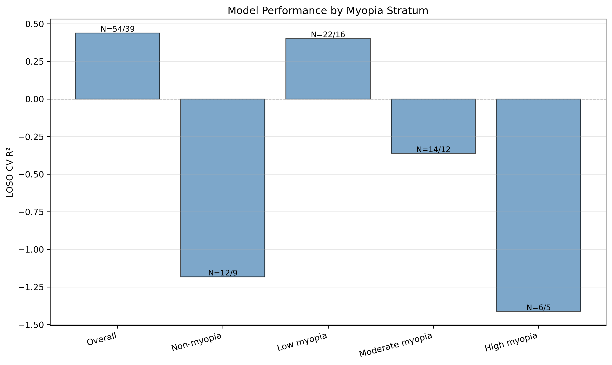
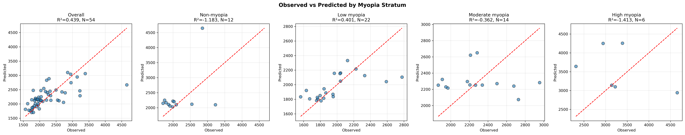
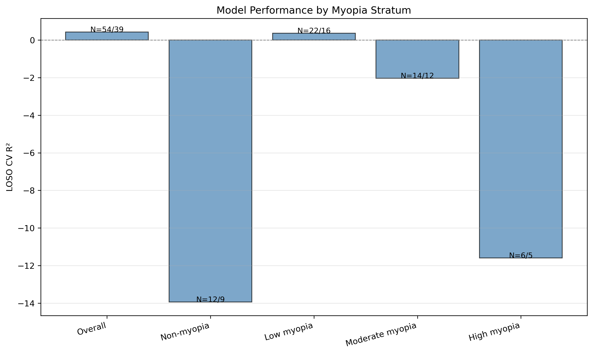
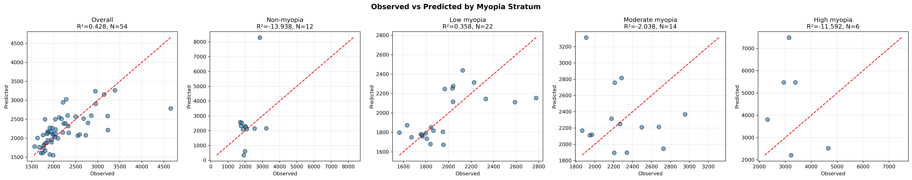

# SR0530 按近视程度分层分析报告

> **目的**：评估最终模型在不同近视程度亚组中的预测性能，检验模型的亚组泛化能力。

> **数据**：lenient 数据组，3.0 mm 偏心距

> **分层标准**：

- Non-myopia: SE > -0.5 D
- Low myopia: -3.0 D < SE ≤ -0.5 D
- Moderate myopia: -6.0 D < SE ≤ -3.0 D
- High myopia: SE ≤ -6.0 D

---

## A1_Ridge

| Stratum | N_Eyes | N_Subjects | R² | Pearson r | MAPE (%) | RMSE | MAE |
|---------|--------|------------|----|-----------|----------|------|-----|
| Overall | 54 | 39 | 0.439 | 0.664 | 11.58 | 419.1 | 278.3 |
| Non-myopia | 12 | 9 | -1.183 | 0.442 | 19.23 | 671.6 | 455.9 |
| Low myopia | 22 | 16 | 0.401 | 0.638 | 7.21 | 225.1 | 151.0 |
| Moderate myopia | 14 | 12 | -0.362 | -0.154 | 13.43 | 369.0 | 311.5 |
| High myopia | 6 | 5 | -1.413 | -0.440 | 27.99 | 1093.0 | 889.4 |

## C1_Lasso

| Stratum | N_Eyes | N_Subjects | R² | Pearson r | MAPE (%) | RMSE | MAE |
|---------|--------|------------|----|-----------|----------|------|-----|
| Overall | 54 | 39 | 0.428 | 0.660 | 12.20 | 423.4 | 287.5 |
| Non-myopia | 12 | 9 | -13.938 | 0.449 | 45.96 | 1757.0 | 1062.8 |
| Low myopia | 22 | 16 | 0.358 | 0.627 | 8.29 | 233.2 | 173.4 |
| Moderate myopia | 14 | 12 | -2.038 | -0.232 | 19.36 | 551.2 | 437.2 |
| High myopia | 6 | 5 | -11.592 | -0.328 | 71.21 | 2497.0 | 2265.5 |

## 讨论

1. **仅 Low myopia 亚组表现合理**：A1_Ridge 在 Low myopia 中 R²=0.401，与全样本性能接近；其余亚组 R² 为负。
2. **样本量不足是主要限制**：Non-myopia（12 眼/9 subjects）、Moderate myopia（14 眼/12 subjects）、High myopia（6 眼/5 subjects）样本量均过小，LOSO CV 无法稳定估计。
3. **A1_Ridge 优于 C1_Lasso**：在所有亚组中，A1_Ridge 的 R² 均不低于 C1_Lasso，再次验证 SE 未提供额外独立信息。
4. **临床提示**：模型在低至中度近视人群中可能具有应用价值，但在非近视、中度和高度近视人群中需要更大样本验证。

---

*Report generated automatically by SR_ML_stratified_analysis.py*
