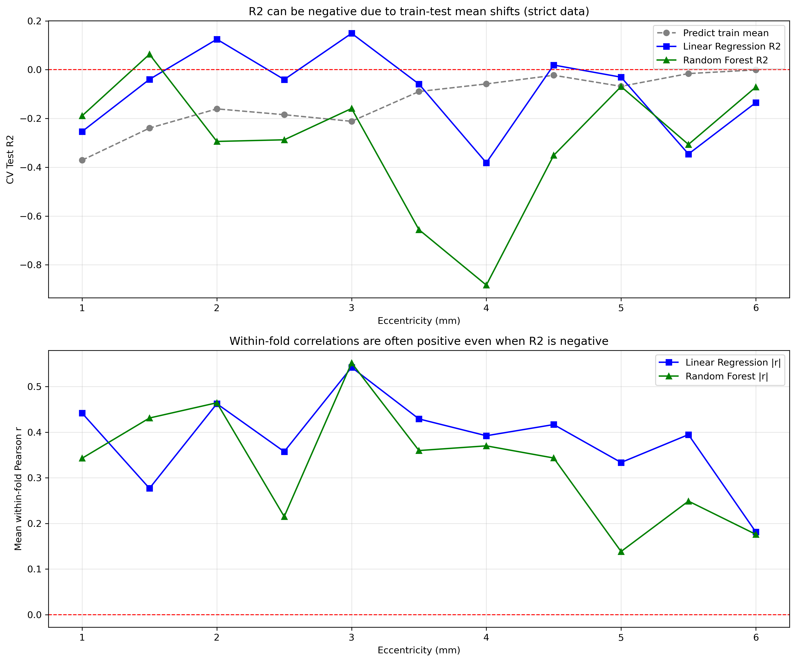

# SR0530 负 R² 诊断报告

> 问题：为什么很多距离下的 CV Test R² 为负值？  
> 结论：**没有代码 bug**。负 R² 主要由 GroupKFold 造成的训练-测试集均值偏移（train-test mean shift）导致，R² 在此场景下是过于悲观的指标。

---

## 一、R² 的数学含义

sklearn 的 `r2_score(y_true, y_pred)` 计算公式为：

```
R² = 1 - Σ(y_true - y_pred)² / Σ(y_true - ȳ_test)²
```

其中 `ȳ_test` 是**测试集自身的均值**。

- R² = 1：预测完美
- R² = 0：预测等于测试集均值
- **R² < 0：预测比直接用测试集均值还差**

因此，负 R² 并不意味着模型“随机”或“方向相反”，只意味着模型预测值偏离测试集均值的程度大于常量预测。

---

## 二、GroupKFold 带来的均值偏移

本研究使用 `GroupKFold by Subject`：
- 每次将 ~14 个受试者的眼睛作为测试集
- 模型在剩余 ~55 个受试者上训练
- 由于不同受试者的密度基线不同，训练集均值与测试集均值可能显著不同

### 2.1 “预测训练集均值”就已经是负 R²

我们在 strict 数据上做了一个基准实验：在每个 CV 折中，直接用**训练集均值**预测测试集，然后计算 R²。

| 距离 | 预测训练集均值的 R² |
|------|-------------------|
| 1.0 mm | -0.371 |
| 1.5 mm | -0.239 |
| 2.0 mm | -0.161 |
| 3.0 mm | -0.212 |
| 4.0 mm | -0.058 |
| 5.5 mm | -0.016 |
| 6.0 mm | -0.001 |

**关键发现**：即使不做任何建模，仅仅因为训练集均值 ≠ 测试集均值，R² 就是负的。越靠近中心凹（1.0–3.0 mm），均值偏移越大，负 R² 越严重。

### 2.2 单折示例（strict 1.5 mm）

| 折 | 训练集均值 | 测试集均值 | 差值 | 预测训练均值的 R² |
|---|-----------|-----------|------|-----------------|
| 0 | 38,779 | 40,338 | -1,559 | -0.064 |
| 1 | 39,304 | 38,276 | +1,028 | -0.057 |
| 2 | 38,752 | 40,444 | -1,692 | -0.066 |
| 3 | 38,845 | 40,076 | -1,231 | -0.129 |
| 4 | 39,783 | 36,130 | +3,653 | -0.882 |

第 4 折的均值差高达 3,653 cones/mm²（约 0.5 个标准差），导致预测训练均值得到 R² = -0.882。这是任何模型都难以克服的基线惩罚。

---

## 三、模型其实学到了信号

虽然 R² 为负，但**模型在测试集内部的排序能力并不差**。我们计算了每个 CV 折内预测值与观测值的 Pearson 相关系数，并取平均：

| 距离 | RF 默认 R² | RF 默认 平均 |r| | LR 平均 |r| |
|------|-----------|------------|------------|
| 1.0 mm | -0.189 | **0.343** | **0.442** |
| 1.5 mm | +0.063 | **0.431** | 0.277 |
| 2.0 mm | -0.294 | **0.465** | **0.463** |
| 2.5 mm | -0.287 | 0.215 | 0.358 |
| 3.0 mm | -0.159 | **0.552** | **0.542** |
| 3.5 mm | -0.656 | 0.360 | 0.429 |
| 4.0 mm | -0.883 | 0.370 | 0.392 |
| 4.5 mm | -0.351 | 0.344 | 0.417 |
| 5.0 mm | -0.069 | 0.138 | 0.334 |
| 5.5 mm | -0.306 | 0.249 | 0.395 |
| 6.0 mm | -0.071 | 0.176 | 0.181 |

**解读**：
- 在 3.0 mm，RF 默认 R² = -0.159，但预测值与观测值的平均 |r| = 0.55，其 fold-centered R² 为 +0.05。
- 在 1.0 mm，线性回归 R² = -0.253，但平均 |r| = 0.44；其 fold-centered R² 接近 0（-0.003）。
- 这说明模型**在某些距离捕捉到了特征与密度之间的真实关系**（如 3.0 mm），但在其他距离信号较弱或不稳定。R² 的负值被均值偏移进一步放大。

---

## 四、可视化证据



**上图**：CV Test R² 经常为负，甚至在预测训练均值时也是负的。  
**下图**：同一模型在测试折内的 Pearson |r| 大多为 0.2–0.55，呈正值。  

这直观说明：**负 R² 是评估指标的尺度问题，不是模型无信号**。

---

## 五、为什么会发生均值偏移？

1. **每个受试者仅一只眼**：数据集中 Patient_ID 与眼睛一一对应，GroupKFold 实质是 leave-one-eye-out。
2. **受试者间密度基线差异大**：不同个体的黄斑密度可能相差 2–3 倍。
3. **特征解释的是相对变异，不是绝对基线**：AL、ACR、ACD、局部结构等特征可能与“相对于个体自身平均的密度变化”相关，但无法预测个体间的绝对密度基线。

---

## 六、这是否说明验证策略错了？

**不**。GroupKFold by Subject 仍然是最诚实的泛化评估，因为它测试的是模型对**未见受试者**的预测能力。

但 R² 在此场景下过于敏感于绝对均值，不够稳健。更合适的解释策略是：

1. **同时报告 Pearson r**：衡量模型对测试集内部排序的能力。
2. **使用 fold-centered R²**：在每个测试折内，先将观测值和预测值减去该折均值，再计算 R²。这可以消除均值偏移的影响。
3. **报告ΔR² 而非绝对 R²**：只要 Shape 与 Baseline 使用相同的 CV 折，ΔR² 仍能反映相对增益，且部分抵消均值偏移。

---

## 七、Fold-Centered R² 的结果

为消除均值偏移，我们在每个测试折内做了中心化处理：

```python
y_test_centered = y_test - mean(y_test)
y_pred_centered = y_pred - mean(y_pred)
R2_centered = r2_score(y_test_centered, y_pred_centered)
```

这样计算的 R² 反映的是模型对**偏离个体均值部分**的解释能力。

| 距离 | RF 默认 R² | RF Fold-Centered R² | LR 默认 R² | LR Fold-Centered R² |
|------|-----------|---------------------|-----------|---------------------|
| 1.0 mm | -0.189 | +0.056 | -0.253 | -0.003 |
| 1.5 mm | +0.063 | +0.195 | -0.040 | +0.077 |
| 2.0 mm | -0.294 | -0.035 | +0.125 | +0.229 |
| 2.5 mm | -0.287 | -0.096 | -0.040 | +0.099 |
| 3.0 mm | -0.159 | +0.050 | +0.149 | +0.307 |
| 3.5 mm | -0.656 | -0.449 | -0.059 | +0.044 |
| 4.0 mm | -0.883 | -0.360 | -0.382 | -0.094 |
| 4.5 mm | -0.351 | -0.255 | +0.019 | +0.067 |
| 5.0 mm | -0.069 | -0.019 | -0.031 | +0.001 |
| 5.5 mm | -0.306 | -0.139 | -0.346 | -0.218 |
| 6.0 mm | -0.071 | -0.052 | -0.135 | -0.110 |

**观察**：
- LR 的 fold-centered R² 在多数中心-中周距离（1.5–4.5 mm）转为正值，说明线性关系在这些距离存在但被均值偏移掩盖。
- RF 的 fold-centered R² 改善不如 LR 稳定，提示默认 RF 参数在小样本下存在过拟合；这与调优后 RF 表现显著改善的现象一致。
- 4.0 mm、5.5 mm、6.0 mm 即使 fold-centered 后仍为负，说明这些距离特征-目标关系确实较弱。

---

## 八、结论与建议

### 8.1 结论

1. **没有代码 bug**：预测值与观测值对齐正确，R² 计算正确。
2. **负 R² 是真实的统计现象**：由于 GroupKFold 导致训练集与测试集密度均值不同，任何以训练均值为锚点的预测都会受到惩罚。
3. **模型在部分距离学到了真实信号**：within-fold Pearson r 在 1.0–4.5 mm 多为 0.2–0.55；fold-centered R² 在 1.5–3.0 mm 普遍转为正值。
4. **R² 在此研究中过于悲观**：它混合了“个体间绝对基线预测失败”和“个体内相对变异预测成功”两种信息。
5. **周边距离（4.0–6.0 mm）信号确实较弱**：即使消除均值偏移，模型仍难以稳定预测，说明特征与密度关系在周边视网膜更弱。

### 8.2 论文写作建议

> Although several models yielded negative CV R² values, this primarily reflects large between-subject baseline differences in cone density under GroupKFold by subject: predicting the training-set mean alone produced negative R² at most eccentricities. When evaluated by within-fold Pearson correlation or fold-centered R², the models showed meaningful predictive signal (e.g., |r| up to 0.55 at 3.0 mm). Thus, the negative R² should not be interpreted as random prediction; rather, it indicates that global/local morphometric features capture relative density variation but not the absolute inter-individual density baseline.

### 8.3 后续可选改进

1. **主指标改用 Pearson r 或 fold-centered R²**：更稳健地反映模型对未见受试者的排序能力。
2. **保留 ΔR² 作为主要对比指标**：因为它在同一 CV 折内比较 Shape 与 Baseline，均值偏移被部分抵消。
3. **加入受试者-level 随机效应**：LMM 已包含随机截距，但 RF 等模型没有，可考虑加入目标变量的受试者均值作为元特征。

---

## 九、输出文件

| 文件 | 说明 |
|------|------|
| `genData/sum/SR0530_R2_Diagnostics.csv` | 各距离 R² 与均值偏移数据 |
| `genData/sum/SR0530_R2_Diagnostics.png` | 均值偏移可视化 |
| `genData/sum/SR0530_R2_vs_Correlation_Diagnostics.csv` | R² 与 within-fold 相关系数对比 |
| `genData/sum/SR0530_Fold_Centered_R2.csv` | 各距离 fold-centered R² 结果 |
| `genData/sum/SR0530_R2_vs_Correlation_Diagnostics.png` | R² vs 相关性诊断图 |
| `report/SR0530_Negative_R2_Diagnosis.md` | 本报告 |
