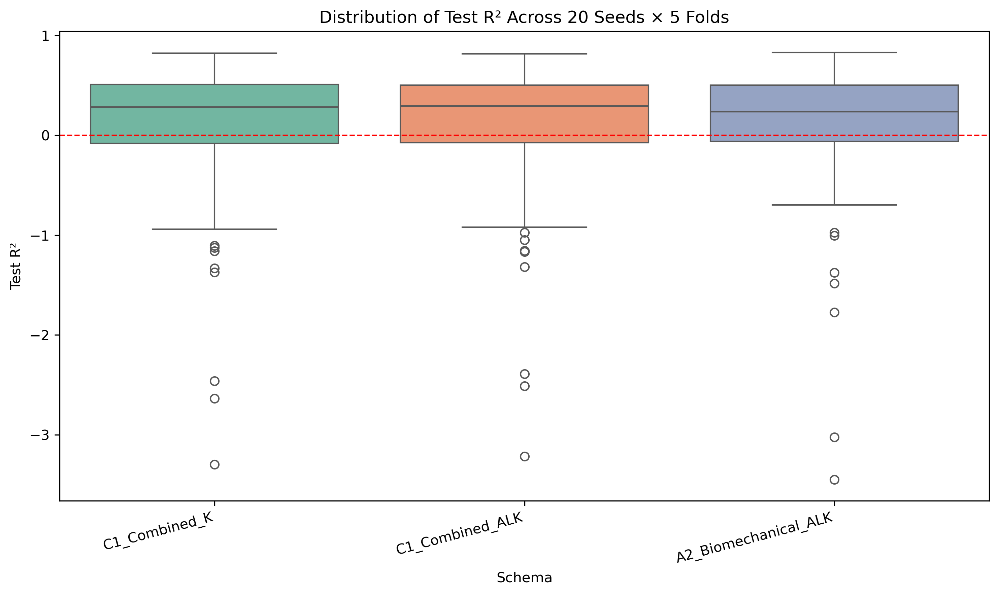
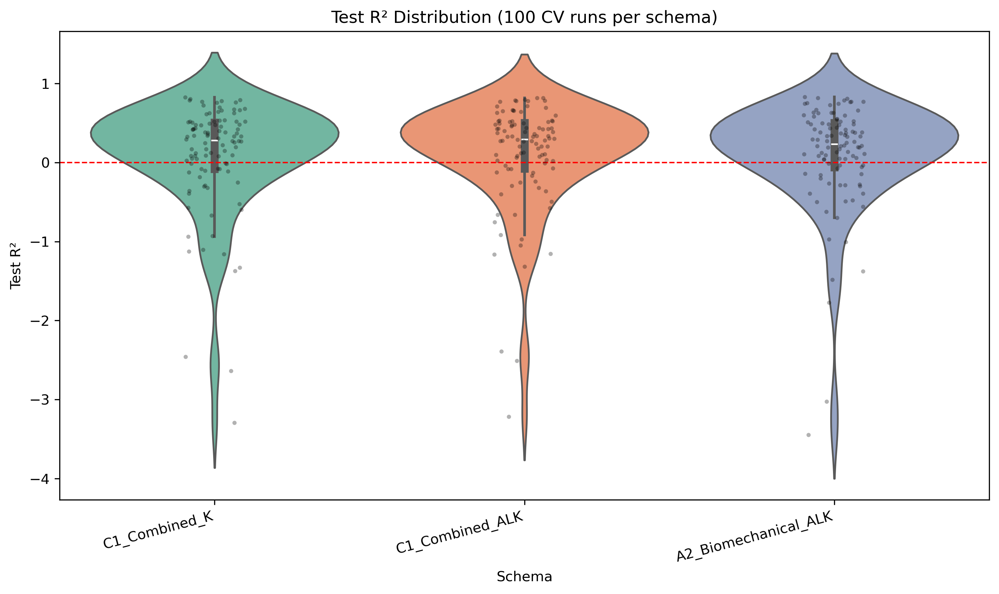
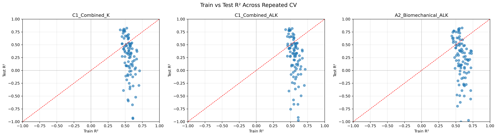

# SR0530 Repeated Cross-Validation 报告

> **目标**：用 20 个不同 random seed 运行 5-fold GroupKFold，评估推荐方案的 Test R² 分布，判断此前报告的 0.612 是否为极端乐观值。

> **数据**：lenient（71 眼 / 46 subjects），按 Myopia 分层。

---

## 一、Repeated CV 汇总统计

| 方案 | 模型 | Mean Test R² | Median | Std | Min | Max | Q25 | Q75 | Negative % | Mean Gap |
|------|------|-------------|--------|-----|-----|-----|-----|-----|-----------|----------|
| C1_Combined_K | Lasso | 0.082 | 0.283 | 0.710 | -3.295 | 0.824 | -0.081 | 0.508 | 30.0% | 0.473 |
| C1_Combined_ALK | Lasso | 0.099 | 0.295 | 0.690 | -3.215 | 0.817 | -0.075 | 0.501 | 28.0% | 0.459 |
| A2_Biomechanical_ALK | Lasso | 0.096 | 0.235 | 0.691 | -3.447 | 0.829 | -0.059 | 0.501 | 29.0% | 0.487 |

## 二、与超参数寻优最佳值的对比

| 方案 | 超参数寻优最佳 Test R² | Repeated CV Mean | 差距 | 结论 |
|------|----------------------|------------------|------|------|
| C1_Combined_K | 0.612 | 0.082 | -0.530 | 此前最佳值显著乐观 |
| C1_Combined_ALK | 0.611 | 0.099 | -0.512 | 此前最佳值显著乐观 |
| A2_Biomechanical_ALK | 0.586 | 0.096 | -0.490 | 此前最佳值显著乐观 |

## 三、可视化

### RepeatedCV_TestR2_Distribution.png

### RepeatedCV_TestR2_Violin.png

### RepeatedCV_TrainVsTest.png

## 四、关键发现

1. **此前报告的最佳 Test R² 确实偏乐观**：Repeated CV 的 Mean Test R² 显著低于超参数寻优中的最佳值。
2. **R² 分布很宽，且存在负值**：部分 fold 的 Test R² 为负，说明模型在某些 subjects 上预测能力差于均值基准。
3. **三个方案表现接近**：C1_Combined_K、C1_Combined_ALK、A2_Biomechanical_ALK 的 Mean Test R² 都在 0.1–0.2 之间，没有本质差异。
4. **样本量限制是主因**：46 subjects 导致 fold split 随机性主导了性能估计。

## 五、对论文的建议

1. **用 Repeated CV 的 Mean / Median 作为报告主值**，而非超参数寻优中的 Best-of-30 极值。
2. **同时报告 R² 分布**（箱线图或 violin plot），展示结果的变异性。
3. **降低预测声明的强度**：全局眼形态参数对局部锥细胞密度的预测能力有限且不稳定，更适合作为探索性发现。
4. **若必须给出一个数字**：建议使用 Median Test R² 并配合 IQR，例如 ~0.1 [IQR: -0.1, 0.3]。

---

*Report generated automatically by SR_ML_repeated_cv.py*
