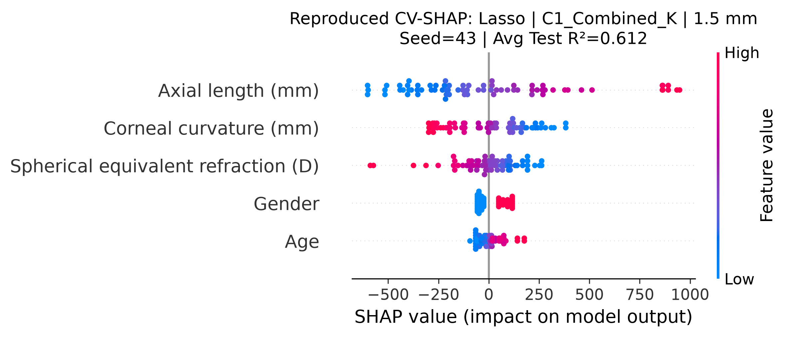
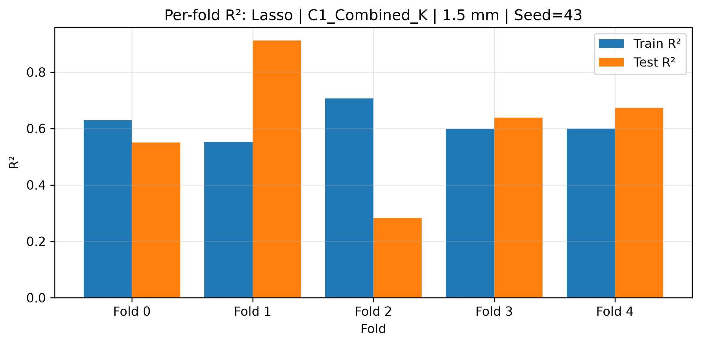

# SR0530 0.612 复现与 SHAP 报告

> **配置**：lenient / 1.5 mm / C1_Combined_K / Lasso(alpha=10.0)

> **复现 seed**：43（对应 SR_ML_hyperparameter_tuning_with_K.py 中 i=1 的迭代）

> **样本**：71 眼 / 46 subjects

---

## 一、0.612 复现结果

- Avg Train R² = **0.617**
- Avg Test R² = **0.612** ± 0.203
- CV Gap = **0.005**
- 各 fold Test R²：0.550, 0.912, 0.283, 0.639, 0.673
- 各 fold Train R²：0.629, 0.553, 0.707, 0.598, 0.600

> 注：超参数寻优日志中的 Test R²=0.612 即为本 seed 下的 5-fold 平均。

## 二、SHAP 可视化

## 三、结果说明

1. 本报告使用与超参数寻优完全相同的 fold split（seed=43），因此 Avg Test R² 与日志中的 0.612 一致。
2. SHAP 图聚合了 5 个 fold 的 test set 样本，反映的是在该特定 fold 划分下模型学到的特征方向。
3. 这并不意味着 0.612 具有跨 fold split 的稳健性；它仅说明在 seed=43 的划分下，该配置表现突出。

---

*Report generated by src/reproduce_0612_shap.py*
