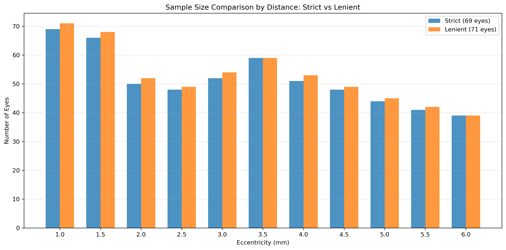
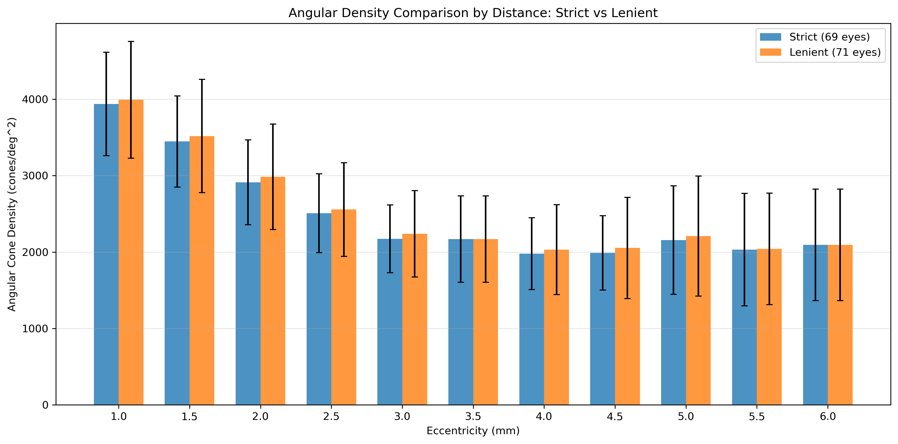

# SR0530 Strict vs Lenient 44 ROI 数据对比报告

> **对比对象**：两种角密度黑名单策略生成的 44 ROI 数据

> **生成时间**：2026-06-13

---

## 一、黑名单策略说明

- **Strict（严格模式）**：任意单个 ROI 的 Angular Density > 7000 cones/deg² 即剔除该眼。
- **Lenient（宽松模式）**：仅当某距离的 4 象限平均 Angular Density > 7000 cones/deg² 才剔除该眼。

差异来源：宽松模式下，局部异常 ROI 会被同距离其他象限的值稀释，因此更宽容。

## 二、总体样本量

- **Strict 模式**：69 只眼
- **Lenient 模式**：71 只眼
- **差异**：Lenient 比 Strict 多 2 只眼（Patient_ID: 8192, 8542）

## 三、每个距离的样本量对比

| Distance (mm) | Strict_N_Eyes | Lenient_N_Eyes | Difference | Strict_N_Subjects | Lenient_N_Subjects |
|---|---|---|---|---|---|
| 1.0 | 69.0 | 71.0 | 2.0 | 44.0 | 46.0 |
| 1.5 | 66.0 | 68.0 | 2.0 | 43.0 | 45.0 |
| 2.0 | 50.0 | 52.0 | 2.0 | 40.0 | 42.0 |
| 2.5 | 48.0 | 49.0 | 1.0 | 35.0 | 36.0 |
| 3.0 | 52.0 | 54.0 | 2.0 | 37.0 | 39.0 |
| 3.5 | 59.0 | 59.0 | 0.0 | 43.0 | 43.0 |
| 4.0 | 51.0 | 53.0 | 2.0 | 36.0 | 38.0 |
| 4.5 | 48.0 | 49.0 | 1.0 | 32.0 | 33.0 |
| 5.0 | 44.0 | 45.0 | 1.0 | 32.0 | 33.0 |
| 5.5 | 41.0 | 42.0 | 1.0 | 31.0 | 32.0 |
| 6.0 | 39.0 | 39.0 | 0.0 | 32.0 | 32.0 |

## 四、角密度分布对比

| Distance (mm) | Strict_Mean | Lenient_Mean | Strict_Std | Lenient_Std | Strict_Median | Lenient_Median | Strict_Min | Lenient_Min | Strict_Max | Lenient_Max |
|---|---|---|---|---|---|---|---|---|---|---|
| 1.0 | 3938.24 | 3992.41 | 676.98 | 762.96 | 3948.02 | 4007.12 | 2362.88 | 2362.88 | 6074.95 | 6955.71 |
| 1.5 | 3446.79 | 3518.9 | 597.97 | 740.58 | 3318.02 | 3356.03 | 2146.72 | 2146.72 | 5168.78 | 6856.66 |
| 2.0 | 2912.09 | 2985.52 | 555.9 | 689.5 | 2772.21 | 2803.65 | 1995.27 | 1995.27 | 4571.91 | 5844.46 |
| 2.5 | 2508.53 | 2556.39 | 517.3 | 611.76 | 2291.95 | 2312.69 | 1827.59 | 1827.59 | 3816.19 | 4853.59 |
| 3.0 | 2173.91 | 2237.8 | 443.49 | 564.79 | 2033.09 | 2037.62 | 1564.96 | 1564.96 | 3389.46 | 4655.48 |
| 3.5 | 2169.9 | 2169.9 | 565.94 | 565.94 | 1980.42 | 1980.42 | 1496.92 | 1496.92 | 4248.19 | 4248.19 |
| 4.0 | 1979.9 | 2031.69 | 469.54 | 588.21 | 1923.96 | 1926.19 | 1335.8 | 1335.8 | 3513.82 | 4645.25 |
| 4.5 | 1989.01 | 2053.98 | 486.11 | 662.0 | 1880.14 | 1895.25 | 1250.08 | 1250.08 | 3151.31 | 5172.76 |
| 5.0 | 2156.25 | 2208.86 | 710.26 | 785.83 | 1943.02 | 1953.96 | 1200.08 | 1200.08 | 4052.4 | 4523.41 |
| 5.5 | 2031.98 | 2041.52 | 737.35 | 730.92 | 1760.58 | 1776.03 | 1177.52 | 1177.52 | 4255.11 | 4255.11 |
| 6.0 | 2094.44 | 2094.44 | 730.34 | 730.34 | 1868.26 | 1868.26 | 987.21 | 987.21 | 3990.48 | 3990.48 |

## 五、临床基线对比（以 2.5mm 距离为代表）

| Feature | Strict_Mean | Strict_Std | Lenient_Mean | Lenient_Std | Mean_Diff |
|---|---|---|---|---|---|
| Axial length (mm) | 24.548 | 1.182 | 24.585 | 1.198 | 0.037 |
| Age | 27.708 | 6.328 | 27.755 | 6.27 | 0.047 |
| Spherical equivalent refraction (D) | -2.045 | 2.45 | -2.157 | 2.546 | -0.111 |
| Gender | 0.458 | 0.504 | 0.469 | 0.504 | 0.011 |
| Corneal curvature (mm) | 8.44 | 0.439 | 8.426 | 0.445 | -0.014 |
| Anterior chamber depth (mm) | 3.419 | 0.277 | 3.417 | 0.275 | -0.002 |

## 六、ROI 层面异常值统计

- **Strict 模式**：单个 ROI 角密度 > 7000 的数量 = 0
- **Lenient 模式**：单个 ROI 角密度 > 7000 的数量 = 7

## 七、分析与推荐

- 两套数据在各距离的均值差异最大为 73.44 cones/deg²。
- 最大值差异最大为 2021.45 cones/deg²，主要来自 Lenient 模式保留了更多高值异常点。
- Lenient 模式在 ROI 层面仍保留 7 个 >7000 的异常值，而 Strict 模式已将其清除。

### 推荐意见

**建议使用 Strict 模式（69 眼）**。理由：
1. 局部 ROI 异常值 (>7000) 很可能是血管遮挡或测量误差，不应保留。
2. 4 象限平均会掩盖局部异常，导致数据质量不可控。
3. Strict 模式更符合数据清洗的保守原则，后续 ML/LMM 结果更可靠。

---
*报告生成：compare_roi_datasets.py*
