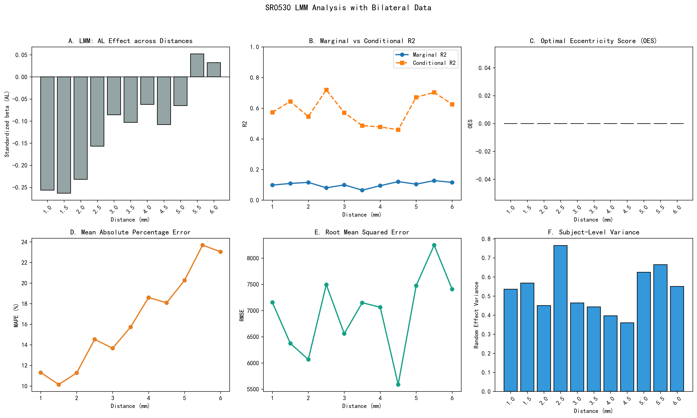
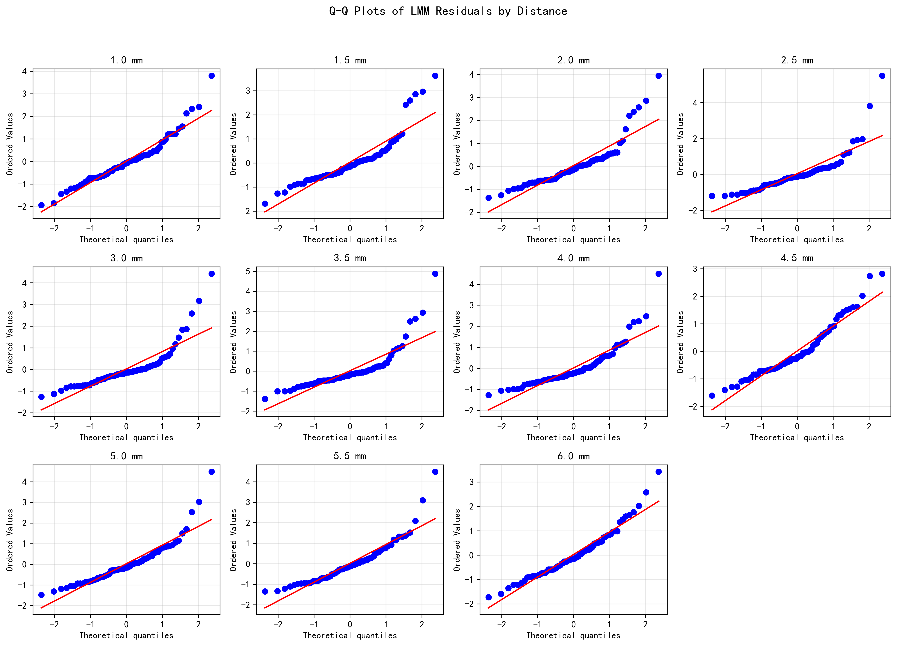

# SR0530 V3.0 任务一报告：基于双眼数据的 LMM 统计筛选
> **目标**：确定 1.0–6.0 mm 偏心率中，角密度受眼部参数影响最显著的黄金靶点。
> **方法**：每个偏心率独立拟合 LMM（REML），Subject_ID 作为随机效应；OES 经 Benjamini-Hochberg FDR 校正。
> **数据**：77 只眼 / 48 名受试者（30 对双眼 + 19 名单眼）。

---

## 一、LMM 结果汇总

| 距离 (mm) | 眼数 | 受试者数 | beta_AL | P 值 | P_FDR | R²_边际 | R²_条件 | MAPE(%) | RMSE | ICC | OES |
|-----------|------|---------|---------|------|-------|---------|---------|---------|------|-----|-----|
| 1.0 | 77 | 48 | -0.256 | 0.0989 | 0.4282  | 0.098 | 0.573 | 11.31 | 7155.2 | 0.527 | 0.000 |
| 1.5 | 77 | 48 | -0.263 | 0.0865 | 0.4282  | 0.109 | 0.644 | 10.15 | 6373.1 | 0.600 | 0.000 |
| 2.0 | 77 | 48 | -0.232 | 0.1168 | 0.4282  | 0.116 | 0.546 | 11.27 | 6066.0 | 0.486 | 0.000 |
| 2.5 | 77 | 48 | -0.157 | 0.3451 | 0.8157  | 0.081 | 0.719 | 14.53 | 7494.6 | 0.695 | 0.000 |
| 3.0 | 77 | 48 | -0.086 | 0.5592 | 0.8157  | 0.100 | 0.570 | 13.67 | 6559.4 | 0.523 | 0.000 |
| 3.5 | 77 | 48 | -0.103 | 0.5025 | 0.8157  | 0.065 | 0.486 | 15.73 | 7149.1 | 0.451 | 0.000 |
| 4.0 | 77 | 48 | -0.062 | 0.6733 | 0.8157  | 0.094 | 0.477 | 18.60 | 7063.2 | 0.423 | 0.000 |
| 4.5 | 77 | 48 | -0.108 | 0.4631 | 0.8157  | 0.121 | 0.459 | 18.08 | 5589.0 | 0.385 | 0.000 |
| 5.0 | 77 | 48 | -0.065 | 0.6782 | 0.8157  | 0.104 | 0.671 | 20.27 | 7475.4 | 0.633 | 0.000 |
| 5.5 | 77 | 48 | 0.052 | 0.7415 | 0.8157  | 0.127 | 0.703 | 23.69 | 8247.4 | 0.660 | 0.000 |
| 6.0 | 77 | 48 | 0.032 | 0.8330 | 0.8330  | 0.116 | 0.626 | 23.04 | 7406.4 | 0.577 | 0.000 |

**按 AL 效应最显著**：**1.5 mm**（|beta_AL| 最大）
**按 OES 最高**：**1.0 mm**（通过 FDR 校正后 OES 最高）

## 二、关键指标说明

- **beta_AL**：AL 的标准化回归系数。
- **P_FDR**：经 Benjamini-Hochberg FDR 校正后的 P 值。
- **R²_边际 / R²_条件**：固定效应 / 固定+随机效应解释的变异比例。
- **ICC** = σ²_random / (σ²_random + σ²_residual)。
- **OES** = |beta_AL| × (-log10(P_AL)) / max(ICC, 0.01) × I(P_FDR < 0.05)。未通过 FDR 校正的点 OES 强制为 0。

## 三、可视化

## 四、讨论

1. LMM 将 Subject_ID 作为随机效应后，有效控制了双眼相关性。
2. R²_条件通常显著高于 R²_边际，说明个体间差异（随机效应）解释了较大比例的密度变异。
3. Q-Q 图用于检验残差正态性，若某距离明显偏离对角线，提示模型假设可能不满足。
4. OES 综合了 AL 效应量、统计显著性和 ICC 个体差异控制，得分最高的偏心率即为推荐的黄金靶点。

---

*Report generated by SR_LMM_analysis.py*
