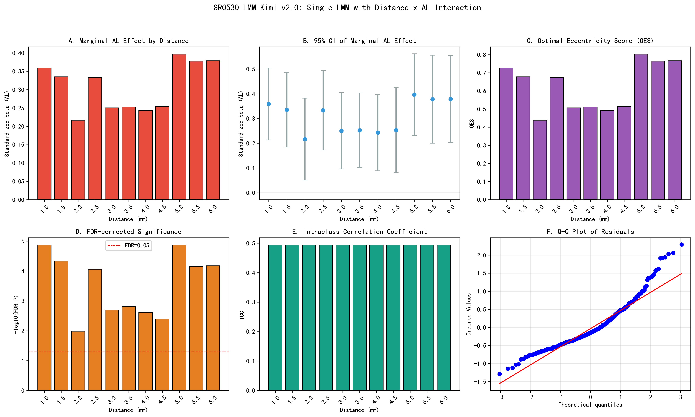

# SR0530 Task 1 LMM Report (Kimi v2.0)

> **目标**：使用单一多水平 LMM（Distance x AL 交互）筛选 1.0-6.0 mm 中最优靶点偏心率。
> **模型**：Density_z ~ C(Distance) * AL_z + Age_z + Gender + Eye + (1 | Subject_ID)，REML。
> **数据**：genData/CleanDataRoi（44 ROI，聚合为 11 个距离，每距离 4 象限取平均）。

---

## 一、模型整体信息

- **整体 ICC**: 0.4943
- **Marginal R2**: 0.6741
- **Conditional R2**: 0.8352

## 二、各偏心率 AL 边际效应

| 距离 (mm) | beta_AL* | P_raw | P_FDR | 95% CI Lower | 95% CI Upper | ICC | OES | Significant |
|-----------|----------|-------|-------|--------------|--------------|-----|-----|-------------|
| 1.0 | 0.359 | 0.0000 | 0.0000 | 0.214 | 0.504 | 0.494 | 0.727 | ⭐ |
| 1.5 | 0.335 | 0.0000 | 0.0000 | 0.185 | 0.486 | 0.494 | 0.678 | ⭐ |
| 2.0 | 0.216 | 0.0104 | 0.0104 | 0.051 | 0.382 | 0.494 | 0.438 | ⭐ |
| 2.5 | 0.333 | 0.0000 | 0.0001 | 0.172 | 0.494 | 0.494 | 0.674 | ⭐ |
| 3.0 | 0.250 | 0.0015 | 0.0020 | 0.096 | 0.404 | 0.494 | 0.506 | ⭐ |
| 3.5 | 0.253 | 0.0010 | 0.0015 | 0.103 | 0.403 | 0.494 | 0.512 | ⭐ |
| 4.0 | 0.243 | 0.0020 | 0.0024 | 0.089 | 0.397 | 0.494 | 0.492 | ⭐ |
| 4.5 | 0.253 | 0.0036 | 0.0040 | 0.083 | 0.424 | 0.494 | 0.513 | ⭐ |
| 5.0 | 0.397 | 0.0000 | 0.0000 | 0.232 | 0.562 | 0.494 | 0.803 | ⭐ |
| 5.5 | 0.378 | 0.0000 | 0.0001 | 0.200 | 0.556 | 0.494 | 0.765 | ⭐ |
| 6.0 | 0.379 | 0.0000 | 0.0001 | 0.203 | 0.554 | 0.494 | 0.766 | ⭐ |

**按 |beta_AL| 最大**: **5.0 mm**
**按 OES 最高**: **5.0 mm**

## 三、OES 计算说明

OES_j = |beta_AL,j*| / max(ICC_j, 0.01) * I(P_FDR,j < 0.05)

- beta_AL* 为全局标准化后的 AL 边际效应系数。
- ICC 采用整体模型的随机效应方差与残差方差计算。
- P 值经 Benjamini-Hochberg FDR 校正，alpha=0.05。

## 四、可视化

---

*Report generated by SR_LMM_kimi_v2.py*
