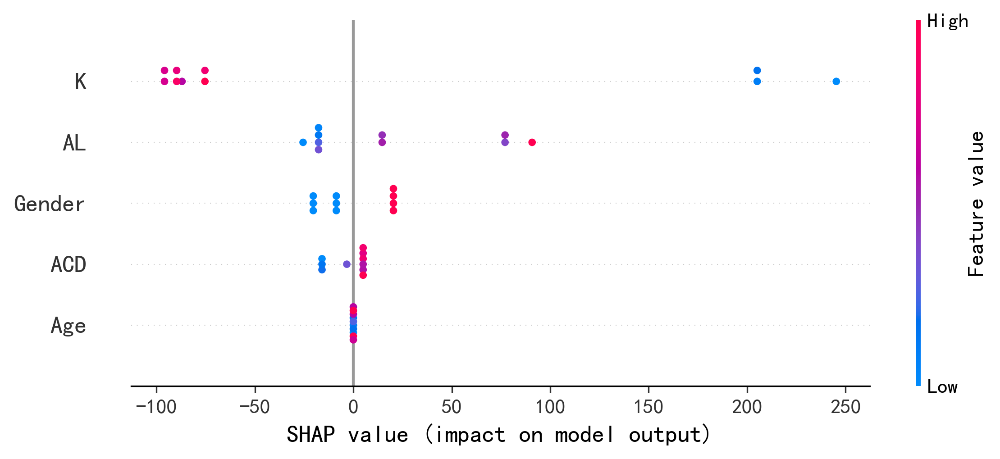

# SR0530 任务二报告：ML 模型优化（研究方案完整版）

> **目标**：在锁定 LMM 最佳偏心率后，建立基于常规眼科参数的视锥密度预测模型。
> **方法**：双模型策略 + Subject/近视分层 CV + SVM/RF/XGB/NN/Lasso/ElasticNet + SHAP。
> **数据**：genData/CleanDataRoi/（44 个 ROI，聚合为 11 个距离组）。

---

## 一、VIF 共线性诊断

| 特征 | VIF |
|------|-----|
| AL | 184.25 |
| Age | 20.13 |
| SE | 2.22 |
| Gender | 1.82 |
| K | 229.06 |
| ACD | 45.34 |

*注：VIF > 10 提示存在严重多重共线性。

## 二、方案 A vs 方案 B

- **方案 A（生物力学主模型）**：`[AL, Age, Gender, ACD, K]`，剔除 SE。
- **方案 B（临床筛查辅助模型）**：`[SE, Age, Gender]`，剔除 AL/ACD/K。

| 距离 (mm) | 方案 | 最佳模型 | Test R² |
|-----------|------|----------|---------|
| 1.0 | A_Biomechanical | Random_Forest | 0.309 |
| 1.0 | B_Clinical | SVM | 0.219 |
| 1.5 | A_Biomechanical | SVM | 0.228 |
| 1.5 | B_Clinical | XGBoost | 0.060 |
| 2.0 | A_Biomechanical | Random_Forest | 0.135 |
| 2.0 | B_Clinical | SVM | 0.092 |
| 2.5 | A_Biomechanical | ElasticNet | 0.340 |
| 2.5 | B_Clinical | XGBoost | 0.084 |
| 3.0 | A_Biomechanical | ElasticNet | 0.107 |
| 3.0 | B_Clinical | Neural_Network | 0.056 |
| 3.5 | A_Biomechanical | ElasticNet | 0.304 |
| 3.5 | B_Clinical | Neural_Network | 0.029 |
| 4.0 | A_Biomechanical | Lasso | 0.096 |
| 4.0 | B_Clinical | XGBoost | -0.178 |
| 4.5 | A_Biomechanical | Lasso | -0.015 |
| 4.5 | B_Clinical | Random_Forest | 0.040 |
| 5.0 | A_Biomechanical | ElasticNet | -0.215 |
| 5.0 | B_Clinical | Random_Forest | -0.248 |
| 5.5 | A_Biomechanical | SVM | -0.246 |
| 5.5 | B_Clinical | SVM | -0.192 |
| 6.0 | A_Biomechanical | Neural_Network | 0.257 |
| 6.0 | B_Clinical | Random_Forest | 0.209 |

## 三、全部模型结果

| 距离 (mm) | 方案 | 模型 | N_eyes | N_subj | Train R² | Test R² | Test Corr | MAPE(%) | RMSE | Gap |
|-----------|------|------|--------|--------|----------|---------|-----------|---------|------|-----|
| 1.0 | A_Biomechanical | SVM | 69 | 44 | 0.485 | 0.210 | 0.565 | 11.49 | 548.6 | 0.275 |
| 1.0 | A_Biomechanical | Random_Forest | 69 | 44 | 0.670 | 0.309 | 0.615 | 11.60 | 518.0 | 0.361 |
| 1.0 | A_Biomechanical | XGBoost | 69 | 44 | 0.363 | 0.129 | 0.517 | 13.04 | 599.0 | 0.234 |
| 1.0 | A_Biomechanical | Neural_Network | 69 | 44 | 0.446 | 0.132 | 0.504 | 12.46 | 582.0 | 0.314 |
| 1.0 | A_Biomechanical | Lasso | 69 | 44 | 0.411 | 0.269 | 0.660 | 11.81 | 545.9 | 0.142 |
| 1.0 | A_Biomechanical | ElasticNet | 69 | 44 | 0.439 | 0.110 | 0.542 | 12.15 | 579.8 | 0.329 |
| 1.0 | B_Clinical | SVM | 69 | 44 | 0.348 | 0.219 | 0.545 | 12.31 | 566.0 | 0.129 |
| 1.0 | B_Clinical | Random_Forest | 69 | 44 | 0.546 | 0.118 | 0.463 | 12.70 | 584.7 | 0.428 |
| 1.0 | B_Clinical | XGBoost | 69 | 44 | 0.299 | 0.081 | 0.410 | 13.00 | 610.6 | 0.217 |
| 1.0 | B_Clinical | Neural_Network | 69 | 44 | 0.287 | 0.019 | 0.296 | 13.88 | 630.7 | 0.268 |
| 1.0 | B_Clinical | Lasso | 69 | 44 | 0.162 | -0.008 | 0.454 | 13.91 | 648.4 | 0.170 |
| 1.0 | B_Clinical | ElasticNet | 69 | 44 | 0.174 | 0.026 | 0.444 | 13.86 | 636.9 | 0.148 |
| 1.5 | A_Biomechanical | SVM | 66 | 43 | 0.556 | 0.228 | 0.691 | 9.90 | 441.5 | 0.328 |
| 1.5 | A_Biomechanical | Random_Forest | 66 | 43 | 0.718 | 0.089 | 0.687 | 9.83 | 457.7 | 0.629 |
| 1.5 | A_Biomechanical | XGBoost | 66 | 43 | 0.401 | 0.055 | 0.668 | 11.89 | 501.0 | 0.347 |
| 1.5 | A_Biomechanical | Neural_Network | 66 | 43 | 0.651 | -0.008 | 0.632 | 11.06 | 492.9 | 0.659 |
| 1.5 | A_Biomechanical | Lasso | 66 | 43 | 0.541 | 0.172 | 0.730 | 9.52 | 446.9 | 0.369 |
| 1.5 | A_Biomechanical | ElasticNet | 66 | 43 | 0.533 | 0.215 | 0.621 | 9.80 | 461.1 | 0.318 |
| 1.5 | B_Clinical | SVM | 66 | 43 | 0.327 | -0.118 | 0.561 | 12.41 | 529.9 | 0.446 |
| 1.5 | B_Clinical | Random_Forest | 66 | 43 | 0.592 | -0.010 | 0.636 | 10.95 | 485.2 | 0.602 |
| 1.5 | B_Clinical | XGBoost | 66 | 43 | 0.332 | 0.060 | 0.683 | 12.00 | 498.5 | 0.272 |
| 1.5 | B_Clinical | Neural_Network | 66 | 43 | 0.512 | -0.052 | 0.562 | 11.73 | 508.8 | 0.563 |
| 1.5 | B_Clinical | Lasso | 66 | 43 | 0.203 | -0.303 | 0.456 | 13.08 | 556.3 | 0.506 |
| 1.5 | B_Clinical | ElasticNet | 66 | 43 | 0.204 | -0.328 | 0.435 | 13.36 | 565.4 | 0.533 |
| 2.0 | A_Biomechanical | SVM | 50 | 40 | 0.463 | 0.024 | 0.517 | 12.36 | 499.8 | 0.439 |
| 2.0 | A_Biomechanical | Random_Forest | 50 | 40 | 0.583 | 0.135 | 0.585 | 11.13 | 455.4 | 0.449 |
| 2.0 | A_Biomechanical | XGBoost | 50 | 40 | 0.345 | -0.045 | 0.540 | 13.25 | 516.6 | 0.390 |
| 2.0 | A_Biomechanical | Neural_Network | 50 | 40 | 0.558 | -0.205 | 0.313 | 13.73 | 552.2 | 0.763 |
| 2.0 | A_Biomechanical | Lasso | 50 | 40 | 0.495 | 0.105 | 0.540 | 11.29 | 482.2 | 0.390 |
| 2.0 | A_Biomechanical | ElasticNet | 50 | 40 | 0.476 | -0.018 | 0.462 | 11.76 | 513.6 | 0.494 |
| 2.0 | B_Clinical | SVM | 50 | 40 | 0.314 | 0.092 | 0.474 | 11.96 | 480.2 | 0.222 |
| 2.0 | B_Clinical | Random_Forest | 50 | 40 | 0.459 | -0.109 | 0.425 | 13.07 | 516.8 | 0.568 |
| 2.0 | B_Clinical | XGBoost | 50 | 40 | 0.269 | -0.134 | 0.269 | 13.99 | 540.7 | 0.404 |
| 2.0 | B_Clinical | Neural_Network | 50 | 40 | 0.379 | 0.065 | 0.412 | 11.94 | 487.3 | 0.314 |
| 2.0 | B_Clinical | Lasso | 50 | 40 | 0.278 | 0.009 | 0.457 | 12.69 | 503.1 | 0.269 |
| 2.0 | B_Clinical | ElasticNet | 50 | 40 | 0.278 | 0.030 | 0.444 | 12.47 | 497.3 | 0.249 |
| 2.5 | A_Biomechanical | SVM | 48 | 35 | 0.484 | 0.157 | 0.670 | 15.56 | 432.8 | 0.327 |
| 2.5 | A_Biomechanical | Random_Forest | 48 | 35 | 0.652 | 0.015 | 0.548 | 14.38 | 447.3 | 0.636 |
| 2.5 | A_Biomechanical | XGBoost | 48 | 35 | 0.394 | 0.040 | 0.417 | 15.44 | 480.6 | 0.354 |
| 2.5 | A_Biomechanical | Neural_Network | 48 | 35 | 0.283 | -0.033 | 0.577 | 18.14 | 494.0 | 0.317 |
| 2.5 | A_Biomechanical | Lasso | 48 | 35 | 0.592 | 0.304 | 0.699 | 12.14 | 395.5 | 0.289 |
| 2.5 | A_Biomechanical | ElasticNet | 48 | 35 | 0.592 | 0.340 | 0.688 | 11.76 | 385.0 | 0.253 |
| 2.5 | B_Clinical | SVM | 48 | 35 | 0.360 | 0.007 | 0.594 | 16.84 | 475.4 | 0.354 |
| 2.5 | B_Clinical | Random_Forest | 48 | 35 | 0.489 | -0.013 | 0.489 | 13.51 | 452.2 | 0.502 |
| 2.5 | B_Clinical | XGBoost | 48 | 35 | 0.324 | 0.084 | 0.432 | 15.03 | 471.9 | 0.240 |
| 2.5 | B_Clinical | Neural_Network | 48 | 35 | 0.229 | -0.244 | 0.359 | 15.62 | 520.3 | 0.473 |
| 2.5 | B_Clinical | Lasso | 48 | 35 | 0.115 | -1.016 | nan | 17.81 | 620.2 | 1.131 |
| 2.5 | B_Clinical | ElasticNet | 48 | 35 | 0.141 | -0.628 | 0.293 | 17.07 | 582.1 | 0.769 |
| 3.0 | A_Biomechanical | SVM | 52 | 37 | 0.345 | -0.208 | 0.474 | 16.38 | 400.5 | 0.553 |
| 3.0 | A_Biomechanical | Random_Forest | 52 | 37 | 0.632 | -0.120 | 0.343 | 13.73 | 390.6 | 0.752 |
| 3.0 | A_Biomechanical | XGBoost | 52 | 37 | 0.356 | -0.042 | 0.261 | 14.71 | 401.1 | 0.398 |
| 3.0 | A_Biomechanical | Neural_Network | 52 | 37 | 0.619 | -0.288 | 0.360 | 14.15 | 393.2 | 0.907 |
| 3.0 | A_Biomechanical | Lasso | 52 | 37 | 0.551 | 0.079 | 0.507 | 11.12 | 343.8 | 0.472 |
| 3.0 | A_Biomechanical | ElasticNet | 52 | 37 | 0.529 | 0.107 | 0.491 | 11.44 | 349.8 | 0.423 |
| 3.0 | B_Clinical | SVM | 52 | 37 | 0.255 | -0.427 | 0.385 | 17.31 | 438.4 | 0.682 |
| 3.0 | B_Clinical | Random_Forest | 52 | 37 | 0.494 | -0.119 | 0.229 | 13.79 | 408.8 | 0.613 |
| 3.0 | B_Clinical | XGBoost | 52 | 37 | 0.295 | -0.102 | 0.187 | 14.98 | 414.3 | 0.397 |
| 3.0 | B_Clinical | Neural_Network | 52 | 37 | 0.482 | 0.056 | 0.459 | 13.11 | 378.6 | 0.426 |
| 3.0 | B_Clinical | Lasso | 52 | 37 | 0.096 | -0.294 | nan | 16.90 | 446.0 | 0.390 |
| 3.0 | B_Clinical | ElasticNet | 52 | 37 | 0.152 | -0.141 | 0.222 | 15.29 | 424.7 | 0.293 |
| 3.5 | A_Biomechanical | SVM | 59 | 43 | 0.467 | 0.175 | 0.592 | 17.95 | 477.2 | 0.292 |
| 3.5 | A_Biomechanical | Random_Forest | 59 | 43 | 0.583 | 0.128 | 0.489 | 16.62 | 487.4 | 0.455 |
| 3.5 | A_Biomechanical | XGBoost | 59 | 43 | 0.355 | -0.074 | 0.388 | 18.81 | 539.0 | 0.428 |
| 3.5 | A_Biomechanical | Neural_Network | 59 | 43 | 0.361 | 0.271 | 0.659 | 18.23 | 446.4 | 0.090 |
| 3.5 | A_Biomechanical | Lasso | 59 | 43 | 0.551 | 0.210 | 0.583 | 15.00 | 466.3 | 0.341 |
| 3.5 | A_Biomechanical | ElasticNet | 59 | 43 | 0.548 | 0.304 | 0.656 | 14.83 | 440.3 | 0.244 |
| 3.5 | B_Clinical | SVM | 59 | 43 | 0.182 | -0.044 | 0.265 | 20.69 | 540.0 | 0.227 |
| 3.5 | B_Clinical | Random_Forest | 59 | 43 | 0.440 | -0.040 | 0.358 | 19.41 | 535.7 | 0.480 |
| 3.5 | B_Clinical | XGBoost | 59 | 43 | 0.249 | -0.024 | 0.329 | 19.45 | 537.5 | 0.272 |
| 3.5 | B_Clinical | Neural_Network | 59 | 43 | 0.122 | 0.029 | 0.361 | 18.62 | 524.6 | 0.093 |
| 3.5 | B_Clinical | Lasso | 59 | 43 | 0.059 | -0.183 | nan | 20.58 | 579.2 | 0.242 |
| 3.5 | B_Clinical | ElasticNet | 59 | 43 | 0.058 | -0.148 | nan | 20.30 | 570.5 | 0.206 |
| 4.0 | A_Biomechanical | SVM | 51 | 36 | 0.309 | -0.037 | 0.526 | 17.99 | 415.9 | 0.346 |
| 4.0 | A_Biomechanical | Random_Forest | 51 | 36 | 0.527 | -0.199 | 0.356 | 17.68 | 451.2 | 0.726 |
| 4.0 | A_Biomechanical | XGBoost | 51 | 36 | 0.289 | -0.166 | 0.256 | 18.37 | 456.7 | 0.454 |
| 4.0 | A_Biomechanical | Neural_Network | 51 | 36 | 0.390 | -0.452 | 0.564 | 19.57 | 463.1 | 0.842 |
| 4.0 | A_Biomechanical | Lasso | 51 | 36 | 0.398 | 0.096 | 0.579 | 14.90 | 391.4 | 0.302 |
| 4.0 | A_Biomechanical | ElasticNet | 51 | 36 | 0.385 | 0.077 | 0.616 | 15.41 | 397.6 | 0.308 |
| 4.0 | B_Clinical | SVM | 51 | 36 | 0.205 | -0.303 | 0.319 | 19.80 | 469.2 | 0.508 |
| 4.0 | B_Clinical | Random_Forest | 51 | 36 | 0.336 | -0.251 | 0.239 | 18.82 | 471.7 | 0.587 |
| 4.0 | B_Clinical | XGBoost | 51 | 36 | 0.213 | -0.178 | 0.180 | 18.57 | 460.5 | 0.391 |
| 4.0 | B_Clinical | Neural_Network | 51 | 36 | 0.129 | -0.223 | 0.463 | 18.66 | 469.0 | 0.351 |
| 4.0 | B_Clinical | Lasso | 51 | 36 | 0.079 | -0.276 | nan | 19.57 | 477.7 | 0.356 |
| 4.0 | B_Clinical | ElasticNet | 51 | 36 | 0.072 | -0.290 | nan | 19.64 | 480.0 | 0.361 |
| 4.5 | A_Biomechanical | SVM | 48 | 32 | 0.390 | -0.228 | 0.469 | 19.24 | 473.1 | 0.618 |
| 4.5 | A_Biomechanical | Random_Forest | 48 | 32 | 0.559 | -0.234 | 0.418 | 18.33 | 469.0 | 0.793 |
| 4.5 | A_Biomechanical | XGBoost | 48 | 32 | 0.319 | -0.137 | 0.333 | 18.69 | 471.8 | 0.456 |
| 4.5 | A_Biomechanical | Neural_Network | 48 | 32 | 0.574 | -0.771 | 0.433 | 20.89 | 534.3 | 1.345 |
| 4.5 | A_Biomechanical | Lasso | 48 | 32 | 0.377 | -0.015 | 0.605 | 17.02 | 440.3 | 0.392 |
| 4.5 | A_Biomechanical | ElasticNet | 48 | 32 | 0.397 | -0.030 | 0.627 | 17.20 | 448.9 | 0.427 |
| 4.5 | B_Clinical | SVM | 48 | 32 | 0.310 | -0.226 | 0.559 | 19.01 | 466.3 | 0.536 |
| 4.5 | B_Clinical | Random_Forest | 48 | 32 | 0.488 | 0.040 | 0.568 | 15.71 | 426.5 | 0.448 |
| 4.5 | B_Clinical | XGBoost | 48 | 32 | 0.286 | -0.075 | 0.532 | 18.12 | 464.3 | 0.361 |
| 4.5 | B_Clinical | Neural_Network | 48 | 32 | 0.434 | -0.234 | 0.502 | 18.11 | 479.8 | 0.668 |
| 4.5 | B_Clinical | Lasso | 48 | 32 | 0.273 | -0.014 | 0.554 | 17.64 | 449.5 | 0.288 |
| 4.5 | B_Clinical | ElasticNet | 48 | 32 | 0.295 | -0.057 | 0.561 | 17.39 | 460.0 | 0.352 |
| 5.0 | A_Biomechanical | SVM | 44 | 32 | 0.506 | -0.226 | 0.449 | 22.95 | 605.5 | 0.732 |
| 5.0 | A_Biomechanical | Random_Forest | 44 | 32 | 0.595 | -0.386 | 0.541 | 22.01 | 637.7 | 0.981 |
| 5.0 | A_Biomechanical | XGBoost | 44 | 32 | 0.420 | -0.358 | 0.464 | 24.77 | 661.2 | 0.778 |
| 5.0 | A_Biomechanical | Neural_Network | 44 | 32 | 0.626 | -0.578 | 0.410 | 24.43 | 669.8 | 1.204 |
| 5.0 | A_Biomechanical | Lasso | 44 | 32 | 0.470 | -0.324 | 0.530 | 21.47 | 623.5 | 0.794 |
| 5.0 | A_Biomechanical | ElasticNet | 44 | 32 | 0.475 | -0.215 | 0.501 | 22.54 | 618.3 | 0.691 |
| 5.0 | B_Clinical | SVM | 44 | 32 | 0.393 | -0.266 | 0.386 | 24.40 | 610.4 | 0.659 |
| 5.0 | B_Clinical | Random_Forest | 44 | 32 | 0.484 | -0.248 | 0.474 | 21.36 | 620.1 | 0.732 |
| 5.0 | B_Clinical | XGBoost | 44 | 32 | 0.344 | -0.307 | 0.448 | 23.65 | 652.8 | 0.651 |
| 5.0 | B_Clinical | Neural_Network | 44 | 32 | 0.223 | -0.467 | 0.268 | 25.43 | 662.5 | 0.691 |
| 5.0 | B_Clinical | Lasso | 44 | 32 | 0.276 | -1.370 | 0.438 | 25.74 | 760.5 | 1.645 |
| 5.0 | B_Clinical | ElasticNet | 44 | 32 | 0.282 | -0.767 | 0.323 | 25.54 | 706.8 | 1.050 |
| 5.5 | A_Biomechanical | SVM | 41 | 31 | 0.437 | -0.246 | 0.432 | 25.45 | 658.5 | 0.683 |
| 5.5 | A_Biomechanical | Random_Forest | 41 | 31 | 0.446 | -0.701 | 0.331 | 27.68 | 735.5 | 1.147 |
| 5.5 | A_Biomechanical | XGBoost | 41 | 31 | 0.320 | -0.423 | 0.105 | 28.30 | 717.0 | 0.743 |
| 5.5 | A_Biomechanical | Neural_Network | 41 | 31 | 0.052 | -2.972 | 0.550 | 47.45 | 1022.5 | 3.024 |
| 5.5 | A_Biomechanical | Lasso | 41 | 31 | 0.435 | -0.406 | 0.454 | 25.72 | 685.5 | 0.841 |
| 5.5 | A_Biomechanical | ElasticNet | 41 | 31 | 0.391 | -0.326 | 0.451 | 25.49 | 684.0 | 0.718 |
| 5.5 | B_Clinical | SVM | 41 | 31 | 0.311 | -0.192 | 0.517 | 25.85 | 649.6 | 0.502 |
| 5.5 | B_Clinical | Random_Forest | 41 | 31 | 0.363 | -0.473 | 0.392 | 26.17 | 700.5 | 0.836 |
| 5.5 | B_Clinical | XGBoost | 41 | 31 | 0.260 | -0.363 | 0.298 | 27.62 | 696.1 | 0.623 |
| 5.5 | B_Clinical | Neural_Network | 41 | 31 | 0.295 | -0.397 | 0.634 | 26.86 | 678.1 | 0.691 |
| 5.5 | B_Clinical | Lasso | 41 | 31 | 0.358 | -0.460 | 0.549 | 26.36 | 693.0 | 0.818 |
| 5.5 | B_Clinical | ElasticNet | 41 | 31 | 0.329 | -0.215 | 0.522 | 25.36 | 656.7 | 0.545 |
| 6.0 | A_Biomechanical | SVM | 39 | 32 | 0.488 | 0.155 | 0.514 | 25.31 | 637.7 | 0.333 |
| 6.0 | A_Biomechanical | Random_Forest | 39 | 32 | 0.518 | 0.119 | 0.486 | 25.10 | 647.4 | 0.399 |
| 6.0 | A_Biomechanical | XGBoost | 39 | 32 | 0.355 | -0.012 | 0.355 | 27.40 | 700.6 | 0.367 |
| 6.0 | A_Biomechanical | Neural_Network | 39 | 32 | 0.634 | 0.257 | 0.592 | 25.78 | 571.7 | 0.377 |
| 6.0 | A_Biomechanical | Lasso | 39 | 32 | 0.417 | 0.034 | 0.452 | 24.68 | 674.7 | 0.383 |
| 6.0 | A_Biomechanical | ElasticNet | 39 | 32 | 0.419 | 0.072 | 0.439 | 24.92 | 670.0 | 0.348 |
| 6.0 | B_Clinical | SVM | 39 | 32 | 0.231 | -0.090 | 0.378 | 28.82 | 711.6 | 0.321 |
| 6.0 | B_Clinical | Random_Forest | 39 | 32 | 0.461 | 0.209 | 0.562 | 24.32 | 613.6 | 0.251 |
| 6.0 | B_Clinical | XGBoost | 39 | 32 | 0.313 | 0.024 | 0.482 | 27.93 | 687.7 | 0.288 |
| 6.0 | B_Clinical | Neural_Network | 39 | 32 | 0.157 | 0.010 | 0.285 | 28.76 | 678.9 | 0.147 |
| 6.0 | B_Clinical | Lasso | 39 | 32 | 0.092 | -0.383 | nan | 29.55 | 794.6 | 0.475 |
| 6.0 | B_Clinical | ElasticNet | 39 | 32 | 0.104 | -0.245 | nan | 29.90 | 768.2 | 0.348 |

**总体最佳配置**：距离 **2.5 mm**，方案 **A_Biomechanical**，模型 **ElasticNet**。

## 四、SHAP 可解释性分析

对总体最佳配置（A_Biomechanical，2.5 mm）进行 SHAP 分析：

| 特征 | Mean |SHAP| |
|------|-------------|
| K | 126.444 |
| AL | 37.027 |
| Gender | 16.841 |
| ACD | 8.089 |
| Age | 0.000 |

## 五、讨论

1. **分层 CV 降低信息泄漏**：按真实 Subject 分层避免双眼同时出现在训练/测试集；按近视状态分层保持类别比例。
2. **小样本下 Lasso/ElasticNet 是重要基线**：线性正则化模型可作为树模型的保守对比。
3. **XGBoost/RF 已做复杂度压制**：`max_depth=2–3`，强 L1/L2 正则化，降低过拟合风险。
4. **SHAP 揭示关键驱动特征**：AL 或 SE 通常是最重要的预测因子，与 LMM 结果相互印证。

## 六、可视化

---

*Report generated automatically by SR_ML_task2.py*
