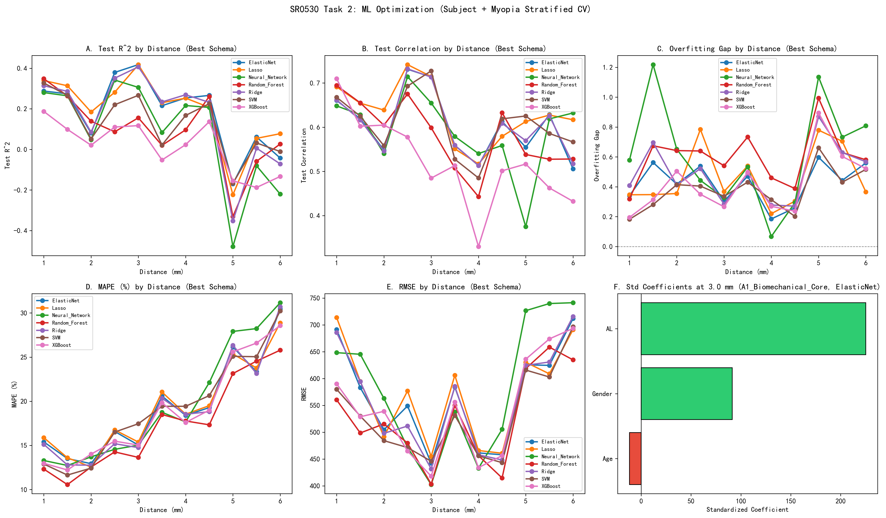
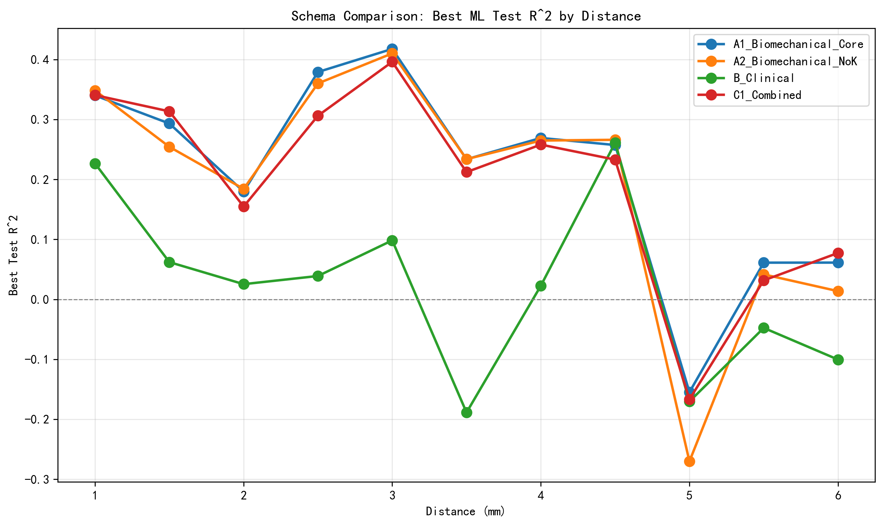

# SR0530 任务二报告：ML 模型优化（重构版）

> **目标**：在锁定 LMM 最佳偏心率后，建立基于常规眼科参数的视锥密度预测模型。
> **方法**：四方案策略 (A1/A2/B/C1) + Subject/近视分层 CV + SVM/RF/XGB/NN/Lasso/ElasticNet/Ridge + 标准化回归系数。
> **数据**：genData/CleanDataRoi_strict/（44 个 ROI，聚合为 11 个距离组，69 眼）。

---

## 一、VIF 共线性诊断

| 特征 | VIF |
|------|-----|
| AL | 184.25 |
| Age | 20.13 |
| SE | 2.22 |
| Gender | 1.82 |
| K | 229.06 |
| ACD | 45.34 |

*注：VIF > 10 提示存在严重多重共线性。方案 A1（仅 AL+Age+Gender）和 B（SE+Age+Gender）可彻底消除共线性。

## 二、方案说明

- **A1_Biomechanical_Core**：`[AL, Age, Gender]`，最精简，彻底消除共线性。
- **A2_Biomechanical_NoK**：`[AL, ACD, Age, Gender]`，剔除与 AL 共线性最高的 K。
- **B_Clinical**：`[SE, Age, Gender]`，临床筛查模型。
- **C1_Combined**：`[SE, AL, Age, Gender]`，同时包含 SE 和 AL，但剔除 K/ACD。

## 三、方案对比

| 距离 (mm) | 方案 | 最佳模型 | Test R² |
|-----------|------|----------|---------|
| 1.0 | A1_Biomechanical_Core | Random_Forest | 0.340 |
| 1.0 | A2_Biomechanical_NoK | Random_Forest | 0.348 |
| 1.0 | B_Clinical | Random_Forest | 0.227 |
| 1.0 | C1_Combined | Random_Forest | 0.341 |
| 1.5 | A1_Biomechanical_Core | Lasso | 0.293 |
| 1.5 | A2_Biomechanical_NoK | Random_Forest | 0.254 |
| 1.5 | B_Clinical | XGBoost | 0.062 |
| 1.5 | C1_Combined | Lasso | 0.314 |
| 2.0 | A1_Biomechanical_Core | Lasso | 0.180 |
| 2.0 | A2_Biomechanical_NoK | Lasso | 0.184 |
| 2.0 | B_Clinical | SVM | 0.025 |
| 2.0 | C1_Combined | Lasso | 0.155 |
| 2.5 | A1_Biomechanical_Core | ElasticNet | 0.379 |
| 2.5 | A2_Biomechanical_NoK | ElasticNet | 0.360 |
| 2.5 | B_Clinical | XGBoost | 0.039 |
| 2.5 | C1_Combined | ElasticNet | 0.306 |
| 3.0 | A1_Biomechanical_Core | ElasticNet | 0.418 |
| 3.0 | A2_Biomechanical_NoK | Lasso | 0.410 |
| 3.0 | B_Clinical | Neural_Network | 0.098 |
| 3.0 | C1_Combined | Lasso | 0.396 |
| 3.5 | A1_Biomechanical_Core | Ridge | 0.234 |
| 3.5 | A2_Biomechanical_NoK | Ridge | 0.234 |
| 3.5 | B_Clinical | Neural_Network | -0.189 |
| 3.5 | C1_Combined | Lasso | 0.212 |
| 4.0 | A1_Biomechanical_Core | Ridge | 0.269 |
| 4.0 | A2_Biomechanical_NoK | Ridge | 0.265 |
| 4.0 | B_Clinical | Neural_Network | 0.023 |
| 4.0 | C1_Combined | Ridge | 0.258 |
| 4.5 | A1_Biomechanical_Core | ElasticNet | 0.257 |
| 4.5 | A2_Biomechanical_NoK | ElasticNet | 0.266 |
| 4.5 | B_Clinical | Random_Forest | 0.261 |
| 4.5 | C1_Combined | ElasticNet | 0.233 |
| 5.0 | A1_Biomechanical_Core | XGBoost | -0.155 |
| 5.0 | A2_Biomechanical_NoK | Lasso | -0.270 |
| 5.0 | B_Clinical | XGBoost | -0.170 |
| 5.0 | C1_Combined | SVM | -0.167 |
| 5.5 | A1_Biomechanical_Core | ElasticNet | 0.061 |
| 5.5 | A2_Biomechanical_NoK | Lasso | 0.042 |
| 5.5 | B_Clinical | SVM | -0.048 |
| 5.5 | C1_Combined | ElasticNet | 0.032 |
| 6.0 | A1_Biomechanical_Core | Lasso | 0.061 |
| 6.0 | A2_Biomechanical_NoK | Lasso | 0.014 |
| 6.0 | B_Clinical | Random_Forest | -0.100 |
| 6.0 | C1_Combined | Lasso | 0.077 |

## 四、全部模型结果

| 距离 (mm) | 方案 | 模型 | N_eyes | N_subj | Train R² | Test R² | Test Corr | MAPE(%) | RMSE | Gap |
|-----------|------|------|--------|--------|----------|---------|-----------|---------|------|-----|
| 1.0 | A1_Biomechanical_Core | SVM | 69 | 44 | 0.452 | 0.321 | 0.664 | 11.52 | 521.0 | 0.131 |
| 1.0 | A1_Biomechanical_Core | Random_Forest | 69 | 44 | 0.605 | 0.340 | 0.684 | 11.59 | 515.9 | 0.265 |
| 1.0 | A1_Biomechanical_Core | XGBoost | 69 | 44 | 0.335 | 0.186 | 0.690 | 12.66 | 576.5 | 0.149 |
| 1.0 | A1_Biomechanical_Core | Neural_Network | 69 | 44 | 0.484 | 0.151 | 0.631 | 13.06 | 584.4 | 0.333 |
| 1.0 | A1_Biomechanical_Core | Lasso | 69 | 44 | 0.388 | 0.221 | 0.645 | 12.47 | 560.9 | 0.168 |
| 1.0 | A1_Biomechanical_Core | ElasticNet | 69 | 44 | 0.364 | 0.184 | 0.574 | 12.86 | 576.7 | 0.179 |
| 1.0 | A1_Biomechanical_Core | Ridge | 69 | 44 | 0.408 | 0.177 | 0.586 | 12.69 | 573.5 | 0.232 |
| 1.0 | A2_Biomechanical_NoK | SVM | 69 | 44 | 0.477 | 0.302 | 0.615 | 11.43 | 532.5 | 0.175 |
| 1.0 | A2_Biomechanical_NoK | Random_Forest | 69 | 44 | 0.634 | 0.348 | 0.691 | 11.42 | 513.3 | 0.285 |
| 1.0 | A2_Biomechanical_NoK | XGBoost | 69 | 44 | 0.344 | 0.149 | 0.660 | 12.97 | 590.1 | 0.195 |
| 1.0 | A2_Biomechanical_NoK | Neural_Network | 69 | 44 | 0.480 | -0.098 | 0.460 | 11.94 | 648.2 | 0.578 |
| 1.0 | A2_Biomechanical_NoK | Lasso | 69 | 44 | 0.383 | 0.238 | 0.637 | 12.33 | 556.5 | 0.145 |
| 1.0 | A2_Biomechanical_NoK | ElasticNet | 69 | 44 | 0.357 | 0.116 | 0.496 | 13.10 | 602.4 | 0.241 |
| 1.0 | A2_Biomechanical_NoK | Ridge | 69 | 44 | 0.415 | 0.116 | 0.525 | 12.86 | 596.8 | 0.299 |
| 1.0 | B_Clinical | SVM | 69 | 44 | 0.358 | 0.175 | 0.578 | 12.90 | 580.0 | 0.182 |
| 1.0 | B_Clinical | Random_Forest | 69 | 44 | 0.545 | 0.227 | 0.605 | 12.32 | 560.2 | 0.318 |
| 1.0 | B_Clinical | XGBoost | 69 | 44 | 0.297 | 0.154 | 0.598 | 12.74 | 588.8 | 0.143 |
| 1.0 | B_Clinical | Neural_Network | 69 | 44 | 0.490 | 0.113 | 0.597 | 13.29 | 594.7 | 0.377 |
| 1.0 | B_Clinical | Lasso | 69 | 44 | 0.089 | -0.258 | nan | 15.88 | 713.7 | 0.347 |
| 1.0 | B_Clinical | ElasticNet | 69 | 44 | 0.164 | -0.176 | 0.438 | 15.40 | 691.4 | 0.340 |
| 1.0 | B_Clinical | Ridge | 69 | 44 | 0.233 | -0.175 | 0.438 | 15.12 | 685.7 | 0.408 |
| 1.0 | C1_Combined | SVM | 69 | 44 | 0.493 | 0.327 | 0.668 | 11.52 | 523.6 | 0.166 |
| 1.0 | C1_Combined | Random_Forest | 69 | 44 | 0.642 | 0.341 | 0.694 | 11.47 | 517.2 | 0.302 |
| 1.0 | C1_Combined | XGBoost | 69 | 44 | 0.354 | 0.187 | 0.710 | 12.62 | 575.9 | 0.166 |
| 1.0 | C1_Combined | Neural_Network | 69 | 44 | 0.556 | 0.280 | 0.648 | 11.61 | 538.1 | 0.276 |
| 1.0 | C1_Combined | Lasso | 69 | 44 | 0.455 | 0.339 | 0.691 | 11.57 | 517.4 | 0.116 |
| 1.0 | C1_Combined | ElasticNet | 69 | 44 | 0.447 | 0.288 | 0.661 | 12.04 | 538.1 | 0.160 |
| 1.0 | C1_Combined | Ridge | 69 | 44 | 0.477 | 0.314 | 0.662 | 11.64 | 526.4 | 0.163 |
| 1.5 | A1_Biomechanical_Core | SVM | 66 | 43 | 0.440 | 0.267 | 0.625 | 9.84 | 457.6 | 0.174 |
| 1.5 | A1_Biomechanical_Core | Random_Forest | 66 | 43 | 0.623 | 0.264 | 0.655 | 9.28 | 448.1 | 0.359 |
| 1.5 | A1_Biomechanical_Core | XGBoost | 66 | 43 | 0.361 | 0.099 | 0.596 | 12.08 | 524.6 | 0.262 |
| 1.5 | A1_Biomechanical_Core | Neural_Network | 66 | 43 | 0.503 | 0.264 | 0.628 | 10.15 | 462.7 | 0.239 |
| 1.5 | A1_Biomechanical_Core | Lasso | 66 | 43 | 0.421 | 0.293 | 0.649 | 10.16 | 456.9 | 0.127 |
| 1.5 | A1_Biomechanical_Core | ElasticNet | 66 | 43 | 0.411 | 0.262 | 0.619 | 10.47 | 467.1 | 0.149 |
| 1.5 | A1_Biomechanical_Core | Ridge | 66 | 43 | 0.440 | 0.275 | 0.615 | 10.21 | 461.1 | 0.164 |
| 1.5 | A2_Biomechanical_NoK | SVM | 66 | 43 | 0.501 | 0.238 | 0.578 | 10.67 | 475.2 | 0.264 |
| 1.5 | A2_Biomechanical_NoK | Random_Forest | 66 | 43 | 0.664 | 0.254 | 0.626 | 9.62 | 462.0 | 0.409 |
| 1.5 | A2_Biomechanical_NoK | XGBoost | 66 | 43 | 0.370 | 0.085 | 0.567 | 12.22 | 528.8 | 0.285 |
| 1.5 | A2_Biomechanical_NoK | Neural_Network | 66 | 43 | 0.607 | -0.611 | 0.275 | 12.73 | 645.2 | 1.218 |
| 1.5 | A2_Biomechanical_NoK | Lasso | 66 | 43 | 0.434 | 0.087 | 0.511 | 11.05 | 525.7 | 0.348 |
| 1.5 | A2_Biomechanical_NoK | ElasticNet | 66 | 43 | 0.425 | -0.138 | 0.403 | 12.14 | 581.1 | 0.563 |
| 1.5 | A2_Biomechanical_NoK | Ridge | 66 | 43 | 0.476 | -0.220 | 0.384 | 11.98 | 594.3 | 0.697 |
| 1.5 | B_Clinical | SVM | 66 | 43 | 0.318 | 0.037 | 0.474 | 11.64 | 530.0 | 0.281 |
| 1.5 | B_Clinical | Random_Forest | 66 | 43 | 0.587 | -0.087 | 0.580 | 10.56 | 498.5 | 0.675 |
| 1.5 | B_Clinical | XGBoost | 66 | 43 | 0.338 | 0.062 | 0.602 | 11.78 | 523.9 | 0.276 |
| 1.5 | B_Clinical | Neural_Network | 66 | 43 | 0.393 | -0.035 | 0.390 | 11.86 | 550.0 | 0.427 |
| 1.5 | B_Clinical | Lasso | 66 | 43 | 0.182 | -0.153 | 0.472 | 13.60 | 594.8 | 0.335 |
| 1.5 | B_Clinical | ElasticNet | 66 | 43 | 0.182 | -0.107 | 0.427 | 13.51 | 583.1 | 0.289 |
| 1.5 | B_Clinical | Ridge | 66 | 43 | 0.236 | -0.068 | 0.425 | 12.79 | 571.7 | 0.305 |
| 1.5 | C1_Combined | SVM | 66 | 43 | 0.466 | 0.244 | 0.613 | 9.97 | 458.5 | 0.222 |
| 1.5 | C1_Combined | Random_Forest | 66 | 43 | 0.666 | 0.024 | 0.574 | 10.11 | 480.0 | 0.642 |
| 1.5 | C1_Combined | XGBoost | 66 | 43 | 0.379 | 0.066 | 0.539 | 12.05 | 527.0 | 0.313 |
| 1.5 | C1_Combined | Neural_Network | 66 | 43 | 0.545 | -0.228 | 0.479 | 11.66 | 519.0 | 0.773 |
| 1.5 | C1_Combined | Lasso | 66 | 43 | 0.446 | 0.314 | 0.654 | 9.99 | 447.6 | 0.133 |
| 1.5 | C1_Combined | ElasticNet | 66 | 43 | 0.443 | 0.274 | 0.619 | 10.50 | 463.2 | 0.169 |
| 1.5 | C1_Combined | Ridge | 66 | 43 | 0.473 | 0.286 | 0.616 | 10.27 | 457.1 | 0.187 |
| 2.0 | A1_Biomechanical_Core | SVM | 50 | 40 | 0.349 | 0.052 | 0.558 | 11.88 | 464.8 | 0.297 |
| 2.0 | A1_Biomechanical_Core | Random_Forest | 50 | 40 | 0.524 | 0.139 | 0.601 | 10.84 | 442.0 | 0.385 |
| 2.0 | A1_Biomechanical_Core | XGBoost | 50 | 40 | 0.308 | 0.020 | 0.605 | 12.64 | 485.6 | 0.289 |
| 2.0 | A1_Biomechanical_Core | Neural_Network | 50 | 40 | 0.405 | 0.047 | 0.540 | 11.81 | 475.4 | 0.358 |
| 2.0 | A1_Biomechanical_Core | Lasso | 50 | 40 | 0.369 | 0.180 | 0.638 | 11.03 | 442.0 | 0.189 |
| 2.0 | A1_Biomechanical_Core | ElasticNet | 50 | 40 | 0.364 | 0.069 | 0.520 | 11.76 | 470.0 | 0.294 |
| 2.0 | A1_Biomechanical_Core | Ridge | 50 | 40 | 0.382 | 0.077 | 0.526 | 11.57 | 466.3 | 0.305 |
| 2.0 | A2_Biomechanical_NoK | SVM | 50 | 40 | 0.426 | 0.012 | 0.555 | 12.43 | 484.3 | 0.414 |
| 2.0 | A2_Biomechanical_NoK | Random_Forest | 50 | 40 | 0.555 | 0.133 | 0.604 | 11.01 | 443.6 | 0.422 |
| 2.0 | A2_Biomechanical_NoK | XGBoost | 50 | 40 | 0.313 | 0.021 | 0.598 | 12.78 | 485.9 | 0.292 |
| 2.0 | A2_Biomechanical_NoK | Neural_Network | 50 | 40 | 0.338 | -0.314 | 0.334 | 13.70 | 563.0 | 0.652 |
| 2.0 | A2_Biomechanical_NoK | Lasso | 50 | 40 | 0.417 | 0.184 | 0.639 | 10.97 | 442.8 | 0.232 |
| 2.0 | A2_Biomechanical_NoK | ElasticNet | 50 | 40 | 0.376 | -0.041 | 0.345 | 12.50 | 504.5 | 0.418 |
| 2.0 | A2_Biomechanical_NoK | Ridge | 50 | 40 | 0.431 | 0.019 | 0.416 | 11.72 | 488.3 | 0.412 |
| 2.0 | B_Clinical | SVM | 50 | 40 | 0.314 | 0.025 | 0.482 | 12.19 | 481.7 | 0.289 |
| 2.0 | B_Clinical | Random_Forest | 50 | 40 | 0.459 | -0.184 | 0.420 | 12.55 | 515.4 | 0.642 |
| 2.0 | B_Clinical | XGBoost | 50 | 40 | 0.265 | -0.240 | 0.287 | 14.01 | 538.9 | 0.504 |
| 2.0 | B_Clinical | Neural_Network | 50 | 40 | 0.332 | -0.068 | 0.400 | 12.35 | 494.0 | 0.400 |
| 2.0 | B_Clinical | Lasso | 50 | 40 | 0.287 | -0.068 | 0.454 | 12.56 | 491.7 | 0.355 |
| 2.0 | B_Clinical | ElasticNet | 50 | 40 | 0.295 | -0.069 | 0.405 | 12.93 | 502.1 | 0.364 |
| 2.0 | B_Clinical | Ridge | 50 | 40 | 0.314 | -0.057 | 0.411 | 12.76 | 497.9 | 0.370 |
| 2.0 | C1_Combined | SVM | 50 | 40 | 0.378 | 0.038 | 0.538 | 11.59 | 467.3 | 0.340 |
| 2.0 | C1_Combined | Random_Forest | 50 | 40 | 0.533 | 0.085 | 0.571 | 10.95 | 455.0 | 0.448 |
| 2.0 | C1_Combined | XGBoost | 50 | 40 | 0.313 | -0.039 | 0.570 | 12.94 | 496.7 | 0.352 |
| 2.0 | C1_Combined | Neural_Network | 50 | 40 | 0.405 | -0.137 | 0.390 | 12.66 | 512.4 | 0.542 |
| 2.0 | C1_Combined | Lasso | 50 | 40 | 0.372 | 0.155 | 0.627 | 11.14 | 447.3 | 0.217 |
| 2.0 | C1_Combined | ElasticNet | 50 | 40 | 0.366 | 0.081 | 0.548 | 11.73 | 464.0 | 0.285 |
| 2.0 | C1_Combined | Ridge | 50 | 40 | 0.390 | 0.085 | 0.546 | 11.54 | 460.6 | 0.305 |
| 2.5 | A1_Biomechanical_Core | SVM | 48 | 35 | 0.430 | 0.220 | 0.693 | 15.13 | 414.2 | 0.210 |
| 2.5 | A1_Biomechanical_Core | Random_Forest | 48 | 35 | 0.607 | 0.087 | 0.675 | 13.85 | 424.4 | 0.521 |
| 2.5 | A1_Biomechanical_Core | XGBoost | 48 | 35 | 0.364 | 0.110 | 0.568 | 14.86 | 447.5 | 0.254 |
| 2.5 | A1_Biomechanical_Core | Neural_Network | 48 | 35 | 0.545 | 0.342 | 0.675 | 11.99 | 381.5 | 0.204 |
| 2.5 | A1_Biomechanical_Core | Lasso | 48 | 35 | 0.560 | 0.281 | 0.739 | 12.74 | 393.3 | 0.279 |
| 2.5 | A1_Biomechanical_Core | ElasticNet | 48 | 35 | 0.532 | 0.379 | 0.731 | 11.73 | 366.1 | 0.153 |
| 2.5 | A1_Biomechanical_Core | Ridge | 48 | 35 | 0.556 | 0.351 | 0.732 | 12.03 | 372.5 | 0.205 |
| 2.5 | A2_Biomechanical_NoK | SVM | 48 | 35 | 0.429 | 0.135 | 0.682 | 15.50 | 431.0 | 0.294 |
| 2.5 | A2_Biomechanical_NoK | Random_Forest | 48 | 35 | 0.620 | 0.034 | 0.650 | 14.11 | 436.3 | 0.586 |
| 2.5 | A2_Biomechanical_NoK | XGBoost | 48 | 35 | 0.377 | 0.027 | 0.459 | 15.48 | 463.7 | 0.350 |
| 2.5 | A2_Biomechanical_NoK | Neural_Network | 48 | 35 | 0.623 | 0.195 | 0.714 | 13.80 | 417.0 | 0.427 |
| 2.5 | A2_Biomechanical_NoK | Lasso | 48 | 35 | 0.559 | 0.282 | 0.742 | 12.65 | 392.8 | 0.277 |
| 2.5 | A2_Biomechanical_NoK | ElasticNet | 48 | 35 | 0.535 | 0.360 | 0.731 | 11.91 | 372.6 | 0.174 |
| 2.5 | A2_Biomechanical_NoK | Ridge | 48 | 35 | 0.564 | 0.296 | 0.731 | 12.27 | 387.8 | 0.268 |
| 2.5 | B_Clinical | SVM | 48 | 35 | 0.367 | -0.038 | 0.451 | 16.51 | 471.4 | 0.405 |
| 2.5 | B_Clinical | Random_Forest | 48 | 35 | 0.503 | -0.137 | 0.457 | 14.27 | 479.8 | 0.640 |
| 2.5 | B_Clinical | XGBoost | 48 | 35 | 0.334 | 0.039 | 0.425 | 15.17 | 464.9 | 0.295 |
| 2.5 | B_Clinical | Neural_Network | 48 | 35 | 0.340 | -0.035 | 0.365 | 14.56 | 471.7 | 0.375 |
| 2.5 | B_Clinical | Lasso | 48 | 35 | 0.096 | -0.688 | nan | 16.76 | 576.8 | 0.784 |
| 2.5 | B_Clinical | ElasticNet | 48 | 35 | 0.098 | -0.441 | nan | 16.58 | 548.9 | 0.539 |
| 2.5 | B_Clinical | Ridge | 48 | 35 | 0.210 | -0.312 | 0.286 | 15.19 | 511.4 | 0.521 |
| 2.5 | C1_Combined | SVM | 48 | 35 | 0.454 | 0.215 | 0.666 | 14.97 | 415.5 | 0.238 |
| 2.5 | C1_Combined | Random_Forest | 48 | 35 | 0.619 | 0.082 | 0.675 | 13.85 | 427.0 | 0.537 |
| 2.5 | C1_Combined | XGBoost | 48 | 35 | 0.369 | 0.109 | 0.578 | 14.81 | 448.5 | 0.260 |
| 2.5 | C1_Combined | Neural_Network | 48 | 35 | 0.633 | 0.190 | 0.617 | 13.92 | 417.4 | 0.443 |
| 2.5 | C1_Combined | Lasso | 48 | 35 | 0.580 | 0.249 | 0.726 | 13.24 | 396.2 | 0.332 |
| 2.5 | C1_Combined | ElasticNet | 48 | 35 | 0.556 | 0.306 | 0.680 | 12.38 | 382.4 | 0.250 |
| 2.5 | C1_Combined | Ridge | 48 | 35 | 0.588 | 0.282 | 0.720 | 12.60 | 375.0 | 0.306 |
| 3.0 | A1_Biomechanical_Core | SVM | 52 | 37 | 0.351 | 0.260 | 0.727 | 15.51 | 363.1 | 0.090 |
| 3.0 | A1_Biomechanical_Core | Random_Forest | 52 | 37 | 0.609 | 0.156 | 0.599 | 13.11 | 375.2 | 0.453 |
| 3.0 | A1_Biomechanical_Core | XGBoost | 52 | 37 | 0.341 | 0.117 | 0.485 | 14.24 | 405.6 | 0.223 |
| 3.0 | A1_Biomechanical_Core | Neural_Network | 52 | 37 | 0.455 | 0.306 | 0.655 | 11.92 | 359.8 | 0.150 |
| 3.0 | A1_Biomechanical_Core | Lasso | 52 | 37 | 0.548 | 0.417 | 0.714 | 10.60 | 315.2 | 0.131 |
| 3.0 | A1_Biomechanical_Core | ElasticNet | 52 | 37 | 0.529 | 0.418 | 0.714 | 10.90 | 320.4 | 0.111 |
| 3.0 | A1_Biomechanical_Core | Ridge | 52 | 37 | 0.551 | 0.407 | 0.713 | 10.72 | 318.0 | 0.144 |
| 3.0 | A2_Biomechanical_NoK | SVM | 52 | 37 | 0.346 | 0.161 | 0.688 | 16.43 | 383.8 | 0.185 |
| 3.0 | A2_Biomechanical_NoK | Random_Forest | 52 | 37 | 0.625 | 0.085 | 0.546 | 13.64 | 391.2 | 0.541 |
| 3.0 | A2_Biomechanical_NoK | XGBoost | 52 | 37 | 0.352 | 0.086 | 0.415 | 14.56 | 412.7 | 0.266 |
| 3.0 | A2_Biomechanical_NoK | Neural_Network | 52 | 37 | 0.420 | 0.185 | 0.612 | 15.03 | 380.4 | 0.235 |
| 3.0 | A2_Biomechanical_NoK | Lasso | 52 | 37 | 0.543 | 0.410 | 0.715 | 10.70 | 317.1 | 0.133 |
| 3.0 | A2_Biomechanical_NoK | ElasticNet | 52 | 37 | 0.532 | 0.394 | 0.691 | 11.16 | 325.6 | 0.138 |
| 3.0 | A2_Biomechanical_NoK | Ridge | 52 | 37 | 0.546 | 0.353 | 0.691 | 11.44 | 332.5 | 0.193 |
| 3.0 | B_Clinical | SVM | 52 | 37 | 0.263 | -0.073 | 0.346 | 17.45 | 445.8 | 0.336 |
| 3.0 | B_Clinical | Random_Forest | 52 | 37 | 0.496 | 0.065 | 0.488 | 13.47 | 403.3 | 0.431 |
| 3.0 | B_Clinical | XGBoost | 52 | 37 | 0.292 | 0.049 | 0.452 | 15.03 | 418.0 | 0.243 |
| 3.0 | B_Clinical | Neural_Network | 52 | 37 | 0.273 | 0.098 | 0.446 | 13.74 | 402.3 | 0.174 |
| 3.0 | B_Clinical | Lasso | 52 | 37 | 0.218 | -0.150 | 0.308 | 15.38 | 454.8 | 0.368 |
| 3.0 | B_Clinical | ElasticNet | 52 | 37 | 0.218 | -0.086 | 0.353 | 15.05 | 442.2 | 0.304 |
| 3.0 | B_Clinical | Ridge | 52 | 37 | 0.238 | -0.046 | 0.357 | 14.75 | 431.6 | 0.284 |
| 3.0 | C1_Combined | SVM | 52 | 37 | 0.383 | 0.266 | 0.716 | 14.79 | 358.9 | 0.117 |
| 3.0 | C1_Combined | Random_Forest | 52 | 37 | 0.626 | 0.130 | 0.594 | 13.26 | 379.5 | 0.496 |
| 3.0 | C1_Combined | XGBoost | 52 | 37 | 0.354 | 0.091 | 0.479 | 14.42 | 411.4 | 0.263 |
| 3.0 | C1_Combined | Neural_Network | 52 | 37 | 0.619 | 0.292 | 0.649 | 12.14 | 348.6 | 0.327 |
| 3.0 | C1_Combined | Lasso | 52 | 37 | 0.545 | 0.396 | 0.709 | 10.82 | 320.0 | 0.149 |
| 3.0 | C1_Combined | ElasticNet | 52 | 37 | 0.535 | 0.386 | 0.713 | 11.36 | 324.9 | 0.149 |
| 3.0 | C1_Combined | Ridge | 52 | 37 | 0.548 | 0.352 | 0.714 | 11.50 | 329.8 | 0.196 |
| 3.5 | A1_Biomechanical_Core | SVM | 59 | 43 | 0.314 | 0.002 | 0.503 | 17.90 | 481.7 | 0.312 |
| 3.5 | A1_Biomechanical_Core | Random_Forest | 59 | 43 | 0.533 | -0.002 | 0.508 | 14.65 | 476.3 | 0.536 |
| 3.5 | A1_Biomechanical_Core | XGBoost | 59 | 43 | 0.302 | -0.052 | 0.513 | 18.13 | 507.6 | 0.354 |
| 3.5 | A1_Biomechanical_Core | Neural_Network | 59 | 43 | 0.408 | 0.083 | 0.579 | 15.45 | 467.4 | 0.325 |
| 3.5 | A1_Biomechanical_Core | Lasso | 59 | 43 | 0.372 | 0.230 | 0.551 | 13.91 | 439.5 | 0.142 |
| 3.5 | A1_Biomechanical_Core | ElasticNet | 59 | 43 | 0.364 | 0.215 | 0.559 | 14.50 | 444.6 | 0.148 |
| 3.5 | A1_Biomechanical_Core | Ridge | 59 | 43 | 0.381 | 0.234 | 0.559 | 13.91 | 438.6 | 0.147 |
| 3.5 | A2_Biomechanical_NoK | SVM | 59 | 43 | 0.453 | 0.022 | 0.528 | 17.73 | 470.4 | 0.431 |
| 3.5 | A2_Biomechanical_NoK | Random_Forest | 59 | 43 | 0.568 | 0.020 | 0.507 | 15.07 | 469.2 | 0.548 |
| 3.5 | A2_Biomechanical_NoK | XGBoost | 59 | 43 | 0.332 | -0.165 | 0.513 | 18.48 | 521.5 | 0.497 |
| 3.5 | A2_Biomechanical_NoK | Neural_Network | 59 | 43 | 0.500 | 0.030 | 0.477 | 15.86 | 484.1 | 0.470 |
| 3.5 | A2_Biomechanical_NoK | Lasso | 59 | 43 | 0.535 | 0.207 | 0.511 | 13.97 | 435.8 | 0.328 |
| 3.5 | A2_Biomechanical_NoK | ElasticNet | 59 | 43 | 0.504 | 0.201 | 0.558 | 14.68 | 435.2 | 0.303 |
| 3.5 | A2_Biomechanical_NoK | Ridge | 59 | 43 | 0.536 | 0.234 | 0.539 | 13.87 | 423.2 | 0.302 |
| 3.5 | B_Clinical | SVM | 59 | 43 | 0.180 | -0.219 | 0.356 | 19.43 | 531.1 | 0.399 |
| 3.5 | B_Clinical | Random_Forest | 59 | 43 | 0.430 | -0.303 | 0.317 | 18.49 | 549.8 | 0.733 |
| 3.5 | B_Clinical | XGBoost | 59 | 43 | 0.250 | -0.245 | 0.265 | 19.83 | 556.1 | 0.495 |
| 3.5 | B_Clinical | Neural_Network | 59 | 43 | 0.164 | -0.189 | 0.438 | 18.75 | 537.6 | 0.353 |
| 3.5 | B_Clinical | Lasso | 59 | 43 | 0.070 | -0.469 | nan | 21.05 | 606.1 | 0.539 |
| 3.5 | B_Clinical | ElasticNet | 59 | 43 | 0.105 | -0.365 | 0.341 | 20.59 | 584.0 | 0.471 |
| 3.5 | B_Clinical | Ridge | 59 | 43 | 0.146 | -0.346 | 0.331 | 20.33 | 585.5 | 0.492 |
| 3.5 | C1_Combined | SVM | 59 | 43 | 0.316 | -0.010 | 0.496 | 18.35 | 485.3 | 0.327 |
| 3.5 | C1_Combined | Random_Forest | 59 | 43 | 0.548 | -0.091 | 0.477 | 15.64 | 495.4 | 0.639 |
| 3.5 | C1_Combined | XGBoost | 59 | 43 | 0.305 | -0.103 | 0.437 | 18.81 | 524.2 | 0.408 |
| 3.5 | C1_Combined | Neural_Network | 59 | 43 | 0.374 | -0.159 | 0.325 | 17.61 | 507.3 | 0.533 |
| 3.5 | C1_Combined | Lasso | 59 | 43 | 0.377 | 0.212 | 0.521 | 13.92 | 443.1 | 0.165 |
| 3.5 | C1_Combined | ElasticNet | 59 | 43 | 0.380 | 0.201 | 0.557 | 14.42 | 447.4 | 0.179 |
| 3.5 | C1_Combined | Ridge | 59 | 43 | 0.394 | 0.206 | 0.557 | 14.21 | 445.1 | 0.188 |
| 4.0 | A1_Biomechanical_Core | SVM | 51 | 36 | 0.311 | 0.167 | 0.485 | 16.99 | 391.8 | 0.143 |
| 4.0 | A1_Biomechanical_Core | Random_Forest | 51 | 36 | 0.478 | 0.096 | 0.440 | 14.86 | 402.9 | 0.381 |
| 4.0 | A1_Biomechanical_Core | XGBoost | 51 | 36 | 0.261 | 0.023 | 0.302 | 17.18 | 429.8 | 0.238 |
| 4.0 | A1_Biomechanical_Core | Neural_Network | 51 | 36 | 0.102 | 0.154 | 0.509 | 16.76 | 400.5 | -0.053 |
| 4.0 | A1_Biomechanical_Core | Lasso | 51 | 36 | 0.412 | 0.252 | 0.509 | 13.24 | 360.8 | 0.160 |
| 4.0 | A1_Biomechanical_Core | ElasticNet | 51 | 36 | 0.398 | 0.254 | 0.513 | 13.72 | 362.3 | 0.144 |
| 4.0 | A1_Biomechanical_Core | Ridge | 51 | 36 | 0.410 | 0.269 | 0.512 | 13.17 | 356.6 | 0.141 |
| 4.0 | A2_Biomechanical_NoK | SVM | 51 | 36 | 0.310 | 0.162 | 0.421 | 17.13 | 393.0 | 0.148 |
| 4.0 | A2_Biomechanical_NoK | Random_Forest | 51 | 36 | 0.504 | 0.078 | 0.443 | 15.29 | 407.4 | 0.426 |
| 4.0 | A2_Biomechanical_NoK | XGBoost | 51 | 36 | 0.282 | 0.013 | 0.314 | 17.60 | 433.3 | 0.269 |
| 4.0 | A2_Biomechanical_NoK | Neural_Network | 51 | 36 | 0.254 | 0.216 | 0.540 | 15.92 | 376.7 | 0.038 |
| 4.0 | A2_Biomechanical_NoK | Lasso | 51 | 36 | 0.411 | 0.250 | 0.510 | 13.37 | 361.6 | 0.161 |
| 4.0 | A2_Biomechanical_NoK | ElasticNet | 51 | 36 | 0.398 | 0.249 | 0.512 | 13.72 | 363.4 | 0.149 |
| 4.0 | A2_Biomechanical_NoK | Ridge | 51 | 36 | 0.411 | 0.265 | 0.513 | 13.19 | 357.7 | 0.146 |
| 4.0 | B_Clinical | SVM | 51 | 36 | 0.201 | -0.112 | 0.270 | 19.43 | 455.9 | 0.314 |
| 4.0 | B_Clinical | Random_Forest | 51 | 36 | 0.332 | -0.102 | 0.085 | 17.77 | 456.4 | 0.434 |
| 4.0 | B_Clinical | XGBoost | 51 | 36 | 0.206 | 0.016 | 0.320 | 17.38 | 434.0 | 0.189 |
| 4.0 | B_Clinical | Neural_Network | 51 | 36 | 0.090 | 0.023 | 0.435 | 17.67 | 432.8 | 0.067 |
| 4.0 | B_Clinical | Lasso | 51 | 36 | 0.066 | -0.154 | nan | 18.54 | 465.9 | 0.220 |
| 4.0 | B_Clinical | ElasticNet | 51 | 36 | 0.059 | -0.125 | nan | 18.40 | 461.4 | 0.185 |
| 4.0 | B_Clinical | Ridge | 51 | 36 | 0.133 | -0.145 | 0.245 | 18.53 | 457.9 | 0.278 |
| 4.0 | C1_Combined | SVM | 51 | 36 | 0.311 | 0.140 | 0.452 | 17.25 | 398.7 | 0.171 |
| 4.0 | C1_Combined | Random_Forest | 51 | 36 | 0.494 | 0.034 | 0.375 | 15.52 | 417.1 | 0.460 |
| 4.0 | C1_Combined | XGBoost | 51 | 36 | 0.280 | 0.015 | 0.330 | 17.46 | 432.3 | 0.265 |
| 4.0 | C1_Combined | Neural_Network | 51 | 36 | 0.268 | 0.201 | 0.437 | 15.41 | 381.9 | 0.067 |
| 4.0 | C1_Combined | Lasso | 51 | 36 | 0.410 | 0.253 | 0.517 | 13.28 | 361.3 | 0.157 |
| 4.0 | C1_Combined | ElasticNet | 51 | 36 | 0.396 | 0.233 | 0.500 | 13.72 | 368.2 | 0.163 |
| 4.0 | C1_Combined | Ridge | 51 | 36 | 0.411 | 0.258 | 0.503 | 13.13 | 359.0 | 0.153 |
| 4.5 | A1_Biomechanical_Core | SVM | 48 | 32 | 0.375 | 0.192 | 0.597 | 18.72 | 412.0 | 0.183 |
| 4.5 | A1_Biomechanical_Core | Random_Forest | 48 | 32 | 0.510 | 0.165 | 0.548 | 16.72 | 404.8 | 0.345 |
| 4.5 | A1_Biomechanical_Core | XGBoost | 48 | 32 | 0.296 | 0.101 | 0.498 | 18.58 | 448.1 | 0.195 |
| 4.5 | A1_Biomechanical_Core | Neural_Network | 48 | 32 | 0.187 | -0.106 | 0.007 | 22.12 | 505.3 | 0.293 |
| 4.5 | A1_Biomechanical_Core | Lasso | 48 | 32 | 0.439 | 0.207 | 0.579 | 15.65 | 380.9 | 0.231 |
| 4.5 | A1_Biomechanical_Core | ElasticNet | 48 | 32 | 0.416 | 0.257 | 0.582 | 15.88 | 384.7 | 0.158 |
| 4.5 | A1_Biomechanical_Core | Ridge | 48 | 32 | 0.431 | 0.232 | 0.581 | 16.09 | 387.7 | 0.199 |
| 4.5 | A2_Biomechanical_NoK | SVM | 48 | 32 | 0.370 | 0.189 | 0.570 | 18.82 | 410.5 | 0.181 |
| 4.5 | A2_Biomechanical_NoK | Random_Forest | 48 | 32 | 0.517 | 0.129 | 0.528 | 17.33 | 414.7 | 0.388 |
| 4.5 | A2_Biomechanical_NoK | XGBoost | 48 | 32 | 0.301 | 0.065 | 0.445 | 19.00 | 456.3 | 0.236 |
| 4.5 | A2_Biomechanical_NoK | Neural_Network | 48 | 32 | 0.490 | 0.207 | 0.519 | 17.51 | 411.2 | 0.284 |
| 4.5 | A2_Biomechanical_NoK | Lasso | 48 | 32 | 0.433 | 0.184 | 0.576 | 16.46 | 394.4 | 0.250 |
| 4.5 | A2_Biomechanical_NoK | ElasticNet | 48 | 32 | 0.418 | 0.266 | 0.568 | 15.56 | 382.2 | 0.152 |
| 4.5 | A2_Biomechanical_NoK | Ridge | 48 | 32 | 0.432 | 0.227 | 0.569 | 16.14 | 390.3 | 0.205 |
| 4.5 | B_Clinical | SVM | 48 | 32 | 0.329 | 0.127 | 0.569 | 20.64 | 443.3 | 0.202 |
| 4.5 | B_Clinical | Random_Forest | 48 | 32 | 0.476 | 0.261 | 0.633 | 16.50 | 394.1 | 0.215 |
| 4.5 | B_Clinical | XGBoost | 48 | 32 | 0.279 | 0.137 | 0.501 | 18.73 | 444.2 | 0.143 |
| 4.5 | B_Clinical | Neural_Network | 48 | 32 | 0.281 | 0.022 | 0.559 | 20.30 | 461.6 | 0.259 |
| 4.5 | B_Clinical | Lasso | 48 | 32 | 0.306 | 0.003 | 0.570 | 19.50 | 460.8 | 0.304 |
| 4.5 | B_Clinical | ElasticNet | 48 | 32 | 0.288 | 0.029 | 0.528 | 19.29 | 458.0 | 0.259 |
| 4.5 | B_Clinical | Ridge | 48 | 32 | 0.324 | 0.054 | 0.528 | 18.82 | 448.2 | 0.270 |
| 4.5 | C1_Combined | SVM | 48 | 32 | 0.393 | 0.225 | 0.619 | 18.37 | 404.4 | 0.168 |
| 4.5 | C1_Combined | Random_Forest | 48 | 32 | 0.521 | 0.199 | 0.575 | 16.43 | 396.9 | 0.321 |
| 4.5 | C1_Combined | XGBoost | 48 | 32 | 0.305 | 0.102 | 0.491 | 18.66 | 447.7 | 0.203 |
| 4.5 | C1_Combined | Neural_Network | 48 | 32 | 0.433 | 0.146 | 0.426 | 17.98 | 427.3 | 0.287 |
| 4.5 | C1_Combined | Lasso | 48 | 32 | 0.437 | 0.199 | 0.572 | 16.08 | 388.0 | 0.237 |
| 4.5 | C1_Combined | ElasticNet | 48 | 32 | 0.417 | 0.233 | 0.613 | 16.66 | 392.0 | 0.184 |
| 4.5 | C1_Combined | Ridge | 48 | 32 | 0.436 | 0.206 | 0.609 | 16.82 | 395.7 | 0.229 |
| 5.0 | A1_Biomechanical_Core | SVM | 44 | 32 | 0.331 | -0.330 | 0.346 | 25.09 | 615.8 | 0.661 |
| 5.0 | A1_Biomechanical_Core | Random_Forest | 44 | 32 | 0.443 | -0.528 | 0.538 | 22.91 | 610.2 | 0.971 |
| 5.0 | A1_Biomechanical_Core | XGBoost | 44 | 32 | 0.314 | -0.155 | 0.517 | 23.90 | 607.1 | 0.468 |
| 5.0 | A1_Biomechanical_Core | Neural_Network | 44 | 32 | 0.068 | -0.844 | -0.243 | 27.91 | 726.4 | 0.911 |
| 5.0 | A1_Biomechanical_Core | Lasso | 44 | 32 | 0.326 | -0.223 | 0.441 | 22.27 | 581.7 | 0.549 |
| 5.0 | A1_Biomechanical_Core | ElasticNet | 44 | 32 | 0.304 | -0.274 | 0.286 | 23.85 | 604.2 | 0.578 |
| 5.0 | A1_Biomechanical_Core | Ridge | 44 | 32 | 0.331 | -0.408 | 0.305 | 23.69 | 604.1 | 0.740 |
| 5.0 | A2_Biomechanical_NoK | SVM | 44 | 32 | 0.376 | -0.274 | 0.379 | 24.12 | 604.1 | 0.649 |
| 5.0 | A2_Biomechanical_NoK | Random_Forest | 44 | 32 | 0.488 | -0.487 | 0.480 | 23.11 | 618.5 | 0.976 |
| 5.0 | A2_Biomechanical_NoK | XGBoost | 44 | 32 | 0.396 | -0.498 | 0.492 | 24.94 | 636.0 | 0.894 |
| 5.0 | A2_Biomechanical_NoK | Neural_Network | 44 | 32 | 0.395 | -0.489 | 0.375 | 25.80 | 627.2 | 0.883 |
| 5.0 | A2_Biomechanical_NoK | Lasso | 44 | 32 | 0.301 | -0.270 | 0.410 | 23.47 | 604.1 | 0.571 |
| 5.0 | A2_Biomechanical_NoK | ElasticNet | 44 | 32 | 0.320 | -0.276 | 0.295 | 23.71 | 609.6 | 0.597 |
| 5.0 | A2_Biomechanical_NoK | Ridge | 44 | 32 | 0.355 | -0.410 | 0.296 | 23.37 | 605.4 | 0.765 |
| 5.0 | B_Clinical | SVM | 44 | 32 | 0.370 | -0.247 | 0.567 | 24.95 | 575.1 | 0.617 |
| 5.0 | B_Clinical | Random_Forest | 44 | 32 | 0.500 | -0.331 | 0.486 | 23.14 | 601.7 | 0.831 |
| 5.0 | B_Clinical | XGBoost | 44 | 32 | 0.346 | -0.170 | 0.512 | 24.42 | 612.6 | 0.516 |
| 5.0 | B_Clinical | Neural_Network | 44 | 32 | 0.319 | -0.478 | 0.299 | 25.23 | 641.2 | 0.798 |
| 5.0 | B_Clinical | Lasso | 44 | 32 | 0.244 | -0.308 | 0.355 | 25.37 | 630.3 | 0.552 |
| 5.0 | B_Clinical | ElasticNet | 44 | 32 | 0.256 | -0.338 | 0.295 | 26.15 | 625.5 | 0.594 |
| 5.0 | B_Clinical | Ridge | 44 | 32 | 0.291 | -0.353 | 0.295 | 26.33 | 624.5 | 0.644 |
| 5.0 | C1_Combined | SVM | 44 | 32 | 0.415 | -0.167 | 0.625 | 22.51 | 559.2 | 0.582 |
| 5.0 | C1_Combined | Random_Forest | 44 | 32 | 0.519 | -0.475 | 0.515 | 22.91 | 602.0 | 0.994 |
| 5.0 | C1_Combined | XGBoost | 44 | 32 | 0.349 | -0.229 | 0.397 | 25.59 | 629.6 | 0.578 |
| 5.0 | C1_Combined | Neural_Network | 44 | 32 | 0.393 | -0.742 | 0.250 | 26.60 | 643.0 | 1.135 |
| 5.0 | C1_Combined | Lasso | 44 | 32 | 0.420 | -0.359 | 0.613 | 22.79 | 587.8 | 0.779 |
| 5.0 | C1_Combined | ElasticNet | 44 | 32 | 0.428 | -0.170 | 0.555 | 22.45 | 565.1 | 0.597 |
| 5.0 | C1_Combined | Ridge | 44 | 32 | 0.454 | -0.416 | 0.570 | 22.40 | 574.3 | 0.870 |
| 5.5 | A1_Biomechanical_Core | SVM | 41 | 31 | 0.335 | 0.011 | 0.586 | 23.47 | 590.1 | 0.324 |
| 5.5 | A1_Biomechanical_Core | Random_Forest | 41 | 31 | 0.438 | -0.081 | 0.498 | 23.55 | 615.9 | 0.519 |
| 5.5 | A1_Biomechanical_Core | XGBoost | 41 | 31 | 0.299 | -0.188 | 0.463 | 24.29 | 656.6 | 0.487 |
| 5.5 | A1_Biomechanical_Core | Neural_Network | 41 | 31 | -0.042 | -0.538 | -0.211 | 28.23 | 739.7 | 0.496 |
| 5.5 | A1_Biomechanical_Core | Lasso | 41 | 31 | 0.375 | 0.054 | 0.627 | 21.38 | 549.3 | 0.321 |
| 5.5 | A1_Biomechanical_Core | ElasticNet | 41 | 31 | 0.348 | 0.061 | 0.629 | 21.80 | 561.6 | 0.286 |
| 5.5 | A1_Biomechanical_Core | Ridge | 41 | 31 | 0.373 | 0.006 | 0.625 | 21.72 | 547.1 | 0.366 |
| 5.5 | A2_Biomechanical_NoK | SVM | 41 | 31 | 0.399 | 0.032 | 0.563 | 23.42 | 587.2 | 0.367 |
| 5.5 | A2_Biomechanical_NoK | Random_Forest | 41 | 31 | 0.445 | -0.058 | 0.528 | 23.84 | 618.4 | 0.504 |
| 5.5 | A2_Biomechanical_NoK | XGBoost | 41 | 31 | 0.300 | -0.214 | 0.428 | 25.53 | 652.1 | 0.514 |
| 5.5 | A2_Biomechanical_NoK | Neural_Network | 41 | 31 | 0.325 | -0.408 | 0.339 | 27.84 | 691.2 | 0.733 |
| 5.5 | A2_Biomechanical_NoK | Lasso | 41 | 31 | 0.418 | 0.042 | 0.598 | 21.18 | 564.8 | 0.377 |
| 5.5 | A2_Biomechanical_NoK | ElasticNet | 41 | 31 | 0.381 | -0.062 | 0.445 | 21.51 | 624.5 | 0.443 |
| 5.5 | A2_Biomechanical_NoK | Ridge | 41 | 31 | 0.413 | -0.108 | 0.375 | 21.12 | 630.8 | 0.520 |
| 5.5 | B_Clinical | SVM | 41 | 31 | 0.323 | -0.048 | 0.554 | 24.02 | 602.9 | 0.370 |
| 5.5 | B_Clinical | Random_Forest | 41 | 31 | 0.371 | -0.222 | 0.464 | 24.55 | 658.5 | 0.593 |
| 5.5 | B_Clinical | XGBoost | 41 | 31 | 0.280 | -0.324 | 0.398 | 26.59 | 673.8 | 0.603 |
| 5.5 | B_Clinical | Neural_Network | 41 | 31 | 0.227 | -0.081 | 0.619 | 24.14 | 620.4 | 0.307 |
| 5.5 | B_Clinical | Lasso | 41 | 31 | 0.364 | -0.341 | 0.568 | 23.77 | 608.7 | 0.705 |
| 5.5 | B_Clinical | ElasticNet | 41 | 31 | 0.327 | -0.093 | 0.564 | 23.34 | 599.3 | 0.420 |
| 5.5 | B_Clinical | Ridge | 41 | 31 | 0.350 | -0.279 | 0.570 | 23.15 | 609.1 | 0.630 |
| 5.5 | C1_Combined | SVM | 41 | 31 | 0.366 | -0.065 | 0.558 | 25.04 | 600.2 | 0.431 |
| 5.5 | C1_Combined | Random_Forest | 41 | 31 | 0.444 | -0.185 | 0.503 | 24.39 | 634.1 | 0.629 |
| 5.5 | C1_Combined | XGBoost | 41 | 31 | 0.302 | -0.205 | 0.419 | 24.92 | 662.0 | 0.507 |
| 5.5 | C1_Combined | Neural_Network | 41 | 31 | 0.332 | -0.384 | 0.526 | 25.62 | 659.8 | 0.716 |
| 5.5 | C1_Combined | Lasso | 41 | 31 | 0.383 | -0.009 | 0.583 | 22.39 | 576.9 | 0.392 |
| 5.5 | C1_Combined | ElasticNet | 41 | 31 | 0.377 | 0.032 | 0.614 | 22.06 | 564.8 | 0.345 |
| 5.5 | C1_Combined | Ridge | 41 | 31 | 0.385 | -0.007 | 0.609 | 22.29 | 567.1 | 0.392 |
| 6.0 | A1_Biomechanical_Core | SVM | 39 | 32 | 0.344 | -0.011 | 0.425 | 27.49 | 631.9 | 0.354 |
| 6.0 | A1_Biomechanical_Core | Random_Forest | 39 | 32 | 0.510 | 0.027 | 0.519 | 24.61 | 616.0 | 0.483 |
| 6.0 | A1_Biomechanical_Core | XGBoost | 39 | 32 | 0.348 | -0.140 | 0.432 | 27.81 | 672.8 | 0.488 |
| 6.0 | A1_Biomechanical_Core | Neural_Network | 39 | 32 | -0.024 | -0.297 | -0.095 | 30.64 | 741.3 | 0.273 |
| 6.0 | A1_Biomechanical_Core | Lasso | 39 | 32 | 0.274 | 0.061 | 0.595 | 25.13 | 617.7 | 0.213 |
| 6.0 | A1_Biomechanical_Core | ElasticNet | 39 | 32 | 0.280 | -0.070 | 0.349 | 27.15 | 651.9 | 0.350 |
| 6.0 | A1_Biomechanical_Core | Ridge | 39 | 32 | 0.295 | -0.074 | 0.344 | 26.95 | 651.2 | 0.370 |
| 6.0 | A2_Biomechanical_NoK | SVM | 39 | 32 | 0.415 | -0.069 | 0.408 | 27.02 | 657.8 | 0.484 |
| 6.0 | A2_Biomechanical_NoK | Random_Forest | 39 | 32 | 0.516 | -0.005 | 0.502 | 25.61 | 628.0 | 0.521 |
| 6.0 | A2_Biomechanical_NoK | XGBoost | 39 | 32 | 0.353 | -0.133 | 0.406 | 28.22 | 671.9 | 0.487 |
| 6.0 | A2_Biomechanical_NoK | Neural_Network | 39 | 32 | 0.481 | -0.328 | 0.540 | 30.62 | 704.5 | 0.809 |
| 6.0 | A2_Biomechanical_NoK | Lasso | 39 | 32 | 0.379 | 0.014 | 0.435 | 24.33 | 635.2 | 0.366 |
| 6.0 | A2_Biomechanical_NoK | ElasticNet | 39 | 32 | 0.366 | -0.194 | 0.154 | 26.28 | 694.4 | 0.560 |
| 6.0 | A2_Biomechanical_NoK | Ridge | 39 | 32 | 0.394 | -0.174 | 0.219 | 25.38 | 689.5 | 0.568 |
| 6.0 | B_Clinical | SVM | 39 | 32 | 0.260 | -0.256 | 0.295 | 30.22 | 696.4 | 0.517 |
| 6.0 | B_Clinical | Random_Forest | 39 | 32 | 0.467 | -0.100 | 0.528 | 25.35 | 634.8 | 0.567 |
| 6.0 | B_Clinical | XGBoost | 39 | 32 | 0.304 | -0.217 | 0.267 | 28.57 | 693.3 | 0.521 |
| 6.0 | B_Clinical | Neural_Network | 39 | 32 | 0.087 | -0.275 | 0.436 | 31.16 | 707.8 | 0.361 |
| 6.0 | B_Clinical | Lasso | 39 | 32 | 0.116 | -0.161 | 0.495 | 28.87 | 691.0 | 0.277 |
| 6.0 | B_Clinical | ElasticNet | 39 | 32 | 0.138 | -0.245 | 0.269 | 30.46 | 711.7 | 0.383 |
| 6.0 | B_Clinical | Ridge | 39 | 32 | 0.168 | -0.277 | 0.252 | 30.70 | 715.6 | 0.445 |
| 6.0 | C1_Combined | SVM | 39 | 32 | 0.414 | -0.058 | 0.567 | 26.32 | 631.3 | 0.472 |
| 6.0 | C1_Combined | Random_Forest | 39 | 32 | 0.523 | -0.058 | 0.514 | 25.79 | 631.4 | 0.581 |
| 6.0 | C1_Combined | XGBoost | 39 | 32 | 0.347 | -0.175 | 0.421 | 28.26 | 683.1 | 0.522 |
| 6.0 | C1_Combined | Neural_Network | 39 | 32 | 0.511 | -0.220 | 0.632 | 28.82 | 655.8 | 0.731 |
| 6.0 | C1_Combined | Lasso | 39 | 32 | 0.314 | 0.077 | 0.617 | 24.88 | 609.6 | 0.237 |
| 6.0 | C1_Combined | ElasticNet | 39 | 32 | 0.345 | -0.043 | 0.506 | 26.69 | 635.5 | 0.388 |
| 6.0 | C1_Combined | Ridge | 39 | 32 | 0.358 | -0.071 | 0.517 | 26.59 | 637.1 | 0.430 |

**总体最佳配置**：距离 **3.0 mm**，方案 **A1_Biomechanical_Core**，模型 **ElasticNet**。

## 五、标准化回归系数（替代 SHAP）

对总体最佳配置（A1_Biomechanical_Core，3.0 mm）进行 Bootstrap 标准化系数分析：

| 特征 | Coef | 95% CI Lower | 95% CI Upper | CI Includes Zero |
|------|------|--------------|--------------|------------------|
| AL | 225.272 | 153.470 | 271.578 | 否 |
| Age | -11.764 | 26.649 | 161.032 | 否 |
| Gender | 91.374 | -67.142 | 53.014 | 是 |

## 六、Lasso 补充分析

在总体最佳距离（3.0 mm）使用方案 A2 特征运行 Lasso：

| 特征 | Lasso Coef |
|------|------------|
| AL | 283.423 |
| ACD | -0.000 |
| Age | 0.000 |
| Gender | 101.547 |

## 七、讨论

1. **分层 CV 降低信息泄漏**：按真实 Subject 分层避免双眼同时出现在训练/测试集；按近视状态分层保持类别比例。
2. **共线性处理**：方案 A1 和 B 彻底消除 VIF > 10 的共线性；方案 A2 通过剔除 K 降低共线性。
3. **标准化回归系数替代 SHAP**：鉴于最佳模型为线性正则化模型，系数及其 Bootstrap CI 比 SHAP 更可靠。
4. **Lasso 作为补充**：若 Lasso 将 K/ACD 压缩为 0，可进一步确立 AL 的核心地位。

## 八、可视化

---

*Report generated automatically by SR_ML_task2.py*
