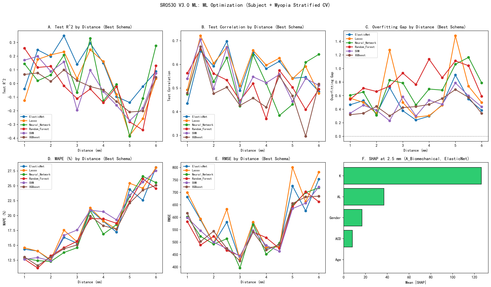
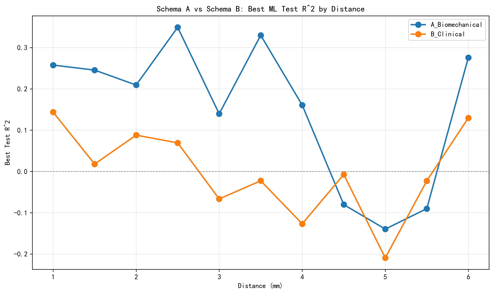
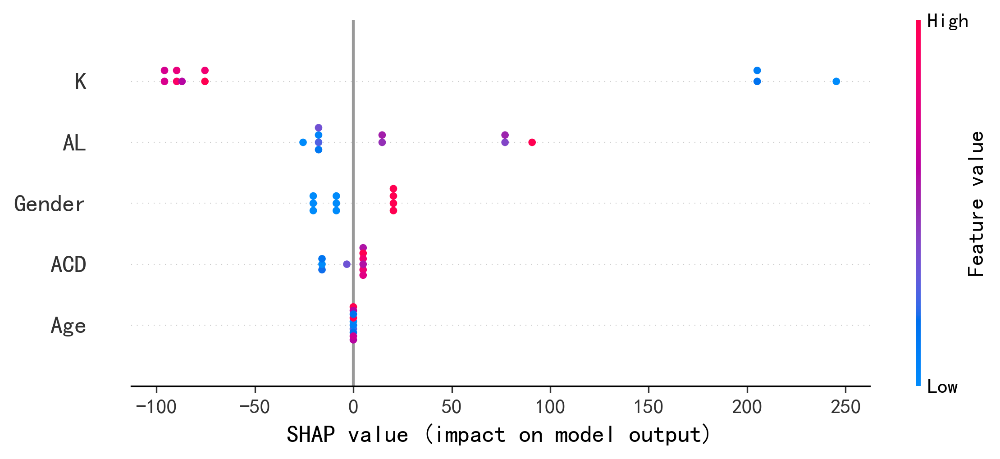

# SR0530 V3.0 任务二报告：ML 模型优化

> **目标**：在锁定 LMM 最佳偏心率后，建立基于常规眼科参数的视锥密度预测模型。
> **方法**：双模型策略 + Subject/近视分层 CV（训练集内强制 50:50 平衡）+ SVM/RF/XGB/NN/Lasso/ElasticNet + SHAP。
> **数据**：genData/CleanDataRoi/（44 个 ROI，聚合为 11 个距离组）。

---

## 一、VIF 共线性诊断

| 特征 | VIF |
|------|-----|
| AL | 184.25 |
| Age | 20.13 |
| SE | 2.22 |
| Gender | 1.82 |
| K | 229.06 |
| ACD | 45.34 |

*注：VIF > 10 提示存在严重多重共线性。

## 二、方案 A vs 方案 B

- **方案 A（生物力学主模型）**：`[AL, Age, Gender, ACD, K]`，剔除 SE。
- **方案 B（临床筛查辅助模型）**：`[SE, Age, Gender]`，剔除 AL/ACD/K。

| 距离 (mm) | 方案 | 最佳模型 | Test R² |
|-----------|------|----------|---------|
| 1.0 | A_Biomechanical | Random_Forest | 0.258 |
| 1.0 | B_Clinical | Neural_Network | 0.144 |
| 1.5 | A_Biomechanical | ElasticNet | 0.245 |
| 1.5 | B_Clinical | XGBoost | 0.018 |
| 2.0 | A_Biomechanical | Lasso | 0.209 |
| 2.0 | B_Clinical | SVM | 0.088 |
| 2.5 | A_Biomechanical | ElasticNet | 0.349 |
| 2.5 | B_Clinical | XGBoost | 0.069 |
| 3.0 | A_Biomechanical | ElasticNet | 0.140 |
| 3.0 | B_Clinical | Neural_Network | -0.067 |
| 3.5 | A_Biomechanical | Neural_Network | 0.330 |
| 3.5 | B_Clinical | XGBoost | -0.023 |
| 4.0 | A_Biomechanical | Lasso | 0.161 |
| 4.0 | B_Clinical | Neural_Network | -0.127 |
| 4.5 | A_Biomechanical | Lasso | -0.080 |
| 4.5 | B_Clinical | Neural_Network | -0.007 |
| 5.0 | A_Biomechanical | ElasticNet | -0.140 |
| 5.0 | B_Clinical | XGBoost | -0.209 |
| 5.5 | A_Biomechanical | ElasticNet | -0.090 |
| 5.5 | B_Clinical | ElasticNet | -0.023 |
| 6.0 | A_Biomechanical | Neural_Network | 0.276 |
| 6.0 | B_Clinical | Random_Forest | 0.130 |

## 三、全部模型结果

| 距离 (mm) | 方案 | 模型 | N_eyes | N_subj | Train R² | Test R² | Test Corr | MAPE(%) | RMSE | Gap |
|-----------|------|------|--------|--------|----------|---------|-----------|---------|------|-----|
| 1.0 | A_Biomechanical | SVM | 69 | 44 | 0.512 | 0.171 | 0.539 | 11.68 | 560.1 | 0.341 |
| 1.0 | A_Biomechanical | Random_Forest | 69 | 44 | 0.761 | 0.258 | 0.563 | 12.02 | 541.6 | 0.503 |
| 1.0 | A_Biomechanical | XGBoost | 69 | 44 | 0.384 | 0.065 | 0.479 | 13.01 | 616.2 | 0.319 |
| 1.0 | A_Biomechanical | Neural_Network | 69 | 44 | 0.653 | 0.048 | 0.449 | 12.83 | 601.2 | 0.604 |
| 1.0 | A_Biomechanical | Lasso | 69 | 44 | 0.436 | -0.125 | 0.492 | 12.88 | 631.1 | 0.562 |
| 1.0 | A_Biomechanical | ElasticNet | 69 | 44 | 0.426 | -0.040 | 0.435 | 12.49 | 617.8 | 0.466 |
| 1.0 | B_Clinical | SVM | 69 | 44 | 0.356 | 0.129 | 0.440 | 12.64 | 598.0 | 0.227 |
| 1.0 | B_Clinical | Random_Forest | 69 | 44 | 0.657 | 0.113 | 0.495 | 12.66 | 582.2 | 0.545 |
| 1.0 | B_Clinical | XGBoost | 69 | 44 | 0.326 | 0.066 | 0.423 | 12.83 | 613.6 | 0.260 |
| 1.0 | B_Clinical | Neural_Network | 69 | 44 | 0.548 | 0.144 | 0.474 | 12.52 | 588.1 | 0.404 |
| 1.0 | B_Clinical | Lasso | 69 | 44 | 0.100 | -0.205 | nan | 14.58 | 699.0 | 0.304 |
| 1.0 | B_Clinical | ElasticNet | 69 | 44 | 0.123 | -0.132 | 0.176 | 14.33 | 680.9 | 0.255 |
| 1.5 | A_Biomechanical | SVM | 66 | 43 | 0.545 | 0.199 | 0.705 | 10.18 | 446.2 | 0.346 |
| 1.5 | A_Biomechanical | Random_Forest | 66 | 43 | 0.763 | 0.117 | 0.664 | 9.88 | 455.6 | 0.645 |
| 1.5 | A_Biomechanical | XGBoost | 66 | 43 | 0.417 | 0.077 | 0.617 | 11.07 | 492.5 | 0.340 |
| 1.5 | A_Biomechanical | Neural_Network | 66 | 43 | 0.673 | 0.020 | 0.675 | 10.73 | 473.1 | 0.653 |
| 1.5 | A_Biomechanical | Lasso | 66 | 43 | 0.589 | 0.176 | 0.721 | 9.41 | 449.2 | 0.413 |
| 1.5 | A_Biomechanical | ElasticNet | 66 | 43 | 0.555 | 0.245 | 0.656 | 10.01 | 453.6 | 0.309 |
| 1.5 | B_Clinical | SVM | 66 | 43 | 0.288 | -0.170 | 0.473 | 12.94 | 545.7 | 0.459 |
| 1.5 | B_Clinical | Random_Forest | 66 | 43 | 0.644 | -0.065 | 0.626 | 11.18 | 488.0 | 0.709 |
| 1.5 | B_Clinical | XGBoost | 66 | 43 | 0.349 | 0.018 | 0.674 | 11.59 | 502.3 | 0.332 |
| 1.5 | B_Clinical | Neural_Network | 66 | 43 | 0.500 | -0.142 | 0.557 | 12.41 | 523.2 | 0.643 |
| 1.5 | B_Clinical | Lasso | 66 | 43 | 0.072 | -0.428 | nan | 14.03 | 593.4 | 0.500 |
| 1.5 | B_Clinical | ElasticNet | 66 | 43 | 0.106 | -0.420 | 0.178 | 14.03 | 589.9 | 0.526 |
| 2.0 | A_Biomechanical | SVM | 50 | 40 | 0.404 | 0.020 | 0.497 | 12.39 | 499.4 | 0.384 |
| 2.0 | A_Biomechanical | Random_Forest | 50 | 40 | 0.642 | 0.126 | 0.561 | 11.38 | 462.5 | 0.517 |
| 2.0 | A_Biomechanical | XGBoost | 50 | 40 | 0.363 | 0.015 | 0.476 | 11.73 | 505.8 | 0.348 |
| 2.0 | A_Biomechanical | Neural_Network | 50 | 40 | 0.309 | 0.062 | 0.527 | 12.28 | 491.9 | 0.247 |
| 2.0 | A_Biomechanical | Lasso | 50 | 40 | 0.548 | 0.209 | 0.605 | 10.60 | 448.1 | 0.338 |
| 2.0 | A_Biomechanical | ElasticNet | 50 | 40 | 0.527 | 0.197 | 0.592 | 10.71 | 455.3 | 0.330 |
| 2.0 | B_Clinical | SVM | 50 | 40 | 0.320 | 0.088 | 0.463 | 12.10 | 481.3 | 0.233 |
| 2.0 | B_Clinical | Random_Forest | 50 | 40 | 0.536 | -0.126 | 0.419 | 13.23 | 523.0 | 0.661 |
| 2.0 | B_Clinical | XGBoost | 50 | 40 | 0.304 | -0.137 | 0.257 | 13.05 | 543.8 | 0.441 |
| 2.0 | B_Clinical | Neural_Network | 50 | 40 | 0.366 | 0.056 | 0.499 | 12.08 | 491.0 | 0.310 |
| 2.0 | B_Clinical | Lasso | 50 | 40 | 0.333 | 0.049 | 0.514 | 12.57 | 495.7 | 0.284 |
| 2.0 | B_Clinical | ElasticNet | 50 | 40 | 0.323 | 0.057 | 0.521 | 12.42 | 494.2 | 0.266 |
| 2.5 | A_Biomechanical | SVM | 48 | 35 | 0.355 | 0.158 | 0.671 | 15.61 | 432.5 | 0.197 |
| 2.5 | A_Biomechanical | Random_Forest | 48 | 35 | 0.722 | -0.017 | 0.534 | 14.59 | 454.2 | 0.739 |
| 2.5 | A_Biomechanical | XGBoost | 48 | 35 | 0.401 | 0.099 | 0.503 | 14.35 | 465.2 | 0.301 |
| 2.5 | A_Biomechanical | Neural_Network | 48 | 35 | 0.620 | 0.208 | 0.628 | 13.56 | 426.2 | 0.412 |
| 2.5 | A_Biomechanical | Lasso | 48 | 35 | 0.622 | 0.231 | 0.673 | 12.83 | 410.3 | 0.390 |
| 2.5 | A_Biomechanical | ElasticNet | 48 | 35 | 0.599 | 0.349 | 0.697 | 11.65 | 381.2 | 0.250 |
| 2.5 | B_Clinical | SVM | 48 | 35 | 0.239 | 0.009 | 0.596 | 16.67 | 473.8 | 0.229 |
| 2.5 | B_Clinical | Random_Forest | 48 | 35 | 0.552 | -0.092 | 0.434 | 14.47 | 466.5 | 0.644 |
| 2.5 | B_Clinical | XGBoost | 48 | 35 | 0.310 | 0.069 | 0.442 | 14.42 | 474.6 | 0.241 |
| 2.5 | B_Clinical | Neural_Network | 48 | 35 | 0.528 | -0.300 | 0.404 | 13.78 | 513.4 | 0.828 |
| 2.5 | B_Clinical | Lasso | 48 | 35 | 0.125 | -1.148 | nan | 17.54 | 632.1 | 1.272 |
| 2.5 | B_Clinical | ElasticNet | 48 | 35 | 0.130 | -0.588 | nan | 16.34 | 580.2 | 0.717 |
| 3.0 | A_Biomechanical | SVM | 52 | 37 | 0.341 | -0.196 | 0.439 | 17.19 | 407.4 | 0.536 |
| 3.0 | A_Biomechanical | Random_Forest | 52 | 37 | 0.776 | -0.111 | 0.447 | 13.81 | 395.8 | 0.887 |
| 3.0 | A_Biomechanical | XGBoost | 52 | 37 | 0.400 | 0.021 | 0.426 | 14.23 | 394.6 | 0.379 |
| 3.0 | A_Biomechanical | Neural_Network | 52 | 37 | 0.644 | -0.142 | 0.423 | 13.31 | 383.1 | 0.786 |
| 3.0 | A_Biomechanical | Lasso | 52 | 37 | 0.536 | 0.036 | 0.509 | 11.44 | 346.7 | 0.499 |
| 3.0 | A_Biomechanical | ElasticNet | 52 | 37 | 0.517 | 0.140 | 0.489 | 11.68 | 337.2 | 0.377 |
| 3.0 | B_Clinical | SVM | 52 | 37 | 0.142 | -0.441 | 0.354 | 17.57 | 443.0 | 0.583 |
| 3.0 | B_Clinical | Random_Forest | 52 | 37 | 0.637 | -0.296 | 0.125 | 15.68 | 444.9 | 0.932 |
| 3.0 | B_Clinical | XGBoost | 52 | 37 | 0.274 | -0.150 | 0.149 | 15.06 | 423.9 | 0.424 |
| 3.0 | B_Clinical | Neural_Network | 52 | 37 | 0.389 | -0.067 | 0.366 | 14.59 | 395.9 | 0.455 |
| 3.0 | B_Clinical | Lasso | 52 | 37 | 0.073 | -0.182 | nan | 15.57 | 428.3 | 0.255 |
| 3.0 | B_Clinical | ElasticNet | 52 | 37 | 0.078 | -0.172 | nan | 15.34 | 428.7 | 0.250 |
| 3.5 | A_Biomechanical | SVM | 59 | 43 | 0.397 | 0.097 | 0.547 | 18.71 | 493.6 | 0.300 |
| 3.5 | A_Biomechanical | Random_Forest | 59 | 43 | 0.707 | -0.055 | 0.519 | 17.38 | 505.6 | 0.763 |
| 3.5 | A_Biomechanical | XGBoost | 59 | 43 | 0.395 | -0.044 | 0.457 | 18.83 | 534.6 | 0.438 |
| 3.5 | A_Biomechanical | Neural_Network | 59 | 43 | 0.627 | 0.330 | 0.640 | 15.30 | 422.9 | 0.297 |
| 3.5 | A_Biomechanical | Lasso | 59 | 43 | 0.530 | 0.247 | 0.659 | 14.97 | 445.9 | 0.284 |
| 3.5 | A_Biomechanical | ElasticNet | 59 | 43 | 0.497 | 0.294 | 0.650 | 15.61 | 435.7 | 0.202 |
| 3.5 | B_Clinical | SVM | 59 | 43 | 0.116 | -0.071 | 0.219 | 20.89 | 546.2 | 0.187 |
| 3.5 | B_Clinical | Random_Forest | 59 | 43 | 0.522 | -0.040 | 0.336 | 19.50 | 541.0 | 0.562 |
| 3.5 | B_Clinical | XGBoost | 59 | 43 | 0.210 | -0.023 | 0.322 | 19.90 | 540.7 | 0.232 |
| 3.5 | B_Clinical | Neural_Network | 59 | 43 | 0.326 | -0.136 | 0.126 | 20.81 | 570.1 | 0.462 |
| 3.5 | B_Clinical | Lasso | 59 | 43 | 0.070 | -0.188 | -0.094 | 21.29 | 580.1 | 0.258 |
| 3.5 | B_Clinical | ElasticNet | 59 | 43 | 0.069 | -0.170 | -0.080 | 20.97 | 577.4 | 0.240 |
| 4.0 | A_Biomechanical | SVM | 51 | 36 | 0.295 | -0.059 | 0.522 | 17.99 | 420.5 | 0.354 |
| 4.0 | A_Biomechanical | Random_Forest | 51 | 36 | 0.665 | -0.141 | 0.369 | 16.90 | 444.8 | 0.806 |
| 4.0 | A_Biomechanical | XGBoost | 51 | 36 | 0.351 | -0.048 | 0.419 | 17.15 | 441.3 | 0.399 |
| 4.0 | A_Biomechanical | Neural_Network | 51 | 36 | 0.484 | -0.213 | 0.519 | 15.21 | 430.1 | 0.697 |
| 4.0 | A_Biomechanical | Lasso | 51 | 36 | 0.411 | 0.161 | 0.597 | 13.50 | 380.3 | 0.250 |
| 4.0 | A_Biomechanical | ElasticNet | 51 | 36 | 0.410 | 0.149 | 0.582 | 13.92 | 382.1 | 0.261 |
| 4.0 | B_Clinical | SVM | 51 | 36 | 0.145 | -0.386 | 0.074 | 20.65 | 486.6 | 0.532 |
| 4.0 | B_Clinical | Random_Forest | 51 | 36 | 0.546 | -0.591 | 0.053 | 19.44 | 517.6 | 1.137 |
| 4.0 | B_Clinical | XGBoost | 51 | 36 | 0.262 | -0.208 | 0.068 | 18.28 | 468.3 | 0.470 |
| 4.0 | B_Clinical | Neural_Network | 51 | 36 | 0.326 | -0.127 | 0.299 | 16.88 | 451.0 | 0.453 |
| 4.0 | B_Clinical | Lasso | 51 | 36 | 0.047 | -0.258 | nan | 19.09 | 479.2 | 0.305 |
| 4.0 | B_Clinical | ElasticNet | 51 | 36 | 0.053 | -0.243 | nan | 19.03 | 475.8 | 0.296 |
| 4.5 | A_Biomechanical | SVM | 48 | 32 | 0.267 | -0.160 | 0.489 | 18.67 | 460.8 | 0.427 |
| 4.5 | A_Biomechanical | Random_Forest | 48 | 32 | 0.672 | -0.192 | 0.471 | 18.70 | 474.5 | 0.864 |
| 4.5 | A_Biomechanical | XGBoost | 48 | 32 | 0.354 | -0.203 | 0.303 | 17.71 | 490.3 | 0.557 |
| 4.5 | A_Biomechanical | Neural_Network | 48 | 32 | 0.337 | -0.344 | 0.384 | 18.48 | 495.3 | 0.681 |
| 4.5 | A_Biomechanical | Lasso | 48 | 32 | 0.378 | -0.080 | 0.627 | 17.00 | 463.9 | 0.459 |
| 4.5 | A_Biomechanical | ElasticNet | 48 | 32 | 0.370 | -0.097 | 0.613 | 17.07 | 472.7 | 0.467 |
| 4.5 | B_Clinical | SVM | 48 | 32 | 0.230 | -0.241 | 0.557 | 19.27 | 462.9 | 0.471 |
| 4.5 | B_Clinical | Random_Forest | 48 | 32 | 0.588 | -0.024 | 0.574 | 16.78 | 443.6 | 0.612 |
| 4.5 | B_Clinical | XGBoost | 48 | 32 | 0.294 | -0.132 | 0.551 | 17.57 | 482.3 | 0.426 |
| 4.5 | B_Clinical | Neural_Network | 48 | 32 | 0.334 | -0.007 | 0.312 | 16.34 | 441.8 | 0.342 |
| 4.5 | B_Clinical | Lasso | 48 | 32 | 0.153 | -0.130 | nan | 17.69 | 480.4 | 0.283 |
| 4.5 | B_Clinical | ElasticNet | 48 | 32 | 0.193 | -0.143 | 0.573 | 17.20 | 482.9 | 0.336 |
| 5.0 | A_Biomechanical | SVM | 44 | 32 | 0.514 | -0.273 | 0.443 | 22.84 | 608.5 | 0.787 |
| 5.0 | A_Biomechanical | Random_Forest | 44 | 32 | 0.694 | -0.418 | 0.503 | 22.31 | 642.3 | 1.112 |
| 5.0 | A_Biomechanical | XGBoost | 44 | 32 | 0.438 | -0.251 | 0.367 | 22.11 | 655.3 | 0.689 |
| 5.0 | A_Biomechanical | Neural_Network | 44 | 32 | 0.618 | -0.445 | 0.431 | 22.72 | 647.8 | 1.063 |
| 5.0 | A_Biomechanical | Lasso | 44 | 32 | 0.576 | -0.380 | 0.539 | 20.56 | 611.5 | 0.956 |
| 5.0 | A_Biomechanical | ElasticNet | 44 | 32 | 0.554 | -0.140 | 0.541 | 19.96 | 588.5 | 0.693 |
| 5.0 | B_Clinical | SVM | 44 | 32 | 0.369 | -0.313 | 0.351 | 23.42 | 634.5 | 0.682 |
| 5.0 | B_Clinical | Random_Forest | 44 | 32 | 0.584 | -0.281 | 0.450 | 22.18 | 628.5 | 0.865 |
| 5.0 | B_Clinical | XGBoost | 44 | 32 | 0.361 | -0.209 | 0.467 | 21.05 | 651.1 | 0.570 |
| 5.0 | B_Clinical | Neural_Network | 44 | 32 | 0.420 | -0.387 | 0.251 | 23.23 | 641.1 | 0.807 |
| 5.0 | B_Clinical | Lasso | 44 | 32 | 0.172 | -1.311 | 0.142 | 25.42 | 800.1 | 1.483 |
| 5.0 | B_Clinical | ElasticNet | 44 | 32 | 0.211 | -0.693 | 0.187 | 24.38 | 725.4 | 0.904 |
| 5.5 | A_Biomechanical | SVM | 41 | 31 | 0.367 | -0.231 | 0.500 | 25.52 | 656.6 | 0.598 |
| 5.5 | A_Biomechanical | Random_Forest | 41 | 31 | 0.560 | -0.482 | 0.392 | 26.17 | 702.2 | 1.042 |
| 5.5 | A_Biomechanical | XGBoost | 41 | 31 | 0.336 | -0.238 | 0.296 | 24.27 | 681.6 | 0.574 |
| 5.5 | A_Biomechanical | Neural_Network | 41 | 31 | 0.580 | -0.584 | 0.522 | 26.58 | 698.8 | 1.164 |
| 5.5 | A_Biomechanical | Lasso | 41 | 31 | 0.480 | -0.258 | 0.490 | 23.41 | 648.3 | 0.739 |
| 5.5 | A_Biomechanical | ElasticNet | 41 | 31 | 0.459 | -0.090 | 0.493 | 22.58 | 623.8 | 0.549 |
| 5.5 | B_Clinical | SVM | 41 | 31 | 0.270 | -0.180 | 0.540 | 25.64 | 652.0 | 0.450 |
| 5.5 | B_Clinical | Random_Forest | 41 | 31 | 0.464 | -0.341 | 0.408 | 24.06 | 682.3 | 0.805 |
| 5.5 | B_Clinical | XGBoost | 41 | 31 | 0.285 | -0.201 | nan | 23.94 | 674.7 | 0.486 |
| 5.5 | B_Clinical | Neural_Network | 41 | 31 | 0.307 | -0.110 | 0.609 | 23.48 | 643.3 | 0.417 |
| 5.5 | B_Clinical | Lasso | 41 | 31 | 0.398 | -0.317 | 0.591 | 24.59 | 661.7 | 0.715 |
| 5.5 | B_Clinical | ElasticNet | 41 | 31 | 0.313 | -0.023 | 0.546 | 22.17 | 625.5 | 0.336 |
| 6.0 | A_Biomechanical | SVM | 39 | 32 | 0.509 | 0.074 | 0.511 | 25.73 | 663.4 | 0.434 |
| 6.0 | A_Biomechanical | Random_Forest | 39 | 32 | 0.653 | 0.064 | 0.487 | 24.54 | 662.1 | 0.589 |
| 6.0 | A_Biomechanical | XGBoost | 39 | 32 | 0.384 | 0.045 | 0.517 | 23.35 | 677.6 | 0.339 |
| 6.0 | A_Biomechanical | Neural_Network | 39 | 32 | 0.555 | 0.276 | 0.642 | 23.99 | 580.4 | 0.280 |
| 6.0 | A_Biomechanical | Lasso | 39 | 32 | 0.491 | 0.035 | 0.477 | 23.80 | 672.4 | 0.456 |
| 6.0 | A_Biomechanical | ElasticNet | 39 | 32 | 0.471 | 0.088 | 0.485 | 22.84 | 660.7 | 0.383 |
| 6.0 | B_Clinical | SVM | 39 | 32 | 0.268 | -0.127 | 0.284 | 27.53 | 721.4 | 0.395 |
| 6.0 | B_Clinical | Random_Forest | 39 | 32 | 0.587 | 0.130 | 0.495 | 24.02 | 633.6 | 0.458 |
| 6.0 | B_Clinical | XGBoost | 39 | 32 | 0.324 | 0.030 | 0.471 | 25.08 | 684.5 | 0.294 |
| 6.0 | B_Clinical | Neural_Network | 39 | 32 | 0.464 | -0.323 | 0.424 | 25.54 | 718.3 | 0.788 |
| 6.0 | B_Clinical | Lasso | 39 | 32 | 0.149 | -0.349 | nan | 28.07 | 781.1 | 0.498 |
| 6.0 | B_Clinical | ElasticNet | 39 | 32 | 0.150 | -0.204 | 0.335 | 28.09 | 752.8 | 0.354 |

**总体最佳配置**：距离 **2.5 mm**，方案 **A_Biomechanical**，模型 **ElasticNet**。

## 四、SHAP 可解释性分析

对总体最佳配置（A_Biomechanical，2.5 mm）进行 SHAP 分析：

| 特征 | Mean |SHAP| |
|------|-------------|
| K | 126.444 |
| AL | 37.027 |
| Gender | 16.841 |
| ACD | 8.089 |
| Age | 0.000 |

## 五、讨论

1. **训练集内强制 50:50 类别平衡**：对少数类进行过采样，严格符合 V3.0 方案要求。
2. **分层 CV 降低信息泄漏**：按真实 Subject 分层避免双眼同时出现在训练/测试集。
3. **小样本下 Lasso/ElasticNet 是重要基线**：线性正则化模型可作为树模型的保守对比。
4. **XGBoost/RF 已做复杂度压制**：`max_depth=2–3`，强 L1/L2 正则化，降低过拟合风险。
5. **SHAP 揭示关键驱动特征**：K、AL、Gender 等是主要预测因子。

## 六、可视化

---

*Report generated automatically by SR_ML_V3.0.py*
