# SR0705_A_FIG_Report 组合图表报告

> **数据**：lenient 数据集（71 eyes / 46 subjects）
> **生成日期**：2026-07-05

---

## 一、眼轴长度与角密度/线密度关系

### 1.1 偏心率 1.0°

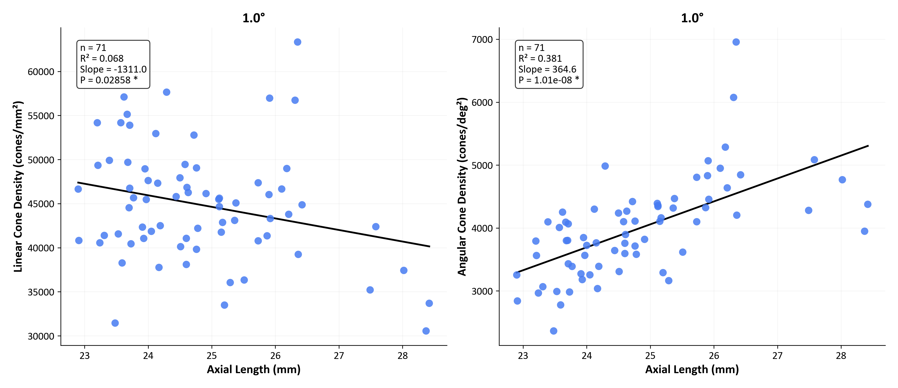

左图：Linear cone density (cones/mm²) vs Axial Length (mm)
右图：Angular cone density (cones/deg²) vs Axial Length (mm)
含回归线、R²、Slope、P 值。

[下载 PDF](FIG/FIGA/FIGA_1.0deg.pdf)

### 1.2 偏心率 1.5°–6.0°

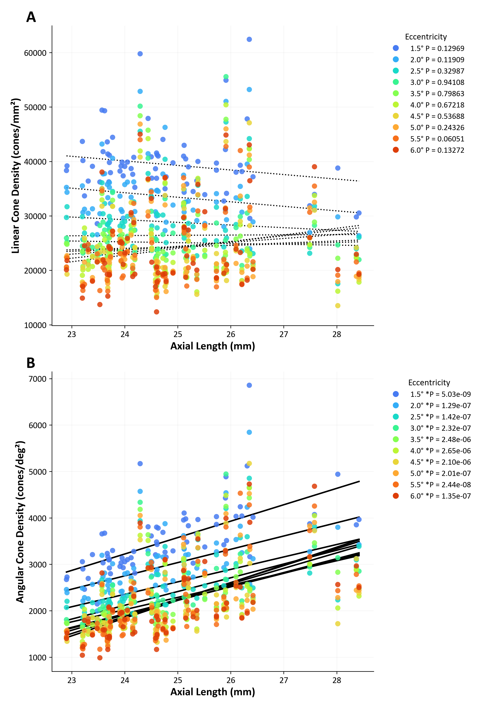

子图 A：Linear cone density vs Axial Length — 各偏心率叠加
子图 B：Angular cone density vs Axial Length — 各偏心率叠加
图例以颜色区分偏心率，标注回归方程。

[下载 PDF](FIG/FIGA/FIGA_1.5-6.0deg.pdf)

---

## 二、等效球镜与眼轴长度关系 + GEE 多因素回归

### 2.1 SER vs AL 散点图

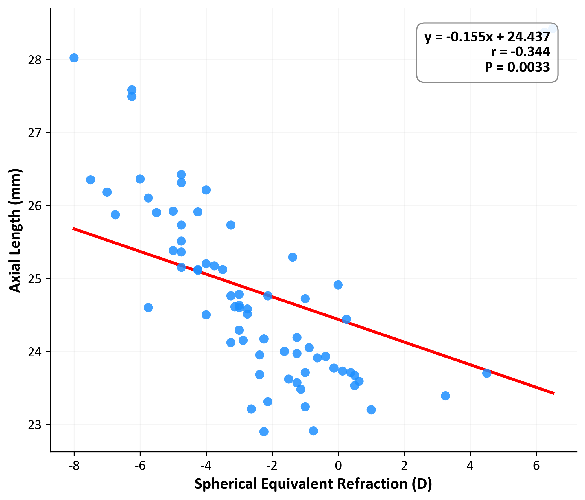

Spherical Equivalent Refraction (D) vs Axial Length (mm)，含线性回归方程、Pearson r、P 值。

[下载 PDF](FIG/FIGB/FIGB1.pdf)

### 2.2 GEE 多因素回归森林图（1.0°）

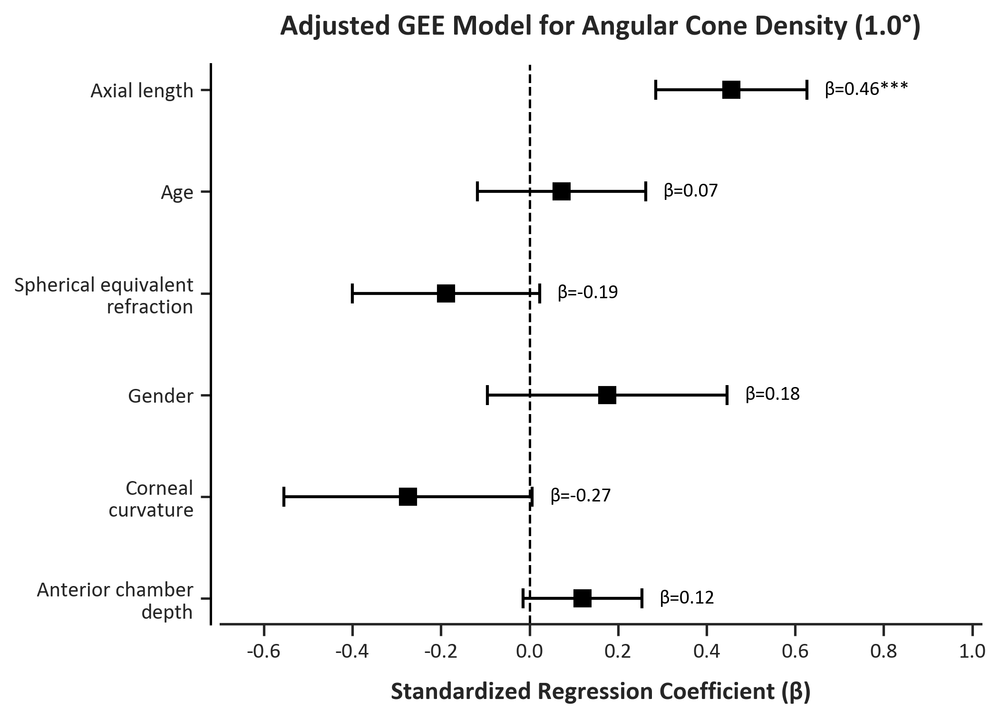

标准化 β 系数 ± 95% CI，基于 GEE（Exchangeable 相关结构，Subject 聚类）。各预测变量对 1.0° 角密度的独立贡献。

[下载 PDF](FIG/FIGB/FIGB2.pdf)

---

## 三、LMM 残差诊断

### 3.1 各偏心率 LMM 残差 Q-Q 图

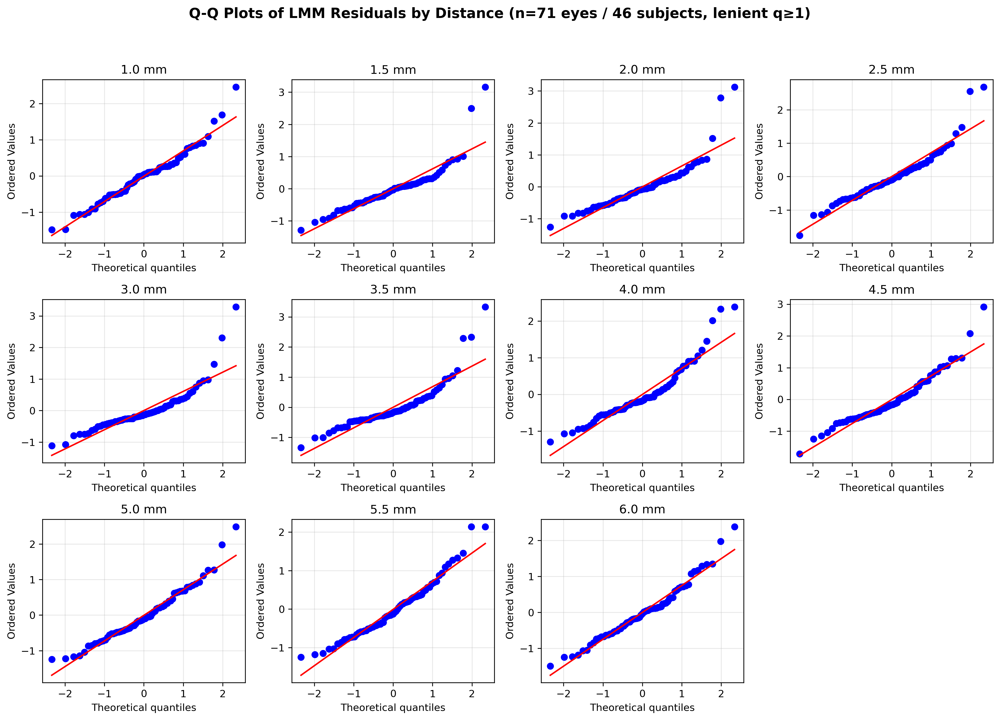

每个偏心率独立拟合 LMM（Subject 随机截距 + Eye 固定效应），标准化残差的 Q-Q 图。n=71 eyes / 46 subjects，lenient q1plus。

[下载 PDF](FIG/SR0628_C/SR0628_C_lenient_q1_LMM_Residual_QQPlots.pdf)

---

## 四、机器学习预测性能

### 4.1 5-fold CV 性能（C1_Combined_ALK）

| 偏心率 | 最佳模型 | R^2 | RMSE | MSE |
|--------|----------|-----|------|-----|
| 1.5 deg | Lasso | 0.611 | 446.6 | 199,452 |
| 5.0 deg | Neural Network | 0.370 | 587.5 | 345,156 |
| 5.5 deg | Neural Network | 0.363 | 651.2 | 424,061 |

> 5-fold GroupKFold by Subject，Myopia 分层。全部模型非负。

### 4.2 10-fold CV 性能（C1_Combined_ALK）

| 偏心率 | 最佳模型 | R^2 | RMSE | MSE |
|--------|----------|-----|------|-----|
| 1.5 deg | Robust Linear | 0.504 | 458.0 | 209,764 |
| 5.0 deg | SVM | 0.039 | 635.1 | 403,352 |
| 5.5 deg | SVM | 0.145 | 624.5 | 390,000 |

> 10-fold GroupKFold by Subject，Myopia 分层。5.0/5.5 deg 处除 SVM 外均为负值，预测能力有限。

### 4.3 最佳模型 @ 1.5 deg 诊断图

**5-fold Lasso（R^2=0.611）**

| Observed vs Predicted | SHAP | Residual Q-Q |
|:---:|:---:|:---:|
| 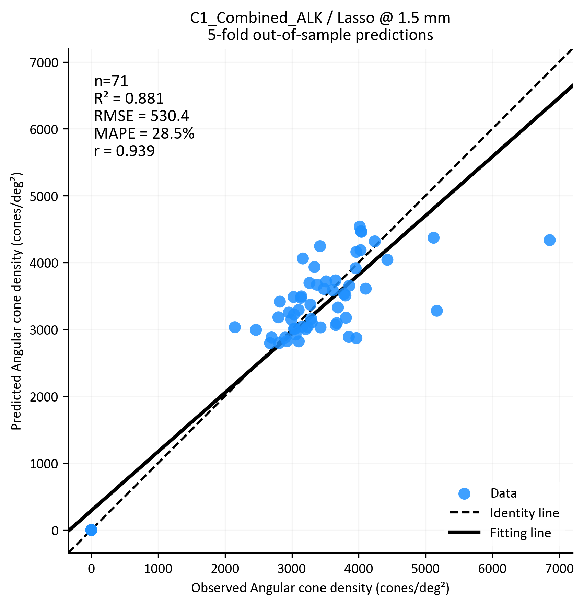 | 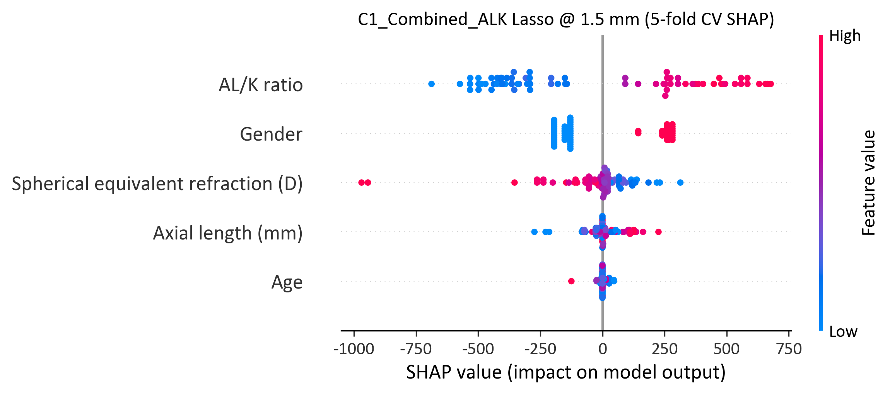 | 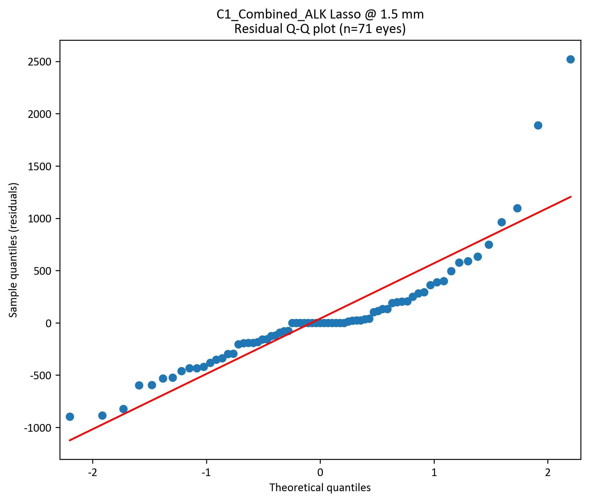 |
| [PDF](FIG/SR0628_D/SR0628_D_Scatter_Lasso_C1_Combined_ALK_1.5mm.pdf) | [PDF](FIG/SR0628_D/SR0628_D_SHAP_Lasso_C1_Combined_ALK_1.5mm.pdf) | [PDF](FIG/SR0628_D/SR0628_D_QQ_Residuals_Lasso_C1_Combined_ALK_1.5mm.pdf) |

**10-fold Robust Linear Regression（R^2=0.504）**

| Observed vs Predicted | SHAP | Residual Q-Q |
|:---:|:---:|:---:|
| 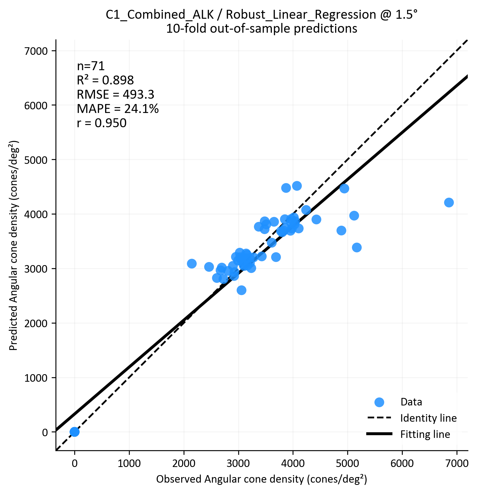 | 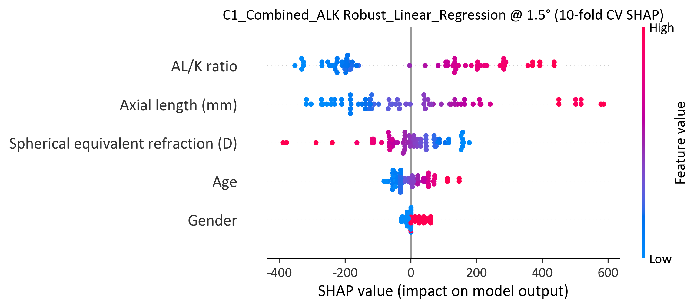 | 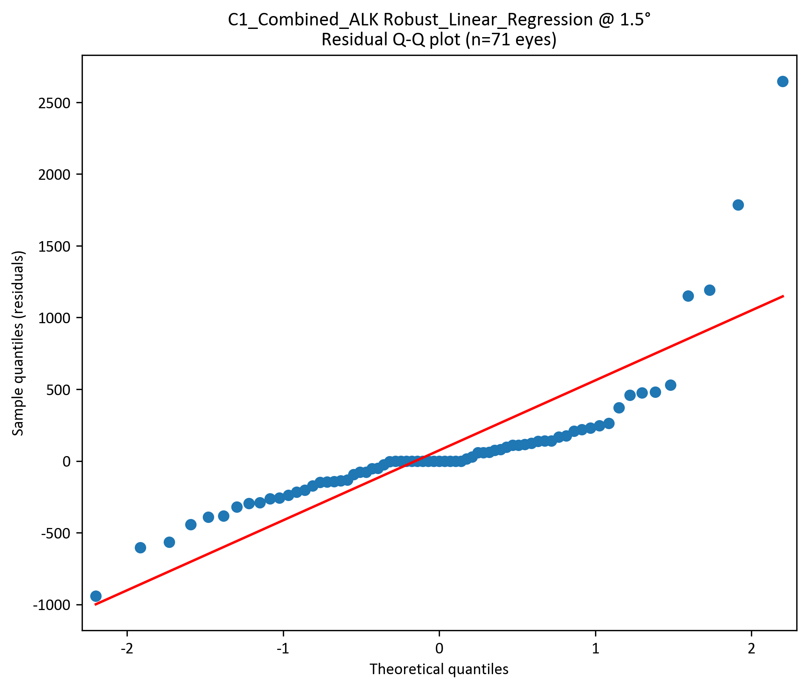 |
| [PDF](FIG/SR0628_B/SR0628_B_Scatter_Robust_Linear_Regression_C1_Combined_ALK_1.5mm.pdf) | [PDF](FIG/SR0628_B/SR0628_B_SHAP_Robust_Linear_Regression_C1_Combined_ALK_1.5mm.pdf) | [PDF](FIG/SR0628_B/SR0628_B_QQ_Residuals_Robust_Linear_Regression_C1_Combined_ALK_1.5mm.pdf) |

---

*Generated: 2026-07-05 | SR0705_A*
